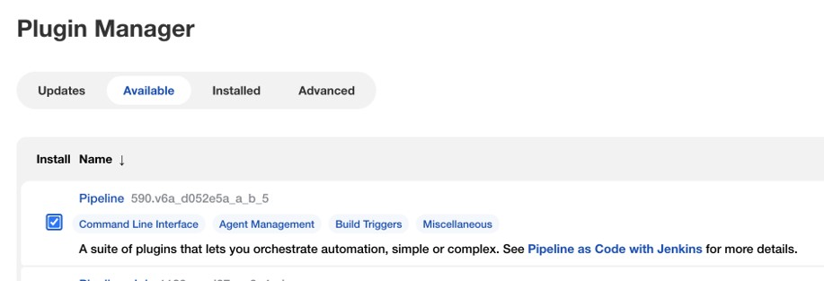
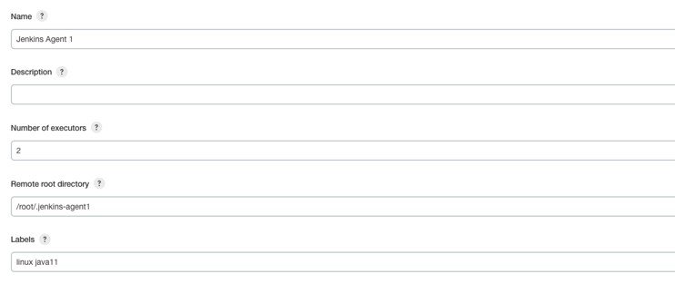

# Jenkins Pipeline

## Sebelum Belajar

- Jenkins Dasar

## Agenda

- Pengenalan Jenkins Pipeline
- Membuat Pipeline
- Stages
- Agent
- Steps
- Plugin
- Multi Branch
- Dan lain-lain

## #1 Pengenalan Jenkins Pipeline

- Jenkins Pipeline merupakan plugin yang mendukung implementasi pembuatan continuous delivery pipeline di Jenkins
- Continuous delivery pipeline adalah perintah-perintah yang dibuat agar software yang kita buat bisa di deliver ke pengguna, dari mulai version control sampai deployment
- Pipeline menyediakan peralatan untuk mempermudah prose tersebut, dari yang paling sederhana sampai yang kompleks, menggunakan sintaks DSL (Domain Specific Language)
- Jenkins Pipeline menggunakan bahasa pemrograman Groovy sebagai DSL nya, namun jangan khawatir, karena penggunaannya sangat mudah

### Kenapa Pipeline?

- Karena pipeline dibuat menggunakan kode, maka kita bisa dengan mudah mengubah atau me-review tahapan pipeline
- Karena pipeline biasanya dibuat dalam file dan disimpan di projectnya, maka kita tidak perlu takut hilang ketika terjadi restart atau kerusakan di Jenkins nya
- Kita bisa memasukkan logic yang sederhana sampai kompleks di Pipeline, seperti pengecekan kondisi, perulangan, dan lain-lain

## #2 Menginstall Pipeline Plugin

- Saat kita menginstall Jenkins, secara default tidak terdapat Jenkins Pipeline
- Kita perlu menginstall Plugin Pipeline terlebih dahulu
- <https://plugins.jenkins.io/workflow-aggregator/>

### Gambar: Menginstall Pipeline Plugin



## #3 Pipeline Concept

- Sebelum kita membuat Pipeline, ada konsep-konsep yang perlu di mengerti terlebih dahulu
- Jenkins Pipeline memiliki beberapa konsep yang perlu kita mengerti, agar tidak bingung ketika nanti kita menggunakan Jenkins Pipeline

### Pipeline

- Pipeline adalah definisi kode continuous delivery.
- Sebuah pipeline berisikan seluruh instruksi kode perintah untuk proses continuous delivery, misal seperti compile, testing, deploy, dan lain-lain
- Kode Pipeline menggunakan kata kunci `pipeline`

### Agent

- Agent adalah machine/server bagian dari Jenkins yang digunakan untuk mengeksekusi pipeline
- Kode penentuan Agent menggunakan kata kunci `agent`
- Agent disebutkan di dalam kode pipeline yang kita buat

### Stage

- Stage adalah blok definisi tugas atau tahapan dalam pipeline, misalnya “Build”, “Test”, “Deploy”, dan lain-lain
- Stage biasanya ditampilkan di Jenkins seperti tahapan progress dari pipeline
- Biasanya dalam pipeline, akan terdapat banyak Stage
- Stage menggunakan kata kunci `stage`

### Step

- Step adalah sebuah intruksi atau perintah
- Step pada dasarnya adalah perintah atau instruksi apa yang harus dilakukan oleh Jenkins
- Sebelumnya pada materi Jenkins Dasar, kita pernah membuat step seperti perintah untuk melakukan kompilasi project, menjalankan unit test, dan lain-lain
- Step dilakukan di dalam Stage
- Step menggunakan kata kunci `steps`

### Contoh Pipeline


## #4 Pipeline Job

### Membuat Pipeline Job


### Kode: Pipeline


## #5 Jenkinsfile

- Walaupun kita bisa membuat kode Pipeline di Jenkins Job, tapi pada kenyataannya biasanya kita akan membuat kode pipeline di file Jenkinsfile
- File Jenkinsfile tersebut biasanya disimpan di repository project kita

### Contoh Project

- <https://github.com/ProgrammerZamanNow/belajar-spring-dasar>
- Silahkan clone project tersebut

### Kode: Jenkinsfile

```Jenkinsfile
pipeline {
	agent any

	stages {
		stage('Hello') {
			steps {
				echo 'Hello World'
			}
		}
	}
}
```

### Jenkins Pipeline Job


## #6 Agent

- Agent merupakan bagian yang digunakan untuk menentukan dimana pipeline ini dijalankan
- Saat kita menggunakan nilai any, artinya pipeline ini akan boleh dijalankan di agent manapun

### Agent Value

- Agent mendukung beberapa value :
- `any`, artinya pipeline akan di eksekusi di agent manapun, termasuk master
- `none`, artinya pipeline tidak akan dieksekusi di agent manapun
- `label`, artinya pipeline hanya akan dijalankan di agent yang memiliki label yang sudah ditentukan
- `node`, sama seperti label, hanya kita bisa mengubah workspace lokasi folder secara custom
- `docker`, artinya pipeline dijalankan di docker container
- `dockerfile`, sama seperti docker, namun image container dibuat dari dockerfile
- `kubernetes`, artinya pipeline dijalankan di kubernetes cluster

### Label

- Kadang ada kasus dimana kita ingin menjalankan pipeline hanya pada agent tertentu
- Misal, kita memiliki Jenkins Agent dengan sistem operasi Fedora atau Windows misalnya, dan kita ingin Pipeline ini dijalankan pada Agent tersebut
- Maka kita bisa mengubah nilai dari agent menjadi label atau node yang kita inginkan

### Menambahkan Label di Agent



### Kode: Jenkinsfile

```Jenkisfile
pipeline {
	agent {
		node {
			label "Luux && java11"
		}
	}
}
```

## #7 Post

- Post merupakan bagian yang digunakan untuk menambah steps di akhir ketika sebuah kondisi pipeline terpenuhi
- Contoh setelah selesai pipeline dibuat, kita ingin mengirim pesan ke Slack / Email misalnya
- Atau jika terjadi error di pipeline, kita ingin mengirim notifikasi ke Slack misalnya
- Dan lain-lain

### Condition

- Ada banyak sekali kondisi di Post yang bisa kita gunakan
- `always`, artinya kondisi apapun, akan selalu dilakukan
- `changed`, jika status pipeline berubah dari sebelumnya, misal sebelumnya error, sekarang sukses
- `fixed`, jika status pipeline berubah dari sebelumnya error, menjadi sukses
- `regression`, jika status pipeline sebelumnya sukses, lalu menjadi tidak sukses
- `aborted`, jika pipeline dibatalkan secara manual
- `failure`, jika status pipeline error
- `success`, jika status pipeline sukses
- `cleanup`, selalu dijalankan, namun setelah kondisi post lainnya

### Kode: Post

```Jenkinsfile
post {
	always {
		echo "I will always say Hello again!"
	}
	success {
		echo "Yay, success!"
	}
	failure {
		echo "Oh no, failure!"
	}
	cleanup {
		echo "Don't care success or errror"
	}
}
```

## #8 Stages

- Stages adalah bagian dimana terdapat satu atau lebih Stage
- Stage biasanya berisikan detail dari tahapan dalam continuous delivery yang kita buat di pipeline
- Tidak ada aturan cara penamaan Stage, sehingga kita bisa buat sesuka kita
- Contoh yang Stage yang biasa dibuat contohnya Build, Test, Deploy, dan lain-lain
- Stage akan dijalankan secara sequential berurut, jika pada sebuah Stage terdapat error, maka Stage selanjutnya tidak akan dieksekusi

### Kode: Stage

```Jenkinsfile
stages {
	stage('Build') {
		steps {
			echo 'Build'
		}
	}
	stage('Test') {
		steps {
			echo 'Test'
		}
	}
	stage('Deploy') {
		steps {
			echo 'Deploy'
		}
	}
}
```

### Pipeline Stage View

- Kadang ada kalanya kita ingin melihat proses build di tiap stage secara visual
- Kita bisa menginstall Pipeline Stage View plugin

### Menginstall Pipeline Stage View Plugin


### Tampilan Stage View


## #9 Steps

- Steps berisikan instruksi-instruksi yang kita lakukan pada pipeline

### Kode: Step

```Jenkinsfile
stages {
	stage('Build') {
		steps {
			echo 'Build 1'
			echo 'Build 2'
			echo 'Build 3'
		}
	}
	stage('Test') {
		steps {
			echo 'Test'
		}
	}
}
```

## #10 Basic Steps

- Saat kita menginstall Pipeline Plugin, secara default otomatis menginstall Pipeline Basic Steps plugin, yang mengandung perintah atau instruksi step yang bisa kita gunakan
- <https://plugins.jenkins.io/workflow-basic-steps/>
- Sebelumnya kita sudah menggunakan perintah echo untuk menampilkan tulisan
  Masih banyak perintah lainnya, kita bisa melihat daftar perintah yang tersedia pada link dibawah
- <https://www.jenkins.io/doc/pipeline/steps/workflow-basic-steps/>

### Kode: Basic Steps

```Jenkinsfile
stages {
	stage('Build') {
		steps {
			echo('Start Build')
			sleep(10)
			echo('Finish Build')
		}
	}
}
```

## #11 Node dan Process Steps

- Salah satu steps yang sering digunakan adalah Node and Process Steps
- <https://plugins.jenkins.io/workflow-durable-task-step/>
- Saat kita menginstall Jenkins Pipeline, biasanya secara default sudah plugin ini pun ikut terinstall
- Plugin ini biasanya digunakan untuk menjalankan atau mengeksekusi perintah terminal, misal shell script (unix) atau command script (windows)
- <https://www.jenkins.io/doc/pipeline/steps/workflow-durable-task-step/>

### Kode: Node and Process Steps

```Jenkinsfile
stages {
	stage('Build') {
		steps {
			echo("Start Build")
			sh(".mvnw clean compile test-compile")
			echo("Finish Build")
		}
	}
	stage('Test') {
		steps {
			echo("Start Test")
			sh*"./mvnw test"
			echo("Finish Test")
		}
	}
}
```

## #12 Script

- Kadang, ada kalanya kita butuh membuat pipeline yang sangat flexible
- Pipeline mendukung script, dimana dengan script, kita bisa menyisipkan kode Groovy pada pipeline tersebut
- Secara default, jika kita menggunakan kode Groovy di dalam steps, maka akan terjadi error
- Kita harus tambahkan tag script untuk menandai bahwa bagian ini ada kode Groovy
- <https://groovy-lang.org/>

### Rekomendasi

- Pelajari dasar-dasar pemrograman Groovy
- Pelajari tipe data, operator dan function/method
- Tidak harus sampai belajar Pemrograman Berorientasi Object

### Kode: Script

```Jenkinsfile
stages {
	stage('Build') {
		steps {
			script {
				for (int i = 0; i < 10; i++) {
					echo("Script ${i}")
				}
			}
			echo("Start Build")
			sh(".mvnw clean compile test-compile")
			echo("Finish Build")
		}
	}
}
```

## #13 Utility Steps

- Utility Steps adalah plugin yang berisikan utility yang bisa kita gunakan mempermudah pembuatan pipeline, contoh: membaca file, membuat archive file, membuat hash, dan lain-lain
- <https://plugins.jenkins.io/pipeline-utility-steps/>
- Biasanya secara default, plugin ini tidak tersedia di Jenkins, jadi kita harus install secara manual
- <https://www.jenkins.io/doc/pipeline/steps/pipeline-utility-steps/>

### Other Steps

- Selain Basic Steps, Node and Process Steps, dan Utility Steps. Masih banyak Steps yang lain yang bisa kita gunakan.
- Sudah banyak plugin yang tersedia yang bisa kita gunakan untuk mempermudah pembuatan pipeline
- <https://www.jenkins.io/doc/pipeline/steps/>

## #14 Agent per Stage

- Sebelumnya kita sudah menggunakan Agent untuk menentukan tempat menjalankan pipeline
- Saat kita menggunakan Agent, secara otomatis semua Stage akan jalan di Agent tersebut
- Tapi kadang ada kalanya kita ingin menjalankan Stage di agent yang berbeda
- Contoh kasus misal pada Stage Pertama kita butuh Agent Java, selanjutnya pada Agent Kedua kita butuh Agent GoLang, dan lain-lain
- Pada kasus ini, kita bisa jadikan Agent di pipeline menjadi none, lalu tambahkan Agent di tiap Stage

### Kode: Agent per Stage

```Jenkinsfile
pipeline {
	agent none

	stages {
		stage('Build') {
			agent {
				node {
					label "linux && java11"
				}
			}
			steps {
				script {

				}
			}
		}
	}
}
```

## #15 Global Variable

- Saat kita membuat Job secara manual di materi Jenkins Dasar, kita bisa mendapatkan global environment variable seperti JOB_NAME, BUILD_NUMBER, dan lain-lain
- Di Pipeline juga kita melakukan hal tersebut, namun karena di Pipeline menggunakan kode Groovy, maka untuk mendapatkan informasinya pun kita menggunakan global variable yang secara otomatis bisa diakses di groovy
- Kita bisa melihat detailnya di `JENKINS_URL/job/JOB_NAME/pipeline-syntax/globals`

### Variable env

- env bisa kita gunakan untuk mendapatkan informasi global dari Jenkins
- currentBuild bisa kita gunakan untuk mendapatkan informasi tentang proses build job yang sedang berjalan

### Kode: Global Variable

```Jenkinsfile
stages {
	stage('Prepare') {
		agent {
			node {
				label "linux && java11"
			}
		}
		steps {
			echo("Start Job : ${env.JOB_NAME}")
			echo("Start Build : ${env.BUILD_NUMBER}")
			echo("Branch Name : ${env.BRANCH_NAME}")
		}
	}
}
```

## #16 Environment

- Pipeline juga mendukung penambahan environment variable
- Jika environment variable ditambahkan di pipeline, maka semua stages bisa mendapatkan nilainya
- Jika environment variable ditambahkan di stage, maka hanya bisa didapatkan di stage tersebut

### Kode: Environment

```Jenkinsfile
agent none
environment {
	AUTHOR = "Eko Kurniawan Khannedy"
}

stages {
	stege("Prepare") {
		agent {
			node {
				label "linux && java11"
			}
		}
		steps {
			echo("Author: ${AUTHOR}")
			echo("Start Job: ${env.JOB_NAME}")
		}
	}
}
```

### Credentials

- Di Environment, terdapat perintah khusus bernama `credentials()`, yang bisa digunakan untuk mengambil data dari Jenkins Credentials
- Hal ini lebih aman, dibanding harus diketik manual di Jenkinsfile
- Tidak semua jenis Credentials didukung, hanya beberapa saja yang bisa digunakan menggunakan perintah `credentials()`

### Credentials Type

- Secret Text, secara otomatis environment variable berisi value dari secret text
- Secret File, secara otomatis environment variable berisi lokasi file secret yang secara temporary dibuat dan dihapus otomatis setelah pipeline selesai
- Username and Password, secara otomatis environment variable berisi data `username:password`, dan secara otomatis akan dibuatkan environment variable dengan nama `NAMA_USR` dan `NAMA_PSW`
- SSH with Private Key, secara otomatis environment variable berisi lokasi file SSH yang secara temporary dibuat dan dihapus otomatis. Dan juga secara otomatis akan dibuatkan environment variable `NAMA_USR` dan `NAMA_PSW` (berisi passphrase SSH)

### Menambah Credential


### Kode: Environment Credentials

```Jenkinsfile
stages {
	stage('Prepare') {
		environment {
			APP = credentials('eko_rahasia')
		}
		agent {
			node {
				label 'linux && java11'
			}
		}
		steps {
			echo("Author: ${AUTHOR}")
			echo("App User: ${APP_USR}")
			echo("App Password: ${APP_PSW}")
			echo("Start Job: ${env.JOB_NAME}")
		}
	}
}
```

### Sensitive Information

- Perintah `${KEY}` didalam `""` adalah Groovy String Interpolation, dan itu seharusnya tidak digunakan untuk data sensitive, misal credentials
- Agar informasi sensitive tidak terlihat, gunakan tanda `''` (petik satu), dan gunakan `$KEY`

### Kode: Environment Credentials

```Jenkinsfile
stages {
	stage('Prepare') {
		environment {
			APP = credentials('eko_rahasia')
		}
		agent {
			node {
				label 'linux && java11'
			}
		}
		steps {
			echo("Author: ${AUTHOR}")
			echo("App User: ${APP_USR}")
			sh('echo "App Password: $APP_PSW > "rahasia.txt"')
			echo("Start Job: ${env.JOB_NAME}")
		}
	}
}
```

## #17 Option

- Pipeline memiliki perintah option yang digunakan untuk pengaturan pipeline, ada di level pipeline atau di level stage (seperti environment)
- Ada banyak sekali option yang bisa kita atur
- <https://www.jenkins.io/doc/book/pipeline/syntax/#options>

### Kode: Option

```Jenkinsfile
pipeline {
	agent none
	environment {
		AUTHOR = 'Eko Kurniawan Khannedy'
	}
	options {
		disableConcurrentBuilds()
		timeout(time: 10, unit: 'SECONDS')
	}

	stages {

	}
}
```

## #18 Parameter

- Saat belajar Jenkins Dasar, kita bisa menambahkan Parameter pada Job yang kita buat
- Di Pipeline juga kita bisa menambah parameter, dengan cara menggunakan perintah `parameters`
- Parameter yang diinputkan oleh user akan secara otomatis disimpan dalam global variable

### Parameter Type

- Ada banyak tipe parameter yang bisa kita gunakan, yaitu
- `string`, untuk tipe parameter string / text
- `text`, mirip seperti string, namun input akan berupa multiline text area
- `booleanParam`, untuk tipe parameter boolean (true/false)
- `choice`, untuk tipe parameter string / text dengan opsi pilihan yang sudah disediakan
- `password`, untuk tipe parameter string yang dianggap sensitif

### Kode: Parameter

```Jenkinsfile
piepline {
	agent none
	environment {
		AUTHOR = "Eko Kurniawan Khannedy"
	}
	parameters {
		string(name: 'NAME', defaultValue: 'Guest', description: 'What is your name?')
		text(name: 'DESCRIPTION', defaultValue: '', description: 'Tell me about you')
		booleanParam(name: 'DEPLOY', defaultValue: false, description: 'Need to deploy?')
		choice(name: 'SOCIAL_MEDIA', defaultValue: ['Instagram', 'Facebook'], description: 'Which social media you're using?)
		password(name: 'SECRET', defaultValue: '', description: 'Encrypt key')
	}
}
```

### Kode: Parameter Variable

```Jenkinsfile
stages {
	stage('Parameter') {
		agent {
			node {
				label 'linux && java11'
			}
		}
		steps {
			echo "Hello ${params.NAME}"
			echo "Description: ${params.DESCRIPTION}"
			echo "Deploy: ${params.DEPLOY}"
			echo "Social Media: ${params.SOCIAL_MEDIA}"
			echo "Secret: ${params.SECRET}"
		}
	}
}
```

## #19 Trigger

- Triggers adalah perintah yang digunakan untuk melakukan run job secara otomatis

### Trigger Type

- Ada beberapa tipe trigger yang bisa digunakan
- `cron`, digunakan untuk menjalankan job secara otomatis berdasarkan ekspresi cron yang sudah ditetapkan
- `pollSCM`, menggunakan ekpresi cron yang secara otomatis mengecek perubahan di SCM. Jika terjadi perubahan, maka secara otomatis job akan berjalan
- `upstream`, digunakan untuk menjalankan job, setelah job lain selesai dengan result <https://javadoc.jenkins-ci.org/hudson/model/Result.html>

### Kode: Trigger Type

```Jenkinsfile
pipeline {
	agent nont
	environment {
		AUTHOR = 'Eko Kurniawan Khannedy'
	}
	triggers {
		cron("*/5 * * * *")
		// pollSCM("*/5 * * * *")
		// upstream(upstreamProjects: 'job1,job2', threshold: hudson.model.Result.SUCCESS)
	}
}
```

## #20 Input

- Input mirip dengan parameter
- Input adalah perintah yang bisa kita tambahkan di stage
- Saat kita tambahkan input di stage, secara otomatis stage tersebut tidak akan berjalan sebelum input diisi oleh user

### Input Option

- Tidak hanya seperti Parameter, Input juga memiliki beberapa option
- `id`, merupakan identifier input, defaultnya sama dengan nama stage
- `ok`, text untuk tombol ok
- `submitter`, user yang boleh memasukkan input, bisa gunakan koma jika lebih dari satu user
- `parameters`, parameter yang perlu di input oleh user

### Kode: Input

```Jenkinsfile
stage('Deploy') {
	input {
		message 'Can we deploy?'
		ok 'Yes, of course.'
		submitter "pzn,eko"
		parameters {
			choice(name: 'TARGET_ENV', choices: ['DEV', 'QA', 'PROD'], description: 'We'll deploy to?')
		}
	}
	agent {
		node {
			label 'linux & java11'
		}
	}
	steps {
		echo "Deploy to ${TARGET_ENV}"
	}
}
```

### Input User


## #21 When

- When adalah perintah yang digunakan untuk menentukan pada kondisi apa sebuah stage di eksekusi
- When memiliki detail kondisi yang sangat beragam
- <https://www.jenkins.io/doc/book/pipeline/syntax/#when>

### Kode: When

```Jenkinsfile
stage('Release') {
	when {
		expression {
			return params.DEPLOY
		}
	}
	agent {
		node {
			label 'linux && java11'
		}
	}
	steps {
		echo "Release it"
	}
}
```

## #22 Sequential Stages

- Stages bisa memiliki stage lagi di dalam nya
- Dan stage di dalamnya secara default akan dieksekusi secara sequential berurut
- Stages itu di dalamnya hanya bisa memiliki satu perintah, misal steps (seperti yang sering kita lakukan), `stages`, `paralel` atau `matrix`
- Jadi jika kita tambahkan stages lagi, maka tidak bisa digabung dengan steps misalnya

### Sequential Stages

```Jenkinsfile
stages {
	stage('Preparation') {
		agent {
			node {
				label 'linux && java11'
			}
		}
		stages {
			stage('Prepare Java') {
				steps {
					echo "Prepare Java"
				}
			}
			stage('Prepare Maven') {
				steps {
					echo "Prepare Maven"
				}
			}
		}
	}
}
```

## #23 Prallel

- Pada kasus tertentu, kadang kita ingin stages berjalan secara parallel
- Secara default parallel akan menunggu semua proses selesai, walaupun ada salah satu stage yang error
- Namun jika kita ingin otomatis menghentikan semua proses stage ketika ada error di salah satu stage, kita bisa menambahkan perintah `failFast`, atau menambahkan `parallelAlwaysFailFast()` di option
- Saat menggunakan parallel, kita tidak bisa menambahkan agent di stage atasnya, oleh karena itu kita perlu tentukan di tiap stage parallel nya

### Kode: Parallel

```Jenkinsfile
stages {
	stage('Preparation') {
		failFast true
		parallel {
			stage('Prepare Java') {
				agent {
					node {
						label 'linux && java11'
					}
				}
				steps {
					echo "Prepare Java"
				}
			}
			stage('Prepare Maven') {
				agent {
					node {
						label 'linux && java11'
					}
				}
				steps {
					echo "Prepare Maven"
				}
			}
		}
	}
}
```

## #24 Matrix

- Matrix adalah fitur yang bisa digunakan untuk mendefinisikan multi dimensi matrix yang berisi kombinasi name-value, dan dijalankan secara parallel
- Matrix sangat powerfull, karena bisa menjalankan stage secara parallel dengan kombinasi matrix yang sudah ditentukan
- Karena Matrix berjalan parallel, sama seperti Parallel, kita juga bisa gunakan option `failFast` atau `parallelAlwaysFailFast()`

### Kode: Matrix

```Jenkinsfile
stages {
	stage('OS Setup') {
		matrix {
			axes {
				axis {
					name 'OS'
					values 'linux', 'winsows', 'mac'
				}
				axis {
					name 'ARC'
					values '32', '64'
				}
			}
		}
	}
}
```

### Matrix Cell

- Saat kita membuat axis di matrix, secara otomatis nanti stage akan di build menggunakan kombinasi dari matrix axis value tersebut, atau disebut Matrix Cell
- Pada kode diatas, artinya dari dua axis, akan bisa jadi beberapa kombinasi `OS + ARC`
- linux 32, linux 64, windows 32, windows 64, mac 32, mac 64
- Secara otomatis di Stage kita bisa ambil data axis dari environment variable

### Kode: Matrix Stages

```Jenkinsfile
stages {
	stage('OS Setup') {
		agent {
			node {
				label 'linux && java11'
			}
		}
		steps {
			echo "Setup ${OS} ${ARC}"
		}
	}
}
```

### Exclude Matrix Cell

- Matrix juga memiliki perintah exclude, jika kita ingin meng-exclude cell tertentu
- Misal pada kasus kita, kita ingin meng exclude mac 32, karena misal sudah tidak ada versi mac 32

### Kode: Exclude

```Jenkinsfile
excludes {
	exclude {
		axis {
			name 'OS'
			values 'mac'
		}
		axis {
			name 'ARC'
			values '32'
		}
	}
}
```

## #25 Credentials Binding Plugin

- Sebelumnya kita sudah menggunakan perintah `credentials()` untuk mengambil data dari Jenkins Credentials secara aman
- Namun kadang-kadang kita hanya ingin menggunakan Credentials hanya pada bagian tertentu, dan tidak ingin mengekspos nya ke environment variable
- Kita bisa menggunakan plugin Credentials Bindings
- <https://plugins.jenkins.io/credentials-binding/>
- <https://www.jenkins.io/doc/pipeline/steps/credentials-binding/>

### Kode: Credentials Binding

```Jenkinsfile
steps {
	withCredentials([usernamePassword(
		credentialsId: 'eko_rahasia',
		usernameVariable: 'USER',
		passwordVariable: 'PASSWORD'
	)]) {
		sh('echo "Release with -u $USER -p $PASSWORD:')
	}
}
```

## #26 Multi Branch Pipeline

- Sebelumnya kita hanya membuat Job dari repository Git dengan branch yang sudah kita tentukan
- Pada kenyataannya, hanya menggunakan satu branch tidaklah terlalu bermanfaat, kita ingin secara otomatis proses Job berjalan di semua branch di repository Git
- Jenkins Pipeline memiliki fitur Multi Branch Pipeline, dimana bisa secara otomatis mendeteksi branch yang terdapat di Git
- Oleh karena itu jika terdapat branch baru, kita tidak perlu menambah Job secara manual, begitu pula jika menghapus branch, kita tidak perlu menghapus Job secara manual
- Khusus Multi Branch Pipeline, hanya bisa membuat pipeline dari Jenkinsfile, tidak bisa langsung di Job nya

### Membuat Multi Branch Pipeline


### Tampilan Multi Branch Pipeline


### Tugas 1

- Tambahkan beberapa branch baru
- Lalu jalankan scan ulang multi branch pipeline

### Tugas 2

- Hapus beberapa branch
- Lalu jalankan scan ulang multi branch pipeline

## #27 Pipeline Limitation

- Pipeline di Jenkins sebenarnya dijalankan dalam sebuah Groovy Function
- Sayangnya, ada maksimal baris yang diperbolehkan pada Groovy Function
- Oleh karena itu, tidak disarankan kita membuat pipeline yang sangat panjang dalam satu file
- Oleh karena itu ada baiknya kita perlu membuat yang namanya Jenkins Shared Library, yaitu fitur dimana kita bisa membuat library untuk pipeline, sehingga bisa digunakan ulang, atau dipisah-pisahkan kode pipeline nya
- Materi Jenkins Shared Library akan kita bahas dikelas selanjutnya
- <https://issues.jenkins.io/browse/JENKINS-37984>

## #28 Materi Selanjutnya

- Jenkins Shared Library
- Jenkins Docker
- Jenkins Github
- Jenkins GitLab
- Jenkins Bitbucket
- Jenkins Kubernetes
