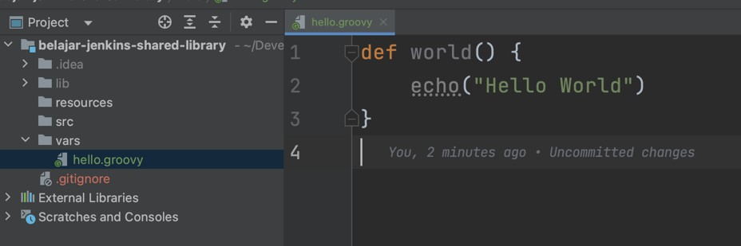
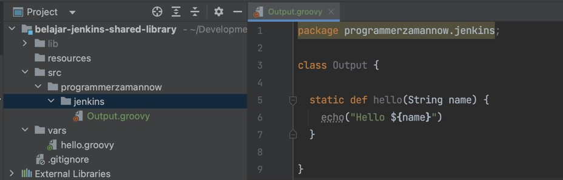
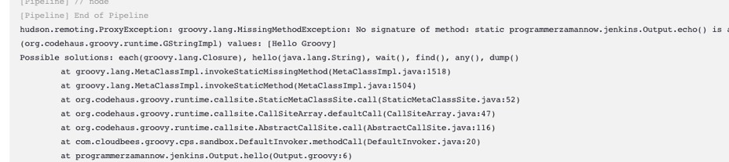
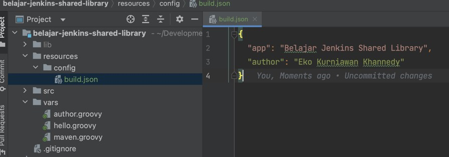
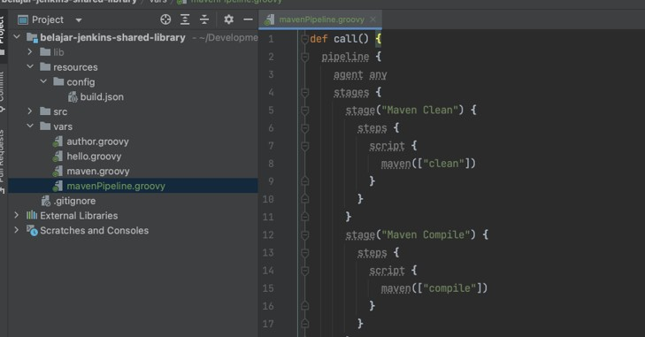

# Jenkins Shared Libary

## Sebelum Belajar

- Jenkins Dasar
- Jenkins Pipeline

## Agenda

- Pengenalan Shared Library
- Membuat Library
- Menggunakan Library
- Global Variable
- Membuat Function
- Membuat Groovy Class
- Parameter, List parameter, Map parameter
- Declarative Pipeline
- Dan lain-lain

## #1 Pengenalan Shared Library

- Share Library adalah salah satu fitur di Jenkins Pipeline untuk menyimpan kode pipeline di repository terpisah dari Project yang menggunakan pipeline tersebut
- Saat kita menginstall Jenkins Pipeline, secara otomatis kita bisa menggunakan fitur Shared Library

### Kenapa Shared Library?

- Keuntungan kita menggunakan Shared Library adalah, kita tidak perlu membuat pipeline secara manual satu per satu di tiap project
- Kita bisa membuat centralized repository yang berisikan pipeline, dan project yang membutuhkan pipeline tinggal menggunakan pipeline yang sudah dibuat di Shared Library
- Shared Library membutuhkan SCM seperti Git, jadi pastikan nanti kita menyimpan Shared Library di project repository seperti Git

## #2 Membuat Shared Library

- Untuk membuat Jenkins Shared Library, caranya sangat mudah, kita hanya perlu membuat folder berisi kode Groovy yang strukturnya sudah ditentukan
- Dan setelah membuatnya, jangan lupa untuk menyimpannya di Git Repository
- Hal ini karena Jenkins Shared Library akan menggunakan Git untuk menyimpan dan menggunakan di Jenkins Job yang membutuhkannya

### Struktur Folder Shared Library

- resources: berisikan file yang bukan berisi kode program, misal text, json, gambar, dan lain-lain
- `src` : berisikan class kode program Groovy
- `vars` : berisikan file groovy

### Kode: Hello World

```groovy
// vars/helo.groovy
def world() {
	echo("Hello World")
}
```



### Git Repository

- Setelah membuat project, silahkan simpan di Git Repository, misal :
- <https://github.com/ProgrammerZamanNow/belajar-jenkins-shared-library>

## #3 Registrasi Shared Library

- Sebelum kita bisa menggunakan Shared Library yang sudah kita buat, kita wajib meregistrasikan terlebih dahulu ke Jenkins
- Kita bisa meregistrasikan melalui menu :
- Manage Jenkins => Configure System => Global Pipeline Libraries

## #4 Menggunakan Library

- Setelah Shared Library teregistrasi di Jenkins, kita bisa menggunakan Shared Library dengan menggunakan Groovy Pipeline plugin
- <https://plugins.jenkins.io/pipeline-groovy-lib/>
- Secara default harusnya Groovy Pipeline akan terinstall ketika kita menginstall Jenkins Pipeline

### !Library

- Untuk menggunakan Shared Library yang sudah teregistrasi, kita bisa menggunakan perintah `@Library`, misal
- `@Library("nama-shared-library")`
- `@Library("nama-shared-library@tag")`
- `@Library("nama-shared-library@branch")`

### Menggunakan Vars

- Secara default, saat menggunakan @Library, kita perlu menyebutkan class Groovy satu per satu jika ingin kita gunakan
- Kadang ada kalanya kita ingin meng-import (menggunakan) file groovy yang terdapat di vars secara otomatis tanpa harus import satu per satu
- Kita bisa tambahkan `_` (garis bawah) setelah `@Library`, misal
- `@Library("nama-shared-library@branch") _`
- Secara otomatis file yang terdapat di vars akan menjadi global variable yang bisa kita gunakan

### Menggunakan Project

- Sekarang kita akan menggunakan contoh project yang sebelumnya sudah kita buat
- <https://github.com/ProgrammerZamanNow/belajar-jenkins-pipeline>

### Kode: Jenkinsfile

```Jenkinsfile
@Library('belajar-jenkins-shared-library@main') _

pipeline {
	agent none
	stages {
		stage('Hello World') {
			steps {
				script {
					hello.world()
				}
			}
		}
	}
}
```

## #5 Groovy Class

- Jika kita sudah belajar tentang bahasa pemrograman Groovy
- Kita bisa membuat kode-kode misal class Groovy di dalam folder `src`
- <https://groovy-lang.org/>

### Kode: Shared Library

```groovy
// src/programmerzamannow/jenkins/Output.groovy
package programmerzamannow.jenkins;

class Output {

	static def hello(String name) {
		echo("Hello ${name}")
	}
}
```



### Menggunakan Groovy Class

- Dan untuk menggunakan Groovy Class, kita bisa import di Jenkinsfile dan bisa kita gunakan secara otomatis
- Mirip dengan kode Groovy

### Kode: Jekinsfile

```Jenkinsfile
@Library('belajar-jenkins-shared-library@main') _

import programmerzamannow.jenkins.Output;

pipeline {
	agent none
	stages {
		stage('Hello Groovy') {
			steps {
				script {
					Output.hello('Groovy')
				}
			}
		}
	}
}
```

### Error



### Kenapa Terjadi Error

- Hal ini function `echo()` adalah function dari Jenkins Pipeline Library
- Sedangkan jika kita menggunakan Groovy Class, kita hanya bisa menggunakan fitur di bahasa pemrograman Groovy
- Contoh untuk menampilkan tulisan, di Groovy bisa menggunakan `println()`

### Kode: Shared Library

```groovy
// src/programmerzamannow/jenkins/Output.groovy
package programmerzamannow.jenkins;

class Output {

	static def hello(String name) {
		println("Hello ${name}")
	}
}
```

## #6 Mengakses Steps

- Jika kita memang ingin mengakses Jenkins Pipeline Library dari Groovy Class
- Kita bisa kirim object Steps melalui parameter
- Nanti secara otomatis kita bisa mengakses Jenkins Pipeline Library melalui parameter tersebut

### Kode: Mengakses Steps

```groovy
// src/programmerzamannow/jenkins/Output.groovy
package programmerzamannow.jenkins;

class Output {

	static def hello(steps, String name) {
		steps.echo("Hello ${name}")
	}
}
```

### Kode: Jenkinsfile

```Jenkinsfile
@Library('belajar-jenkins-shared-library@main') _

import programmerzamannow.jenkins.Output;

pipeline {
	agent none
	stages {
		stage('Hello Groovy') {
			steps {
				script {
					Output.hello(this, 'Groovy')
				}
			}
		}
	}
}
```

## #7 Global Variable

- Saat kita membuat file Groovy di folder vars, secara otomatis file tersebut akan menjadi Global Variable yang bisa diakses melalui Jenkinsfile
- Nama Global Variable akan sama dengan nama file nya, misal jika nama file adalah `author`.groovy, maka nama variable nya adalah author
- Semua definisi function, variable, dan class di file tersebut, bisa diakses melalui Global Variable

## #8 Function

- Kita bisa menambahkan function di dalam file Groovy di vars, yang nanti secara otomatis bisa diakses sebagai function di Global Variable
- Jika kita membuat function `name()` di file `author.groovy`, maka secara otomatis bisa diakses menggunakan `author.name()`

### Kode: Function

```groovy
// vars/author.groovy
def name() {
	"Eko Kurniawan Khannedy"
}

def channel() {
	"Programmer Zaman Now"
}
```

### Kode: Jenkinsfile

```Jenkinsfile
@Library('belajar-jenkins-shared-library@main') _

import programmerzamannow.jenkins.Output;

pipeline {
	agent none
	stages {
		stage('Hello Variable') {
			steps {
				script {
					echo(author.name())
					echo(author.channel())
				}
			}
		}
	}
}
```

## #9 Default Function

- Kita juga bisa membuat sebuah Default Function dalam Global Variable
- Default Function adalah function yang diakses secara otomatis ketika kita panggil Global Variable nya sebagai function, misal `author()`
- Kita bisa membuat function dengan nama `call()` di file Global Variable nya

### Kode: Default Function

```groovy
// vars/author.groovy
def call() {
	"Eko Kurniawan Khannedy - Programmer Zaman Now"
}

def name() {
	"Eko Kurniawan Khannedy"
}

def channel() {
	"Programmer Zaman Now"
}
```

### Kode: Jenkinsfile

```Jenkinsfile
@Library('belajar-jenkins-shared-library@main') _

import programmerzamannow.jenkins.Output;

pipeline {
	agent none
	stages {
		stage('Hello Variable') {
			steps {
				script {
					echo(author())
					echo(author.name())
					echo(author.channel())
				}
			}
		}
	}
}
```

## #10 Parameter

- Sebelumnya kita sudah menggunakan parameter di function
- Karena function di Jenkins Pipeline adalah sebuah Groovy Function, jadi secara otomatis kita bisa melakukan layaknya function di Groovy, contohnya menambahkan Parameter
- Parameter adalah data yang kita kirim ke function tersebut, bisa satu atau lebih
- Jika function memiliki parameter, secara otomatis kita perlu mengirim data parameter ketika memanggil function nya

### Kode: vars/maven.groovy

```groovy
def call(String command) {
	sh("./mvnw ${command}")
}
```

### Kenapa Bisa Mengakses Jenkins Pipline Library?

- Berbeda dengan Groovy Class di directory `src`, Global Variable di `vars` bisa mengakses Jenkins Pipeline Library
- Oleh karena itu, sangat direkomendasikan menggunakan Global Variable jika membuat script yang butuh Jenkins Pipeline Library

### Kode: Jenkinsfile

```Jenkinsfile
@Library('belajar-jenkins-shared-library@main') _

import programmerzamannow.jenkins.Output;

pipeline {
	agent none
	stages {
		stage('Maven Compile') {
			steps {
				script {
					maven('clean compile')
				}
			}
		}
	}
}
```

## #11 List Parameter

- Parameter di Groovy bisa menerima lebih dari satu parameter
- Tapi kadang-kadang kita ingin mengirim data parameter misal yang tidak menentu jumlahnya
- Pada kasus ini, kita bisa menggunakan tipe data List
- List di Groovy adalah tipe data yang bisa digunakan untuk menampung banyak data dalam satu variable / parameter
- Dan untuk mengirim parameter dalam bentuk List, kita bisa gunakan `[]` dimana di dalamnya kita bisa sebutkan datanya, jika lebih dari satu, bisa kita tambahkan pemisah `,` (koma), misal
- `[“clean”, “compile”, “test”]`
- <https://www.baeldung.com/groovy-lists>

### Kode: List Parameter

```groovy
def call(List commands) {
	for (command in commands) {
		sh("./mvnw ${command}")
	}
}
```

### Kode: Jenkinsfile

```Jenkinsfile
stages {
	stage('Maven Compile') {
		steps {
			script {
				maven(['clean', 'compile', 'test'])
			}
		}
	}
}
```

## #12 Map Parameter

- Selain tipe data List, Groovy juga memiliki tipe data Map
- Tipe data Map sangat cocok digunakan ketika kita ingin membuat parameter yang kompleks, dimana dalam Map, kita bisa menyebutkan kata kunci dan juga nilai data nya
- <https://www.baeldung.com/groovy-maps>

### Kode: Map Parameter

```Jenkinsfile
def person(Map person) {
	echo("Hello ${person.firstName} ${person.lastName}")
}
```

### Kode: Jenkisfile

```Jenkinsfile
stages {
	stage('Hello Person') {
		steps {
			script {
				hello.person([
					firstName: 'Eko',
					lastName: 'Kurniawan',
				])
			}
		}
	}
}
```

## #13 Library Resource

- Seperti yang sudah kita bahas di awal, bahwa folder resources adalah tempat kita menyimpan data bukan script, misal text, json, gambar, dan lain-lain
- Sekarang bagaimana caranya jika kita ingin mengambil data tersebut?
- Kita bisa menggunakan function di Groovy Pipeline bernama `libraryResource(lokasi)`
- Dimana libraryResource akan mencari file di resources/lokasi yang kita cari
- Misal `libraryResource("json/person.json")`, artinya akan mengambil file dari `resources/json/person.json`
- Hasil dari function `libraryResource` adalah text isi file tersebut

### Kode: Library Resource

```json
{
	"app": "Belajar Jenkis Shared Libary",
	"author": "Eko Kurniawan Khannedy"
}
```



### Kode: Jenkinsfile

```Jenkinsfile
stages {
	stage('Library Resource') {
		steps {
			script {
				def config = libraryResource('config/build.json')
				echo(config)
			}
		}
	}
}
```

## #14 Declarative Pipeline

- Shared Library mendukung pembuatan Pipeline, hal ini mempermudah ketika kita ingin membuat Pipeline di Shared Library
- Sehingga kode di Jenkinsfile akan semakin mudah, tidak perlu membuat Pipeline, hanya tinggal memanggil function yang terdapat di Shared Library

### Kode: Maven Pipeline

```groovy
// vars/mavenPipeline.groovy

def call() {
	pipeline {
		agent any
		stages {
			stage('Maven Clean') {
				steps {
					script {
						maven(['clean'])
					}
				}
			}
			stage('Maven Compile') {
				steps {
					script {
						maven(['compile'])
					}
				}
			}
		}
	}
}
```



### Kode: Jenkisfile

```Jenkinsfile
@Library('belajar-jenkins-shared-library@main') _

mavenPipeline()
```

### Logic di Declarative Pipeline

- Kita juga bisa menambahkan logic di Declarative Pipeline
- Misal, kita bisa gunakan if else untuk mengeksekusi Declarative Pipeline misalnya

### Kode: Pzn Pipeline

```groovy
// vars/pznPipeline.groovy

def call(Map config) {
	if (config.type == 'Maven') {
		mavenPipeline()
	} else {
		pipeline {
			agent any
			stages {
				stage('Unsupported Type') {
					steps {
						script {
							echo("Unsupported Type")
						}
					}
				}
			}
		}
	}
}
```

### Kode: Jenkisfile

```Jenkinsfile
@Library('belajar-jenkins-shared-library@main') _

pznPipeline([
	type: 'maven'
])
```

## #15 Materi Selanjutnya

- Jenkins Docker
- Jenkins Github
- Jenkins GitLab
- Jenkins Bitbucket
- Jenkins Kubernetes
