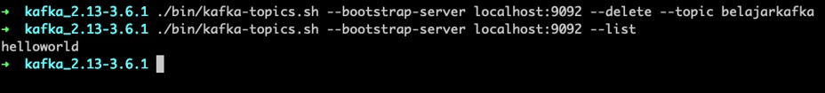
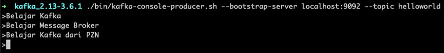

# Apache Kafka Dasar

## Sebelum Belajar

- Mengerti Cara Menginstall Aplikasi
- Mengerti Menggunakan Cara Terminal
- Di Kelas ini akan ada praktek membuat aplikasi menggunakan Golang, NodeJS dan Java. Sehingga jika sudah mengerti salah satu bahasa tersebut, akan sangat direkomendasikan

## #1 Pengenalan Publish Subscribe

### Komunikasi Antar Aplikasi

- Saat kita membuat aplikasi, kita pasti akan melakukan komunikasi dengan aplikasi lain, paling sederhana misal aplikasi yang kita buat akan berkomunikasi dengan aplikasi seperti database
- Komunikasi tersebut kita sebut adalah RPC (Remote Procedure Call)
- Contoh protokol RPC yang sekarang sedang populer adalah RESTful API
- Salah satu keuntungan menggunakan RPC adalah, komunikasi bisa dilakukan secara synchronous dan realtime

### Contoh: Kasus

- Misal kita membuat sistem toko online, dimana kita buat dalam banyak aplikasi
- Ada aplikasi product, promo, shopping cart, order, logistic dan payment
- Misal ketika pelanggan melakukan pembelian, maka semua barang akan disimpan ke shopping cart
- Untuk mendapatkan informasi produk dan promo yang sedang berjalan, maka shopping cart harus berkomunikasi dengan aplikasi product dan promo
- Setelah barang di shopping cart akan dibeli, maka shopping cart akan mengirim semua data product ke aplikasi order, yang nanti akan diproses untuk ke aplikasi logistic untuk menghitung ongkos kirim, dan ke aplikasi payment untuk diproses pembayarannya

### Diagram RPC (Remote Procedure Call)


### Perubahan Kasus

- Misal pada kasus ini, kita ingin menambahkan aplikasi untuk mendeteksi penipuan, sehingga kita ingin menambahkan aplikasi fraud detection
- Proses pengecekan penipuan akan dilakukan ketika order dibuat, sehingga misal jika terjadi fraud order bisa dibatalkan secara otomatis
- Pada kasus ini, berarti data order akan dikirim ke aplikasi fraud detection
- Semakin banyak interaksi yang dilakukan oleh aplikasi, maka akan semakin kompleks, dan si pengirim harus menambah mekanisme untuk mengirim data ke aplikasi lainnya lagi

### Diagram RPC (Remote Procedure Call)


### Pengenalan Publish Subscribe

- RPC adalah mekanisme komunikasi dimana pengirim menentukan siapa yang menerima data
- Selain RPC, terdapat mekanisme berkomunikasi bernama Messaging atau lebih dikenal dengan Publish/Subscribe
- Mekanisme Messaging berbeda dengan PRC, dalam Messaging, pengirim tidak menentukan siapa yang menerima data, melainkan pengirim akan mengirim data ke perantara (Message Broker)
- Seluruh penerima data akan mengambil data langsung dari perantara (Message Broker)
- Dengan begitu, ketika ada penerima data baru, pengirim data tidak harus tahu, karena tugas pengirim data hanya mengirim ke perantara (Message Broker)

### Diagram Messaging


### Keuntungan Menggunakan Messaging

- Dengan menggunakan komunikasi Messaging, pengirim tidak perlu tahu kompleksitas yang akan dilakukan oleh penerima data
- Setiap terjadi perubahan jumlah penerima data, maka pengirim tidak perlu tahu lagi

### Diagram Messaging


### Kekurangan Menggunakan Messaging

- Tidak realtime seperti PRC, artinya bisa terdapat delay (jeda waktu) data tidak konsisten dari pengirim mengirim data, sampai data diterima oleh penerima data
- Ketika terjadi kegagalan penerimaan data, pengirim tidak akan tahu, oleh karena itu penerima harus memiliki kemampuan untuk melakukan retry (mencoba ulang) atau memberi tahu pengirim bahwa penerima gagal memproses data

## #2 Pengenalan Kafka

- Kafka adalah salah satu aplikasi perantara (Message Broker) untuk komunikasi Messaging
- Kafka juga sering disebut sebagai aplikasi distributed commit log atau distributed streaming platform
- Kafka adalah aplikasi yang OpenSource dan menggunakan lisensi Apache 2.0, sehingga gratis digunakan untuk kebutuhan personal atau bisnis
- Kafka adalah aplikasi Message Broker yang sangat populer, terutama di perusahaan-perusahaan besar
- <https://kafka.apache.org/>

### Kenapa Kafka

- Scalable, Kafka dikenal mampu menerima penambahan beban dengan baik. Oleh karena itu banyak sekali perusahaan besar menggunakan Kafka
- High Performance, Kafka dikenal memiliki performa yang baik dan cepat. Kafka pertama kali dibuat di perusahaan Linkedin dengan tujuan untuk menangani performa yang baik, karena Message Broker yang sebelumnya digunakan tidak bisa menangani banyaknya data yang dikelola di Linkedin
- Persistence, Kafka menyimpan data di Disk, yang artinya data akan selalu aman ketika terjadi kegagalan pada penerima data, dengan begitu kita tidak perlu takut terjadi masalah ketika data gagal diproses oleh penerima

### Ekosistem

- Kafka adalah aplikasi yang sudah banyak digunakan dan sangat populer, oleh karena itu kita tidak perlu takut lagi dengan ekosistem pendukungnya
- Hampir semua teknologi yang kita gunakan bisa diintegrasikan dengan Kafka, misal Golang, Java, NodeJS, Python, dan lain-lain
- Kafka juga banyak digunakan di Ekosistem Data, sehingga bisa diintegrasikan dengan baik di teknologi-teknologi ekosistem data, seperti Hadoop, Spark, Elasticsearch, dan lain-lain
- Mempelajari Kafka, sangat berguna terutama untuk Backend Engineer atau Data Engineer

## #3 Menginstall Java

### Kenapa Butuh Java?

- Kafka adalah aplikasi yang dibuat menggunakan Java, oleh karena itu, kita perlu menginstall Java terlebih dahulu sebelum menginstall Kafka
- Sebelum menginstall Java, kita terlebih dahulu harus tahu versi Java yang digunakan oleh Apache Kafka
- Kita bisa lihat di halaman berikut :
- <https://kafka.apache.org/documentation/#java>

### Eclipse Temurin

- Java adalah teknologi yang OpenSource, untuk menginstall Java, kita harus menginstall aplikasi yang bernama JDK (Java Development Kit)
- JDK ada yang berbayar dan ada yang gratis, kita akan menggunakan JDK yang gratis yaitu OpenJDK yang dibuat oleh Eclipse Temurin
- Kita bisa lihat versi yang masih disupport dihalaman ini :
- <https://endoflife.date/eclipse-temurin>
- Dan setelah tahu versi nya, kita bisa download di halaman ini :
- <https://adoptium.net/temurin/releases/?

### Mengecek Instalasi Java

```sh
java --version
```

## #4 Menginstall Kafka

### Download Kafka

- Untuk menginstall Kafka, kita perlu download distribution file Kafka terlebih dahulu
- <https://kafka.apache.org/downloads>
- Pastikan download file binary, bukan source code
- Karena kafka dibuat menggunakan Java, jadi bisa dijalankan di sistem operasi apapun yang bisa menjalankan Java, seperti Windows, Mac, dan Linux

### Executable File Kafka

- Kafka menyimpan semua executable file nya di folder bin (untuk Linux dan Mac), dan bin/windows (untuk Windows)
- Kita bisa menggunakan file-file tersebut untuk mengoperasikan Kafka

### File Konfigurasi

- Kafka sudah menyediakan file konfigurasi di file `config/kraft/server.properties` sebagai konfigurasi aplikasi Kafka dalam format properties file
- Kita bisa mengubah isi konfigurasinya di file tersebut, namun untuk sekarang, default konfigurasi yang sudah tersedia sudah cukup untuk kita belajar
- Perubahan konfigurasi sangat dibutuhkan ketika kita ingin membuat Kafka Cluster (lebih dari satu aplikasi Kafka yang berjalan), dimana materi itu akan kita bahas di kelas Kafka Scalability

### Data Directory

- Secara default, data Kafka akan disimpan di file `/tmp/kraft-combined-logs`
- Folder itu jika di Linux atau di Mac, akan dihapus otomatis setelah restart, oleh karena itu direkomendasikan untuk diubah dengan mengubah konfigurasi `log.dirs` pada `server.properties`

### Kode: log.dirs

```
############################# Log Basics #############################

# A comma separated list of directions under which to store log files
log.dirs=data

# The default number of log partitions per topic. More partitions allow greater
# parallelism for consumtion, but this will also result in more files across
# the brokers.
num.partitions=1
```

### Format Data Directory

- Untuk pertama kali, kita harus melakukan format data directory terlebih dahulu
- Hal ini hanya dilakukan sekali saja ketika membuat data directory, tidak perlu dilakukan lagi selanjutnya
- Kita bisa menggunakan file `bin/kafka-storage.sh` (Linux dan Mac) atau `bin/windows/kafka-storage.bat` (Windows)

### Kode: Data Directory

```sh
./bin/kafka-storage.sh random-uuid

./bin/kafka-storage.sh  format --cluster-id random-uuid konhgH7afga6affAfga --config config/kraft/server.properties

```


### Menjalankan Kafka

- Untuk menjalankan Kafka, kita bisa menggunakan file `bin/kafka-server-start.sh` (Linux dan Mac) atau file `bin/windows/kafka-server-start.bat` (Windows)
- Lalu diikuti dengan nama file konfigurasi di `config/kraft/server.properties`

### Kode: Menjalankan Kafka

```sh
./bin/kafka-server-start.sh config/kraft/server.properties
```


## #5 Topic

- Saat kita mengirim data ke Kafka, kita harus mengirim data tersebut ke Topic
- Topic itu mirip Table di Database, dimana digunakan untuk menyimpan data yang dikirim oleh pengirim data

### Diagram Topic


### Log

- Data di topic disimpan dalam format Log
- Apa itu Log? Log adalah cara menyimpan yang paling sederhana, yaitu append-only (hanya bertambah), berurutan sesuai dengan urutan data masuk
- Setiap data kita simpan di dalam topic, maka data akan bertambah pada urutan terakhir
- Hal ini membuat proses penyimpanan data ke Kafka sangat cepat, karena hanya menyimpan data di bagian akhir saja

### Diagram Topic Log


### Membuat Topic

- Untuk membuat topic, kita bisa menggunakan file `bin/kafka-topic.sh` atau `bin/windows/kafka-topic.sh`
- `kafka-topics.sh --bootstrap-server <connection-string>:<port> --create --topic <string>`


### Melihat Topic

- `kafka-topics.sh --bootstrap-server <connection-string>:<port> --list`


### Menghapus Topic

- `kafka-topics.sh --bootstrap-server <connection-string>:<port> --delete --topic <string>`



## #6 Message

- Data yang kita kirim ke topic di Kafka kita sebut Message
- Message merupakan data dengan struktur yang sudah ditentukan oleh Kafka
- Walaupun kenyataannya mungkin jarang digunakan, namun kita perlu tahu informasi yang terdapat di Message

### Struktur Message

- Topic adalah nama topic untuk menyimpan message
- Partition adalah nomor partisi untuk menyimpan message
- Header adalah informasi tambahan untuk message
- Key adalah id untuk message, Key ini bukan seperti Primary Key di database, Key di Kafka boleh sama antar Message
- Value adalah isi data untuk message


## #7 Producer

- Producer adalah pihak yang mengirim Message ke Kafka
- Contoh pada kasus sebelumnya, aplikasi Order adalah Producer untuk Message Order
- Kafka sendiri menyediakan aplikasi sederhana berbasis terminal untuk Producer, namun aplikasi ini hanya sederhana
- Untuk praktek yang lebih kompleks, kita akan coba simulasikan di bagian akhir menggunakan bahasa pemrograman Golang, Java dan NodeJS
- Perlu diingat, setiap mengirim Message ke Kafka, maka akan disimpan di urutan paling akhir

### Diagram Mengirim Data


### Console Producer

- Untuk mengirim data kita bisa menggunakan file `kafka-console-producer.sh`
- `kafka-console-producer.sh --bootstrap-server <host:port> --topic <string>`

### Kode: Mengirim Message

```sh
./bin/kafka-console-producer.sh --bootstrap-server localhost:9002 --topic helloworld
```


## #8 Consumer

- Consumer adalah aplikasi yang membaca/menerima data dari Kafka
- Pada kasus sebelumnya, aplikasi Logistic dan Payment adalah Consumer untuk Message Order
- Membaca data dari Kafka akan dilakukan secara berurutan dari nomor Message paling awal sampai paling akhir

### Diagram Consumer


### Console Consumer

- Kafka juga menyediakan Console Consumer, yaitu aplikasi consumer sederhana berbasis terminal
- Kita bisa mencoba membaca data dari Topic menggunakan aplikasi `kafka-console-consumer.sh`
- `kafka-console-consumer.sh  --bootstrap-server <host:port> --topic <string> --from-beginning`

```sh
./bin/kafka-console-consumer.sh --bootstrap-server localhost:9002 --topic helloworld --form-beginning
```


### Publish Subscribe

- Ketika kita mengirim lagi data ke Topic yang sedang dibaca oleh Consumer, secara otomatis data akan dibaca oleh Consumer
- Sehingga kita tidak perlu menjalankan ulang aplikasi Consumer dari awal lagi

```sh
./bin/kafka-console-producer.sh --bootstrap-server localhost:9002 --topic helloworld
```



## #9 Consumer Group

- Saat Consumer membaca data dari Topic, maka Consumer permu menentukan Consumer Group yang digunakan
- Sebelumnya kita tidak menyebutkan Consumer Group yang kita gunakan, yang jika tidak disebutkan, secara otomatis akan dibuatkan baru oleh Kafka
- Namun pada kenyataannya saat membuat aplikasi, Consumer Group pasti akan selalu kita sebutkan
- Biasanya Consumer Group kebanyakan menggunakan nama aplikasi yang menjadi Consumer nya

### Tanpa Menyebutkan Consumer Group

- Jika kita tidak menyebutkan Consumer Group, secara otomatis akan dibuat Consumer Group baru
- Dan saat membaca data dari Topic, Kafka hanya akan memberikan data ke Consumer dengan Consumer Group secara unik, artinya tidak akan diberikan dua kali ke Consumer yang menggunakan Consumer Group yang sama
- Jika Consumer Group selalu berbeda-beda, maka secara otomatis data akan diterima berkali-kali
- Kita liat contohnya, misal aplikasi Payment akan menjadi Consumer dari Message Order, namun Payment tidak menggunakan Consumer Group

### Tanpa Consumer Group


### Menggunakan Consumer Group

- Jika Consumer menggunakan Consumer Group, maka Consumer-Consumer yang menggunakan Consumer Group yang sama akan dianggap satu kesatuan
- Oleh karena itu, data tidak akan dikirim berkali-kali ke semua Consumer, melainkan hanya sekali ke Consumer Group (Consumer akan dipilih dari Consumer Group yang sama)
- Dengan begitu, kita tidak akan menerima data berkali-kali

### Menggunakan Consumer Group


### Menggunakan Consumer Group

- Saat kita menggunakan Console Consumer, jika kita ingin menggunakan Consumer Group, kita bisa gunakan perintah :
- `kafka-console-consumer.sh  --bootstrap-server <host:port> --topic <string> --group <string> --from-beginning`

### Latihan

- Silahkan coba jalankan lebih dari satu Consumer dengan Consumer Group sama, dan kirim Message ke topic tersebut. Pastikan hanya satu Consumer yang mendapatkan data
- Coba matikan Consumer yang sebelumnya menerima data, lalu coba kirim lagi data baru. Pastikan Consumer lainnya secara otomatis mendapatkan data baru tersebut

## #10 Offset

### Ketika Tidak Ada Consumer

- Sebelumnya kita sudah tahu bahwa data di Topic, disimpan secara berurutan, dimulai dari nomor 0 sampai seterusnya
- Jika misal kita menghentikan semua Consumer, namun Producer tetap mengirim data, pertanyaannya, ketika nanti Consumer berjalan lagi, dari mana Consumer akan membaca data? Apakah dari awal lagi? Atau mulai dari data terbaru saja? Atau dari data terakhir ketika Consumer dihentikan?

### Cara Menentukan Data yang Dibaca Consumer

- Secara default, Consumer akan mulai membaca data baru yang masuk. Seandainya misal di Topic sudah ada 10 data, lalu kita pertama kali menjalankan Consumer, maka Consumer akan mulai membaca data dari data ke 11 dan selanjutnya
- Saat kita menggunakan `--from-beginning`, maka Consumer akan membaca data dari awal, yaitu dari data ke-1
- Lantas bagaimana jika misal Consumer sudah selesai membaca sampai data ke-5, lalu Consumer dihentikan? Saat dijalankan ulang, Consumer tidak akan membaca dari ke-1 lagi (awal), atau dari ke-11 (baru), melainkan dari terakhir Consumer dimatikan, yaitu ke-5, yang artinya akan mulai membaca dari ke-6
- Pertanyaannya bagaimana Consumer tahu bahwa terakhir data yang sudah dibaca adalah data ke-5?

### Offset

- Kafka menyimpan informasi data terakhir yang dibaca dengan sebutan offset
- Saat pertama kali Consumer berjalan, data Offset tidak ada, oleh karena itu kita harus menentukan mau di awal `(--from-beginning)` atau mau dari data baru?
- Namun ketika Consumer berjalan, lalu membaca data, maka Consumer akan menyimpan informasi Offset (data terakhir yang dibaca), dengan begitu ketika aplikasi Consumer dihentikan, lalu dijalankan ulang, maka Consumer bisa mendapatkan informasi Offset terakhir, dan melanjutkan membaca data dari Offset terakhir
- Informasi Offset disimpan dengan informasi Consumer Group, yang artinya jika kita menjalankan Consumer dengan Consumer Group yang berbeda, maka informasi Offset otomatis akan hilang

### Melihat Informasi Offset

- Untuk tahu Offset terakhir untuk Consumer Group, kita bisa gunakan file kafka-consumer-group.sh
- `kafka-consumer-groups.sh --bootstrap-server <host:port> --all-groups --all-topics --describe`


## #11 Partition

- Saat kita membuat Topic, Kafka akan menyimpan data Topic tersebut dalam Partition. Dan jumlah Partition secara default adalah 1
- Partition di Kafka, hanya bisa dibaca oleh 1 Consumer, disinilah jawaban kenapa data yang kita kirim di awal selalu diterima oleh 1 Consumer, tidak pernah berpindah ke Consumer yang lain, sampai Consumer tersebut dihentikan, baru data akan berpindah ke Consumer lainnya
- Kafka, bisa menyimpan data Topic dalam beberapa Partisi
- Dengan begitu, kita bisa membuat beberapa Consumer bekerja, karena ada cukup Partisi yang bisa dibaca oleh Consumer
- Kita akan coba simulasikan bagaimana Consumer bekerja ketika jumlah Partisi ada banyak


### Menambah Partition

- Secara default, saat kita membuat Topic, maka jumlah Partition hanya 1
- Kita bisa menentukan jumlah Partition saat membuat Topic, atau mengubah jumlah Partition di Topic yang sudah kita buat
- Untuk membuat Topic dengan Partition :
- `kafka-topics.sh --bootstrap-server <connection-string>:<port> --create --topic <string> --partitions <number>`
- Untuk mengubah Topic yang sudah dibuat :
- `kafka-topics.sh --bootstrap-server <connection-string>:<port> --alter --topic <string> --partitions <number>`
- Untuk melihat detail Topic yang sudah dibuat :
- `kafka-topics.sh --bootstrap-server <connection-string>:<port> --describe --topic <string>`

### Kode: Menambah Partition

```sh
./bin/kafka-topics.sh --bootstrap-server localhost:9002 --alter --topic helloworld --partitions 2
./bin/kafka-topics.sh --bootstrap-server localhost:9002 --describe --topic helloworld
```


### Latihan

- Jalankan 3 Consumer ke Topic helloworld, lalu coba kirim data ke Topic helloworld
- Coba matikan satu persatu Consumer, dan sisakan 1 Consumer, sambil mengirim data ke Topic helloworld
- Cek lagi Offset untuk Consumer Group yang digunakan

## #12 Routing

### Memilih Partition

- Saat kita mengirim data ke Topic, bagaimana cara menentukan Partition mana yang akan digunakan untuk menyimpan data?
- Contoh, kenapa sebelumnya saat kita mengirim data, selalu masuk ke Partition yang sama? Tidak pernah berubah?
- Jawabannya adalah penentuan Partition, ditentukan oleh Key pada Message yang kita kirim
- Sebelumnya, saat kita mengirim data menggunakan Console Producer, Key yang digunakan adalah null (kosong), secara otomatis akan selalu dikirim ke Partition yang sama

### Key Routing

- Key di Kafka Message tidak seperti Primary Key di Database, Key di Kafka Message salah satunya digunakan untuk menentukan Partition yang dipilih
- Saat menentukan Partition mana yang akan dipilih, Kafka akan menggunakan rumus :
- `hash(message.key) % total partition`
- Misal ketika kita mengirim Message dengan key `"eko"`, dengan jumlah Partition 2, maka, Partition yang dipilih adalah:
- `hash(eko) % 2`
- Misal saja, hasil perhitungan `hash(eko) = 8`, artinya :
- `8 % 2 = 0`
- Artinya Message akan disimpan di Partition 0
- Oleh karena itu, Key yang sama, pasti akan selalu masuk ke Partition yang sama

### Console Producer

- Defaultnya, Console Producer akan menggunakan Key null (kosong) ketika mengirim data.
- Jika kita ingin menentukan Key, kita bisa tambahkan parameter `--property "parse.key=true" --property "key.separator=:"`


### Console Consumer

- Untuk melihat Key yang ada di Message, di Console Consumer, kita bisa tambahkan perintah `--property "print.key=true"`


## #13 Kafka Client

- Sebelumnya, kita sudah mencoba membuat Producer dan Consumer menggunakan Kafka Console Producer dan Consumer
- Namun pada kenyataanya, saat kita membuat aplikasi, kita harus membuat Producer dan Consumer langsung di aplikasi yang kita buat
- Untungnya, ekosistem Kafka sudah sangat matang dan besar, sehingga kita tidak akan kesulitan ketika menggunakan Kafka
- Di materi-materi selanjutnya, kita akan coba menggunakan teknologi Golang, NodeJS dan Java untuk membuat Producer dan Consumer Kafka

### Kafka Client Library

- Untuk terkoneksi ke Kafka, kita perlu menggunakan Kafka Client Library sesuai dengan teknologi yang kita gunakan
- Untuk teknologi Golang, kita akan menggunakan library <https://github.com/confluentinc/confluent-kafka-go>
- Untuk teknologi NodeJS, kita akan menggunakan library <https://github.com/tulios/kafkajs>
- Untuk teknologi Java, kita akan langsung menggunakan Kafka nya, karena Kafka dibuat menggunakan teknologi Java

## #14 Golang Kafka

- Sekarang kita akan coba membuat aplikasi Consumer dan Producer menggunakan Golang

### Membuat Project Consumer

- Buat folder belajar-golang-kafka-consumer
- `go mod init belajar-golang-kafka-consumer`
- `go get github.com/confluentinc/confluent-kafka-go/v2/kafka`

### Kode: Membuat Kafka Consumer

```go
func main() {
	config := &kafka.ConfigMap{
		"bootstrap.servers": "localhost:9002",
		"group.id"				 : "golang",
		"auto.offset.reset": "earliest",
	}
	consumer, err := kafka.NewConsumer(config)
	defer consumer.Close()
	if err != nil {
		panic(err)
	}
}
```

### Kode: Subscribe Kafka Topic

```go
err = consumer.Subscribe("HelloWorld", nil)
if err != nil {
	panic(err)
}

for {
	message, err := consumer.ReadMessage(item.Second)
	if err != nil {
		fmt.Println("Received nmessage: %s\n", message.Value)
	}
}
```

### Latihan

- Jalankan 2 aplikasi Consumer menggunakan Golang
- Kirim beberapa data ke Kafka menggunakan Console Producer

### Membuat Project Producer

- Buat folder belajar-golang-kafka-producer
- `go mod init belajar-golang-kafka-producer`
- `go get github.com/confluentinc/confluent-kafka-go/v2/kafka`

### Kode: Membuat Producer

```go
config := &kafka.ConfigMap{
	"bootstrap.servers": "localhost:9002",
}

producer, err := kafka.NewProducer(config)
if err != nil {
	panic(err)
}

defer producer.Close()
topic := "helloworld"
```

### Kode: Mengirim Message

```go
for i := 0; i < 10; i++ {
	fmt.Println("Send message to kafka %d \n", i)
	msg := &kafka.Message{
		TopicPartition: kafka.TopicPartition{
			Topic: 		&topic,
			Partiton: kafka.PartitionAny,
		},
		Key: 	 []byte(strconv.Itoa(i)),
		Value: []byte(fmt.Sprintf("Hello %d", i)),
	}

	err = producer.Produce(msg, nil)
	if err != nil {
		panic(err)
	}
}

producer.Flush(5 * 1000)
```

## #15 NodeJS Kafka

- Sekarang kita akan coba membuat aplikasi Consumer dan Producer menggunakan NodeJS

### Membuat Project

- Buatlah folder belajar-nodejs-kafka
- `npm init`
- `npm install kafkajs`
- Ubah type menjadi module di file `package.json`

### Kode: Membuat Consumer

```ts
import { Kafka } from "kafkajs";
const kafka = new Kafka({
	brokers: ["localhost:9002"],
});

const consumer = kafka.consumer({
	groupId: "nodejs",
});

await consumer.subscribe({
	topic: "helloworld",
	fromBeginning: true,
});
```

### Kode: Membaca Message

```ts
await consumer.connect();
await consumer.run({
	eachMessage: async (record) => {
		const message = record.message;
		console.info(message.value.toString());
	},
});
```

### Latihan

- Jalankan 2 Consumer menggunakan NodeJS
- Coba kirimkan beberapa data menggunakan Console Producer

### Kode: Membuat Producer

```ts
import { Kafka, Partitioners } from "kafka";

const kafka = new Kafka({
	brokers: ["localhost:9002"],
	clientId: "hello-producer",
});

const producer = kafka.producer({
	createPartitioner: Partitioners.DefaultPartitioner,
});
await producer.connect();
```

### Kode: Mengirim Message

```ts
for (let i = 0; i < 10; i++) {
	await producer.send({
		topic: "helloworld",
		messages: [
			{
				key: `${i}`,
				value: `Hello ${i}`,
			},
		],
	});
}

await producer.disconnect();
```

## #16 Java Kafka

- Sekarang kita akan coba membuat aplikasi Consumer dan Producer menggunakan Java

### Membuat Project

- <https://start.spring.io/>
- Tambahkan dependency Kafka

### Kode: Membuat Consumer

```java
Properties properties = new Properties();
properties.put(ConsumerConfig.BOOTSTRAP_SERVERS_CONFIG, "localhost:9002");
properties.put(ConsumerConfig.AUTO_OFFSET_RESET_CONFIG, "earliest");
properties.put(ConsumerConfig.KEY_DESERIALIZER_CLASS_CONFIG, StringDeserializer.class.getName());
properties.put(ConsumerConfig.VALUE_DESERIALIZER_CLASS_CONFIG, StringDeserializer.class.getName());
properties.put(ConsumerConfig.GROUP_ID_CONFIG, "java");

KafkaConsumer<string, String> consumer = new KafkaConsumer<>(properties);
consumer.subscribe(List.of("helloworld"));

while (true) {
	ConsumerRecords<String, String> records = consumer.pull(Duration.ofSeconds(1));
	for (ConsumerRecord<String, String> message : records) {
		System.out.println(message.value());
	}
}
```

### Kode: Membuat Producer

```java
Properties props = new Properties();
props.put(ProducerConfig.BOOTSTRAP_SERVERS_CONFIG, "localhost:9002");
props.put(ProducerConfig.KEY_SERIALIZER_CLASS_CONFIG, StringSerializer.class.getName());
props.put(ProducerConfig.VALUE_SERIALIZER_CLASS_CONFIG, StringSerializer.class.getName());

KafkaProducer<String, String> producer = new KafkaProducer<>(props);

for (int i = 0; i < 10; i++) {
	ProducerRecord<String, String> message = new ProducerRecord<>("helloworld", Integer.toString(i), "Hello " + i);
	producer.send(message).get();
}

producer.close();
```

## #17 Penutup
