# Kotlin Collection

## Sebelum Belajar

- Kotlin Dasar
- Kotlin Object Oriented Programming
- Kotlin Generic
- <https://www.udemy.com/course/pemrograman-kotlin-pemula-sampai-mahir/?referralCode=98BE2E779EB8A0BEC230>

## #1 Pengenalan Collection

- Collection adalah hal umum yang biasa dimiliki di bahasa pemrograman, seperti Java, Python, Ruby dan lain-lain
- Sebuah collection biasanya berisikan sejumlah data, bahkan bisa kosong
- Kotlin standard library menyediakan data Collection yang sudah bisa langsung kita gunakan, tanpa tambahan library

### Tipe Collection

- Secara garis besar, ada 2 jenis collection di Kotlin
  - `Immutable`, collection yang hanya mendukung operasi read only
  - `Mutable`, collection turunan immutable, namun mendukung operasi write juga (add, edit, dan remove)

### Kotlin Collection Diagram

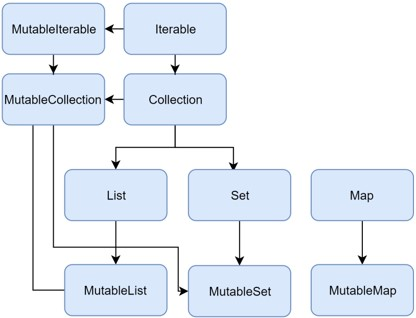

## #2 List

- List, adalah collection yang datanya seperti Array dan memiliki akses data menggunakan index
- Data di List boleh duplicate, artinya kita boleh memasukkan data yang sama berkali-kali ke dalam sebuah List yang sama

### Function di List

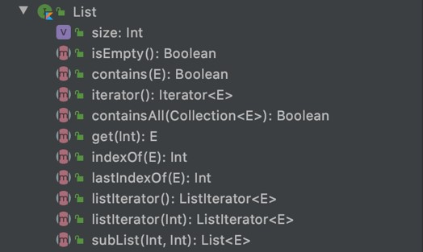

### Kode: List

```kt
fun main() {
	val list: List<String> = listOf("Eko", "Kurniawan", "Khannedy")
	println(list[0])
	println(list[1])
	println(list[2])
	println(list.isEmpty())
	println(list.indexOf("Kurniawan"))
	println(list.contains("Khannedy"))
}
```

### Function di Mutable List

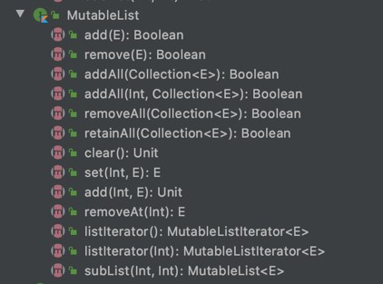

### Kode: Mutable List

```kt
fun main() {
	val mutableList: MutableList<String> mutableListOf()
	mutableList.add("Eko")
	mutableList.add("Kurniawan")
	mutableList.add("Khannedy")
	println(mutableList[0])
	println(mutableList[1])
	println(mutableList.isEmpty())
}
```

## #3 Set

- Set, adalah collection yang datanya harus unik dan tidak pasti berurut
- Saat kita memasukkan data duplicate ke Set, maka data hanya akan disimpan satu, data duplicatenya tidak akan ditambahkan ke dalam Set
- Set sangat cocok untuk menyimpan data yang emang unik, tidak boleh sama
- Set menggunakan function `hashCode()` dan `equals()` untuk membandingkan apakah sebuah object sama atau tidak, jika `hashCode()` dan `equals()` nya sama, maka diangkap data tersebut duplicate, dan tidak akan diterima oleh Set

### Function di Set

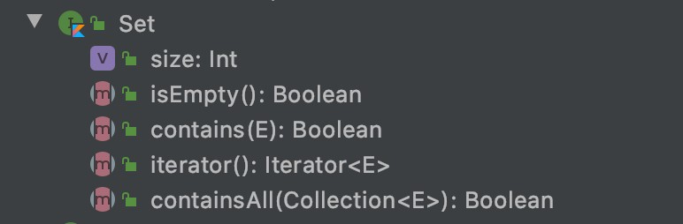

### Kode: Set

```kt
class Person(val name: String) {
	override fun hashCode(): Int {
		return name.hashCode()
	}

	override fun equals(other: Any?): Boolean = when (other) {
		is Person -> name = other.name
		else -> false
	}
}

fun main() {
	val set: Set<Person> setOf(
		Person("Eko"), Person("Kurniawan"), Person("Eko"), Person("Khannedy")
	)

	println(set.size)
	println(set.contains(Person("Eko")))
}
```

### Function di Mutable Set

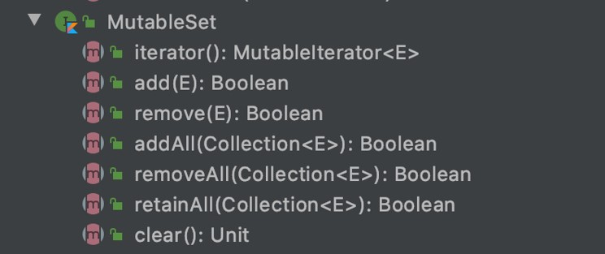

### Kode: Mutable Set

```kt
fun main() {
	val mutableSet: MutableSet<Person> = mutableSetOf()
	mutableList.add(Person("Eko"))
	mutableList.add(Person("Kurniawan"))
	mutableList.add(Person("Khannedy"))
	mutableList.add(Person("Eko"))

	println(mutableSet.size)
	println(mutableSet.contains(Person("Eko")))
}
```

## #4 Pair

- Sebelum kita bahas collection Map, ada baiknya kita mengenal Pair
- Pair adalah representasi dari data yang berpasangan
- Di Map, Pair digunakan sebagai data Map ketika pertama kali Map dibuat

### Data di Pair

```kt
public data class Pair<out A, out B>(
	public val first: A,
	public val second: B,
) : Serializable {

}
```

### Kode: Pair

```kt
fun main() {
	val pair = Pair("Eko", "Kurniawan")

	println(pair.first)
	println(pair.second)

	val pair2: Pair<String, String> "Eko" to "Kurniawan"
	println(pair.first)
	println(pair.second)
}
```

## #5 Map

- Map (atau dictionary), adalah collection yang berbentuk key-value, dimana key berperan sebagai index.
- Key harus unik, jika kita menggunakan Key yang sama, maka data sebelumnya akan di replace oleh data yang baru
- Tipe data key bisa menggunakan tipe data apapun sesuai yang kita inginkan

### Function di Map

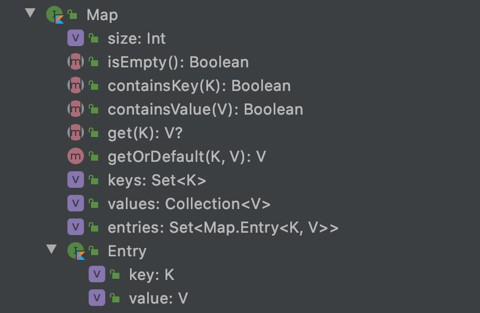

### Kode: Map

```kt
fun main() {
	val map: Map<String, String> = mapOf(
		"a" to "Eko",
		"b" to "Kurniawan",
		"c" to "Khannedy"
	)

	println(map.size)
	println(map["a"])
	println(map["b"])
	println(map["c"])
}
```

### Function di Mutable Map

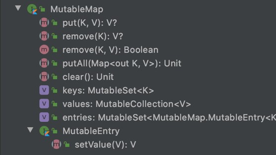

### Kode: Mutable Map

```kt
fun main() {
	val mutableMap: mutableMap<String, String> = mutableMapOf()

	mutableMap["a"] = "Eko"
	mutableMap["b"] = "Kurniawan"
	mutableMap["c"] = "Khannedy"

	println(mutableMap["a"])
	println(mutableMap["b"])
	println(mutableMap["c"])
}
```

## #5 Collection

- Semua data collection adalah turunan dari interface Collection
- Collection digunakan sebagai general operation terhadap struktur data collection, seperti membaca dan menulis data di collection

### Function di Collection

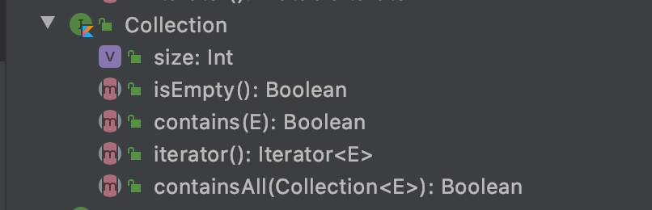

### Kode: Collection

```kt
fun <T> displayCollection(collection: Collection<T>) {
	for (item in collection) println(item)
}

fun main() {
	displayCollection(listOf("Eko", "Kurniawan", "Khannedy"))
	displayCollection(setOf("Eko", "Kurniawan", "Khannedy"))
	displayCollection(mapOf("a" to "Eko").entries)
	displayCollection(mapOf("a" to "Eko")) // Error, Map bukan Collection
}
```

### Function di Mutable Collection

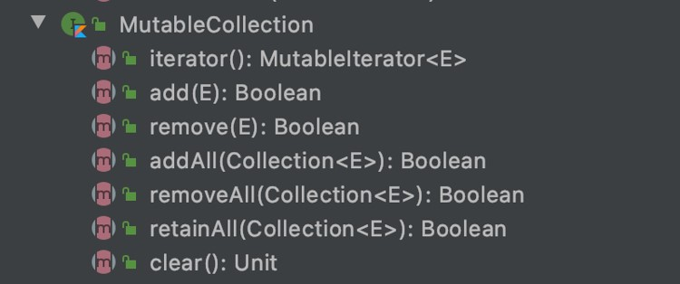

### Kode: Immutable Collection

```kt
fun <T> disaplayMutableCollection(collection: MutableCollection<T>) {
	for (item in collection) println(item)
}

fun main() {
	displayMutableCollection(mutableListOf("Eko", "Kurniawan", "Khannedy"))
	displayMutableCollection(mutableSetOf("Eko", "Kurniawan", "Khannedy"))
	displayMutableCollection(mutableMapOf("a" to "Eko").entries)
}
```

## #6 Iterable

- Iterable adalah superclass dari Collection interface
- Iterable adalah general operation untuk melakukan iterasi seluruh data di collection, atau menghapus data di collection

### Function di Iterable

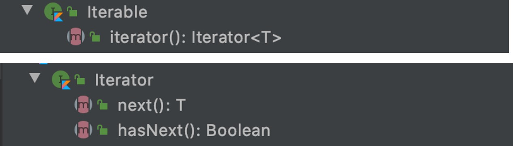

### Kode: Iterable

```kt
fun <T> displayIterable(iterable: Iterable<T>) {
	val iterator = iterable.iterator()
	while (iterator.hasNext()) println(iterator.next())
}

fun main() {
	displayIterable(listOf("Eko", "Kurniawan", "Khannedy"))
	displayIterable(setOf("Eko", "Kurniawan", "Khannedy"))
}
```

### Function di Mutable Iterable


### Kode: Mutable Iterable

```kt
fun <T> displayMutableIterable(iterable: MutableIterable<T>) {
	val iterator = iterable.iterator()
	while (iterator.hasNext()) println(iterator.next())
}

fun main() {
	displayMutableIterable(mutableListOf("Eko", "Kurniawan", "Khannedy"))
	displayMutableIterable(mutableSetOf("Eko", "Kurniawan", "Khannedy"))
}
```

## #7 Iterator

- Sebelumnya kita sudah bahas tentang Iterator di Iterable dan MutableIterator di MutableIterable
- Iterator juga memiliki child interface, yaitu ListIterator dan MutableListIterator
- ListIterator digunakan oleh List, dan MutableListIterator digunakan oleh MutableList
- Set tetap menggunakan Iterator
- Sedangkan Map tidak mendukung Iterator

### Function di ListIterator

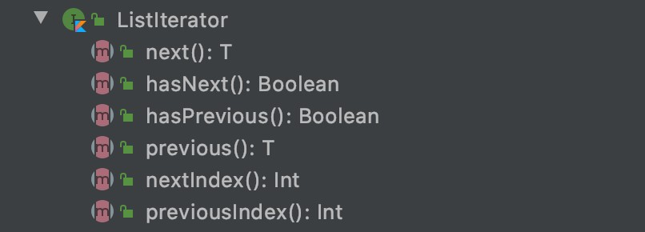

### Kode: ListIterator

```kt
fun <T> displayListIterator(listIterator: ListIterator<T>) {
	while (listIterator.hasNext()) println(listIterator.next())
	while (listIterator.hasPrevious()) println(listIterator.previous())
}

fun main() {
	displayListIterator(listOf("Eko", "Kurniawan", "Khannedy").listIterator())
}
```

### Function di MutableListIterator

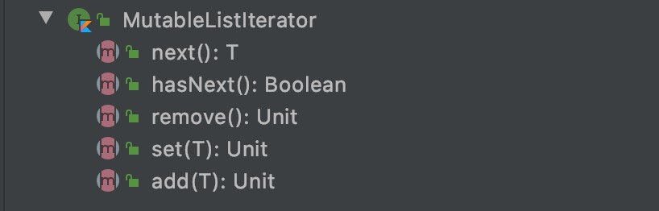

### Kode: MutableListIterator

```kt
fun <T> displayMutableListIterator(mutableListIterator: MutableListIterator<T>) {
	while (mutableListIterator.hasNext()) println(mutableListIterator.next())
}

fun removeOddNumber(mutableListIterator: MutableListIterator<Int>) {
	while (mutableListIterator.hasNext()) {
		val item = mutableListIterator.next()
		if (uteitem % 2 == 1) mutableListIterator.remove()
	}
}
```

## #8 Konversi Collection

- Di kotlin kita bisa melakukan konversi collection ke jenis collection lain secara mudah
- Misal kita ingin mengubah dari array ke list, atau dari range ke set, atau dari set ke list, bisa dilakukan dengan mudah
- Semua function dimulai dengan kata `"to"`, misal `toList`, `toSet`, `toMutableList`, dan lain-lain

### Kode: Konversi Collection

```kt
fun main() {
	val array = arrayOf(1, 2, 3, 4, 5)
	val range = 1..100
	val list = range.toList()
	val mutableList = array.toMutableList()
	val set = list.toSet()
	val mutableSet = list.toMutableSet()
	val sortedSet = list.toSortedSet()
}
```

## #9 Collection Operations

- Kotlin sudah menyediakan berbagai macam operation yang bisa kita lakukan di collection
- Sebelumnya kita sudah bahas banyak sekali operasi yang tersedia sebagai function bawaan collection
- Kotlin juga menyediakan operations tambahan berubah extension function
- Collection operations berupa extension function selalu menghasilkan collection baru, tanpa mengubah data di collection aslinya
- Oleh karena itu, collection operations di Kotlin sangat aman ketika dilakukan karena tidak akan mengubah collection aslinya

### Jenis Operations

- Transformations, melakukan transformasi terhadap collection
- Filtering, melakukan filtering atau seleksi terhadap collection
- plus and minus operators, operasi + dan - terhadap collection
- Grouping, melakukan pemisahan dalam group terhadap collection
- Retrieving collection parts, mengambil sebagian data di collection
- Retrieving single elements, mengambil satu data di collection
- Ordering, melakukan pengurutan data di collection
- Aggregate operations, melakukan agregasi terhadap data yang ada di collection

### Kode: Collection Operations

```kt
fun main() {
	listOf("Eko", "Kurniawan").forEach { value -> println(value)}
	listOf("Eko", "Kurniawan").forEachIndexed { index, value ->
		println("$index - $value")
	}
}
```

## #10 Mapping

### Transformations: Mapping

- Transformasi mapping digunakan untuk mengubah data ke data lain.
- Mapping akan membutuhkan lambda function sebagai parameter, dan akan mengembalikan collection hasil result lambda nya
- Urutan collection baru hasil dari mapping adalah sama dengan urutan collection aslinya.

### Transformations: Mapping Operations

| Mapping Operations                              | Keterangan                                                                   |
| ----------------------------------------------- | ---------------------------------------------------------------------------- |
| `map(transform: (T) -> R)`                      | Mengubah collection menjadi collection baru sesuai lambda transform          |
| `mapIndexed(transform: (index, T) -> R)`        | Mengubah collection menjadi collection baru, dengan tambahan parameter index |
| `mapNotNull(transform: (T) -> R)`               | Sama seperti `map()`, namun menghiraukan hasil `null`                        |
| `mapIndexedNotNull(transform: (index, T) -> R)` | Sama seperti `mapIndexed()` namun menghiraukan nilai `null`                  |

### Kode: Transformations Mapping

```kt
fun main() {
	val list1: List<String> = listOf("Eko", "Kurniawan", "Khannedy")
	val list2: List<String> = list1.map { item -> item.toUpperCase() }
	val list3: List<Int> = list1.map { item -> item.length }
	val list4: List<String> = list1.mapNotNull { item ->
		if (value == "Eko") value else null
 }
}
```

### Mapping Operations untuk Map

| Mapping Operations                        | Keterangan                                                                           |
| ----------------------------------------- | ------------------------------------------------------------------------------------ |
| `mapKeys(transform: (Entry<K, V> -> R)`   | Mengubah map menjadi map baru dengan nilai key baru sesuai dengan lambda transform   |
| `mapValues(transform: (Entry<K, V> -> R)` | Mengubah map menjadi map baru dengan milai value baru sesuai dengan lambda transform |

### Kode: Mapping Map

```kt
fun main() {
	val map1: Map<Int, String> = mapOf(
		1 to "Eko",
		2 to "Kurniawan",
		3 to "Khannedy"
	)
	val map2: Map<Int, String> = map1.mapKeys = { it.key = 10 }
	val map3: Map<Int< String> = map1.mapValues = { it.value.toUpperCase() }

	println(map2)
	println(map3)
}
```

## #11 Zipping

### Transformations: Zipping

- Zipping adalah transformasi yang digunakan untuk menggabungkan dua buah collection.

### Transformations: Zipping Operations

| Mapping Operations                          | Keterangan                                                                                                              |
| ------------------------------------------- | ----------------------------------------------------------------------------------------------------------------------- |
| `zip(collection)`                           | Menggabungkan dua collection, sehingga menghasilkan `Pair<T1, T2>`                                                      |
| `zip(collection, transform: (T1, T2) -> R)` | Menggabungkan dua collection dengan lambda transform sehingga menghasilkan collection baru dari result lambda transform |

### Kode: Transformations Zipping

```kt
fun main() {
	val list1 = listOf("Eko", "Kurniawan", "Khannedy")
	val list2 = listOf("Programmer", "Zaman", "Now")

	val list3: List<Pair<String, String>> = list1.zip(list2)
	val list4: List<String> list1.zip() { item1, item2 ->
		item1 + item2
	}

	println(item3)
	println(item4)
}
```

### Transformations: Unzip Operations

| Mapping Operations | Keterangan                                                                                     |
| ------------------ | ---------------------------------------------------------------------------------------------- |
| `unzip()`          | Mengubah collection `Pair<T1, T2>` menjadi dua collection, collection `T1` dan collection `T2` |

### Kode: Transformations Unzip

```kt
fun main() {
	val list: List<Pair<String, String>> = listOf(
		"Eko" to "Programmer",
		"Kurniawan" to "Zaman",
		"Khannedy" to "Now"
	)

	var pair: Pair<List<String, List<String>> = list.unzip()
}
```

## #12 Association

### Transformations: Association

- Association adalah operasi transformasi dari collection menjadi map
- Dalam beberapa operasi association, element hasil bisa menjadi key atau value

### Transformations: Association Operation

| Association Operation        | Keterangan                                 |
| ---------------------------- | ------------------------------------------ |
| `associate(T) -> Pair<K, V>` | Merubah collection `T` menjadi `Map<K, V>` |
| `associateWith(T -> V)`      | Merubah collection `T` menjadi `Map<T, V>` |
| `associateBy(T -> K)`        | Merubah collection `T` menjadi `Map<K, T>` |

### Kode: Transformations Association

```kt
fun main() {
	val list1 = listOf("Eko", "Kurniawan", "Khannedy")
	val map1: Map<String, Int> = list1.associate { Pair(it, it.length) }
	val map2: Map<String, Int> = list1.associateWith { it.length }
	val map3: Map<Int, Int> = list1.associateBy { it.length }

	println(map1)
	println(map2)
	println(map3)
}
```

## #13 Flattening

### Transformations: Flattening

- Flattening adalah operasi transformasi untuk menjadikan nested collection menjadi flat

### Transformations: Flattening Operation

| Flattering Operation          | Keterangan                                          |
| ----------------------------- | --------------------------------------------------- |
| `flatten`                     | Mengubah nested collection menjadi flat collection  |
| `flatMap((T) -> Iterable<T>)` | Mengubah collection `T` menjadi flat collection `R` |

### Kode: Transformations Flattening (1)

```kt
fun main() {
	val list1: List<List<String>> = listOf(
		listOf("Eko", "Kurniawan", "Khannedy"),
		listOf("Programmer", "Zaman", "Now")
	)
	val list2: List<String> = list1.flatten()
}
```

### Kode: Transformations Flattening (2)

```kt
class Member(val name: String, val hobbies: List<String>)

fun main() {
	val members: List<Member> = listOf(
		Member("Eko", listOf("Reading", "Gaming")),
		Member("Budi", listOf("Sport", "Traveling")),
	)
	val hobbies: List<String> = members.flatMap { it.hobbies }
}
```

## #14 String Representation

### Transformations: String Representation

- String Representations adalah operasi transformasi untuk mengubah collection menjadi string

### String Representation Operation

| String Representation Operation                            | Keterangan                                                                                                                |
| ---------------------------------------------------------- | ------------------------------------------------------------------------------------------------------------------------- |
| `joinToString(separator, prefix, suffix)`                  | Mengubah collection menjadi string dengan separator, prefix dan suffix                                                    |
| `joinToString(separator, prefix, suffix, transform)`       | Mengubah collection menjadi string dengan separator, prefix dan suffix, namun akan diubah dalam transform terlebih dahulu |
| `joinTo(Appendable, separator, prefix, suffix, transform)` | Sama seperti `joinToString` namun string ditambahkan ke Appendable                                                        |

### Kode: String Representation

```kt
fun main() {
	val names = listOf("Eko", "Kurniawan", "Khannedy")
	println(names.joinToString(" ", "|", "|"))
	println(names.joinToString(" ", "|", "|") { string -> "Item $string"})

	val appendable = StringBuilder()
	names.joinTo(appendable, ",", "|", "|") { it }
	println(appendable.toString())
}
```

## #15 Filtering

### Filtering by Predicate

- Filtering adalah salah satu operasi collection yang sangat popular
- Di kotlin, filtering bisa menggunakan predicate berupa lambda yang berisi kondisi filter nya
- Jika return dari predicate tersebut true, maka data di terima, jika false maka data dibuang

### Filtering by Predicate Operation

| Filtering Operation                    | Keterangan                                                              |
| -------------------------------------- | ----------------------------------------------------------------------- |
| `filter((T) -> Boolean)`               | Melakukan filtering terhadap collection                                 |
| `filterIndexed((index, T) -> Boolean)` | Melakukan filtering terhadap collection dengan tambahan informasi index |
| `filterNot((T) -> Boolean)`            | Kebalikan dari `filter((T) -> Boolean)`                                 |
| `filterIsInstance<T>()`                | Mengambil hanya data instant di `T`                                     |
| `filterNotNull()`                      | Mengambil hanya data yang tidak `null`                                  |

### Kode: Filtering by Predicate

```kt
fun main() {
	val list1 = listOf("Eko", "Kurniawan", "Khannedy")
	val list2 = list1.filter { it.length > 5}
	val list3 = list1.filterIndexed { index, value -> index % 2 == 0}

	val list4: List<Any?> = listOf(null, 1, "Eko", "Kurniawan", 2, null)
	val list5: List<String> = list4.filterIsInstance<String>()
	val list6: List<Any> = list4.filterNotNull()

	println(list1)
}
```

## #16 Partitioning

### Filtering: Partitioning

- Pada filtering by predicate, kita akan menghilangkan data yang tidak masuk kondisi filter
- Dengan filtering partition, kita akan membagi collection menjadi dua, dimana collection pertama yang masuk filtering, dan collection kedua yang tidak masuk filtering

### Filtering: Partitioning Operation

| Filtering Operation                                  | Keterangan                                                                                                                                     |
| ---------------------------------------------------- | ---------------------------------------------------------------------------------------------------------------------------------------------- |
| `partitiion((T) -> Boolean): Pair<List<T>, List<T>>` | Mempartisi collection dengan filtering sehingga menghasilkan Pair collection `T` yang masuk filter, dan collection `T` yang tidak masuk filter |

### Kode: Filtering Partitioning

```kt
fun main() {
	val list1 = listOf("Eko", "Kurniawan", "Khannedy")
	val (listMatch, listNotMatch) = list1.partition { it.length > 5 }
	println(list1)
	println(listMatch)
	println(listNotMatch)
}
```

## #17 Testing

### Filtering: Testing

- Filtering testing adalah operation yang bisa digunakan untuk mengecek isi data dari collection
- Hasil dari filtering testing adalah boolean, dimana true jika sesuai kondisi, dan false jika tidak sesuai kondisi

### Filtering: Testing Operation

| Filtering Operation             | Keterangan                                                   |
| ------------------------------- | ------------------------------------------------------------ |
| `any((Y) -> Boolean): Boolean`  | Mengecek apakah minimal ada satu data sesuai dengan kondisi  |
| `none((Y) -> Boolean): Boolean` | Mengecek apakah tidak ada satupun data sesuai dengan kondisi |
| `all((Y) -> Boolean): Boolean`  | Mengecek apakah samua data sesuai dengan kondisi             |
| `any()`                         | Apakah collection memiliki data                              |
| `none()`                        | Apakah collection tidak punya data                           |

### Kode: Filtering Testing Operation

```kt
fun main() {
	val list = listOf("Eko", "Kurniawan", "Khannedy")
	println(list.any { it.length > 5})
	println(list.none { it.length > 5})
	println(list.all { it.length > 5})
	println(list.any())
	println(list.none())
}
```

## #18 Plus & Minus Operations

- Di kotlin, ada operator extension function plus dan minus untuk collection
- Parameter pertama adalah collection, dan parameter selanjutnya bisa collection atau element, dan akan menghasilkan collection baru

### Plus & Minus Operations

| Plus & Minus Operations | Keterangan                                            |
| ----------------------- | ----------------------------------------------------- |
| `plus(element)`         | Membuat collection baru dengan menambahkan element    |
| `plus(collection)`      | Membuat collection baru dengan menambahkan collection |
| `minus(element)`        | Membuat collection baru dengan menghapus element      |
| `minus(collection)`     | Membuat collection baru dengan menghapus collection   |

### Kode: Plus & Minus Operations

```kt
fun main(){
	val list1 = listOf("Eko", "Kurniawan", "Khannedy")
	val list2 = list1 + "Programmer"
	val list3 = list1 + listOf("Programmer", "Zaman", "Now")
	val list4 = list1 - "Eko"
	val list5 = list1 - listOf("Kurniawan, "Khannedy")

	val map1 = mapOf("a" to "Eko", "b" to "Kurniawan")
	val map2 = map1 + ("a" to "Khannedy")
	val map3 = map1 - "a"
}
```

## #19 Grouping

- Grouping adalah operasi untuk meng-grup kan element-element yang ada di collection.

### Grouping Operations

| Grouping Operatior                     | Keterangan                                                      |
| -------------------------------------- | --------------------------------------------------------------- |
| `groupBy((T) -> K): Map<K, List<T>>`   | Menggabungkan collection menjadi group `Map<K, List<T>>`        |
| `groupingBy((T) -> K): Grouping<K, T>` | Menggabungkan collection menjadi object `Grouping<K, T>`        |
|                                        | Grouping interface akan dibahas lebih detail di materi terpisah |

### Kode: Grouping

```kt
fun main() {
	val list1: listOf("a", "a", "b", "b", "c", "c")
	val map: Map<String, List<String>> = list1.groupBy { it }
	val grouping: Grouping<String, String> = list1.groupingBy { it }

	println(map)
	println(grouping)
}
```

## #20 Slicing

- Slice adalah operator yang digunakan untuk mengambil sebagian element yang ada di collection yang sesuai dengan parameter range

### Slice Operators

| Slice Operator | Keterangan                                                                  |
| -------------- | --------------------------------------------------------------------------- |
| `slice(range)` | Mengambil sebagian element yamg ada di collection sesuai dengan index range |

### Kode: Slice

```kt
fun main() {
	val list1 = (0..100).toList()
	val list2 = list1.slice(0..50)
	val list3 = list1.slice(0..100 step 2)
	val list4 = list1.slice(100 downTo 0 step 2)

	println(list1)
	println(list2)
	println(list3)
	println(list4)
}
```

## #21 Take & Drop

- Untuk mengambil sebagian element di collection, selain menggunakan slice, kita juga bisa menggunakan operator take dan drop

### Take Operators

| Slice Operator                  | Keterangan                                                                          |
| ------------------------------- | ----------------------------------------------------------------------------------- |
| `take(n)`                       | Mengambil collection diawal sejumlah n                                              |
| `takeLast(n)`                   | Mengambil collection diakhir sejumlah n                                             |
| `takeWhile((T) -> Boolean)`     | Mengambil element dari awal selama kondisi bernilai true, jika false, maka berhenti |
| `takeWhileLast((T) -> Boolean)` | Sama seperti `takeWhile`, namun dimulai dari element akhir                          |

### Drop Operators

| Slice Operator                  | Keterangan                                                                          |
| ------------------------------- | ----------------------------------------------------------------------------------- |
| `drop(n)`                       | Menghapus collection diawal sejumlah n                                              |
|                                 |
| `dropLast(n)`                   | Menghapus collection diakhir sejumlah n                                             |
| `dropWhile((T) -> Boolean)`     | Menghapus element dari awal selama kondisi bernilai true, jika false, maka berhenti |
|                                 |
| `dropWhileLast((T) -> Boolean)` | Sama seperti dropWhile, namun dimulai dari element akhir                            |
|                                 |

### Kode: Take & Drop Operations

```kt
fun main() {
	val chars = {'a'..'z'}.toList()

	println(chars.take(3)) // [a, b, c]
	println(chars.takeWhile { it < 'f'}) // [a, b, c, d, e]
	println(chars.takeLast(2)) // [y, x]
	println(chars.takelastWhile { it > 'w'}) // [x, y, z]

	println(chars.drop(23)) // [x, y, z]
	println(chars.dropLast(23)) // [a, b, c]
	println(chars.dropWhile { it < 'x' }) // [z, y, z]
	println(chars.droplastWhile { it > 'c' }) // [a, b, c]
}
```

## #22 Chunked

### Chunked Operator

- Chunked adalah operasi untuk memotong collection menjadi beberapa collection

### Chunked Operator

| Chunked Operator                      | Keterangan                                                                                                                                                |
| ------------------------------------- | --------------------------------------------------------------------------------------------------------------------------------------------------------- |
| `chunked(n): List<List<T>>`           | Memotong collection menjadi beberapa collection dengan jumlah data `n`                                                                                    |
| `chunked(n, (List<T>) -> R): List<R>` | Memotong collection menjadi beberapa collection dengan jumlah data `n`, lalu melakukan transformasi `List<T>` menjadi `R` sehingga menghasilkan `List<R>` |

### Kode: Program Chunked

```kt
fun main() {
	val rage = (1..100).toList()
	val list1 = range.chunked(10)
	val list2 = range.chunked(10) { list: List<Int> ->
			var total = 0
			for (number in list) {
				total += number
			}
			total
	}
}
```

## #23 Windowed

### Windowed Operation

- Windowed adalah operasi untuk mendapatkan semua kemungkinan collection sesuai dengan range yang telah ditentukan

### Windowed Operator

| Windowed Operator                                | Keterangan                                                                                                     |
| ------------------------------------------------ | -------------------------------------------------------------------------------------------------------------- |
| `windowed(size, step, partialWindow)`            | Mengambil semua kemungkinan collection sebesar size, dilanjut dengan step, dan diakhiri dengan `partialWindow` |
| `windowed(size, step, partialWindow, transform)` | Sama seperti `windowed()` sebelumnya, namun hasil collection di transform                                      |

### Kode: Windowed

```kt
fun main() {
	val range = (1..5).toList()
	println(range.windowed(3, 1, false)) // [[1, 2, 3], [2, 3, 4], [3, 4, 5]]
	println(range.windowed(3, 1, false) { it.size }) // [3, 3, 3]
	println(range.windowed(3, 1, true)) // [[1, 2, 3], [2, 3, 4], [3, 4, 5], [4, 5], [5]]
	println(range.windowed(3, 1, true) { it.size }) // [3, 3, 3,2, 1]
	println(range.windowed(3, 2, false)) // [[1, 2, 3], [3, 4, 5]]
	println(range.windowed(3, 2, true)) // [[1, 2, 3], [3, 4, 5], [5]]
}
```

## #24 Retrieve by Position

### Retrieve Single Elements by Position

- Di kotlin kita bisa mengambil satu element di collection menggunakan posisi

### Retrieve Single Elements by Position

| Retrieve Single Elements Operator      | Keterangan                                                                   |
| -------------------------------------- | ---------------------------------------------------------------------------- |
| `elementAt(index)`                     | Mengambil element pada posisi index                                          |
| `first()`                              | Mengambil element pertama                                                    |
| `last()`                               | Mengambil element terakhir                                                   |
| `elementAtOrNull(index)`               | Mengambil element pada posisi index, Null jika tidak ada index               |
| `elementAtOrElse(index, defaultValue)` | Mengambil element pada posisi index. Atau default value jika tidak ada index |

### Kode: Retrieve Single Elements by Position

```kt
fun main() {
	val list = listOf("Eko", "Kurniawan", "Khannedy")
	println(list.first())
	println(list.last())
	println(list.elementAt(1))
	println(list.elementAtOrNull(10))
	println(list.elementAtOrElse(10) { " " })
}
```

## #25 Retrieve by Condition

- Selain mengambil satu element di collection berdasarkan posisi, kita juga bisa mengambil single element berdasarkan kondisi

### Retrieve Single Elements by Position

| Retrieve Single Elements by Position      | Keterangan                                                               |
| ----------------------------------------- | ------------------------------------------------------------------------ |
| `first((T) -> Boolean)`                   | Mengambil element pertama yang seduai kondisi                            |
| `last((T) -> Boolean)`                    | Mengambil element terakhir yang sesuai dengan kondisi                    |
| `firstOrNull((T) -> Boolean) / find()`    | Mengambil element pertama yang sesuai kondisi, atau null jika tidak ada  |
| `lastOrNull((T) -> Boolean) / findLast()` | Mengambil element terakhir yang sesuai kondisi, atau null jika tidak ada |

### Kode: Single Element by Condition

```kt
fun main() {
	val range = (1..20).toList()
	println(range.first { it > 10 }) // 11
	println(range.last { it > 10 }) // 20
	println(range.firstOrNull { it > 50 }) // null
	println(range.lastOrNull { it > 50 }) // null
	println(range.find { it > 50 }) // null
	println(range.findLast { it > 50 }) // null
}
```

## #26 Retrieve by Random

- Kotlin juga mendukung operasi untuk mengambil element secara random di dalam collection

### Retrieve Single Element by Position

| Retrieve Single Element Operator | Keterangan                      |
| -------------------------------- | ------------------------------- |
| `random()`                       | Mengambil element secara random |

### Kode: Single Element by Randim

```kt
fun main() {
	val range = (1..100).toList()
	println(range.random())
	println(range.random())
	println(range.random())
	println(range.random())
	println(range.random())
}
```

## #27 Checking Existence

- Kotlin mendukung operasi untuk mengecek apakah dalam collection terdapat data yang kita cari

### Checking Existence Operator

| Checking Existence Operator           | Keterangan                                                       |
| ------------------------------------- | ---------------------------------------------------------------- |
| `contains(element): Boolean`          | Mengecek apakah terdapat element di collection                   |
| `containsAll(Collection<T>): Boolean` | Mengecek apakah terdapat element di collection `T` di collection |
| `isEmpty(): Boolean`                  | Mengecek apakah collection kosong                                |
| `isNotEmpty(): Boolean`               | Mengecek apakah collection tidak kosong                          |

### Kode: Checking Existence

```kt
fun main() {
	val range = (1..10).toList()
	println(range.contains(5))
	println(range.containsAll(listOf(3, 4, 5)))
	println(range.isEmpty())
	println(range.isNotEmpty())
}
```

## #28 Ordering

- Mengurutkan data sudah menjadi salah satu kebiasaan yang kita lakukan saat membuat program
- Kotlin mendukung operasi untuk mengurutkan collection
- Pada materi Kotlin Generic kita sudah belajar tentang interface Comparable, yaitu interface yang digunakan untuk melakukan perbandingan dua buat object, yang biasanya digunakan untuk mengurutkan data
- Secara default tipe data yang ada di kotlin sudah memiliki Comparable (seperti Number, Char atau String). Oleh karena itu kita tidak perlu lagi membuat Comparable sendiri untuk mengurutkan data tersebut

### Ordering: Natural Operator

| Ordering: Natural Operator | Keterangan                               |
| -------------------------- | ---------------------------------------- |
| `sorted()`                 | Mengurutkan collection secara ascending  |
| `sortedDescending()`       | Mengurutkan collection secara descending |

### Kode: Ordering Natural

```kt
fun main() {
	val numbers = listOf(1, 4, 2, 4, 6, 3, 5)
	println(numbers.sorted()) // [1, 2, 3, 4 5, 6]
	println(numbers.sortedDescending()) // [6, 5, 4, 3, 2, 1]
}
```

## #29 Custom Order

### Ordering: Custom

- Selain menggunakan comparable bawaan kotlin, kita juga bisa membuat comparable sendiri
- Ini cocok untuk mengurutkan data yang kita buat sendiri

### Ordering: Custom Operator

| Ordering: Custom Operator                | Keterangan                                                    |
| ---------------------------------------- | ------------------------------------------------------------- |
| `sortedBy(selector: (T) -> R)`           | Mengurutkan collection secara ascending menggunakan selector  |
| `sortedByDescending(selector: (T) -> R)` | Mengurutkan collection secara descending menggunakan selector |
| `sortedWith(Comparator<T>)`              | Mengurutkan collection dengan `Comparator<T>`                 |

### Kode: Ordering Custom

```kt
data class Fruit(val name: String, val quantity: Int)

fun main() {
	val fruits = listOf(Fruit("Apple", 10), Fruit("Orange", 5))
	println(fruits.sortedBy { it.quantity })
	println(fruits.sortedByDescending { it.quantity })
	println(fruits.sortedByWith(comapareBy { it.quantity }))
	println(fruits.sortedByWith(comapareByDescending { it.quantity }))
	println(fruits.sortedByWith(Comparator { a, b ->
			a.quantity.compareTo(b.quantity)
	}))
}
```

## #30 Reverse Order

- Di Kotlin, kita bisa mendapatkan collection dengan urutan data terbalik dari data aslinya

### Ordering: Reverse Order

| Ordering: Reverse Operator | Keterangan                                                                                                           |
| -------------------------- | -------------------------------------------------------------------------------------------------------------------- |
| `reversed()`               | Membuat collection baru dengan urutan terbalik dari collection aslinya                                               |
| `asReversed()`             | Membuat view terhadap collection dengan urutan terbalik, jika collection aslinya berubah, view pun akan ikut berubah |

### Kode: Ordering Reverse

```kt
fun main() {
	val list1 = mutableListOf("Eko", "Kurniawan", "Khannedy")
	val listReverse = list1.reversed()
	val listAsReverse = list1.asReversed()
	list1.add("Programmer")
	println(listReverse) // [Khannedy, Kurniawan, Eko]
	println(listAsReverse) // [Programmer, Khannedy, Kurniawan, Eko]
}
```

## #31 Random Order

### Ordering: Random

- Di Kotlin, kita juga bisa mengacak isi element di collection

### Ordering: Random Operator

| Ordering: Random Operator | Keterangan                                           |
| ------------------------- | ---------------------------------------------------- |
| `shuffled()`              | Membuat collection baru dengan posisi element random |

### Kode: Ordering Random

```kt
fun main() {
	val numbers = (1..10).toList()
	println(numbers.shuffled())
	println(numbers.shuffled())
	println(numbers.shuffled())
	println(numbers.shuffled())
}
```

## #32 Aggregate

- Kotlin memiliki berbagai operasi untuk melakukan aggregate

### Aggregate Operator

| Aggregate Operator                            | Keterangan                                             |
| --------------------------------------------- | ------------------------------------------------------ |
| `max() dan min()`                             | Mengambil nilai maksimal dan minimal                   |
| `average()`                                   | Mengambil nilai rata-rata                              |
| `sum()`                                       | mengambil nilai jumlah seluruh element                 |
| `count()`                                     | Mengambil berapa banyak element                        |
| `maxBy(selector) dan minBy(selector)`         | Mengambil nilai maksimal dan minimal                   |
| `maxWith(Comparator) dan minWith(Comparator)` | Mengambil nilai maksimal dan minimal sesuai comparator |
| `sumBy(selector)`                             | Mengambil nilai jumlah seluruh element sesuai selector |
| `sumByDouble(selector)`                       | Sama sengan `sumBy()` hamun menghasilkan Double        |

### Kode: Aggregate

```kt
fun main() {
	val numbers = (1..100).toList()
	println(numbers.max())
	println(numbers.min())
	println(numbers.average())
	println(numbers.sum())
}
```

## #33 Fold & Reduce

- Jika kita ingin membuat aggregate secara manual, kita bisa menggunakan operator `fold` dan `reduce`
- Fold dan reduce merupakan operasi yang dilakukan pada element-element yang ada di collection secara iterasi sequential dan mengembalikan hasil.
- Hasil dari fold dan reduce akan digunakan untuk iterasi selanjutnya.

### Fold & Reduce Operator

| Fold & Reduce Operator                      | Keterangan                                                                                                                               |
| ------------------------------------------- | ---------------------------------------------------------------------------------------------------------------------------------------- |
| `reduce((R, T) -> R): R `                   | Pada iterasi pertama, R adalah element pertama, T adalah element selanjutnya iterasi selanjutnya, R adalah hasil dari iterasi sebelumnya |
| `reducfold(R, (R, T) -> R): R `             | fold sama dengan reduce, yang membedakan adalah, fold memiliki inisial value R, yang bisa kita masukkan secara manual                    |
| `reduceRight() & foldRight()`               | Sama seperti `reduce()` dan `fold()` namun dimulai dari element akhir                                                                    |
| `reduceIndexed() & foldIndexed()`           | Sama seperti `reduce()` dan `fold()` namun terdapat parameter index                                                                      |
| `reduceRightIndexed() & foldRightIndexed()` | Sama seperti `reduceIndexed()` dan `foldIndexed()` namun dimulai dari element akhir                                                      |

### Kode: Fold & Reduce

```kt
fun main() {
	val numbers = (1..100).toList()
	val max = numbers.reduce { acc, i ->
		if (acc < i) i
		else acc
	}
	val sum = numbers.fold(0) { acc, i ->
		acc + i
	}
	println(max)
	println(sum)
}
```

## #34 Grouping Interface

- Sebelumnya kita sudah bahas tentang operasi Grouping, salah satunya adalah groupingBy yang menghasilkan object dari interface Grouping

### Grouping Interface Operator

| Grouping Interface Operator                                      | Keterangan                                                                                                                          |
| ---------------------------------------------------------------- | ----------------------------------------------------------------------------------------------------------------------------------- |
| `eachCount()`                                                    | Menghitung jumlah data di tiap group                                                                                                |
| `reduce() dan fold()`                                            | Operasi `reduce()` dan `fold()` di tiap group                                                                                       |
| `aggregate(key: K. accumulator: R?, element: T, first: Boolean)` | Operasi aggregate data di tiap group dimana jika data pertama parameter first bernilai `true`, dan accumulator akan bernilai `null` |

### Kode: Grouping Interface

```kt
fun main() {
	val list1 = listOf("a", "a", "b", "b", "c", "c")
	var grouping: Grouping<String, String> = list1.groupingBy { it }
	println(grouping.eachCount())
	println(grouping.fold("") { accumulator, element -> accumulator + element })
	println(grouping.reduce { key, accumulator, element -> accumulator + element })
	println(grouping.aggregate { key, accumulator: String?, element, first ->
		if (first) element
		else accumulator + element
	})
}
```

## #35 List Specific Operations

- Di kotlin ada banyak operasi yang khusus dibuat untuk List

### List Specific Operatior (1)

| List Specific Operatior          | Keterangan                                                            |
| -------------------------------- | --------------------------------------------------------------------- |
| `getOrElse(index, (index) -> T)` | Mengambil element di index, jika tidak ada mengembalikan nilai lambda |
| `getOrNull(index)`               | Mengambil element di index, jika tidak ada mengembalikan null         |
| `subList(from, to)`              | Mengambil semua slement dari from (inclusive) ke to (exlcusive)       |
| `binarySearch(value)`            | Melakukan pencarian menggunakan algoritma binary search               |

### Kode: List Specific Operator

```kt
fun main() {
	val list = listOf("Eko", "Kurniawan", "Khannedy")
	println(list.getOrNull(1)) // Kurniawan
	println(list.getOrElse(5) { i -> "Ups" }) // Ups
	println(list.subList(0, 2)) // [Eko, Kurniawan]

	val sortedList = list.sorted()
	println(sortedList.binarySearch("Eko")) // 0
}
```

### List Specific Operatior (2)

| List Specific Operatior        | Keterangan                                                |
| ------------------------------ | --------------------------------------------------------- |
| `indexOf(value)`               | Mengambil index element yang sama dengan value            |
| `lastIndexOf(value)`           | Mengambil index element terakhir yang sama dengan value   |
| `indexOfFirst((T) -> Boolean)` | Mengambil index element yang sama dengan kondisi          |
| `indexOfLast((T) -> Boolean)`  | Mengambil index element terakhir yang sama dengan kondisi |

### Kode: List Specific Operator

```kt
fun main() {
	val numbers = listOf(1, 1, 2, 2, 3, 3, 4, 4, 5, 5)
	println(numbers.indexOf(2)) // 2
	println(numbers.listIndexOf(3)) // 5
	println(numbers.indexOfFirst { it > 3 }) // 6
	println(numbers.indexOfLast { it > 3 }) // 9
}
```

## #36 Set Specific Operations

- Di kotlin juga terdapat operations yang khusus digunakan untuk Set

### Set Specific Operatior

| Set Specific Operatior  | Keterangan                                               |
| ----------------------- | -------------------------------------------------------- |
| `union(collection)`     | Mengembalikan semua selement dari kedua set              |
| `intersect(collection)` | Mengembalikan semua element yang terdapat di kedua set   |
| `substract(collection)` | Mengembalikan semua element yang tidak dimiliki oleh set |

### Kode: Set Specific Operator

```kt
fun main() {
	val numbers1 = (1..10).toSet()
	val numbers2 = (6..15).toSet()

	println(numbers1 union numbers2)
	// [1, 2, 3, 4, 5, 6, 7, 8, 9, 10, 11, 12, 13, 14, 15]
	println(numbers1 intersect numbers2)
	// [6, 7, 8, 9, 10]
	println(numbers1 substract numbers2)
	// [1, 2, 3, 4, 5]
}
```

## #37 Map Specific Operations

- Di kotlin juga terdapat banyak operasi yang khusus untuk Map

### Map Specific Operator

| Map Specific Operator             | Keterangan                                                  |
| --------------------------------- | ----------------------------------------------------------- |
| `getOrElse(key, (key) -> V)`      | Mengambil value sesuai key, jika tidak bisa eksekusi lambda |
| `getValue(key)`                   | Mengambil value sesuai kay, atau throw exception            |
| `filter((Entry<K, V) -> Boolean)` | Filter sesuai kondisi                                       |
| `filterKeys((K) -> Boolean)`      | Filter dengan kondisi key                                   |
| `filterValues((V) -> Boolean)`    | Filter dengan kondisi value                                 |

### Kode: Map Specific Operations

```kt
fun main() {
	val map = mapOf("a" to "Eko", "b" to "Kurniawan", "c" to "Khannedy")
	println(map.getValue("a")) // Eko
	println(map.getOrElse("a") { "Ups" }) // Ups
	println(map.filter { (key, value) -> value.length > 5 }) // {b=Kurniawan, c=Khannedy}
	println(map.filterKeys { key -> key > "b"}) // {c=Kurniawan}
	println(map.filterValues { value -> value.length > 5 }) // {b=Kurniawan, c=Khannedy}
}
```

## #38 Sequence

- Selain List, Set dan Map, di Kotlin juga terdapat collection yang bernama Sequence
- Sequence sekilas sama dengan collection lain, namun berbeda cara kerjanya ketika kita menambahkan banyak operasi ke sequence
- Collection lain, ketika kita menambahkan beberapa operasi, semua akan dieksekusi secara eager. Setiap proses akan mengembalikan collection baru.
- Berbeda dengan sequence, sequence mengeksekusi semua operasi secara lazy. Hanya akan dieksekusi ketika dibutuhkan

### Kode: Bukan Sequence

```kt
fun main() {
	val words = "The quick brown fox jumps over the lazy dog".split(" ")
	val lengthsList = words
		.filter { println("filter: $it"); it.length > 3 }
		.map { println("length: ${it.length}"); it.length }
		.take(4)

	println("Lengths of first 4 words longer than 3 chars")
	println(lengthsList)
}
```

### Flow Bukan Sequence

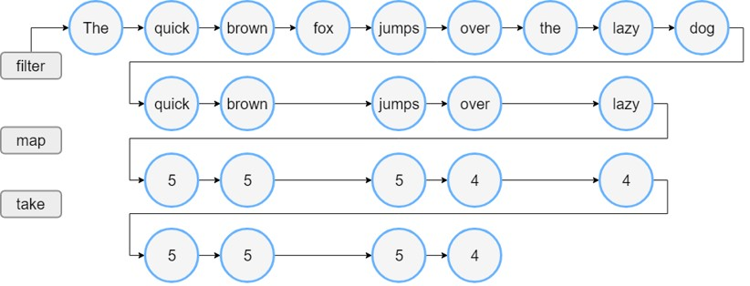

### Kode: Sequence

```kt
fun main() {
	val words = "The quick brown fox jumps over the lazy dog".split(" ")
	val wordsSequence = words.asSequence()

	val lengthsSequence = wordsSequence
		.filter { println("filter: $it"); it.length > 3 }
		.map { println("length: ${it.length}"); it.length }
		.take(4)

	println("Lengths of first 4 words longer than 3 chars")
	println(lengthsSequence.toList())
}
```

### Flow Sequence

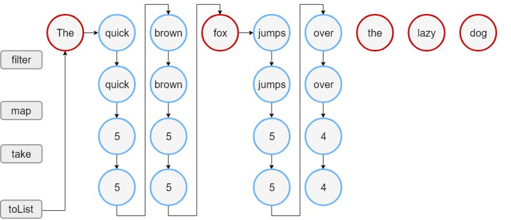

### Kapan Menggunakan Sequence?

Gunakan ketika:

- Data collection besar
- Operasi collection kompleks dan banyak

Jangan gunakan ketika :

- Data collection tidak terlalu besar, karena ada overhead lazy object di Sequence
- Operasi yang dilakukan sederhana

## #39 Properties di Map

- Salah satu hal yang biasa dilakukan dalam membuat program adalah, menyimpan value properties di Map
- Kadang ini dilakukan ketika parsing data JSON atau hal-hal dinamis lainnya.
- Dalam keadaan seperti ini, kita bisa melakukan delegate properties di Map

### Kode: Properties di Map

```kt
class Application(map: Map<String, Any>) {
	val name: String by map
	val version: String by map
}

fun main() {
	val application = Application(mapOf(
		"name" to "Kotlin App",
		"version" to 1
	))
	println(appendable.name)
	println(appendable.version)
}
```

## #40 Destructuring Declarations di Map

- Sebelumnya kita telah belajar destructuring declaration
- Map menyimpan datanya dalam `Entry<K,V>`, dimana Entry memiliki function `component1()` untuk mendapatkan Key, dan `component2()` untuk mendapatkan Value
- Hal ini jadi memungkinkan kita melakukan desctructuring di Entry Map

### Kode: Destructuring Declarations di Map

```kt
fun main() {
	val map = mapOf(
		"a" to "Eko", "b" to "Kurniawan", "c" to "Khannedy"
	)

	for ((key, value) in map) {
		println("$key : $value")
	}

	map.forEach { (key, value) -> println("$key : $value") }
	map.forEach { entry -> println("${entry.component1()} : ${entry.component2()}") }
}
```

## #41 Materi Selanjutnya

- Gradle
- Kotlin Unit Test
- Kotlin Coroutine
