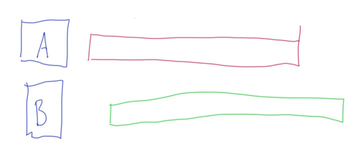
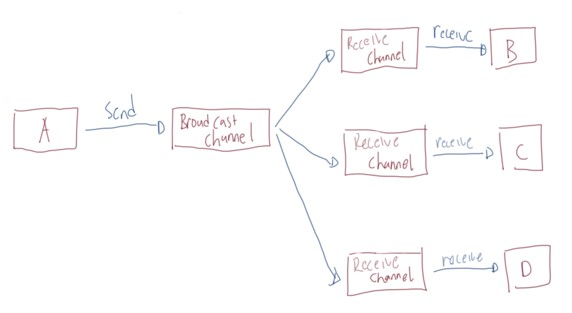

# Kotlin Coroutine

## Sebelum Belajar

- Kotlin Dasar
- Kotlin Object Oriented Programming
- Kotlin Generic & Collection
- Gradle
- Kotlin Unit Test
- <https://www.udemy.com/course/pemrograman-kotlin-pemula-sampai-mahir/?referralCode=98BE2E779EB8A0BEC230>

## Agenda

- Pengenalan Parallel dan Concurrency Programming
- Thread, ExecutorService dan Future
- Pengenalan Coroutine
- Job
- Async Function
- Deferred
- Coroutine Context, Dispatcher dan Scope
- Channel, Flow dan lain-lain

## #1 Pengenalan Parallel Programming

- Saat ini kita hidup di era multicore, dimana jarang sekali kita menggunakan prosesor yang single core
- Semakin canggih perangkat keras, maka software pun akan mengikuti, dimana sekarang kita bisa dengan mudah membuat proses parallel di aplikasi.
- Parallel programming sederhananya adalah memecahkan suatu masalah dengan cara membaginya menjadi yang lebih kecil, dan dijalankan secara bersamaan pada waktu yang bersamaan pula

### Contoh Parallel

- Menjalankan beberapa aplikasi sekaligus di sistem operasi kita (office, editor, browser, dan lain-lain)
- Beberapa koki menyiapkan makanan di restoran, dimana tiap koki membuat makanan masing-masing
- Antrian di Bank, dimana tiap teller melayani nasabah nya masing-masing

### Process vs Thread

| Process                                      | Thread                                                      |
| -------------------------------------------- | ----------------------------------------------------------- |
| Process adalah sebuah eksekusi program       | Thread adalah segmen dari process                           |
| Process mengonsumsi memory besar             | Thread menggunakan memory kecil                             |
| Process saling terisolasi dengan proses lain | Thread bisa saling berhubungan jika dalam process yang sama |
| Procses lama untuk dijalankan dan dihentikan | Thread cepat untuk dijalankan dan dihentikan]               |

## #2 Membuat Project

- Membuat project menggunakan Gradle
- Menggunakan JUnit 5
- Menambahkan dependency kotlin coroutine

## #3 Thread Utama

- Saat kita menjalankan sebuah process (aplikasi) Kotlin di JVM, secara otomatis proses tersebut akan jalan di sebuah thread utama
- Thread utama tersebut bernama main thread (JVM)
- Saat kita menjalankan process JUnit, JUnit pun berjalan di thread tersendiri
- Begitu juga jika kita membuat aplikasi kotlin Android, aplikasi tersebut akan berjalan di sebuah thread

### Kode: Thread Utama

```kt
fun main() {
	val threadName = Thread.currentThread().name
	println(threadName)
}
```

### Kode: Thread Utama JUnit

```kt
package belajar.kotlin.coroutine

import org.junit.jupiter.api.Test

class ThreadTest {

	@Test
	fun testMainThread() {
		val threadName = Thread.currentThread().name
		println("Thread Name: $threadName")
	}
}
```

## #4 Membuat Thread

- Kotlin menggunakan Java Thread, sehingga pembuatan Thread di Kotlin sama seperti pembuatan Thread di Java
- Untuk membuat Thread, kita bisa menggunakan interface `Runnable` sebagai kode program yang akan dieksekusi, lalu menggunakan method 1 untuk menjalankan Thread tersebut
- Ingat, Thread akan berjalan secara paralel, sehingga tidak akan ditunggu oleh Thread utama
- Kotlin memiliki helper function bernama `thread()` jika kita ingin membuat thread lebih singkat dan mudah

### Kode: Membuat Thread

```kt
@Test
fun testThread() {
	val runnable = Runnable {
		println(Date())
		Thread.sleep(2_000)
		println("Hello Thread")
	}

	val thread = Thread(runnable)
	thread.strt()
	thread.sleep(1_000)
	println(Date())
}
```

## #5 Multiple Thread

- Tidak ada batasan dalam membuat Thread
- Kita bisa membuat Thread sebanyak yang kita mau
- Semua Thread akan berjalan sendiri-sendiri secara paralel

### Kode: Multiple Thread

```kt
@Test
fun testThread() {
	val runnable = Runnable {
		println(Date())
		Thread.sleep(2_000)
		println("Hello Thread")
	}

	val thread1 = Thread(runnable)
	val thread2 = Thread {
		println(Date())
		Thread.sleep(2_000)
		println("Hello Thread ${Thread.currentThread().name}")
	}
	thread1.strt()
	thread2.strt()
	Thread.sleep(3_000)
	println("Done ${Date()}")
}
```

## #6 Executor Service

### Masalah Dengan Thread

- Thread adalah object yang lumayan berat, sekitar `512kb - 1MB`, sehingga jika terlalu banyak membuat Thread, penggunaan memory di aplikasi kita akan membengkak
- Sehingga penggunaan Thread secara manual sangat tidak disarankan
- Thread sendiri sebenernya bisa digunakan ulang jika proses sudah selesai dilakukan

### ExecutorService

- ExecutorService adalah fitur di JVM yang bisa digunakan untuk manajemen Thread.
- Penggunakan ExecutorService lebih direkomendasikan dibandingkan menggunakan Thread secara manual
- ExecutorService adalah sebuah interface, untuk membuat objectnya, kita bisa menggunakan class `Executors`, terdapat banyak helper method di class Executors.

### Executors Method

| Method                    | Keterangan                                                                 |
| ------------------------- | -------------------------------------------------------------------------- |
| `newSingleThreadExecutor` | Membuat ExecutorService dengan `1` thread                                  |
| `newFixedThreadPool(Int)` | Membuat ExecutorService dengan `n` thread                                  |
| `newCachedThreadPool()`   | Membuat ExecutorService dengan thread yang akan meningkat sesuai kebutuhan |

### Threadpool

- Implementasi ExecutorService yang terdapat di class Executors adalah class `ThreadPoolExecutor`
- Di dalam ThreadPool, terdapat data queue (antrian) tempat menyimpan semua proses sebelum di eksekusi oleh Thread yang tersedia di ThreadPool
- Hal ini jadi kita bisa mengeksekusi sebanyak-banyaknya Runnable walaupun Thread tidak cukup untuk mengeksekusi semua Runnable
- Runnable yang tidak dieksekusi akan menunggu di queue sampai Thread sudah selesai mengeksekusi Runnable yang lain

### Kode: Menggunakan ExecutorService

```kt
@Test
fun testExecutorService() {
	val executorService = Executors.newSingleThreadExecutor()
	(1..10).forEach {
		executorService.execute {
			Thread.sleep(1_000)
			println("Done $it ${Date()} in ${Thread.currentThread().name}")
		}
	}
	Thread.sleep(11_000)
	println("DONE PROGRAM ${Date()}")
}
```

## #7 Future

### Calable

- Sebelumnya kita sudah tau, bahwa Thread akan mengeksekusi isi method run yang ada di interface Runnable, hanya saja masalahnya, return value dari Runnable adalah void (unit), artinya tidak mengembalikan data
- Jika kita ingin mengeksekusi sebuah kode yang mengembalikan data, kita bisa menggunakan interface `Callable`, dimana terdapat method call dan return value nya adalah `generic`
- Kita bisa menggunakan `ExecutorService.submit(callable)` untuk mengeksekusi Callable, dan hasilnya adalah sebuah `Future<T>`

### Future

- Future merupakan return value untuk eksekusi Callable
- Dengan Future, kita bisa mengecek status apakah proses telah selesai, atau bisa mendapatkan data hasil return callable, atau bahkan membatalkan proses callable yang sedang berjalan

### Kode: Future Method

```kt
val executorService = Executors.newFixedThreadPool(10)

fun getFoo(): Int {
	Thread.sleep(1000)
	return 10
}

fun getBar(): Int {
	Thread.sleep(1000)
	return 10
}
```

### Kode: Future Get

```kt
@Test
fun testFutureGet() {
	val time = massureTimeMillis {
		val foo = executorService.submit(Callable { getFoo() })
		val bar = executorService.submit(Callable { getBar() })

		val total = foo.get() + bar.get()
		println("Total is $total")
	}
	println("Time : $time")
}
```

## #8 Pengenalan Concurrency Programming

### Parallel vs Concurrency

- Berbeda dengan paralel (menjalankan beberapa pekerjaan secara bersamaan), concurrency adalah menjalankan beberapa pekerjaan secara bergantian
- Dalam parallel kita biasanya membutuhkan banyak Thread, sedangkan dalam concurrency, kita hanya membutuhkan sedikit Thread

### Diagram Parallel



### Diagram Concurrency


### Contoh Concurrency

- Saat kita makan di cafe, kita bisa makan, lalu ngobrol, lalu minum, makan lagi, ngobrol lagi, minum lagi, dan seterusnya. Tetapi kita tidak bisa pada saat yang bersamaan minum, makan dan ngobrol, hanya bisa melakukan satu hal pada satu waktu, namun bisa berganti kapanpun kita mau.

### CPU-bound

- Banyak algoritma dibuat yang hanya membutuhkan CPU untuk menjalankannya. Algoritma jenis ini biasanya sangat tergantung dengan kecepatan CPU.
- Contoh yang paling populer adalah Machine Learning, oleh karena itu sekarang banyak sekali teknologi Machine Learning yang banyak menggunakan GPU karena memiliki core yang lebih banyak dibanding CPU biasanya.
- Jenis algoritma seperti ini tidak ada benefitnya menggunakan Concurrency Programming, namun bisa dibantu dengan implementasi Parallel Programming.

### I/O-bound

- I/O-bound adalah kebalikan dari sebelumnya, dimana biasanya algoritma atau aplikasinya sangat tergantung dengan kecepatan input output devices yang digunakan.
- Contohnya aplikasi seperti membaca data dari file, database, dan lain-lain.
- Kebanyakan saat ini, biasanya kita akan membuat aplikasi jenis seperti ini.
- Aplikasi jenis I/O-bound, walaupun bisa terbantu dengan implementasi Parallel Programming, tapi benefitnya akan lebih baik jika menggunakan Concurrency Programming.
- Bayangkan kita membaca data dari database, dan Thread harus menunggu 1 detik untuk mendapat balasan dari database, padahal waktu 1 detik itu jika menggunakan Concurrency Programming, bisa digunakan untuk melakukan hal lain lagi

## #9 Pengenalan Coroutine

### Problem di Java Thread

- Java Thread tidak didesain untuk melakukan Concurrency Programming.
- Java Thread hanya bisa melakukan satu hal sampai selesai, baru melakukan hal lain
- Salah satu implementasi Concurrency Programming yang saat ini paling populer adalah Go-Lang Goroutine
- Untungnya di Kotlin, ada fitur yang bernama Coroutine, salah satu implementasi Concurrency Programming

### Pengenalan Coroutine

- Coroutine sering diistilahkan sebagai lightweight thread (thread ringan), walaupun sebenernya coroutine sendiri bukanlah thread.
- Coroutine sebenarnya di eksekusi di dalam thread, namun dengan coroutine sebuah thread bisa memiliki kemampuan untuk menjalankan beberapa coroutine secara bergantian (concurrent)
- Artinya jika sebuah thread menjalankan 10 coroutine, sebenarnya thread akan menjalankan coroutine satu per satu secara bergantian
- Perbedaan lain thread dan coroutine adalah coroutine itu murah dan cepat, sehingga kita bisa membuat ribuan atau bahkan jutaan coroutine secara cepat dan murah tanpa takut kelebihan memory

### Suspend Function

- Suspend computation adalah komputasi yang bisa ditangguhkan (ditunda waktu eksekusinya).
- Sebelumnya kita tahu untuk menangguhkan komputasi di Java, kita biasanya menggunakan `Thread.sleep()`, sayangnya `Thread.sleep()` akan mem-block thread yang sedang berjalan saat ini. Sehingga tidak bisa digunakan.
- Kotlin memiliki sebuah fitur bernama suspending function, dimana kita bisa menangguhkan waktu eksekusi sebuah function, tanpa harus mem-block thread yang sedang menjalankannya.
- Syarat menjalankan suspend function di Kotlin adalah, harus dipanggil dari suspend function lainnya.

### Kode: Suspend Function

```kt
@Test
fun testSuspend() {
	runBlocking {
		helloWorld()
	}
}

suspend fun helloWorld() {
	println("Hello World : ${Date()")
	delay(2_000)
	println("Hello World : ${Date()")
}
```

## #10 Membuat Coroutine

- Coroutine tidak bisa berjalan sendiri, dia perlu berjalan di dalam sebuah Scope.
- Salah satu scope yang bisa kita gunakan adalah GlobalScope (masih banyak scope yang ada, dan akan kita bahas nanti dimateri tersendiri)
- Untuk membuat coroutine, kita bisa menggunakan method `launch()`
- Dan di dalam coroutine, kita bisa memanggil suspend function

### Kode: Membuat Coroutine

```kt
@Test
fun tsetCoroutine() {
	GlobalScope.launch {
		world()
	}
	println("Hello")
	runBlocking {
		delay(2_000)
	}
}

suspend fun word() {
	deplay(1_000)
	println("World")
}
```

## #11 Coroutine Sangat Ringan

- Seperti yang sebelumnya dibahas, coroutine itu ringan dan cepat, sehingga saat kita membuat coroutine dalam jumlah besar, ini tidak akan berdampak terlalu besar dengan memory yang kita gunakan
- Sekarang kita akan coba bandingkan membuat thread dan coroutine dalam jumlah banyak

### Kode: Membuat Thread Banyak

```kt
@Test
fun testThread() {
	(1..100000).forEach {
		thread {
			Thread.sleep(1000)
			println("Thread $it : ${Date()}")
		}
	}

	Thread.sleep(10_000)
	println("Done")
}
```

### Kode: Membuat Coroutine Banyak

```kt
@Test
fun testCoroutine() {
	(1..100000).forEach {
		GlobalScope.launch {
			delay(1000)
			println("Coroutine $id : ${Date()}")
		}
	}

	runBlocking { delay(10_000) }
	println("Done")
}
```

## #12 Job

- Saat sebuah coroutine dijalankan menggunakan function launch, sebenarnya function tersebut mengembalikan sebuah object `Job`
- Dengan object Job, kita bisa menjalankan, membatalkan atau menunggu sebuah coroutine

### Kode: Coroutine di runBlocking

```kt
@Test
fun testJob() {
	runBlocking {
		// blocking tidak akan menunggu coroutine
		GlobalScope.launch {
			delay(2000)
			println("Hello World")
		}
	}
}
```

### Kode: Menjalankan Job

```kt
@Test
fun testJobStart() {
	runBlocking {
		val job: Job = GlobalScope.launch(start = CoroutineStart.LAZY) {
			delay(2000)
			println("Hello World")
		}
		job.start()
		delay(3000)
	}
}
```

### Kode: Menunggu Job

```kt
@Test
fun testJobJoin() {
	runBlocking {
		val job: Job = GlobalScope.launch {
			delay(2000)
			println("Hello World")
		}
		job.join()
	}
}
```

### Kode: Membatalkan Job

```kt
@Test
fun testJobCancel() {
	runBlocking {
		val job: Job = GlobalScope.launch {
			delay(2000)
			println("Hello World")
		}
		job.cancel()
		deplay(3000)
	}
}
```

## #13 joinAll Function

- Kadang kita akan membuat coroutine lebih dari satu sekaligus
- Untuk menunggu semua Job coroutine selesai berjalan kita bisa menggunakan `join()` function
- Namun jika kita panggil satu-satu tiap Job coroutine nya, akan sangat mengganggu sekali
- Kotlin menyediakan `joinAll(jobs)` function untuk menunggu semua job selesai

### Kode: joinAll Function

```kt
@Test
fun testJoinAll() {
	runBlocking {
		val job1 = GlobalScope.launch {
			delay(1000)
			println("Job 1")
		}
		val job2 = GlobalScope.launch {
			delay(2000)
			println("Job 2")
		}
		joinAll(job1, job2)
	}
}
```

## # Cancellable Coroutine

- Sebelumnya kita sudah tahu bahwa Job bisa kita batalkan menggunakan function cancel
- Membatalkan coroutine kadang diperlukan, misal ketika kode program di coroutine terlalu lama
- Semua function yang ada di package `kotlinx.coroutines` bisa dibatalkan.
- Namun, jika dalam kode program kita, kita tidak mengecek status cancel, maka coroutine yang kita buat tidak akan bisa dibatalkan

### Kode: Coroutine Tidak Bisa Dibatalkan

```kt
@Test
fun testCanNotCancel() {

	runBlocking {
		val job = GlobalScope.launch {
			println("Hello ${Date()}")
			Thread.sleep(2_000)
			println("World ${Date()}")
		}

		job.cancel()
		job.join()
	}
}
```

### Agar Coroutine Bisa Dibatalkan

- Untuk mengecek apakah coroutine masih aktif atau tidak (selesai / dibatalkan), kita bisa menggunakan field `isActive` milik `CoroutineScope`
- Untuk menandakan bahwa coroutine dibatalkan, kita bisa throw `CancellationException`

### Kode: Membatalkan Coroutine

```kt
@Test
fun testCancel() {
	runBlocking {
		val job = GlobalScope.launch {
			if (!isActive) throw CancellationException()
			println("Hello ${Date()}")
			ensureActive()
			Thread.sleep(2_000)
			ensureActive()
			println("World ${Date()}")
		}

		job.cancel()
		job.join()
	}
}
```

## #15 Setelah Coroutine di Cancel

- Standard coroutine adalah, ketika sebuah coroutine dibatalkan, maka kita perlu throw `CancellableException`
- Karena throw CancellableException, artinya jika kita ingin melakukan sesuatu ketika sebuah coroutine dibatalkan, kita bisa menggunakan block `try-finally`

### Kode: Try Finally di Couroutine

```kt
@Test
fun testCancelFinally() {
	runBlocking {
		val job = GlobalScope.launch {
			try {
				println("Hello ${Date()}")
				delay(2000)
				println("World ${Date()}")
			} finally {
				println("Finally")
			}
		}
		job.cancelAndJoin()
	}
}
```

## #16 Timeout

### Menggunakan Timeout

- Kadang kita ingin sebuah coroutine berjalan tidak lebih dari waktu yang telah ditentukan
- Sebenarnya kita bisa melakukan hal tersebut secara manual, dengan cara menjalankan 2 job, dimana job ke dua akan membatalkan job pertama jika job pertama terlalu lama
- Namun hal ini tidak perlu kita lakukan lagi, terdapat function `withTimeout` untuk melakukan hal tersebut.
- Jika terjadi timeout melebihi waktu yang telah kita tentukan, maka secara otomatis function withTimeout akan throw `TimeoutCancellationException`

### Kode: Menggunakan Timeout

```kt
@Test
fun testTimeout() {
	runBlocking {
		val job = GlobalScope.launch {
			withTimeout(5_000) {
				repeat(100) {
					delay(1000)
					println("Timeout ${Date()")
				}
			}
		}
		job.join()
	}
}
```

### Timeout Tanpa Membatalkan Coroutine

- withTimeout akan throw `TimeoutCancellationException`, dimana itu adalah turunan dari `CancellationException`
- Hal ini berakibat coroutine akan berhenti karena kita throw `exception`
- Jika ada kasus dimana kita tidak ingin menghentikan coroutine-nya, kita bisa menggunakan function `withTimeoutOrNull`, dimana ini tidak akan throw `exception`, hanya mengembalikan `null` jika terjadi timeout

### Kode: Timeout or Null

```kt
@Test
fun testTimeoutOrNull() {
	runBlocking {
		val job = GlobalScope.launch {
			println("Coroutine Start")
			withTimeoutOrNull(5_000) {
				repeat(100) {
					delay(1000)
					println("Timeout ${Date()}")
				}
			}
			println("Coroutine End")
		}
		job.join()
	}
}
```

## #17 Sequential Suspend Function

### Suspend Function Tidak Async

- Secara default, sebenarnya sebuah suspend function tidaklah async, saat kita mengakses beberapa suspend function, semua akan dieksekusi secara sequential

### Kode: Sequential Suspend Function

```kt
suspend fun getFoo(): Int {
	delay(1000)
	return 10
}

suspend fun getBar(): Int {
	delay(1000)
	return 10
}

@Test
fun testSuspend() {
	runBlocking {
		val total = measureTimeMillis {
			getFoo()
			getBar()
		}
		println("Total time: $total")
	}
}
```

### Concurrent Dengan Launch

- Jadi agar sebuah suspend function bisa berjalan secara concurrent, kita perlu menggunakan function launch ketika memanggil suspend function tersebut
- Hal yang menyulitkan adalah, launch function mengembalikan Job, dan di dalam Job, kita tidak bisa mengembalikan nilai hasil dari coroutine.
- Hal ini bisa dianalogikan bahwa launch itu alah menjalankan coroutine yang mengembalikan nilai Unit (tidak mengembalikan nilai)

### Kode: Concurrent Dengan Launch

```kt
@Test
fun testSuspendConcurrent() {
	runBlocking {
		val total = measureTimeMillis {
			val job1 = GlobalScope.launch { getFoo() }
			val job2 = GlobalScope.launch { getBar() }

			job1.join()
			job2.join()
		}
		println("Total time: $total")
	}
}
```

## #18 Async Function

- Untuk membuat coroutine, kita tidak hanya bisa menggunakan function launch, ada function async yang bisa kita gunakan juga untuk membuat coroutine
- Berbeda dengan launch function yang mengembalikan Job, async function mengembalikan Deferred
- Deferred adalah turunan dari Job, yang membedakan adalah, Deferred membawa value hasil dari async function
- Deferred itu mirip konsep Promise atau Future, dimana datanya akan ada nanti
- Jika kita ingin menunggu data di Deferred sampai ada, kita bisa menggunakan method `await()`

### Kode: Async Function

```kt
@Test
fun testSuspendAsync() {
	runBlocking {
		val total = measureTimeMillis {
			val foo = GlobalScope.async { getFoo() }
			val bar = GlobalScope.async { getBar() }
			var total = foo.await() * bar.await()
			println("Total is : $total")
		}
		println("Total time : $total")
	}
}
```

## #19 awaitAll Function

- Pada materi sebelumnya kita membuat beberapa async coroutine, lalu kita menggunakan await function untuk menunggu hasil nya
- Pada job, tersedia joinAll untuk menunggu semua launch coroutine selesai
- Kotlin juga menyediakan `awaitAll` untuk menunggu semua Deferred selesai mengembalikan value
- `awaitAll` merupakan generic function, dan mengembalikan `List<T>` data hasil dari semua Deffered nya

### Kode: awaitAll Function

```kt
@Test
fun testAwaitAll() {
	runBlocking {
		val total = measureTimeMillis {
			val foo = GlobalScope.async { getFoo() }
			val bar = GlobalScope.async { getBar() }
			val total = awaitAll(foo, bar).sum()
			println("Total is : $total")
		}
		println("Total time : $total")
	}
}
```

## #20 Coroutine Context

- Coroutine selalu berjalan dibarengi dengan object `CoroutineContext`
- CoroutineContext adalah sebuah kumpulan data `CoroutineContext.Element`, yang paling utama contohnya adalah Job (turunan dari `CoroutineContext.Element`) dan `CoroutineDispatcher` (yang akan dibahas di materi tersendiri)

### Kode: Mengakses Coroutine Context

```kt
@ExperimentalStdLibApi
@Test
fun teatContext() {
	runBlocking {
		val job = GlobalScope.launch {
			val context: CoroutineContext = coroutineContext
			println(context)
			println(context[Job])
			println(context[CoroutineDispatcher])
		}
	}
}
```

## #21 Coroutine Dispatcher

- Selain ada Job di dalam `CoroutineContext`, ada juga object `CoroutineDispatcher`.
- `CoroutineDispatcher` digunakan untuk menentukan thread mana yang bertanggung jawab untuk mengeksekusi coroutine
- Secara default sudah ada setting default dispatcher, namun kita bisa menggantinya jika kita mau

### Dispatchers

Ada object Dispatchers yang bisa kita gunakan untuk mengganti `CoroutineDispatcher`

- `Dispatchers.Default`, ini adalah default dispatcher, isinya minimal 2 thread, atau sebanyak jumlah cpu (mana yang lebih banyak). Dispatcher ini cocok untuk proses coroutine yang cpu-bound
- `Dispatcher.IO`, ini adalah dispatcher yang berisikan thread sesuai dengan kebutuhan, ketika butuh akan dibuat, ketika sudah tidak dibutuhkan, akan dihapus, mirip cache thread pool di executor service. Dispatcher ini akan sharing thread dengan Default dispatcher
- `Dispatchers.Main`, ini adalah dispatchers yang berisikan main thread UI, cocok ketika kita butuh running di thread main seperti di Java Swing, JavaFX atau Android. Untuk menggunakan ini, kita harus menambah library ui tambahan

### Kode: Menggunakan Dispatcher

```kt
@Test
fun testDispatcher() {
	println("Unit test in thread ${Thread.currentThread().name}")
	runBlocking {
		printlN("runBlocing in thread ${thread.currentThread().name}")
		val job1 = GlobalScope.launch(Dispatchers.Default) {
			println("Job 1 run in thread ${thread.currentThread().name}")
		}
		val job2 = GlobalScope.launch(Dispatchers.IO) {
			println("Job 2 run in thread ${thread.currentThread().name}")
		}
		listOf(job1, job2).forEach { it.join() }
	}
}
```

### Unconfined vs Confined

Selain Default, IO dan Main, ada juga beberapa dispatchers yang lain

- `Dispatchers.Unconfined`, ini adalah dispatcher yang tidak menunjuk thread apapun, biasanya akan melanjutkan thread di coroutine sebelumnya
- `Confined` (tanpa parameter), ini adalah dispatcher yang akan melanjutkan thread dari coroutine sebelumnya

Apa bedanya Unconfined dan Confined, pada Unconfined, thread bisa berubah di tengah jalan jika memang terdapat code yang melakukan perubahan thread

### Kode: Unconfined va Confined

```kt
@Test
fun testDispatcher() {
	runBlocking {
		GlobalScope.launch(Dispatchers.Unconfined) {
			println("Unconfined : in thread ${thread.currentThread().name}")
			delay(1000)
			println("Unconfined : in thread ${thread.currentThread().name}")
		}
		GlobalScope.launch {
			println("Confined : in thread ${thread.currentThread().name}")
			delay(1000)
			println("Confined : in thread ${thread.currentThread().name}")
		}

		delay(3_000)
	}
}
```

## #22 Membuat Coroutine Dispatcher

- Saat membuat aplikasi, kadang kita ingin flexible menentukan thread yang akan kita gunakan untuk menjalankan coroutine
- Misal, kita ingin membedakan thread untuk layer web, layer http client, dan lain-lain
- Oleh karena ini, membuat Coroutine Dispatcher sendiri sangat direkomendasikan.
- Untuk membuat Coroutine Dispatcher secara manual, kita bisa melakukannya dengan cara menggunakan `ExecutorService`

### Kode: Membuat Coroutine Dispatcher

```kt
@Test
fun testCreateDispatcher() {
	val dispatcherService = Executors.newFixedThreadPool(10).asCoroutineDispatcher()
	val dispatcherWeb = Executors.newFixedThreadPool(10).asCoroutineDispatcher()

	runBlocking {
		val job1 = GlobalScope.launch(dispatcherService) {
			println("Service run in thread ${Thread.currentThread().name}")
		}
		val job2 = GlobalScope.launch(dispatcherWeb) {
			println("Web run in thread ${Thread.currentThread().name}")
		}
		listOf(job1, job2).forEach { it.join() }
	}
}
```

## #23 withContext Function

- Sebelumnya kita sudah tahu, bahwa ternyata saat kita melakukan `delay()`, suspend function tersebut akan di trigger di thread yang berbeda.
- Bagaimana caranya jika kita ingin menjalankan code program kita dalam coroutine di thread yang berbeda dengan thread coroutine awalnya?
- Untuk melakukan itu, kita bisa menggunakan function `withContext()`
- Function `withContext()` sebenarnya bisa kita gunakan untuk mengganti `CoroutineContext`, namun karena `CoroutineDispatcher` adalah turunan `CoroutineContext`, jadi kita bisa otomatis mengganti thread yang akan digunakan di coroutine menggunakan function `withContext()`

### Kode: Menggunakan Function `withContext()`

```kt
@Test
fun testWithContext() {
	val dispatcherClient = Executors.newFixedThreadPool(10).asCoroutineDispatcher()

	runBlocking {
		val job = GlobalScope.launch(Dispatchers.IO) {
			println("1. This code run in ${Thread.currentThread().name}")
			withContext(dispatcherClient) {
				println("2. This code run in ${Thread.currentThread().name}")
			}
			println("3. This code run in ${Thread.currentThread().name}")
		}
		joib.join()
	}
}
```

## #24 Non Cancellable Context

### Check isActive di Finally

- Sebelumnya kita tahu bahwa setelah coroutine di cancel, dan jika kita ingin melakukan sesuatu, kita bisa menggunakan block try-finally
- Namun dalam block finally, kita tidak bisa menggunakan suspend method yang mengecek `isActive`, karena otomatis akan bernilai `false`, dan otomatis batal

### Kode: Check isActive di Finally

```kt
@Test
fun testCancelFinally() {
	runBlocking {
		val job = GlobalScope.launch {
			try {
				println("Hello ${Date()}")
				delay(2000)
				println("Hello ${Date()}")
			} finally {
				println(isActive)
				delay(2000)
				println("Finally")
			}
		}
		job.cancelAndJoin()
	}
}
```

### Non Cancellable Context

- Jika kita butuh memanggil suspend function yang mengecek isActive di block finally, dan berharap tidak dibatalkan eksekusinya, maka kita bisa menggunakan NonCancellable
- NonCancellable adalah coroutine context yang mengoverride nilai-nilai cancellable sehingga seakan-akan coroutine tersebut tidak di batalkan

### Kode: Non Cancellable Context

```kt
@Test
fun testNonCancellable() {
	runBlocking {
		val job = GlobalScope.launch {
			try {
				println("Hello ${Date()}")
				delay(2000)
				println("World ${Date()")
			} finally {
				withContext(NonCancellable) {
					println(isActive)
					delay(1000)
					println("Finally")
				}
			}
		}
		job.cancelAndJoin()
	}
}
```

## #25 Coroutine Scope

- Sampai saat ini, kita selalu menggunakan GlobalScope untuk membuat coroutine. Kita belum membahas sama sekali tentang apa itu `GlobalScope?` GlobalScope sebenarnya adalah salah satu implementasi Coroutine Scope
- Semua coroutine itu sebenarnya dijalankan dari sebuah coroutine scope.
- Function launch dan async yang selama ini kita gunakan, sebenarnya adalah extention function dari coroutine scope
- Secara sederhana, coroutine scope adalah object life cycle nya coroutine.

### Penggunaan Coroutine Scope

- CoroutineScope biasanya digunakan dalam sebuah flow yang saling berhubungan
- Misal saat kita membuka sebuah halaman di mobile, maka kita akan membuat screen, lalu mengambil data ke server, lalu setelah mendapatkanya kita akan menampilkan data tersebut di screen.
- Flow tersebut harus saling terintegrasi, jika misal flow tersebut sukses maka harus sukses semua, jika dibatalkan, maka harus dibatalkan proses selanjutnya
- Hal tersebut jika diibaratkan tiap aktivitas adalah coroutine, maka flow tersebut di simpah dalam sebuah coroutine scope.

### GlobalScope

- Sebelumnya kita selalu menggunakan GlobalScope untuk membuat coroutine
- Sebenarnya penggunaan GlobalScope tidak dianjurkan dalam pembuatan aplikasi
- Hal ini dikarenakan, jika semua coroutine menggunakan GlobalScope, maka secara otomatis akan sharing coroutine scope, hal ini agak menyulitkan saat kita misal ingin membatalkan sebuah flow, karena saat sebuah coroutine scope di batalkan, maka semua coroutine yang terdapat di scope tersebut akan dibatalkan

### Kode: Membuat Coroutine Scope

```kt
@Test
internal fun testNewScope() {
	val scope = CoroutineScope(Dispatchers.Default)
	scope.launch {
		delay(2000)
		println("2000: ${Date()}")
	}
	scope.launch {
		delay(1000)
		println("1000: ${Date()}")
	}
}
```

### Kode: Membatalkan Coroutine Scope

```kt
@Test
internal fun testNewScope() {
	val scope = CoroutineScope(Dispatchers.Default)
	scope.launch {
		delay(2000)
		println("2000: ${Date()}")
	}
	scope.launch {
		delay(1000)
		println("1000: ${Date()}")
	}
	runBlocking {
		delay(1000)
		scope.cancel()
		delay(3000)
	}
}
```

## #26 coroutineScope Function

- Kadang pembuatan coroutine scope itu terlalu kompleks jika hanya untuk kasus-kasus yang sederhana, misal saja kita hanya ingin menggabungkan beberapa suspend function, lalu mengembalikan nilai tersebut
- Pada kasus yang sederhana, kita bisa menggunakan coroutineScope function untuk menggabungkan beberapa suspend function
- Saat ada error di coroutine yang terdapat di dalam coroutine scope function tersebut, maka semua coroutine pun akan dibatalkan

### Kode: coroutineScope Function

```kt
suspend fun getFoo(): Int {
	delay(1000)
	return 10
}

suspend fun getBar(): Int {
	delay(1000)
	return 10
}

suspend fun getSum(): Int = coroutineScope {
	val foo = async { getFoo() }
	val bar = async { getBar() }
	foo.await() + bar.await()
}

@Test
fun testCoroutineScope() {
	val scope = CoroutineScope(Dispatchers.IO)
	val job = scope.launch {
		val result = getSum()
		println("Results: $result")
	}

	runBlocking {
		job.join()
	}
}
```

## #27 Coroutine Scope Parent & Child

- Saat kita membuat sebuah coroutine scope dengan menggunakan function coroutineScope, sebenarnya kita telah membuat child scope dari parent scope nya
- Coroutine scope itu saling berkaitan antara parent dan child nya
- Saat kita membuat child scope, secara otomatis child scope akan menggunakan dispatcher milik parent
- Dan saat kita membatalkan parent scope, maka semua child scope nya pun akan dibatalkan

### Kode: Dispatcher Child Scope

```kt
@Test
fun testChildDispatcher() {
	val parentDispatcher = Executors.newFixedThreadPool(10).asCoroutineDispatcher()
	val parentScope = CoroutineScope(parentDispatcher)
	val job = parentScope.launch {
		println("Parent thread is : ${Thread.currentThread().name}")
		coroutineScope {
			launch {
				println("Child thread is : ${Thread.currentThread().name}")
			}
		}
	}
	runBlocking {
		job.join()
	}
}
```

### Kode: Membatalkan Parent Scope

```kt
val job = parentScope.launch {
	coroutineScope {
		launch {
			delay(1000)
			println("Child thread is : ${Thread.currentThread().name}")
		}
	}
	delay(1000)
	println("Parent thread is : ${Thread.currentThread().name}")
}
runBlocking {
	job.cancelAndJoin()
}
```

## #28 Coroutine Parent & Child

- Selain coroutine scope, coroutine sendiri bisa memiliki child coroutine
- Saat membuat coroutine child, secara otomatis kita akan mewarisi coroutine context yang ada di coroutine parent
- Dan coroutine parent akan menunggu sampai eksekusi coroutine child nya selesai semua

### Kode: Coroutine Parent & Child

```kt
@Test
fun testParentChild() {
	 runBlocking {
	 	val job = GlobalScope.launch {
	 		launch {
	 			delay(2000)
	 			println("Child 1 finish")
	 		}
	 		launch {
	 			delay(4000)
	 			println("Child 2 finish")
	 		}
	 		delay(1000)
	 		println("Parent finish")
	 	}
	 	job.join()
 	}
}
```

## #29 cancelChildren Function

- Sebelumnya sudah dibahas kalo coroutine itu memiliki parent dan child
- Coroutine akan direpresentasikan sebagai Job (Deferred tuturan dari Job), dan di Job kita bisa mendapatkan semua children nya menggunakan field children
- Selain itu ada sebuah function bernama cancelChildren, function ini bisa kita gunakan untuk membatalkan semua coroutine children.
- Jika kita membatalkan Job parent, kita tidak perlu membatalkan children nya secara manual, karena saat Job di batalkan, semua child nya akan dibatalkan

### Kode: cancelChildren Function

```kt
@Test
fun testCancelChildren() {
	 runBlocking {
	 	val job = GlobalScope.launch {
	 		launch {
	 			delay(2000)
	 			println("Child 1 finish")
	 		}
	 		launch {
	 			delay(4000)
	 			println("Child 2 finish")
	 		}
	 		delay(1000)
	 		println("Parent finish")
	 	}
	 	delay(2000)
	 	job.cancelChildren()
	 	job.join()
 	}
}
```

## #30 Memberi Nama Coroutine

- Selain dispatcher, salah satu coroutine context yang lain adalah `CoroutineName`
- CoroutineName bisa kita gunakan untuk mengubah nama coroutine sesuai dengan yang kita mau
- Hal ini sangat bermanfaat ketika kita melakukan proses debugging

### Kode: Memberi Nama Coroutine

```kt
@Test
fun testName() {
	val scope = CoroutineScope(Dispatchers.IO)
	val job = scope.launch(CouroutineName("parent")) {
		println("Run in thread : ${Thread.currentThread().name}")
		withContext(CouroutineName("child")) {
			println("Run in thread : ${Thread.currentThread().name}")
		}
	}
	runBlocking {
		job.join()
	}
}
```

## #31 Menggabungkan Context Element

- Seperti yang pernah dibahas di materi CoroutineContext
- CoroutineContext adalah kompulan dari Element-Element, contoh turunannya adalah Job, CoroutineDispatcher dan yang terakhir yang sempat kita bahas adalah CoroutineName
- CoroutineContext memiliki method plus, sehingga sebenarnya kita bisa menggabungkan beberapa context element secara sekaligus, misal Dispatcher dan CoroutineName misalnya

### Kode: Menggabungkan Context Element

```kt
@Test
fun testCombineContextElement() {
	val dispatcher = Executors.newSingleThreadExecutor().asCoroutineDispatcher()
	val scope = CoroutineScope(dispatcher + CoroutineName("parent"))
	val job = scope.launch {
		println("Run in thread : ${Thread.currentThread().name}")
		withContext(CouroutineName("child") + Dispatchers.IO) {
			println("Run in thread : ${Thread.currentThread().name}")
		}
	}
	runBlocking {
		job.join()
	}
}
```

## #32 yield Function

- Seperti yang pernah kita bahas sebelumnya, bahwa suspend function akan dijalankan secara sequential, artinya jika ada sebuah suspend function yang panjang dan lama, ada baiknya kita beri kesempatan ke suspend function lainnya untuk dijalankan.
- Coroutine berjalan secara concurrent, artinya 1 dispatcher bisa digunakan untuk mengeksekusi beberapa coroutine secara bergantian. Saat coroutine kita berjalan, dan jika kita ingin memberi kesempatan ke coroutine yang lain untuk berjalan, kita bisa menggunakan `yield` function
- yield function itu bisa di cancel, artinya jika sebuah coroutine telah dibatalkan, maka secara otomatis yield function akan throw `CancellationException`

### Kode: Sequential Coroutine

```kt
suspend fun runJob(number: Int) {
	println("Start job $number : ${Thread.currentThread().name}")
	println("End job $number : ${Thread.currentThread().name}")
}

@Test
fun testSequential() {
	val dispatcher = Executors.newFixedThreadPool(2).asCoroutineDispatcher()
	val scope = CoroutineScope(dispatcher)
	runBlocking {
		scope.launch { runJob(1) }
		scope.launch { runJob(2) }
		delay(2000)
	}
}
```

### Kode: yield Function

```kt
suspend fun runJob(number: Int) {
	println("Start job $number : ${Thread.currentThread().name}")
	yield()
	println("End job $number : ${Thread.currentThread().name}")
}

@Test
fun testYield() {
	val dispatcher = Executors.newFixedThreadPool(2).asCoroutineDispatcher()
	val scope = CoroutineScope(dispatcher)
	runBlocking {
		scope.launch { runJob(1) }
		scope.launch { runJob(2) }
		delay(2000)
	}
}
```

## #33 awaitCancellation Function

- Secara default, sebuah coroutine akan berhenti ketika seluruh code selesai dijalankan
- Jika ada kebutuhan kita tidak mau coroutine berhenti sampai di Job nya di cancel, maka kita bisa menggunakan function `awaitCancellation`
- Function awaitCancellation akan throw `CancellationException` jika job di cancel, dan tidak akan menghentikan coroutine jika belum di cancel

### Kode: awaitCancellation Function

```kt
@Test
fun testAwaitCancellation() {
	runBlocking {
		val job = launch {
			try {
				println("Do something")
				awaitCancellation()
			} finally {
				println("Couroutine cancelled")
			}
		}

		delay(500)
		job.cancelAndJoin()
	}

}
```

## #34 Exception Handling

### Except Propagation

- Secara garis besar, exception di coroutine itu ada yang di ekspose ke yang memanggil coroutine ada yang tidak.
- Pada launch, exception tidak akan di ekspose ketika memanggil function join, namun pada `async` exception akan di expose ketika memanggil function `await`

### Kode: Exception Launch

```kt
@Test
fun testExceptionLaunch() {
	runBlocking {
		val job = GlobalScope.launch {
			println("launch coroutine")
			throw IllegalArgumentException()
		}
		job.join()
		println("Finish coroutine")
	}
}
```

### Kode: Exception Async

```kt
@Test
fun testExceptionAsync() {
	runBlocking {
		val deferred = GlobalScope.async<String> {
			println("launch coroutine")
			throw IllegalArgumentException()
		}
		try {
			val result = deferred.await()
			println("Finish async")
		} finally {
			println("Finally async")
		}
	}
}
```

### Coroutine Exception Handler

- Kadang kita ingin mengatur cara penangkapan exception di coroutine, hal ini bisa dilakukan dengan menggunakan interface `CoroutineExceptionHandler`
- CoroutineExceptionHandler adalah turunan dari `CoroutineContext.Element`, sehingga kita bisa menambahkannya kedalam coroutine context
- Ingat jenis CancellationException (dan turunannya) tidak akan diteruskan ke exception handler
- Coroutine exception handler hanya jalan di launch, tidak jalan di async, untuk async, kita tetap harus menangkap exception nya secara manual

### Kode: Coroutine Exception Handler

```kt
@Test
internal fun testExceptionHandler() {
	val exceptionHandler = CoroutineExceptionHandler { coroutineContext, throwable ->
		println("Ups, erro with message ${throwable.message}")
	}
	val scope = CoroutineScope(exceptionHandler + Dispatchers.IO)
	val job = scope.launch(exceptionHandler) {
		println("Job run")
		throw IllegalArgumentException("Ups")
	}
	runBlocking {
		job.join()
	}
}
```

## #35 Supervisor Job

### Job

- Secara default, saat kita membuat coroutine scope atau menjalankan coroutine, tipe coroutine tersebut adalah Job
- Dalam Job, saat terjadi error di salah satu coroutine, maka error tersebut akan di propagate ke parent nya
- Dan secara otomatis parent akan membatalkan semua coroutine

### Job Diagram


### Kode: Job

```kt
@Test
internal fun testJob() {
	val dispatcher = Executors.newFixedThreadPool(10).asCoroutineDispatcher()
	val scope = CoroutineScope(Job() + dispatcher)
	val job1 = scope.launch {
		delay(2000)
		println("Job 1 complete")
	}
	val job2 = scope.launch {
		delay(1000)
		throw IllegalArgumentException("Job 2 failed")
	}
	runBlocking {
		joinAll(job1, job2)
	}
}
```

### Supervisor Job

- SupervisorJob adalah tipe Job lainnya
- Supervisor job bisa menjadikan setiap coroutine memiliki kemampuan untuk error secara mandiri
- Hal ini berakibat jika ada coroutine error, parent tidak akan membatalkan seluruh coroutine yang lain

### Supervisor Job Diagram


### Kode: Supervisor Job

```kt
@Test
internal fun testSupervisorJob() {
	val dispatcher = Executors.newFixedThreadPool(10).asCoroutineDispatcher()
	val scope = CoroutineScope(SupervisorJob() + dispatcher)
	val job1 = scope.launch {
		delay(2000)
		println("Job 1 complete")
	}
	val job2 = scope.launch {
		delay(1000)
		throw IllegalArgumentException("Jon 2 failed")
	}
	runBlocking {
		joinAll(job1, job2)
	}
}
```

## #36 supervisorScope Function

- Kadang ada kondisi dimana kita tidak memiliki akses untuk mengubah sebuah coroutine scope
- Karena secara default sifatnya adalah Job, maka kita bisa menggunakan `supervisorScope` function untuk membuat coroutine yang sifatnya `SupervisorJob`

### Kode: supervisorScope Function

```kt
@Test
internal fun testSupervisorScopeFunction() {
	val dispatcher = Executors.newFixedThreadPool(10).asCoroutineDispatcher()
	val scope = CoroutineScope(Job() + dispatcher)
	runBlocking {
		scope.launch {
			supervisorScope {
				launch {
					delay(2000)
					println("Job 1 complete")
				}
				launch {
					delay(1000)
					throw IllegalArgumentException()
				}
			}
		}

		delay(3000)
	}
}
```

## #37 Exception Handler di Job vs Supervisor Job

- Exception handler di Job ataupun di Supervisor Job secara default akan di propagate ke parent nya
- Artinya jika kita membuat `CoroutineExceptionHandler`, kita harus membuatnya di parent, tidak bisa di coroutine child nya.
- Jika kita menambahkan exception handler di coroutine child nya, maka itu tidak akan pernah digunakan

### Kode: Exception Handler Salah di JOb

```kt
@Test
fun testExceptionJob() {
	val exceptionHandler = CoroutineExceptionHandler { coroutineContext, throwable ->
		println("Error happen ${throwable.message}")
	}
	val dispatcher = Executors.newFixedThreadPool(10).asCoroutineDispatcher()
	val scope = CoroutineScope(dispatcher)

	runBlocking {
		val job = scope.launch {
			launch(exceptionHandler) { // wrong, error will propagete to parent
				println("Job 1")
				throw IllegalArgumentException("Job 1 Error")
			}
		}
		joinAll(job)
	}
}
```

### Exception Handler dengan supervisorScope

- Salah satu cara agar exception handler bisa dilakukan di coroutine child adalah dengan menggunakan `supervisorScope`
- Saat menggunakan supervisorScope, maka exception bisa di gunakan di parent coroutine di supervisorScope, atau sebenarnya coroutine child di scope yang ada diatas nya
- Tapi ingan jika terjadi error di child nya coroutine yang ada di supervisorScope, maka tetap akan di propagate ke parent coroutine di `supervisorScope`

### Kode: Exception Handler supervisorScope

```kt
@Test
fun testExceptionSupervisorJob() {
	val exceptionHandler = CoroutineExceptionHandler { coroutineContext, throwable ->
		println("Error happen ${throwable.message}")
	}
	val dispatcher = Executors.newFixedThreadPool(10).asCoroutineDispatcher()
	val scope = CoroutineScope(Job() + dispatcher)

	runBlocking {
		val job = scope.launch {
			supervisorScope {
				launch(exceptionHandler) {
					launch {
						println("Job 1")
						throw IllegalArgumentException("job 1 Error")
					}
				}
			}
		}
		join(job)
	}
}
```

## #38 Mutex

### Shared Mutable State

- Saat kita belajar Kotlin Collection, kita sudah tau tentang Immutable dan Mutable
- Saat menggunakan coroutine, sangat disarankan untuk menggunakan data `Immutable`, apalagi jika data tersebut di sharing ke beberapa coroutine
- Hal ini agar datanya aman, karena tidak bisa diubah oleh coroutine lain, jadi tidak akan terjadi problem `race condition`
- Namun, bagaimana jika ternyata kita memang butuh sharing mutable data di beberapa coroutine secara sekaligus?

### Kode: Race Condition

```kt
@Test
fun testCounter() {
	var counter = 0
	val dispatcher = Executors.newFixedThreadPool(10).asCoroutineDispatcher()
	val scope = CoroutineScope(dispatcher)
	repeat(100) {
		scope.launch { repeat(1000) { counter++ } }
	}
	runBlocking  { delay(10_000) }
	println("Total counter : $counter")
}
```

### Mutex

- Mutex (Mutual exclusion) adalah salah satu fitur di Kotlin Coroutine untuk melakukan proses `locking`
- Dengan menggunakan mutex, kita bisa pastikan bahwa hanya ada 1 coroutine yang bisa mengakses kode tersebut, code coroutine yang lain akan menunggu sampai coroutine pertama selesai

### Kode: Mutex

```kt
@Test
fun testCounter() {
	var counter = 0
	val dispatcher = Executors.newFixedThreadPool(10).asCoroutineDispatcher()
	val scope = CoroutineScope(dispatcher)
	val mutex = Mutex()
	repeat(100) {
		scope.launch {
			repeat(1000) {
				mutex.withLock {
		  		counter++
				}
		 	}
		}
	}
	runBlocking  { delay(10_000) }
	println("Total counter : $counter")
}
```

## #39 Semaphore

- Sama seperti Mutex, Semaphore juga digunakan sebagai object untuk locking
- Namun yang membedakan, pada Mutex, kita hanya memperbolehkan 1 coroutine yang bisa mengakses nya pada satu waktu
- Namun pada Semaphore, kita bisa menentukan berapa jumlah corotine yang boleh mengakses nya pada satu waktu

### Kode: Semaphore

```kt
@Test
fun testCounter() {
	var counter = 0
	val dispatcher = Executors.newFixedThreadPool(10).asCoroutineDispatcher()
	val scope = CoroutineScope(dispatcher)
	val semaphore = Semaphore(permits = 2)
	repeat(100) {
		scope.launch {
			repeat(1000) {
				semaphore.withPermit {
		  		counter++
				}
		 	}
		}
	}
	runBlocking  { delay(10_000) }
	println("Total counter : $counter")
}
```

## #40 Asynchronous Flow

- Sampai saat ini kita hanya membahas tentang coroutine yang tidak mengembalikan value (launch) dan mengembalikan satu value (async), bagaimana jika kita butuh sebuah coroutine yang mengembalikan data berkali-kali seperti layaknya collection?
- Kotlin mendukung hal tersebut dengan nama Flow.
- Flow mirip dengan sequence di Kotlin Collection, yang membedakan adalah flow berjalan sebagai coroutine dan kita bisa menggunakan suspend function di flow.
- Flow adalah collection cold atau lazy, artinya jika tidak diminta datanya, flow tidak akan berjalan (kode nya tidak akan dieksekusi)

### Membuat Flow

- Untuk membuat flow, kita bisa menggunakan function `flow()`
- Di dalam flow untuk mengirim data kita bisa menggunakan function `emit()`
- Untuk mengakses data yang ada di flow, kita bisa menggunakan function `collect()`

### Kode: Membuat Flow

```kt
@Test
internal fun testFlow() {
	val flow: Flow<Int> = flow {
		println("flow started")
		repeat(10) {
			delay(1000)
			emit(it)
		}
	}

	runBlocking {
		flow.collect { println(it) }
	}
}
```

## #41 Flow Operator

- Flow mirip dengan Kotlin Collection, memiliki banyak operator
- Hampir semua operator yang ada di Kotlin Collection ada juga di Flow, seperti map, `flatMap`, `filter`, `reduce`, dan lain-lain
- Yang membedakan dengan operator yang ada di Kotlin Collection adalah, operator di Flow mendukung suspend function

### Kode: Flow Operator

```kt
fun numberFlow(): Flow<Int> = flow {
	repeat(100) {
		emit(it)
	}
}

suspend fun changeToString(int: Int): String {
	delay(100)
	return "Number $int"
}

@Test
fun testFlowOperator() {
	val flow = numberFlow()
	runBlocking {
		flow.filter { it % 2 == 0 }
			.map { changeToString(it) }
			.collect { println(it) }
	}
}
```

## #42 Flow Exception

- Saat terjadi exception pada flow, di bagian operator apapun, maka flow akan berhenti, lalu exception akan di throw oleh flow
- Untuk menangkap exception tersebut, kita bisa menggunakan block try-catch
- Namun flow juga menyediakan operator untuk menangkap exception tersebut, nama functionnya adalah `catch()`
- Dan untuk finally, flow juga sudah menyediakan operatornya, nama function nya adalah `onCompletion()`
- Ingat, jika terjadi error di flow, flow akan dihentikan, jika kita ingin flow tidak berhenti saat terjadi error, pastikan kita selalu melakukan try catch di kode flow nya

### Kode: Flow Exception

```kt
@Test
fun testFlowException() {
	val flow = numberFlow()
	runBlocking {
		falow.map { check(it < 10); it }
			.onEach { println(it) }
			.catch { println("Error ${it.message}") }
			.onCompletion { println("Done") }
			.collect()
	}
}
```

## #43 Cancellable Flow

### Membatalkan Flow

- Flow adalah coroutine, artinya dia bisa dibatalkan
- Untuk membatalkan flow, caranya sangat mudah, kita bisa menggunakan function `cancel()` milik coroutine scope, function `cancel()` tersebut akan secara otomatis membatalkan job coroutine

### Kode: Membatalkan Flow

```kt
@Test
fun testFlowCancellable() {
	val flow = numberFlow()
	val scope = CoroutineScope(Dispatchers.IO)
	runBlocking {
		scope.launch {
			flow.onEach {
				if (it > 10) cancel()
				else println("Number $it in ${Thread.currentThread().name")
			}.collect()
		}
	}
}
```

## #44 Channel

- Channel adalah fitur di Kotlin Coroutine yang bisa digunakan untuk mentransfer aliran data dari satu tempat ke tempat lain
- Channel mirip struktur data queue, dimana ada data masuk dan ada data keluar
- Untuk mengirim data ke channel, kita bisa menggunakan function `send()` dan untuk mengambil data di channel kita bisa menggunakan function `receive()`
- Channel itu sifatnya blocking, artinya jika tidak ada data di channel, saat kita mengambil data menggunakan receive() maka dia akan menunggu sampai ada data. Dan begitu juga ketika ada data di channel, dan tidak ada yang mengambilnya, saat kita `send()` data, dia akan menunggu sampai channel kosong (datanya diambil)
- Untuk menutup channel, kita bisa menggunakan function `close()`

### Diagram Channel


### Kode: Channel

```kt
@Test
fun testChannel() {
	runBlocking {
		val channel = Channel<Int>()
		val job2 = launch {
			println("Send 1")
			channel.send(1)
			println("Send 2")
			channel.send(2)
		}
		val job1 = launch {
			println("Receive ${channel.receive()}")
			println("Receive ${channel.receive()}")
		}
		joinAll(job1, job2)
		channel.close()
	}
}
```

## #45 Channel Backpressure


### Channel Buffer

- Secara default, channel hanya bisa menampung satu data, artinya jika kita mencoba mengirim data lain ke channel, maka kita harus menunggu data yang ada diambil.
- Namun kita bisa menambahkan buffer di dalam channel atau istilahnya capacity. Jadi defaultnya capacity nya adalah `0` (buffer atau antrian yang bisa ditampung)

### Contoh Constant Channel Capacity

| Constant          | Capacity                               | Keterangan                                                            |
| ----------------- | -------------------------------------- | --------------------------------------------------------------------- |
| Channel UNLIMITED | Int MAX_VALUE                          | Total kapasitas buffer nya Int MAX_VALUE atau bisa dibilang unlimited |
| Channel CONFLATED | 0                                      | Tidak memiliki buffer                                                 |
| Channel BUFFER    | 64 atau bisa di setting via properties | total kapasita buffer nya 64 atau sesuai properties                   |

### Kode: Channel dengan Capacity UNLIMITED

```kt
@Test
fun testChannelUnlimited() {
	runBlocking {
		val channel = Channel<Int>(capacity = Channel.UNLIMITED)
		val job = launch {
			println("Send 1")
			channel.send(1)
			println("Send 2")
			channel.send(2)
		}
		joinAll(job)
		channel.close()
	}
}
```

### Kode: Channel dengan Capacity CONFLATED

```kt
@Test
fun testChannelConflated() {
	runBlocking {
		val channel = Channel<Int>(capacity = Channel.CONFLATED)
		val job = launch {
			println("Send 1")
			channel.send(1)
			println("Send 2")
			channel.send(2)
		}
		joinAll(job)
		val job2 = launch {
			println("Receive ${channel.receive()}")
		}
		joinAll(job2)
		channel.close()
	}
}
```

## #46 Channel Buffer Overflow

- Walaupun kita sudah menggunakan buffer, ada kalanya buffer sudah penuh, dan sender tetap mengirimkan data
- Dalam kasus seperti ini, kita bisa menggunakan beberapa strategy
- Untuk mengatur ketika terjadi `buffer overflow` (kelebihan data yang ditampung oleh buffer), kita bisa menggunakan enum `BufferOverflow`

### BufferOverflow Enum

| BufferOverflow Enum | Keterangan                                              |
| ------------------- | ------------------------------------------------------- |
| SUSPEND             | Block sender                                            |
| DROP_OLDEST         | Hapus data di buffer yang paling lama (paling depan)    |
| DROP_LATEST         | Hapus data di buffer yang paling baru (paling belakang) |

### Kode: Channel Buffer Overflow

```kt
@Test
fun testChannelBufferOverflow() {
	runBlocking {
		val chennel = Channel<Int>(capacity = 5, onBufferOverflow = BufferOverflow.DROP_OLDEST)
		val job1 = launch {
			repeat(10) {
				channel.send(it)
			}
		}
		joinAll(job1)
		delay(1000)
		val job2 = launch {
			repeat(5) {
				pritnln("Receive ${channel.receive()}")
			}
		}
	}
}
```

## #47 Channel Undelivered Element

- Kadang ada kasus dimana sebuah channel sudah di close, tetapi ada coroutine yang masih mencoba mengirim data ke channel
- Ketika kita mencoba mengirim data ke channel yang sudah close, maka secara otomatis channel akan mengembalikan error `ClosedSendChannelException`
- Namun pertanyaannya, bagaimana dengan data yang sudah dikirim?
- Kita bisa menambah lambda function ketika membuat channel, sebagai fallback ketika sebuah data dikirim dan channel sudah di close, maka fallback tersebut akan dieksekusi
- Function fallback tersebut bernama `onUndeliveredElement`

### Kode: Channel Undelivered Element

```kt
@Test
fun testChannelUndelivered() {
	runBlocking {
		val channel = Channel<Int>(Channel.UNLIMITED) { value ->
			println("Undelivered value $value")
		}
		channel.close()
		val job = launch {
			channel.send(10)
		}
		joinAll(job)
	}
}
```

## #48 produce Function

- Coroutine scope memiliki sebuah function bernama produce, ini digunakan untuk membuat sebuah coroutine yang digunakan untuk mengirim data ke channel, sederhananya kita bisa membuat channel secara mudah dengan menggunakan function produce ini
- Hasil return dari produce adalah ReceiveChannel (parent interface dari Channel), yang hanya bisa digunakan untuk mengambil data

### Kode: produce Function

```kt
@Test
fun testProduce() {
	val scope = CoroutineScope(Dispatchers.IO)
	runBlocking {
		val channel: ReceiveChannel<Int> = scope.produce(capacity = 10) {
			repeat(10) { send(it) }
		}
		val job = launch {
			repeat(10) { println("Receive ${channel.receive()}")}
		}
		joinAll(job)
	}
}
```

## #49 Broadcast Channel

- Secara default channel hanya boleh memiliki `1` receiver
- Namun Kotlin Coroutine mendukung Broadcast Channel, ini adalah channel khusus yang receiver nya bisa lebih dari satu
- Setiap kita mengirim data ke channel ini, secara otomatis semua receiver bisa mendapatkan data tersebut
- BroadcastChannel memiliki function `openSubscription()` untuk membuat ReceiveChannel baru
- Broadcast channel tidak mendukung kapasitas buffer `0` dan `UNLIMITED`

### Diagram Broadcast Channel



### Kode: Diagram Broadcast Channel

```kt
@Test
fun testBroadcastChannel() {
	val broadcastChannel = BroadcastChannel<Int>(capacity = 10)
	val receiver1 = broadcastChannel.openSubscription()
	val receiver2 = broadcastChannel.openSubscription()
	val scope = CoroutineScope(Dispatchers.IO)
	runBlocking {
		scope.launch {
			repeat(10) { broadcastChannel.send(it) }
		}
		scope.launch {
			repeat(10) { println("Receiver 1 : ${receiver1.receive()}") }
		}
		scope.launch {
			repeat(10) { println("Receiver 2 : ${receiver2.receive()}") }
		}
	}
}
```

### broadcast Function

- Sama seperti produce function, untuk membuat broadcast channel secara langsung dengan coroutine nya, kita bisa menggunakan function broadcast di coroutine scope
- Hasil dari broadcast function adalah BroadcastChannel

### Kode: broadcast Function

```kt
@Test
internal fun testBroadcast() {
	val scope = CoroutineScope(Dispatchers.IO)
	val broadcastChannel = scope.broadcast(capacity = 10) {
		repeat(10) { send(it) }
	}
	val receiver1 = broadcastChannel.openSubscription()
	val receiver2 = broadcastChannel.openSubscription()
	runBlocking {
		scope.launch {
			repeat(10) { println("Receiver 1 : ${receiver1.receive()}") }
		}
		scope.launch {
			repeat(10) { println("Receiver 2 : ${receiver2.receive()}") }
		}
	}
}
```

## #50 Conflated Broadcast Channel

- Conflated Broadcast Channel adalah turunan dari Broadcast Channel, sehingga cara kerjanya sama
- Pada Broadcast Channel, walaupun receiver lambat, maka receiver tetap akan mendapatkan seluruh data dari sender
- Namun berbeda dengan Conflated Broadcast Channel, receiver hanya akan mendapat data paling baru dari sender
- Jadi jika receiver lambat, receiver hanya akan mendapat data paling baru saja, bukan semua data

### Kode: Conflated Broadcast Channel

```kt
@Test
fun testConflatedBroadcastChannel() {
	val broadcastChannel = ConflatedBroadcastChannel<Int>()
	val receiver = broadcastChannel.openSubscription()
	val scope = CoroutineScope(Dispatchers.IO)
	runBlocking {
		scope.launch {
			repeat(10) { delay(1000); broadcastChannel.send(it) }
		}
		scope.launch {
			repeat(10) { delay(1000); println("Receiver: ${receiver.receive()}") }
		}
		delay(12_000)
		scope.cancel()
	}
}
```

## #51 Actor

- Saat kita menggunakan `produce()` function, kita membuat coroutine sekaligus sebagai channel sender nya
- Untuk membuat coroutine sekaligus channel receiver, kita bisa menggunakan `actor()` function
- Konsep seperti dikenal dengan konsep Actor Model

### Diagram Actor Model


### Kode: Actor

```kt
@Test
fun testActor() {
	val sope = CoroutineScope(Dispatchers.IO)
	runBlocking {
		val sendChannel = scope.actor<Int>(capacity = 10) {
			repeat(10) { println("Receive ${receive()}") }
		}
		val job = launch {
			repeat(10) { sendChannel.send(it) }
		}
		joinAll(job)
		sendChannel.close()
	}
}
```

## #52 ticker Function

- `ticker` adalah function yang bisa kita gunakan untuk membuat channel mirip dengan timer
- Dengan ticker, kita bisa menentukan sebuah pesan akan dikirim dalam waktu timer yang sudah kita tentukan
- Ini cocok jika kita ingin membuat timer menggunakan coroutine dan channel
- Return value dari ticker function adalah `ReceiveChannel<Unit>`, dan setiap kita receive data, datanya hanya berupa data `null`

### Kode: ticker Function

```kt
@Test
fun testTicker() {
	runBlocking {
		val receiveChannel = ticker(delayMillis = 100)
		repeat(10) {
			receiveChannel.receive()
			println(Date())
		}
		receiveChannel.cancel()
	}
}
```

## #53 Shared Flow

### Shared Flow vs Flow

- Shared Flow adalah turunan dari Flow, sehingga apa yang bisa dilakukan di Flow, bisa juga dilakukan di Shared Flow
- Kemampuan Shared Flow yang tidak dimiliki oleh Flow adalah, pada Shared Flow, kita bisa membuat lebih dari satu receiver
- Selain itu Shared Flow bersifat aktif atau hot, yang artinya ketika kita mengirim data ke Shared Flow, data langsung dikirim ke receiver tanpa perlu di collect terlebih dahulu oleh si receiver

### Shared Flow vs Broadcast Channel

- Shared Flow mulai dikenalkan di Kotlin `1.4`
- Shared Flow dirancang sebagai pengganti Broadcast Channel
- Shared Flow adalah turunan dari Flow, sehingga mendukung semua Flow operator, hal ini yang sangat membedakan dengan Channel yang hanya bisa menggunakan `receive()` untuk menerima data, di Shared Flow, kita bisa melakukan operasi apapun bawaan dari Flow operator
- Shared Flow mendukung configurable buffer overflow strategy karena bisa menggunakan Flow Operator
- Shared Flow bukanlah channel, sehingga tidak ada operasi close
- Untuk membuat receiver dari Shared Flow, kita bisa menggunakan function `asSharedFlow()`

### Kode: Shared Flow

```kt
@Test
fun testSharedFlow() {
	val sharedFlow = MutableSharedFlow<Int>(10)
	val scope = CoroutineScope(Dispatchers.IO)
	runBlocking {
		scope.launch { repeat(10) { delay(1000); sharedFlow.emit(it) }}
		scope.launch {
			sharedFlow.asSharedFlow().collect { delay(2000); println("Shared Flow 1 receive $it") }
		}
		scope.launch {
			sharedFlow.asSharedFlow().collect { delay(100); println("Shared Flow 2 receive $it") }
		}
		delay(21_000)
		scope.cancel()
	}
}
```

## #54 State Flow

- State Flow adalah turunan dari Shared Flow, artinya di State Flow, kita bisa membuat banyak receiver
- Pada State Flow, receiver hanya akan menerima data paling baru
- Jadi jika ada receiver yang sangat lambat dan sender mengirim data terlalu cepat, yang akan diterima oleh receiver adalah data paling akhir
- State Flow cocok digunakan untuk maintain state, dimana memang biasanya state itu biasanya hanya satu data, tidak peduli berapa kali perubahan data tersebut, yang paling penting pada state adalah data terakhir
- Untuk mendapatkan data state nya, kita bisa menggunakan field value di State Flow
- Untuk membuat receiver kita bisa menggunakan `asStateFlow()`
- State Flow bisa dirancang sebagai pengganti Conflated Broadcast Channel

### Kode: State Flow

```kt
@Test
fun testStateFlow() {
	val stateFlow = MutableStateFlow(value = 0)
	val scope = CoroutineScope(Dispatchers.IO)
	runBlocking {
		scope.launch {
			repeat(10) { delay(100); stateFlow.emit(it) }
		}
		scope.launch {
			val stateFlow1 = stateFlow.asStateFlow()
			stateFlow1.collect { delay(200); println("State Flow 1 receive $it")}
		}
		delay(5_000)
		scope.cancel()
	}
}
```

## #55 select Function

- `select` Function memungkinkan kita untuk menunggu beberapa suspending function dan memilih yang pertama datanya tersedia
- select Function bisa digunakan di Deferred dan juga Channel
- Untuk Deffered, kita bisa menggunakan `onAwait`
- dan untuk ReceiveChannel, kita bisa menggunakan `onReceive`

### Kode: select Function untuk Deferred

```kt
@Test
fun testSelectDeferred() {
	val scope = CoroutineScope(Dispatchers.IO)
	val deferred1 = scope.async { delay(1000); 1000 }
	val deferred2 = scope.async { delay(2000); 2000 }
	runBlocking {
		val win = select<Int> {
			deferred1.onAwait { it }
			deferred2.onAwait { it }
		}
		println("Win $win")
	}
}
```

### Kode: select Function untuk Channel

```kt
@Test
fun testSelectChannel() {
	val scope = CoroutineScope(Dispatchers.IO)
	val channel1 = scope.produce { delay(1000); send(1000) }
	val channel2 = scope.produce { delay(2000); send(2000) }
	runBlocking {
		val win = select<Int> {
			channel1.onAwait { it }
			channel2.onAwait { it }
		}
		println("Win $win")
	}
}
```

## #56 Materi Selanjutnya

- Android
  - Belajar Android Development
- Backend
  - Belajar Java Development
