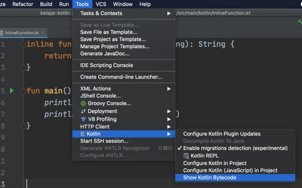

# Kotlin Dasar

## #1 Pengenalan Kotlin

## Sejarah Kotlin

- Bahasa pemrograman Kotlin dikenalkan oleh Perusahaan JetBrains pada tahun 2011
- Awalnya Kotlin adalah bahasa pemrograman yang berjalan di atas JVM (Java Virtual Machine)
- Kotlin di desain agar terintegrasi dengan Java
- Tahun 2019, Google mengumumkan bahwa Kotlin adalah bahasa pemrograman yang direkomendasikan untuk pengembangan aplikasi Android

## Kenapa Belajar Kotlin?

- Java adalah bahasa pemrograman paling populer di dunia
- Ekosistem teknologi pendukung Java sudah besar dan dewasa
- Kotlin adalah bahasa pemrograman yang dapat berjalan diatas JVM
- Bahasa pemrograman Kotlin lebih elegan dan sederhana dibanding Java
- Kotlin menjadi bahasa pemrograman utama untuk pengembangan aplikasi Android
- Spring (framework backend Java terpopuler) sekarang sudah mendukung Kotlin

## Software Development Kit

- SDK adalah perangakat lunak yang digunakan untuk process development
- SDK digunakan untuk melakukan kompilasi kode program Kotlin dan menjalankan kode program Kotlin
- Java Development Kit versi 8 keatas
- <https://jdk.java.net>

## Proses Development Program Kotlin



## Integrated Development Environment

- IDE adalah smart editor yang digunakan untuk mengedit kode program Kotlin
- IDE juga diguakan untuk melakukan otomatisasi proses kompilasi kode program Kotlin dan otomatisasi proses menjalankan program Kotlin
- JetBrains IntelliJ IDEA
- <https://www.jetbrains.com/ides/>

## Instalasi JDK

- Windows
- Download JDK
- Install
- Add path environment variable

- Linux atau Mac

```sh
# Add to .bashrc or .zshrc

export JAVA_HOMR="/Library/Java/JavaVirtualMachines/jdk 1.8.0_241.jdk/Contents/Home"
export PATH="$JAVA_HOME/bin:$PATH"
```

- Check installation

```sh
java -version
javac -version
```

## #2 Program Hello World

### Create Project

- Open IntelliJ IDEA
- Create Project -> Kotlin
- Project Name
- Project Location
- Project SDK
- Finish

### Kode: Hello World

```kt
fun main() {
	println("Hello World")
}
```

## #3 Tipe Data Number

### Tipe Data Number

- Integer Number
- Floating Number

### Integer Number

| Type    | Size (bits) | Min value                    | Max value                   |
| ------- | ----------- | ---------------------------- | --------------------------- |
| `Byte`  | `8`         | `-128`                       | `127`                       |
| `Short` | `16`        | `-32768`                     | `32767`                     |
| `Int`   | `32`        | `-2,147,483,648`             | `2,146,483,647`             |
| `Long`  | `64`        | `-9,223,372,036,854,775,808` | `9,223,372,036,854,775,807` |

### Integer Number

```kt
fun main() {
	var age: Byte = 30
	var height: Int = 170
	var distance: Short = 2000
	var balance: Long= 100000L
}
```

### Floating Point Number

| Type     | Size (bits) | Significant bits | Exponent bits | Decimal digits |
| -------- | ----------- | ---------------- | ------------- | -------------- |
| `Float`  | `32`        | `24`             | `8`           | `6-7`          |
| `Double` | `64`        | `53`             | `11`          | `15-16`        |

```kt
fun main() {
	// floating point number
	var value: Float = 98.98F
	var radius: Double = 892.14187878
}
```

### Literals

```kt
fun main() {
	// literals
	var decimalLiteral: Int = 100
	var hexadecimalLiteral: Int = 0xFF
	var binaryLiteral: Int = 0b0001
}
```

### Underscore

```kt
fun main() {
	// underscore in number
	var age: Byte = 3_0
	var height: Int = 1_7_0
	var distance: Short = 2_000
	var balance: Long= 100_000_000L
}
```

### Conversion

```kt
fun main() {
	var number: Int = 100
	// conversion
	var byte: Byte = number.toByte()
	var short: Short = number.toShort()
	var int: Int = number.toInt()
	var long: Long = number.toLong()
	var float: Float = number.toFloat()
	var double: Double = number.toDouble()
}
```

## #4 Tipe Data Character

### Tipe Data Character

- Data karakter (huruf), di Kotlin direpresentasikan oleh tipe Char
- Untuk membuat data Char, di Kotlin bisa menggunakan tanda `'` (petik satu)

### Kode: Character

```kt
fun main() {
	var char1: Char = "A"
	var char2: Char = "4"
	var char3: Char = "M"
}
```

## #5 Tipe Data Boolean

### Tipe Data Boolean

- Tipe data boolean adalah tipe data yang hanya memiliki 2 nilai, yaitu benar atau salah
- Tipe data boolean di kotlin direpresentasikan dengan kata kunci `Boolean`
- Nilai benar direpresentasikan dengaa kata kunci `true`
- Nilai salah direpresentasikan dengan kata kunci `false`

### Kode: Boolean

```kt
fun main() {
	var benar: Boolean = true
	var salah: Boolean = false
}
```

## #6 Tipe Data String

### Tipe Data String

- Tipe data string adalah tipe data yang berisikan data kumpulan karakter atau sederhananya adalah teks
- Di kotlin, tipe data string direpresentasikan dengan kata kunci `String`
- Untuk membuat string di Kotlin, kita bisa menggunakan
  - `"` (tanda petik 2) untuk teks satu baris
  - `"""` (tanda petik 2 sebanyak 3 kali) untuk teks lebih dari satu baris

### Kode: String

```kt
fun main() {
	var firstName: String = "Eko"
	var lastName: String = "Khannedy"
	var fullName: String = "Eko Kurniawan Khannedy"
	var address: String = """
			Street Not Yet Done,
			Province Subang,
			Country Indonesia
	"""
}
```

### Kode: String Trim Margin

```kt
fun main() {
	var address1: String = """
			|Street Not Yet Done,
			|Province Subang
	""".trimMargin()
	var address2: String = """
			>Street Not Yet Done,
			>Province Subang
	""".trimMargin(">")
}
```

### Menggabungkan String

- Kadang kita butuh melakukan menggabungkan data String
- Untuk melakukan penggabungan data String, kita bisa menggunakan operator `+`

### Kode: Menggabungkan String

```kt
fun main() {
	var firstName: String = "Eko"
	var lastName: String = "Khannedy"
	var fullName: String = firstName + " " + lastName
}
```

### String Template

- String template adalah kemampuan String di Kotlin yang mendukung ekspresi template
- Dengan string template, secara otomatis kita bisa mengakses data dari luar text string
- `$` adalah tanda yang digunakan untuk template ekspresi sederhana, seperti mengakses variable lain
- `${isi ekspresi}` adalah tanda yang digunakan untuk template ekspresi yang kompleks

### Kode: String Template

```kt
fun main() {
	var firstName: String = "Eko"
	var lastName: String = "Khannedy"
	var fullName: String = "$firstName $lastName"
	var desc: String = "total $fullName char = ${fullName.length}"
}
```

## #7 Variable

### Variable

- Variable adalah tempat untuk menyimpan data
- Kotlin mendukung 2 jenis variable; Mutable (bisa diubah) dan immutable (tidak bisa berubah)
- Untuk membuat variable Mutable, di kotlin bisa menggunakan kata kunci `var`
- Untuk membuat variable Immutable, di kotlin bisa menggunakan kata kunci `val`

### Deklarasi Variable

### `val/var namaVariable : TipeData = data`

> Direkomendasikan menggunakan Immutable dibanding Mutable data

### Kode: Variable Immutable

```kt
fun main() {
	val firstName: String = "Eko"
	val lastName: String = "Khannedy"

	// error jika mengubah variable
	lastName = "Kurniawan Khannedy"
}
```

### Nullable

- Secara standar, variable di Kotlin harus dideklarasikan / diinisialisasikan nilai nya
- Jika saat membuat variable, tidak diberi nilai, maka akan error
- Kotlin mendukung variable yang boleh null (tidak memiliki data)
- Ini dikarenakan Kotlin bisa mengakses Java, dan kebanyakan di Java, semua variable bisa null
- Untuk membuat variable bisa bernilai null, di Kotlin bisa menggunakan `?` (tanda tanya) setelah tipe datanya
- Penggunaan fitur ini tidak direkomendasikan untuk dilakukan di kotlin, hanya sebagai jalan akhir jika misal mengakses kode Java

### Kode: Nullable

```kt
fun main() {
	var firstName: String? = "Eko"
	firstName = null

	// error karena firstName bisa null
	println(firstName.length)

	// cara mengakses yang benar
	println(firstName?.length)
}
```

### Variable Constant

- Constant adalah Immutable data, yang bisanya diakses untuk keperluan global
- Global artinya bisa diakses dimanapun
- Untuk menandai bahwa variable tersebut adalah constant, biasanya menggunakan `UPPER_CASE` dalam pembuatan nama variable constant nya

### Kode: Variable Constant

```kt
const val APP = "Belajar Kotlin"
const val VERSION = "0.0.1"

fun main() {
	println("Welcome to $APP version $VERSION")
}
```

> Wajib menggunakan `val` dan untuk global variable

## #8 Tipe Data Array

### Tipe Data Array

- Array adalah tipe data berisikan kumpulan data dengan tipe yang sama
- Tipe data array di Kotlin direpresentasikan dengan kata kunci `Array`

### Kode: Membuat Array

```kt
fun main() {
	val members: Array<String> = arrayOf("Eko", "Joko", "Budi")
	val values: Array<Byte> = arrayOf(100, 90, 95)
	val balances: Array<Int> = arrayOf(10_000, 20_000, 30_000)
}
```

### Index di Array

| Index | Data      |
| ----- | --------- |
| 0     | Eko       |
| 1     | Kurniawan |
| 2     | Khannedy  |

### Operasi Array

| Operasi           | Keterangan                      |
| ----------------- | ------------------------------- |
| size              | Untuk mendapatkan panjang Array |
| get(index)        | Mendapat data di posisi index   |
| [index]           | Mendapat data di posisi index   |
| set(index, value) | Mengubah data di posisi index   |
| [index] = value   | Mengubah data di posisi index   |

### Kode: Operasi Array

```kt
fun main() {
	val members: Array<String> = arrayOf("Eko", "Joko", "Budi")
	val eko: String = members[0]
	val joko: String = members.get(1)
	val budi: String = members.get(2)

	members.set(0, "Amar")
	val amar: String = members[0]
}
```

### Array Nullable

- Secara standard data di Array di Kotlin tidak boleh null
- Jika kita butuh membuat Array yang datanya boleh null, kita bisa menggunakan `?` (tanda tanya)

> Ukuran array fix saat inisialisasi pertama kali tidak bisa dirubah

### Kode: Array Nullable

```kt
fun main() {
	val names: Array<String?> = arrayOfNulls(5)
	names.set(0, "Eko")
	names.set(1, null)
	names.set(2, "Kurniawan")
	names.set(3, null)
	names.set(4, "Khannedy")
}
```

## #9 Tipe Data Range

### Tipe Data Range

- Kadang kita ingin membuar array yang berisi data yang angka berurutan
- Membuat array dengan jumlah daya sedikit mungkin mudah, tapi bagaimana jika data angka yang berurutanya sangat banyak, misal dari `1` sampai `1000`
- Kotlin mendukung tipe data range, yang digunakan untuk kebutuhan seperti ini
- Cara membuat range di Kotlin sangat mudah cukup menggunakan tanda `..` (titik dua kali):
  - `0..10` : Range dari 9 sampai 10
  - `1..100` : Range dari 1 sampai 100

### Operasi Range

| Operasi           | Keterangan                              |
| ----------------- | --------------------------------------- |
| `count()`         | Mendapatkan total data di range         |
| `contains(value)` | Mengecek apakah terdapat value tersebut |
| `first`           | Mendapatkan nilai pertama               |
| `last`            | Mendapatkan nilai terakhir              |
| `step`            | Mendapatkan nilai tiap kenaikan         |

### Kode: Range Terbalik

```kt
fun main() {
	val range = 1000 downTo 0
}
```

### Kode: Range Dengan Step

```kt
fun main() {
	val range1 = 1..000 step 5
	val range2 = 1000 downTo 0 step 5
}
```

## #10 Operasi Matematika

### Operasi Matematika

| Operator | Keterangan     |
| -------- | -------------- |
| `+`      | Penjumlahan    |
| `-`      | Pengurangan    |
| `\*`     | Perkalian      |
| `/`      | Pembagian      |
| `%`      | Sisa Pembagian |

### Contoh Operasi Matematika

```kt
fun main() {
	var result1: Int = 10 / 3
	println(result1)

	var result2: Int = 10 + 10 / 2
	println(result2)
}
```

> Kotlin support scientifics calculation

### Augmented Assignments

| Operasi Matematik | Augmented Assignments |
| ----------------- | --------------------- |
| `a = a + 10`      | `a += 10`             |
| `a = a - 10`      | `a -= 10`             |
| `a = a \* 10`     | `a \*= 10`            |
| `a = a / 10`      | `a /= 10`             |
| `a = a % 10`      | `a %= 10`             |

### Unary Operator

| Operator | Keterangan        |
| -------- | ----------------- |
| `++`     | `a = a + 1`       |
| `--`     | `a = a - 1`       |
| `-`      | Negative          |
| `+`      | Positive          |
| `!`      | Boolean kebalikan |

## #11 Operasi Perbandingan

### Operasi Perbandingan

- Operasi perbandingan adalah operasi untuk membandingkan dua buah data
- Operasi perbandingan adalah operasin yang menghasilkan nilai boolean (benar atau salah)
- Jika hasil operasinya adalah benar, maka nilainya adalah `true`
- Jika hasil operasinya adalah salah, maka nilainya adalah `false`

### Operator Perbandingan

| Operator | Keterangan              |
| -------- | ----------------------- |
| `>`      | Lebih Dari              |
| `<`      | Kurang Dari             |
| `>=`     | Lebih Dari Sama Dengan  |
| `<=`     | Kurang Dari Sama Dengan |
| `==`     | Sama Dengan             |
| `!=`     | Tidak Sama Dengan       |

### Kode: Operator Perbandingan

```kt
fun main() {
	val a = 100
	val b = 200

	val result: Boolean = a > b

	println("a" < "b")
	println("a" == "a")
	println("a" != "a")
}
```

## #12 Operasi Boolean

### Operasi Boolean

| Operator | Keterangan |
| -------- | ---------- |
| `&&`     | Dan        |
| `\!\|`   | Atau       |
| `!`      | Kebalikan  |

### Operasi &&

| Nilai   | Operator | Nilai 2 | Hasil   |
| ------- | -------- | ------- | ------- |
| `true`  | `&&`     | `true`  | `true`  |
| `true`  | `&&`     | `false` | `false` |
| `false` | `&&`     | `true`  | `false` |
| `false` | `&&`     | `false` | `false` |

### Operasi ||

| Nilai   | Operator | Nilai 2 | Hasil   |
| ------- | -------- | ------- | ------- |
| `true`  | `\|\|`   | `true`  | `true`  |
| `true`  | `\|\|`   | `false` | `true`  |
| `false` | `\|\|`   | `true`  | `true`  |
| `false` | `\|\|`   | `false` | `false` |

### Operasi

| Operator | Nilai 2 | Hasil   |
| -------- | ------- | ------- |
| `!`      | `true`  | `false` |
| `!`      | `false` | `true`  |

### Kode: Operasi Boolean

```kt
fun main() {
	val finalExam = 80
	val attendant = 75

	val passFinalExam = finalExam > 75
	val passAttendant = attendant < 80

	val pass = passFinalExam && passAttendant
}
```

## #13 If Expression

### If Expression

- Dalam Kotlin, `if` adalah salah satu kata kunci yang digunakan untuk percabangan
- Percabangan artinya kita bisa mengeksekusi kode program tertentu ketika suatu kondisi terpenuhi
- Hampir di semua bahasa pemrograman mendukung if expression

```kt
if (kondisi boolean) {
	// jika kondisi bernilai true
	// mak isi block if akan di eksekusi
}
```

### Kode: If Expression

```kt
fun main() {
	val examValue = 90

	if (examValue > 80) {
		println("Good Job")
	}
}
```

### Else Expression

- Block if akan dieksekusi ketika kondisi if bernilai `true`
- Kadang kita ingin melakukan eksekusi program tertentu jika kondisi if bernilai `false`
- Hal ini bisa dilakukan menggunakan else expression

```kt
if (kondisi boolan) {
	// jika kondisi bernilai true
	// maka isi block if akan dieksekusi
} else {
	// jika kondisi bernilai false
	// maka isi block else akan dieksekusi
}

```

### Kode: Else Expression

```kt
fun main() {
	val examValue = 90

	if (examValue > 80) {
		println("Good Job")
	} else {
		println("Try again next year")
	}
}
```

### Else If Expression

- Kalo dalam If, kita bith membuat beberapa kondisi
- Kasus seperti ini, di Kotlin kita bisa menggunakan Else If expression

```kt
if (kondisi boolan 1) {
	// jika kondisi 1 bernilai true
} else if (kondisi boolan) {
	// jika kondisi 2 bernilai true
} else {
	// jika kondisi bernilai false
}
```

### Kode: Else If Expression

```kt
fun main() {
	val examValue = 90

	if (examValue > 80) {
		println("Good Job")
	} else if (examValue > 60) {
		println("Not Bad")
	} else {
		println("Try again next year")
	}
}
```

## #14 When Expression

### When Expression

- Selain if expression, untuk melakukan percabangan di Kotlin, kita juga bisa menggunakan When Expression
- When expression sangat sederhana dibandingkan If
- Biasanya when expression digunakan untuk melakukan pengecekan ke kondisi dalam satu variable

### Kode: When Expression

```kt
fun main() {
	val finalExam = 'A'
	when (finalExam) {
		'A' -> println("Amazing")
		'B' -> println("Good")
		'C' -> println("Not Bad")
		'D' -> println("Bad")
		'E' -> println("Try Again Next Year")
		else -> {
			println("Ups")
		}
	}
}
```

### Kode: When Expression Multiple Option

```kt
fun main() {
	val finalExam = 'A'
	when (finalExam) {
		'A', 'B', 'C' -> println("Pass")
		else -> {
			println("Not Pass")
		}
	}
}
```

### Kode: When Expression In

```kt
fun main() {
	val finalExam = 'A'
	val passVales = arrayOf('A', 'B', 'C')
	when (finalExam) {
		in passValues -> println("Pass")
		!in passValues -> println("Try Again")
	}
}
```

### Kode: When Expression Is

```kt
fun main() {
	val name = "Eko"
	when (name) {
		is String -> println("This is String")
		!is String -> println("This is not String")
	}
}
```

### When Sebagai Pengganti If Else

- Selain pengecekan terhadap value
- When juga dapat digunakan sebagai pengganti if else
- Untuk mengganti if else when, kita perlu menggunakan variable dalam when

### Kode: When Tanda Variable

```kt
fun main() {
	val examValue = 90
	when {
		examValue > 80 -> println("Good Job")
		examValue > 60 -> println("Not Bad")
		else -> println("Try again next year")
	}
}
```

## #15 For Loops

### For Loops

- Dalam bahasa pemrograman, biasanys ada fitur yang bernama perulangan
- Salah satu fitur perulangan di Kotlin adalah `for`
- For digunakan untuk melakukan perulangan iterasi dari data iterator (Array, Range, dan lain-lain)

### Kode: For Array

```kt
fun main() {
	val names = arrayOf("Eko", "Kurniawan", "Khannedy")
	for (name in names) {
		println(name)
	}
}
```

### Kode: For Range

```kt
fun main() {
	for (value in 0..100) {
		println(value)
	}

	for (value in 1000 downTo 0 step 5) {
		println(value)
	}
}
```

## #16 While Loops

### While Loops

- While adalah salah satu perulangan lain yang ada di Kotlin
- While adalah salah satu perulangan yang sangat flexible, dimana kode while akan melakukan pengecekan kondisi, jika kondisi bernilai `true`, maka dia akan menjalankan blok while, dan terus diulangi sampai kondisi while bernilai `false`

### Kode: While

```kt
fun main() {
	var i = 0

	while (i < 10) {
		println("While Loop")
		i++
	}
}
```

## #17 Do While Loops

### Do While Loops

- Do While Loop adalah perulangan yang hampir sama dengan While Loop
- Yang membedakan adalah, pada Do While Loop, kode blok akan dijalankan dahulu, baru diakhiri dilakukan pengecekan kondisi

### Kode: Do While

```kt
fun main(){
	var i = 0

	do {
		println(""While Loop)
		i++
	} while (i < 10)
}
```

## #18 Break & Continue

### Break & Continue

- Break & continue adalah kata kunci yang bisa digunakan dalam semua perulangan di Kotlin
- Break digunakan untuk menghentikan seluruh perulangan
- Continue adalah digunakan untuk menghentikan perulangan yang berjalan, dan langsung melanjutkan ke perulangan selanjutnya

## Kode: Break

```kt
fun main() {
	var i = 0
	while (true) {
		println("Break Me")
		i++
		if (i > 1000) {
			break
		}
	}
}
```

## Kode: Continue

```kt
fun main() {
	for (i in 1..1000) {
		if (i % 2 == 0) {
			continue
		}
		println(i)
	}
}
```

## #19 Function

### Function

- Sebelumnya kita sudah mengenal sebuah function yang wajib dibuat agar program Kotlin bisa berjalan, yaitu function main
- Function adalah sebuah blok kode yang sengaja dibuat dalam program agar bisa digunakan berulang-ulang
- Cara membuat function di Kotlin sangan sederhana, hanya dengan menggunakan kata kunci `fun` lalu diikuti dengan nama function nya dan block kode isi function nya
- Setelah membuat function, kita bisa mengeksekusi function tersebut dengan memanggilnya menggunakan kata kunci nama function nya

### Kode: Function

```kt
fun helloWorld() {
	println("Hello World")
	println("Programmer Zaman Now")
}

fun main() {
	helloWorld()
}
```

## #20 Function Parameter

### Function Parameter

- Saat membuat function, kadang-kadang kita membutuhkan data dari luar, atau kita sebut parameter
- Di Kotlin, kita bisa menambahkan parameter di function, bisa lebih dari satu
- Parameter tidaklah wajib, jika kita bisa membuat function tanpa parameter seperti sebelumnya yang sudah kita buat
- Namun jika kita menambahkan parameter di function, maka ketika memanggil function tersebut, kita wajib memasukan data ke parameternya

### Kode: Function Parameter

```kt
fun sayHello(firstName: String, lastName: String) {
	println("Hello $firstName $lastName")
}

fun main() {
	sayHello("Eko", "Khannedy")
}
```

## #21 Function Default Argument

### Function Default Argument

- Di Kotlin, function parameter wajib diisi ketika memanggil function
- Namun kita juga bisa memasukkan nilai default pada parameter, dengan demikian saat memanggil function tersebut, kita tidak wajib memasukkan nilai pada parameter nya
- Default parameter ini cocok ada jenis parameter yang sekiranya memang tidak wajib untuk diisi

### Kode: Function Default Parameter

```kt
fun sayHello(firstName: String, lastName: String = "") {
	println("Hello $firstName $lastName")
}

fun main() {
	sayHello("Eko")
	sayHello("Eko", "Khannedy")
}
```

## #22 Function Named Argument

### Function Named Argument

- Kadang ada function yang parameternya banyak sekali
- Hal ini sangat menyulitkan saat kita akan memanggil function tersebut, kita harus benar-benar tahu urutan parameter di function tersebut
- Untungnya kotlin memiliki fitur yang namanya Named Argument
- Named Argument adalah fitur dimana kita bisa menyebutkan nama parameter saat memanggil function, dengan demikian kita tidak wajib tahu posisi tiap parameter

### Kode: Function Named Argument

```kt
fun fullName(firstName: String,
						middleName: String,
						lastName: String) {
	println("Hello $firstName, $middleName, $lastName")
}

fun main() {
	fullName(firstName = "Eko",
						lastName = "Khannedy",
						middleName = "Kurniawan")
}
```

## #23 Unit Returning Function

- Function ada 2 jenis, pertama tidak mengembalikan nilai, yang kedua mengembalikan nilai
- Function-function yang sebelumnya sudah kita buat adalah function yang tidak mengembalikan nilai
- Sebenarnya, function-function yang sudah kita buat sebelumnya, dia mengembalikan tipe data Unit, dimana Unit adalah tanda bahwa function tersebut tidak mengembalikan apa-apa
- Penulisan Unit adalah tidak wajib, namun jika kita menulis tipe data pengembalian sebuah function, maka secara otomatis dia adalah Unit

### Kode: Unit Returning Function

```kt
fun printHello(name: String): Unit {
	if (name == null) {
		println("Hello Bro")
	} else {
		println("Hello $name")
	}
}

fn main() {
	printHello("Eko")
}
```

## #24 Function Return Type

- Seperti yang sudah dibahas sebelumnya, bahwa function itu bisa mengembalikan data
  Untuk memberitahu bahwa function mengembalikan data, kita harus menuliskan tipe data kembalian dari function tersebut
- Jika function tersebut kita deklarasikan dengan tipe data pengembalian, maka wajib di dalam function nya kita harus mengembalikan data
- Untuk mengembalikan data dari function, kita bisa menggunakan kata kunci `return`, diikuti dengan datanya

### Function Return Type

```kt
fun sum(a: Int, b: Int): Int {
	val total = 1 + b;
	return total
}

fun main() {
	val result = sum(10, 10)
}
```

## #25 Single Expression Function

- Kadang kita sering membuat function yang sangat sederhana
- Misal function yang hanya berisikan kode blok sederhana, misal hanya 1 baris
- Jika kita mengalami hal seperti ini, kita bisa mengubahnya menjadi single expression function
- Single expression function adalah deklarasi function hanya dengan 1 baris kode
- Untuk membuat single expression function, kita hanya butuh tanda `=` (sama dengan) setelah deklarasi nama function dan tipe data pengembalian function

### Kode: Single Expression Function

```sh
fun double(a: Int): Int =  a * 2

fun hi(name: String): Unit = println("Hi $name")

fun main() {
	val result = double(10)
	hi("Eko")
}
```

## #26 Function Varargs Parameter

- Parameter yang berada di posisi terakhir, memiliki kemampuan dijadikan sebuah varargs
- Varargs artinya datanya bisa menerima lebih dari satu input, atau anggap saja semacam Array.
- Apa bedanya dengan parameter biasa dengan tipe data Array?
  - Jika parameter tipe Array, kita wajib membuat array terlebih dahulu sebelum mengirimkan ke function
  - JIka parameter menggunakan varargs, kita bisa langsung mengirim data nya, jika lebih dari satu, cukup gunakan tanda `,` koma

### Function Varargs Parameter

```kt
fun finalValue(name: String, vararg values: Int) {
	var total = 0.0
	for (value in values) {
		total += value
	}
	total /= values.size
	println("Final Value $name = $total")
}
```

## #27 Extension Function

- Extension function adalah kemampuan menambahkan function pada tipe data yang sudah ada
- Extension function adalah salah satu fitur yang sangat powerfull, namun harap bijak menggunakannya, karena jika terlalu banyak digunakan, akan membuat program sulit dimengerti, karena terlihat seperti magic
- Untuk membuat extension function, kita cukup menambahkan tipe data pada nama function nya, lalu diikuti dengan tanda `.` (titik)
- Untuk mengakses data nya di extension function, kita bisa menggunakan kata kunci `this`

### Kode: Extension Function

```kt
fun String.hello(): String {
	return "Hello $this"
}

fun main() {
	val name: String = "Eko"
	val hello: String = name.hello()
}
```

## #28 Function Infix Notation

- Infix Notation adalah operasi yang biasa dilakukan di operasi matematika, dimana dia melakukan operasi terhadap dua data
- Hampir semua operasi matematika adalah infix notation
- Di kotlin, kita bisa membuat function infix notation juga
- Untuk menggunakan function infix notation, tidak wajib menggunakan tanda `.` (titik)

### Syarat Function Infix Notation

- Harus sebagai function member (akan dibahas di OOP) atau function extension
- Harus memiliki 1 parameter
- Parameter tidak boleh `varargs` dan tidak boleh memiliki nilai default

### Kode: Function Infix Notation

```kt
infix fun String.to(type: String): String {
	if (type == "UP") {
		return this.toUpperCase()
	} else {
		return this.toLowerCase()
	}
}

fun main() {
	val result: String = "Eko" to "UP"
}
```

## #29 Function Scope

- Function scope adalah ruang lingkup dimana sebuah function bisa diakses
- Saat kita membuat function di dalam file kotlin, maka secara otomatis function tersebut bisa diakses dari file kotlin manapun
- Jika kita ingin membatasi misalnya sebuah function hanya bisa diakses dalam function tertentu, maka kita bisa membuat function di dalam function

### Function Scope

```kt
fun main() {
	fun sayHello(name: String): Unit {
		println("Hello $name")
	}

	sayHello("Eko")
}
```

## #30 Return If & When

- Kadang salam sebuah function, kita sering menggunakan If expression atau when expression, lalu di dalam blok nya kita mengembalikan nilai untuk sebuah function
- Kotlin mendukung return if atau when, dimana fitur ini bisa mempermudah kita ketika ingin mengembalikan nilai dalam if atau when

### Kode: Return If

```kt
fub sayHello(name: String = ""): String {
	return if (name == "") {
		"Hello Bro"
	} else {
		"Hello $name"
	}
}
sayHello("Eko")
```

### Kode: Return When

```kt
fun sayHello(name: String = ""): String {
	return when (name) {
		"" -> "Hello Bro"
		else -> "Hello $name"
	}
}
sayHello("Eko")
```

## #31 Recursive Function

- Recursive function adalah function yang memanggil function dirinya sendiri
- Kadang dalam pekerjaan, kita sering menemui kasus dimana menggunakan recursive function lebih mudah dibandingkan tidak menggunakan recursive function
- Contoh kasus yang lebih mudah diselesaikan menggunakan recursive adalah Factorial

### Kode: Factorial For LOop

```kt
fun factorialLoop(value: Int): Int {
	var result = 1
	for (i in value downTo 1) {
		result *= i
	}
	return result
}
```

### Kode: Factorial Recursive FUnction

```kt
fun factorialRecursive(value: Int): Int {
	return when (value) {
		1 -> 1
		else -> value * factorialRecursive(value - 1)
	}
}
```

## #32 Tail Recursive Function

### Recursive Function

- Recursive function adalah salah satu kemampuan bagus di Kotlin, namun sayangnya ada keterbatasan dalam penggunaan recursive
- Jika recursive function yang kita buat, saat dijalankan memanggil function dirinya sendiri terlalu dalam, maka bisa dimungkinkan akan terjadi error stack overflow

### Stack Overflow Error

```kt
factorial(5)
factorial(5) => 5 * factorial(4)
factorial(5) => 5 * factorial(4) => 4 * factorial(3)
factorial(5) => 5 * factorial(4) => 4 * factorial(3) => 3 * factorial(2)
factorial(5) => 5 * factorial(4) => 4 * factorial(3) => 3 * factorial(2) => 2 * factorial(1)
factorial(5) => 5 * factorial(4) => 4 * factorial(3) => 3 * factorial(2) => 2 * factorial(1) => 1
```

### Tail Recursive Function

- Permasalahan ini di bahasa pemrograman Java tidak bisa ditangani
- Namun di Kotlin, masalah ini ada solusinya, yaitu dengan menggunakan `tail` recursive function
- Tail recursive function adalah teknik mengubah recursive function yang kita buat, menjadi looping biasa ketika dijalankan
- Tidak semua recursive function bisa secara otomatis dibuat menjadi tail recursive function, ada syarat-syarat nya

### Syarat Tail Recursive Function

- Tambahkan tailrec di functionnya
- Saat memanggil function dirinya sendiri, hanya boleh memanggil function dirinya sendiri, tanpa embel-embel operasi dengan data lain

### Kode: Tail Recursive Function

```kt
tailrec fun display(value: Int) {
	println(value)
	if (value > 0) {
		display(value - 1)
	}
}
```

### Kode: Tail Recursive Factorial Function

```kt
tailrec fun factorialTail(value: Int, total: Int = 1): Int {
	return when (value) {
		1 -> value
		else -> factorialTail(value - 1, total * value)
	}
}
```

### Tail Recursive Factorial

```kt
factorialTail(5, 1)
factorialTail(4, 5)
factorialTail(3, 20)
factorialTail(2, 60)
factorialTail(1, 120)
120
```

## #33 Lambda Expression

- Function di kotlin adalah first-class citizens, artinya dianggap seperti tipe data yang lainnya.
- Bisa disimpan di variable, array, bahkan bisa dikirim ke parameter function itu sendiri
- Lambda expression secara sederhana adalah function yang tidak memiliki nama
- Biasanya saat kita membuat function, kita akan selalu membuat menggunakan kata kunci `fun` dan mendeklarasikan nama function nya
- Dengan lambda expression, kita bisa membuat function tanpa harus mendeskripsikan function nya

### Kode: Lambda Expression di Variable

```kt
fun main() {
	// membuat lambda
	val lambdaName: (String) -> String = { value: String ->
		value.toUpperCase()
	}
	// mengeksekusi lambda
	val name = lambdaName("eko")
}
```

### Kode: It

```kt
fun main() {
	// membuat lambda
	val lambdaName: (String) -> String = {
		it.toUpperCase()
	}
	// mengeksekusi lambda
	val name = lambdaName("eko")
}
```

### Kode: Method References

```kt
fun toUpper(value: String): String = value.toUpperCase()

fun main() {
	// membuat lambda
	val lambdaName: (String) -> String = ::toUpper

	// mengeksekusi lambda
	val name = lambdaName("eko")
}
```

## #34 Higher-Order Functions

- Higher-Order Function adalah function yang menggunakan function sebagai parameter atau mengembalikan function
- Penggunaan Higher-Order Function kadang berguna ketika kita ingin membuat function yang general dan ingin mendapatkan input yang flexible beruba lambda, yang bisa dideklarasikan oleh si user ketika memanggil function tersebut

### Kode: Higher-Order Functions

```kt
fun hello(value: String, transformer: (String) -> String): String {
	return "Hello ${transformer(value)}"
}

fun main() {
	val upperTransformer = { value: String -> value.toUpperCase() }
	val lowerTransformer = { value: String -> value.toLowerCase() }
	println(hello("Eko", upperTransformer))
	println(hello("Eko", lowerTransformer))
}
```

### Kode: Trailing Lambda

```kt
fun main() {
	val result1 = hello("Eko") { valeu: String ->
		value.toUpperCase()
	}
	val result2 = hello("Eko") { valeu: String ->
		value.toLowerCase()
	}
}
```

## #35 Anonymous Functions

- Lambda akan menganggap baris terakhir di blok lambda sebagai hasil kembalian
- Kadang kita butuh membuat lambda yang se flexible function, dimana kita bisa mengembalikan hasil dimanapun
- Untuk hal ini, kita bisa menggunakan Anonymous Function
- Anonymous Function sebenarnya mirip dengan lambda, hanya cara membuatnya saja yang sedikit beda, masih menggunakan kata kunci `func`

### Kode: Anonymous Function

```kt
fun main() {
	val anonymousUpper = fun(value: String): String {
		if (value.isBlank()) {
			return "Ups"
		}
		return value.toUpperCase()
	}

	val result1 = hello("Eko", anonymousUpper)
}
```

### Kode: Anonymous Function as Parameter

```kt
fun main() {
	val result1 = hello("Eko", fun(value: String): String {
		if (value.isBlank()) {
			return "Ups"
		}
		return value.toUpperCase()
	})
}
```

## #36 Closure

- Closure adalah kemampuan sebuah function, lambda atau anonymous function berinteraksi dengan data-data disekitarnya dalam scope yang sama
- Harap gunakan fitur closure ini dengan bijak saat kita membuat aplikasi

### Kode: Closure

```kt
fun main() {
	var counter: Int = 0
	val lambdaIncrement: () -> Unit {
		println("Increment")
		counter++
	}

	lambdaIncrement()
	lambdaIncrement()
}
```

## #37 Inline Function

- Menggunakan Higher-Order Function adalah salah satu fitur yang sangat berguna.
- Namun penggunaan Higher-Order Function akan berdampak terhadap performa saat aplikasi berjalan, karena harus membuat object lambda berulang-ulang. Jika penggunaannya tidak terlalu banyak mungkin tidak akan terasa, tapi jika banyak sekali, maka akan terasa impact nya
- Inline Functions adalah kemampuan di Kotlin yang mengubah Higher-Order Function menjadi Inline Function
- Dimana dengan Inline Function, code di dalam Higher-Order Function akan di duplicate agar pada saat runtime, aplikasi tidak perlu membuat object lambda berulang-ulang

### Kode: Inline Function

```kt
inline fun hello(name: () -> String): String {
	return "Hello ${name()}"
}

fun main() {
	println(hello { "Eko" })
	println(hello { "Kurniawan" })
}
```

### Melihat Bytecode Kotlin


### Noinline

- Saat menandai bahwa function adalah inline, maka secara otomatis semua parameter akan menjadi inline
- Jika kita ingin memberi tahu bahwa jangan melakukan inline terhadap parameter, kita bisa menandai parameter tersebut dengan kata kunci noinline

### Kode: Noinline

```kt
inline fun hello(firstName: () -> String,
									noinline lastName: () -> String): String {
		return "Hello ${firstName()} ${lastName()}"
}

fun main() {
	println(hello({ "Eko" }, { "Khannedy" }))
}
```

## #38 Label

- Label adalah penanda
- Semua expression di Kotlin bisa ditandai dengan label
- Untuk membuat label di Kotlin, cukup menggunakan nama label lalu diikuti dengan karakter `@`

### Kode: Lebel

```kt
fun main() {
	loopI@ for (i in 1..10){
		loopJ@ for (j in 1..10) {
			println("$i x $j = ${i * j}")
		}
	}
}
```

### Break, Continue dan Return

- Salah satu kegunaan label adalah, bisa diintegrasikan dengan break, continue dan return
- Biasanya break, continue dan return hanya bisa menghentikan proses di blok kode tempat mereka berada, namun dengan menggunakan label, kita bisa menentukan ke label mana kode akan berhenti

### Kode: Break to Label

```kt
fun main() {
	loopI@ for (i in 1..10){
		loopJ@ for (j in 1..10) {
			println("$i x $j = ${i * j}")
			if (j == 10) {
				break@loopI
			}
		}
	}
}
```

### Kode: Continue to Label

```kt
fun main() {
	loopI@ for (i in 1..10){
		loopJ@ for (j in 1..10) {
			println("$i x $j = ${i * j}")
			if (j == 5) {
				continue@loopI
			}
		}
	}
}
```

### Kode: Return to Label

```kt
fun test(name: String, param: (String) -> Unit): Unit = param(name)
fun main() {
	test("eko") testLabel@ {
		if (it == 'eko') {
			return @testLabel
		}
	}
	println("Eko")
}
```

## #39 Package & Import

- Package adalah tempat yang bisa digunakan untuk mengorganisir kode program yang kita buat di Kotlin
- Dengan menggunakan package, kita bisa merapikan kode program Kotlin yang kita buat
- Penamaan package di Kotlin biasanya menggunakan huruf kecil semua
- Jika ingin membuat sub package bisa menggunakan tanda `.` (titik)

### Kode: Package

```kt
package eko.util

fun sayHello(name: String) {
	println("Hello $name")
}

fun sayHello(firstName: String, lastName: String) {
	println("Hello $firstName $lastName")
}
```

### Import

- Secara standar, file Kotlin hanya bisa mengakses file Kotlin lainnya yang berada dalam package yang sama
- Jika kita ingin mengakses file Kotlin yang berada diluar package, maka kita bisa menggunakan Import
- Saat melakukan import, kita bisa memilih ingin meng-import bagian tertentu, atau semua file

### Kode: Import

```kt
import eko.util.sayHello

fun main() {
	sayHello("Eko")
	eko.util.sayHello("Eko", "Kurniawan")
}
```

## #40 Main Parameters

- Kadang saat menjalankan program, kita butuh input parameter dari luar
- Bisa untuk konfigurasi program, ataupun yang lainnya
- Kotlin mendukung parameter untuk main function

### Kode: Main Parameter

```kt
fun main(args: Array<String>) {
	for (value in args) {
		println(value)
	}
}
```

## #41 Komenter

- Komentar terbaik pada kode adalah kode itu sendiri
- Saat membuat kode, kita perlu membuat kode semudah mungkin untuk dibaca
- Namun kadang juga kita butuh menambahkan komentar di kode Kotlin kita

### Kode: Komentar

```kt
/**
 * This is multi line comment
 */

fun main() {
	// This is single line comment
}
```

## #42 Materi Selanjutnya?

- Kotlin Object Oriented Programming
- Kotlin Generic
- Kotlin Collection
- Kotlin Coroutine

## #43 Kotlin 1.4 Mixing Named & Positional Arguments

### Kotlin 1.4

- <https://blog.jetbrains.com/kotlin/2020/03/kotlin-1-4-m1-released/>
- <https://blog.jetbrains.com/kotlin/2020/05/1-4-m2-standard-library/>
