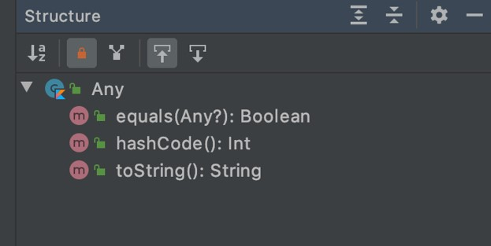

# Kotlin Object Oriented Programming

## Sebelum Belajar

- Kotlin Dasar
- <https://www.udemy.com/course/pemrograman-kotlin-pemula-sampai-mahir/?referralCode=98BE2E779EB8A0BEC230>

## #1 Apa itu Object Oriented Programming?

- Object Oriented Programming adalah sudut pandang bahasa pemrograman yang berkonsep `"objek"`
- Ada banyak sudut pandang bahasa pemrograman, namun OOP adalah yang sangat populer saat ini.
- Ada beberapa istilah yang perlu dimengerti dalam OOP, yaitu: `Object` dan `Class`

### Apa itu Object?

- Object adalah data yang berisi properties (fields atau attributes) dan functions (methods atau behavior)
- Semua data di Kotlin adalah object, dari mulai `Number`, `Boolean`, `Character`, `String` dan yang lainnya

### Apa itu Class?

- Class adalah blueprint, prototype atau cetakan untuk membuat Object
- Class berisikan deklarasi semua properties dan functions yang dimiliki oleh Object
- Setiap Object selalu dibuat dari Class
- Dan sebuah Class bisa membuat Object tanpa batas

### Class dan Object: Person


### Class dan Object: Car


## #2 Class

### Membuat Class

- Untuk membuat class di Kotlin, kita bisa menggunakan kata kunci `class`
- Membuat class di Kotlin tidak ada aturan harus sama dengan nama file seperti di Java
- Namun agar kodenya rapih dan mudah untuk dimengerti, disarankan untuk membuat nama class dan nama file sama. Misal class Person di file `Person.kt`

### Kode: Class

```kt
package belajar.oop

class Person
```

## #3 Object

### Membuat Object

- Membuat Object di Kotlin sangat mudah, mirip seperti memanggil function, dengan menggunakan nama class
- Di Kotlin, tidak butuh kata kunci khusus untuk membuat Object, misal jika di Java kita butuh menggunakan kata kunci `new` untuk membuat Object

### Kode: Object

```kt
package belajar.oop

class Person

fun main() {
	 val eko = Person()
	 println(eko)
}
```

## #4 Properties

- Properties / Fields / Attributes adalah data yang bisa kita sisipkan di dalam Object
- Namun sebelum kita bisa memasukkan data di Properties, kita harus mendeklarasikan data apa aja yang dimiliki object tersebut di dalam deklarasi class-nya
- Membuat Properties sama seperti membuat variable, bisa mutable atau immutable

### Kode: Properties

```kt
package belajar.oop

class Person {
	var firstName: String = ""
	var middleName: String? = null
	var lastName: String = ""
}

fun main() {

}
```

### Manipulasi Properties

- Properties yang ada di object, bisa kita manipulasi. Tergantung mutable atau immutable.
- Jika mutable, berarti kita bisa mengubah data properties nya, namun jika immutable, kita hanya bisa mengambil data properties nya saja
- Untuk memanipulasi data properties, sama seperti cara pada variable
- Untuk mengakses properties, kita butuh kata kunci `.` (titik) setelah nama object dan diikuti nama properties nya

### Kode: Manipulasi Properties

```kt
fun main() {
	val eko = Person()
	eko.firstName = "Eko"
	eko.middleName = "Kurniawan"
	eko.lastName = "Khannedy"

	println(eko.firstName)
}
```

## #5 Constructors

- Saat kita membuat Object, maka kita seperti memanggil sebuah function
- Di dalam class Kotlin, kita bisa membuat Constructors, Constructors mirip seperti function yang akan dipanggil saat pertama kali Object dibuat.
- Mirip seperti di Function, kita bisa memberi parameter pada Constructors

### Kode: Constructors

```kt
class Person(firstNameParam: String,
						 middleNameParam: String?,
						 lastNameParam: String) {

	var firstName: String = firstNameParam
	var middleName: String = middleNameParam
	var lastName: String = lastNameParam
}
```

### Kode: Menggunakan Constructors

```kt
fun main() {
	val eko = Person(
		"Eko",
		"Kurniawan",
		"Khannedy"
	)

	println(eko.firstName)
}
```

## #6 Initializer Block

- Initializer Block adalah blok kode yang akan dieksekusi ketika constructor dipanggil
- Kita bisa memasukkan kode program di dalam initializer block

### Kode: Initializer Block

```kt
class Person(firstNameParam: String,
						 middleNameParam: String?,
						 lastNameParam: String) {

	init {
		println("Initializer Block")
	}
}
```

## #7 Secondary Constructor

- Kotlin mendukung pembuatan constructor lebih dari satu
- Constructor yang utama yang terdapat di Class, disebut primary constructor, constructor tambahan yang bisa kita buat lagi adalah secondary constructor
- Saat membuat constructor, kita wajib memanggil primary constructor jika ada primary constructor

### Kode: Secondary Constructor

```kt
class Person(firstNameParam: String,
						 middleNameParam: String?,
						 lastNameParam: String) {

	constructor(firstNameParam: String, lastNameParam: String):
		this(firstNameParam, null, lastNameParam) {
		// do something here
	}
}
```

### Kode: Menggunakan Secondary Constructor

```kt
fun main() {
	val eko = Person("Eko", "Kurniawan", "Khannedy")
	val joko = Person("Joko", "Nugraha")

	println(eko.firstName)
	println(joko.lastName)
}
```

### Kode: Tanpa Primary Constructor

```kt
class Person {
	constructor(firstNameParam: String, lastNameParam: String) {
		firstName = firstNameParam;
		lastName = lastNameParam;
	}

	constructor(firstNameParam: String, middleNameParam: String, lastNameParam: String) {
		firstName = firstNameParam;
		middleName = middleNameParam;
		lastName = lastNameParam;
	}
}
```

## #8 Properties di Constructor

- Kotlin mendukung deklarasi properties langsung di primary constructor
- Ini sangat berguna untuk mempersingkat saat kita ingin membuat properties, dan mengisi datanya lewat constructor

### Kode: Properties di Constructor

```kt
class Persn(val firstName: String,
						val middleName: String? = null,
						val lastName: String) {

}

fun main() {
	val eko = Person("Eko", "Kurniawan", "Khannedy")
	val joko = Person(firstName = "Joko", lastName = "Nugraha")
}
```

## #9 Function

- Selain Parameters / Fields / Attributes, di dalam Class, kita juga bisa mendeklarasikan Function
- Function yang kita deklarasikan di dalam Class, secara otomatis menjadi behaviour si object yang dibuat dari class tersebut

### Kode: Function

```kt
package belajar.oop

class Student(val name: String) {

	fun sayHello(yourName: String): Unit {
		println("Hello $yourName, my nami is $name")
	}
}
```

## #10 Function Overloading

- Function Overloading adalah kemampuan membuat function dengan nama yang sama di dalam class
- Untuk membuat function dengan nama yang sama, kita wajib menggunakan parameter yang berbeda, bisa tipe parameter yang berbeda, atau jumlah parameter yang berbeda

### Kode: Function Overloading

```kt
class Student(val name: String) {

	fun sayHello(yourName: String): Unit {
		println("Hello $yourName, my name is $name")
	}

	fun sayHello(firstName: String, lastName: String): Unit {
		println("Hello $firstName $lastName, my name is $name")
	}
}
```

## #11 This Keyword

- this adalah keyword yang bisa digunakan untuk mereferensikan object saat ini
- this hanya bisa digunakan di dalam class itu sendiri
- Biasanya, this digunakan untuk mengakses properties yang tertutup oleh parameter dengan nama yang sama

### Kode: Tanpa This

```kt
package belajar.oop

class Student(val name: String) {

	fun sayHello(name: String): Unit {
		// $name will refer to parameter
		println("Hello $name, my name is $name")
	}
}
```

### Kode: Dengan This

```kt
package belajar.oop

class Student(val name: String) {

	fun sayHello(name: String): Unit {
		println("Hello $name, my name is ${this.name}")
	}
}
```

## #12 Inheritance

- Inheritance atau pewarisan adalah kemampuan untuk menurunkan sebuah class ke class lain
- Dalam artian, kita bisa membuat class Parent dan class Child
- Di Kotlin, tiap class Child, hanya bisa punya satu class Parent, namun satu class Parent bisa punya banyak class Child
- Secara standar, di class yang dibuat di Kotlin adalah final (tidak bisa diwariskan), agar bisa diwariskan, kita harus menggunakan kata kunci open

### Kode: Inheritance

```kt
open class Employee(val name: String) {
	fun sayHello(name: String) {
		println("Hello $name, my name is ${this.name}")
	}
}

final class Manager(name: String) : Employee(name)
final class VicePresident(name: String) : Employee(name)
```

### Kode: Mengakses Behavior Parent

```kt
fun main() {
	val eko = Manager("Eko")
	eko.sayHello("Joko")

	val budi = VicePresident("Budi")
	budi.sayHello("Joko")
}
```

## #13 Function Overriding

- Function Overriding adalah kemampuan membuat ulang function yang sudah ada di class Parent
- Secara standar, function di class adalah final, tidak bisa dibuat ulang di class Child
- Agar function bisa dibuat ulang di class Child, kita harus menggunakan kata kunci `open`

### Kode: Function Overriding

```kt
open class Employee(name: String) {
	open fn sayHello(name: String) {
		println("Hello $name, my name is ${this.name}")
	}
}

final class Manager(name: String) : Employee(name) {
	override fun sayHello(name: String) {
		println("Hello $name, my name is manager ${this.name}")

	}
}
```

### Final Override Function

- Saat kita membuat ulang function di class Child, secara standar, function tersebut bersifat open, yang artinya bisa dibuat ulang di class Child dibawahnya lagi
- Jika ingin membuat override function tidak bisa dibuat ulang oleh class Child dibawahnya lagi, kita harus menggunakan kata kunci `final`

### Kode: Final Override Function

```kt
open class Employee(name: String) {
	open fn sayHello(name: String) {
		println("Hello $name, my name is ${this.name}")
	}
}

open class Manager(name: String) : Employee(name) {
	final override fun sayHello(name: String) {
		println("Hello $name, my name is manager ${this.name}")
	}
}
```

## #14 Properties Overriding

- Selain membuat ulang function di class Child, di Kotlin juga kita bisa membuat ulang properties
- Secara standar, properties di class bersifat final, tidak bisa di buat ulang di class Child nya, agar bisa dibuat ulang, kita harus menggunakan kata kunci `open`

### Kode: Properties Overriding

```kt
open class Shape {
	open val corner: Int = -1
}

class Rectangle : Shape() {
	override val corner: Int = 4
}
```

## #15 Super Keyword

- Kadang kita ingin mengakses function atau properties milik class Parent yang sudah dibuat ulang oleh class Child
- Untuk mengakses function atau properties milik class Parent, kita bisa menggunakan kata kunci `super`

### Kode: Super Properties

```kt
open class Shape {
	open val corner: Int = -1
}

class Rectangle : Shape() {
	override val corner: Int = 4
	val parentCorner: Int = super.corner
}
```

### Kode: Super Function

```kt
class Rectangle : Shape() {
	override val corner: Int = 4
	val parentCorner: Int = super.corner

	override fun printName() {
		println("This is Rectangle, with parent =>")
		super.printName()
	}
}
```

## #16 Super Constructors

- Kata kunci super tidak hanya bisa digunakan untuk mengakses function atau properties di class Parent
- Kata kunci super juga bisa digunakan untuk mengakses constructor class Parent
- Mengakses constructor class Parent hanya bisa dilakukan di dalam constructor class Child

### Kode: Parent Constructor

```kt
package belajar.oop

open class Shape(val name: String, val: shape: Int, val color: String) {
	constructor(name: String, shape: Int) : this(name, shape, "")
	constructor(name: String) : this(name, -1)
}

class Rectangle : Shape {

}
```

### Kode: Super Constructor

```kt
open class Shape(val name: String, val: shape: Int, val color: String) {
	constructor(name: String, shape: Int) : this(name, shape, "")
	constructor(name: String) : this(name, -1)
}

class Rectangle : Shape {
	constructor() : super("Rectangle", 4)
	constructor(color: String) : super("Rectangle", 4, color)
}
```

## #17 Any Class

- Di Kotlin, semua class yang kita buat tanpa class Parent, sebenarnya secara otomatis dia akan menjadi class child dari class Any
- Any adalah superclass untuk semua class yang kita buat di Kotlin

### Struktur Any Class



### Kode: Any Class

```kt
package belajar.oop

class Laptop(val brand: String) // => class Laptop : Any()
class Computer(val brand: String) // => class Computer : Any()

fun main() {
	val laotop = Laptop("Apple")
	println(laptop.toString())
}
```

## #18 Type Check & Casts

- Dalam Object Oriented Programming, kita akan bertemu dengan banyak sekali tipe data (class) dan pewarisan (inheritance)
- Kadang kita butuh melakukan pengecekan tipe data, atau bahkan melakukan konversi data

### Kode: Print Function

```kt
package belajar.oop

fun printObject(any: Any) {
	println(any)
}
```

### `is` dan `!id` Operator

- `is` digunakan untuk melakukan pengecekan apakah sebuah data merupakan tipe data tertentu
- `!is` digunakan untuk melakukan pengecekan apakah sebuah data bukan merupakan tipe data tertentu

### Kode: Pengecekan

```kt
fun printObject(any: Any) {
	if (any is Laptop) {

	} else if (any is Computer) {

	} else {
		println(any)
	}
}
```

### Smart Casts

- Kotlin memiliki mekanisme konversi data secara otomatis setelah kita melakukan pengecekan menggunakan `is`
- Setelah kita melakukan pengecekan menggunakan `is`, maka secara otomatis tipe data yang kita cek akan berubah menjadi tipe data yang kita check

### Kode: Casts

```kt
fun printObject(any: Any) {
	if (any is Laptop) {
		println("Laptop ${any.brand}")
	} else if (any is Computer) {
		println("Computer ${any.brand}")
	} else {
		println(any)
	}
}
```

### Casts di When Expression

- Selain menggunakan If untuk melakukan pengecekan tipe data dan konversi tipe data
- Kita juga bisa menggunakan when expression
- Penggunaan when expression akan lebih sederhana dibanding if expression dalam melakukan pengecekan dan konversi tipe data

### Kode: Casts di When Expression

```kt
fun printObject(any: Any) {
	when (any) {
		is Laptop -> println("Laptop ${any.brand}")
		is Computer -> println("Computer ${any.brand}")
		else -> println(any)
	}
}
```

### Unsafe Casts

- Kotlin juga mendukung konversi tipe data secara paksa menggunakan kata kunci `as`
- Namun konversi menggunakan `as` sangat tidak aman jika ternyata tipe datanya tidak sesuai

### Kode: Unsafe Casts

```kt
fun printString(any: Any) {
	val value = any as String
	println(value)
}

fun main() {
	printString("Eko") // success
	printString(1) // ClassCastException
}
```

### Safe Nullable Casts

- Penggunaan as sangat tidak aman, namun kadang bisa menjadikannya aman, dengan menggunakan kata kunci `as?`
- Dengan menggunakan kata kunci `as?` secara otomatis jika gagal melakukan konversi, akan diubah menjadi `null`

### Kode: Safe Nullable Casts

```kt
fun printString(any: Any) {
	val value: String? = any as? String
	println(value)
}

fun main() {
	printString("Eko") // success
	printString(1) // null
}
```

## #19 ToString Function

- `toString()` adalah function yang digunakan untuk memberitahu representasi String dari object
- Saat kita melakukan `println` object, sebenarnya function `toString()` akan dipanggil
- Standarnya, function `toString()` akan mengembalikan referensi kode unik dari object
- Kita bisa meng-override function `toString()` jika ingin mengubah representasi dari String pada object kita

### Kode: toString

```kt
package belajar.oop

class Car(val name: String) {

	override fun toString(): String {
		return "Car with name $name"
	}
}
```

## #20 Equals Function

- Di Kotlin, semua objek bisa dibandingkan menggunakan operasi `==` atau `!=`
- Saat kita membandingkan objek menggunakan operasi `==` atau `!=`, sebenarnya Kotlin akan menggunakan function equals milik class Any
- Untuk mengubah cara membandingkannya, kita bisa meng-override function equals milik class Any

### Kode: Tanpa Equals

```kt
package belajar.oop

class Company(val name: String)

fun main() {
	val company1 = Company("Eko")
	val company2 = Company("Eko")

	println(company1 == company2) // false
}
```

### Kode: Dengan Equals

```kt
package belajar.oop

class Company(val name: String) {
	override fun equals(other: Any?): Boolean {
		return when (other) {
			is Company -> name == other.name
			else -> false
		}
	}
}
```

## #21 HashCode Function

- hashCode adalah function yang digunakan sebagai representasi angka unit untuk objek yang kita buat
- Function hashCode sangat berguna saat kita ingin mengkonversi objek kita menjadi angka
- Salah satu penggunaan hashCode yang banyak dilakukan adalah di struktur data, misal untuk memastikan tidak ada data duplicate, agar lebih mudah, di cek nilai hashCode nya, jika hashCode sama, maka dianggap objectnya sama

### Kode: Tanda hashCode

```kt
fun main() {
	val company1 = Company("Eko")
	val company2 = Company("Eko")

	println(company1.hasCode() == company2.hasCode()) // false
}
```

### Kode: Dengan hashCode

```kt
package belajar.oop

class Company(val name: String) {
	override fun hashCode(): Int {
		return name.hashCode()
	}

	override fun equals(other: Any?): Boolean {
		return when (other) {
			is Company -> name == other.name
			else -> false
		}
	}
}
```

## #22 Abstract Class

- Saat kita membuat class, kita bisa menjadikan sebuah class sebagai abstract
- Abstract class artinya, class tersebut tidak bisa dibuat sebagai object, hanya bisa diturunkan

### Kode: Abstract Class

```kt
abstract class Location(val name: String)
class City(name: String) : Location(name)

fun main() {
	var location = Location("Eko") // error
	val city = City("Jakarta")
}
```

## #23 Abstract Properties & Function

- Saat kita membuat class yang abstract, kita bisa membuat properties abstract dan function abstract di dalam class tersebut
- Properties dan function yang bersifat abstract, artinya wajib dibuat ulang di class Child nya

### Kode: Abstract Properties & Function

```kt
package belajar.oop

abstract class Animal {
	abstract val name: String
	abstract fun run(): Unit
}

class Cat : Animal() {
	override val name: String = "Cat"
}
```

### Kode: Extends Abstract

```kt
class Cat : Animal() {
	override val name: String = "Cat"
	override fun run() {
		println("Cat run!")
	}
}
```

## #24 Getter dan Setter

- Di bahasa pemrograman Java, ada sebuah konsep yang bernama Getter dan Setter saat membuat properties
- Getter adalah function yang dibuat untuk mengambil data properties
- Setter ada function untuk mengubah data propertie
- Di kotlin, kita tidak perlu manual untuk membuat function Getter dan Setter nya, karena sudah difasilitasi sehingga lebih mudah

### Kode: Java Getter dan Setter

```java
public class Contact {
	private String name;
	public String getName() {
		return name;
	}
	public void setName(String name) {
		this.name = name;
	}
}
```

### Kode: Kotlin Getter dan Setter

```kt
class Node(title: String) {
	var title: String = title
		get() = field
		set(value) {
			if (value.isNotBlank()) {
				field = value
			}
		}
}
```

### Kode: Menggunakan Getter dan Setter

```kt
fun main() {
	val note = Note("My Diary Note")
	note.title = "" // not change

	println(note.title)
}
```

### Optional Getter dan Setter

- Getter dan Setter tidak wajib dideklarasikan semua di Kotlin
- Kita bisa hanya mendeklarasikan hanya Getter atau hanya Setter

### Kode: Kotlin Getter

```kt
class BigNote(val title: String) {
	val bigTitle(): String {
		get() = title.toUpperCase()
	}
}

fun main() {
	val bigNote = BigNote("My Diary Note")
	println(bigNote.title)
	println(bigNote.bigTitle)
}
```

## #25 Late-Initialized Properties

- Standarnya, properties di Kotlin wajib di inisialisasi di awal saat deklarasi properties tersebut
- Namun di Kotlin kita juga bisa menunda inisialisasi data para properties
- Dengan menggunakan kata kunci `lateinit`, kita bisa membuat properties tanpa harus langsung mengisi datanya
- Kata kunci `lateinit` hanya bisa digunakan di `var`, tidak bisa digunakan di `val`

### Kode: Late-Initialized Properties

```kt
package belajar.oop

class Television {
	lateinit var brand: String

	fun initTelevision() {
		brand = "Samsung"
	}
}
```

### Kode: Mengakses Lateinit Properties

```kt
fun main() {
	val television = Television()
	println(television.brand) // error

	television.initTelevision()
	println(television.brand) // success
}
```

## #26 Interface

- Di kotlin, deklarasi type tidak hanya dalam bentuk class, ada juga interface
- Interface adalah blueprint, prototype atau cetakan di Kotlin
- Berbeda dengan Class, Interface tidak bisa langsung dibuat sebagai Object
- Interface hanya bisa diturunkan, dan biasanya Interface digunakan sebagai kontrak untuk class - class turunannya
- Secara standar, semua properties dan function di Interface adalah abstract

### Kode: Interface

```kt
interface Interaction {
	val name: String
	fun sayHello(name: String): Unit
}

class Human(override val name: String): Interaction {
	override fun sayHello(name: String) {
		println("Hello $name, my name is ${this.name}")
	}
}
```

### Concrete Function di Interface

- Function di Interface memiliki pengecualian, tidak harus abstract
- Kita bisa membuat concrete function di Interface, artinya function tersebut tidak wajib untuk dibuat ulang di child Class nya

### Kode: Concrete Function di Interface

```kt
interface Interaction {
	val name: String
	fun sayHello(name: String): Unit {
		println("Hello $name, my name is ${this.name}")
	}
}

class Human(override val name: String) : Interaction
```

### Multiple Inheritance dengan Interface

- Inheritance di Class hanya boleh memiliki satu class Parent
- Di Interface, sebuah class Child bisa memiliki banyak interface Parent

### Kode: Multiple Inheritance

```kt
interface Go{
	fun go(): Unit {
		println("Go!")
	}
}

class Human(override val name: String) : Interaction, Go
```

### Inheritance antar Interface

- Tidak hanya Class yang punya kemampuan Inheritance
- Interface juga bisa melakukan Inheritance dengan Interface lain
- Namun Interface tidak bisa melakukan Inheritance dengan Class

### Kode: Inheritance antar Interface

```kt
interface Go : Interaction {
	fun go(): Unit {
		println("Go ${this.name}")
	}
}

class Human(override val name: String) : Go
```

### Konflik di Interface

```kt
interface MoveA {
	fun move(): Unit = println("Move A")
}
interface MoveB {
	fun move(): Unit = println("Move B")
}
class Human(override val name: String): Go, MoveA, MoveB
```

### Kode: Memperbaiki Konflik di Interface

```kt
class Human(override val name: String) : Go, MoveA, MoveB {
	override fun move() {
		super<MoveA>.move()
		super<MoveB>.move()
	}
}
```

## #27 Visibility Modifiers

- Class, Interface, Constructor, Function, dan Properties (termasuk Getter dan Setter) bisa memiliki Visibility Modifiers di Kotlin
- Ada 4 visibility modifiers di kotlin, yaitu: `public`, `private`, `protected`, `internal`
- Secara standar visibility modifiers di kotlin adalah `public`

### Perbedaan tiap Visibility Modifiers

| Visibility Modifiers | Keterangan                                                                                                                  |
| -------------------- | --------------------------------------------------------------------------------------------------------------------------- |
| `public`             | Jika tidak menyebutkan, maka secara otomatis visibility modifiers nya adalah public, yang artinya bisa diakses dari manapun |
| `private`            | Artinya hanya bisa diakses di tempat deklarasinya                                                                           |
| `protected`          | Artinya hanya bisa diakses di tempat deklarasi, dan juga turunannya                                                         |
| `internal`           | Artinya hanya bisa diakses di medule/project yang sama                                                                      |

### Kode: Visibility Modifiers

```kt
class Teacher {
	praivte fun teach() {
		println("Teach")
	}
}

fun main() {
	val teacher = Teacher()
	teacher.teach() // error
}
```

## #28 Extension Function

- Pada materi Kotlin Dasar kita sudah membahas tentang Extension Function, yaitu menambahkan function pada tipe data yang sudah ada

### Kode: Extension Function

```kt
fun Student.sayGoodBye(name: String) {
	println("GoodBye $name, my name is ${this.name}")
}

fun main() {
	val eko = Student("Eko")
	eko.sayGoodBye("Joko")
}
```

### Extension Bukanlah Function di Class

- Perlu diperhatikan, bahwa saat membuat extension function, kita tidak memodifikasi class aslinya
- Extension function hanyalah sebuah function bantuan yang artinya, kita tidak bisa mengakses data `private` atau `protected` dari class tersebut

### Kode: Extension Function Error

```kt
class Student(val name: String, private val age: Int)

fun Student.sayGoodBye(name: String) {
	println("GoodBye $name, my age is ${this.age}") // error
}

fun main() {
	val eko = Student("Eko", 12)
}
```

### Nullable Extension Function

- Secara standar, extension function hanya bisa untuk data yang tidak null
- Jika kita ingin membuat extension function yang bisa digunakan untuk data yang bisa null, kita perlu menggunakan kata kunci `?` (tanda tanya)

### Kode: Nullable Extension Function

```kt
fun Student.sayGoodBye(name: String) {
	if (this != null) {
		println("GoodBye $name, my name is ${this.name}") // error
	}
}

fun main() {
	val eko: Student? = Student("Eko", 12)
	eko.sayGoodBye("Joko")
}
```

## #29 Extension Properties

- Selain function, kita juga bisa membuat extension untuk properties di Kotlin
- Untuk membuat extension properties, kita bisa membuat properties dengan Getter atau Setter

### Kode: Extension Properties

```kt
val Student.upperName: String
	get() = this.name.toUpperCase()

fun main() {
	val eko: Student = Student("Eko", 12)
	println(eko.upperName)
}
```

## #30 Data Class

- Kadang kita sering membuat class yang hanya digunakan sebagai representasi dari data
- Data Class cocok digunakan dalam hal ini
- Data Class merupakan class yang secara otomatis akan membuatkan function equals, hashCode, toString dan copy dari semua properties yang terdapat di primary constructors yang dimiliki oleh data class

### Kode: Data Class

```kt
data class Product(val name: String,
									 val price: Int,
									 val category: String)

fun main() {
	val product = Product("Indomie", 5_000, "Food")
	println(product) // Product(name=Indomie, price=5000, category=Food)
}
```

### Copy Data Class

- Data class memiliki function copy yang bisa digunakan untuk menduplikasi object.
- Bahkan metode copy yang terdapat di data class bisa digunakan untuk menduplikasi sekaligus mengubah properties nya

### Kode: Copy Data Class

```kt
fun main() {
	val product = Rroduct("Indomie", 5_000, "Food")
	val product2 = product.copy()
	val product3 = product.copy(price = 10_000)
}
```

## #31 Sealed Class

- Sealed class merupakan jenis class yang didesain untuk inheritance
- Sealed class tidak bisa diinstansiasi menjadi object, dan secara standar sealed class merupakan abstract class
- Sealed class sangat cocok digunakan sebagai class Parent

### Kode: Sealed Class

```kt
package belajar.oop

sealed class Operation(val name: String)
class Plus : Operation("Add")
class Minus : Operation("Minus")
```

### Sealed Class di When Expression

- Sealed class sangat berguna saat kita menggunakan when expression
- Dengan menggunakan sealed class, kita bisa membatasi hanya class turunannya yang perlu di check

### Kode: Sealed Class di When Expression

```kt
fun operation(value1: Int, value2: Int, operation: Operation): Int {
	return when (operation) {
		is Plus -> value1 + value2
		is Minus -> value1 - value2
	}
}
```

## #32 Inner Class

- Di Kotlin, kita bisa membuat class (Inner) di dalam class (Outer)
- Namun walaupun class Inner tersebut berada di dalam class Outer, namun class Inner tidak bisa mengakses data yang ada di dalam class Outer
- Agar class Inner bisa mengakses data yang ada di dalam class Outer, kita bisa menggunakan kata kunci `inner`

### Kode: Inner Class

```kt
class Boss(val name: String) {
	inner class Employee(val name: String) {
		fun hi() {
			println("Hi, I'm $name, and my boss is ${this@Boss.name}")
		}
	}
}
```

### Kode: Membuat Object dari Inner Class

```kt
fun main() {
	val eko = Boss("Eko")

	joko.hi()
	val joko = eko.Employee("Joko")

	val budi = eko.Employee("Budi")
	budi.hi()
}
```

## #33 Anonymous Class

- Saat kita ingin membuat object, maka kita diwajibkan untuk menggunakan deklarasi class yang lengkap
- Namun, Kotlin mendukung pembuatan object dari class yang bahkan belum lengkap
- Bahkan, di Kotlin, kisa bisa membuat object dari interface
- Kemampuan ini dinamakan anonymous class
- Untuk membuat anonymous class, kita bisa menggunakan kata kunci `object` diikuti dengan deklarasi class Child seperti pada pewarisan

### Kode: Interface Action

```kt
interface Action {
	fun action(): Unit
}

fun fireAction(action: Action) {
	action.action()
}
```

### Kode: Anonymous Class

```kt
fun main() {
	fireAction(object: Action {
		override fun action() = println("Action One")
	})
	fireAction(object: Action {
		override fun action() = println("Action Two")
	})
}
```

## #34 Enum Class

- Enum class merupakan representasi dari class yang sudah tetap nilainya
- Biasanya enum class digunakan untuk jenis data yang sudah baku, seperti jenis kelamin, arah mata angin dan sejenisnya
- Untuk membuat enum class, kita bisa menggunakan kata kunci `enum` sebelum deklarasi class nya
- Kita tidak bisa membuat object dari class enum, namun kita bisa mendeklarasikan langsung object yang tersedia untuk enum class tersebut

### Kode: Membuat Enum Class

```kt
package belajar.oop

enum class Gender {
	MALE, FEMALE
}
```

### Kode: Membuat Object Enum Class

```kt
fun main() {
	val man = Gender.MALE
	val woman = Gender.FEMALE
	val all: Array<Gender> = Gender.values()
}
```

### Properties & Function di Enum Class

- Enum class adalah class seperti biasa pada umumnya
- Enum class bisa memiliki properties ataupun function
- Namun jika properties nya di set menggunakan constructors, maka saat pembuatan object enum, wajib diisi, dan jika terdapat abstract function, wajib di override pada saat pembuatan object enum

### Kode: Properties & Function di Enum Class

```kt
enum class Gender(val description: String) {
	MALE("Male"),
	FEMALE("Female"),

	fun printDescription() {
		println(description)
	}
}
```

## #35 Singleton Object

- Salah satu konsep Design Pattern yang sangat populer adalah singleton object
- Singleton object adalah object yang hanya dibuat satu kali
- Di Kotlin, membuat object singleton sangat mudah, hanya dengan menggunakan kata kunci `object`
- Cara membuat singleton object di Kotlin sama seperti membuat class
- Singleton object mirip dengan class, bisa extends class ataupun interface
  Na- mun singleton object tidak memiliki constructors

### Kode: Singleton Object

```kt
package belajar.oop

object Utilities {
	val name = "Utilities"
	fun toUpper(value: String): String {
		return value.toUpperCase()
	}
}
```

### Kode: Mengakses Singleton Object

```kt
fun main() {
	val result = Utilities.toUpper("Eko")

	println(result)
	println(Utilities.name)
}
```

### Inner Object

- Di Kotlin, singleton object bisa dibuat di dalam sebuah class
- Namun berbeda dengan inner class, singleton object tidak bisa mengakses properties atau function yang ada di outer class nya

### Kode: Inner Object

```kt
class Application(val name: String) {
	object Utilities {
		fun hello(name: String): Unit {
			println("Hello $name")
		}
	}
}

fun main() {
	Application.Utilities.hello("Eko")
}
```

## #36 Companion Object

- Companion object adalah kemampuan membuat inner object di dalam class, tanpa harus menggunakan nama object
- Companion object secara otomatis akan menggunakan nama Companion, atau bisa langsung diakses lewat nama class nya

### Kode: Companion Object

```kt
class Appplication(val name: String) {
	companion object {
		fun hello(name: String): Unit {
			println("Hello $name")
		}
	}
}

fun main() {
	Application.hello("Eko")
	Application.Companion.hello("Eko")
}
```

## #37 Type Alias

- Kotlin mendukung Type Alias
- Type Alias adalah membuat nama berbeda dari tipe data yang telah ada
- Biasanya ini digunakan ketika ada tipe data dengan nama yang sama, atau untuk mempersingkat tipe data sehingga kita tidak perlu menulisnya terlalu panjang

### Kode: Type Alias

```kt
typealias Pelajar = Student
typealias Murid = Pelajar

fun main() {
	val pelajar = Pelajar("Budi", 15)
	val murid = Murid("Rudi", 10)
}
```

### Type Alias untuk Function

- Type Alias tidak hanya bisa digunakan untuk class saja, namun bisa untuk function
- Dengan menggunakan Type Alias untuk function, kita akan lebih mudah saat menggunakan function sebagai parameter, karena lebih sederhana

### Kode: Type Alias untuk Function

```kt
typealias StringSupplier = () -> String

fun sayHello(supplier: StringSupplier) {
	println("Hello ${supplier()}")
}

fun main() {
	sayHello { "Eko" }
}
```

## #38 Inline Class

- Kadang kita hanya membuat class dengan satu properties
- Terlalu banyak class akan ada konsekuensinya, yaitu memakan konsumsi memory yang lebih banyak ketika program kita berjalan
- Kotlin memiliki kemampuan untuk mengubah class menjadi inline dengan menggunakan kata kunci `inline`

### Kode: Membuat Inline Class

```kt
inline class Token(val value: String) {
	fun toUpper(): String = value.toUpperCase()
}

fun main() {
	val login = Token("secret token")
	println(login.toUpper())
}
```

## #39 Delegation

- Salah satu design pattern lain yang populer adalah Delegation
- Delegation sederhananya adalah meneruskan properties atau function ke object yang lain
- Kotlin mendukung delegation tanpa harus membuat kode secara manual

### Kode: Base Class

```kt
interface base {
	fun sayHello(name: String)
}

class MyBase : Base {
	override fun sayHello(name: String) {
		println("Hello $name")
	}
}
```

### Kode: Delegation Manual

```kt
class Delegate(val base: Base) : Base {
	override fun sayHello(name: String) {
		base.sayHello(name)
	}
}
```

### Kode: Delegation

```kt
class Delegate(val base: Base) : Base by base

fun main() {
	val myBase = MyBase()
	bal delegate = Delegate(myBase)

	delegate.sayHello("Eko")
}
```

### Override Delegation

- Dalam delegation, properties dan function secara otomatis akan didelegasikan ke object yang dipilih
- Namun kita tetap bisa meng-override properties dan function jika kita mau

### Kode: Override Delegation

```kt
class Delegate(val base: Base) : Base by base {
	override fun sayHello(name: String) {
		println("Delegate Hello $name")
	}
}
```

## #40 Lazy Properties

- Selain delegating di class, Kotlin mendukung delegating di properties. Namun materi ini tidak akan dibahas disini, karena butuh mengerti dahulu tentang Generic Programming. Materi Delagating di Properties akan dibahas di series Kotlin Generic
- Salah satu implementasi delegating properties yang sudah disediakan oleh Kotlin adalah, lazy properties
- Lazy adalah standar library yang telah disediakan agar properties baru diinisialisasi ketika properties itu diakses

### Kode: Lazy Properties

```kt
class Lazy {
	val name: String by lazy {
		println("Lazy call")
		"Eko"
	}
}

fun main() {
	val lazy = Lazy()
	println(lazy.name)
}
```

## #41 Observable Properties

- Salah satu standar library yang disediakan oleh Kotlin untuk delegating di properties adalah observable properties
- Dengan observable properties, kita bisa tahu properties, value sebelum dan value setelah ketika diubah

### Kode: Observable Properties

```kt
class ObservableProperties(name: String) {
	var name: String by Delegates.observable(name) {
		property, oldValue, newValue ->
			println("$property changed from $oldValue to $newValue")
	}
}
```

## #42 Destructuring Declarations

- Destructuring declaration adalah membuat multiple variables dari sebuah object
- Destructuring tidak bisa dilakukan untuk semua object, hanya objek yang memiliki function `componentX()` yang bisa dilakukan destructuring
- Saat kita membuat data class, secara otomatis akan dibuatkan function `componentX()` sesuai dengan jumlah parameter nya

### Kode: Destructuring Declarations

```kt
data class Game(val name: String, val price: Int)

fun main() {
	val game = Game("Zelda", 500_000)
	val (name, price) = game
	println(name)
	println(price)
}
```

### Kode: ComponentX

```kt
fun main() {
	val game = Game("Zelda", 500_000)
	// val (name, price) = game
	val name = game.component1()
	val price = game.component2()

	println(name)
	println(price)
}
```

### Destructuring di Function

- Destructuring declarations juga bisa dilakukan ketika memanggil function
- Dengan ini, seakan-akan kita bisa mengembalikan multiple return value pada function

### Kode: Destructuring di Function

```kt
data class Game(val name: String, val price: Int)

fun minmax(value1: Int, value2: Int): MinMax {
	return when {
		value1 > value2 -> MinMax(value2, value1)
		else -> MinMax(value1, value2)
	}
}
```

### Kode: Destructuring Return Function

```kt
fun main() {
	val (min, max) = minmax(1000, 100)
	println(min) // 100
	println(max) // 1000
}
```

### Underscore untuk Variable Tidak Digunakan

- Kadang kita hanya ingin melakukan destructuring pada beberapa variable, dan menghiraukan variable lainnya
- Untuk menghiraukan suatu variable, kita bisa menggunakan kata kunci `_` (underscore)

### Kode: Underscore

```kt
fun main() {
	val (min, _) = minmax(1000, 100)
	println(min) // 100
}
```

### Destructuring Lambda Parameter

- Destructuring juga bisa dilakukan di lambda parameter
- Hal ini bisa mempermudah kita saat ingin mengakses data yang ada di parameter

### Kode: Lambda Function

```kt
data class Login(val user: String, val pass: String)
typealias LoginCallback = (Login) -> Boolean

fun login(login: Login, callback: LoginCallback): Boolean {
	return callback(login)
}
```

### Kode: Destructuring Lambda Parameter

```kt
fun main() {
	val request = Login("eko", "secret")
	val success = login(request) { (user, pass) ->
		user = "eko" && pass == "secret"
	}
}
```

## #43 Operator Overloading

- Kotlin mendukung operator overloading, artinya kita bisa membuat function dari operator-operator seperti operator matematika, dan lain-lain
- Kemampuan ini membuat kita bisa melakukan operasi apapun di object seperti layaknya tipe data Integer
- Ada banyak sekali operator yang bisa di override di Kotlin

### Unary Prefix Operator

| Expression | Translated to    |
| ---------- | ---------------- |
| `+a`       | `a.unaryPlus()`  |
| `-a`       | `a.unaryMinus()` |
| `!a`       | `a.not()`        |

### Increment & Decrement

| Expression | Translated to         |
| ---------- | --------------------- |
| `a++`      | `a.inc() + see below` |
| `a--`      | `a.dec() + see below` |

### Aritmetik Operator

| Expression | Translated to                    |
| ---------- | -------------------------------- |
| `a + b`    | `a.plus(b)`                      |
| `a - b`    | `a.minus(b)`                     |
| `a * b`    | `a.times(b)`                     |
| `a / b`    | `a.div(b)`                       |
| `a % b`    | `a.rem(b), a.mod(b)(deprecated)` |
| `a..b`     | `a.rangeTo(b)`                   |

### In Operator

| Expression | Translated to    |
| ---------- | ---------------- |
| `a in b`   | `b.contains(a)`  |
| `a !in b`  | `!b.contains(a)` |

### Index Access Operator

| Expression             | Translated to             |
| ---------------------- | ------------------------- |
| `a[i]`                 | `a.get(i)`                |
| `a[i, j]`              | `a.get(i, j)`             |
| `a[i_1, ..., i_n]`     | `a.get(i_1, ..., i_n)`    |
| `a[i] = b`             | `a.set(i, b)`             |
| `a[i, j] = b`          | `a.set(i, j, b)`          |
| `a[i_1, ..., i_n]` = b | `a.set(i_1, ..., i_n, b)` |

### Invoke Operator

| Expression         | Translated to             |
| ------------------ | ------------------------- |
| `a()`              | `a.invoke()`              |
| `a(i)`             | `a.invoke(i)`             |
| `a(i, j)`          | `a.invoke(i, j)`          |
| `a(i_1, ..., i_n)` | `a.invoke(i_1, ..., i_n)` |

### Assignment Operator

| Expression | Translated to                                 |
| ---------- | --------------------------------------------- |
| `a += b`   | `a.plusAssign(b)`                             |
| `a -= b`   | `a.minusAssign(b)`                            |
| `a *= b`   | `a.timesAssign(b)`                            |
| `a /= b`   | `a.divAssign(b)`                              |
| `a %= b`   | `a.remAssign(b), a.modAssign(b) (deprecated)` |

### Equality dan Inequality Operator

| Expression | Translated to                     |
| ---------- | --------------------------------- |
| `a == b`   | `a?.equals(b) ?: (b === null)`    |
| `a != b`   | `!(a?.equals(b) ?: (b === null))` |

### Comparison Operator

| Expression | Translated to         |
| ---------- | --------------------- |
| `a > b`    | `a.compareTo(b) > 0`  |
| `a < b`    | `a.compareTo(b) < 0`  |
| `a >= b`   | `a.compareTo(b) >= 0` |
| `a <= b`   | `a.compareTo(b) <= 0` |

### Membuat Operator Overloading

- Untuk membuat operator overloading, kita bisa menggunakan kata kunci `operator` sebelum deklarasi function nya

### Kode: Operator Overloading

```kt
data class Fruit(val total: Int) {
	operator fun plus(fruit: Fruit): Fruit {
		return Fruit(total + fruit.total)
	}
}

fun main() {
	val fruit = Fruit(100) + Fruit(100)
	println(Fruit)
}
```

## #44 Null Safety

- Jika teman-teman sebelumnya pernah belajar bahasa pemrograman Java, di Java kita sering mengenal error bernama `NullPointerException`. Error ini terjadi ketika kita mengakses properties atau functions di null object
- Di Kotlin, hal ini sangat jarang terjadi, karena sejak awal di Kotlin tidak direkomendasikan untuk menggunakan nullable type.
- Walaupun akan menggunakan nullable type, di Kotlin kita memberitahu secara eksplisit menggunakan karakter `?` (tanda tanya)
- Kali ini kita akan bahas cara-cara agar terhindar dari error null di Kotlin sehingga tidak sering kejadian seperti di Java

### Kode: Checking for Null

```kt
package belajar.oop

data class Friend(val name: String)

fun sayHello(frient: Friend?) : Unit {
	if (frient != null) {
		println("Hello ${friend.name}")
	}
}
```

### Safe Call Menggunakan ?

```kt
package belajar.oop

data class Friend(val name: String)

fun sayHello(frient: Frient?): Unit {
	println("Hello ${friend?.name}")
}
```

### Elvis Operator

```kt
package belajar.oop

data class Friend(val name: String)

fun sayHello(friend: Friend?): Unit {
	val name = friend?.name ?: ""
	println("Hello $name")
}
```

### !! Operator

- Jika kita sangat mencintai NullPointerException :D
- Dan kita benar-benar yakin bahwa variabel tersebut tidak null
- Maka kita bisa menggunakan kata kunci `!!` untuk mengkonversi dari data yang nullable menjadi data tidak nullable
- Tapi ingat, konsekuensinya, jika sampai ternyata datanya null, maka akan terjadi error

### Menggunakan !! Operator

```kt
package belajar.oop

data class Friend(val name: String)

fun sayHello(friend: Friend?): Unit {
	val name = friend!!.name
	println("Hello $name")
}
```

## #45 Exception

- Saat membuat program, kita pasti akan selalu berhadapan dengan error
- Banyak sekali jenis error, baik itu error yang sudah diduga, seperti validation error, atau error yang tidak terduga, seperti ada jaringan error, koneksi ke database error, dan lain-lain
- Error di Kotlin direpresentasikan dengan Exception, dimana semua tipe data error pasti akan selalu class turunan dari Throwable
- Untuk membuat error di Kotlin sangatlah mudah, kita bisa menggunakan kata kunci `throw`, diikuti dengan object error nya

### Kode: Membuat Exception

```kt
class ValidationException(message: String) : Throwable(message)

fun sayHello(name: String) {
	if (name.isBlank()) {
		throw ValidationException("Name is blank")
	}
	println("Hello $name")
}
```

### Try Catch

- Jika dalam program Kotlin kita terjadi exception, maka secara otomatis program kita akan terhenti
- Kadang kita tidak ingin sampai kejadian seperti itu
- Di Kotlin, kita bisa menangkap exception, lalu melakukan sesuatu jika terjadi error
- Try Catch di Kotlin digunakan untuk mencoba melakukan sesuatu, jika terjadi error maka akan ditangkap dan kita bisa memberi reaksi sesuai dengan yang kita mau

### Kode: Try Catch

```kt
fun main() {
	try {
		sayHello("Eko")
		sayHello("")
	} catch (error: ValidationException) {
		println("Error with message ${error.message}")
	}
}
```

### Multiple Catch

- Saat kita mengeksekusi sebuah kode program di blok Try, bisa dimungkinan tidak hanya terjadi satu jenis exception, bisa saja terjadi beberapa jenis exception
- Di Kotlin, kita bisa menggunakan multiple block Catch, untuk menangkap jenis exception yang berbeda

### Kode: Multiple Catch

```kt
fun main() {
	try {
		sayHello("Eko")
		sayHello("")
	} catch (error: ValidationException) {
		println("Error with message ${error.message}")
	} catch (error: NullPointerException) {
		println("Error with message ${error.message}")
	}
}
```

### Finally

- Finally adalah block kode yang bisa ditambahkan di Try Catch
- Block finally akan selalu dieksekusi setelah kode program Try Catch di eksekusi, baik itu sukses ataupun gagal
- Ini cocok untuk menempatkan kode yang memang harus dilakukan tidak peduli baik itu kodenya sukses atau gagal

### Kode: Finally

```kt
fun main() {
	try {
		sayHello("Eko")
		sayHello("")
	} catch (error: ValidationException) {
		println("Error with message ${error.message}")
	} catch (error: NullPointerException) {
		println("Error with message ${error.message}")
	} finally {
		println("Finally will always be executed")
	}
}
```

## #46 Annotation

- Annotation adalah menambahkan metadata ke kode program yang kita buat
- Tidak semua orang membutuhkan Annotation, biasanya Annotation digunakan saat kita ingin membuat library / framework
- Annotation sendiri bisa diakses menggunakan Reflection, yang akan kita bahas nanti
- Untuk membuat class annotation, kita bisa menggunakan kata kunci `annotation` sebelum membuat class tersebut
- Annotation hanya boleh memiliki properties via primary constructor, tidak boleh memiliki members lainnya (function atau properties di body)

### Attribute Annotation

| Attribute           | Keterangan                                                                                        |
| ------------------- | ------------------------------------------------------------------------------------------------- |
| `@Target`           | Memberitahu annotation bisa digunakan di mana? Class, function, properties, dan lain-lain         |
| `@Retention`        | Memberitahu annotation apakah disimpan di hasil kompilasi dan apakah bida dibaca oleh reflection? |
| `@Repeatable`       | Memberitahu annotation apakah bisa digunakan lebih dari sekali di target yang sama?               |
| `@MustBeDocumented` | Memberitahu annotation apakah perlu didokuemntasikan di public API                                |

### Kode: Membuat Annotation

```kt
package belajar.oop

@Target(Annotationtarget.CLASS)
@Retention(AnnotationRetention.RUNTIME)
@MustBeDocumented
annotation class Fency(val author: String)
```

### Kode: Menggunakan Annotation

```kt
@Fancy(author = "Eko")
class MyApplication(val name: String, val version: Int) {

	fun info(): String = "Application $name-$version"
}
```

## #47 Annotation Target

- Kotlin Annotation berjalan baik dengan Java Annotation
- Namun kadang kita ingin menempatkan posisi annotation sesuai dengan yang kita mau agar bisa terbaca di Java dengan baik
- Biasanya kejadian ini terjadi ketika kita menggunakan Kotlin, namun menggunakan framework Java, sehingga target lokasi Annotation nya harus sesuai dengan yang biasa digunakan framework tersebut di Java
- Di kotlin kita bisa menggunakan @target:NamaAnnotation nya untuk menentukan lokasi target Annotation akan ditempatkan dimana

### Kode: Annotation Target

```kt
@Target(AnnotationTarget.PROPERTY_GETTER,
				AnnotationTarget.FIELD,
				AnnotationTarget.VALUE_PARAMETER)
annotation class Beta

class ExampleTarget(@field:Bete val firstName: String,
										@get:Beta val middleName: String,
										@param:Beta val lastName: String)
```

## #48 Reflection

- Reflection adalah kemampuan melihat struktur aplikasi kita pada saat berjalan
- Reflection biasanya sangat berguna saat kita ingin membuat library ataupun framework, sehingga bisa meng-otomatisasi pekerjaan
- Untuk mengakses reflection class dari sebuah object, kita bisa menggunakan kata kunci `::class`, atau bisa langsung dari `NamaClass::class`

### Kode: Reflection Class

```kt
fun main() {
	val sample = Sample();
	val clazz = sample::class

	val constructors = clazz.constructors
	val functions = clazz.memberFunctions
	val parameters = clazz.memberParameters
	val annotations = clazz.annotations
}
```

## #49 Scope Functions

- Kotlin memiliki standar library yang berisikan beberapa function yang bisa digunakan untuk mengeksekusi object dengan mudah memanfaatkan lambda expression
- Function-function tersebut adalah `let`, `run`, `with`, `apply`, dan `also`

### Let Function

- Let function bisa digunakan sebagai reference block agar kita bisa lebih mudah ketika ingin memanipulasi sebuah object
- Let function memiliki parameter object itu sendiri, sehingga kita bisa menggunakan kata kunci `it` untuk mendapatkan referensi terhadap object tersebut

### Kode: Let Function

```kt
fun main() {
	val student = Student("Eko", 30)
	student.let {
		println(it.name)
		println(it.age)
	}
}
```

### Run Function

- Run function mirip dengan let function
- Yang membedakan adalah, pada run function, tidak ada parameter pada lambda nya, sehingga kita tidak bisa mengakses reference object menggunakan kata kunci `it`. Namun kita masih bisa menggunakan kata kunci `this`

### Kode: Run Function

```kt
fun main() {
	val student = Student("Eko", 30)
	student.run {
		println(this.name)
		println(this.age)
	}
}
```

### Apply Function

- Apply function hampir sama dengan run function
- Yang membedakan adalah return value dari apply function ada reference object itu sendiri

### Kode: Apply Function

```kt
fun main() {
	val student: Student = Student("Eko", 30).apply {
		println(this.name)
		println(this.age)
	}

	println(student)
}
```

### Also Function

- Also function mirip dengan let function
- Yang membedakan adalah, pada also function, return value nya adalah reference ke object itu sendiri

### Kode: Also Function

```kt
fun main() {
	val student: Student = Student("Eko", 30).also {
		println(it.name)
		println(it.age)
	}

	println(student)
}
```

### With: Function

- With function mirip dengan run function, menggunakan reference this
- Yang membedakan adalah, with function bukanlah extension function, jadi tidak bisa digunakan langsung dari object-nya
- Kita harus memanggil with function secara manual

### Kode: With Function

```kt
fun main() {
	val student: Student = Student("Eko", 30)
	with(student) {
		println(this.name)
		println(this.age)
	}
}
```

### Kesimpulan

| Function | Object reference | Return value   | Is extension Function                       |
| -------- | ---------------- | -------------- | ------------------------------------------- |
| `let`    | `it`             | Lambda result  | Yes                                         |
| `run`    | `this`           | Lambda result  | Yes                                         |
| `run`    | `.`              | Lambda result  | No, called without the context object       |
| `with`   | `this`           | Lambda result  | No, takes the context object as an argument |
| `apply`  | `this`           | Context object | Tes                                         |
| `also`   | `it`             | Context object | Tes                                         |

## #50 Ploymorphism

- Polymorphism berasal dari bahasa Yunani yang berarti banyak bentuk.
- Dalam OOP, Polymorphism adalah kemampuan sebuah object berubah bentuk menjadi bentuk lain
- Polymorphism erat hubungannya dengan Inheritance

### Kode: Ploymorphism

```kt
fun main() {
	var employee: Employee = Employee("Eko")
	employee.sayHello("Budi")
	
	employee = Manager("Eko")
	employee.sayHello("Budi")

	employee = VicePresident("Eko")
	employee.sayHello("Budi")
}
```

## #51 Materi Selanjutnya

- Kotlin Generic
- Kotlin Collection
- Kotlin Coroutine

## #52 Single Abstract Method (Kotlin 1.4)

- <https://blog.jetbrains.com/kotlin/2020/03/kotlin-1-4-m1-released>
- <https://blog.jetbrains.com/kotlin/2020/05/1-4-m2-standard-library>
- <https://blog.jetbrains.com/kotlin/2020/06/kotlin-1-4-m2-released>
