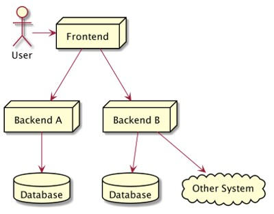
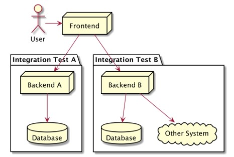
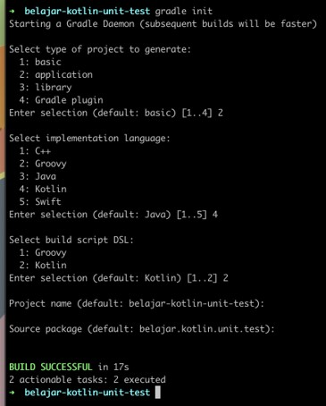
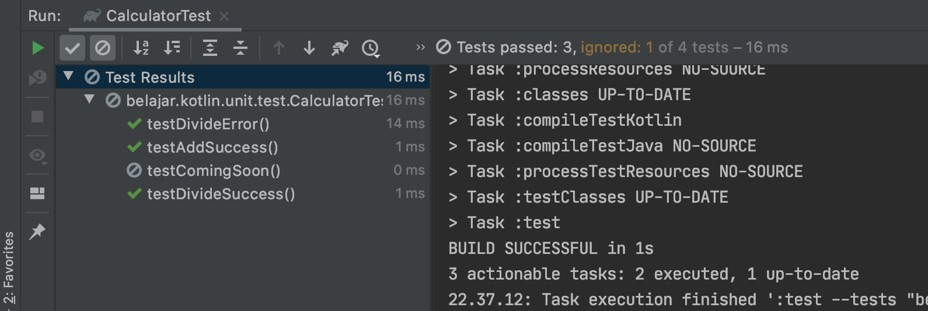
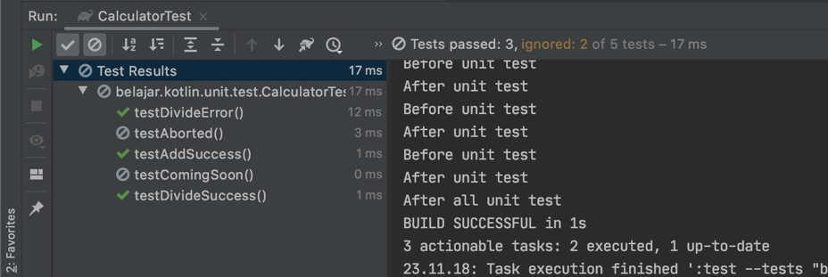
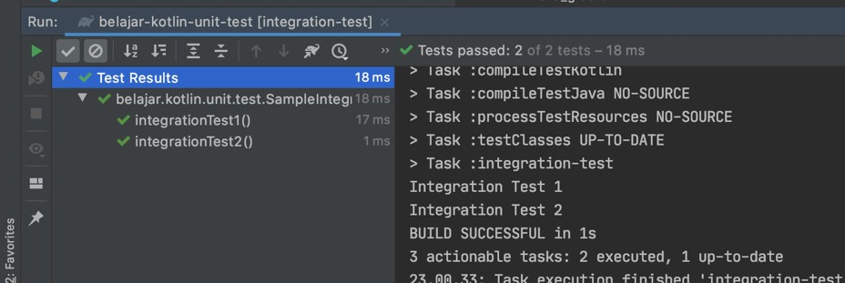
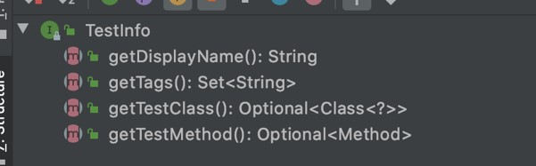

# Kotlin Unit Test

## Sebelum Belajar

- Kotlin Dasar
- Kotlin Object Oriented Programming
- Kotlin Generic
- Kotlin Collection
- Gradle
- <https://www.udemy.com/course/pemrograman-kotlin-pemula-sampai-mahir/?referralCode=98BE2E779EB8A0BEC230>

## #1 Pengenalan Software Testing

- Software testing adalah salah satu disiplin ilmu dalam software engineering
- Tujuan utama dari software testing adalah memastikan kualitas kode dan aplikasi kita baik
- Ilmu untuk software testing sendiri sangatlah luas, pada materi ini kita hanya akan fokus ke unit testing

### Test Pyramid


### Contoh High Leval Architecture Aplikasi



### Unit Test / End to End Test


### Service Test / Integration Test



### Contoh Internal Architecture Aplikasi


### Unit Test


### Unit Test

- Unit test akan fokus menguji bagian kode program terkecil, biasanya menguji sebuah function
- Unit test biasanya dibuat kecil dan cepat, oleh karena itu biasanya kadang kode unit test lebih banyak dari kode program aslinya, karena semua skenario pengujian akan dicoba di unit test
- Unit test bisa digunakan sebagai cara untuk meningkatkan kualitas kode program kita

## #2 Pengenalan JUnit

### Kotlin Test

- Kotlin sendiri mendukung pembuatan menggunakan kotlin test
- Kotlin test sendiri sebenarnya di belakangnya adalah sebuah test framework yang bernama `JUnit`
- <https://kotlinlang.org/api/latest/kotlin.test/>

### JUnit

- JUnit adalah test framework yang paling populer di Java
- Saat ini versi terbaru JUnit adalah versi 5, sedangkan sayangnya, yang digunakan oleh Kotlin Test adalah JUnit versi 4
- Di course Kotlin Unit Test ini, kita tidak akan menggunakan Kotlin Test (JUnit 4), namun kita akan menggunakan JUnit 5, karena fitur JUnit 5 sudah lebih lengkap dan canggih dibanding JUnit 4
- <https://junit.org/>

### Membuat Project Menggunakan Gradle



### Default Kotlin Test

```kt
dependencies {
	// ...

	// Use the Kotlin test library.
	testImplementation("org.jetbrains.kotlin:kotlin-test")

	// Use the Kotlin Jest integration.
	testImplementation("org.jetbrains.kotlin:kode-junit")
}

applicaiton {
`// ...
}
```

### Menggunakan JUnit 5 di Project Gradle

```kt
dependencies {
	testImplementation("org.junit.jupiter:junit-jupiter:5.6.2")
}

tasks.named<Test>("test") {
	useJUnitPlatform()
}

tasks.withType(org.jetbrains.kotlin.gradle.tasks.KotlinCompile::class).all {
	kotlinOptions {
		jvmTarget = "1.8"
	}
}
```

## #3 Membuat Test

- Untuk membuat test di JUnit itu sederhana, kita cukup membuat class, lalu menambahkan function-function test nya
- Function akan dianggap sebuah test jika ditambahkan annotation `@Test`
- Kode test disimpan dibagian test folder di gradle, bukan di main folder
- Biasanya saat membuat class untuk test, rata-rata orang biasa membuat nama class nya sama dengan nama class yang akan di test, tapi diakhiri dengan kata Test, misal jika nama class nya adalah `Calculator`, maka nama class test nya adalah `CalculatorTest`

### Kode: Class Calculator

```kt
class Calculator {

	fun add(first: Int, second: Int): Int {
		return first + second
	}
}
```

### Kode: Unit Test Class Calculator

```kt
import org.junit.jupiter.api.Test

class CalculatorTest {

	val calculator = Calculator()

	@Test
	fun testAddSuccess() {
		val result = calculator.add(1, 10)
	}
}
```

## #4 Menggunakan Assertions

- Saat membuat test, kita harus memastikan bahwa test tersebut sesuai dengan ekspektasi yang kita inginkan
- Jika manual, kita bisa melakukan pengecekan if else, namun itu tidak direkomendasikan
- JUnit memiliki fitur untuk melakukan assertions, yaitu memastikan bahwa unit test sesuai dengan kondisi yang kita inginkan
- Assertions di JUnit di representasikan dalam class `Assertions`, dan di dalamnya terdapat banyak sekali function static (di kotlin adalah object function)
- Walaupun JUnit dibuat menggunakan Java, tapi JUnit menyediakan function khusus untuk Kotlin
- <https://junit.org/junit5/docs/current/api/org.junit.jupiter.api/org/junit/jupiter/api/Assertions.html>

### Kode: Meng-import Assertions

```kt
import org.junit.jupiter.api.Test

import org.junit.jupiter.api.Assertions.*
import org.junit.jupiter.api.*

class CalculatorTest {

	val calculator = Calculator()

	@Test
	fun testAddSuccess() {
		val result = calculator.add(1, 10)
	}
}
```

### Kode: Menggunakan Assertions

```kt
class CalculatorTest {

	val calculator = Calculator()

	@Test
	fun testAddSuccess() {
		val result = calculator.add(1, 10)
		assertEquals(20, result)
	}
}
```

### Menggagalkan Test

- Kadang dalam membuat unit test, kita tidak hanya ingin mengetest kasus sukses atau gagal
- Ada kalanya kita ingin mengetes sebuah exception misalnya
- Assertions juga bisa digunakan untuk mengecek apakah sebuah exception terjadi

### Kode: Calculator Divide

```kt
class Calculator {

	fun divide(first: Int, second: Int): Int {
		if (second == 0) {
			throw IllegalArgumentException("Can not divide by zero")
		} else {
			return first / second
		}
	}

	fun add(first: Int, second: Int): Int {
		return first + second
	}
}
```

### Kode: Assertions Exeption

```kt
class CalculatorTest {

	val calculator = Calculator()

	@Test
	fun testDivideSuccess() {
		val result = calculator.divide(100, 10)
		assertEquals(10, result)
	}

	@Test
	fun testDivideError() {
		assertThrows<IllegalArgumentException> {
			calculator.divide(100, 0)
		}
	}
}
```

## #5 Mengubah Nama Test

- Kadang agak sulit membuat nama function yang merepresentasikan kasus test nya
- Jika kita ingin menambahkan deskripsi untuk tiap test, kita bisa menggunakan annotation `@DisplayName`
- Dengan menggunakan annotation @DisplayName, kita bisa menambahkan deskripsi unit testnya

### Kode: Menggunakan DisplayName

```kt
@DisplayName("Test Calculator Test")
class CalculatorTest {

	val calculator = Calculator()

	@Test
	@DisplayName("Test Function Calculator.add(Int, Int)")
	fun testAddSuccess() {
		val result = calculator.add(1, 10)
		assertEquals(20, result)
	}

	// ...
}
```

### Menggunakan Display Name Generator

- JUnit mendukung pembuatan DisplayName secara otomatis menggunakan generator
- Yang perlu kita lakukan adalah membuat class turunan dari interface `DisplayNameGenerator`, lalu menambahkan annotation `@DisplayNameGeneration` di test class nya

### Kode: Display Name Generator

```kt
class SimpleDisplayNameGenerator : DisplayNameGenerator {

	override fun generateDisplayNameForClass(testClass: Class<*>): String {
		return "Test ${testClass.name}"
	}

	override fun generateDisplayNameForMethod(testClass: Class<*>, testMethod: Method):  {
		val simpleName = testm<thod.name.replace("_", "")
		return "Test $simpleName"
	}
}
```

### Kode: Display Name Generation

```kt
@DisplayNameGeneration(SimpleDisplayNameGenerator::class)
class CalculatorTest {

	val calculator = Calculator()

	@Test
	fun testAddSuccess() {
		val result = calculator.add(1, 10)
		assertEquals(20, result)
	}

	// ...
}
```

## #6 Menonaktifkan Test

- Kadang ada kalanya kita ingin menonaktifkan unit test, misal karena terjadi error di unit test tersebut, dan belum bisa kita perbaiki
- Sebenarnya cara paling mudah untuk menonaktifkan unit test adalah dengan menghapus annotation `@Test`, namun jika kita lakukan itu, kita tidak bisa mendeteksi kalo ada unit test yang di disabled
- Untuk menonaktifkan unit test secara benar, kita bisa menggunakan annotation `@Disabled`

### Kode: Disabled Unit Test

```kt
class CalculatorTest {

	// ...

	@Test
	@Disabled("Coming Soon!")
	fun testComingSoon() {
		// TODO coming soon
	}
}
```

### Tampilan di IntelliJ IDEA



## #8 Sebelum & Setelah Test

- Kadang kita ingin menjalankan kode yang sama sebelum dan setelah eksekusi unit test
- Hal ini sebenarnya bisa dilakukan secara manual di function @Test nya, namun hal ini akan membuat kode duplikat banyak sekali
- JUnit memiliki annotation `@BeforeEach` dan `@AfterEach`
- `@BeforeEach` digunakan untuk menandai function yang akan dieksekusi sebelum unit test dijalankan
- `@AfterEach` digunakan untuk menandai function yang akan dieksekusi setelah unit teset dijalankan
- Ingat, bahwa ini akan selalu dieksekusi setiap kali untuk function `@Test`, bukan sekali untuk class test saja

### Kode: BeforeEach dan AfterEach

```kt
class CalculatorTest {

	@BeforeEach
	fun setUp() {
		println("Before unit test")
	}

	@AfterEach
	fun tearDown(){
		println("After unit test")
	}

	// ...
}
```

### Kode: BeforeAll dan AfterAll

```kt
class CalculatorTest {

	companion object {
		@BeforeAll
		@JvmStatic
		fn setUpAll() {
			println("Before all unit test")
		}

		@AfterAll
		@JvmStatic
		fn tearDownAll() {
			println("BeforAfter all unit test")
		}
	}

	// ...
}
```

## #9 Membatalkan Test

- Kadang kita ingin membatalkan unit test ketika kondisi tertentu terjadi
- Untuk membatalkan, kita bisa menggunakan exception `TestAbortedException`
- Jika JUnit mendapatkan exception TestAbortedException, secara otomatis test tersebut akan dibatalkan

### Kode: Membatalkan Test

```kt
class CalculatorTest {

	@Test
	fun testAborted() {
		val profile = System.getenv()["PROFILE"];
		if ("DEV" != profile) {
			throw TestAbortedException()
		}

		// Batalkan Test
	}

	// ...
}
```

### Ketika Test Dibatalkan



## #10 Menggunakan Assumptions

- Sebelumnya kita sudah tahu jika ingin membatalkan test, kita bisa menggunakan exception TestAbortedException
- Namun sebenarnya ada cara yang lebih mudah, yaitu dengan menggunakan `Assumptions`
- Penggunaan Assumptions mirip seperti Assertions, jika nilainya tidak sama, maka function `Assumptions` akan `thrown TestAbortedException`, sehingga secara otomatis akan membatalkan unit test yang sedang berjalan
- https://junit.org/junit5/docs/current/api/org.junit.jupiter.api/org/junit/jupiter/api/Assumptions.html

### Kode: Import Assumptions

```kt
import org.junit.jupiter.api.Test

import org.junit.jupiter.api.Assertions.*
import org.junit.jupiter.api.*
import org.junit.jupiter.api.Assumptions.*

@DisplayNameGeneration(SimpleDisplayNameGenerator::class)
class CalculatorTest {

	val calculator = Calculator()

	// ...
}
```

### Kode: Menggunakan Assumptions

```kt
class CalculatorTest {

	val calculator = Calculator()

	// ...

	@Test
	fun testAssumption() {
		assumeTrue("DEV" == System.getenv().get("PROFILE"))

		// Executed if assumptions true
	}
}
```

## #11 Test Berdasarkan Kondisi

- Sebenarnya kita bisa menggunakan Assumptions untuk menjalankan unit test berdasarkan kondisi tertentu
- Namun JUnit menyediakan fitur yang lebih mudah untuk pengecekan beberapa kondisi, seperti kondisi sistem operasi, versi java, system property atau environment variable
- Ini lebih mudah dibandingkan menggunakan Assumptions

### Kondisi Sistem Operasi

- Untuk kondisi sistem operasi, kita bisa menggunakan beberapa annotation
- `@EnabledOnOs` digunakan untuk penanda bahwa unit test boleh berjalan di sistem operasi yang ditentukan
- `@DisabledOnOs` digunakan untuk penanda bahwa unit test tidak boleh berjalan di sistem operasi yang ditentukan

### Kode: Kondisi Sistem Operasi

```kt
@Test
@EnabledOnOs(value = [OS.WINDOWS])
fun onlyRunOnWindows() {
	// put your test here
}

@Test
@DisabledOnOs(value = [OS.WINSOWS])
fun disabledRunOnWindows() {
	// put your test here
}
```

### Kondisi Versi Java

- Untuk kondisi versi Java yang kita gunakan, kita bisa menggunakan beberapa annotation
- `@EnabledOnJre` digunakan untuk penanda bahwa unit test boleh berjalan di Java versi tertentu
- `@DisabledOnJre` digunakan untuk penanda bahwa unit test tidak boleh berjalan di Java versi tertentu
- `@EnabledForJreRange` digunakan untuk penanda bahwa unit test boleh berjalan di range Java versi tertentu
- `@DisabledForJreRange` digunakan untuk penanda bahwa unit test tidak boleh berjalan di range Java versi tertentu

### Kode: Kondisi Versi Java

```kt
@Test
@EnableOnJre(value = [JRE.JAVA_14])
fun onlyRunOnJava14() {
	// put your test here
}

@Test
@DisableOnJre(value = [JRE.JAVA_14])
fun disabledRunOnJava14() {
	// put your test here
}
```

### Kode: Kondisi Range Versi Java

```kt
@Test
@EnabledForJreRange(min = JRE.JAVA_11, max = JRE.JAVA_14)
fun onlyRunOnJava11ToJava14() {
	// put your test here
}

@Test
@DisabledForJreRange(min = JRE.JAVA_11, max = JRE.JAVA_14)
fun disabledRunOnJava11ToJava14() {
	// put your test here
}
```

### Kondisi System Property

- Untuk kondisi nilai dari system property, kita bisa menggunakan beberapa annotation
- `@EnabledIfSystemProperty` untuk penanda bahwa unit test boleh berjalan jika system property sesuai dengan yang ditentukan
- `@DisabledIfSystemProperty` untuk penanda bahwa unit test tidak boleh berjalan jika system property sesuai dengan yang ditentukan
- Jika kondisinya lebih dari satu, kita bisa menggunakan `@EnabledIfSystemProperties` dan `@DisabledIfSystemProperties`

### Kode: Kondisi System Property

```kt
@Test
@EnabledIfSystemProperty(named = "java.vendor", matches = "Oracle Coporation")
fun enabledOnOracle() {
	// put your test here
}

@Test
@DisabledIfSystemProperty(named = "java.vendor", matches = "Oracle Coporation")
fun disabledOnOracle() {
	// put your test here
}
```

### Kondisi Environment Variable

- Untuk kondisi nilai dari environment variable, kita bisa menggunakan beberapa annotation
- @`EnabledIfEnvironmentVariable` untuk penanda bahwa unit test boleh berjalan jika environment variable sesuai dengan yang ditentukan
- `@DisabledIfEnvironmentVariable` untuk penanda bahwa unit test tidak boleh berjalan jika environment variable sesuai dengan yang ditentukan
- Jika kondisinya lebih dari satu, kita bisa menggunakan `@EnabledIfEnvironmentVariables` dan `@DisabledIfEnvironmentVariables`

### Kode: Kondisi Environment Variable

```kt
@Test
@EnabledIfEnvironmentVariable(named = "PROFILE", matches = "DEV")
fun enabledOnProfileDev() {
	// put our test here
}

@Test
@DisabledIfEnvironmentVariable(named = "PROFILE", matches = "DEV")
fun disabledOnProfileDev() {
	// put our test here
}
```

## #12 Menggunakan Tag

- Class atau function unit test bisa kita tambahkan tag (tanda) dengan menggunakan annotation `@Tag`
- Dengan menambahkan tag ke dalam unit test, kita bisa fleksibel ketika menjalan unit test, bisa memilih tag mana yang mau di include atau di exclude
- Jika kita menambahkan tag di class unit test, secara otomatis semua function unit test di dalam class tersebut akan memiliki tag tersebut
- Jika kita ingin menambahkan beberapa tag di satu class atau function unit test, kita bisa menggunakan annotation `@Tags`

### Kode: Menggunakan Tag

```kt
@Tag("integration-test")
class SimpleIntegrationTest {

	@Test
	fun integrationTest1() {
		println("Integration Test 1")
	}

	@Test
	fun integrationTest2() {
		println("Integration Test 2")
	}
}
```

### Kode: Membuat Task Test di Gradle

```kt
tasks.named<Test>("test") {
	useJUnitPlatform {
		excludeTags("integration-test")
	}
}

tasks.register("integration-test", Test::class) {
	useJUnitPlatform {
		includeTags("integration-test")
	}
}
```

### Contoh Running Test dengan Tag



## #13 Urutan Eksekusi Test

- Secara default, urutan eksekusi unit test tidak ditentukan, jadi jangan berharap jika sebuah function berada diatas function lainnya, maka akan dijalankan lebih dulu
- Hal ini karena memang sebaiknya function unit test itu harus independen, tidak saling ketergantungan
- Secara default pun, object class unit test akan selalu dibuat ulang tiap function, jadi jangan berharap kita bisa menyimpan data di variable untuk digunakan di unit test function selanjutnya

### Mengubah Urutan Eksekusi Test

- JUnit mendukung perubahan urutan eksekusi test jika kita mau menggunakan annotation @`TestMethodOrder`, ada beberapa cara yang bisa kita lakukan
- `Alphanumeric`, artinya urutan eksekusi unit test akan diurutkan berdasarkan alphanumeric
- `Random`, artinya urutan urutan eksekusi unit test akan dieksekusi secara random
- `OrderAnnotation`, artinya urutan eksekusi unit test akan mengikuti annotation `@Order` yang ada di tiap function unit test

### Kode: Menggunakan Order Annotation

```kt
@TestMethodOrder(value = MethodOrderer.OrderAnnotation::class)
class OrderedTest {

	@Test
	@Order(3)
	fun test3() {

	}

	@Test
	@Order(2)
	fun test2() {

	}
}
```

### Membuat Urutan Sendiri

- Jika kita ingin membuat cara mengurutkan urutan unit test function sendiri, kita bisa dengan mudah tinggal membuat class baru turunan dari `MethodOrderer` interface

## #14 Siklus Hidup Test

- Secara default, lifecycle (siklus hidup) object test adalah independent per function test, artinya object unit test akan selalu dibuat baru per function unit test, oleh karena itu kita tidak bisa bergantung dengan function test lain
- Cara pembuatan object test di JUnit ditentukan oleh annotation `@TestInstance`, dimana defaultnya adalah `Lifecycle.PER_METHOD`, artinya tiap function akan dibuat sebuah instance / object baru
- Kita bisa merubahnya menjado `Lifecycle.PER_CLASS` jika mau, dengan demikian instance / object test haya dibuat sekali per class, dan function test akan menggunakan object test yang sama
- Hal ini bisa kita manfaatkan ketika membuat test yang tergantung dengan test lain

### Kode: Menggunakan Instance Per Class

```kt
@TestInstance(TestInstane.Lifecycle.PER_CLASS)
@TestMethodOrder(value = MethodOrderer.OrderAnnotation::class)
class OrderedTest {

	var count: Int = 0

	@Test
	@Order(3)
	fun test3() {
		count++
		println(count)
	}
}
```

### Keuntungan Instance Per Class

- Salah satu keuntungan saat menggunakan `Lifecycle.PER_CLASS` adalah, kita bisa menggunakan `@BeforeAll` dan `@AfterAll` di function biasa, tidak harus menggunakan function `object` / `static`

### Kode: BeforeALl dan AfterAll

```kt
@TestInstance(TestInstane.Lifecycle.PER_CLASS)
@TestMethodOrder(value = MethodOrderer.OrderAnnotation::class)
class OrderedTest {

	var count: Int = 0

	@BeforeAll
	fun beforeAll() {

	}

	@AfterAll
	fun afterAll() {

	}

}
```

## #15 Test di dalam Test

- Saat membuat unit test, ada baiknya ukuran test class nya tidak terlalu besar, karena akan sulit di baca dan dimengerti.
- Jika test class sudah semakin besar, ada baiknya kita pecah menjadi beberapa test class, lalu kita grouping sesuai dengan jenis function test nya.
- JUnit mendukun pembuatan class test di dalam class test, jadi kita bisa memecah sebuah class test, tanpa harus membuat class di file berbeda, kita bisa cukup menggunakan inner class
- Untuk memberi tahu bahwa inner class tersebut adalah test class, kita bisa menggunakan annotation `@Nested`

### Kode: Test di dalam Test

```kt
@DisplayName("A queue")
class QueueTest {

	lateinit var queue: Queue<String>

	@Nested
	@DisplayName("when new")
	inner class WhenNew {

		@BeforeEach
		fun createNew() {
			queue = LinkedList<String>()
		}
	}
}
```

## #16 Informasi Test

- Walaupun mungkin jarang kita gunakan, tapi kita juga bisa mendapatkan informasi test yang sedang berjalan menggunakan interface `TestInfo`
- Kita bisa menambahkan TestInfo sebagai parameter di function unit test



### Kode: Menggunakan Test Info

```kt
@DisplayName("Test with TestInfo")
class InformationTest {

	@Test
	@Tag("cool")
	@DisplayName("This is test one")
	fun testOne(testInfo: TestInfo) {
		println(testInfo.displayName)
		println(testInfo.tags)
		println(testInfo.testMethod)
		println(testInfo.testClass)
	}
}
```

## #17 Dependency Injection di Test

- Tidak ada magic di JUnit, sebenarnya fitur TestInfo yang sebelumnya kita bahas adalah bagian dari dependency injection di JUnit
- Dependency Injection sederhananya adalah bagaimana kita bisa memasukkan dependency (object/instance) ke dalam unit test secara otomatis tanpa proses manual
- Saat kita menambah parameter di function unit test, sebenarnya kita bisa secara otomatis memasukkan parameter tersebut dengan bantuan `ParameterResolver`
- Contohnya TestInfo yang kita bahas sebelumya, sebenarnya objectnya dibuat oleh `TestInfoParameterResolver`

### Kode: Membuat Random Parameter Resolver

```kt
class RandomParameterResolver : ParameterResolver {

	private val random: Random = Random()

	override fun supportsParameter(parameterContext: ParameterContext, extensionContext: ExtensionContext) {
		retrun parameterContext.parameter.type == Random::class.java
	}

	override fun resolverParameter(parameterContext: ParameterContext, extensionContext: ExtensionContext) {
		retrun random
	}
}
```

### Menggunakan Parameter Resolver

- Untuk menggunakan parameter resolver yang sudah kita buat, kita bisa menggunakan annontation `@ExtendWith` di test class
- Jika lebih dari 1 parameter resolver, kita bisa menggunakan `@Extentions`

### Kode: Menggunakan Random Resolver

```kt
@Extensions(value = [
	ExtendWith(RandomParameterResolver::class)
])
class RandomCalculatorTest {

	private val calculator = Calculator()

	@Test
	fun testRandom(random: Random) {
		val a = random.nextInt()
		val b = random.nextInt()
		assertEquals(a + b, calculator.add(a, b))
	}
}
```

## #18 Pewarisan di Test

- JUnit mendukung pewarisan di test, artinya jika kita membuat class atau interface dan menambahkan informasi test disitu, maka ketika kita membuat turunannya, secara otomatis semua fitur test nya dimiliki oleh turunannya
- Ini sangat cocok ketika kita misal contohnya sering membuat code sebelum dan setelah test yang berulang-ulang, sehingga dibanding dibuat di semua test class, lebih baik dibuat sekali di parent test class, dan test class tinggal menjadi child class dari parent test class

### Kode: Membuat Parent Test Class

```kt
@Extensions(value = [
	ExtendWith(RandomParameterResolver::class)
])
abstract class ParentCalculatorTest {

	val calculator = Calculator()

	@BeforeEach
	fun beforeEach() {
		println("Before each")
	}
}
```

### Kode: Membuat Child Test Class

```kt
class RandomCalculatorTest : ParentCalculatorTest() {

	@Test
	fun testRandom(random: Random) {
		val a = random.nextInt()
		val b = random.nextInt()
		assertEquals(a + b, calculator.add(a, b))
	}
}
```

## #19 Test Berulang

- JUnit mendukung eksekusi unit test berulang kali sesuai dengan jumlah yang kita tentukan
- Untuk mengulang eksekusi unit test, kita bisa menggunakan annotation `@RepeatedTest` di function unit test nya
- `@RepeatedTest` juga bisa digunakan untuk mengubah detail nama test nya, dan kita bisa menggunakan value `{displayName}` untuk mendapatkan display name, `{currentRepetition}` untuk mendapatkan perulangan ke berapa saat ini, dan `{totalRepetitions}` untuk mendapatkan total perulangan nya

### Kode: Test Berulang

```kt
class RandomCalculatorTest : ParentCalculatorTest() {

	@DisplayName("Test Calculator Random")
	@RepeatedTest(
		value = 10,
		name = "{displayName} ke {currentRepetition} dari {totalRepetitions}"
	)
	fun testRandom(random: Random) {
		val a = random.nextInt()
		val b = random.nextInt()
		assertEquals(a + b, calculator.add(a, b))
	}
}
```

### Informasi Perulangan

- `@RepeatedTest` juga memiliki object `RepetitionInfo` yang di inject oleh class `RepetitionInfoParameterResolver`, sehingga kita bisa mendapatkan informasi RepetitionInfo melalui parameter function unit test

### Kode: Informasi Perulangan

```kt
class RandomCalculatorTest : ParentCalculatorTest() {

	@DisplayName("Test Calculator Random")
	@RepeatedTest(
		value = 10,
		name = "{displayName} ke {currentRepetition} dari {totalRepetitions}"
	)
	fun testRandom(random: Random, testInfo: TestInfo, repetitionInfo: RepetitionInfo) {
		println("${testInfo.displayName} ke ${repetitionInfo.currentRepetition}")
		val a = random.nextInt()
		val b = random.nextInt()
		assertEquals(a + b, calculator.add(a, b))
	}
}
```

## #20 Test dengan Parameter

- Sebelumnya kita sudah tau jika ingin menambahkan parameter di function unit test, maka kita perlu membuat `ParameterResolver`
- Namun jika terlalu banyak membuat ParameterResolver juga agak menyulitkan kita
- JUnit memiliki fitur yang bernama `@ParameterizedTest`, dimana jenis unit test ini memang khusus dibuat agar dapat menerima parameter
- Yang perlu kita lakukan adalah dengan mengganti @Test menjadi `@ParameterizedTest`

### Sumber Parameter

`@ParameterizedTest` mendukung beberapa sumber parameter, yaitu

- `@ValueSource`, untuk sumber Number, Char, Boolean dan String
- `@EnumSource`, untuk sumber berupa enum
- `@MethodSource`, untuk sumber dari function object (static)
- `@CsvSource`, untuk sumber beruba data CSV
- `@CsvFileSource`, untuk sumber beruba file CSV
- `@ArgumentSource`, untuk data dari class `ArgumentProvider`

### Kode: Parameter dengan `@ValueSource`

```kt
class RandomCalculatorTest : ParentCalculatorTest() {

	@DisplayName("Test Calculator with Parameter")
	@ParameterizeedTest(
		name = "{displayName} with data {0}"
	)
	@ValueSource(ints = [1, 2, 3, 4, 5])
	fun testWithParameter(value: Int) {
		val result = value + value
		assertEquals(result, calculator.add(value, value))
	}
}
```

### Kode: Parameter dengan `@MethodSoruce`

```kt
class RandomCalculatorTest : ParentCalculatorTest() {

	@DisplayName("Test Calculator with Parameter")
	@ParameterizeedTest(
		name = "{displayName} with data {0}"
	)
	@ValueSource(ints = [1, 2, 3, 4, 5])
	fun testWithParameter(value: Int) {
		val result = value + value
		assertEquals(result, calculator.add(value, value))
	}

	companion object {

		@JvmStatic
		fun parameterSource(): List<Int> {
			return listOf(1, 2, 3, 4, 5)
		}
	}
}
```

## #21 Timeout di Test

- Kadang kita ingin memastikan bahwa sebuah unit test berjalan tidak lebih dari sekian detik
- Misal ketika kasus kita ingin memastikan kode program kita mempunyai performa bagus dan cepat
- JUnit memiliki fitur timeout, yaitu memastikan bahwa unit test berjalan tidak lebih dari waktu yang ditentukan, jika melebihi waktu yang ditentukan, secara otomatis unit test tersebut akan gagal
- Kita bisa menggunakan annotation @Timeout untuk melakukan hal tersebut

### Kode: Timeout di Test

```kt
class SlowTest {

	@Test
	@Timeout(value = 5, unit = TimeUint.SECONDS)
	fun slow() {
		Thread.sleep(10_000)
	}
}
```

## #22 Eksekusi Test Secara Peralel

- Secara default, JUnit tidak mendukung eksekusi unit test secara paralel, artinya unit test akan dijalankan secara sequential satu per satu
- Namun kadang ada kasus kita ingin mempercepat proses unit test sehingga dijalankan secara paralel, hal ini bisa kita lakukan di JUnit, namun perlu beberapa langkah
- Tapi ingat, pastikan unit test kita aman ketika dijalankan secara paralel

### Menambah Konfigurasi Paralel

- Hal pertama yang perlu kita lakukan adalah membuat file `junit-platform.properties` di resource
- Lalu menambah value :
  - `junit.jupiter.execution.parallel.enabled = true`

### Menggunakan `@Execution`

- Walaupun sudah mengaktifkan fitur paralel, tapi bukan berarti secara otomatis semua unit test berjalan paralel, agar unit test berjalan paralel, kita perlu menggunakan annotation `@Execution`
- Lalu memilih jenis execution nya, misal untuk paralel bisa menggunakan `ExecutionMode.CONCURRENT`

### Kode: Test Secara Paralel

```kt
@Execution(value = ExecutionMode.CONCURRENT)
class SlowTest {

	@Test
	@Timeout(value = 5, unit = TimeUnit.SECONDS)
	fun slow1() {
		 Thread.sleep(4_000)
	}

	@Test
	@Timeout(value = 5, unit = TimeUnit.SECONDS)
	fun slow2() {
		 Thread.sleep(4_000)
	}
}
```

## #23 Pengenalan Mocking

### Ketergantungan Antar Class

- Saat membuat aplikasi yang besar, source code pun akan semakin besar, struktur class pun akan semakin kompleks
- Kita tidak bisa memungkiri lagi bahwa akan ada ketergantungan antar class
- Unit test yang bagus itu bisa terprediksi dan cukup nge test ke satu function, jika harus mengetes interaksi antar class, lebih disarankan integration test
- Lantas bagaimana jika kita harus mengetest class yang ketergantungan dengan class lain?
- Solusinya adalah melakukan mocking terhadap dependency yang dibutuhkan class yang akan kita test

### Pengenalan Mocking

- Mocking sederhananya adalah membuat object tiruan
- Hal ini dilakukan agar behavior object tersebut bisa kita tentukan sesuai dengan keinginan kita
- Dengan mocking, kita bisa membuat request response seolah-olah object tersebut benar dibuat

### Pengenalan Mockito

- Ada banyak framework untuk melakukan mocking, namun di materi ini kita akan menggunakan Mockito
- Mockito adalah salah satu mocking framework paling populer di Java, dan bisa digunakan juga untuk Kotlin
- Dan Mockito bisa diintegrasikan baik dengan JUnit
- <https://site.mockito.org/>

### Kode: Menambahkan Dependency Mockito

```kt
dependencies {
	testImplementation("org.junit.jupiter:junit-jupiter:5.6.2")

	testImplementation("org.mockito:mockito-junit-jupiter:3.4.4")
}
```

### Kode: Contoh Mocking dengan Mockito

```kt
class MockitoTest {

	@Test
	fun testMock() {
		// membuat mock
		val listMock = Mockito.mock(List::class.java) as List<String>

		// menmabah behaviour di mock object
		Mockito.`when`(listMock.get(0)).thenReturn("Eko")

		// test mock
		assertEquals("Eko", listMock.get(0))

		// verify mock
		Mockito.verify(listMock, Mockito.times(1)).get(0)
	}
}
```

## #24 Mocking di Test

- Mockito memiliki `MockitoExtension` yang bisa kita gunakan untuk integrasi dengan JUnit
- Hal ini memudahkan kita ketika ingin membuat mock object, kita cukup gunakan `@Mock`
- Agar terbayang bagaimana proses mock, kita akan coba kasus yang lumayan panjang

### Contoh Kasus

- Kita punya sebuah class model dengan nama class `Person(id: String, name: String)`
- Selanjutnya kita punya interface `PersonRepository` sebagai interaksi ke database, dan memiliki function `selectById(id: String)` untuk melakukan mendapatkan data Person di database
- Dan terakhir kita memiliki class `PersonService` yang digunakan sebagai class bisnis logic, dimana di class tersebut kita akan coba gunakan `PersonRepository` untuk mendapatkan data dari database, jika gagal, kita akan `throw Exception`

### Kode: Class Person

```kt
package belajar.kotlin.unit.test.model

data class Person(val id: String, val name: String)
```

### Kode: Interface PersonRepository

```kt
package belajar.kotlin.unit.test.repository

import belajar.kotlin.unit.test.model.Person

interface PersonRepository {

	fun selectById(id: String): Person?
}
```

### Kode: Class PersonService

```kt
class PersonService(private val personRepository: PersonRepository) {

	fun get(id: String): Person {
		val preson = personRepository.selectById(id)
		if (person != null) {
			return person
		} else {
			throw Exception("Person not found")
		}
	}
}
```

### Kode: Integrasi Mockito dan JUnit

```kt
@ExtendWith(value = [MockitoExtension::class])
class PersonServiceTest {

	@Mock
	lateinit var personRepository: PersonRepository

	lateinit var personService: PersonService

	@BeforeEach
	fun beforeEach() {
		personService = PersonService(personRepository)
	}
}
```

### Kode: Test Get Person

```kt
@ExtendWith(value = [MockitoExtension::class])
class PersonServiceTest {

	// ...

	@Test
	fun testGetNotFound() {
		assertThrows<Exception> { personService.get("not found") }
	}

	@Test
	fun testGetSuccess() {
		Mockito.`when`(personRepository.selectById("eko")).thenReturn(PErson("eko", "Eko"))
		val person = personService.get("eko")
		assertEquals("eko", person.id)
		assertEquals("Eko", person.name)
	}
}
```

## #25 Verifikasi di Mocking

- Pada materi sebelumnya, kita tidak melakukan verifikasi terhadap object mocking, apakah dipanggil atau tidak
- Pada kasus sebelumnya mungkin tidak terlalu berguna karena kebetulan function nya mengembalikan value, sehingga kalo kita lupa memanggil function nya, sudah pasti unit test nya gagal
- Lantas bagaimana jika function nya tidak mengembalikan value? Alias function unit

### Contoh Kasus

- Kita akan melanjutkan kasus sebelumnya
- Di interface `PersonRepository` kita akan membuat function `insert(person: Person)` yang digunakan untuk menyimpan data ke database, namun tidak mengembalikan value, alias unit
- Di class `PersonService` kita akan membuat function `register(name: String)` dimana akan membuat object Person dengan id random, lalu menyimpan ke database via PersonRepository, lalu mengembalikan object person tersebut

### Kode: Interface PersonRepository

```kt
package belajar.kotlin.unit.test.repository

import belajar.kotlin.unit.test.model.Person

interface PersonRepository {

	fun insert(person: Person)

	fun selectById(id: String): Person?
}
```

### Kode: Class PersonService

```kt
package belajar.kotlin.unit.test.repository

import belajar.kotlin.unit.test.model.Person
import belajar.kotlin.unit.test.repository.PersonRepository
import java.util.*

class PersonService(private val personRepository: PersonRepository) {

	fun register(name: String): Person {
		val person = Person(UUID.randomUID().toString(), name)
		personRepository.insert(person)
		return person
	}

	// ...
}
```

### Kode: Unit Test (Sebenarnya Salah)

```kt
@ExtendWith(value = [MockitoExtension::class])
class PersonServiceTest {

	// ...

	@Test
	fun testCreateSuccess() {
		val person = personService.register("Eko")
		assertEquals("Eko", person.name)
		assertNotNull(person.id)
	}
}
```

### Kode Salah?

- Coba hapus kode `personRepository.insert(person)`
- Maka unit test nya pun tetap sukses
- Hal ini terjadi karena, kita tidak melakukan verifikasi bahwa mocking object dipanggil
- Hal ini sangat berbahaya, karena jika code sampai naik ke production, bisa jadi orang yag registrasi datanya tidak masuk ke database

### Kode: Unit Test dengan Verifikasi

```kt
@ExtendWith(value = [MockitoExtension::class])
class PersonServiceTest {

	// ...

	@Test
	fun testCreateSuccess() {
		val person = personService.register("Eko")
		assertEquals("Eko", person.name)
		assertNotNull(person.id)

		Mockito.verify(personRepository, Mockito.times(1)).insert(Person(person.id, person.name))
	}

}
```

## #26 Materi Selanjutnya

- Kotlin Coroutine
