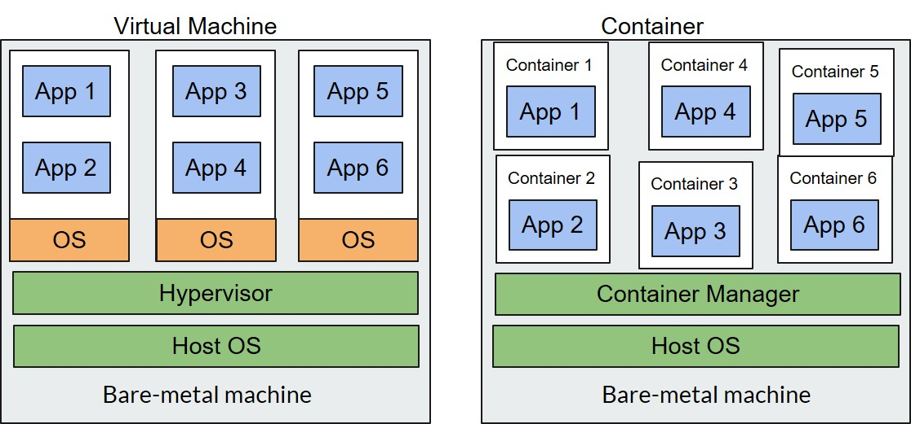

# Kubernetes

## #1 Sebelum Belajar Kubernetes

### Dari Monolith ke Microservices

- Apa itu Monolith? Saat kita membuat sebuah aplikasi, dan semua fitur dibuat dalam aplikasi tersebut, maka aplikasi tersebut bisa dibilang Monolith.
- Apa itu Microservices? Microservices adalah kebalikannya dari Monolith, dimana aplikasi dipecah menjadi kecil-kecil, dimana tiap aplikasi hanya mengurus satu tugas dengan baik, dan semua aplikasi saling berkomunikasi.

### Dari Monolith ke Microservices


### Dari Virtual Machine ke Container



### Scaling Microservices Menggunakan Container


### Docker

- Kubernetes mendukung beberapa Container Manager
- Namun yang saat ini sangat populer adalah Docker

### Docker Deployment


### Sebelum Lanjut

- Pastikan sudah mengerti Docker
- <https://www.youtube.com/playlist?list=PL-CtdCApEFH-A7jBmdertzbeACuQWvQao>

## #2 Pengenalan Kubernetes

### Apa itu Kubernetes?

- Kubernetes adalah aplikasi untuk automation deployment, scaling dan manajemen aplikasi berbasis container
- Kubernetes adalah aplikasi Open Source dan saat ini paling populer di jenis nya
- Banyak perusahaan-perusahaan besar yang sudah menggunakan Kubernetes, termasuk perusahaan Unicorn di Indonesia

### Sejarah Kubernetes

- Bertahun-tahun Google membuat internal sistem yang bernama Borg (kemudian berganti nama menjadi Omega)
- Sistem ini digunakan untuk membantu developer dan infra engineer untuk me-manage ribuan server yang ada di Google
- Tahun 2014 Google memperkenalkan Kubernetes, Open Source system yang berasal dari pengalaman Borg, Omega dan internal system lainnya

### Alur Kerja Menggunakan Kubernetes


## #3 Arsitektur Kubernetes


### Kubernetes Master

- `kube-apiserver` bertugas sebagai API yang digunakan untuk berinteraksi dengan Kubernetes Cluster
- `etcd bertugas` untuk sebagai database untuk menyimpan data Kubernetes Cluster
- `kube-scheduler` bertugas untuk memperhatikan aplikasi yang kita jalankan dan meminta Node untuk menjalankan aplikasi yang kita jalankan
- `kube-controller-manager` bertugas melakukan kontrol terhadap Kubernetes Cluster
- `cloud-controller-manager` bertugas untuk melakukan kontrol terhadap interaksi dengan cloud provider

### Kubernetes Nodes

- `kubelet` berjalan di setiap Node dan bertugas untuk memastikan bahwa aplikasi kita berjalan di Node
- `kube-proxy` berjalan di setiap Node dan bertugas sebagai proxy terhadap arus network yang masuk ke aplikasi kita dan sebagai load balancer juga
- `container-manager` berjalan di setiap Node dan bertugas sebagai container manager. Kubernetes mendukung beberapa container manager seperti Docker, `containerd`, `cri-o`, `rktlet`, dan yang lainnya.

### Alur Kerja Menggunakan Kubernetes


### Detail Alue Kerja Kubernetes


## #3 Menginstall Kubernetes di Local

- Menggunakan Docker Desktop
- Menggunakan Minikube (butuh VirtualBox atau Hyper-V)
  - <https://github.com/kubernetes/minikube>

### Menginstall Kubectl

- <https://kubernetes.io/docs/tasks/tools/install-kubectl/>

## #4 Node

- Node adalah worker machine di Kubernetes, sebelumnya ada yang menyebutnya Minion
- Node bisa saja dalam bentuk VM atau Mesin Fisik
- Di dalam Node selalu terdapat kubelet, kube-proxy dan container manager

### Node


### Melihat Semua Node

```sh
kubectl get node
```

### Melihat Detail Node

```sh
kubectl describe node namanode
```

## #5 Pod

### Apa itu Pod?

- Pod adalah unit terkecil yang bisa di deploy di Kubernetes Cluster
- Pod berisi satu atau lebih container
- Secara sederhana Pod adalah aplikasi kita yang running di Kubernetes Cluster

### Pod


### Kenapa butuh Pod?

- Kenapa tidak langsung menggunakan Container?
- Kenapa dalam Pod bisa menjalankan lebih dari satu Container?

### Melihat Semua Pod

```sh
kubectl get pod
```

### Melihat Detail Pod

```sh
kubectl describe pod namapod
```

## #6 Membuat Pod

### Template Pod

- <https://github.com/khannedy/belajar-kubernetes/blob/master/templates/pod.yaml>

### Membuat Pod

```sh
kubectl create -f filepod.yaml
```

### Melihat Pod

```sh
kubectl get pod

kubectl get pod -o wide

kubectl describe pod namapod
```

### Mengakses Pod

```sh
kubectl port-forward namapod portAkses:portPod

kubectl port-forward namapod 8888:8080
```

## #7 Label

### Kenapa butuh Label?

- Untuk memberi tanda pada Pod
- Untuk mengorganisir Pod
- Memberi informasi tambahan pada Pod
- Label tidak hanya bisa digunakan pada Pod, tapi pada semua resource di Kubernetes, seperti Replication Controller, Replica Set, Service, dan lain-lain

### Template Pod dengan Label

- <https://github.com/khannedy/belajar-kubernetes/blob/master/templates/pod-with-label.yaml>

### MEnambahkan Label di Pod

```sh
kubectl create -f namafile.yaml

kubectl get pods --show-labels
```

### Menambahkan atau Mengubah Label di Pod

```sh
kubectl label pod namapod key=value

kubectl label pod namapod key=value --overwrite
```

### Mencari Pod dengan Label

```sh
kubectl get pods -l key

kubectl get pods -l key=value

kubectl get pods -l '!key'

kubectl get pods -l key!=value

kubectl get pods -l 'key in (value1, value2)'

kubectl get pods -l 'key notin (value1, value2)'
```

### Mencari Pod dengan Beberapt Label

```sh
kubectl get pods key,key2=value

kubectl get pods key=value,key2=value
```

## #8 Annotation

### Untuk Apa Annotation?

- Annotation mirip dengan Label, hanya tidak dapat di filter seperti label
- Biasanya Annotation digunakan untuk menambahkan informasi tambahan dalam ukuran besar
- Annotation bisa menampung informasi sampai `256kb`

### Template Pod dengan Annotation

- <https://github.com/khannedy/belajar-kubernetes/blob/master/templates/pod-with-annotation.yaml>

### Menambahkan Annotation ke Pod

```sh
kubectl annotate pod namapod key=value

kubectl annotate pod namapod key=value --overwrite
```

## #8 Namespace

### Kapan Menggunakan Namespace?

- Ketika resources di Kubernetes sudah terlalu banyak
- Ketika butuh memisahkan resources untuk multi-tenant, team atau environment
- Nama resources bisa sama jika berapa di namespace yang berbeda

### Melihat Namespace

```sh
kubectl get namespaces

kubectl get namespace

kubectl get ns
```

### Melihat Pod di Namespace

```sh
kubectl get pod --namespace namanamespace

kubectl get pod -n namanamespace
```

## #9 Membuat Namespace

### Template Namespace

- <https://github.com/khannedy/belajar-kubernetes/blob/master/templates/namespace.yaml>

### Membuat Namespace

```sh
kubectl create -f namafile.yaml
```

### Membuat Pod di Namespace

```sh
kubectl create -f namafile.yaml --namespace namanamespace
```

### Tang Perlu Diketahui Tentang Namespace

- Pod dengan nama yang sama boleh berjalan asalkan di Namespace yang berbeda
- Namespace bukanlah cara untuk mengisolasi resource
- Walaupun berbeda namespace, pod akan tetap bisa saling berkomunikasi dengan pod lain di namespace yang berbeda

### Menghapus Namespace

```sh
kubectl delete namespace namanamespace
```

## #10 Menghapus Pod

### Menghapus Pod

```sh
kubectl delete pod namapod

kubectl delete pod namapod1 namapod2 namapod3
```

### Manghapus Pod Menggunakan Label

```sh
kubectl delete pod -l key=value
```

### Menghapus Semua Pod di Namesapce

```sh
kubectl delete pod --all --namespace namanamespace
```

## #11 Probe

### Sebelum Lanjut Membahas Materi Selanjutnya

- Materi selanjutnya akan fokus pada Replication Controller dan Replica Set
- Namun, sebelum kita bahas materi selanjutnya, kita harus mengerti tentang liveness, readiness, dan startup probe di Kubernetes

### Liveness, Readliness, Startup Probe

- Kubelet menggunakan liveness probe untuk mengecek kapan perlu me-restart Pod
- Misal saat liveness probe pada Pod tidak merespon kubelet akan secara otomatis me-restart Pod
- Kubelet menggunakan readiness probe untuk mengecek apakah Pod siap menerima traffic.
- Kubelet menggunakan startup probe untuk mengecek apakah Pod sudah berjalan, Jika belum berjalan, maka kubelet tidak akan melakukan pengecekan liveness dan readiness.
- Startup probe cocok untuk Pod yang membutuhkan proses startup lama, ini dapat digunakan untuk memastikan Pod tidak mati oleh kubelet sebelum selesai berjalan dengan sempurna.

### Mekanisme Pengecekan Probe

- HTTP Get
- TCP Socket
- Command Exec

### Template Pod dengan Probe

- <https://github.com/khannedy/belajar-kubernetes/blob/master/templates/pod-with-probe.yaml>

### Melihat Detail Probe

```sh
kubectl get pod

kubectl describe pod podname
```

### Konfigurasi Probe

- `initialDelaySeconds`, waktu setelah container jalan dan dilakukan pengecekan, default nya `0`
- `periodSeconds`, seberapa sering pengecekan dilakukan, default nya `10`
- `timeoutSeconds`, waktu timeout ketika pengecekan gagal, default `1`
- `successThreshold`, minimum dianggap sukses setelah berstatus failure, default `1`
- `failureThreshold`, minimum dianggap gagal, default `3`

## #12 Replication Controller

### Apa itu Replication Controller?

- Replication Controller bertugas untuk memastikan bahwa Pod selalu berjalan
- Jika tiba-tiba Pod mati atau hilang, misal ketika ada Node yang mati. Maka Replication Controller secara otomatis akan menjalankan Pod yang mati atau hilang tersebut
- Replication Controller biasanya ditugaskan untuk memanage lebih dari 1 Pod
- Replication Controller akan memastikan jumlah Pod yang berjalan sejumlah yang telah ditentukan. Jika kurang, makan aman menambah Pod baru, jika lebih maka akan menghapus Pod yang sudah ada.

### Replication Controller


### Ketika Terjadi Masalah


### Isi Replication Controller

- Label Selector, sebagai penanda pod
- Replica Count, jumlah Pod yang seharusnya berjalan
- Pod Template, template yang digunakan untuk menjalankan Pod

## #13 Membuat Replication Controller

### Template Replication Controller

- <https://github.com/khannedy/belajar-kubernetes/blob/master/templates/replication-controller.yaml>

### Melihat Replication Controller

```sh
kubectl get replicationcontrollers

kubectl get replicationcontroller

kubectl get re
```

## #14 Manghapus Replication Controller

### Sebelum Manghapus Replication Controller

- Saat kita menghapus Replication Controller, maka secara otomatis Pod yang berada pada label selectornya akan ikut terhapus.
- Jika kita ingin menghapus Replication Controller, tanpa menghapus Pod yang berada pada label selectornya, kita bisa tambahkan opsi `--cascade=false`

### Manghapus Replication Controller

```sh
kubectl delete rc namarc
kubectl delete rc namarc --cascade=false
```

## #15 Replica Set

### Apa itu Replica Set?

- Pada awalnya Replication Controller digunakan untuk menjaga jumlah replica Pod dan me-reschedule ulang Pod yang mati.
- Namun sekarang, telah dikenalkan resource baru yang bernama Replica Set
- Replica Set adalah generasi baru dari Replication Controller, dan digunakan sebagai pengganti Replication Controller
- Replication Controller sendiri penggunaannya sekarang sudah tidak direkomendasikan

### Replica Set vs Replication Controller

- Replica Set memiliki kemampuan hampir mirip dengan Replication Controller
- Namun Replica Set memiliki label selector yang lebih expressive dibandingkan Replication Controller yang hanya memiliki fitur label selector secara match

### Template Replica Set

- <https://github.com/khannedy/belajar-kubernetes/blob/master/templates/replica-set.yaml>

### Membuat Replica Set

```sh
kubectl create -f namafile.yaml
```

## #16 Label Selector Match Expression

- Sebelumnya, jika diperhatikan, untuk selector di Replication Set kita menggunakan matchLabels, yang artinya selector tersebut cara kerjanya match (sama seperti di ReplicationController)
- Selain menggunakan matchLabels, operasi lain yang bisa digunakan pada selector di Replication Set adalah menggunakan `matchExpression`

### Operasi di Match Expression

- `In`, value label harus ada di value in
- `NotIn`, value label tidak boleh ada di value in
- `Exists`, label harus ada
- `NotExists`, label tidak boleh ada

### Template Match Expression

- <https://github.com/khannedy/belajar-kubernetes/blob/master/templates/replica-set-match-expression.yaml>

## #17 Upgrade Minikube

### Mengecek Versi Update Minkube

```sh
minikube update-check
```

### Menghentikan dan Menghapus Minikube

```sh
minikube stop

minikube delete
```

### Menjalankan Minikube

```sh
minikube start

minikube start --vm-driver=virtualbox

minikube start --vm-driver=virtualbox --cpus=2 --memory=2g --dist-size=20g
```

## #18 Daemon Set

- Saat menggunakan Replica Set atau Replication Controller, Pod akan dijalankan di Node secara random oleh si Kubernetes
- Jika kita ingin menjalankan Pod di setiap Node yang ada di Kubernetes, dan tiap Pod hanya boleh jalan 1 di Node, kita bisa menggunakan Daemon Set
- Secara default Daemon Set akan menjalankan Pod di setiap Node yang ada di Kubernetes Cluster, kecuali jika kita meminta hanya jalan di Node tertentu

### Daemon Set


### Contoh Kasus Menggunakan Daemon Set

- Aplikasi untuk monitoring Node
- Aplikasi untuk mengambil log di Node
- Dan sejenisnya

### Membuat Daemon Set

```sh
kubectl create -f namafile.yaml
```

### Melihat Semua Daemon Set

```sh
kubectl get daemonsets
```

### Manghapus Daemon Set

```sh
kubectl delete daemonsets namadaemonset
```

### Contoh Konfigurasi

- Template : <https://github.com/khannedy/belajar-kubernetes/blob/master/templates/daemon-set.yaml>
- Contoh : <https://github.com/khannedy/belajar-kubernetes/blob/master/examples/daemon-nginx.yaml>

## #19 Job

### Apa Itu Job?

- Sebelumnya kita hanya membahas tentang Pod yang berjalan tanpa henti
- Tapi ada kalanya kita butuh menjalankan perintah yang hanya berjalan sekali, lalu berhenti.
- Job adalah resource di Kubernetes yang digunakan untuk menjalankan Pod yang hanya butuh berjalan sekali, lalu berhenti
- Pada Replication Controller, Replica Set dan Daemon Set, jika Pod mati, maka secara otomatis Pod akan dijalankan ulang
- Berbeda dengan Job. Pada Job justru Pod akan mati jika pekerjaannya selesai dilakukan.

### Contoh Penggunaan Job

- Aplikasi untuk backup atau restore database
- Aplikasi untuk import atau export data
- Aplikasi untuk menjalankan proses batch
- Dan sejenisnya

### Membuat Job

```sh
kubectl create -f namafile.yaml
```

### Membuat Semua Job

```sh
kubectl get jobs
```

### Menghapus Job

```sh
kubectl delete job namajob
```

### Contoh Konfigurasi

- Template : <https://github.com/khannedy/belajar-kubernetes/blob/master/templates/job.yaml>
- Contoh : <https://github.com/khannedy/belajar-kubernetes/blob/master/examples/job-nodejs.yaml>

## #20 Cron Job

### Apa itu Cron Job?

- Cron Job adalah aplikasi untuk penjadwalan yang biasanya ada di sistem operasi unix
- Dengan menggunakan Cron Job kita bisa menjadwalkan aplikasi berjalan sesuai jadwal yang kita inginkan
- Kubernetes mendukung resource Cron Job, dimana cara kerjanya mirip Job, hanya saja kalo Job berjalan sekali, tapi Cron Job bisa berjalan berulang kali sesuai dengan jadwal yang kita inginkan
- Cron Job juga bisa memungkinkan kita untuk menjalankan aplikasi dengan waktu yang telah ditentukan

### Contoh Penggunaan Cron Job

- Aplikasi untuk membuat laporan harian
- Aplikasi untuk membackup data secara berkala
- Aplikasi untuk mengirim data tagihan tiap bulan ke pihak lain
- Aplikasi untuk menarik dana pinjaman yang jatuh tempo bulanan
- Dan sejenisnya

### Coba-coca Cron Job Expression

- <https://crontab.guru/>

### Membuat Cron Job

```sh
kubectl create -f namafile.yaml
```

### Mendapatkan Semua Cron Job

```sh
kubectl get cronjobs
```

### Menghapus Cron Job

```sh
kubectl delete cronjobs namacronjob
```

### Contoh: Konfigurasi

- Template : <https://github.com/khannedy/belajar-kubernetes/blob/master/templates/cronjob.yaml>
- Contoh : <https://github.com/khannedy/belajar-kubernetes/blob/master/examples/cronjob-nodejs.yaml>

## #21 Node Selector

### Kenapa Butuh Node Selector?

- Kadang kita membuat Node dengan spesifikasi berbeda dari Node biasanya.
- Misal Node yang memiliki GPU, atau dengan hardisk SSD
- Dengan Node Selector, kita bisa meminta Kubernetes untuk menjalankan Pod pada Node tertentu

### Menambahkan Label ke Node

```sh
kubectl label node namanode key=value
```

### Template Node Selector

- <https://github.com/khannedy/belajar-kubernetes/blob/master/templates/pod-node-selector.yaml>
- <https://github.com/khannedy/belajar-kubernetes/blob/master/templates/job-node-selector.yaml>
- <https://github.com/khannedy/belajar-kubernetes/blob/master/templates/daemon-set-node-selector.yaml>
- <https://github.com/khannedy/belajar-kubernetes/blob/master/templates/cronjob-node-selector.yaml>
- <https://github.com/khannedy/belajar-kubernetes/blob/master/templates/replica-set-node-selector.yaml>

## #22 All

### Menampilkan Semua Resource

```sh
kubectl get all

kubectl get all --namespace namanamespace
```

### Manghapus Semua Resource

```sh
kubectl delete all --all

kubectl delete all --all --namespace namanamespace
```

## #23 Service

### Apa itu Service?

- Service adalah resource di Kubernetes yang digunakan untuk membuat satu gerbang untuk mengakses satu atau lebih Pod
- Service memiliki IP address dan Port yang tidak pernah berubah selama service itu ada
- Client bisa mengakses service tersebut, dan secara otomatis akan meneruskan ke Pod yang ada dibelakang service tersebut
- Dengan begini Client tidak perlu tahu lokasi tiap Pod, dan Pod bisa bertambah, berkurang, atau berpindah, tanpa harus mengganggu Client

### Mengakses Pod Langsung


### Mengakses Pod via Service


## #24 Membuat Service

### Bagaimana Menentukan Pod untuk Service?

- Service akan mendistribusikan trafik ke Pod yang ada di belakangnya secara seimbang
- Service akan menggunakan label selector untuk mengetahui Pod mana yang ada dibelakang service tersebut

### Membuat Service

```sh
kubectl create -f service.yaml
```

### Melihat Service

```sh
kubectl get services
```

### Menghapus Service

```sh
kubectl delete service namaservice
```

### Mengakses Service dari Dalam Cluster

```sh
kubectl exec nama-pod -it --/bin/sh

curl http://cluster-ip:port/
```

### Contoh Konfigurasi

- Template : <https://github.com/khannedy/belajar-kubernetes/blob/master/templates/service.yaml>
- Contoh : <https://github.com/khannedy/belajar-kubernetes/blob/master/examples/service-nginx.yaml>

## #25 Mengakses Service

### Bagaimana Cara Mengakses Service?

- Seandainya aplikasi di Pod butuh mengaskses Pod lain via Service, bagaimana cara mengetahui Ip Address Service tersebut?
- Cara manual adalah dengan membuat service terlebih dahulu, lalu memasukkannya ke dalam konfigurasi aplikasinya secara manual.
- Atau adakah cara yang lebih otomatis?

### Cara Mengakses Service

- Menggunakan environment variable
- Menggunakan DNS

### Melihat environment Variable

```sh
kubectl exec nama-pod -- env
```

### Mengakses Menggunakan DNS

```sh
nama-service.nama-namsepace.svc.cluster.local
```

### Melihat Semua Endpoint

```sh
kubectl get endpoints
```

## #26 External Service

### Apa itu External Service

- Biasanya Service digunakan sebagai gateway untuk internal Pod
- Tapi Service juga bisa digunakan sebagai gateway untuk aplikasi eksternal yang berada diluar kubernetes cluster.

### External Service


### Melihat Service Endpoint

```sh
kubectl describe service nama-service

kubectl get endpoints nama-service
```

### Membuat External Service

Template :

- <https://github.com/khannedy/belajar-kubernetes/blob/master/templates/service-with-endpoint.yaml>
- <https://github.com/khannedy/belajar-kubernetes/blob/master/templates/service-with-domain.yaml>

Contoh :

- <https://github.com/khannedy/belajar-kubernetes/blob/master/examples/service-example.yaml>

## #27 Mengekspos Service

- Kadang ada kebutuhan kita perlu untuk mengekspos service keluar
- Tujuannya adalah agar aplikasi dari luar kubernetes cluster bisa mengakses Pod yang berada di belakang service tersebut

### Mengekspos Service


### Tipe Service

Service memiliki beberapa tipe, yaitu :

- `ClusterIP`: Mengekpos Service di dalam internal kubernetes cluster
- `ExternalName`: Memetakan Service ke externalName (misalnya: `example.com`)
- `NodePort`: Mengekspos Service pada setiap IP node dan port yang sama. Kita dapat mengakses Service dengan tipe ini, dari luar cluster melalui `<NodeIP>:<NodePort>`.
- `LoadBalancer`: Mengekspos Service secara eksternal dengan menggunakan LoadBalancer yang disediakan oleh penyedia layanan cloud.

### Cara Mengekspos Service

- Dengan menggunakan NodePort, sehingga Node akan membuka port yang akan meneruskan request ke Service yang dituju.
- Dengan menggunakan LoadBalancer, sehingga Service bisa diakses via LoadBalancer, dan LoadBalancer akan meneruskan request ke NodePort dan dilanjutkan ke Service
- Menggunakan Ingress, dimana Ingress adalah resource yang memang ditujukan untuk mengekspos Service. Namun Ingress hanya beroperasi di level HTTP

## #28 Service Node Port

### Diagram NodePort


### Melihat NodePort di MiniKube

```sh
minikube service nama-service
```

### Template Service Node Port

Template :

- <https://github.com/khannedy/belajar-kubernetes/blob/master/templates/service-with-nodeport.yaml?

- Contoh :

- <https://github.com/khannedy/belajar-kubernetes/blob/master/examples/service-nginx-nodeport.yaml>

## #29 Service Load Balancer

- Cloud Provider seperti Google Cloud atau Amazon Web Service biasanya memiliki Cloud LoadBalancer
- Kubernetes bisa menggunakan LoadBalancer bawaan dari Cloud Provider sebagai cara untuk mengekspos Service
- LoadBalancer akan melakukan load balance request ke NodePort
- Sayangnya Service LoadBalancer ini tidak bisa di test di local seperti menggunakan Minikube

### Diagram Load Balancer


### Diagram Multi Load Balancer


### Template Service Load Balancer

Template :

- <https://github.com/khannedy/belajar-kubernetes/blob/master/templates/service-with-loadbalancer.yaml>

Contoh :

- <https://github.com/khannedy/belajar-kubernetes/blob/master/examples/service-nginx-loadbalancer.yaml>

## #30 Ingress

### Masalah Saat Mengekspos Service

- Jika menggunakan NodePort
  - maka semua Node harus terekspos ke public
  - client harus tau semua ip address semua Node
- Jika menggunakan LoadBalancer
  - maka semua LoadBalancer harus terekspos ke public.
  - client harus tau semua ip address semua LoadBalancer

### Apa itu Ingress?

- Ingress adalah salah satu cara yang bisa digunakan untuk mengekspos Service.
- Berbeda dengan LoadBalancer atau NodePort, jika menggunakan Ingress, client hanya butuh tahu satu lokasi ip adddress Ingress
- Ketika client melakukan request ke Ingress, pemilihan service nya ditentukan menggunakan hostname dari request
- Ingress hanya mendukung protocol HTTP

### Diagram Ingres


### Menjalankan Ingress di Minikube

```sh
minikube addons list

minikube addons enable ingress

kubectl get pods --namespace kube-system
```

### Membuat ingress

```sh
kubectl create -f ingress.yaml
```

### Melihat Ingress

```sh
kubectl get ingresses
```

### Menghapus Ingress

```sh
kubectl delete ingress namaingress
```

### Melihat Ip Minikube

```sh
minikube ip
```

### Setting Host

```sh
# Edit Sistem Operasi Hosts File

yoursub.domain.com minikubeip
```

### Contoh Konfigurasi

Template :

- <https://github.com/khannedy/belajar-kubernetes/blob/master/templates/service-with-ingress.yaml>

Contoh :

- <https://github.com/khannedy/belajar-kubernetes/blob/master/examples/service-nginx-ingress.yaml>

## #31 Multi Container Pod

- Saat menggunakan Docker, kita selalu diajarkan bahwa 1 aplikasi adalah 1 container
- Di Kubernetes agak sedikit berbeda, saat kita deploy aplikasi kita, maka dia akan disimpan dalam 1 pod. Kenapa pod? tidak container, karena sebenarnya di dalam pod, kita bisa menambahkan banyak container
- Ini cocok sekali jika memang kita butuh aplikasi yang berjalan dibeberapa container, dan jika ingin scale, harus semua nya ikut scale

### Multi Container Pod


### Contoh Konfigurasi

Contoh :

- <https://github.com/khannedy/belajar-kubernetes/blob/master/examples/multi-container-pod.yaml>

## #32 Volume

- Berkas-berkas di dalam container itu tidak permanen, akan terhapus seiring dihapusnya Pod atau Container
- Volume secara sederhana adalah sebuah direktori yang bisa diakses oleh container-container di Pod

### Jenis-Jenis Volume

Kubernetes mendukung banyak jenis volume, seperti :

- `emptyDir`, direktori sederhana yang kosong
- `hostPath`, digunakan untuk men-sharing direktori di node ke pod
- `gitRepo`, direktori yang dibuat pertama kali dengan meng-clone git repository
- `nfs`, sharing network file system
- dan lain-lain : <https://kubernetes.io/id/docs/concepts/storage/volumes/#jenis-jenis-volume>

### Contoh Konfigurasi

Template :

- <https://github.com/khannedy/belajar-kubernetes/blob/master/templates/pod-with-volume.yaml>

Contoh :

- <https://github.com/khannedy/belajar-kubernetes/blob/master/examples/volume.yaml>

## #33 Sharing Volume

- Karena di dalam Pod kita bisa membuat lebih dari satu container
- Maka, Volume di Pod pun bisa kita sharing ke beberapa container
- Hal ini sangat cocok ketika kita butuh sharing direktori antar container, misal container pertama membuat file, container kedua memproses file

### Sharing Volume


### Contoh Konfigurasi

Contoh :

- <https://github.com/khannedy/belajar-kubernetes/blob/master/examples/sharing-volume.yaml>

## #34 Environment Variable

- Saat kita membuat aplikasi, sering sekali kita butuh data konfigurasi
- Agar dinamis, disarankan konfigurasi disimpan di environment, sehingga bisa diubah-ubah
- Kubernetes juga mendukung environment variable untuk Pod
- Hal ini sangat berguna untuk konfigurasi aplikasi, seperti konfigurasi database, dan lain-lain

### Contoh Konfigrasi

Template :

- <https://github.com/khannedy/belajar-kubernetes/blob/master/templates/pod-with-environment-variable.yaml>

Contoh :

- <https://github.com/khannedy/belajar-kubernetes/blob/master/examples/environment-variable.yaml>

## #35 ConfigMap

### Masalah dengan Hardcode Konfigurasi

- Saat kita meng-hardcode konfigurasi environment variable di file yaml kubernetes, artinya kita harus siap-siap membuat file konfigurasi berbeda-beda tiap jenis environment
- Misal jika kita punya environment production, development, dan qa, kita harus membuat file untuk tiap environment
- Jika sampai kita lupa meng-update file konfigurasi, maka salah-salah kita bisa menggunakan konfigurasi environment yang salah

### ConfigMap

- Kubernetes memiliki kemampuan memisahkan konfigurasi dalam object bernama ConfigMap
- Sederhananya, ConfigMap berisi konfigurasi key-value
- Aplikasi tidak perlu membaca konfigurasi langsung ke ConfigMap, melainkan Kubernetes akan mengirim konfigurasi di ConfigMap ke dalam environment variable di container

### ConfigMap


### Membuat ConfigMap

```sh
kubectl create -f configmaps.yaml
```

### Melihat ConfigMap

```sh
kubectl get configmaps

kubectl describe configmap namaconfigmap
```

### Manghapus ConfigMap

```sh
kubectl delete configmap namaconfigmap
```

### Contoh Konfigurasi

Template :

- <https://github.com/khannedy/belajar-kubernetes/blob/master/templates/configmaps.yaml>

Contoh :

- <https://github.com/khannedy/belajar-kubernetes/blob/master/examples/configmap.yaml>

## #36 Secret

### Sensitive Data

- Saat kita menggunakan ConfigMap, maka data yang ada dalam ConfigMap dianggap tidak sensitive
- Tapi, kadang konfigurasi aplikasi kita, butuh data yang sifatnya sensitive, seperti username password database, API Key, Secret key, dan sejenisnya
- Untuk menyimpan jenis data sensitive seperti itu, di Kubernetes kita bisa menggunakan object yang disebut Secret. Secret sama seperti ConfigMap, berisikan data key-value

### Secret

- Kubernetes menyimpan Secret secara aman dengan cara hanya mendistribusikan Secret pada Node yang memang hanya membutuhkan Secret tersebut.
- Secret selalu disimpan di memory di Node dan tidak pernah disimpan di physical storage.
- Di master node sendiri (lebih tepatnya di etcd), Secret disimpan dengan cara di encrypt, sehingga menjadi lebih aman.
- Secara sederhana, gunakan ConfigMap untuk konfigurasi yang tidak sensitif, dan gunakan Secret untuk konfigurasi yang bersifat sensitif.

### Membuat Secret

```sh
kubectl create -f secret.yaml
```

### Melihat Secret

```sh
kubectl get secrets

kubectl describe secret secretname
```

### Menghapus Secret

```sh
kubectl delete secret secretname
```

### Contoh Konfigurasi

Template :

- <https://github.com/khannedy/belajar-kubernetes/blob/master/templates/secret.yaml>

Contoh :

- <https://github.com/khannedy/belajar-kubernetes/blob/master/examples/secret.yaml>

## #37 Downward API

- Konfigurasi yang bisa kita set secara manual bisa ditangani dengan baik menggunakan ConfigMap dan Secret, namun bagaimana dengan konfigurasi yang dinamis? Seperti informasi Pod dan Node?
- Kubernetes memiliki Downward API. Downward API bisa memungkinkan kita mengambil informasi seputar Pod dan Node melalui environment variable
- Jangan bingung dengan kata API, Downward API sendiri bukan RESTful API, ini hanya cara untuk mendapatkan informasi seputar Pod dan Node

### Downward API


### Metadata

| Metadate                        | Keterangan                    |
| ------------------------------- | ----------------------------- |
| `requests.cpu`                  | Jumlah CPU yang di request    |
| `requests.memory`               | Jumlah Memory yang di request |
| `limits.cpu`                    | Jumlah limit maksimal CPU     |
| `limits.memory`                 | Jumlah limit maksimal Memory  |
| `metadata.name`                 | Nama pod                      |
| `metadata.namespace`            | Namespace pod                 |
| `metadata.uid`                  | Id pod                        |
| `metadata.labels['<KEY>']`      | Label pod                     |
| `metadata.annotations['<KEY>']` | Annotation pod                |
| `status.podIP`                  | IP address pod                |
| `status.hostIP`                 | IP address node               |
| `spec.serviceAccountName`       | Nama service account pod      |
| `spec.nodeName`                 | Nama node                     |

### Contoh Konfigrasi

Contoh :

- <https://github.com/khannedy/belajar-kubernetes/blob/master/examples/downward-api.yaml>

## #38 Manage Kubernetes Objects

### Manage Kubernetes Oject

- Sebelumnya, kita sudah tau cara untuk membuat object di Kubernetes menggunakan perintah: `kubectl create -f namafile.yaml`
- Sebenarnya ada perintah lain untuk melakukan management Kubernetes object, seperti mengupdate, melihat atau menghapus

### Imperative Management

| Perintah                                    | Keterangan                   |
| ------------------------------------------- | ---------------------------- |
| `kubectl create -f namafile.yaml`           | Membuat kubernetes object    |
| `kubectl replace -f namafile.yaml`          | Mengupdate kubernetes object |
| `kubectl get -f namafile.yaml -o yaml/json` | Melihat kubernetes object    |
| `kubectl delete -f namafile.yaml`           | Menghapus kubernetes object  |

### Declarative Menegement

| Perintah                        | Keterangan                                |
| ------------------------------- | ----------------------------------------- |
| `kubctl apply -f namafile.yaml` | Membuat atau mengupdate kubernetes object |

### Declarative Menegement

- Saat menggunakan declarative management, file konfigurasi akan disimpan di dalam annotations object
- Hal ini sangat bermanfaat saat menggunakan object Deployment (yang akan dibahas nanti)
- Rata-rata sekarang kebanyakan Declarative Management lebih sering digunakan dibandingkan Imperative Management

## #39 Deployment

### Bagaimana Cara Update Aplikasi?

- Sekarang kita sudah tau bagaimana cara mem package aplikasi kita di Pod
- Menggunakan volume
- Menggunakan konfigurasi ConfigMap dan Secret
- Mengakses Pod
- Membuat Pod bisa berkomunikasi dengan Pod lain menggunakan Service
- Sekarang pertanyaannya, bagaimana jika kita ingin mengupdate aplikasi kita?

### Deployment

- Update aplikasi secara manual bukanlah hal bijak, kesalahan kecil yang kita lakukan saat update secara manual, bisa menyebabkan downtime. Sehingga aplikasi kita tidak bisa diakses.
- Kubernetes memiliki fitur Deployment, yaitu resource untuk melakukan deployment aplikasi dan update aplikasi secara deklaratif menggunakan file konfigurasi.
- Saat kita membuat Deployment, secara otomatis Kubernetes akan membuat `ReplicaSet`, yang mana ReplicaSet akan secara otomatis membuat Pod
- Membuat Deployment hampir sama seperti membuat `ReplicationSet`

### Deployment


### Membuat Deployment

```sh
kubectl apply -f deployment.yaml
```

### Melihat Deployment

```sh
kubectl get deploymentd

kubectl describe deployment namedeployment
```

### Manghapus Deployment

```sh
kubectl delete deployment namedeployment
```

### Contoh Konfigurasi

Template :

- <https://github.com/khannedy/belajar-kubernetes/blob/master/templates/deployment.yaml>

Contoh :

- <https://github.com/khannedy/belajar-kubernetes/blob/master/examples/deployment.yaml>

## #40 Update Deployment

- Untuk update Deployment, caranya sangat mudah, kita hanya tinggal gunakan perintah `apply` lagi untuk mengupdate Deployment terbaru
- Saat Deployment terbaru dieksekusi, secara otomatis Deployment akan membuat ReplicaSet baru, lalu menyalakan Pod baru, setelah Pod siap, Deployment akan menghapus Pod lama secara otomatis.
- Ini membuat proses update berjalan seamless, dan tidak terjadi downtime

### Update Deployment

```sh
kubectl apply -f deployment.yaml
```

### Contoh Deployment

Contoh :

- <https://github.com/khannedy/belajar-kubernetes/blob/master/examples/deployment-update.yaml>

## #41 Rollback Deployment

- Saat misal terjadi masalah ketika deploy aplikasi terbaru menggunakan Deployment, cara yang paling mudah agar tidak terjadi error terlalu lama adalah rollback ke Deployment sebelumnya
- Cara manualnya bisa dilakukan dengan cara meng-update menggunakan Deployment baru, namun versi aplikasinya di set ke versi sebelumnya
- Atau ada cara yang lebih mudah, kita bisa menggunakan fitur rollout Kubernetes untuk rollback Deployment ke versi Deployment sebelumnya

### Kubernetes Rollout

| Kubernetes Rollup Command             | Keterangan                 |
| ------------------------------------- | -------------------------- |
| `kubectl rolloup history object name` | Melihat history rollout    |
| `kubectl rolloup pause object name`   | Menandai sebagai pause     |
| `kubectl rolloup resume object name`  | Resume pause               |
| `kubectl rolloup restart object name` | Merestart rollout          |
| `kubectl rolloup status object name`  | Melihat status rollout     |
| `kubectl rolloup undo object name`    | Undo ke rollout sebelumnya |

### Rollback Deployment

```sh
kubectl rollout undo deployment namedeployment
```

### Contoh Konfigurasi

Contoh :

- <https://github.com/khannedy/belajar-kubernetes/blob/master/examples/deployment-update-again.yaml>

## #42 Persistent Volume

- Persistent Volume sebenarnya hampir mirip dengan Volume, hanya saja cara kerjanya berbeda
- Cara pembuatan Persistent Volume sedikit lebih ribet dibanding Volume, namun ada beberapa benefit yang bisa didapat jika menggunakan Persistent Volume

### Jenis-Jenis Presistence Volume

Kubernetes mendukung banyak jenis Persistence Volume, seperti :

- `HostPath`, berkas disimpan di Node, tidak direkomendasikan di production, hanya untuk testing
- `GCEPersistentDisk`, Google Cloud Persistence Disk
- `AWSElasticBlockStore`, Amazon Web Service Persistence Disk
- `AzureFile / AzureDisk`, Microsoft Azure Persistence Disk
  dan lain-lain

### Tahapan Persistent Volume

- Membuat Persistent Volume
- Membuat Persistent Volume Claim
- Menambahkan Persistent Volume Claim ke Pod

### Persistent Volume


### Membuat Persistent Volume/Claim

```sh
kubectl create -f persistencevolume.yaml
```

### Melihat Persistent Volume/Claim

```sh
kubectl get pv

kubectl describe pv namapv

kubectl get pvc

kubectl describe pvc namapvc
```

### Manghapus Persistent Volume/Claim

```sh
kubectl delete pv namapv

kubectl delete pvc namapvc
```

### Contoh Konfigurasi

Template :

- <https://github.com/khannedy/belajar-kubernetes/blob/master/templates/persistent-volume.yaml>

Contoh :

- <https://github.com/khannedy/belajar-kubernetes/blob/master/examples/persistent-volume.yaml>

## #43 StatefullSet

### Stateless Application

- Pod, ReplicaSet, ReplicationController, Deployment, itu semua cocok digunakan untuk aplikasi jenis stateless
- Stateless artinya aplikasi kita tidak menyimpan state atau data. Jadi jika ditengah jalan aplikasi kita dihapus dan dibuat ulang, tidak akan bermasalah.
- Namun bagaimana dengan aplikasi yang stateful? Seperti contohnya database? Yang harus menyimpan data? Dan tidak bisa sembarangan dihapus di tengah jalan ketika kita melakukan update aplikasi

### Stateless dengan Persistent Volume

- PersistentVolume pun tidak akan membantu jika kita memiliki aplikasi yang stateful, karena semua Pod akan meng-claim PersistentVolume yang sama, dan direktori yang sama
- Sedangkan jika aplikasi kita Stateful, kemungkinan besar, kita ingin memiliki data yang independen tiap Pod, walaupun jenis pod nya sama.

### Stateless dengan Persistent Volume


### Stateful dengan Persistence Volume


### Stateless vs Stateful

Jika diibaratkan, Stateless adalah hewan ternak, sedangkan Stateful adalah hewan peliharaan

- Dalam hewan ternak, kita tidak peduli siapa yang mati, disembelih ataupun hilang, yang penting bisa diganti dengan hewan yang baru
- Namun berbeda dengan hewan peliharaan, jika ada satu yang sakit, maka kita akan merawatnya sampai sehat, dan jika mati, maka kita akan mencari hewan yang sama karakteristiknya

### StatefulSet

- StatefulSet adalah object di Kubernetes untuk memanage aplikasi jenis stateful
- StatefulSet akan memastikan bahwa nama pod yang konsisten, identitas network yang stabil, dan persistent volume yang stabil untuk tiap pod.
- Jika ada Pod yang mati, maka StatefulSet akan membuat Pod baru dengan nama dan informasi yang sama dengan Pod yang mati

## #44 Membuat StatefullSet

- Membuat StatefulSet sangat mudah, hanya seperti membuat ReplicaSet
- Namun, StatefulSet memiliki kemampuan untuk menambahkan Volume Claim Template

### Membuat StatefulSet

```sh
kubectl create -f statefulset.yaml
```

### Melihat StatefulSet

```sh
kubectl get statefulsets

kubectl describe statefulset namestatefulset
```

### Menghapus StatefulSet

```sh
kubectl delete statefulset namestatefulset
```

### Contoh Konfigurasi

Template :

- <https://github.com/khannedy/belajar-kubernetes/blob/master/templates/statefulset.yaml>

Contoh :

- <https://github.com/khannedy/belajar-kubernetes/blob/master/examples/statefulset.yaml>

## #45 Kubernetes Dashboard

- Sebelumnya kita selalu menggunakan terminal untuk manage object di Kubernetes
- Di kenyataannya mungkin nanti kita akan menggunakan Cloud Provide untuk manage object di Kubernetes. Dimana Cloud Provider sudah menyediakan web user interface untuk manage object Kubernetesnya.
- Atau jika kita menginstall Kubernetes di datacenter sendiri, kita juga bisa menginstall web user interface untuk manage object di Kubernetes, namanya adalah Kubernetes Dashboard.
- Kubernetes Dashboard adalah aplikasi opensource yang digunakan untuk manage object di Kubernetes menggunakan web

### Tampilan Kubernetes Dashboard


### Kubernetes Dashboard di Minkube

```sh
minikube addons enable dashboard

kubectl get all --namespace kubernetes-dashboard

minikube dashboard
```

## #46 Computational Resources

- Sebelumnya kita belum membahas tentang computational resources
- Jadi saat membuat Pod, secara default kita akan menggunakan resource yang dimiliki oleh Node dimana Pod berada
- Kadang kita ada kebutuhan membatasi jumlah resource yang digunakan oleh Pod
- Hal ini dilakukan agar tidak terjadi perebutan resource antar Pod
- Jangan sampai jika ada Pod yang sibuk, membuat semua Pod di Node yang sama menjadi lambat karena resource nya terpakai penuh oleh Pod yang sibuk

### Request dan Limit

- Request dan Limit adalah mekanisme Kubernetes untuk mengontrol mekanisme penggunaan Memory dan CPU
- Request adalah apa yang container digaransi didapatkan. Jika sebuah container me-request resource, maka Kubernetes hanya akan menjalankan di Node yang memiliki resource tersebut.
- Sedangkan Limit adalah untuk memastikan bahwa container tidak akan pernah melewati resource tersebut. Container hanya boleh menggunakan resource sampai Limit, tidak boleh lebih.

### Contoh Konfigrasi

Template :

- <https://github.com/khannedy/belajar-kubernetes/blob/master/templates/pod-with-resource.yaml>

Contoh :

- <https://github.com/khannedy/belajar-kubernetes/blob/master/examples/resources.yaml>

## #47 Horizontal Pod Autoscaler

### Application Scaling

- Saat aplikasi kita sedang sibuk, sehingga konsumsi memory atau cpu tinggi, maka ada kemungkinan performa aplikasi kita akan turun
- Saat hal ini terjadi, application scaling sangat dibutuhkan
- Secara garis besar, ada 2 jenis application scaling; Vertical Scaling dan Horizontal Scaling

### Vertical Scaling

- Vertical Scaling adalah cara application scaling dengan cara mengupgrade computational resource di aplikasi kita.
- Misal dari 1 cpu menjadi 2 cpu, dari 1GB memory menjadi 2GB memory.
- Namun permasalahan Vertical Scaling adalah, akan ada batasnya. Pod di kubernetes tidak bisa menggunakan resource melebihi resource Node yang ada.

### Horizontal Scaling

- Horizontal Scaling adalah application scaling dengan cara membuat Pod baru agar beban pekerjaan bisa didistribusikan ke Pod baru tersebut.
- Scalability terbaik harusnya dicapai dengan Horizontal Scaling, karena dengan Horizontal Scaling, kita tidak butuh upgrade Node dengan resource yang lebih tinggi.

### Vertical Pod Autoscaler

- Vertical Pod Autoscaler adalah kemampuan secara otomatis application scaling secara Vertical dengan cara mengupgrade resource Pod dan menurunkan secara otomatis jika diperlukan
- Saat ini, fitur ini masih dalam tahap development. Namun kita bisa memantau fitur ini di halaman github kubernetes : <https://github.com/kubernetes/autoscaler/tree/master/vertical-pod-autoscaler>
- Fitur sudah bisa dicoba di beberapa Cloud Provider seperti Google Cloud dan Amazon Web Service
  - <https://cloud.google.com/kubernetes-engine/docs/concepts/verticalpodautoscaler>
  - <https://docs.aws.amazon.com/eks/latest/userguide/vertical-pod-autoscaler.html>

### Horizontal Pod Autoscaler

- Horizontal Pod Autoscaler adalah kemampuan secara otomatis application scaling secara Horizontal dengan cara menambah Pod baru dan menurunkan secara otomatis jika diperlukan.
- Horizontal Pod Autoscaler atau disingkat HPA, merupakan object di Kubernetes
- Kita bisa membuat HPA, dan menghapus HPA di Kubernetes
- HPA bekerja dengan cara mendengarkan data metrics dari setiap Pod, dan jika sudah mencapai batas tertentu, HPA akan akan melakukan auto scaling (baik itu menaikkan Pod atau menurunkan jumlah Pod)

### Horizontal Pod Autoscaler


### Metrics Server di Minikube

```sh
minikube addons enable metrics-server

kubectl get pods --namespace kube-system
```

### Membuat Horizontal Pod Autoscaler

```sh
kubectl create -f hpa.yaml
```

### Melihat Horizontal Pod Autoscaler

```sh
kubectl get hpa

kubectl describe hpa namahpa
```

### Menghapus Horizontal Pod Autoscaler

```sh
kubectl delete hpa namahpa
```

### Contoh Konfigurasi

Template :

- <https://github.com/khannedy/belajar-kubernetes/blob/master/templates/horizontal-pod-autoscaler.yaml>

Contoh :

- <https://github.com/khannedy/belajar-kubernetes/blob/master/examples/horizontal-pod-autoscaler.yaml>

## #48 Materi Selanjutnya

Yang bisa dilakukan :

- Membuat deployment aplikasi untuk Kubernetes
- Mulai menggunakan Kubernetes Cluster menggunakan Cloud Provider

Materi yang akan dibuat :

- Kubernetes Helm
- Kubernetes Kustomize
