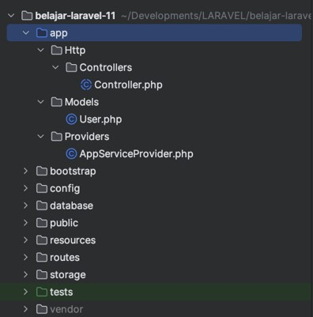
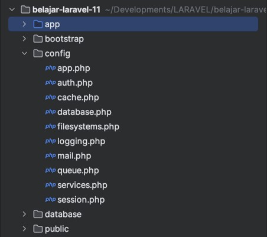

# Laravel 11

## Sebelum Belajar

- Kelas PHP dari Programmer Zaman Now
- Kelas MySQL dari Programmer Zaman Now
- Kelas Laravel dari Programmer Zaman Now

## #1 Membuat Project

- `composer create-project laravel/laravel=version belajar-laravel-11`
- <https://packagist.org/packages/laravel/laravel>

## #2 Struktur Folder Lebih Sederhana

- Struktur folder di Laravel 11 lebih sederhana dibanding Laravel 10
- Namun bukan berarti fitur Laravel 10 dihapus
- Beberapa file seperti Kernel, Middleware, dan lain-lain sekarang berada di dalam framework Laravel
- Sehingga aplikasi kita lebih bersih dari kode yang mungkin jarang kita gunakan



## #3 Config File Lebih Sederhana

- Di Laravel 11, file Config lebih sedikit
- Beberapa Config file dihapus, terutama yang jarang digunakan
- Namun bukan berarti hilang, tapi tetap ada di Framework Laravel nya



### Publish Config

- Jika kita butuh config file yang dihapus di Laravel 11, kita bisa gunakan perintah :
- `php artisan config:publish`
- Untuk menampilkan kembali config file tersebut

## #4 Service Provider Lebih Sederhana

- Di Laravel 10, banyak sekali Service Provider yang pertama kali dibuat di Project
- Di Laravel 11, semua Service Provider tersebut disimpan di dalam framework Laravel, sehingga di Project hanya tersedia `AppServiceProvider`
- Di Laravel 10, untuk membuat Service Provider, kita perlu registrasikan di `config/app.php`
- Di Laravel 11, untuk meregistrasikan Service Provider, kita cukup gunakan file `bootstrap/providers.php`

### Membuat Service Provider

- `php artisan make:provider FooBarServiceProvider`
- Secara otomatis akan ditambahkan ke file `bootstrap/providers.php`

## #5 Routing Lebih Sederhana

- Di Laravel 10, konfigurasi Routing dilakukan di `RouteServiceProvider`
- Di Laravel 11, konfigurasi Routing lebih sederhana, dilakukan menggunakan ApplicationBuilder di file `bootstrap/app.php`
- Secara default Routing hanya disediakan untuk Web dan Command, tidak disediakan untuk API

## #6 API Route Optional

- Di Laravel 10, secara default terdapat API Routing, di Laravel 11, hal itu menjadi Optional
- Jika kita ingin menambahkan API Routing, kita bisa gunakan perintah :
- `php artisan install:api`
- Maka akan ditambahkan Routing untuk API di `bootstrap/app.php`
- Dan juga akan ditambahkan file Routing di `routes/api.php`

## #7 Middleware Lebih Sederhana

- Sebelumnya, ada banyak sekali Middleware yang dibuat ketika membuat project di Laravel 10
- Di Laravel 11, semua Middleware tersebut akan disimpan di Framework Laravel
- Dan jika ingin mengelola Middleware, kita bisa gunakan class Middleware di file `bootstrap/app.php`

### Membuat Middleware

- `php artisan make:middleware LogMiddleware`

### Kode: Log Middleware

```php
class LogMiddleware
{
	public function handle(Request $request, Closure $next): Response
	{
		Log::info("Handling request: " . $request->fullUrl());
		return $next($request);
	}
}
```

### Kode: Menambahkan Middleware

```php
$this->withMiddleware(function (Middleware $middleware) {
	// global middleware
	$middleware->append(\App\Http\Middleware\LogMiddleware::class);

	// group middleware
	$middleware->appendToGroup('web', \App\Http\Middleware\LogMiddleware::class);
})->withExceptions(function (Exceptions $exceptions) {
	// ...
})
```

## #8 Health Check

- Laravel 11 memiliki fitur Health Check
- Fitur ini digunakan untuk memastikan apakah aplikasi kita sehat atau tidak
- Secara default, kita bisa mengakses URL `/up` pada aplikasi Laravel 11, atau bisa kita ubah pada file `bootstrap/app.php`

### Menambah Health Check

- Saat endpoint Health Check diakses, Laravel akan mengirim event `DiagnosingHealth`
- Kita bisa membuat `Event Listener` untuk DiagnosingHealth, lalu melakukan sesuatu, misal mengecek Redis, mengecek Database, dan lain-lain
- Jika error, kita bisa throw error pada Event Listener, dan secara otomatis Health Check akan gagal sehingga aplikasi dianggap tidak sehat

### Membuat Event Listener

- Untuk membuat Event Listener, kita bisa menggunakna perintah :
- `php artisan make:listener RedisCheckEventListener`

### Kode: Redis Check Event Listener

```php
class RedisCheckEventListener
{
	public function handle(DiagnosingHealth $event): void
	{
		$response = Redis::ping();
		if ($response == "PONG") {
			Log::info("Redis is up");
		} else {
			Log::error("Redis is down");
			throw new \Exception("Redis is down");
		}
	}
}
```

## #9 Perintah Artisan Baru

- Laravel 11 menyediakan perintah artisan baru untuk membuat beberapa hal di PHP, dan ini sangat membantu ketika membuat aplikasi
- `php artisan make:enum` : Untuk membuat PHP Enum
- `php artisan make:class` : Untuk membuat PHP Class
- `php artisan make:interface` : Untuk membuat PHP Interface
- `php artisan make:trait` : Untuk membuat PHP Trait

## #10 Integrasi dengan Pest Unit Test

- Saat ini, ada Test Framework yang sedang populer di PHP bernama Pest
- Ini adalah alternatif lain dari PHPUnit untuk melakukan Unit Test
- <https://pestphp.com/>

### Menginstall Pest

- Untuk menginstall Pest sebagai Test Framework di Laravel, kita bisa hapus dulu file PHPUnit di `phpunit.xml` dan file unit test yang menggunakan PHP Unit
- Selanjutnya kita bisa install Pest menggunakan perintah :
- `composer require pestphp/pest --dev --with-all-dependencies`
- Setelah itu, kita bisa setup seluruh file yang dibutuhkan oleh Laravel menggunakan perintah :
- `./vendor/bin/pest --init`
- Untuk menjalankan Unit Test, kita bisa gunakan perintah :
- `./vendor/bin/pest`

### Membuat Unit Test

- Jika kita sudah mengganti PHPUnit menjadi Pest
- Saat kita buat Unit Test baru menggunakan perintah :
- `php artisan make:test`
- Maka Laravel akan menggunakan Pest secara otomatis

## #11 Default Database Sqlite

- Saat pertama project Laravel 11 dibuat, secara default Laravel akan menggunakan database Sqlite
- Jika kita ingin menggantinya menjadi database MySQL misalnya, kita bisa ganti pada file `.env`

### Kode: Mengubah Database

```sh
DB_CONNECTION=mysql
DB_HOST=127.0.0.1
DB_PORT=3306
DB_DATABASE=belajar_laravel_11
DB_USERNAME=root
# DB_PASSWORD=
```

## #12 Exception Handler Lebih Sederhana

- Di Laravel 10, Exception Handler disimpan di `Exceptions/Handler.php`
- Di Laravel 11, semua digabung di `bootstrap/app.php`
- Dan cara menambahkan Exception Handler lebih mudah

### Membuat Exception dan Controller

- php artisan make:exception ValidationError

```php
Route::get('/validation', function () {
	throw new \App\Exceptions\ValidationError("invalid input");
})
```

### Kode: Konfigurasi Exception Handler

```php
$this->withExceptions(function (Exceptions $exceptions) {
	$exceptions->dontReport(\App\Exceptions\ValidationError::class);

	$exceptions->renderable(function (\App\Exceptions\ValidationError $exception, Request $request) {
		return response("Bad Request", 400);
	});
})->create();
```

## #13 Once Helper Method

- Laravel 11 menambah sebuah global method bernama `once(callbak)`
- `once()` method ini digunakan untuk mengingat hasil sebelumnya, sehingga ketika kita panggil lagi hasilnya, maka akan mengembalikan nilai sebelumnya, tanpa mengulang mengeksekusi callback function nya
- Ini cocok untuk membungkus kode yang sangat berat sehingga tidak perlu dipanggil berkali-kali jika memang hasilnya akan selalu sama

### Kode: Math Helper Class

```php
class MathHelper
{
	static function add(int $a, int b): int
	{
		return once(function () user ($a, $b) {
			Log::inf("Adding $a and $b");
			return $a + $b;
		});
	}
}
```

### Kode: Test Math Helper

```php
test('example', function () {
	$result1 = \App\Helpers\MathHelper::add(10, 10);
	$result2 = \App\Helpers\MathHelper::add(10, 10);

	expect($result1)->toBe($result2);
})l
```

## #14 Model Casts

- Attribute Casting adalah fitur di Eloquent untuk melakukan konversi tipe data secara otomatis dari tipe data di database, dengan tipe data yang ada di PHP
- Di Laravel 10, defaultnya akan menggunakan attribute `$casts` di Model
- Namun di Laravel 11, diubah menjadi Function casts

### Kode: User Model

```php
class User extends Authenticate
{
	use HasFactory, Notifiable;

	protected function casts(): array
	{
		return [
			'email_verified_at' => 'datetime',
			'password' => 'hashed',
		];
	}
}
```

## #15 Upgrade dari Laravel 10

- Mari kita coba upgrade RESTful API project sebelumnya dari Laravel 10 ke Laravel 11
- <https://github.com/programmerzamannow/belajar-laravel-restful-api>
- <https://laravel.com/docs/11.x/upgrade>

## #16 Penutup
