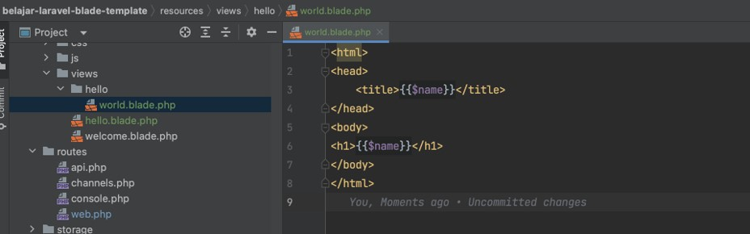

# Laravel Blade Template

## Sebelum Belajar

- Laravel Dasar

## Agenda

- Pengenalan Blade Template
- Menampilkan View
- If Statement
- For Loop
- While Loop
- Include
- Template Inheritance
- Dan lain-lain

## #1 Pengenalan Blade Template

- Blade adalah library yang terdapat di Laravel sebagai templating engine
- Tidak seperti template engine lainnya, Blade tidak melarang kita untuk menggunakan kode PHP di file template, walaupun ini sebenarnya tidak disarankan
- Semua file template di Blade sebenarnya akan di compile menjadi kode PHP
- Blade menggunakan file `.blade.php` sebagai nama file template nya
- Dan biasanya disimpan di folder `resources/views`

## #2 Membuat Project

- `composer create-project laravel/laravel=version belajar-laravel-blade-template`
- <https://packagist.org/packages/laravel/laravel>


## #3 Menampilkan View

### Blade

- Membuat response dari Route itu sangat mudah, tapi jika misal kita ingin membuat response yang kompleks seperti HTML, maka akan sulit jika kita lakukan di Route
- Blade adalah fitur di Laravel yang digunakan untuk mempermudah dalam pembuatan tampilan halaman web HTML
- Dengan Blade template, kita bisa membedakan lokasi logic aplikasi, dengan kode tampilan
- Semua template disimpan di folder `resources/views`

### Blade Variable

- Salah satu keuntungan menggunakan template dibanding kode PHP langsung adalah, kita bisa memaksa programmer untuk memisahkan logic kode program dengan tampilan (di template)
- Di Blade, walaupun kita bisa membuat kode PHP, tapi tidak disarankan menggunakan itu
- Cara yang direkomendasikan adalah, kita hanya membuat variable di template blade, lalu mengirim variable tersebut dari luar ketika akan menampilkan template nya
- Untuk membuat menampilkan variable di blade template, kita bisa gunakan `{{ $nama }}`, dinama nanti variable $nama bisa diambil secara otomatis dari data yang kita kirim ketika menampilkan view blade nya

### Kode: Hello View

```php
// resources/views/hello.blade.php
<html>
	<head>
		<title>{{$name}}</title>
	</head>
	<body>
		<h1>{{$name}}</h1>
	</body>
</html>
```

### Rendering View

- Setelah kita membuat View, selanjutnya untuk me-render (menampilkan) View tersebut di dalam Router, kita bisa menggunakan function `Route::view(uri, template, array)` atau menggunakan view(template, array) di dalam closure function Route / Controller
- Dimana template adalah nama template, tanpa menggunakan blade.php, dan array berisikan data variable yang ingin kita gunakan

### Kode: Rendering View

```php
Route::get('/hello', function() {
	return view('hello', ['name' => 'Laravel']);
});
```

### Kode: Test Rendering View

```php
class HelloTest extends TestCase
{
	public function testHello()
	{
		$this->get('/hello')
			->assertSeeText('Laravel');
	}
}
```

### Nested View Directory

- View juga bisa disimpan di dalam directory lagi di dalam directory views
- Hal ini baik ketika kita sudah banyak membuat views, dan ingin melakukan management file views
- Namun ketika kita ingin mengambil views nya, kita perlu ganti menjadi titik, tidak menggunakan / (slash)
- Misal jika kita buat views di folder `admin/profile.blade.php`, maka untuk mengaksesnya kita gunakan `admin.profile`

### Kode: View

```php
// resources/views/hello/world.blade.php
<html>
	<head>
		<title>{{$name}}</title>
	</head>
	<body>
		<h1>{{$name}}</h1>
	</body>
</html>
```



### Kode: Route View

```php
Route::get('/world', function () {
	return view('hello.world', ['name' => 'Laravel']);
});
```

### Kode: Test Route View

```php
public function testWorld()
{
	$this->get('/world')
		->assertSeeText('Laravel');
}
```

### Test View Tanpa Routing

- Kadang kita juga ingin membuat View tanpa routing, misal untuk mengirim email misalnya
- Pada kasus ini, kita bisa melakukan test view secara langsung, tanpa harus membuat Route terlebih dahulu

### Kode: Test View Tanpa Routing

```php
public function testViewWithoutRouting()
{
	$this->view('hello', ['name' => 'Laravel'])
		->assertSeeText('Laravel');
}
```

## #4 Comment

- Blade Template juga mendukung komentar, dengan menggunakan `{{-- isi komentar --}}`
- Isi komentar secara otomatis tidak akan dieksekusi, dan tidak akan ditampilkan juga di hasil HTML nya

### Kode Comment

```php
<html>
<head>
	<title>Comment</title>
</head>
<body>
	{{-- Eko Kurniawan Khannedy --}}
</body>
</html>
```

### Kode: Unit Test Comment

```php
public function testComment()
{
	$this->view('comment',  [])
		->assertSeeText("Comment")
		->assertDontSeeText("Eko")
}
```

## #5 HTML Encoding

- Secara default, saat kita menampilkan data di Blade Template menggunakan `{{}}`, secara otomatis Blade akan memanggil function `htmlspecialchars(data)` untuk memastikan data aman dari tag HTML yang bisa menyebabkan XSS Attack (Cross Site Scripting)
- Namun jika kita ingin menampilkan tanpa di escape, maka kita bisa menggunakan `{!! $variable !!}`
- Namun harap hati-hati, karena jika tidak hati-hati, kita bisa terkena serangan XSS

### Kode: HTML Encoding

```php
<html>
<head>
	<title>HTML Encoding</title>
</head>
<body>
	{{!! $name !!}}
</body>
</html>
```

### Kode: Routing

```php
Route::get('/html-encoding', function (\Illuminate\Request $request) {
	return view('html-encoding', ['name' => $request->input('name')]);
});
```

### Hasil HTML Encoding


## #6 Disabled Blade

- Blade menggunakan tanda kurung kurawal untuk menampilkan variable
- Saat kita membuat web, kadang kita ingin menampilkan tulisan seperti perintah-perintah yang ada di Blade
- Hal ini akan menimbulkan perintah-perintah tersebut akan dieksekusi oleh Blade

### Tabda @

- Pada bagian yang kita ingin Blade Template tidak dieksekusi, kita bisa menambahkan `@` diawal perintah Blade Template nya
- Misalnya `@{{ $eko }}`, maka akan ditampilkan apa adanya tanpa `@`
- Misalnya `@@if`, maka hasilnya akan ditampilkan apa adanya tanpa `@` pertama
- Namun jika misal terdapat banyak baris yang kita harapkan tidak menggunakan Blade - Template, kita bisa menggunakan perintah @verbatim dan diakhiri dengan `@endverbatim`

### Kode: Disabled Blade

```php
<html>
<head>
	<title>Hello @{{ $name }}</title>
</head>
<body>
	<p>
		Hello {{ $name }}
	</p>
</body>
</html>
```

### Kode: Test Disabled Blade

```php
public function testDisabledBlade()
{
	$this->view('disabled', ['name' => 'Eko'])
		->assertDontSeeText('Eko')
		->assertSeeText('Hello {{ $name }}');
}
```

## #7 If Statement

- Blade Template mendukung percabangan if menggunakan perintah/directive `@if`, `@elseif`, `@else` dan `@endif`
- Perintah ini hampir mirip dengan kode PHP

### Kode: If Statement

```php
<html>
<head>
	<title>If Statement</title>
</head>
<body>
	<p>
		@if (count($hobbies) == 1)
			I have one hobby!
		@elseif (count($hobbies) > 1)
			I have multiple hobbies!
		@else
			I don't have any hobbies!
		@endif
	</p>
</body>
</html>
```

### Kode: Test If Statement

```php
public function testIfStatement()
{
	$this->view('if', ['hobbies' => []])
		->assertSeeText("I don't have any hobbies!", false);

		$this->view('if', ['hobbies' => ['Coding']])
		->assertSeeText("I have one hobby!");

		$this->view('if', ['hobbies' => ['Coding', 'Gaming']])
		->assertSeeText("I have multiple hobbies!");
}
```

## #8 Unless Statement

- Blade Template mendukung directive @unless dan @endunless
- Directive ini digunakan kebalikan dari if statement, dimana jika nilainya false, maka isi body akan eksekusi

### Kode: Unless

```php
<html>
<body>
@unless ($isAdmin)
	You are note admin.
@endunless
</body>
</html>
```

### Kode: Test Unless

```php
public function testUnless()
{
	$this->viwe('unless', ['isAdmin', true])
		->assertDontSeeText('You are not admin.');

	$this->viwe('unless', ['isAdmin', false])
		->assertSeeText('You are not admin.');
}
```

## #9 Isset dan Empty

- Blade template juga memiliki directive `@isset` dan `@empty`
- `@isset` digunakan untuk mengecek apakah sebuah variable ada dan tidak bernilai null
- `@empty` digunakan untuk mengecek apakah sebuah variable merupakan array kosong

### Kode: Isset dan Empty

```php
<html>
<body>
	<p>
		@isset($name)
			Hello, My name is {{$name}}
		@endisset
	</p>

	<p>
		@empty($admin)
			I don't have hobbies.
		@endempty
	</p>
</body>
</html>
```

### Kode: Test Isset dan Empty

```php
public function testissetAndEmpty()
{
	$this->view('issetempty', [])
		->assertDontSeeText('Hello');

	$this->view('issetempty', ['name' => 'Eko'])
		->assertSeeText("Hello, My name is Eko", false)
		->assertSeeText("I don't have hobbies.", false);

	$this->view('issetempty', ['name' => 'Eko', 'hobbies' => ['Coding']])
		->assertSeeText("Hello, My name is Eko", false);
		->assertDontSeeText("I don't have hobbies.", false);
}
```

## #10 Env

- Laravel mendukung multi environment, kita bisa menggunakan Facade Env untuk mendapatkan environment yang digunakan saat ini
- Dalam Blade Template, kita bisa menggunakan directive `@env(name)` atau `@env([name1, name2])` untuk mengecek apakah sedang menggunakan environment tersebut atau tidak

### Kode: Env

```php
<html>
<body>
	@env('testing')
		This is test environment
	@endenv
</body>
</html>
```

### Kode: Unit Test Env

```php
public function testEnv()
{
	$this->view('env', [])
		->assertSeeText("This is test environment");
}
```

## #11 Switch Statement

- Selain menggunakan `@if`, percabangan di Blade Template juga bisa menggunakan directive `@switch`
- Seperti di kode PHP, dalam Blade Template, kita perlu kombinasikan dengan `@case` dan juga `@break` dan `@default`

### Kode: Switch

```php
<html>
<body>
	@switch($value)
		@case('A')
			Memuaskan
			@break
		@case('B')
			Bagus
			@break
		@case('C')
			Cukup
			@break
		@default
			Tidak Lulus
	@endswitch
</body>
</html>
```

### Kode: Test Switch

```php
public function testSwitch()
{
	$this->view('switch', ['value' => 'A'])
		->assertSeeText('Memuaskan');

	$this->view('switch', ['value' => 'B'])
		->assertSeeText('Bagus');

	$this->view('switch', ['value' => 'C'])
		->assertSeeText('Cukup');

	$this->view('switch', ['value' => 'D'])
		->assertSeeText('Tidak Lulus');

}
```

## #12 For Loop

- Blade juga mendukung perintah untuk melakukan perulangan for
- For loop mirip seperti di PHP, kita bisa menggunakan increment

### Kode: For Loop

```php
<html>
<body>
	<ul>
		@for($i = 0; $i < $limit; $i++)
			<li>{{ $i }}</li>
		@endfor
	</ul>
</body>
</html>
```

### Kode: Test For Loop

```php
public function testFor()
{
	$this->view('for', ['limit' => 10])
		->assertSeeText('0')
		->assertSeeText('5')
		->assertSeeText('9')
}
```

### Foreach Loop

- Kadang ada kalanya kita ingin melakukan iterasi terhadap semua data yang terdapat di array
- Di Blade Template, kita bisa lebih mudah menggunakan directive `@foreach` dibandingkan menggunakan `@for`

### Kode: Foreach Loop

```php
<html>
<body>
	<ul>
		@foreach($hobbies as $hobby)
			<li>{{ $hobby }}</li>
		@endforeach
	</ul>
</body>
</html>
```

### Kode: Test Foreach Loop

```php
public function testForeach()
{
	$this->view('foreach', ['hobbies' => ['Coding', 'Gaming']])
		->assertSeeText('Coding')
		->assertSeeText('Coding');
}
```

### Forelse Loop

- Apa yang terjadi ketika misal kita melakukan iterasi menggunakan `@foreach`, namun ternyata datanya tidak ada?
- Secara otomatis tidak akan menampilkan data apapun
- Kadang kita ingin menampilkan sesuatu ketika tidak ada datanya
- Pada kasus ini, kita bisa menggunakan `@forelse`, dimana kita bisa menambahkan directive `@empty` ketika data array tidak ada isinya

### Kode: Forelse Loop

```php
<html>
<body>
	<ul>
		@forelse($hobbies as $hobby)
			<li>{{ $hobby }}</li>
		@empty
			<li>Tidak Punya Hobby</li>
		@endforelse
	</ul>
</body>
</html>
```

### Kode: Test Forelse Loop

```php
public function testForelse()
{
	$this->view('forelse', ['hobbies' => []])
		->assertSeeText('Tidak Punya Hobby');

	$this->view('forelse', ['hobbies' => ['Coding', 'Gaming']])
		->assertSeeText('Coding')
		->assertSeeText('Gaming');
}
```

## #13 Raw PHP

- Kadang ada kasus kita ingin menggunakan kode PHP langsung di Blade Template
- Walaupun ini tidak direkomendasikan, tapi bisa kita lakukan
- Kita bisa gunakan directive `@php` untuk memasukkan kode php

### Kode: Raw PHP

```php
<html>
<body>
	@php
		class Person {
			public string $name;
			public string $address;
		}

		$person = new Person();
		$person->name = "Eko";
		$person->address = "Indonesia";
	@endphp

	<p>{{$person->name}}</p>
	<p>{{$person->address}}</p>
</body>
</html>
```

### Kode: Test Raw PHP

```php
public function testRawPHP()
{
	$this->view('php', [])
		->assertSeeText('Eko')
		->assertSeeText('Indonesia');
}
```

## #14 While Loop

- Selain perulangan for, di Blade Template juga mendukung perulangan `@while`
- Dengan perulangan `@while`, kita bisa melakukan perulangan selama kondisi `@while` bernilai true

### Kode: While Loop

```php
<html>
<body>
	@while($i < 10)
		The current value is {{ $i }}
		@php
			$i++;
		@endphp
	@endwhile
</body>
</html>
```

### Kode: Test While Loop

```php
public function testWhile()
{
	$this->view('while', ['i' => 0])
		->assertSeeText('The current value is 0')
		->assertSeeText('The current value is 5')
		->assertSeeText('The current value is 9');
}
```

## #15 Loop Variable

- Saat kita menggunakan perulangan `@foreach`, terdapat variable `$loop` yang tersedia di dalam perulangannya
- Variable `$loop` berisikan informasi yang bermanfaat seperti index iterasi, apakah ini iterasi pertama atau terakhir, dan lain-lain

### Loop Property

| Property           | Description                                            |
| ------------------ | ------------------------------------------------------ |
| `$loop->index`     | This index of the current loop iteration (starts at 0) |
| `$loop->iteration` | This current loop iteration (starts at 1)              |
| `$loop->remaining` | This iterations remaining in the loop                  |
| `$loop->count`     | This total number of items in the array being iterated |
| `$loop->first`     | Whether this is the first iteration through the loop   |
| `$loop->last`      | Whether this is the last iteration through the loop    |
| `$loop->even`      | Whether this is on even iteration through the loop     |
| `$loop->odd`       | Whether this is on odd iteration through the loop      |
| `$loop->depth`     | The nesting level of the current loop                  |
| `$loop->parent`    | When in a nested loop, the parent's loop variable      |

### Kode: Loop Variable

```php
<html>
<body>
	<ul>
		@foreach($hobbies as $hobby)
			<li>{{ $loop->iteration }}. {{ $hobby }}</li>
		@endforeach
	</ul>
</body>
</html>
```

### Kode: Test Loop Variable

```php
public function testLoopVariable()
{
	$this->view('loopvariable', ['hobbies' => ['Coding', 'Gaming']])
		->assertSeeText('1. Coding ')
		->assertSeeText('1. Gaming ');
}
```

## #16 CSS Class

- Saat membuat web, kadang kita ingin mengubah-ubah CSS class berdasarkan response backend
- Blade Template menyediakan `@class` directive untuk mempermudah kita melakukannya

### Kode: CSS Class

```php
<html>
<head>
	<style>
		.red {
			color: red;
		}

		.bold {
			font-weight: bold;
		}
	</style>
<head>
<body>
	@foreach($hobbies as $hobby)
		<li @class(['red', 'bold' => $hobby['love']])>{{$hobby['name']}}</li>
	@endforeach
</body>
</html>
```

### Kode: Test CSS Class

```php
public function testClass()
{
	$this->view('class', ['hobbies' => [
		[
			'name' => 'Coding',
			'love' => true,
		],
		[
			'name' => 'Gaming',
			'love' => false,
		]
	]])
		->assertSeeText('<li class="red bold">Coding</li>', false)
		->assertSeeText('<li class="red">Gaming</li>', false);
}
```

## #17 Include

- Saat kita membuat halaman web, kadang ada beberapa bagian yang sama di beberapa halaman web
- Pada kasus ini, ada baiknya kita membuat kode web tersebut di file template yang berbeda
- Selanjutnya kita bisa menggunakan directive `@include` untuk mengambil file template tersebut

### Kode: Header Template

```php
@isset($title)
	<h1>{{$title}}</h1>
@else
	<h1>Programmer Zaman Now</h1>
@endisset
```

### Kode: Include

```php
<html>
<body>
	@include('header')
	<p>Selamat Datang di Web</p>
</body>
</html>
```

### Kode: Test Include

```php
public function testLayout()
{
	$this->view('include', [])
		->assertSeeText('Programmer Zaman Now')
		->assertSeeText('Selamat Datang di Web');


	$this->view('include', ['title' =< 'Eko'])
		->assertSeeText('Eko')
		->assertSeeText('Selamat Datang di Web');
}
```

### Include Parameter

- Secara default, semua data yang dikirim ke template utama akan dikirim ke template yang kita `@include`
- Namun, jika kita ingin menambah parameter tambahan, kita juga bisa menambahnya ketika menggunakan directive `@include(template, data)`

### Kode: Header Template

```php
@isset($title)
	<h1>{{$title}}</h1>
@else
	<h1>Programmer Zaman Now</h1>
@endisset

@isset($description)
	<p>{{$description}}</p>
@endisset
```

### Kode: Include

```php
<html>
<body>
	@include('header', ['description' => 'Selamat Data di Website Kami'])
	<p>Selamat Datang di Web</p>
</body>
</html>
```

### Kode: Test Include

```php
public function testLayout()
{
	$this->view('include', [])
		->assertSeeText('Programmer Zaman Now')
		->assertSeeText('Selamat Datang di Website Kami');
		->assertSeeText('Selamat Datang di Web');


	$this->view('include', ['title' =< 'Eko'])
		->assertSeeText('Eko')
		->assertSeeText('Selamat Datang di Website Kami');
		->assertSeeText('Selamat Datang di Web');
}
```

## #18 Include Condition

- Kadang terdapat kondisi kita ingin melakukan `@include` pada kondisi tertentu
- Maka biasanya kita akan menggunakan directive `@if` untuk melakukan pengecekan kondisi tersebut
- Blade Template memiliki directive lain untuk mempermudah kita ketika membutuhkan kondisi tertentu untuk melakukan `@include`

### Include Condition Directive

| Directive                                 | Keterangan                             |
| ----------------------------------------- | -------------------------------------- |
| `@includeWhen(kondisi, template, data)`   | Include dilakukan ketika kondisi true  |
| `@includeUnless(kondisi, template, data)` | Include dilakukan ketika kondisi false |

### Kode: Layout

```php
<h1>Selamat Datang Owner</h1>
<p>Untuk melihat laporan penjualan, silahkan buka menu laporan</p>
```

### Kode: Include Condition

```php
<html>
<body>
	@includeWhen($user['error'], 'header-admin')
	<p>Selamat Datang {{ $user['name'] </p>
</body>
</html>
```

### Kode: Test Include Condition

```php
public function testIncludeCondition()
{
	$this->view('include-condition', ['user' => [
		'name' => 'Eko',
		'owner' => true,
	]])
		->assertSeeText('Selamat Datang Owner')
		->assertSeeText('Selamat Datang Eko');

	$this->view('include-condition', ['user' => [
		'name' => 'Eko',
		'owner' => false,
	]])
		->assertDontSeeText('Selamat Datang Owner')
		->assertSeeText('Selamat Datang Eko');
}
```

## #19 Each dan Once

- Pada kasus tertentu, kadang kita ingin menampilkan layout sesuai dengan jumlah data
- Lalu misal kita perlu menambahkan sebuah kode yang cukup sekali saja ditampilkan, walaupun layout ditampilkan lebih dari sekali, misal kode CSS atau JavaScript
- Kita bisa menggunakan directive `@each` dan `@once`

### Each dan Once Directive

| Directive                          | Keterangan                                                                                                                     |
| ---------------------------------- | ------------------------------------------------------------------------------------------------------------------------------ |
| `@each(template, array, variable)` | Include template berkali-kali sesuai iterasi jumla array, dimana data tiap array bisa diakses dengan variable di template nya  |
| `@once`                            | Disimpan di layout, secara otomatis jika layout tersebut ditampilkan berkali-kali bagian `@once` hanya ditampilkan sekali saja |

### Kode: Layout

```php
@once
`<style>
	.red {
		color: red;
	}
`</style>
@endonce

<h1>{{$user['name']}}</h1>
<ul>
	@foreach($user['name'] as $hobby)
		<li class="red">{{$hobby}}</li>
	@endforeach
</ul>
```

### Kode: Each

```php
<html>
<body>
@each('user', $users, 'user');
</body>
</html>
```

### Kode: Test Each

```php
public function testEach()
{
	$this->view('each', ['users' => [
		[
			'name' => 'Eko',
			'hobbies' => ['Coding', 'Gaming'],
		],
		[
			'name' => 'Kurniawan',
			'hobbies' => ['Coding', 'Gaming'],
		]
	]])
		->assertSeeInOrder(['.red', 'Eko', 'Coding', 'Gaming', 'Kurniawan', 'Coding', 'Gaming']);
}
```

## #20 Form

### Form Directive

- Blade Template memiliki beberapa directive untuk membantu kita mempermudah ketika kita membuat form
- Ada `@checked(kondisi)` `@selected(kondisi)` `@disabled(kondisi)` `@readonly(kondisi)` dan `@required(kondisi)`
- Kondisi pada form directive merupakan boolean, jika true, maka secara otomatis directive tersebut akan dijalankan
- Penggunaan form directive ini lebih mudah dibanding kita menggunakan directive `@if` secara manual

### Detail Form Directive

| Directive   | Jika kondisi true                                   |
| ----------- | --------------------------------------------------- |
| `@checked`  | Maka input checkbox akan memiliki attribute checked |
| `@selected` | Maka input option akan memiliki attribute selected  |
| `@disabled` | Maka input akan memiliki attribute disabled         |
| `@readonly` | Maka input akan memiliki attribute readonly         |
| `@required` | Maka input akan memiliki attributed required        |

### Kode: Form Directive

```php
<html>
<body>
	<form>
		<input type="checkbox" @checked($user['premium']) value="Permium" /> <br/>
		<input type="text" value="{{$user['name']}}" @readonly(!$user['admin']) /> <br/>
	</form>
</body>
</html>
```

### Kode: Test Form Directive

```php
public function testForm()
{
	$this->view('form', ['user' => [
		'premium' => true,
		'name' => 'Eko',
		'admin' => true,
	]])
		->assertSee("checked")
		->assertSee("Eko")
		->assertDontSee("readonly");
}
```

## #21 CSRF

- Materi CSRF (Cross Site Request Forgery) sudah kita bahas di kelas Laravel Dasar
- Secara default, saat kita mengirim HTTP Post ke aplikasi Laravel kita, Laravel akan mengecek token CSRF, untuk memastikan bahwa request tersebut benar berasal dari web kita
- Pengecekan ini dilakukan oleh `VerifyCsrfToken` Middleware
- Blade Template memiliki directive `@csrf` yang bisa digunakan untuk mempermudah kita ketika ingin menambahkan token CSRF di form kita

### Kode: CSRF

```php
<html>
<body>
	<form action="/test" method="post">
		@csrf
		<input type="text" name="name" />
		<input type="submit" name="$end" />
	</form>
</body>
</html>
```

### Kode: Test CSRF

```php
public function testCSRF()
{
	$this->view('csrf', [])
		->assertSee('_token');
}
```

## #22 Error

- Laravel memiliki fitur yang bernama Validation, dimana kita bisa dengan mudah melakukan validasi
- Laravel Validation akan dibahas di materi tersendiri
- Ketika terjadi validation error, kita bisa menangkap error dengan directive `@error(field)` dan menangkap message nya dengan variable $message di dalam directive `@error` nya

### Kode: Error

```php
<html>
<body>
	@error('name')
		<p>{{$message}}</p>
	@enderror

	@error('password')
		<p>{{$message}}</p>
	@enderror
</body>
</html>
```

### Kode: Test Error

```php
public function testValidationErrors()
{
	$errors = [
		'name' => 'Name is required',
		'password' => 'Password is required',
	];

	$this->withViewErrors($errors)
		->view('error', [])
		->assertSeeText("Name is required")
		->assertSeeText("Password is required");
}
```

## #23 Stack

- Blade memiliki kemampuan mirip struktur data Stack / Tumpukan
- Dimana kita bisa mengirim data ke stack tersebut menggunakan directive `@push(nama)` atau `@pushIf(kondisi, nama)`
- Ketika kita ingin menampilkan semua data yang terdapat di Stack, kita bisa gunakan directive `@stack(nama)`
- Secara default `@push()` akan mengirim data ke posisi paling belakang, jika kita ingin mengirim data ke urutan paling awal, kita bisa gunakan directive `@prepend(name)`

### Kode: Stack

```php
<html>
<body>
	@push('script')
		<script src="first.js" />
	@endpush
	@push('script')
		<script src="second.js" />
	@endpush
	@prepend('script')
		<script src="third.js" />
	@endprepend

	@stack('script')
</body>
</html>
```

### Kode: Test Stack

```php
public function testStack()
{
	$this->view('stack', [])
	->assertSeeInOrder(['third.js', 'first.js', 'second.js']);
}
```

## #24 Template Inheritance

- Sebelumnya, kita menggunakan `@include` untuk menggunakan template lain
- Blade mendukung Template Inheritance, caranya terbalik dengan `@include`
- Dalam `@include`, parent akan melakukan include ke template child nya
- Dalam Template Inheritance, child yang akan melakukan extends ke parent template, dan child yang akan menentukan isi dari parent nya

### Parent Layout

- Di parent layout, kita bisa menggunakan `@yield(name, default)` untuk lokasi template yang harus dibuat nanti di child layout

### Kode: Parent Layout

```php
<html>
<head>
	<title>Nama Aplikasi - @yield('title')</title>
</head>
<body>
	@yield('header')
	@yield('content')
</body>
</html>
```

### Child Layout

- Untuk membuat child layout, kita bisa menggunakan directive `@extends(parentlayout)`
- Di dalam child layout, kita bisa membuat `@section(name)` yang nanti akan dieksekusi di posisi `@yield(name)` di parent nya

### Kode: Child Layout

```php
@extends('parent')

@section('title', 'Halaman Utama')

@section('header')
	<p>Deskripsi Header</p>
@endsection

@section('content')
	<p>Ini adalah halaman utama</p>
@endsection
```

### Kode: Test Template Inheritance

```php
public function testParent()
{
	$this->view('child', [])
		->assertSeeText('Nama Aplikasi - Halaman Utama')
		->assertSeeText('Deskripsi Header')
		->assertSeeText('Ini adalah halaman utama');
}
```

### Show Directive

- Pada beberapa kasus, kadang kita ingin membuat default `@section(name)` di parent layout, namun tetap bisa di override di child layout
- Kita bisa menggunakan `@section(name)` di parent layout, namun ditutup dengan `@show`, bukan `@endsection`
- Jika di child layout kita membuat `@section(name)`, secara otomatis `@section(name)` di parent akan di override, namun jika kita tetap ingin memanggil `@section(name)` di parent, kita bisa gunakan directive `@parent` di child layout nya

### Kode: Parent Layout

```php
<html>
<head>
	<title>Nama Aplikasi - @yield('title')</title>
</head>
<body>
	@section('header')
		<h1>Default Header</h1>
	@show
	@section('content')
		<p>Default Content</p>
	@show
</body>
</html>
```

### Kode: Child Layout

```php
@extends('parent')

@section('title', 'Halaman Utama')

@section('header')
	@parent
	<p>Deskripsi Header</p>
@endsection

@section('content')
	<p>Ini adalah halaman utama</p>
@endsection
```

### Kode: Test Template Inheritance

```php
public function testParent()
{
	$this->view('child', [])
		->assertSeeText('Nama Aplikasi - Halaman Utama')
		->assertSeeText('Default Header')
		->assertSeeText('Deskripsi Header')
		->assertSeeText('Ini adalah halaman utama')
		->assertDontSeeText('Default Content');
}
```

## #25 Service Injection

- Blade Template juga mendukung directive `@inject(variable, service)` untuk mengambil object dari Service Container
  Secara otomatis data object akan di inject ke variable yang disebutkan di directive `@inject`

### Kode: Membuat Service

```php
namespace App\Services;

class SayHello
{
	function sayHello(string $name): string
	{
		return "Hello ${name}";
	}
}
```

### Kode: Registrasi ke AppServiceProvider

```php
class AppServiceProvider extends ServiceProvider
{
	/**
	 * Register any application services.
	 *
	 * @return void
	 * */
	public function register()
	{
		$this->app->singleton(SayHello::class, function () {
			return new SayHello();
		});
	}
}
```

### Kode: Service Injection

```php
<html>
<body>
	@inject('service', 'App\Services\SayHello')
	<h1>{{$service->sayHello($name)}}</h1>
</body>
</html>
```

### Kode: Test Service Injection

```php
public function testServiceInjection()
{
	$this->view('service-injection', ['name' => 'Eko'])
		->assertSeeText("Hello Eko");
}
```

## #26 Inline Blade Template

### Blade Facade

- Blade juga memiliki Facade yang bisa kita gunakan untuk menggunakan Blade Template
- Ini akan mempermudah kita ketika kita ingin mengakses Blade Template dari Class seperti contohnya dari Controller
- Ada banyak sekali fitur yang terdapat di Blade Facade yang bisa kita gunakan
- <https://laravel.com/api/9.x/Illuminate/Support/Facades/Blade.html>

### Inline Blade Template

- Salah satu fitur yang bisa kita gunakan dengan Blade Facade adalah, Inline Template
- Inline Template adalah kemampuan dimana kita bisa me-render template tanpa harus membuat file template, cukup menggunakan string saja
- Kita bisa menggunakan method `Blade::render(template, data)`

### Kode: Test Inline Blade Template

```php
public function testInlineBladeTemplate()
{
	$response = Blade::render('hello {{$name}}', ['name' => 'Eko']);
	self::assertEquals('Hello Eko', $response);
}
```

## #27 Extending Blade

- Blade Facade juga bisa kita gunakan untuk menambahkan custom directive
- Sehingga kita bisa membuat directive sendiri, dan bisa digunakan di Blade Template menggunakan method `Blade::directive(nama, function)`
- Agar aman, kita perlu meregistrasi directive di Service Provider

### Kode: Extending Blade

```php
public function boot()
{
	Blade::directive('hello', function ($expression) {
		return "<?php echo 'Hello ' . $expression; ?>";
	});
}
```

### Kode: Layout Extending Blade

```php
<html>
<body>
@hello($name)
</body>
</html>
```

### Kode: Test Extending Blade

```php
public function testExtendingBlade()
{
	$this->view('extending', ['name' => 'Eko'])
		->assertSeeText('Hello Eko');
}
```

## #28 Custom Echo Handler

- Saat kita menggunakan `{{ $variable }}`, secara otomatis Blade Template akan mengkonversi menjadi `echo ($variable)-->__toString()`
- Pada kasus tertentu, mungkin kita ingin mengubah nya, misal ketika datanya berubah class tertentu, kita ingin mengubah hasil String nya
- Kita bisa menggunakan Facade Blade untuk mengubahnya, dengan cara menggunakan method `Blade::stringable(class, function)`

### Kode: Class Model

```php
namespace App\Models;

class Person
{
	public string $name;
	public string $address;
}
```

### Kode: Custom Echo Handler

```php
public function boot()
{
	Blade::stringable(Person::class, function (Person $person) {
		return "$person->name : $person->address";
	});
}
```

### Kode: Layout

```php
<html>
<body>
	{{$person}}
</body>
</html>
```

### Kode: Test Custom Echo Handler

```php
public function testEcho()
{
	$person = new Person();
	$person->name = "Eko";
	$person->address = "Indonesia";

	$this->view('echo', ['person' => $person])
		->assertSeeText('Eko : Indonesia');
}
```

## #29 Optimize Template

- Secara default, Blade Template di compile menjadi kode PHP ketika ketika ada request, Laravel akan mengecek apakah hasil compile Blade Template ada atau tidak, jika ada maka akan menggunakannya, jika tidak ada maka akan coba melakukan compile.
- Termasuk Laravel juga akan mendeteksi ketika ada perubahan Blade Template.
- Kompilasi ketika request masuk akan ada efek buruknya, yaitu performanya jadi lambat karena harus melakukan kompilasi. Oleh karena itu ketika nanti menjalankan aplikasi Laravel di production, ada baiknya melakukan proses kompilasi seluruh blade template terlebih dahulu, agar tidak perlu melakukan kompilasi lagi ketika request masuk

### Compiling Template

- Untuk melakukan compile view atau blade template, kita bisa gunakan perintah :
- `php artisan view:cache`
- Semua hasil compile view akan disimpan di folder `storage/framework/views`
- Jika kita ingin menghapus seluruh hasil compile, kita bisa gunakan perintah
- `php artisan view:clear`

## #30 Materi Selanjutnya

- Laravel Component
- Laravel Database / Eloquent
- Laravel Validation
- Laravel Command
- Laravel HTTP Client
- Dan lain-lain
