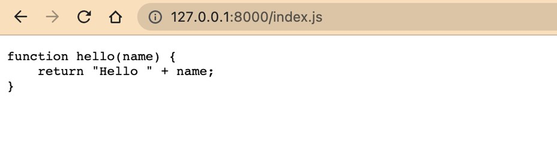

# Laravel Dasar

## Sebelum Belajar

- Sudah Mengikuti kelas HTTP
- Sudah Mengikuti Kelas PHP dari Programmer Zaman Now
- Sudah Mengikuti Kelas Git dari Programmer Zaman Now

## Agenda

- Pengenalan Laravel
- Membuat Project
- Dependency Injection
- Facades
- Route
- Controller
- Middleware
- Templating
- Dan lain-lain

## #1 Pengenalan Laravel

- Laravel adalah framework di PHP untuk membuat Web atau API
- Laravel pertama kali dibuat oleh Taylor Otwell tahun 2011
- Laravel adalah framework yang open source dan gratis, sehingga kita bisa menggunakannya tanpa biaya dan juga bisa berkontribusi ke projectnya
- <https://laravel.com/>
- <https://github.com/laravel/laravel>

### Kenapa Laravel?

- Saat ini Laravel adalah framework paling populer di PHP
- Banyak perusahaan yang sudah menggunakan Laravel sebagai framework pilihan ketika menggunakan PHP
- Laravel juga memiliki ekosistem yang sangat besar, terutama dari ekosistem teknologi pendukung, sehingga ketika menggunakan Laravel, kita bisa mengintegrasikan dengan teknologi pendukung nya dengan lebih mudah

### Model View Controller

- Laravel sendiri membawa konsep MVC (Model View Controller)
- Sehingga jika kita sudah terbiasa dengan konsep tersebut, kita akan dengan mudah menggunakan Laravel
- Detail dari konsep MVC itu sendiri sudah dibahas di kelas PHP MVC

### Versi Laravel

- <https://laravel.com/docs/master/releases>

| Version | PHP(\*)   | Release             | Bug Fixes Until    | Security Fixes Until |
| ------- | --------- | ------------------- | ------------------ | -------------------- |
| 6 (LTS) | 7.2 - 8.0 | September 3rd, 2019 | January 25th, 2022 | September 6th, 2022  |
| 7       | 7.2 - 8.0 | March 3rd, 2020     | October 6th, 2020  | Match 3rd, 2021      |
| 8       | 7.3 - 8.1 | September 8th, 2020 | July 26th, 2022    | January 24th, 2023   |
| 9       | 8.0 - 8.1 | February 8th, 2022  | August 8th, 2023   | February 8th, 2024   |
| 10      | 8.1       | February 7th, 2023  | August 7th, 2024   | February 7th, 2025   |

### Library

- Laravel sendiri sebenarnya tidak membuat semua bagian pada framework nya sendiri
- Beberapa bagian menggunakan library yang sudah populer di PHP, dan sudah kita bahas di roadmap kelas PHP
- Contohnya untuk project management, Laravel menggunakan Composer
- Untuk Logging, Laravel menggunakan `Monolog`
- Untuk Unit Test, Laravel menggunakan `PHPUnit`
- Dan lain-lain

### Server Requirements

- PHP >= 8.0
- BCMath PHP Extension
- Ctype PHP Extension
- cURL PHP Extension
- DOM PHP Extension
- Fileinfo PHP Extension
- JSON PHP Extension
- Mbstring PHP Extension
- OpenSSL PHP Extension
- PCRE PHP Extension
- PDO PHP Extension
- Tokenizer PHP Extension
- XML PHP Extension

## #2 Membuat Project

- Laravel menggunakan Composer untuk project management nya
- Dan untuk membuat projectnya pun kita bisa menggunakan Composer dengan perintah :
- `composer create-project laravel/laravel=version nama-folder`
- <https://packagist.org/packages/laravel/laravel>

## #3 Struktur Project


## #4 Menjalankan Laravel

### Artisan

- Saat kita membuat project Laravel, laravel sendiri sudah menyediakan secara otomatis sebuah file bernama artisan
- File artisan ini sendiri sebenarnya adalah file yang berisi kode php
- Kita bisa menggunakan perintah `"php artisan"` untuk melihat semua feature yang bisa dilakukan oleh file artisan

### Menjalankan Laravel

- File artisan bisa digunakan untuk melakukan banyak hal, salah satunya menjalankan aplikasi laravel ketika proses development
- Untuk menjalankan aplikasi laravel dalam mode development, kita bisa gunakan perintah :
- `php artisan serve`

## #5 Git

- Saat kita membuat project Laravel, kita direkomendasikan untuk menggunakan Git sebagai source code management nya
- Kita juga bisa melihat ada file seperti `.gitignore` yang otomatis dibuat di project Laravel, untuk memberi tahu, bagian mana yang tidak perlu di commit ke dalam Git repository
- Jika teman-teman belum terbiasa dengan Git, saya sarankan mengikuti kelas Git saya sudah saya buat
- <https://kelas.programmerzamannow.com/p/git-untuk-pemula-sampai-mahir>

## #6 Artisan

- Saat membuat project Laravel, Laravel menyediakan sebuah file bernama artisan
- File artisan ini adalah kode PHP yang bisa digunakan untuk banyak hal, kita akan bahas fitur-fitur file artisan ini secara bertahap di materi-materi selanjutnya

### Melihat Semua Fitur File Artisan

- Untuk melihat semua fitur file artisan, kita bisa gunakan perintah :
- `php artisan`
- Secara otomatis kita bisa lihat semua fitur yang terdapat di file artisan

### Melihat Detail Informasi

- Untuk melihat detail informasi perintah yang terdapat di file artisan, kita bisa gunakan perintah :
- `php artisan perintah --help`
- Contoh :
- `php artisan serve --help`

## #7 Request Lifecycle

- Sebelum kita membuat kode program menggunakan Laravel, ada baiknya kita perlu tahu cara kerja Laravel itu sendiri
- Terutama bagaimana alur hidup dari request yang kita lakukan ke aplikasi Laravel
- Jika teman-teman sudah mengikuti kelas PHP MVC yang saya buat, harusnya tidak akan terlalu bingung, karena hampir sama cara kerja nya

### `public/index.php`

- Entry point pertama dari aplikasi Laravel adalah sebuah file index.php yang terdapat di folder public
- Semua request yang masuk ke aplikasi Laravel, maka akan masuk melalui file ini
- File ini sengaja disimpan di dalam folder public tersendiri, agar file-file kode program lainnya tidak bisa diakses via URL
- Ini file index.php sebenarnya tidak ada yang kompleks, hanya me-load framework Laravel, dan menjalankan kode program yang kita buat

### Kernel

- Dari `index.php`, request akan dilanjutkan ke class Kernel
- Di Laravel, terdapat dua jenis Kernel, HTTP Kernel, dan Console Kernel. HTTP Kernel digunakan untuk menangani request berupa HTTP, sedangkan Console Kernel digunakan untuk menangani request berupa perintah console
- Pada kelas ini kita bahas tentang HTTP Kernel, jadi ketika request web masuk ke `index.php`, maka request akan dilanjutkan ke HTTP Kernel

### Service Provider

- Kernel sendiri sebenarnya adalah core dari logic aplikasi, dimana di dalam Kernel, request yang masuk di tangani sampai mendapatkan response
- Kernel melakukan beberapa hal, pertama Kernel melakukan proses bootstraping, yaitu me-load yang namanya Service Provider, yang akan kita bahas di materi terpisah
- Laravel akan melakukan iterasi semua Service Provider dan melakukan proses registrasi dan juga bootstraping untuk semua Service Provider
- Service Provider ini lah yang bertanggung jawab melakukan bootstraping semua komponen di Laravel, seperti database, queue, validation, routing dan lain-lain

## #8 Testing

- Laravel menggunakan PHPUnit untuk implementasi unit test nya
- Secara garis besar, di Laravel terdapat dua jenis test, unit test dan feature test / integration test

### Unit Test

- Untuk unit test, kita bisa membuat class unit test seperti menggunakan PHP Unit biasanya
- Yaitu dengan membuat class turunan dari `PHPUnit\Framework\TestCase`
- Jika kita perlu membuat test tanpa harus menggunakan fitur Laravel, maka kita cukup buat Unit Test saja

### Integration Test

- Laravel memiliki fitur yang mempermudah kita ketika membuat integration test
- Bedanya dari unit test, di integration test, aplikasi laravel bisa diakses dengan mudah, misal kita nanti mau memanggil Database, Controller, dan lain-lain
- Untuk membuat Integration Test, kita cukup membuat class turunan dari `Illuminate\Foundation\Testing\TestCase`
- Integration Test akan lebih lambat dibandingkan Unit Test, karena kita butuh me-load framework Laravel terlebih dahulu
- Dan jika kita membutuhkan fitur Laravel, maka kita wajib menggunakan Integration Test

### Membuat Test

- Untuk membuat Integration Test, kita bisa lakukan manual, atau kita bisa gunakan file artisan menggunakan perintah :
- `php artisan make:test NamaTest`
- Secara otomatis akan masuk ke folder tests/Feature
- Jika kita ingin membuat Unit Test, kita bisa gunakan perintah :
- `php artisan make:test NamaTest --unit`
- Secara otomatis akan masuk ke folder `tests/Unit`

### Menjalankan Test

- Untuk menjalankan test, kita bisa gunakan PHPUnit seperti biasanya
- Atau jika ingin menjalankan semua test, bisa menggunakan file artisan dengan perintah :
- `php artisan test`

## #9 Environment

- Saat kita membuat aplikasi, kadang kita perlu menyimpan nilai konfigurasi di environment variable
- Laravel memiliki fitur untuk memudahkan kita mengambil data dari environment variable
- Kita bisa menggunakan function `env(key)` atau `Env::get(key)` untuk mendapatkan nilai dari environment variable
- Internal implementasi dari Environment variable di Laravel menggunakan library
- <https://github.com/vlucas/phpdotenv>

### Kode: Environment Variable

```php
use Tests\TestCase;

class EnvironmentTest extends TestCase
{
	public function testEnv()
	{
		$appName = env("YOUTUBE");

		self::assertTrue("Programmer Zaman Now", $appName);
	}
}
```

### Kode: Test Environment Variable

```sh
export YOUTUBE="Programmer Zaman Now"

vendor/bin/phpunit tests/features/EnvironmentTest.php
```


### File `.env`

- Selain membaca dari environment variable, Laravel juga memiliki kemampuan untuk membaca nilai dari file `.env` yang terdapat di project Laravel
- Ini lebih mudah dibandingkan mengubah environment variable di sistem operasi
- Kita cukup menambah environment variable ke file `.env`
- File `.env` secara default di ignore di Git project Laravel, oleh karena itu, kita bisa menambahkan konfigurasi di local tanpa takut ter-commit ke Git Repository

### Kode: File `.env`

```env
YOUTUBE="Programmer Zaman Now"

APP_NAME=Laravel
APP_ENV=local
APP_KEY=base64:1/gp0+LzSECiPfT4nNQmzziWp1p2Svqow9fKo2Imb/86M=
APP_DEBUG=true
```

### Default Value

- Laravel mendukung default value untuk environment variable
- Default value adalah nilai yang akan digunakan ketika environment variable yang kita ambil tidak tersedia
- Kita bisa menggunakan function `env(key, default)` atau `Env::get(key, default)`

### Kode: Default Environment Value

```php
public function testDefaultValue()
{
	$author = env('AUTHOR', 'Eko');

	self::assertTrue("Eko", $author);
}
```

## #10 Application Environment

- Saat membuat aplikasi, kadang kita ingin menentukan saat ini sedang berjalan di environment mana, misal di local, di dev, di staging, di qa atau di production
- Di Laravel, hal ini biasanya dilakukan dengan menggunakan environment variable `APP_ENV`
- Dan untuk mengecek saat ini sedang berjalan di environment apa, kita bisa menggunakan function `App::environment(value)` atau `App::environment([value1, value2])`, dimana akan return true jika benar

### kode: PHP Unit

```xml
<coverage processUncoveredFiles="true">
	<include>
		<directory suffix=".php">./app</directory>
	</include>
</coverage>
<php>
	<env name="APP_KEY" value="testing" />
	<env name="BCRYPT_ROUNDS" value="4" />
	<env name="CACHE_DRIVER" value="arry" />
</php>
```

### Kode: Application Environment

```php
use Illuminate\Support\Facades\App;
use Tests\TestCase;

class EnvironmentTest extends TestCase
{
	public function testEnvirontment()
	{
		if (App::environment('testing')) {
			echo "LOGIC IN TESTING ENV" . PHP_EOL;
			self::assertTrue(true);
		}
	}
}
```

## #11 Configuration

- Environment variable cocok digunakan untuk jenis konfigurasi yang memang butuh berubah-ubah nilainya, dan terintegrasi dengan baik dengan environment variable di sistem operasi
- Laravel juga mendukung penulisan konfigurasi dengan menggunakan PHP Code, konfigurasi ini biasanya digunakan ketika memang dibutuhkan tidak terlalu sering berubah, dan biasanya pengaturannya hampir sama untuk tiap lokasi dijalankan aplikasi
- Namun saat menggunakan fitur Laravel Configuration, kita juga tetap bisa mengakses Environment Variable

### Folder Configuration

- Laravel menyimpan semua konfigurasi di folder config yang terdapat di project
- Dan prefix dari konfigurasi diawali dengan file php yang terdapat di project tersebut


### Membuat File Konfigurasi

- Untuk membuat file konfigurasi, kita cukup membuat file php di dalam folder config
- Lalu di dalam file tersebut, kita cukup return konfigurasi dalam bentuk array

### Kode `contoh.php`

```php
<?php

return [
	"author" => [
		"first" => "Eko",
		"last" => "Khannedy",
	],
	"email" => "echo.Khannedy@gmail.com",
	"web" => "https://www.programmerzamannow.com/"
]
```

### Mengambil Konfigurasi

- Untuk mengambil konfigurasi di file konfigurasi, kita bisa menggunakan function `config(key, default)`
- Dimana pembuatan key pada config diawali dengan nama file, lalu diikuti dengan key yang terdapat di dalam return value nya
- Tiap nested array menggunakan `.` (titik)
- Misal `contoh.author.first`, artinya kita ambil konfigurasi dari file `contoh.php`, lalu ambil data array key author, dan di dalamnya kita ambil data key first
- Sama seperti function `env()`, function `config()` juga memiliki parameter default value jika key konfigurasinya tidak tersedia

### Kode: Config Test

```php
class EnvironmentTest extends TestCase
{
	public function testConfig()
	{
		$firstName = config('contoh.author.first');
		$lastName = config('contoh.author.last');
		$email = config('contoh.email');
		$web = config('contoh.web');

		self::assertEquals("Eko", $firstName);
		self::assertEquals("Khannedy", $lastName);
		self::assertEquals("echo.Khannedy@gmail.com", $email);
		self::assertEquals("https://www.programmerzamannow.com/", $web);
	}
}
```

## #12 Configuration Cache

- Saat kita membuat terlalu banyak file konfigurasi, lama-lama maka akan membuat proses baca konfigurasi menjadi lambat karena Laravel harus membaca file setiap kali kita mengambil konfigurasi
- Pada saat proses development, hal ini mungkin bukan masalah, namun jika sudah masuk ke production, maka ini bisa memperlambat performa aplikasi Laravel kita
- Laravel memiliki fitur untuk meng-cache data konfigurasi yang kita buat menjadi satu file sehingga proses membacanya lebih cepat karena datanya langsung di load saat aplikasi berjalan
- Untuk membuat configuration cache, kita bisa gunakan perintah :
- `php artisan config:cache`

### Lokasi Configuration Cache


### Hapus Configuration Cache

- Ketika file cache sudah dibuat, jika kita menambah konfigurasi di file php yang terdapat di folder config, maka config tersebut tidak akan bisa diakses
- Hal ini karena Laravel akan selalu menggunakan configuration cache jika ada, oleh karena itu kita bisa buat ulang cache nya, atau jika ingin menghapus cache nya, kita bisa gunakan perintah :
- `php artisan config:clear`

## #13 Dependency Injection

- Di dalam pengembangan perangkat lunak, ada konsep yang namanya Dependency Injection
- Dependency Injection adalah teknik dimana sebuah object menerima object lain yang dibutuhka atau istilahnya dependencies
- Saat kita membuat object, sering sekali kita membuat object yang butuh object lain
- <https://en.wikipedia.org/wiki/Dependency_injection>

### Kode: Foo Class

```php
<?php

namespace App\Data;

class Foo
{
	function foo(): string
	{
		return "Foo";
	}
}
```

### Kode: Bar Class

```php
<?php

namespace App\Data;

class Bar
{
	private Foo $foo;

	public function __construct(Foo $foo)
	{
		$this->foo = $foo;
	}

	function bar(): string
	{
		return $this->foo->foo() . " and Bar";
	}
}
```

### Foo dan Bar

- Dari class Foo dan Bar kita tahu bahwa Bar membutuhkan Foo, artinya Bar depends-on Foo, atau Foo adalah dependency untuk Bar
- Dependency Injection berarti kita perlu memasukkan object Foo ke dalam Bar, sehingga Bar bisa menggunakan object Foo
- Pada kode Foo dan Bar kita menggunakan Constructor untuk melakukan injection (memasukkan dependency), sebenarnya caranya tidak hanya menggunakan Constructor, bisa menggunakan Attribute atau Function, namun sangat direkomendasikan menggunakan Constructor agar bisa terlihat jelas dependencies nya dan kita tidak lupa menambahkan dependencies nya

### Kode: Dependency Injection

```php
class DependencyInjectionTest extends TestCase
{
	public function testDependencyInjection()
	{
		$foo = new Foo();
		$bar = new Bar($foo);

		self::assertEquals("Foo and Bar", $bar->bar());
	}
}
```

## #14 Service Container

- Sebelumnya kita sudah mencoba melakukan Dependency Injection secara manual
- Laravel memiliki fitur Dependency Injection secara otomatis, dan ini wajib dikuasai agar lebih mudah membuat aplikasi menggunakan Laravel
- Di Laravel fitur ini bernama Service Container, dimana Service Container ini merupakan fitur yang digunakan untuk manajemen dependencies dan juga dependency injection

### Application Class

- Service Container di Laravel direpresentasikan dalam class bernama Application
- Kita tidak perlu membuat class Application secara manual, karena semua sudah dilakukan secara otomatis oleh framework Laravel
- Di semua project Laravel, hampir disemua bagian terdapat field $app yang merupakan instance dari Application
- <https://laravel.com/api/9.x/Illuminate/Foundation/Application.html>

### Membuat Dependency

- Dengan menggunakan Service Container, kita tidak perlu membuat object secara manual lagi menggunakan kata kunci new
- Kita bisa menggunakan function `make(key)` yang terdapat di class Application untuk membuat dependency secara otomatis
- Saat kita menggunakan `make(key)`, object akan selalu dibuat baru, jadi harap hati-hati ketika menggunakannya, karena dia bukan menggunakan object yang sama

### Kode: Membuat Dependency

```php
public function testCreateDependency()
{
	$foo = $this->app->make(Foo::class);
	$foo2 = $this->app->make(Foo::class);

	self::assertEquals("Foo", $foo->foo());
	self::assertEquals("Foo", $foo2->foo());
	self::assertNotSame($foo, $foo2);
}
```

### Mengubah Cara Membuat Dependency

- Saat kita menggunakan function `make(key)`, secara otomatis Laravel akan membuat object, namun kadang kita ingin menentukan cara pembuatan objectnya
- Pada kasus seperti ini, kita bisa menggunakan method `bind(key, closure)`
- Kita cukup return kan data yang kita inginkan pada function closure nya
- Saat kita menggunakan `make(key)` untuk mengambil dependencynya, secara otomatis function closure akan dipanggil
- Perlu diingat juga, setiap kita memanggil `make(key)`, maka function closure akan selalu dipanggil, jadi bukan menggunakan object yang sama

### Kode: Person Class

```php
namespace App\Data;

class Person
{
	public function __construct(
		public string $firstName,
		public string $lastName,
	)
	{

	}
}
```

### Kode: Bind Function

```php
public function testBind()
{
	$this->app->bind(Person::class, function ($app) {
		return new Person("Eko", "Khannedy");
	});

	$person1 = $this->app->make(Person::class);
	$person2 = $this->app->make(Person::class);

	self::assertEquals("Eko", $person1->firstName);
	self::assertEquals("Eko", $person2->firstName);
	self::assertNotSame($person1, $person2);
}
```

### Singleton

- Sebelumnya ketika menggunakan `make(key)`, maka secara default Laravel akan membuat object baru, atau jika menggunakan `bind(key, closure)`, function closure akan selalu dipanggil
- Kadang ada kebutuhan kita membuat object singleton, yaitu satu object saja, dan ketika butuh, kita cukup menggunakan object yang sama
- Pada kasus ini, kita bisa menggunakan function `singleton(key, closure)`, maka secara otomatis ketika kita menggunakan `make(key)`, maka object hanya dibuat di awal, selanjutnya object yang sama akan digunakan terus menerus ketika kita memanggil `make(key)`

### Kode: Singleton

```php
public function testSingleton()
{
	$this->app->singleton(Person::class, function ($app) {
		return new Person("Eko", "Khannedy");
	});

	$person1 = $this->app->make(Person::class);
	$person2 = $this->app->make(Person::class);

	self::assertEquals("Eko", $person1->firstName);
	self::assertEquals("Eko", $person2->firstName);
	self::assertSame($person1, $person2);
}
```

### Instance

- Selain menggunakan function `singleton(key, closure)`, untuk membuat singleton object, kita juga bisa menggunakan object yang sudah ada, dengan cara menggunakan function `instance(key, object)`
- Ketika menggunakan `make(key)`, maka instance object tersebut akan dikembalikan

### Kode: Instance

```php
public function testInstance()
{
	$person = new Person("Eko", "Khannedy");
	$this->app->instance(Person::class, $person);

	$person1 = $this->app->make(Person::class);
	$person2 = $this->app->make(Person::class);

	self::assertEquals("Eko", $person1->firstName);
	self::assertEquals("Eko", $person2->firstName);
	self::assertSame($person, $person1);
	self::assertSame($person1, $person2);
}
```

### Dependency Injection

- Sekarang kita tahu bagaimana cara membuat dependency dan juga mendapatkan dependency di Laravel, sekarang bagaimana caranya melakukan dependency injection?
- Secara default, jika kita membuat object menggunakan `make(key)`, lalu Laravel mendeteksi terdapat constructor, maka Laravel akan mencoba menggunakan dependency yang sesuai dengan tipe yang dibutuhkan di Laravel

### Kode: Mengubah Field Foo di Bar Class

```php
class Bar
{
	public Foo $foo;

	public function __construct(Foo $foo)
	{
		$this->foo = $foo;
	}
}
```

### Kode: Dependency Injection

```php
public function testDependencyInjection()
{
	$this->app->singleton(Foo::class, function ($app) {
		return new Foo();
	});

	$foo = $this->app->make(Foo::class);
	$bar = $this->app->make(Bar::class);

	self::assertEquals("Foo and Bar", $bar->bar());
	self::assertSame($foo, $bar->foo);
}
```

### Dependency Injection di Closure

- Dalam function closure yang kita gunakan, kita juga bisa menggunakan parameter $app untuk mengambil object yang sudah ada di Service Container
- Kadang ini mempermudah ketika kita ingin membuat object yang kompleks

### Kode: Dependency Injection di Closure

```php
public function testDependencyInjectionInClosure()
{
	$this->app->singleton(Foo::class, function ($app) {
		return new Foo();
	});

	$this->app->singleton(Bar::class, function ($app) {
		return new Bar($app->make(Foo::class));
	});

	$bar1 = $this->app->make(Bar::class);
	$bar2 = $this->app->make(Bar::class);

	self::assertSame($foo, $bar->foo);
}
```

### Binding Interface ke Class

- Dalam praktek pengembangan perangkat lunak, hal yang bagus ketika membuat sebuah class yang berhubungan dengan logic adalah, membuat interface sebagai kontrak nya. Harapannya agar implementasi classnya bisa berbeda-beda tanpa harus mengubah kontrak interface nya
- Laravel memiliki fitur melakukan binding dari interface ke class secara mudah, kita bisa menggunakan function `bind(interface, class)` atau `bind(interface, closure)` dimana closure nya mengembalikan object class implementasinya, atau bisa juga menggunakan function `singleton(interface, class)` dan `singleton(interface, closure)`

### Kode: HelloService Interface

```php
<?php

namespace App\Services;

interface HelloService
{
	function hello(string $name): string;
}
```

### Kode: HelloService Implementation

```php
namespace App\Services;

class HelloServiceIndonesia implements HelloService
{
	function hello(string $name): string
	{
		return "Halo $name";
	}
}
```

### Kode: Test HelloService

```php
public function testHelloService()
{
	$this->app->singleton(HelloService::class, HelloServiceIndonesia::class);

	$helloService = $this->app->make(HelloService::class);
	self::assertEquals("Hallo Eko", $helloService->hello("Eko"));
}
```

## #15 Service Provider

- Sekarang kita sudah tahu untuk melakukan dependency injection di Laravel, sekarang pertanyaannya apakah ada best practice dimana melakukan dependency injection tersebut?
- Laravel menyediakan fitur bernama Service Provider, dari namanya kita tahu bahwa ini adalah penyedia service atau dependency
- Di dalam Service Provider, biasanya kita melakukan registrasi dependency di dalam Service Container
- Bahkan semua proses bootstraping atau pembentukan object-object di framework Laravel itu sendiri dilakukan di ServiceProvider, kita bisa lihat saat pertama kali membuat project Laravel, ada banyak sekali file ServiceProvider di `namespace App\Providers`

### Membuat Service Provider

- Untuk membuat Service Provider, kita bisa memanfaatkan file artisan untuk melakukan auto generate file nya
- Kita bisa menggunakan perintah :
- `php artisan make:provider NamaServiceProvider`

### Kode: Membuat Service Provider

```sh
php artisan make:provider FooBarServiceProvider
```


### Service Provider Function

- Di dalam Service Provider terdapat dua function, yaitu `register()` dan `boot()`
- Di `register()`, kita harus melakukan registrasi dependency yang dibutuhkan ke Service Container, jangan melakukan kode selain registrasi dependency di function `register()`, jika tidak ingin mengalami error dependency belum tersedia
- Function `boot()` dipanggil setelah `register()` selesai, di sini kita bisa melakukan hal apapun yang diperlukan setelah proses registrasi dependency selesai

### Kode: Foo Bar Service Provider

```php
class FooBarServiceProvider extends ServiceProvider
{
	public function register()
	{
		$this->app->singleton(Foo::class, function () {
			return new Foo();
		});
		$this->app->singleton(Bar::class, function () {
			return new Bar($this->app->make(Foo::class));
		});
	}
}
```

### Registrasi Service Provider

- Setelah kita membuat Service Provider, secara default Service Provider tidak diload oleh Laravel
- Untuk memberi tahu Laravel jika kita ingin menambahkan Service Provider, kita perlu menambahkannya pada config di `app.php`, terdapat key providers yang berisi class-class Service Provider yang akan dijalankan oleh Laravel

### Kode: Registrasi Service Provider

```php
/**
 * Application Service Providers...
 * */
App\Providers\AppServiceProvider::class,
App\Providers\AuthServiceProvider::class,
// App\Providers\BroadcastServiceProvider::class,
App\Providers\EventServiceProvider::class,
App\Providers\RouteServiceProvider::class,
App\Providers\FooBarServiceProvider::class,
```

### Kode: Test Service Provider

```php
class ServiceProviderTest extends TestCase
{
	public function testServiceProvider()
	{
		$foo = $this->app->make(Foo::class);
		$bar = $this->app->make(Bar::class);

		self::assertSame($foo, $bar->foo);
	}
}
```

### bindings & singletons Properties

- Jika kita hanya butuh melakukan binding sederhana, misal dari interface ke class, kita bisa menggunakan fitur binding via properties di Service Provider
- Kita bisa tambahkan property bindings untuk membuat binding, atau
- Menggunakan property singletons untuk membuat binding singleton

### Kode: Singleton Properties

```php
class FooBarServiceProvider extends ServiceProvider
{
	public array $singletons = [
		HelloService::class => HelloServiceIndonesia::class,
	];
}
```

### Kode: Test Singleton Properties

```php
public function testProperty()
{
	$helloService = $this->all->make(HelloService::class);
	self::assertEquals("Halo Eko", $helloService->hello("Eko"));
}
```

### Deferred Provider

- Secara default semua Service Provider akan di load oleh Laravel, baik itu kita butuhkan atau tidak
- Laravel memiliki fitur bernama Deferred Provider, dimana kita bisa menandai sebuah Service Provider agar tidak di load jika tidak dibutuhkan dependency nya
- Kita bisa menandai Service Provider kita dengan implement interface `DeferrableProvider`, lalu implement method `provides()` yang memberi tahu tipe dependency apa saja yang terdapat di Service Provider ini
- Dengan fitur ini, Service Provider hanya akan di load ketika memang dependency nya dibutuhkan
- Setiap ada request baru, maka Serive Provider yang sudah Deffered tidak akan di load jika memang tidak dibutuhkan

### Kode: Deferred Provider

```php
class FooBarServiceProvider extends ServiceProvider implements DeferrableProvider
{
	public function provides(): array
	{
		return [HelloService::class, Foo::class, Bar::class];
	}
}
```

## #16 Facades

- Sebelumnya kita selalu berinteraksi dengan fitur-fitur Laravel menggunakan dependency injection
- Namun kadang ada ketika kita tidak bisa mendapatkan object Application, misal kita membuat kode di class yang bukan bawaan fitur Laravel, pada kasus seperti ini, Facades sangat membantu
- Facades adalah class yang menyediakan static akses ke fitur di Service Container atau Application
- Laravel menyediakan banyak sekali class Facades, kita akan bahas secara bertahap
- Semua class Facades ada di namespace <https://laravel.com/api/9.x/Illuminate/Support/Facades.html>

### Kapan Menggunakan Facades?

- Selalu gunakan facades jika memang dibutuhkan saja, jika bisa dilakukan menggunakan dependency injection, selalu gunakan dependency injection
- Terlalu banyak menggunakan Facades akan membuat kita tidak sadar bahwa sebuah class banyak sekali memiliki dependency, jika menggunakan dependency injection, kita bisa sadar dengan banyaknya parameter yang terdapat di constructor

### Facades vs Helper Function

- Di Laravel, selain Facades ada juga Helper Function, bedanya pada Helper Function, tidak dikumpulkan dalam class
- Contohnya sebelum kita sudah menggunakan Helper Function bernama `config()` atau `env()`, itu adalah Helper function yang terdapat di Laravel
- Penggunaan helper function sebenarnya lebih mudah, namun jika dibandingkan dengan Facades, maka penggunaan Facades akan lebih mudah dimengerti secara code

### Kode: Config Facades

```php
class FacadesTest extends TestCase
{
	public function testConfig()
	{
		$firstName1 = config("contoh.author.first");
		$firstName2 = Config::get("contoh.author.first");

		self::assertEquals($firstName1, $firstName2);

		var_dump(Config::all());
	}
}
```

### Bagaimana Facades Bekerja?

- Facades sebenarnya adalah class yang menyediakan akses ke dalam dependency yang terdapat di Service Container
- Semua class Facades adalah turunan dari class `Illuminate\Support\Facades\Facade`
- Class Facade memiliki sebuah method `__callStatic()` yang digunakan sebagai magic method yang akan dipanggil ketika kita memanggil static method di Facade, dan akan meneruskan secara otomatis ke dependency yang terdapat di Service Container
- Contoh `Config::get()` sebenarnya akan melakukan pemanggilan method `get()` di dependency config di Service Container
- Untuk nama dependency yang terdapat di Container, kita bisa lihat di method `getFacadeAccessor()` di class Facade nya

### Kode: Config Dependency

```php
public function testConfigDependency()
{
	$config = $this->app->make('config');
	$firstName1 = $config->get('contoh.author.first');
	$firstName2 = Config::get('contoh.author.first');

	self::assertEquals($firstName1, $firstName2);

	var_dump(Config::all());
}
```

### Facades Mock

- Salah satu kekurangan menggunakan `static` function biasanya sulit untuk di test, karena mocking `static` function sangat sulit
- Namun untungnya, di Laravel, sudah disediakan function untuk melakukan mocking di Facades, sehingga kita bisa mudah ketika implementasi unit test
- Laravel menggunakan library Mockery untuk melakukan Mocking Facades
- <https://github.com/mockery/mockery>

### Kode: Facades Mock

```php
public function testConfigMock()
{
	Config::shouldReceive('get')
		->with('contoh.author.first')
		->andReturn('Eko Keren');

	$fristName = Config::get('contoh.author.first');

	self::assertEquals("Eko Keren", $firstName);
}
```

### Daftar Facades

- Ada banyak Facades di Laravel, dan seperti dijelaskan sebelumnya, hampir semuanya banyak menggunakan dependency di Service Container
- Untuk lebih jelas tentang ada Facades apa saja, kita bisa lihat di sini :
- <https://laravel.com/docs/9.x/facades#facade-class-reference>

## #17 Routing

- Routing adalah proses menerima HTTP Request dan menjalankan kode sesuai dengan URL yang diminta. Routing biasanya tergantung dari HTTP Method dan URL
- Salah satu Service Provider yang paling penting di Laravel adakah `RouteServiceProvider`.
- `RouteServiceProvider` bertanggung jawab untuk melakukan load data routing dari folder routes. Jika kita hapus Service Provider ini, secara otomatis proses routing tidak akan berjalan
- `RouteServiceProvider` secara default akan me-load data routing dari folder routes

### Basic Routing

- Salah satu contoh routing yang paling sederhana adalah menggunakan path dan juga closure function sebagai handler nya
- Kita bisa menggunakan Facades Route, lalu menggunakan function sesuai dengan HTTP Method nya, misal
- `Route::get($uri, $callback);`
- `Route::post($uri, $callback);`
- `Route::put($uri, $callback);`
- `Route::patch($uri, $callback);`
- `Route::delete($uri, $callback);`
- `Route::options($uri, $callback);`

### Kode: Basic Routing

```php
Route::get('/', function () {
	return view('welcome');
});

Route::get('/pzn', function () {
	return "Hello Programmer Zaman Now";
});
```

### Kode: Test Basic Routing

```php
class RoutingTest extends TestCase
{
	public function testBasicRouting()
	{
		$this->get('/pzn')
			->assertStatus(200)
			->assertSeeText("Hello Programmer Zaman Now");
	}
}
```

### Redirect

- Router juga bisa digunakan untuk melakukan redirect dari satu halaman ke halaman lain
- Kita bisa menggunakan function `Route::redirect(from, to)`

### Kode: Redirect

```php
Route::get('/pzn', function () {
	return "Hello Programmer Zaman Now";
});

Route::redirect('/youtube', '/pzn');
```

### Kode: Unit Test Redirect

```php
public function testRedirect()
{
	$this->get('/youtube')
		->assertRedirect('/pzn');
}
```

### Melihat Semua Routing

- Kadang kita ada kebutuhan melihat semua Routing yang ada di aplikasi Laravel kita
- Untuk melihatnya, kita bisa memanfaatkan file artisan dengan perintah :
- `php artisan route:list`

## Kode: Melihat Routing

```sh
php artisan route:list
```


### Fallback Route

- Apa yang terjadi jika kita melakukan request ke halaman yang tidak ada di aplikasi Laravel kita? Secara otomatis akan mengembalikan error 404
- Kadang-kadang kita ingin mengubah tampilan halaman error ketika halaman yang diakses tidak ada
- Pada kasus seperti ini, kita bisa membuat fallback route, yaitu callback yang akan dieksekusi ketika tidak ada route yang cocok dengan halaman yang diakses
- Kita bisa menggunakan function `Route::fallback(closure)`

### Kode: Fallback Route

```php
Route::redirect('/youtube', '/pzn');

Route::fallback(function () {
	return "404";
});
```

### Kode: Test Fallback Route

```php
public function testFallback()
{
	$this->get('/404')
		->assertSeeText('404');
}
```

## #18 View

- Membuat response dari Route itu sangat mudah, tapi jika misal kita ingin membuat response yang kompleks seperti HTML, maka akan sulit jika kita lakukan di Route
- View adalah fitur di Laravel yang digunakan untuk mempermudah dalam pembuatan tampilan halaman web HTML
- Dengan View, kita bisa membedakan lokasi logic aplikasi, dengan kode tampilan
- Semua View disimpan di folder `resources/views`

### Blade Templating

- Laravel menggunakan template engine yang bernama Blade untuk membuat kode View nya, jadi tidak seperti kode PHP biasanya
- Detail tentang materi Blade Templating, akan kita bahas di kelas terpisah khusus membahas tentang Blade Templating
- Pada materi ini kita hanya akan bahas dasar-dasar nya saja
- Blade menggunakan extension blade.php sebagai penamaan file nya, misal `index.blade.php`

### Blade Variable

- Salah satu keuntungan menggunakan template dibanding kode PHP langsung adalah, kita bisa memaksa programmer untuk memisahkan logic kode program dengan tampilan (di template)
- Di Blade, walaupun kita bisa membuat kode PHP, tapi tidak disarankan menggunakan itu
- Cara yang direkomendasikan adalah, kita hanya membuat variable di template blade, lalu mengirim variable tersebut dari luar ketika akan menampilkan template nya
- Untuk membuat menampilkan variable di blade template, kita bisa gunakan `{{ $nama }}`, dinama nanti variable $nama bisa diambil secara otomatis dari data yang kita kirim ketika menampilkan view blade nya

### Kode: Hello View

```php
<html>
	<body>
		<h1>Hello {{$name}}</h1>
	</body>
</html>
```

### Rendering View

- Setelah kita membuat View, selanjutnya untuk me-render (menampilkan) View tersebut di dalam Router, kita bisa menggunakan function `Route::view(uri, template, array)` atau menggunakan `view(template, array)` di dalam closure function Route
- Dimana template adalah nama template, tanpa menggunakan `blade.php`, dan array berisikan data variable yang ingin kita gunakan

### Kode: Rendering View

```php
Route::view('/hello', 'hello', ['name' => 'Eko']);

Route::get('/hello-again', function () {
	return view('hello', ['name' => 'Eko']);
});
```

### Kode: Test Rendering View

```php
public function testview()
{
	$this->get('/hello')
		->assertSeeText('Hello Eko');

	$this->get('/hello-again')
		->assertSeeText('Hello Eko');
}
```

### Nested View Directory

- View juga bisa disimpan di dalam directory lagi di dalam directory views
- Hal ini baik ketika kita sudah banyak membuat views, dan ingin melakukan management file views
- Namun ketika kita ingin mengambil views nya, kita perlu ganti menjadi titik, tidak menggunakan / (slash)
- Misal jika kita buat views di folder `admin/profile.blade.php`, maka untuk mengaksesnya kita gunakan `admin.profile`

### Kode: View

```php
<html>
	<body>
		<h1>World {{$name}}</h1>
	</body>
</html>
```


### Kode: Route View

```php
Route::get('/hello-world', function () {
	return view('hello.World', ['name' => 'Eko']);
});
```

### Kode: Test Route View

```php
public function testViewNested()
{
	$this->get('/hello-world')
		->assertSeeText('World Eko');
}
```

### Optimizing Views

- Secara default, Blade Template di compile menjadi kode PHP ketika ketika ada request, Laravel akan mengecek apakah hasil compile Blade Template ada atau tidak, jika ada maka akan menggunakannya, jika tidak ada maka akan coba melakukan compile.
- Termasuk Laravel juga akan mendeteksi ketika ada perubahan Blade Template.
- Kompilasi ketika request masuk akan ada efek buruknya, yaitu performanya jadi lambat karena harus melakukan kompilasi. Oleh karena itu ketika nanti menjalankan aplikasi Laravel di production, ada baiknya melakukan proses kompilasi seluruh blade template terlebih dahulu, agar tidak perlu melakukan kompilasi lagi ketika request masuk

### Compiling View

- Untuk melakukan compile view atau blade template, kita bisa gunakan perintah :
- `php artisan view:cache`
- Semua hasil compile view akan disimpan di folder `storage/framework/views`
- Jika kita ingin menghapus seluruh hasil compile, kita bisa gunakan perintah
- `php artisan view:clear`

### Test View Tanpa Routing

- Kadang kita juga ingin membuat View tanpa routing, misal untuk mengirim email misalnya
- Pada kasus ini, kita bisa melakukan test view secara langsung, tanpa harus membuat Route terlebih dahulu

### Kode: Test View Tanpa Routing

```php
public function testViewWithoutRoute()
{
	$this->view('hello', ['name' => 'Eko'])
		->assertSeeText('Hello Eko');
}
```

## #19 Static File

### Laravel Entry Point

- Entry Point atau jalur masuk utama dari Laravel sebenarnya adalah file `index.php` yang terdapat di folder public
- Ketika kita melakukan request `/hello`, sebenarnya kita mengakses `/index.php/hello.php` Hal ini sudah saya jelaskan di kelas PHP MVC
- Lantas bagaimana jika kita ingin menambahkan file static? Misal JavaScript, CSS, HTML, Gambar dan lain-lain?

### Static File

- Untuk menambahkan static file, kita bisa dengan mudah menambahkan ke dalam folder public
- Secara otomatis ketika kita mengakses url ke file static, maka web server akan mencari static file terlebih dahulu, jika tidak ada, maka terakhir akan dikirim request nya ke index.php

### Contoh Static File


### Mengakses Static File

- `127.0.0.1:8000/index.js`



### Untuk Apa Directory Resources?

- Jika diperhatikan, ketika kita membuat project Laravel, terdapat folder resources
- Selain views, di dalam resources terdapat folder css dan js
- Kenapa ada file css dan js disana?
- Jangan bingung dengan ini, ini adalah fitur tambahan Laravel yang memanfaatkan NodeJS, dimana dengan NodeJS, kita bisa melakukan kompilasi file css dan js yang terdapat di folder resources agar di minify (sehingga ukurannya kecil)
- Setelah di compile, file js dan css akan tetap di pindahkan ke folder public
- Jika teman-teman tidak tahu tentang NodeJS, bisa lanjutkan ikuti materi ini tanpa harus praktek

### Kode: Compile Resource dengan NodeJS

```sh
npm run prod
```

### Hasil Compile Static File dengan NodeJS


## #20 Route Parameter

- Kadang kita ingin mengirim parameter yang terdapat di bagian dari URL ketika membuat web. Contoh misal parameter untuk id di URL `/products/{productId}`
- Laravel mendukung route parameter, dimana kita bisa menambahkan parameter di route url, dan secara otomatis kita bisa ambil data nya di closure function yang kita gunakan di Route
- Untuk membuat route parameter, kita bisa gunakan `{nama}`. Kita bisa menambah beberapa route parameter, asal namanya berbeda
- Data route parameter tersebut akan dikirim secara otomatis pada closure function parameter

### Kode: Route Parameter

```php
Route::get('/products/{id}', function ($productId) {
	return "Products : " . $productId;
});

Route::get('/products/{product}/items/{item}', function ($productId, $itemId) {
	return "Products : " . $productId . ", Items: " . $itemId;
});
```

### Kode: Test Route Parameter

```php
public function testRouteParameter()
{
	$this->get('/products/1')
		->assertSeeText('Products : 1');

	$this->get('/products/1/items/xxx')
		->assertSeeText('Products : 1, Items: xxx');
}
```

### Regular Expression Constraints

- Kadang ada kalanya kita ingin menggunakan Route Parameter, namun parameternya memiliki pola tertentu, misal parameternya hanya boleh angka misalnya
- Pada kasus seperti itu, kita bisa menambahkan regular expression di Route Parameter
- Caranya kita bisa gunakan function `where()` setelah pembuatan Route nya

### Kode: Route Regular Expression Constraint

```php
Route::get('/categories/{id}', function (string $categoryId) {
	return "Categories : " . categoryId;
})->where('id', '[0-9]+');
```

### Kode: Test Route Regular Expression Constraint

```php
public function testRouteParameterRegex()
{
	$this->get('/categories/123456')->assertSeeText('Categories : 123456');
	$this->get('/categories/salah')->assertSeeText('404');
}
```

### Optional Route Parameter

- Laravel juga mendukung Route Parameter Optional, artinya parameter nya tidak wajib diisi
- Untuk membuat sebuah route parameter menjadi optional, kita bisa tambahkan `?` (tanda tanya)
- Namun perlu diingat, jika kita menjadikan route parameter nya optional, maka kita wajib menambahkan default value di closure function nya

### Kode: Optional Route Parameter

```php
Route::get('/users/{id}', function (string $userId = '404') {
	return "Users : " . $userId;
});
```

### Kode: Test Optional Route Parameter

```php
public function testRouteOptionalParameter()
{
	$this->get('/users/123456')->assertSeeText('Users : 123456');
	$this->get('/users/')->assertSeeText('Users: 404');
}
```

### Routing Conflict

- Saat membuat router dengan parameter, kadang terjadi conflict routing
- Di Laravel jika terjadi conflict tidak akan menyebabkan error, namun Laravel akan memprioritaskan router yang pertama kali dibuat

### Kode: Routing Conflict

```php
Route::get('/conflict/{name}', function (string $name) {
	return 'Conflict ' , $name;
});

Route::get('/conflict/eko', function () {
	return "Conflict Eko Khannedy";
});
```

### Kode: Test Routing Conflict

```php
public function testRoutingConfilct()
{
	$this->get('/conflict/budi')
		->assertSeeText('Conflict budi');

	$this->get('/conflict/eko')
		->assertSeeText('Conflict eko');
}
```

## #21 Named Route

- Di Laravel, kita bisa menamai Route dengan sebuah nama
- Hal ini bagus ketika kita misal nanti butuh mendapatkan informasi tentang route tersebut, misal route url nya, atau melakukan redirect ke route
- Dengan menambahkan nama di Route nya, kita bisa menggunakan nama route saja, tanpa khawatir URL nya akan diubah
- Untuk menambahkan nama di route, kita cukup gunakan function `name()`

### Kode: Named Route

```php
Route::get('/products/{id}', function ($productId) {
	return "Products : " . $productId;
})->name('product.detail');

Route::get('/products/{product}/items/{item}', function ($productId, $itemId) {
	return "Products : " . $productId . ", Items: " . $itemId;
})->name('product.item.detail');

Route::get('/categories/{id}', function (string $categoryId) {
	return "Categories : " . categoryId;
})->where('id', '[0-9]+')->name('category.detail');

Route::get('/users/{id}', function (string $userId = '404') {
	return "Users : " . $userId;
})->name('user.detail');
```

### Kode: Menggunakan Named Route

```php
Route::get('/produck/{id}', function ($id) {
	$link = route('product.detail', [
		'id' => $id,
	]);
	return "Link : " . $link;
});

Route::get('/produk-redirect/{id}', function ($id) {
	return redirect()->route('product.detail', [
		'id' => $id,
	]);
});
```

### Kode: Test Named Route

```php
public function testNamed()
{
	$this->get('/produk/12345')->assertSeeText('products/12345');
	$this->get('/produk-redirect/12345')->assertSeeText('products/12345');
}
```

## #22 Controller

- Membuat Route memang mudah, tapi jika kita harus menyimpan semua logic aplikasi kita di closure function Route, lama-lama akan sulit untuk dilakukan
- Di Laravel kita bisa menggunakan Controller sebagai tempat menyimpan logic dari Route, sehingga tidak perlu kita lakukan lagi di Route
- Controller direpresentasikan sebagai class, dan penamaan class nya selalu diakhiri dengan Controller, misal `UserController`, `ProductController`, `CategoryController`, dan lain-lain

### Membuat Controller

- Untuk membuat Controller, kita bisa membuatnya di namespace `App\Http\Controllers`, dimana class Controller adalah class turunan dari class `Illuminate\Routing\Controller`
- Agar lebih mudah, kita bisa menggunakan file artisan untuk membuat controller, caranya dengan menggunakan perintah :
- `php artisan make:controller NamaController`

### Kode: Membuat Controller

```sh
php artisan make:controller HelloController
```

### Membuat Function di Controller

- Sebagai pengganti closure function di Route, kita bisa membuat function di Controller, dan menaruh semua logic web kita di function Controller
- Selanjutnya, kita bisa meregistrasikan function Controller tersebut ke Route, dengan cara mengganti parameter closure di route dengan array yang berisi class Controller dan juga function name nya

### Kode: Function Controller

```php
class HelloController extends Controller
{
	public function hello(): string
	{
		return "Hello World";
	}
}
```

### Kode: Route Controller

```php
Route::get('/controller/hello', [\App\Http\Controllers\HelloController::class, 'hello']);
```

### Kode: Test Route Controller

```php
class HelloControllerTest extends TestCase
{
	public function testController()
	{
		$this->get('/controller/hello')
			->assertSeeText('Hello World');
	}
}
```

### Dependency Injection

- Controller mendukung Dependency Injection, pembuatan object Controller, sebenarnya dilakukan oleh Service Container
- Dengan demikian, kita bisa menambahkan dependency yang dibutuhkan di Constructor Controller, dan secara otomatis Laravel akan mengambil dependency tersebut dari Service Container

### Kode: Hello Controller

```php
class HelloController extends Controller
{
	public HelloService = $helloService;

	public function __construct(HelloService $helloService)
	{
		$this->helloService = $helloService;
	}

	public function hello(string $name): string
	{
		return $this->helloService->hello($name);
	}
}
```

### Kode: Hello Route

```php
Route::get('/controller/hello/{name}', [\App\Http\Controllers\HelloController::class, 'hello']);
```

### Kode: Test Hello Route

```php
public function testController()
{
	$this->get('/controller/hello/Eko')
		->assertSeeText('Halo Eko');
}
```

## #23 Request

- Di PHP, biasanya ketika kita ingin mendapatkan detail dari request biasanya kita lakukan menggunakan global variable seperti `$_GET`, `$_POST`, dan lain-lain
- Di Laravel, kita tidak perlu melakukan itu lagi, HTTP Request di bungkus dalam sebuah object dari class `Illuminate\Http\Request`
- Dan kita bisa menambahkan Request di parameter function di Router atau di Controller, dan secara otomatis nanti Laravel akan melakukan dependency injection data Request tersebut

### Kode: Request

```php
public function __construct(HelloService $helloService)
{
	$this->helloService = $helloService;
}

public function hello(Request $request, string $name): string
{
	return $this->helloService->hello($name);
}
```

### Request Path

- Object Request banyak memiliki method yang bisa kita gunakan untuk mendapatkan informasi Path dan URL
- `$request->path()` untuk mendapatkan path, misal <http://example.com/foo/bar>, akan mengembalikan foo/bar
- `$request->url()` untuk mendapat URL tanpa query parameter
- `$request->fullUrl()` untuk mendapatkan URL dengan query parameter

### Request Method

- Request juga bisa digunakan untuk mendapatkan informasi HTTP Method
- `$request->method()` akan mengembalikan HTTP Method
- `$request->isMethod(method)`` digunakan untuk mengecek apakah request memiliki HTTP method sesuai parameter atau tidak, misal `$request->isMethod('post')`

### Request Method Header

- Untuk mendapatkan informasi HTTP Header, kita juga bisa menggunakan object Request
- `$request->header(key)` digunakan untuk mendapatkan data header dengan key parameter
- `$request->header(key, default)` digunakan untuk mendapatkan data header dengan key parameter, jika tidak ada maka akan mengembalikan data default nya
- `$request->bearerToken()` digunakan untuk mendapatkan informasi token Bearer yang terdapat di header Authorization, dan secara otomatis menghapus prefix Bearer nya

### Kode: Request

```php
Route::get('/controller/hello/request', [\App\Http\Controllers\HelloController::class, 'request']);
```

### Kode: Request Controller

```php
public function request(Request $request): string
{
	return $request->path() . PHP_EOL .
		$request->url() . PHP_EOL .
		$request->fullUrl() . PHP_EOL .
		$request->method() . PHP_EOL .
		$request->header('Accept') . PHP_EOL;
}
```

### Kode: Test Request

```php
public function testRequest()
{
	$this->get('/controller/hello/request', [
		'Accept' => 'plain/text',
	])->assertSeeText('controller/hello/request')
		->assertSeeText('GET')
		->assertSeeText('plain/text');
}
```

## #24 Request Input

- Saat membuat aplikasi web, kita tahu bahwa dalam HTTP Request kita bisa mengirim data, baik itu melalui query parameter, atau melalui body (misal dalam bentuk form)
- Biasanya kita menggunakan `$_GET` atau `$_POST` atau `$_FILES`, namun di Laravel, kita bisa menggunakan object Request untuk mendapatkan input yang dikirim melalui HTTP Request

### Mengambil Input

- Untuk mengambil input yang dikirim oleh user, tidak peduli apapun HTTP Method yang digunakan, dan dari mana asalnya, entah dari body atau query parameter
- Untuk mengambil input user, kita bisa gunakan method `input(key, default)` pada Request, dimana jika key nya tidak ada, maka akan mengembalikan default value di parameter

### Kode: Mengambil Input

```php
class InputController extends Controller
{
	public function hello(Request $request): string
	{
		$name = $request->input('name');
		rerutn "Hello " . $name;
	}
}
```

### Kode: Route dan Test

```php
Route::get('/input/hello', [\App\Http\Controllers\InputController::class, 'hello']);
Route::post('/input/hello', [\App\Http\Controllers\InputController::class, 'hello'])
```

### Kode: Test Route dan Test

```php
public function testInput()
{
	$this->get('/input/hello?name=Eko')->assertSeeText('Hello Eko');
	$this->post('/input/hello', ['name' => 'Eko'])->assertSeeText('Hello Eko');
}
```

### Nested Input

- Salah satu fitur yang powerful di Laravel adalah, kita bisa mengambil input nested hanya dengan menggunakan titik
- Misal jika kita menggunakan `$requet->input('name.first')`, maka artinya itu mengambil key first di dalam name, Ini cocok ketika kita kirim request dalam bentuk form atau json

### Kode: Nested Input

```php
public function helloFirst(Request $request): string
{
	$firstName = $request->
	return "Hello " . $firstName;
}
```

### Kode: Route Nested Input

```php
Route::post('/input/hello/first', [\App\Http\Controllers\InputController::class, 'helloFirst']);
```

### Kode: Test Nested Input

```php
public function testNestedInput()
{
	$this->post('/input/hello/first', ['name' => [
		'first' => 'Eko'
	]])->assertSeeText("Hello Eko");
}
```

### Mengambil Semua Input

- Untuk mengambil semua input yang terdapat di HTTP Request, baik itu dari query param ataupun body, kita bisa menggunakan method `input()` tanpa parameter milik Request
- Return value dari method `input()` ini adalah array

### Kode: Mengambil Semua Input

```php
public function helloInput(Request $request): string
{
	$input = $request->input();
	return json_encode($input);
}
```

### Kode: Route Mengambil Semua Input

```php
Route::post('/input/hello/input', [\App\Http\Controllers\InputController::class, 'helloInput']);
```

### Kode: Test Semua Input

```php
public function testInputAll()
{
	$this->post('/input/hello/input', [
		'name' => [
			'first' => 'Eko',
			'last' => 'Khannedy',
		]
	])->assertSeeText('name')->assertSeeText('first')->assertSeeText('Eko')
		->assertSeeText('last')->assertSeeText('Khannedy');
}
```

### Mengambil Array Input

- Laravel juga memiliki kemampuan untuk mengambil value dari input berupa array
- Misal kita bisa gunakan `$request->input('products.*.name')`, artinya kita mengambil semua name yang ada di array products

### Kode: Mengambil Array Input

```php
public function arrayInput(Request $request): string {
	$names = $request->input('products.*.name');
	return json_encode($names);
}
```

### Kode: Route Mengambil Array Input

```php
Route::post('/input/hello/array', [\App\Http\Controllers\InputController::class, 'arrayInput']);
```

### Kode: Test Mengambil Input Array

```php
public function testArrayInput()
{
	$this->post('/input/hello/array', [
		'products' => [
			['name' => 'Apple Mac Book Pro'],
			['name' => 'Samsung Galaxy S21'],
		]
	])->assertSeeText('APple Mac Book Pro')->assertSeeText('Samsung Galaxy S21');
}
```

### Input Query String

- Method `input()` digunakan untuk mengambil data di semua input, baik itu query param ataupun body
- Jika misal kita hanya butuh mengambil data di query param, kita bisa menggunakan method `$request->query(key)`
- Atau jika semua query dalam bentuk array, kita bisa gunakan `$request->query()` tanpa parameter key

### Dynamic Properties

- Laravel juga mendukung Dynamic Properties yang secara otomatis akan mengambil key dari input Request
- Misal ketika kita menggunakan `$request->first_name`, jika dalam object Request tidak ada property dengan nama `$first_name`, maka secara otomatis akan mengambil input dengan key `first_name`

## #25 Input Type

- Class Request di Laravel memiliki beberapa helper method yang digunakan untuk melakukan konversi input secara otomatis
- Ini bisa digunakan untuk mempermudah kita ketika ingin otomatis melakukan konversi input data ke tipe data yang kita inginkan

### Boolean

- Untuk melakukan konversi tipe data input secara otomatis ke boolean, kita bisa gunakan method `boolean(key, default)` pada class Request

### Date

- Untuk melakukan konversi tipe data ke Date secara otomatis, kita bisa gunakan method `date(key, pattern, timezone)` pada class Request
- Laravel menggunakan library `Carbon` untuk memanipulasi tipe data Date dan Time
- <https://github.com/briannesbitt/Carbon>

### Kode: Input Type

```php
public function inputType(Request $request): string
{
	$name = $request->input('name');
	$married = $request->boolean('married');
	$birthDate = $request->date('birth_date', 'Y-m-d');

	return json_encode([
		'name' => $name,
		'married' => $married,
		'birth_date' => $birthDate->format('Y-m-d'),
	]);
}
```

### Kode: Route Input Type

```php
Route::post('/input/type', [\App\Http\Controllers\InputController::class, 'inputType']);
```

### Kode: Test Input Type

```php
public function testInputType()
{
	$this->post('/input/type', [
			'name' => 'Budi',
			'married' => true,
			'birth_date' => '1999-10-10',
	])->assertSeeText('Budi')->assertSeeText('true')->assertSeeText('1999-10-10');
}
```

## #26 Filter Request Input

- Kadang pada saat kita menerima input data dari user, kita ingin secara mudah menerima semua key input, lalu menyimpannya ke database misalnya
- Pada kasus seperti ini, kadang sangat berbahaya jika misal user secara tidak sengaja mengirim key yang salah, lalu kita mencoba melakukan update key yang salah itu ke database
- Untungnya Laravel memiliki helper method di class Request untuk melakukan filter input

### Method Filter Request Input

- `$request->only([key1, key2])` digunakan untuk mengambil hanya input yang kita sebutkan di parameter
- `$request->except([key1, key2])` digunakan untuk mengambil semua input, tapi tidak dengan yang kita sebutkan di parameter

### Kode: Filter Request Input

```php
public function filterOnly(Request $request): string
{
	$name = $request->only('name.first', 'name.last');
	return json_encode($name);
}

public function filterExcept(Request $request): string
{
	$user = $request->except(['admin']);
	return json_encode($user);
}
```

### Kode: Route Filter Request Input

```php
Route::post('/input/filter/only', [\App\Http\Controllers\InputController::class, 'filterOnly']);
Route::post('/input/filter/except', [\App\Http\Controllers\InputController::class, 'filterExcept']);
```

### Kode: Test Filter Only

```php
public function testFilterOnly()
{
	$this->post('/input/filter/only', [
		'name' => [
			'first' => 'EKo',
			'middle' => 'Kurniawan',
			'last' => 'Khannedy',
		]
	])->assertSeeText('Eko')->assertSeeText('Khannedy')
		->assertDontSeeText('Kurniawan');
}
```

### Kode: Test Filter Except

```php
public function testFilterExcept()
{
	$this->post('/input/filter/except', [
		'username' => 'khannedy',
		'admin' => 'true',
		'password' => 'rahasia',
	])->assertSeeText('khannedy')->assertSeeText('rahasia')
		->assertDontSeeText('admin');
}
```

### Merge Input

- Kadang-kadang kita ingin menambahkan default input value ketika input tersebut tidak dikirim di request
- Kita bisa menggunakan method `merge(array)` untuk menambah input ke request, dan jika ada key yang sama, otomatis akan diganti
- Atau `mergeIfMissing(array)` untuk menambah input ke request, dan jika input dengan kay yang sama sudah ada, maka akan dibatalkan

### Kode: Merge Input

```php
public function filterMerge(Request $request): string
{
	$request->merge(['admin', false]);
	$user = $request->input();
	return json_encode($user);
}
```

### Kode: Route Merge Input

```php
Route::post('/input/filter/merge', [\App\Http\Controllers\InputController::class, 'filterMerge']);
```

### Kode: Test Merge Input

```php
public function testFilterMerge()
{
	$this->post('/input/filter/except', [
		'username' => 'khannedy',
		'admin' => 'true',
		'password' => 'rahasia',
	])->assertSeeText('khannedy')->assertSeeText('rahasia')
		->assertSeeText('admin')->assertSeeText('false');
}
```

## #27 File Storage

- Laravel mendukung abstraction untuk management File Storage menggunakan library Flysystem
- Dengan menggunakan fitur File Storage ini, kita bisa menyimpan file ke dalam File Storage dan mengubah target dari File Storage tersebut
- Misal kita bisa simpan file ke Local tempat terinstall aplikasi Laravel kita, atau bahkan kita bisa simpan file kita di Amazon S3
- <https://github.com/thephpleague/flysystem>

### Konfigurasi File Storage

- Konfigurasi file storage di Laravel terdapat di file `config/filesystems.php`
- Kita bisa menambahkan banyak konfigurasi File Storage, dan nanti ketika kita akan menyimpan file, kita bisa menentukan File Storage mana yang akan digunakan

### Kode: Konfigurasi File Storage

```
'disks' => [
  'local' => [
    'driver' => 'local',
    'root' => storage_path('app'),
    'throw' => false,
  ],

  'public' => [
    'driver' => 'local',
    'root' => storage_path('app/public'),
    'url' => env('APP_URL').'/storage',
    'visibility' => 'public',
    'throw' => false,
  ],

  's3' => [
    'driver' => 's3',
    'key' => env('AWS_ACCESS_KEY_ID'),
    'secret' => env('AWS_SECRET_ACCESS_KEY'),
    'region' => env('AWS_DEFAULT_REGION'),
    'bucket' => env('AWS_BUCKET'),
    'url' => env('AWS_URL'),
    'endpoint' => env('AWS_ENDPOINT'),
    'use_path_style_endpoint' => env('AWS_USE_PATH_STYLE_ENDPOINT', false),
    'throw' => false,
  ],
],
```

### FileSystem

- Implementasi tiap File Storage di Laravel adalah sebuah interface bernama `FileSystem`
- <https://laravel.com/api/9.x/Illuminate/Contracts/Filesystem/Filesystem.html>
- Dan untuk mendapatkan storage, kita bisa gunakan Facade `Storage::disk(namaFileStorage)`
- <https://laravel.com/api/9.x/Illuminate/Support/Facades/Storage.html>

### Kode: FileSystem

```php
public function testStorage()
{
	$filesystem = Storage::disk('local');
	$filesystem->put('file.txt', "Put Your Content Here");

	self::assertEquals("Put Your Content Here", $filesystem->get('file.txt'));
}
```

### Storage Link

- Secara default, File Storage disimpan di folder `/storage/app`
- Laravel memiliki fitur bernama Storage Link, dimana kita bisa membuat link dari `/storage/app/public` ke `/public/storage`
- Dengan ini maka file yang terdapat di File Storage Public bisa diakses via web
- Untuk membuat link nya, kita bisa gunakan perintah :
- `php artisan storage:link`

## #28 File Upload

- Laravel juga sudah menyediakan method `file(key)` di Request untuk mengambil request file upload
- Tipe data File Upload direpresentasikan dalam class `Illuminate\Http\UploadedFile` di Laravel
- <https://laravel.com/api/9.x/Illuminate/Http/UploadedFile.html>
- File Upload di Laravel terintegrasi dengan baik dengan File Storage

### Kode: File Upload

```php
public function upload(Request $request): string
{
	$picture = $request->file('picture');
	$picture->storePubliclyAs('pictures', $picture->getClientOriginalName(), 'public');

	return "OK : " . $picture->getClientOriginalName();
}
```

### Kode: Route File Upload

```php
Route::post('/file/upload', [\App\Http\Controllers\FileController::class, 'upload']);
```

### Kode: Unit Test File Upload

```php
public function testUpload()
{
	$image = UploadedFile::fake()->image('khannedy.jpg');

	$this->post('/file/upload', [
		'picture' => $image,
	])->assertSeeText('OK : khannedy.jpg');
}
```

### Error CSRF

- Secara default, Laravel sudah mengamankan semua pengiriman data melalui Form Post menggunakan CSRF (Cross Site Request Forgery) token
- Hal menjadikan kita tidak bisa mengirim data Form Post ke aplikasi Laravel kita jika tidak memiliki token
- CSRF Token ini diverifikasi oleh Middleware `\App\Http\Middleware\VerifyCsrfToken`
- Kita bisa men-disable Middleware tersebut di Kernel jika ingin mencoba tanpa CSRF Token

## #29 Response

- Sebelumnya kita sudah tahu di Route dan Controller, kita bisa mengembalikan data berupa string dan view
- Laravel memiliki class `Illuminate\Http\Response`, yang bisa digunakan untuk representasi dari HTTP Response
- Dengan class Response ini, kita bisa mengubah HTTP Response seperti Body, Header, Cookie, dan lain-lain
- Untuk membuat object response, kita bisa menggunakan function helper `response(content, status, headers)`

### Kode: Response

```php
public function response(Request $request): Response
{
	return response("Hello Response");
}
```

### Kode: Route Response

```php
Route::get('/response/hello', [\App\Http\Controllers\ResponseController::class, 'response']);
```

### Kode: Test Response

```php
public function testResponse()
{
	$this->get('/response/hello')
		->assertStatus(200)
		->assertSeeText('Hello Response');
}
```

### HTTP Response Header

- Saat kita membuat Response, kita bisa ubah status dan juga response header
- Kita bisa menggunakan function `response(content, status, headers)`
- Atau bisa menggunakan method `withHeaders(arrayHeaders)` dan `header(key, value)`

### Kode: Response Header

```php
public function header(Request $request): Response
{
	$body = ['firstName' => 'Eko', 'lastName': 'Khannedy'];
	return response(json_encode($body), 200)
		->header('Content-Type', 'application/json')
		->withHeaders([
			'Author' => "Programmer Zaman Now",
			'App' => "Belajar Laravel",
		]);
}
```

### Kode: Test Response Header

```php
public function testHeader()
{
	$this->get('/response/header')
		->assertStatus(200)
		->assertSeeText('Eko')->assertSeeText('Khannedy')
		->assertHeader('Content-Type', 'application/json')
		->assertHeader('Author', 'Programmer Zaman Now')
		->assertSeeText('App', "Belajar Laravel");
}
```

### Respose Type

- Sebelumnya kita sudah melakukan response JSON secara manual, sebenarnya Response sudah memiliki banyak sekali helper method untuk beberapa jenis response type
- Untuk menampilkan view, kita bisa menggunakan method `view(name, data, status, headers)`
- Untuk menampilkan JSON, kita bisa menggunakan method `json(array, status, headers)`
- Untuk menampilkan file, kita bisa menggunakan `file(pathToFile, headers)`
- Untuk menampilkan file download, kita bisa menggunakan method `download(pathToFile, name, headers)`

### Kode: Respose View dan JSON

```php
public function responseView(Request $request): Respose
{
	return response()
		->view('hello', ['name' => 'Eko']);
}

public function responseJson(Request $request): JsonResponse
{
	$body = ['firstName' => 'Eko', 'lastName' => 'Khannedy'];
	return response()->json($body);
}
```

### Kode: Response File dan Download

```php
public function responseFile(Request $request): BinaryFileResponse
{
	return response()->file(storage_path('app/public/picture/khannedy.png'));
}

public function responseDownload(Request $request): BinaryFileResponse
{
	return response()
		->download(storage_path('app/public/picture/khannedy.png'), 'khannedy.png');
}
```

### Kode: Route

```php
Route::get('/response/type/view', [\App\Http\Controllers\ResponseController::class, 'responseView']);
Route::get('/response/type/json', [\App\Http\Controllers\ResponseController::class, 'responseJson']);
Route::get('/response/type/file', [\App\Http\Controllers\ResponseController::class, 'responseFile']);
Route::get('/response/type/download', [\App\Http\Controllers\ResponseController::class, 'responseDownload']);
```

### Kode: Test Response View dan JSON

```php
public function testView()
{
	$this->get('/response/type/view')
		->assertSeeText('Hello Eko');
}

public function testJson()
{
	$this->get('/response/type/json')
		->assertJson(['firstName' => 'Eko', 'lastName' => 'Khannedy']);
}
```

### Kode: Test Responst File dan Download

```php
public function testFile()
{
	$this->get('/response/type/file')
		->assertHeader('Content-Type', 'image/png');
}

public function testDownload()
{
	$this->get('/response/type/download')
		->assertDownload('khannedy.png');
}
```

## #30 Encryption

- Laravel memiliki abstraction fitur untuk melakukan encryption, dengan ini kita tidak perlu melakukan enkrip dan dekrip secara manual, kita bisa memanfaatkan fitur ini
- Untuk melakukan enkripsi, Laravel membutuhkan key, dimana key tersebut disimpan di `config/app.php`
- Secara default, Laravel akan mengambil key tersebut dari environment `APP_KEY`, kita bisa cek di file `.env`

### Membuat Encryption Key

- Key untuk enkripsi hendaknya dibuat secara random dan secara berkala di ubah
- Dan untuk membuat key enkripsi secara random, kita tidak perlu buat secara manual, kita bisa menggunakan bantuan file artisan dengan perintah :
- `php artisan key:generate`
- Secara otomatis akan mengisi key APP_KEY di file `.env`

### melakukan Enkrip dan Dekrip

- Untuk melakukan enkrip dan dekrip, kita bisa menggunakan Facade `Crypt`
- <https://laravel.com/api/9.x/Illuminate/Support/Facades/Crypt.html>

### Kde: Encrypt da Decrypt

```php
public function testEncrypt()
{
	$encrypt = Crypt::encrypt('Eko Kurniawan');
	$decrypt = Crypt::decrypt($encrypt);

	self::assertEquals('Eko Kurniawan', $decrypt);
}
```

## #31 Cookie

- Saat kita membuat HTTP Response, kadang kita perlu membuat cookie.
- Cookie adalah data yang otomatis dikirim ketika kita melakukan HTTP Request juga.
- Jadi kadang Cookie banyak digunakan untuk melakukan management session di aplikasi berbasis web.

### Secure Cookie

- Secara default, cookie yang dibuat di Laravel akan selalu di enkripsi, dan ketika kita membaca cookie, secara otomatis akan di dekrip
- Semua hal itu dilakukan otomatis oleh class `App\Http\Middleware\EncryptCookies`
- Jika misal kita tidak ingin melakukan enkripsi pada sebuah cookie, kita bisa mengubah property `EncryptCookies` yang bernama `$except`

### Membuat Cookie

- Untuk membuat cookie, kita bisa gunakan method `cookie(name, value, timeou, path, domain, secure, httpOnly)` di object Response

### Kode: Membuat Cookie

```php
public function createCookie(Request $request): Response
{
	resturn response('Hello Cookie')
		->cookie('User-Id', 'khannedy', 1000, '/')
		->cookie('Is-Member', 'true', 1000, '/');
}
```

### Kode: Route Membuat Cookie

```php
Route::get('/cookie/set', [\App\Http\Controllers\CookieController::class, 'createCookie']);
```

### Kode: Test Membuat Cookie

```php
public function testCreateCookie()
{
	$this->get('/cookie/set')
		->assertCookie('User-Id', 'khannedy')
		->assertCookie('Is-Member', 'true');
}
```

### Menerima Cookie

- Setelah membuat cookie di Response, secara otomatis Cookie akan disimpan di Browser sampai timeout atau expired
- Browser akan secara otomatis mengirim cookie tersebut ke domain dan path yang sudah ditentukan ketika kita membuat cookie
- Oleh karena itu, kita bisa menangkap data cookie tersebut di Response dengan method `cookie(name, default)`
- Atau jika ingin mengambil semua cookies dalam array, kita bisa gunakan `$request->cookies->all()`

### Kode: Menerima Cookie

```php
public function getCookie(Request $request): JsonResponse
{
	return response()
		->json([
			'userId' => $request->cookie('User-Id', 'guest'),
			'isMember' => $request->cookie('Is-Member', 'false'),
		]);
}
```

### Kode: Route Menerima Cookie

```php
Route::get('/cookie/get', [\App\Http\Controllers\CookieController::class, 'getCookie']);
```

### Kode: Test Menerima Cookie

```php
public function testGetCookie()
{
	$this->withCookie('User-Id', 'khannedy')
		->withCookie('Is-Member', "true")
		->get('/cookie/get')
		->assertJson([
				'userId' => 'khannedy',
				'isMember' => 'true',
		]);
}
```

### Clear Cookie

- Tidak ada cara untuk menghapus cookie
- Namun jika kita ingin menghapus cookie, kita bisa membuat cookie dengan nama yang sama dengan value kosong, dan waktu expired secepatnya
- Di Laravel, hal ini bisa kita lakukan dengan menggunakan method `withoutCookie(name)`

### Kode: Clear Cookie

```php
public function clearCookie(Request $request): Response
{
	return response('Clear Cookie')
		->withoutCookie('User-Id')
		->withoutCookie('Is-Member');
}
```

### Kode: Route Clear Cookie

```php
Route::get('/cookie/clear', [\App\Http\Controllers\CookieController::class, 'clearCookie']);
```

## #32 Redirect

- Sebelumnya kita sudah bahas tentang redirect di materi Route, sekarang kita bahas lebih detail tentang redirect
- Redirect itu sendiri di Laravel direpresentasikan dalam response `Illuminate\Http\RedirectResponse`
- Untuk membuat object redirect, kita bisa menggunakan helper function `redirect(to)`

### Kode: Redirect

```php
public function redirectTo(): string
{
	return "Redirect To";
}

public function redirectFrom(): RedirectResponse
{
	return redirect('/redirect/to');
}
```

### Kode: Route Redirect

```php
Route::get('/redirect/from', [\App\Http\Controllers\RedirectController::class, 'redirectFrom']);
Route::get('/redirect/to', [\App\Http\Controllers\RedirectController::class, 'redirectTo']);
```

### Kode: Test Redirect

```php
public function testRedirect()
{
	$this->get('/redirect/from')
		->assertRedirect('/redirect/to');
}
```

### Redirect to Named Routes

- Sebelumnya kita sudah tahu bahwa kita bisa menambahkan name di routes
- Laravel juga bisa melakukan redirect ke routes berdasarkan namanya, salah satu keuntungannya adalah kita bisa menambahkan parameter tanpa harus manual membuat path nya
- Kita bisa menggunakan method `route(name, params)` di `RedirectResponse`

### Kode: Redirect To Named Routes

```php
public function redirectName(): RedirectResponse
{
	return redirect()->route('redirect-hello', ['name' => 'Eko']);
}

public function redirectHello(string $name): string
{
	return "Hello $name";
}
```

### Kode: Route Redirect To Named Routes

```php
Route::get('/redirect/name', [\App\Http\Controllers\ResponseController::class, 'redirectName']);
Route::get('/redirect/name/{name}', [\App\Http\Controllers\ResponseController::class, 'redirectHello'])->name('redirect-hello');
```

### Kode: Test Redirect to Named Routes

```php
public function testRedirectName()
{
	$this->get('/redirect/name')
		->assertRedirect('/redirect/name/Eko');
}
```

### Redirect to Controller Action

- Selain menggunakan Named Routes, kita juga bisa melakukan redirect ke Controller Action
- Secara otomatis nanti Laravel akan mencari path yang sesuai dengan Controller Action tersebut
- Kita bisa menggunakan method `action(controller, params)` di `RedirectResponse`

### Kode: Redirect to Controller Action

```php
public function redirectAction(): RedirectResponse
{
	return redirect()->action([RedirectController::classm 'redirectHello'], ['name' => 'Eko']);
}

public function redirectHello(string $name): string
{
	return "Hello $name";
}
```

### Kode: Test Redirect to Controller Action

```php
public function testRedirectAction()
{
	$this->get('/redirect/action')
		->assertRedirect('/redirect/name/Eko');
}
```

### Redirect to External Domain

- Secara default, redirect hanya dilakukan ke domain yang sama dengan lokasi domain aplikasi web Laravel nya
- Jika kita ingin melakukan redirect ke domain lain, kita bisa menggunakan method `away(url)` di `RedirectResponse`

### Kode: Redirect to External Domain

```php
public function redirectAway(): RedirectResponse
{
	return redirect()->away('https://www.programmerzamannow.com/');
}
```

### Kode: Route Redirect to External Domain

```php
Route::get('/redirect/pzn', [\App\Http\Controllers\RedirectController::class, 'redirectAway']);
```

### Kode: Test Redirect to External Domain

```php
public function testRedirectAway()
{
	$this->get('/redirect/pzn')
		->assertRedirect('https://www.programmerzamannow.com/');
}
```

## #33 Middleware

- Middleware merupakan cara untuk melakukan filtering terhadap HTTP Request yang masuk ke aplikasi kita
- Laravel banyak sekali menggunakan middleware, contohnya melakukan enkripsi cookie, verifikasi CSRF, authentication dan lain-lain
- Semua middleware biasanya disimpan di folder `app/Http/Middleware`

### Diagram Middleware


### Diagram Multiple Middleware


### Membuat Middleware

- Untuk membuat middleware, kita bisa gunakan file artisan dengan perintah :
- `php artisan make:middleware NamaMiddleware`
- Middleware mendukung dependency injection, jadi kita bisa menambahkan dependency yang kita butuhkan di constructor jika memang mau
- Middleware sebenarnya sebuah class sederhana, hanya memiliki method `handle(request, closure)` yang akan dipanggil sebelum request masuk ke controller kita
- Jika kita ingin meneruskan ke controller, kita bisa panggil `closure()`, sedangkan jika tidak, kita bisa melakukan manipulasi apapun itu di middleware
- Method `handle()` di middleware bisa mengembalikan Response

### Global Middleware

- Secara default, middleware tidak akan dieksekusi oleh Laravel, kita perlu meregistrasikan middleware nya terlebih dahulu ke aplikasi kita
- Kita bisa meregistrasikan middleware dengan beberapa cara
- Pertama kita bisa registrasikan middleware secara global
- Global, artinya middleware akan dieksekusi di semua route, ini kita bisa registrasikan di field `$middleware` di Kernel

### Kode: Contoh Middleware

```php
public function handle(Request $request, Closure $next)
{
	$apiKey = $request->header('X-API-KEY');
	if ($apiKey == 'PZN') {
		return $next($request);
	} else
	return response('Access Denied', 401);
}
```

### Route Middleware

- Selain global, kita juga bisa registrasikan middleware per route, dimana kita bisa registrasikan satu-satu, atau bisa langsung buat group middleware
- Untuk registrasikan satu-satu middleware, kita bisa langsung menggunakan class middleware nya, atau membuat alias di `$routeMiddleware` di kelas Kernel

```php
protected $routeMiddleware = [
	'auth' => \App\Http\Middleware\Authenticate::class,
	'auth.basic' => \Illuminate\Auth\Middleware\AuthenticateWithBasicAuth::class,
	'cache.headers' => \Illuminate\Auth\Middleware\SetCacheHeaders::class,
	'can' => \Illuminate\Auth\Middleware\Authorize::class,
];
```

### Kode: Route Middleware

```php
Route::get('/middleware/api', function () {
	return "OK";
})->middleware([\App\Http\Middleware\SampleMiddleware::class]);;
```

### Kode: Test Route Middleware

```php
public function testInvalid()
{
	$this->get('/middleware/api')
		->assertStatus(401)
		->assertSeeText('Access Denied');
}

public function testValid()
{
	$this->withHeader('X-API-KEY', 'PZN')
		->get('/middleware/api')
		->assertStatus(200)
		->assertSeeText('OK');
}
```

### Middleware Group

- Kadang kita ingin menggabungkan beberapa middleware dalam satu group, sehingga ketika membutuhkannya, kita cukup sebutkan nama group nya saja
- Laravel mendukung hal tersebut, kita bisa buat nama group dan middleware-middleware yang tersedia di group tersebut di property `$middlewareGroups` di kelas Kernel
- Untuk menggunakan middleware group tersebut, kita cukup sebut nama group nya saja

```php
protected $middlewareGroups = [
	'web' => [
		\App\Http\Middleware\EncryptCookie::class,
		\Illuminate\Cookie\Middleware\AddQueuedCookiesToResponse::class,
		\Illuminate\Session\Middleware\StartSession::class,
	]
];
```

### Kode: Middleware Group

```php
protected $middlewareGroups = [
	'pzn' => [
		SampleMiddleware::class,
	]
];
```

### Middleware Parameter

- Jika kita ingin menambahkan dependency di middleware, kita bisa manfaatkan dependency injection di Laravel, namun bagaimana jika kita hanya ingin mengirimkan parameter sederhana saja?
- Kita bisa lakukan itu di `handle()` method, cukup tambahkan parameter tambahan setelah $next parameter, dan kita bisa kirim parameter tersebut ketika memanggil middleware nya dengan menggunakan `:` (titik dua), lalu jika ada lebih dari satu parameter, gunakan koma sebagai pemisahnya

### Kode: Middleware Parameter

```php
public function handle(Request $request, Closure $next, string $key, int $status)
{
	$apiKey = $request->header('X-API-KEY');
	if ($apiKey == $key) {
		return $next($request);
	} else {
		return response('Access Denied', $status);
	}
}
```

### Kode: Middleware Route

```php
protected $routeMiddleware = [
	'sample' => SampleMiddleware::class,
];
```

### Kode: Route Middleware Parameter

```php
Route::get('/middleware/api', function () {
	return "OK";
})->middleware(['sample:PZN,401']);
```

### Exclude Middleware

- Sebelumnya kita tahu bahwa di Laravel, terdapat group middleware bernama web dan api, disana sudah banyak sekali middleware yang sudah secara default disediakan oleh Laravel
- Kadang kita ingin meng-exclude atau membuat middleware di dalam sebuah route, pada kasus seperti ini kita bisa lakukan ketika menambahkan route
- Kita bisa gunakan method `withoutMiddleware()` pada Route

### Kode: Exclude Middleware

```php
Route::post('/file/upload', [\App\Http\Controllers\FileController::class, 'upload'])
	->withoutMiddleware([\App\Http\Middleware\VerifyCsrfToken::class]);
```

## #34 Cross Site Request Forgery

- CSRF merupakan salah satu security exploit yang biasanya dilakukan untuk mengirim action ke aplikasi web kita dari web orang lain alias cross domain
- Hal ini sangat berbahaya, terutama misal ketika action yang dipanggil adalah action yang sangat berpotensi merugikan, misal mengirim uang misalnya

### Diagram CSRF


### Cara Melindungi dari CSRF

- Salah satu cara untuk melindungi dari CSRF adalah mewajibkan token ketika melakukan aksi POST ke aplikasi Laravel kita
- Caranya sangat sederhana, kita cukup tambahkan input berupa token yang hanya diketahui oleh aplikasi kita, dan ketika di submit menggunakan POST, token tersebut dikirim dari form HTML ke aplikasi kita
- Jika token valid, maka kita tahu bahwa itu adalah aksi dari web kita sendiri, jika tidak valid, maka kita akan reject request tersebut

### CSRF Token

- Untuk membuat token, Laravel sudah menyediakan function bernama `csrf_token()` yang digunakan untuk mendapatkan token session user
- Setiap kita mengakses website di Laravel, Laravel akan menjalankan session, dan akan menyimpan CSRF token
- Jika kita ingin melakukan POST request, maka kita wajib mengirimkan token tersebut di input
- Laravel akan mengecek token melalui input name `_token`

### Kode: Input Form

```php
<form action="/form" method="post">
	<label for="name">
		<input type="text" name="name" />
	</label>
	<input type="submit" value="Say Hello" />
	<input type="hidden" name="_token" value="{{csrf_token()}}" />
</form>
```

### Kode: Form Controller

```php
public function form(): Response
{
	return response()->view('form');
}

public function submitForm(Request $request): Response
{
	$name = $request->input('name');
	return response()->view('hello', ['name' => $name]);
}
```

### Kode: Route Form

```php
Route::get('/form', [\App\Http\Controllers\FormController::class, 'form']);
Route::post('/form', [\App\Http\Controllers\FormController::class, 'submitForm']);
```

### AJAX

- Bagaimana jika request yang dilakukan di web nya menggunakan AJAX?
- Selain menggunakan input name `_token`, untuk mengirim csrf token nya, kita juga bisa menggunakan header `X-CSRF-TOKEN`

## #35 Route Group

- Laravel mendukung grouping Route, dimana dengan melakukan grouping Route, kita bisa share konfigurasi antar Route dalam satu group
- Ini lebih mudah dibanding membuat konfigurasi Route satu per satu

### Route Prefix

- Laravel mendukung pembuatan Route Prefix, dimana kita bisa membuat prefix (awalan) untuk url route
- Ini sangat berguna ketika kita ingin membuat Route dengan URL yang awalannya hampir sama semua
- Kita bisa menggunakan function `Route::prefix(prefix)->group(closure)`

### Kode: Route Prefix

```php
Route::prefix('/response/type')->group(function () {
	Route::get('/view', [\App\Http\Controllers\ResponseController::class, 'responseView']);
	Route::get('/json', [\App\Http\Controllers\ResponseController::class, 'responseJson']);
	Route::get('/file', [\App\Http\Controllers\ResponseController::class, 'responseFile']);
	Route::get('/download', [\App\Http\Controllers\ResponseController::class, 'responseDownload']);
});
```

### Route Middleware

- Route Middleware mendukung grouping berdasarkan middleware, dimana secara otomatis semua route akan memiliki middleware tersebut

### Kode: Route Middleware

```php
Route::middleware(['sample:PZN,401'])->group(function () {
		Route::get('/middleware/api', function () {
			return 'OK';
		});
});
```

### Route Controller

- Route controller memungkinkan kita membuat route dengan controller yang sama
- Ini mempermudah ketika kita ingin membuat beberapa route dengan class controller yang sama

### Kode: Route Controller

```php
Route::controller(\App\Http\Controllers\CookieController::class)->group(function () {
	Route::get('/cookie/set', 'createCookie');
	Route::get('/cookie/get', 'getCookie');
	Route::get('/cookie/clear', 'clearCookie');
});
```

### Multiple Route Group

- Route juga bisa menggunakan beberapa jenis group, misal kita ingin membuat group dengan nama prefix sama, dan middleware sama, maka bisa kita lakukan juga dengan Route di Laravel

### Kode: Multiple Route Group

```php
Route::middleware(['sample:PZN,401'])->prefix('/middleware')->group(function () {
	Route::get('/api', function () {
		return 'OK';
	});
});
```

## #36 URL Generation

- Laravel menyediakan beberapa cara untuk membuat URL di aplikasi kita
- Ini sangat berguna ketika kita butuh membuat link di View atau Response

### Current URL

- Kadang kita ingin mengakses URL Saat ini, sebenarnya kita bisa menggunakan object Request
- Namun jika dalam keadaan tidak ada object Request, kita bisa menggunakan class `Illuminate\Routing\UrlGenerator`
- Untuk membuat class UrlGenerator, kita bisa menggunakan helper function `url()` atau facade URL
- `url()->current()` untuk mendapatkan url saat ini tanpa query param
- `url()->full()` untuk mendapatkan url saat ini dengan query param

### Kode: Current URL

```php
Route::get('/url/current', function () {
	return \Illuminate\Support\Facades\URL::full();
});
```

### Kode: Test Current URL

```php
public function testCurrent()
{
	$this->get('/url/current?name=Eko')
		->assertSeeText('/url/current?name=Eko');
}
```

### URL untuk Named Routes

- URLGenerator juga bisa digunakan untuk membuat link menuju named routes
- Kita bisa menggunakan method `route(name, parameters)` atau `URL::route(name, parameters)` atau `url()->route(name, parameters)`

### Kode: URL untuk Named Routes

```php
Route::get('/redirect/name/{name}', [\App\Http\Controllers\RedirectController::class, 'redirectHello'])->name('redirect-hello');
Route::get('/url/named', function () {
	return route('redirect-hello', ['name' => 'Eko']);
});
```

### Kode: Test URL untuk Named Routes

```php
public function testNamed()
{
	$this->get('/url/named')->assertSeeText('/redirect/name/Eko');
}
```

### URL untuk Controller Action

- URLGenerator juga bisa digunakan untuk membuat link menuju controller action
- Laravel secara otomatis akan mencarikan path yang sesuai di route dengan controller action tersebut
- Kita bisa menggunakan method `action(controllerAction, parameters)`, atau `URL::action(controllerAction, parameters)`, atau `url()->action(controllerAction`, parameters)

### Kode: URL untuk Controller Action

```php
Route::get('/url/action', function () {
	return action([\App\Http\Controllers\FormController::class, 'form'], []);
});
Route::get('/form', [\App\Http\Controllers\FormController::class, 'form']);
```

### Kode: Test URL untuk Controller Action

```php
public function testAction()
{
	$this->get('/url/action')->assertSeeText('/form');
}
```

## #37 Session

- Seperti kita ketahui, bahwa HTTP itu stateless, artinya setiap request dilakukan secara independent, dan tidak ada hubungannya dengan request lain
- Session digunakan untuk menyimpan data yang bisa digunakan antar request, dan biasanya session disimpan di persistent storage
- Laravel menyediakan abstraction layer untuk kita mengelola session, sehingga kita tidak perlu menggunakan PHP session lagi
- Semua konfigurasi Laravel session terdapat di file `config/session.php`

### Session Driver

- Laravel mendukung banyak sekali session driver, yaitu tempat session itu disimpan
- `file`, session disimpan di `storage/framework/sessions`
- `cookie`, session disimpan di cookie dan di enkripsi
- `database`, session disimpan di database
- `memcache / redis`, session disimpan di in memory database
- `dynamodb`, session disimpan di amazon dynamidb
- `array`, session disimpan di in memory array

### Mengambil Session

- Session direpresentasikan dalam interface `Illuminate\Contracts\Session\Session`
- <https://laravel.com/api/9.x/Illuminate/Contracts/Session/Session.html>
- Untuk mendapatkan object Session, ada banyak caranya
- Kita bisa menggunakan method `session()` dari object Request
- Atau bisa menggunakan helper method `session()`
- Atau bisa menggunakan facade Session

### Menyimpan Data ke Session

- Ada banyak method yang bisa kita gunakan untuk menyimpan data ke Session
- `put(key, value)`, menyimpan data dengan key dan value
- `push(key, value)`, menambah data ke array dengan key dan value
- `pull(key, value)`, mengambil data di array, dan menghapusnya
- `increment(key, increment)`, menaikkan value di session
- `decrement(key, decrement)`, menurunkan value di session
- `forget(key)`, menghapus data di session
- `flush(`), menghapus semua data di session
- `invalidate(`), menghapus semua data, dan membuat session baru

### Kode: Menyimpan Data ke Session

```php
public function createSession(Request $request): string
{
	$request->session()->put('userId', 'khannedy');
	$request->session()->put('isMember', 'true');

	return 'Ok';
}
```

### Kode: Test Menyimpan Data ke Session

```php
Route::get('/session/create', [\App\Http\Controllers\SessionController::class, 'createSession']);
```

### Kode: Test Menyimpan Data ke Session

```php
public function testCreateSession()
{
	$this->get('/session/create')
		->assertSeeText('OK')
		->assertSessionHas('userId', 'khannedy')
		->assertSessionHas('isMember', 'true');
}
```

### Mengambil Data dari Session

- Ada banyak method yang bisa kita gunakan untuk mengambil data dari Session
- `get(key, default`), untuk mengambil data dari session dengan key
- `all(`), untuk mengambil semua data di session
- `has(key`), untuk mengecek data di session
- `missing(key`), untuk mengecek apakah data tidak ada di session

### Kode: Mengambil Data dari Session

```php
public function getSession(Request $request): string
{
	$userId = $request->session()->get('userId');
	$isMember = $request->session()->get('isMember');

	return "User Id : ${userId}, Is Member : ${isMember}";
}
```

### Kode: Route Mengambil Data dari Session

```php
Route::get('/session/get', [\App\Http\Controllers\SessionController::class, 'getSession']);
```

### Kode: Test Mengambil Data dari Session

```php
public function testGetSession()
{
	$this->withSession([
		'userId' => 'khannedy',
		'isMember' => 'true',
	])->get('/session/get')
		->assertSeeText('khannedy')->assertSeeText('true');
}
```

## #38 Error Handling

- Saat kita membuat aplikasi Laravel, secara default Laravel akan membuatkan Error Handling di class `App\Exceptions\Handler`
- Class ini bertanggung jawab menangkap exception yang terjadi di aplikasi kita, dan merender ke user

### Konfigurasi Error Handler

- Error Handler akan membaca konfigurasi debug di `config/app.php`
- Jika debug bernilai true, maka Error Handler akan memperlihatkan detail error yang terjadi, jika false, maka hanya menampilkan error sederhana
- Ketika menjalankan di local, agar lebih mudah ketika mencari detail error, selalu gunakan nilai true, namun ketika di production selalu gunakan nilai false, agar informasi sensitive tidak terlihat ketika terjadi error

### Kode: Contoh Error

```php
Route::get('/error/sample', function () {
	throw new Exception("Sample Error");
});
```

### Error Reporter

- Saat terjadi exception, kadang-kadang kita ingin melaporkan error tersebut, contoh misal ke Telegram, Slack atau Sentry
- Laravel mendukung pembuatan fitur Error Reporter, dimana kita bisa menambah logic ketika terjadi error
- Untuk melakukan itu, kita bisa menggunakan function `reportable()` di Error Handler, dan kita bisa lakukan di method `register()`
- Kita bisa menambahkan lebih dari satu Error Reporter
- Secara default semua Error Reporter akan dieksekusi ketika terjadi error, jika kita ingin menghentikan eksekusi Error Reporter selanjutnya, silahkan return false pada callback reporter nya

### Kode: Error Reporter

```php
public function register()
{
	$this->reportable(function (Throwable $e) {
		var_dump($e);
	});
}
```

### Manual Error Report

- Kadang-kadang ada kasus dimana kita tidak ingin tampilan halaman web kita menjadi error ketika terjadi exception.
- Pada kasus ini biasanya kita akan melakukan try-catch pada kode program kita
- Laravel mendukung fitur untuk melakukan manual report exception, ketika kita melakukan report, maka Error Reporter akan dieksekusi tanpa harus menampilkan halaman error
- Untuk melakukan manual report, kita bisa gunakan helper function `report(exception)`

### Kode: Manual Error Report

```php
Route::get('/error/manual', function () {
	report(new Exception('Sample Error'));
	return 'Ok';
});
```

### Ignore Exception

- Kadang ada kasus ketika terjadi error, kita tidak ingin melakukan report error tersebut
- Contoh jika terjadi error validasi, kita tidak perlu melakukan report
- Di Handler, terdapat property `$dontReport`, yang bisa kita gunakan untuk mendaftarkan jenis exception yang tidak mau kita report

### Kode: Validation Exception

```php
protected $dontReport = [
	ValidationException::class,
];
```

```php
class ValidationException extends \Exception
{
	public function __construct($message)
	{
		present::__construct($message);
	}
}
```

### Kode: Ignore Exception

```php
Route::get('/error/validation', function () {
	throw new \App\Exception\ValidationException('Validation Error');
});
```

### Rendering Exception

- Secara default, Laravel akan melakukan render halaman error ketika terjadi exception
- Namun jika kita mau, kita juga bisa membuat halaman web sendiri ketika terjadi exception
- Untuk mendaftarkannya, kita bisa gunakan method `renderable()` di Handler
- Contoh ketika terjadi validation error, kita ingin menampilkan halaman web Bad Request dan HTTP Status `400` misalnya

### Kode: Rendering Exception

```php
$this->reportable(function (Exception $exception) {
	var_dump($exception);
});
$this->renderable(function (ValidationException $exception, Request $request) {
	return response("Bad Request", 400);
});
```

## #39 HTTP Exception

- Laravel menyediakan sebuah class exception yang bisa kita gunakan untuk mempermudah ketika kita ingin membuat error mengikuti HTTP Status Code
- Class exception tersebut adalah `Symfony\Component\HttpKernel\Exception\HttpException`
- Laravel juga menyediakan helper function untuk membuat exception tersebut hanya dengan menggunakan method `abort(statusCode)`, secara otomatis akan throw HttpException dengan status code tersebut

### Kode: HTTP Exception

```php
Route::get('/abort/400', function () {
	abort(400);
});
Route::get('/abort/401', function () {
	abort(401);
});
Route::get('/abort/500', function () {
	abort(500);
});
```

### HTTP Error Page

- Secara default halaman error untuk HTTP Exception sudah ditangani oleh Handler class
- Namun jika kita ingin membuat error page sendiri, kita tidak perlu manual meregistrasikan satu per satu
- Laravel akan secara otomatis menggunakan view dengan nama sesuai status code nya, misal jika kita lakukan `abort(400)`, maka Laravel akan menggunakan view `resources/views/errors/400.blade.php`, jika tidak ada, maka akan menggunakan `4xx.blade.php`, jika tidak ada, maka akan menggunakan default error page Handler
- Begitu juga contoh `abort(500)`, akan menggunakan `500.blade.php`, atau `5xx.blade.php` atau defaul error page Handler
- Untuk mendapat object exception nya, kita bisa gunakan variable $exception di template nya

### Kode: Error Page

```php
<html>
	<head>
		<title>400 - Bad Request</title>
	</head>
	<body>
		<h1>Bad Request | {{$exception->getMessage()}}</h1>
	</body>
</html>
```


## #40 Maintenance Mode

- Saat kita akan melakukan maintenance di aplikasi kita, misal sedang melakukan perubahan database atau upgrade server, maka ada baiknya kita menggunakan Maintenance Mode di aplikasi Laravel kita
- Saat aplikasi kita sedang Maintenance Mode, secara otomatis semua request akan mengembalikan HTTP Exception 503
- Untuk menyalakan Maintenance Mode, kita bisa gunakan perintah :
- `php artisan down`
- Secara otomatis akan ada file di `storage/framework/down`

### Menghentikan Maintenance Mode

- Untuk menghentikan maintenance mode, kita bisa gunakan perintah :
- `php artisan up`
- Secara otomatis file `storage/framework/down` akan dihapus

### Mengakses Aplikasi Ketika Maintenance

- Kadang saat Maintenance Mode, ada kebutuhkan untuk kita mengakses aplikasi Laravel nya
- Untuk melakukan itu, kita perlu membuat secret ketika melakukan maintenance mode :
- `php artisan down --secret="yoursecretkeyhere"`
- Selanjutnya kita bisa mengakses web kita dengan url :
- <http://contoh.com/yoursecretkeyhere>
- Nanti secara otomatis Laravel akan membuat Cookie secret key tersebut, sehingga kita bisa mengakses aplikasi Laravel walaupun sedang dalam Maintenance Mode

## #41 Materi Selanjutnya

- Laravel Blade Template
- Laravel Database / Eloquent
- Laravel Validation
- Laravel Command
- Laravel HTTP Client
- Dan lain-lain
