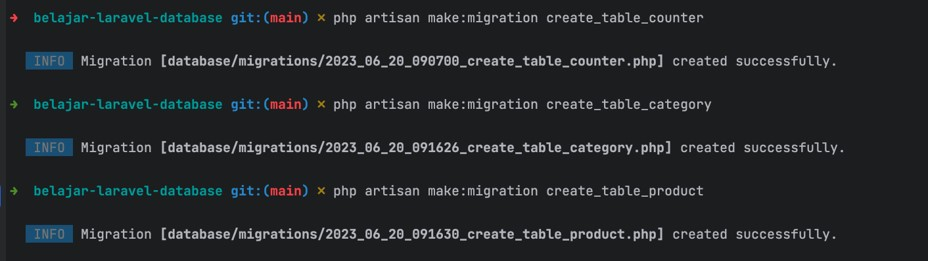
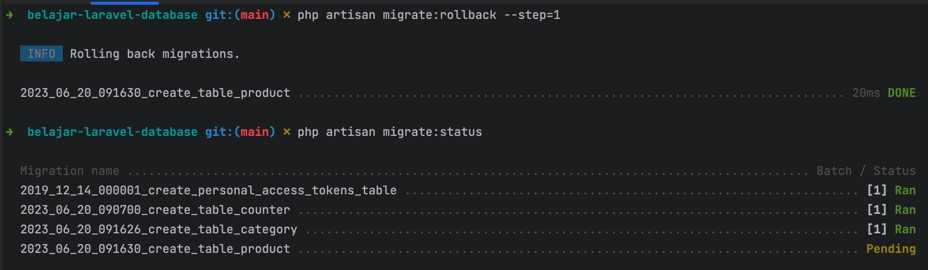
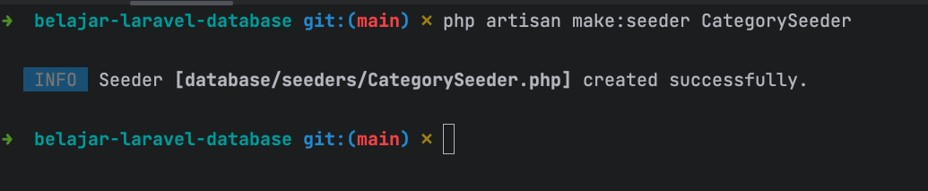
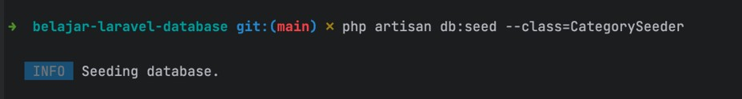

# Laravel Database

## Sebelum Belajar

- Kelas PHP dari Programmer Zaman Now
- Kelas MySQL Database dari Programmer Zaman Now
- Laravel Dasar
- Laravel Collection

## Agenda

- Pengenalan Laravel Database
- Konfigurasi Database
- RAW SQL
- Query Builder
- Pagination
- Migrations
- Seeding
- Dan lain-lain

## #1 Pengenalan Laravel Database

### Fitur Database di Laravel

- Hampir semua web framework saat ini memiliki fitur untuk berinteraksi dengan database secara mudah, termasuk Laravel
- Laravel memiliki fitur yang mempermudah kita membuat Raw SQL (manual), Query Builder dan Eloquent ORM (yang akan dibahas terpisah)

### Database yang didukung

Saat ini, Laravel mendukung lima database utama

- MaridDB 10.3+
- MySQL 5.7+
- PostgresSQL 10.0+
- SQLite 3.8.8+
- SQL Server 2017+

### Keuntungan Laravel Database

- Dengan menggunakan Laravel Database, kita bisa mudah berganti-ganti database
- Mirip seperti PHP PDO, Laravel Database juga menggunakan satu cara untuk terkoneksi ke database, dan kita bisa mengganti-ganti database nya di lain waktu

## #2 Membuat Project

```sh
composer create-project laravel/laravel=v10.2.3 belajar-laravel-database
```

## #3 Konfigurasi Database

- Semua konfigurasi database di Laravel disimpan dalam file `config/database.php`
- Dan saat kita membuat project Laravel, sudah disediakan contoh-contoh konfigurasi database di file `config/database.php`
- Secara default, Laravel menggunakan database MySQL, kita bisa ubah dengan cara mengubah konfigurasi default `DB_CONNECTION` nya di file `config/database.php`

### Environment Variable

- Walaupun konfigurasi database terdapat di file `config/database.php`, namun beberapa atribut menggunakan environment variable untuk mengambil datanya
- Oleh karena itu, kita juga perlu perhatikan data yang terdapat pada file .env

## #4 Membuat Database

- Buatlah database di MySQL dengan nama `belajar_laravel_database`

### Kode: Membuat Table

```sql
create table categories
(
	id varchar(100) not null primary key,
	name varchar(100) not null,
	description text,
	created_at timestamp
) engine innodb;
```

### Konfigurasi Database

- Ubah konfigurasi `config/database.php` dan `.env` sesuai dengan database yang sudah dibuat

## #5 DB Facade

- Saat kita sudah mengatur konfigurasi database, kita bisa berinteraksi dengan database melalui Facade DB
- Facade DB memiliki banyak sekali function yang bisa kita gunakan untuk berinteraksi dengan database, seperti melakukan `insert`, `update`, `delete` dan `select`
- <https://laravel.com/api/10.x/Illuminate/Support/Facades/DB.html>

## #6 Debug Query

- Pada kasus tertentu, kadang kita ingin melakukan debugging SQL query yang dibuat oleh Laravel
- Kita bisa menggunakan `DB::listen()`
- `DB::listen()` akan dipanggil setiap kali ada operasi yang dilakukan oleh Laravel Database
- Kita bisa me-log query misalnya
- Kita bisa daftarkan `DB::listen` pada Service Provider

### Kode: App Service Provider

```php
public function boot(): void
{
	DB::listen(function (QueryExecuted $query) {
		Log::info($query->sql);
	});
}
```

## #7 CRUD SQL

- Dengan menggunakan DB Facade, kita bisa melakukan Raw Query (query ke database secara manual)
- Walaupun pada kenyataannya saat kita menggunakan Laravel, kita akan banyak menggunakan Eloquent ORM, tapi pada kasus tertentu ketika kita butuh performa yang sangat cepat, ada baiknya kita lakukan menggunakan Raw Query

### Function Raw Query

| Function                          | Keterangan                                  |
| --------------------------------- | ------------------------------------------- |
| `DB::insert(sql, array): bool`    | Untuk melakukan insert data                 |
| `DB::update(sql, array): int`     | Untuk melakukan update data                 |
| `DB::delete(sql, array): int`     | Untuk melakukan delete data                 |
| `DB::select(sql, array): array`   | Untuk melakukan select data                 |
| `DB::statement(sql, array): bool` | Untuk melakukan jenis sql lain              |
| `DB::unprepared(sql array): bool` | Untuk melakukan sql bukan prepared statment |

### Kode: Raw SQL

```php
class RawSqlTest extends TestCase
{
	protected function setUp(): void
	{
		parent::setUp();
		DB::delete('DELETE FROM categories');
	}

	public function test_analysis(): void
	{
		DB::insert('INSERT INTO categories(id, name, description, created_at) VALUES (?, ?, ?, ?)', [
			'GADGET', 'Gadget', 'Gadget Category', '2020-01-01 00:00:00'
		]);

		$results = DB::select('SELECT * FROM categories WHERE id = ?', ['GADGET']);

		self::assertEquals(1, count($results));
		self::assertEquals('GADGET', $results[0]->id);
		self::assertEquals('Gadget', $results[0]->name);
		self::assertEquals('Gadget Category', $results[0]->description);
		self::assertEquals('2020-01-01 00:00:00', $results[0]->created_at);
	}
}
```

### Named Binding

- Kadang menggunakan parameter `?` (tanda tanya) membingungkan saat kita membuat query dengan parameter yang banyak
- Laravel mendukung fitur bernama named binding, sehingga kita bisa mengganti `?` (tanda tanya) menjadi nama parameter, dan data bisa kita kirim menggunakan array dengan key sesuai nama parameter nya

### Kode: Named Binding

```php
public function testNameBinding(): void
{
	DB::insert('INSERT INTO categories(id, name, description, created_at) VALUES (:id, :name, :description, :created_at)', [
		'id' => 'GADGET',
		'name' => 'Gadget',
		'description' => 'Gadget Category',
		'created_at' => '2020-01-01 00:00:00'
	]);

	$results = DB::select('SELECT * FROM categories WHERE id = :id', ['id' => 'GADGET']);

		self::assertEquals(1, count($results));
		self::assertEquals('GADGET', $results[0]->id);
		self::assertEquals('Gadget', $results[0]->name);
		self::assertEquals('Gadget Category', $results[0]->description);
		self::assertEquals('2020-01-01 00:00:00', $results[0]->created_at);
}
```

## #8 Database Transaction

- Laravel Database juga memiliki fitur untuk melakukan database transaction secara otomatis
- Dengan begitu, kita tidak perlu melakukan start transaction dan `commit`/`rollback` secara manual lagi
- Kita bisa menggunakan function `DB::transactions(function)`
- Di dalam function tersebut kita bisa melakukan perintah database, jika terjadi error, secara otomatis transaksi akan di rollback

### Kode: Database Transaction

```php
public function testTransaction()
{
	DB::transaction(function() {
		DB::insert('INSERT INTO categories(id, name, description, created_at) VALUES(?, ?, ?, ?)', [
			'GADGET', 'Gadget', 'Gadget Category', '2020-01-01 00:00:00'
		]);
		DB::insert('INSERT INTO categories(id, name, description, created_at) VALUES(?, ?, ?, ?)', [
			'FOOD', 'Food', 'Food Category', '2020-01-01 00:00:00'
		});
	}

	$results = DB::select('SELECT * FROM categories');
	assertEquals(2, count($results));
}
```

### Manual Database Transaction

- Selain menggunakan fitur otomatis, kita juga bisa melakukan database transaction secara manual menggunakan Laravel Database
- Kita bisa gunakan beberapa function
- `DB::beginTransaction()` untuk memulai transaksi
- `DB::commit()` untuk melakukan commit transaksi
- `DB::rollBack()` untuk melakukan rollback transaksi

### Kode: Manual Database Transaction

```php
public function testManualTransaction()
{
	try {
		DB::beginTransaction();
		DB::insert('INSERT INTO categories(id, name, description, created_at) VALUES(?, ?, ?, ?)', [
			'GADGET', 'Gadget', 'Gadget Category', '2020-01-01 00:00:00'
		]);
		DB::insert('INSERT INTO categories(id, name, description, created_at) VALUES(?, ?, ?, ?)', [
			'FOOD', 'Food', 'Food Category', '2020-01-01 00:00:00'
		});
		DB::commit();
	} catch (Exception $e) {
		DB::rollBack();
		throw $e;
	}

	$results = DB::select('SELECT * FROM categories');
	assertEquals(2, count($results));
}
```

## #9 Database Commands

- Artisan file di laravel memiliki banyak sekali fitur, salah satunya adalah perintah db
- Ada banyak sekali perintah db yang bisa kita gunakan
- `php artisan db`, untuk mengakses terminal database, misal mysql
- `php artisan db:table`, untuk melihat seluruh table di database
- `php artisan db:show`, untuk melihat informasi database
- `php artisan db:monitor`, untuk memonitor jumlah koneksi di database
- `php artisan db:seed`, untuk menambah data di database
- `php artisan db:wipe`, untuk menghapus seluruh table di database

## #10 Query Builder

- Selain menggunakan Raw Sql, Laravel Database juga memiliki fitur bernama Query Builder
- Fitur ini sangat mempermudah kita ketika ingin membuat perintah ke database dibandingkan melakukannya secara manual menggunakan Raw SQL
- Query Builder direpresentasikan dengan class `Builder`
- <https://laravel.com/api/10.x/Illuminate/Database/Query/Builder.html>
- Untuk membuat Query Builder, kita bisa gunakan function `DB::table(nama)`

## #11 Query Builder Insert

- Untuk melakukan Insert menggunakan Query Builder, kita bisa menggunakan method dengan prefix insert dengan parameter associative array dimana key nya adalah kolom, dan value nya adalah nilai yang akan disimpan di database
- `insert()` untuk memasukkan data ke database, throw exception jika terjadi error misal duplicate primary key
- `insertGetId()` untuk memasukkan data ke database, dan mengembalikan primary key yang diset secara auto generate, cocok untuk tabel dengan id auto increment
- `insertOrIgnore()` untuk memasukkan data ke database, dan jika terjadi
  error, maka akan di ignore

### Kode: Query Builder Insert

```php
DB::table('categories')->insert([
	'id' => 'GADGET',
	'name' => 'Gadget'
]);
DB::table('categories')->insert([
	'id' => 'FOOD',
	'name' => 'FOod'
]);

$results = DB::select('SELECT COUNT(id) as total FROM categories');
self::assertEquals(2, $results[0]->total);
```

## #12 Query Builder Select

- Ada beberapa function di Query Builder yang bisa kita gunakan untuk melakukan perintah select
- `select(columns)`, untuk mengubah select kolom, dimana defaultnya adalah semua kolom
- Setelah itu, untuk mengeksekusi SQL dan menyimpannya di Collection secara langsung, kita bisa menggunakan beberapa method
- `get(columns)`, untuk mengambil seluruh data, defaultnya semua kolom diambil
- `first(columns)`, untuk mengambil data pertama, defaultnya semua kolom diambil
- `pluck(column)`, untuk mengambil salah satu kolom saja
- Hasil dari Query Builder Select adalah Laravel Collection

### Kode: Query Builder Select

```php
$this->testQueryBuilderInsert(0;

$collection = DB::table('categories')->select(['id', 'name']))->get();

$collection->each(function ($record) {
	Log::info(json_encode($record));
});
```

## #13 Query Builder Where

- Sebelum kita lanjut ke materi Update dan Delete, kita harus tahu tentang Where di Query Builder
- Untuk menambahkan Where di Query Builder, kita bisa menggunakan banyak sekali method dengan awalan `where…()`

### Kode: Insert Category

```php
public function testQueryBuilderWhere()
{
	DB::table('categories')
		->insert(['id' => 'SMARTPHONE', 'name' => 'Smartphone', 'created_at' => '2020-01-01 00:00:00']);
	DB::table('categories')
		->insert(['id' => 'FOOD', 'name' => 'Food', 'created_at' => '2020-01-01 00:00:00']);
	DB::table('categories')
		->insert(['id' => 'LAPTOP', 'name' => 'Laptop', 'created_at' => '2020-01-01 00:00:00']);
	DB::table('categories')
		->insert(['id' => 'FASHION', 'name' => 'Fashion', 'created_at' => '2020-01-01 00:00:00']);
}
```

### Where Method

| Where Method                       | Keterangan                                 |
| ---------------------------------- | ------------------------------------------ |
| `where(column, operator, value)`   | AND column, operator value                 |
| `where([condition1, condition2])`  | AND (condition 1, AND condition 2, AND ..) |
| `where(callback(Builder))`         | AND (condition)                            |
| `orWhere(column, operator, value)` | OR (condition)                             |
| `orWhere(callback(Builder))`       | OR (condition ...)                         |
| `whereNot(callback(Builder))`      | NOT (condition ...)                        |

### Kode: Where Method

```php
$this->testQueryBuilderWhere()
{
	$collection = DB::table('categories')->orWhere(function (Builder $builder) {
		$builder->where('id', '=', 'SMARTPHONE');
		$builder->orWhere('id', '=', 'LAPTOP');
	})->get();

	self::assertCount(2, $collection);
	for ($i = 0; i < count($collection); $i++) {
		Log::info(json_encode($collection[$i]));
	}
}
```

### WHere Between Method

| Where Method                                | Keterangan                                |
| ------------------------------------------- | ----------------------------------------- |
| `whereBetween(column, [value1, value2])`    | WHERE column BETWEEN value1, AND value2   |
| `whereNotBetween(column, [value1, value2])` | WHERE column NOT BETWEEN vaue1 AND value2 |

### Kode: Where Between Method

```php
public function testWhereBetweenMethod()
{
	$this->testQueryBuilderWhere();

	$collection = DB::table('categories')
		->whereBetween('created_at', ['2020-01-01 00:00:00', '2020-01-01 23:23:23'])->get();
	self::assertCount(4, $collection);
	for ($i = 0; i < count($collection); $i++) {
		Log::info(json_encode($collection[$i]));
	}
}
```

### Where in Method

| Where Method                  | Keterangan                  |
| ----------------------------- | --------------------------- |
| `whereIn(column, [array])`    | WHERE column IN (array)     |
| `whereNotIn(column, [array])` | WHERE column NOT IN (array) |

### Kode: Where in Method

```php
public function testWhereInMethod()
{
	$this->testQueryBuilderWhere();

	$transaction = DB::table('categories')->whereIn('id', ['SMARTPHONE', 'LAPTOP'])->get();
	self::assertCount(4, $collection);
	for ($i = 0; i < count($collection); $i++) {
		Log::info(json_encode($collection[$i]));
	}
}
```

### Where Null Method

| Where Method           | Keterangan               |
| ---------------------- | ------------------------ |
| `whereNull(column)`    | WHERE column IS NULL     |
| `whereNotNull(column)` | WHERE column IS NOT NULL |

### Kode: Where Null Method

```php
public function testWhereNullMethod()
{
	$this->testQueryBuilderWhere();

	$transaction = DB::table('categories')->whereNull('description')->get();
	self::assertCount(4, $collection);
	for ($i = 0; i < count($collection); $i++) {
		Log::info(json_encode($collection[$i]));
	}
}
```

### Where Date Method

| Where Method                | Keterangan                  |
| --------------------------- | --------------------------- |
| `whereDate(column, value)`  | WHERE DATE(column) = value  |
| `whereMonth(column, value)` | WHERE MONTH(column) = value |
| `whereDay(column, value)`   | WHERE DAY(column) = value   |
| `whereYear(column, value)`  | WHERE YEAR(column) = value  |
| `whereTime(column, value)`  | WHERE TIME(column) = value  |

### Kode: Where Date Method

```php
public function testWhereDateMethod()
{
	$this->testQueryBuilderWhere();

	$collection = DB::table('categories')->whereDate('created_at', '2020-01-01')>get();
	self::assertCount(4, $collection);
	for ($i = 0; i < count($collection); $i++) {
		Log::info(json_encode($collection[$i]));
	}
}
```

## #14 Query Builder Update

- Setelah kita tahu cara menggunakan Where, sekarang kita bahas tentang Update Method
- Untuk melakukan Update, kita bisa menggunakan method `update(array)`
- Dimana parameter nya kita bisa mengirim associative array yang berisi kolom -> value

### Kode: Query Builder Update

```php
$this->testQueryBuilderWhere();

DB::table('categories')->where('id', '=', 'SMARTPHONE')->update([
	'name' => 'Handphone'
]);

$collection = DB::table('categories')->where('name', '=', 'Handphone')->get();
self::assertCount(1, $collection);
for ($i = 0; i < count($collection); $i++) {
	Log::info(json_encode($collection[$i]));
}
```

### Upsert (Update or Insert)

- Query Builder menyediakan method untuk melakukan update or insert, dimana ketika mencoba melakukan update, jika datanya tidak ada, maka akan dilakukan insert data baru
- Kita bisa menggunakan method `updateOrInsert(attributes, values)`

### Kode: Upsert

```php
public function testQueryBuilderUpdateOrInsert()
{
	DB::table('categories')->updateOrInsert([
		'id' => 'VOUCHER'
	], [
		'name' => 'Voucher',
		'description' => 'Ticket and Voucher',
		'created_at' => '2020-01-01 10:10:10'
	]);

	$collection = DB::table('categories')->where('id', '=', 'VOUCHER')->get();
	self:;assertCount(1, $collection);
	for ($i = 0; $i < count($collection); $i++) {
		Log::info(json_encode($collection[$i]));
	}
}
```

### Increment dan Decrement

- Query Builder juga menyediakan cara mudah untuk melakukan increment atau decrement
- Jadi kita tidak perlu melakukan increment atau decrement secara manual di kode PHP
- Kita bisa menggunakan method
- `increment(column, increment)` untuk melakukan increment
- `decrement(column, decrement)` untuk melakukan decrement

### Kode: Membuat Tabel Counter

```sql
create table counters
(
	id varchar(100) not null primary key,
	counter int not null default 0
) engine innodb;

insert into counters (id, counter) values ('sample', 0);

select * from counters;
```

### Kode: Increment

```php
public function testQueryBuilderIncrement()
{
	DB::table('counters')->where('id', '=', 'sample')->increment('counter', 1);

	$collection = DB::table('counters')->where('id', '=', 'sample')->get();
	self::assertCount(1, $collection);
	dor ($i = 0; $i < count($collection); $i++) {
		Log::info(json_encode($collection[$i]));
	}
}
```

## #15 Query Builder Delete

- Untuk melakukan delete, kita bisa menggunakan method
- `delete()` untuk melakukan Sql DELETE, dan
- `truncate()` untuk melakukan TRUNCATE table

### Kode: Delete

```php
public function testQueryBuilderDelete()
{
	$this->testQueryBuilderWhere();

	DB::table('categories')->where('id', '=', 'SMARTPHONE')->delete();

	$collection = DB::table('categories')->where('id', '=', 'SMARTPHONE')->get();
	self::assertCount(0, $collection);
}
```

## #16 Query Builder Join

- Query Builder juga menyediakan cara mudah untuk melakukan join, dengan menggunakan beberapa method
- `join(table, column, operator, ref_column)` untuk JOIN atau INNER JOIN
- `leftJoin(table, column, operator, ref_column)` untuk LEFT JOIN
- `rightJoin(table, column, operator, ref_column)` untuk RIGHT JOIN
- `crossJoin(table, column, operator, ref_column)` untuk CROSS JOIN

### Kode: Membuat Table Product

```sql
create table products
(
	id varchar(100) not null primary key,
	name varchar(100) not null,
	description text,
	price int not null,
	category_id varchar(100) not null,
	created_at timestamp,
	constraint fk_category_id foreign key (category_id) references categories (id)
) engine innodb;
```

### Kode: Insert Table Product

```php
public function insertTableProduct()
{
	$this->testQueryBuilderWhere();

	DB::table('products')
		->insert(['id' => '1', 'name' => 'Iphone 14 Pro Max', 'category_id' => 'Smartphone', 'price' => 25000000]);
	DB::table('products')
		->insert(['id' => '2', 'name' => 'Samsung Galacy S22 Ultra', 'category_id' => 'Smartphone', 'price' => 20000000]);
}
```

### Kode: Join

```php
public function testQueryBuilderJoin()
{
	$this->insertTableProducts();

	$collection = DB::table('products')
		->join('categories', 'products.category_id', '=', 'categories.id')
		->select('products.id', 'products.name', 'categories.name as category_name', 'products.price')
		->get();

	self::assertCount(2, $collection);
	for ($i = 0; $i < count($collection); $i++) {
		Log::info(json_encode($collection[$i]));
	}
}
```

## #17 Query Builder Ordering

- Query Builder juga memiliki method untuk memudahkan kita melakukan pengurutan data menggunakan
- `orderBy(column, order)` dimana order bisa `asc` atau `desc`

### Kode: Query Builder Ordering

```php
public function testQueryBuilderOrdering()
{
	$this->insertTableProducts();

	$collection = DB::table('products')
		->orderBy('price', 'desc')
		->orderBy('name', 'asc')
		->get();

	self::assertCount(2, $collection);
	for ($i = 0; $i < count($collection); $i++) {
		Log::info(json_encode($collection[$i]));
	}
}
```

## #18 Query Builder Paging

- Untuk melakukan paging, biasanya di SQL kita akan menggunakan perintah LIMIT OFFSET
- Di Query Builder, kita bisa menggunakan method
- `take(number)` untuk melakukan LIMIT
- `skip(number)` untuk melakukan OFFSET

### Kode: Query Builder Paging

```php
public function testQueryBuilderTakeSkip()
{
	$this-->insertTakeProducts();

	$collection = DB::table('categories')
		->skip(2)
		->take(2)
		->get();

	self::assertCount(2, $collection);
	for ($i = 0; $i < count($collection); $i++) {
		Log::info(json_encode($collection[$i]));
	}
}
```

## #19 Chunk Results

- Saat kita membuat aplikasi, kadang ada kasus kita mengelola data dengan ukuran besar
- Secara default, semua query yang kita lakukan di Laravel, akan di load ke Memory sebagai Collection
- Hal ini berbahaya ketika hasil query nya banyak, karena bisa berakibat terjadi error Out Of Memory
- Dari pada kita me load semua data ke Memory, kita bisa memotong data hasil query secara bertahap menggunakan method `chunk()`
- Implementasi chunk sebenarnya adalah dengan melakukan paging
  Dan jika ingin menggunakan chunk, kita harus menambahkan ordering pada query nya

### Kode: Chunk Results

```php
public function testQueryBuilderChunkResults()
{
	$this->insertTableProducts();

	DB::table('categories')
		->orderBy('id')
		->chunk(1, function($categories) {
			self::assertNotNull($categories);
			foreach ($categories as $category) {
				Log::info(json_encode($category));
			}
		});
}
```

## #20 Lazy Results

- Menggunakan Chunk Results kadang menyulitkan, karena kita harus proses datanya secara manual per chunk
- Untungnya Laravel memiliki fitur Lazy, dimana kita bisa menjadikan Query Builder dengan Lazy Results, yang menghasilkan Lazy Collection
- Karena hasilnya berupa Lazy Collection, data yang diambil dari database akan bertahap, tidak langsung semuanya di load ke Memory
- Implementasi detailnya sebenarnya tetap menggunakan Chunk Results

### Kode: Lazy Results

```php
public function testQueryBuilderLazyResults()
{
	$this->insertTableProducts();

	DB::table('categories')
		->orderBy('id')
		->lazy(1)
		->each(function ($category) {
				self::assertNotNull($category);
				Log::info(json_encode($category));
		});
}
```

## #21 Cursor

- Selain Chunk dan Lazy, terdapat cara lain untuk membuat Lazy Result, yaitu menggunakan Cursor
- Chunk dan Lazy sebenarnya melakukan paging dibelakang layar, sedangkan Cursor hanya akan melakukan query satu kali
- Lalu akan mengambil datanya satu persatu menggunakan `PDO::fetch()`
- Jadi secara penggunaan memory, Cursor akan lebih hemat dibanding dengan Chunk atau Lazy

### Kode: Cursor

```php
public function testQueryBuilderLazyResults()
{
	$this->insertTableProducts();

	DB::table('categories')
		->orderBy('id')
		->cursor()
		->each(function ($category) {
			self::assertNotNull($category);
			Log::info(json_encode($category));
		});
}
```

## #22 Query Builder Aggregates

- Query Builder juga mendukung untuk melakukan Aggregate Query, kita bisa menggunakan method :
- `count(column)` untuk jumlah data
- `min(column)` untuk minimal data
- `max(column)` untuk maksimal data
- `avg(column)` untuk rata-rata data
- `sum(column)` untuk menjumlahkan data

### Kode: Query Builder Aggregate

```php
$this->insertTableProducts();

$collection = DB::table('products')
	->count('id');

self::assertEquals(2, $collection);

$collection = DB::table('products')
	->max('price');

self::assertEquals(20000000, $collection);

$collection = DB::table('products')
	->min('price');

self::assertEquals(10000000, $collection);

$collection = DB::table('products')
	->avg('price');

self::assertEquals(19000000, $collection);

$collection = DB::table('products')
	->sum('price');

self::assertEquals(30000000, $collection);
```

## #23 Query Builder Raw

- Sayangnya, Aggregate Method yang ditawarkan oleh Laravel langsung menghasilkan data
- Padahal mungkin kita ingin membuat query untuk beberapa Aggregate Function, misal kombinasi Min, Max, dan yang lainnya
- Pada kasus seperti ini, kita bisa menggunakan bantuan kombinasi Query Builder dan juga Raw Query

#### Kode: Query Builder Raw

```php
public function testQueryBuilderRawAggregate()
{
	$this->insertTableProducts();

	$collection = DB::table('products')
		->select(
			DB::raw('count(*) as total_product'),
			DB::raw('min(price) as min_price'),
			DB::raw('max(price) as max_price'),
		)
		->get();

	self::assertEquals(2, $collection[0]->total_product);
	self::assertEquals(10000000, $collection[0]->min_price);
	self::assertEquals(20000000, $collection[0]->max_price);
}
```

## #24 Query Builder Grouping

- Saat melakukan Query menggunakan Aggregate Function, kadang kita ingin melakukan Groping
- Kita bisa menggunakan method `groupBy(value)` untuk melakukan Grouping

### Kode: Insert Product Food

```php
public function insertProductFood()
{
	DB::table('products')
		->insert(['id' => '1', 'name' => 'Bakso', 'category_id' => 'FOOD', 'price' => 20000]);
	DB::table('products')
		->insert(['id' => '1', 'name' => 'Mie Ayam', 'category_id' => 'FOOD', 'price' => 20000]);
}
```

### Kode: Query Builder Grouping

```php
public function testQueryBuilderGrouping()
{
	$this->insertTableProducts();
	$this->insertProductFood();

	$collection = DB::table('products')
		->select('category_id', DB::raw('count(*) as total_product'))
		->groupBy('category_id')
		->orderBy('category_id', 'desc')
		->get();

	self::assertCount(2, $collection);
	self::assertEquals('SMARTPHONE', $collection[0]->category_id);
	self::assertEquals('FOOD', $collection[1]->category_id);
	self::assertEquals(2, $collection[0]->total_product);
	self::assertEquals(2, $collection[1]->total_product);
}
```

### Having

- Di SQL, kita bisa menambahkan Having ketika menggunakan Group By
- Di Laravel juga bisa kita lakukan menggunakan method `having(column, operator, value)`

### Kode: Having

```php
public function testQueryBuilderHaving()
{
	$this->insertTableProducts();
	$this->insertProductFood();

	$collection = DB::table('products')
		->select('category_id', DB::raw('count(*) as total_product'))
		->groupBy('category_id')
		->orderBy('category_id', 'desc')
		->having(DB::raw('count(*)'), '>', 2)
		->get();

	self::assertCount(0, $collection);
}
```

## #25 Query Builder Locking

- Saat kita belajar Database Transaction di MySQL, kita sudah belajar cara melakukan Locking Record ketika melakukan Select dengan menambahkan perintah FOR UPDATE
- Di Query Builder, jika kita ingin melakukan Locking, kita bisa menggunakan method `lockForUpdate()`
- Secara otomatis Laravel akan menambahkan perintah FOR UPDATE ke Database untuk melakukan Locking

### Kode: Query Builder Locking

```php
public function testQueryBuilderLocking()
{
	$this->insertTableProducts();

	DB::transaction(function () {
		$collection = DB::table('products')
			->where('id', '=', '1')
			->lockForUpdate()
			->get();

		self::assertCount(1, $collection);
	});
}
```

## #26 Pagination

- Saat kita membuat aplikasi Web atau RESTful API yang mengembalikan data di database, kita sering memberi informasi tentang pagination, misal jumlah record, jumlah page, page saat ini, dan lain-lain
- Jika kita lakukan semuanya secara manual, maka lumayan memakan waktu
- Untungnya Laravel memiliki fitur pagination, dimana kita bisa menggunakan method `paginate()`, dan secara otomatis akan mengembalikan object LengthAwarePagination
- <https://laravel.com/api/10.x/Illuminate/Database/Query/Builder.html#method_paginate>
- <https://laravel.com/api/10.x/Illuminate/Contracts/Pagination/LengthAwarePaginator.html>

### Kode: Pagination

```php
$this->insertTableProducts();

$paginate = DB::table('categories')->paginate(perPage: 2);

self::assertEquals(1, $paginate->currentPage()); // current page
self::assertEquals(2, $paginate->perPage()); // items per page
self::assertEquals(3, $paginate->lastPage()); // last page
self::assertEquals(4, $paginate->total()); // total page

$collection = $paginate->items();
self::assertCount(2, $collection);
foreach ($collection as $item) {
	Log::info(json_encode($item));
}
```

### Iterasi Per Page

- Untuk melakukan iterasi semua halaman, kita bisa lakukan dengan cara menaikkan nilai dari parameter page dari 1 sampai page terakhir

### Kode: Iterasi Per Page

```php
$this->insertTableProducts();

$page = 1;
while (true) {
	$paginate = DB::table('categories')->paginate(perPage: 2, page: $page);
	if ($paginate->isEmpty()) {
		break;
	}
	$page++;
	foreach ($paginate->items() as #item) {
		self::assertNotNull($item);
		Log::info(json_encode($item));
	}
}
```

## #27 Cursor Pagination

- Saat jumlah data kita semakin banyak di tabel, dan ketika kita melakukan pagination, semakin dalam page yang kita cari, maka akan semakin lambat, hal ini karena setiap melakukan paging, kita harus melakukan offset / skip sejumlah data hasil pencarian, semakin banyak yang kita skip, semakin lambat juga hasilnya
- <https://mariadb.com/kb/en/pagination-optimization/>
- Salah satu cara untuk optimalisasi proses paging, adalah menggunakan SEARCH AFTER, dimana kita tidak menggunakan nomor page lagi, melainkan menampilkan data setelah data terakhir yang kita lihat
- Hal ini membuat proses Query menjadi lebih cepat, karena kita selalu akan menampilkan page pertama dan tidak pernah melakukan offset / skip data

### Kekurangan Search After

- Cara ini dinamakan Search After
- Kekurangan Search After adalah kita tidak bisa loncat dari satu page ke page lain, karena query nya selalu harus diubah
- Selain itu, Cursor Pagination harus melakukan sort dan filter berdasarkan salah satu kolom yang unique, misalnya primary key

### Cursor Pagination

- Implementasi Search After di Laravel tidak perlu dilakukan secara manual, kita bisa menggunakan method `cursorPaginate()` untuk melakukan Search After
- Hasil dari method ini adalah object CursorPaginator
- <https://laravel.com/api/10.x/Illuminate/Database/Query/Builder.html#method_cursorPaginate>
- <https://laravel.com/api/10.x/Illuminate/Contracts/Pagination/CursorPaginator.html>

### Kode: Cursor Pagination

```php
public function testQueryBuilderCursorPagination()
{
	$this->insertTableProducts();

	$cursor = 'id';
	while (true) {
		$paginate = DB::table('categories')->orderBy('id')->cursorPaginate(perPage: 2, cursor: $cursor);

		foreach ($paginate->items() as $item) {
			self::assertNotNull($item);
			Log::info(json_encode($item));
		}

		$cursor = $paginate->nextCursor();
		if ($cursor == null) {
			break;
		}
	}
}
```

## #28 Database Migration

- Sebelumnya ketika membuat tabel, kita melakukannya secara manual ke MySQL
- Laravel memiliki fitur bernama Database Migration
- Fitur ini digunakan untuk melakukan versioning schema database, dimana setiap perubahan akan di track sehingga akan selalu konsisten
- Dengan menggunakan Database Migration, kita tidak perlu mengubah Schema Database secara manual lagi

### Kode: Hapus Semua Tabel

```sql
drop table products;

drop table categories;

drop table counters;
```

## #29 Membuat Database Migration

- Untuk membuat file Database Migration baru, kita bisa menggunakan perintah :
- `php artisan make:migration nama_file_migration`
- Secara otomatis akan dibuatkan file PHP yang digunakan untuk melakukan perubahan schema di database di folder `database/migrations`
- Untuk membuat perubahan schema, kita bisa menggunakan Schema Builder, tidak perlu manual menggunakan SQL lagi
- <https://laravel.com/api/10.x/Illuminate/Support/Facades/Schema.html>
- <https://laravel.com/api/10.x/Illuminate/Database/Schema/Blueprint.html>

### Kode: Membuat File Migration

```sh
php artisan make:migration create_table_counter
```



### Tipe Data di Migrations

- Laravel mendukung banyak tipe data di Migrations
- Kita bisa liat di halaman dokumentasinya
- <https://laravel.com/docs/10.x/migrations#available-column-types>

### Kode: Create Table Counters

```php
return new class extends Migration {

	public function up(): void
	{
		Schema::create('counters', function (Blueprint $table) {
			$table->string('id', 100)->nullable(false)->primary();
			$table->integer('counter')->nullable(false)->default(0);
		});
	}

	public function down(): void
	{
		Sehema::dropIfExists('counters');
	}
}
```

### Kode: Create Table Category

```php
public function up(): void
{
	Schema::create('categories', function (Blueprint $table) {
		$table->string('id', 100)->nullable(false)->primary();
		$table->string('name', 100)->nullable(false);
		$table->text('description')->nullable(true);
		$table->timestamp('created_at')->useCurrent();
	});
}

public function down(): void
{
	Schema::dropIfExists('categories');
}
```

### Kode: Create Table Product

```php
public function up(): void
{
	Sehema::create('products', function (Blueprint $table) {
		$table->string('id', 100)->nullable(false)->primary();
		$table->string('name', 100)->nullable(false);
		$table->text('description')->nullable(true);
		$table->integer('price')->nullable(false);
		$table->string('category_id', 100)->nullable(false);
		$table->timestamp('created_at')->useCurrent();
		$table->foreign('category_id')->references('id')->on('categories');
	});
}

public function down(): void
{
	Schema::dropIfExists('products');
}
```

### Menjalankan Database Migration

- Setelah file database migration selesai dibuat, selanjutnya kita bisa menjalankan file migration tersebut
- Untuk melihat status migration : `php artisan migrate:status`
- Untuk menjalankan migration : `php artisan migrate`
- Setelah migration dijalankan, status file mana yang pernah dijalankan akan disimpan di tabel migrations
- Jika kita mengubah file lama yang sudah dijalankan, maka tidak ada gunanya, karena tidak akan pernah dijalankan lagi
- Jika mau melakukan perubahan, silahkan buat migration file baru untuk melakukan perubahannya

## #30 Rollback Database Migration

- Saat selesai menjalankan migration, kadang kita ingin membatalkan migration tersebut
- Kita bisa membatalkan migration, atau istilahnya adalah rollback
- Rollback akan dijalankan dari mulai migration file terakhir yang sukses, ke migration file sebelumnya secara bertahap
- Untuk menjalankan rollback, kita harus tentukan berapa jumlah file migration yang akan di rollback menggunakan perintah :
- `php artisan migrate:rollback --step=jumlah`
- Dimana jumlah berisi angka jumlah file migration yang akan di follback

### Kode: Rollback Migration

```sh
php artisan migrate:rollback --step=1
```



## #31 Database Seeding

- Sebelumnya saat kita membuat unit test, kita sering melakukan insert data terlebih dahulu
- Proses ini dinamakan seeding, yaitu mengubah (insert update atau delete) data di database
- Laravel memiliki cara yang lebih baik untuk melakukan seeding

### Membuat Seeding

- Untuk membuat seeding baru, kita bisa menggunakan perintah :
- `php artisan make:seeder NamaSeeder`
- Secara otomatis akan dibuatkan file di folder `database/seeders`
- Pada file itu, kita bisa menambahkan kode untuk memanipulasi data di database

### Kode: Membuat Seeder

```sh
php artisan make:seeder CategorySeeder
```



### Kode: Category Seeder

```php
class CategorySeeder extends Seeder
{
	public function run(): void
	{
		DB::table('categories')
			->insert(['id' => 'SMARTPHONE', 'name' => 'Smartphone', 'created_at' => '2020-01-01 10:10:10']);
		DB::table('categories')
			->insert(['id' => 'FOOD', 'name' => 'Food', 'created_at' => '2020-01-01 10:10:10']);
		DB::table('categories')
			->insert(['id' => 'LAPTOP', 'name' => 'Laptop', 'created_at' => '2020-01-01 10:10:10']);
		DB::table('categories')
			->insert(['id' => 'FASHION', 'name' => 'Fashion', 'created_at' => '2020-01-01 10:10:10']);
	}
}
```

### Menjalankan Seeder

- Untuk menjalankan Seeder, kita bisa menggunakan perintah :
- `php artisan db:seed --class=ClassSeeder`

### Kode: Menjalankan Seeder

```sh
php artisan db:seed --calss=CategorySeeder
```



### Memanggil Seeder dari Unit Test

- Kadang kita ingin memanggil Seeder di unit test, kita bisa menggunakan method `seed(class)` dan diisi dengan parameter class Seeder nya

### Kode: Seeder Unit Test

```php
public function testSeeding()
{
	$this->seed(CategorySeeder::class);

	$collection = DB::table('categories')->get();
	self::assertCount(4, $collection);
	foreach ($collection as $item) {
		self::assertNotNull($item);
		Log::info(json_encode($item));
	}
}
```

### Materi Selanjutnya

- Laravel Eloquent
- Laravel Validation
- Laravel RESTful API
