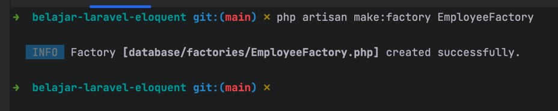

# Laravel Eloquent

## Sebelum Belajar

- Kelas PHP dari Programmer Zaman Now
- Kelas MySQL dari Programmer Zaman Now
- Laravel Database

## #1 Pengenalan Laravel Eloquent

- Laravel Eloquent adalah fitur ORM (Object Relational Mapping) di Laravel
- Programmer Laravel lebih banyak menggunakan Eloquent ORM dibanding menggunakan Query Builder karena lebih mudah
- Namun pada kasus-kasus tertentu, ada juga kasus yang tidak bisa dilakukan menggunakan ORM, sehingga kita harus membuat query SQL secara manual menggunakan Query Builder

### Pengenalan ORM

- ORM (Object Relational Mapping) adalah teknik dalam pemrograman, dimana kita melakukan pemetaan data di database dalam konsep relational object
- Oleh karena itu, ORM sering banyak digunakan di database dengan jenis relational, seperti MySQL, PostgreSQL, Oracle, dan sejenisnya
- Konsep ORM sendiri adalah membuat representasi object di aplikasi yang merepresentasikan data (table) di database, sehingga ketika melakukan manipulasi data (table) di database, seakan-akan kita melakukan manipulasi object di pemrograman

### Diagram Cara Kerja ORM


### Menambah Laravel Eloquent

- Saat kita membuat project Laravel, secara otomatis Laravel Eloquent sudah ada di dalamnya, sehingga kita tidak perlu menambah package atau library baru via composer

## #2 Membuat Project

```sh
composer create-project laravel/laravel=v10.2.4 belajar-laravel-eloquent
```

## #3 Membuat Database

- Buatlah database `belajar_laravel_eloquent`
- Konfigurasikan ke project Laravel

## #4 Model

- Model adalah representasi dari Tabel di database
- Model biasanya dibuat di folder `app\Models`
- Dan Model adalah class turunan dari `Illuminate\Database\Eloquent\Model`
- <https://laravel.com/api/10.x/Illuminate/Database/Eloquent/Model.html>

### Membuat Model

- Kita tidak perlu membuat Model secara manual, kita bisa gunakan file artisan untuk membuat model
- `php artisan make:model NamaModel`

### Membuat Model dengan Pendukungnya

- Kadang, saat membuat Model, kita sering juga membuat fitur pendukung lainnya, seperti database migration atau database seeding
- Kita tidak perlu melakukannya secara manual satu per satu, kita bisa sebutkan ketika membuat Model, sehingga otomatis akan dibuatkan Migrations dan Seeding nya
- `--migrations` untuk menambahkan Migrations
- `--seed` untuk menambahkan Seeder

### Kode: Membuat Model Category

```sh
php artisan make:model Category --migration --seed
```


### Model Attributes

- Setelah membuat Model, kita harus beri tahu informasi tentang schema tabel yang digunakan oleh Model
- Kita bisa override attributes yang terdapat di class Model
- Seperti `$table`, `$primaryKey`, `$keyType`, `$incrementing` dan lain-lain
- <https://laravel.com/api/10.x/Illuminate/Database/Eloquent/Model.html>

### Timestamp

- Secara default, Eloquent berharap terdapat kolom `created_at` dan `updated_at` sebagai informasi audit timestamp
- Jika memang tidak membutuhkan informasi tersebut, kita bisa meng-override `$timestamp` menjadi false di Model

### Composite Primary Key

- Sampai materi ini dibuat, sayangnya Laravel Eloquent tidak mendukung Composite Primary Key (primary key untuk lebih dari satu kolom)
- Oleh karena itu, kita harus membuat satu kolom yang unique untuk primary key
- Jika memang butuh composite key, kita bisa membuat dua kolom dengan index `unique`

### Kode: Category Model

```php
namespace App\Models;

use Illuminate\Database\Eloquent\Model;

class Category extends Model
{
	protected $table = 'categories';
	protected $primaryKey = 'id';
	protected $keyType = 'string';
	public $incrementing = false;
	public $timestamps = false;
}
```

### Kode: Category Migration

```php
public function up(): void
{
	Schema::create('categories', function (Blueprint $table) {
		$table->string('id', 100)->nullable(false)->primary();
		$table->string('name', 100)->nullable(false);
		$table->text('description')->nullable(true);
		$table->timestamp('created_at')->nullable(false)->useCurrent;
	});
}

public function down(): void
{
	Schema::dropIfExists('categories');
}
```

### Kode: Menjalankan Migrations

```sh
php artisan migrate
```

## #5 Insert

- Untuk melakukan insert data, kita bisa menggunakan method `save()` setelah membuat object dari class Model yang kita buat
- Method `save()` akan mengembalikan status bool, jika sukses atau gagal

### Kode: Insert

```php
public function testInsert()
{
	$category = new Category();

	$category->id = 'GADGET';
	$category->name = 'Gadget';
	$result = $category->save();

	assertTrue($result);
}
```

## #6 Query Builder

- Setelah membuat Model, untuk melakukan operasi CRUD terhadap Model yang sudah kita buat, kita bisa menggunakan Query Builder
- Caranya kita tidak perlu menggunakan Facade DB, kita cukup gunakan static method `query()` di Model yang sudah kita buat

### Magic Method

- Beberapa tutorial ada yang tidak menggunakan method `query()` ketika melakukan operasi ke Model, kenapa?
- Hal ini karena terdapat fitur Metaprogramming di Model, yang sebenarnya meneruskan method yang dipanggil ke Query Builder
- Kita bisa lihat di source code Model, terdapat method `__call()` dan `__callStatic()`
- Magic Method ini sudah pernah kita bahas di kelas PHP OOP
- <https://www.php.net/manual/en/language.oop5.magic.php>

## #7 Insert Many

- Saat kita membuat aplikasi, kadang ada kasus dimana kita harus melakukan insert data Model lebih dari satu, atau disebut bulk / batch
- Pada kasus ini, kita tidak perlu membuat object dari Model, kita cukup gunakan Query Builder untuk melakukan insert banyak data sekaligus menggunakan `array`

### Kode: Insert Many

```php
public function testInsertManyCategories()
{
	$categories = [];
	for ($i = 0; $i < 10; $i++) {
		$categories[] = [
			'id' => 'ID $i',
			'name' => 'Name $i'
		];
	}

	$result = Category::query()->insert($categories);

	self::assertTrue($result);

	$table = Category::query()->count();
	self::assertEquals(10, $total);
}
```

## #8 Find

- Laravel menyediakan method dengan prefix `find()` di Query Builder untuk mendapatkan satu data menggunakan primary key
- Ini lebih mudah dibanding melakukan select dimana mengembalikan data berupa array

### Kode: Category Seeder

```php
class CategorySeeder extends Seeder
{
	public function run(): void
	{
		$category = new Category();
		$category->id = 'FOOD';
		$category->name = 'Food';
		$category->description = 'Food Category';
		$category->save();
	}
}
```

### Kode: Find

```php
public function testFind()
{
	$this->seed(CategorySeeder::class);

	$category = Category::query()->find('FOOD');
	self::assertNotNull($category);
	self::assertEquals('FOOD', $category->id);
	self::assertEquals('Food', $category->name);
	self::assertEquals('Food Category', $category->description);
}
```

## #9 Update

- Untuk melakukan update terhadap Model, kita bisa menggunakan method `update()` atau `save()`
- Saat melakukan update, kita harus melakukan `find()` data terlebih dahulu, jadi bukan dengan membuat object Model baru dengan menggunakan kata kunci new
- Jika pada kasus tertentu, kita akhirnya tidak bisa melakukan `find()`, dan terpaksa harus menggunakan kata kunci new, kita harus mengubah attribute $exists dari defaultnya false, menjadi true, untuk memberi tahu Laravel bahwa data object itu ada di database

### Kode: Update

```php
public function testUpdate()
{
	$this->seed(CategorySeeder::class);

	$category = Category::query()->find('FOOD');
	$category->name = 'Food Update';

	$result = $category->update();

	self::assertTrue($result);
}
```

## #10 Select

- Untuk melakukan select data yang datanya bisa lebih dari satu, maka kita bisa menggunakan Query Builder seperti biasanya, yang sudah kita bahas di materi Laravel Database

### Kode: Select

```php
public function testSelect()
{
	for ($i = 0; $i < 5;$ i++) {
		$category = new Category();
		$category->id = '$i';
		$category->name = 'Category $id';
		$category->save();
	}

	$categories = Category::query()->whereNull('description')->get();
	self::assertEquals(5, $categories->count());
	$categories->each(function ($category) {
		self::assertNull($category->description);
	});
}
```

### Perhatikan

- Saat kita melakukan select lebih dari satu data, hasil dari Query Builder adalah Collection dari Model nya
- Jadi bukan hanya Collection Array
- Artinya kita bisa melakukan operasi lainnya pada hasil select Model tersebut, misal melakukan update

### Kode: Update Select Result

```php
$categories = Category::query())->whereNull('description')->get();
self::assertEquals(5, $categories->count());
$categories->each(function ($category) {
	$category->description = 'Updated';
	$category->update();
});
```

## #11 Update Many

- Pada kasus misal kita mau melakukan update yang bisa berdampak ke lebih dari satu data, kita tidak perlu melakukan update satu per satu ke object model nya
- Kita bisa menggunakan Query Builder

### Kode: Update Many

```php
$categories = [];
for ($i = 0; $i < 10; $i++) {
	$categories[] = [
		'id' => 'ID $i',
		'name' => 'Name $i'
	];

	$result = Category::query()->insert($categories);
	self::assertTrue($result);

	Category::query()->whereNull('description')->update([
		'description' => 'Updated'
	]);
	$total = Category::query()->where('description', 'Updated')->count();
	self::assertEquals(10, $total);
}
```

## #12 Delete

- Untuk melakukan delete data, kita bisa menggunakan method `delete()` di object Model yang sudah kita buat
- Untuk menggunakan `delete()`, kita harus melakukan `find()` data terlebih dahulu
- Sama seperti update data, jika kita terpaksa harus melakukan delete dengan membuat Model dengan kata kunci `new`, kita harus mengubah attribute $exists dari false menjadi true

### Kode: Delete

```php
public function testDelete()
{
	$this->seed(CategorySeeder::class);

	$category = Category::query()->find('FOOD');
	$result = $category->delete();

	self:;assertTrue($result);

	$total = Category::query()->count();
	self::assertEquals(0, $total);
}
```

## #13 Delete Many

- Pada kasus kita mau melakukan delete yang bisa berdampak pada banyak data, maka kita harus menggunakan Query Builder

### Kode: Delete Many

```php
$categories = [];
for ($i = 0; $i < 10; $i++) {
	$categories[] = [
		'id' => '$i',
		'name' => 'Name $i'
	];
}

$result = Category::query()->insert($categories);
self::assertTrue($result);

$total = Category::query()->count();
self::assertEquals(10, $total);

Category::query()->whereNull('description')->delete();

$total = Category::query()->count();
self::assertEquals(0, $total);
```

## #14 UUID

- Laravel Eloquent memiliki fitur untuk melakukan generate primary key untuk tipe string dengan otomatis menggunakan format UUID
- UUID adalah random string yang dijamin unique, sehingga cocok untuk membuat random string sebagai primary key
- Untuk menggunakan UUID, kita perlu menggunakan trait `HasUuids` pada Model nya
- Secara default, Laravel Eloquent akan membuat UUID yang berurut, jadi kita tidak perlu takut dengan urutan datanya walaupun nilainya random
- <https://en.wikipedia.org/wiki/Universally_unique_identifier>

### Kode: Membuat Model

```sh
php artisan make:model Voucher --migration --name
```


### Kode: Voucher Migration

```php
public function up(): void
{
	Schema::create('vouchers', function(Blueprint $table) {
		$table->uuid('id')->nullable(false)->primary();
		$table->string('name', 100)->nullable(false);
		$table->string('voucher_code', 100)->nullable(false);
		$table->timestamp('created_at')->nullable(false)->useCurrent();
	});
}

public function down(): void
{
	Schema::dropIfExists('vouchers');
}
```

### Kode: Voucher Model

```php
class Voucher extends Model
{
	use HasUuids;

	protected $table = 'vouchers';
	protected $primaryKey = 'id';
	protected $keyType = 'string';
	public $incrementing = false;
	public $timestamps = false;
}
```

### Kode: Test UUID

```php
protected function setUp(): void
{
	parent::setUp();
	DB::delete('delete from vouchers');
}

public function testCreateVoucher()
{
	$voucher = new Voucher();
	$voucher->name = 'Sample Voucher';
	$voucher->voucher_code = '12312312131313';
	$voucher->save();

	self::assertNotNull($voucher->id);
}
```

### UUID Selain Primary Key

- Kadang ada kasus dimana kita ingin menggunakan UUID pada kolom selain primary key
- Kita juga bisa melakukan hal itu, dengan cara meng-override method `uniqueIds()` pada trait `HasUuids`
- Secara default, dia pengembalikan fields `$primaryKey`, kita bisa ubah jika kita mau

### Kode: Voucher Model

```php
class Voucher extends Model
{
	use HasUuids;

	protected $table = 'vouchers';
	protected $primaryKey = 'id';
	protected $keyType = 'string';
	public $incrementing = false;
	public $timestamps = false;

	public function uniqueIds(): array
	{
		return [$this->primaryKey, 'voucher_code'];
	}
}
```

### Kode: Test UUID Non Primary Key

```php
public function testCreateVoucherUUID()
{
	$voucher = new Voucher();
	$voucher->name = 'Sample Voucher';
	$voucher->save();

	self::assertNotNull($voucher->id);
	self::assertNotNull($voucher->voucher_code);
}
```

## #15 Timestamps

- Di materi Model, kita sudah bahas sedikit tentang attribute $timestamps di Model yang jika menggunakan value true, maka secara otomatis Eloquent akan menambahkan attribute created_at dan `updated_at` pada Model
- Yang artinya kita harus membuat kolom tersebut
- Namun, di Migrations, kita bisa menggunakan tipe `timestamps()` untuk membuat hal itu secara otomatis

### Kode: Membuat Model Comment

```sh
php artisan make:model Comment --migration --seed
```


### Kode: Comment Migrations

```php
public function up(): void
{
	Schema::create('comments', function(Blueprint $table) {
		$table->integer('id')->autoIncrement();
		$table->string('email', 100)->nullable(false);
		$table->string('title', 100)->nullable(false);
		$table->text('comment')->nullable(true);
		$table->timestamps(); // created_at and updated-at
	});
}

public function down(): void
{
	Schema::dropIfExists('comments');
}
```

### Kode: Comment Model

```php
class Comment extends Model
{
	protected $table = 'comments';
	protected $primaryKey = 'id';
	protected $keyType = 'int';
	public $incrementing = true;
	public $timestamps = true; // default nya adalah true
}
```

### Kode: Comment Test

```php
protected function setUp(): void
{
	parent::setUp();
	DB::delete('delete from comments');
}

public function testCreateComment()
{
	$comment = new Comment();
	$comment->email = 'eko@pzn.com';
	$comment->title = 'Simple Title';
	$comment->coment = 'Simple Comment';
	$comment->created_at = new \DateTime();
	$comment->updated_at = new \DateTime();
	$comment->save();

	self::assertNotNull($comment->id);
}
```

## #16 Default Attribute Values

- Saat kita membuat tabel, kita bisa membuat default value, namun kadang itu kurang flexible karena kita tidak bisa mengubah-ubah secara mudah
- Laravel Model memiliki fitur default attribute values, dimana kita bisa membuat default value untuk attributes di Model, sehingga ketika pertama kali dibuat object Model nya, secara otomatis default value nya mengikuti yang sudah kita tetapkan
- Untuk menentukan default values, kita bisa menggunakan attribute `$attributes` yang berisi associative array kolom => default value

### Kode: Comment Model

```php
class Comment extends Model
{
	protected $table = 'comments';
	protected $primaryKey = 'id';
	protected $keyType = 'int';
	public $incrementing = true;
	public $timestamps = true; // default nya adalah true

	protected $attributes = [
		'title' => 'Sample Title',
		'comment' => 'Sample Comment'
	];
}
```

### Kode: Test Comment

```php
public function testDefaultAttributeValues()
{
	$comment = new Comment();
	$comment->email = 'eko@pzn.com';
	$comment->created_at = new \DateTime();
	$comment->updated_at = new \DateTime();
	$comment->save();

	self::assertNotNull($comment->id);
}
```

## #17 Fillable Attributes

- Saat kita membuat object Model yang datanya dikirim dari Web Form atau Body HTTP Request
- Jika kita harus tambahkan satu persatu attribute nya ke object Model, maka itu sangat merepotkan
- Laravel memiliki fitur untuk membuat Model secara otomatis dengan menggunakan method `create(attributes)` pada Query Builder

### Kode: Membuat Object

```php
public function testCreate()
{
	$request = [
		'id' => 'FOOD',
		'name' => 'Food',
		'description' => 'Food Category'
	];

	$category = new Category($request);
	$category->save();

	assertNotNull($category->id);
}
```

### Error: MassAssignmentException

- Secara default, semua attribute di Model tidak bisa di set secara masal menggunakan method `create()`
- Kenapa? Hal ini untuk menjaga agar tidak ada data salah yang akhirnya tidak sengaja mengubah data di database, misal jika ada Model User, lalu terdapat attribute `is_admin`, jika sampai ada request yang mengirim attribute `is_admin`: true, maka secara otomatis data di database akan diubah
- Oleh karena itu, kita harus beri tahu ke Laravel, attribute mana saja yang bisa diubah secara masal
- Kita bisa gunakan attribute `$fillable` di Model nya

### Kode: Category Model

```php
class Category extends Model
{
	protected $table = 'categories';
	protected $primaryKey = 'id';
	protected $keyType = 'string';
	public $incrementing = false;
	public $timestamps = false;

	protected $fillable = [
		'id',
		'name',
		'description',
	];
}
```

### Create Method

- Model memiliki shortcut method selain membuat object Model lalu memanggil method `save()`
- Kita bisa langsung menggunakan method `create()` yang sebenarnya memanggil method `query()->create()`

### Kode: Create Method

```php
public function testCreateMethod()
{
	$request = [
		'id' => 'FOOD',
		'name' => 'Food',
		'description' => 'Food Category'
	];

	$category = Category::query()->create($request);
	self::assertNotNull($category->id);
}
```

### Update Model

- Bagaimana jika kita mau mengupdate object Model, tapi secara sekaligus
- Kita bisa menggunakan method `fill(attributes)` pada Model

### Kode: Update Model

```php
$this->seed(CategorySeeder::class);

$request = [
	'name' => 'Food Updated',
	'description' => 'Food Category Updated'
];

$category = Category::query()->find('FOOD');
$category->fill($request);
$category->save();

assertNotNull($category->id);
```

## #18 Soft Delete

- Secara default, saat kita melakukan operasi DELETE, data di table database akan di hapus secara permanen
- Terdapat konsep yang bernama SOFT DELETE, yaitu konsep dimana ketika kita menghapus data, maka kita sebenarnya hanya menandai di database bahwa row tersebut dihapus, sehingga sebenarnya datanya masih tetap ada di tabel
- Untuk menandainya, di Laravel biasanya menambahkan kolom tambahan `deleted_at`, dimana jika ada nilainya, berarti data dianggap dihapus
- Artinya seluruh query ke database pun, harus diberi kondisi dimana `deleted_at` nilainya null, agar hasil query adalah data yang belum dihapus

### Trait SoftDeletes

- Untuk implementasi Soft Delete di Model, kita bisa menggunakan trait SoftDeletes
  Dan saat membuat tabel, kita harus menambahkan kolom deleted_at dengan tipe data - timestamp, atau bisa menggunakan method `softDeletes()` di Migrations, yang secara otomatis akan dibuatkan kolom yang dibutuhkan

### Kode: Menambah Migration

```sh
php artisan make:migration and_deleted_at_column_to_vouchers_table
```


### Kode: Add SoftDelete Migration

```php
public function up(): void
{
	Schema::table('vouchers', function(Blueprint $table) {
		$table->softDeletes();
	});
}

public function down(): void
{
	Schema::table('vouchers', function(Blueprint $table) {
		$table->dropSoftDeletes();
	});
}
```

### Kode: Voucher Model

```php
class Voucher extends Model
{
	use HasUuids, SoftDeletes;

	protected $table = 'vouchers';
	protected $primaryKey = 'id';
	protected $keyType = 'string';
	public $incrementing = false;
	public $timestamps = false;

	public function uniqueIds(): array
	{
		return [$this->primaryKey, 'voucher_code'];
	}
}
```

### Delete

- Untuk melakukan soft delete, kita bisa gunakan method `delete()` seperti biasa
- Untuk memaksa menghapus dari tabel secara permanent, kita bisa gunakan method `forceDelete()`

### Kode: Voucher Seeder

```php
class VoucherSeeder extends Seeder
{
	public function run(): void
	{
		Voucher::query()->create([
			'name' => 'Sample Voucher',
			'voucher_code' => '123456'
		]);
	}
}
```

### Kode: Soft Delete Voucher

```php
public function testSoftDelete()
{
	$this->seed(VoucherSeeder::class);

	$voucher = Voucher::query()->where('name', 'Sample Voucher')->first();
	$voucher->delete();

	$voucher = Voucher::query()->where('name', 'Sample Voucher')->first();
	self::assertNull($voucher);
}
```

### Query Soft Delete

- Secara default, saat kita melakukan query dari Model yang memiliki fitur soft delete, maka akan selalu otomatis ditambah kondisi `deleted_at` is `null`
- Namun jika kita benar-benar ingin mengambil seluruh data termasuk yang sudah di soft delete, kita bisa gunakan `withTrashed()` saat membuat query

### Kode: Query Soft Delete

```php
public function testSoftDelete()
{
	$this->seed(VoucherSeeder::class);

	$voucher = Voucher::query()->where('name', 'Sample Voucher')->first();
	$voucher->delete();

	$voucher = Voucher::query()->where('name', 'Sample Voucher')->first();
	self::assertNull($voucher);

	$voucher = Voucher::withTrashed()->where('name', 'Sample Voucher')->first();
	self::assertNotNull($voucher);
}
```

## #19 Query Scope

- Saat kita menambahkan trait `SoftDeletes`, secara otomatis Model akan memiliki Query Scope
- Query Scope adalah mekanisme cara menambahkan kondisi query secara otomatis sehingga tidak perlu manual lagi setiap kita melakukan query ke database untuk Model tersebut
- Jika kita mau, kita juga bisa menambahkan fitur Query Scope pada Model yang kita buat

### Jenis Query Scope

- Terdapat dua jenis Query Scope, yaitu
- Global Scope, dan
- Local Scope
- Detailnya akan kita bahas di materi masing-masing

## #20 Query Global Scope

- Query Global Scope merupakan kondisi query yang bisa kita tambahkan secara default ke Model
- Dengan menambahkan Global Scope, secara otomatis ketika kita melakukan query apapun, query tambahkan di Global Scope akan ditambahkan ke Query Builder secara otomatis
- Contoh pada SoftDeletes, trait tersebut secara otomatis menambahkan kondisi :
- `where deleted_at is null`
- Walaupun kita tidak pernah melakukannya secara manual

### Fitur Active dan Non Active

- Contoh kita akan menambahkan fitur Active dan Non Active pada Category dengan cara menambahkan kolom `is_active : boolean`
- Selanjutnya kita akan menambahkan Global Scope agar setiap kita melakukan query, kita selalu mengambil data Category yang Active

### Kode: Membuat Migration Baru

```sh
php artisan make:migration add_column_is_active_in_categories
```


### Kode: Menambah Kolom di Migration

```php
public function up(): void
{
	Schema::table('categories', function (Blueprint $table) {
		$table->boolean('is_active')->nullable()->default(false);
	});
}

public function down(): void
{
	Schema::table('categories', function (Blueprint $table) {
		$table->dropColumn('is_active');
	});
}
```

### Membuat Global Scope

- Untuk membuat Global Scope, kita perlu membuat Scope terlebih dahulu menggunakan perintah
- `php artisan make:scope NamaScope`
- Selanjutnya kita bisa tambahkan isi kondisi pada Scope yang sudah kita buat
- Setelah itu, kita bisa tambahkan Scope yang sudah kita buat ke Model dengan cara meng-override method `booted()` dan menggunakan method `addGlobalScope(scope)`

### Kode: Membuat Scope

```sh
php artisan make:scope IsActiveScope
```


### Kode: Active Scope

```php
class IsActiveScope implements Scope
{
	public function apply(Builder $builder, Model $model): void
	{
		$builder->where('is_active', true);
	}
}
```

### Kode: Category Model

```php
class Category extends Model
{
	protected $table = 'categories';
	protected $primaryKey = 'id';
	protected $keyType = 'string';
	public $incrementing = false;
	public $timestamps = false;

	protected static function booted()
	{
		parent::booted();
		self::addGlobalScope(new IsActiveScope());
	}
}
```

### Kode: Test Global Scope

```php
public function testRemoveGlobalScope()
{
	$category = new Category();
	$category->id = 'FOOD';
	$category->name = 'Food';
	$category->description = 'Food Category';
	$category->is_active = false;
	$category->save();

	$category = Category::query()->find('FOOD');
	self::assertNull($category);
}
```

### Mematikan Global Scope

- Kadang kita butuh mematikan Global Scope
- Kita bisa menggunakan method `withoutGlobalScope(array)` pada Query Builder dengan parameter daftar Global Scope yang ingin kita hilangkan

### Kode: Mematikan Global Scope

```php
public function testRemoveWithoutGlobalScope()
{
	$category = new Category();
	$category->id = 'FOOD';
	$category->name = 'Food';
	$category->description = 'Food Category';
	$category->is_active = false;
	$category->save();

	$category = Category::query()->find('FOOD');
	self::assertNull($category);

	$category = Category::query()->withoutGlobalScope([IsActiveScope::class])->find("FOD");
	self::assertNotNull($category);
}
```

## #21 Query Local Scope

- Selain Global Scope, terdapat Local Scope, perbedaan dari Local Scope adalah, secara default tidak akan aktif, kecuali kita mengaktifkannya ketika melakukan Query
- Untuk membuat Local Scope, kita bisa membuat method di Model dengan awalan scope lalu diikuti dengan nama scope nya, misal `scopeActive()`, `scopeNonActive()`, dan lain-lain
- Method untuk Local Scope memerlukan parameter Builder yang bisa kita gunakan untuk menggunakan menambah kondisi
- <https://laravel.com/api/10.x/Illuminate/Database/Eloquent/Builder.html>

### Menggunakan Query Local Scope

- Untuk menggunakan Local Scope, kita bisa memanggil method nya, diawali dengan lowercase, dan tanpa prefix scope, ketika menggunakan Builder, misal :
- Local Scope `scopeActive()`, dipanggil `active()`
- Local Scope `scopeNonActive()`, dipanggil `nonActive()`

### Kode: Membuat Database Migration

```sh
php artisan make:migration add_is_active_column_to_vouchers
```


### Kode: Database Migration

```php
public function up(): void
{
	Schema::table('vouchers', function (Blueprint $table) {
		$table->boolean('is_active')->nullable()->default(true);
	});
}
public function down(): void
{
	Schema::table('vouchers', function (Blueprint $table) {
		$table->dropColumn('is_active');
	});
}
```

### Kode: Voucher Model

```php
class Voucher extends Model
{
	use HasUUids, SoftDeletes;

	public function scopeActive(Builder $builder): void
	{
		$builder->where('is_active', true);
	}

	public function scopeNonActive(Builder $builder): void
	{
		$builder->where('is_active', false);
	}
}
```

### Kode: Test Local Scope

```php
public function testLocalScope()
{
	$voucher = new Voucher();
	$voucher->name = "Sample Voucher";
	$voucher->is_active = true;
	$voucher->save();

	$total = Voucher::query()->active()->count();
	self::assertEquals(1, $total);

	$total = Voucher::query()->nonActive()->count();
	self::assertEquals(0, $total);
}
```

## #22 Relationships

- Di kelas MySQL, kita pernah belajar tentang Relasi antar Tabel, dari mulai One to One, One to Many dan Many to Many
- Relasi antar tabel tersebut bisa kita lakukan secara manual di Laravel, namun artinya kita harus melakukan join tabel secara manual
- Untungnya Laravel Eloquent mendukung Model Relationship, sehingga proses join tabel tidak perlu kita lakukan secara manual
- Kita akan bahas secara bertahap relasi-relasi antar tabel di Laravel Eloquent di materi-materi berikutnya

## #23 One to One

- Relasi One to One didukung oleh Laravel Eloquent, dengan cara menggunakan method `hasOne()` pada Model
- Kadang-kadang untuk relasi One to One, kita ingin membuat relasi bidirectional antar Model, kita juga bisa lakukan secara mudah di Laravel Eloquent
- Pada Model kebalikannya, kita bisa menggunakan method `belongsTo()` pada Model

### Contoh Kasus

- Sekarang kita akan buat dua model, Customer dan Wallet, dimana satu Customer memiliki satu Wallet

### Kode: Membuat Model

```sh
php artisan make:model Customer --migration

php artisan make:model Wallet --migration
```


### Kode: Customer Migration

```php
public function up(): void
{
	Schema::create('customers', function (Blueprint $table) {
		$table->string('id', 100)->nullable(false)->primary();
		$table->string('name', 100)->nullable(false);
		$table->string('email', 100)->nullable(false)->unique('customer_email');
	});
}
```

### Kode: Wallet Migration

```php
public function up(): void
{
	Schema::create('wallets', function (Blueprint $table) {
		$table->integerIncrements('id');
		$table->string('customer_id', 100)->nullable(false);
		$table->bigInteger('amount')->nullable(false)->default(0);
		$table->foreign('customer_id')->references('id')->on('customers');
	});
}
```

### Kode: Customer Model

```php
class Customer extends Model
{
	protected $table = 'customers';
	protected $primaryKey = 'id';
	protected $keyType = 'string';
	public $incrementing = false;
	public $timestamps = false;

	public function wallet(): HasOne
	{
		return $this->hasOne(Wallet::class, 'customer_id', 'id');
	}
}
```

### Kode: Wallet Model

```php
class Wallet extends Model
{
	protected $table = 'wallets';
	protected $primaryKey = 'id';
	protected $keyType = 'string';
	public $incrementing = false;
	public $timestamps = false;

	public function customer(): BelongsTo
	{
		return $this->belongsTo(Customer::class, 'customer_id', 'id');
	}
}
```

### Kode: Seeder

```php
class CustomerSeeder extends Seeder
{
	public function run(): void
	{
		$customer = new Customer();
		$customer->id = 'EKO';
		$customer->name = 'Eko';
		$customer->email = 'eko@pzn.com';
		$customer->save();
	}
}
```

```php
class WalletSeeder extends Seeder
{
	public function run(): void
	{
		$wallet = new Wallet();
		$wallet->amount = 10000000;
		$wallet->customer_id = "EKO";
		$wallet->save();
	}
}
```

### Kode: Test Query One to One

```php
public function testQueryOneToOne()
{
	$this->seed(CustomerSeeder::class);
	$this->seed(WalletSeeder::class);

	$customer = Customer::query()->find('EKO');
	self::assertNotNull($customer);

	$wallet = $customer->wallet;
	self::assertNotNull($wallet);

	self::assertEquals(10000000, $wallet->amount);
}
```

## #24 One to Many

- Sekarang kita akan coba implementasi untuk relasi One to Many di Laravel
- Kita akan buat Model Product, dimana berelasi dengan Category
- Satu Category memiliki banyak Product
- Untuk membuat relasi One to Many, hampir sama dengan One to One, yang membedakan adalah menggunakan method `hasMany()`

### Kode: Membuat Model

```sh
php artisan make:model Product --migration
```


### Kode: Product Migration

```php
public function up(): void
{
	Schema::create('products', function (Blueprint $table) {
		$table->string('id', 100)->nullable(false)->primary();
		$table->string('name', 100)->nullable(false);
		$table->text('description')->nullable();
		$table->integer('price')->nullable(false)->default(0);
		$table->integer('stock')->nullable(false)->default(0);
		$table->string('category_id', 100)->nullable(false);
		$table->foreign('category_id')->references('id')->on('categories');
	});
}
```

### Kode: Category Model

```php
class Category extends Model
{
	protected $table = 'categories';
	protected $primaryKey = 'id';
	protected $keyType = 'string';
	public $incrementing = false;
	public $timestamps = false;

	public function products(): HasMany
	{
		return $this->hasMany(Product::class, 'category_id', 'id');
	}
}
```

### Kode: Product Model

```php
class Product extends Model
{
	protected $table = 'products';
	protected $primaryKey = 'id';
	protected $keyType = 'string';
	public $incrementing = false;
	public $timestamps = false;

	public function categories(): BelongsTo
	{
		return $this->belongsTo(Category::class, 'category_id', 'id');
	}
}
```

### Kode: Seeder

```php
class CategorySeeder extends Model
{
	public function run(): void
	{
		$category = new Category();
		$category->id = "FOOD";
		$category->name = "Food";
		$category->description = "Food Category";
		$category->is_active = true;
		$category->save();
	}
}
```

```php
class ProductSeeder extends Model
{
	public function run(): void
	{
		$product = new Product();
		$product->id = "1";
		$product->name = "Product 1";
		$product->description = "Description 1";
		$product->category_id = "FOOD;
		$product->save();
	}
}
```

### Kode: Test Query

```php
public function testQueryCategory()
{
	$this->seed(CategorySeeder::class);
	$this->seed(ProductSeeder::class);

	$categories = Category::query()->find('FOOD');
	self::assertNotNull($category);
	$products = $category->products;
	self::assertNotNull($products);
	self::assertCount(1, $products);
}

public function testQueryProducts()
{
	$this->seed(CategorySeeder::class);
	$this->seed(ProductSeeder::class);

	$product = Product::query()->find('1');
	self::assertNotNull($product);
	$category = $product->category;
	self::assertNotNull($category);
}
```

## #25 Query Builder pada Relationship

- Semua class relationship di Laravel adalah turunan dari `Builder`, dari `HasOne`, `HasMany`, `BelongsTo` sampai `BelongsToMany`
- Artinya, sebenarnya untuk melakukan proses CRUD, kisa bisa menggunakan method relationship, untuk mempermudah

### Kode: Insert Relationship One to One

```php
public function testInsertOneToOneRelationship()
{
	$customer = new Customer();
	$customer->id = "EKO";
	$customer->name = "Eko";
	$customer->email = "eko@pzn.com";
	$customer->save();
	self::assertNotNull($customer);

	$wallet = new Wallet();
	$wallet->amount = 1000000;
	$customer->wallet()->save($wallet);

	self::assertNotNull($wallet);
}
```

### Kode: Insert Relationship One to Many

```php
public function testInsertOneToManyRelationship()
{
	$category = new Category();;
	$category->id = "1";
	$category->name = "Category 1";
	$category->description = "Description 1";
	$category->is_active = true;
	$category->save();
	self::assertNotNull($category);

	$product = new Product();
	$product->id = "1";
	$product->name = "Product 1";
	$product->description = "Description 1";
	$category->products()->save($product);
	self::assertNotNull($product);
}
```

### Kode: Query Relationship

```php
public function testSearchProduct()
{
	$this->testInsertRelationship();

	$category = Category::query()->find('1');
	$outOfStockProducts = $category->products()->where('stock', '<=', 0)->get();

	self::assertNotNull($outOfStockProducts);
	self::assertCount(1, $outOfStockProducts);
}
```

## #26 Has One of Many

- Saat kita membuat relasi One to Many, kadang kita ingin mendapatkan salah satu data saja pada relasi One to Many nya
- Contoh pada relasi One to Many Category dan Product, kita ingin mengambil satu product Termurah atau Termahal di Category tersebut
- Sebenarnya kita bisa lakukan secara manual menggunakan Query Builder
- Namun Laravel menyediakan relasi Has One of Many yang bisa digunakan untuk mempermudah hal ini

### Kode: Category Model

```php
class Category extends Model
{
	public function cheapestProduct(): HasOne
	{
		return $this->hasOne(Product::class, 'category_id', 'id')->oldest('price');
	}

	public function mostExpensiveProduct(): HasOne
	{
		return $this->hasOne(Product::class, 'category_id', 'id')->latest('price');
	}
}
```

### Kode: Product Seeder

```php
$product2 = new Product();
$product2->id = '2';
$product2->name = 'Product 2';
$product2->description = 'Description 2';
$product2->category_id = 'FOOD';
$product2->price = 200;
$product2->save();
```

### Kode: Test Has One of Many

```php
public function testHasOneOfMany()
{
	$this->seed(CategorySeeder::class);
	$this->seed(ProductSeeder::class);

	$category = Category::query()->find('FOOD');

	$cheapestProduct = $category->cheapestProduct;
	self::assertNotNull($cheapestProduct);
	self::assertEquals("1", $cheapestProduct->id);

	$mostExpensiveProduct = $category->mostExpensiveProduct;
	self::assertNotNull($mostExpensiveProduct);
	self::assertEquals("2", $mostExpensiveProduct)->id);
}
```

## #27 Has One Through

- Saat kita membuat relasi One to One, kadang kita buat relasi One to One yang melewati Lebih dari satu Model
- Contoh, Customer punya satu Wallet, dan Wallet punya satu Virtual Account
- Kita bisa membuat relasi Customer ke Virtual Account, dengan relasi One to One yang melewati Model Wallet

### Kode: Membuat Model Virtual Account

```sh
php artisan make:model VirtualAccount --migration --seed
```


### Kode: Virtual Account Migration

```php
public function up(): void
{
	Schema::create('virtual_accounts', function (Blueprint $table) {
		$table->integerIncrements('id')->nullable(false);
		$table->string('bank', 100)->nullable(false);
		$table->string('va_number', 100)->nullable(false);
		$table->unsignedInteger('wallet_id')->nullable(false);
		$table->foreign('wallet_id')->references('id')->on('wallets');
	});
}
```

### Kode: Wallet Model

```php
class Wallet extends Model
{
	public function virtualAccount(): HasOne
	{
		return $this->hasOne(VirtualAccount::class, 'wallet_id', 'id');
	}
}
```

### Kode: Virtual Account Model

```php
class VirtualAccount extend Model
{
	public function wallet(): BelongsTo
	{
		return $this->belongsTo(Wallet::class, 'wallet_id', 'id');
	}
}
```

### Kode: Customer Model

```php
class Customer extends Model
{
	public function virtualAccount(): HasOneThrough
	{
		return $this->hasOneThrough(VirtualAccount::class, Wallet::class,
			'customer_id', // FK on wallets table
			'wallet_id', // FX on virtual_accounts table
			'id', // PK on customers table
			'id', // PK on wallets table
		);
	}
}
```

### Kode: Virtual Account Seeder

```php
public function run(): void
{
	$wallet = Wallet::query()->where('customer_id', 'EKO')->firstOrFail();

	$virtualAccount = new VirtualAccount();
	$virtualAccount->bank = "BCA";
	$virtualAccount->va_number = "129128912891289";
	$virtualAccount->wallet_id = $wallet->id;
	$virtualAccount->save();
}
```

### Kode: Test Has One Through

```php
public function testHasOneThrough()
{
	$this->seed([CustomerSeeder::class, WalletSeeder::class, VirtualAccountSeeder::class]);

	$customer = Customer::query()->find('EKO');
	self::assertNotNull($customer);

	$virtualAccount = $customer->virtualAccount;
	self::assertNotNull($virtualAccount);
	self::assertEquals("BCA, $virtualAccount->bank);
}
```

## #28 Has Many Through

- Selain Has One Through, Laravel juga bisa digunakan untuk mengambil relasi One to Many melalui Model lain
- Contoh misal pada kasus kita, kita punya model Category yang berelasi One to Many dengan Product. Misal Product memiliki relasi One to Many lagi ke model Review
- Kita bisa membuat relasi One to Many dari Category ke Review melewati model Product

### Kode: Membuat Model Review

```sh
php artisan make:model Review --migration --seed
```


### Kode: Review Migration

```php
public function up(): void
{
	Schema::create('reviews', function (Blueprint $table) {
		$table->id();
		$table->string('product_id', 100)->nullable(false);
		$table->unsignedInteger('rating')->nullable(false);
		$table->string('customer_id', 100)->nullable(false);
		$table->text('comment');

		$table->foreign('product_id')->references('id')->on('products');
		$table->foreign('customer_id')->references('id')->on('customers');
	});
}
```

### Kode: Customer Model

```php
class Customer extends Model
{
	public function reviews(): HasMany
	{
		return $this->hasMany(Review::class, 'customer_id', 'id');
	}
}
```

### Kode: Product Model

```php
class Product extends Model
{
	public function reviews(): HasMany
	{
		return $this->hasMany(Review::class, 'product_id', 'id');
	}
}
```

### Kode: Review Model

```php
class Review extends Model
{
	protected $table = 'reviews';
	protected $primaryKey = 'id';
	protected $keyType = 'int';
	public $incrementing = true;
	public $timestamps = false;

	public function product(): BelongsTo
	{
		return $this->belongsTo(Product::class 'product_id', 'id');
	}

	public function customer(): BelongsTo
	{
		return $this->belongsTo(Customer::class 'customer_id', 'id');
	}
}
```

### Kode: Category Model

```php
class Category extends Model
{
	public function reviews(): HasManyThrough
	{
		return $this->hasManyThrough(Review::class, Product::class,
			'category_id', // FK on categories table
			'product_id', /// FK on products table
			'id', // PK on categories table
			'id', // PK on products table
		);
	}
}
```

### Test: Review Seeder

```php
class ReviewSeeder extends Seeder
{
	public function run(): void
	{
		$review1 = new Review();
		$review1->product_id = "1";
		$review1->customer_id = "EKO";
		$review1->rating = 5;
		$review1->comment = "Bagus banget";
		$review1->save();

		$review2 = new Review();
		$review2->product_id = "2";
		$review2->customer_id = "EKO";
		$review2->rating = 3;
		$review2->comment = "Lumayan";
		$review2->save();
	}
}
```

### Kode: Has Many Through

```php
public function testHasManyThrough()
{
	$this->seed([CategorySeeder::class, ProductSeeder::class, CustomerSeeder::class, ReviewSeeder::class]);

	$category = Category::query()->find("FOOD");
	self::assertNotNull($category);

	$reviews = $category->reviews;
	self::assertNotNull($reviews);
	self::assertCount(2, $reviews);
}
```

## #29 Many to Many

- Seperti yang kita tahu, relasi Many to Many harus membuat tabel jembatan di tengahnya
- Dan ketika implementasi relasi Many to Many di Model, cukup mudah, cukup gunakan `belongsToMany` di kedua Model nya
- Misal kita akan membuat fitur Likes, dimana Customer bisa melakukan Likes ke Product, yang artinya satu Customer bisa Likes banyak Product, satu Product bisa di - Likes oleh banyak Customer
  Artinya relasinya adalah Many to Many
- Kita akan buat tabel `customers_likes_products` sebagai tabel jembatan nya

### Kode: Membuat Database Migration

```sh
php artisan make:migration create_table_customers_likes_products
```


### Kode: Database Migration

```php
return new class extends Migration
{
	public function up(): void
	{
		Schema::create('customers_likes_products', function (Blueprint $table) {
			$table->string('customer_id', 100)->nullable(false);
			$table->string('product_id', 100)->nullable(false);
			$table->primary(['customer_id', 'product_id']);
		})
	}
}
```

### Kode: Customer Model

```php
class Customer extends Model
{
	public function likeProducts(): BelongsToMany
	{
		return $this->belongsToMany(Product::class, 'customers_likes_products', 'customer_id', 'product_id');
	}
}
```

### Kode: Product Model

```php
class Product extends Model
{
	public function likedByCustomers(): BelongsToMany
	{
		return $this->belongsToMany(Customer::class, 'customers_likes_products', 'product_id', 'customer_id');
	}
}
```

### Menambah Relasi

- Karena pada kasus Many to Many, kita tidak memiliki Model untuk tabel jembatannya, oleh karena itu untuk menambah relasi kita tidak bisa melakukan insert data Model pertama atau Model kedua
- Untuk menambah relasi, kita bisa menggunakan method relation BelongsToMany dengan mengunakan method `attach()`

### Kode: Menambah Relasi

```php
public function testInsertManytoMany()
{
	$this->seed(CustomerSeeder::class);
	$this->seed(CategorySeeder::class);
	$this->seed(ProductSeeder::class);

	$customer = Customer::query()->find('EKO');
	$customer->likeProducts()->attach("1"); // attach productId

	self::assertNotNull($customer);
}
```

### Kode: Query Many to Many

```php
public function testQueryManyToMany()
{
	$this->testInsertManytoMany();

	$customer = Customer::query()->find("EKO");
	$products = $customer->likeProducts;

	self::assertNotNull($products);
	self::assertCount(1, $products);
	self::assertEquals("1", $products[0]->id);
	self::assertEquals("Product 1", $products[0]->name);
}
```

### Menghapus Relasi

- Untuk menghapus relasi One to One atau One to Many cukup mudah, tinggal menghapus data kolom FK nya
- Untuk menghapus data relasi Many to Many, kita bisa menggunakan method `detach()` pada BelongsToMany

### Kode: Menghapus Relasi

```php
public function testRemoveManyToMany()
{
	$this>testInsertManytoMany();

	$customer = Customer::query()->find("EKO");
	$customer->likeProducts()->detach("1"); // detach productId

	$products = $customer->likeProducts;

	self::assertNotNull($products);
	self::assertCount(0, $products);
}
```

## #30 Intermediate Table

- Tabel penghubung untuk relasi Many to Many kita sebut dengan Intermediate Table
- Kadang, pada kasus tertentu, tabel tersebut tidak hanya berisikan dua kolom (FK Model 1 dan FK Model 2), kadang pada kasus tertentu, terdapat kolom tambahan
- Misal `created_at`, berisikan waktu relasi tersebut dibuat

### Kode: Membuat Migration

```sh
php artisan make:migration add_created_at_in_customers_like_products
```


### Kode: Migration Add Created At

```php
public function up(): void
{
	Schema::table('customers_likes_products', function (Blueprint $table) {
		$table->timestamp('created_at')->nullable(false)->useCurrent();
	});
}

public function down(): void
{
	Schema::table('customers_likes_products', function (Blueprint $table) {
		$table->dropColumn('created_at');
	});
}
```

### Pivot Attribute

- Untuk mendapatkan informasi dari Intermediate Table, kita bisa menggunakan attribute bernama `pivot` pada Model, yang secara otomatis akan mengambil semua isi kolom dari Intermediate Table
- Secara default, cuma FK Model 1 dan Model 2 saja yang akan di query di Pivot Attribute.
- Jika kita ingin tambahkan kolom lain, kita bisa tambahkan pada relasi BelongsToMany dengan menambah `withPivot()`

### Kode: Customer dan Product

```php
public function likeProducts(): BelongsToMany
{
	return $this->belongsToMany(Product::class, 'customers_likes_products', 'customer_id', 'product_id')
		->withPivot('created_at');
}

public function likedByCustomers(): BelongsToMany
{
	return $this->belongsToMany(Customer::class, 'customers_likes_products', 'product_id', 'customer_id')
		->withPivot('created_at');
}
```

### Kode: Pivot Attribute

```php
public function testPivotAttribute()
{
	$this->testInsertManytoMany();

	$customer = Customer::query()->find('EKO');
	$products = $customer->likeProducts;

	foreach ($products as $product) {
		$pivot = $product->pivot;
		self::assertNotNull($pivot);
		self::assertNotNull($pivot->customer_id);
		self::assertNotNull($pivot->product_i);
		self::assertNotNull($pivot->created_at);
	}
}
```

### Filtering via Intermediate Table

- Kita juga bisa melakukan filtering melalui Intermediate Table
- Contoh, kita ingin mengambil data Product yang di Like Customer, tapi `created_at` nya yang satu minggu yang lalu misalnya
- Kita bisa tambahkan kondisi pada relasi BelongsToMany dengan menambahkan method dengan prefix `wherePivot()`

### Kode: Customer Model

```php
public function likeProducts(): BelongsToMany
{
	return $this->belongsToMany(Product::class, 'customers_likes_products', 'customer_id', 'product_id')
		->withPivot('created_at');
}

public function likeProductsLastWeek(): BelongsToMany
{
	return $this->belongsToMany(Customer::class, 'customers_likes_products', 'product_id', 'customer_id')
		->withPivot('created_at')
		->wherePivot('created_at', '>=', Date::now()->addDays(-7));
}
```

### Kode: Test Intermediate Table Condition

```php
public function testPivotAttributeCondition()
{
	$this->testInsertManytoMany();

	$customer = Customer::query()->find("EKO");
	$products = $customer->likeProductsLastWeek;

	foreach ($products as $product) {
		$pivot = $product->pivot;
		self::assertNotNull($pivot);
		self::assertNotNull($pivot->customer_id);
		self::assertNotNull($pivot->product_i);
		self::assertNotNull($pivot->created_at);
	}
}
```

## #31 Pivot Model

- Jika Intermediate Table memiliki kolom selain kolom untuk Join, kadang ada baiknya dibuat dalam bentuk Pivot Model
- Pivot Model adalah Model seperti biasanya, hanya saja harus turunan dari Pivot, bukan Model
- Salah satu kelebihan menambahkan Pivot Model adalah, kita bisa query data secara langsung lewat Pivot Model atau menambahkan relasi pada Pivot Model

### Kode: Membuat Pivot Model

```sh
php artisan make:model Like
```


### Pivot Class

- Pivot Class sebenarnya adalah turunan dari Model class, oleh karena itu hampir semua yang bisa dilakukan di Model, bisa juga dilakukan di Pivot
- Namun pada Pivot Class, secara default `$incrementing` bernilai `false`, jadi jika kita membuat Pivot Model dengan auto increment, maka kita harus mengubah nilai `$incrementing` nya menjadi `true`
- Selain itu, Pivot Model tidak mendukung `SoftDeletes`, jika kita ingin menggunakan SoftDeletes, kita perlu mengubah Pivot Model, menjadi Model biasa pada Eloquent

### Kode: Like Pivot Model

```php
class Like extends Pivot
{
	protected $table = 'customers_likes_products';
	protected $foreignKey = 'customer_id';
	protected $relatedKey = 'product_id';
	public $timestamps = false;

	public function customer(): BelongsTo
	{
		return $this->belongsTo(Customer::class, 'customer_id', 'id');
	}

	public function product(): BelongsTo
	{
		return $this->belongsTo(Product::class, 'product_id', 'id');
	}
}
```

### Kode: Customer Model

```php
public function likeProducts(): BelongsToMany
{
	return $this->belongsToMany(Product::class, 'customers_likes_products', 'customer_id', 'product_id')
		->withPivot('created_at')
		->using(Like::class);
}

public function likeProductsLastWeek(): BelongsToMany
{
	return $this->belongsToMany(Customer::class, 'customers_likes_products', 'product_id', 'customer_id')
		->withPivot('created_at')
		->wherePivot('created_at', '>=', Date::now()->addDays(-7))
		->using(Like::class);
}
```

### Kode: Product Model

```php
class Product extends Model
{
	public function likedByCustomers(): BelongsToMany
	{
		return $this->belongsToMany(Customer::class, 'customers_likes_products', 'product_id', 'customer_id')
			->withPivot('created_at')
			->using(Like::class);
	}
}
```

### Kode: Test Pivot

```php
public function testPivotModel()
{
	$this->testInsertManytoMany();

	$customer = Customer::query()->find("EKO");
	$products = $customer->likeProducts;

	foreach ($products as $product) {{
		$pivot = $product->pivot;
		self::assertNotNull($pivot);

		$customer = $pivot->customer;
		self::assertNotNull($customer);

		$product = $pivot->product;
		self::assertNotNull($product);
	}}
}
```

## #32 Polymorphic Relationships

- Polymorphic Relationship adalah relasi antar tabel namun relasinya bisa berbeda Model
- Relasi ini sebenarnya tidak standard dalam relational database, karena dalam relational database, satu kolom FK hanya bisa mengacu ke satu tabel, sedangkan pada Polymorphic Relationship, satu kolom FK bisa mengacu ke beberapa tabel yang berbeda, tergantung tipe relasi nya
- Karena itu, sebenarnya relasi Polymorphic sendiri tidak saya anjurkan untuk terlalu banyak digunakan, kecuali dalam keadaan tertentu
- Dan karena relational database tidak mendukung satu kolom FK untuk lebih dari satu tabel, oleh karena itu implementasi Polymorphic Relationship ini tidak akan menggunakan foreign key di database
- <https://stackoverflow.com/questions/441001/possible-to-do-a-mysql-foreign-key-to-one-of-two-possible-tables>

### Jenis Polymorphic Relationship

- Laravel mendukung banyak Polymorphic Relationships, yaitu
- One to One Polymorphic
- One to Many Polymorphic
- One of Many Polymorphic
- Many to Many Polymorphic

## #33 One to One Polymorphic

- One to One Polymorphic sebenarnya mirip seperti relasi One to One, hanya saja, relasinya bisa ke lebih dari satu Model
- Contoh, kita cukup Customer dan punya Product, misal saja Customer dan Product punya satu Image
- Artinya kita bisa membuat Model Image yang berelasi One to One dengan Customer atau Product

### Kode: Membuat Image Model

```sh
php artisan make:model Image --migration --seed
```


### Kolom di Polymorphic

- Saat kita membuat relasi Polymorphic, kita harus membuat kolom nama relasinya, misal imageable di tabel images
- Kolom harus dibuat dalam dua kolom, pertama `_id` dan kedua `_type`, misal `imageable_id` dan `imageable_type`
- Dimana di `imageable_id`, isinya adalah FK pada primary key di tabel relasi
- Sedangkan `imageable_type` isinya adalah tipe Model, biasanya diisi dengan nama class Model

### Kode: Image Migration

```php
return new class extends Migration
{
	public function up(): void
	{
		Schema::create('images', function (Blueprint $table) {
			$table->id();
			$table->string('url', 255)->nullable(false);
			$table->string('imagable_id', 100)->nullable(false);
			$table->string('imagable_type', 100)->nullable(false);
			$table->unique(['imagable_id', 'imagable_type']);
		});
	}
}
```

### Kode: Image Model

```php
class Image extends Model
{
	protected $table = 'iamges';
	protected $primaryKey = 'id';
	protected $keyType = 'int';
	public $incrementing = true;
	public $timestamps = false;

	public function imagable(): MorphTo
	{
		return $this->morphTo();
	}
}
```

### Kode: Customer Model

```php
class Customer extends Model
{
	public function image(): MorphOne
	{
		return $this->morphOne(Image::class, 'imagable');
	}
}
```

### Kode: Product Model

```php
class Product extends Model
{
	public function image(): MorphOne
	{
		return $this->morphOne(Image::class, 'imagable');
	}
}
```

### Kode: Image Seeder

```php
$image1 = new Image();
$image1->url = "https://www.programmerzamannow.com/images/1.jpg";
$image1->imagable_id = "EKO";
$image1->imagable_type = Customer::class;
$image1->save();

$image2 = new Image();
$image2->url = "https://www.programmerzamannow.com/images/2.jpg";
$image2->imagable_id = "1";
$image2->imagable_type = Product::class;
$image2->save();
```

### Kode: Test One to One Polymorphic

```php
public function testOneToOnePolymorphic()
{

	$this->seed([CustomerSeeder::class, ImageSeeder::class]);

	$customer = Customer::query()->find("EKO");
	self::assertNotNull($customer);

	$image = $customer->image;
	self::assertNotNull($image);
	self::assertEquals('https://www.programmerzamannow.com/images/1.jpg', $image->url);
}
```

## #34 One to Many Polymorphic

- Selain One to One, Polymorphic juga mendukung relasi One to Many
- Sebenarnya cara pembuatan One to One dan One to Many hampir mirip, bedanya adalah pada tabel, kita tidak menambahkan Unique Constraint, karena bisa lebih dari satu
- Contoh kasus, misal kita sebelumnya sudah membuat model Comment
- Misal, kita akan membuat relasi One to Many Polymorphic pada Comment dengan Product dan Voucher
- Artinya kita bisa menambah Comment ke Product dan juga Voucher, dan lebih dari satu Comment

### Kode: Membuat Migration

```sh
php artisan make:migration add_commentable_to_comments
```


### Kode: Migration

```php
public function up(): void
{
	Schema::table('comments', function (Blueprint $table) {
		$table->string('commentable_id', 100)->nullable(false);
		$table->string('commentable_type', 100)->nullable(false);
	});
}

public function down(): void
{
	Schema::table('comments', function (Blueprint $table) {
		$table->dropColumn(['commentable_id', 'commentable_type']);
	});
}
```

### Kode: Comment

```php
class Comment extends Model
{
	public function commentable(): MorphTo
	{
		return $this->morphTo();
	}
}
```

### Kode: Product

```php
class Product extends Model
{
	public function comments(): MorphMany
	{
		return $this->morphMany(Comment::class, 'commentable');
	}
}
```

### Kode: Voucher

```php
class Voucher extends Model
{
	use HasUuids, SoftDeletes;

	public function comments(): MorphMany
	{
		return $this->morphMany(Comment::class, 'commentable');
	}
}
```

### Kode: Comment Seeder

```php
$product = Product::query()->first();
$comment = new Comment();
$comment->email = 'eko@pzn.com';
$comment->title = 'Title';
$comment->comment = 'Comment Product';
$comment->commentable_id = $product->id;
$comment->commentable_type = Product::class;
$comment->save();

$voucher = Voucher::query()->first();
$comment2 = new Comment();
$comment2->email = 'eko@pzn.com';
$comment2->title = 'Title';
$comment2->comment = 'Comment Voucher';
$comment2->commentable_id = $voucher->id;
$comment2->commentable_type = Voucher::class;
$comment2->save();
```

### Kode: Test One to Many Relationship

```php
public function testOneToManyPolymorphic()
{
	$this->seed([CategorySeeder::class, ProductSeeder::class, VoucherSeeder::class, Comment::class]);

	$product = Product::query()->first();
	$comments = $product->comments;
	self::assertCount(1, $comments);
	foreach ($comments as $comment) {
		self::assertEquals(Product::class, $comment->commentable_type);
		self::assertEquals($product->id, $comment->commentable_id);
	}
}
```

## #35 One of Many Polymorphic

- Relasi One to Many Polymorphic juga mendukung penambahan kondisi, seperti yang pernah kita pelajari di materi Has One of Many

### Kode: Product Model

```php
class Product extends Model
{
	public function latestComment(): MorphOne
	{
		return $this->morphOne(Comment::class, 'commentable')
			->latest('created_at');
	}

	public function oldestComment(): MorphOne
	{
		return $this->morphOne(Comment::class, 'commentable')
			->oldest('created_at');
	}
}
```

### Kode: Test One of Many Polymorphic

```php
public function testOneOfManyPolymorphic()
{
	$this->seed([CategorySeeder::class, ProductSeeder::class, VoucherSeeder::class, CommentSeeder::class]);

	$product = Product::query()->first();
	$latestComment = $product->latestComment;
	sekf::assertNotNull($latestComment);

	$oldestComment = $product->oldestComment;
	self::assertNotNull($oldestComment);
}
```

## #36 Many to Many Polymorphic

- Terakhir, kita juga bisa melakukan relasi Many to Many Polymorphic
- Contoh, misal kita akan membuat Model Tag, dimana satu Tag bisa digunakan di banyak Voucher dan Product. Begitu juga kebalikannya, Satu Voucher atau Product bisa punya banyak Tag

### Kode: Membuat Tag Model

```sh
php artisan make:model Tag --migration --seed
```


### Kode: Tag Migration

```php
public function up(): void
{
	Schema::create('tags', function (Blueprint $table) {
		$table->string('id', 100)->nullable(false)->primary();
		$table->string('name', 100)->nullable(false);
	});

	Schema::create('taggables', function (Blueprint $table) {
		$table->string('tag_id', 100)->nullable(false);
		$table->string('taggable_id', 100)->nullable(false);
		$table->string('taggable_type', 200)->nullable(false);
		$table->primary(['tag_id', 'taggable_id', 'taggable_type']);
	});
}
```

### Kode: Tag Model

```php
class Tag extends Model
{
	protected $table = 'tags';
	protected $primaryKey = 'id';
	protected $keyType = 'string'
	public $incrementing = false;
	public $timestamps = false;

	public function products(): MorphToMany
	{
		return $this->morphedByMany(Product::class, 'taggable');
	}

	public function vouchers(): MorphToMany
	{
		return $this->morphedByMany(Voucher::class, 'taggable');
	}
}
```

### Kode: Product Model

```php
class Product extends Model
{
	public function tags(): MorphToMany
	{
		return $this->morphToMany(Tag::class, 'taggable');
	}
}
```

### Kode: Voucher Model

```php
class Voucher extends Model
{
	public function tags(): MorphToMany
	{
		return $this->morphToMany(Tag::class, 'taggable');
	}
}
```

### Kode: Tag Seeder

```php
$tag = new Tag();
$tag->id = "pzn";
$tag->name = "Programmer Zaman Now";
$tag->save();

$product = Product::query()->first();
$product->tags()->attach($tag);

$voucher = Voucher::query()->first();
$voucher->tags()->attach($tag);
```

### Kode: Test Many to Many Polymorphic

```php
$this->seed([CategorySeeder::class, ProductSeeder::class, VoucherSeeder::class, TagSeeder::class]);

$product = Product::query()->first();
$tags = $product->tags;
self::assertNotNull($tags);
self::assertCount(1, $tags);

foreign ($tags as $tag) {
	self::assertNotNull($tag);
	self::assertNotNull($tag->id);
	self::assertNotNull($tag->name);
}
```

## #37 Polymorphic Types

- Secara default, type di relasi Polymorphic akan menggunakan nama Class Model yang kita gunakan
- Namun, hal ini bisa berbahaya misal kita mengubah nama Model atau mengubah namespace Model, karena secara otomatis type di Polymorphic tidak akan berjalan
- Kadang, ada baiknya kita menambahkan type untuk Polymorphic
- Kita bisa tambahkan pada Service Provider dengan manggil `Relation::enforceMorphMap()`

### Kode: Polymorphic Types

```php
public function boot(): void
{
	Relation::enforceMorphMap([
		'product' => Product::class,
		'voucher' => Voucher::class,
		'customer' => Customer::class,
	]);
}
```

### Kode: Comment Seeder

```php
$product = Product::query()->first();
$comment = new Comment();
$comment->email = 'eko@pzn.com';
$comment->title = 'Title';
$comment->comment = 'Comment Product';
$comment->commentable_id = $product->id;
$comment->commentable_type = 'product';
$comment->save();

$voucher = Voucher::query()->first();
$comment2 = new Comment();
$comment2->email = 'eko@pzn.com';
$comment2->title = 'Title';
$comment2->comment = 'Comment Voucher';
$comment2->commentable_id = $voucher->id;
$comment2->commentable_type = 'voucher';
$comment2->save();
```

### Kode: Image Seeder

```php
$image1 = new Image();
$image1->url = 'https://www.programmerzamannow.com/images/1.jpg';
$image1->imagable_id = 'EKO';
$image1->imagable_type = 'customer';
$image1->save();

$image2 = new Image();
$image2->url = 'https://www.programmerzamannow.com/images/2.jpg';
$image2->imagable_id = '1';
$image2->imagable_type = 'product';
$image2->save();
```

## #38 Lazy dan Eager Loading

- Secara default, semua relasi akan di load (ambil) datanya secara Lazy
- Lazy artinya, ketika kita panggil attribute nya, baru Laravel akan melakukan query untuk mendapatkan datanya
- Salah satu keuntungan menggunakan Lazy adalah, ketika kita tidak butuh datanya, Laravel tidak akan melakukan query

### Eager Loading

- Namun pada kasus tertentu, kadang kita ingin melakukan Eager Loading
- Yaitu langsung mengambil data relasi secara langsung ketika kita mengambil data Model
- Terdapat dua cara untuk melakukannya, pertama dengan menggunakan Query Builder, atau langsung di hardcode di Model nya
- Menggunakan Query Builder bisa kita pilih, apakah mau di menggunakan Eager Loading atau tidak
- Jika menggunakan Model, secara otomatis akan dilakukan Eager Loading
- Untuk menggunakan Query Builder, kita bisa gunakan method `with([relation])`
- Untuk menggunakan Model, kita bisa override attribute $with

### Kode: Query Builder Eager Loading

```php
public function testEagerLoading()
{
	$this->seed([CustomerSeeder::class, WalletSeeder::class, ImageSeeder::class]);

	$customer = Customer::query()->with(['image', 'wallet'])->find('EKO');
	self::assertNotNull($customer);
}
```

### Kode: Customer Model

```php
class Customer extends Model
{
	protected $with = ['wallet'];
}
```

### Kode: Query Builder Eager In Model

```php
public function testEagerLoadingInModel()
{
	$this->seed([CustomerSeeder::class, WalletSeeder::class, ImageSeeder::class]);

	$customer = Customer::query()->find('EKO');
	self::assertNotNull($customer);
}
```

## #39 Querying Relations

- Semua relasi di Laravel sebenarnya adalah turunan dari Query Builder, baik itu Polymorphic ataupun bukan
- Oleh karena itu, sebenarnya kita bisa melakukan Query seperti yang kita lakukan di Query Builder pada method relationship di Model yang sudah kita buat

### Kode: Querying Relations

```php
public function testQueryingRelations()
{
	$this->seed([CategorySeeder::class, ProductSeeder::class]);

	$category = Category::query()->find("FOOD");
	$products = $category->products()->where('price', '=', 100)->get();

	self::assertCount(1, $products);
}
```

## #40 Aggregating Relations

- Karena Relation di Laravel adalah Query Builder, jadi kita juga bisa melakukan Aggregate Query di Relation
- Bisa kita lakukan seperti yang biasa kita lakukan di Query Builder

### Kode: Aggregation Relations

```php
public function testQueryingRelationsAggregate()
{
	$this->seed([CategorySeeder::class, ProductSeeder::class]);

	$category = Category::query()->find('FOOD');
	$totalProduct = $category->products()->count();

	self::assertEquals(2, $totalProduct);
}
```

## #41 Eloquent Collection

- Saat kita mengambil data dari database menggunakan Eloquent, semua hasilnya adalah Collection (yang sudah kita pelajari di kelas Laravel Collection)
- Namun khusus dari Eloquent, sebenarnya hasil nya itu bukan class Collection
- <https://laravel.com/api/10.x/Illuminate/Support/Collection.html>
- Melainkan class Collection di Eloquent
- <https://laravel.com/api/10.x/Illuminate/Database/Eloquent/Collection.html>
- Namun Eloquent Collection adalah class turunan dari Laravel Collection, oleh karena itu semua fitur tetap bisa kita gunakan

### Eloquent Collection Method

- Namun terdapat banyak tambahan pada Eloquent Collection yang bisa kita gunakan
- <https://laravel.com/docs/10.x/eloquent-collections#available-methods>

### Kode: Eloquent Collection

```php
public function testEloquentCollection()
{
	$this->seed([CategorySeeder::class, ProductSeeder::class]);

	$products = Product::query()->get();
	self::assertCount(2, $products);

	$products = $products->toQuery()->where('price', '=', 100)->get();
	self::assertCount(1, $products);
}
```

## #42 Accessors and Mutators

- Saat kita mengambil dan mengubah attribute di object Model, secara otomatis akan mengambil data di kolom
- Laravel memiliki fitur untuk mengubah data ketika di akses (Accessor) dan mengubah data ketika di set (Mutator)
- Caranya kita bisa membuat dengan menggunakan function yang mengembalikan object Attribute
- <https://laravel.com/api/10.x/Illuminate/Database/Eloquent/Casts/Attribute.html>

### Kode: Membuat Model Person

```sh
php artisan make:model Person --migration --seed
```


### Kode: Person Migration

```php
public function up(): void
{
	Schema::create('persons', function (Blueprint $table) {
		$table->id();
		$table->string('first_name', 100)->nullable(false);
		$table->string('last_name', 100)->nullable();
		$table->timestamps();
	});
}
```

### Kode: Person Model

```php
class Person extends Model
{
	protected $table = 'persons';
	protected $primaryKey = 'id';
	protected $keyType = 'int';
	public $incrementing = true;
	public $timestamps = true;

	protected function fullName(): Attribute
	{
		return Attribute::make(
			get: function (): string {
				return $this->first_name . ' ' . $this->last_name;
			},
			set: function (string $value): string {
				$names = explode(' ', $value);
				return [
					'first_name' => $namees[0],
					'last_name' => $namees[1] ?? '',
				];
			}
		);
	}
}
```

### Kode: Test Person

```php
public function testPerson()
{
	$person = new Person();
	$person->first_name = "Eko";
	$person->last_name = "Khannedy";
	$person->save();

	self::assertEquals("Eko Khannedy", $person->full_name);

	$person->full_name = "Joko Morro";
	$person->save();

	self::assertEquals("Joko", $person->first_name);
	self::assertEquals("Morro", $person->last_name);
}
```

### Accessor dan Mutator Sama dengan Kolom

- Saat membuat Accessor dan Mutator, kita juga bisa buat sama dengan nama kolom nya
- Untuk mendapatkan value yang asli dari kolom, kita bisa tambahkan satu parameter di function Accessor
- Dan pada kasus tertentu, jika ingin mengambil semua kolom, kita bisa tambahkan dua parameter pada function Accessor nya

### Kode: Person Model

```php
protected function firstName()): Attribute
{
	return Attribute::make(
		get: function ($value, $attributes): string {
			return strtoupper($value);
		},
		set: function ($value): string
		{
			return [
				'first_name' => strtoupper($value)
			];
		}
	);
}
```

### Kode: Person Test

```phpublic function testPerson()
{
	$person = new Person();
	$person->first_name = "Eko";
	$person->last_name = "Khannedy";
	$person->save();

	self::assertEquals("EKO Khannedy", $person->full_name);

	$person->full_name = "Joko Morro";
	$person->save();

	self::assertEquals("JOKO", $person->first_name);
	self::assertEquals("Morro", $person->last_name);
}p

```

## #43 Attribute Casting

- Attribute Casting adalah fitur di Eloquent untuk melakukan konversi tipe data secara otomatis dari tipe data di database, dengan tipe data yang ada di PHP
- Cara kerjanya sebenarnya sama seperti Accessor dan Mutator, hanya saja kita tidak perlu melakukannya secara manual, tinggal simpan pemetaan Attribute Casting nya di attribute `$casts` di Model
- `$casts` adalah array, dimana key nya berisi attribute / kolom, dan value nya berisi tipe data tujuan melakukan casting
- Tipe data casting yang didukung oleh Eloquent bisa dilihat disini :
- <https://laravel.com/docs/10.x/eloquent-mutators#attribute-casting>

### Kode: Person Model

```php
class Person extends Model
{
	protected $table = 'persons';
	protected $primaryKey = 'id';
	protected $keyType = 'int';
	public $incrementing = true;
	public $timestamps = true;

	protected $casts = [
		'created_at' => 'datetime',
		'updated_at' => 'datetime',
	];
}
```

### Kode: Test Attribute Casting

```php
public function testAttributeCasting()
{
	$person = new Person();
	$person->first_name = "Eko";
	$person->last_name = "Khannedy";
	$person->save();

	self::assertNotNull($person->created_at);
	self::assertNotNull($person->updated_at);
	self::assertInstanceOf(Carbon::class, $person->created_at);
	self::assertInstanceOf(Carbon::class, $person->updated_at);
}
```

## #44 Custom Casts

- Kadang ada tipe data yang mungkin tidak didukung atau mungkin kita ingin membuat jenis tipe data baru
- Kita bisa membuat Custom Casts agar Model bisa menggunakan nya untuk melakukan konversi tipe data nya
- Kita bisa membuat Custom Casts dengan perintah :
- `php artisan make:cast NamaCustomCasts`
- Contoh, kita punya kolom address di Person, tapi kita ingin ketika kita ubah atau ambil datanya, dalam bentuk class Address, bukan String

### Kode: Class Address

```php
class Address
{
	public string $street;
	public string $city;
	public string $country;
	public string $postalCode;

	public function __construct(string $street, string $city, string $country, string $postalCode)
	{
		$this->street = $street;
		$this->city = $city;
		$this->country = $country;
		$this->postalCode = $postalCode;
	}
}
```

### Kode: Membuat Address Custom Casts

```sh
php artisan make:cast AsAddress
```


### Kode: Address Cast

```php
class AsAddress implements CastsAttributes
{
	public function get(Model $model, string $key, mixed $value, array $attributes): ?Address
	{
		if ($value == null) return null;
		$addresses = explode(', ', $value);
		return new Address($addresses[0], $addresses[1], $addresses[2], $addresses[3]);
	}

	public function set(Model $model, string $key, mixed $value, array $attributes): ?string
	{
		if ($value == null) return null;
		return "{$value->street}, {$value->city}, {$value->country, {$value->postalCode}";
}
```

### Kode: Membuat Migration

```sh
php artisan make:migration add_column_address_to_persons
```


### Kode: Migration

```php
public function up(): void
{
	Schema::table('persons', function (Blueprint $table) {
		$table->string('address', 500)->nullable();
	});
}

public function down(): void
{
	Schema::table('persons', function (Blueprint $table) {
		$table->dropColumn('address');
	});
}
```

### Kode: Person

```php
class Person extends Model
{
	protected $table = 'persons';
	protected $primaryKey = 'id';
	protected $keyType = 'int';
	public $incrementing = true;
	public $timestamps = true;

	protected $casts = [
		'address' => AsAddress::class,
		'created_at' => 'datetime',
		'updated_at' => 'datetime',
	];
}
```

### Kode: Test Custom Casts

```php
$person = new Person();
$person->first_name = "Eko";
$person->last_name = "Khannedy";
$person->address = new Address("Jalan Belum Jadi", "Jakarta", "Indonesia", "1212");
$person->save();

$person = Person::query()->find($person->id);
self::assertNotNull($person->address);
self::assertInstanceOf(Address::class, $person->address);
self::assertEquals("Jalan Belum Jadi", $person->address->street);
self::assertEquals("Jakarta", $person->address->city);
self::assertEquals("Indonesia", $person->address->country);
self::assertEquals("1212", $person->address->postalCode);
```

## #45 Serialization

- Saat kita membuat RESTful API, kita sering sekali melakukan konversi data Model menjadi JSON atau Array
- Eloquent sudah menyediakan method untuk melakukan konversi tersebut menggunakan method `toArray()` dan `toJSON()`
- Secara otomatis Model akan dikonversi, dan semua kolom akan di include
- Termasuk Eloquent Collection pun bisa kita konversi menjadi Array dan JSON

### Kode: Serialization

```php
public function testSerialization()
{
	$this->seed([CategorySeeder::class, ProductSeeder::class]);

	$products = Product::query()->get();
	self::assertCount(2, $products);

	$json = $products->toJson(JSON_PRETTY_PRINT);
	Log::info($json);
}
```

### Relationship

- Secara default, relasi yang belum di load, tidak akan di include ke dalam proses Serialization
- Jika kita ingin, kita harus load data relasinya terlebih dahulu

### Kode: Serialization Relation

```php
public function testSerializationRelation()
{
	$this->seed([CategorySeeder::class, ProductSeeder::class]);

	$products = Product::query()->get();
	$products->load('category');

	self::assertCount(2, $products);

	$json = $products->toJson(JSON_PRETTY_PRINT);
	Log::info($json);
}
```

### Hidden Attributes

- Kadang, beberapa attribute tidak ingin kita tampilkan dalam proses Serialization
- Kita bisa menambahkan attributes mana saja yang mau kita hilangkan pada proses Serialization di property `$hidden`

### Kode: Product Model

```php
class Product extends Model
{
	protected $hidden = [
		'category_id'
	];
}
```

### Date Format

- Secara default, tipe data Date/Time akan ditampilkan dalam format String
- Kadang, kita ingin mengubah formatnya, pada kasus ini, kita bisa menambahkan informasi date format pada `$casts`
- Date Format bisa kita pelajari di <https://www.php.net/manual/en/datetime.format.php>

### Kode: Category Model

```php
class Category extends Model
{
	protected $casts = [
		'created_at' => 'datetime:U'
	];
}
```

## #46 Factory

- Saat kita membuat object Model, biasanya kita harus ubah tiap atribut satu satu secara manual
- Laravel Eloquent memiliki fitur bernama Factory, ini sebenarnya adalah implementasi dari Design Patterns bernama Factory Patterns
- Dimana, kita membuat class Factory yang digunakan untuk membuat object
- Dengan begitu, jika kita membuat object yang hampir sama, kita bisa menggunakan Factory
- <https://refactoring.guru/design-patterns/factory-method>

### Contoh Kasus

- Misal kita akan membuat model Employee, dimana Employee memiliki title dan salary yang selalu sama untuk title yang sama
- Untuk mempermudah, kita bisa menggunakan Factory ketika membuat object Employee

### Kode: Membuat Employee Model

```sh
php artisan make:model Employee --migration --seed
```


### Kode: Employee Migration

```php
public function up(): void
{
	Schema::create('employees', function (Blueprint $table) {
		$table->string('id', 100)->nullable(false)->primary();
		$table->string('name', 100)->nullable(false);
		$table->string('title', 100)->nullable(false);
		$table->bigInteger('salary')->nullable(false);
		$table->timestamps();
	});
}
```

### Kode: Employee Model

```php
class Employee extends Model
{
	use HasFactory;

	protected $table = 'employees';
	protected $primaryKey = 'id';
	protected $keyType = 'string';
	public $incrementing = false;
	public $timestamps = true;
}
```

### Membuat Factory

- Nama Factory secara default adalah nama Model + Factory
- Jika tidak menggunakan format yang sesuai, secara default Factory tidak bisa ditemukan
- Selain itu, di Model harus menggunakan trait HasFactory untuk memberitahu bahwa Model ini memiliki Factory
- Untuk membuat class Factory, kita tidak perlu melakukannya secara manual, cukup gunakan perintah :
- `php artisan make:factory NamaFactory`

### Kode: Membuat Factory

```sh
php artisan make:factory EmployeeFactory
```



### Kode: Employee Factory

```php
class EmployeeFactory extends Factory
{
	public function definition(): array
	{
		return [
			'id' => '',
			'name' => '',
			'title' => '',
			'salary' => 0,
		];
	}
}
```

### Factory State

- Secara default, saat membuat Factory, kita wajib meng-override method `definition()`, yang digunakan sebagai state awal data ketika dibuat menggunakan Factory
- Selanjutnya, kita bisa membuat state lainnya, dimana state awal akan menggunakan data dari method `definition()`

### Kode: Factory State

```php
class EmployeeFactory extends Factory
{
	public function programmer(): Factory
	{
		return $this->state(function (array $attributes) {
			return [
				'title' => 'Programmer',
				'salary' => 5000000,
			];
		});
	}

	public function seniorProgrammer(): Factory
	{
		return $this->state(function (array $attributes) {
			return [
				'title' => 'Senior Programmer',
				'salary' => 15000000,
			];
		});
	}
}
```

### Kode: Menggunakan Factory

```php
public function testFactory()
{
	$employee1 = Employee::factory()->programmer()->create([
		'id' => '1',
		'name' => "Employee 1",
	]);
	self::assertNotNull($employee1);

	$employee2 = Employee::factory()->seniorProgrammer()->create([
		'id' => '2',
		'name' => "Employee 2",
	]);
	self::assertNotNull($employee2);
}
```

## #47 Memperbaiki Unit Test

## #48 Materi Selanjutnya

- Laravel Validation
- Laravel RESTful API
