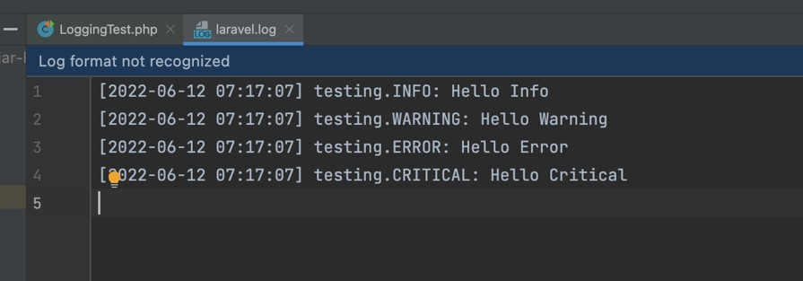
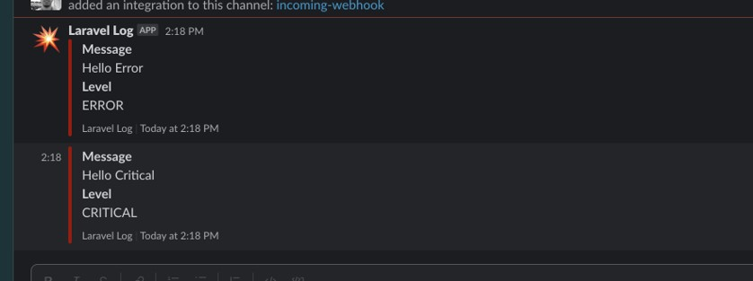
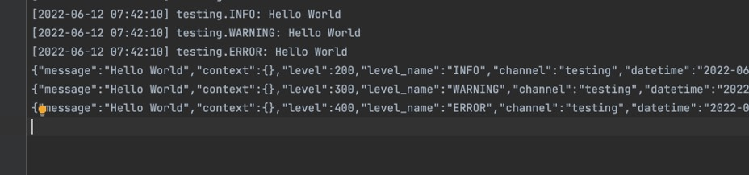

# Laravel Logging

## Sebelum Belajar

- Laravel Dasar
- PHP Logging

## Agenda

- Pengenalan Laravel Logging
- Logging Configuration
- Log Facade
- Context
- Handler
- Formatter
- Dan lain-lain

## #1 Pengenalan Laravel Logging

- Materi Logging sudah kita bahas tuntas di kelas PHP Logging
- Laravel sendiri tidak membuat fitur logging dari awal. Laravel menggunakan library monolog untuk melakukan logging
- Oleh karena itu wajib menyelesaikan kelas PHP Logging, karena di kelas ini kita tidak akan bahas lagi library Monolog
- Walaupun Laravel menggunakan library Monolog untuk melakukan logging, namun Laravel juga menambah fitur untuk mempermudah penggunaan library Monolog, sehingga kita tidak perlu melakukan konfigurasi secara manual

## #2 Membuat Project

- `composer create-project laravel/laravel=version nama-folder`
- <https://packagist.org/packages/laravel/laravel>

## #3 Logging Configuration

- Laravel secara default menggunakan file `config/logging.php` sebagai konfigurasi untuk logging nya
- Saat kita membuat project, secara default, sudah disediakan banyak sekali konfigurasi yang bisa kita gunakan, namun yang secara default aktif adalah yang sederhana

## #4 Logging Channel

- Laravel menyediakan beberapa channel (tujuan) log yang bisa kita gunakan, seperti :
- `single`, mengirim data log ke single file
- `daily`, mengirim data log ke single file, namun tiap hari akan di rotate file nya
- `slack`, mengirim data log ke slack chat
- `syslog`, mengirim data log ke syslog
- `null`, tidak mengirim data log kemanapun
- `stack`, mengirim data log ke beberapa channel sekaligus, default nya hanya mengirim ke channel single
- Secara default, Laravel akan menggunakan channel stack

## #5 Log Facade

- Untuk melakukan logging di Laravel, kita bisa dengan mudah menggunakan Log Facade
- kita tidak perlu manual membuat Logger Monolog lagi
- <https://laravel.com/api/9.x/Illuminate/Support/Facades/Log.html>

### Kode: Log Facade

```php
use Illuminate\Support\Facades\Log;
use Tests\TestCase;

class LoggingTest extends TestCase
{
	public function testLog()
	{
		Log::info("Hello Info");
		Log::warning("Hello Warning");
		Log::error("Hello Error");
		Log::critical("Hello Critical");

		self::assertTrue(true);
	}
}
```

### Kode: Hasil Log



## #6 Multiple Log Channel

- Seperti yang sudah kita bahas di materi Logging Configuration, kita bisa menggunakan stack untuk mengirim data log ke beberapa channel
- Contohnya, kita bisa mengirim log menggunakan stack channel ke single, stderr dan slack sekaligus

### Membuat Slack Webhook URL

- Untuk mengirim log ke slack, kita perlu membuat slack webhook URL terlebih dahulu
- <https://slack.com/apps/A0F7XDUAZ-incoming-webhooks>

### Kode: Logging Configuration

```php
'channels' => [
	'stack' => [
		'driver' => 'stack',
		'channels' => ['single', 'stderr', 'slack'],
		'ignore_exceptions' => false,
	],
]
```

### Hasil Slack



## #7 Context

- Kita tahu saat belajar di PHP Logging, di Monolog terdapat fitur bernama Context
- Itu juga bisa kita gunakan di Laravel Logging
- Log Facade memiliki parameter kedua setelah message yang bisa kita isi dengan data context, mirip seperti yang kita lakukan ketika belajar PHP Logging menggunakan Monolog

### Kode: Context

```php
public function testContext()
{
	Log::info("Hello Context", ['user' => 'khannedy']);

	self::assertTrue(true);
}
```

### With Context

- Atau, kita bisa gunakan function `withContext()`, yang secara otomatis kode selanjutnya akan menggunakan context yang kita gunakan dalam `withContext()`
- Ini sangat cocok ketika misal di Controller kita menambahkan `withContext()` berisi data user, sehingga di kode-kode selanjutnya, setiap log akan berisikan informasi siapa user yang melakukan proses logging tersebut

### Kode: With Context

```php
public function testWithContext()
{
	Log::withContext(['user' => "khannedy"]);

	Log::info("Hello Info");
	Log::warning("Hello Warning");

	self::assertTrue(true);
}
```

## #8 Selected Channel

- Secara default, Laravel akan menggunakan logging channel DEFAULT yang sudah dipilih
- Namun, pada kasus tertentu, kita mungkin ingin membuat channel, tapi hanya digunakan ketika kita mau gunakan
- Laravel juga memiliki fitur menseleksi channel yang ingin digunakan, sehingga sebelum kita kirim data log, kita bisa pilih channel mana yang akan kita gunakan
- Kita bisa menggunakan method `channel(string)`
- Return dari method `channel()` adalah Logger, sehingga kita harus menggunakan Logger tersebut untuk mengirim ke channel yang kita pilih

### Kode: Selected Channel

```php
public function testWithChannel()
{
	$slackLogger = Log::channel('slack');
	$slackLogger->error('Hello Slack');

	Log::info('Hello Laravel'); // mengirim ke default channel

	self::assertTrue(true);
}
```

## #9 Handler

- Saat menggunakan driver monolog, kita bisa menentukan attribute handler yang berisi class Monolog Handler
- Contoh sebelumnya terdapat driver single untuk menyimpan data log ke file, sebenarnya jika kita mau, kita bisa menggunakan driver monolog dan handler StreamHandler

### Kode: File Handler

```php
'file' => [
	'driver' => 'mongolog',
	'level' => ebv('LOG_LEVEL', 'debug'),
	'handler' => StreamHandler::class,
	'formatter' => env('LOG_STDERR_FORMATTER'),
	'with' => [
		'stream' => storage_path('logs/application.log'),
	],
]
```

### Kode: Test File Handler

```php
public function testFileHandler()
{
	$fileLogger = Log::channel('file');
	$fileLogger->info("Hello World");
	$fileLogger->warning("Hello World");
	$fileLogger->error("Hello World");

	self::assertTrue(true);
}
```

## #10 Formatter

- Saat kita menggunakan driver monolog, secara default akan menggunakan LineFormatter
- Pada kasus tertentu, misal kita ingin bentuk log dibuat dalam bentuk JSON misalnya
- Di Laravel, untuk melakukan itu, kita bisa gunakan config formatter dengan berisi class Formatter untuk monolog nya

### Kode: Formatter

```php
'file' => [
	'driver' => 'mongolog',
	'level' => ebv('LOG_LEVEL', 'debug'),
	'handler' => StreamHandler::class,
	'formatter' => \Monolog\Formatter\JsonFormatter::class,
	'with' => [
		'stream' => storage_path('logs/application.log'),
	],
]
```

### Kode: Hasil Log



## #11 Materi Selanjutnya

- Laravel Blade Template
- Laravel Database / Eloquent
- Laravel Validation
- Laravel Command
- Laravel HTTP Client
- Dan lain-lain
