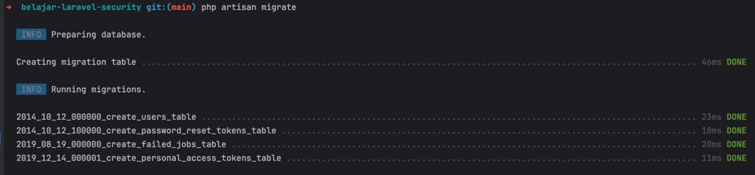
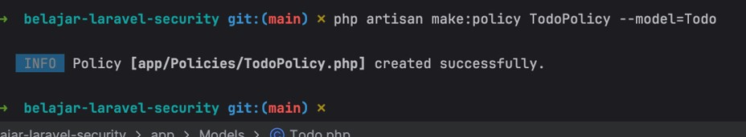

# Laravel Security

## Sebelum Belajar

- Kelas PHP dari Programmer Zaman Now
- Kelas MySQL dari Programmer Zaman Now
- Kelas Laravel Web
- Kelas Laravel Eloquent

## #1 Pengenalan Laravel Security

- Saat kita membuat web, salah satu fitur yang biasa ditambahkan adalah Security
- Misal untuk mengakses web nya, kita harus melakukan registrasi atau login terlebih dahulu
- Proses ini, kadang melakukan hal yang sama, dan selalu berulang-ulang
- Laravel memiliki fitur untuk menangani Web Security secara standar, sehingga kita tidak perlu melakukan implementasi secara manual lagi, kita bisa memanfaatkan fitur di Laravel, sehingga nanti tiap project akan melakukan gaya yang sama

### Laravel Security

- Laravel menyediakan fitur untuk melakukan proses Authentication dan Authorization
- Saat kita membuat aplikasi Laravel, kita lihat ada default model bernama User, model itu disediakan oleh Laravel sebagai default fitur untuk Security
- Pada kelas ini, kita akan bahas tuntas bagaimana menggunakan fitur Laravel Security

### Laravel Security Ecosystem

- Laravel menyediakan beberapa packages yang berhubungan dengan Authentication
- Defaultnya Laravel menggunakan Session (yang disimpan di Cookie) untuk menyimpan informasi Authentication. Di kelas ini, kita akan menggunakan default ini
- Laravel `Passport`, yaitu adalah OAuth 2 Authentication Provider, ini adalah package yang lumayan kompleks. Terutama ketika membuat web yang digunakan dari browser, mobile atau API. Di kelas ini tidak akan dibahas
- Larevel `Sanctum`, ini adalah package untuk Authentication yang lebih sederhana dibanding Laravel Passport. Package ini sangat direkomendasikan ketika membuat Project Laravel yang menggunakan SPA (Single Page Application)

## #2 Membuat Project

- `composer create-project laravel/laravel=v10.2.9 belajar-laravel-security`

## #3 User Model

- Saat kita membuat project Laravel, secara default terdapat model User
- User Model, digunakan sebagai Model untuk nanti kita melakukan Authentication
- Jika kita ingin mengubah informasi dari User Model, kita bisa mengubahnya sebelum menjalankan migration

### Kode: User Migration

```php
public function up(): void
{
	Schema::create('users', function (Blueprint $table) {
		$table->id();
		$table->string('name');
		$table->string('email')->unique();
		$table->timestamp('email_verified_at')->nullable();
		$table->string('password');
		$table->rememberToken();
		$table->timestamps();
	});
}
```

### Migrate

```sh
php artisa migrate
```



## #4 Laravel Breeze

- Laravel Breeze adalah fitur sederhana untuk membuat halaman proses authentication secara otomatis
- Laravel Breeze mendukung halaman registration, login, password reset, email verification, dan password confirmation
- Laravel Breeze membuat halamannya menggunakan Blaze Template, dan menggunakan library Tailwind CSS untuk library CSS nya
- Sebenarnya jika kita mau, kita bisa lakukan secara manual untuk membuat semua halaman proses authentication

### Menambah Laravel Breeze

- Saat dibuatnya video ini, versi terbaru Laravel Breeze adalah versi 1
- <https://packagist.org/packages/laravel/breeze>
- Kita bisa tambahkan library Laravel Breeze ke project laravel menggunakan perintah :
- `composer require laravel/breeze=v1.26.2 --dev`
- Setelah menambah Laravel Breeze, kita perlu install seluruh halaman authorization menggunakan perintah :
- `php artisan breeze:install`

## #5 Authentication

- Authentication adalah proses melakukan verifikasi apakah request dari User yang dikenali atau tidak
- Walaupun kita tahu bahwa data User disimpan di model User
- Namun untuk proses Authentication, kita tidak menggunakan langsung User Model, melainkan menggunakan Facade Auth

### Auth Facade Method

| Auth Facade Method                    | Keterangan                                   |
| ------------------------------------- | -------------------------------------------- |
| `Auth::attempt(credential, remember)` | Mencoba melakukan login dengan credential    |
| `Auth::login(credential)`             | Langsung melakukan login untuk credential    |
| `Auth::logout()`                      | Mengeluarkan user yang sedang login          |
| `Auth::user()`                        | Mendapatkan informasi user yang sedang login |

### Kode: User Seeder

```php
class UserSeeder extends Seeder
{
	public function run(): void
	{
		User::create([
			'name' => 'Eko Kurniawan',
			'email' => 'eko@example.com',
			'password' => Hash::make('rahasia'),
		]);
	}
}
```

### Kode: Auth Test

```php
public function testAuth()
{
	$this->seed(UserSeeder::class);
	$response = Auth::attempt([
		'email' => 'eko@example.com',
		'password' => 'rahasia',
	]);
	self::assertTrue($response);

	$user = Auth::user();
	self::assertNotNull($user);
	self::assertEquals('eko@example.com', $user->email);
}
```

## #6 User Session

- Saat kita menggunakan `Auth::login()`, secara otomatis data user akan disimpan di Session
- Kita bisa melakukan generate session agar informasi user disimpan di Cookie
- Saat kita menggunakan `Auth::attempt()`, jika sukses, secara otomatis `Auth::login()` juga akan dipanggil

### Kode: UserController

```php
class UserController extends Controller
{
	public function login(Request $request)
	{
		$response = Auth::attempt([
			'email' => $request->get('email', 'wrong'),
			'password' => $request->get('password', 'wrong'),
		], true);

		$session::regenerate();

		if ($response) {
			return redirect("/users/current");
		}

		return "Wrong credentials";
	}

	public function current()
	{
		$user = Auth::user();
		if ($user) {
			return "Hello $user->name";
		}

		return "Hello Guest";
	}
}
```

### Kode: Route

```php
Route::get('/users/login', [\App\Http\Controllers\UserController::class, 'login']);
Route::get('/users/current', [\App\Http\Controllers\UserController::class, 'current']);
```

### Kode: Session Test

```php
public function testLogin()
{
	$this->seed(UserSeeder::class);

	$this->get('/users/login?email=eko@example.com&password=rahasia')
		->assertRedirect('/users/current');

	$this->get('/users/login?email=wrong&password=wrong')
		->assertSeeText('Wrong credentials');
}

public function testCurrent()
{
	$this->seed(UserSeeder::class);

	$this->get('/users/current')
		->assertSeeText('Hello Guest');

	$user = User::where('email', 'eko@example.com')->first();
	$this->actingAs($user)
		->get('/users/current')
		->assertSeeText("Hello Eko Kurniawan");
}
```

## #7 Hash Facade

- Saat membuat password di User Model, kita menggunakan `Hash Facade`
- <https://laravel.com/api/10.x/Illuminate/Support/Facades/Hash.html>
- Hash Facade digunakan untuk membuat hash, dan juga digunakan untuk melakukan pengecekan hash
- Secara default, Hash di Laravel menggunakan algoritma `BCrypt`
- Saat kita menggunakan `Auth::attempt()`, kita tidak perlu melakukan hash password lagi, karena otomatis pengecekan hash nya dilakukan oleh Laravel
- Pengaturan hash bisa dilakukan di file `config/hashing.php`

### Kode: Hash Test

```php
class HashTest extends TestCase
{
	public function testHash()
	{
		$password = 'rahasia';
		$hash = Hash::make($password);

		$this->assertTrue(Hash::check($password, $hash));
	}
}
```

## #8 Auth Config

- Saat kita membuat project Laravel, Laravel akan menyimpan seluruh konfigurasi Auth di dalam file `config/auth.php`
- Kita bisa mengubah seluruh konfigurasi tentang Authentication di file tersebut

## #9 Authenticate Middleware

- Secara default, Laravel akan membuat sebuah middleware bernama `Authenticate`
- Middleware ini bisa digunakan untuk memastikan bahwa User sudah ter-autentikasi terlebih dahulu sebelum mengakses halaman yang ingin diakses
- Kita juga bisa menggunakan alias nya bernama auth
- Jika user belum melakukan autentikasi, Middleware akan mengembalikan error `AuthenticationException`, can secara default akan melakukan redirect ke route `"login"`

### Kode: Route

```php
Route::get('/users/login', [\App\Http\Controllers\UserController::class, 'login']);
Route::get('/users/current', [\App\Http\Controllers\UserController::class, 'current'])->middleware(['auth']);
```

### Kode: User Controller Test

```php
public function testCurrent()
{
	$this->seed(UserSeeder::class);

	$this->get('/users/current')
		->assertStatus(302)
		->assertRedirect('/login');

	$user = User::where('email', 'eko@example.com')->first();
	$this->actingAs($user)
		->get('/users/current')
		->assertSeeText('Hello Eko Kurniawan');
}
```

## #10 Guard

- Guard adalah bagaimana cara User di autentikasi untuk tiap request nya
- Secara default, di file `config/auth.php`, caranya adalah menggunakan session, artinya proses autentikasi akan dilakukan dengan cara mengecek Session
- Kadang, ada kasus kita ingin membuat Guard secara manual, contoh pada kasus kita ingin membuat API yang digunakan bukan untuk Web, misal kita ingin melakukan pengecekan melalui API-Key yang dikirim via header misalnya
- Ini pernah kita praktekan di materi Laravel RESTful API, namun kita masih lakukan secara manual menggunakan Middleware
- Sekarang, kita akan coba gunakan membuat Guard untuk melakukan autentikasi terhadap token API-Key

### Kode: Menambahkan Token di User Model

```php
public function up(): void
{
	Schema::table('users', function (Blueprint $table) {
		$table->string('token', 200);
	});

	/**
	 * Reverse the migrations.
	 */
	public function down(): void
	{
		Schema::table('users', function(Blueprint $table) {
			$table->dropColumn('token');
		});
	}
}
```

### Kode: User Seeder

```php
class UserSeeder extends Seeder
{
	public function run(): void
	{
		User::create([
			'name' => 'Eko Kurniawan',
			'email' => 'eko@example.com',
			'password' => Hash::make('rahasia'),
			'token' => 'secret',
		]);
	}
}
```

### Membuat Guard

- Untuk membuat Guard, kita bisa membuat class turunan dari `interface Guard`
- Dan saat menggunakan Guard, biasanya kita akan menggunakan `UserProvider`, untuk mendapatkan detail dari informasi User nya
- Setelah membuat guard, kita bisa registrasikan Guard yang telah kita buat di method `boot()` milik class `AuthServiceProvider`
- Jangan lupa untuk tambahkan ke `config/auth.php`

### Kode: Guard

```php
class TokenGuard implements Guard
{
	use GuardHelpers;

	private Request $request;

	public function __construct(UserProvider $provider, Request $request)
	{
		$this->request = $request;
		$this->setProvider($provider);
	}

	public function setRequest(Request $request): void
	{
		$this->request = $request;
	}

	public function user()
	{
		if ($this->user != null) {
			return $this->user;
		}

		$token = $this->request->header('API-Key');
		if ($token) {
			$this->user = $this->provider->retrieveByCredentials(['token' => $token]);
		}
		return $this->user;
	}

	public function validate(array $credentials = [])
	{
		return $this->provider->validateCredentials($this->user, $credentials);
	}
}
```

### Kode: Registrasi Guard

```php
Auth::extend('token', function (Application $app, string $name, array $config) {
	$guard = new TokenGuard(Auth::createUserProvider($config['provider']), $app->make(Request::class));
	$app->refresh('request', $guard, 'setRequest');
	return $guard;
});
```

```php
// config/auth.php
'guards' => [
	'token' => [
		'driver' => 'token',
		'provider' => 'users',
	],
	'web' => [
		'driver' => 'session',
		'provider' => 'users',
	],
]
```

### Kode: Menggunakan Guard

```php
Route::get('/users/login', [\App\Http\Controllers\UserController::class, 'login']);
Route::get('/users/current', [\App\Http\Controllers\UserController::class, 'current'])->middleware(['auth']);
Route::get('/api/users/current', [\App\Http\Controllers\UserController::class, 'current'])->middleware(['auth:token']);
```

### Kode: Unit Test Guard

```php
public function testGuard()
{
	$this->seed(UserSeeder::class);

	$this->get('/api/users/current', [
		'Accept' => 'application/json',
	])
		->assertStatus(401);

	$this->get('/api/users/current', [
		'API-Key' => 'secret',
	])
		->assertSeeText('Hello Eko Kurniawan');
}
```

## #11 User Provider

- Secara default, di `config/auth.php`, informasi User akan diambil menggunakan `EloquentUserProvider`
- User Provider menggunakan kontrak interface dari UserProvider
- <https://laravel.com/api/10.x/Illuminate/Contracts/Auth/UserProvider.html>
- Defaultnya, menggunakan `EloquentUserProvider`
- <https://laravel.com/api/10.x/Illuminate/Auth/EloquentUserProvider.html>
- Jika kita ingin membuat provider sendiri, kita harus membuat class implementasi dari UserProvider
- UserProvider biasanya digunakan oleh Guard untuk mengambil informasi User

### Kode: Simple User Provider

```php
class SimpleUserProvider implements UserProvider
{
	private GenericUser $user;

	public function __construct()
	{
		$this->user = new GenericUser([
			'id' => 'Khannedy',
			'name' => 'Khannedy',
			'token' => 'secret',
		]);
	}

	public function retrieveByCredentials(array $credentials)
	{
		if ($credentials['token'] == $this->user['token']) {
			return $this->user;
		}

		return null;
	}
}
```

### Kode: Auth Config

```php
Auth::provider('simple', function (Application $app, array $config) {
	return new SimpleUserProvider();
});
```

```php
// config/auth.php
'providers' => [
	'users' => [
		'driver' => 'eloquent',
		'modal' => App\Models\User::class,
	],
	'simple-provider' => [
		'driver' => 'simple',
	],
],

'guards' => [
	'simple-token' => [
		'driver' => 'token',
		'provider' => 'simple-provider',
	],
	'token' => [
		'driver' => 'token',
		'provider' => 'users',
	]
]
```

### Kode: Route

```php
Route::get('/simple-api/users/current', [\App\Http\Controllers\UserController::class, 'current'])
	->middleware(['auth:simple-token']);
```

### Kode: Test User Provider

```php
public function testUserProvider()
{
	$this->seed(UserSeeder::class);

	$this->get('/simple-api/users/current', [
		'Accept' => 'application/json',
	])
		->assertStatus(401);

	$this->get('/simple-api/users/current', [
		'API-Key' => 'secret',
	])
		->assertSeeText("Hello Khannedy");
}
```

## #12 Authorization

- Selain mempermudah proses Authentication, Laravel juga menyediakan cara agar mudah melakukan proses Authorization
- Authorization adalah proses pengecekan hak akses terhadap aksi
- User yang sudah berhasil melakukan autentikasi, belum tentu bisa melakukan aksi tertentu
- Contoh misal ada User yang hanya bisa melihat data, dan tidak bisa melakukan update dan hapus
- Hal ini dilakukan dengan menambahkan proses Authorization

### Authorization Action

- Laravel menggunakan dua cara untuk melakukan proses Authorization, Gates dan Policies
- Gates itu seperti Routes, simple dan berbasis closure
- Policies itu seperti Controller, kumpulan logic dalam model atau resource
- Diawal kita akan belajar menggunakan Gates, namun ketika membuat aplikasi Laravel yang bagus, sebaiknya menggunakan Policies

## #13 Gates

- Gates adalah closure sederhana untuk menentukan apakah user punya akses untuk aksi tertentu
- Definisi Gates biasanya disimpan dalam `boot()` `AuthServiceProvider`menggunakan Gate Facade
- <https://laravel.com/api/10.x/Illuminate/Support/Facades/Gate.html>

### Membuat Model Contact

- Misal, kita akan membuat model Contact, dimana Contact dimiliki oleh User
- Kita akan coba membuat Gate untuk menentukan apakah User bisa mengubah data Contact atau tidak

### Kode: Contact Migration

```php
public function up(): void
{
	Schema::create('contacts', function (Blueprint $table) {
		$table->id();
		$table->string('name', 100)->nullable(false);
		$table->string('email', 100)->nullable();
		$table->string('phone', 20)->nullable();
		$table->string('address', 200)->nullable();
		$table->unsignedBigInteger('user_id')->nullable(false);
		$table->foreign('user_id')->references('id')->on('users');
		$table->timestamps();
	});
}
```

### Kode: Contact Model

```php
class Contact extends Model
{
	protected $table = 'contacts';

	public function user(): BelongsTo
	{
		return $this->belongsTo(User::class, 'user_id', 'id', 'users');
	}
}
```

### Kode: User Model

```php
class User extends Authenticatable
{
	use HasApiTokens, HasFactory, Notifiable;

	public function contacts(): HasMany
	{
		return $this->hasMany(Contact::class, 'user_id', 'id');
	}
}
```

### Kode: Gate

```php
Gete::define('get-contact', function (User $user, Contact $contact) {
	return $user->id === $contact->user_id;
});
Gete::define('update-contact', function (User $user, Contact $contact) {
	return $user->id === $contact->user_id;
});
Gete::define('delete-contact', function (User $user, Contact $contact) {
	return $user->id === $contact->user_id;
});
```

### Mengecek Hak Akses

- Setelah meregistrasikan authorization menggunakan Gate, untuk mengecek apakah User punya akses atau tidak, kita bisa gunakan Gate Facade juga
- Kita bisa gunakan method `allows()`, yang mengembalikan true jika memang punya hak akses, atau false jika tidak punya hak akses

### Kode: Contact Seeder

```php
class ContactSeeder extends Seeder
{
	public function up(): void
	{
		$user = User::where('email', 'eko@example.com')->first();

		$contact = new Contact();
		$contact->name = 'Test Contact';
		$contact->email = 'test@example.com';
		$contact->user_id = $user->id;
		$contact->save();
	}
}
```

### Kode: Test Gate

```php
public function testGate()
{
	$this->seed([UserSeeder::class, ContactSeeder::class]);
	$user = User::where('email', 'eko@example.com')->first();
	Auth::login($user);

	$contact = Contact::where('email', 'test@example.com')->first();
	seld::assertTrue(Gate::allows('get-contact', $contact));
	seld::assertTrue(Gate::allows('update-contact', $contact));
	seld::assertTrue(Gate::allows('delete-contact', $contact));
}
```

## #14 Gate Facade

- Selain menggunakan method `allows()`, masih banyak yang bisa kita gunakan untuk melakukan proses authorization menggunakan Gate Facade

### Gate Facade Method

| Gate Facade Method                 | Keterangan                                                                      |
| ---------------------------------- | ------------------------------------------------------------------------------- |
| `Gate::allows(route, resource)`    | Mengecek apakah user diperbolehkan                                              |
| `Gate::denies(route, resource)`    | Mengecek apakah user tidak diperbolehkan                                        |
| `Gate::any(route, resource)`       | Mengecek apakah user diperbolehkan di salah satu role                           |
| `Gate::none(route, resource)`      | Mengecek apakah user tidak diperbolehkan di semua role                          |
| `Gate::authorize(route, resource)` | Jika user tidak diperbolehkan, akan terjadi error `AuthorizationException(403)` |

### Kode: Gate Test

```php
public function testGateMethod()
{
	$this->seed([UserSeeder::class, ContactSeeder::class]);
	$user = User::where('email', 'eko@example.com')->first();
	Auth::login($user);

	$contact = Contact::where('email', 'eko@example.com')->first();
	self::assertTrue(Gate::any(['get-contact', 'delete-contact', 'update-contact'], $contact));
	self::assertFalse(Gate::none(['get-contact', 'delete-contact', 'update-contact'], $contact));
}
```

### Gate untuk User Non Login

- Semua Gate Method secara default akan mendeteksi user dari user yang sedang login
- Bagaimana jika kasusnya, kita perlu mengecek akses user langsung, tanpa harus login?
- Kita bisa menggunakan method `Gate::forUser(user)` yang mengembalikan Gate baru, dimana Gate baru tersebut akan menggunakan user yang sudah dipilih untuk mengecek authorization nya

### Kode: Gate User

```php
public function testUser()
{
	$this->seed([UserSeeder::class, ContactSeeder::class]);

	$user = User::where('email', 'eko@example.com')->first();
	$gate = Gate::forUser($user);

	$contact = Contact::where('email', 'test@example.com')->first();
	self::assertTrue($gate->allows('get-contact', $contact));
	self::assertTrue($gate->allows('update-contact', $contact));
	self::assertTrue($gate->allows('delete-contact', $contact));
}
```

## #15 Gate Response

- Sebelumnya kita selalu menggunakan return boolean dalam Gate
- Kadang-kadang, kita ingin mengembalikan detail seperti pesan error misalnya
- Gate juga bisa mengembalikan data Response
- <https://laravel.com/api/10.x/Illuminate/Auth/Access/Response.html>
- Namun walaupun kita mengembalikan Response, tetap method untuk pengecekan seperti `allows()` atau `denies()` tetap akan mengembalikan boolean
- Jika kita ingin mendapatkan detail Response aslinya, kita bisa gunakan method `Gate::inspect()`

### Kode: Gate Response

```php
Get::define('create-contact', function (User $user) {
	if ($user->name == 'admin') {
		return Response::allow();
	}
	return Response:;deny('You are not admin');
});
```

### Kode: Test Gate Response

```php
public function testGateResponse()
{
	$this->seed([UserSeeder::class, ContactSeeder::class]);

	$user = User::where('email', 'eko@example.com')->first();
	Auth::login($user);

	$response = Gate::inspect('create-contact');
	self::assertFalse($response->allowed());
	self::assertEquals('You are not admin', $response->message());
}
```

## #16 Policies

- Policies adalah class yang berisikan authorization logic terhadap model atau resource
- Menggunakan Policies akan lebih rapi dibanding menggunakan Gate
- Kita bisa membuat policy menggunakan perintah :
- `php artisan make:policy NamaPolicy`
- Atau jika ingin membuat policy untuk sebuah Model, kita bisa gunakan perintah :
- `php artisan make:policy NamaPolicy --model=NamaModel`
- Setelah selesai membuat Policy, kita harus meregistrasikan Policy tersebut ke AuthServiceProvider pada bagian attribute policies

### Kode: Todo Migration

```php
public function up(): void
{
	$schema::create('todos', function (Blueprint $table) {
		$table->id();
		$table->string('title', 100)->nullable(false);
		$table->string('description', 200)->nullable();
		$table->unsignedBigInteger('user_id')->nullable(false);
		$table->softDeletes();
		$table->timestamps();
		$table->forign('user_id')->references('id')->on('users');
	});
}
```

### Kode: Todo Model

```php
class Todo extends Model
{
	use SoftDeletes;

	protected $table = 'todos';

	public function user(): BelongsTo
	{
		return $this->belongsTo(User::class, 'user_id', 'id', 'users');
	}
}
```

### Kode: Membuat Policy

```sh
php artisan make:policy TodoPolicy -model=Todo
```



### Kode: Registrasi Policy

```php
class AuthServiceProvider extends ServiceProvider
{
	/**
	 * The model to policy mappings for the application.
	 *
	 * @var array<class-string, class-string>
	 */
	protected $policies = [
		Todo::class => TodoPolicy::class,
	];
}
```

### Kode: Todo Seeder

```php
class TodoSeeder extends Seeder
{
	public function run(): void
	{
		$user = User::where('email', 'eko@example.com')->first();

		$todo = new Todo();
		$todo->title = "Test Todo";
		$todo->description = "Test Todo Description";
		$todo->user_id = $user->id;
		$todo->save();
	}
}
```

### Kode: Policy Test

```php
public function testPolicy()
{
	$this->seed([UserSeeder::class, TodoSeeder::class]);
	$user = User::where('email', 'eko@example.com')->first();
	Auth::login($user);

	$todo = Todo::first();
	self::assertTrue(Gate::allows('view', $todo));
	self::assertTrue(Gate::allows('update', $todo));
	self::assertTrue(Gate::allows('delete', $todo));
	self::assertTrue(Gate::allows('create', Todo::class));
}
```

## #17 Authorizable

- Saat Laravel membuat User Model, secara default dia akan menggunakan trait Authorizable
- <https://laravel.com/api/10.x/Illuminate/Foundation/Auth/Access/Authorizable.html>
- Trait ini digunakan sebagai shortcut untuk melakukan pengecekan authorization menggunakan method-method yang tersedia
- Dengan begitu, kita tidak perlu lagi melakukan pengecekan menggunakan Gate Facade

### Kode: Authorizable Test

```php
public function testAuthorizable()
{
	$this->seed([UserSeeder::class, TodoSeeder::class]);
	$user = User::where('email', 'eko@example.com')->first();
	Auth::login($user);

	$todo = Todo::first();
	self::assertTrue($user->can('view', $todo));
	self::assertTrue($user->can('update', $todo));
	self::assertTrue($user->can('delete', $todo));
	self::assertTrue($user->can('create', Todo::class));
}
```

## #18 Authorize Request

- Selain menggunakan Gate dan Authorizable, untuk melakukan pengecekan authorization, kita juga bisa menggunakan trait AuthorizesRequests
- <https://laravel.com/api/10.x/Illuminate/Foundation/Auth/Access/AuthorizesRequests.html>
- Secara default, saat membuat Controller, Controller akan menggunakan trait AuthorizesRequests

### Kode: Todo Controller

```php
class TodoController extends Controller
{
	public function ceate(Request $request): JsonResponse
	{
		$this->authorize('create', Todo::class);

		return response()->json([
			'message' => 'success',
		]);
	}
}
```

### Kode: Todo Route

```php
Route::post('/api/todo', [\App\Http\Controllers\TodoController::class 'create']);

Route::get('/users/login', [\App\Http\Controllers\UserController::class 'login']);
Route::get('/users/current', [\App\Http\Controllers\UserController::class 'current'])->middleware(['auth']);
Route::get('/api/users/current', [\App\Http\Controllers\UserController::class 'current'])->middleware(['auth:token']);
```

### Kode: Todo Controller Test

```php
public function testContoller()
{
	$this->seed([UserSeeder::class, TodoSeeder::class]);

	$this->post('/api/todo')
		->asssertStatus(403);

	$user = User::where('email', 'eko@example.com')->firstOrFail();
	$this->actingAs($user)->post('/api/todo')
		->assertStatus(200);
}
```

## #19 Blade Template

- Jika kita ingin melakukan pengecekan authorization di Blade Template, itu juga bisa dilakukan menggunakan `@can` `@cannot` dan `@canany`

### Kode: Todo Template

```html
<table>
	@foreach($todo as $todo)
	<tr>
		<td>{$todo->title}</td>
		<td>
			@can('update', $todo) Edit @else No Edit @endcan @can('delete', $todo)
			Delete @else No Delete @endcan
		</td>
	</tr>
	@endforeach
</table>
```

### Kode: Test User

```php
public function testView()
{
	$this->seed([UserSeeder::class, TodoSeeder::class]);
	$user = User::where('email', 'eko@example.com')->firstOrFail();
	Auth::login($user);

	$todos = Todo::query()->get();

	$this->view('todo', [
		'todos' => $todos,
	])->assertDontSeeText('No Edit')
		->assertSeeText('Edit');
		->assertDontSeeText('No Delete');
		->assertSeeText('Delete');
}
```

### Kode: Test Guest

```php
public function testViewGuest()
{
	$this->seed([UserSeeder::class, TodoSeeder::class]);
	$todo = todo::query()->get();

	$this->view('todo', [
		'todos' => $todos,
	])->assertSeeText('No Edit')
		->assertSeeText('No Delete');
}
```

## #20 Guest Access

- Secara default, jika Gate atau Policy tidak mendeteksi adanya User, secara otomatis akan mengembalikan false
- Namun, kadang-kadang ada kasus beberapa aksi ingin diperbolehkan Guest (bukan User)
- Kita bisa menjadikan parameter User pada Gate / Policy menjadi optional
- Contoh kita akan buat UserPolicy, dimana diperbolehkan Guest untuk membuat/registrasi User baru

### Kode: User Policy

```php
class UserPolicy
{
	public function create(?User $user): bool
	{
		return $user == null;
	}
}
```

### Kode: Registrasi Policy

```php
class AuthServiceProvider extends ServiceProvider
{
	protected $policies = [
		User::class => UserPolicy::class,
		Todo::class => TodoPolicy::class,
	];
}
```

### Kode: Test Guest Access

```php
public function testRegistrationGuest()
{
	self::assertTrue(Gate::allows('create', User::class));
}

public function testRegistrationUser()
{
	$this->seed([UserSeeder::class]);
	$user = User::where('email', 'eko@example.com')->firstOrFail();
	Auth::login($user);

	self::assertFalse(Gate::allows('create', User::class));
}
```

## #21 Before dan After

- Gate dan Policy memiliki fitur bernama Before dan After yang akan dieksekusi sebelum dan setelah sebuah Gate / Policy dieksekusi
- Jika Before mengembalikan hasil boolean, maka eksekusi akan dihentikan, dan langsung dikembalikan sebagai hasil proses authorization
- After akan dieksekusi paling akhir, dan bisa digunakan untuk mengubah hasil dari authorization Gate / Policy sebelumnya

### Proses Eksekusi Gate / Policy

```
before(user, rule)

// jika before menhgembalikan result, proses dihentikan

gate(user, resource) / policy (user, resource)

after(user, rule, result, arguments)

// jika after mengembalikan result, maka hasil dari gate / policy diubah menjadi hasil dari after()
```

### Kode: Todo Policy

```php
class TodoPolicy
{
	public function before(User $user, string $ability)
	{
		if ($user->name == 'superadmin') {
			return true;
		}
	}
}
```

### Kode: Test Before

```php
public function testAdmin()
{
	$this->seed([UserSeeder::login, TodoSeeder::class]);
	$todo = Todo::first();

	$user = new User([
		'name' => 'superadmin',
		'email' => 'superadmin@example.com',
		'password' => Hash::make('rahasia'),
	]);

	self::assertTrue($user->can('view', $todo));
	self::assertTrue($user->can('update', $todo));
	self::assertTrue($user->can('delete', $todo));
}
```

## #22 Encryption

- Sebelumnya kita tahu bahwa Laravel menyimpan password dengan menggunakan Hash
- Selain Hash, di Laravel juga terdapat fitur Encryption untuk melakukan enkripsi
- Kita bisa menggunakan Crypt Facade untuk melakukan enkripsi dan dekripsi
- <https://laravel.com/api/10.x/Illuminate/Support/Facades/Crypt.html>

### Encryption Config

- Konfigurasi untuk Encryption di Laravel akan disimpan di file `config/app.php`
- Untuk melakukan Encryption, kita wajib menggunakan secret key, dimana defaultnya disimpan di `APP_KEY` environment variable

### Kode: Encryption Config

```php
'key' => env('APP_KEY')

'cipher' => 'AES-256-CBC',
```

### Kode: Encryption Test

```php
public function testEncrypt()
{
	$value = "Eko Kurniawan Khannedy";

	$encrypted = Crypt::encryptString($value);
	$decrypted = Crypt::decryptString($encrypted);

	self::assertEquals($value, $decrypted);
}
```

## #23 Penutup
