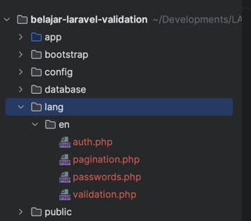

# Laravel Validation

## Sebelum Belajar

- Kelas PHP dari Programmer Zaman Now
- Kelas MySQL dari Programmer Zaman Now
- Laravel Eloquent

## #1 Pengenalan Laravel Validation

- Saat kita membuat aplikasi, sudah dipastikan bahwa kita akan selalu menambahkan validasi terhadap data yang diterima oleh aplikasi
- Di database, saat membuat tabel pun, biasanya kita menambahkan validasi, misal kolom yang tidak boleh null, atau unique, atau menambahkan check constraint
- Validasi adalah proses yang dilakukan untuk menjaga agar data di aplikasi kita tetap konsisten dan baik
- Tanpa validasi, data di aplikasi bisa rusak dan tidak konsisten

### Manual Validation

- Saat kita menggunakan Laravel, validasi secara manual sangat tidak direkomendasikan
- Misal melakukan pengecekan apakah input data berisi string kosong, atau apakah input data berupa angka, tanggal, dan lain-lain
- Hal ini bisa saja kita lakukan secara manual, dan lakukan pengecekan menggunakan if statement
- Namun, hal ini tidak direkomendasikan
- Untungnya, Laravel menyediakan fitur untuk melakukan Validasi

### Laravel Validation

- Laravel menyediakan fitur untuk melakukan validasi menggunakan Class bernama Validator
- <https://laravel.com/api/10.x/Illuminate/Validation/Validator.html>
- Di kelas ini, kita akan fokus membahas bagaimana cara menggunakan Laravel Validation, untuk mempermudah melakukan validasi data yang diterima oleh aplikasi Laravel kita

## #2 Membuat Project

- `composer create-project laravel/laravel=v10.2.4 belajar-laravel-validation`

## #3 Validator

- Validator adalah class sebagai representasi untuk melakukan validasi di Laravel
- <https://laravel.com/api/10.x/Illuminate/Validation/Validator.html>
- Ada banyak sekali fitur yang dimiliki oleh class Validator, dan kita akan bahas secara bertahap

### Membuat Validator

- Untuk membuat Validator, kita bisa menggunakan static method di Facade `Validator::make()`
- <https://laravel.com/api/10.x/Illuminate/Support/Facades/Validator.html>
- Saat membuat Validator, kita harus tentukan data yang akan divalidasi, dan rules (aturan-aturan validasi)

### Kode: Membuat Validator

```php
$data = [
	'username' => 'admin',
	'password' => '123456',
];

$rules = [
	'username' => 'required',
	'password' => 'required',
];

$validator = Validator::make($data, $rules);
```

## #4 Menjalankan Validasi

- Setelah kita membuat Validator, selanjutnya yang biasa kita lakukan adalah mengecek apakah validasi sukses atau gagal
- Untuk melakukan itu, kita bisa menggunakan dua method yang mengembalikan nilai boolean
- `fails()`, akan mengembalikan true jika gagal, `false` jika sukses
- `passes()`, akan mengembalikan true jika sukses, `false` jika gagal

### Kode: Menjalankan Validasi

```php
$validator = Validator::make($data, $rules);

self::assertTrue($validator->passes());
self::assertFalse($validator->fails());
```

## #5 Error Message

- Saat kita melakukan validasi, kita perlu tahu key mana yang bermasalah, dan apa pesan error nya
- Kita bisa mendapatkan detail dari error menggunakan function `messages()`, `errors()`, atau `getMessageBag()`, yang semuanya akan mengembalikan object sama yaitu class `MessageBag`
- <https://laravel.com/api/10.x/Illuminate/Support/MessageBag.html>

### Kode: Error Message

```php
$validator = Validator::make($data, $rules);

self::assertFalse($validator->fails());
$message = $validator->getMessageBag();

Log::info($message->toJson(JSON_PRETTY_PRINT));
```

## #6 Validation Exception

- Pada beberapa kasus, kadang-kadang kita ingin menggunakan Exception ketika melakukan validasi
- Jika data tidak valid, maka harapan kita terjadi exception
- Validator juga menyediakan fitur ini, dengan menggunakan method `validated()`
- Saat kita memanggil method `validated()`, jika data tidak valid, maka akan `throw ValidationException`
- Untuk mendapatkan detail informasi validator dan error message, bisa kita ambil dari ValidationException
- <https://laravel.com/api/10.x/Illuminate/Validation/ValidationException.html>

### Kode: Validation Exception

```php
$validator = Validator::make($data, $rules);

try {
	$validator->validate();
	self::fail("ValidationException not thrown");
} catch (ValidationException $exception) {
	self::assertNotNull($exception->validator);
	$message = $exception->validator->errors();
	Log::info($message->toJSON(JSON_PRETTY_PRINT));
}
```

## #7 Validation Rules

- Salah satu keuntungan menggunakan Laravel Validator, yaitu sudah disediakan aturan-aturan yang bisa kita gunakan untuk melakukan validasi
- Kita bisa lihat di halaman dokumentasi untuk melihat detail dari aturan-aturan yang sudah disediakan di Laravel untuk validasi
- <https://laravel.com/docs/10.x/validation#available-validation-rules>
- Bagaimana jika aturan yang kita butuhkan tidak ada? Kita juga bisa membuat aturan sendiri, yang akan dibahas di materi terpisah

### Multiple Rules

- Saat kita membuat validasi, biasanya dalam satu attribute, kita sering menggunakan beberapa aturan
- Misal untuk username, kita ingin menggunakan aturan wajib diisi, harus email, dan panjang tidak boleh lebih dari 100 karakter
- Untuk menggunakan multiple Rules, kita bisa menggunakan tanda `|` (pagar), atau menggunakan tipe data array

### Kode: Validation Rules

```php
$data = [
	'username' => 'admin',
	'password' => 'rahasia',
];

$rules = [
	'username' => 'required|email|max:100',
	'password' => ['required', 'min:6', 'max:20'],
];

$validator = Validator::make($data, $rules);

self::assertTrue($validator->fails());
Log::info($validator->errors()->toJson(JSON_PRETTY_PRINT));
```

## #8 Valid Data

- Laravel Validator bisa mengembalikan data yang berisikan hanya attribute yang di validasi
- Hal ini sangat cocok ketika kita memang tidak ingin menggunakan attribute yang tidak di validasi
- Untuk mendapatkan data tersebut, kita bisa menggunakan return value `validated()`

### Kode: Valid Data

```php
$data = [
	'username' => 'admin',
	'password' => 'rahasia',
];
$rules = [
	'username' => 'required|email|max:100',
	'password' => 'required|min:6|max:20',
];
$validator = Validator::make($data, $rules);
try {
	$result = $validator->validate();
	self::assertNotNull($result);
	Log::info(json_encode($request, JSON_PRETTY_PRINT));
} catch (ValidationException $exception) {
	self::fail($exception->getMessage());
}
```

### Validation Message

- Setiap Rule di Laravel Validator, memiliki validation message
- Secara default, message-nya menggunakan bahasa Inggris, namun kita bisa mengubahnya jika kita mau
- Semua message di Laravel akan disimpan di dalam folder `lang/{locale}/`
- Jika belum ada folder dan file nya, kita bisa gunakan perintah dibawah ini untuk membuat default message :
- `php artisan lang:publish`
- Validation message, terdapat di file `validation.php`

### Gambar: Message



### Custom Message untuk Attribute

- Kadang, pada beberapa kasus, kita tidak ingin menggunakan default message saat melakukan validasi
- Kita bisa menambah Custom Message untuk Attribute, di file `validation.php`

### Kode: Custom Message for Attribute

```
'custom' => [
	'username' => [
			'email' => 'We only accept email addresses for usernames.'
	]
]
```

### Localization

- Message di Laravel, mendukung multi bahasa
- Caranya kita cukup membuat folder dengan kode locale pada folder `lang`, dan buat file php validation yang berisi attribute sama
- Kita bisa mengubah nilai message nya, sesuai dengan bahasanya
- Untuk mengaktifkan bahasa yang ingin kita gunakan, kita bisa gunakan Facade `App::setLocale()`
- Jika locale yang kita pilih tidak tersedia, maka secara otomatis akan menggunakan default locale

### Kode: Localization

```php
App::setLocale("id");
$data = [
	'username' => 'admin',
	'password' => 'rahasia',
];
$rules = [
	'username' => 'required|email|max:100',
	'password' => 'required|min:6|max:20',
];
$validator = Validator::make($data, $rules);
```

### Inline Message

- Kadang, mengubah message file di folder lang mungkin terlalu ribet
- Kita bisa menambahkan message pada parameter ketiga saat membuat Validator menggunakan `Validator::make(data, rules, messages)`
- Secara otomatis, Validator akan mengambil message yang terdapat parameter messages, dan jika tidak ada, maka akan mengambil dari folder lang

### Kode: Inline Message

```php
$messages = [
	'required' => ':attribute harus diisi',
	'email' => ':attribute harus berupa email',
	'max' => ':attribute maksimal :max karakter',
	'min' => ':attribute minimal :min karakter',
];
$validator = Validator::make($data, $rules, $messages);

self::assertTrue($validator->fails());
Log::info($validator->errors()->toJson(JSON_PRETTY_PRINT));
```

## #9 Additional Validation

- Saat kita selesai melakukan validasi, kadang kita ingin melakukan validasi tambahan
- Pada kasus seperti ini, kita bisa menggunakan method `after(callback)`, dimana kita bisa menambahkan function callback sebagai parameter
- Function callback nya terdapat satu parameter yaitu Validator, sehingga kita bisa menambah error tambahan jika dibutuhkan

### Kode: Additional Validation

```php
$rules = [
	'username' => 'required|email|max:100',
	'password' => 'required|min:6|max:20',
];
$validator = Validator::make($data, $rules);
$validator->after(function (\Illuminate\Validation\Validator $validator) {
	$data = $validator->getData();
	if ($data['username'] == $data['password']) {
		$validator->errors()->add('password', 'Password tidak boleh sama dengan username');
	}
});
```

## #10 Custom Rule

- Walaupun Rule di Laravel sudah tersedia banyak
- Kadang, pada beberapa kasus, kita perlu membuat Custom Rule sendiri
- Misal untuk mengecek data ke database, dan lain-lain
- Untuk membuat rule, kita bisa menggunakan perintah :
- `php artisan make:rule NamaRule`

### Kode: Membuat Rule

```sh
php artisan make:rule Uppercase
```

### Kode: Uppercase Rule

```php
class Uppercase implements ValidationRule
{
	public function validate(string $attribute, mixed $value, Closure $fail): void
	{
		if ($value !== strtoupper($value)) {
			$fail("The $attribute must be UPPERCASE.");
		}
	}
}
```

### Kode: Menggunakan Custom Rule

```php
$data = [
	'username' => 'admin@pzn.com',
	'password' => 'rahasia',
];
$rules = [
	'username' => ['required', 'email', 'max:100', new Uppercase()],
	'password' => 'required|min:6|max:20',
];
$validator = Validator::make($data, $rules);

self::assertTrue($validator->fails());
Log::info($validator->errors()->toJson(JSON_PRETTY_PRINT));
```

### Translation

- Saat membuat Custom Rule, di function validate terdapat parameter ke-3 berupa Closure
- Closure tersebut jika dipanggil, maka akan mengembalikan object PotentiallyTranslatedString
- <https://laravel.com/api/10.x/Illuminate/Translation/PotentiallyTranslatedString.html>
- Dengan Class itu, kita bisa membuat translation

### Kode: Uppercase Rule

```php
class Uppercase implements ValidationRule
{
	public function validate(string $attribute, mixed $value, Closure $fail): void
	{
		if ($value !== strtoupper($value)) {
			$fail("validation.custom.uppercase")->translate([
				'attribute' => $attribute,
				'value' => $value,
			]);
		}
	}
}
```

### Kode: Validation Message

```
'url' => 'The :attribute field must be a valid URL.',
'ulid' => 'The :attribute field must be a valid ULID.',
'uuid' => 'The :attribute field must be a valid UUID.',
'custom.uppercase' => 'The :attribute with value :value must UPPERCASE.',
```

### Data Aware dan Validator Aware

- Saat kita membutuhkan Custom Rule yang membutuhkan bisa melihat seluruh data yang di validasi, kita bisa implement `interface DataAwareRule`
- Dan jika kita butuh object Validator, kita bisa implement `interface ValidatorAwareRule`

### Kode: Membuat Rule Registration

```sh
php artisan make:rule RegistrationRule
```

### Kode: Registration Rule

```php
class RegistrationRule implements ValidationRule, DataAwareRule, ValidatorAwareRule
{
	private array $data;
	private Validator $validator;

	public function setData(array $data): RegistrationRule
	{
		$this->data = $data;
		return $this;
	}

	public function setValidator(Validator $validator): RegistrationRule
	{
		$this->validator = $validator;
		return $this;
	}

	public function validate(string $attribute, mixed $value, Closure $fail): void
	{
		if ($this->data['username'] == $value) {
			$fail("$attribute must be different with username");
		}
	}
}
```

### Kode: Menggunakan Registration Rule

```php
$data = [
	'username' => 'admin@pzn.com',
	'password' => 'admin@pzn.com',
];
$rules = [
	'username' => ['required', 'email', 'max:100', new Uppercase()],
	'password' => ['required', 'min:6', 'max:20', new RegistrationRule()],
];
$validator = Validator::make($data, $rules);

self::assertTrue($validator->fails());
Log::info($validator->errors()->toJson(JSON_PRETTY_PRINT));
```

## #11 Custom Function Rule

- Pada kasus kita perlu membuat Custom Rule, namun jika membuat Class Rule terlalu berlebihan, kita bisa menggunakan Custom Function Rule ketika membuat Rule
- Cukup gunakan Function dimana terdapat 3 parameter, `$attribute`, `$value` dan `$fail`

### Kode: Custom Function Rule

```php
$data = [
	'username' => 'admin@pzn.com',
	'password' => 'admin@pzn.com',
];
$rules = [
	'username' =. ['required', 'email', 'max:100', function(string $attribute, string $value, Closure $fail) {
		if (strtoupper($value) !+ $value) {
			$fail("The $attribute must be uppercase");
		}
	}],
	'password' => ['required', 'min:6', 'max:20', new RegistrationRule()],
];
$validator = Validator::make($data, $rules);

self::assertTrue($validator->fails());
Log::info($validator->errors()->toJson(JSON_PRETTY_PRINT));
```

## #12 Rule Classes

- Selain Rule-Rule yang kita lihat di halaman dokumentasi Laravel
- Laravel juga menyediakan beberapa class Rule yang bisa kita gunakan ketika membuat Validator
- Kita bisa lihat daftar class-class Rule yang tersedia di package Rules
- <https://laravel.com/api/10.x/Illuminate/Validation/Rules.html>

### Kode: Rule Class

```php
$data = [
	'username' => 'admin@pzn.com',
	'password' => 'admin@pzn.com',
];
$rules = [
	'username' =. ['required', new In(['Eko', "Budi", "Joko"])],
	'password' => ['required', Password::min(6)->letters()->numbers()->symbols()],
];
$validator = Validator::make($data, $rules);

self::assertTrue($validator->fails());
Log::info($validator->errors()->toJson(JSON_PRETTY_PRINT));
```

## #13 Nested Array Validation

- Saat kita melakukan validasi, kadang data yang kita validasi tidak hanya berformat key-value
- Kadang terdapat nested array, misal terdapat key address, dimana di dalamnya berisi array lagi
- Pada kasus data jenis nested array, kita bisa membuat Rule menggunakan tanda `.` (titik), misal `address.street`, `address.city`, dan lain-lain
- Jika masih terdapat nested array, kita bisa tambahkan `.` (titik) lagi

### Kode: Nested Array Validation

```php
$data = [
	'name' => [
		'first' => 'Eko',
		'last' => 'Kurniawan',
	],
	'address' => [
		'street' => 'Jl. Mangga',
		'city' => 'Jakarta',
		'country' => 'Indonesia'
	]
];
$rules = [
	'name.first' => ['required', 'max:100'],
	'name.last' => ['max:100'],
	'address.street' => ['max:200'],
	'address.city' => ['required', 'max:100'],
	'address.country' => ['required', 'max:100'],
];

$validator = Validator::make($data, $rules);
self::assertTrue($validator->passes());
```

### Indexed Array Validation

- Pada beberapa kasus, misal nested array nya adalah indexed, artinya bisa lebih dari satu
- Pada kasus ini, kita tidak menggunakan `.` (titik), melainkan menggunakan `*` (bintang)

### Kode: Indexed Array Validation

```php
$data = [
	'name' => [
		'first' => 'Eko',
		'last' => 'Kurniawan',
	],
	'address' => [
		[
			'street' => 'Jl. Mangga',
			'city' => 'Jakarta',
			'country' => 'Indonesia'
		],
		[
			'street' => 'Jl. Mangga',
			'city' => 'Jakarta',
			'country' => 'Indonesia'
		]
	]
];

$rules = [
	'name.first' => ['required', 'max:100'],
	'name.last' => ['max:100'],
	'address.*.street' => ['max:200'],
	'address.*.city' => ['required', 'max:100'],
	'address.*.country' => ['required', 'max:100'],
];

$validator = Validator::make($data, $rules);
self::assertTrue($validator->passes());
```

## #14 HTTP Request Validation

- Laravel Validator sudah terintegrasi dengan baik dengan HTTP Request di Laravel
- Class Request memiliki method `validate()` untuk melakukan validasi data request yang dikirim oleh User, misal dari Form atau Query Parameter
- <https://laravel.com/api/10.x/Illuminate/Http/Request.html#method_validate>

### Kode: Membuat Controller

```sh
php artisan make:controller FormController
```

### Kode: Form Controller

```php
class FormController extends Controller
{
	public function login(Request $request): Response
	{
		try {
			$data = $request->validate([
				'username' => 'required',
				'password' => 'required',
			]);
			// do something with $data
			return response("OK", Response::HTTP_OK);
		} catch (ValidationException $exception) {
			return response($exception->errors(), Response::HTTP_BAD_REQUEST);
		}
	}
}
```

### Kode: Web Routing

```php
Route::get('/', function() {
	return view('welcome');
});

Route::post('/form/login', [\App\Http\Controllers\FormController::class, 'login']);
```

### Kode: Test Request Validation

```php
public function testLoginFailed(): void
{
	$response = $this->post('/form/login', [
		'username' => '',
		'password' => '',
	]);
	$response->assertStatus(400);
}

public function testLoginSuccess(): void
{
	$response = $this->post('/form/login', {
		'username' => 'admin',
		'password' => 'rahasia',
	});
	$response->assertStatus(200);
}
```

## #15 Error Page

- Saat kita membuat Web, dan menerima input data yang tidak valid, kadang kita ingin menampilkan error message di halaman web nya
- Kita bisa dengan mudah menampilkan error dari `MessageBag` di Laravel Blade Template
- Kita cukup menggunakan variable `$errors` di Blade Template
- <https://laravel.com/api/10.x/Illuminate/Support/MessageBag.html>

### Alur Validation Error di Web

- Saat kita membuat form, biasanya kita akan membuat dua halaman. Pertama `GET /form` untuk menampilkan form nya, dan `POST /form` untuk melakukan submit form nya
- Jika terjadi error ketika melakukan `POST /form`, dan terjadi error ValidationException, secara otomatis Laravel akan melakukan redirect ke halaman sebelumnya, yaitu `GET /form`
- Saat melakukan redirect kembali ke halaman `GET /form`, Laravel akan menyisipkan informasi sementara object error tersebut ke Session
- Middleware ShareErrorsFromSession akan mendeteksi errors tersebut dan melakukan sharing informasi ke View sehingga kita bisa dengan mudah menggunakan variable `$errors` di Blade Template

### Kode: Form Blade Template

```php
@if($errors->any())
	<ul>
		@foreach($errors->all() as $error)
			<li>{{$error}}</li>
		@endforeach
	</ul>
@endif

<form action="/form" method="post">
	@csrf
	<label>Username : <input type="text" name="username" /></label><br/>
	<label>Password : <input type="password" name="password" /></label><br/>
	<input type="submit" value="Login" />
</form>
```

### Kode: Login Controller

```php
public function form(): Response
{
	return response()->view('form');
}

public function submitForm(Request $request): Response
{
	$request->validate([
		'username' => 'required',
		'password' => 'required',
	]);
	// do something with $data
	resturn response('OK', Response::HTTP_OK);
}
```

### Kode: Test Error Page

```php
public function testFormSuccess(): void
{
	$response = $this->post('/form', [
		'username' => 'admin',
		'password' => 'rahasia',
	]);
	$response->assertStatus(200);
}

public function testFormError(): void
{
	$response = $this->post('/form', [
		'username' => '',
		'password' => '',
	]);
	$response->assertStatus(302);
}
```

## #16 Error Directive

- Selain menggunakan variable `$errors`, untuk mendapatkan error by key, kita pernah bahas di kelas Laravel Blade Template
- Kita bisa menggunakan directive `@error(key)`

### Kode: Error Directive

```php
<form action='/form' method="post">
	@csrf
	<label>Username : @error('username') {{$message}} @enderror
		<input type="text" name="username" /></label><br/>
	<label>Password : @error('password') {{$message}} @enderror
		<input type="password" name="password" /></label><br/>
	<input type="submit" value="Login" />
</form>
```

## #17 Repopulating Forms

- Saat kita melakukan submit form, lalu terjadi error validasi, kadang kita tidak ingin menghapus data sebelumnya yang sudah di input
- Untungnya, ketika terjadi ValidationException, Laravel menyimpan data yang dikirim ke Session juga sementara
- Kita bisa menggunakan method `old()` di Request, atau global function old di Blade template untuk mendapatkan data lama

### Kode: Repopulating Forms

```php
<form action='/form' method="post">
	@csrf
	<label>Username : @error('username') {{$message}} @enderror
		<input type="text" name="username" value="{{old('username')}}" /></label><br/>
	<label>Password : @error('password') {{$message}} @enderror
		<input type="password" name="password" value="{{old('password')}}" /></label><br/>
	<input type="submit" value="Login" />
</form>
```

## #18 Custom Request

- Saat kita membuat form request yang kompleks, ada baiknya kita membuat class sendiri untuk Form Request tersebut
- Salah satu kelebihannya dengan membuat form request sendiri, bisa diintegrasikan dengan Laravel Validator
- Hal ini membuat kode yang kita buat lebih rapi, karena data Request dan Validasi terpisah dari kode Controller

### Membuat Form Request

- Untuk membuat Form Request sendiri, kita bisa menggunakan perintah :
- `php artisan make:request NamaFormRequest`
- Walaupun namanya Form Request, namun sebenarnya kita tetap bisa menggunakannya ketika misal kita ingin menerima data dalam bentuk JSON misalnya

### Kode: Membuat Login Request

```sh
php artisan make:request LoginRequest
```

### FormRequest Class

- Form Request adalah class turunan dari FormRequest
- <https://laravel.com/api/10.x/Illuminate/Foundation/Http/FormRequest.html>
- Untuk menambahkan Rule untuk validasi, kita bisa menggunakan method `rules()`
- Untuk menambahkan Additional Validator setelah validasi, kita bisa gunakan method `after()`
- Jika ingin berhenti melakukan validasi, setelah terdapat satu attribute yang error, kita bisa gunakan property `$stopOnFirstFailure`
- Jika ingin mengubah halaman redirect ketika terjadi ValidationException, kita bisa gunakan property `$redirect (URL)` atau `$redirectRoute (Route)`
- Jika ingin menambahkan authentication sebelum melakukan Validasi, kita bisa menggunakan method `authorize()`
- Untuk mengubah default message, kita bisa menggunakan method `messages()`
- Untuk mengubah default nama attribute, kita bisa menggunakan method `attributes()`

### Kode: Login Request (1)

```php
class LoginRequest extends FormRequest
{
	public function rules(): array
	{
		return [
			'username' => ['required', 'email', 'max:100'],
			'password' => ['required', Password::min(6)->letters()->numbers()->symbols()],
		];
	}
}
```

### Kode: Form Controller

```php
class FormController extends Controller
{
	public function form(): Response
	{
		return response()->view('form');
	}

	public function submitForm(LoginRequest $request): Response
	{
		$data = $request->validated();
		// do something with $data
		return response('OK', Response::HTTP_OK);
	}
}
```

### Before dan After Validation

- Jika kita ingin melakukan sesuatu sebelum melakukan validasi, misal membersihkan data yang tidak dibutuhkan, kita bisa menggunakan method `prepareForValidation()`
- Sedangkan jika kita ingin melakukan sesuai sesudah validasi, kita bisa menggunakan method `passedValidation()`

### Kode: Before dan After Validation

```php
protected function prepareForValidation(): void
{
	$this->merge([
		'username' => strtoupper($this->input('username')),
	]);
}

protected function passedValidation(): void
{
	$this->merge([
		'password' => bcrypt($this->input('password')),
	]);
}
```

## #19 Materi Selanjutnya

- Laravel RESTful API
- Perbanyak studi kasus
- Fitur-Fitur Laravel Lainnya
