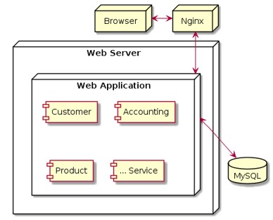
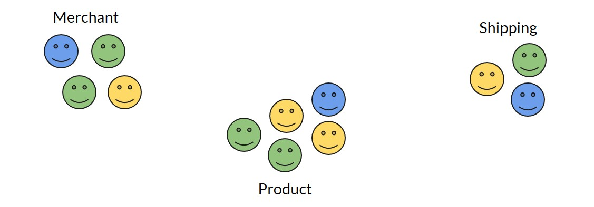
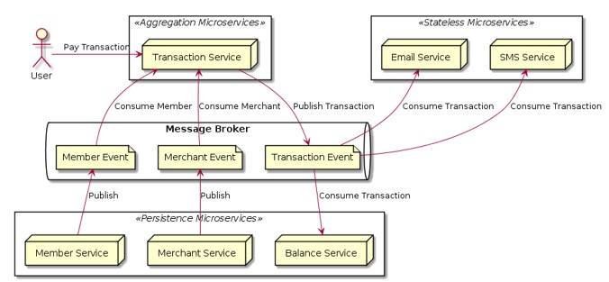

# Microservices

## #1 Intro

### Untuk Siapa Materi Ini?

- Web Programmer
- Backend Programmer
- Software Architect
- DevOps Engineer

### Fokus Materi Belajar Microservices

- Teori dan Konesp
- Contoh Kasus
- Tidak Spesifik ke Teknologi Tertentu

### Kenapa Perlu Belajar Microservices?

- Kekinian
- Ekosistem Pendukung
- Banyak Digunakan di Tech Company
- Sudah Jadi Pengetahuan Wajib untuk Senior Engineer

## #2 Arsitektur Monolith

### Apa itu Arsitektur Monolith?

- Single Deployment Unit
- Dimana semua fitur dibuat dalam sebuah aplikasi besar

### Arsitektur Monolith

## #3 Mulailah dari Aplikasi Monolith

### Kelebihan Arsitektur Monolith

- Mudah di Develop
- Mudah di Deploy
- Mudah di Test
- Mudah di Scale

### Masalah di Arsitektur Monolith

- Mengintimindasi Developer yang baru bergabung
- Scaling development dengan banyak Developer agak menyulitkan
- Butuh kontrak panjang dengan teknologi yang digunakan (bahasa pemrograman, database, dan lain-lain)
- Scaling pada bagian tertentu tidak bisa dilakukan
- Running app Monolith sangat berat

## #4 Arsitektur Microservices

### Apa itu Arsitektur Microservices

- Aplikasi-aplikasi kecil yang saling bekerja sama
- Fokus mengerjakan satu pekerjaan dengan baik
- Independent, dapat di deploy dan diubah tanpa tergantung dengan aplikasi lain
- Setiap komponen pada sistem dibuat dalam service
- Komunikasi antar service biasanya melalui network-call

### Arsitektur Microservices

### Kelebihan Arsitektur Microservices

- Mudah dimengerti, karena relative kecil ukuran service nya
- Lebih mudah di develop, di maintain, di test dan di deploy
- Lebih mudah bergonta-ganti teknologi
- Mudah di scale sesuai kebutuhan
- Bisa dikerjakan dalam tim-tim kecil

### Masalah di Arsitektur Microservices

- Distributed system
- Komunikasi antar service yang rawan error
- Testing interaksi antar service lebih sulit

### Pembagian Aplikasi Microservices

### Seberapa Kecil Aplikasi Microservices

- Single responsibility
- Sekecil mungkin sehingga bisa dimengerti oleh satu orang
- Bisa di kerjakan sejumlah X developer

### Monolith vs Microservices

**Monolith**

- Simplicity
- Consistency
- Easy to Refactor

**Microservices**

- Partial Deployment
- Availability
- Multiple Platform
- Easy to Scale

## 5 Database per Service

### Decentralized Database

### Kenapa harus Database per Service?

- Memastikan bahwa antar service tidak ketergantungan
- Tiap service bisa menggunakan aplikasi database sesuai dengan kebutuhan
- Service tidak perlu tahu kompleksitas internal database service lain

### Contoh Database per Service

## #6 Shared Database

### Kapan Harus Shared Database?

- Ketika melakukan transisi dari aplikasi Monolith ke Microservices
- Ketika bingung memecahkan data antar Service
- Ketika dikejar waktu, sehingga tidak ada waktu untuk bikin API

### Contoh Shared Database

## #7 NoSQL

### Apa itu NoSQL?

- NoSQL bukanlah NO (TIDAK/BUKAN) SQL
- NoSQL singkatan dari Not Only SQL

### Jenis-Jenis NoSQL

- Document Oriented Database
- Key-Value Database
- Column Families Database
- Graph Database
- Search Database
- Time Series Database
- Dan lain-lain

### Contoh NoSQL Database

- MongoDB: Document Oriented Database
- Elasticsearch: Search Database
- Redis: Key-Value Database
- Apache Cassandra: Column Families Database
- Neo4j: Graph Database
- InfluxDB: Time Series Database

### Kenapa Butuh Tahu NoSQL?

- Agar bisa disesuaikan dengan kebutuhan
- Bisa mencari alternatif cara mengelola data
- Mempercepat dalam proses penulisan atau pencarian

### Contoh Kasus

## #8 Remote Procedure Invocation

### Ketika Service butuh Data Service Lain

### Komunikasi Antar Service

- Idealnya komunikasi dilakukan melalui RPI (Remote Procedure Invocation) ata RPC (Remote Procedure Call)
- Tidak direkomendasikan komunikasi dilakukan via database

### Contoh Remote Procedure Invocation

- RESTful API (HTTP)
- gRPC
- Apache Thrift
- SOAP
- Java RMI
- Corba (Common Object Request Broker Architecture)
- dan lain-lain

### Ketika Service butuh Data Service lain

### Keuntungan Menggunakan RPI

- Sederhana dan Mudah
- Biasanya digunakan untuk komunikasi Request - Reply
- Biasanya digunakan untuk proses Sync (yang butuh menunggu jawaban)

## #9 Messaging

### Ketika Service butuh Data Service Lain

### Komunikasi Menggunakan RPI

### Masalah di Komunikasi RPI

- Proses lama (pada Email Service dan SMS Service)
- Mengirim data yang sama berkali-kali (pada Finance Service dan Report Service)
- Membuat Paralel Process sangat rumit

### Komunikasi dengan Cara Messaging

- Messaging biasanya digunakan untuk komunikasi Async
- Async artinya komunikasi dilkukan tanpa harus menunggu selesai di proses
- Dalam async, kadang tidak perlu peduli balasan dari service yang dituju
- Biasanya komunikasi Messaging membutuhkan Message Channel sebagai jembatan untuk mengirim dan menerima data
- Direkomendasikan menggunakan aplikasi Message Broker untuk melakukan management Message Channel

### Komunikasi Menggunakan Messaging

### Contoh Message Broker

- Redis (PubSub)
- Apache Kafka
- RabbitMQ
- NSQ
- Google PubSub
- Amazon Web Service SQS
- dan lain-lain

## #10 Type of Microservices

- Stateless Microservices
- Persistence Microservices
- Aggregation Microservices

### Stateless Microservices

- Biasanya tidak memiliki database
- Digunakan untuk melakukan tugas sederhana
- Bisa digunakan juga sebagai utility untuk microservice lain
- Tidak bergantung dengan microservice lain

### Contoh Stateless Microservices

### Persistence Microservices

- Biasanya memiliki database
- Bisa juga disebut sebagai Master Data Microservice
- Biasa digunakan untuk mengelola data di database (CRUD)

### Contoh Persistence Databse

### Aggregation Microservices

- Tergantung dengan microservice lain
- Biasa digunakan sebagai pusat business logic aplikasi
- Boleh memiliki database ataupun tidak
- Tidak bisa berdiri sendiri

### Contohnya Aggregation Microservices

### Contoh Kasus

## #11 Service Orchestration

- Sebelumnya kita sudah bahas tentang tipe Aggregation Microservices
- Cara Aggregation Microservices berkomunikasi dengan Microservices lain, jika menggunakan Remote Procedure Invocation, make dinamakan Service Orchestration Pattern
- Dalam Service Orchestration Pattern, Aggregation Microservices bertugas untuk mengatur alur business logic sistem

### Contoh Service Orchestration

### Keuntungan Service Orchestration

- Mudah dibuat, karena kode business logic akan terpusat di Aggregation Microservices
- Mudah dimengerti, karena kode business logic akan terpusat di Aggregation Microservices

### Kekurangan Service Orchestration

- Aggregation Microservices terlalu ketergantungan dengan Microservices lain
- Aggregation Microservices akan lebih lambat karena harus terkoneksi dengan Microservice lain
- Aggregation Microservices akan lebih mudah error jika di Microservices lain terdapat masalah
- Jika perlu Microservices baru, perlu dilakukan perubahan di Aggregation Microservices

## #12 Service Choreography

- Service Choreography berbeda dengan Service Orchestration
- Dalam Service Choreography, komunikasi Aggregation Service dengan Microservices lainnya menggunakan Messaging
- Dalam Service Orchestration, Aggregation Microservices adalah service yang sangat konpleks dan mengerti semua alur businesss logic, sedangkan berbeda dengan Service Choreography, semua Microservices dituntut untuk menjadi pintar, tidak hanya diperintah oleh Aggregation Microservices

### Contoh Service Choreography

### Keuntungan Service Choreography

- Aggregation Microservices tidak tergantung dengan Microservices lainnya
- Aggregation Microservices akan lebih cepat, karena tidak perlu berkomunikasi dengan Microservices lainnya
- Jika ada Microservices baru, Aggregation Microservice tidak perlu melakukan perubahan lagi

### Keuntungan Service Choreography

### Kekurangan Service Choreography

- Lebih sulit di-debug ketika terjadi masalah
- Business logic akan terdistribusi di semua Microservices, sehingga sulit untuk dimengerti secara keseluruhan

## #13 QPI Gateway

### Mengekspos Microservice

### Masalah Mengekspos Microservices

- Semua service bisa diakses dari luar
- Jika butuh Autentikasi, harus diimplementasikan di semua service
- Rawan terjadi kebocoran data

### API Gateway

- API Gateway adalah aplikasi yang bertugas sebagai gerbang dari luar ke dalam
- Luar adalah akses dari internet, dan Dalam adalah aplikasi microservices
- API Gateway bertugas sebagai proxy server ke semua aplikasi Microservices
- Aplikasi Microservices hanya bisa diakses dari luar melalui API Gateway

### Diagram: API Gateway

### Keuntungan API Gateway

- Lebih aman karena satu gerbang
- Service tidak perlu mengimplementasikan proses Autentikasi, cukup dilakukan di API Gateway
- API Gateway juga bisa digunakan sebagai load balancer
- Bisa digunakan sebagai rate limiter
- Bisa digunakan sebagai pengaman sehingga error dari service tidak terekspos

### Contoh API Gateway

- Nginx
- Apache HTTPD
- Kong
- Netflix Zuul
- Spring Cloud Gateway

## #14 Authentication & Authorization

### Bagaimana Mengamankan Microservices?

### Authentication vs Authorization

**Authentication**

- Memvalidasi kredensial untuk memverifikasi pemilik identitas
- Contoh proses Authentication adalah proses login menggunakan username dan password, dan banyak yang lainnya

**Authorization**

- Authorization adalah proses yang dilakukan setelah proses Authentication
- Memvalidasi apakah pemilik identitas memiliki hak akses untuk mengakes resource yang diminta
- Contoh proses Authorization adalah Access-Control List, dan banyak yang lannya

### Auth Service

### Integrasi dengan Auth Service

### API Gateway sebagai Middleware

### Teknologi Pendukung

- Secure Cookie
- OAuth
- JSON Web Token
- Basic Auth
- API Key / Secret Key

## #15 Backend for Frontend

### Permasalahan Banyak Jensi Frontend

- Tiap frontend punya mekanisme autentikasi berbeda
- Kecepatan bandwitch tiap frontend berbeda
- API yang dibutuhkan tiap frontend berbeda
- Semua kebutuhan jenis frontend harus diimplmentasikan di satu API Gateway

### Backend for Frontend

- Backend for Frontend adalah menyediakan backend khusus untuk frontend tertentu
- Biasanya satu backend akan melayani satu frontend secara specific
- Makin banyak jenis frontend, makin banyak backend yang dibuat

### Keuntungan Backend for Frotend

- Pengembangan backend untuk tiap frotend bisa terisolasi satu sama lain
- Logic untuk frontend tidak tercampur di satu backend

### GraphQL: Alternative Backend for Frontend

- GraphQL adalah query language untuk API
- GraphQL dapat digunakan untuk memanipulasi response API secara runtime
- Frondend bebas menentukan data apa aa yang ingin didapatkan
- Backend hanya perlu menyediakan data lengkap, dan Frontend bisa dengan bebas menentukan data apa saja yang diinginkan

### Kekurangan Menggunakan GraphQL

- Butuh melakukan development GraphQL Server di Backend
- Butuh melakukan development GraphQL Client di Frontend

## #16 CQRS (Command Query Responsibility Segregation)

### Persistence Microservices

### Command Query Responsibility Segregation

- CQRS adalah proses membedakan operasi Command dan operasi Query
- Operasi Command adalah operasi mengubah data (Create, Update, Delete)
- Operasi Command adalah operasi mengamabil data (Get, Search)
- Dalam CQRS, biasanys service atau database dibedakan untuk kebutuhan Command dan kebutuhan Query

### CQRS

### Keuntungan CQRS

- Bisa memilih database berbeda yang optimal untuk proses Command dan Query, sehingga operasi Command dan Search bisa lebih cepat, karena database nya sudah disesuaikan dengan kebutuhan
- Membedakan model untuk Command dan Query di aplikasi akan lebih mudah dibanding digabung di satu model yang sama untuk proses Command dan Query
- Performa aplikasi akan lebih baik, karena kita membedakan component untuk Command dan Query

### CQRS Menggunakan Messaging

### Keuntungan CQRS Menggunakan Messaging

- Apikasi Command dan Query terpisah, sehingga bisa dikerjakan oleh tim yang berbeda secara paralel
- Aplikasi Command tidak perlu pusing memikirkan struktur data Aplikasi Query, hanya cukup mengirim datanya ke Message Broker
- Scaling aplikasi bisa sesuai dengan kebutuhan, baik itu Command atau Query
- Jika aplikasi Query sedang stop atau error, data dari Aplikasi Command akan tetap aman tersimpan di Message Broker
- Mekanisme retry akan lebih mudah dilakukan jika melalui Message Broker

## #17 Server Side Discovery

### Komunikasi Antar Microservices

### Server Side Discovery

- Membuat server khusus sebagai router atau load balancer ke service
- Client hanya butuh terkoneksi ke router atau load balancer
- Jika jumlah node service bertambah atau berkurang, router yang hanya perlu dirubah, client tidak perlu berubah

### Contoh Router atau Load Balancer

- Nginx
- Apache HTTPD
- Traefik

### Kekurangan Server Side Discovery

- Tiap service harus memiliki router atau load balancer
- Agar tidak terjadi single point of failure, maka router atau load balancer harus di setup sebanyak 2 instance
- Cost biaya akan lebih mahal, karena 1 service harus menjalankan 2 router

## #18 Client Side Discovery

- Client side discovery adalah solusi agar client harus bisa tahu lokasi semua lokasi service yang akan dituju
- Tidak perlu lagi ada router atau load balancer untuk berkomunikasi dengan Service lain
- Semua logic untuk mendistribusikan traffic harus dilakukan di client atau service yang akan melakukan request

### Kekurangan Client Side Discovery

- Client harus tahu lokasi semua service
- Jika jumlah node service bertambah atau berkurang, client harus diubah untuk lokasi baru nya
- Jika client salah mengimplementasikan logic untuk load balancer, maka traffic ke service yang dituju bisa tidak merata pembagiannya

## #19 Service Registry

- Service Registry adalah aplikasi yang digunakan sebagai tempat untuk menyimpan semua informasi yang berhubungan dengan lokasi service
- Semua service akan meregistrasikan alamat lokasi nya di Service Registry ketika pertama kali nyala
- Semua service akan laporan ke Service Registry jika akan berhenti beroperasi, sehingga Service Registry akan menghilangkan informasi service tersebut agar tidak mendapat traffic dari service yang bertanya

### Registrasi ke Service Registry

### Bertanya ke Service Registry

### Health Check di Service Registry

### Contoh Aplikasi Service Registry

- Hashicorp Consul <https://www.consul.io>
- Netflix Eureka <https://github.com/Netflix/eureka>

## 20 Centralized Configuration

### Dimana Menyimpan Konfigurasi?

- Konfigurasi adalah sesuatu yang tidak asing lagi saat membuat aplikasi
- Tiap aplikasi biasanya memiiki konfigurasi, seperti konfigurasi database misalnya
- Pertanyaanya, dimana sebaiknya menyimpan konfigurasi? Agar mudah untuk di maintain dan digunakan oleh aplikasi kita?

### Contoh Lokasi Konfigurasi

- Database
- File
- Environment Variable

### Centralized Configuration

- Centralized Configuration adalah pattern dimana kita menyimpan semua konfigurasi di sebuah aplikasi atau service
- Service yang butuh konfigurasi akan bertanya ke aplikasi tersebut untuk mendapatkan data konfigurasinya

### Mendapatkan Konfigurasi

### Contoh Aplikasi Centralized Configuration

- Hashicorp Consul <https://www.consul.io>
- Hashicorp Vault <https://www.vaultproject.io>
- Etcd <https://www.etcd.io>
- Zookeeper <https://www.zookeeper.apache.org>
- Doozerd <https://github.com/ha/doozerd>

## #21 Strangler Application

### Migrasi dari Monolith ke Microservices

## #22 Third Party Integration

## #23 Webhook

## #24 Caching

## #25 Circuit Breaker

## #27 Event Sourcing

## #28 SAGA Pattern (Distributed Transaction)

## #29 Integration Test

## #30 End to End Test

## #31 Consumer Driven Contract

## #32 Continuous Integration

## #33 Continuous Deployment

## #34 Health Monitoring

## #35 Application Metric

## #36 Log Aggregation

## #37 Distributed Tracing

### Mencari Masalah Dalam RPI

### Mencari Masalah Dalam Messaging

### Distributed Tracking

### Teknologi Distributed Tracking

## #38 Reporting

## #39 Scaling Microservices

## #40 Analytic

## #41 A/B Testing

## #42 Blue Green Deployment

## #43 Cloud Computing

## #44 Infrastructure as Code

## #45 Service Mesh