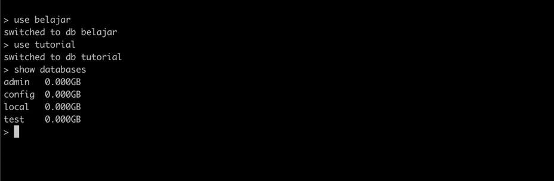
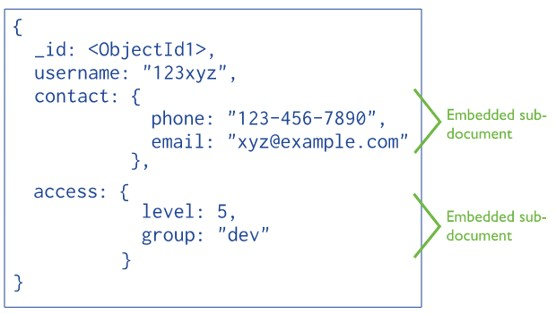
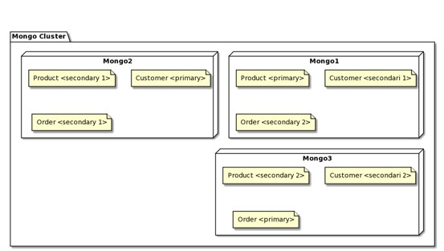

# MongoDB Dasar

## License

- Dokumen ini boleh Anda gunakan atau ubah untuk keperluan non komersial
- Tapi Anda wajib mencantumkan sumber dan pemilik dokumen ini
- Untuk keperluan komersial, silahkan hubungi pemilik dokumen ini

## #1 Pengenalan MongoDB

- MongoDB merupakan free dan opensource database management system
- MongoDB merupakan database management system basis document
- Dikembangkan oleh perushaan bernama 10gen tahun 2008
- Dirilis ke public tahun 2009
- Saat ini perusahaan 10gen sudah berganti nama menjadi MongoDB Inc
- MongoDB hampir mendukung semua bahasa pemrograman sebagai client nya
- MongoDB tidak menggunakan SQL, namun menggunakan JavaScript sebagai bahasa utama untuk manipulasi document
- <https://github.com/mongodb/mongo>

## db-engines.com/en/ranking/document+store


### Apa itu Document Oriented Database

- Document oriented database merupakan sistem database yang digunakan untuk memanipulasi data dalam bentuk document (semi structured data)
- Biasanya document disimpan dalam bentuk JSON atau XML
- Document oriented database biasanya bertolak belakang dengan relational database.
- Relational database biasanya menyimpan data dalam bentuk table, dan menyimpan relasinya di table lain.
- Document oriented database biasanya menyimpan data dalam bentuk JSON atau XML, dan menyimpan relasinya sebagai embedded object di dalam document yang sama.

### Istilah Relational DB vs Document DB

| Relational DB | Document DB MongoDB                 |
| ------------- | ----------------------------------- |
| Database      | Database                            |
| Collection    | Collection                          |
| Column        | Field                               |
| Row, Record   | Document (JSON, XML, dan lain-lain) |
| Join Table    | Embedded Document Reference         |
| SQL           | JavaScript (MongoDB)                |

## #2 Menginstall MongoDB

- Linux : <https://docs.mongodb.com/manual/administration/install-on-linux/>
- Mac : <https://docs.mongodb.com/manual/tutorial/install-mongodb-on-os-x/>
- Windows : <https://docs.mongodb.com/manual/tutorial/install-mongodb-on-windows/>

### Menginstall MongoDB Menggunakan Docker

- MongoDB Docker Image : <https://hub.docker.com/_/mongo>
- Docker Compose : <https://github.com/ProgrammerZamanNow/belajar-mongodb/blob/master/mongodb/docker-compose.yml>

## #3 MongoDB Client

### Mongo Shell

- MongoDB menyediakan aplikasi mongo client berupa command line interface untuk terkoneksi ke MongoDB Server dengan nama mongo shell.
- Mongo shell sangat bermanfaat saat kita tidak harus konek ke mongo server tanpa GUI
- Mongo shell menggunakan bahasa pemrograman JavaScript

### Menggunakan Mongo Shell

- `mongo --host localhost --port 27017`

### MongoDB GUI Client

- Jika kita terbiasa menggunakan GUI, ada beberapa aplikasi yang bisa kita gunakan sebagai mongo client, seperti :
- MongoDB Compass : <https://www.mongodb.com/products/compass>
- JetBrains DataGrip : <https://www.jetbrains.com/datagrip/>
- MongoDB for Visual Studio Code : <https://marketplace.visualstudio.com/items?itemName=mongodb.mongodb-vscode>
- Robo 3T : <https://robomongo.org/>

## #4 Database

- Database adalah tempat menyimpan collection
- Semua collection harus disimpan di database
- Biasanya database digunakan untuk memisahkan data secara logical per aplikasi, artinya biasanya satu aplikasi akan memiliki satu database
- Jarang sekali kita akan menggunakan satu database untuk beberapa aplikasi

### Membuat Database

- Kita tidak perlu secara eksplisit membuat database
- MongoDB akan secara otomatis membuatkan database sesuai dengan nama database yang kita pilih
- Untuk memilih nama database, kita bisa menggunakan perintah `“use”` diikuti nama database

### Memilih Database

```sh
use belajar
```



### Database Methods

| Database Methods    | Keterangan                              |
| ------------------- | --------------------------------------- |
| `db.dropDatabase()` | Menghapus database                      |
| `db.getName()`      | Mengambil nama database                 |
| `db.hostInfo()`     | Mengambil informasi host tempat mongodb |
| `db.verion()`       | Mengambil versi database                |
| `db.stats()`        | Mengambil statistik penggunaan database |

## #5 Collection

- Collection adalah tempat menyimpan document
- Maximum per document yang bisa disimpan adalah `16MB`
- Maximum level nested document yang bisa disimpan adalah `100` level

### Database Methods untuk Collection

| Database Methods            | Keterangan                             |
| --------------------------- | -------------------------------------- |
| `db.getCollectionNames()`   | Mengambil semua nama collection        |
| `db.createCollection(name)` | Membuat collection baru                |
| `db.getCollection(name)`    | Mendapatkan object collection          |
| `db.<name>`                 | Sama dengan `db.getCollection(<name>)` |
| `db.getCollectionInfos()`   | Mendapat informasi semua collection    |

### Collection Methods

| Database Methods              | Keterangan                               |
| ----------------------------- | ---------------------------------------- |
| `db.<collection>.find()`      | Mengambil semua document                 |
| `db.<collection>.count()`     | Mengambil jumlah document                |
| `db.<collection>.drop()`      | Menghapus collection                     |
| `db.<collection>.totalSize()` | Mengambil total ukuran collection        |
| `db.<collection>.stats()`     | Mengambil informasi statistik collection |

### Kode: Program Collection

- <https://github.com/ProgrammerZamanNow/belajar-mongodb/blob/master/scripts/collection.js>

## #6 Data Model

### Kenapa Perlu Mengerti Data Modeling

- Pindah dari relational database ke document database bukanlah hal yang sesederhana hanya dengan memindahkan semua table ke collection
- Penggunaan document database tidak akan mendatangkan manfaat besar jika kita tidak mengerti cara memodelkan data untuk kebutuhan aplikasi kita
- Saat memodelkan data menggunakan relational database, biasanya kita mengacu ke database normalization
- Saat memodelkan data menggunakan document database, kita harus mengacu ke penggunaan aplikasi dalam melakukan query, update dan memproses data

### Schema yang Flexible

- Tidak seperti di relational database, di MongoDB kita bisa memasukkan data ke collection secara langsung tanpa mendefinisikan schema collection nya.
- Schema untuk collection di MongoDB sangat flexible, tiap document bisa berbeda. Tidak seperti table di relational database yang harus sama tiap record.
- Namun pada prakteknya, sangat direkomendasikan menggunakan jenis data yang sama untuk tiap collection, walaupun bisa berbeda-beda di collection yang sama

### Primary Key

- Saat membuat dokumen di MongoDB, kita wajib menambahkan primary key
- Tidak seperti relational database yang bebas membuat column untuk primary key, di MongoDB, primary key wajib menggunakan field `_id`
- Selain itu primary key tidak bisa lebih dari 1 field, hanya bisa field `_id`, jadi jika kita ingin membuat composite primary key, maka kita hanya bisa melakukan dengan menggunakan 1 field `_id`

### Struktur Dokumen - Embedded



### Struktur Dokumen - Reference



### Embedded vs Reference

Gunakan Embedded jika :

- Antar document saling ketergantungan
- Tidak bisa langsung melakukan perubahan ke embedded document
- Embedded document selalu dibutuhkan ketika mengambil data document

Gunakan Reference jika :

- Antar document bisa berdiri sendiri dan tidak terlalu ketergantungan satu sama lain
- Bisa melakukan manipulasi data langsung terhadap reference document
- Reference document tidak selalu dibutuhkan saat mengambil document

## #7 BSON

- BSON singkatan dari Binary JSON, yaitu binary-encoded serialization dokumen seperti JSON
- Sama seperti JSON, di BSON juga bisa kita bisa menggunakan embedded object, array dan lain-lain
- <http://bsonspec.org/>
- <https://docs.mongodb.com/manual/reference/bson-types/>

### Tipe Data di BSON

| Tipe Data             | Alias               |
| --------------------- | ------------------- |
| Double                | double              |
| String                | string              |
| Object                | object              |
| Array                 | array               |
| Binary Data           | binData             |
| ObjectId              | objectId            |
| Boolean               | bool                |
| Date                  | date                |
| Null                  | null                |
| Regular Expression    | regex               |
| JavaScript            | javascript          |
| JavaScript with Scope | javascriptWithScope |
| 32 Bit Integer        | int                 |
| Timestamp             | timestamp           |
| 64 Bit Integer        | long                |
| Decimal 128           | decimal             |
| Min Key               | minKey              |
| Max Key               | maxKey              |

### ObjectId

- ObjectId adalah random data yang unik, cepat untuk digenerate dan terurut.
- Nilai ObjectId memiliki ukuran panjang 12 byte, konsisten terdiri dari informasi 4 byte timestamp, 5 byte random value, dan 3 byte incrementing counter
- ObjectId digunakan sebagai sebagai default `_id` (primary key) di document jika kita tidak secara eksplisit menyebutkan `_id` document nya

### Date dan ISODate

- BSON Date adalah 64 bit integer yang merepresentasikan angka milisecond sejak Unix epoch (1 Januari 1970).
- Nilai ini bisa merepresentasikan waktu dengan jarak 290 juta tahun sebelum dan setelah unix epoch.
- ISODate merupakan representasi waktu yang digunakan oleh MongoDB
- Date ini kompatibel dengan Date di JavaScript
- <https://developer.mozilla.org/en-US/docs/Web/JavaScript/Reference/Global_Objects/Date>

## #8 Insert Document

- Untuk menyimpan data ke MongoDB, kita perlu membuat document dalam bentuk JSON
- Field `_id` tidak wajib dimasukkan, jika kita tidak memasukkan field `_id`, maka secara otomatis MongoDB akan membuat `_id` baru secara random dengan tipe data ObjectId
- Atau kita juga bisa secara eksplisit membuat ObjectId baru dengan menggunakan perintah `"new ObjectId()"`

### Insert Document Function

| Function                                      | Keterangan                                    |
| --------------------------------------------- | --------------------------------------------- |
| `db.<collection>.insertOne(document)`         | Menambah dokumen ke collection                |
| `db.<collection>.insertMany(array<document>)` | Menambah semua dokumen di array ke collection |
| `db.<collection>.insert(document/array)`      | Menambah satu document atau banyak dokumen    |

### Kode: Program

- <https://github.com/ProgrammerZamanNow/belajar-mongodb/blob/master/scripts/insert.js>

## #9 Query Document

- Sama seperti di relational database, di MongoDB pun kita bisa melakukan query atau pencarian document yang sudah kita simpan di collection

### Query Document Function

| Function                     | Keterangan                    |
| ---------------------------- | ----------------------------- |
| `db.<collection>.find(query)` | Mencari document dengan query |

### Kode Program

- <https://github.com/ProgrammerZamanNow/belajar-mongodb/blob/master/scripts/query.js>

## #10 Comparison Query Operator

| Operator | Keterangan                                                  |
| -------- | ----------------------------------------------------------- |
| `$eq`    | Membandingkan value dengan value lain                       |
| `$gt`    | Membandingkan value lebih besar dari value lain             |
| `$gte`   | Membandingkan value lebih besar atau sama dengan value lain |
| `$lt`    | Membandingkan value lebih kecil dari valuu lain             |
| `$lte`   | Membandingkan value lebih kecil atau sama dengan value lain |
| `$in`    | Membandingkan value dengan value yang ada di array          |
| `$nin`   | Membandingkan value tidak ada dalam value yang ada di array |
| `$ne`    | Membandingkan value tidak sama dengan value lain            |

### Syntax Comparison Operator

```js
db.customer.find({
	field: {
		$operator: "value",
	},
});
```

### Kode Program

- <https://github.com/ProgrammerZamanNow/belajar-mongodb/blob/master/scripts/query-comparison.js>

## #11 Logical Query Operator

| Operator | Keterangan                                                                                 |
| -------- | ------------------------------------------------------------------------------------------ |
| `$and`   | Menggabungkan query dengan operasi AND, mengembalikan document jika semua kondisi benar    |
| `$or`    | Menggabungkan query dengan operasi OR, mengembalikan document ika salah satu kondisi benar |
| `$nor`   | Menggabungkan query dengan operasi NOR, mengembalikan document yang gagal di semua kondisi |
| `$not`   | Mengembalikan kondisi, mengembalikan document yang tidak sesuai kondisi                    |

### Syntax Logical Operator

```js
// logical operator for $and, $or and $nor
db.collection.find({
	$operator: [
		{
			// expression
		},
		{
			// expression
		},
	],
});
```

### Syntax Logical Operator $not

```js
// logical operator for $not
db.collection.find({
	field: {
		$not: {
			// operator expression
		},
	},
});
```

### Kode: Program

- <https://github.com/ProgrammerZamanNow/belajar-mongodb/blob/master/scripts/query-logical.js>

## #12 Element Query Operator

| Operator  | Keterangan                                             |
| --------- | ------------------------------------------------------ |
| `$exists` | Mencocokkan document yang memiliki field tersebut      |
| `$type`   | Mencocokkan document yang memiliki type field tersebut |

### Syntax Element Operator

```js
db.collection.find({
	field: {
		$operator: value,
	},
});
```

### Kode: Program

- <https://github.com/ProgrammerZamanNow/belajar-mongodb/blob/master/scripts/query-element.js>

## #13 Evaluation Query Operator

| Operator      | Keterangan                                                 |
| ------------- | ---------------------------------------------------------- |
| `$expr`       | Menggunakan aggregation operation                          |
| `$jsonSchema` | Validasi document sesuai dengan JSON schema                |
| `$mod`        | Melakukan operasi modulo                                   |
| `$regex`      | Mengambil document sesuai dengan regular expression (PCRE) |
| `$text`       | Melakukan pencarian menggunakan text                       |
| `$where`      | Mengambil document dengan JavaScript Function              |

### Syntax $expr Operator

```js
db.collection.find({
	$expr: {
		// aggregation expression
	},
});
```

### Syntax $jsonSchema Operator

```js
db.collection.find({
	$jsonSchema: {
		// JSON Schema Object
	},
});
```

### Syntax $mod Operator

```js
db.collection.find({
	field: {
		$mod: [divisor, remainder],
	},
});
```

### Syntax $regex Operator

```js
db.collection.find({
	field: {
		$regex: /regex/,
		$options: "<option>",
	},
});
```

### Syntax $text Operator

```js
db.collection.find({
	$text: {
		$search: "string",
		$language: "string",
		$caseSensitive: "boolean",
		$diacriticSensitive: "boolean",
	},
});
```

### Syntax $where Operator

```js
db.collection.find({
	$where: function () {
		return true;
	},
});
```

### Kode: Program

- <https://github.com/ProgrammerZamanNow/belajar-mongodb/blob/master/scripts/query-evaluation.js>

## #14 Array Query Operator

| Operator     | Keterangan                                                              |
| ------------ | ----------------------------------------------------------------------- |
| `$all`       | Mencocokkan array yang mengandung element-element tertentu              |
| `$elemMatch` | Mengambil document jika tiap element di array memenuhi kondisi tertentu |
| `$size`      | Mengambil document jika ukuran array sesuai                             |

### Syntax $all Operator

```js
db.collection.find({
	field: {
		$all: ["value"],
	},
});
```

### Syntax $elemMatch Operator

```js
db.collection.find({
	fields: {
		$elemMatch: {
			// query1,
			// query2
		},
	},
});
```

### Syntax $size Operator

```js
db.collection.find({
	fields: {
		$size: 1, // length
	},
});
```

### Kode: Program

- <https://github.com/ProgrammerZamanNow/belajar-mongodb/blob/master/scripts/query-array.js>

## #15 Projection Operator

- Pada function find, terdapat parameter kedua setelah query, yaitu projection
- Projection adalah memilih field mana yang ingin kita ambil atau hide
- `db.<collection>.find(query, projection)`

### Syntax Projection

```js
db.collection.find(
	{
		// query
	},
	{
		field1: 1, // include,
		field2: 0, // hide
	},
);
```

### Projection Operator

| Operator     | Keterangan                                                                    |
| ------------ | ----------------------------------------------------------------------------- |
| $            | Limit array hanya mengembalikan data pertama yang match dengan array operator |
| `$elemMatch` | Limit array hanya mengembalikan data pertama yang match dengan kondisi query  |
| `$meta`      | Mengembalikan informasi metadata yang didapat dari setiap matching document   |
| `$slice`     | Mengontrol jumlah data yang ditampilkan pada array                            |

### Syntax $ Operator

```js
db.products.find(
	{
		field: {
			$elemMatch: {
				// query
			},
		},
	},
	{
		"field.$": 1,
	},
);
```

### Syntax $elemMatch Operator

```js
db.collection.find(
	{},
	{
		field: {
			$elemMatch: {
				// query
			},
		},
	},
);
```

### Syntax $meta Operator

```js
db.collection.find(
	{
		$text: {
			$search: "query",
		},
	},
	{
		score: {
			$mete: "textScore",
		},
	},
);
```

### Syntax $slice Operator

```js
db.collection.find(
	{
		// query
	},
	{
		field: {
			$slice: 2, // slice size
		},
	},
);
```

### Kode: Program

- <https://github.com/ProgrammerZamanNow/belajar-mongodb/blob/master/scripts/query-projection.js>

## #16 Query Modifier

- Query Modifier adalah memodifikasi hasil query yang telah kita lakukan
- Contoh yang sering kita lakukan seperti, mengubah query menjadi jumlah data, membatasi jumlah data dengan paging, dan lain-lain
- Untuk memodifikasi hasil query, kita bisa menambahkan function query modifier setelah menggunakan function find

### Query Modifier Function

| Operator      | Keterangan                                                     |
| ------------- | -------------------------------------------------------------- |
| `count()`     | Mengambil jumlah data hasil query                              |
| `limit(size)` | Membatasi jumlah data yang didapat dari query                  |
| `skip(size)`  | Menghiraukan data pertama hasil query sejumlah yang ditentukan |
| `sort(query)` | Mengurutkan hasil data query                                   |

### Kode: Program

- <https://github.com/ProgrammerZamanNow/belajar-mongodb/blob/master/scripts/query-modifier.js>

## #17 Update Document

- Sama seperti database lainnya, di MongoDB juga kita bisa mengubah document yang sudah kita insert ke collection
- Namun berbeda dengan perintah SQL, di MongoDB, untuk mengubah document, kita diberikan beberapa function
- Untuk update document, kita bisa menggunakan collection : `db.<collection>.<updateFunction>()`

### Update Document Function

| Operator       | Keterangan                                        |
| -------------- | ------------------------------------------------- |
| `updateOne()`  | Mengubah satu document                            |
| `updateMany()` | Mengubah banyak document sekaligus                |
| `replaceOne()` | Mengubah total satu document dengan document baru |

### Syntax updateOne() Function

```js
db.collection.updateOne(
	{}, // filter
	{}, // update
	{}, // option
);
```

### Syntax updateMany() Function

```js
db.collection.updateMany(
	{}, // filter
	{}, // update
	{}, // option
);
```

### Syntax replaceOne() Function

```js
db.collection.updateOne(
	{}, // filter
	{}, // replacement
	{}, // options
);
```

### Kode: Program

- <https://github.com/ProgrammerZamanNow/belajar-mongodb/blob/master/scripts/update.js>

## #18 Field Update Operator

- Sebelumnya kita sudah tau kalo untuk update document di MongoDB kita bisa menggunakan operator `$set` dan `$unset`
- Namun sebenarnya masih banyak operator yang bisa kita gunakan

### Update Document Function

| Operator       | Keterangan                                                   |
| -------------- | ------------------------------------------------------------ |
| `$set`         | Mengubah nilai field di document                             |
| `$unset`       | Menghapus field di document                                  |
| `$rename`      | Mengubah nama field di document                              |
| `$inc`         | Menaikan nilai number di field sesuai dengan jumlah tertentu |
| `$currentDate` | Mengubah filed menjadi waktu saat ini                        |

### Syntax $set Operator

```js
db.collection.update(
	{
		// query
	},
	{
		$set: {
			field1: "value",
			field2: "value",
		},
	},
);
```

### Syntax $unset Operator

```js
db.collection.update(
	{
		// query
	},
	{
		$unset: {
			field1: "",
			field2: "",
		},
	},
);
```

### Syntax $rename Operator

```js
db.collection.update(
	{
		// query
	},
	{
		$rename: {
			field1: "newName1",
			field2: "newName2",
		},
	},
);
```

### Syntax $inc Operator

```js
db.collection.update(
	{
		// query
	},
	{
		$inc: {
			field1: 1, // increment
			field2: -1, // decrement
		},
	},
);
```

### Syntax $currentDate Operator

```js
db.collection.update(
	{
		// query
	},
	{
		$currentDate: {
			field1: {
				$type: "date",
			},
			field2: {
				$type: "timestamp",
			},
		},
	},
);
```

### Kode: Program

- <https://github.com/ProgrammerZamanNow/belajar-mongodb/blob/master/scripts/update-field.js>

## #19 Array Update Operator

- Secara default, saat kita mengubah field dengan tipe array, maka seluruh array akan diubah
- Kadang kita ingin menambah, atau hanya mengubah data array tanpa harus mengubah seluruh field array
- Hal ini bisa dilakukan di MongoDB

### Array Update Operator

| Operator          | Keterangan                                                   |
| ----------------- | ------------------------------------------------------------ |
| `$`               | Mengupdate data array pertama sesuai kondisi query           |
| `$[]`             | Mengupdate semua data array sesuai kondisi query             |
| `$[<identifier>]` | Mengupdate semua data array yang sesuai kondisi arrayFilters |
| `<identifier>`    | Mengupdate data array sesuai dengan nomor index              |

### Syntax $ Operator

```js
db.collection.updateMany(
	{
		field: "value",
	},
	{
		$operator: {
			"field.$": "value",
		},
	},
);
```

### Syntax $[] Operator

```js
db.collection.updateMany(
	{
		// query
	},
	{
		$operator: {
			"field.$[]": "value",
		},
	},
);
```

### Syntax `$[<identifier>]` Operator

```js
db.collection.updateMany(
	{
		// query
	},
	{
		$operator: {
			"field.$[element]": "value",
		},
	},
	{
		arrayFilters: [
			{
				element: {
					$operator: "value",
				},
			},
		],
	},
);
```

### Syntax <index> Operator

```js
db.collection.updateMany(
	{
		// query
	},
	{
		$operator: {
			"field.<index>": "value",
		},
	},
);
```

### Array Update Operator

| Operator    | Keterangan                                             |
| ----------- | ------------------------------------------------------ |
| `$addToSet` | Menambahkan value ke array, dihiraukan jika sudah ada  |
| `$pop`      | Menghapus element pertama (-1) atau terakhir (1) array |
| `$pull`     | Menghapus semua element di array yang sesuai kondisi   |
| `$push`     | Menambahkan element ke array                           |
| `$pullAll`  | Menghapus semua element di array                       |

### Syntax $addToSet Operator

```js
db.products.updateOne(
	{
		// query
	},
	{
		$addToSet: {
			field: "value",
		},
	},
);
```

### Syntax $pop Operator

```js
db.products.updateMany(
	{
		// query
	},
	{
		$pop: {
			ratings: -1,
		},
	},
);
```

### Syntax $pull Operator

```js
db.products.updateOne(
	{
		// query
	},
	{
		$pull: {
			field: {
				$operator: "value",
			},
		},
	},
);
```

### Syntax $push Operator

```js
db.products.updateOne(
	{
		// query
	},
	{
		$push: {
			field: "value",
		},
	},
);
```

### Syntax $pullAll Operator

```js
db.products.updateOne(
	{
		// query
	},
	{
		$pullAll: {
			field: ["value"],
		},
	},
);
```

### Array Update Operator Modifier

| Operator    | Keterangan                                                           |
| ----------- | -------------------------------------------------------------------- |
| `$each`     | Digunakan di $addToSet dan $push, untuk menambahkan multiple element |
| `$position` | Digunakan di $push untuk mengubah posisi menambahkan data            |
| `$slice`    | Digunakan di $push untuk menentukan jumlah maksimal data array       |
| `$sort`     | Digunakan untuk mengurutkan array setelah operasi $push              |

### Syntax $each Operator

```js
db.products.updateMany({
	// query
}, {
	$operator: {
		field: {
			$each: ["value1". "value2"]
		}
	}
})
```

### Syntax $position Operator

```js
db.products.updateMany(
	{
		// query
	},
	{
		$push: {
			field: {
				$each: ["value"],
				$position: 1,
			},
		},
	},
);
```

### Syntax $slice Operator

```js
db.products.updateMany(
	{
		// query
	},
	{
		$operator: {
			field: {
				$each: ["value", "value"],
				$slice: 1,
			},
		},
	},
);
```

### Syntax $sort Operator

```js
db.products.updateMany(
	{
		// query
	},
	{
		$push: {
			field: {
				$each: ["value"],
				$sort: 1,
			},
		},
	},
);
```

### Kode: Program

- <https://github.com/ProgrammerZamanNow/belajar-mongodb/blob/master/scripts/update-array.js>

## #20 Delete Document

- MongoDB memiliki function yang bisa kita gunakan untuk menghapus document di collection secara permanen
- Document yang sudah kita hapus, tidak akan bisa dikembalikan lagi

### Delete Document Function

| Function                            | Keterangan                                                 |
| ----------------------------------- | ---------------------------------------------------------- |
| `db.<collection>.deleteOne(query)`  | Menghapus satu document yang sesuai dengan kondisi query   |
| `db.<collection>.deleteMany(query)` | Menghapus banyak document yang sesuai dengan kondisi query |

### Kode: Program

- <https://github.com/ProgrammerZamanNow/belajar-mongodb/blob/master/scripts/delete.js>

## #21 Bulk Write Operations

- Komunikasi antara aplikasi dengan database biasanya dilakukan secara request-response
- Artinya tiap perintah yang ingin kita kirimkan dari aplikasi ke database, akan diresponse secara langsung oleh database
- Proses tersebut akan sangat lambat, jika kita menghadapi kasus harus memanipulasi data besar secara langsung. Misal upload data dari file dengan jumlah jutaan ke dalam database.
- MongoDB mendukung Bulk Write Operation, yaitu operasi bulk yang dalam satu request, kita bisa mengirim banyak perintah
- Fitur ini cocok pada kasus jika kita ingin melakukan operasi bulk atau batch secara banyak sekaligus

### Bulk Write Function

| Function                       | Keterangan                                                               |
| ------------------------------ | ------------------------------------------------------------------------ |
| `db.<collection>.insertMany()` | Insert document secara banyak sekaligus                                  |
| `db.<collection>.updateMany()` | Update document secara banyak sekaligus                                  |
| `db.<collection>.deleteMany()` | Delete document secara banyak sekaligus                                  |
| `db.<collection>.bulkWrite()`  | Melakukan operasi write (insert, update, delete) banyak secara sekaligus |

### Supported Bulk Write Operation

- insertOne
- updateOne
- updateMany
- replaceOne
- deleteOne
- deleteMany

### Syntax bulkWrite() Function

```js
db.customers.bulkWrite([
	{
		// operation 1
	},
	{
		// operation 2
	},
	{
		// operation 3
	},
]);
```

### Kode: Program

- <https://github.com/ProgrammerZamanNow/belajar-mongodb/blob/master/scripts/bulk-write.js>

## #22 Schema Validation

- Pada Relational DB, kita biasanya menambahkan constraint terhadap data yang ada di tabel
- Misal, maksimal karakter, Enum string, Not Null, dan lain-lain
- Di MongoDB, fitur untuk validasi data lebih canggih dibanding constraint di Relational DB
- MongoDB mendungkung Schema Validation menggunakan JSON Schema

### JSON Schema

- JSON Schema adalah standar resmi untuk memvalidasi data JSON
- Dengan menggunakan JSON Schema, kita bisa memberi batasan, data JSON apa yang valid, sehingga bisa dimasukkan ke dalam collection
- <http://json-schema.org/>

### Syntax Create Collection dengan Validator

```js
db.createCollection("collection", {
	validator: {
		$jsonSchema: {
			// json schema
		},
	},
});
```

### Syntax Update Collection dengan Validator

```js
db.runCommand({
	collMod: "collection",
	validationAction: "error",
	validator: {
		$jsonSchema: {
			// json schema
		},
	},
});
```

### Kode: Program

- <https://github.com/ProgrammerZamanNow/belajar-mongodb/blob/master/scripts/schema-validation.js>

## #23 Indexes

- Index adalah fitur di MongoDB untuk mengefisienkan proses query. Tanpa Index, MongoDB harus melakukan proses query dengan cara collection scan (mencari keseluruh data dari awal sampai akhir)
- Jika terdapat Index pada collection MongoDB, MongoDB bisa menggunakan Index untuk mendapatkan data, tanpa harus melakukan pencarian keseluruh document
- Index adalah struktur data khusus yang menyimpan data dalam struktur yang mudah untuk dicari.
- Index menyimpan spesifik field, lalu mengurutkan data field tersebut. Hal ini tidak hanya mempermudah ketika proses pencarian, namun mempermudah ketika kita butuh melakukan pencarian dalam bentuk range document (seperti paging).
- Secara dasar, Index di MongoDB, cara kerjanya sama seperti Index di Relational DB

### Kode: Create Index Function

| Function                        | Keterangan                        |
| ------------------------------- | --------------------------------- |
| `db.<collection>.createIndex()` | Membuat index di collection       |
| `db.<collection>.getIndexes()`  | Melihat semua index di collection |
| `db.<collection>.dropIndex()`   | Menghapus index di collection     |

### Single Field Index

- Secara default, field `_id` di MongoDB sudah di index secara otomatis, jadi kita tidak perlu membuat index lagi secara manual untuk field `_id`
- MongoDB mendukung penuh pembuatan index di semua field yang ada di document. Dengan begitu, ini bisa mempercepat proses query di MongoDB untuk query terhadap field tersebut

### Syntax Single Field Index

```js
db.products.createIndex({
	field: 1, // ascending
});

db.products.createIndex({
	field: -1, // descending
});
```

### Compound Indexes

- Jika kita butuh melakukan query terhadap lebih dari satu field, kita juga bisa membuat index terhadap lebih dari satu field, atau disebut Compound Index
- MongoDB membatasi pembuatan maksimal field yang bisa dibuat di compound index adalah 32 field

### Syntax Compound Field Index

```js
db.collection.createIndex({
	field1: 1,
	field2: -1,
});
```

### Kode: Program

- <https://github.com/ProgrammerZamanNow/belajar-mongodb/blob/master/scripts/index.js>

### Indexing Strategy

- Buat index untuk mendukung performa query
- Gunakan single index, jika kita hanya melakukan query terhadap satu field saja
- Gunakan compound index, jika kita sering melakukan query ke field pertama, atau kombinasi field pertama dan kedua, atau pertama dan kedua dan seterusnya
- Buat index untuk mengurutkan hasil query
- Sering-seringlah menggunakan function `explain()` untuk mengecek apakah query kita sudah di optimize dengan index atau belum

## #24 Text Indexes

- MongoDB menyediakan text index untuk mendukung pencarian text di tipe data string.
- Text index tidak hanya bisa digunakan pada field dengan tipe data string, namun juga pada array berisi tipe data string

### Syntax Text Index

```js
db.products.createIndex(
	{
		field1: "text",
		field2: "text",
	},
	{
		weights: {
			field1: 10,
			field2: 5,
		},
	},
);
```

### Kode: Program

- <https://github.com/ProgrammerZamanNow/belajar-mongodb/blob/master/scripts/index-text.js>

## #25 Wildcard Indexes

- MongoDB mendukung wildcard index, dimana ini digunakan untuk membuat index terhadap field yang belum diketahui atau field yang sering berubah-ubah
- Misal contoh kita punya sebuah embedded document dengan tipe field customFields, dimana isi nya bisa bebas sesuai dengan data yang dimasukkan.
- Agar bisa mendukung proses query yang cepat pada field tersebut, kita bisa menggunakan wildcard index

### Syntax Wildcard Index

```js
db.customers.createIndex({
	"field.$**": 1,
});
```

### Kode: Program

- <https://github.com/ProgrammerZamanNow/belajar-mongodb/blob/master/scripts/index-wildcard.js>

## #26 Index Properties

- MongoDB mendukung properties di index
- Istilah properties di Index mungkin agak sedikit membingungkan, sederhananya adalah menambahkan behaviour atau kemampuan tertentu terhadap index yang kita buat

### TTL Index

- TTL singkatan dari Time To Live, yaitu waktu untuk hidup
- TTL Index digunakan sebagai waktu hidup document di collection, artinya data akan hilang dalam kurun waktu tertentu secara otomatis
- TTL Index hanya dapat digunakan di field dengan tipe data Date
- Background proses di MongoDB akan secara regular melakukan penghapusan data secara otomatis
- Sayangnya, proses background tersebut berjalan setiap 60 detik sekali

### Syntax TTL Index

```js
db.collection.createIndex(
	{
		field: 1,
	},
	{
		expireAfterSecods: 10,
	},
);
```

### Unique Index

- Unique Index memastikan bahwa field-field di index tersebut tidak menyimpan data duplicate.
- Contohnya, di MongoDB, field `_id` secara otomatis merupakan unique index, sehingga kita tidak bisa membuat document dengan field `_id` yang sama

### Syntax Unique Index

```js
db.collection.createIndex(
	{
		field: 1,
	},
	{
		unique: true,
	},
);
```

### Kode: Program

- <https://github.com/ProgrammerZamanNow/belajar-mongodb/blob/master/scripts/index-properties.js>

## #27 Transactions

- Di Relational DB, fitur yang sangat berguna dan banyak orang gunakan adalah fitur transaction
- Fitur transaction secara sederhana adalah menggabungkan kan beberapa operasi database dalam satu transaction, dimana transaction akan dianggap sukses jika semua operasi sukses, dan transaction akan dianggap gagal jika ada salah satu operasi yang gagal
- Dan jika transaction gagal, maka seluruh operasi yang sukses sebelumnya harus dibatalkan (rollback)
- Fitur transaction di MongoDB hanya bisa jalan di cluster (replica-set), tidak di single node
- Dalam cluster, Database di MongoDB akan memiliki primary data dan secondary data

### MongoDB Cluster Replica Set


### Transaction Function

| Function                      | Keterangan            |
| ----------------------------- | --------------------- |
| `session.startTransaction()`  | Memulai transaksi     |
| `session.commitTransaction()` | Commit transaksi      |
| `session.abortTransaction()`  | Membatalkan transaksi |

### Read Preferences

Read preferences adalah bagaimana MongoDB mengkontrol dari mana kita membaca data

- `primary` : Semua query diambil dari primary replica set
- `primaryPreferred` : Semua query diambil dari primary replica set, namun jika tidak ada primary replica set, maka diambil dari secondary replica set
- `secondary`: Semua query diambil dari secondary replica set
- `secondaryPreferred` : Semua query diambil dari secondary replica set, namun jika tidak ada secondary replica set, maka diambil dari primary replica set
- `nearest` : Semua query diambil dari replica set paling murah network latency nya

### Read Concern

- Read Concern adalah bagaimana MongoDB mengkontrol data yang kita dapatkan

- `local`: Data akan didapatkan di local node
- `available` : Data akan didapatkan dimanapun (tidak peduli node mana)
- `majority` : Data akan didapatkan di mayoritas data di semua node
- `linearizable` : Data akan dipastikan data paling terbaru di semua node
- `snapshot` : Data akan diambil dari mayoritas data snapshot (data yang telah di commit) di semua node

### Write Concern

Write Concern adalah bagaimana MongoDB mengkontrol operasi write (insert, update, delete)

- `<number>` : Operasi dianggap sukses jika sudah berhasil melakukan operasi write di node sejumlah `<number>`
- `majority` : Operasi dianggap sukses jika sudah berhasil melakukan operasi write di mayoritas node

### Kode: Program

- <https://github.com/ProgrammerZamanNow/belajar-mongodb/blob/master/scripts/transaction.js>

## #28 Security

- Secara default, jika kita menjalankan MongoDB, mode yang dijalankan tidaklah aman
- Tidak ada Authentication dan tidak ada Authorization
- Agar aman, kita harus mengaktifkan fitur access control di MongoDB

### User Admin

- User admin harus ada terlebih dahulu sebelum kita mengaktifkan access control
- User admin adalah user yang memiliki role userAdminAnyDatabase dan readWriteAnyDatabase
- Setelah membuat user admin, kita bisa menjalankan ulang MongoDB dengan perintah `--auth`

### Kode: Program

- <https://github.com/ProgrammerZamanNow/belajar-mongodb/blob/master/scripts/security.js>

## #29 Authentication

- Authentication adalah proses memverifikasi identitas pengguna ketika mengakses MongoDB
- Saat menggunakan authentication, maka client wajib menggunakan username dan password untuk terkoneksi ke MongoDB server
- MongoDB mendukung banyak mekanisme authentication, seperti :
- SCRAM : <https://tools.ietf.org/html/rfc5802>
- Certificate Authentication
- LDAP
- Kerberos, dan lain-lain

### User

- Di MongoDB, kita bisa menambahkan user, dan juga menambahkan role ke user tersebut
- Saat kita membuat user, kita harus menentukan database sebagai authentication database
- Namun bukan berarti user hanya bisa mengakses database itu saya, tapi user juga bisa mengakses database lain jika mau
- Nama user harus unik per database, namun jika database nya berbeda, kita bisa membuat user dengan nama yang sama

### User Function

| Function                  | Keterangan             |
| ------------------------- | ---------------------- |
| `db.createUser()`         | Membuat user           |
| `db.getUsers()`           | Mendapatkan semua user |
| `db.dropUser()`           | Menghapus user         |
| `db.updateUser()`         | Mengupdate user        |
| `db.changeUserPassword()` | Mengubah user password |

### Syntax User

```js
db.createUser({
	user: "user",
	pwd: "password",
	roles: [
		{
			role: "role",
			db: "database",
		},
		"other role",
	],
});
```

### Kode: Program

- <https://github.com/ProgrammerZamanNow/belajar-mongodb/blob/master/scripts/authentication.js>

## #28 Authorization

- Authorization adalah proses yang dilakukan setelah proses Authentication sukses
- Authorization dilakukan untuk melakukan pengecekan apakah user memiliki hak akses untuk melakukan sebuah action
- Hak akses di MongoDB disimpan dalam bentuk role

### Database Roles

| Role      | Keterangan                                                                      |
| --------- | ------------------------------------------------------------------------------- |
| read      | Bisa membaca data di semua collection yang bukan sistem collection              |
| readWrite | Bisa membaca dan mengubah data di semua collection yang bukan sistem collection |
| dbAdmin   | Bisa melakukan kemampuan administrasi database                                  |
| userAdmin | Mampu membuat user dan role                                                     |
| dbOwner   | Kombinasi readWrite, dbAdmin, dan userAdmin                                     |

### All Database Roles

| Role                   | Keterangan                                        |
| ---------------------- | ------------------------------------------------- |
| `readAnyDatabase`      | Seperti read role, tapi untuk semua database      |
| `readWriteAnyDatabase` | Seperti readWrite role, tapi untuk semua database |
| `userAdminAnyDatabase` | Seperti userAdmin, tapi untuk semua database      |
| `dbAdminAnyDatabase`   | Seperti dbAdmin, tapi untuk semua database        |

### Backup & Restore Roles

| Role    | Keterangan                                 |
| ------- | ------------------------------------------ |
| backup  | Kemampuan untuk melakukan backup database  |
| restore | Kemampuan untuk melakukan restore database |

### Superuser Roles

| Role | Keterangan            |
| ---- | --------------------- |
| root | Bisa melakukan apapun |

### Privileges

- Role membatasi hak akses di level database
- Kadang kita ingin membatasi di level collection
- Untuk melakukan itu, kita bisa menggunakan privileges

### Role Function

| Role              | Keterangan        |
| ----------------- | ----------------- |
| `db.createRole()` | Membuat role baru |
| `db.getRoles`     | Mendapatkan role  |
| `db.deleteRole()` | Menghapus role    |
| `db.updateRole()` | Mengubah role     |

### Syntax Role

```js
db.createRole({
	role: "name",
	privileges: [
		{
			resource: {
				db: "database",
				collection: "collection",
			},
			actions: ["action"],
		},
	],
	roles: [
		{
			role: "role",
			db: "database",
		},
	],
});
```

### Kode: Program

- <https://github.com/ProgrammerZamanNow/belajar-mongodb/blob/master/scripts/authorization.js>

## #29 Materi Selanjutnya

- MongoDB Aggregation
- MongoDB Geospatial
- MongoDB Scalability
