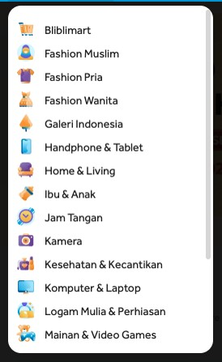

# Database Design Multi Bahasa

## Sebelum Belajar

- MySQL Database

## Agenda

- Studi Kasus Database Design dan Implementasinya untuk kasus Multi Bahasa

## #1 Requirement Specification

### Feature

- Membuat Category yang mendukung multi bahasa

### UI Design

## #2 Table Schema

## #3 Implementasi SQL

## #4 Materi Selanjutnya

- Latihan Database Design lainnya, dari yang sederhana sampai yang kompleks
