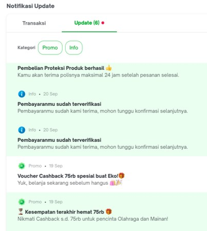

# Database Degign Notification

## Sebelum Belajar

- MySQL Database

## Agenda

- Studi Kasus Database Design dan Implementasinya untuk kasus Notification

## #1 Requirement Specification

### Feature

- Membuat fitur Notification yang bisa digunakan untuk melihat informasi untuk pengguna aplikasi

### UI Design

### Feature : Inbox

- Inbox akan berisikan semua informasi notifikasi untuk pengguna

### Feature : Kategori

- Terdapat dua jenis kategori; Promo dan Info
- Promo akan berisikan informasi promo yang akan di broadcast ke semua pengguna
- Info akan berisikan informasi yang ditujukan untuk pengguna tersebut, misal status pembayaran atau pembelian
- Jika di kategori nya di klik, secara otomatis isi Inbox hanya berisikan kategori tersebut

### Feature : Read/Unread

- Inbox harus bisa membedakan mana notifikasi yang sudah di read atau belum di read
- Warna hijau menandakan notifikasi belum di read
- Warna putih menandakan notifikasi sudah di read

### Feature : Jumlah Notifikasi

- Menu Notifikasi harus bisa menampilkan jumlah notifikasi yang belum dibaca
- Ini agar men-trigger pengguna untuk membuka halaman Inbox notifikasi

## #2 Persiapan

- Membuat database `belajar_mysql_notification`

## #3 User

## #4 Inbox

## #5 Category

## #6 Read dan Unread

## #7 Counter

## #8 Materi Selanjutnya

- Latihan Database Design lainnya, dari yang sederhana sampai yang kompleks
