# MySQL Database

## Agenda

- Pengenalan MySQL
- Menginstall MySQL
- Tipe Data
- Database,Table
- Insert, Update, Delete, Select
- Transaction
- Table Relationship
- Join
- Dan lain-lain

## #1 Pengenalan Sistem Basis Data

### Pengenalan Database Management System

- DBMS adalah aplikasi yang digunakan untuk me-manage data
- Tanpa menggunakan DBMS, untuk me-manage data, seperti data produk, data customer, data penjualan, kita harus simpan dalam bentuk file (misal seperti ketika menggunakan Excel)
- DBMS biasanya berjalan sebagai aplikasi server yang digunakan untuk me-manage data, kita hanya tinggal memberi perintah ke DBMS untuk melakukan proses manajemen datanya, seperti menambah, mengubah, menghapus atau mengambil data
- Contoh DBMS yang populer seperti MySQL, PostgreSQL, MongoDB, Oracle, dan lain-lain

### Pengenalan Relational Database

- Ada banyak sekali jenis-jenis DBMS, seperti Relational Database, Document Database, Key-Value Database, dan lain-lain
- Namun yang masih populer dan kebanyakan orang gunakan adalah relational database
- Relational database cukup mudah dimengerti dan dipelajari karena kita sudah terbiasa menyimpan data dalam bentuk tabular (tabel) seperti di Microsoft Excel atau di Google Doc Spreadsheet
- Selain itu relational database memiliki perintah standard menggunakan SQL, sehingga kita mudah ketika ingin berganti-ganti aplikasi database (seperti MySQL, Oracle, PostgreSQL dan lain-lain)

### Cara Kerja DBMS


### Database Client

- Database client adalah aplikasi yang digunakan untuk berkomunikasi dengan DBMS
- Biasanya DBMS sudah menyediakan database client sederhana yang bisa kita gunakan untuk berkomunikasi dengan DBMS agar lebih mudah
- Atau kita bisa membuat aplikasi untuk berkomunikasi dengan DBMS, misal membuat aplikasi database client menggunakan Java, PHP atau bahasa pemrograman lainnya

### Database File

- Mayoritas DBMS menyimpan datanya di file, walaupun ada beberapa database yang hanya menyimpan datanya di memory (RAM)
- Namun jangan berpikir file database yang disimpan berupa file seperti Excel atau CSV (Comma Separated Value), tapi jauh lebih kompleks
- Database File akan di optimasi oleh DBMS agar mempermudah DBMS dalam manajemen datanya, seperti insert, update, delete dan select
- Tiap DBMS biasanya memiliki cara masing-masing mengelola Database File nya, dan kita tidak perlu harus tau, karena yang kita perlu tahu hanya cara berkomunikasi ke DBMS

### SQL

- Structured Query Language
- Merupakan bahasa yang digunakan untuk mengirim perintah ke DBMS
- SQL adalah bahasa yang mudah karena hanya berisi instruksi untuk menyimpan, mengubah, menghapus atau mengambil data melalui DBMS
- Secara garis besar, semua perintah SQL di Relational Database itu hampir sama, namun biasanya tiap DBMS ada improvement yang membedakan hal-hal kecil dalam perintah SQL, namun secara garis besar perintahnya tetap sama

### Pengenalan MySQL

### MySQL

- MySQL adalah DBMS Relational OpenSource yang paling populer di dunia saat ini
- Tidak hanya OpenSource, MySQL juga gratis untuk digunakan
- MySQL pertama kali dibuat dan diperkenalkan tahun 1995 oleh David Axmark dan Michael Widenius
- MySQL sangat populer sekali terutama dikalangan programmer web PHP
- <https://www.mysql.com/>

### Kenapa Belajar MySQL

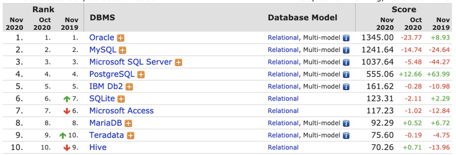

### MySQL Community vs MySQL Enterprise

- Saat kita membuka halaman website resmi MySQL, jangan sampai salah download aplikasi MySQL
- MySQL menawarkan pilihan versi MySQL Enterprise, yaitu DBMS MySQL Yang berbayar
- MySQL yang versi gratis adalah MySQL Community
- MySQL Enterprise sendiri lebih ke versi improvement dari MySQL Community, biasanya menambahkan support dan monitoring
- Jika menggunakan MySQL Community, maka kita harus tangani semuanya sendiri, dari masalah dan monitoring MySQL nya

### MySQL vs MariaDB

- Tahun 2008 MySQL di akuisisi oleh perusahaan Sun Microsystem
- Namun Tahun 2009, Sun Microsystem diakuisisi oleh perusahaan Oracle (Pemilik DBMS Oracle)
- Hal ini menyebabkan 2 founder MySQL keluar dari MySQL dan membuat project baru bernama MariaDB
- MariaDB Sebenarnya fork dari MySQL, jadi apa yang bisa dilakukan di MySQL bisa dilakukan di MariaDB
- Sehingga sekarang jangan terlalu bingung jika ada MySQL dan MariaDB, karena sebenarnya itu dari source code yang sama, mungkin ada perbedaan kecil, namun secara garis besar sebenarnya tetap sama
- <https://mariadb.org/>

### Cara Kerja MySQL Server

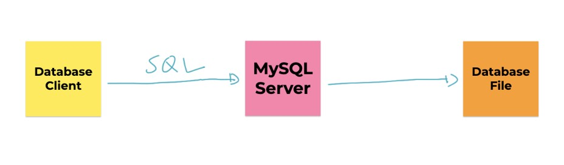

## #2 Menginstall MySQL

- Menginstall MySQL banyak caranya, bisa download langsung dari halaman website resminya
- Atau bisa menggunakan aplikasi yang mem-bundle MySQL seperti XAMPP yang biasa digunakan oleh programmer PHP
- Jika sudah menginstall MySQL / MariaDB menggunakan XAMPP, tidak perlu menginstall lagi MySQL, karena jika bentrok, maka salah satu aplikasi MySQL nya tidak akan bisa jalan

### Menginstall MySQL di Mac

- Khusus untuk pengguna Mac, selain download installer MySQL di website resmi MySQL, kita juga bisa menggunakan homebrew untuk menginstall MySQL
- Cukup gunakan perintah : `brew install mysql`

### Menggunaakan MySQL Client

- MySQL Client adalah aplikasi berbasis terminal yang disediakan oleh MySQL untuk berkomunikasi dengan MySQL Server
- Karena berbasis terminal, sehingga MySQL Client sangat cocok untuk kita gunakan misal ketika di server production, dimana kita menginstall MySQL di linux server yang berbasis terminal misal
- Kita tidak perlu menginstall MySQL Client secara terpisah, karena sudah tersedia di dalam aplikasi MySQL ketika kita menginstallnya

### MySQL Workbench

- MySQL Workbench adalah aplikasi MySQL Client berbasis Desktop yang disediakan oleh MySQL
- MySQL Workbench adalah aplikasi gratis
- Aplikasi MySQL Workbench sangat mempermudah kita melakukan manajemen data di MySQL karena berbasis Desktop
- <https://www.mysql.com/products/workbench/>

### JetBrains DataGrip

- DataGrip adalah aplikasi Database Client yang berbayar
- DataGrip mendukung banyak sekali DBMS sehingga kita cukup menggunakan DataGrip untuk manajemen semua database yang kita gunakan
- Selain mendukung Relational DBMS, DataGrip juga mendukung DBMS yang NoSQL seperti MongoDB, Cassandra, dan lain-lain
- <https://www.jetbrains.com/datagrip/>

## #3 Database

- Database adalah tempat kita menyimpan table di MySQL
- Jika kita misalkan table di MySQL adalah sebuah file, maka database adalah folder nya, dimana kita bisa menyimpan banyak table di sebuah database
- Biasanya pembuatan kita akan membuat satu database untuk satu jenis aplikasi, walaupun satu aplikasi bisa menggunakan lebih dari satu database, namun lumrahnya, satu aplikasi akan menggunakan satu database

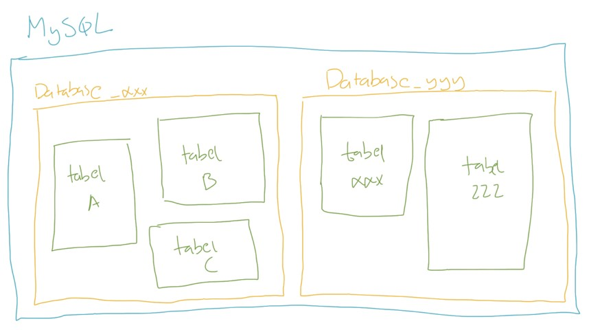

### Melihat Semua Database di MySQL

```sql
show databases;
```

### Membuat Database

```sql
creata database nama_database;
```

### Memilih Database

```sql
use nama_database;
```

### Menghapus Database

```sql
drop database nama_database;
```

## #4 Tipe Data

- Saat kita membuat tabel di Excel, kita bisa menentukan tipe data apa yang kita masukkan ke tiap kolom di Excel
- Di MySQL, kita juga bisa menentukan tipe data tiap kolom yang kita buat di sebuah tabel
- Ada banyak sekali tipe data yang tersedia di MySQL, dari yang sederhana, sampai yang kompleks.
- Biasanya kita akan menggunakan tipe data sesuai dengan kebutuhan kolom yang perlu kita buat

### Tipe Data per Kolom

| id (number) | Nama (text) | Harga (number) | Jumlah (number) |
| ----------- | ----------- | -------------- | --------------- |
| 1           | Apel        | 5000           | 100             |
| 2           | Jeruk       | 2000           | 200             |
| 3           | Semangka    | 10000          | 500             |
| ...         | ...         | ...            | ...             |

## #5 Tipe Data Number

- Secara garis besar, tipe data number di MySQL ada dua jenis;
- Integer, atau tipe number bilangan bulat
- Floating Point, atau tipe data number pecahan

### Time Data Integer

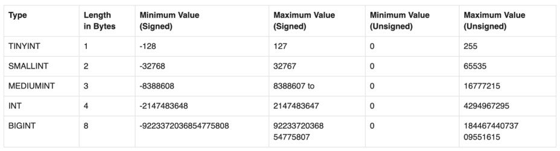

### Tipe Data Floating Point

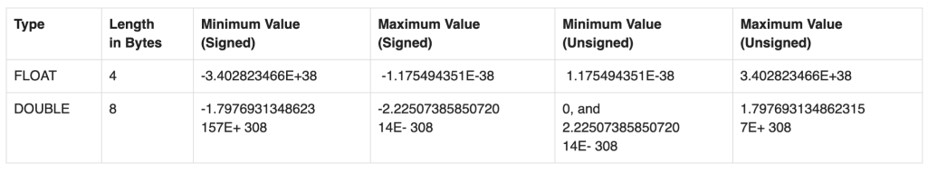

### DECIMAL

- Selain Integer dan Floating Point, di MySQL terdapat tipe data DECIMAL
- Ini tipe data number khusus yang bisa ditentukan jumlah precision dan scale nya

| DECIMAL      | Min     | Max    |
| ------------ | ------- | ------ |
| DECIMAL(5,2) | -999.99 | 999.99 |
| DECIMAL(5,0) | -99999  | 99999  |
| DECIMAL(3,1) | -99.9   | 999    |
| DECIMAL(3)   | -9999   | 999    |

### Number Attribute

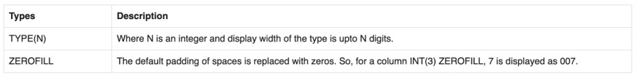

## #6 Tipe Data String

- Selain number, biasanya kita sering menyimpan data di dalam tabel dalam bentuk tulisan
- Tipe data ini namanya tipe data String atau Text
- Ada banyak tipe data String di MySQL

### CHAR dan VARCHAR

- Pertama tipe data String di MySQL adalah CHAR dan VARCHAR
- Kita bisa menentukan jumlah panjang maksimal karakter yang bisa ditampung oleh CHAR dan VARCHAR dengan menggunakan kurung buka lalu masukan jumlah maksimal karakter dan diakhiri kurung tutup
- Misal, CHAR(10) atau VARCHAR(10) artinya tipe data String dengan maksimal jumlah karakternya adalah 10 karakter
- Maksimum ukuran CHAR atau VARCHAR adalah 65535 karakter

### Perbedaan CHAR dan VARCHAR

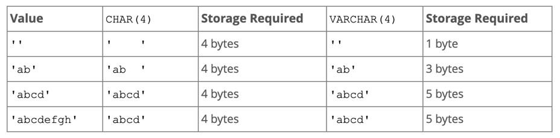

### TEXT

- Selain CHAR dan VARCHAR, tipe data String yang lainnya adalah TEXT
- Berbeda dengan CHAR dan VARCHAR yang kita bisa tentukan panjang maksimum nya, TEXT tidak sudah memiliki maksimum panjang nya
- Terdapat 4 tipe data TEXT
  - TINYTEXT dengan maksimum 255 karakter (~256 bytes)
  - TEXT dengan maksimum 65535 karakter ( ~64 kb)
  - MEDIUMTEXT dengan maksimum 16777215 karakter (~16MB)
  - dan LONGTEXT dengan maksimum 4294967295 karakter (~4GB)

### ENUM

- ENUM adalah tipe data String yang bisa kita tentukan pilihan pilihannya
- Misal kita bisa membuat
  - ENUM(‘Pria’, ‘Wanita’), artinya hanya bisa menerima data Pria atau Wanita
  - ENUM(‘Programmer’, ‘Zaman’, ‘Now’), artinya hanya bisa menerima data Programmer, Zaman atau Now

## #7 Tipe Data Date dan Time

- Selain tipe data Number dan String, biasanya kadang kita sering menyimpan data waktu atau tanggal
- Sebenarnya bisa kita gunakan String untuk menyimpan data waktu atau tanggal, namun itu tidak di rekomendasikan, karena akan menyulitkan kita ketika nanti butuh melakukan manipulasi waktu atau tanggal di MySQL

### Jenis-Jens Tipe Data dan Time

| Tipe Data Date dan Time | Format              | Contoh              |
| ----------------------- | ------------------- | ------------------- |
| DATE                    | YYYY-MM-DD          | 2020-10-10          |
| DATETIME                | YYYY-MM-DD HH:MM:SS | 2020-10-10 10:10:10 |
| TIMESTAMP               | YYYY-MM-DD HH:MM:SS | 2020-10-10 10:10:10 |
| TIME                    | HH-MM-SS            | 10:10:10            |
| YEAR                    | YYYY                | 2020                |

## #8 Tipe Data Boolean

- BOOLEAN adalah tipe data kebenaran, yang artinya datanya hanya ada dua jenis, benar atau salah
- Benar direpresentasikan dengan data TRUE, sedangkan salah direpresentasikan dengan data FALSE

## #9 Tipe Data Lainnya

### Dan Lain-Lain

- Sebenarnya masih banyak jenis tipe data yang lain yang didukung oleh MySQL, namun itu bisa kita pelajari jika memang ada kebutuhan spesifik
- Seperti misal tipe data BLOB, SPATIAL, JSON, SET dan lain-lain
- <https://dev.mysql.com/doc/refman/8.0/en/data-types.html>

## #10 Table

- Data biasanya disimpan di dalam tabel di MySQL
- Tiap tabel biasanya menyimpan satu jenis data, misal ketika kita membuat aplikasi toko online, kita akan membuat tabel barang, tabel pelanggan, tabel penjual, dan lain-lain
- Sebelum kita bisa memasukkan data ke tabel, kita wajib terlebih dahulu membuat tabelnya terlebih dahulu
- Dan tiap tabel yang kita buat, wajib ditentukan kolom-kolom nya, dan tipe data tiap kolom nya
- Kita juga bisa mengubah tabel yang sudah terlanjur dibuat, seperti menambah kolom baru, mengubah kolom yang sudah ada, atau menghapus kolom

### Storage Engines

- MySQL memiliki berbagai cara melakukan pengolahan data, hal ini disebut Storage Engines.
- Saat ini, yang biasa dan populer digunakan adalah InnoDB
- Untuk melihat storage engines apa saja yang terdapat di MySQL, kita bisa menggunakan perintah : `SHOW ENGINES;`

### Daftar Storage Engines

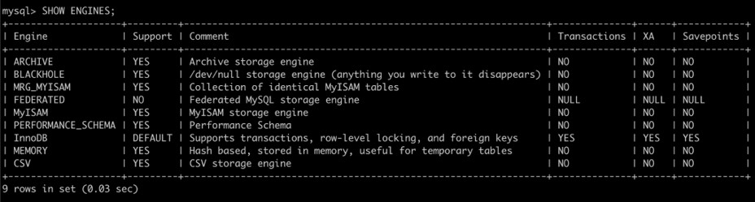

### Melihat Table

`SHOW TABLES;`

### Membuat Table

```sql
CREATE TABLE barang (
	kode INT,
	name VARCHAR(100),
	harga INT,
	jumlah INT
) ENGINE InnoDB;
```

### Melihat Struktur Data

```sql
DESCRIBE name_tabel;

DESC nama_tabel;

SHOW CREATE TABLE name_tabel;
```

### Mengubah Table

```sql
ALTER TABLE barang
	ADD COLUMN nama_column TEXT,
	DROP COLUMN nama,
	RENAME COLUMN name TO nama_baru,
	MODIIFY nama VARCHAR(100) AFTER jumlah,
	MODIIFY nama VARCHAR(100) FIRST;
```

### Null Value

- Null adalah nilai ketika kita tidak mengisi data ke dalam kolom
- Secara default, saat kita membuat kolom, kolom tersebut bisa bernilai NULL, jika kita tidak ingin menerima nilai NULL, kita bisa menambahkan NOT NULL ketika pembuatan kolom nya

### Default Value

- Saat kita menyimpan data ke dalam tabel, lalu kita hanya menyimpan beberapa kolom (tidak semuanya), kolom yang tidak kita beri nilai secara default nilainya adalah NULL
- Jika kita ingin mengubah default value nya, kita bisa menambahkan perintah DEFAULT NILAI ketika pembuatan kolom nya
- Khusus tipe data DATETIME atau TIMESTAMP, jika kita ingin menggunakan default value dengan nilai waktu saat ini, kita bisa gunakan kata kunci CURRENT_TIMESTAMP

### Membuat Ulang Table

```sql
TRUNCATE name_tabel;
```

### Menghapus Table

```sql
DROP TABLE nama_tabel
```

## #11 Insert Data

- Sebelum kita meng memasukkan data kedalam tabel, tabel harus dibuat terlebih dahulu
- Kita bisa menyebutkan kolom mana yang ingin kita isi, jika kita tidak menyebutkan kolom nya, artinya kolom tersebut tidak akan kita isi, dan secara otomatis kolom yang tidak kita isi, nilainya akan NULL, kecuali memiliki DEFAULT VALUE
- Untuk memasukkan data kedalam tabel, kita bisa menggunakan perintah SQL yang bernama INSERT

### Membuat Table Produk

```sql
CREATE TABLE products
(
	id 			VARCHAR(10)  NOT NULL,
	name 		VARCHAR(100) NOT NULL,
	description TEXT,
	price 		INT UNSIGNED NOT NULL,
	quantity 	INT UNSIGNED NOT NULL DEFAULT 0,
	created_at 	TIMESTAMP    NOT NULL DEFAULT CURRENT_TIMESTAMP
) ENGINE InnoDB;
```

### Memasukkan Data

```sql
INSERT INTO products(id, name, price quantity)
VALUES ("P0001", "Mie Ayam Original", 15000, 100);

INSERT INTO products(id, name, description, price quantity)
VALUES ("P0002", "Mie Ayam Bakso Tahu", "Mie Ayam Original + Bakso Tahu", 20000, 100);
```

### Memasukan Beberapa Data Sekaligus

```sql
INSERT INTO products(id, name, price quantity)
VALUES ("P0003", "Mie Ayam Ceker", 20000, 100),
		("P0003", "Mie Ayam Spesial", 25000, 100),
		("P0005", "Mie Ayam Yamin", 15000, 100);
```

## #12 Select Data

- Untuk mengambil data di tabel, kita bisa menggunakan SQL dengan kata kunci SELECT
- SELECT bisa digunakan untuk mengambil semua kolom yang ada di tabel, atau sebagian kolom saja
- Jika kita ingin mengambil semua kolom, kita bisa gunakan karakter \* (bintang)
- Jika kita hanya ingin mengambil beberapa kolom saja, kita bisa sebutkan nama-nama kolom yang ingin kita ambil datanya

### Mengambil Data

```sql
SELECT * FROM products;

SELECT id, bame, price, quantity FROM products;
```

## #13 Primary Key

- Saat kita membuat tabel, idealnya tiap tabel memiliki Primary Key
- Primary key adalah sebuah kolom yang kita tunjuk sebagai id dari tabel tersebut
- Primary key adalah identitas untuk tiap baris data di dalam tabel
- Primary key harus unik, tidak boleh ada data dengan primary key yang sama
- Kita bisa menunjuk kolom yang akan kita jadikan primary key

### Primary Key di Multiple Column

- Kita bisa membuat primary key dengan kombinasi beberapa kolom
- Namun disarankan untuk tetap menggunakan satu kolom ketika membuat primary key
- Kecuali ada kasus khusus, seperti membuat tabel yang berelasi MANY TO MANY (yang nanti akan kita bahas)

### Menambahkan Primary Ke Ketika Membuat Tabel

```sql
CREATE TABLE products (
	id 			VARCHAR(10)  NOT NULL,
	name 		VARCHAR(100) NOT NULL,
	description TEXT,
	price 		INT UNSIGNED NOT NULL,
	quantity 	INT UNSIGNED NOT NULL DEFAULT 0,
	created_at 	TIMESTAMP    NOT NULL DEFAULT CURRENT_TIMESTAMP,
	PRIMARY KEY (id)
) ENGINE InnoDB;
```

### Menambah Primary Key di Tabel

```sql
ALTER TABLE products
	ADD PRIMARY KEY (id);
```

## #14 Where Clause

- Saat mengambil data menggunakan perintah SQL SELECT, kadang kita ingin melakukan pencarian data
- Misal, kita ingin mengambil data barang yang harganya 1jt, atau mengambil data barang yang quantity nya 0 (stok nya kosong)
- Hal ini bisa kita lakukan dengan WHERE clause setelah perintah SELECT

### Mencari Data

```sql
SELECT id, name, price, quantity
FROM products
WHERE quantity = 0;
```

## #15 Update Date

- Untuk mengubah data di tabel, kita bisa menggunakan perintah SQL UPDATE
- Saat menggunakan SQL UPDATE, kita harus memberi tahu data mana yang akan di update dengan WHERE clause
- Hati-hati ketika meng-update data di table, jika sampai WHERE clause nya salah, bisa-bisa kita malah meng-update seluruh data di tabel
- Untuk update, kita harus beritahu, kolom mana yang akan di update

### Menambah Kolom Kategori

```sql
ALTER TABLE products
	ADD COLUMN category ENUM ('Makanan', 'Minuman', 'Lain-Lain')
		AFTER name;
```

### Mengubah Satu Kolom

```sql
UPDATE products
SET category = 'Makanan'
WHERE id = "P0001";
```

### Mengubah Beberapa Kolom

```sql
UPDATE products
SET category 	= 'Makanan',
	description = 'Miw Ayam + Ceker'
WHERE id = 'P0003';
```

### Mengubah Dengan Value di Kolom

```sql
UPDATE products
SET price = price + 5000
WHERE id = 'P0004';
```

## #16 Delete Data

- Setelah kita tahu cara menambah, mengubah dan mengambil data di tabel, terakhir yang perlu kita ketahui adalah menghapus data di table
- Untuk menghapus data di table, kita bisa menggunakan perintah SQL DELETE
- Perintah SQL DELETE sama seperti UPDATE, kita perlu memberi tahu data mana yang akan di hapus dengan WHERE clause
- Dan hati-hati, jangan sampai salah menentukan WHERE clause, karena jika salah, bisa-bisa kita akan menghapus seluruh data di table

### Menghapus Data

```sql
DELETE
FROM products
WHERE id = 'P0009'
```

## #17 Alias

- MySQL memiliki fitur untuk melakukan alias untuk kolom dan tabel
- Alias berguna jika kita ingin mengubah nama kolom atau nama tabel ketika melakukan SELECT data
  Mungkin saat ini alias untuk tabel tidak terlalu terlihat gunanya, tapi nanti - ketika kita telah mempelajari tentang JOIN, maka fitur alias untuk tabel sangat berguna sekali

### Alias untuk Kolom

```sql
SELECT id 		as 'Kode',
	   name 	as 'Nama',
	   category as 'Kategori',
	   price 	as 'Harga',
	   quantity as 'Stok'
FROM products;
```

### Alias untuk tabel

```sql
SELECT p.id 	  AS 'Kode',
	   p.name 	  AS 'Nama',
	   p.category AS 'Kategori',
	   p.price    AS 'Harga',
	   p.quantity AS 'Stok'
FROM products AS p;
```

## #18 Where Operator

- Sebelumnya di materi where clause kita sudah menggunakan operator = (sama dengan)
- Sebenarnya sangat banyak sekali operator yang bisa kita gunakan ketika menggunakan where clause
- Sekarang kita akan bahas satu per satu

### Operator Perbandingan

| Operator       | Keterangan                   |
| -------------- | ---------------------------- |
| `=`            | Sama dengan                  |
| `<>` atau `!=` | Tidak sama dengan            |
| `<`            | Kurang dari                  |
| `<=`           | Kurang dari atau sama dengan |
| `>`            | Lebih dari                   |
| `>=`           | Lebih dari atau sama dengan  |

### MEncari Data dengan Operator Perbandingan

```sql
SELECT id, name, price, quantity
FROM products
WHERE quantity > 100;
```

### AND dan OR Operator

- Kadang kita ingin mencari data dengan beberapa gabungan kondisi, kita bisa menggunakan operator AND dan OR
- AND dan OR digunakan untuk menggabungkan beberapa dua operator

### Hasil Operator AND

| Hasil Operator 1 | Operator | Hasil Operator 2 | hasil Akhir |
| ---------------- | -------- | ---------------- | ----------- |
| Benar            | AND      | Benar            | Benar       |
| Salah            | AND      | Benar            | Salah       |
| Benar            | AND      | Salah            | Salah       |
| Salah            | AND      | Salah            | Salah       |

### Mencari Data dengan Operator AND

```sql
SELECT id, name, price, quantity
FROM products
WHERE quantity > 100 AND price > 10000;
```

### Hasil Operator OR

| Hasil Operator 1 | Operator | Hasil Operator 2 | hasil Akhir |
| ---------------- | -------- | ---------------- | ----------- |
| Benar            | OR       | Benar            | Benar       |
| Salah            | OR       | Benar            | Benar       |
| Benar            | OR       | Salah            | Benar       |
| Salah            | OR       | Salah            | Salah       |

### Mencari Data dengan Operator OR

```sql
SELECT id, name, price, quantity
FROM products
WHERE quantity > 500 OR price > 10000;
```

### Prioritas dengan Kurung ()

```sql
SELECT id, name, price, quantity
FROM products
WHERE (category = 'Makanan' OR quantity > 500)
	AND price > 10000;
```

### Like Operator

- LIKE operator adalah operator yang bisa kita gunakan untuk mencari sebagian data dalam String
- Ini cocok sekali ketika kita hanya ingin mencari sebagian kata dalam String
- Namun perlu diingat, operasi LIKE itu sangat lambat, oleh karena itu, tidak disarankan jika datanya sudah terlalu besar di tabel
- Operasi LIKE tidak case sensitive, jadi huruf besar dan kecil tidak akan berpengaruh

### Hasil Operator LIKE

| LIKE Operator | Hasil                   |
| ------------- | ----------------------- |
| LIKE 'b%'     | String dengan awalan b  |
| LIKE '%b'     | String dengan akhiran b |
| LIKE '%eko%'  | String berisi eko       |
| NOT LIKE      | Tidak LIKE              |

### Mencari Menggunakan LIKE Operator

```sql
SELECT *
FROM products
WHERE name LIKE '%mie%';
```

### NULL Operator

- Untuk mencari data yang berisi NULL, kita tidak bisa menggunakan operator perbandingan = NULL.
- Ada operator khusus untuk mencari data NULL, yaitu menggunakan NULL operator
- IS NULL, artinya mencari yang NULL
- IS NOT NULL, artinya mencari yang tidak NULL

### Mencari menggunakan NULL Operator

```sql
SELECT *
FROM products
WHERE description IS NULL;
```

### BETWEEN Operator

- Kadang kita ingin mencari data yang >= dan <= secara sekaligus
- Misal kita ingin mencari products yang harganya antara 10000 sampai 20000
  Untuk melakukan ini, kita bisa menggunakan WHERE price >= 10000 AND price <= 20000
- Namun ada operator BETWEEN yang bisa kita gunakan agar lebih sederhana
- Untuk kebalikannya, kita bisa gunakan NOT BETWEEN

### Mencari Menggunakan BETWEEN Operator

```sql
SELECT *
FROM products
WHERE price BETWEEN 10000 AND 20000;
```

### IN Operator

- Operator IN adalah operator untuk melakukan pencarian sebuah kolom dengan beberapa nilai.
- Misal kita ingin mencari products dengan category Makanan atau Minuman, maka kita bisa menggunakan operator IN

### Mencari Menggunakan IN Operator

```sql
SELECT *
FROM products
WHERE category IN ('Makanan', 'Minuman');
```

## #19 Order By Clause

- Untuk mengurutkan data ketika kita menggunakan perintah SQL SELECT, kita bisa menambahkan ORDER BY clause
- ORDER BY clause digunakan untuk mengurutkan data berdasarkan kolom yang dipilih, dan jenis urutan (ASC atau DESC)
- Kita juga bisa mengurutkan tidak hanya terhadap satu kolom, tapi beberapa kolom

### Mengurutkan data

```sql
SELECT *
FROM products
ORDER BY price ASC, id DESC;
```

## #20 Limit Clause

- Mengambil seluruh data di tabel bukanlah pilihan bijak, apalagi jika datanya sudah banyak sekali
- Kita bisa membatasi jumlah data yang diambil dalam SQL SELECT dengan LIMIT clause
- Selain membatasi jumlah data, kita juga bisa meng-skip sejumlah data yang tidak ingin kita lihat
- LIMIT biasanya digunakan saat melakukan paging di aplikasi kita

### Membatasi Hasil Query

```sql
SELECT *
FROM products
WHERE price > 0
ORDER BY price
LIMIT 2;
```

## Skip Hasil Query

```sql
SELECT *
FROM products
WHERE price > 0
ORDER BY price
LIMIT 2, 2;
```

## #21 Select Distinct Data

- Saat melakukan query dengan SELECT, kadang kita mendapatkan data yang duplikat
- Misal kita ingin melihat semua kategori di tabel products, maka otomatis hasil query SELECT akan duplikat, karena banyak sekali produk dengan kategori yang sama
- Jika kita ingin menghilangkan data-data duplikat tersebut , kita bisa menggunakan SELECT dengan tambahan DISTINCT sebelum nama kolom nya

### Menghilangkan Data Duplikat

```sql
SELECT DISTINCT category
FROM products;
```

## #22 Numeric Function

- MySQL memiliki banyak sekali fitur untuk manipulasi data angka
- Hal ini memudahkan kita untuk memanipulasi data angka
- Secara garis besar, fitur ini dibagi menjadi dua, Arithmetic Operator dan Mathematical Function

### Arithmetic Operator

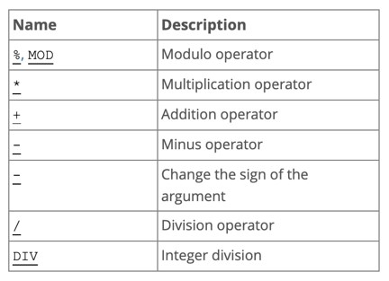

### Menggunakan Arithmetic Operator

```sql
SELECT 10 + 10 as hasil;

SELECT id, price DIV 1000 as 'Price in K'
FROM products;
```

### Mathematical Function

- Selain arithmetic operator, ada juga mathematical function
- Ini adalah kumpulan function yang terdapat di MySQL yang bisa kita gunakan sebagai fungsi-fungsi matematika
- Ada banyak sekali, dan tidak bisa kita bahas semua
- <https://dev.mysql.com/doc/refman/8.0/en/mathematical-functions.html>

### Menggunakan Mathematical Function

```sql
SELECT PI();

SELECT POWER(10, 2);

SELECT COS(10);
SELECT SIN(10);
SELECT TAS(10);
```

## #23 Auto Increment

- Kadang kita butuh angka yang berurut untuk membuat primary key, misal 1, 2, 3, dan seterusnya.
- Untuk melakukan hal ini secara manual bukanlah hal bijak, apalagi jika aplikasi yang kita buat diakses oleh banyak orang secara bersamaan
- MySQL memiliki fitur yang bernama auto increment, fitur ini bisa kita gunakan untuk menandai bahwa suatu primary key datanya diisi secara otomatis dari angka terakhir + 1
- Dengan menggunakan auto increment, kita tidak perlu lalu memasukkan data primary key, ini akan otomatis dibuat oleh MySQL

### Membuat Tabel dengan Auto Increment

```sql
CREATE TABLE admin
(
	id 		   INT NOT NULL AUTO_INCREMENT,
	first_name VARCHAR(100),
	last_name  VARCHAR(100),
	PRIMARY KEY (id)
) ENGINE InnoDB;
```

### Memasukan Data Tanpa Id

```sql
INSERT INTO admin(first_name, last_name) VALUES('Eko', 'Khannedy');
INSERT INTO admin(first_name, last_name) VALUES('Budi', 'Nugraha');
INSERT INTO admin(first_name, last_name) VALUES('Joko', 'Moroo');
```

### Melihat Id Terahkir

```sql
SELECT LAST_INSERT_ID();
```

## #24 String Function

- Sama seperti number, di MySQL juga banyak menyediakan function untuk tipe data String
- Ada banyak sekali function-function yang bisa kita gunakan
- <https://dev.mysql.com/doc/refman/8.0/en/string-functions.html>

### Menggunakan String Function

```sql
SELECT id, LOWER(name) as 'Name Lower'
FROM products;

SELECT id, name, LENGTH(name) as 'Name Length'
FROM products;
```

## #25 Date and Time Functions

- MySQL juga menyediakan banyak sekali function yang bisa kita gunakan untuk mengolah data tipe Date dan Time
- <https://dev.mysql.com/doc/refman/8.0/en/date-and-time-functions.html>

### Menambahkan Kolom Timestamp

```sql
SELECT id,
	   EXTRACT(YEAR FROM created_at) AS 'Year',
	   EXTRACT(MONTH FROM created_at) AS 'Mear',
FROM products;

SELECT id, YEAR(created_at), MONTH(created_at)
FROM products;
```

## #26 Flow Control Function

- MySQL memiliki fitur flow control function
- Ini mirip IF ELSE di bahasa pemrograman
- Tapi ingat, fitur ini tidak se kompleks yang dimiliki bahasa pemrograman
- <https://dev.mysql.com/doc/refman/8.0/en/flow-control-functions.html>

### Menggunakan Control Flow CASE

```sql
SELECT id,
	   CASE category
	   		WHEN 'Makanan' THEN 'Enak'
	   		WHEN 'Minuman' THEN 'Segar'
	   		ELSE 'Apa itu?'
	   		END AS 'category'
FROM products;
```

### Menggunakan Control Flow IF

```sql
SELECT id,
	   price,
	   IF(price <= 15000, 'Murah',
	   		IF(price <= 20000, 'Mahal', 'Mahal Banget')
	   		)  AS 'Mahal?'
FROM products;
```

### Menggunakan Control Flow IFNULL

```sql
SELECT id, name, IFNULL(description, 'Kosong')
FROM products;
```

## #27 Aggregate Function

- MySQL mendukung function-function untuk melakukan aggregate
- Misal, kita ingin melihat harga paling mahal di tabel product, atau harga termurah, atau rata-rata harga produk, atau total jumlah data di tabel, dan lain-lain
- <https://dev.mysql.com/doc/refman/8.0/en/aggregate-functions.html>

### Menggunakan Aggregate Function

```sql
SELECT COUNT(id) as 'Total Product' FROM products;

SELECT AVG(price) as 'Rata-Rata' FROM products;

SELECT MAX(price) as 'Harga Termahal' FROM products;

SELECT MIN(price) as 'Harga Termurah' FROM products;
```

## #28 Grouping

- Kadang saat melakukan aggregate, kita ingin datanya di grouping berdasarkan kriteria tertentu
- Misal kita ingin melihat rata-rata harga product, tapi ingin per category
- Atau kita ingin melihat total semua product, tapi per category
- Hal ini bisa dilakukan di MySQL dengan menggunakan GROUP BY clause
- GROUP BY clause ini hanya bisa digunakan jika kita menggunakan aggregate function
- <https://dev.mysql.com/doc/refman/8.0/en/group-by-modifiers.html>

### Menggunakan GROUP BY

```sql
SELECT category,
	   COUNT(id) as 'Total Product'
FROM products
GROUP BY category;
```

### HAVING Clause

- Kadang kita ingin melakukan filter terhadap data yang sudah kita grouping
- Misal kita ingin menampilkan rata-rata harga per kategori, tapi yang harganya diatas 10.000 misalnya
- Jika menggunakan WHERE di SELECT, hal ini tidak bisa dilakukan
  Untuk memfilter hasil aggregate function, kita harus menggunakan HAVING clause

### Menggunakan HAVING Clause

```sql
SELECT category
	   COUNT(id) as total
FROM products
GROUP BY category
HAVING total > 1;
```

## #29 Constraint

- Di MySQL, kita bisa menambahkan constraint untuk menjaga data di tabel tetap baik
- Constraint sangat bagus ditambahkan untuk menjaga terjadi validasi yang salah di program kita, sehingga data yang masuk ke database tetap akan terjaga

### Unique Constraint

- Unique constraint adalah constraint yang memastikan bahwa data kita tetap unique
- Jika kita mencoba memasukkan data yang duplikat, maka MySQL akan menolak data tersebut

### Membuat Table dengan Unique Constraint

```sql
CREATE TABLE customers
(
	id 		   INT 			NOT NULL AUTO_INCREMENT,
	email 	   VARCHAR(100) NOT NULL,
	first_name VARCHAR(100) NOT NULL,
	last_name  VARCHAR(100),
	PRIMARY KEY (id),
	UNIQUE KEY email_unique (email)
);
```

### Menambah/Menghapus Unique Constraint

```sql
ALTER TABLE customers
	ADD CONSTRAINT email_unique UNIQUE (email);


ALTER TABLE customers
	DROP CONSTRAINT email_unique;
```

### Check Constraint

- Check constraint adalah constraint yang bisa kita tambahkan kondisi pengecekannya
- Ini cocok untuk mengecek data sebelum dimasukkan ke dalam database
- Misal kita ingin memastikan bahwa harga harus diatas 1000 misal
- Maka kita bisa menggunakan check constraint

### Membuat Table dengan Check Constraint

```sql
CREATE TABLE products
(
	id 			VARCHAR(10)  NOT NULL,
	name 		VARCHAR(100) NOT NULL,
	description TEXT,
	price 		INT UNSIGNED NOT NULL,
	quantity 	INT UNSIGNED NOT NULL DEFAULT 0,
	created_at 	TIMESTAMP    NOT NULL DEFAULT CURRENT_TIMESTAMP,
	PRIMARY KEY (id),
	CONSTRAINT price_check CHECK (price >= 1000)
);
```

### Menambah/Menghapus Check Constraint

```sql
ALTER TABLE products
	ADD CONSTRAINT price_check CHECK (price >= 1000);


ALTER TABLE products
	DROP CONSTRAINT price_check;
```

## #30 Index

- Secara default, MySQL akan menyimpan data di dalam disk seperti tabel biasanya
- Hal ini menyebabkan, ketika kita mencari data, maka MySQL akan melakukan pencarian dari baris pertama sampai terakhir, yang artinya semakin banyak datanya, maka akan semakin lambat proses pencarian datanya
- Saat kita membuat index, MySQL akan menyimpan data dalam struktur data B-Tree : <https://en.wikipedia.org/wiki/B-tree>
- Tidak hanya akan mempermudah kita saat melakukan pencarian, index juga akan mempermudah kita ketika melakukan pengurutan menggunakan ORDER BY
- <https://dev.mysql.com/doc/refman/8.0/en/optimization-indexes.html>

### Cara Kerja Index

- Kita bisa membuat lebih dari satu index di table, dan setiap kita membuat index, kita bisa membuat index untuk beberapa kolom sekaligus
- Misal kita membuat index
  (col1, col2, col3)
- Artinya kita punya kemampuan untuk mencari lebih menggunakan index untuk kombinasi query di (col1), (col1, col2) dan (col1, col2, col3)

### Efek Samping Membuat Index

- Index mungkin akan mempercepat untuk proses pencarian dan query data
- Namun, saat kita membuat index, artinya MySQL akan melakukan proses update data di index tiap kali kita menambah, mengubah atau menghapus data di table
- Artinya Index membuat proses pencarian dan query lebih cepat, tapi memperlambat proses manipulasi data
- Oleh karena itu, kita harus bijak saat membuat index

### Tidak Perlu Index

- Saat kita membuat PRIMARY KEY dan UNIQUE constraint, kita tidak perlu menambahkan lagi index
- Hal ini dikarenakan MySQL secara otomatis akan menambahkan index pada kolom PRIMARY KEY dan UNIQUE constraint

### Membuat Table dengan Index

```sql
CREATE TABLE sellers
(
	id 	  INT NOT NULL AUTO_INCREMENT,
	name  VARCHAR(100),
	email VARCHAR(100),
	PRIMARY KEY (id),
	UNIQUE KEY email_unique (email),
	INDEX name_index (name)
) ENGINE InnoDB;
```

### Menambah/Menghapus Index

```sql
ALTER TABLE sellers
	ADD INDEX name_index (name);


ALTER TABLE sellers
	DROP INDEX name_index:
```

## #31 Full-Text Search

### Masalah dengan LIKE operator

- Kadang kita ingin mencari sebuah kata dalam tabel, dan biasanya kita akan menggunakan LIKE operator
- Operasi yang dilakukan LIKE operator adalah dengan cara mencari seluruh data di tabel dari baris pertama sampai terakhir, hal ini membuat operasi LIKE sangat lambat
- Menambah index di tabel juga tidak akan membantu, karen LIKE operator tidak menggunakan index
- MySQL menyediakan fitur Full Text Search jika ada kasus kita ingin melakukan hal ini

### Full-Text Search

- Full-Text Search memungkinkan kita bisa mencari sebagian kata di kolom dengan tipe data String
- Ini sangat cocok ketika pada kasus kita memang membutuhkan pencarian yang tidak hanya sekedar operasi = (equals, sama dengan)
- <https://dev.mysql.com/doc/refman/8.0/en/fulltext-search.html>

### Membuat Table dengan Full-Text Search

```sql
CREATE TABLE products
(
	id 			VARCHAR(10)  NOT NULL,
	name 		VARCHAR(100) NOT NULL,
	description TEXT,
	price 		INT UNSIGNED NOT NULL,
	quantity 	INT UNSIGNED NOT NULL DEFAULT 0,
	created_at 	TIMESTAMP    NOT NULL DEFAULT CURRENT_TIMESTAMP,
	PRIMARY KEY (id),
	FULLTEXT product_search (name, description)
) ENGINE InnoDB;
```

### Menambah/Menghapus Full-Text Search

```sql
ALTER TABLE products
	ADD FULLTEXT product_search (name, description);

ALTER TABLE products
	DROP index product_search;
```

### Mode Full-Text Search

MySQL menyediakan beberapa mode untuk melakukan pencarian di Full-Text Search, kita bisa memilihnya sesuai kebutuhan kita

- Natural Language, yaitu mencari seperti bahasa natural (per kata) : <https://dev.mysql.com/doc/refman/8.0/en/fulltext-natural-language.html>
- Boolean, yaitu mencari dengan kemampuan mengandung kata (+) atau tidak mengandung kata (-) dan lain-lain : <https://dev.mysql.com/doc/refman/8.0/en/fulltext-boolean.html>
- Query Expansion, yaitu mencari seperti natural language, namun melakukan dua kali pencarian, pencarian pertama menggunakan natural language, pencarian kedua melakukan pencarian dari kedekatan hasil pertama, misal kita mencari kata “bakso”, lalu ternyata di dalam “bakso” ada kata “mie”, maka kemungkinan query kedua akan mencari kata “mie” juga : <https://dev.mysql.com/doc/refman/8.0/en/fulltext-query-expansion.html>

### Mencari dengan Natural Language Mode

```sql
SELECT *
FROM products
WHERE MATCH(name, description)
		AGAINST('ayam' IN NATURAL LANGUAGE MODE);
```

### Mencari dengan Boolean Mode

```sql
SELECT *
FROM products
WHERE MATCH(name, description)
		AGAINST('+mie -bakso' IN BOOLEAN MODE);
```

### Mencari dengan Query Expansion Mode

```sql
SELECT *
FROM products
WHERE MATCH(name, description)
		AGAINST('bakso' WITH QUERY EXPANSION);
```

## #32 Table Relationship

- Dalam Relational DBMS, salah satu fitur andalan nya adalah table relationship. Yaitu relasi antar tabel
- Kita bisa melakukan relasi dari satu tabel ke tabel lain.
- Dalam kehidupan nyata pun pasti kita akan sering membuat relasi antar tabel
- Misal, saat kita membuat aplikasi penjualan, di laporan penjualan pasti ada data barang. Jika di tabel artinya tabel penjualan akan berelasi dengan tabel barang
- Misal dalam aplikasi kampus, tabel mahasiswa akan berelasi dengan tabel mata kuliah, dan tabel dosen
- Dan lain-lain

### Foreign Key

- Saat membuat relasi tabel, biasanya kita akan membuat sebuah kolom sebagai referensi ke tabel lainnya
- Misal saat kita membuat tabel penjualan, di dalam tabel penjualan, kita akan menambahkan kolom id_produk sebagai referensi ke tabel produk, yang berisi primary key di tabel produk
- Kolom referensi ini di MySQL dinamakan Foreign Key
- Kita bisa menambah satu satu lebih foreign key ke dalam sebuah tabel
- Membuat foreign key sama seperti membuat kolom biasanya, hanya saja kita perlu memberi tahu MySQL bahwa itu adalah foreign key ke tabel lain

### Membuat Table dengan Foreign Key

```sql
CREATE TABLE wishlist
(
	id 			INT 		NOT NULL AUTO_INCREMENT,
	id_product  VARCHAR(10) NOT NULL,
	description TEXT,
	PRIMARY KEY (id),
	CONSTRAINT fk_wishlist_product,
		FOREIGN KEY (id_product) REFERENCES products (id)
) ENGINE InnoDB;
```

### Menambah/Menghapus Foreign Key

```sql
ALTER TABLE wishlist
	ADD CONSTRAINT fk_wishlist_product
		FOREIGN KEY (id_product) REFERENCES products (id);

ALTER TABLE wishlist
	DROP CONSTRAINT fk_wishlist_product;
```

### Keuntungan Menggunakan Foreign Key

- Foreign key memastikan bahwa data yang kita masukkan ke kolom tersebut harus tersedia di tabel reference nya
- Selain itu saat kita menghapus data di tabel reference, MySQL akan mengecek apakah id nya digunakan di foreign key di tabel lain, jika digunakan, maka secara otomatis MySQL akan menolak proses delete data di tabel reference tersebut

### Ketika Menghapus Data Berelasi

- Seperti yang sebelumnya dibahas, ketika kita menghapus data yang berelasi, maka secara otomatis MySQL akan menolak operasi delete tersebut
- Kita bisa mengubah fitur ini jika kita mau, ada banyak hal yang bisa dilakukan ketika data berelasi dihapus, defaultnya memang akan ditolak (RESTRICT)

### Behavior Foreign Key

| Behavior  | ON DELETE         | ON UPDATE             |
| --------- | ----------------- | --------------------- |
| RESTRICT  | Ditolak           | Ditolak               |
| CASCADE   | Data akan dihapus | Data akan ikut diubah |
| NO ACTION | Data dibiarkan    | Data dibiarkan        |
| SET NULL  | Diubah jadi NULL  | Diubah jadi NULL      |

### Mengubah Behavior Menghapus Relasi

```sql
ALTER TABLE wishlist
	ADD CONSTRAINT fk_wishlist_product
		FOREIGN KEY (id_product) REFERENCES products (id)
			ON DELETE CASCADE on UPDATE CASCADE;
```

## #33 Join

- MySQL mendukung query SELECT langsung ke beberapa tabel secara sekaligus
- Namun untuk melakukan itu, kita perlu melakukan JOIN di SQL SELECT yang kita buat
- Untuk melakukan JOIN, kita perlu menentukan tabel mana yang merupakan referensi ke tabel lain
- Join cocok sekali dengan foreign key, walaupun di MySQL tidak ada aturan kalau JOIN harus ada foreign key
- Join di MySQL bisa dilakukan untuk lebih dari beberapa tabel
- Tapi ingat, semakin banyak JOIN, maka proses query akan semakin berat dan lambat, jadi harap bijak ketika melakukan JOIN
- Idealnya kita melakukan JOIN jangan lebih dari 5 tabel, karena itu bisa berdampak ke performa query yang lambat

### Melakukan JOIN Table

```sql
SELECT * FROM wishlist
JOIN products ON (wishlist.id_product = products.id);

SELECT products.id, products.name, wishlist.description
FROM wishlist
JOIN products ON (products.id = wishlist.id_product);
```

### Membuat Relasi ke Table Customers

```sql
ALTER TABLE wishlist
	ADD COLUMN id_customer INT;

ALTER TABLE wishlist
ADD CONSTRAINT fk_wishlist_customer
FOREIGN KEY (id_customer) REFERENCES customers(id);
```

### Melakukan JOIN Multiple Table

```sql
SELECT customers.email, products.id, products.name, wishlist.description
FROM wishlist
JOIN products ON (products.id = wishlist.id_product)
JOIN customers ON (customers.id = wishlist.id_customer);
```

## #34 One to One Relationship

### Jenis-Jenis Relasi Tabel

- Sekarang kita sudah tau untuk melakukan relasi antar tabel, kita bisa menggunakan FOREIGN KEY
- Dan untuk melakukan SELECT beberapa tabel, kita bisa menggunakan JOIN
- Dalam konsep relasi, ada banyak jenis-jenis relasi antar tabel
- Sekarang kita akan bahas dari yang pertama yaitu One to One relationship

### One to One Relationship

- One to One relationship adalah relasi antar tabel yang paling sederhana
- Artinya tiap data di sebuah tabel hanya boleh berelasi ke maksimal 1 data di tabel lainnya
- Tidak boleh ada relasi lebih dari 1 data
- Contoh misal, kita membuat aplikasi toko online yang terdapat fitur wallet, dan 1 customer, cuma boleh punya 1 wallet

### Diagram One to One Relationship

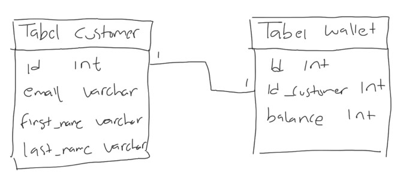

### Membuat One to One Relationship

- Cara membuat One to One relationship cukup mudah
- Kita bisa membuat kolom foreign key, lalu set kolom tersebut menggunakan UNIQUE KEY, hal ini dapat mencegah terjadi data di kolom tersebut agar tidak duplikat
- Atau cara lainnya, kita bisa membuat tabel dengan primary key yang sama, sehingga tidak butuh lagi kolom untuk FOREIGN KEY

### Membuat Table Wallet

```sql
CREATE TABLE wallet
(
	id 			INT NOT NULL AUTO_INCREMENT,
	id_customer INT NOT NULL,
	balance 	INT NOT NULL DEFAULT 0,
	PRIMARY KEY (id),
	UNIQUE KEY fx_id_customer_unique (id_customer),
	CONSTRAINT fx_wallet_customer
		FOREIGN KEY (id_customer) REFERENCES customers (id)
) ENGINE InnoDB;
```

## #35 One to Many Relationship

- One to many relationship adalah relasi antar tabel dimana satu data bisa digunakan lebih dari satu kali di tabel relasinya
- Berbeda dengan one to one yang cuma bisa digunakan maksimal 1 kali di tabel relasinya, one to many tidak ada batasan berapa banyak data digunakan
- Contoh relasi antar tabel categories dan products, dimana satu category bisa digunakan oleh lebih dari satu product, yang artinya relasinya nya one category to many products
- Pembuatan relasi one to many sebenarnya sama dengan one to one, yang membedakan adalah, kita tidak perlu menggunakan UNIQUE KEY, karena datanya memang bisa berkali-kali ditambahkan di tabel relasi nya

### Diagram One to Many Relationship


### Membuat Table Category

```sql
CREATE TABLE categories
(
	id 	 VARCHAR(10) NOT NULL,
	name VARCHAR(10) NOT NULL
) ENGINE InnoDB;
```

### Mengubah Table Produk

```sql
ALTER TABLE products
	DROP COLUMN category;

ALTER TABLE products
	ADD COLUMN id_category VARCHAR(100);

ALTER TABLE products
	ADD CONSTRAINT fk_product_category
		FOREIGN KEY (id_category) REFERENCES categories (id);
```

## #36 Many to Many Relationship

- Many to Many adalah table relationship yang paling kompleks, dan kadang membingungkan untuk pemula
- Many to Many adalah relasi dimana ada relasi antara 2 tabel dimana table pertama bisa punya banyak relasi di table kedua, dan table kedua pun punya banyak relasi di table pertama
- Ini memang sedikit membingungkan, bagaimana caranya bisa relasi kebanyakan secara bolak balik, sedangkan di table kita cuma punya 1 kolom?
- Contoh relasi many to many adalah relasi antara produk dan penjualan, dimana setiap produk bisa dijual berkali kali, dan setiap penjualan bisa untuk lebih dari satu produk

### Diagram Many to Many Relationship

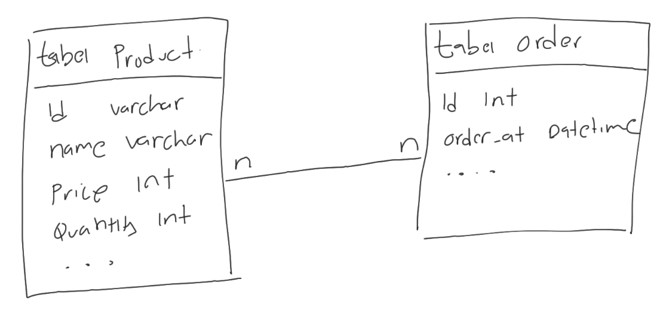

### Bagaimana Implemtasi Many to Many

- Sekarang pertanyaannya, bagaimana implementasi many to many?
- Apakah kita harus menambahkan id_order di table products? atau id_product di table orders?

### Id Product di Table Order

- Jika kita menambahkan id_product di table orders, artinya sekarang sudah benar, bahwa 1 product bisa dijual berkali-kali
- Namun masalahnya adalah, berarti 1 order hanya bisa membeli 1 product, karena cuma ada 1 kolom untuk id_product
- Oke kalo gitu kita tambahkan id_product1, id_product2, dan seterusnya. Solusi ini bisa dilakukan, tapi tidak baik, artinya akan selalu ada maksimal barang yang bisa kita beli dalam satu order

### Id Order di Table Product

- Jika kita tambahkan id_order di table products, artinya sekarang 1 order bisa membeli lebih dari 1 product, oke sudah benar
- Tapi sayangnya masalahnya terbalik sekarang, 1 product cuma bisa dijual satu kali, tidak bisa dijual berkali-kali, karena kolom id_order nya cuma 1
- Kalupun kita tambah id_order1, id_order2 dan seterusnya di table product, tetap ada batasan maksimal nya
- Lantai bagaimana solusinya untuk relasi many to many?

### Membuat Table Relasi

- Solusi yang biasa dilakukan jika terjadi relasi many to many adalah, biasanya kita akan menambah 1 tabel ditengahnya
- Tabel ini bertugas sebagai jembatan untuk menggabungkan relasi many to many
- Isi table ini akan ada id dari table pertama dan table kedua, dalam kasus ini adalah id_product dan id_order
- Dengan demikian, kita bisa menambahkan beberapa data ke dalam tabel relasi ini, sehingga berarti satu product bisa dijual beberapa kali di dalam table order, dan satu order bisa membeli lebih dari satu product

### Diagram Many to Many Relationship

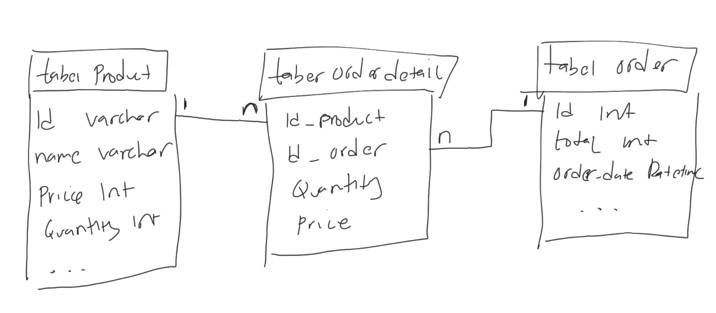

### Membuat Table Order

```sql
CREATE TABLE orders
(
	id 		   INT 		NOT NULL AUTO_INCREMENT,
	total 	   INT 		NOT NULL,
	order_date DATETIME NOT NULL DEFAULT CURRENT_TIMESTAMP,
	PRIMARY KEY (id)
) ENGINE InnoDB;
```

### Membuat Table Order Detail

```sql
CREATE TABLE orders_detail
(
	id_product VARCHAR(10) NOT NULL,
	id_order   INT 		   NOT NULL,
	price 	   INT 		   NOT NULL,
	quantity   INT 		   NOT NULL,
	PRIMARY KEY (id_product, id_order)
) ENGINE InnoDB;
```

### Membuat Foreign Key

```sql
ALTER TABLE orders_detail
	ADD CONSTRAINT fk_orders_detail_product
		FOREIGN KEY (id_product) REFERENCES products (id);

ALTER TABLE orders_detail
	ADD CONSTRAINT fk_orders_detail_order
		FOREIGN KEY (id_order) REFERENCES orders (id);
```

### Melihat Data Order, Detail dan Product-Nya

```sql
SELECT *
FROM orders
	JOIN orders_detail ON (orders_detail.id_order = orders.id)
	JOIN products ON (products.id = orders_detail.id_product);
```

## #37 Jenis-Jenis Join

Sebelumnya kita sudah bahas tentang JOIN table, tapi sebenarnya ada banyak sekali jenis-jenis JOIN table di MySQL, diantaranya :

- INNER JOIN
- LEFT JOIN
- RIGHT JOIN
- CROSS JOIN

### Inner Join

- INNER JOIN adalah mekanisme JOIN, dimana terdapat relasi antara tabel pertama dan tabel kedua
- Jika ada data di tabel pertama yang tidak memiliki relasi di table kedua ataupun sebaliknya, maka hasil INNER JOIN tidak akan ditampilkan
  Ini adalah default JOIN di MySQL
- Jika kita menggunakan JOIN seperti yang sudah kita praktekan sebelumnya, sebenarnya itu akan melakukan INNER JOIN

### Inner Join Diagram


### Melakukan Inner Join

```sql
SELECT * FROM categories
INNER JOIN products ON (products.id_category = categories.id);
```

### Left Join

- LEFT JOIN adalah mekanisme JOIN seperti INNER JOIN, namun semua data di table pertama akan diambil juga
- Jika ada yang tidak memiliki relasi di table kedua, maka hasilnya akan NULL

### Left Join Diagram


### Melakukan Left Join

```sql
SELECT * FROM categories
LEFT JOIN products ON (products.id_category = categories.id);
```

### Right Join

- RIGHT JOIN adalah mekanisme JOIN seperti INNER JOIN, namun semua data di table kedua akan diambil juga
- Jika ada yang tidak memiliki relasi di table pertama, maka hasilnya akan NULL

### Right Join Diagram


### Melakukan Right Join

```sql
SELECT * FROM categories
RIGHT JOIN products ON (products.id_category = categories.id);
```

### Cross Join

- CROSS JOIN adalah salah satu JOIN yang sangat jangan sekali digunakan
- CROSS JOIN adalah melakukan join dengan cara mengkalikan data di tabel pertama dengan dada di table kedua
- Artinya jika ada 5 data di tabel pertama, dan 5 data di tabel kedua, akan menghasilkan 25 kombinasi data (5 x 5)
- Sekali lagi perlu diingat, ini adalah JOIN yang sangat jarang sekali digunakan

### Menggunakan Cross Join

```sql
SELECT * FROM categories
CROSS JOIN products;
```

### Membuat Tabel Perkalian

```sql
CREATE TABLE numbers
(
	id INT NOT NULL,
	PRIMARY KEY (id)
) ENGINE InnoDB;
```

### Cross Join Tabel Perkalian

```sql
SELECT number1.id, number2.id, (number1.id * number2.id) as result
FROM numbers as number1
		CROSS JOIN numbers as number1
ORDER BY number1.id, number2.id;
```

## #38 Subqueries

### Subquery di WHERE

- MySQL mendukung pencarian data menggunakan WHERE dari hasil SELECT query
- Fitur ini dinamakan Subquery
- Contoh, kita ingin mencari products yang harganya diatas harga rata-rata, artinya kita akan melakukan SELECT dengan WHERE price > harga rata, dimana harga rata-rata perlu kita hitung menggunakan query SELECT lainnya menggunakan aggregate function AVG

### Melakukan Subquery di WHERE Clause

```sql
SELECT *
FROM products
WHERE price > (SELECT AVG(price) FROM products);
```

### Subquery di FROM

- Selain di WHERE clause, Subquery juga bisa dilakukan di FROM clause
- Misal kita ingin mencari data dari hasil query SELECT, itu bisa kita lakukan di MySQL

### Melakukan Subquery di FROM Clause

```sql
SELECT MAX(price)
FROM (SELECT price
	FROM categories
		INNER JOIN products
			ON (products.id_category = categories.id)) as cp;
```

## #39 Set Operator

MySQL mendukung operator Set, dimana ini adalah operasi antara hasil dari dua SELECT query. Ada banyak jenis operator Set, yaitu :

- UNION
- UNION ALL
- INTERSECT, dan
- MINUS

### Membuat Table Guest Book

```sql
CREATE TABLE guestbooks
(
	id  	INT 		 NOT NULL AUTO_INCREMENT,
	email 	VARCHAR(100) NOT NULL,
	title 	VARCHAR(200) NOT NULL,
	content TEXT,
	PRIMARY KEY (id)
) ENGINE InnoDB;
```

### UNION

- UNION adalah operasi menggabungkan dua buah SELECT query, dimana jika terdapat data yang duplikat, data duplikatnya akan dihapus dari hasil query

### Diagram UNION


### Melakukan Query UNION

```sql
SELECT DISTINCT email FROM customers
UNION
SELECT DISTINCT email FROM guestbooks;
```

### UNION ALL

- UNION ALL adalah operasi yang sama dengan UNION, namun data duplikat tetap akan ditampilkan di hasil query nya

### Diagram UNION ALL


### Melakukan Query UNION ALL

```sql
SELECT DISTINCT email FROM customers
UNION ALL
SELECT DISTINCT email FROM guestbooks;

SELECT email, COUNT(email)
FROM (SELECT DISTINCT email FROM customers
	  UNION ALL
	  SELECT DISTINCT email FROM guestbooks) as emails
GROUP BY email;
```

### INTERSECT

- INTERSECT adalah operasi menggabungkan dua query, namun yang diambil hanya data yang terdapat pada hasil query pertama dan query kedua
- Data yang tidak hanya ada di salah satu query, kan dihapus di hasil operasi INTERSECT
- Data nya muncul tidak dalam keadaan duplikat
- Sayangnya, MySQL tidak memiliki operator INTERSECT, dengan demikian untuk melakukan operasi INTERSECT, kita harus lakukan secara manual menggunakan JOIN atau SUBQUERY

### Diagram INTERSECT


### Melakukan Query INTERSECT

```sql
SELECT DISTINCT email FROM customers
WHERE email IN (SELECT DISTINCT email FROM guestbooks);

SELECT DISTINCT customers.email FROM customers
INNER JOIN guestbooks ON (guestbooks.email = customers.email);
```

### MINUS

- MINUS adalah operasi dimana query pertama akan dihilangkan oleh query kedua
- Artinya jika ada data di query pertama yang sama dengan data yang ada di query kedua, maka data tersebut akan dihapus dari hasil query MINUS
- Sayang nya, di MySQL juga tidak ada operator MINUS, namun hal ini bisa kita lakukan menggunakan JOIN

### Diagram MINUS


### Melakukan Query MINUS

```sql
SELECT DISTINCT customers.email, guestbooks.email FROM customers
LEFT JOIN guestbooks ON (guestbooks.email = customers.email)
WHERE guestbooks.email IS NULL;
```

## #40 Transaction

### Kenapa Butuh Transaction?

- Saat membuat aplikasi berbasis database, jarang sekali kita akan melakukan satu jenis perintah SQL per aksi yang dibuat aplikasi
- Contoh, ketika membuat toko online, ketika customer menekan tombol Pesan, banyak yang harus kita lakukan, misal
  - Membuat data pesanan di tabel order
  - Membuat data detail pesanan di tabel order detail
  - Menurunkan quantity di tabel produk
  - Dan yang lainnya
- Artinya, bisa saja dalam satu aksi, kita akan melakukan beberapa perintah sekaligus
- Jika terjadi kesalahan di salah satu perintah, harapannya adalah perintah-perintah sebelumnya dibatalkan, agar data tetap konsisten

### Database Transaction

- Database transaction adalah fitur di DBMS dimana kita bisa memungkinan beberapa perintah dianggap menjadi sebuah kesatuan perintah yang kita sebut transaction
- Jika terdapat satu saja proses gagal di transaction, maka secara otomatis perintah-perintah sebelumnya akan dibatalkan
- Jika sebuah transaction sukses, maka semua perintah akan dipastikan sukses

### Membuat Transaction


### Membatalkan Transaction


### Transaction di MySQL

| Perintah | Keterangan |
| START TRANSACTION | Memulai proses transaksi, proses selanjutnya akan dianggap transaksi sampai perintah COMMIT atau ROLLBACK |
| COMMIT | Menyimpan secara permanen seluruh proses transaksi |
| ROLLBACK | Membatalkan secara permanen seluruh proses transaksi |

### Yang Tida Bisa Menggunakan Transaction

- Perintah DDL (Data Definition Language) tidak bisa menggunakan fitur transaction
- DDL adalah perintah-perintah yang digunakan untuk merubah struktur, seperti membuat tabel, menambah kolom, menghapus tabel, menghapus database, dan sejenisnya
- Transaction hanya bisa dilakukan pada perintah DML (Data Manipulation Language), seperti operasi INSERT, UPDATE dan DELETE

## #41 Locking

- Locking adalah proses mengunci data di DBMS
- Proses mengunci data sangat penting dilakukan, salah satunya agar data benar-benar terjamin konsistensinya
- Karena pada kenyataannya, aplikasi yang akan kita buat pasti digunakan oleh banyak pengguna, dan banyak pengguna tersebut bisa saja akan mengakses data yang sama, jika tidak ada proses locking, bisa dipastikan akan terjadi RACE CONDITION, yaitu proses balapan ketika mengubah data yang sama
- Contoh saja, ketika kita belanja di toko online, kita akan balapan membeli barang yang sama, jika data tidak terjaga, bisa jadi kita salah mengupdate stock karena pada saat yang bersamaan banyak yang melakukan perubahan stock barang

### Locking Record

- Saat kita melakukan proses TRANSACTION, lalu kita melakukan prose perubahan data, data yang kita ubah tersebut akan secara otomatis di LOCK
- Hal ini membuat proses TRANSACTION sangat aman
- Oleh karena itu, sangat disarankan untuk selalu menggunakan fitur TRANSACTION ketika memanipulasi data di database, terutama ketika perintah manipulasinya lebih dari satu kali
- Locking ini akan membuat sebuah proses perubahan yang dilakukan oleh pihak lain akan diminta untuk menunggu
- Data akan di lock sampai kita melakukan COMMIT atau ROLLBACK transaksi tersebut

### Locking Record Manual

- Selain secara otomatis, kadang saat kita membuat aplikasi, kita juga sering melakukan SELECT query terlebih dahulu sebelum melakukan proses UPDATE misalnya.
- Jika kita ingin melakukan locking sebuah data secara manual, kita bisa tambahkan perintah FOR UPDATE di belakang query SELECT
- Saat kita lock record yang kita select, maka jika ada proses lain akan melakukan UPDATE, DELETE atau SELECT FOR UPDATE lagi, maka proses lain diminta menunggu sampai kita selesai melakukan COMMIT atau ROLLBACK transaction

### Deadlock

- Saat kita terlalu banyak melakukan proses Locking, hati-hati akan masalah yang bisa terjadi, yaitu DEADLOCK
- Deadlock adalah situasi ada 2 proses yang saling menunggu satu sama lain, namun data yang ditunggu dua-duanya di lock oleh proses lainnya, sehingga proses menunggunya ini tidak akan pernah selesai.

### Contoh Deadlock

- Proses 1 melakukan SELECT FOR UPDATE untuk data 001
- Proses 2 melakukan SELECT FOR UPDATE untuk data 002
- Proses 1 melakukan SELECT FOR UPDATE untuk data 002, diminta menunggu karena di lock oleh Proses 2
- Proses 2 melakukan SELECT FOR UPDATE untuk data 001, diminta menunggu karena di lock oleh Proses 1
- Akhirnya Proses 1 dan Proses 2 saling menunggu
- Deadlock terjadi

### Locking Table

- MySQL mendukung proses locking terhadap sebuah tabel
- Jika kita me lock table, artinya satu seluruh data di tabel tersebut akan di lock
- Ada 2 jenis lock table, yaitu READ dan WRITE
- Cara melakukan locking table adalah dengan perintah
  - LOCK TABLES nama_table READ;
  - LOCK TABLES nama_Table WRITE
- Setelah selesai melakukan lock table, kita bisa melakukan unlock dengan perintah : UNLOCK TABLES;

### Behaviour Lock Tables

| Perintah | Proses yang Melakukan Lock                            | Proses Lain                                                                   |
| -------- | ----------------------------------------------------- | ----------------------------------------------------------------------------- |
| READ     | Hanya bisa melakukan read terhadap tabel tersebut     | Hanya bisa melakukan read terhadap tabel tersebut, tidak bisa melakukan write |
| WRITE    | Bisa melakukan read dan write terhadap tabel tersebut | Tidak bisa melakukan read dan write                                           |

### Locking Instance

- Salah satu fitur lock lainnya di MySQL adalah lock instance
- Lock instance adalah perintah locking yang akan membuat perintah DDL (data definition language) akan diminta menunggu sampai proses unlock instance
- Biasanya proses locking instance ini terjadi ketika misal kita ingin melakukan backup data, agar tidak terjadi perubahan terhadap struktur tabel misalnya, kita bisa melakukan locking instance
- Setelah proses backup selesai, baru kita unlock lagi instance nya
- Untuk melakukan locking instance, kita bisa gunakan perintah :
  - LOCK INSTANCE FOR BACKUP;
- Untuk melakukan unlock instance, kita bisa gunakan perintah :
  - UNLOCK INSTANCE;

## #42 User Management

### Root User

- Secara default, mysql membuat root user sebagai super administrator
- Namun best practice nya, saat kita menjalankan MySQL dengan aplikasi yang kita buat, sangat disarankan tidak menggunakan user root
- Lebih baik kita buat user khusus untuk tiap aplikasi, bahkan kita bisa batasi hak akses user tersebut, seperti hanya bisa melakukan SELECT, dan tidak boleh melakukan INSERT, UPDATE atau DELETE

### Hak Akses dan User

- Dalam user management MySQL, kita akan mengenal istilah Hak Akses dari User

### Daftar Hak Akses

- Ada banyak sekali hak akses di MySQL
- Kita bisa melihatnya di daftar tabel yang terdapat di halaman berikut :
- <https://dev.mysql.com/doc/refman/8.0/en/grant.html>

### Membuat/Menghapus User

```sql
CREATE USER 'eko'@'localhost';
CREATE USER 'khannedy'@'%';

DROP USER 'eko'@'localhost';
DROP USER 'khannedy'@'%';
```

### Menambah/Menghapus Hak Akses ke User

```sql
GRANT SELECT ON belajar_mysql.* TO 'eko'@'localhost';
GRANT SELECT, INSERT, UPDATE, DELETE ON belajar_mysql.* TO 'khannedy'@'%';

SHOW GRANTS FOR 'eko'@'localhost';
SHOW GRANTS FOR 'khannedy'@'%';

REVOKE SELECT ON belajar_mysql.* FROM 'eko'@'localhost';
REVOKE SELECT, INSERT, UPDATE, DELETE ON belajar_mysql.* TO 'khannedy'@'%';
```

### Mengubah Password untuk User

```sql
SET PASSWORD FOR 'eko'@'localhost' = 'rahasia';
SET PASSWORD FOR 'khannedy'@'%' = 'rahasia';
```

## #43 Backup Database

- Saat membuat aplikasi menggunakan database, ada baiknya kita selalu melakukan backup data secara reguler
- Untungnya MySQL mendukung proses backup database
- Untuk melakukan backup database, kita tidak menggunakan perintah SQL, melainkan MySQL menyediakan sebuah aplikasi khusus untuk melakukan backup database, namanya adalah mysqldump
- <https://dev.mysql.com/doc/refman/8.0/en/mysqldump.html>

### Melakukan Backup Database

```bash
./bin/mysqldump belajar_mysql --user root --password --result-file=/Users/Khannedy/Desktop/backup.sql
```

## #44 Restore Database

- Selain melakukan backup database, di MySQL juga kita bisa melakukan proses restore data dari file hasil backup
- Untuk melakukan restore database, kita bisa menggunakan aplikasi mysql client atau menggunakan perintah SOURCE di MySQL

### Melakukan Import Database

```bash
./bin/mysql --user=root --password belajar_mysql_import < /Users/Khannedy/Desktop/backup.sql
```

### Import Database Menggunakan SQL

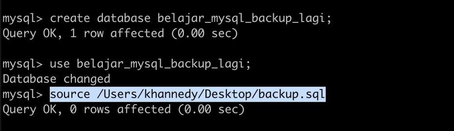

## #45 Materi Selanjutnya

- Studi Kasus Database Design
- Belajar Bahasa Pemrograman
- MySQL Tuning
- MySQL Scalability
