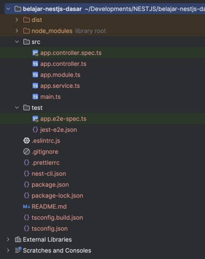
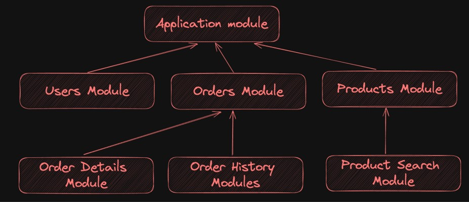
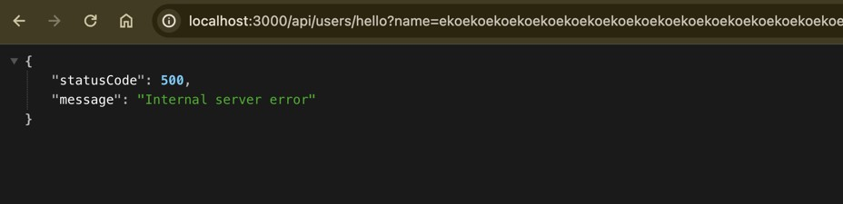

# NestJS Dasar

## Sebelum Belajar

- Kelas JavaScript dari Programmer Zaman Now
- Kelas NodeJS dari Programmer Zaman Now
- Kelas TypeScript dari Programmer Zaman Now

## #1 Pengenalan NestJS

- Nest (NestJS) adalah framework untuk membuat aplikasi berbasis server menggunakan NodeJS yang effisien.
- NestJS menggunakan TypeScript sebagai bahasa pemrograman utamanya, namun tetap juga bisa menggunakan bahasa pemrograman JavaScript
- NestJS merupakan salah satu framework yang sangat populer dikalangan programmer TypeScript
- <https://nestjs.com/>

### Kenapa Butuh Framework

- Sebelumnya di kelas TypeScript dan NodeJS, kita pernah studi kasus membuat RESTful API
- Jika teman-teman perhatikan, setiap orang atau bahkan setiap perusahaan, mungkin akan melakukan cara yang berbeda ketika membuat aplikasi, walaupun hasil akhirnya atau tujuannya sama
- Hal ini karena tidak ada kerangka kerja (framework) yang jelas, sehingga tiap orang bisa bekerja sesuai caranya masing-masing
- Dengan menggunakan framework, maka semua orang akan dipaksa mengikuti kerangka kerja yang sudah disediakan oleh framework-nya

### Keuntungan Menggunakan Framework

- Setiap orang akan menggunakan cara yang sama dalam bekerja, tidak akan ada perdebatan tentang cara kerjanya lagi
- Ketika merekrut orang baru, maka orang baru tersebut akan mudah beradaptasi karena kerangka kerja yang digunakan sudah umum digunakan

### NestJS Internal

- NestJS adalah framework yang secara internal (teknologi didalamnya) sebenarnya menggunakan library yang sudah banyak digunakan di dunia NodeJS
- Contohnya NestJS menggunakan ExpressJS sebagai HTTP Handler nya
- NestJS menggunakan Jest sebagai library unit test nya
- NestJS bisa diintegrasikan dengan Prisma untuk database nya
- Dan NestJS juga bisa diintegrasikan dengan Winston untuk logging nya
- Oleh karena itu belajar NestJS akan sangat mudah karena sebelumnya kita sudah belajar banyak library populer di kelas NodeJS dan TypeScript

## #2 NestJS CLI

- Saat kita belajar TypeScript, salah satu hal yang menjengkelkan adalah setup project, karena banyak yang harus dilakukan
- Untungnya, NestJS menyediakan library bernama NestJS CLI (Command Line Interface)
- NestJS CLI merupakan library yang bisa kita install di komputer menggunakan Node Package Manager
- <https://github.com/nestjs/nest-cli>

### Menginstall NestJS CLI

- Untuk menginstall NestJS CLI, kita bisa menggunakan perintah :
- `npm install -g @nestjs/cli`
- Setelah terinstall, kita bisa mengakses NestJS CLI via terminal dengan perintah :
- `nest`

## #3 Membuat Project

- Untuk membuat project baru NestJS, kita bisa gunakan perintah :
- `nest new nama-project`
- Kita akan diminta memilih beberapa pilihan ketika membuat project NestJS
- Setelah selesai, secara otomatis akan dibuatkan folder nama-project beserta isi awal dari kode program NestJS

## #4 Struktur Folder

- `/src` berisi kode program aplikasi dan unit test
- `/test` berisi kode integration test
- Struktur Folder NestJS sangat sederhana, sehingga tidak sulit untuk mempelajarinya



### Menjalankan Aplikasi NestJS

- Semua instruksi untuk melakukan build, menjalankan aplikasi di mode development, menjalankan aplikasi di mode production, sampai menjalankan unit test, semua tersedia di file `README.md`
- Atau untuk lebih detail, kita bisa lihat bagian scripts di `package.json`

## #5 Decorator

- Salah satu fitur yang sangat membedakan saat kita menggunakan NestJS dibanding menggunakan ExpressJS secara manual, adalah fitur Decorator
- NestJS memanfaatkan Decorator hampir disemua bagian
- Sebenarnya proposal JavaScript Decorator itu sendiri belum resmi disepakati oleh semua kalangan
- Namun Decorator sudah mulai banyak digunakan, salah satunya di NestJS
- <https://github.com/tc39/proposal-decorators>

### Decorator Secara Singkat

- Secara singkat, decorator adalah fitur untuk menambahkan metadata (informasi tambahan) pada kode program yang kita buat
- Caranya bisa diawali dengan `@` lalu diikuti dengan nama Decorator nya, atau biasa disebut juga dengan annotation
- Decorator bisa digunakan di berbagai bagian, seperti Class, Function, Parameter, Constructor, dan lain-lain
- Saat menggunakan NestJS, kita akan banyak sekali menggunakan Decorator
- Kita akan bahas secara bertahap Decorator apa saja yang disediakan oleh NestJS

### Kode: Contoh Decorator di Controller

```ts
import { Controller, Get } from "@nestjs/common";
import { AppService } from "./app.service";

@Controller()
export class AppController {
	constructor(private readonly appService: AppService) {}

	@Get()
	getHello(): string {
		return this.appService.getHello();
	}
}
```

## #6 Module

- Module merupakan class yang menggunakan annotation `@Module`
- NestJS membagi struktur aplikasi menjadi modular dengan menggunakan konsep Module
- Setiap aplikasi NestJS akan memiliki module utama (Application Module), dan selanjutnya module utama tersebut akan melakukan import module-module lainnya

### Diagram Module



### Kode: Application Module

```ts
// app.module.ts
import { Module } from "@nestjs/common";
import { AppController } from "./app.controller";
import { AppService } from "./app.service";

@Module({
	imports: [],
	controllers: [AppController],
	providers: [AppService],
})
export class AppModule {}
```

### Membuat Module

- Untuk membuat module baru, caranya cukup mudah, kita bisa membuat class dengan annotation `@Module`, lalu tambahkan pada import di Application Module
- Atau cara lebih mudah adalah menggunakan perintah :
- `nest generate module nama path`
- Misal kita akan module user di path utama (src), sehingga tidak perlu menyebutkan path nya, kita bisa gunakan perintah :
- `nest generate module user`

### Kode: User Module dan Application Module

```ts
// user.module.ts
import { Module } from "@nestjs/common";

@Module({})
export class UserModule {}
```

```ts
// app.module.ts
import { Module } from "@nestjs/common";
import { AppController } from "./app.controller";
import { AppService } from "./app.service";
import { UserModule } from "./user/user.module";

@Module({
	imports: [UserModule],
	controllers: [AppController],
	providers: [AppService],
})
export class AppModule {}
```

## #7 Controller

- Controller merupakan class yang menggunakan decorator `@Controller`
- Controller bertugas sebagai class untuk memproses HTTP Request yang masuk dan mengembalikan HTTP Response
- Setelah membuat Controller, kita perlu meregistrasikan Controller pada Module
- Saat menggunakan decorator `@Controller`, kita bisa menentukan Prefix Path yang akan kita gunakan, misal `@Controller("/api/users")`, yang artinya Controller ini akan menerima request dari Path dimulai dari `/api/users`

### Membuat Controller

- Untuk membuat Controller, kita bisa lakukan secara manual, atau menggunakan perintah :
- `nest generate controller name path`
- Jika menggunakan perintah nest, secara otomatis Controller akan diregistrasikan pada Module yang terdapat di path yang sama

### Kode: Membuat Controller

```sh
nest generate controller user user
```

### Kode: Controller

```ts
// user.controller.ts
import { Controller } from "@nestjs/common";

@Controller("/api/users")
export class UserController {}
```

```ts
// user.module.ts
import { Module } from "@nestjs/common";
import { UserController } from "./user/user.controller";

@Module({
	controllers: [UserController],
})
export class UserModule {}
```

## #8 HTTP Method

### Routing

- Membuat Routing di NestJS itu sangat mudah, kita bisa membuat method di - Controller, lalu menambahkan decorator HTTP Method yang ingin kita gunakan

### HTTP Method Decorator

- `@Get(path)` untuk HTTP Get
- `@Post(path)` untuk HTTP Post
- `@Put(path)` untuk HTTP Put
- `@Delete(path)` untuk HTTP Delete
- `@Patch(path)` untuk HTTP Patch
- `@Head(path)` untuk HTTP Head
- `@Options(path)` untuk HTTP Option
- `@All(path)` untuk semua HTTP Method

### Kode: HTTP Method

```ts
import { Controller, Get, Post, Put } from "@nestjs/common";

@Controller("/api/users")
export class UserController {
	@Post()
	port(): string {
		return "POST";
	}

	@Get("/simple")
	get(): string {
		return "GET";
	}
}
```

## #9 HTTP Request

### Express HTTP Request

- Saat membuat Routing, biasanya kita ingin mendapatkan informasi yang dikirim oleh pengguna, baik itu Query Param, Headers, Request Body dan lain-lain
- Karena NestJS secara default menggunakan Express, kita bisa menambahkan parameter `express.Request` dan menggunakan decorator `@Req()`
- REKOMENDASI : Walaupun kita bisa menggunakan object `express.Request`, namun direkomendasikan kita langsung menyebutkan data yang dibutuhkan di parameter menggunakan Decorator yang sudah disediakan oleh Nest, yang akan kita bahas selanjutnya

### Kode: Express HTTP Request

```ts
import { Controller, Delete, Get, Post, Put, Req } frm "@nestjs/common";
import { Request } from "express";

@Controller('/api/users')
export class UserController {
	@Get('/:id')
	get(@Req() request: Request): string {
		return `GET ${request.params.id}`;
	}
}
```

### Request Decorator

- `@Req()` untuk `express.Request `
- `@Param(key?)` untuk `req.params.key?`
- `@Body(key?)` untuk `req.body.key?`
- `@Query(key?)` untuk `req.query.key?`
- `@Header(key?)` untuk `req.headers.key?`
- `@Ip()` untuk `req.ip`
- `@HostParam()` untuk `req.hosts`

### Kode: HTTP Request

```ts
@Controller("/api/users")
export class UserController {
	@Get("/hello")
	sayHello(@Query("name") name: string): string {
		return `Hello ${name || "Guest"}`;
	}
}
```

## #10 HTTP Response

### Express HTTP Response

- Secara default, return value dari method di controller akan dijadikan response body untuk HTTP Response
- Namun, kita juga bisa menggunakan express.Response jika kita mau, kita cukup menggunakan decorator `@Res()`
- Jika kita menggunakan express.Response, kita wajib mengirim response pada `express.Response` tersebut, bukan lewat return value lagi
- REKOMENDASI : Walaupun kita bisa menggunakan object `express.Response`, namun direkomendasikan kita langsung menggunakan return value pada method nya
- NestJS juga menyediakan Decorator yang bisa digunakan pada method untuk mengubah informasi Response, yang akan kita bahas selanjutnya

### Kode: Express HTTP Response

```ts
@Controller("/api/users")
export class UserController {
	@Get("/sample-response")
	sampleResponse(@Res() response: Response) {
		response.status(200).send("Sample Response");
	}
}
```

### Response Decorator

- `@HttpCode(code)` untuk mengubah response status code
- `@Header(key, value)` untuk mengubah response header
- `@Redirect(location, code)` untuk melakukan redirect, lokasi redirect bisa diubah dengan mengembalikan data HttpRedirectResponse pada method nya
- `@Next()` untuk `express.NextFunction`

## #11 Asynchronous

- Sama seperti Handler di ExpressJS, di NestJS juga kita bisa menggunakan Asynchronous Method pada Controller nya
- Dengan begitu kita bisa menggunakan Async Method dan `return Promise<T>` data

### Kode: Asynchronous Method

```ts
@Controller("/api/users")
export class UserController {
	@Get("/hello")
	async sayHello(@Query("name") name: string): Promise<string> {
		return `Hello ${name || "Guest"}`;
	}
}
```

## #12 Cookie

- Di Kelas NodeJS ExpressJS, kita sudah belajar tentang cara menggunakan Cookie di ExpressJS
- Secara default, ExpressJS tidak mendukung Cookie, oleh karena itu kita harus gunakan library tambahan seperti `cookie-parser`
- Untuk menggunakannya di NestJS, kita bisa tambahkan ke app di file `main.ts`

### Menginstall Cookie Parse

- Sebelum menggunakan Cookie Parser, kita bisa menginstalnya menggunakan perintah :
- `npm install cookie-parser`
- `npm install --save-dev @types/cookie-parser`

### Kode: Setup Cookie Parser

```ts
// main.ts
import { NestFactory } from "@nestjs/core";
import { AppModule } from "./app.module";
import * as cookieParser from "cookie-parser";

async function bootstrap() {
	const app = await NestFactory.create(AppModule);
	app.user(cookieParser("MY SECRET KEY"));
	await app.listen(3000);
}
```

### Kode: Menggunakan Cookie

```ts
@Controller("/api/users")
export class UserController {
	@Get("/set-cookie")
	setCookie(@Query("name") name: string, @Res() response: Response) {
		response.cookie("name", name);
		response.status(200).send("Success Set Cookie");
	}

	@Get("/get-cookie")
	getCookie(@Req() request: Request): string {
		return request.cookies["name"];
	}
}
```

## #13 View

- NestJS tidak memiliki template engine untuk membuat View, namun karena menggunakan - ExpressJS, kita bisa menggunakan template engine yang bisa diintegrasikan dengan ExpressJS
- Kita pernah bahas di kelas ExpressJS tentang menggunakan Mustache
- Cara penggunaannya sama

### Menambah Library Mustache

- Kita bisa tambahkan library Mustache ke project yang kita buat :
- `npm install - mustache-express`
- `npm install --save-dev @types/mustache-express`

### Kode: Setup Mustache Template Engine

```ts
import * as cookieParser from "cookie-parser";
import { NestExpressApplication } from "@nestjs/platform-express";
import * as mustache from "mustache-express";

async function bootstrap() {
	const app = await NestFactory.create<NestExpressApplication>(AppModule);
	app.user(cookieParser("MY SECRET KEY"));
	app.set("view", __dirname + "/../views");
	app.set("view engine", "html");
	app.engine("html", mustache());
	await app.listen(3000);
}
```

### Kode: Template HTML

```html
<!-- index.html -->
<!doctype html>
<html>
	<head>
		<meta charset="utf-8" />
		<meta name="viewport" content="width=device-width, initial-scale=1" />
		<title>{{title}}</title>
	</head>
	<body>
		hello {{name}}
	</body>
</html>
```

### Kode: Render Template

```ts
@Controller("/api/users")
export class UserController {
	@Get("/view/hello")
	viewHello(@Query("name") name: string, @Res() response: Response) {
		response.render("index.html", {
			title: "Template Engine",
			name: name,
		});
	}
}
```

## #14 Unit Test

- Saat kita membuat Controller menggunakan perintah nest, secara otomatis akan dibuatkan template untuk unit test nya
- NestJS menggunakan Jest sebagai framework untuk Unit Test nya, sehingga mudah untuk dilakukan karena sebelumnya kita pernah belajar Jest di kelas NodeJS Unit Test

### Kode: Unit Test

```ts
describe("UserController", () => {
	let controller: UserController;

	beforeEach(async () => {
		const module: TestingModule = await Test.createTestingModule({
			controllers: [UserController],
		}).compile();

		controller = module.get<UserController>(UserController);
	});

	it("should can say hello", async () => {
		const response = await controller.sayHello("Eko");
		expect(response).toBe("Hello Eko");
	});
});
```

### Kekurangan Unit Test

- Saat menggunakan Unit Test, beberapa hal kadang akan menyulitkan untuk dilakukan, misal jika di Controller kita menggunakan parameter `express.Request` atau `express.Response`
- Maka kita harus menggunakan Mock object, seperti yang sudah kita bahas di materi NodeJS Unit Test
- Contoh, kita bisa menggunakan <https://www.npmjs.com/package/node-mocks-http>
- `npm install --save-dev node-mocks-http`

### Kode: Mock Unit Test

```ts
it("should can get view", async () => {
	const response = httpMock.createResponse();
	controller.viewHello("Eko", response);

	expect(response._getRenderView()).toBe("index.html");
	expect(response._getRenderData()).toEqual({
		name: "Eko",
		title: "Template Engine",
	});
});
```

## #15 Integration Test

- Selain menyediakan Unit Test, saat kita membuat project NestJS, secara otomatis NestJS membuatkan Integration Test pada folder test
- Integration Test di project NestJS menggunakan Jest dan Supertest
- Hal ini sering kita praktekan pada kelas-kelas NodeJS dan TypeScript, sehingga akan sangat mudah dilakukan
- Secara default, nama file Integration Test di NestJS diakhiri dengan nama file `e2e-spec.ts`
- e2e singkatan dari End to End
- Kita bisa mengubah semua konfigurasinya pada file `test/jest-e2e.json`

### Kode: Integration Test

```ts
it("should can say hello", async () => {
	const result = await request(app.getHttpServer())
		.get("/api/users/hello")
		.query({
			name: "Eko",
		});

	expect(result.status).toBe(200);
	expect(result.text).toBe("Hello Eko");
});
```

## #16 Provider

- Provider adalah konsep yang sangat dasar di NestJS
- Banyak class di aplikasi NestJS bisa dianggap sebagai Provider, contoh misal Service, Repository, Factory, Helper, dan lain-lain
- Ide utama kenapa dibuat konsep Provider adalah, agar object dari Provider bisa di-inject sebagai dependency ke object lainnya (Controller, atau Provider lain)

### Membuat Provider

- Untuk membuat Provider, kita bisa membuat Class dengan decorator `@Injectable()`
- Semua provider harus diregistrasikan pada Module agar bisa dibuat secara otomatis oleh NestJS
- Untuk membuat secara otomatis, kita bisa gunakan perintah :
- `nest generate provider nama path`
- Khusus untuk Provider jenis Service, bisa juga menggunakan perintah :
- `nest generate service nama path`

### Kode: Membuat User Service

```sh
nest generate service user user
```

### Kode: User Module

```ts
// user.module.ts
import { Module } from "@nestjs/common";
import { UserController } from "./user/user.controller";
import { UserService } from "./user/user.service";

@Module({
	controllers: [UserController],
	providers: [UserService],
})
export class UserModule {}
```

### Kode: User Service

```ts
// user.service.ts
import { Injectable } from "@nestjs/common";

@Injectable()
export class UserService {
	sayHello(name: string): string {
		return `Hello ${name}`;
	}
}
```

## #17 Dependency Injection

- Dependency Injection adalah konsep dimana object membutuhkan object lain, misal `UserController` membutuhkan `UserService`
- NestJS bisa melakukan Dependency Injection secara otomatis, kita cukup tambahkan `Provider` yang dibutuhkan pada `Constructor`
- Secara otomatis NestJS akan melakukan inject (memasukkan) object (dependency) yang dibutuhkan secara otomatis
- Semua Module, Controller dan Provider, akan dibuat sebagai singleton object secara otomatis oleh NestJS

### Kode: User Controller

```ts
@Controller("/api/users")
export class UserController {
	constructor(private service: UserService) {}

	@Get("/hello")
	async sayHello(@Query("name") name: string): Promise<string> {
		return this.service.sayHello(name);
	}
}
```

### Kode: User Controller Unit Test

```ts
describe("UserController", () => {
	let controller: UserController;

	beforeEach(async () => {
		const module: TestingModule = await Test.createTestingModule({
			controllers: [UserController],
			providers: [UserService],
		}).compile();

		controller = module.get<UserController>(UserController);
	});
});
```

### Property-based Injection

- Secara default, NestJS akan menggunakan Constructor Parameter untuk melakukan Dependency Injection
- Namun, NestJS juga mendukung Property-based Injection, dimana bisa melakukan Dependency Injection melalui property/attribute
- Kita bisa menambahkan decorator `@Inject()` pada property-nya

### Kode: Property-based Injection

```ts
@Controller("/api/users")
export class UserController {
	@Inject()
	private userService: UserService;
}
```

### Optional Dependency

- Secara default, dependency yang dibutuhkan itu wajib diisi oleh NestJS, jika ternyata dependency yang dibutuhkan itu tidak ada, maka NestJS akan menganggapnya error
- Namun pada kasus dependency nya bersifat optional (tidak wajib), maka kita bisa menambahkan decorator `@Optional()`
- Secara otomatis dependency tersebut akan dianggap optional (tidak wajib), artinya jika tidak ada object dependency nya, maka NestJS tidak akan melakukan error

### Kode: Optional Dependency

```ts
@Controller("/api/users")
export class UserController {
	@Inject()
	@Optional()
	private userService: UserService;
}
```

## #18 Custom Provider

- Kadang saat kita membuat Provider, ada kasus Provider yang ingin kita buat agak sedikit kompleks, sehingga tidak bisa hanya dengan menyebutkan nama Class nya saja
- Atau bahkan tidak bisa ditambahkan decorator `@Injectable()`, karena misal Class tersebut milik library third party, contoh `RedisClient`, `MongoClient`, `PrismaClient`, dan lain-lain
- Untungnya, NestJS juga mendukung pembuatan Custom Provider, sehingga kita bisa dengan mudah membuat dependency dengan beberapa cara yang akan kita bahas selanjutnya

### Standard Provider

- Cara pertama untuk membuat dependency adalah dengan cara Standard Provider.
- Cara ini adalah cara yang sebelumnya sudah kita lakukan di materi Provider
- Kita bisa menyebutkan langsung nama Class nya di attribute providers di Module

### Class Provider

- Class Provider adalah cara membuat Provider dengan menentukan Class yang ingin kita gunakan, ini cocok ketika ingin menggunakan Class yang berbeda-beda untuk jenis Dependency
- Misal kita punya interface Connection, tapi kita punya class implementasi `MySQLConnection` dan `MongoDBConnection`, kita bisa gunakan Class Provider untuk menentukan Class mana yang ingin kita gunakan misalnya

### Kode: Class Provider

```ts
export class Connection {
	getName(): string {
		return null
	}
}

@Injectable()
export class MySQLConnection extends Connection {
	getName(): string {
		return "MySQL";
	}
}

@Injectable()
export class MongoDBConnection extends Connection {
	getName(): string {
		return "MongoDB";
	}
}

@Module({
	controllers: [UserController],
	providers: [
		UserService,
		{
			provide: Connection,
			useClass: proccess.env.DATABASE == 'mysql' ? MySQLConnection : MongoDBConnection,
		}
	]
})
```

### Value Provider

- Value Provider adalah membuat dependency dari value (object) yang sudah ada
- Misal kita sudah memiliki sebuah object, dan kita ingin membuat object tersebut dijadikan sebagai dependency Provider, maka kita bisa gunakan Value Provider

### Kode: Value Provider

```ts
export class MailService {
	send() {
		console.info("send email");
	}
}

export const mailService = new MailService();

@Module({
	controllers: [UserController],
	providers: [
		UserService,
		{
			provide: Connection,
			useClass: proccess.env.DATABASE == 'mysql' ? MySQLConnection : MongoDBConnection,
		},
		{
			provide: MailService,
			useClass: mailService,
		}
	]
})
```

### Factory Provider

- Factory Provider adalah mekanisme membuat dependency, dengan menyediakan function yang akan dipanggil untuk membuat object dependency-nya, atau kita sebut sebagai Factory Method
- Jika pada Factory Method tersebut kita butuh dependency lain, kita bisa sebutkan juga dengan menggunakan attribute inject

### Kode: Factory Provider

```ts
import { Connection } from "../connection/connection";

export class UserRepository {
	connection: Connection

	save() {
		console.info(`save user with connection ${this.connection.getName()}`);
	}
}

export function createUserRepository(connection: Connection): UserRepository {
	const userRepository = new UserRepository();
	userRepository.connection = connection;
	return userRepository;
}

@Module({
	controllers: [UserController],
	providers: [
		UserService,
		{
			provide: Connection,
			useClass: proccess.env.DATABASE == 'mysql' ? MySQLConnection : MongoDBConnection,
		},
		{
			provide: MailService,
			useClass: mailService,
		},
		{
			provide: UserRepository,
			useFactory: createUserRepository,
			inject: [Connection]
		}
	]
})
```

### Alias Provider

- Alias Provider adalah membuat dependency dengan nama yang berbeda untuk object provider yang sama
- Ini cocok ketika kita butuh menggunakan dependency yang sama, untuk nama provider yang berbeda-beda
- Untuk nama Alias yang berbeda dengan nama Class, kita bisa menggunakan `@Inject(namaAlias)` ketika butuh melakukan dependency injection nya

### Kode: Alias Provider

```ts
@Module({
	controllers: [UserController],
	providers: [
		// ...
		{
			provide: MailService,
			useValue: mailService,
		},
		{
			provide: "EmailService",
			useExisting: MailService,
		}
	]
})
```

## #19 Module Reference

- NestJS menyediakan class bernama `ModuleRef`, yang bisa digunakan untuk mengambil data provider yang terdapat di aplikasi
- Ini bisa membantu pada kasus kita tidak ingin melakukan dependency injection otomatis
- Misal, kita hanya ingin mengambil dependency ketika dibutuhkan saja

### Kode: Module Reference

```ts
@Injectable()
export class MemberService {
	constructor(private moduleRef: ModuleRef) {}

	getConnectionName(): string {
		const connection = this.moduleRef.get(Connection);
		return connection.getName();
	}

	sendEmail() {
		this.moduleRef.get(MailService).send();
	}
}
```

## #20 Configuration

- Saat membuat aplikasi, kita pasti membutuhkan konfigurasi yang dinamis
- Contoh misal username dan password untuk database
- Salah satu praktik yang baik adalah menggunakan environment variable, yang bisa diakses lewat NodeJS `process.env`
- Dalam aplikasi NodeJS, salah satu hal yang biasa selain menggunakan environment variable adalah menggunakan `.env` file, contoh seperti di Prisma
- NestJS juga memiliki fitur untuk membaca file `.env` yang secara otomatis

### NestJS Config

- Untuk menggunakan fitur NestJS Configuration, kita perlu menginstall library nya terlebih dahulu :
- `npm install @nestjs/config`
- Selanjutnya, kita perlu meregistrasikan `ConfigModule` ke `AppModule` aplikasi yang kita buat
- Seluruh konfigurasi dari `.env` bisa kita baca menggunakan class `ConfigService`

### Kode: Config Module

```ts
@Module({
	imports: [
		ConfigModule.forRoot({
			isGlobal: true,
		}),
		UserModule,
	],
	controllers: [AppController],
	providers: [AppService],
})
export class AppModule {}
```

### Kode: Create Connection Factory Method

```ts
export function createConnection(configService: ConfigService): Connection {
	if (configService.get("DATABASE") == "mysql") {
		return new MySQLConnection();
	} else {
		return new MongoDBConnection();
	}
}
```

### Kode: User Module

```ts
@Module({
	controllers: [UserController],
	providers: [
		UserService,
		{
			provide: Connection,
			useFactory: createConnection,
			inject: [ConfigService]
		}
	]
})
```

### Application

- NestJS Application, selain sebagai aplikasi, kita juga bisa mengambil provider menggunakan NestJS Application
- Contoh, misal kita ingin mengubah port web menjadi dinamis

### Kode: Application

```ts
async function bootstrap() {
	const app = await NestFactory.create<NestExpressApplication>(AppModule);
	app.user(cookieParser("MY SECRET KEY"));
	app.set("view", __dirname + "/../views");
	app.set("view engine", "html");
	app.engine("html", mustache());

	const configService = app.get(ConfigService);
	await app.listen(configService.get("PORT"));
}
```

## #21 Shared Module

- Kita bisa melakukan import antar Module secara mudah ketika membuat Module
- Dan karena Module itu singleton object, jadi kita tidak perlu khawatir ketika ada Module yang di-import oleh lebih dari satu Module, karena Module tersebut hanya akan dibuat sekali saja, tidak akan berkali-kali
- Kita bisa melakukan import Module menggunakan attribute `imports` di Module

### Sharing Provider

- Secara default, Provider tidak di sharing keluar Module
- Provider yang bisa digunakan di dalam Module itu sendiri
- Jika kita ingin melakukan sharing Provider, kita harus menyebutkan pada attribute exports di Module
- Dan hanya Provider yang di-export saja yang bisa digunakan oleh Module lain
- Kita akan coba melakukan Sharing Module di materi selanjutnya

## #22 Database

- NestJS sendiri tidak menyediakan fitur untuk Database atau ORM (Object Relational Mapping)
- Namun, NestJS bisa diintegrasikan dengan banyak ORM yang populer, seperti `MikroORM`, `TypeORM`, `Sequelized`, `Prisma`, `Mongoose`, dan lain-lain
- <https://docs.nestjs.com/recipes/mikroorm>
- <https://docs.nestjs.com/recipes/sql-typeorm>
- <https://docs.nestjs.com/recipes/mongodb>
- <https://docs.nestjs.com/recipes/sql-sequelize>
- <https://docs.nestjs.com/recipes/prisma>

### Prisma

- Sebelumnya di kelas NodeJS, kita sudah belajar Prisma, dan sekarang kita akan coba menambahkan Prisma ke aplikasi NestJS yang sudah kita buat
- Kita bisa menambahkan dependency Prisma :
- `npm install --save-dev prisma`
- `npx prisma init`

### Kode: Prisma Schema

```
model User {
	id 				 String  @id @db.VarChar(100)
	first_name String  @db.VarChar(100)
	last_name  String? @db.VarChar(100)
}
```

### Kode: Prisma Service

```ts
import { Injectable } from "@nestjs/common";
import { PrismaClient } from "@prisma/client";

@Injectable()
export class PrismaService extends PrismaClient {
	constructor() {
		super();
		console.info("Create Prisma");
	}
}
```

### Kode: Prisma Module

```ts
import { Module } from "@nestjs/common";
import { PrismaService } from "./prisma.service";

@Module({
	providers: [PrismaService],
	exports: [PrismaService],
})
export class PrismaModule {}
```

### Kode: User Repository

```ts
@Injectable()
export class UserRepository {
	constructor(private prismaService: PrismaService) {
		console.info("Create user repository");
	}

	save(id: string, name: string) {
		this.prismaService.user.create({
			data: {
				id: id,
				first_name: name,
			},
		});
	}
}
```

### Kode: User Module

```ts
@Module({
	imports: [PrismaModule],
	controllers: [UserController],
	providers: [
		UserRepository,
		UserService,
		// ...
	]
})
```

## #23 Logging

- NestJS secara default memiliki Logger sendiri untuk melakukan log informasi ketika proses startup aplikasi, atau ketika terjadi error di aplikasi
- Secara default NestJS hanya akan melakukan logging ke Console dan berupa Text
- Kadang kita ingin menggunakan Logger yang lebih bagus seperti Winston
- Untungnya NestJS menyediakan cara jika kita ingin mengganti Logger nya dengan cara membuat object `LoggerService`

### Kode: Memanggil Logger Nest

```ts
async function bootstrap() {
	const app = await NestFactory.create<NestExpressApplication>(AppModule);
	const logger = app.useLogger(logger); // create your logger
	// ...
}
```

### Winston

- Misal sekarang kita coba akan menggunakan Winston sebagai Logger untuk aplikasi NestJS yang sudah kita buat
- Kita bisa membuat class LoggerService sendiri, lalu mengubahnya menjadi Winston, atau kita bisa gunakan library `nest-winston`
- `npm install nest-winston`
- <https://github.com/gremo/nest-winston/blob/main/src/winston.classes.ts>

### Kode: Menggunakan Nest Winston

```ts
// ...
import { WinstonModule } from "nest-winston";
import * as winston import "winston";

@Module({
	imports: {
		WinstonModule.forRoot({
			format: winston.format.json(),
			level: 'debug',
			transports: [new winston.transports.Console()]
		}),
		ConfigModule.forRoot({
			isGlobal: true
		}),
		UserService,
	},
	controllers: [AppController],
	providers: [AppModule]
})
```

### Kode: Mengganti NestJS Logger

```ts
import { WINSTON_MODULE_NEST_PROVIDER } from "nest-winston";

async function bootstrap() {
	const app = await NestFactory.create<NestExpressApplication>(AppModule);
	const logger = app.get(WINSTON_MODULE_NEST_PROVIDER);
	app.useLogger(logger);
	// ...
}
```

### Kode: Menggunakan Logger

```ts
import { Logger } from "winston";
import { WINSTON_MODULE_NEST_PROVIDER } from "nest-winston";

@Injectable()
export class UserRepository {
	constructor(
		private prismaService: PrismaService,
		@Inject(WINSTON_MODULE_NEST_PROVIDER) private logger: Logger,
	) {
		this.logger.info("Creae user repository");
	}
}
```

## #24 Global Module

- Jika kita memiliki Module yang sering digunakan di banyak Module lainnya, kita bisa jadikan sebuah module menjadi Global Module
- Global Module secara otomatis di import di semua Module
- Kita bisa gunakan decorator `@Global` untuk menjadikan sebuah Module menjadi Global Module
- Contoh ini dilakukan di `nest-winston` : <https://github.com/gremo/nest-winston/blob/main/src/winston.module.ts#L5>
- Oleh karena itu sebelumnya kita tidak perlu lagi melakukan import di Module lainnya

### Kode: Prisma Module

```ts
import { Global, Module } from "@nestjs/common";
import { PrismaService } from "./prisma.service";

@Global()
@Module({
	providers: [PrismaService],
	exports: [PrismaService],
})
export class PrismaModule {}
```

### Kode: User Module dan App Module

```ts
@Module({
	// imports: [PrismaService],
	controller: [UserController],
	providers: [
		UserRepository
	]
})

@Module({
	imports: [
		PrismaModule,
		WinstonModule.forRoot({
			// ...
		})
	]
})
```

## #25 Dynamic Module

- Sebelumnya kita melihat beberapa Module seperti `ConfigModule` dan `WinstonModule` menggunakan method ketika membuat Module nya
- Hal itu dinamakan Dynamic Module
- Dynamic Module adalah mekanisme membuat Module secara dinamis, sehingga kita bisa menentukan Provider atau Controller secara runtime berdasarkan parameter yang diberikan oleh pengguna

### Kode: Contoh Dynamic Module

```ts
@Module({
	imports: [
		PrismaModule,
		WinstonModule.forRoot({
		format: winston.format.json(),
			level: 'debug',
			transports: [new winston.transports.Console()]
		}),
		ConfigModule.forRoot({
			isGlobal: true
		}),
		UserService,
	]
})
```

### Membuat Dynamic Module

- Untuk membuat Dynamic Module, kita bisa membuat function yang return object `DynamicModule`
- Apa yang kita buat pada Module biasa bisa kita lakukan juga dengan Dynamic Module
- <https://github.com/nestjs/nest/blob/master/packages/common/interfaces/modules/dynamic-module.interface.ts>
- <https://github.com/nestjs/nest/blob/master/packages/common/interfaces/modules/module-metadata.interface.ts>

### Contoh Dynamic Module

- Di materi selanjutnya kita akan coba membuat Dynamic Module ketika membahas tentang Validation

## #26 Validation

- NestJS sendiri tidak memiliki fitur untuk melakukan Validation
- Namun karena NestJS menggunakan konsep Module, jadi untuk menambahkan Validation ke aplikasi NestJS sangat mudah, kita cukup buat Module untuk ditambahkan ke aplikasi NestJS kita
- Ada banyak library yang banyak digunakan programmer NestJS untuk melakukan validasi, misal :
- <https://github.com/typestack/class-validator>
- <https://github.com/colinhacks/zod>
- Di kelas ini kita akan coba gunakan Zod karena di kelas TypeScript sudah kita bahas detail tentang Zod

### Menambah Zod

- `npm install zod`

### Kode: Validation Service

```ts
import { Injectable } from "@nestjs/common";
import { ZodType } from "zod";

@Injectable()
export class ValidationService {
	validate<T>(schema: ZodType<T>, data: T): T {
		return schema.parse(data);
	}
}
```

### Kode: Validation Module

```ts
import { DynamicModule, Module } from "@nestjs/common";
import { ValidationService } from "./validation/validation.service";

@Module({})
export class ValidationModule {
	static forRoot(): DynamicModule {
		return {
			module: ValidationModule,
			global: true,
			providers: [ValidationService],
			exports: [ValidationService],
		};
	}
}
```

### Kode: App Module

```ts
@Module({
	imports: [
		ValidationModule.forRoot(),
		// ...
	]
})
```

### Kode: Menggunakan Validation Service

```ts
@Injectable()
export class UserService {
	constructor(private validationService: ValidationService) {}
	sayHello(name: string): string {
		const schema = z.string().max(100);
		const result = this.validationService.validate(schema, name);

		return `Hello ${result}`;
	}
}
```

## #27 Middleware

- Middleware di NestJS sama seperti Middleware di ExpressJS
- Mddleware mendukung Dependency Injection, sehingga kita bisa menambahkan dependency Provider jika dibutuhkan
- Untuk membuat Middleware, kita bisa membuat class turunan dari `NestMiddleware`
  Atau bisa menggunakan perintah :
- `nest generate middleware name path`

### Diagram Middleware


### Kode: Log Middleware

```ts
@Injectable()
export class LogMiddleware implements NestMiddleware<Request, Response> {
	constructor(@Inject(WINSTON_MODULE_NEST_PROVIDER) private logger: Logger) {}

	use(req: Request, res: Response, next: () => void) {
		this.logger.info(`Receive request for URL: ${req.url}`);
		next();
	}
}
```

### Registrasi Middleware

- Decorator @Module tidak memiliki atribut untuk meregistrasikan Middleware
- Untuk meregistrasikan Middleware, kita harus membuat Module turunan dari interface `NestModule`
- Dalam method `configure(MiddlewareConsumer)`, kita bisa registrasikan Middleware yang ingin kita gunakan, dan ke Route mana kita ingin menambahkan Middleware
- Route untuk Middleware bisa menggunakan type Controller atau path
- Path bisa menggunakan `*` (asterisk) sebagai wildcard dan akan cocok dengan kombinasi karakter apapun

### Kode: App Middleware

```ts
export class AppModule implements NestModule {
	configure(consumer: MiddlewareConsumer) {
		consumer.apply(LogMiddleware).forRoutes({
			path: "/api/*", // start with /api/
			method: RequestMethod.ALL,
		});
	}
}
```

## #28 Exception Filter

- NestJS memiliki fitur bernama Exception Filter, yang bertanggung jawab memproses Error yang tidak tertangani oleh aplikasi
- Ketika ada Error yang tidak tertangani oleh aplikasi, Exception Filter akan menangkap error ini dan secara otomatis mengirim response yang lebih user-friendly ke pengguna aplikasi
- Secara default, NestJS menyediakan Global Exception Filter, yang mengubah error yang tidak tertangani oleh aplikasi menjadi error dalam bentuk JSON (bisa dilihat di-slide selanjutnya)

### Gambar: Contoh Error



### Membuat Exception Filter

- Kadang kita tidak ingin menggunakan Global Exception Filter, kadang kita ingin membuat format HTTP Response sendiri ketika terjadi Error
- Kita bisa membuat Exception Filter secara mandiri dengan membuat class turunan `ExceptionFilter`
- Saat membuat Exception Filter, kita perlu tentukan jenis Error yang akan ditangani menggunakan decorator `@Catch(ErrorType)`

### Kode: Validation Filter

```ts
@Catch(ZodError)
export class ValidationFilter implements ExceptionFilter<ZodError> {
	catch(exception: ZodError, host: ArgumentsHost) {
		const http = host.switchToHttp();
		const response = http.getResponse<Response>();

		response.status(400).json({
			code: 400,
			errors: exception.errors,
		});
	}
}
```

### Menggunakan Filter

- Untuk menggunakan Filter, kita bisa gunakan Decorator `@UseFilters`
- Kita bisa gunakan `@UseFilters` di Method atau di Class Controller
- Jika kita tempatkan di Class Controller, secara otomatis semua Route Method akan menggunakan Exception Filter yang kita sebutkan di `@UseFilters`

### Kode: Menggunakan Validation Filter

```ts
@Controller("/api/users")
export class UserService {
	// ...

	@Get("/hello")
	@UseFilters(ValidationFilter)
	async sayHello(@Query("name") name: string): Promise<string> {
		return this.userService.sayHello(name);
	}
}
```

### HttpException

- NestJS menyediakan class Error bernama `HttpException`, yang bisa kita gunakan untuk melakukan error, dan bisa diubah secara otomatis oleh Global Exception Handler menjadi HTTP Response sesuai isi dari HttpException
- HttpException memiliki attribute seperti `response` dan `status`, yang digunakan untuk mengubah response HTTP dan status code HTTP

### Global Exception Filter

- Jika kita memiliki Exception Filter yang ingin dijadikan Global di semua Controller dan Method Route
- Kita bisa tambahkan Exception Filter tersebut ke NestJS Application

### Kode: Global Exception Filter

```ts
async function bootstrap() {
	// ...
	const configService = app.get(ConfigService);
	await app.listen(configService.get("PORT"));

	app.useGlobalFilters(/*...*/); // menambah global execution handler
}
bootstrap();
```

## #29 Pipe

- Saat kita menggunakan parameter di Controller Method, kadang kita berharap tipe data yang dikirim oleh pengguna sesuai dengan format yang kita inginkan
- Misal kita ingin format data dalam bentuk number, string, boolean, Date atau yang lainnya
- Pipe adalah fitur di NestJS yang bisa digunakan untuk melakukan transformasi (perubahan) tipe data sebelum dikirim ke Controller Method
- Untuk menggunakan Pipe, kita bisa tambahkan Pipe di decorator `@Query`, `@Body` dan `@Param`

### Build-int Pipe

- NestJS sendiri sudah menyediakan banyak Pipe di NestJS, sehingga kita tidak perlu membuat manual, kecuali memang ada Pipe yang belum tersedia
- Contoh Pipe yang sudah disediakan NestJs seperti; `ParseIntPipe`, `ParseFloatPipe`, `ParseBoolPipe`, `ParseArrayPipe`, `ParseUUIDPipe`, `ParseEnumPipe`, `DefaultValuePipe`, `ParseFilePipe`

### Kode: User Controller

```ts
@Get('/:id')
get(@Param('id', ParseIntPipe) id: number): string {
	return `GET ${id}`;
}
```

### Membuat Pipe

- Pada kasus kita butuh membuat Pipe sendiri, kita bisa membuat Pipe dengan cara membuat class turunan dari PipeTransform
- Atau kita bisa gunakan perintah :
- `nest generate pipe nama path`

### Kode: Validation Pipe

```ts
import { ArgumentMetadata, Injectable, PipeTransform } from "@nestjs/common";
import { ZodType } from "zod";

@Injectable()
export class ValidationPipe implements PipeTransform {
	constructor(private zodType: ZodType) {}

	// eslint-disable-next-line @typescript-eslint/no-unused-vars
	transform(value: any, metadata: ArgumentMetadata) {
		return this.zodType.parse(value);
	}
}
```

## Kode: Create User Request

```ts
import { z } from "zod";

export class LoginUserRequest {
	username: string;
	password: string;
}

export const LoginUserRequestValidation = z.object({
	username: z.string().max(50).min(1),
	password: z.string().max(50).min(1),
});
```

### Kode: User Controller

```ts
@Controller("/api/users")
export class UserController {
	// ...

	@Post("/login")
	@UseFilters(ValidationFilter)
	login(
		@Body(new ValidationPipe(loginUserRequestValidation))
		request: LoginUserRequest,
	): string {
		return `Hello ${request.username}`;
	}
}
```

### Global Pipe

- Jika kita ingin menambahkan Pipe yang bisa digunakan di semua Parameter di Controller Method, kita bisa gunakan `@UsePipes()` di Controller Method
- Jika kita ingin menambahkan Pipe yang bisa digunakan di semua Class Controller, kita bisa gunakan `@UsePipes()` di Controller
- Atau jika kita ingin menambahkan Pipe secara Global, kita bisa registrasikan ke NestJS Application menggunakan `useGlobalPipes()`
- Perlu diperhatikan, saat kita menggunakan Pipe secara global, kita harus melakukan pengecekan secara hati-hati, karena perbedaan tipe data bisa menyebabkan error pada Pipe

### Kode: Use Pipes

```ts
@Controller("/api/users")
export class UserController {
	// ...

	@Post("/login")
	@UseFilters(ValidationFilter)
	@UsePipes(new ValidationPipe(loginUserRequestValidation))
	login(
		@Query("name") name: string,
		@Body() request: LoginUserRequest,
	): string {
		return `Hello ${request.username}`;
	}
}
```

### Kode: Validation Pipe

```ts
@Injectable()
export class ValidationPipe implements PipeTransform {
	constructor(private zodType: ZodType) {}

	// eslint-disable-next-line @typescript-eslint/no-unused-vars
	transform(value: any, metadata: ArgumentMetadata) {
		if (metadata.type === "body") {
			return this.zodType.parse(value);
		} else {
			return value;
		}
	}
}
```

## #30 Interceptor

- Interceptor mirip seperti Middleware, yang membedakan adalah, Interceptor bisa mengubah Response
- Middleware hanya mengolah Request dan meneruskan ke Middleware selanjutnya atau ke Controller
- Sedangkan Interceptor bisa menerima Response dari Controller, dan mengubah Response sebelum diberikan ke Client atau pengguna

### Diagram Interceptor


### Membuat Interceptor

- Untuk membuat Interceptor, kita bisa membuat class turunan dari interface `NestInterceptor`
- Atau kita bisa gunakan perintah :
- `nest generate interceptor nama path`
- Untuk menggunakan Interceptor, kita bisa gunakan `@UseInterceptors()` di Controller Method atau di Controller

### RxJS (Reactive Extensions Library for JavaScript)

- NestJS menggunakan RxJS ketika membuat Interceptor
- Jika kita sudah terbiasa menggunakan RxJS, maka akan sangat terbantu
- Jika kita belum terbiasa menggunakan RxJS, tidak perlu khawatir, karena cara penggunaanya sebenarnya sederhana, hampir mirip dengan ketika menggunakan tipe data Array
- <https://rxjs.dev/>

### Kode: Time Interceptor

```ts
@Injectable()
export class TimeInterceptor implements NestInterceptor {
	intercept(context: ExecutionContext. next: CallHandler): Observable<any> {
		return next.handle().pipe(
			map((value) => {
				value.timestamp = new Date();
				return value;
			}),
		);
	}
}
```

### Kode: User Controller

```ts
export class UserController {
	// ...

	@Post("/login")
	@UseFilters(ValidationFilter)
	@UsePipes(new ValidationPipe(loginUserRequestValidation))
	@UseInterceptors(TimeInterceptor)
	login(@Query("name") name: string, @Body() request: LoginUserRequest): any {
		return {
			data: `Hello ${result.username}`,
		};
	}
}
```

### Global Interceptor

- Saat kita gunakan `@UseInterceptors()` di Controller, secara otomatis semua Controller Method akan menggunakan Interceptor yang sama
- Namun jika kita ingin menggunakan Interceptor secara global, kita bisa gunakan `useGlobalInterceptors()` di NestJS Application

## #31 Custom Decorator

- Sebelumnya, kita tahu bahwa NestJS sudah menyediakan banyak sekali Decorator yang bisa kita gunakan di dalam Controller
- Kadang, ada kebutuhan misal kita menambahkan attribute ke Request di Middleware, lalu datanya ingin kita ambil di Controller tanpa harus menggunakan `express.Request`
- Sekarang, kita akan coba membuat Custom Decorator untuk mengambil data user yang sudah login, sehingga kita tidak perlu lakukan di Middleware

### Kode: Auth Middleware

```ts
@Injectable()
export class AuthMiddleware implements NestMiddleware {
	constructor(private prismaService: PrismaService) {}

	async use(req: any, res: any, next: () => void) {
		const username = req.headers["x-username"] as string;
		console.info(req.headers);
		console.info(username);
		if (!username) {
			throw new HttpException("Unauthorized", HttpStatus.UNAUTHORIZED);
		}

		const user = await this.prismaService.user.findUnique({
			where: {
				id: username,
			},
		});

		console.info(user);

		if (user) {
			req.user = user;
			next();
		} else {
			throw new HttpException("Unauthorized", HttpStatus.UNAUTHORIZED);
		}
	}
}
```

### Membuat Custom Decorator

- Untuk membuat Custom Decorator kita bisa menggunakan function `createParamDecorator`

### Kode: Auth Decorator

```ts
import { createParamDecorator, ExecutionContext } from "@nestjs/common";

export const Auth = createParamDecorator(
	(data: unknown, context: ExecutionContext) => {
		const request = context.switchToHttp().getRequest();
		return request.user;
	},
);
```

### Kode: User Controller

```ts
export class UserController {
	// ...

	@Get("/current")
	current(@Auth() user: User): any {
		return {
			data: `Hello ${user.first_name}`,
		};
	}
}
```

### Kode: App Module

```ts
export class AppModule implements NestModule {
	configure(consumer: MiddlewareConsumer) {
		consumer.apply(LogMiddleware).forRoutes({
			path: "/api/*", // start with /api/
			method: RequestMethod.ALL,
		});
		consumer.apply(AuthMiddleware).forRoutes({
			path: "/api/users/current",
			method: RequestMethod.GET,
		});
	}
}
```

## #32 Guard

- Saat membuat aplikasi, kadang proses `Authentication` bisa kita lakukan di Middleware, seperti yang sebelumnya kita buat yaitu `AuthMiddleware`
- Namun, selain proses Authentication, ada juga proses `Authorization`, yaitu mengecek apakah user berhak untuk mengakses aksi tersebut atau tidak
- Middleware agak sulit digunakan untuk melakukan Authorization, karena Middleware tidak tahu Route mana yang diakses, yang dia tahu hanya memanggil `next()` (baik itu next Middleware atau next Route)
- NestJS menyediakan fitur `Guard` untuk menangani masalah ini

### Membuat Guard

- Untuk membuat Guard, kita bisa membuat class turunan dari `CanActivate`
- Atau bisa menggunakan perintah :
- `nest generate guard nama path`
- Misal kita sekarang akan coba tambahkan kolom role di model User, dan kita akan tambahkan Guard untuk memastikan bahwa cuma role yang ditentukan yang bisa mengakses Route

### Kode: User Schema

```ts
model User {
	id 				 String  @id @db.VarChar(100)
	first_name String  @db.VarChar(100)
	last_name  String? @db.VarChar(100)
	role 			 String? @db.VarChar(1000)
}
```

### Kode: Role Guard

```ts
@Injectable()
export class RoleGuard implements CanActivate {
	constructor(private roles: string[]) {}

	canActivate(
		context: ExecutionContext,
	): boolean | Promise<boolean> | Observable<boolean> {
		const user = context.switchToHttp().getRequest().user;
		return this.roles.indexOf(user.role) != -1;
	}
}
```

### Kode: User Controller

```ts
export class UserController {
	// ...

	@Get("/current")
	@UseGuards(new RoleGuard(["hello", "operator"]))
	current(@Auth() user: User): any {
		return {
			data: `Hello ${user.first_name}`,
		};
	}
}
```

### Global Guard

- Jika kita tambahkan `@UseGuard` di Controller, secara otomatis maka seluruh Controller Method akan menggunakan Guard tersebut
- Namun jika kita ingin membuat Global Guard, kita bisa menggunakan method `useGlobalGuards()` pada NestJS Application

## #33 Lifecycle Event

- Semua object yang di manage oleh NestJS memiliki alur hidup (lifecycle), seperti Module, Controller atau Provider
- Ini sangat berguna ketika kita ingin menambahkan aksi ketika lifecycle terjadi

### Dafter Lifecycle

| Lifecycle                   | Keterangan                                                                                    |
| --------------------------- | --------------------------------------------------------------------------------------------- |
| `OneModuleInit`             | Dipanggil setelah semua module sudah di load                                                  |
| `OnApplicationBootstrap`    | Dipanggil setelah semua module sudah di inisialisasi, sebelum menerima koneksi                |
| `OnModuleDestroy`           | Dipanggil setelah menerima sinyal penghentian                                                 |
| `BeforeApplicationShutdown` | Dipanggil setelah OnModuleDestroy, semua handler telah selesai dan semua koneksi akan ditutup |
| `OnApplicationShutdown`     | Dipanggil setelah semua koneksi ditutup                                                       |

### Kode: Prisma Service

```ts
@Injectable()
export class PrismaService
	extends PrismaClient
	implements OnModuleInit, OnModuleDestroy
{
	constructor() {
		super();
		console.info("Create Prisma");
	}

	async onModuleInit() {
		console.info("Connect Prisma");
		await this.$connect();
	}

	async onModuleDestroy() {
		console.info("Disconnect Prisma");
		await this.$disconnect();
	}
}
```

### Shutdown Hook

- Secara default, `OnModuleDestroy`, `BeforeApplicationShutdown` dan `OnApplicationShutdown` akan dieksekusi ketika kita memanggil `app.close()`
- Pada beberapa kasus, misal kita menghentikannya menggunakan signal termination, seperti pada Kubernetes atau menggunakan `Ctrl + C`, maka kita harus mengaktifkan shutdown hook pada NestJS Application

### Kode: Shutdown Hook

```ts
async function bootstrap() {
	const app = await NestFactory.create<NestExpressApplication>(AppModule);
	app.user(cookieParser("MY SECRET KEY"));
	app.set("view", __dirname + "/../views");
	app.set("view engine", "html");
	app.engine("html", mustache());

	app.enableShutdownHooks();

	const configService = app.get(ConfigService);
	await app.listen(configService.get("PORT"));
}
```

## #34 Reflector

- Sebelumnya kita sudah tahu cara menggunakan dan membuat Decorator
- Salah satu fitur yang bermanfaat di NestJS adalah Reflector, yang bisa diintegrasikan dengan Decorator
- Reflector adalah fitur di NestJS yang bisa digunakan untuk mempermudah kita membuat dan mengakses Decorator
- Contoh, sebelumnya kita sudah membuat sebuah `RoleGuard`, sebenarnya ada masalah dengan RoleGuard, yaitu kita harus membuat `new RoleGuard` di setiap handler, yang artinya akan banyak sekali object yang dibuat dan otomatis akan membutuhkan banyak memory
- Kita bisa membuat singleton RoleGuard, dan membuat Decorator bantuan menggunakan Reflector

### Kode: Role Decorator

```ts
import { Reflector } from "@nestjs/common";

export const Roles = Reflector.createDecorator<string[]>();
```

### Kode: Role Guard

```ts
@Injectable()
export class RoleGuard implements CanActivate {
	constructor(private reflector: Reflector) {}

	canActivate(
		context: ExecutionContext,
	): boolean | Promise<boolean> | Observable<boolean> {
		const roles: string[] = this.reflector.get(Roles, context.getHandler());
		if (!roles) {
			return true;
		}

		const user = context.switchToHttp().getRequest().user;
		return this.roles.indexOf(user.role) != -1;
	}
}
```

### Kode: User Controller

```ts
export class UserController {
	// ...

	@Get("/current")
	@UseGuards(RoleGuard)
	@Roles(["admin", "operator"])
	current(@Auth() user: User): any {
		return {
			data: `Hello ${user.first_name}`,
		};
	}
}
```

## #35 Global Provider

- Sebelumnya, untuk membuat Global Filter, Interceptor, Guard dan Pipe, kita bisa tambahkan ke NestJS Application
- Hanya saja, ada masalah jika kita membuat object manual dan menambahkannya secara manual ke NestJS Application
- Masalahnya adalah, kita tidak bisa memanfaatkan Dependency Injection milik NestJS

### Kode: Menambah Global Provider

```ts
app.useGlobalFilters(/*...*/);
app.useGlobalInterceptors(/*...*/);
app.useGlobalGuards(/*...*/);
app.useGlobalPipes(/*...*/);
```

### Provider Alias

- NestJS memiliki alias name untuk Global Provider sehingga kita tidak perlu menambahkan secara manual lewat NestJS Application
- Kita bisa menggunakan cara biasa ketika membuat Provider
- Namun, nama Provider sudah ditentukan menggunakan nama alias yang sudah disediakan oleh NestJS

### Kode: Alias untuk Global Provider

```ts
export declare const APP_INTERCEPTOR = "APP_INTERCEPTOR";
export declare const APP_PIPE = "APP_PIPE";
export declare const APP_GUARD = "APP_GUARD";
export declare const APP_FILTER = "APP_FILTER";
```

### Kode: App Module

```ts
@Module({
	// ...
	providers: [
		AppService,
		{
			provide: APP_GUARD,
			useClass: RoleGuard,
		},
	],
})
export class AppModule implements NestModule {
	configure(consumer: MiddlewareConsumer) {
		// ...
	}
}
```

## #36 Penutup
