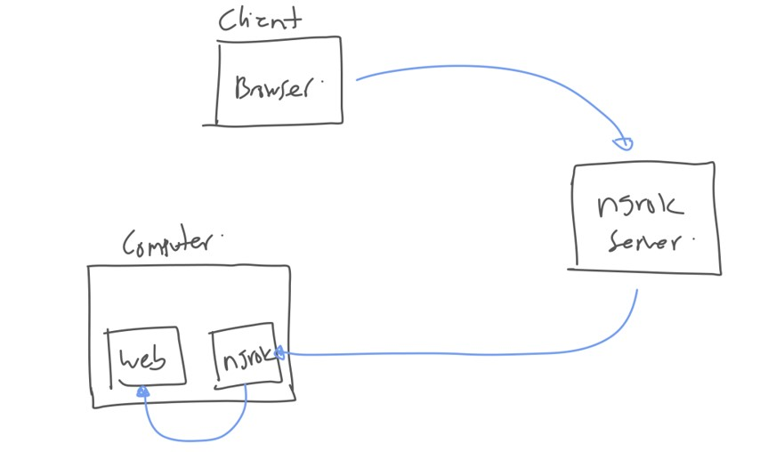

# Ngrok

## Sebelum Belajar

- Mengerti Cara Kerja HTTP
- Mampu Membuat Website
- Mampu Menggunakan Terminal / Command Line

## Agenda

- Pengenalan Ngrok
- Menginstall Ngrok
- Authentication
- HTTP Tunnel
- Inspecting Traffic

## #1 Pengenalan Ngrok

- Ngrok merupakan salah satu layanan untuk HTTP Tunnel
- Ngrok memiliki fitur gratis dan berbayar, pada materi ini kita akan fokus membahas fitur-fitur gratis nya
- <https://ngrok.com/>

### HTTP Tunnel

- HTTP Tunneling merupakan teknik untuk meneruskan request HTTP yang kita lakukan ke target yang dituju
- Pada kasus ini, Ngrok memberikan layanan dimana dia bisa melakukan HTTP Tunnel ke web server yang berjalan di local laptop kita
- Dengan demikian, kita bisa mengakses web server yang hanya berjalan di local, dari manapun via internet menggunakan layanan Ngrok

## Diagram HTTP Tunnel



## #2 Menginstall Ngrok

- Untuk menggunakan Ngrok, kita perlu download aplikasi Ngrok yang akan bertugas sebagai daemon di laptop kita
- Kita bisa download aplikasi Ngrok secara gratis di :
- <https://ngrok.com/download>

## #3 Authentication

- Sebelum kita menjalankan Ngrok di laptop kita, hal yang pertama perlu kita lakukan adalah menambah authentication key
- Kita perlu daftar terlebih dahulu di website Ngrok, bisa kita lakukan secara gratis
- Setelah itu, kita bisa lihat authentication key nya di halaman :
- <https://dashboard.ngrok.com/get-started/your-authtoken>

### Menambahkan Authentication key

- Sebelum kita bisa memulai aplikasi Ngrok, kita perlu tambahkan terlebih dahulu authentication key yang ada menggunakan aplikasi ngrok yang sudah kita download
- Setelah menambahkan, secara otomatis authentication akan disimpan di file `.ngrok2/ngrok.yml` di home directory kita
- <https://dashboard.ngrok.com/get-started/setup>

## #4 HTTP Tunnel

- Setelah proses authentication selesai, kita bisa mulai melakukan HTTP Tunnel
- Untuk melakukan HTTP Tunnel, kita bisa update konfigurasi `.ngrok.yaml` nya dengan menambahkan `tunnels`

### Kode: HTTP Tunnels

```yml
authToken: '<token>'
tunnels:
	web1:
		proto: http
		addr: 8080
	web2:
		proto: http
		addr: 8181
```

### Menjalankan HTTP Tunnel

- Setelah kita menambahkan konfigurasi HTTP Tunnel
- Kita bisa menjalankannya dengan menggunakan perintah :
- `ngrok start web1 web2`
- Sesuaikan dengan nama http tunnel yang kita buat

## #5 Inspecting Traffic

- Saat kita menjalankan HTTP Tunnel, kadang kita ingin melakukan proses debugging
- Misal ingin melihat request yang masuk, atau response yang keluar
- Ngrok memiliki fitur HTTP Tunnel, dimana kita bisa melihat semua traffic masuk dan keluar dari Ngrok yang berjalan di laptop kita
- Untuk melakukan itu, kita bisa membuka halaman :
- <http://localhost:4040>

## #6 Penutup
