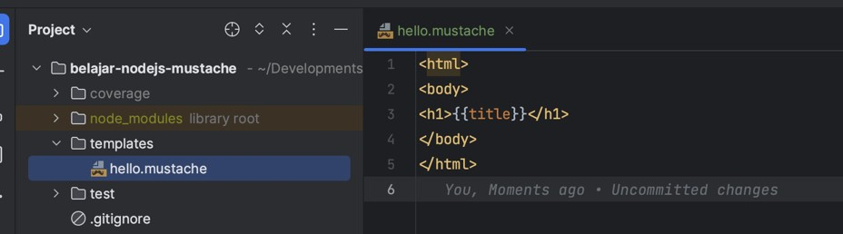

# NodeJS Mustache

## Sebelum Balajar

- Sudah Mengikuti Kelas JavaScript Programmer Zaman Now
- NodeJS Dasar, Unit Test, Logging, dan ExpressJS

## Agenda

- Pengenalan Mustache
- Tags
- Sections
- Inverted Sections
- Functions
- Partials
- Dan lain-lain

## #1 Pengenalan Mustache

- Mustache adalah library untuk Template Engine
- Dengan menggunakan Mustache, kita bisa membuat kode template, yang nanti isi data bisa kita masukkan ke dalam template sehingga menghasilkan konten yang kita mau
- Mustache sangat sederhana, oleh karena itu sangat mudah dipelajari
- Mustache sendiri sudah menjadi standar, sehingga bisa digunakan di banyak teknologi dan bahasa pemrograman
- <https://mustache.github.io/>
- Semua standarisasi nya bisa dilihat di <https://mustache.github.io/mustache.5.html>

### NodeJS mustache

- Salah satu implementasi dari Mustache di NodeJS adalah library MustacheJS
- <https://github.com/janl/mustache.js/>
- <https://www.npmjs.com/package/mustache>

## #2 Membuat Project

- Clone project belajar-nodejs-unit-test
- <https://github.com/ProgrammerZamanNow/belajar-nodejs-unit-test>

### Menambah Dependency

```js
...
"dependencies": {
	"mustache": "^4.2.0"
},
"devDependencies": {
	"@babel/plugin-transform-runtime": "^7.17.12",
	"@babel/preset-env": "^7.17.12",
	"babel-jest": "^28.1.0",
	"jest": "^28.1.0",
	"@types/jest": "^28.1.0",
	"@types/mustache": "^4.2.0"
}
...
```

### Menggunakan Mustache JS

- Sebelum kita belajar tentang Mustache Template Engine, kita akan belajar bagaimana menggunakan Mustache JS
- Untuk menggunakan Mustache JS, terdapat function bernama `render(template, data)` di package mustache, kita bisa gunakan untuk merender template dan data

### Kode: Menggunakan Mustache JS

```js
// tests/mustache.test.js
import Mustache from "mustache";

test("Menggunakan Mustache", () => {
	const data = Mustache.render("Hello, {{name}}", { name: "Eko" });
	expect(data).toBe("Hello, Eko");
});
```

## #3 Mustache Cache

- Saat kita menggunakan function `render()`, data template akan di cache oleh Mustache JS, hal ini agar ketika kita melakukan render dengan template yang sama, proses akan menjadi lebih cepat
- Biasanya, proses render di awal akan sedikit lebih lambat, dikarenakan butuh melakukan proses kompilasi template terlebih dahulu
- Jika kita ingin mempercepat, di awal aplikasi berjalan, kita bisa lakukan kompilasi semua template terlebih dahulu, dengan cara menggunakan function `parse(template)`

### Kode: Mustache Cache

```js
// tests/mustache.test.js
import Mustache from "mustache";

test("Menggunakan Compile", () => {
	Mustache.parse("Hello, {{name}}");

	const data = Mustache.render("Hello, {{name}}", { name: "Eko" });
	expect(data).toBe("Hello, Eko");
});
```

## #4 Tags

- Mustache menggunakan kurung kurawal dua kali sebagai tags, misal `{{name}}`
- Tag digunakan untuk mengirim data dari luar template, jika data tidak dikirim, maka akan diganti oleh string kosong
- Secara default HTML di dalam data tags akan di escape, jika kita ingin menampilkan HTML, kita bisa gunakan kurung kurawal tiga kali, misal `{{{kode}}}`

### Kode: Tags

```js
// tests/mustache.test.js
import Mustache from "mustache";

test("Tags", () => {
	const data = Mustache.render("Hello, {{name}}, my today is {{{hobby}}}", {
		name: "Eko",
		hobby: "<b>Programming</b>",
	});
	expect(data).toBe("Hello, Eko, my hobby is <b>Programming</b>");
});
```

## #5 Nested Object

- Mustache Tags juga bisa digunakan untuk data nested, bahkan array (akan dibahas di materi khusus)
- Untuk mengaksesnya, dalam tags kita bisa gunakan titik, misal `{{person.name}}`

### Kode: Nested Object

```js
test("Nested Object", () => {
	const data = Mustache.render("Hello, {{params.name}}", {
		person: {
			name: "Eko",
		},
	});
	expect(data).toBe("Hello, Eko");
});
```

## #6 Mustache File

- Mustache JS sendiri sebenarnya tidak memiliki kemampuan untuk membaca template dari file, jadi kita perlu membaca template dari file secara manual
- Biasanya Mustache menggunakan nama file dengan extension `.mustache`

### Kode: Mustache Template



### Kode: Membaca Mustache File

```js
import Mustache from "mustache";
import fs from "fs/promises";

test("Mustache File", async () => {
	const helloTemplate = await fs
		.readFile("./templates/hello.mustache")
		.then((data) => data.toString());

	const data = Mustache.render(helloTemplate, {
		title: "Eko",
	});

	console.info(data);
	expect(data).toContain("Eko");
});
```

## #7 Sections

- Mustache adalah template engine yang tidak memiliki logic kompleks
- Tapi kadang-kadang, kita ingin menambahkan logic, misal if else
- Di Mustache, hal ini bisa kita ganti menjadi sections
- Sections di Mustache menggunakan `{{#nama}}`, dan ditutup dengan `{{/nama}}`
- Dimana blok di dalam sections tidak akan ditampilkan jika variable di sections tidak ada, atau ada tapi dengan nilai null, undefined, false, 0, NaN, empty string atau empty array

### Kode: Mustache File

```html
<!doctype html>
<html>
	<head>
		<meta charset="utf-8" />
		<meta name="viewport" content="width=device-width, initial-scale=1" />
		<title>Person</title>
	</head>
	<body>
		{{#person}} Hello Person {{/person}}
	</body>
</html>
```

### Kode: Sections Now Show

```js
test("Sections Not Show", async () => {
	const helloTemplate = await fs
		.readFile("./templates/person.mustache")
		.then((data) => data.toString());

	const data = Mustache.render(helloTemplate, {});

	console.info(data);
	expect(data).not.toContain("Hello Person");
});
```

### Kode: Sections Show

```js
test("Sections Show", async () => {
	const helloTemplate = await fs
		.readFile("./templates/person.mustache")
		.then((data) => data.toString());

	const data = Mustache.render(helloTemplate, {
		person: {
			name: "Eko",
		},
	});

	console.info(data);
	expect(data).toContain("Hello Person");
});
```

## #8 Section Data

- Saat menggunakan sections, kita juga bisa mengakses data yang terdapat di sections secara otomatis, tanpa harus menyebutkan sections nya lagi
- Misal pada kasus sebelumnya, kita bisa mengakses `{{name}}` tanpa harus menyebutkan `{{person.name}}`

### Kode: Mustache File

```html
<!doctype html>
<html>
	<head>
		<meta charset="utf-8" />
		<meta name="viewport" content="width=device-width, initial-scale=1" />
		<title>Person</title>
	</head>
	<body>
		{{#person}} Hello Person {{name}}! {{/person}}
	</body>
</html>
```

### Kode: Sections Data

```js
test("Sections Data", async () => {
	const helloTemplate = await fs
		.readFile("./templates/person.mustache")
		.then((data) => data.toString());

	const data = Mustache.render(helloTemplate, {
		person: {
			name: "Eko",
		},
	});

	console.info(data);
	expect(data).toContain("Hello Person Eko!");
});
```

## #9 Inverted Sections

- Saat menggunakan logika if, kadang kita ingin menambahkan kondisi else
- Di Mustache, kita bisa menggunakan inverted sections, dimana blok sections akan dieksekusi jika nilai sections adalah null, undefined, false, falsy atau empty list
- Untuk menggunakan Inverted Sections, kita bisa gunakan `{{^nama}}` dan ditutup dengan `{{/nama}}`

### Kode: Mustache File

```html
<!doctype html>
<html>
	<head>
		<meta charset="utf-8" />
		<meta name="viewport" content="width=device-width, initial-scale=1" />
		<title>Person</title>
	</head>
	<body>
		{{#person}} Hello Person {{name}}! {{/person}} {{^person}} Hello Guest
		{{/person}}
	</body>
</html>
```

### Kode: Inverted Sections

```js
test('Inverted Sections', async () => {
	const helloTemplate = await fs.readFile("./templates/person.mustache");
		.then(data => data.toString());

	const data = Mustache.render(helloTemplate, {});

	console.info(data);
	expect(data).toContain("Hello Guest");
});
```

## #10 List

- Saat membuat template, kadang kita ingin menampilkan data yang bentuknya adalah List atau Array
- Mustache juga bisa menggunakan sections untuk menampilkan itu
- Untuk menampilkan tiap data, kita bisa gunakan titik di dalam sections nya, misal `{{.}}`
- Ingat, sama seperti sections, jika data list tidak ada, maka tidak akan menampilkan apapun

### Kode: Mustache File

```html
<!doctype html>
<html>
	<head>
		<meta charset="utf-8" />
		<meta name="viewport" content="width=device-width, initial-scale=1" />
		<title>Person</title>
	</head>
	<body>
		<h1>Hibbies</h1>
		<ul>
			{{#hobbies}}
			<li>{{.}}</li>
			{{/hobbies}}
		</ul>
	</body>
</html>
```

### Kode: List

```js
test("list", async () => {
	const helloTemplate = await fs
		.readFile("./templates/hobbies.mustache")
		.then((data) => data.toString());

	const data = Mustache.render(helloTemplate, {
		hobbies: ["Coding", "Gaming", "Reading"],
	});

	console.info(data);
	expect(data).toContain("Coding");
});
```

## #11 List Object

- Kadang, kita memiliki data kumpulan object di dalam List atau Array
- Itu juga bisa kita akses menggunakan sections, caranya mirip dengan menggunakan Sections Object

### Kode: Mustache File

```html
<!doctype html>
<html>
	<head>
		<meta charset="utf-8" />
		<meta name="viewport" content="width=device-width, initial-scale=1" />
		<title>Students</title>
	</head>
	<body>
		<h1>Students</h1>
		<table>
			{{#students}}
			<tr>
				<td>{{name}}</td>
				<td>{{value}}</td>
			</tr>
			{{/students}}
		</table>
	</body>
</html>
```

### Kode: List Object

```js
test("List Object", async () => {
	const helloTemplate = await fs
		.readFile("./templates/students.mustache")
		.then((data) => data.toString());

	const data = Mustache.render(helloTemplate, {
		students: [
			{ name: "Eko", value: 100 },
			{ name: "Budi", value: 100 },
		],
	});

	console.info(data);
	expect(data).toContain("Eko");
});
```

## #12 Functions

- Dalam tags, selain data, kita juga bisa mengakses function
- Caranya cukup mudah, kita hanya perlu membuat function yang mengembalikan function dengan parameter text, dan render
- Parameter render adalah function Mustache untuk melakukan render, dan sebelum dikembalikan, kita bisa memanipulasi hasilnya
- Untuk menggunakan function, caranya sama dengan menggunakan sections, cukup gunakan `{{#function}}` dan ditutup dengan `{{/function}}`

### Kode: Functions

```js
test("Functions", async () => {
	const parameter = {
		name: "Eko",
		upper: () => {
			return (text, render) => {
				return render(text).toUpperCase();
			};
		},
	};
});
```

### Kode: Menggunakan Functions

```js
test("Functions", async () => {
	const parameter = {
		name: "Eko",
		upper: () => {
			return (text, render) => {
				return render(text).toUpperCase();
			};
		},
	};

	const data = Mustache.render("Hello {{#upper}}{{name}}{{/upper}}", parameter);
	expect(data).toBe("Hello EKO");
});
```

## #13 Comment

- Kadang kita ingin menambahkan komentar di file Mustache
- Untuk menambahkan komentar, kita bisa menggunakan `{{! isi komentar }}`

### Kode: Mustache File

```
<!DOCTYPE html>
<html>
<head>
	<meta charset="utf-8">
	<meta name="viewport" content="width=device-width, initial-scale=1">
	{{! Ini komentar }}
	<title>{{title}}</title>
</head>
<body>

</body>
</html>
```

### Kode: Comment

```js
test("Comment", async () => {
	const helloTemplate = await fs
		.readFile("./templates/comment.mustache")
		.then((data) => data.toString());

	const data = Mustache.render(helloTemplate, { title: "Eko" });

	console.info(data);
	expect(data).toContain("Eko");
	expect(data).not.toContain("Komentar");
});
```

## #14 Partials

- Saat kita membuat halaman web menggunakan Mustache, kadang kita ingin membagi template menjadi beberapa bagian
- Misal ada bagian header, content dan footer
- Untungnya, Mustache mendukung hal tersebut
- Kita bisa menggunakan perintah `{{> namaPartial}}`
- Pada function render, terdapat parameter ketika berisikan object partials yang bisa kita gunakan untuk menambahkan data template lainnya

### Kode: Mustache Header

```html
<!doctype html>
<html>
	<head>
		<meta charset="utf-8" />
		<meta name="viewport" content="width=device-width, initial-scale=1" />
		<title>{{title}}</title>
	</head>
	<body></body>
</html>
```

### Kode: Mustache Footer

```html
<p>Powered by Programmer Zaman Now</p>
</body>
</html>
```

### Kode: Mustache Content

```html
{{> header }}

<h1>{{title}}</h1>
<p>{{content}}</p>

{{> footer }}
```

### Kode: Partials

```js
test("Partials", async () => {
	const headerTemplate = fs.readFile("./templates/header.mustache").then(data => data.toString());
	const footerTemplate = fs.readFile("./templates/footer.mustache").then(data => data.toString());
	const contentTemplate = fs.readFile("./templates/content.mustache").then(data => data.toString());

	const data = Mustache.render(contentTemplate, {
		title: "Belajar Partials".
		content: "Eko Kurniawan Khannedy"
	}, {
		header: headerTemplate,
		footer: footerTemplate,
	});

	console.info(data);
	expect(data).toContain("Belajar Partials");
	expect(data).toContain("Eko Kurniawan Khannedy");
	expect(data).toContain("Programmer Zaman Now");
});
```

## #15 Materi Selanjutnya

- NodeJS Database
