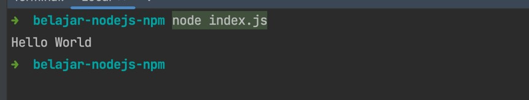
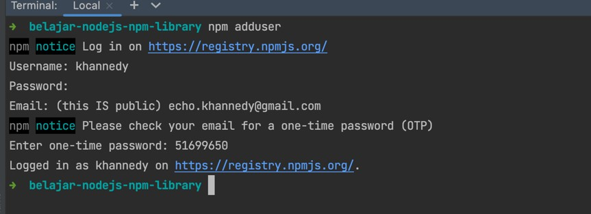
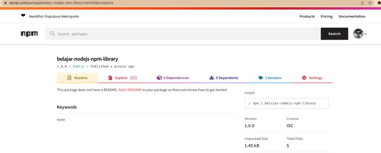
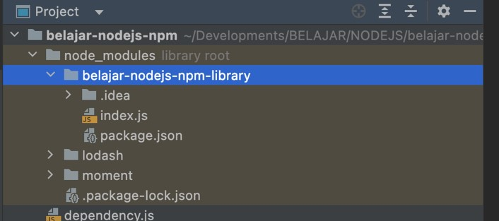
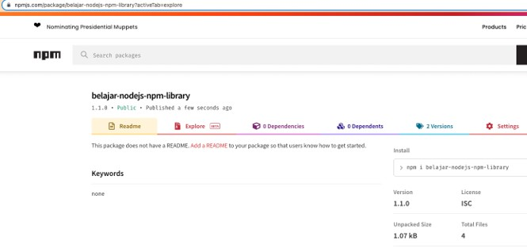
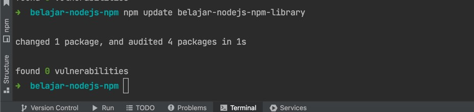
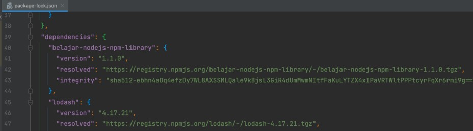

# NodeJS NPM

## Sebelum Belajar

- Menyelesaikan Kelas JavaScript Programmer Zaman Now
- NodeJS Dasar

## Agenda

- Pengenalan Node Package Manager
- Membuat Project
- Project Configration
- Project Type
- Script
- Dependency Management
- Dan lain-lain

## #1 Pengenalan Node Package Manager

- Saat kita membuat aplikasi, biasaya kita akan buat dalam bentuk project
- Sederhanannya, project adalah `directory/folder` yang berisikan kode program dan dependency (libray) yang kita butuhkan
- Melakukan management kode program dan dependency management secara manual bukanlah hal yang menyenangkan
- Untungnya, NodeJS menyediakan NPM (Node Package Manager) yang bisa kita gunakan untuk melakukan management project NodeJS

### Kegunaan NPM

- NPM tidak hanya digunakan untuk melakukan management project NodeJS
- NPM juga bisa digunakan untuk melakukan dependency management yang kita butuhkan dalam project yang kita buat
- NPM bisa digunakan untuk download dependency, updat dan upgrade dependency secara otomatis, tanpa harus kita lakukan secara manual dengan cara download dependency secara manual

### File package.json

- Saat kita melakukan management project menggunakan NPM
- NPM menyimpan semua konfigurasi project di file bernama `package.json`
- Semua konfigurasi project dan juga dependency kita simpe dalam file `package.json` yang terdapat di dalam directory project
- Kita bisa buat file `package.json` secara manual, atau menggunakan auto generate secara otomatis menggunakan NPM

### NodeJS Dependency Repository

- Saat kita melakukan management dependency menggunakan NPM
- NPM akan melakukan pencarian dan download dependency secara otomatis dari website
- <https://www.npmjs.com>
- Kita juga bisa mencari dependency di website: <https://www.npmjs.com>

### Menginstall NPM

- Kita tidak perlu menginstall NPM secara manual
- Saat kita menginstall NodeJS, secara otomatis NPM akan terinstall juga
- Untuk mengecek versi NPM yang terinstall di komputer kita, kita bisa gunakan perintah:
- `npm --version`

## #2 Membuat Project

- Buat folder untuk project
- Masuk ke folder project melalui terminal/command line
- Buat project NPM baru dengan printah:
- `npm init`

## #3 Project Configuration

### package.json

- Inti dari konfigurasi project NodeJS adalah package.json
- File package.json merupakan konfigurasi yang berupa format json untuk project NodeJS yang kita buat

### Project Configuration(1)

| Attribute   | Description          |
| ----------- | -------------------- |
| name        | Nama project/package |
| version     | Versi project        |
| description | Deskrisi project     |
| homepage    | Home page project    |
| author      | Author project       |

### Project Configuration(2)

| Attribute    | Description              |
| ------------ | ------------------------ |
| contributors | Name kontributor project |
| main         | Entry point project      |
| keywords     | Keyword project          |
| license      | Lisensi project          |
| repository   | Repository project       |

### Kode: pacakge.json

```json
{
	"name": "belajar-nodejs-npm",
	"version": "1.0.0",
	"description": "Belajar NodeJS NPM",
	"author": "Eko Kurniawan Khannedy",
	"license": "ISC",
	"homepage": "https://www.programmerzamannow.com",
	"keywords": ["programmerzamannow", "pzn", "nodejs"],
	"repository": {
		"type": "git",
		"url": "https://github.com/ProgrammerZamanNow/belajar-nodejs-npm"
	},
	"main": "index.js",
	"scripts": {
		"test": "echo \"Error: no test specified\" && exit 1"
	}
}
```

## #4 Menjalankan Project

- Untuk Menjalankan project, sebenarnya kita lakukan buat sama seerti ketika kita menjalankan script NodeJS
- Kita bisa gunakan perintah
- `node filescript`
- Yang membedakan adalah, NodeJS sebelum menjalankan file nya, dia akan membaca konfigurasi dari `package.json` terlebih dahulu

### Kode: Hello World

```js
console.info("Hello World");
```



```bash
node index.js
```

## #5 Project Type

- Secara default, saat kita membuat project NodeJS, NodeJS menggunakan `commonjs`
- Oleh karena itu, ketika kita ingin menggnakan JavaScript Modules, kita harus mengubah file nya menjadi file `mjs`
- Namun, kita juga bisa mengubah default project type dari `commonjs` menjadi js `module`, dengan cara mengubah type di `package.json`
- Sangat direkomendasikan sekarang menggunakan js modules dibanding `commonjs`, karena js modules sudah menjadi standrd d JavaScript

### Kode: pacakge.json

```json
{
	"name": "belajar-nodejs-npm",
	"version": "1.0.0",
	"description": "Belajar NodeJS NPM",
	"author": "Eko Kurniawan Khannedy",
	"license": "ISC",
	"homepage": "https://www.programmerzamannow.com",
	"keywords": ["programmerzamannow", "pzn", "nodejs"],
	"type": "module",
	"repository": {
		"type": "git",
		"url": "https://github.com/ProgrammerZamanNow/belajar-nodejs-npm"
	},
	"main": "index.js",
	"scripts": {
		"test": "echo \"Error: no test specified\" && exit 1"
	}
}
```

### Kode: Write

```js
import fs from "fs";

export const writeToFile = (file, content) => {
	fs.writeFileSync(file, content);
};
```

### Kode: Index

```js
import { writeToFile } from "./write.js";

writeToFile("hello.log", "Eko Kurniawan Khannedy");
```

## #6 Script

- NPM memiliki fitur yang bernama script, dimana kita bisa menyediakan perintah script yang nanti bisa digunakan untuk menjalankan perintah lainnya
- Penggunaan script ini biasanya digunakan untuk mempermudah ketika kita menjalankan perintah yang panjang
- Untuk menambahkan script, kita bisa tambahka script nya di `package.json`

### Kode: package.json

```json
...
"scripts": {
	"run": "node index.js",
	"test": "echo \"Error: not test specified\" && exit 1"
}
...
```

### Menjalankan Script

- Untuk menjalankan script, kita bisa gunakan NPM dengan perintah:
- `npm run-script namascript`

### Kode: Run Script

```bash
npm run-script run
```

### Special Script

- Script di `package.json` terdapat beberapa yang spesial atau khusus
- Script tersebut tidak perlu dijalankan menggunakan npm run-script namascript, tapi bisa langsung dijalankan menggunakan perintah npm namascript
- Contoh special script yaitu : `start`, `stop`, `test`, `restart`, `uninstall`, `version`, dan lain-lain
- Selain itu, terdapat script spesial untuk script diatas, kita bisa gunakan gunakan prefix pre sebagai script yang akan dijalankan sebelumnya, dan prefix post sebagai script yang dijalankan setelahnya
- Misal ketika kita gunakan perintah `npm start`, maka akan menjalankan script prestart, start dan poststart

### Kode: Start Script

```json
...
"scripts": {
	"run": "node index.js",
	"prestart": "echo 'Before Application Start'",
	"start": "node index.js",
	"poststart": "echo 'After Application Start'",
	"test": "echo \"Error: not test specified\" && exit 1"
}
...
```

### Menjalankan Start Script

```bash
npm start
```

## #7 Export Module

### Main

- Sampai saat ini, kita tidak pernah membahas tentang attribute main di `package.json`
- Attribute main adalah entry point yang akan di-load ketika kita me-load NodeJS Project / Package
- Pada kasus ketika kita membuat aplikasi, mungkin tidak terlalu berguna, tapi pada kasus ketika kita membuat library yang akan digunakan di banyak project, baru attribute main ini akan terlihat kegunaanya

### Export Module

- Problem ketika kita menggunakan attribute main adalah, kita cuma bisa mengekspos satu file JS, oleh karena itu penggunaan attribute main sebenarnya sudah tidak direkomendasikan lagi
- Sebagai penggantinya, terdapat attribute export yang bisa digunakan sebagai konfigurasi untuk mengekspos file JS
- Yang menarik dari fitur export ini, kita bisa membuat alias ketika mengekspos file JS, sehingga tidak perlu menggunakan nama file JS aslinya

### Kode: Exports

```json
...
"exports": {
	".": "./index.js",
	"./write": "./write.js",
}
...
```

### Menggunakan Module

- Untuk menggunakan module yang sudah di export, kita cukup gunakan `import` dari nama module yang di export tersebut, namun ganti tanda `.` (titik) dengan nama package yang ada di `package.json`
- Misal
- `"."` menjadi `"belajar-nodejs-npm`"
- `"./write" menjadi "belajar-nodejs-npm/write"`

### Kode: Menggunakan Module

```js
// export.js

import { writeToFile } from "belajar-nodejs-npm/write";

writeToFile("hello.log", "Eko Kurniawan Khannedy");
```

## #8 Dependency Management

- Salah satu fitur yang sangat berguna dalam NPM adalah dependency management
- Saat kita membuat aplikasi, sering sekali kita akan membutuhkan dependency ke library atau package pihak lain, misal package open source, atau package yang kita buat sendiri
- NPM mendukung dependency management, sehingga kita tidak perlu download package yang kita butuhkan secara manual, termasuk tidak perlu melakukan update dependency secara manual ketika ada update terbaru

### npmjs.com

- Secara default, NPM akan download dependency dari website <https://www.npmjs.com/>
- Kita bisa mencari open source package atau membuat open source package disana jika kita mau
- Untuk menginstall dependency, kita bisa gunakan perintah:
- `npm install namadependency@version`
- Atau bisa langsung tulis di dependencies di `package.`json

### Kode: Menambahkn Dependency

```json
...
"dependencies": {
	"lodash": "4.17.21"
}
...
```

### Download Dependency

- Untuk download dependency, kita bisa gunakan perintah:
- `npm install`
- Secara otomatis NPM akan download package yang ada di dependency ke dalam folder `node_modules`
- Selain itu, NPM juga akan membuat file `package-lock.json` yang berisikan informasi versi package yang di download, ini untuk mempermudah ketika kita melakukan download ulang library di komputer lain

### Kode: Menggunakan Dependency

```js
import _ from "lodash";

const source = "EKO KURNIAWAN KHANNEDY";
const target = _.capitalize(source);

console.info(target);
```

## #9 Dependency Version

### Semantic Version

- NodeJS merekomendasikan menggunakan semantic version dalam menentukan format version pada package yang kita buat
- <https://semver.org/>
- Jika kita perhatikan, kebanyakan package di <https://www.npmjs.com/> menggunakan semantic version

### Dependency

- Salah satu kegunaan menggunakan semantic version adalah, kita bisa menentukan versi package yang ingin kita gunakan secara dinamis, tanpa harus melakukan hardcode pada versi tertentu
- Ada beberapa aturan yang bisa kita gunakan ketika menentukan versi dependency yang ingin kita gunakan di `package.json`

### Menentukan Versi Dependency

| Versi  | Keterangan                                                                                            |
| ------ | ----------------------------------------------------------------------------------------------------- |
| x      | Download versi terbaru dan update ke versi terbaru walaupun MAJOR berubah                             |
| 1.x    | Download versi 1 terbaru, update ke versi terbaru, tapi MAJOR tetap di 1                              |
| 1.1.x  | Download versi 1.1 terbaru, update ke versi terbaru, tapi MAJOR dan MINOR tetap di 1.1                |
| 1.1.1  | Selalu download versi 1.1.1, tidak akan update walaupun ada versi terbaru                             |
| ~1.1.1 | Download versi 1.1.1 jika ada update, lakukan update, namun hanya update jika PATCH berubah           |
| ^1.1.1 | Download versi 1.1.1 jika ada update, lakukan update, namun hanya update jika MINOR dan PATCH berubah |

- <https://semver.npmjs.com>

## #10 Development Dependency

- Di `package.json`, terdapat dua jenis dependency, production dependency dan development dependency
- Dependency management yang sebelumnya kita bahas adalah production dependency, yaitu dependency yang dibutuhkan ketika aplikasi kita berjalan
- Sedangkan development dependency, adalah dependency yang dibutuhkan khusus ketika proses development, contoh yang sering misal dependency unit testing, yang cukup digunakan ketika development, tetapi tidak dibutuhkan ketika aplikasi berjalan

### Menambah Development Dependency

- Untuk menambah development dependency, kita bisa tambahkan di bagian devDependencies di `package.json`
- Atau gunakan perintah:
- `npm install namapackage --save-dev`
- Untuk download dependency, sama seperti download production dependency, kita bisa gunakan perintah:
- `npm install`

### Kode: Development Dependency

```json
...
"dependencies": {
	"lodash": "4.17.21"
},
"devDependencies": {
	"moment": "^2.29.3"
}
...
```

### Kode: Menggunakan Dev Dependency

```js
// development.js
import moment from "moment";

console.info(moment().format());
```

### Install Dependency Tanpa Development

- Secara default, saat kita gunakan perintah `npm install`, semua dependency akan di install, termasuk development
- Ada baiknya, ketika kita mau jalankan aplikasi di production, kita tidak perlu menginstall development dependency, caranya kita bisa gunakan perintah:
- `npm install --production`

## #11 Membuat Library

- Sekarang kita akan coba praktek membuat opensource `library/package`
- Dan akan kita coba publish package yang kita buat ke <https://www.npmjs.com/>
- Silahkan daftar terlebih dahulu ke websitenya

### Kode: Membuat Project Baru

```bash
mkdir belajar-nodejs-npm-library
cd belajar-nodejs-npm-library
npm init
```

### Kode: package.json

```json
{
	"name": "belajar-nodejs-npm-library",
	"version": "1.0.0",
	"description": "Belajar NodeJs NPM Library",
	"main": "index.js",
	"type": "module",
	"scripts": {
		"test": "echo \"Error: not test specified\" && exit 1"
	},
	"author": "Eko Kurniawan Khannedy",
	"license": "MIT"
}
```

## #12 Publish Package

### Login ke Web NPM

- Setelah membuat `library/package`, selanjutnya kita perlu login terlebih dahulu ke Web NPM menggunakan perintah NPM
- Kita bisa gunakan perintah:
- `npm adduser`

### Kode: npm adduser



### Publish Package

- Setelah login, sekarang kita bisa melakukan publish package ke web NPM dengan menggunakan perintah:
- `npm publish`
- Perlu diingat, nama package itu harus unique secara global, jadi pastikan sebelum publish ke web NPM, pastikan tidak ada package dengan nama yang sama

### Hasil Publish Package



## #13 Install Package

- Setelah library yang kita buat kita publish ke npm, selanjutnya kita bisa install package tersebut di project yang kita inginkan
- Caranya sama seperti menginstall dependency yang lain

### Kode: package.json

```json
"dependencies": {
	"lodash": "4.17.21",
	"belajar-nodejs-npm-library": "^1.0.0"
},
"devDependencies": {
	"moment": "^2.29.3"
}
```

### Node Modules



### Kode: Menggunakan Library

```js
// hello.js
import { sayHello, sum } from "belajar-nodejs-npm-library";

console.info(sayHello("Eko"));

const numbers = [10, 10, 10, 10, 10];
console.info(sum(numbers));
```

## #14 Ignore File

- Saat kita publish package ke web NPM, secara default, semua file yang terdapat di project akan di publish ke web NPM
- Kadang kita ingin meng-ignore beberapa file agar tidak ikut terpublish ke web NPM
- Untuk itu, kita bisa membuat file `.npmignore`
- Format pemulisan `.npmignore` sama dengan format penulisan `.gitignore`
- Jadi kita kita sudah terbiasa menggunakan Git, maka kita tidak perlu belajar lagi

### Git Ignore

- NPM secara default akan membaca file `.npmignore` untuk melakukan ignore file
- Namun, jika file `.npmignore` tidak ada, maka NPM akan coba membaca file `.gitignore`
- Oleh karena itu, jika kita sudah memiliki `.gitignore`, kita bisa saja tidak perlu membuat `.npmignore` lagi, kecuali jika memang ingin melakukan ignore file yang berbeda

### Kode: .npmignore

```
// .npmignore
.idea
*.log
```

## #15 Upgrade Library

- Untuk melakukan upgrade `library/package` yang sudah kita buat, caranya sangat mudah, kita cukup melakukan update version di `package.json`
- Namun perlu diingat, lakukanlah upgrade package dengan mengikuti kaidah semantic version

### Aturan Semantic Version

- Jika melakukan bugfix, tidak ada code break, upgrade versi PATCH
- Jika menambah fitur, tidak ada code break, upgrade versi MINOR
- Jika mengubah fitur, dan melakukan code break, upgrade versi MAJOR

### Kode: Menambah Fitur

```js
// number.js
export const min = (first, second) => {
	if (first < second) {
		return first;
	} else {
		return second;
	}
};

export const max = (first, second) => {
	if (first > second) {
		return first;
	} else {
		return second;
	}
};
```

### Kode: package.json

```json
...
"version": "1.1.0",
...
"exports": {
	".": "./index.js",
	"./number": "./number.js"
}
...
```

### Publish Package

- Setelah melakukan perubahan package, dan yakin dengan perubahannya, kita bisa lakukan publish package lagi
- Pastikan version nya sudah kita ubah sesuai aturan semantic version
  Gunakan perintah:
- `npm publish`

### Update Library di NPM Web



## #16 Update Dependency

- Untuk melakukan update library dependency, yang perlu kita lakukan adalah mengubah versi dari dependency nya
- Atau jika kita sudah menggunakan version `~ `atau `^`, maka kita bisa secara otomatis melakukan update dengan menggunakan perintah:
- `npm update namapackage`
  Atau jika kita ingin melakukan update semua dependency, gunakan perintah:
- `npm update`

### Kode: Update Library



### Kode: Hasil Update



### Kode: Test Feature Baru

```js
// hello.js
import { sayHello, sum } from "belajar-nodejs-npm-library";
import { min, max } from "belajar-nodejs-npm-library/number";

console.info(sayHello("Eko"));

const numbers = [10, 10, 10, 10, 10];
console.info(sum(numbers));

console.info(min(10, 20));
console.info(max(10, 20));
```

## #17 Materi Selanjutnya

- NodeJS Unit Test
- ExpressJS
- NodeJS Database
- Dan lain-lain
