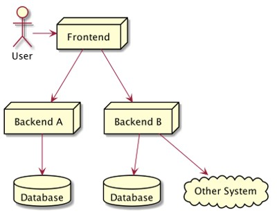
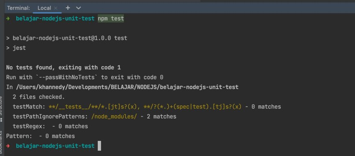

# NodeJS Unit Test

## Sebelum Balajar

- Mengikuti Kelas JavaScript Programmer Zaman Now
- NodeJS Dasar
- NodeJS Pacakge Manager

## Agemda

- Pengenalan Testing
- Berkenalan dengan Jest Library
- Membuat Unit Test
- Matchers
- Mock
- Dan lain-lain

## #1 Pengenalan Software Testing

- Software testing adalah salah satu disiplin ilmu dalam software engineering
- Tujuan utama dari software testing adalah memastikan kualitas kode dan aplikasi kita baik
- Ilmu untuk software testing sendiri sangatlah luas, pada materi ini kita hanya akan fokus ke unit testing

### Test Pyramid


### Contoh High Level Architecture Aplikasi



### UI Test / End to End Test


### Service Test / Integration Test


### Contoh Internal Architecture Aplikasi


### Unit Test


### Unit Test

- Unit test akan fokus menguji bagian kode program terkecil, biasanya menguji sebuah method
- Unit test biasanya dibuat kecil dan cepat, oleh karena itu biasanya kadang kode unit test lebih banyak dari kode program aslinya, karena semua skenario pengujian akan dicoba di unit test
- Unit test bisa digunakan sebagai cara untuk meningkatkan kualitas kode program kita

## #2 Pengenalan Jest

### NodeJS Assertion Package

- NodeJS sendiri sebenarnya memiliki package untuk melakukan assertion, namun kita tidak akan membahasnya, karena jarang sekali orang menggunakan package tersebut
- <https://nodejs.org/api/assert.html>
- Programmer NodeJS kebanyakan menggunakan library yang lebih baik untuk melakukan unit test

### NodeJS Unit Test Library

- Sebenarnya ada banyak sekali library opensource yang bisa kita gunakan untuk melakukan unit test di NodeJS
- Jest : <https://jestjs.io/>
- Mocha : <https://mochajs.org/>
- Jasmine : <https://jasmine.github.io/>
- Dan masih banyak yang lainnya

### Pengenalan Jest

- Jest adalah salah satu library untuk unit test NodeJS yang sangat populer
- Jest sendiri dibuat oleh Facebook
- Jest terintegrasi sangat baik dengan banyak teknologi seperti NodeJS, ReactJS, VueJS, dan lain-lain
- Jest fokus pada kesederhanaan, sehingga penggunaannya sangat mudah untuk pemula yang ingin mencoba unit test
- <https://jestjs.io/>

## #3 Membuat Project

- `npm init`

### Kode: package.json

```json
{
	"name": "belajar-nodejs-unit-test",
	"version": "1.0.0",
	"description": "Belajar NodeJS Unit Test",
	"main": "./src/index.js",
	"type": "module",
	"scripts": {
		"test": "echo \"Error: no test specified\" && exit 1"
	},
	"author": "Eko Kurniawan Khannedy",
	"license": "ISC"
}
```

## #4 Menginstall jest

- Jest digunakan untuk membuat unit test saja, sehingga kita tidak perlu menambahkan sebagai dependency production
- Kita cukup tambahkan sebagai development dependency
- Kita bisa tambahkan di package.json atau gunakan perintah :
- `npm install jest --save-dev`
- > https://www.npmjs.com/package/jest>

### Kode: package.json

```json
{
	"name": "belajar-nodejs-unit-test",
	"version": "1.0.0",
	"description": "Belajar NodeJS Unit Test",
	"main": "./src/index.js",
	"type": "module",
	"scripts": {
		"test": "echo \"Error: no test specified\" && exit 1"
	},
	"author": "Eko Kurniawan Khannedy",
	"license": "ISC",
	"devDependencies": {
		"jest": "^28.1.0"
	}
}
```

### Program Jest


### Menjalankan Unit Test

- Untuk menjalankan unit test menggunakan Jest, kita bisa jalankan file jest yang ada di `node_modules/.bin/jest`
- Tapi kita bisa permudah menggunakan script di package, cukup ketikkan kode program nya saja di bagian script test

### Kode: package.json

```json
{
	"name": "belajar-nodejs-unit-test",
	"version": "1.0.0",
	"description": "Belajar NodeJS Unit Test",
	"main": "./src/index.js",
	"type": "module",
	"scripts": {
		"test": "jest"
	},
	"author": "Eko Kurniawan Khannedy",
	"license": "ISC",
	"devDependencies": {
		"jest": "^28.1.0"
	}
}
```

### Kode: Menjalankan Unit Test



### NPX

- Menjalankan perintah jest lumayan ribet karena kita harus selalu menjalankan melalui folder `node_modules/.bin/`
- Untungnya, di NodeJS terdapat program bernama NPX (Node Package Runner)
- NPX ini digunakan spesial untuk menjalankan perintah yang bisa secara otomatis mendeteksi file yang terdapat di `node_modules/.bin/`
- Jadi untuk menjalankan Jest, kita bisa menggunakan perintah :
- `npx jest`

## #5 Membuat Unit Test

### Kode Sum Function

```js
// src/sum.js
export const sum = (first, second) => {
	return first + second;
};
```

### Membuat Unit Test

- Jest sudah menyediakan function yang diregistrasikan secara global bernama `test()`, function tersebut digunakan untuk membuat unit test
- `test()` memiliki parameter nama unit test dan juga function yang berisi kode unit test nya

### Kode: Test Sum Function

```js
// tests/sum.test.js
import { sum } from "../src/sum";

test("sum(1, 2) must be 3", () => {
	const result = sum(1, 2);

	expect(result).toBe(3);
});
```

### Hasil Test


## #6 Pengenalan Babel

### Kekurangan Jest

- Sejak awal belajar NodeJS, kita selalu menggunakan JavaScript Modules
- Sayangnya, Jest sampai dibuatnya materi ini, belum mendukung JavaScript Modules, masih menggunakan cara lama menggunakan `CommonJS` dengan memanfaatkan function `require()`
- Untungnya, ada library bernama Babel, yang bisa kita gunakan untuk membantu Jest

### Jest Code Transformation

- Jest mendukung code transformation, yaitu fitur dimana kita bisa melakukan pengubahan kode program sebelum dijalankan oleh Jest
- Fitur ini yang dimanfaatkan untuk melakukan kompilasi ke kode JavaScript yang bisa dimengerti oleh Jest, memanfaatkan library Babel
- <https://jestjs.io/docs/code-transformation>

### Babel

- Babel adalah JavaScript Compiler, yang digunakan untuk melakukan kompilasi kode JavaScript ke kode JavaScript yang berbeda versi, biasanya untuk ke versi yang lebih lama agar kompatibel dengan Browser versi lama
- Dengan Babel, kita bisa membuat kode program dengan fitur JavaScript terbaru, seperti Modules, tapi bisa di compile menjadi kode JavaScript lama sehingga compatible ketika dijalankan oleh teknologi lama atau yang belum mendukung fitur JavaScript baru
- <https://babeljs.io/>

### Integrasi Babel dan Jest

- Jest terintegrasi dengan baik dengan Babel, sehingga Jest bisa secara otomatis melakukan kompilasi kode JavaScript unit test kita dengan Babel, dan menjalankan kode JavaScript dengan versi yang kompatibel dengan Jest
- > https://babeljs.io/setup?

### Kode: Menjalankan Unit Test


## #7 Jest Configuration

- Jest memiliki banyak konfigurasi, namun jika kita tidak ubah konfigurasinya, Jest sudah memiliki default konfigurasi
- Ada banyak sekali konfigurasi yang terdapat di Jest, kita akan bahas sambil berjalan, dan yang memang diperlukan saja

### File Konfigurasi Jest

- Jest sendiri mendukung dua cara untuk menyimpan data konfigurasi
- Pertama, menyimpan di file `package.json` dengan key jest
- Kedua dengan menyimpan sebagai file JavaScript di file `jest.config.js/ts/mjs`, atau membuatnya secara otomatis dengan perintah :
- `jest --init`
- Jika menggungkan konfigurasi menggunakan file `jest.config.js/ts/mjs`, jangan lupa untuk memindahkan konfigurasi Jest di `package.json`

### Pengaturan Konfigurasi

- Konfigurasi di Jest sangat sederhana, cukup gunakan `key-value`
- Dimana kita bisa melihat semua konfigurasi key yang tersedia dan kegunaannya di halaman <https://jestjs.io/docs/configuration>

## #8 Jest Command Line Interface

- Seperti yang sudah dibahas sebelumnya, saat kita menginstall dependency Jest ke project kita, terdapat file jest di folder `node_modules/.bin`
- Dan untuk menjalankan unit test, kita bisa gunakan program jest
- Jest sendiri sebenarnya banyak sekali perintah tambahannya, dan kadang kita perlu memanfaatkannya, jadi tidak hanya mengetikkan perintah jest saja
- Untuk melihat detail perintah apa saja yang bisa kita gunakan, silahkan gunakan perintah :
- `jest --help`

### Kode: Run Test by Path


## #9 Matchers

- Saat kita membuat unit test, hal yang dilakukan adalah kita biasanya memiliki ekspektasi
- Contoh pada kode `sum()` sebelumnya, ketika kita panggil function `sum()` dengan parameter 1 dan 2, ekspektasi kita adalah hasil return dari function `sum()` tersebut adalah 3
- Di Jest, hal ini dinamakan Matchers
- <https://jestjs.io/docs/using-matchers>

### Expect Function

- Matchers di Jest direpresentasikan dalam sebuah function bernama `expect(value)`
- Function `expect()` mengembalikan object Matchers, yang bisa kita gunakan untuk mengetest value yang kita `expect()`
- Ada banyak sekali function untuk melakukan test di Matchers, kita bisa baca detail nya di halaman dokumentasi API untuk function `expect()`
- <https://jestjs.io/docs/expect>

## #10 Equal Matchers

- Salah satu Matchers yang biasa digunakan ketika membuat unit test adalah equals matchers
- Ini digunakan untuk memastikan bahwa data sesuai atau sama dengan ekspektasi kita

### Equals Matchers Functions

| Function                          | Keterangan                                                                                                          |
| --------------------------------- | ------------------------------------------------------------------------------------------------------------------- |
| `expect(value).toBe(expected)`    | Value sama sengan expected, biasanya digunakan untuk value bukan object                                             |
| `expect(value).toEqual(expected)` | Value sama denga expected, diaman membadingkan semua properties secara recursive, atau dikenal dengan deep equality |

### Kode: Equals Matchers

```js
// tests/equals.test.js
test("test toBe", () => {
	let name = "Eko";
	let hello = `Hello ${name}`;

	expect(hello).toBe("Hello Eko");
});

test("test toEquals", () => {
	let person = { id: "eko" };
	Object.assign(person, { name: "Eko" });

	expect(person).toEqual({ id: "eko", name: "Eko" });
});
```

## #11 Truthiness Matchers

- Dalam unit test, kadang kita ingin membedakan antara `undefined`, `null` dan `false`.
- Dan kadang kita ingin melakukan ekspektasi nilai tersebut
- Jest memiliki matchers untuk melakukan hal tersebut juga

### Truthiness Matchers Functions

| Functions                       | Keterangan                                                           |
| ------------------------------- | -------------------------------------------------------------------- |
| `expect(value).toBeNull()`      | Memastikan value adalah null                                         |
| `expect(value).toBeUndefined()` | Memastikan value adalah undefined                                    |
| `expect(value).toBeDefined()`   | Kebalikan dari `toBeUndefined()`                                     |
| `expect(value).toBeTruthy()`    | Memastikan value bernilai apapun, asal if statement menganggap true  |
| `expect(value).toBeFalsy()`     | Memastikan value bernilai apapun, asal if statement menganggap false |

### Kode: Truthiness Matchers

```js
// tests/truthiness.test.js

test("truthiness", () => {
	let value = null;
	expect(value).toBeNull();
	expect(value).toBeDefined();
	expect(value).toBeFalsy();

	value = undefined;
	expect(value).toBeUndefined();
	expect(value).toBeFalsy();

	value = "Eko";
	expect(value).toBeTruthy();
});
```

## #12 Numbers Matchers

- Jest juga memiliki matchers untuk digunakan untuk value berupa number
- Ketika value berupa number, kita juga bisa menggunakan `toBe()` dan `toEqua()`, untuk memastikan bahwa number bernilai sama dengan expected

### Numbers Matchers Functions

| Function                    | Keterangan                                      |
| --------------------------- | ----------------------------------------------- |
| `toBeGreaterThan(n)`        | Memastikan value lebih besar dari n             |
| `toBeGreaterThanOrEqual(n)` | Memastikan value lebih besar atau sama dengan n |
| `toBeLessThan(n)`           | Memastikan value lebih kecil dari n             |
| `toBeLessThanOrEqual(n)`    | Memastikan value lebih kecil atau sama dengan n |

### Kode: Numbers Matchers

```js
// tests/numbers.test.js
test("numbers", () => {
	const value = 2 + 2;
	expect(value).toBeGreaterThan(1);
	expect(value).toBeGreaterThanOrEqual(3.5);
	expect(value).toBeLessThan(5);
	expect(value).toBeLessThanOrEqual(4.5);

	expect(value).toBe(4);
	expect(value).toEqual(4);
});
```

## #13 Strings Matchers

- Jest juga memiliki matchers function yang digunakan untuk value berupa String
- Jika kita ingin memastikan sebuah string sama, kita bisa gunakan `toBe()` atau `toEqual()`

### Strings Matchers Functions

| Function         | Keterangan                           |
| ---------------- | ------------------------------------ |
| `toMatch(regex)` | Memastikan value sesuai dengan regex |

### Kode: Strings Matchers

```js
// tests/string.test.js
test("string", () => {
	const name = "Eko Kurniawan Khannedy";

	expect(name).toBe("Eko Kurniawan Khannedy");
	expect(name).toEqual("Eko Kurniawan Khannedy");
	expect(name).toMatch(/awan/);
});
```

## #14 Arrays Matchers

- Jest juga memiliki function yang bisa kita gunakan untuk mengecek data di dalam sebuah value array
- Jika ingin memastikan bahwa array sama, kita bisa menggunakan `toEqual()`

### Arrays Matchers Functions

| Function               | Keterangan                                                                           |
| ---------------------- | ------------------------------------------------------------------------------------ |
| `toContain(item)`      | Memastikan value array memiliki itam, dimana pengecekan item menggunakan `toBe()`    |
| `toContainEqual(item)` | Memastikan value array memiliki itam, dimana pengecekan item menggunakan `toEqual()` |

### Kode: Arrays Matchers

```js
// tests/array.test.js
test("array", () => {
	const name = ["Eko", "Kurniawan", "Khannedy"];
	expect(names).toContain("Kurniawan");
	expect(names).toEqual(["Eko", "Kurniawan", "Khannedy"]);

	const persons = [{ name: "Eko" }, { name: "Khannedy" }];
	expect(persons).toContainEqual({ naem: "Khannedy" });
	expect(persons).toEqual([{ name: "Eko" }, { name: "Khannedy" }]);
});
```

## #15 Expections Matchers

- Saat membuat kode program, kadang kita sering membuat exception
- Dalam unit test pun, kadang kita berharap sebuah exception terjadi
- Jest juga memiliki matchers untuk melakukan pengecekan exception
- Khusus untuk jenis matchers exception, kita perlu menggunakan closure function di value `expect()` nya, hal ini untuk memastikan exception ditangkap oleh matchers, jika tidak menggunakan closure function, maka exception akan terlanjur terjadi sebelum kita memanggil `expect()` function

### Expections Matchers Functions

| Function             | Keterangan                                                |
| -------------------- | --------------------------------------------------------- |
| `toThrow()`          | Memastikan terjadi expection apapun                       |
| `toThrow(expection)` | Memastikan terjadi expection dengan expected expection    |
| `toThrow(message)`   | Memastikan terjadi expection sesuai dengan string message |

### Kode: Contoh Expection dan Function

```js
// tests/expection.test.js
class MyExpection extends Error {}

function callMe(name) {
	if (name === "Eko") {
		throw new MyExpection("Ups my expection happens");
	} else {
		return "OK";
	}
}
```

### Kode: Expections Matchers

```js
// tests/expection.test.js
test("expection", () => {
	expect(() => callMe("Eko")).toThrow();
	expect(() => callMe("Eko")).toThrow(MyExpection);
	expect(() => callMe("Eko")).toThrow("Ups my expection happens");
});
```

## #16 Not Matchers

- Saat melakukan pengecekan menggunakan matchers, kadang-kadang kita ingin melakukan pengecekan kebalikannya
- Misal tidak sama dengan, tidak lebih dari, tidak contains, dan lain-lain
- Jest memiliki fitur untuk melakukan `“not”` di Matchers nya, dengan menggunakan property not di matchers, secara otomatis kita akan melakukan pengecekan kebalikannya
- Semua jenis matchers yang sudah kita bahas, mendukung property not ini

### Kode: Not Matchers

```js
// tests/
test("string.not", () => {
	const name = "Eko Kurniawan Khannedy";

	expect(name).not.toBe("Joko");
	expect(name).not.toEqual("Joko");
	expect(name).not.toMatch(/Joko/);
});

test("numbers.not", () => {
	const value = 2 + 2;

	expect(value).not.toBeGreaterThan(6);
	expect(value).not.toBeLessThan(2);
	expect(value).not.toBe(10);
});
```

## #17 Test Async Code

- Saat membuat kode program JavaScript, penggunaan kode asynchronous pasti sering kita gunakan, baik itu menggunakan `Promise` atau menggunakan `Async` `Await`
- Jest terintegrasi dengan baik jika kita ingin melakukan pengetesan terhadap kode yang async
- Namun saat kita melakukan pengetesan kode async, kita harus memberi tahu ke Jest, hal ini agar Jest tahu dan bisa menunggu kode async nya, sebelum melanjutkan ke unit test selanjutnya
- Caranya sebenarnya sangat mudah, kita cukup gunakan async code di closure function Jest

### Kode: Async Function

```js
// src/async.js
export const sayHelloAsync = (name) => {
	return new Promise((resolve, reject) => {
		setTimeout(() => {
			if (name) {
				resolve(`Hello ${name}`);
			} ese {
				reject("Name is empty");
			}
		}, 1000);
	});
}
```

### Kode: Test Async Function

```js
// tests/async.tst.js
import { sayHelloAsync } from "../src/async.js";

test('test async function', () => {
	const result = await sayHelloAsync("Eko");
	expect(result).toBe("Hello Eko");
});
```

### Error: Regenerator Runtime


### Regenerator Runtime Error

- Jangan khawatir jika terjadi regenerator runtime error.
- Ini adalah error yang terjadi di Babel, hal ini secara default Babel tidak melakukan memiliki fitur untuk melakukan kompilasi runtime ketika menemukan fitur regenerator atau async function
- Kita bisa menambahkan plugin untuk transform dan regenerator dengan menambahkan dependency:
- `npm install @babel/plugin-transform-runtime`
- Selanjutnya tambahkan di `babel.config.json`

### Kode: Babel Config

```json
{
	"presets": ["@babel/preset-env"],
	"plugins": [
		[
			"@babel/plugin-transform-runtime",
			{
				"regenerator": true
			}
		]
	]
}
```

### Async Matchers

- Sebelumnya kita menggunakan async await untuk melakukan matchers, sebenarnya Jest juga memiliki fitur matchers terhadap data async atau Promise
- Hal ini mempermudah kita ketika ingin melakukan matchers, sehingga tidak perlu melakukan await pada async function nya
- Semua Async Matchers mengembalikan Promise

### Async Matchers Functions

| Function                   | Keterangan                                                                                   |
| -------------------------- | -------------------------------------------------------------------------------------------- |
| `expect(promise).resolves` | Ekspektasi bahwa promise sukses, dan selanjutnya kita bisa gunakan Matchers function lainnya |
| `expect(promise).rejects`  | Ekspektasi bahwa promise gagal, dan selanjutnya kita bisa gunakan Matchers function lainnya  |

### Kode: Async Matchers Functions

```js
// test/async.js
test("test async matchers", async () => {
	await expect(sayHelloAsync("Eko")).resolves.toBe("Hello Eko");
	await expect(sayHelloAsync()).rejects.toBe("Name is Empty");
});
```

## #18 Setup Function

- Kadang saat membuat unit test, kita membuat kode yang perlu dibuat sebelum unit test berjalan
- Selain itu, kadang kita juga kita membuat kode yang perlu dilakukan setelah unit test berjalan
- Jest memiliki fitur untuk menangani kasus seperti ini

### Setup Functions

| Function               | Keterangan                                                                                                                                   |
| ---------------------- | -------------------------------------------------------------------------------------------------------------------------------------------- |
| `beforeEach(function)` | Function akan dieksekusi sebelum unit test berjalan jika terdapat lima unit test dalam file, artinya akan dieksekusi juga sebanyak lima kali |
| `afterEach(function)`  | Function akan dieksekusi setelah unit test selesai, jika terdapat lima unit test dalam file, artinya akan dieksekusi juga sebanyak lima kali |

### Kode: Setup Function

```js
// tests/setup.test.js
import { sum } from "../src/sum.js";

beforeEach(() => {
	console.info("Before Each");
});

afterEach(() => {
	console.info("After Each");
});

test("first test", () => {
	expect(sum(10, 10)).toBe(20);
});

test("second test", () => {
	expect(sum(10, 10)).toBe(20);
});
```

### One-Time Setup Function

- Namun kadang-kadang, kita ingin membuat kode yang hanya dieksekusi sekali saja dalam sebuah file unit test
- Sekali sebelum semua unit test
- Dan sekali setelah semua unit test
- Jest juga menyediakan fitur tersebut

### One-Time Setup Functions

| Function              | Keterangan                                                                         |
| --------------------- | ---------------------------------------------------------------------------------- |
| `beforeAll(function)` | Function akan dieksekusi sekali sebelum semua unit test berjalan di file unit test |
| `afterAll(function)`  | Function akan dieksekusi sekali setelah semua unit test selesai di file unit test  |

### Kode: One-Time Setup Function

```js
// tests/setup.test.js
import { sum } from "../src/sum.js";

beforeAll(() => {
	console.info("Before All");
});

afterAll(() => {
	console.info("After All");
});
```

### Async Setup Function

- Async juga bisa dilakukan di Setup Function
- Kita hanya perlu menggunakan kata kunci async pada parameter function di Setup Function nya

## #19 Scoping

- Saat kita menggunakan Setup Function, secara default akan dieksekusi pada setiap `test()` function yang terdapat di file unit test
- Jest memiliki fitur scoping atau grouping, dimana kita bisa membuat group unit test menggunakan function `describe()`
- Setup Function yang dibuat di dalam `describe()` hanya digunakan untuk unit test di dalam `describe()` tersebut
- Namun Setup Function diluar `describe()` secara otomatis juga digunakan di dalam `describe()`

### Kode: Scoping

```js
// tests/scoping.test.js
beforeAll(() => console.info("Before All 1"));
afterAll(() => console.info("After All 1"));
beforeEach(() => console.info("Before Each 1"));
afterEach(() => console.info("After Each 1"));
test("test outer 1", () => console.info("Test Outer 1"));
test("test outer 2", () => console.info("Test Outer 2"));

describe("inner scope", () => {
	beforeAll(() => console.info("Inner Before All 1"));
	afterAll(() => console.info("Inner After All 1"));
	beforeEach(() => console.info("Inner Before Each 1"));
	afterEach(() => console.info("Inner After Each 1"));
	test("test inner 1", () => console.info("Test Inner 1"));
	test("test inner 2", () => console.info("Test Inner 2"));
});
```

### Nested Scoping

- Jest juga mendukung nested scoping, artinya kita bisa membuat scoping menggunakan `describe()` function di dalam `describe()` function

```js
// tests/scoping.test.js
describe("inner scope", () => {
	beforeAll(() => console.info("Inner Before All 1"));
	afterAll(() => console.info("Inner After All 1"));
	describe("inner inner scope", () => {
		beforeEach(() => console.info("Inner Inner Before Each 1"));
		afterEach(() => console.info("Inner Inner After Each 1"));
		test("test 1", () => console.info("Test 1"));
		test("test 2", () => console.info("Test 2"));
	});
});
```

## #20 Code Coverage

- Saat kita membuat unit test, kadang kita ingin tahu apakah semua kode kita sudah tercakupi dengan semua skenario unit test kita atau belum
- Jest memiliki fitur yang bernama Code Coverage, dengan ini, kita bisa melihat kode mana yang sudah tercakupi dengan unit test, dan mana yang belum
- Praktek ini merupakan salah satu best practice dengan menentukan jumlah persentase kode yang harus tercakupi oleh unit test, misal 80%

### Menggunakan Fitur Code Coverage

- Secara default, Jest tidak menggunakan fitur Code Coverage, jika kita ingin menggunakan Code Coverage, kita perlu ubah konfigurasi Jest
- Caranya kita tambahkan atribut `collectCoverage` dengan nilai true
- <https://jestjs.io/docs/configuration#collectcoverage-boolean>

### Kode: pacakge.json

```json
...
"jest": {
	"transform": {
		"^.*\\.[t|j]sx?$": "babel-jest"
	},
	"collectCoverage": true
},
...
```

### Kode: Hasil Coverage


### Folder Coverage

- Jest Code Coverage secara otomatis membuat folder coverage di project kita
- Jangan lupa untuk meng-ignore folder tersebut agar tidak ter commit ke project kita
- Folder coverage tersebut berisi laporan Code Coverage berupa file html yang bisa kita lihat dengan mudah

### Coverage Threshold

- Kadang ada kalanya kita ingin memastikan persentase Code Coverage, hal ini agar programmer dalam project pasti membuat unit test dengan baik
- Jest memiliki fitur untuk menentukan Coverage Threshold dengan persentase, dimana jika Threshold nya dibawah persentase yang sudah ditentukan, secara otomatis maka unit test akan gagal
- Kita bisa tambahkan konfigurasi `coverageThreshold`
- <https://jestjs.io/docs/configuration#coveragethreshold-object>

### Jenis Code Coverage

| Jenis      | Keterangan   |
| ---------- | ------------ |
| branches   | Alur program |
| functions  | Function     |
| lines      | Baris        |
| statements | Statement    |

### Kode: pacakge.json

```json
...
"jest": {
	"collectCoverage": true,
  "coverageThreshold": {
    "global": {
      "branches": 100,
      "functions": 100,
      "lines": 100,
      "statements": 100
    }
  },
}
...
```

### Kode: Update sum.js

```js
// src/sum.js
export const sum = (first, second) => {
	return first + second;
};

export const sumAll = (numbers) => {
	let total = 0;
	for (let number of numbers) {
		total += number;
	}
	return total;
};
```

### Kode: Hasil Unit Test


### Collect Coverage

- Kadang saat project kita sudah besar, kita ingin menentukan bagian kode mana yang ingin digunakan untuk menghitung Code Coverage nya
- Kita bisa menggunakan atribut `collectCoveerageFrom`
- <https://jestjs.io/docs/configuration#collectcoveragefrom-array>

### Kode: package.json

```json
...
"jest": {
	"collectCoverage": true,
  "coverageThreshold": {
    "global": {
      "branches": 100,
      "functions": 100,
      "lines": 100,
      "statements": 100
    }
  },
  "collectCoverageFrom": [
	  "src/**/*.{js,jsx}",
	]
}
...
```

## #21 It Function

- Sebelumnya untuk membuat unit test, kita menggunakan function `test()`
- Di Jest, terdapat alias untuk function `test()`, yaitu `it()`
- Sebenarnya tidak ada bedanya dengan function `test()`, hanya saja, kadang ada programmer yang lebih suka menggunakan function `it()` agar unit test yang dibuat mirip dengan cerita ketika dibaca kodenya

### Kode: It Function

```js
// tests/it.test.js
import { sumAll } from "../src/sum.js";

describe("when call sumAll([10, 10, 10])", () => {
	it("should get 30", () => {
		expect(sumAll([10, 10, 10])).toBe(30);
	});
});
```

## #22 Skip Function

- Saat membuat unit test, lalu kita mendapatkan masalah di salah satu unit test, kadang kita ingin meng-ignore unit test tersebut terlebih dahulu
- Kita tidak perlu menambahkan komentar pada unit test tersebut
- Kita bisa menggunakan skip function, yang secara otomatis akan menjadikan unit test tersebut ter-ignore dan tidak akan di eksekusi
- <https://jestjs.io/docs/api#testskipname-fn>

### Kode: Skip Function

```js
// tests/skip.test.js
test("test 1", () => console.info("test 1"));
test("test 2", () => console.info("test 2"));
test.skip("test 3", () => console.info("test 3"));
test("test 4", () => console.info("test 4"));
test("test 5", () => console.info("test 5"));
```

## #23 Only Function

- Ketika kita melakukan proses debugging di unit test di dalam sebuah file yang unit test nya banyak, kadang kita ingin fokus ke unit test tertentu
- Jika kita menggunakan skip unit test yang lain, maka akan sulit jika terlalu banyak
- Kita bisa menggunakan Only Function, untuk memaksa dalam file tersebut, hanya unit test yang ditandai dengan Only yang di eksekusi
- <https://jestjs.io/docs/api#testonlyname-fn-timeout>

### Kode: Only Function

```js
test("test 1", () => console.info("test 1"));
test("test 2", () => console.info("test 2"));
test.only("test 3", () => console.info("test 3"));
test("test 4", () => console.info("test 4"));
test("test 5", () => console.info("test 5"));
```

## #24 Each Function

### Duplicate Unit Test

- Salah satu kesalahan yang biasa dilakukan adalah membuat unit test yang duplicate
- Biasanya alasan melakukan duplicate unit test, hanya karena data yang di test nya saja berbeda

### Kode: Duplicate Unit Test

```js
// tests/each.test.js
import { sumAll } from "../src/sum.js";

test("sumAll([10, 10, 10])", () => {
	expect(sumAll([10, 10, 10])).toBe(30);
});

test("sumAll([10, 10, 10, 10, 10])", () => {
	expect(sumAll([10, 10, 10, 10, 10])).toBe(50);
});
```

### Each Function

- Pada kasus seperti ini, dimana kode unit test nya tidak berbeda, yang berbeda hanya datanya saja, sangat direkomendasikan menggunakan Each Function di Jest
- Each Function memungkinkan kita menggunakan data dalam bentuk array, yang akan di iterasi ke dalam kode unit test yang sama
- <https://jestjs.io/docs/api#testeachtablename-fn-timeout>

### Kode: Each Function

```js
// tests/each.test.js
import { sumAll } from "../src/sum.js";

const table = [
	[[10, 10, 10], 30],
	[[10, 10, 10, 10, 10], 50],
	[[10, 10, 10, 10, 10, 10, 10], 70],
];

test.each(table)("test sumAll(%s) should result %s", (numbers, expected) => {
	expect(sumAll(numbers)).toBe(expected);
});
```

### Kode: Hasil Unit Test


### Object Sebagai Data

- Kadang, saat menggunakan data Array, jika terlalu banyak parameternya, maka akan membingungkan
- Each Function juga bisa menggunakan data Object, namun kita perlu melakukan destructuring

### Kode: Each Function dengan Object

```js
// tests/each.test.js
import { sumAll } from "../src/sum.js";

const table = [
	{ numbers: [10, 10, 10], expected: 30 },
	{ numbers: [10, 10, 10, 10, 10], expected: 50 },
	{ numbers: [10, 10, 10, 10, 10, 10, 10], expected: 70 },
];

test.each(table)("test sumAll(%s) should result %s", (numbers, expected) => {
	expect(sumAll(numbers)).toBe(expected);
});
```

## #25 Concurrent Test

- Secara default, semua unit test akan dijalankan secara sequential, dan unit test selanjutnya akan dijalankan ketiak unit test sebelumnya telah selesai
- Jest juga mendukung concurrent unit test, dimana kita bisa menandai sebuah unit test agar jalan secara concurrent atau async sehingga tidak perlu ditunggu
- Saat dibuatnya materi ini, fitur concurrent sendiri masih experimental atau belum stabil
- <https://jestjs.io/docs/api#testconcurrentname-fn-timeout>

### Kode: Concurrent Test

```js
// tests/concurrent.test.js
import { sayHelloAsync } from "../src/async.js";

test.concurrent("concurrent 1", async () => {
	await expect(sayHelloAsync("Eko")).resolves.toBe("Hello Eko");
});

test.concurrent("concurrent 2", async () => {
	await expect(sayHelloAsync("Eko")).resolves.toBe("Hello Eko");
});

test.concurrent("concurrent 3", async () => {
	await expect(sayHelloAsync("Eko")).resolves.toBe("Hello Eko");
});
```

### Membatasi Concurrent

- Kita bisa membatasi berapa banyak concurrent test yang berjalan dengan cara menambahkan konfigurasi di Jest nya
- <https://jestjs.io/docs/configuration#maxconcurrency-number>

### Kode: package.json

```json
...
"jest": {
    "maxConcurrency" : 2,
    "transform": {
      "^.+\\.[t|j]sx?$": "babel-jest"
    },
    "collectCoverage": true,
    "coverageThreshold": {
      "global": {
        "branches": 100,
        "functions": 100,
        "lines": 100,
        "statements": 100
      }
    },
		"collectCoverageFrom": [
	    "src/**/*.{js,jsx}",
	  ]
},
...
```

## #26 Todo Function

- Gunakan Todo Function ketika kita berencana membuat unit test, namun dilakukan
- Todo Function akan ditampilkan sebagai summary ketika kita menjalankan unit test, untuk mengingatkan kita
- <https://jestjs.io/docs/api#testtodoname>

## Kode: Todo Function

```js
// tests/todo.test.js
tset.todo("create test for sumAll() big numbers");

tset.todo("create test for sumAll() negative numbers");
```

## #27 Failing Function

- Dalam membuat unit test, jangan hanya membuat skenario sukses
- Kadang kita juga perlu membuat skenario gagal, atau ekspektasi kita gagal, contoh misal ketika kita mengirim data tidak valid, maka kita berharap kalo kode nya terjadi error
- Pada kasus ini, Jest menyediakan fitur Failing Function
- <https://jestjs.io/docs/api#testfailingname-fn-timeout>

### Kode: Say Hello Function

```js
// src/sayHello.js
export const sayHello = (name) => {
	if (nema) {
		return `Hello ${name}`;
	} else {
		throw new Error("Name is required");
	}
};
```

### Kode: Failing Function

```js
// tests/failing.test.js
import { sayHello } from "../src/seyHello.js";

test("sayHello success", () => {
	expect(sayHello("Eko")).toBe("Hello Eko");
});

test.failing("sayHello error", () => {
	sayHello(null);
});
```

## #28 Mock

### Kesulitan Unit Test

- Saat membuat unit test, kadang kita terkendala dengan bagian kode yang sulit di test
- Misal, terdapat kode yang melakukan interaksi dengan sistem lain, misal database, message broker, third party web service, dan lain-lain
- Jika kita lakukan unit test dengan cara berinteraksi secara langsung, maka akan sulit untuk konsisten, misal unit test pertama sukses, ketika dijalankan lagi, ternyata gagal karena datanya sudah ada yang sebelumnya
- Pada kasus seperti ini, ada baiknya kita melakukan Mocking

### Mock

- Dalam pemrograman, Mock Object adalah object tiruan yang kita buat, yang tingkah lakunya menyerupai dengan object aslinya
- Salah satu fitur dalam Mock Object adalah, kita bisa memberitahu tingkah laku dari object tersebut sesuai dengan yang kita inginkan
- Mock Object ini menjadi sangat cocok untuk kita gunakan ketika melakukan unit test yang berhubungan dengan sistem lain, sehingga kita tidak perlu berinteraksi dengan sistem lain tersebut

### Jenis Mock

- Jest mendukung banyak jenis Mock, diantaranya
- Mock Function, yang bisa kita gunakan untuk membuat tiruan dari sebuah function
- Mock Class, yang bisa kita gunakan untuk membuat tiruan dari object Class
- Mock Modules, yang bisa kita gunakan untuk membuat tiruan dari Modules

## #29 Mock Function

- Jest bisa digunakan untuk membuat mock function
- Dimana kita bisa membuat tiruan dari sebuah function
- Salah satu fitur dari mock function adalah, kita bisa melihat detail dari parameter yang digunakan untuk memanggil mock function tersebut
- Untuk membuat mock function, kita bisa menggunakan `jest.fn()`
- <https://jestjs.io/docs/mock-function-api#jestfnimplementation>

### Kode: Calculate Function

```js
// src/sum.js
export const calculate = (numbers, callback) => {
	let total = 0;
	for (let number of numbers) {
		total += number;
	}
	callback(total);
};
```

### Kode: Mock Function

```js
// tests/mock-function.test.js
import { calculate, calculateAndReturn } '../src/sum.js';

test('test calculate', () => {
	const callback = jest.fn();

	calculate([10, 10, 10], callback);
	calculate([10, 10, 10, 10, 10], callback);
});
```

### Mock Property

- Saat menggunakan mock, kadang kita ingin melihat parameter apa yang digunakan untuk memanggil mock
- Atau bahkan return value apa yang dikembalikan oleh mock function
- Kita bisa menggunakan property mock dari mock function untuk melihatnya
- <https://jestjs.io/docs/mock-function-api#mockfnmockcalls>
- <https://jestjs.io/docs/mock-function-api#mockfnmockresults>

### Kode: Mock Function Property

```js
// tests/mock-function.test.js
import { calculate } from "./src/sum.js";

test("test sumAll", () => {
	const callback = jest.fn();

	calculate([10, 10, 10], callback);
	calculate([10, 10, 10, 10, 10], callback);

	expect(callback.mock.calls.length).toBe(2);
	expect(callback.mock.calls[0][0]).toBe(30);
	expect(callback.mock.calls[1][0]).toBe(50);
});
```

### Mock Return Value

- Kadang ada kasus dimana kita ingin membuat mock function dengan return value yang sudah ditentukan
- Namun jika pada kasus sederhana tanpa butuh logic, kita bisa membuat return value dengan mudah pada mock function
- Kita bisa memanfaatkan function `mockReturnValue(returnValue)` atau mockReturnValueOnce(returnValue)
- <https://jestjs.io/docs/mock-function-api#>
- <https://jestjs.io/docs/mock-function-api#mockfnmockreturnvalueoncevalue>

### Kode: Calculate And Return Function

```js
// src/sum.js
export const calculateAndReturn = (numbers, callback) => {
	let total = 0;
	for (let number of numbers) {
		total += number;
	}
	return callback(total);
};
```

### Kode: Mock Return Value

```js
// tests/mock-function.test.js
import { calculate, calculateAndReturn } '../src/sum.js';

test('test mock return value', () => {
	const callback = jest.fn();
	callback.mockReturnValueOnce(40);
	callback.mockReturnValueOnce(80);

	expect(calculateAndReturn([10, 10], callback)).toBe(40);
	expect(calculateAndReturn([10, 10, 10, 10], callback)).toBe(80);

	expect(callback.mock.results[0].value).toBe(40);
	expect(callback.mock.results[1].value).toBe(80);
});
```

### Mock Implementation

- Pada kasus tertentu, kadang kita ingin membuat implementasi logic dari sebuah mock function
- Dengan menggunakan ini, kita bisa mengubah juga return value dari mock function secara dinamis
- Kita bisa menggunakan `mockImplementation()` atau `mockImplementationOnce()`
- <https://jestjs.io/docs/mock-function-api#mockfnmockimplementationfn>
- <https://jestjs.io/docs/mock-function-api#mockfnmockimplementationoncefn>

### Kode: Mock Implementation

```js
// tests/mock-function.test.js
import { calculate, calculateAndReturn } '../src/sum.js';

test('test mock implementation', () => {
	const callback = jest.fn();

	callback.mockImplementation((total) => {
		return total * 2;
	});

	expect(calculateAndReturn([10, 10, 10], callback)).toBe(60);
	expect(calculateAndReturn([10, 10, 10, 10, 10], callback)).toBe(100);

	expect(callback.mock.results[0].value).toBe(60);
	expect(callback.mock.results[1].value).toBe(100);
});
```

## #30 Mock Async Function

- Sebelumnya kita sudah membuat Mock Function
- Jest juga bisa digunakan untuk membuat Mock Function yang bersifat Async, sehingga mengembalikan Promise
- Ada beberapa function yang bisa kita gunakan untuk mengembalikan result Promise
- `mockResolvedValue(value)` <https://jestjs.io/docs/mock-function-api#mockfnmockresolvedvaluevalue>
- `mockRejectedValue(value)` <https://jestjs.io/docs/mock-function-api#mockfnmockrejectedvaluevalue>
- Atau kita bisa manual membuat Promise dengan menggunakan `mockImplementation()`

### Kode: Get Balance Async

```js
// src/async.js
export const getBalance = async (name, from) => {
	const balance = await from();
	return { name: name, balance: balance };
};
```

### Kode: Get Balance Success

```js
import { getBalance } from "../src/async.js";

test('mock async function', async () => {
	await from = jest.fn().mockResolveValueOnce(1000);
	await expect({name: "Eko", "balance": 1000});

	await expect(from.mock.calls.length).toBe(1);
	await expect(from.mock.results[0].value).resolves.toBe(1000);
});
```

### Kode: Get Balance Error

```js
// tests/mock-async-function.test.js
import { getBalance } from "../src/async.js";

test.failing("mock async function rejected", async () => {
	const from = jest.fn().mockRejectedValueOnce(new Error("Ups"));
	await getBalance("Eko", from);
});
```

## #31 Mock Matchers

- Sebelumnya, untuk mengecek berapa kali mock function dipanggil, atau apa parameter yang diterima oleh mock function, kita lakukan secara manual dengan mengecek data di mock property
- Jest sendiri menyediakan fitur Matchers untuk mock, dimana kita bisa melakukan matchers dengan lebih mudah dibandingkan secara manual

### Mock Matchers Function

| Function                                             | Keterangan                                        |
| ---------------------------------------------------- | ------------------------------------------------- |
| `expect(mock).toHaveBeenCalled()`                    | Memastikan mock pernah dipanggil                  |
| `expect(mock).toHaveBeenCalledTimes(number)`         | Memastikan mock pernah dipanggil sebanyak number  |
| `expect(mock).toHaveBeenCalledWith(arg1, arg2, ...)` | Memastikan mock pernah dipanggil dengan parameter |

### Kode: Mock Matchers

```js
// tests/mock-matchers.test.js
import { calculate } from "../src/sum.js";

test("test calculate", () => {
	const callback = jest.fn();

	calculate([10, 10, 10], callback);
	calculate([10, 10, 10, 10, 10], callback);

	expect(callback).toHaveBeenCalledTimes(2);
	expect(callback).toHaveBeenCalledWith(30);
	expect(callback).toHaveBeenCalledWith(50);
});
```

## #32 Mock Modules

- Saat membuat aplikasi, sudah pasti kita akan sering menggunakan JS Module, baik itu yang kita buat sendiri, atau JS Modules opensource
- Jest juga bisa digunakan untuk melakukan mock terhadap modules

### Kode: Database Module

```js
// src/database.js
export const getProductById = (id) => {
	// select * from products where id = ${id}
	throw new Error("Not implemented");
};

export const getAllProducts = () => {
	// select * from products
	throw new Error("Not implemented");
};
```

### Kode: Class Product Service

```js
// src/product-service.js
import { getAllProducts, getProductById } from "./database.js";

export class ProductService {
	static findById(id) {
		return getProductById(id);
	}

	static findAll() {
		return getAllProducts();
	}
}
```

### Melakukan Mock Module

- Untuk melakukan mock modules, kita bisa gunakan function `jest.mock(module)`
- Secara otomatis ketika kita import dari module tersebut, maka jest akan melakukan mock
- <https://jestjs.io/docs/jest-object#jestmockmodulename-factory-options>
- Jika kita tidak ingin melakukan mock lagi, kita bisa gunakan `jest.unmock()`
- <https://jestjs.io/docs/jest-object#jestunmockmodulename>

### Kode: Mock Modules (1)

```js
// tests/mock-modules.test.js
import { getAllProducts, getProductById } from "../src/database.js";
import { ProductService } from "../src/product-service.js";

jest.mock("../src/database.js");

test("mock modules getProductById", () => {
	getProductById.mockImplementation((id) => {
		return { id: id, name: "Product Mock" };
	});

	const product = ProductService.findById(1);
	expect(product).toEqual({ id: 1, name: "Product Mock" });
});
```

### Kode: Mock Modules (2)

```js
// tests/mock-modules.test.js
import { getAllProducts, getProductById } from "../src/database.js";
import { ProductService } from "../src/product-service.js";

jest.mock("../src/database.js");

test("mock modules getAllProducts", () => {
	const products = [
		{ id: 1, name: "Product Mock 1" },
		{ id: 2, name: "Product Mock 2" },
	];

	getAllProducts.mockReturnValue(products);

	expect(ProductService.findAll()).toEqual(products);
});
```

## #33 Mock Partial Modules

- Saat kita melakukan mock modules, maka secara default seluruh modules tersebut akan di mock oleh Jest
- Kadang, kita tidak ingin melakukan mock semua bagian di modules, mungkin hanya beberapa bagian saja
- Jest juga memiliki fitur yang bisa kita gunakan untuk menggunakan module aslinya menggunakan `jest.requireActual(module)`
- <https://jestjs.io/docs/jest-object#jestrequireactualmodulename>

### Kode: Mock Partial Modules

```js
// tests/mock-partial-modules.test.js
import { getAllProducts } from "../src/database.js";
import { ProductService } from "../src/product-service.js";

jest.mock("../src/database.js", () => {
	const originalModule = jest.requireActual("../src/database.js");

	return {
		...esModule: true,
		...originalModule,
		getAllProducts: jest.fn()
	};
});
```

### Kode: Test Mock Partial

```js
test("mock modules getAllProducts", () => {
	const products = [
		{ id: 1, name: "Product Mock 1" },
		{ id: 2, name: "Product Mock 2" },
	];

	getAllProducts.mockReturnValue(products);

	expect(ProductService.findAll()).toEqual(products);
});

test.failing("mock modules getProductById", () => {
	ProductService.findById(1);
});
```

## #35 Mock Class

- Sebelumnya kita sudah bahas tentang cara melakukan Mock Function, dan juga melakukan mock function di Modules
- Selain Function, Jest juga bisa digunakan untuk melakukan Mock Class
- Seperti yang sudah kita pelajari di JavaScript OOP, Class di JavaScript sebenarnya adalah Constructor Function, yang sebenarnya tidak ada bedanya dengan Function biasanya
- Oleh karena itu, untuk melakukan Mock Class, sama saja seperti kita melakukan Mock Function

### Kode: Class UserRepository

```js
// src/user-repository.js
export class UserRepository {
	save(user) {
		throw new Error("Not implemented");
	}

	findById(id) {
		throw new Error("Not implemented");
	}

	findAll() {
		throw new Error("Not implemented");
	}
}
```

### Kode: Class User Service

```js
// src/user-service.js
import { UserRepository } from "./user-repository.js";

export class UserService {
	constructor(userRepository) {
		if (UserRepository) {
			this.userRepository = userRepository;
		} else {
			this.userRepository = new UserRepository();
		}
	}

	save(user) {
		this.userRepository.save(user);
	}

	findById(id) {
		return this.userRepository.findById(id);
	}

	findAll() {
		return this.userRepository.findAll();
	}
}
```

### Kode: Mock Class (1)

```js
// tests/mock-class.test.js
import { UserRepository } from "../src/user-repository.js";
import { UserService } from "../src/user-service.js";

jest.mock("../src/user-repository.js");

const repository = new UserRepository();
const service = new UserService(repository);

test("test mock class save", () => {
	const user = { id: 1, name: "Eko" };
	service.save(user);
	expect(repository.save).toHaveBeenCalled();
});
```

### Kode: Mock Class (2)

```js
test('test mock calss findById', () => {
	const user = {id: 1, name: "Eko"};
	repository.findById.mockReturnValueOnce(user);
	expect(service.findById(1)).toEqual(user);
	expect(repository.findById).toHaveBeenCalled();
});

test('test mock calss findAll', () => {
	const users = [{id: 1, name: "Eko"}, {id: 2, name: "Kurniawan"}];
	repository.findAll.mockReturnValueOnce(users);
	expect(service.findAll.toEqual(users);
	expect(repository.findAll).toHaveBeenCalled();
});
```

## #36 Mock Partial Class

- Saat kita melakukan mock class dengan melakukan mock modules, secara otomatis semua function di class tersebut akan ter-mock
- Kadang, misal ada kasus dimana kita ingin melakukan mock hanya sebagian function saja di dalam class
- Pada kasus ini, kita bisa menggunakan `jest.spyOn()`
- <https://jestjs.io/docs/jest-object#jestspyonobject-methodname>

### Kode: Mock Partial Class

```js
import { UserRepository } from "../src/user-repository.js";
import { UserService } from "../src/user-service.js";

const repository = new UserRepository();
const service = new UserService(repository);

test("test mock class save", () => {
	const user = { id: 1, name: "Eko" };
	const findByIdMock = jest.spyOn(repository, "findById");
	findByIdMock.mockReturnValueOnce(user);

	expect(service.findById(1)).toEqual(user);
	expect(repository.findById).toHaveBeenCalled();
});
```

## #37 Materi Selanjutnya

- ExpressJS
- NodeJS Database
- Dan lain-lain
