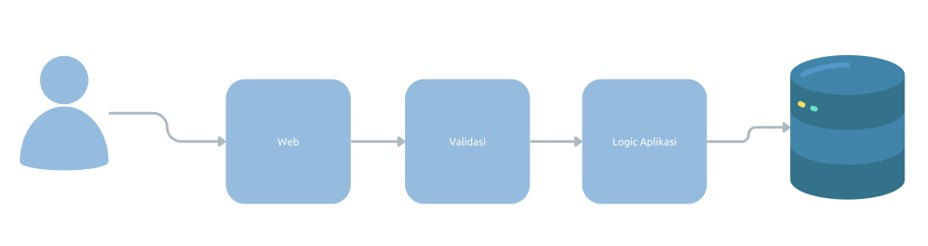

# NodeJS Validation

## Sebelum Belajar

- Kelas JavaScript dari Programmer Zaman Now
- NodeJS Dasar
- NodeJS Unit Test
- NodeJS ExpressJS

## #1 Pengenalan Validation

- Saat kita membuat aplikasi, validasi adalah salah satu hal yang penting untuk kita lakukan
- Validasi memastikan bahwa data sudah dalam keadaan benar atau sesuai sebelum di proses
- Validasi dilakukan untuk menjaga agar kita tetap konsisten dan tidak rusak
- Validasi biasanya dilakukan di kode aplikasi dan di constraint table di database

### Diagram Validasi



### Validation di NodeJS

- NodeJS sayangnya tidak menyediakan package untuk validasi, oleh karena itu kuta perlu melakukan validasi secara manual
- Tapi untungnya, banyak package yang dibuat oleh komunitas programmer NodeJS yang bisa kita gunakan untuk mempermudah kita melakukan validasi
- Salah satu library yang populer untuk melakukan validasi adalah library Joi
- <https://www.npmjs.com/package/joi>
- Di kelas ini, kita akan menggunakan library Joi untuk belajar melakukan validasi

## #2 Membuat Project

- Buat folder belajar-nodejs-validation
- `npm init`
- Buka `package.json`, dan ubah type menjadi module

### Menambah Library Jest untuk Unit Test

- `npm install --save-dev jest @types/jest`

### Menambah Library Babel

- `npm install --save-dev babel-jest @babel/preset-env`
- <https://babeljs.io/setup@installation>

### Menambah Package Joi

- `npm install joi`

## #3 Validation

- Joi mendukung validation untuk beberapa tipe data JavaScript, seperti string, number, boolean, dan lain-lain
- Untuk menggunakan Joi, kita cukup import Joi dari package joi
- Selanjutnya, kita bisa menggunakan method-method sesuai dengan tipe datanya

### Schema

- Hal pertama yang perlu kita lakukan untuk melakukan validasi adalah membuat Schema
- Schema adalah aturan-aturan yang sudah kita tentukan
- Setelah membuat schema, baru selanjutnya kita bisa melakukan validasi data menggunakan schema tersebut

### Kode: Membuat Schema

```ts
import Joi from "joi";

describe("Joi", () => {
	it("should can create schema", () => {
		const schema = Joi.string().min(3).max(100).required();

		const request = "eko";

		const result = schema.validate(request);
		if (result.error) {
			console.info(result.error);
		}
	});
});
```

### Validasi Tipe Data

- String: <https://joi.dev/api?v=17.9.1#string>
- Number: <https://joi.dev/api?v=17.9.1#number>
- Boolean: <https://joi.dev/api?v=17.9.1#boolean>

### Kode: Validasi

```ts
it("should can validate data type", () => {
	const usernameSchema = Joi.string().email().required();
	const isAdminSchema = Joi.boolean().required();
	const priceSchema = Joi.number().required().min(1000).max(100000);

	const resultUsername = usernameSchema.validate("eko");
	console.info(resultUsername);

	const resultIsAdmin = isAdminSchema.validate("true");
	console.info(resultIsAdmin);

	const resultPrice = priceSchema.validate("1000");
	console.info(resultPrice);
});
```

## #4 Date Validation

- Joi juga bisa digunakan untuk melakukan validasi tipe data Date
- Date: <https://joi.dev/api?v=17.9.1#date>

### Kode: Date Validation

```ts
it("should can validate date", () => {
	const birthDateSchema = Joi.date().required().max("now").min("1-1-1988");

	const result = birthDateSchema.validate("1-1-1987");
	console.info(result);

	const result2 = birthDateSchema.validate("1-25-1995");
	console.info(result2);
});
```

## #5 Validation Result

- Saat kita melakukan validasi menggunakan method `validate()`, hasil dari method tersebut adalah object yang memiliki attribute value dan error
- Hasil data akan ada di attribute value, contohnya misal kita validasi Date namun inputnya berupa String, maka secara otomatis value Date yang akan di konversi ke result value
- Namun jika terjadi error, secare otomatis `result.error` nya berisi `ValidationError`

### Kode: Validation Result

```ts
it("should can validate date and get result", () => {
	const birthDateSchema = Joi.date().required().max("now").min("1-1-1988");

	const result = birthDateSchema.validate("1-1-1987");
	console.info(result.value);
	console.info(result.error);

	const result2 = birthDateSchema.validate("1-25-1995");
	console.info(result2.value);
	console.info(result2.error);
});
```

## #6 Validation Error

- Jika terjadi error kerena data tidak valid, maka hasil `result.error` akan berisi `ValidationError`
- <https://joi.dev/api?v=17.9.1#validationerror>

### Kode: Validation Error

```ts
it('should can validate date and get result', () => {
	const usernameSchema = Joi.string().min(5).email().required()

	const result = usernameSchema.validate('ups')
	const.info(result.value)

	if (result.error) {
		result.error.details.forEach(detail => {
			const.info(`${detail.path} = ${detail.message}`)
		})
	}
})
```

## #7 Validation Option

- Saat kita melakukan validasi menggunakan `validate()` method, sebenarnya terdapat opsi tambahan yang bisa kita kirim untuk mengatur cara melakukan validasi
- <https://joi.dev/api?v=17.9.1#anyvalidatevalue-options>

### Kode: Validation Options

```ts
it('should can validate date and get result', () => {
	const usernameSchema = Joi.string().min(5).email().required()

	const result = usernameSchema.validate('ups', {
		abortEarly: false
	})
	const.info(result.value)

	if (result.error) {
		result.error.details.forEach(detail => {
			const.info(`${detail.path} = ${detail.message}`)
		})
	}
})
```

## #8 Object Validation

- Saat kita membuat aplikasi, kita sering sekali membuat JavaScript Object
- Untungnya Joi juga bisa digunakan untuk melakukan validasi JS Object, sehingga mempermudah kita untuk melakukan sekaligus ke semua field di JS Object
- <https://joi.dev/api?v=17.9.1#object>

### Kode: Object Validation

```ts
if('should can validate object', () => {
	const loginSchema = Joi.object({
		username: Joi.string().required().min(3).max(100).email(),
		password: Joi.string().required().min(6).max(100),
	})

	const request = {
		username: 'eko',
		password: 'rahasia'
	}

	const result = loginSchema.validate(request, {
		abortEarly: false
	})

	console.info(result)
})
```

### Nested Object

- Joi juga bisa digunakan untuk memvalidasi nested object
- Saat kita ingin memvalidasi nested object, kita harus tergantung object schema nya juga

### Kode: Nested Object Validation

```ts
if('should can validate nested object', () => {
	const createUserSchema = Joi.object({
		id: Joi.string().required().max(100),
		name: Joi.string().required().max(100),
		address: Joi.objext({
			street: Joi.string().required().max(100),
			city: Joi.string().required().max(100),
			country: Joi.string().required().max(100),
			zipCode: Joi.string().required().max(100),
		}).required()
	})

	const request = {}

	const result = createUserSchema.validate(request, {
		abortEarly: false
	})

	console.info(result)
})
```

## #9 Array Validation

- Selain Object, kita juga bisa melakukan validasi di data Arry
- Baik itu array dengan isi data sederhana, atau array dengan isi data object
- <https://joi.dev/api?v=17.9.1#array>

### Kode: Array Validation

```ts
it("should can validate array", () => {
	const hobbiesSchema = Joi.array().items(
		Joi.string().required().min(3).max(100),
	);

	const hobbies = ["A", "Reading", "Gaming"];
	const result = hobbiesSchema.validate(hobbies);
	console.info(result);
});
```

### Array of Object

- Untuk melakukan validasi Array of Object, kita bisa kombinasikan schama array dan schema object

```ts
if('should can validate array of object', () => {
	const addressesSchema = Joi.array().min(1).items(Joi.object({
			street: Joi.string().required().max(100),
			city: Joi.string().required().max(100),
			country: Joi.string().required().max(100),
			zipCode: Joi.string().required().max(100)
		}))

	const addresses = {}

	const result = addressesSchema.validate(addresses, {
		abortEarly: false
	})

	console.info(result)
})
```

## #10 Custom Validation Message

- Saat kita menggunakan validation milik Joi, terdapat default error message yang direpresentasikan menggunakan message key
- Kita bisa lihat semua message kay dan value nya disini:
- <https://joi.dev/api?v=17.9.1#list-of-errors>
- Jika kita mau, kita bisa mengubah value dari message key, ketika membuat schema, sehingga secara otomatis
- Untuk mengubah message nya, kita bisa menggunakan method messages() pada schema
- <https://joi.dev/api?v=17.9.1#anymessagesmessages>

### Kode: Simple Schema Message

```ts
if('should can validate schema message', () => {
	const schema = Joi.string().min(3).max(100).required().messages({
		'string.min': '{{#label} panjang harus minimal {{#limit} karakter}'
	})

	const request = "a"

	const result = schema.validate(request, {
		abortEarly: false
	})

	console.info(result)
})
```

### Kode: Complex Schama Message

```ts
if('should can validate complex schema message', () => {
	const schema = Joi.object({
		username: Joi.string().required().email().messages({
			'any.required': 'Email harus diisi',
			'string.email': 'Email harus valid',
		}),
		password: Joi.string().required().min(6).max(100).messages({
			'any.required': 'Password harus diisi',
			'string.min': 'Password minimal {{#limit}} karakter',
			'string.max': 'Password maksimal {{#limit}} karakter',
		})
	})

	const request = {
		username: 'eko@example.com',
		password: 'rahasia',
	}

	const result = schema.validate(request, {
		abortEarly: false
	})

	console.info(result)
})
```

### Custom Validation

- Saat kita membutuhkan validasi yang tidak disediakan di Joi, kita juga bisa buat custim validation di Joi
- Terdapat method `custom()` di semua Schama yang bisa kita gunakan untuk menambah validasi baru
- <https://joi.dev/api?v=17.9.1#anycustommethod-description>

### Kode: Custom Validation

```ts
it("should can create custom validation", () => {
	const registerSchema = Joi.object({
		username: Joi.string().required().min(3).max(100).email(),
		password: Joi.string()
			.required()
			.min(6)
			.max(100)
			.custom((value, helpers) => {
				if (value.startWith("eko")) {
					return helpers.error("password.wrong");
				}
				return value;
			})
			.messages({
				"password.wrong": "password can not start with eko",
			}),
		confirmPassword: Joi.string().required().min(6).max(100),
	})
		.custom((value, helpers) => {
			if (value.password != value.confirmPassword) {
				return helpers.error("register.password.different");
			}
			return value;
		})
		.messages({
			"register.password.different":
				"password and confirmPassword is different",
		});
});
```

## #11 Materi Selanjutnya

- NodeJS RESTful API
- Dan lain-lain
