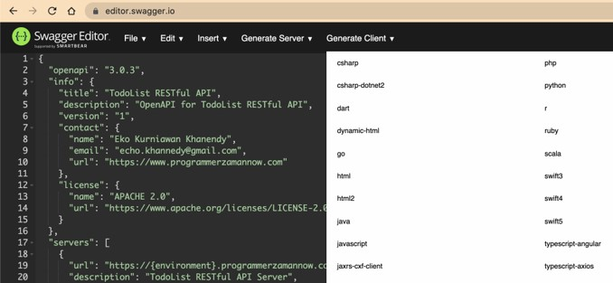

# OpenAPI Dasar

## Sebelum Belajar

- HTTP
- RESTful API

## Agenda

- Pengenalan OpenAPI
- Tipe Data
- Document
- Info
- Component
- Path
- Tag
- Security
- Dan lain-lain

## #1 Pengenalan OpenAPI

- OpenAPI merupakan standar spesifikasi, tidak tergantung bahasa pemrograman apapun, untuk membuat dokumentasi RESTful API.
- OpenAPI dibuat agar pengguna RESTful API tidak perlu mengakses kode aplikasi dan membaca dokumen manual (misal dalam bentuk doc, pdf) untuk memahami RESTful API yang dibuat
- OpenAPI bisa menggunakan tool untuk menampilkan secara visual, bahkan untuk membuat kode program client atau server
- <https://www.openapis.org/>
- <https://github.com/OAI/OpenAPI-Specification>
- <https://swagger.io/specification/>

### Document Structure

- OpenAPI memiliki struktur document yang sudah standar
- Namun kita diberi dua opsi untuk membuat document nya, bisa menggunakan JSON atau YAML
- <https://www.json.org/>
- <https://yaml.org/>

### OpenAPI Editor

- Document OpenAPI hanya menggunakan JSON atau Yaml, jadi untuk membuat document OpenAPI kita cukup menggunakan Text Editor
- Namun jika kita ingin melihat OpenAPI dalam bentuk visual, kita juga bisa menggunakan Swagger Editor : <https://editor.swagger.io/>
- Jika menggunakan product JetBrains, bisa menggunakan plugin OpenAPI <https://www.jetbrains.com/help/idea/openapi.html>
- Jika menggunakan Visual Studio Code, bisa menggunakan plugin OpenAPI <https://marketplace.visualstudio.com/items?itemName=42Crunch.vscode-openapi>

## #2 Tipe Data

- Saat kita membuat RESTful API, sudah dipastikan kita akan membuat request dan response, dimana dalam data request dan response sudah dipastikan terdapat detail data
- Misal jika terdapat data Product, pasti ada id, name, price, dan lain-lain
- Semua detail data tersebut pasti memiliki tipe data
- Kita tidak bisa menggunakan tipe data yang terdapat pada bahasa pemrograman yang digunakan untuk membuat RESTful API, oleh karena itu pada OpenAPI terdapat tipe data general yang bisa digunakan yang dapat dimengerti di semua bahasa pemrograman

### OpenAPI Tipe Data

| Type      | Format      | Comments                          |
| --------- | ----------- | --------------------------------- |
| `integer` | `int32`     | signed 32 bits                    |
| `integer` | `int64`     | signed 64 bits (a.k.a long)       |
| `number`  | `float`     |                                   |
| `number`  | `double`    |                                   |
| `string`  |             |                                   |
| `string`  | `byte`      | base64 encoded characters         |
| `string`  | `binary`    | any sequence of octets            |
| `boolean` |             |                                   |
| `string`  | `date`      | As defined by full-date `RFC3339` |
| `string`  | `date-time` | As defined by full-time `RFC3339` |
| `string`  | `password`  | A hint to UIs to obscure input    |

## #3 Document

- OpenAPI sangatlah sederhana, kita hanya perlu membuat satu file berisi semua data OpenAPI nya
- OpenAPI memiliki struktur yang sudah ditentukan ketika membuat document nya
- Kita bisa menggunakan JSON atau YAML untuk file nya
- <https://spec.openapis.org/oas/v3.0.3#openapi-object>

### OpenAPI Object

| Field Name     | Type                            | Description                                                                                                                                                                                                                                                                                                                                                                                               |
| -------------- | ------------------------------- | --------------------------------------------------------------------------------------------------------------------------------------------------------------------------------------------------------------------------------------------------------------------------------------------------------------------------------------------------------------------------------------------------------- |
| `openapi`      | `string`                        | **REQUIRED** This string MUST be the semantic-version-number or the OpenAPI Specification version that the OpenAPI document uses. The `openapi` field SHOULD be used by tolling specification and clients to interpret the OpenAPI document. This is not related to the API `info.version` string.                                                                                                        |
| `indo`         | `info Object`                   | **REQUIRED** Provides metadata about the API. The metadata MAY be used by tooling as required                                                                                                                                                                                                                                                                                                             |
| `servers`      | `[Server Object]`               | An array of Server Objects, which provide connectivity information to a target server. If the `servers` property is not provided, or is an empty array, the default value would be a Server Object with a `url` value of `/`                                                                                                                                                                              |
| `paths`        | `Path Object`                   | **REQUIRED** The available paths and operations for the API                                                                                                                                                                                                                                                                                                                                               |
| `components`   | `Components Object`             | An element to hold various schemas to the application.                                                                                                                                                                                                                                                                                                                                                    |
| `security`     | `[Security Requirement Object]` | A declaration of which actually mechanism can be used across the API. The list of values includes alternative security requirement objects that can be used. Only one of the security requirement objects need to be statisfied to authorize a request. Individual operations can override this difinition. To make security optional, an empty security requirement `({})` can be included in the array. |
| `tags`         | `Tag Object`                    | A list of tags used by the specification with additional matadata. The order of the tags can be used to relect on their order by the parsing tools. Not all tags that are used by the Operation Object must be declared. The tags that are not declared MAY be organized randomly or based on the tools logic. Each tag name in the list MUST be unique                                                   |
| `externalDocs` | `External Documentation Object` | Additional external documentation.                                                                                                                                                                                                                                                                                                                                                                        |

### Kode: OpenAPI Docuement

```json
{
	"openapi": "3.0.3",
	"info": {},
	"servers": [],
	"paths": {}
}
```

## #4 Info

- Info merupakan bagian dari informasi metadata tentang API yang kita buat
- Kita bisa memasukkan author, lisensi, dan lain-lain

### Info Object

| Type             | Format           | Description                                                                                                                                    |
| ---------------- | ---------------- | ---------------------------------------------------------------------------------------------------------------------------------------------- |
| `title`          | `string`         | **REQUIRED** The title of the API.                                                                                                             |
| `description`    | `string`         | A short description of the API. CommonMark syntax MAY be used for rich text representation.                                                    |
| `termsOfService` | `string`         | A URL to the Terms of Service for the API. Must be in the format of a URL.                                                                     |
| `contact`        | `Contact Object` | The contact information fot the exposed API.                                                                                                   |
| `license`        | `License Object` | The license information for the exposed API.                                                                                                   |
| `version`        | `stting`         | **REQUIRED** The version of the OpenAPI document (which is distinct from the OpenAPI Specification version or the API implementation version). |

### Contact Object

| Type    | Format   | Description                                                                                       |
| ------- | -------- | ------------------------------------------------------------------------------------------------- |
| `name`  | `string` | The identifying name of the contact personal/organization.                                        |
| `url`   | `string` | The URL pointing to the contact information. MUST be in the format of a URL.                      |
| `email` | `string` | The emaill address of the contact person/organization. MUST be in the format of an email address. |

### License Object

| Type   | Format   | Description                                                       |
| ------ | -------- | ----------------------------------------------------------------- |
| `name` | `string` | **REQUIRED** The license name used for the API.                   |
| `url`  | `string` | A URL to the license for the API. MUST be in the format of a URL. |

### Kode: Info

```json
{
	"info": {
		"title": "TodoList RESTful API",
		"description": "OpenAPI for TodoList RESTful API",
		"version": "1",
		"contact": {
			"name": "Eko Kurniawan Khannedy",
			"email": "echo.khannedy@gmail.com",
			"url": "https://www.programmerzamannow.com"
		}
	},
	"license": {
		"name": "APACHE 2.0",
		"url": "https://www.apache.org/licenses/LICENSE-2.0"
	}
}
```

## #5 Server

- Saat kita membuat API sudah pasti terdapat server RESTful API yang nanti akan kita buat
- Kita bisa memberitahu server yang tersedia di OpenAPI
- Misal, terdapat server development, staging, production dan lain-lain

### Server Object

| Name          | Format                                   | Description                                                                                                                                                                                                                                                                            |
| ------------- | ---------------------------------------- | -------------------------------------------------------------------------------------------------------------------------------------------------------------------------------------------------------------------------------------------------------------------------------------- |
| `url`         | `string`                                 | **REQUIRED** A URl to the target host. This URL supports Server Variables and MAY be relative, to indicate that the host location is relative to the location where the OpenAPI dcument is being served. Variable substitutions will be made when a variable is named in `{brackets}`. |
| `description` | `string`                                 | An optional string describing the host designated by the URL CmmonMark syntax MAY be used for rich text representation.                                                                                                                                                                |
| `variables`   | **Map**[`string Server Variable Object`] | A map between a variable name and its value. THe value is used substitution in the server's URL template.                                                                                                                                                                              |

### Kode: Server

```json
{
	"servers": [
		{
			"url": "https://{{environment}}.programmerzamannow.com/api/v1",
			"description": "TodoList RESTful API Server",
			"variables": {
				"environment": {
					"default": "dev",
					"description": "Server Environment",
					"enum": ["dev", "qa", "prod"]
				}
			}
		}
	]
}
```

## #6 External Documentation

- External documentation merupakan bagian dalam OpenAPI jika kita ingin menambahkan link tambahan dalam OpenAPI
- Bisa menuju link documentation lain, atau mungkin link menuju website

### External Documentation Object

| Name          | Format   | Description                                                                                                  |
| ------------- | -------- | ------------------------------------------------------------------------------------------------------------ |
| `description` | `string` | A short description of the target documentation. COmmonMark syntax MAY be used for rich text representation. |
| `url`         | `string` | **REQUIRED** The URL for the target documentation. Value Must be in the format of a URL.                     |

### Kode: External Documentation

```json
{
	"externalDocs": {
		"description": "Youtube Programmer Zaman Now",
		"url": "https://www.youtube.com/c/ProgrammerZamanNow"
	}
}
```

## #7 Path

- Path merupakan representasi endpoint API di OpenAPI
- Pada Path, kita tidak perlu menuliskan seluruh URL, cukup url di belakang setelah lokasi server

| Name      | Format             | Description                                                                                                                                                                                                                                                                                                                                                                                                                                                                                                                                                                        |
| --------- | ------------------ | ---------------------------------------------------------------------------------------------------------------------------------------------------------------------------------------------------------------------------------------------------------------------------------------------------------------------------------------------------------------------------------------------------------------------------------------------------------------------------------------------------------------------------------------------------------------------------------- |
| `/{path}` | `Path Item Object` | A relative path to an individual endpoint. The field name MUST being with a forward slash `(/)`. The path is **appendded** (no relative URL resolution) to the expanded URL from the Server Object's url field in order construct the full URL. Path templating is allowed. When matching URLs, concrete (non-templated) paths would be matched before their templated coounterparts. Templated paths with the same hierarchy but different templated names MUST NOT exist as they are identical. In case of ambigous matching. It's up to the tooling to decide which one to use. |

### Path Item Object

| Name          | Format             | Description                                                                                                                                                                                                                                           |
| ------------- | ------------------ | ----------------------------------------------------------------------------------------------------------------------------------------------------------------------------------------------------------------------------------------------------- | ------------------------------------------------------------------------------------------------------------------------------------------------------------------------------------------------------------------------------------------------------------------------------------------------------------------------------------------------------------------------------------------------------------------------------------- |
| `$ref`        | `string`           | Allows for an external definition of this path item. The referenced structure MUST be in the foramt of a Path Item Object. In case a Path Item Object field appears both in the defined object and the referenced object, the behaviour is undefined. |
| `summary`     | `string`           | An optional, string summary, intended to apply to all operators in this path.                                                                                                                                                                         |
| `description` | `string`           | An optional, string description, intended to apply to all operations in this path. CommonMark syntax MAY be used for rich text representation.                                                                                                        |
| `servers`     | `[Server Object]`  | An alternative server array to service all operations in the path.                                                                                                                                                                                    |
| `parameters`  | `[Parameter Object | Reference Object]`                                                                                                                                                                                                                                    | A list of parameters that are applicate fot all the operations described under this path. These parameters can be overridden at the operation level, but cannot be removed thera. THs list MUST NOT include duplicated parameters. A unique parameter is defined by a combination of a name and location. THe list can use the Reference Object to link to parameters that are defined at the OpenAPI Object's components/parameters. |

### Path Operation

| Name      | Format             | Description                                      |
| --------- | ------------------ | ------------------------------------------------ |
| `get`     | `Operation Object` | A definition of a GET operation on the path.     |
| `put`     | `Operation Object` | A definition of a PUT operation on the path.     |
| `post`    | `Operation Object` | A definition of a POST operation on the path.    |
| `delete`  | `Operation Object` | A definition of a DELETE operation on the path.  |
| `options` | `Operation Object` | A definition of a OPTIONS operation on the path. |
| `head`    | `Operation Object` | A definition of a HEAD operation on the path.    |
| `patch`   | `Operation Object` | A definition of a PATCH operation on the path.   |
| `trace`   | `Operation Object` | A definition of a TRACE operation on the path.   |

### Kode: Path

```json
{
	"paths": {
		"/todolist": {
			"get": {},
			"post": {}
		},
		"/todolist/{todolistId}": {
			"delete": {},
			"put": {}
		}
	}
}
```

## #8 Operation

- Setiap Path yang kita buat di OpenAPI, bisa memiliki lebih dari satu Operation
- Hal ini dikarenakan, dalam HTTP, satu URL bisa memiliki beberapa HTTP Method
- Misal url untuk mengambil semua data dan membuat data baru, mungkin url nya sama, yang membedakan adalah HTTP Method nya, GET untuk mengambil data, POST untuk membuat data
- Inti dari API Documentation adalah dokumentasi operation yang terdapat pada RESTful API yang kita buat

### Operation Object

| Name           | Format                                            | Description                                                                                                                                                                                                                                                                                                                                                                                                                                                                                |
| -------------- | ------------------------------------------------- | ------------------------------------------------------------------------------------------------------------------------------------------------------------------------------------------------------------------------------------------------------------------------------------------------------------------------------------------------------------------------------------------------------------------------------------------------------------------------------------------ |
| `tags`         | `[string]`                                        | A list of tags for API documentation control. Tags can be used for logical grouping of operations bt resources or any other qualifer.                                                                                                                                                                                                                                                                                                                                                      |
| `summary`      | `string`                                          | A short summary of what the operations does.                                                                                                                                                                                                                                                                                                                                                                                                                                               |
| `description`  | `string`                                          | A verbose explanation of the application CommonMark syntac MAY be used for rich text representation.                                                                                                                                                                                                                                                                                                                                                                                       |
| `externalDocs` | `External Documentation Object`                   | Additional external documentation fot this operation.                                                                                                                                                                                                                                                                                                                                                                                                                                      |
| `operationId`  | `string`                                          | Unique string used to identity the operation. The is MUST be unique among all operations described in the API. The operationsId value is `case-sensitive`. Tools and libraries MAY use the operationId to uniquely identity an operation, therefore, it's RECOMMENDED to follow common programming naming conventions.                                                                                                                                                                     |
| `parameters`   | `[Parameter Object \| Reference Object]`          | A list of parameters that are applicable for this operation. If a parameter is already defined at the Aath Itam, the new definition will override it but can never remove it. The list MUST NOT include duplicated parameters. A unique parameter is defined by a combination of a name and location. The list can use the Reference Object to link to parameters that are defined at the ObjectPI Object's components/parameters.                                                         |
| `requestBody`  | `Request Body Object \| Reference Object`         | The request body applicable for the operation. The `requestBody` is only support in HTTP methods where the HTTTp 1.1 specification [RFC7231] has explicity defined semantics for request bodies. In other cases where the HTTP spec is vague, `requestBody`, SHALL be ignored by consumers.                                                                                                                                                                                                |
| `responses`    | `Response Object`                                 | **REQUIRED** The list of possible responses as they are returned from executing the operation.                                                                                                                                                                                                                                                                                                                                                                                             |
| `callbacks`    | `Map[string, Callback Obect \| Reference Object]` | A map of possilbe out-of band callbacks related to the parent opration.                                                                                                                                                                                                                                                                                                                                                                                                                    |
| `deprecated`   | `boolean`                                         | Declares this operation to be deprecated. Consumers SHOULD refrain from usage of the declared operation. Default value is `false`                                                                                                                                                                                                                                                                                                                                                          |
| `security`     | `[Security Requirement Object]`                   | A declaration of which security mechanisms can be used for this operaion. The list of values includes alternative security requirement objects that can be used. Only one of the security requirement objects need to be statisfied to authorize a request. To make security optional, an empty security requirement `({})` can be included in the array. This definition overrides any declared top-level `security`. To remove a top-level security declaration, an empty array be used. |
| `servers`      | `Server Object`                                   | An alternative `server` array to service this operaions, if an alternative `server` obect is specified at the Path item Object or Float level, it will be overriden by this value.                                                                                                                                                                                                                                                                                                         |

### Kode: Operation

```json
{
	"paths": {
		"/todolist": {
			"get": {
				"summary": "Get All Todolist",
				"description": "Only will return active todolist, complete todolist or deleted todolist will be removed",
				"responses": {}
			},
			"post": {
				"summary": "Create new Todolist",
				"description": "Create new active todolist",
				"responses": {}
			}
		}
	}
}
```

## #9 Parameter

- Parameter adalah data yang dikirim tidak melalui Request Body
- Operation bisa memiliki parameter lebih dari satu
- OpenAPI mendukung beberapa jenis parameter, yaitu Query Parameter, Path Variable, Header, dan Cookie
- Kita bisa menambahkan parameter pada Operation, sehingga pengguna bisa tahu bahwa ada parameter yang perlu dikirim ketika memanggil Operation tersebut

### Parameter Object

| Name          | Format   | Description                                                                                                                                                                      |
| ------------- | -------- | -------------------------------------------------------------------------------------------------------------------------------------------------------------------------------- |
|               |          | **REQUIRED** The name of the parameter. Parameter name are case sensitive.                                                                                                       |
| `name`        | `string` | If `in` is `"path"` , the `name` field MUST correspond to a template expression occurring within the path field in the Paths Object. See Path Templating for further information |
|               |          | If `in` is `header` and the `name` field id `"Accept"`, `"Content-Type"` or `"Authorization"`, the parameter definition SHALL be ignored                                         |
|               |          | For all other cases, the `name` corresponds to the parameter name used by the `in` property                                                                                      |
| `in`          | `string` | **REQUIRED** The location of the parameter. Possible values are `"query"`, `"header"`, `"path"`, or `"cookie"`                                                                   |
| `description` | `string` | A brief description of the parameter. This could contain examples of use CommonMark syntax. MAY be used for rich text representation.                                            |

### Kode: Parameter

```json
{
	"paths": {
		"/todolist": {
			"get": {
				"summary": "Get All Todolist",
				"description": "Only will return active todolist, complete todolist or deleted todolist will be removed",
				"responses": {},
				"parameters": [
					{
						"name": "include_done",
						"description": "Include done todolist is the result",
						"required": false,
						"in": "query"
					},
					{
						"name": "name",
						"description": "Search todolist by bame",
						"required": false,
						"in": "query"
					}
				]
			}
		},
		"/todolist/{todolistId}": {
			"delete": {
				"summary": "Delete TodoList",
				"description": "Delete todolist permanently",
				"responses": {},
				"parameters": [
					{
						"name": "todolistId",
						"description": "TodoList Id for deleted",
						"in": "path",
						"required": true
					}
				]
			}
		}
	}
}
```

## #10 Schema

- Saat kita membuat parameter, kita mungkin ingin memberitahu tentang tipe data untuk parameter tersebut
- Parameter memiliki attribute bernama schema, dimana schema sebenarnya sangat kompleks, kita akan bahas secara bertahap
- Dimulai dari simple schema, misal tipe data yang sebelumnya sudah kita bahas

### JSON Schema Specification

- Schema menggunakan JSON Schema untuk mendefinisikan struktur datanya
- JSON Schema bisa berisikan tipe sederhana, seperti `number`, `string`, `boolean` dan lain-lain, atau bahkan tipe data kompleks, seperti `object` dan `array` (yang akan kita bahas nanti)
- <https://json-schema.org/>
- <https://json-schema.org/draft/2020-12/json-schema-core.html>

### Kode: Schema

```json
{
	"name": "include_done",
	"description": "",
	"required": false,
	"in": "query",
	"schema": {
		"type": "boolean",
		"required": true
	}
},
{
	"name": "name",
	"description": "",
	"required": false,
	"in": "query",
	"schema": {
		"type": "string",
	}
}
```

### JSON Schema Validation

- Schema mendukung JSON Schema Validation
- Hal ini membuat kita bisa memberitahu validasi yang diperlukan ketika pengguna membaca OpenAPI kita
- Dengan kita tambahkan Schema Validation, pengguna RESTful API kita bisa tahu validation yang kita buat tanpa harus kita buat dokumentasi secara terpisah
- <https://json-schema.org/draft/2020-12/json-schema-validation.html>

### Kode: Schema Validation

```json
{
	"name": "include_done",
	"name": "include_done",
	"description": "",
	"required": false,
	"in": "query",
	"schema": {
		"type": "boolean",
		"required": true,
		"nullable": true,
	}
},
{
	"name": "name",
	"description": "",
	"required": false,
	"in": "query",
	"schema": {
		"type": "string",
		"nullable": false,
		"maxLength": 100,
		"minLength": 1,
	}
}
```

## #11 Request Body

- OpenAPI juga mendukung dokumentasi untuk request body
- Dengan ini, kita memberi tahu tentang schema request body yang harus dikirim ketika menggunakan RESTful API kita
- Request body mendukung schema, sehingga kita memberi tahu bentuk schema format data, bahkan validasi yang diperlukan

### Request Body Object

| Name          | Type                             | Description                                                                                                                                                                                                                                               |
| ------------- | -------------------------------- | --------------------------------------------------------------------------------------------------------------------------------------------------------------------------------------------------------------------------------------------------------- |
| `description` | `string`                         | A brief description of the request body. This could contain examples of use. CommonMark syntax MAY be used for rich text representaion                                                                                                                    |
| `content`     | `Map[string, Media Type Object]` | **REQUIRED** The content of the request body. The key is a media type or [media type range]appendix-D) and the value describes it. For requests that match multiples keys, only the most specific key is applicable, e.g. `text/plain` overrides `text/*` |
| `required`    | `boolean`                        | Determines if the request body is required in the request. Defaults to `false`                                                                                                                                                                            |

### Media Type Object

| Name       | Type                                              | Description                                                                                                                                                                                                                                                                                                             |
| ---------- | ------------------------------------------------- | ----------------------------------------------------------------------------------------------------------------------------------------------------------------------------------------------------------------------------------------------------------------------------------------------------------------------- |
| `schema`   | `Schema Object \| Reference Object`               | The schema defining the content of the request, response or parameter                                                                                                                                                                                                                                                   |
| `example`  | `Any`                                             | Example of the media type. The example object SHOULD be in the correct format as specified by the media type. The `example` field is mutually exclusive of the `examples` field. Futhermore, is referencing a `schema` which contains an example, the `example` value SHALL override the example provided by the schema |
| `examples` | `Map[string, Example Object \| Reference Object]` | Examples of the media type. Each example object SHOULD match the media type and specified schema if present. The `examples` field is mutually exclusive of the `example` field. Futhermore, if referencing a `shema` which contains an example, the `examples` value SHALL override the example provided by the schema. |
| `encoding` | `Map[string, Encoding Object]`                    | A map between a property name and its encoding information. The key, being the property name, MUST exist in the schema as a property. The encoding object SHALL only apply to `requestBody`, objects when the media type is `multipart` or `application/x-www-form-urlencoded`                                          |

### Kode: Request Body

```json
{
	"post": {
		"summary": "Create new Todolist",
		"description": "Create new active todolist",
		"requestBody": {
			"required": true,
			"content": {
				"applcation/json": {
					"schema": {}
				}
			}
		}
	}
}
```

## #12 Object Schema

- Sebelumnya kita hanya membuat schema sederhana, seperti schema tipe data boolean atau string
- Spesifikasi di JSON Schema juga mendukung pembuatan schema berupa objek, yaitu data yang memiliki attribute lebih dari satu

### Kode: Object Schema

```json
{
	"applcation/json": {
		"schema": {
			"type": "object",
			"properties": {
				"name": {
					"type": "string",
					"required": true,
					"minLength": 1
				},
				"priority": {
					"type": "integer",
					"required": true,
					"minimum": 1
				}
			}
		}
	}
}
```

## #13 Array Schema

- Selain tipe data object, Schema juga mendukung tipe data array
- Saat membuat tipe data array, kita juga bisa menentukan tipe data items yang terdapat di array, bisa tipe data sederhana, bisa tipe data kompleks seperti object atau array lagi

### Kode: Array Schema

```json
{
	"properties": {
		"name": {
			"type": "string",
			"required": true,
			"minLength:": 1
		},
		"tags": {
			"type": "array",
			"items": {
				"type": "string",
				"minLength": 1
			}
		}
	}
}
```

## #14 Example

- OpenAPI mendukung example data
- Example data merupakan data contoh yang bisa kita tambahkan baik itu di Parameter, Request Body dan Response Body

### Kode: Example di Parameter

```json
{
	"name": "name",
	"description": "Search todolist by name",
	"required": false,
	"in": "query",
	"schema": {
		"type": "string"
	},
	"examples": {
		"java": {
			"value": "Java"
		},
		"php": {
			"value": "PHP"
		}
	}
}
```

### Kode: Example di Request

```json
{
	"applcation/json": {
		"examples": {
			"java": {
				"value": {
					"name": "Belaar Pemrograman Java",
					"tags": ["Java", "Pemrograman"],
					"priority": 3
				}
			},
			"php": {
				"value": {
					"name": "Belaar Pemrograman PHP",
					"tags": ["PHP", "Pemrograman"],
					"priority": 2
				}
			}
		}
	}
}
```

## #15 Response Body

- Selain Request Body, kita juga mendokumentasikan Response Body di OpenAPI
- Dengan demikian, kita bisa memberi tahu format Response Body yang kita kembalikan pada RESTful API yang kita buat
- Yang menarik di OpenAPI, kita bisa memberi tahu format response body sesuai dengan response status nya, misal kita bisa tentukan untuk response status `200`, `400`, `500`, dan lain-lain

### Response Body Object

| Name             | Type                                | Description                                                                                                                                                                                                                                                                                                                                                                                                                                                                                                                                                                                                                                                                                                     |
| ---------------- | ----------------------------------- | --------------------------------------------------------------------------------------------------------------------------------------------------------------------------------------------------------------------------------------------------------------------------------------------------------------------------------------------------------------------------------------------------------------------------------------------------------------------------------------------------------------------------------------------------------------------------------------------------------------------------------------------------------------------------------------------------------------- |
| Http Status Code | Response Object \| Reference Object | Any HTTP status code can be used as the property name, but only one property per code, to describe the expected response for that HTTP status code. A Reference Object can link to a response that is defined in the OpenAPI Object's components/responses section. This field MUST between JSON and YAML. To define a range of response codes, this field MAY contain the uppercase widcard character `X`. for example, `2XX` represents all response codes between `[200-299]`. Ony the following range definitions are allowrd `1XX`, `2XX`, `3XX`, `4XX` and `5XX`. If a response is defined using an explicit code, the explicit code definition takes precedence over the range definition for that code. |

### Response Object

| Name          | Type                                             | Description                                                                                                                                                                                                                                                            |
| ------------- | ------------------------------------------------ | ---------------------------------------------------------------------------------------------------------------------------------------------------------------------------------------------------------------------------------------------------------------------- |
| `description` | `string`                                         | **REQUIRED** A short description of the response. CommonMark syntax MAY be used for rich text representation                                                                                                                                                           |
| `headers`     | `Map[string, Header Object \| Reference Object]` | Maps a header name to its definition [RFC7230] states header names are case insensitive. If a response header is defined with the name `"Content-Type"`, a SHALL be ignored.                                                                                           |
| `content`     | `Map[string, Media Object \| Reference Object]`  | A map containing description of potential response payloads. The key is a media type or [media type range]appendix-D) and the value describes it. For responses that match multiple keys, only the most specific key is applicable e.g `text/plain` overrides `text/*` |
| `links`       | `Map[string, Link Object \| Reference Object]`   | A map of operations links that can be followed from the response. The key of the map is a short name for the link, following the naming constraints of the naming for Component Objects                                                                                |

### Kode: Response Body

```json
"responses": {
	"200": {
		"description": "Get Todolist Success",
		"content": {
			"applcation/json": {
				"schema": {
					"type": "array",
					"items": {
						"type": "object",
						"properties": {
							"id": {
								"type": "string",
								"description": "TodoList id",
								"nullable": false
							}
						}
					}
				}
			}
		}
	}
}
```

## #16 Tag

- Tag merupakan fitur tambahan, dimana kita bisa grouping beberapa Path menjadi satu Tag yang sama
- Misal ketika kita membuat OpenAPI untuk RESTful API Toko Online, kita grouping dengan Tag Product, Customer, Payment, Order, dan lain-lain

### Kode: Tag

```json
{
	"paths": {
		"/todolist": {
			"get": {
				"tags": ["todolist"],
				"summary": "Get All Todolist"
				// ...
			},
			"post": {
				"tags": ["todolist"],
				"summary": "Create new Todolist"
				// ...
			}
		}
	}
}
```

## #17 Component

- Component merupakan bagian dalam OpenAPI untuk menyimpan object yang bisa digunakan ulang
- Misal, saat nanti kita membuat spek untuk Request Body atau Response Body, dibanding kita buat satu persatu, jika ada beberapa yang sama, lebih baik kita buat dalam Component, sehingga bisa digunakan di beberapa Endpoint API
- Ada banyak jenis component, ada `schema`, `request`, `response`, `parameter`, `header`, dan lain-lain

### Component Object

| Name              | Type                                                      | Description                                        |
| ----------------- | --------------------------------------------------------- | -------------------------------------------------- |
| `schemas`         | `Map[string, Schema Object \| Reference Object]`          | An object to hold reusable Schema Objects          |
| `responses`       | `Map[string, Response Object \| Reference Object]`        | An object to hold reusable Response Objects        |
| `parameters`      | `Map[string, Parameter Object \| Reference Object]`       | An object to hold reusable Parameter Objects       |
| `examples`        | `Map[string, Example Object \| Reference Object]`         | An object to hold reusable Example Objects         |
| `requestBodies`   | `Map[string, Request Body Object \| Reference Object]`    | An object to hold reusable Request Body Objects    |
| `headers`         | `Map[string, Header Object \| Reference Object]`          | An object to hold reusable Header Objects          |
| `securitySchemes` | `Map[string, Security Schema Object \| Reference Object]` | An object to hold reusable Security Scheme Objects |
| `links`           | `Map[string, Link Object \| Reference Object]`            | An object to hold reusable Link Objects            |
| `callbacks`       | `Map[string, Callback Object \| Reference Object]`        | An object to hold reusable Callback Objects        |

### Kode: Component

```json
{
	"components": {
		"schema": {
			"Todolist": {
				"type": "object",
				"properties": {
					"id": {
						"type": "string"
					},
					"name": {
						"type": "string"
					},
					"tags": {
						"type": "array",
						"items": {
							"type": "string"
						}
					}
				}
			}
		}
	},
	"parameters": {
		"todolistId": {
			"in": "path",
			"name": "todolistId",
			"schema": {
				"type": "string",
				"required": true
			}
		}
	}
}
```

## #18 Reference

- OpenAPI memiliki fitur reference, dimana dengan reference kita bisa membuat reference ke data component yang sudah kita buat
- Hal ini lebih baik, daripada kita buat component yang sama berkali kali pada beberapa path, misal jika terdapat response body yang sama, lebih baik kita gunakan reference, jika memiliki parameter yang sama, lebih baik kita gunakan `reference`

### Kode: Reference pada Parameter

```json
{
	"/todolist/{todolistId}": {
		"delete": {
			"tags": ["todolist"],
			"summary": "Delete todolist",
			"description": "Delete todolist permanently",
			"responses": {},
			"parameters": [
				{
					"$ref": "#/components/parameters/todolistId"
				}
			]
		},
		"put": {
			"parameters": [
				{
					"$ref": "#/components/parameters/todolistId"
				}
			]
		}
	}
}
```

### Kode: Reference pada Response Body

```json
{
	"/todolist": {
		"get": {
			"tags": [],
			"summary": "Get All Todolist",
			"description": "",
			"responses": {
				"200": {
					"description": "Get Todolist Success",
					"content": {
						"applcation/json": {
							"schema": {
								"type": "array",
								"items": {
									"$ref": "#/components/schema/Todolist"
								}
							}
						}
					}
				}
			}
		},
		"post": {
			"tags": [],
			"summary": "Create new Todolist",
			"description": "Create new active todolist",
			"requestBody": { "required": true },
			"responses": {
				"200": {
					"description": "Success create todoList",
					"content": {
						"applcation/json": {
							"schema": {
								"$ref": "#/components/schema/Todolist"
							}
						}
					}
				}
			}
		}
	}
}
```

## #19 Security

- OpenAPI mendukung dokumentasi untuk Security RESTful API
- Dengan ini kita bisa memberitahu pengguna mekanisme Security apa yang kita gunakan di RESTful API kita
- Ada banyak format security yang didukung oleh OpenAPI, seperti `apiKey (query param, header, cookie)`, `http (basic auth, bearer token)`, `oauth2` dan `openIdConnect`
- Sebelum menggunakan fitur Security, kita perlu membuat requirement Security terlebih dahulu di Component, baru kita bisa gunakan di Operation

### Security Object

| Field Name         | Type              | Applies To           | Description                                                                                                                                                                                            |
| ------------------ | ----------------- | -------------------- | ------------------------------------------------------------------------------------------------------------------------------------------------------------------------------------------------------ |
| `type`             | `string`          | `Any`                | **REQUIRED** The type of the security scheme. Valid values `"apiKey"`, `"http"`, `"oauth2"`, `"openIdConnect"`                                                                                         |
| `description`      | `string`          | `Any`                | A short description for security scheme, CommonMark syntax MAY be used for rich text representation                                                                                                    |
| `name`             | `string`          | `apiKey`             | **REQUIRED** The name of header, query or cookie parameter to be used                                                                                                                                  |
| `in`               | `string`          | `apiKey`             | **REQUIRED** The location of the API key, Valid values are `"query"`, `"header"`, or `"cookie"`                                                                                                        |
| `scheme`           | `string`          | `http`               | **REQUIRED** THe name of the HTTP Authorization scheme to be used in the Authorization header as defined in [RFC7235]. The values used SHOULD be registered in the IANA Authentication Scheme registry |
| `bearerFormat`     | `string`          | `http`, (`"bearer"`) | A hint to the clinet to identify how the bearer token is formatted. Bearer tokens are usually generated by an authentication server, so this information is primarily for documentation purposes       |
| `flows`            | OAuth Flow Object | `oauth2`             | **REQUIRED** An object containing configuration information for the flow types supported                                                                                                               |
| `openIdConnectUrl` | `string`          | `openIdConnect`      | **REQUIRED** OpenId Connect URL to discover OAuth2 configuration values. This MUST be in the form of a URL                                                                                             |

### Kode: Security

```json
{
	"components": {
		"securitySchemes": {
			"TodolistAuth": {
				"type": "apiKey",
				"in": "header",
				"name": "X-API-Key"
			}
		}
	}
}
```

### Kode: Security Operation

```json
{
	"/todolist": {
		"get": {
			"security": [
				{
					"TodolistAuth": []
				}
			],
			"tags": []
			// ...
		},
		"post": {
			"security": [
				{
					"TodolistAuth": []
				}
			],
			"tags": []
			// ...
		},
		"delete": {
			"security": [
				{
					"TodolistAuth": []
				}
			],
			"tags": []
			// ...
		}
	}
}
```

## #20 Code Generator

- OpenAPI adalah spesifikasi yang standard, dan banyak diadopsi oleh banyak perusahaan
- Bahkan kita bisa melakukan code generator sesuai dengan bahasa pemrograman yang kita inginkan
- Contohnya kita bisa menggunakan <https://editor.swagger.io/> untuk membuat code client atau server sesuai dengan OpenAPI file yang kita buat
- Hal ini bisa mempermudah ketika kita butuh membuat kode client atau server yang sesuai dengan OpenAPI spec yang sudah dibuat

### Swagger Code Generator



## #21 Penutup

- Masih banyak fitur yang terdapat di OpenAPI, silahkan pelajari langsung di halaman websitenya
- Mulai sekarang selalu gunakan OpenAPI untuk membuat dokumentasi RESTful API
- Buatlah OpenAPI sebelum kita membuat aplikasi RESTful API
- OpenAPI bisa digunakan sebagai kontrak kesepakatan antara yang akan membuat RESTful API dan yang akan menggunakan RESTful API
