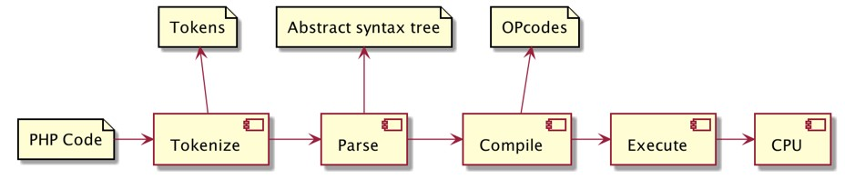

# PHP 8

## Sebelum Belajar

- PHP Dasar
- PHP Object Oriented Programming
- <https://www.udemy.com/course/pemrograman-php-pemula-sampai-mahir/?referralCode=FB1EE79284AE417D17C5>

## Agenda

- Membahas fitur-fitur baru di PHP 8

## #1 Menginstall PHP 8

- Sebelum mengikuti materi ini, pastikan bahwa telah menginstall PHP versi 8 atau lebih tinggi

### Mengecek Versi PHP

`php -version`


## #2 Named Argument

- Biasanya saat kita memanggil function, maka kita harus memasukkan argument atau parameter sesuai dengan posisinya
- Dengan kemampuan named argument, kita bisa memasukkan argument atau parameter tanpa harus mengikuti posisi nya
- Namun penggunaan named argument harus disebutkan nama argument atau parameter nya
- Named argument juga menjadikan kode program mudah dibaca ketika memanggil function yang memiliki argument yang sangat banyak
- <https://wiki.php.net/rfc/named_params>

### Kode: Function

```php
function sayHello(string $first, string $middle, string $last): void
{
	echo "Hello $first $middle $last" . PHP_EOL;
}
```

### Kode: Named Argument

```php
// without named argument
sayHello("Eko", "Kurniawan", "Khannedy");

// with named argument
sayHello(last: "Khannedy", first: "Eko", middle: "Kurniawan");
```

### Kode: Function Default Argument

```php
function sayHello(string $first, string $middle = "", string $last): void
{
	echo "Hello $first $middle $last" . PHP_EOL;
}
```

### Kode: Named Argument Default Value

```php
// without named argument
sayHello("Eko", "Kurniawan", "Khannedy");
sayHello("Eko", "Khannedy"); // ERROR

// with named argument
sayHello(first: "Eko", last: "Khannedy");
sayHello("Eko", last: "Khannedy");
```

## #3 Attributes

- Attributes adalah menambahkan metadata terhadap kode program yang kita buat.
- Fitur ini adalah fitur yang sangat baru sekali di PHP, dan bisa memungkinkan fitur ini bakal diadopsi sangat banyak oleh framework-framework di PHP di masa yang akan datang
- Fitur ini jika di bahasa pemrograman seperti Java bernama Annotation, Attributes di C# atau Decorator di Python dan JavaScript
- <https://www.php.net/manual/en/language.attributes.php>
- <https://wiki.php.net/rfc/attributes_v2>

### Kode: Membuat Class Attribute

```php
#[Attribute]
class NotBlank
{

}
```

### Menggunakan Attribute

- Attribute bisa kita gunakan di berbagai tempat, seperti di Class, Function, Method, Property, Class Constant dan Parameter
- Untuk menggunakan Attribute, kita cukup gunakan tanda `#[NamaAttribute]` di target yang kita tentukan

### Menggunakan Attribute di Property

```php
class LoginRequest
{
	#[NotBlank]
	var string $username;

	#[NotBlank]
	var string $password;
}
```

### Kode: Membaca Attribute via Reflection

```php
function validate(object $object): void
{
	$class = new ReflectionClass($object);
	$properties = $class->getProperties();
	foreach ($properties as $property) {
		validateNotBlank($property, $object);
	}
}

funciton validateNotBlank(ReflectionProperty $property, object $object): void
{
	$attributes = $property->getAttributes(NotBlank::class);
	if (count($attributes) > 0) {
		if (!$property->isInitialized($object))
			throw new Exception("Property $property->name is null");
		if (!$property->getValue($object) == null)
			throw new Exception("Property $property->name is null");
	}
}
```

### Attribute Target

- Secara default, attribute bisa digunakan di semua target (class, function, method, property, dan lain-lain)
- Jika kita ingin membatasi hanya bisa digunakan di target tertentu, kita bisa tambahkan informasinya ketika membaut class attribute

### Kode: Attribute Target

```php
#[Attribute(Attribute:TARGET_PROPERTY | Attribute::TARGET_PARAMETER)]
class NotBlank
{

}
```

### Attribute Class

- Attribute class adalah class biasa, kita bisa menambahkan property, function / method dan constructor jika kita mau
- Ini cocok ketika kita butuh menambahkan informasi tambahan di attribute class

### Kode: Attribute Class

```php
#[Attribute(Attribute::TARGET_PROPERTY | Attribute::TARGET_PARAMETER)]
class Length
{
	var int $min;
	var int $max;

	public function __construct(int $min, int $max)
	{
		$thos->min = $min;
		$thos->max = $max;
	}
}
```

### Kode: Menggunakan Attribute Class

```php
class LoginRequest
{
	#[NotBlank]
	#[Length(min: 4, max: 10)]
	var string $username;

	#[NotBlank]
	#[Length(min: 8, max: 10)]
	var string $password;
}
```

### Kode: Membuat Attribute Class Instance

```php
function validateLength(ReflectionProperty $property, object $object): void
{
	if ($property>isInitialized($object) || $property->getValue($object) == null)
		return;

	$value = $property->getValue($object);
	$attributes = $property->getAttributes(Length::class);
	forech ($attribute as $attributes) {
		$length = $attribute->newInstance();
		if (strlen($value) < $length->min)
			throw new Exception("Property $property->value size is too short");
		if (strlen($value) > $length->max)
			throw new Exception("Property $property->name is too long");
	}
}
```

### Constructor Property Promotion

- Kadang kita sering sekali membuat property sekaligus mengisi property tersebut menggunakan constructor
- Sekarang kita bisa otomatis langsung membuat property dengan via constructor
- Fitur ini mirip sekali di bahasa pemrograman seperti Kotlin dan TypeScript
- <https://wiki.php.net/rfc/constructor_promotion>

### Kode: Property dan Constructor

```php
class Product
{
	var string $id;
	var string $name;
	var int $price;
	var int $quantity;

	public function __construct(string $id, string $name, int $price, int $quantity)
	{
		$this->id = $id;
		$this->name = $name;
		$this->price = $price;
		$this->quantity = $quantity;
	}
}
```

### Kode: Constructor Property Promotion

```php
class Product
{
	public function __construct(public string $id, public string $name, public int $price, public int $quantity)
	{

	}
}
```

## #4 Union Types

- PHP adalah bahasa pemrograman yang dynamic
- Kita tahu sebenarnya saat membuat variabel, parameter, argument, return value, sebenarnya di PHP kita tidak wajib menyebutkan tipe datanya, dan PHP bisa berubah-ubah tipe data
- Saat kita tambahkan tipe data, maka secara otomatis PHP akan memastikan tipe data tersebut harus sesuai dengan tipe data yang sudah kita definisikan
- Di PHP 8, ada fitur Union Types, dimana kita bisa menambahkan lebih dari satu tipe data ke property, argument, parameter, atau return value
- Penggunaan Union Types bisa menggunakan tanpa `|` diikuti dengan tipe data selanjutnya
- <https://wiki.php.net/rfc/union_types_v2>

### Kode: Union Types di Property

```php
class Example
{
	public string|int|bool|array $data;
}

$example = new Example();
$example->data = "Eko";
$example->data = 1;
$example->data = true;
$example->data = ["Eko"];
```

### Kode: Union Type di Argument

```php
function sampleFunction(string|array $data): void
{
	if (is_string($data)) {
		echo "Argument is String" . PHP_EOL;
	} else if (is_array($data)) {
		echo "Argument is Array" . PHP_EOL;
	}
}

sampleFunction("Eko");
sampleFunction(["Eko"]);
```

### Kode: Union Types di Return Value

```php
function sampleFunction(string|array $data): string|array
{
	if (is_string($data)) {
		return "Argument is String";
	} else if (is_array($data)) {
		return "Argument is Array";
	}
}

echo sampleFunction("Eko") . PHP_EOL;
echo sampleFunction(["Eko"]) . PHP_EOL;
```

## #5 Match Expression

- PHP 8 menambahkan struktur kontrol baru bernama match expression
- Match expression adalah struktur kontrol yang mirip dengan switch case, namun lebih baik
- Match adalah expression, artinya dia bisa mengembalikan value
- <https://wiki.php.net/rfc/match_expression_v2>
- <https://www.php.net/manual/en/control-structures.match.php>

### Kode: Switch Statement

```php
$value = "A";

$result = "";

switch ($value) {
	case "A":
	case "B":
	case "C":
		$result = "Anda lulus";
		break;
	case "D":
		$result = "Anda tidak lulus";
		break;
	case "E":
		$result = "Sepertinya anda salah jurusan";
		break;
	default:
		$result = "Nilai itu apa?";
}

echo $result . PHP_EOL;
```

### Kode: Match Expression

```php
$value = "A";

$result = match ($value) {
	"A", "B", "C" => "Anda lulus",
	"D" => "Anda tidak lulus",
	"E" => "Sepertinya anda salah jurusan",
	default => "Nilai itu apa?",
}

echo $result . PHP_EOL;
```

### Non Equals Check di Match Expression

- Selain equals check, berbeda dengan switch case, di match expression, kita bisa melakukan pengecekan kondisi lainnya
- Misal pengecekan menggunakan kondisi perbandingan, bahkan pengecekan kondisi berdasarkan boolean expression yang dihasilkan dari sebuah function

### Kode: Match Expression Non Equals

```php
$value = 80;

$result = match (true) {
	$value >= 80 => "A",
	$value >= 70 => "B",
	$value >= 60 => "C",
	$value >= 50 => "D",
	default => "E"
}

echo "Nilai $value" . PHP_EOL;
```

### Kode: Match Expression dengan Kondisi

```php
$name = "Mr. Eko";

$result = match (true) {
	str_contains($name, "Mr.") => "Hello Sir",
	str_contains($name, "Mrs.") => "Hello Mam",
	default => "Hello"
}

echo $result . PHP_EOL;
```

## #6 Nullsafe Operator

- PHP sekarang memiliki nullsafe operator seperti di bahasa pemrograman Kotlin atau TypeScript
- Biasanya ketika kita ingin mengakses sesuatu dari sebuah object yang bisa memungkinan nilai null, maka kita akan melakukan pengecekan apakah object tersebut null atau tidak, jika tidak baru kita akses object tersebut
- Dengan nullsafe operator, kita tidak perlu melakukan itu, kita hanya perlu menggunakan karakter `?` (tanda tanya), secara otomatis PHP akan melakukan pengecekan null tersebut
- <https://wiki.php.net/rfc/nullsafe_operator>

### Kode: Nullable Class

```php
class Address

{
	public ?string $country;
}

class User
{
	public ?Address $address;
}
```

### Kode: Manual Null Check

```php
function getCountry(?User $user): ?string
{
	if ($user != null) {
		if ($user->address != null) {
			return $user->address->country;
		}
	}
	return null;
}
```

### Kode: Nullsafe Operator

```php
function getCountry(?User $user): ?string
{
	return $user?->address?->country;
}
```

## #7 String to Number Comparison

- Salah satu yang membingungkan di PHP adalah ketika kita melakukan perbandingan number dan string
- Misal saat kita bandingkan `0 == “eko”`, maka hasilnya `true`
- Kenapa true? Karena PHP akan melakukan type jugling dan mengubah `“eko”` menjadi `0`, sehingga hasilnya `true`
- Di PHP 8, khusus perbandingan String ke Number diubah, agar tidak membingungkan
- <https://wiki.php.net/rfc/string_to_number_comparison>

### String to Number Comparison di PHP 8

| Comparison      | Before | After |
| --------------- | ------ | ----- |
| `0 == "0"`      | true   | true  |
| `0 == "0.0"`    | true   | true  |
| `0 == "foo"`    | true   | false |
| `0 == ""`       | true   | false |
| `42 == "   42"` | true   | true  |
| `42 == "42foo"` | true   | false |

## #8 Consistent Type Error

- Saat kita membuat function, dan ketika kita mengirim argument dengan tipe data yang salah, maka akan berakibat terjadi TypeError
- Sayangnya di PHP banyak function bawaan yang tidak mengembalikan TypeError, malah memberi warning
- Agar konsisten, sekarang di PHP 8, banyak function bawaan yang akan error TypeError jika kita salah mengirim tipe data
- <https://wiki.php.net/rfc/consistent_type_errors>

### Kode: Consistent Type Error

```php
strlen([]);
```

## #9 Just-In-Time Compilation

- PHP 8 mengenalkan fitur Just in Time Compilation
- Dimana fitur ini akan mempercepat proses eksekusi program PHP yang kita buat
- Namun sebelum kita bahas JIT, kita perlu tahu dulu bagaimana cara kerja PHP menjalankan kode program kita

### Cara PHP Menjalankan Kode Program



### OPCache

- Secara default PHP akan selalu membaca kode PHP ketika menjalankan program PHP
- OPCache digunakan untuk meningkatkan performance PHP, dengan cara menyimpan hasil kompilasi kode PHP di memory.
- Dengan demikian, PHP tidak perlu lagi membaca ulang kode program PHP setiap kali program dijalankan
- PHP akan langsung membaca dari OPcache yang sudah disimpan di memory
- Fitur OPcache harus diaktifkan terlebih dahulu, sebelum kita bisa menggunakannya
- <https://www.php.net/manual/en/book.opcache.php>

### Cara Kerja OPCache


### Mengaktifkan Fitur OPCache


### Mengecek OPCache


### Just-In-Time Compilation

- Opcache akan membuat kode program kita terhindar dari harus melakukan tokenize, parsing dan compile lagi secara terus menerus tiap request
- JIT, akan membuat hasil kompilasi kita tidak perlu diterjemahkan oleh virtual machine PHP, melainkan langsung dijalankan oleh machine
- JIT di PHP menggunakan library bahasa pemrograman C bernama DynASM, oleh karena itu JIT bisa mentranslate hasil compile opcodes ke instruksi machine

### Cara Kerja JIT


## #10 Validation untuk Function Overriding

- Di PHP 8, sekarang terdapat validasi ketika mengimplementasikan abstract function di class dari trait
- Di PHP 7, saat kita mengubah seperti parameter dan return value nya, hal itu tidak menjadi masalah
- Namun di PHP 8, jika kita mengubah implementasinya dari abstract function nya, maka otomatis akan error
- <https://wiki.php.net/rfc/abstract_trait_method_validation>

### Kode: Validation di Abstract Function Trait

```php
trait SampleTrait
{
	public abstract function sampleFunction(string $name): string;
}

class SampleTraitImpl
{
	use SampleTrait;

	public function sampleFunction(int $name): int // error
	{

	}
}
```

### Validation di Function Overriding

- Sebelumnya kita tahu bahwa melakukan override dengan mengubah signature function hanya akan menimbulkan warning
- Di PHP 8, hal tersebut sekarang akan menimbulkan error
- Sehingga kita tidak bisa lagi mengubah signature dari function yang kita override, seperti mengubah argument atau mengubah return value
- <https://wiki.php.net/rfc/lsp_errors>

### Kode: Validation di Function Overriding

```php
class ParentClass
{
	public function method(array $a)
	{

	}
}

class ChildClass extends ParentClass
{
	public function method(int $a) // error
	{

	}
}
```

- Di PHP 7, saat kita membuat function, tapi ternyata di parent nya terdapat function dengan nama yang sama, walaupun private, hal itu dianggap overriding
- Padahal sudah jelas bahwa private function tidak bisa diakses oleh turunannya
- Di PHP 8, sekarang private function tidak ada hubungannya lagi dengan child class nya, sehingga kita bebas membuat function dengan nama yang sama walaupun di parent ada function private dengan nama yang sama
- <https://wiki.php.net/rfc/inheritance_private_methods>

### Kode: Private Function Overriding

```php
class Manager
{
	private function test(): void
	{

	}
}

class VicePresident extends Manager
{
	public function test(string $name): string
	{
		return "Hello $name";
	}
}
```

## #11 Mixed Type V2

- Di PHP 7 terdapat type data mixed, tipe data ini digunakan ketika sebuah argument atau return function mengembalikan data yang bisa berbeda-beda.
- Karena tidak bisa menyebutkan tipe data berbeda-beda di PHP 7, maka biasanya ditambahkanlah tipe data baru bernama mixed
- Di PHP 8, tipe data mixed di perbaharui, karena di PHP 8 sudah ada Uninon Type, jadi sekarang tipe data mixed adalah singkatan dari tipe data `array|bool|callable|int|float|null|object|resource|string`
- <https://wiki.php.net/rfc/mixed_type_v2>

### Kode: Mixed Type

```php
function testMixed(mixed $param): mixed
{
	if (is_array($param)) {
		return [];
	} else if (is_string($param)) {
		return "eko";
	} else if (is_numeric($param)) {
		return 1;
	} else {
		return null;
	}
	}
}
```

## #12 Comma di Parameter List

- Ini adalah salah satu fitur sederhana, tapi bermanfaat
- Di PHP 8, kita sekarang bisa menambahkan karakter koma di akhir parameter list, seperti ketika memanggil function, membuat array dan lain-lain
- <https://wiki.php.net/rfc/trailing_comma_in_parameter_list>
- <https://wiki.php.net/rfc/trailing_comma_in_closure_use_list>

### Kode: Comma di Argument

```php
function sayHello(string $first, string $last): void
{

}

sayHello(
	"Eko",
	"Kurniawan",
);
```

### Kode: Comma di Array

```php
$array = [
	"first" => "Eko",
	"middle" => "Eko",
	"last" => "Eko",
];
```

## #13 Non-Capturing Catches

- Saat terjadi error di PHP, biasanya kita akan menggunakan try catch
- Lalu dalam catch kita akan menangkap error dan menyimpannya dalam variable exception
- Walaupun sebenarnya tidak kita gunakan, kita tetap harus membuat variable exception nya
- Di PHP 8, sekarang kita tidak wajib membuat variable exception nya jika memang tidak akan menggunakannya
- <https://wiki.php.net/rfc/non-capturing_catches>

### Kode: Non-Capturing Catches

```php
function validate(string $name)
{
	if (trim($name) == "") {
		throw new Exception("Invalid Name");
	}
}

try {
	validate("   ");
} catch (Exception) {
	echo "Invalid name" .PHP_EOL;
}
```

## #14 Throw Expression

- Throw adalah sebuah statement
- Hal ini menyebabkan kadang kita kesulitan menggunakan throw di beberapa tempat yang membutuhkan expression, seperti ternary operator misalnya
- Di PHP 8, sekarang throw adalah sebuah expression, artinya dia memiliki nilai, dan sekarang kita bisa gunakan di tempat-tempat yang memang membutuhkan expression, seperti ternary operator
- <https://wiki.php.net/rfc/throw_expression>

### Kode: Throw Expression

```php
$name = "Eko";
$resut = $name == "Eko" ? "Sukses" : throw new Exception("Ups");

function validate(?string $name)
{
	$result = $name ?? throw new Exception("Null");
	echo "Hello $result". PHP_EOL;
}
```

## #15 Allow ::class on Objects

- Di PHP 7, untuk mendapatkan nama class sebuah object, kita perlu menggunakan `NamaClass::class` atau `get_class($object)`
- Di PHP 8, sekarang kita bisa langsung mengambil nama class dari `$object::class` secara langsung
- <https://wiki.php.net/rfc/class_name_literal_on_object>

### Kode: Allow ::class on Object

```php
class Login
{

}

$login = new Login();

var_dump($login::class);
var_dump(get_class($login));
var_dump(Login::class);
```

## #16 Stringable Interface

- Di PHP 8, sekarang diperkenalkan interface baru bernama Stringable
- Jika kita melakukan override magic function `__toString`, maka secara otomatis class kita akan implement interface Stringable
- Kita tidak perlu melakukannya secara manual, ini sudah dilakukan secara otomatis oleh PHP 8
- <https://wiki.php.net/rfc/stringable>

### Kode: Function Argument Stringable

```php
function sayHello(Stringable $stringable)
{
	echo "HEllo {$stringable->__toString()}" . PHP_EOL;
}
```

### Kode: Override toString Function

```php
class Person
{
	public function __toString(): string
	{
		return "Person";
	}
}

sayHello(new Person());
```

## #17 New String Functions

- Di PHP 8, terdapat beberapa function untuk memanipulasi string
- <https://wiki.php.net/rfc/str_contains>
- <https://wiki.php.net/rfc/add_str_starts_with_and_ends_with_functions>

### String Function

| Function                                 | Keterangan                                        |
| ---------------------------------------- | ------------------------------------------------- |
| `str_contains($string, $contains): bool` | Mengecek apakah `$string` mengandung `$contains`  |
| `str_starts_with($string, $value): bool` | Mengecek apakah `$string` memiliki awal `$value`  |
| `str_ends_with($string, $value): bool`   | Mengecek apakah `$string` memiliki akhir `$value` |

### Kode: New String Function

```php
var_dump(str_contains("Eko Kurniawan", "Eko"));
var_dump(str_contains("Eko Kurniawan", "Kurniawan"));

var_dump(str_starts_with("Eko Kurniawan", "Eko"));
var_dump(str_starts_with("Eko Kurniawan", "Kurniawan"));

var_dump(str_ends_with("Eko Kurniawan", "Eko"));
var_dump(str_ends_with("Eko Kurniawan", "Kurniawan"));
```

### Fitur PHP 8 Lainnya

- <https://www.php.net/releases/8.0/en.php>

## #18 Materi Selanjutnya

- PHP Database
- PHP Web
- PHP Composer
- PHP Unit Test
