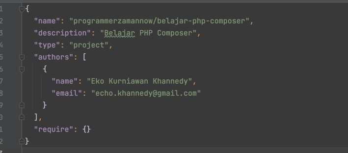
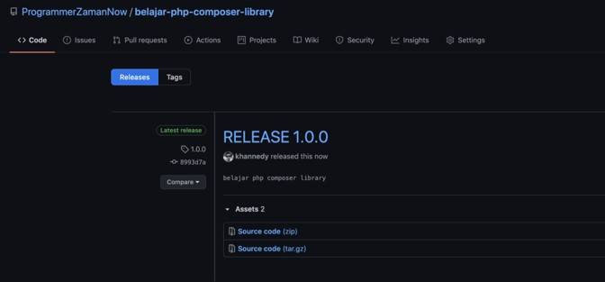
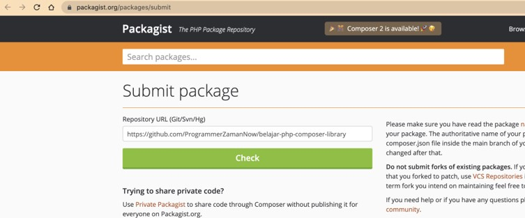

# PHP Composer

## Sebelum Belajar

- PHP Dasar
- PHP Object Oriented Programming
- PHP 8
- PHP Database
- PHP Web

## Agenda

- Pengenalan Dependency Management
- Pengenalan Composer
- Membuat Project
- Autoload
- Repository
- Upload ke Repository
- Download dari Repository
- Dan lain-lain

## #1 Pengenalan Composer

### Sebelum Dependency Management

- Saat kita membuat aplikasi, biasanya kita sering sekali membutuhkan library atau framework
- Sebelum menggunakan dependency management, jika kita membutuhkan library atau framework, maka kita perlu download library atau framework tersebut secara manual. Setelah itu kita masukkan ke dalam kode program kita
- Jika library nya sederhana, mungkin masih mudah untuk mengelolanya, tapi bagaimana jika ternyata library tersebut membutuhkan library lain, dan tidak hanya satu, tapi ada banyak?
- Alhasil kita harus download semua library yang dibutuhkan oleh library yang kita gunakan
- Belum lagi, kita harus tahu versi berapa library lain yang digunakan oleh library yang kita gunakan
- Dan kadang project kita pun menjadi bengkak karena ukuran library yang terlalu banyak

### Dependency Management

- Masalah yang sudah kita bahas sebelumnya, bisa kita hindari jika kita menggunakan Dependency Management Tool
- Dependency Management Tool bertugas untuk mendownload semua library yang kita butuhkan beserta library yang dibutuhkan oleh library yang kita gunakan
- Semua dilakukan secara otomatis
- Dan juga Dependency Management Tool bisa download library sesuai dengan versi yang dibutuhkan secara otomatis

### Pengenalan Composer

- Composer adalah salah satu Dependency Management Tool yang populer untuk PHP
- Composer terinspirasi dari dependency management NPM (nodejs) dan Bundler (ruby)
- Dengan Composer, kita cukup membuat konfigurasi file yang berisi dependency yang kita butuhkan
- Composer akan secara otomatis download semua library dan dependency nya yang dibutuhkan sesuai dengan versi yang kita gunakan
- Kita juga bisa update versi library yang kita gunakan dengan mudah hanya dengan mengubah versi di file konfigurasi yang terdapat di project kita
- <https://getcomposer.org/>

### Cara Kerja Composer


## #2 Menginstall Composer

- <https://getcomposer.org/download/>
- Untuk menginstall Composer sangatlah sederhana, kita cukup download binary file composer, lalu masukkan ke dalam path directory bin PHP, atau bisa gunakan directory terpisah, namun kita perlu menambahkan ke `PATH` lagi jika menggunakan directory terpisah
- Setelah menginstall Composer di `PATH`, kita bisa gunakan perintah berikut di terminal / command line untuk mengecek versi composer yang sudah terinstall :
- `composer --version`

## #3 Membuat Project Composer

- Untuk membuat project composer sangat sederhana, kita cukup membuat file composer.json pada project PHP kita
- Oleh karena itu, kita bisa menambahkan di project baru ataupun di project lama
- Namun jika ingin secara otomatis, kita bisa menggunakan perintah :
- `composer init`

### Composer Init

```sh
composer init
```


### composer.json

```json
{
	"name": "programmerzamannow/belajar-php-composer",
	"description": "Belajar PHP Composer",
	"type": "project",
	"authors": [
		{
			"name": "Eko Kurniawan Khannedy",
			"email": "echo.khannedy@gmail.com"
		}
	],
	"require": {}
}
```



### Menginstall Dependency

- Setelah kita membuat project Composer, selanjutnya kita perlu menginstall dependency
- Walaupun sampai sekarang kita belum menambah dependency apapun, tapi itu tidak masalah
- Untuk menginstall dependency, kita bisa menggunakan perintah :
- `composer update`
- Perintah composer update, akan menginstall semua dependency yang terdapat di file , lalu semua dependency akan di update di file `composer.lock`
- Hasil semua instalasi dependency, akan disimpan di folder `vendor`

### Composer Update

```sh
composer update
```


## #4 Hello World

- Composer secara otomatis akan menyimpan semua library yang kita gunakan di directory vendor
- Lantas bagaimana cara include file library nya?
- Kita tidak perlu melakukan satu per satu, kita cukup menggunakan file `/vendor/autoload.php` yang sudah secara otomatis di generate oleh composer
- File autoload.php tersebut bisa secara otomatis meng-include class-class yang kita butuhkah di library
- Jadi di file PHP kita, kita cukup hanya menambahkan `autoload.php` saja

### Kode: Hello World

```php
<?php

require_once __DIR__ . "/vendor/autoload.php";

echo "Hello World" . PHP_EOL;
```

## #5 Autoload

- Composer menggunakan fitur PHP Class Autoload untuk load class yang terdapat di directory `vendor`
- <https://www.php.net/manual/en/language.oop5.autoload.php>
- Selain itu, kita juga bisa memasukkan source code di project kita ke autoload agar kita tidak perlu melakukan include satu per satu file PHP class nya
- Namun agar bisa autoload, ada standar yang perlu kita ikuti

### Kode: Autoload

```json
{
	"autoload": {
		"psr-4": {
			"ProgrammerZamanNow\\": "src/"
		}
	},
	"require": {}
}
```

### Composer dump-autoload

- Setelah kita menambah autoload, kita perlu melakukan generate ulang file `autoload.php`
- Untuk melakukan itu, kita bisa menggunakan perintah :
- `composer dump-autoload`

### Aturan Pembuatan Source Code

- Pada `composer.json` sebelumnya, kita sudah menggunakan namespace `ProgrammerZamanNow `di directory `src`
- Artinya jika kita import class di namespace `ProgrammerZamanNow`, nama dia akan include file di directory `src`
- Jika namespace nya `ProgrammerZamanNow`, maka foldernya adalah `src`, jika namespace nya `ProgrammerZamanNow\Data`, maka foldernya adalah `src/Data`
- Sedangkan untuk nama file, harus sama dengan nama class, jika nama class nya People, maka nama file harus `People.php`

### Struktur Directory


### Kode: Class People

```php
namespace ProgrammerZamanNow\Data;

class People
{
	public function __construct(private string $name)
	{

	}

	public function sayHello(string $name): string
	{
		return "Hello $this->name";
	}
}
```

### Kode: Menggunakan Autoload

```php
require_once __DIR__ . '/vendor/autoload.php';

use ProgrammerZamanNow\Data\People;

$people = new People("Eko");

echo $people->sayHello("Budi") . PHP_EOL;
```

## #6 Repository

- Repository merupakan tempat semua dependency di simpan
- Secara default, composer menggunakan repository Packagist
- <https://packagist.org/>
- Kita juga bisa menambahkan repository selain packagist jika mau : <https://getcomposer.org/doc/05-repositories.md>

## #7 Menambah Dependency

- Salah satu keuntungan menggunakan Composer adalah, kita bisa dengan mudah menambahkan dependency library yang kita butuhkan
- Terdapat dua jenis library di composer, library yang digunakan ketika development, dan library yang digunakan ketika aplikasi berjalan
- Contoh library yang digunakan ketika development adalah unit test misalnya
- Untuk menambah library, kita bisa tambahkan di composer dengan attribute `require` (untuk library aplikasi), dan `require-dev` (untuk library development)

### Composer Dependency

```json
{
	"require": {
		"library1": "version",
		"library2": "version"
	},
	"require-dev": {
		"librarydev1": "version",
		"librarydev2": "version"
	}
}
```

### Versi Library

- Saat menambahkan library, kita perlu menentukan versi berapa yang akan kita gunakan
- Ada beberapa cara menggunakan versi library di composer, semuanya tertulis di halaman resmi composer : <https://getcomposer.org/doc/articles/versions.md>
- Version di Composer mengikuti Semantic Versioning <https://semver.org/>

### Kode: Menambah Library Monolog

```json
{
	"require": {
		"monolog/monolog": "2.2.0"
	}
}
```

### Jangan Lupa

- Setelah menambah library, biasakan melakukan update : `composer update`
- Dan melakukan generate autoload : `composer dump-autoload`

### Hasil Composer Update


### Kode: Mencoba Monolog

```php
require_once __DIR__ . '/vendor/autoload.php';

use Monolog\Logger;
use Monolog\Handler\StreamHandler;

$log = new Logger("ProgrammerZamanNow");
$log->pushHandler(new StreamHandler("application.log", Logger::INFO));

$log->info("Hello World");
$log->info("Selamat Belajar Composer");
```

## #8 Membuat Library

- Sekarang kita sudah tahu bagaimana menggunakan Composer di project aplikasi kita
- Sekarang pertanyaannya, bagaimana jika kita ingin membuat library?
- Library yang bisa digunakan di project kita atau oleh project orang lain?
- Composer tidak hanya mendukung pembuatan project, namun juga library

### Menambah Library

```sh
composer init
```


### Kode: composer.json

```json
{
	"require": {
		"php": ">=8.0"
	},
	"autoload": {
		"psr-4": {
			"ProgrammerZamanNow\\Belajar\\": "src/"
		}
	}
}
```

### Kode: Class Customer

```php
namespace ProgrammerZamanNow\Belajar;

class Customer
{
	public function __construct(private string $name)
	{

	}

	public function sayHello(string $name): string
	{
		return "Hello $name, My Name is $this->name";
	}
}
```

## #9 Upload ke Repository

- Setelah selesai membuat library, kita bisa upload library yang sudah kita buat ke Git Repository
- Ada banyak Git Repository yang gratis, contohnya adalah Github
- Pada course ini saya tidak akan membahas tentang Git, karena Git dibuat dalam course terpisah

### Contoh Git Repository


### Membuat Release atau Tag



## #10 Download dari Repository

- Setelah library kita di upload ke repository, kita bisa menggunakan library tersebut di project kita
- Untungnya composer juga terintegrasi dengan Git repository, jadi kita bisa menambahkan git repository sebagai composer repository

### Kode: Menambah Dependency

```json
{
	"repositories": [
		{
			"type": "vcs",
			"url": "https://github.com/ProgrammerZamanNow/belajar-php-composer-library"
		}
	],
	"require": {
		"php": ">=8.0",
		"programmerzamannow/belajar-php-composer-library": "1.0.0",
		"monolog/monolog": "2.2.0"
	}
}
```

### Kode: Hello Library

```php
<?php

require_once __DIR__ . '/vendor/autoload.php';

$customer = new \ProgrammerZamanNow\Belajar\Customer("Eko");
echo $customer->sayHello("Budi");
```

## #11 Upgrade Versi Library

- Saat membuat library, sudah pasti kita akan melakukan proses update dan upgrade
- Untuk melakukan upgrade library, caranya cukup mudah, kita hanya tinggal membuat update kode library, lalu membuat release atau tag baru

### Kode: Update Kode Library

```php
public function sayHello(string $name = "Guest"): string
{
	return "Hello $name, My Name is $this->name";
}
```

### Membuat Release atau Tag Baru


### Kode: Update Versi Library

```json
{
	"repositories": [
		{
			"type": "vcs",
			"url": "https://github.com/ProgrammerZamanNow/belajar-php-composer-library"
		}
	],
	"require": {
		"php": ">=8.0",
		"programmerzamannow/belajar-php-composer-library": "2.0.0",
		"monolog/monolog": "2.2.0"
	}
}
```

## #12 Submit ke Packagist

- Khusus OpenSource library, kita juga bisa submit ke Packagist
- Caranya pun sangat mudah, kita cukup registrasi, lalu submit repository kita di Github
- Packagist bisa secara otomatis mendeteksi versi library kita sesuai dengan Tag atau Release di Git

### Submit ke Packagist



### Library di Packagist


### Keuntungan Menggunakan Packagist

- Kita tidak perlu menambahkan repository git di `composer.json` satu per satu
- Bisa sync secara otomatis ketika ada release versi baru

### Kode: Update composer.json

```json
{
	"autoload": {
		"psr-4": {
			"ProgrammerZamanNow\\Belajar\\": "src/"
		}
	},
	"require": {
		"php": ">=8.0",
		"programmerzamannow/belajar-php-composer-library": "2.0.0",
		"monolog/monolog": "2.2.0"
	}
}
```

## #13 Fitur Lainnya

- Sebenarnya, sampai disini teman-teman sudah bisa mulai menggunakan composer
- Karena tujuan composer memang untuk dependency management
- Namun selain dependency management, masih banyak lagi fitur-fitur tambahan yang terdapat di composer
- Kita akan bahas sekilas saja, dan teman-teman bisa eksplore lebih dalam jika tertarik dengan fitur-fitur lainnya diluar dependency management

### Script

- Fitur ini bisa digunakan untuk membuat custom script
- Dengan custom script ini, kita bisa menggunakan composer untuk membuat perintah misal :
- `composer script-saya`

### Kode: Contoh Script

```json
{
	"scripts": {
		"jalankan-server": "php -S localhost:8080",
		"hello": "echo 'Hello World'"
	}
}
```

### Private Reposiitory

- Saat kita membuat aplikasi di perusahaan, sudah pasti project dan library nya tidak akan public, alias private
- Composer juga mendukung private repository dengan menambahkan authentication
- Tiap jenis repository berbeda-beda cara authentication nya
- Kita bisa lihat di dokumentasinya <https://getcomposer.org/doc/articles/authentication-for-private-packages.md>

### Plugin

- Kita juga bisa mengubah atau meningkatkan fungsionalitas composer itu sendiri
- Untuk hal ini, di composer terdapat fitur plugin
- <https://getcomposer.org/doc/articles/plugins.md>

### Vendor Binary

- Kadang library tidak hanya berisi kode PHP saja
- Kadang library juga berisi binary file untuk dieksekusi, contohnya jika teman-teman menggunakan library PHPUnit
- Fitur ini di composer bernama Vendor Binary
- <https://getcomposer.org/doc/articles/vendor-binaries.md>

### Dan lain-lain

- <https://getcomposer.org/doc/>

## #14 Materi Selanjutnya

- PHP Unit Test
- Perbanyak Studi Kasus
- Belajar Framework (Laravel atau Codeigniter)
