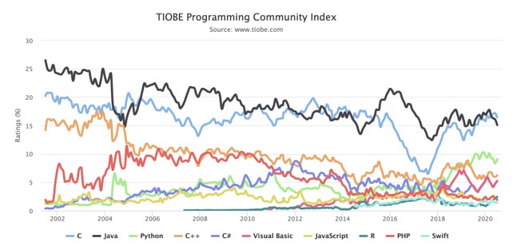
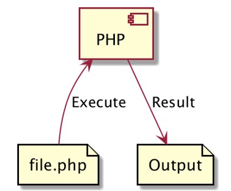
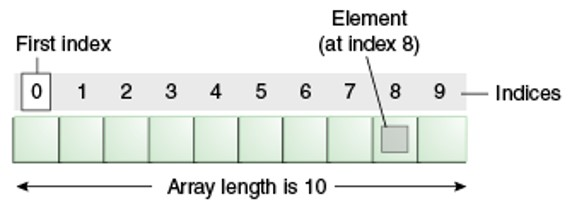

# PHP Dasar

## Untuk Siapa Materi Ini?

- Programmer Pemula
- Web Programmer
- Backend Programmer

## Agenda

- Pengenalan PHP
- Menginstall PHP
- Tipe Data
- Variable
- Percabangan
- Perulangan
- Function
- dan lain-lain

## #1 Pengenalan PHP

- PHP singkatan dari PHP : Hypertext Preprocessor
  = PHP banyak digunakan sebagai bahasa pemrograman yang dikhususkan untuk web development
- PHP sangat mudah digunakan dan banyak sekali diadopsi oleh programmer web
- Bahkan hampir mayoritas kebanyakan web di dunia dibuat menggunakan PHP
- PHP pertama kali dibuat oleh Rasmus Lerdorf pada tahun 1995

### Open Source

- PHP adalah bahasa pemrograman yang opensource
- Kita bisa download PHP di website [php.net](https://php.net)
- Atau bisa liat source code nya di halaman github php <https://github.com/php/php-src>
- Selain open source, PHP juga free untuk digunakan, sehingga tidak ada biaya yang harus kita keluarkan untuk menggunakan PHP

### Kenapa Belajar PHP



### Proses Development PHP



### Apa yang Bisa Dibuat Menggunakan PHP?

- Server-side scripting. Ini adalah salah satu fokus utama web, untuk membuat aplikasi server side. Biasanya digunakan sebagai aplikasi web menggunakan bantuan web server, dan kita bisa melihat output aplikasi menggunakan web browser (Internet Explorer, Chrome, Firefox, dan lain-lain)
- Command line scripting. PHP juga bisa digunakan untuk membuat program berbasis command line, tanpa harus menggunakan web server
- Desktop application, walaupun jarang digunakan, tapi PHP juga bisa digunakan untuk membuat aplikasi desktop menggunakan PHP-GTK

### Menginstall PHP

- PHP bisa di install di sistem operasi apapun, Windows, Mac ataupun Linux
- Namun menginstall PHP secara manual tidak terlalu mudah
- Oleh karena itu untuk belajar, direkomendasikan menginstall PHP dengan bantuan tool-tool yang sudah mem-bundle PHP dengan teknologi pendukungnya

### Menginstall XAMPP

- Pada course ini, kita akan menggunakan aplikasi XAMPP, dimana aplikasi ini telah mem-bundle PHP, MySQL/MariaDB, Apache HTTPD, dan lain-lain
- <https://www.apachefriends.org/>

### Setting PATH

- Setelah menginstall PHP, kita perlu mengatur `PATH` sistem operasi yang kita gunakan
- Tiap sistem operasi berbeda-beda cara setting `PATH` nya
- Inti dari setting `PATH` adalah, agar kita bisa mengakses PHP dari command prompt / terminal

```bash
# untuk Linux atau Mac tambahkan di .bashrc atau .profile atau .zshrc
export PATH="/applications/XAMPP/bin:$PATH"
```

### Text Editor

- VisualStudio Code <https://code.visualstudio.com/>
- Sublime Text <https://www.sublimetext.com/>
- Atom <https://atom.io/>
- PHPStorm <https://www.jetbrains.com/phpstorm/>

## #2 Program Hello World

### File PHP

- File kode program PHP diakhiri dengan extention `.php`
  Di awal kode program PHP, wajib menambahkan `<?php`. Dan diakhir kode program php perlu ditambahkan `?>` (tapi tidak wajib)
- Nama file PHP tidak ada aturan, jadi kita bisa membuat file PHP seperti membuat file lain biasanya. Namun agar mempermudah saat menjalankan file PHP, direkomendasikan tidak menggunakan spasi.
- Untuk menampilkan tulisan di PHP, kita bisa menggunakan perintah `echo`

### Program Hello World

```php
// HelloWorld.php
<?php

echo "Hello World";
```

### Menjalankan Kode Program

```bash
php NamaFile.php
```

## #3 Tipe Data Number

- Di PHP terdapat 2 jenis tipe data number
  - `(int)` Bilangan bulat decimal (base 10), `hexadecimal` (base 16), `octa` (base 8), `binary` (base 2) dan
  - `(float)` Bilangan pecahan
- Di PHP kita bisa menambahkan `_` (garis bawah) di angka, ini hanya untuk agar mudah dibaca, saat dijalankan, `_` (garis bawah) tersebut akan di ignore
- Untuk angka negatif, kita bisa menggunakan tanda `-` (minus) di depan angka

### Kode: Tipe Data Number

```php
echo "Decimal : ";
var_dump(1234);
echo "Octal : ";
var_dump(0234);
echo "Hexadecimal : ";
var_dump(0x1A);
echo "Binary : ";
var_dump(0b11111111);
echo "Underscore di Number : ";
var_dump(1_234_567);
```

### Kode: Tipe Data Floating Point

```php
echo "Floating Point : ";
var_dump(1.234);
echo "Floating Point dengan E notation Plush (1.2 x 1000) : ";
var_dump(1.2e3);
echo "Floating Point dengan E notation Minus (7 x 0.001) : ";
var_dump(7e-3);
echo "Underscore di Floating Point : ";
var_dump(1_234.567);
```

### Integer Overflow

- Secara default, kapasitas integer di PHP ada batasnya, `2147483647` untuk sistem operasi 32 bit, dan `9223372036854775807` untuk sistem operasi 64 bit
- Jika kita membuat number integer yang melebihi nilai tersebut, maka secara otomatis tipe numbernya akan berubah menjadi floating point

### Kode: Integer Overflow

```php
echo "Integer Overfloe 32 Bit : ";
var_dump(2147483648);
echo "Integer Overfloe 64 Bit : ";
var_dump(9223372036854775808);
```

## #4 Tipe Data Boolean

- Tipe data boolean adalah tipe data paling sederhana di PHP
- Tipe data boolean adalah tipe data dengan nilai kebenaran (benar atau salah)
- Nilai benar direpresentasikan dengan `true` (case insensitive)
- Nilai salah direpresentasikan dengan `false` (case insensitive)

### Kode: Tipe Data Boolean

```php
echo "Benar: ";
var_dump(true);

echo "Salah: ";
var_dump(false);
```

## #5 Tipe Data String

- Tipe data string adalah tipe data representasi dari teks
- String bisa mengandung kosong atau banyak karakter

### Single Quote

- Untuk membuat String di PHP, kita bisa menggunakan single quote

```php
echo 'Name : ';
echo 'Eko Kurniawan Khannedy';
```

### Double Quote

- Selain single quote, kita juga bisa menggunakan double quote. Salah satu kelebihan menggunakan double quote adalah, kita menggunakan escape sequence untuk beberapa hal, seperti `\n` untuk `ENTER` `\t` untuk `TAB`, `\""` untuk double quote, dan lain-lain

```php
echo 'Nama : ';
echo 'Eko Kurniawan Khannedy';
echo "\n";

echo "Nama : ";
echo "Eko\t Kurniawan\t Khannedy\n";
```

### Multiline String

- Kadang kita ingin membuat data string yang lebih dari satu baris. Untuk melakukan itu sebenarnya kita bisa menggunakan `\n` sebagai `ENTER`
- Namun PHP memiliki fitur yang lebih baik, yaitu bernama `Heredoc` dan `Nowdoc`

### Heredoc

- Heredoc adalah fitur untuk membuat String yang panjang, sehingga kita tidak perlu manual melakukan enter, tab dan yang lain-lain secara manual

```php
echo <<<EKO
Ini adalah contoh string yang sanget
panjang, dan juga gak cukup ngetik ENTER secara
manual, "bisa quote" juga
EKO;
```

### Nowdoc

- Nowdoc mirip seperti Heredoc, yang membedakan adalah pada Nowdoc tidak memiliki kemampuan parsing seperti di Heredoc atau Double Quote. Masalah parsing akan kita bahas di materi Manipulasi String

```php
echo <<<'EKO'
Ini adalah contoh string yang sanget
panjang, dan juga gak cukup ngetik ENTER secara
manual, "bisa quote" juga
EKO;
```

## #6 Variable

- Variable adalah tempat untuk menyimpan data sehingga bisa kita gunakan lagi di kode program selanjutnya
- Di PHP variable bisa menampung berbagai jenis tipe data dan bisa berubah-ubah tipe data
- Untuk membuat variable kita bisa menggunakan tanda `$` (dolar) diikuti dengan nama variable nya
- Penamaan variable tidak boleh mengandung spasi

### Kode: Variable

```php
$name = "Eko";
$age = 30;

echo "Name : ";
echo $name;
echo "\n";
echo "Age : ";
echo $age;
```

### Variable Variables

- PHP memiliki kemampuan variable variables, yaitu membuat variable dari string value variable
- Walaupun fitur ini ada, tapi fitur ini sangat membingungkan jika digunakan secara luas, jadi disarankan untuk tidak menggunakan fitur ini kecuali memang diperlukan
- Untuk membuat variable dari value variable kita bisa menggunakan `$$` diikuti dengan nama variable nya

### Kode: Variable Variables

```php
$name = "Eko";
$$name = "keren;

echo "\$ame = ";
echo $name;
echo "\n";
echo "\$eko = ";
echo $eko;
echo "\n";
```

## #7 Constant

- Variable di PHP sifatnya mutable, artinya bisa dirubah
- Jika kita ingin membuat variable yang immutable (tidak bisa dirubah), maka tidak bisa kita lakukan di PHP
- Sebagai gantinya, terdapat fitur yang namanya `constant`
- Constant adalah tempat untuk menyimpan data yang tidak bisa dirubah lagi setelah di deklarasikan
- Untuk membuat constant kita bisa menggunakan function `define()`
- Best practice pembuatan nama constant adalah menggunakan `UPPER_CASE`

### Kode: Constant

```php
define("AUTHOR", "programmer zaman now");
define("APP_VERSION", 100);

echo AUTHOR;
echo "\n";
echo APP_VERSION;
echo "\n";
```

## #8 Data NULL

- Nilai `NULL` merepresentasikan sebuah variable tanpa nilai.
- Saat kita membuat variable, lalu ingin menghapus data yang terdapat di variable tersebut, kita bisa menggunakan `NULL` untuk mengosongkan variable tersebut
- Untuk membuat data `NULL`, kita bisa menggunakan kata kunci `NULL` (case insensitive)

### Kode: Data NULL

```php
$nam = "Eko";
$name = NULL

$age = null;
```

### Mengecek Apakah Data NULL

- Kadang kita ingin tahu apakah sebuah data bernilai `null` atau tidak
- Untuk mengecek apakah sebuah data bernilai `null`, kita bisa menggunakan function `is_null($variable)`

### Kode: Mengecek NULL

```php
$name = "Eko";
$name = NULL;

$isNull = is_null($name);
var_dump($isNull);
```

### Menghapus Variable

- Selain mengubah menjadi `NULL`, di PHP juga kita bisa menghapus sebuah variable, caranya dengan menggunakan function `unset($variable)`
- Namun hati-hati, ketika kita hapus variable, kita tidak bisa lagi mengakses variable tersebut, bahkan function `is_null($variable)` pun akan menjadi error jika mengakses variable tersebut.
- Agar lebih aman, kita bisa menggunakan function `isset($variable)` untuk mengeccek apakah sebuah variable ada dan nilainya tidak `NULL`

### Kode: Unset dan Isset

```php
$value = "Eko";
unset($value);

var_dump(isset($value));

$value = "Eko";

var_dump(isset($value));
```

## #9 Tipe Data Array

- Array adalah tipe data yang berisikan kosong atau banyak data
- Array di PHP bisa berisikan data dengan jenis berbeda-beda
- Array di PHP memiliki panjang dinamis, artinya kita bisa menambah data ke Array sebanyak-banyaknya, tidak dibatasi kapasitasnya

### Cara Kerja Array



### Kode: Membuat Array

```php
$values = array(1, 2, 3, 4, 5);
var_dump($values);

$names = ["Eko", "Kurniawan", "Khannedy"];
var_dum($names);
```

### Operasi Array

| Operasi                 | Keterangan                                                |
| ----------------------- | --------------------------------------------------------- |
| `$array[index]`         | Mengakses data di array pada nomor index                  |
| `$array[index] = value` | Mengubah data di array pada nomor index dengan value baru |
| `$array[] = value`      | Menambah data di array pada posisi paling belakang        |
| `unset($attay[index)]`  | Menghapus data di array, index otomatis hilang dari array |
| `count($array)`         | Mengambil total data di array                             |

### Kode: Operasi Array

```php
$names = ["Eko", "Kurniawan", "Khannedy"];
var_dump($names[0]);
$names[0] = "Budi";
var_dump($names);
unset($names[1]);
var_dump($names);
$names[] = "Eko";
var_dump($names);
var_dump(count($names));
```

### Array Sebagai Map

- Biasanya di kebanyakan bahasa pemrograman, terdapat tipe data bernama Map, yaitu asosiasi antara key dan value
- Namun di PHP, Map bisa dibuat menggunakan Array
- Secara default Array akan menggunakan index (number) sebagai key dan value nya kita bisa bebas memasukkan data ke dalam Array
- Namun jika kita ingin, kita juga bisa mengubah index nya tidak harus menggunakan number, bisa gunakan tipe data lain, seperti string misal nya
- Hal tersebut terlihat seperti Map di bahasa pemrograman lain

### Kode: Membuat Map

```php
$eko = array(
	"id" => "eko",
	"name" => "Eko Kurniawan",
	"age" => 30
);

$budi = array(
	"id" => "budi",
	"name" => "Budi Nugraha",
	"age" => 35
);
```

### Array di dalam Array

- Seperti dijelaskan di awal, Array di PHP bisa berisikan data apapun
- Sehingga kita juga bisa membuat array di dalam array jika memang dibutuhkan

### Kode: Array di dalam Array

```php
$eko = array(
	"id" => "eko",
	"name" => "Eko Kurniawan",
	"age" => 30,
	"address" => [
		"city" => "Jakarta",
		"country" => "Indonesia"
	]
);
```

## #10 Operator Aritmatika

| Operator                 | Keterangan  |
| ------------------------ | ----------- |
| `+$variable`             | Positif     |
| `-$variable`             | Negatif     |
| `$variable + $variable`  | Penambahan  |
| `$variable - $variable`  | Pengurangan |
| `$variable * $variable`  | Perkalian   |
| `$variable / $variable`  | Pembagian   |
| `$variable % $variable`  | Sisa bagi   |
| `$variable ** $variable` | Pangkat     |

### Kode: Operator Aritmatika

```php
$result = 10 + 10;
var_dump($result);

$result = 100 % 10;
var_dump($result);
```

## #11 Operator Penugasan

- Operator penugasan di PHP sama seperti bahasa pemrograman lain, yaitu dengan menggunakan karakter `=` (sama dengan)
- Operator penugasan sudah sering kita gunakan, terutama ketika mengubah value sebuah variable
- Namun selain hal itu, operasi penugasan juga bisa digunakan untuk operasi aritmatika

### Operator Penugasan Aritmatika

| Penugasan  | Keterangan     |
| ---------- | -------------- |
| `$a += $b` | `$a = $a + $b` |
| `$a -= $b` | `$a = $a - $b` |
| `$a *= $b` | `$a = $a * $b` |
| `$a /= $b` | `$a = $a / $b` |
| `$a %= $b` | `$a = $a % $b` |

### Kode: Operator Penugasan Aritmatika

```php
$total = 0;

$fruit = 10000;
$chicken = 35000;
$orangeJuice = 1000;

$total += $fruit;
$total += $chicken;
$total += $orangeJuice;

var_dump($total);
```

## #12 Operator Perbandingan

- Operator perbandingan, seperti namanya, digunakan untuk membandingan dua buat value
- Hasil dari operator perbandingan adalah boolean, `true` jika perbandingannya benar, `false` jika perbandingannya salah

## Operator Perbandingan

| Operator    | Nama                         | Keterangan                                                                   |
| ----------- | ---------------------------- | ---------------------------------------------------------------------------- |
| `$a == $b`  | Sama dengan                  | `true` jika `$a` sama dengan `$b` setelah dilakukan konversi tipe data       |
| `$a === $b` | Identik                      | `true` jika `$b` sama dengan `$b` dan memiliki tipe data yang sama           |
| `$a != $b`  | Tidak sama dengan            | `true` jika `$a` tidak sama dengan `$b` setelah dilakukan konversi tipe data |
| `$a <> $b`  | Tidak sama dengan            | `true` jika `$a` tidak sama dengan `$b` setelah dilakukan konversi tipe data |
| `$a !== $b` | Tidak identik                | `true` jika `$a` tidak sama dengan `$b` atau tidak sama tipe data            |
| `$a < $b`   | Kurang dari                  | `true` jika `$a` kurang dari `$b`                                            |
| `$a <= $b`  | Kurang dari atau sama dengan | `true` jika `$a` kurang dari atau sama dengan `$b`                           |
| `$a > $b`   | Lebih dari                   | `true` jika `$a` lebih dari `$b`                                             |
| `$a >= $b`  | Lebih dari sama dengan       | `true` jika `$a` lebih dari atau sama dengan `$b`                            |

### Kode: Operator Perbandinan

```php
var_dump("10" == 10);
var_dump("10" === 10);

var_dump(10 > 9);
var_dump(10 >= 10);
```

## #13 Operator Logika

- Operator logika adalah operator untuk membandingkan dua nilai boolean
- Hasil dari operator logika adalah boolean lagi

### Operator Logika

| Operator    | Nama | Hasil                                                            |
| ----------- | ---- | ---------------------------------------------------------------- | --- | --------------------------------------------------------- |
| `$a && $b`  | And  | `true` jika `$a` dan `$b` keduanya `true`                        |
| `$a and $b` | And  | `true` jika `$a` dan `$b` keduanya `true`                        |
| `$a         |      | $b`                                                              | Or  | `true` jika `$a` dan `$b` salah satu atau keduanya `true` |
| `$a or $b`  | Or   | `true` jika `$a` dan `$b` salah satu atau keduanya `true`        |
| `!$a`       | Not  | `true` jika `$a` benilai `false`                                 |
| `$a xor $b` | Xor  | `true` jika `$a` dan `$b` salah satu `true`, tapi tidak keduanya |

### Kode: Operator Logika

```php
var_dump(true && true);
var_dump(true && false);
var_dump(true || false);
var_dump(true xor true);
var_dump(!true);
```

## #14 Increment dan Decrement

- PHP mendukung gaya bahasa pemrograman C untuk menaikkan dan menurunkan data number sejumlah 1 angka
- Ini bisa mempersingkat kita ketika ingin menaikkan data

### Operator Increment dan Decrement

| Contoh | Name           | Efek                                          |
| ------ | -------------- | --------------------------------------------- |
| `$a++` | Post increment | Kembalikan `$a` lalu naikkan 1 angka          |
| `++$a` | Pre increment  | Naikan `$a` sau angaka, lali kembalikan `$a`  |
| `$a--` | Post decrement | Kembalikan `$a` lalu turunkan 1 angka         |
| `--$a` | Pre decrement  | Turunkan `$a` sau angka, lalu kembalikan `$a` |

### Kode: Operator Increment dan Decrement

```php
$a = 10;
$b = ++$a;

var_dump($b);
var_dump($a);
```

## #15 Operator Array

- Di PHP, Array memiliki operator khusus
- Mungkin terlihat mirip dengan operator-operator sebelumnya, tapi cara kerjanya sedikit berbeda

### Operator Array

| Contoh      | Name        | Keterangan                                                        |
| ----------- | ----------- | ----------------------------------------------------------------- |
| `$a + $b`   | Union       | Menggabungkan array $a dan $b                                     |
| `$a == $b`  | Equality    | `true` jika `$a` dan `$b` memiliki key-value sama                 |
| `$a === $b` | Identity    | `true` jika `$a` dan `$b` memiliki key-value sama dan posisi sama |
| `$a != $b`  | Inquality   | `true` jika `$a` dan `$b` tidak sama                              |
| `$a <> $b`  | Inquality   | `true` jika `$a` dan `$b` tidak sama                              |
| `$a !== $b` | Nonidentity | `true` jika `$a` dan `$b` tidak identik                           |

### Kode: Operator Array (1)

```php
$first = [
	"first_name" => "Eko"
];

$last = [
	"last_name" => "Khannedy"
];

var_dump($first + $last);
```

### Kode: Operator Array (2)

```php
$a = [
	"first_name" => "Eko",
	"last_name" => "Khannedy"
];

$b = [
	"last_name" => "Khannedy",
	"first_name" => "Eko"
];

var_dump($a == $b);
var_dump($a === $b);
```

## #16 Expression, Statement dan Block

### Expression

- Expression adalah bagian terpenting di PHP
- Di PHP, hampir semua kode yang kita tulis adalah sebuah expression
- Secara sederhana, expression adalah apapun yang memiliki nilai atau value

### Contoh Expression Sederhana

- `$a = 5;` Ketika kita menuliskan `"5"`, maka tentu itu adalah nilai, oleh karena itu `5` tersebut adalah expression.
- Lalu kita menulis kode `$b = $a;` `$a` bisa kita bilang adalah expression, karena `$a` adalah nilai `5`

```php
$a = 5;

$b = $a;
```

### Contoh Expression Complex

- Pada kode dibawah, `getValue()` adalah expression, karena `getValue()` bernilai angka `100`. Tentang function nanti kita akan bahas lebih detail di materi tersendiri

```php
function getValue()
{
	return 100;
}

$value = getValue();
```

### Statement

- Statement bisa dibilang adalah kalimat lengkap dalam bahasa.
- Sebuah statement berisikan execution komplit, biasanya diakhiri dengan titik koma

### Kode: Statement

```php
$name = "Eko Kurniawan Khannedy";

echo $name;

$date = new DateTime();
```

### Block

- Block adalah kumpulan statement yang terdiri dari nol atau lebih statement.
- Block diawali dan diakhiri dengan kurung kurawal `{ }`

### Kode: Block

```php
function runApp($name)
{
	echo "Start Program" . PHP_EOL;
	echo "Hello $name" . PHP_EOL;
	echo "End Program" . PHP_EOL;
}
```

## #17 Manipulasi String

### Dot Operator

- Dot (titik) operator adalah operator yang bisa kita gunakan untuk menambahkan string dengan data lain (bisa string atau tipe data lainnya)
- Sebenarnya kita bisa menggunakan `+` (plus) untuk menambahkan string, namun jika kita coba tambahkan string dengan tipe data number, maka akan terjadi error. Oleh karena itu direkomendasikan menggunakan `.` (dot) untuk menambahkan string dengan data lain

### Kode: Dot Operator

```php
$name = "Eko Kurniawan";

echo "Nama : " . $name . PHP_EOL;
echo "Nilai : " . 100 . "\n";
```

### Konversi ke Number dan Sebaliknya

- Kadang kita sering melakukan konversi tipe data dari string ke number (`int` / `float`) atau sebaliknya
- Di PHP untuk melakukan konversi cukup mudah, kita hanya perlu menggunakan tanda kurung ( tipe data )
- Tipe data untuk string adalah string, untuk number bisa menggunakan `int` untuk integer dan `float` untuk floating point

## Kode: Konversi ke Number dan Sebaliknya

```php
$valueString = (string)100;
var_dump($valueString);

$valueInt = (int)"100";
var_dump($valueInt);

$valueFloat = (float)"100.11";
var_dump($valueFloat);
```

### Mengakses Karakter

- String di PHP seperti array karakter, dimana kita bisa mengakses data tiap karakternya menggunakan kurung siku
- Sama seperti di array, index pertama dimulai dari `0`
- Jika kita mengakses index melebihi karakter di string, maka akan terjadi error

### Kode: Mengakses Karakter

```php
$name = "Eko";
echo $name[0] . PHP_EOL;
echo $name[1] . PHP_EOL;
echo $name[2] . PHP_EOL;
```

### Variable Parsing

- Khusus string menggunakan double quote atau heredoc, kita bisa menggunakan karakter `$` untuk mengakses variable.
- Ini memudahkan ketika kita ingin menggabungkan string dengan variable.
- Cara penggunaanya adalah dengan menggunakan karakter `$` lalu diikuti dengan nama variable nya.

## Kode: Variable Parsing

```php
$name = "Eko";
echo "Hello $name, Selamat Belajar" . PHP_EOL;
```

### Curly Brace

- Kadang kita butuh menggabungkan variable dengan string tanpa ada spasi. Hal ini akan menyulitkan jika hanya menggunakan variable parsing
- Untungnya di PHP kita bisa menambahkan kurung kurawal sebelum menggunakan variable parsing

## Kode: Curly Brace

```php
$var = "var";
echo "This id {$var}s" . PHP_EOL;
```

## #18 If Statement

- Dalam PHP, `if` adalah salah satu kata kunci yang digunakan untuk percabangan
- Percabangan artinya kita bisa mengeksekusi kode program tertentu ketika suatu kondisi terpenuhi
- Hampir di semua bahasa pemrograman mendukung `if` expression

### Syntax If Statement

```txt
if (expression)
statement;

if (expression) {
	statement;
	statement;
}
```

### Kode: If Statement

```php
$nilai = 70;
$absen = 90;

if ($nilai >= 75 && $absen >= 75) {
	echo "Anda Lulus" . PHP_EOL;
}
```

### Else Statement

- Blok `if` akan dieksekusi ketika kondisi `if` bernilai `true`
- Kadang kita ingin melakukan eksekusi program tertentu jika kondisi `if` bernilai `false`
- Hal ini bisa dilakukan menggunakan `else` statement

### Syntax Else Statement

```txt
if (expression)
	statement;
else:
	statement;

if (expression) {
	statement;
	statement;
} else {
	statement;
}
```

### Kode: Else Statement

```php
$nilai = 70;
$absen = 90;

if ($nilai >= 75 && $absen >= 75) {
	echo "Anda Lulus" . PHP_EOL;
} else {
	echo "Anda Tidak Lulus" . PHP_EOL;
}
```

### Else If Statement

- Kada dalam If, kita butuh membuat beberapa kondisi
- Kasus seperti ini, di PHP kita bisa menggunakan Else If statement
- Else if di PHP bisa lebih dari satu
- Kode Else if di php bisa menggunakan `"else if"` atau `"elseif"` (digabung)

### Syntax Else If Statement

```txt
if (expression)
	statement;
else if (expression)
	statement;
else:
	statement;

if (expression) {
	statement;
	statement;
} else if (expression) {
	statement;
} else {
	statement;
}
```

### Kode: Else If Statement

```php
$nilai = 70;
$absen = 90;

if ($nilai >= 80 && $absen >= 80) {
	echo "Nilai Anda A" . PHP_EOL;
} else if ($nilai >= 70 && $absen >= 70) {
	echo "Nilai Anda B" . PHP_EOL;
} else if ($nilai >= 60 && $absen >= 60) {
	echo "Nilai Anda C" . PHP_EOL;
} else if ($nilai >= 50 && $absen >= 50) {
	echo "Nilai Anda D" . PHP_EOL;
} else {
	echo "Nilai Anda E" . PHP_EOL;
}
```

### Syntax Alternatif

- Selain menggunakan `{}` (kurung kurawal), PHP juga menyediakan syntax alternatif untuk menggunakan `if`, yaitu dengan menggunakan `:` (titik dua)
- Namun untuk menggunakan ini, kita harus menggunakan kata kunci `endif` diakhir `if` statement

### Kode: If Statement Dengan Colon

```php
$nilai = 70;
$absen = 90;

if ($nilai >= 80 && $absen >= 80) :
	echo "Nilai Anda A" . PHP_EOL;
elseif ($nilai >= 70 && $absen >= 70) :
	echo "Nilai Anda B" . PHP_EOL;
elseif ($nilai >= 60 && $absen >= 60) :
	echo "Nilai Anda C" . PHP_EOL;
elseif ($nilai >= 50 && $absen >= 50) :
	echo "Nilai Anda D" . PHP_EOL;
else:
	echo "Nilai Anda E" . PHP_EOL;
endif;
```

## #19 Switch Statement

- Kadang kita hanya butuh menggunakan kondisi sederhana di `if` statement, seperti hanya menggunakan perbandingan `==`
- Switch adalah statement percabangan yang sama dengan `if`, namun lebih sederhana cara pembuatannya
- Kondisi di switch statement hanya untuk perbandingan `==`

### Kode: Switch Statement

```php
switch($nilai){
	case "A":
		echo "Anda lulus dengan sangat baik" . PHP_EOL;
		break;
	case "B";
	case "C";
		echo "Anda lulus" . PHP_EOL;
		break;
	case "D";
		echo "Anda tidak lulus" . PHP_EOL;
		break;
	default:
		echo "Mungkin anda salah jurusan" . PHP_EOL;
}
```

### Syntax Alternatif

- Sama seperti `if` statement, switch statement juga bisa tanpa menggunakan `{}` (kurung kurawal)
- Namun diakhir switch statement, kita harus menambahkan kata kunci `endswitch`

### Kode : Switch Statement Syntax Alternatif

```php
switch($nilai) :
	case "A":
		echo "Anda lulus dengan sangat baik" . PHP_EOL;
		break;
	case "B";
	case "C";
		echo "Anda lulus" . PHP_EOL;
		break;
	case "D";
		echo "Anda tidak lulus" . PHP_EOL;
		break;
	default:
		echo "Mungkin anda salah jurusan" . PHP_EOL;
endswitch;
```

## #20 Ternary Operator

- Kadang ada kasus kita butuh melakukan pengecekan kondisi menggunakan `if` statement, lalu jika benar kita ingin memberi nilai terhadap variable dengan nilai `X` dan jika salah dengan nilai `Y`
- Penggunaan if statement pada kasus seperti bisa dipersingkat menggunakan ternary operator
- Ternary operator menggunakan kata kunci `?` dan `:`

### Kode: Bukan Ternary Operator

```php
$gender = "PRIA";

$hi = null;
if ($gender == "PRIA") {
	$hi = "Hi bro";
} else{
	$hi = "Hi nona";
}

echo $hi . PHP_EOL;
```

### Kode: Ternary Operator

```php
$gender = "PRIA";

$hi = $gender == "PRIA" ? "Hi bro" : "Hi nona";

echo $hi . PHP_EOL;
```

## #21 Null Coalescing Operator

- Sebelumnya kita tahu bahwa data kosong direpresentasikan dengan data `NULL` di PHP
- Dan hal yang paling repot di PHP adalah mengecek apakah sebuah data ada atau tidak, dan juga apakah data tersebut isinya `null` atau bukan
- Biasanya untuk melakukan itu, kita perlu menggunakan pengecekan `if` statement dengan function `isset($variable)`
- Namun untungnya di php ada null coalescing operator menggunakan tanda `??`

### Kode: Tanpa Null Coalescing Operator

```php
$data = [];

if (isset($data['action'])) {
	$action = $data['action'];
} else {
	$action = 'nothing';
}

echo $action;
```

### Kode: Null Coalescing Operator

```php
$data = [];

$action = $data['action'] ?? 'nothing';

echo $action;
```

## #22 For Loop

- For adalah salah satu kata kunci yang bisa digunakan untuk melakukan perulangan
- Blok kode yang terdapat di dalam for akan selalu diulangi selama kondisi for terpenuhi

### Sintak Perulangan For

```txt
for(init statement; kondisi; post statement){
   // block perulangan
}
```

- Init statement akan dieksekusi hanya sekali di awal sebelum perulangan
- Kondisi akan dilakukan pengecekan dalam setiap perulangan, jika `true` perulangan akan dilakukan, jika `false` perulangan akan berhenti
- Post statement akan dieksekusi setiap kali diakhir perulangan
- Init statement, Kondisi dan Post Statement tidak wajib diisi, jika Kondisi tidak diisi, berarti kondisi selalu bernilai `true`

### Kode: Perulangan Tanpa Henti

```php
for (;;) {
	echo "Helo for Loop" . PHP_EOL;
}
```

### Kode: Perulangan Dengan Kondisi

```php
$counter = 1;

for (; $counter <= 10;) {
	echo "Hello for Loop : "  . $counter . PHP_EOL;
	$counter++;
}
```

### Kode: Perulangan Dengan Init Statement

```php
for ($counter = 1; $counter <= 10;) {
	echo "Hello for Loop : "  . $counter . PHP_EOL;
	$counter++;
}
```

### Kode: Perulangan Dengan Post Statement

```php
for ($counter = 1; $counter <= 10; $counter++) {
	echo "Hello for Loop : "  . $counter . PHP_EOL;
}
```

### Kode: Syntax Alternative For Loop

```php
for ($counter = 1; $counter <= 10; $counter++) :
	echo "Hello for Loop : "  . $counter . PHP_EOL;
endfor;
```

## #23 While Loop

- While loop adalah versi perulangan yang lebih sederhana dibanding for loop
- Di while loop, hanya terdapat kondisi perulangan, tanpa ada init statement dan post statement

### Kode: While Loop

```php
$counter = 1;

while ($counter <= 10) {
	echo "Hello While Loop : " . $counter . PHP_EOL;
	$counter++;
}
```

### Kode: Syntax Alternative While Loop

```php
$counter = 1;

while ($counter <= 10) :
	echo "Hello While Loop : " . $counter . PHP_EOL;
	$counter++;
endwhile;
```

## #24 Do While Loop

- Do While loop adalah perulangan yang mirip dengan while
- Perbedaannya hanya pada pengecekan kondisi
- Pengecekan kondisi di while loop dilakukan di awal sebelum perulangan dilakukan, sedangkan di do while loop dilakukan setelah perulangan dilakukan
- Oleh karena itu dalam do while loop, minimal pasti sekali perulangan dilakukan walaupun kondisi tidak bernilai `true`

### Kode: Do While Loop

```php
$counter = 100;

do {
	echo "Hello While Loop : " . $counter . PHP_EOL;
	$counter++;
}
while ($counter <= 10)
```

## #25 Break & Continue

- Pada `switch` statement, kita sudah mengenal kata kunci `break`, yaitu untuk menghentikan case dalam `switch`
- Sama dengan pada perulangan, `break` juga digunakan untuk menghentikan seluruh perulangan.
- Namun berbeda dengan continue, continue digunakan untuk menghentikan perulangan saat ini, lalu melanjutkan ke perulangan selanjutnya

### Kode: Break

```php
$counter = 1;

while (true) {
	echo "Hello Break : " . $counter . PHP_EOL;
	$counter++;

	if ($counter > 10) {
		break;
	}
}
```

### Kode: Continue

```php
$counter = 1;

for ($counter = 0; $counter <= 100; $counter++) {
	if ($counter % 2 == 0) {
		continue;
	}

	echo "Hello Continue : " . $counter . PHP_EOL;
}
```

## #26 For Each Loop

- Kadang kita biasa mengakses data array menggunakann perulangan
- Mengakses data array menggunakan perulangan sangat bertele-tele, kita harus membuat counter, lalu mengakses array menggunakan counter yang kita buat
- Namun untungnya, di PHP terdapat perulangan for each, yang bisa digunakan untuk mengakses seluruh data di Array secara otomatis

### Kode: Tanpa For Each

```php
$names = ['Eko', 'Kurniawan', 'Khannedy'];

for ($i = 0; $i < count($names); $i++) {
	echo "Hello $names[$i]". PHP_EOL;
}
```

### Kode: For Each

```php
$names = ['Eko', 'Kurniawan', 'Khannedy'];

for ($names as $name) {
	echo "Hello $name". PHP_EOL;
}
```

### Kode: For Each dengan Key

```php
$person = [
	'first_name' =>'Eko',
	'middle_name' => 'Kurniawan',
	'last_name' => 'Khannedy'
];

foreach ($person as $key => $value) {
	echo "$key : $value". PHP_EOL;
}
```

## #27 goto Operator

- Salah satu fitur yang sebenarnya jarang sekali digunakan di PHP adalah `goto` operator
- Kenapa jarang digunakan karena jika terlalu banyak menggunakan `goto` operator, kode program aplikasinya akan mudah membingungkan yang membaca kode nya
- `goto` adalah fitur dimana kita bisa loncat ke kode program sesuai dengan keinginan kita
- Agar `goto` bisa loncat ke kode program, kita harus membuat label di php dengan menggunakan nama label lalu diakhiri `:` (colon)

### Kode: goto Operator

```php
goto a;
echo "Hello A" . PHP_EOL;

a;
echo "Hello A" . PHP_EOL;
```

### Kode: goto Operator di Loop

```php
$counter = 1;
while (true) {
	echo "Hello Loop $counter" . PHP_EOL;
	$counte++;
	if ($counter > 10) {
		goto end;
	}
}

end;
echo "End Loop";
```

## #27 Function

- Function adalah block kode program yang akan berjalan saat kita panggil
- Sebelumnya kita sudah menggunakan function `isset()`, `count()` dan lain-lain.
- Untuk membuat function di PHP, kita bisa menggunakan kata kunci `function`, lalu diikuti dengan nama function, kurung `()` dan diakhiri dengan block
- Kita bisa memanggil function dengan menggunakan nama function lalu diikuti dengan kurung `()`
- Di bahasa pemrograman lain, function juga disebut dengan method

### Kode: Function

```php
function sayHello()
{
	echo "Hello Function" . PHP_EOL;
}

sayHello();
sayHello();
```

### Lokasi Function

- PHP sangat flexible dalam pembuatan function
- Tidak seperti pada bahasa pemrograman lain yang harus ada aturan lokasi dimana membuat function
- Di PHP kita bebas membuat function dimanapun, bisa di dalam if statement, di dalam function, dan sebagainya
- Namun perlu diingat, jika kode function yang belum dieksekusi oleh PHP, maka function tersebut tidak akan bisa digunakan

### Kode: Lokasi Function

```php
$buat = false;

if ($buat) {
	function hi()
	{
		echo "Hi" . PHP_EOL;
	}
}

hi();
```

## #29 Function Argument

- Kita bisa mengirim informasi ke function yang ingin kita panggil
- Untuk melakukan hal tersebut, kita perlu menambahkan argument atau parameter di function yang sudah kita buat
- Cara membuat argument sama seperti cara membuat variabel
- Argument ditempatkan di dalam kurung `()` di deklarasi function
- Argument bisa lebih dari satu, jika lebih dari satu, harus dipisah menggunakan tanda koma

### Kode: Function Argument

```php
function sayHello($name)
{
	echo "Hello $name" . PHP_EOL;
}

sayHello("Eko");
sayHello("Budi");
```

### Default Argument Value

- PHP mendukung default argument value
- Fitur ini memungkinkan jika ketika kita memanggil function tidak memasukkan parameter, kita bisa menentukan data default nya apa

### Kode: Default Argument Value

```php
function sayHello($name = "Anonymous")
{
	echo "Hello $name" . PHP_EOL;
}

sayHello();
sayHello("Budi");
```

### Kesalahan Default Argument Value

- Default argument value bisa disimpan argument manapun
- Namun jika argument lebih dari satu, dan kita menyimpan default argument value di parameter awal, maka itu kurang berguna

### Kode: Kesalahan Default Argument Value

```php
function sayHello($firstName = "Anonymous", $lastName)
{
	echo "Hello $firstName $lastName" . PHP_EOL;
}

sayHello("Kurniawan");
```

### Type Declaration

- Sama seperti variable, argument di PHP bisa kita masukkan data yang dinamis
- Kadang terlalu dinamis juga menyulitkan jika ternyata kita hanya ingin membuat function yang menggunakan argument dengan tipe data tertentu
- Untungnya di PHP, kita bisa menambahkan type data di argument, sehingga PHP akan melakukan pengecekan ketika kita mengirim value ke function tersebut
- Jika tipe data value tidak sesuai, maka akan terjadi error
- Secara default PHP akan melakukan percobaan konversi tipe data secara otomatis, misal jika kita menggunakan tipe `int`, tapi kita mengirim string, maka PHP akan otomatis mengkonversi string tersebut menjadi `int`

### Valid Types

| Type            | Keterangan                                                   |
| --------------- | ------------------------------------------------------------ |
| Class/Interface | Parameter harus tipe Class/Interface                         |
| self            | Parameter harus sama dengan Class dimana function ini dibuat |
| array           | Parameter harus array                                        |
| callable        | Parameter harus callable                                     |
| bool            | Parameter harus boolean                                      |
| float           | Parameter harus floating point                               |
| int             | Parameter harus integer number                               |
| string          | Parameter harus string                                       |
| interable       | Parameter harus array atau tipe Traversable                  |
| object          | Parameter harus sebuah object                                |

### Kode: Type Declaration

```php
function sum(int $first, int $last)
{
	$total = $first + $last;
	echo "Total $first + $last = $total" . PHP_EOL;
}

sum("100", "100");
sum(100, 100);
sum(true, false);
sum([], []);
```

### Variable-length Argument List

- Variable-length argument list merupakan kemampuan dimana kita bisa membuat sebuah parameter yang menerima banyak value
- Variable-length argument list secara otomatis akan membuat argument tersebut menjadi array, namun kita tidak perlu manual mengirim array ke functionnya
- Variable-length argument list hanya bisa dilakukan di argument posisi terakhir
- Untuk membuat variable-length argument list, kita bisa menggunakan tanda `…` (titik tiga kali) sebelum nama argument

### Kode: Variable-length Argument List

```php
function sumAll(...$values)
{
	$total = 0;
	foreach ($values as $value) {
		$total += $value;
	}
	echo "Total " . implode(" + ", $values) . " = $total" . PHP_EOL;
}

sumAll(10, 20, 30, 40);
sumAll(...[10, 20, 30, 40]);
```

## #30 Function Return Value

- Secara default, function itu tidak menghasilkan value apapun, namun jika kita ingin, kita bisa membuat sebuah function mengembalikan nilai
- Dan di dalam block function, untuk menghasilkan nilai tersebut, kita harus menggunakan kata kunci return, lalu diikuti dengan data yang ingin dihasilkan
- Kita hanya bisa menghasilkan 1 data di sebuah function, tidak bisa lebih dari satu

### Kode: Function Return Value (1)

```php
function sum(int $first, int $last)
{
	return $first + $last;
}

$total = sum(10, 10);
var_dump($total);

$total = sum(20, 20);
var_dump($total);
```

### Kode: Function Return Value

```php
function getFinalValue(int $value)
{
	if ($value >= 80) {
		return "A";
	} else if ($value >= 70) {
		return "B";
	} else if ($value >= 60) {
		return "C";
	} else if ($value >= 50) {
		return "D";
	} else {
		return "E";
	}
}
```

### Return Type Declarations

- Sama seperti pada argument, pada return value pun kita bisa mendeklarasikan tipe datanya
- Hal ini selain mempermudah kita ketika membaca tipe data kembalian function, bisa juga digunakan untuk menjaga jangan sampai kita mengembalikan tipe data yang salah di function
- Untuk mendeklarasikan tipe data kembalian function, setelah kurung `()` kita bisa tambahkan `:` diikuti tipe data kembaliannya

### Kode: Return Type Declarations

```php
function sum(int $first, int $second): int
{
	return $first + $second;
}

function getFinalValue(int $value): string
{
	if ($value >= 80) {
		return "A";
	} else if ($value >= 70) {
		return "B";
	} else if ($value >= 60) {
		return "C";
	} else if ($value >= 50) {
		return "D";
	} else {
		return "E";
	}
}
```

## #31 Variable Function

- PHP mendukung konsep yang bernama variable function
- Variable function adalah kemampuan memanggil sebuah function dari value yang terdapat di sebuah variable
- Untuk menggunakan variable function, kita bisa secara langsung memanggil `$namaVariable()`, jika ingin menambahkan argument, kita bisa menggunakan `$namaVariable(argument)`

### Kode: Variable Function

```php
function foo()
{
	echo "FOO" . PHP_EOL;
}

function bar()
{
	echo "BAR" . PHP_EOL;
}

$functionName = "foo";
$functionName();

$functionName = "bar";
$functionName();
```

### Kode: Penggunaan Variable Function

```php
function sayHello(string $name, $filter)
{
	$finalName = $filter($name);
	echo "Hello $finalName" . PHP_EOL;
}

sayHello("Eko", "strtoupper");
sayHello("Eko", "strtolower");
```

## #32 Anonymous Function

- Anonymous function adalah function tanpa nama, di PHP disebut juga dengan Closure
- Anonymous function biasanya digunakan sebagai argument atau sebagai value di variable
- Anonymous function membuat kita bisa mengirim function sebagai argument di function lainnya

### Kode: Anonymous Function

```php
$sayHello = function (string $name) {
	echo "Hello $name" . PHP_EOL;
}

$sayHello("Eko");
$sayHello("Budi");
```

### Kode: Anonymous Function Sebagai Argument

```php
function sayGoodBye(string $name, $filter) {
	$finalName = $filter($name);
	echo "Good Bye $finalName" . PHP_EOL;
}

sayGoodBye("Eko", function (string $name) {
	return strtoupper($name);
});
```

### Mengakses Variable di Luar Closure

- Secara default, anonymous function tidak bisa mengakses variabel yang terdapat diluar function
- Jika kita ingin menggunakan variable yang terdapat diluar anonymous function, kita perlu secara explicit menyebutkannya menggunakan kata kunci `use` lalu diikuti variable-variable yang ingin kita gunakan

### Kode: Mengakses Variable Luar

```php
$firstName = "Eko";
$lastName = "Khannedy";

$sayHelloEko = function() use ($firstName, $lastName) {
	echo "Hello $firstName $lastName" . PHP_EOL;
}

$sayHelloEko()
```

## #33 Arrow Function

- Arrow function diperkenalkan di PHP 7.4 sebagai alternative anonymous function yang lebih sederhana pembuatannya
- Secara garis besar, sebenarnya arrow function dan anonymous function adalah dua hal yang sama
- Hal yang membedakan di arrow function adalah, secara otomatis variable diluar closure bisa digunakan, tidak seperti di anonymous function yang harus disebutkan secara manual menggunakan kata kunci `use`
- Pembuatan arrow function tidak menggunakan kata kunci `function`, melainkan `fn`
- Arrow function di khususnya untuk pembuatan function yang sederhana

### Kode: Arrow Function

```php
$firstName = "Eko";
$lastName = "Khannedy";

$sayHelloEko = fn() => "Hello $firstName $lastName" . PHP_EOL;

echo $sayHelloEko();
```

## #34 Callback Function

- Callback adalah sebuah mekanisme sebuah function memanggil function lainnya sesuai dengan yang diberikan di argument
- Hal ini sebenarnya sudah kita lakukan di materi Variable Function dan Anonymous Function
- Namun di PHP ada cara lain untuk implementasi callback, yaitu menggunakan tipe data callable
- Dan untuk memanggil callback function tersebut, kita bisa menggunakan function `call_user_func(callable, arguments)`

### Kode: Callback Function

```php
function sayHello(string $name, callable $filter)
{
	$finalName = call_user_func($filter, $name);
	echo "Hello $finalName" . PHP_EOL;
}

sayHello("Eko", function ($name) { return strtoupper($name); });
sayHello("Eko", fn($name) => strtoupper($name));
sayHello("Eko", "strtoupper");
sayHello("Eko", "strtolower");
```

## #35 Recursive Function

- Recursive function adalah kemampuan function memanggil function dirinya sendiri
- Kadang memang ada banyak problem, yang lebih mudah diselesaikan menggunakan recursive function, seperti contohnya kasus factorial

### Kode: Factorial Loop

```php
function factorialLoop(int $value): int
{
	$total = 1;
	for ($i = 1; $i <= $value; $i++) {
		$total *= $i;
	}
	return $total;
}

var_dump(factorialLoop(6));
```

### Kode: Factorial Recursive

```php
function factorialRecursive(int $value): int
{
	if ($value == 1) {
		return 1;
	} else {
		return $value * factorialRecursive($value - 1);
	}
}

var_dump(factorialRecursive(6));
```

### Problem Dengan Recursive

- Walaupun recursive function itu sangat menarik, namun kita perlu berhati-hati
- Jika recursive terlalu dalam, maka akan ada kemungkinan terjadi memory overflow, yaitu error dimana memory terlalu banyak digunakan di PHP
- Kenapa problem ini bisa terjadi? Karena ketika kita memanggil function, PHP akan menyimpannya dalam stack, jika function tersebut memanggil function lain, maka stack akan menumpuk terus, dan jika terlalu banyak, maka akan membutuhkan konsumsi memory besar, jika sudah melewati batas, maka akan terjadi error memory

### Kode: Error StackOverflow

```php
function loop(int $value)
{
	if ($value == 0) {
		echo "Selesai" . PHP_EOL;
	} else {
		echo "Loop-$value" . PHP_EOL;
		loop($value - 1);
	}
}

loop(30000000);
```

## #36 Komentar

- Kadang dalam membuat program, kita sering menempatkan komentar di kode program tersebut
- Komentar adalah kode program yang akan di hiraukan saat kode program kita dijalankan
- Biasanya komentar digunakan untuk dokumentasi

### Kode: Komentar

```php
/*
	Komentar multi baris, bisa untuk
	lebih dari satu baris
*/
function test()
{
	// komentar satu baris
	echo "Test" . PHP_EOL;
}
```

## #37 String Function

- Sebelumnya saya pernah menggunakan beberapa function bawaan dari PHP untuk memanipulasi data string.
- Sebenarnya banyak sekali function bawaan PHP yang bisa kita gunakan untuk memanipulasi string
- <https://www.php.net/manual/en/ref.strings.php>

### Contoh String Function

| Function             | Keterangan                                          |
| -------------------- | --------------------------------------------------- |
| `join() / implode()` | Menggabungkan array menjadi string                  |
| `explode()`          | Memecah string menjadi array                        |
| `strtolower()`       | Mengubah string menjadi lowercase                   |
| `strtoupper()`       | Mengubah string menjadi uppercase                   |
| `substr()`           | Mengambil sebagaian string                          |
| `trim()`             | Menghapus whitespace di depan dan dibelakang string |

### Kode: String Function

```php
var_dump(join(",", [1, 2, 3, 4, 5]));
var_dump(explode(" ", "Eko Kurniawan Khannedy"));
var_dump(strtolower("EKO KURNIAWAN KHANNEDY"));
var_dump(strtoupper("Eko Kurniawan Khannedy"));
var_dump(trim("     eko   "));
var_dump(substr("Eko Kurniawan Khannedy", 0, 3));
```

## #38 Array Function

- Di PHP juga terdapat banyak sekali function bawaan yang bisa kita gunakan untuk memanipulasi data Array
- <https://www.php.net/manual/en/ref.array.php>

### Contoh Array Function

| Function         | Keterangan                                  |
| ---------------- | ------------------------------------------- |
| `array_keys()`   | Mengambil semua keys milik array            |
| `array_values()` | Mengambil semua values milik array          |
| `array_map()`    | Mengubah semua data array dengan callback   |
| `sort()`         | Mengurutkan array                           |
| `rsort()`        | Mengurutkan array terbalik                  |
| `shuffle()`      | Mengubah posisi data di array secara random |

### Kode: Array Function

```php
$data = [1, 2, 3, 4, 5, 6, 7, 8, 9, 10];

var_dump(array_map(fn($data) => $data * 2, $data));

rsort($data);
var_dump($data);

var_dump(array_keys($data));
var_dump(array_values($data));
```

## #39 is Function

- PHP memiliki banyak sekali function dengan prefix `is_`
- Function-function ini rata-rata digunakan untuk mengecek tipe data dari sebuah data
- <https://www.php.net/manual/en/ref.var.php>

### Contoh Is Function

| Function        | Keterangan                             |
| --------------- | -------------------------------------- |
| `is_string()`   | Apakah tipe data string                |
| `is_bool()`     | Apakah tipe data boolean               |
| `is_int()`      | Apakah tipe data number integer        |
| `is_float()`    | Apakah tipe data number floating point |
| `is_array()`    | Apakah tipe data array                 |
| `is_callable()` | Apakah tipe data callable              |

### Kode: Is Function

```php
$data = "sample";

var_dump(is_bool($data));
var_dump(is_int($data));
var_dump(is_float($data));
var_dump(is_array($data));
var_dump(is_string($data));
```

## #40 Require dan Include

- Saat membuat aplikasi, ada baiknya tidak dibuat dalam satu file
- Lebih baik dipisah ke beberapa file agar kode program tidak terlalu bertumpuk di satu file
- PHP memiliki function `require` dan `include` yang bisa kita gunakan untuk mengambil file php lain
- Lantas apa bedanya `require` dan `include?`
- Pada `require`, jika file yang kita ambil tidak ada, maka akan terjadi error dan program terhenti
- Pada `include`, jika file yang kita ambil tidak ada, maka hanya akan memberi peringatan, namun program akan tetap dilanjutkan

### Kode: File MyFunction.php

```php
<?php

function sayHello(string $firstName, string $lastName): string
{
	return "Hello $firstName $lastName";
}
```

### Kode: Include

```php
<?php

include "MyFunction.php";

echo sayHello("Eko", "Kurniawan");
```

### Positi Require dan Include

- Kode program PHP akan dibaca dari atas ke bawah, oleh karena itu pastikan posisi `require` dan `include` sesuai dengan yang kita inginkan
- Misal jika sampai kita salah menempatkan posisi `require` dan `include`, bisa jadi kita malah memanggil function yang belum ada

### Kode: Posisi Include Salah

```php
<?php

echo sayHello("Eko", "Kurniawan");

include "MyFunction.php";
```

### require_once dan include_once

- Function `require` dan `include` akan selalu mengambil file yang kita inginkan
- Jika kita beberapa kali menggunakan `require` dan `include` file yang sama, maka file tersebut akan berkali-kali pula kita ambil
- Hal ini akan menjadi masalah jika misal dalam file yang kita ambil terdapat definisi function, sehingga jika diambil berkali-kali akan menyebabkan error redeclare function
- Untungnya di PHP terdapat function `require_once` dan `include_once`, function ini bisa mendeteksi jika kita sebelumnya pernah mengambil file yang sama, maka tidak akan diambil lagi

### Kode: Include Berkali-kali

```php
<?php

include "MyFunction.php";
include "MyFunction.php";

echo sayHello("Eko", "Kurniawan");
```

### Kode: include_once

```php
<?php

include_once "MyFunction.php";
include_once "MyFunction.php";

echo sayHello("Eko", "Kurniawan");
```

## #41 Variable Scope

- Di PHP, kita bisa membuat variable dimanapun yang kita mau
- Scope variable adalah dibagian mana saja sebuah variable bisa diakses
- PHP memiliki tiga jenis variable scope
- `global`
- `local`
- `static`

### Global Scope

- Variable yang dibuat diluar function memiliki scope `global`
- Variable di scope `global` hanya bisa diakses dari luar function
- Artinya di dalam function, kita tidak bisa mengakses variable di `global` scope

### Kode: Variable Global Scope

```php
$name = "Eko"; // global scope

function sayName()
{
	echo $name; // error
}

sayName();
```

### Local Scope

- Variable yang dibuat di dalam function memiliki scope `local`
- Variable di scope `local` hanya bisa diakses dari dalam function itu sendiri
- Artinya variable tersebut tidak bisa diakses dari luar function ataupun dari function lain

### Kode: Variable Local Scope

```php
function createName()
{
	$name = "Eko"; // local scope
}

createName();
echo $name; // error
```

### global Keyword

- Namun jika kita ingin mengakses variable diluar function (global scope) dari dalam function, kita bisa menggunakan kata kunci `global`
- Dengan menggunakan kata kunci `global`, maka kita bisa mengakses variable yang ada di `global` scope dari dalam function

### Kode: global Keyword

```php
$name = "Eko"; // global scope

function sayName()
{
	global $name; // global keyword
	echo "Hello $name" . PHP_EOL;
}

sayName();
```

### $GLOBAL Variable

- Selain menggunakan `global` keyword, setiap variable yang dibuat di `global` scope, secara otomatis akan disimpan di dalam array `$GLOBAL` oleh PHP
- Jadi kita bisa menggunakan $GLOBAL variable dengan key nama variable nya dari dalam function jika ingin mengakses `global` variable
- `$GLOBAL` adalah variable yang bersifat superglobal, artinya bisa diakses dari scope manapun

### Kode: $GLOBAL Variable

```php
$name = "Eko"; // global scope

function sayName()
{
	global $name; // global keyword
	echo "Hello {$GLOBALS['name']}" . PHP_EOL;
}

sayName();
```

### Static Scope

- Secara default `local` variable itu siklus hidupnya hanya sebatas function nya dieksekusi
- Jika sebuah function selesai dieksekusi, maka siklus hidup `local` variable nya selesai
- PHP memiliki scope yang bernama `static`
- Static scope hanya bisa di set ke `local` variable
- Saat kita membuat sebuah `local` variable menjadi `static`, maka siklus hidupnya tidak akan berhenti ketika sebuah function selesai dieksekusi
- Artinya jika function tersebut dieksekusi lagi, maka `static` variable tersebut akan memiliki value dari sebelumnya

### Kode: Static Scope

```php
function increment()
{
	static $counter = 1;

	echo "Counter : $counter" . PHP_EOL;

	$counter++;
}

increment();
increment();
increment();
```

## #42 Reference

- Reference adalah mengakses variable yang sama dengan nama variable yang berbeda
- Reference di PHP tidak sama dengan reference di bahasa pemrograman seperti C / C++ yang memiliki fitur pointer
- Analogi Reference itu seperti file, jika variable adalah file, dan value nya adalah isi file nya, maka reference adalah membuat shortcut (di Windows) atau alias (di Linux / Mac) terhadap file yang sama
- Saat kita mengubah isi value dari reference, maka secara otomatis value variable aslinya pun berubah
- Untuk membuat reference terhadap variable, kita bisa menggunakan karakter `&`

### Assign By Reference

- Pertama, PHP Reference bisa memungkinkan kita bisa membuat beberapa variable menuju ke value yang sama

### Kode: Assign By Reference

```php
$name = "Eko";

$otherName = &$name;
$otherName = "Budi";

echo $name . PHP_EOL;
```

### Pass By Reference

- Selanjutnya yang bisa dilakukan di PHP adalah, mengirim data ke function dengan reference

### Kode: Pass By Reference

```php
function increment(int $value)
{
	$value++;
}

$counter = 1;
increment($counter);

echo $counter . PHP_EOL;
```

### Returning References

- PHP juga bisa mengembalikan reference pada function
- Namun hati-hati, gunakan fitur ini jika memang ada alasannya, karena fitur ini bisa membingungkan

### Kode: Returning References

```php
function &getValue()
{
	static $value = 100;
	return $value;
}

$a = &getValue();
$a = 200;

$b = &getValue();
echo $b . PHP_EOL;
```

## #43 Materi Selanjutnya

- PHP Object Oriented Programming
- PHP Database
- PHP Web
- PHP Composer
- PHP Unit Test
