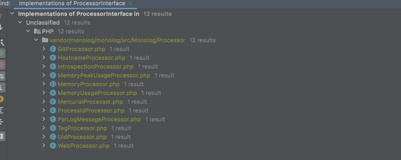

# PHP Logging

## Sebelum Belajar

- PHP Dasar
- PHP Object Oriented Programming
- PHP Composer
- PHP Unit Test
- PHP Web
- PHP MVC
- Git

## Agenda

- Pengenalan Logging
- Pengenalan Library Monolog
- Membuat Logging

## #1 Pengenalan Logging

- Log file adalah file yang berisikan informasi kejadian dari sebuah sistem
- Biasanya dalam log file, terdapat informasi waktu kejadian dan pesan kejadian
- Logging adalah aksi menambah informasi log ke log file
- Logging sudah menjadi standard industri untuk menampilkan informasi yang terjadi di aplikasi yang kita buat
- Logging bukan hanya untuk menampilkan informasi, kadang digunakan untuk proses debugging ketika terjadi masalah di aplikasi kita

### Diagram Logging


### Ekosistem Logging


## #2 Logging Library

### PHP Logging

- PHP sendiri sebenarnya memiliki function yang dikhususkan untuk logging
- Namun saat ini, kebanyakan programmer tidak menggunakannya
- Hal ini dikarenakan penggunaannya yang kurang flexible dan juga fiturnya sangan sederhana
- <https://www.php.net/manual/en/function.error-log.php>

### Logging Library

- Diluar PHP Logging, banyak sekali library yang bisa kita gunakan untuk logging, seperti :

- Monolog : <https://github.com/Seldaek/monolog>
- Analog : <https://github.com/jbroadway/analog>
- Log4PHP : <https://logging.apache.org/log4php/>
- KLogger : <https://github.com/katzgrau/KLogger>
- dan lain-lain

### Monolog

- Pada kelas ini kita akan menggunakan Monolog
- Monolog adalah library logging untuk PHP yang saat ini paling populer
- Bahkan framework Laravel pun menggunakan Monolog
- <https://packagist.org/packages/monolog/monolog>

## #3 Membuat Project

### Clone Project

- <https://github.com/ProgrammerZamanNow/belajar-php-mvc>

### Menambah Dependency

- <https://packagist.org/packages/monolog/monolog>

## #3 Logger

- Logger merupakan class yang digunakan untuk melakukan logging
- Untuk membuat object Logger sangat mudah, kita cukup gunakan nama logger yang kita inginkan di parameter constructor nya

### Kode: Membuat Logger

```php
public function testLogger()
{
	$logger = new Logger('ProgrammerZamanNow');

	self::assertNotNull($logger);
}
```

### Nama Logger dengan Nama Class

- Salah satu kebiasaan ketika membuat object Logger, adalah menggunakan nama logger dengan nama class lokasi Logger nya
- Misal jika kita membuat object Logger di class `ProductController`, maka kita akan menggunakan nama logger dengan `ProductController::class`
- Salah satu kegunaannya adalah, kita bisa tahu lokasi kita melakukan logging dari nama Logger

### Kode: Membuat Logger dengan Nama

```php
public function testLoggerWithName()
{
	$logger = new Logger(LoggerTest::class);

	self::assertNotNull($logger);
}
```

## #4 Handler

- Monolog memilih fitur yang bernama Handler
- Handler merupakan object yang bertugas mengirim aktivitas log event yang kira kirim ke Logger ke target yang dituju
- Secara default, tidak ada Handler sama sekali ketika kita membuat Logger, kita perlu menambahkan Handler ke Logger secara manual
- Handler di Monolog di representasikan dalam interface `HandlerInterface`
- <https://github.com/Seldaek/monolog/blob/main/src/Monolog/Handler/HandlerInterface.php>

### Implementasi Handler

- Karena HandlerInterface adalah sebuah Interface, maka untuk menambahkan Handler, kita perlu membuat implementasi class nya
- Tapi tenang saja, Monolog sudah menyediakan banyak sekali Handler yang kita butuhkan

### Contoh Handler


### Stream Handler

- Salah satu Handler yang sering sekali digunakan adalah StreamHandler
- StreamHandler merupakan Handler yang bisa kita gunakan untuk mengirim log event ke File atau ke Console
- <https://github.com/Seldaek/monolog/blob/main/src/Monolog/Handler/StreamHandler.php>

### Kode: Menambah Handler

```php
public function testHandler()
{
	$logger = new Logger(HandlerTest::class);
	$logger->pushHandler(new StreamHandler("php://stderr"));
	$logger->pushHandler(new StreamHandler(__DIR__ . "/../application.log"));

	self::assertEquals(2, sizeof($logger->getHandlers()));
}
```

## #5 Logging

- Setelah kita membuat Logger dan menambah Handler ke Logger
- Kita bisa mulai melakukan logging
- Ada banyak method di Logger yang bisa kita gunakan untuk melakukan logging, dan akan kita bahas detail di bab Level

### Kode: Melakukan Logging

```php
public function testLogging()
{
	$logger = new Logger(HandlerTest::class);
	$logger->pushHandler(new StreamHandler("php://stderr"));
	$logger->pushHandler(new StreamHandler(__DIR__ . "/../application.log"));

	$logger->info("Selamat Belajar PHP Logging");

	self::assertNotNull($logger);
}
```

## #6 Level

- Saat kita mengirim log event, kita bisa menentukan level dari log event tersebut
- Monolog mendukung banyak sekali level, dimana cara kerja level itu bertingkat, dari yang paling rendah kepaling tinggi
- Biasanya level digunakan untuk menentukan jenis log event, misal jika log event berupa informasi, kita gunakan level info, jika berupa masalah, kita gunakan level error, jika berupa informasi untuk proses debugging, kita gunakan level debug, dan lain-lain

### Daftar Level

| Level     | Logger Method | Velue |
| --------- | ------------- | ----- |
| DEBUG     | `debug()`     | 100   |
| INFO      | `info()`      | 200   |
| NOTICE    | `notice()`    | 250   |
| WARNING   | `warning()`   | 300   |
| ERROR     | `error()`     | 400   |
| CRITICAL  | `critical()`  | 500   |
| ALERT     | `alert()`     | 550   |
| EMERGENCY | `emergency()` | 600   |

### Kode: Level

```php
public function testLevel()
{
	$logger = new Logger(HandlerTest::class);
	$logger->pushHandler(new StreamHandler("php://stderr"));

	$logger->debug("This is Debug");
	$logger->info("This is Info");
	$logger->notice("This is Notice");
	$logger->warning("This is Warning");
	$logger->error("This is Error");
	$logger->critical("This is Critical");
	$logger->alert("This is Alert");
	$logger->emergency("This is Emergency");

	self::assertNotNull($logger);
}
```

### StreamHandler Level

- Salah satu kelebihan StreamHandler adalah, dia bisa menentukan mulai level mana log event harus dikirim
- Defaultnya, StreamHandler akan mengirim mulai level `DEBUG`
- Jika kita ingin mengubahnya, kita bisa mengubah level mulai ketika membuat object StreamHandler

### Kode: StreamHandler Level

```php
public function testLevel()
{
	$logger = new Logger(HandlerTest::class);
	$logger->pushHandler(new StreamHandler("php://stderr"));
	$logger->pushHandler(new StreamHandler(__DIR__ . "/../error.log", Logger::DEBUG));


	$logger->debug("This is Debug");
	$logger->info("This is Info");
	$logger->notice("This is Notice");
	$logger->warning("This is Warning");
	$logger->error("This is Error");
	$logger->critical("This is Critical");
	$logger->alert("This is Alert");
	$logger->emergency("This is Emergency");

	self::assertNotNull($logger);
}
```

## #7 Context

- Selain mengirim informasi log event berupa string, kita juga menambahkan informasi lainnya berupa array ketika melakukan logging
- Informasi tambahan ini dinamakan Context
- Context ini sangat bermanfaat jika memang kita ingin menambahkan informasi yang berhubungan dengan log event tersebut, sehingga kita tidak perlu membuat format pesan secara manual, cukup kirim data Context berupa Array pada parameter kedua pada method logging nya

### Kode: Context

```php
public function testContext()
{
	$logger = new Logger(HandlerTest::class);
	$logger->pushHandler(new StreamHandler("php://stderr"));

	$logger->info("Request user login", ["username" => "khanedy"]);
	$logger->info("Success login", ["username" => "khanedy"]);

	self::assertNotNull($logger);
}
```

## #8 Processor

- Processor merupakan cara lain jika kita ingin menambahkan informasi ke log event
- Jika informasi Context harus kita kirim setiap kali kita melakukan logging, pada Processor, kita bisa membuat class Processor yang akan dieksekusi setiap kali log event dikirim
- Dengan Processor, kita bisa menambahkan informasi tambahan pada log event yang dikirim
- Untuk membuat Processor, kita bisa langsung menggunakan Callable atau membuat class turunan dari `ProcessorInterface`

### Kode: Processor

```php
public function testProcessor()
{
	$logger = new Logger(HandlerTest::class);
	$logger->pushHandler(new StreamHandler("php://stderr"));
	$logger->pushProcessor(function ($record) {
		$record['extra']['pzn'] = [
			"author" => "Eko Kurniawan Khannedy",
			"app" => "Belajar PHP Logging"
		];
		return $record;
	});

	self::assertNotNull($logger);
}
```

### Monolog Processor

- Sama seperti Handler, Monolog juga sudah banyak menyediakan class implementasi dari `ProcessorInterface` yang bisa kita gunakan sesuai kebutuhan kita
- Ini sangat berguna ketika kita memang ingin menambahkan informasi secara umum ke semua log event yang kita buat

### Daftar Monolog Processor



### Kode: Monolog Processor

```php
public function testProcesorMonolog()
{
	$logger = new Logger(ProcessorTest::class);
	$logger->pushHandler(new StreamHandler("php://stderr"));
	$logger->pushProcessor(new GitProcessor());
	$logger->pushProcessor(new MemoryUsageProcessor());
	$logger->pushProcessor(function ($record) {
		$record['extra']['pzn'] = [
			"author" => "Eko Kurniawan Khannedy",
			"app" => "Belajar PHP Logging"
		];
		return $record;
	});
}
```

## #9 Reset Handler dan Processor

### Resettable Interface

- Saat kita menggunakan Handler dan Processor, kadang ada beberapa Handler dan Processor yang menyimpan beberapa datanya di Memory
- Jika proses object Logger mengikuti alur hidup Web Request, hal itu aman-aman saja karena setelah web request selesai, semua data akan dihapus dari memory
- Namun jika ternyata kita melakukan pekerjaan yang lama, misal long running job, maka sangat disarankan untuk secara regular melakukan reset Handler dan Processor
- Beberapa Handler dan Processor merupakan implementasi `ResettableInterface` yang memiliki method `reset()` untuk melakukan reset data

### Resettable Logger

- Melakukan reset semua Handler dan Processor yang kita gunakan lumayan ribet jika dilakukan
- Untungnya, Logger memiliki method `reset()` yang bisa kita gunakan untuk melakukan reset semua Handler dan Processor
- Kita cukup memanggil method tersebut untuk melakukan reset Handler dan Processor

### Kode: Reset Method di Logger

```php
public function reset(): void
{
	foreach ($this->handlers as $handler) {
		if ($handler instanceof ResettableInterface) {
			$handler->reset();
		}
	}

	foreach ($this->processors as $processor) {
		if ($processor instanceof ResettableInterface) {
			$processor->reset();
		}
	}
}
```

### Kode: Reset Logger

```php
$logger = new Logger(ProcessorTest::class);
$logger->pushHandler(new StreamHandler("php://stderr"));
$logger->pushHandler(new StreamHandler(__DIR__ . "/.../application.log"));
$logger->pushProcessor(new GitProcessor());
$logger->pushProcessor(new MemoryUsageProcessor());

for ($i = 0; $i < 10000; $i++) {
	$logger->info("Loop-$i");
	if ($i % 100 == 0) {
		$logger->reset();
	}
}
```

## #10 Formatter

- Saat Handler mengirim log event ke tujuan (misal `file` atau `console`), Handler akan melakukan proses format log event terlebih dahulu
- Setiap Handler biasanya memiliki default Formatter, contohnya `StreamHandler` menggunakan `LineFormatter`
- Jika kita ingin membuat Formatter sendiri, kita bisa membuat class turunan dari `FormatterInterface`

### Monolog Formatter

- Monolog juga sudah menyediakan banyak sekali implementasi dari `FormaterInterface`
- Kita bisa menggunakannya sesuai dengan kebutuhan kita

### Daftar Monolog Formatter


### Kode: Monolog Formatter

```php
public function testFormatter()
{
	$logger = new Logger(LoggingTest::class);

	$handler = new StreamHandler("php://stderr");
	$handler->setFormatter(new JsonFormatter());

	$logger->pushHandler($handler);

	$logger->info("Selamat Belajar PHP Logging");

	self::assertNotNull($logger);
}
```

## #11 Rotating File Handler

- Saat menggunakan file sebagai media penyimpanan log, kadang semakin lama, ukuran file akan semakin besar
- StreamHandler secara default akan selalu mengirim log event ke file yang sama terus menerus
- Untungnya ada class turunan dari StreamHandler bernama `RotatingFileHandler`
- Class ini, di khususkan untuk mengirim log event ke file, namun bisa secara otomatis membuat file baru setiap hari, sehingga semua log tidak akan disimpan di dalam satu file
- Ini bagus untuk memastikan ukuran log tidak terlalu besar, dan mudah untuk menghapus log lama yang sudah tidak kita gunakan lagi

### Kode: Rotating File Handler

```php
public function testRotating()
{
	$logger = new Logger(RollingFileTest::class);
	$logger->pushHandler(new RotatingFileHandler(__DIR__ . "/../app.log", Logger::INFO));

	$logger->info("Hello World");
	$logger->info("Hello World");
	$logger->info("Hello World");

	self::assertNotNull($logger);
}
```

## #12 Materi Selanjutnya

- PHP RESTful API
