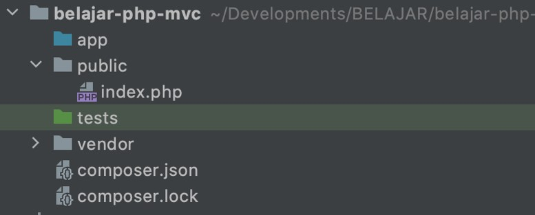

# PHP MVC

## Sebelum Belajar

- PHP Web
- PHP Composer
- PHP Unit Test

## Agenda

- Pengenalan MVC
- Router
- Controller
- Path Variable
- Middleware
- Local Domain
- Apache HTTPD Server
- Dan Lain-Lain

## #1 Pengenalan MVC

### Sejarah MVC

- MVC singkatan dari Model View Controller, yaitu salah satu software design pattern yang banyak digunakan ketika pengembangan aplikasi berbasis user interface
- MVC pertama kali dikenalkan oleh Trygve Reenskaug pada tahun 1970 ketika berkunjung ke Xerox Palo Alto Research
- Awalnya MVC banyak digunakan di aplikasi berbasis Desktop, namun sekarang MVC banyak diadopsi di Web
- Saat ini sendiri, design pattern MVC sudah banyak berkembang, ada hierarchical model–view–controller (HMVC), model–view–adapter (MVA), model–view–presenter (MVP), model–view–viewmodel (MVVM), dan lain-lain

### Model View Controller

Seperti singkatannya, MVC dibagi menjadi tiga bagian :

- `Model`, merupakan bagian yang merepresentasikan data. Seperti yang kita ketahui, ada banyak sekali jenis data, seperti data request, data response, data table, dan lain-lain, sehingga kadang kita perlu memperkecil lagi scope dari Model itu sendiri ketika membuat aplikasi.
- `View`, merupakan bagian yang merepresentasikan tampilan, seperti halaman web, desktop, mobile, dan lain-lain.
- `Controller`, merupakan bagian yang mengurus alur kerja dari menerika input, memanipulasi data Model, sampai menampilkan View. Anggap saja Controller merupakan core logic dari aplikasi kita

### Diagram MVC


### Pada Kenyataanya

- Walaupun sekilas MVC sangat sederhana, pada kenyataannya ketika kita membuat aplikasi yang kompleks, kita biasanya tidak lagi bisa memanfaatkan MVC
- Kadang kita butuh mengimplementasikan design pattern lain, seperti misal nya Service Pattern, Repository Pattern, dan lain-lain
- Oleh karena itu, jangan terlalu terpaku pada satu pattern, jika kita bisa mengkombinasikan beberapa pattern agar kode aplikasi kita lebih rapih dan baik, maka disarankan untuk melakukan kombinasi

### Diagram Contoh Aplikasi


## #2 Membuat Project

```sh
composer init
```

### Dependency

```json
{
	"require": {
		"php": ">=8"
	},
	"require-dev": {
		"phpunit/phpunit": "9.5.7"
	}
}
```

### Struktur Project

```json
{
	"autoload": {
		"psr-4": {
			"ProgrammerZamanNow\\Belajar\\PHP\\MVC\\": "app"
		}
	},
	"autoload-dev": {
		"psr-4": {
			"ProgrammerZamanNow\\Belajar\\PHP\\MVC\\": "tests"
		}
	}
}
```

### Public Directory

- Best practice ketika membuat web dengan PHP adalah, kita tidak mengekspos seluruh kode PHP kita
- Biasanya kita membuat directory public, dan hanya mengekspos directory tersebut ke Web
- Directory app tidak di ekspos ke public
- Teknik ini biasa digunakan oleh framework-framework seperti CodeIgniter dan Laravel
- Saat nanti kita menjalankan PHP Server, kita akan menjalankannya dari directory public, sehingga directory app tidak bisa diakses secara langsung melalui Web Browser

### Struktur Project



## #3 PATH_INFO

- `PATH_INFO` merupakan key yang terdapat di global variable `$_SERVER`
- `PATH_INFO` adalah informasi path yang terdapat pada URL ketika kita mengakses file php
- Misal jika URL nya adalah <http://contoh.com/index.php>, maka tidak ada `PATH_INFO`
- Jika URL nya <http://contoh.com/index.php/test>, maka `PATH_INFO` nya adalah `/test`
- Jika URL nya adalah <http://contoh.com/index.php/products/123>, maka `PATH_INFO` nya adalah `/products/123`
- Dan jika URL nya <http://contoh.com/index.php/category?id=123>, maka `PATH_INFO` nya adalah `/category`

### Kode: PATH_INFO

```php
if (isset($_SERVER['PATH_INFO'])) {
	echo $_SERVER['PATH_INFO'];
} else {
	echo "TIDAK ADA PATH_INFO";
}
```

### Untuk Apa PATH_INFO?

- `PATH_INFO` ini banyak digunakan sebagai URL Routing
- Artinya, saat membuat aplikasi PHP, kebanyakan kita biasanya membuat 1 file untuk 1 URL, misal `contoh.com/index.php`, `contoh.com/product.php`, `contoh.com/login.php`
- Namun best practice dalam framework-framework MVC, biasanya kita hanya menggunakan 1 file php sebagai gerbang masuk nya, dan memanfaatkan `PATH_INFO` sebagai informasi file apa yang harus kita load

## #4 Router Sederhana

### Apa itu Routing

- Routing adalah teknik melakukan penentuan rute dari URL ke file PHP yang akan dieksekusi
- Secara default routing sudah dilakukan oleh Web Server, misal jika kita buka `/index.php` maka akan mengakses file `index.php`, jika membuat url `/user/login.php`, maka akan mengakses file `login.php` di folder user
- Namun karena sekarang kita ingin menggunakan `PATH_INFO`, maka kita perlu melakukan routing sendiri

### Kode: Routing Sederhana

```php
$path = "/index";
if (isset($_SERVER['PATH_INFO'])) {
	$path = $_SERVER['PATH_INFO'];
}

require __DIR__ . '/../app/View' . $path . '.php';
```

## #5 Router

- Setelah kita sekarang mengerti cara kerja Router, saatnya kita membuat Router yang lebih kompleks
- Router yang sebelumnya sangat sederhana, hanya meneruskan `PATH_INFO` ke file php yang dituju, sedangkan dalam MVC, Router seharusnya meneruskan `PATH_INFO` menuju class Controller yang dituju
- Jadi sekarang kita akan coba buat class Router untuk melakukan management routing nya

### Kode: Class Router

```php
namespace ProgrammerZamanNow\Belajar\PHP\MVC\App;

class Router
{
	private static array $routes = [];

	public static function add(string $method, string $path, string $controller, string $function): void
	{
		// TODO add URL Mapping
	}

	public static function run(): void
	{
		// TODO run controller
	}
}
```

### URL Mapping

- Saat kita membuat Router, kita perlu memberi tahu Router tentang pasangan antara `PATH_INFO` dan Controller yang akan dieksekusi
- Selain itu, kita juga bisa memberi tahu HTTP Method mana yang dibolehkan untuk mengakses `PATH_INFO` tersebut

### Kode: Menambah URL Mapping

```php
private static array $routes = [];

public static function add(string $method, string $path, string $controller, string $function): void
	{
		self::$routes[] = [
			'method' => $method,
			'path' => $path,
			'controller' => $controller,
			'function' => $function,
		];
	}
```

### Memilih Controller dari PATH_INFO

- Setelah menambahkan semua URL Mapping ke Router, maka dengan mudah kita bisa mendapatkan Controller mana yang perlu dieksekusi ketika ada request terhadap `PATH_INFO`

### Kode: Memilih Controller

```php
public static function run(): void
{
	$path = "/";
	if (isset($_SERVER['PATH_INFO'])) $path = $_SERVER['PATH_INFO'];
	$method = $_SERVER['REQUEST_METHOD'];

	foreach (self::$routes as $route) {
		if ($path == $route['path'] && $method == $route['method']) {
			echo "CONTROLLER : " . $route['controller'] . ", FUNCTION : " . $route['function'];
			return;
		}
	}
	http_response_code(404);
	echo "CONTROLLER NOT FOUND";
}
```

### Kode: Menggunakan Router

```php
require_once __DIR__ . '/../vendor/autoload.php';

use ProgrammerZamanNow\Belajar\PHP\MVC\App\Router;

Router::add("GET", "/", "HomeController", 'index');
Router::add("GET", "/hello", "HomeController", 'hello');
Router::add("GET", "/world", "HomeController", 'world');

Router::run();
```

## #6 Controller

- Selanjutnya, setelah kita selesai membuat Router dan sukses melakukan pemetaan antara path dan Controller nya, saatnya kita buat class Controller nya
- Class Controller sangat sederhana, class ini merupakan class yang digunakan sebagai class yang menerima request pertama kali
- Selanjutnya class Controller bisa melakukan pengolahan logic menggunakan class apapun
- Saat ini kita buat class Controller yang sederhana terlebih dahulu

### Kode: Home Controller

```php
namespace ProgrammerZamanNow\Belajar\PHP\MVC\Controller;

class HomeController
{
	function index(): void
	{
		echo "HomeController.index()";
	}

	function hello(): void
	{
		echo "HomeController.hello()";
	}

	function world(): void
	{
		echo "HomeController.world()";
	}
}
```

### Integrasi Dengan Router

- Setelah membuat controller, sekarang pertanyaannya, bagaimana integrasi dengan class Router yang sudah kita buat?
- Pada Class Router sebelumnya, kita hanya susah menemukan class Controller berupa String, artinya kita perlu buat dulu object dari class Controller tersebut dari String nya, lalu eksekusi function yang sudah di petakan dengan path tersebut

### Kode: Eksekusi Controller dari Router

```php
public static function run(): void
{
		$path = "/";
	if (isset($_SERVER['PATH_INFO'])) $path = $_SERVER['PATH_INFO'];
	$method = $_SERVER['REQUEST_METHOD'];

	foreach (self::$routes as $route) {
		if ($path == $route['path'] && $method == $route['method']) {
			$controller = new $route['controller'];
			$function = $route['function'];
			$controller->$function();
			return;
		}
	}
	http_response_code(404);
	echo "CONTROLLER NOT FOUND";
}
```

### Kode: index.php

```php
require_once __DIR__ . '/../vendor/autoload.php';

use ProgrammerZamanNow\Belajar\PHP\MVC\App\Router;
use ProgrammerZamanNow\Belajar\PHP\MVC\Controller\HomeController;

Router::add("GET", "/", HomeController::class, 'index');
Router::add("GET", "/hello", HomeController::class, 'hello');
Router::add("GET", "/world", HomeController::class, 'world');

Router::run();
```

## #7 Path Variable

- Saat kita membuat URL, kadang kita ingin menambahkan data didalam URL
- Bukan dalam bentuk Query Parameter, namun langsung pada URL nya
- Misal `/products/1234`
- Hal ini dinamakan Path Variable atau Path Parameter
- Sekarang pertanyaannya, bagaimana cara agar Router kita mendukung hal tersebut?

### Regex

- Pada Kelas PHP OOP, kita sudah belajar tentang Regex
- Pada Path Variable ini, kita akan membutuhkan Regex agar Path pada Router bisa mendukung Path Variable

### Kode: Mencoba Regex

```php
$path = "/products/123456/categories/abcde";

// awal dan akhir tidak menggunakan / karena / banyak digunakan di URL.
$patterns = "#^/products/([0-9a-zA-Z]*)/categories/([0-9a-zA-Z]*)$#";

if (preg_match($pattern, $variables)) {
	echo var_dump($variables);
}
```

### Kode: Mengubah Router

```php
public static function run(): void
{
	$path = "/";
	if (isset($_SERVER['PATH_INFO'])) $path = $_SERVER['PATH_INFO'];
	$method = $_SERVER['REQUEST_METHOD'];

	foreach (self::$routes as $route) {
		$pattern = "#^" . $route['path'] ."$#";
		if (preg_match($pattern, $path, $variables) && $method == $route['method']) {
			$controller = new $route['controller'];
			$function = $route['function'];
			$controller->$function();
			return;
		}
	}
	http_response_code(404);
	echo "CONTROLLER NOT FOUND";
}
```

### Mengirim Variable ke Controller

- Setelah menggunakan Regex untuk melakukan pengecekan Path, kita juga bisa mengirim variable hasil Regex tersebut ke parameter di Controller

### Kode: Mengirim Variable ke Controller

```php
foreach (self::$routes as $route) {
	$pattern = "#^" . $route['path'] ."$#";
	if (preg_match($pattern, $path, $variables) && $method == $route['method']) {

		$controller = new $route['controller'];
		$function = $route['function'];

		array_shift($variables);
		call_user_func_array([$controller, $function], $variables);
		return;
	}
}
```

### Kode: Product Controller

```php
namespace ProgrammerZamanNow\Belajar\PHP\MVC\Controller;

class ProductController
{
	function categories(string $productId, string $categoryId): void
	{
		echo "PRODUCT $productId, CATEGORY $categoryId";
	}
}
```

### Kode: index.php

```php
require_once __DIR__ . '/../vendor/autoload.php';

use ProgrammerZamanNow\Belajar\PHP\MVC\App\Router;
use ProgrammerZamanNow\Belajar\PHP\MVC\Controller\HomeController;
use ProgrammerZamanNow\Belajar\PHP\MVC\Controller\ProductController;

Router::add("GET", "/products/([0-9a-zA-Z]*)/categories/([0-9a-zA-Z]*)", ProductController::class, 'categories');

Router::add("GET", "/", HomeController::class, 'index');
Router::add("GET", "/hello", HomeController::class, 'hello');
Router::add("GET", "/world", HomeController::class, 'world');

Router::run();
```

## #8 Model

- Model merupakan data
- Saat membuat aplikasi, pada kenyataannya data itu banyak jenis nya
- Misal data request yang dikirim oleh client, data response yang diberikan oleh server, data di database, dan lain-lain
- Saat ini kita akan buat data yang sederhana dahulu, tanpa menggunakan database
- Model biasanya digunakan oleh Controller, untuk selanjutnya diberikan ke View

### Kode: Model Sederhana

```php
class HomeController
{
	function index(): void
	{
		$model = [
			'title' => 'Belajar PHP MVC',
			'content' => 'Selamat belajar PHP MVC di Channel Programmer Zaman Now'
		];
		echo "HomeController.index()";
	}
}
```

## #9 View

- View adalah bagian yang berisikan kode untuk response
- Kenapa tidak dilakukan di Controller? Hal ini dikarenakan agar Controller bisa fokus berisikan kode logic aplikasi kita, sedangkan jika kita ingin menampilkan response, kita bisa menggunakan View
- View biasanya tidak memiliki logic yang terlalu rumit, karena tugasnya hanya menampilkan data dari Model yang sudah diberikan oleh Controller

### Kode: View

```php
<html>
	<head>
		<title><?=$model['title']?></title>
	</head>
	<body>
		<h1><?=$model['content']?></h1>
	</body>
</html>
```

### Kode: Menampilkan View

```php
class HomeController
{
	function index(): void
	{
		$model = [
			'title' => 'Belajar PHP MVC',
			'content' => 'Selamat belajar PHP MVC di Channel Programmer Zaman Now'
		];
		require __DIR__ . "/../View/Home/index.php";
	}
}
```

## #10 Middleware

- Middleware merupakan fitur yang biasanya ada pada framework Web MVC
- Middleware merupakan bagian kode yang dieksekusi sebelum Controller di eksekusi
- Dengan Middleware, kita bisa menggabungkan kode-kode yang sama yang harus dieksekusi sebelum Controller dieksekusi
- Contoh misalnya pengecekan apakan pengguna sudah login atau belum
- Dibandingkan kita simpan di tiap Controller, lebih baik kita gunakan Middleware untuk melakukan hal tersebut
- Namun sayangnya, pada Router yang telah kita buat, belum mendukung Middleware, sehingga kita perlu menambahkan fitur Middleware

### Kode: Middleware

```php
namespace ProgrammerZamanNow\Belajar\PHP\MVC\Middleware;

interface Middleware
{
	function before(): void;
}
```

### Kode: Menambah Middleware ke Router

```php
public static function add(string $method, string $path, string $controller, string $function, array $middlewares = []): void
{
	self:$routes[] = [
		'method' => $method,
		'path' => $path,
		'controller' => $controller,
		'function' => $function,
		'middleware' => $middlewares,
	];
}
```

### Kode: Menjalankan Middleware

```php
foreach ($route['middleware'] as $middleware) {
	$instance = new $middleware;
	$instance->before();
}
```

### Kode: Auth Middleware

```php
namespace ProgrammerZamanNow\Belajar\PHP\MVC\Middleware;

class AuthMiddleware implements Middleware
{
	function before(): void
	{
		session_start();
		if (!isset($_SESSION['user'])) {
			header("Location: /login");
			exit();
		}
	}
}
```

### Kode: index.php

```php
require_once __DIR__ . '/../vendor/autoload.php';

use ProgrammerZamanNow\Belajar\PHP\MVC\App\Router;
use ProgrammerZamanNow\Belajar\PHP\MVC\Controller\HomeController;
use ProgrammerZamanNow\Belajar\PHP\MVC\Controller\ProductController;
use ProgrammerZamanNow\Belajar\PHP\MVC\Middleware\AuthMiddleware;

Router::add("GET", "/products/([0-9a-zA-Z]*)/categories/([0-9a-zA-Z]*)", ProductController::class, 'categories');

Router::add("GET", "/", HomeController::class, 'index');
Router::add("GET", "/hello", HomeController::class, 'hello', [AuthMiddleware::class]);
Router::add("GET", "/world", HomeController::class, 'world', [AuthMiddleware::class]);

Router::run();
```

## #11 Local Domain

- Sampai saat ini, kita hanya menggunakan domain localhost untuk mengetes aplikasi yang kita buat
- Ada baiknya di local kita, kita buat domain local sendiri untuk membuka aplikasi kita
- Hal ini bermanfaat saat nanti kita memiliki banyak sekali aplikasi web, dan dijalankan di web server yang sama

### Ubah Hosts di Local

- Tiap sistem operasi memiliki lokasi file hosts berbeda-beda
- File hosts ini bisa digunakan untuk mengubah ip dari sebuah host atau domain yang kita inginkan
- Di Mac atau Linux, lokasinya terdapat di : `/etc/hosts`
- Di Windows, lokasinya terdapat di : `C:\Windows\System32\Drivers\etc\`

### Kode: File Hosts

```txt
# Development
127.0.0.1 php-mvc.khannedy
```

## #12 Apache HTTPD

- Apache HTTPD merupakan default Web Server yang terdapat pada XAMPP
- Sekarang kita akan coba tambahkan local domain yang sudah kita setup sebelumnya pada Apache HTTPD

### Virtual Host

- Untuk menambahkan mapping local domain di Apache HTTPD, kita akan membuat virtual host baru di konfigurasi Apache HTTPD
- Selanjutnya kita tambahkan domain local yang sebelumnya kita buat, dan juga lokasi folder dimana kita menyimpan project kita

### Kode: Virtual Host

```
<VirtualHost *:80>
	ServerAdmin admin@php-mvc.khannedy
	DocumentRoot "/Application/XAMPP/xamppfiles/htdocs/belajar-php-mvc/public"
	ServerName php-mvc.khannedy
	ErrorLog "logs/php-mvc.khannedy.error.log"
	CustomLog "logs/php-mvc.khannedy.access.log" common
</VirtualHost>
```

### Kode: Apache Config

```txt
# Virtual hosts
Include etc/extra/httpd-vhosts.conf
```

### Kenapa Error?


### Error Apache HTTPD

- Sebelumnya kita menjalankan menggunakan PHP Development Server
- Cara kerjanya agak sedikit berbeda, pada Apache HTTPD, saat kita menggunakan `PATH_INFO`, secara otomatis Apache HTTPD mencari folder yang sesuai dengan `PATH_INFO`
- Sedangkan harapan kita adalah semua request diharapkan menggunakan index.php
- Oleh karena itu, agar cara kerjanya sama, kita perlu tambahkan file `.htaccess`
- File `.htaccess` ini bisa digunakan sebagai panduan Apache HTTPD untuk memproses routing request
- Kita akan menggunakan konfigurasi yang sama dengan framework CodeIgniter, karena memang project MVC yang kita buat sudah sesuai standard kebanyakan framework yang ada
- <https://github.com/codeigniter4/CodeIgniter4/blob/v4.1.3/public/.htaccess>

## #13 Materi Selanjunya

- Studi Kasus PHP MVC
- RESTful API
