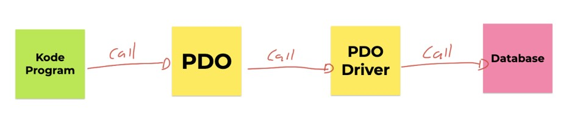
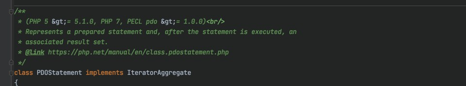
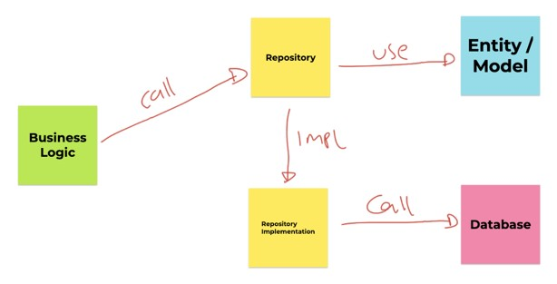

# PHP MySQL Database

## Sebelum Belajar

- PHP Dasar
- PHP Object Oriented Programming
- PHP 8
- <https://www.udemy.com/course/pemrograman-php-pemula-sampai-mahir/?referralCode=FB1EE79284AE417D17C5>

## Agenda

- Pengenalan PDO
- Membuat Koneksi
- Mengeksekusi SQL
- Melakukan Query
- SQL Injection
- Repository Pattern
- Dan lain-lain

## #1 Pengenalan PDO

- PDO singkatan dari PHP Data Object
- Yaitu sebuah spesifikasi interface untuk standard komunikasi antara PHP dengan Database
- PDO adalah sebuah spesifikasi, sehingga kita butuh implementasinya atau extension nya untuk mengaktifkan PDO
- PDO menyediakan abstraction layer yang sama untuk semua database, artinya mau menggunakan database apapun, kita akan menggunakan kode PDO yang sama, dan cara kerjanya sama
- Hal ini membuat penggunaan PDO lebih flexible dibandingkan menggunakan function-function bawaan dari driver databasenya

### Cara Kerja PDO



### Mengecek PDO Extension yang Terinstall

```php
<?php

phpinfo();
```

### MySQL

- Pada course ini, kita akan menggunakan MySQL sebagai database yang akan kita gunakan untuk praktek PHP Database
- Jadi pastikan di komputer teman-teman sudah terinstall driver PDO untuk MySQL
- Jika teman-teman belum mengerti tentang MySQL, saya sarankan teman-teman belajar dulu di course yang pernah saya buat tentang MySQL

## #2 Koneksi Database

- Sebelum kita melakukan manipulasi data ke database dengan mengirimkan perintah SQL, hal yang perlu kita lakukan terlebih dahulu adalah membuat koneksi ke database
- Untuk membuat koneksi ke database MySQL menggunakan PDO sangatlah mudah, kita hanya butuh membuat object PDO
- Dan saat kita membuat koneksi ke MySQL menggunakan PDO, kita perlu tentukan host, port, database name, username dan juga password nya

### Kode: Membuat Koneksi Database

```php
$host = 'localhost';
$port = 3306;
$database = 'belajar_php_database';
$username = 'root';
$password = '';

$connection = new PDO('mysql:host=$host:$port;dbname=$database', $username, $password);
echo 'Suksed terkoneksi ke database' . PHP_EOL;
```

### Error PDOException

- Hampir semua error yang terjadi di PDO merupakan class exception dari `PDOException` atau class turunannya
- Sehingga jika kita ingin melakukan sesuatu jika terjadi komunikasi error ke database, kita bisa gunakan try catch

### Kode: Try Catch PDOException

```php
$host = 'localhost';
$port = 3306;
$database = 'belajar_php_database';
$username = 'root';
$password = '';

try {
	$connection = new PDO('mysql:host=$host:$port;dbname=$database', $username, $password);
	echo 'Suksed terkoneksi ke database' . PHP_EOL;

	// menutup koneksi
} catch (PDOException $exception) {
	echo 'Error terkoneksi ke database : ' . $connection->getMessage() . PHP_EOL;
}
```

### Menutup Koneksi

- Jika kita telah selesai melakukan operasi ke database, lalu kita sudah tidak memerlukannya lagi, maka kita wajib menutup koneksi ke database nya
- Setiap database punya batas maksimal koneksi ke database, contohnya MySQL secara default batas maksimal nya adalah 151 koneksi
- Jika sampai kita lupa menutup koneksi sehingga koneksi dianggap masih terbuka, maka lama kelamaan koneksi bisa cepat mencapai maksimal koneksi, sehingga ketika kita ingin membuat koneksi baru, maka akan ditolak oleh MySQL

### Kode: Menutup Koneksi

```php
try {
	$connection = new PDO('mysql:host=$host:$port;dbname=$database', $username, $password);
	echo 'Suksed terkoneksi ke database' . PHP_EOL;

	// menutup koneksi
} catch (PDOException $exception) {
	echo 'Error terkoneksi ke database : ' . $connection->getMessage() . PHP_EOL;
}
```

## #3 Execute SQL

- Setelah kita terkoneksi ke database, sudah pasti kita ingin mengirim perintah SQL ke database tersebut dari aplikasi PHP kita
- Untuk mengirim perintah SQL, kita bisa menggunakan function `execute(sql)` yang terdapat di object PDO yang sudah kita buat
- Function `execute(sql)` bisa kita gunakan untuk semua jenis SQL yang tidak membutuhkan result data, misal `CREATE TABLE`, `INSERT`, `UPDATE`, `DELETE`, `ALTER TABLE`, dan lain-lain

### Kode: Membuat getConnection()

```php
function getConnection(): PDO
{
	$host = 'localhost';
	$port = 3306;
	$database = 'belajar_php_database';
	$username = 'root';
	$password = '';

	return new PDO('mysql:host=$host:$port;dbname=$database', $username, $password);
}
```

### Kode: Membuat Table Customers

```sql
CREATE TABLE customers
(
	id VARCHAR(100) NOT NULL,
	name VARCHAR(100) NOT NULL,
	email VARCHAR(100) NOT NULL,
	PRIMARY KEY (id)
) ENGINE = InnoDB;
```

### Kode: Eksekuai SQL Menggunakan PDO

```php
$connection = getConnection();

$sql = <<<SQL
	INSERT INTO customers(id, name, email)
	VALUES ('eko', 'Elo', 'eko@test.com')
SQL;

$connection->exec($sql);

$connection = null;
```

## #4 Query SQL

- Setelah kita tahu bagaimana cara mengirim SQL ke MYSQL yang tidak membutuhkan result data, sekarang bagaimana melakukan Query SQL yang membutuhkan result data seperti SQL SELECT?
- PDO memiliki function bernama `query(sql)`, ini digunakan untuk melakukan query data dari database
- Return value dari function `query(sql)` adalah sebuah object dari `PDOStatement`

### Kode: Query SQL dengan PDO

```php
$connection = getConnection();

$sql = "SELECT * FROM customers";
$result = $connection->query($sql);

$connection = null;
```

### PDOStatement

- `PDOStatement` adalah sebuah class turunan dari `IteratorAggregate`
- Seperti yang sudah kita bahas di materi PHP Object Oriented Programming, bahwa turunan `IteratorAggregate` secara otomatis bisa menggunakan perulangan `foreach`
- Oleh karena itu, untuk melakukan iterasi data hasil query, kita bisa melakukan perulangan `foreach` untuk tiap baris record hasil dari Query SQL nya



### Kode: Foreach PDOStatement

```php
$connection = getConnection();

$sql = "SELECT * FROM customers";
$result = $connection->query($sql);
foreach ($result as $row) {
	var_dump($row);
}

$connection = null;
```

## #5 SQL Injection

### SQL dengan Parameter

- Saat membuat aplikasi, kita tidak mungkin akan melakukan hardcode perintah SQL di kode PHP kita
- Biasanya kita akan menerima input data dari user, lalu membuat perintah SQL dari input user, dan mengirimnya menggunakan perintah SQL

### Kode: Membuat Tabel Admin

```sql
CREATE TABLE admin
(
	username VARCHAR(100) NOT NULL,
	password VARCHAR(100) NOT NULL,
	PRIMARY KEY (username)
) ENGINE = InnoDB;
```

### Kode: Membuat SQL dari Input User

```php
$username = 'admin';
$password = 'admin';

$sql = "SELECT * FROM admin WHERE username = '$username' AND password = '$password'";
```

### SQL Injection

- SQL Injection adalah sebuah teknik yang menyalahgunakan sebuah celah keamanan yang terjadi dalam lapisan basis data sebuah aplikasi.
- Biasa, SQL Injection dilakukan dengan mengirim input dari user dengan perintah yang salah, sehingga menyebabkan hasil SQL yang kita buat menjadi tidak valid
- SQL Injection sangat berbahaya, jika sampai kita salah membuat SQL, bisa jadi data kita tidak aman

### Kode: Contoh Query dengan Parameter

```php
$username = 'admin';
$password = 'admin';

$sql = "SELECT * FROM admin WHERE username = '$username' AND password = '$password'";
$result = $connection->query($sql);

$success = false;
foreach ($result as $row) {
	$success = true;
}

if ($success) {
	echo 'SUKSES LOGIN' . PHP_EOL;
} else {
	echo 'GAGAL LOGIN' . PHP_EOL;
}
```

### Kode: Contoh SQL Injection

```php
$username = "admin'; #";
$password = 'admin';
```

### Solusinya?

- Jangan membuat query SQL secara manual dengan menggabungkan String secara bulat-bulat
- Function `query()` dan `execute()` tidak bisa menangani celah SQL Injection, jadi kita harus menanganinya secara manual
- Direkomendasikan menggunakan function `query()` dan `execute()` jika memang kita tidak butuh parameter dari input user ketika membuat perintah SQL
- Jika membutuhkan parameter dari input user, kita wajib menggunakan function prepare(sql) yang akan kita bahas selanjutnya
- Atau bisa juga memastikan input user aman dengan menggunakan function `quote()`

### Kode: Menggunakan Function Quote

```php
$username = $connection->quote("admin'; #");
$password = $connection->quote("admin");

$sql = "SELECT * FROM admin WHERE username = '$username' AND password = '$password'";
$result = $connection->query($sql);
```

## #6 Prepare Statement

- Cara yang lebih aman untuk membuat SQL dengan input parameter dari user sebenarnya menggunakan function `prepare()`
- Function `prepare()` akan menghasilkan object `PDOStatement`, dimana kita bisa melakukan binding parameter ke perintah SQL yang kita buat
- Ini lebih aman dibandingkan menggunakan function `quote()` secara manual, karena rawan lupa
- Namun jika menggunakan function `prepare()`, pembuatan string SQL nya agak sedikit berbeda. Ketika kita ingin menambahkan parameter, kita harus menggunakan `:namaparameter`

### Kode: Membuat Prepare Statement

```php
$sql = "SELECT * FROM admin WHERE username = :username AND password = :password";
$result = $connection->prepare($sql);
```

### Binding Parameter

- Setelah menentukan dimana kira-kira parameter akan digunakan di kode SQL
- Kita wajib melakukan binding parameter dengan input dari user
- Secara otomatis, semua input dari user akan di `quote()` oleh prepare statement, jadi kita tidak perlu melakukannya lagi secara manual
- Hal ini membuat penggunaan prepare statement lebih aman dibandingkan manual melakukan `quote()`

### Kode: Binding Parameter

```php
$username = "admin'; #";
$password = "admin";

$sql = "SELECT * FROM admin WHERE username = :username AND password = :password";
$result = $connection->prepare($sql);

$result->bindParm('username', $username);
$result->bindParm('password', $password);
$result->execute();
```

### Binding Parameter dengan Index

- Selain menggunakan kata kunci `:namaparameter`
- Untuk melakukan binding parameter, kita juga bisa menggunakan index (angka)
- Kita cukup mengganti `:namaparameter` dengan `?` (tanda tanya)
- Lalu gunakan nomor index, saat melakukan `bindingParam(index, value)`

### Kode: Binding Parameter dengan Index

```php
$username = "admin'; #";
$password = "admin";

$sql = "SELECT * FROM admin WHERE username = ? AND password = ?";
$result = $connection->prepare($sql);

$result->bindParm(1, $username);
$result->bindParm(2, $password);
$result->execute();
```

### Kode: Binding Parameter ketika Execute

```php
$username = "admin'; #";
$password = "admin";

$sql = "SELECT * FROM admin WHERE username = ? AND password = ?";
$result = $connection->prepare($sql);

$result->execute([$username, $password]);
```

## #7 Fetch Data

- Sebelumnya saat kita melakukan query, kita biasanya menggunakan perulangan `foreach` untuk melakukan iterasi terhadap object `PDOStatement`
- Permasalahannya, `foreach` akan melakukan seluruh perulangan di hasil result. Bagaimana jika kita hanya ingin mengambil data pertama saja misal? Maka kita harus membuat counter secara manual
- Untungnya `PDOStatement` memiliki sebuah function bernama `fetch()`, `fetch()` digunakan untuk menarik satu data dari hasil query, ketika kita memanggil function `fetch()` lagi, maka otomatis akan menarik data selanjutnya, jika panggil `fetch()` lagi, maka akan mengambil data ketiga, dan seterusnya
- Jika function `fetch()` mengembalikan nilai `false`, artinya sudah tidak ada data lagi yang bisa diambil dari hasil query
- Jika kita ingin mengambil seluruh data sekaligus, kita bisa menggunakan `fetchAll()`

### Kode: Function fetch()

```php
$username = "admin";
$password = "admin";

$sql = "SELECT * FROM admin WHERE username = ? AND password = ?";
$result = $connection->prepare($sql);

$result->execute([$username, $password]);

if ($row = $result->fetch()) {
	echo "SUKSES LOGIN : ". $row['username'] . PHP_EOL;
} else {
	echo "GAGAL LOGIN" . PHP_EOL;
}
```

### Kode: Function fetchAll()

```php
$connection = getConnection();

$sql = "SELECT * FROM customers";
$result = $connection->query($sql);
$customers = $result->fetchAll();

var_dump($customers);
```

## #8 Auto Increment

- Kadang kita membuat sebuah table dengan id auto increment
- Dan kadang pula, kita ingin mengambil data id yang sudah kita insert ke dalam MySQL
- Sebenarnya kita bisa melakukan query ulang ke database menggunakan `SELECT LAST_INSERT_ID()`
- Tapi untungnya di PDO ada cara yang lebih mudah
- Kita bisa menggunakan function `lastInsertId()` untuk mendapatkan Id terakhir yang dibuat secara auto increment

### Kode: Membuat Table

```sql
CREATE TABLE comments
(
	id INT NOT NULL AUTO_INCREMENT,
	email VARCHAR(100) NOT NULL,
	comment TEXT,
	PRIMARY KEY (id)
) ENGINE = InnoDB;
```

### Kode: Function lastInsertId()

```php
$connection = getConnection();

$connection->exec("INSERT INTO comments(email, comment) VALUES('exo@test.com', 'hi')");
$id = $connection->lastInsertId();

var_dump($id);

$connection = null;
```

## #9 Database Transaction

- Salah satu fitur andalan di database adalah transaction
- Materi database transaction sudah saya bahas dengan tuntas di materi MySQL database, jadi silahkan pelajari di course tersebut
- Di course ini kita akan fokus bagaimana menggunakan database transaction di PHP menggunakan PDO

### Transaction di PDO

- Secara default, semua perintah SQL yang kita kirim menggunakan PDO akan otomatis di `commit`, atau istilahnya `auto commit`
- Namun kita bisa menggunakan fitur transaksi sehingga SQL yang kita kirim tidak secara otomatis di `commit` ke database
- Untuk memulai transaksi, kita bisa menggunakan function `beginTransaction()` di PDO
- Dan untuk `commit` transaksi, kita bisa menggunakan function `commit()`
- Sedangkan jika kita ingin melakukan `rollback`, kita bisa menggunakan function `rollback()`

### Kode: Transaction

```php
$connection = getConnection();
$connection->beginTransaction();

$connection->exec("INSERT INTO comments(email, comment) VALUES('eko@test.com', 'hi')");
$connection->exec("INSERT INTO comments(email, comment) VALUES('eko@test.com', 'hi lagi')");
$connection->exec("INSERT INTO comments(email, comment) VALUES('eko@test.com', 'hi lagi')");

$connection->commit();
$connection = null;
```

### Kode: Rollback Transction

```php
$connection = getConnection();
$connection->beginTransaction();

$connection->exec("INSERT INTO comments(email, comment) VALUES('eko@test.com', 'hi')");
$connection->exec("INSERT INTO comments(email, comment) VALUES('eko@test.com', 'hi lagi')");
$connection->exec("INSERT INTO comments(email, comment) VALUES('eko@test.com', 'hi lagi')");

$connection->rollBack();
$connection = null;
```

## #10 Repository Pattern

- Dalam buku Domain-Driven Design, Eric Evans menjelaskan bahwa “repository is a mechanism for encapsulating storage, retrieval, and search behavior, which emulates a collection of objects”
- Pattern Repository ini biasanya digunakan sebagai jembatan antar business logic aplikasi kita dengan semua perintah SQL ke database
- Jadi semua perintah SQL akan ditulis di Repository, sedangkan business logic kode program kita hanya cukup menggunakan Repository tersebut

### Diagram Repository Pattern



### Entity/Model

- Dalam pemrograman berorientasi object, biasanya sebuah tabel di database akan selalu dibuat representasinya sebagai class Entity atau Model
- Ini bisa mempermudah ketika membuat kode program
- Misal ketika kita query ke Repository, dibanding mengembalikan array, alangkah baiknya Repository melakukan konversi terlebih dahulu ke class Entity / Model, sehingga kita tinggal menggunakan objectnya saja

### Kode: Class Model

```php
class Comment
{
	public function __construct(private ?int $id = null,
															private ?string $email = null,
															private ?string $comment = null)
	{

	}

	// getter dan setter
}
```

### Kode: Interface Repository

```php
use Entity\Comment;

interface CommentRepository
{
	function insert(Comment $comment): Comment;

	function findById(int $id): Comment;

	function findAll(): array;
}
```

### Kode: Implementasi Repository

```php
class CommentRepositoryImpl implements CommentRepository
{
	public function __construct(private PDO $connection) {}

	function insert(Cmment $comment): Comment
	{
		$sql = 'INSERT INTO comments(email, comment) VALUES (?, ?)';
		$statement = $this->connection->prepare($sql);
		$statement->execute([$comment->getEmail(), $comment->getComment()]);
		$comment->setId((int)$this->connection->lastInsertId());
		return $comment;
	}
}
```

## #11 Materi Selanjutnya

- PHP Web
- PHP Composer
- PHP Unit Test
