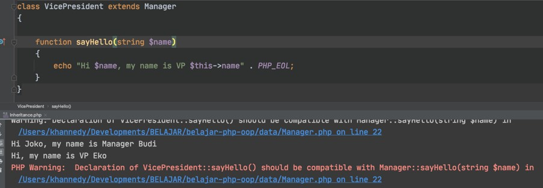

# PHP OOP

## Sebelum Belajar

- PHP Dasar
- <https://www.udemy.com/course/pemrograman-php-pemula-sampai-mahir/?referralCode=FB1EE79284AE417D17C5>

## Agenda

- Pengenalan Object Oriented Programming
- Class
- Inheritance, Polymorphism
- Interface, Trait
- Error
- Dan lain-lain

## #1 Pengenalan OOP

### Apa ite Object Oriented Programming

- Object Oriented Programming adalah sudut pandang bahasa pemrograman yang berkonsep `"objek"`
- Ada banyak sudut pandang bahasa pemrograman, namun OOP adalah yang sangat populer saat ini.
- Ada beberapa istilah yang perlu dimengerti dalam OOP, yaitu: Object dan Class

### Apa itu Object?

- Object adalah data yang berisi field / properties / attributes dan method / function / behavior

### Apa itu Class?

- Class adalah blueprint, prototype atau cetakan untuk membuat Object
- Class berisikan deklarasi semua properties dan functions yang dimiliki oleh Object
- Setiap Object selalu dibuat dari Class
- Dan sebuah Class bisa membuat Object tanpa batas

### Class dan Object: Person


### Class dan Object: Car


## #2 Class

- Untuk membuat class, kita bisa menggunakan kata kunci `class`
- Penamaan class biasa menggunakan format `CamelCase`

### Kode: Class

```php
<?php

class Person
{

}
```

## #3 Oject

### Membuat Object

- Object adalah hasil instansiasi dari sebuah class
- Untuk membuat object kita bisa menggunakan kata kunci new, dan diikuti dengan nama Class dan kurung `()`

### Kode: Object

```php
require_once "data/Person.php";

$person = new Person();
var_dump($person);
```

## #4 Properties

- Fields / Properties / Attributes adalah data yang bisa kita sisipkan di dalam Object
- Namun sebelum kita bisa memasukkan data di fields, kita harus mendeklarasikan data apa aja yang dimiliki object tersebut di dalam deklarasi class-nya
- Membuat field sama seperti membuat variable, namun ditempatkan di block class, namun diawali dengan kata kunci `var`

### Kode: Properties

```php
class Person
{
	var $name;
	var $address;
	var $country;
}
```

### Manipulasi Properties

- Fields yang ada di object, bisa kita manipulasi.
- Untuk memanipulasi data field, sama seperti cara pada variable
- Untuk mengakses field, kita butuh kata kunci `->` setelah nama object dan diikuti nama fields nya

### Kode: Manipulasi Properties

```php
$person = new Person();
$person->name = "Eko";
$person->address = "Subang";
$person->country = "Indonesia";

echo "Name: {$person->name}" . PHP_EOL;
echo "Address: {$person->address}" . PHP_EOL;
echo "Country: {$person->country}" . PHP_EOL;
```

### Properties Type Declaration

- Sama seperti di function, di properties pun, kita bisa membuat type declaration
- Ini membuat PHP otomatis mengecek tipe data yang sesuai dengan type declaration yang telah ditentukan
- Jika kita mencoba mengubah properties dengan type yang berbeda, maka otomatis akan error
- Ingat, bahwa PHP memiliki fitur type juggling, yang secara otomatis bisa mengkonversi ke tipe data lain
- Untuk menambahkan type declaration, kita bisa tambahkan setelah kata kunci `var` di properties

### Kode: Properties dengan Type

```php
class Person
{
	var string $name;
	var string $address;
	var string $country;
}
```

### Default Properties Value

- Sama seperti variable, di properties juga kita bisa langsung mengisi value nya
- Ini mirip seperti default value, jadi jika tidak diubah di object, maka properties akan memiliki value tersebut

### Kode: Properties Default Value

```php
class Person
{
	var string $name;
	var string $address;
	var string $country = "Indonesia";
}
```

### Nullable Properties

- Saat kita menambah type declaration di properties atau di function argument, maka secara otomatis kita tidak bisa mengirim data null ke dalam properties atau function argument tersebut
- Di PHP 7.4 dikenalkan nullable type, jadi kita bisa mengirim data null ke properties atau function arguments
- Caranya sebelum type declaration nya, kita bisa tambahkan tanda `?`

### Kode: Nullable Properties

```php
class Person
{
	var string $name;
	var ?string $address = null;
	var string $country = "Indonesia";
}
```

## #5 Function

- Selain menambahkan properties, kita juga bisa menambahkan function ke object
- Cara dengan mendeklarasikan function tersebut di dalam block class
- Sama seperti function biasanya, kita juga bisa menambahkan return value dan parameter
- Untuk mengakses function tersebut, kita bisa menggunakan tanda `->` dan diikuti dengan nama method nya. Sama seperti mengakses properties

### Kode: Function

```php
class Person
{
	var string $name;
	var string $address;
	var string $country;

	function sayHello(string $name)
	{
		echo "Hello $name" . PHP_EOL;
	}
}
```

### Kode: Memanggil Function

```php
$person = new Person();
$person->name = "Eko";
$person->address = "Subang";
$person->country = "Indonesia";

$person->sayHello("Budi");
```

## #6 this Keyword

- Saat kita membuat kode di dalam function di dalam class, kita bisa menggunakan kata kunci this untuk mengakses object saat ini
- Misal kadang kita butuh mengakses properties atau function lain di class yang sama

### Kode: This Keyword

```php
function sayHello(?string $name)
{
	if (is_null($name)) {
		echo "Hi, my name is {$this->name}" . PHP_EOL;
	} else {
		echo "Hello $name, my name is {$this->name}" . PHP_EOL;
	}
}
```

## #7 Constant

- Properties di class bisa diubah, mirip seperti variable
- Di class juga kita membuat constant, data yang tidak bisa diubah
- Di materi PHP Dasar, kita belajar untuk membuat constant itu perlu menggunakan function `define()`
- Namun sejak PHP 7.4, kita bisa menggunakan kata kunci `const` untuk membuat constant, mirip seperti variable, namun tidak menggunakan karakter `$`

### Kode: Constant

```php
define("APPLICATION", "Belajar php oop");
const APP_VERSION = "1.0.0";

echo APPLICATION . PHP_EOL;
echo APP_VERSION . PHP_EOL;
```

### Kode: Constant di Class

```php
class Person
{
	const AUTHOR = "Programmer Zaman Now";

	var string $name;
	var ?string $address = null;
	var string $country = "Indonesia";
}
```

### Kode: Mengakses Constant di Class

```php
define("APPLICATION", "Belajar php oop");
const APP_VERSION = "1.0.0";

echo APPLICATION . PHP_EOL;
echo APP_VERSION . PHP_EOL;

echo Person::AUTHOR . PHP_EOL;
```

## #8 self Keyword

### Properties vs Constant

- Saat kita membuat object, properties yang terdapat di class akan secara otomatis dibuat per object, oleh karena itu untuk mengakses properties, kita perlu menggunakan object, atau jika dari dalam object tersebut sendiri, kita perlu menggunakan kata kunci this
- Sedangkan berbeda dengan constant, constant di class tidak akan dibuat per object. Constant itu hidupnya di class, bukan di object, oleh karena itu untuk mengaksesnya kita perlu menggunakan `NamaClass::NAMA_CONSTANT`
- Secara sederhana, properties akan dibuat satu per instance class (object), sedangkan constant dibuat satu per class

### self Keyword

- Jika di dalam class (misal di function) kita ingin mengakses constant, kita perlu mengakses menggunakan `NamaClass::NAMA_CONSTANT`
- Namun jika di dalam class yang sama, kita bisa menggunakan kata kunci `self` untuk mempermudah

### Kode: self Keyword

```php
class Person
{
	const AUTHOR = "Programmer Zaman Now";

	function info()
	{
		echo "AUTHOR : " . self::AUTHOR . PHP_EOL;
	}
}
```

## #9 Constructor

- Saat kita membuat Object, maka kita seperti memanggil sebuah function, karena kita menggunakan kurung `()`
- Di dalam class PHP, kita bisa membuat constructor, constructor adalah function yang akan dipanggil saat pertama kali Object dibuat.
- Mirip seperti di function, kita bisa memberi parameter pada constructor
- Nama constructor di PHP haruslah `__construct()`

### Kode: Membuat Constructor

```php
class Person
{
	const AUTHOR = "Programmer Zaman Now";

	var string $name;
	var ?string $address = null;
	var string $country = "Indonesia";

	public function __construct(string $name, ?string $address)
	{
		$this->name = $name;
		$this->address = $address;
	}
}
```

### Kode: Menggunakan Constructor

```php
$person = new Person("Eko", "Subang");
$person->country = "Indonesia";

$person->sayHello("Budi");
$person->sayHello(null);
```

## #10 Destructor

- Jika constructor adalah function yang akan dipanggil ketika object dibuat
- Destructor adalah function yang akan dipanggil ketika object dihapus dari memory
- Biasanya ketika object tersebut sudah tidak lagi digunakan, atau ketika aplikasi akan mati
- Untuk membuat function destructor, kita bisa menggunakan nama function `__destruct()`
- Khusus untuk destructor, kita tidak boleh menambahkan function argument
- Dalam penggunaan sehari-hari, ini misal cocok untuk menutup koneksi ke database atau menutup proses menulis ke file, sehingga tidak terjadi memory leak

### Kode: Destructor

```php
function __destruct()
{
	echo "Object person {$this->name} is destroyed" . PHP_EOL;
}
```

## #11 Inheritance

- Inheritance atau pewarisan adalah kemampuan untuk menurunkan sebuah class ke class lain
- Dalam artian, kita bisa membuat class Parent dan class Child
- Class Child, hanya bisa punya satu class Parent, namun satu class Parent bisa punya banyak class Child
- Saat sebuah class diturunkan, maka semua properties dan function yang ada di class Parent, secara otomatis akan dimiliki oleh class Child
- Untuk melakukan pewarisan, di class Child, kita harus menggunakan kata kunci `extends` lalu diikuti dengan nama class parent nya.

### Kode: Inheritance

```php
class Manager
{
	var string $name;

	function sayHello(string $name)
	{
		echo "Hi $name, my name is $this->name" . PHP_EOL;
	}
}

class VicePresident extends Manager
{

}
```

### Kode: Mengakses Method Parent

```php
$manager = new Manager();
$manager->name = "Budi";
$manager->sayHello("Joko");

$vp = new VicePresident();
$vp->name = "EKo";
$vp->sayHello("Joko");
```

## #12 Namespace

- Saat kita membuat aplikasi, bisa dipastikan kita akan banyak sekali membuat class
- Jika class terlalu banyak, kadang akan menyulitkan kita untuk mencari atau mengklasifikasikan jenis-jenis class
- PHP memiliki fitur namespace, dimana kita bisa menyimpan class-class kita di dalam namespace
- Namespace bisa nested, dan jika kita ingin mengakses class yang terdapat di namespace, kita perlu menyebutkan nama namespace nya
- Namespace bagus ketika kita punya beberapa class yang sama, dengan menggunakan namespace nama class sama tidak akan menjadikan error di PHP

### Kode: Tanpa Namespace

```php
class Conflict
{

}

class Conflict
{

}
```

### Membuat Namespace

- Untuk membuat namespace, kita bisa menggunakan kata kunci `namespace`
- Jika kita ingin membuat sub namespace, kita cukup gunakan karakter `\` setelah namespace sebelumnya

### Kode: Membuat Namespace

```php
namespace Data\One
{
	class Conflict
	{

	}
}

namespace Data\Two
{
	class Conflict
	{

	}
}
```

### Kode: Membuat Object dari Namespace

```php
require_once "data/Conflict.php";

$conflict1 = new \Data\One\Conflict();
$conflict2 = new \Data\Two\Conflict();
```

### Function dan Constant di Namespace

- Selain class, kita juga menggunakan function dan constant di namespace
- Dan jika kita ingin menggunakan function atau constant tersebut, kita bisa menggunakannya dengan diawali dengan nama namespace nya

### Kode: Function dan Constant di Namespace

```php
namespace Helper
{
	function helpMe()
	{
		echo "HELP ME" . PHP_EOL;
	}

	const APPLICATION = "Belajar PHP OOP";
}
```

### Global Namespace

- Secara default saat kita membuat kode di PHP sebenarnya itu disimpan di global namespace
- Global namespace adalah namespace yang tidak memiliki nama namespace

### Kode: Global Namespace

```php
namespace
{
	echo "Hello Global Namespace" . PHP_EOL;
}
```

## #13 Import

### use Keyword

- Sebelumnya kita sudah tahu bahwa untuk menggunakan class, function atau constant di namespace kita perlu menyebutkan nama namespace nya di awal
- Jika terlalu sering menggunakan class, function atau constant yang sama, maka terlalu banyak duplikasi dengan menyebut namespace yang sama berkali-kali
- Hal ini bisa kita hindari dengan cara mengimport class, function atau constant tersebut dengan menggunakan kata kunci `use`

### Kode: use Keyword

```php
use Data\One\Conflict;
use function Helper\helpMe;
use const Helper\APPLICATION;

$conflict1 = new Conflict();
$conflict2 = new Conflict();

helpMe();
echo APPLICATION . PHP_EOL;
```

### Alias

- Saat kita menggunakan use, artinya kita tidak perlu lagi menggunakan nama namespace diawal class ketika kita ingin membuat class tersebut
- Namun bagaimana jika kita ternyata nama class nya sama?
- Untungnya PHP memiliki fitur yang namanya alias
- Alias adalah kemampuan membuat nama lain dari class, function atau constant yang ada
- Kita bisa menggunakan kata kunci `as` setelah melakukan `use`

### Kode: Alias

```php
use Data\One\Conflict as Conflict1;
use Data\Two\Conflict as Conflict2;
use function Helper\helpMe as help;
use const Helper\APPLICATION as APP;

$conflict1 = new Conflict1();
$conflict2 = new Conflict2();

helpMe();
echo APPLICATION . PHP_EOL;
```

### Group use Declaration

- Kadang kita butuh melakukan import banyak hal di satu namespace yang sama
- PHP memiliki fitur grup use, dimana kita bisa import beberapa class, function atau constant dalam satu perintah `use`
- Untuk melakukan itu, kita bisa menggunakan kurung `{ }`

### Kode: Group use Declaration

```php
use Data\One\{Conflict as Conflict1, Conflict as Conflict2};
use function Helper\{helpMe as help};
use const Helper\{APPLICATION as APP};

$conflict1 = new Conflict1();
$conflict2 = new Conflict2();

helpMe();
echo APPLICATION . PHP_EOL;
```

## #14 Visiblity

- Visibility / Access modifier adalah kemampuan properties, function dan constant dapat diakses dari mana saja
- Secara default, properties, function dan constant yang kita buat di dalam class bisa diakses dari mana saja, atau artinya dia adalah `public`
- Selain public, masih ada beberapa visibility lainnya
- Secara default kata kunci `var` untuk properties adalah sifatnya `public`

### Access Level

| Modifier  | Class | Subclass | World |
| --------- | ----- | -------- | ----- |
| public    | Y     | Y        | Y     |
| protected | Y     | Y        | N     |
| private   | Y     | N        | N     |

### Kode: Class Product

```php
class Product
{
	private string $name;
	private int $price;

	public function __construct(string $name, int $price)
	{
		$this->name = $name;
		$this->price = $price;
	}
	public function getName(): string
	{
		return $this->name;
	}
}
```

### Kode: Menggunakan Product

```php
require_once 'data/Product.php';

use Data\Product;

$product = new Product() . PHP_EOL;

echo $product->getName() . PHP_EOL;

$product->name = 'Orange'; // error
$product->price = 2000; // error
```

## #15 Function Overriding

- Function overriding adalah kemampuan mendeklarasikan ulang function di child class, yang sudah ada di parent class
- Saat kita melakukan proses overriding tersebut, secara otomatis ketika kita membuat object dari class child, function yang di class parent tidak bisa diakses lagi

### Kode: Method Overriding

```php
class Manager
{
	var string $name;

	function sayHello(string $name)
	{
		echo "Hi $name, my name is Manager $this->name" . PHP_EOL;
	}
}

class VicePresident extends Manager
{
	function sayHello(string $name)
	{
		echo "Hi $name, my name is VP $this->name" . PHP_EOL;
	}
}
```

## Kode: Mengakses Function Overriding

```php
$manager = new Manager();
$manager->name = "Budi";
$manager->sayHello("Joko");

$vp = new VicePresident();
$vp->name = "Eko";
$vp->sayHello("Joko");
```

## #16 parent Keyword

- Kadang kita ingin mengakses function yang terdapat di class parent yang sudah terlanjur kita override di class child
- Untuk mengakses function milik class parent, kita bisa menggunakan kata kunci `parent`
- Sederhananya, parent digunakan untuk mengakses class parent

### Kode: Parent Keyword

```php
namespace Data;

class Shape
{
	function getCorner(): int
	{
		return 0;
	}
}

class Rectangle extends Shape
{
	public function getCorner(): int
	{
		 return 4;
	}

	public function getParentCorner(): int
	{
		return parent::getCorner();
	}
}
```

## #17 Constructor Overriding

- Karena constructor sama seperti function, maka constructor-pun bisa kita deklarasikan ulang di class Child nya
- Sebenarnya di PHP, kita bisa meng-override function dengan arguments yang berbeda, namun sangat tidak disarankan
- Jika kita melakukan override function dengan arguments berbeda, maka PHP akan menampilkan WARNING
- Namun berbeda dengan constructor overriding, kita boleh meng-override dengan mengubah arguments nya, namun direkomendasikan untuk memanggil parent constructor

### Kode: Merubah Arguments Overriding

```php
class VicePresident extends Manager
{
	function sayHello(string $name)
	{
		echo "Hi $name, my name is VP $this->name" . PHP_EOL;
	}
}
```



### Kode: Constructor Overriding (1)

```php
class Manager
{
	var string $name;
	var string $title;

	public function __construct(string $name, string $title = "Manager")
	{
		$this->name = $name;
		$this->title = $title;
	}
}
```

### Kode: Constructor Overriding (2)

```php
class VicePresident extends Manager
{
	public function __construct(string $name)
	{
		parent::__construct($name, "VP");
	}
}
```

## #18 Polymorphism

- Polymorphism berasal dari bahasa Yunani yang berarti banyak bentuk.
- Dalam OOP, Polymorphism adalah kemampuan sebuah object berubah bentuk menjadi bentuk lain
- Polymorphism erat hubungannya dengan Inheritance

### Kode: Inheritance

```php
class Programmer
{
	public string $name;

	public function __construct(string $name)
	{
		$this->name = $name;
	}
}

class BackendProgrammer extends Programmer {}
class FrontendProgrammer extends Programmer {}
```

### Kode: Polymorphism

```php
class Company
{
	var Programmer $programmer;
}

$company = new Company();
$company->programmer = new Programmer("Eko");
$company->programmer = new BackendProgrammer("Eko");
$company->programmer = new FrontendProgrammer("Eko");
```

### Kode: Function Argument Polymorphism

```php
function sayHello(Programmer $programmer)
{
	echo "Hello $programmer->name" . PHP_EOL;
}

sayHello(new Programmer("Eko"));
sayHello(new BackendProgrammer("Eko"));
sayHello(new FrontendProgrammer("Eko"));
```

## #19 Type Check & Casts

- Sebelumnya kita sudah tau cara melakukan konversi tipe data bukan class
- Khusus untuk tipe data object, kita tidak perlu melakukan konversi secara eksplisit
- Namun agar aman, sebelum melakukan casts, pastikan kita melakukan type check (pengecekan tipe data), dengan menggunakan kata kunci `instanceof`
- Hasil operator instanceof adalah `boolean`, `true` jika tipe data sesuai, `false` jika tidak sesuai

### Kode: Type Check & Casts

```php
function sayHello(Programmer $programmer)
{
	if ($programmer instanceof BackendProgrammer) {
		echo "Hello Backend Programmer $programmer->name" . PHP_EOL;
	} else if ($programmer instanceof FrontendProgrammer) {
		echo "Hello Frontend Programmer $programmer->name" . PHP_EOL;
	} else if ($programmer instanceof Programmer) {
		echo "Hello Programmer $programmer->name" . PHP_EOL;
	}
}
```

## #20 Abstract Class

- Saat kita membuat class, kita bisa menjadikan sebuah class sebagai abstract class.
- Abstract class artinya, class tersebut tidak bisa dibuat sebagai object secara langsung, hanya bisa diturunkan
- Untuk membuat sebuah class menjadi abstract, kita bisa menggunakan kata kunci `abstract` sebelum kata kunci `class`
- Sehingga Abstract Class bisa kita gunakan sebagai kontrak child class

### Kode: Abstract Class

```php
namespace Data;

abstract class Location
{
	public string $name;
}

class City extends Location
{

}
```

### Kode: Membuat Abstract Class

```php
require_once "data/Location.php";

use Data\{Location, City};

$location = new Location(); // error
$city = new City();
```

## #21 Abstract Function

- Saat kita membuat class yang abstract, kita bisa membuat abstract function juga di dalam class abstract tersebut
- Saat kita membuat sebuah abstract function, kita tidak boleh membuat block function untuk function tersebut
- Artinya, abstract function wajib di override di class child
- Abstract function tidak boleh memiliki access modifier private

### Kode: Abstract Function

```php
namespace Data;

abstract class Animal
{
	public string $name;

	public abstract function $run();
}

class Cat extends Animal
{
	public function run()
	{
		echo "Cat $this->name is running" . PHP_EOL;
	}
}
```

### Kode: Menggunakan Abstract Function

```php
require_once "data/Animal.php";

use Data\Cat;

$cat = new Cat();
$cat->name = "Luna";
$cat->run();
```

## #21 Getter dan Setter

### Encapsulation

- Encapsulation artinya memastikan data sensitif sebuah object tersembunyi dari akses luar
- Hal ini bertujuan agar kita bisa menjaga agar data sebuah object tetap baik dan valid
- Untuk mencapai ini, biasanya kita akan membuat semua properties menggunakan access modifier `private`, sehingga tidak bisa diakses atau diubah dari luar
- Agar bisa diubah, kita akan menyediakan function untuk mengubah dan mendapatkan properties tersebut

### Getter dan Setter

- Di PHP, proses encapsulation sudah dibuat standarisasinya, dimana kita bisa menggunakan Getter dan Setter method.
- `Getter` adalah function yang dibuat untuk mengambil data field
- `Setter` ada function untuk mengubah data field

### Getter dan Setter Method

| Tipe Data | Getter Method      | Setter Method          |
| --------- | ------------------ | ---------------------- |
| `boolean` | isXxx(): bool      | setXxx(bool value)     |
| `lainnya` | getXxx(): tipeData | setXxx(tipeData value) |

### Kode: Getter dan Setter

```php
class Company
{
	private string $name;
	private bool $expensive;

	public function getName(): string
	{
		return $this->name;
	}

	public function setName(string $name): void
	{
		$this->name = $name;
	}

	public function isExpensive(): bool
	{
		return $this->expensive;
	}

	public function setExpensive(bool $expensive): void
	{
		$this->expensive = $expensive;
	}
}
```

### Kode: Menggunakan Getter dan Setter

```php
require_once "data/Category.php";

use Data\Category;

$category = new Category();
$category->setName("Handphone");
$category->setExpensive(true);

echo "Name : {$category->getName()}" . PHP_EOL;
echo "Expensive : {$category->isExpensive()}" . PHP_EOL;
```

### Kode: Validation di Setter

```php
public function setName(string $name): void
{
	if (trim($name) != "") {
		$this->name = $name;
	}
}
```

## 22 Interface

- Sebelumnya kita sudah tahu bahwa abstract class bisa kita gunakan sebagai kontrak untuk class child nya.
- Namun sebenarnya yang lebih tepat untuk kontrak adalah Interface
- Jangan salah sangka bahwa Interface disini bukanlah User Interface
- Interface mirip seperti abstract class, yang membedakan adalah di Interface, semua method otomatis abstract, tidak memiliki block
- Di interface kita tidak boleh memiliki properties, kita hanya boleh memiliki constant
- Untuk mewariskan interface, kita tidak menggunakan kata kunci `extends`, melainkan `implements`
- Dan berbeda dengan class, kita bisa implements lebih dari satu interface

### Kode: Membuat Interface

```php
namespace Data;

interface Car
{
	function drive(): void;

	function getTire(): int;
}
```

### Kode: Implement Interface

```php
class Avanza implements Car
{
	function drive(): void
	{
		echo "Drive Avanza" . PHP_EOL;
	}

	function getTire(): int
	{
		return 4;
	}
}
```

## #23 Interface Inheritance

- Sebelumnya kita sudah tahu kalo di PHP, child class hanya bisa punya 1 class parent
- Namun berbeda dengan interface, sebuah child class bisa implement lebih dari 1 interface
- Bahkan interface pun bisa implement interface lain, bisa lebih dari 1. Namun jika interface ingin mewarisi interface lain, kita menggunakan kata kunci `extends`, bukan `implements`

### Kode: Interface Inheritance

```php
interface HasBrand
{
	function getBrand(): string;
}

interface IsMaintenance
{
	function isMaintenance(): bool;
}

interface Car extends HasBrand
{

}
```

### Kode: Multiple Interface Inheritance

```php
class Avanza implements Car, IsMaintenance
{
	function getBrand(): string
	{
		return "Toyota";
	}

	function isMaintenance(): bool
	{
		return false;
	}

	function drive(): void
	{

	}
}
```

## #24 Trait

- Selain class dan interface, di PHP terdapat feature lain bernama `trait`
- Trait mirip dengan abstract class, kita bisa membuat konkrit function atau abstract function
- Yang membedakan adalah, di trait bisa kita tambahkan ke dalam class lebih dari satu
- Trait mirip seperti ekstension, dimana kita bisa menambahkan konkrit function ke dalam class dengan trait
- Secara sederhana trait adalah digunakan untuk menyimpan function-function yang bisa digunakan ulang di beberapa class
- Untuk menggunakan trait di class, kita bisa menggunakan kata kunci `use`

### Kode: Membuat Trait

```php
namespace Data;

trait SayGoodBye
{
	function goodBye(?string $name): void
	{
		if (is_null($name)) {
			echo "Good bye" . PHP_EOL;
		} else {
			echo "Good bye $name" . PHP_EOL;
		}
	}
}
```

### Kode: Menggunakan Trait

```php
class Person
{
	use SayGoodBye, SayHello;
}
```

### Trait Properties

- Berbeda dengan interface, di trait, kita bisa menambahkan properties
- Dengan menambahkan properties, secara otomatis class tersebut akan memiliki properties yang ada di trait

### Kode: Trait Properties

```php
trait HasName
{
	public string $name;
}

class Person
{
	use SayGoodBye, SayHello, HasName;
}
```

### Kode: Menggunakan Trait Properties

```php
require_once "data/SayGoodBye.php";

use Data\Person;

$person = new Person();
$person->name = "Eko";
echo $person->name . PHP_EOL;
```

## #25 Trait Overriding

### Trait Abstract Function

- Selain konkrit function, di trait juga kita bisa menambahkan abstract function
- Jika terdapat abstract function di trait, maka secara otomatis function tersebut harus di override di class yang menggunakan trait tersebut

### Kode: Trait Abstract Function

```php
trait CanRun
{
	public abstract function run(): void;
}

class Person
{
	use SayGoodBye, SayHello, HasName, CanRun;

	public function run(): void
	{
		echo "Person {$this->name} is running" . PHP_EOL;
	}
}
```

### Trait Overriding

- Jika sebuah class memiliki parent class yang memiliki function yang sama dengan function di trait, maka secara otomatis trait akan meng-override function tersebut
- Namun jika kita membuat function yang sama di class nya, maka secara otomatis kita akan meng-override function di trait
- Sehingga posisinya seperti ini ParentClass `=override by=>` Trait `=override by=>` ChildClass

### Kode: Override Trait

```php
class Person
{
	use SayGoodBye, SayHello;

	function goodBye(?string $name): void
	{
		echo "Override trait SayGoodBye" . PHP_EOL;
	}

	function hello(?string $name): void
	{
		echo "Override trait SayHello" . PHP_EOL;
	}
}
```

### Trait Visibility Override

- Selain melakukan override function di class, kita juga bisa melakukan override visibility function yang terdapat di trait
- Namun untuk melakukan ini tidak perlu membuat function baru di class, kita bisa gunakan secara sederhana ketika menggunakan trait nya

### Kode: Trait Visibility Override

```php
class Person
{
	use SayGoodBye, SayHello, HasName, CanRun {
		hello as private;
		goodBye as private;
	}
}
```

## #26 Trait Conflict

- Jika kita menggunakan lebih dari satu trait, lalu terdapat function yang sama di trait tersebut
- Maka hal tersebut akan menyebabkan konflik
- Jika terjadi konflik seperti ini, kita bisa mengatasinya dengan menggunakan kata kunci `insteadof`

### Kode: Trait Conflict (1)

```php
trait A
{
	function doA()
	{
		echo "a" . PHP_EOL;
	}

	function doB()
	{
		echo "b" . PHP_EOL;
	}
}

trait B
{
	function doA()
	{
		echo "a" . PHP_EOL;
	}

	function doB()
	{
		echo "b" . PHP_EOL;
	}
}
```

### Kode: Trait Conflict (2)

```php
class TraitConflict
{
	use A, B {
		A::doA insteadof B;
		B::doB insteadof A;
	}
}

$sample = new TraitConflict();
$sample->doA();
$sample->doB();
```

## #27 Trait Inheritance

- Sebelumnya kita sudah tahu bahwa class bisa menggunakan trait lebih dari satu
- Lantas bagaimana dengan trait yang menggunakan trait lain?
- Trait bisa menggunakan trait lain, mirip seperti interface yang bisa implement interface lain
- Untuk menggunakan trait lain dari trait, penggunaannya sama seperti dengan penggunaan trait di class

### Kode: Trait Inheritance

```php
trait All {
	use SayGoodBye, SayHello, HasName, CanRun;
}

class Person {
	use All;
}
```

## #28 Final Class

- Kata kunci `final` bisa digunakan di class, dimana jika kita menggunakan kata kunci `final` sebelum class, maka kita menandakan bahwa class tersebut tidak bisa diwariskan lagi
- Secara otomatis semua class child nya akan error

### Kode: Final Class

```php
class SocialMedia
{
	public string $name;
}

final class Facebook extends SocialMedia
{

}

// error
class FakeFacebook extends Facebook {

}
```

## #29 Final Function

- Kata kunci final juga bisa digunakan di function
- Jika sebuah function kita tambahkan kata kunci `final`, maka artinya function tersebut tidak bisa di override lagi di class child nya
- Ini sangat cocok jika kita ingin mengunci implementasi dari sebuah method agar tidak bisa diubah lagi oleh class child nya

### Kode: Final Method

```php
class Facabook extends SocialMedia
{
	final public function login(string $username, string $password): void
	{

	}

}
class FakeFacebook extends Facebook
{
	// error
	public function login(string $username, string $password): void
	{

	}
}
```

## #30 Anonymous Class

- Anonymous class atau class tanpa nama.
- Adalah kemampuan mendeklarasikan class, sekaligus meng-instansiasi object-nya secara langsung
- Anonymous class sangat cocok ketika kita berhadapan dengan kasus membuat implementasi interface atau abstract class sederhana, tanpa harus membuat implementasi class nya

### Kode: Anonymous Class

```php
interface HelloWorld
{
	function sayHello(): void;
}

$helloWorld = new class implements HelloWorld {

	function sayHello(): void
	{
		echo "Hello Anonymous Class" . PHP_EOL;
	}
};

$helloWorld->sayHello();
```

### Constructor di Anonymous Class

- Anonymous class juga mendukung constructor
- Jadi kita bisa menambahkan constructor jika kita mau

### Kode: Constructor di Anonymous Class

```php
$helloWorld = new class("Anonymous Class") implements HelloWorld {

	private string $name;

	public function __construct(string $name)
	{
		$this->name = $name;
	}

	function sayHello(): void
	{
		echo "Hello $this->name" . PHP_EOL;
	}
};
```

## #31 static Keyword

- Kata kunci `static` adalah keyword yang bisa kita gunakan untuk membuat properties atau function di class bisa diakses secara langsung tanpa menginstansiasi class terlebih dahulu
- Namun ingat, saat kita buat static properties atau function, secara otomatis hal itu tidak akan berhubungan lagi dengan class instance yang kita buat
- Untuk cara mengakses static properties dan function sama seperti mengakses constant, kita bisa menggunakan operator `::`
- static function tidak bisa mengakses function biasa, karena function biasa menempel pada class instance sedangkan static function tidak

### Kode: Static Properties

```php
class MathHelper
{
	static public string $name = "MathHelper";
}

echo MathHelper::$name . PHP_EOL;
```

### Kode: Static Function

```php
static public function sum(int ...$numbers): int
{
	$total = 0;
	foreach ($numbers as $number) {
		$total += $number;
	}
	return $total;
}

$total = MathHelper::sum(10, 10, 10, 10, 10);
echo "Total $total" . PHP_EOL;
```

## #32 stdClass

- `stdClass` adalah class kosong bawaan dari PHP
- `stdClass` biasanya digunakan ketika kita melakukan konversi dari tipe lain menjadi tipe object
- `stdClass` sangat berguna ketika misal kita ingin melakukan konversi dari tipe data array ke object secara otomatis

### Kode: Konversi Array ke stdClass

```php
$array = [
	'firstName' => 'Eko',
	'middleName' => 'Kurniawan',
	'lastName' => 'Khannedy',
];

$object = (object)$array;

var_dump($object);

echo $object->firstName . PHP_EOL;
echo $object->middleName . PHP_EOL;
echo $object->lastName . PHP_EOL;
```

## #33 Object Iteration

- Saat kita membuat object dari sebuah class, kita bisa melakukan iterasi ke semua properties yang terdapat di object tersebut menggunakan `foreach`
- Hal ini mempermudah kita saat ingin mengakses semua properties yang ada di object
- Secara default, hanya properties yang public yang bisa diakses oleh `foreach`

### Kode: Object Iteration

```php
class Data
{
	var string $first = "First";
	public string $second = "Second";
	private string $third = "Third";
	protected string $forth = "Forth";
}

$data = new Data();

foreach ($data as $key => $value) {
	echo "$key : $value" . PHP_EOL;
}
```

### Iterator

- Sebelumnya kita melakukan iterasi data di properties secara otomatis menggunakan `foreach`
- Jika kita ingin menangani hal ini secara manual, kita bisa menggunakan Iterator
- Iterator adalah interface yang digunakan untuk melakukan iterasi, namun membuat Iterator secara manual lumayan cukup ribet, oleh karena itu sekarang kita akan gunakan ArrayIterator, yaitu iterator yang menggunakan `array` sebagai data iterasi nya
- Dan agar class kita bisa di iterasi secara manual, kita bisa menggunakan interface `IteratorAggregate`, disana kita hanya butuh meng-override function `getIterator()` yang mengembalikan data Iterator

### Kode: Iterator

```php
class Data implements IteratorAggregate
{
	var string $first = "First";
	public string $second = "Second";
	private string $third = "Third";
	protected string $forth = "Forth";

	public function getIterator()
	{
		return new ArrayIterator([
			'first' => $this->first,
			'second' => $this->second,
			'third' => $this->third,
			'forth' => $this->forth,
		]);
	}
}
```

## #34 Generator

- Sebelumnya kita tahu bahwa untuk membuat object yang bisa di iterasi, kita menggunakan Iterator
- Namun pembuatan Iterator secara manual sangatlah ribet
- Untungnya di PHP, terdapat fitur generator, yang bisa kita gunakan untuk membuat Iterator secara otomatis hanya dengan menggunakan kata kunci `yield`

### Kode: Generator

```php
function getGanjil(int $max): Iterator
{
	for ($i = 0; $i <= $max; $i++) {
		if ($i % 2 == 1) {
			yield $i;
		}
	}
}

$ganjil = getGanjil(100);
foreach ($ganjil as $value) {
	echo "Ganjil $value" . PHP_EOL;
}
```

## #35 Object Cloning

- Kadang kita ada kebutuhan untuk menduplikasi sebuah object
- Biasanya untuk melakukan hal ini, kita bisa membuat object baru, lalu menyalin semua properties di object awal ke object baru
- Untungnya PHP mendukung object cloning
- Kita bisa menggunakan perintah clone untuk membuat duplikasi object
- Secara otomatis semua properties di object awal akan di duplikasi ke object baru

### Kode: Object Cloning

```php
$student1 = new Student();
$student1->id = "1";
$student1->name = "Eko";
$student1->value = 100;

$student2 = clone $student1;

var_dump($student1);
var_dump($student2);
```

### `__clone()` Function

- Kadang menyalin semua properties bukanlah yang kita inginkan
- Misal saja kita hanya ingin menyalin beberapa properties saja, tidak ingin semuanya
- Jika kita ingin memodifikasi cara PHP melakukan clone, kita bisa membuat function di dalam class nya dengan nama function `__clone()`
- Function `__clone()` akan dipanggil di object hasil duplikasi setelah proses duplikasi selesai
- Jadi jika kita ingin menghapus beberapa properties, bisa kita lakukan di function `__clone()`

### Kode: `__clone()` Function

```php
class Student
{
	public string $id;
	public string $name;
	public int $value;

	public function __clone()
	{
		unset($this->value);
	}
}
```

## #36 Comparing Object

- Sama seperti tipe data yang lain, untuk membandingkan dua buah object, kita bisa menggunakan operator `==` (equals) dan `===` (identity)
- Operator `==` (equals) membandingkan semua properties yang terdapat di object tersebut, dan tiap properties juga akan dibandingkan menggunakan operator `==` (equals)
- Sedangkan operator `===` (identity), maka akan membandingkan apakah object identik, artinya mengacu ke object yang sama

### Kode: Comparing Object

```php
$student1 = new Student();
$student1->id = "1";
$student1->name = "Eko";
$student1->value = 100;

$student2 = new Student();
$student2->id = "2";
$student2->name = "Eko";
$student2->value = 100;

var_dump($student1 == $student2);
var_dump($student1 === $student2);
```

## #37 Magic Function

- Magic function adalah function-function yang sudah ditentukan kegunaannya di PHP
- Kita tidak bisa membuat function tersebut, kecuali memang sudah ditentukan kegunaannya
- Sebelumnya kita sudah membahas beberapa magic function, seperti `__construct()` sebagai constructor, `__destruct()` sebagai destructor, dan `__clone()` sebagai object cloning
- Masih banyak magic function lainnya, kita bisa melihatnya di link berikut : <https://www.php.net/manual/en/language.oop5.magic.php>

### `__toString()` Function

- `__toString()` function merupakan salah satu magic function yang digunakan sebagai representasi string sebuah object
- Jika misal kita ingin membuat string dari object kita, kita bisa membuat function `__toString()`

### Kode: `__toString()` Function

```php
class Student
{
	public string $id;
	public string $name;
	public int $value;

	public function __toString(): string
	{
		return "Student id:$this->id, name:$this->name, value:$this->value". PHP_EOL;
	}
}
```

### `__invoke()` Function

- `__invoke()` merupakan function yang dieksekusi ketika object yang kita buat dianggap sebagai function
- Misal ketika kita membuat object $student, lalu kita melakukan `$student()`, maka secara otomatis function `\_\_invoke()` yang akan dieksekusi

### Kode: `__invoke()` Function

```php
class Student
{
	public string $id;
	public string $name;
	public int $value;

	public function __invoke(...$arguments)
	{
		$join = join(",", $arguments);
		echo "Invoke Student with arguments $join" . PHP_EOL;
	}
}
```

### `__debugInfo()` Function

- Sebelumnya kita sering melakukan debug variable menggunakan function `var_dump()`
- Function `var_dump()` sebenarnya memanggil function `__debugInfo()`
- Jika kita ingin mengubah isi dari debug info, kita bisa membuat function `__debugInfo()`

### Kode: `__debugInfo()` Function

```php
class Student
{
	public string $id;
	public string $name;
	public int $value;

	public function __debugInfo(): array
	{
		return [
			'id' => $this->id,
			'name' => $this->name,
			'value' => $this->value,
			'author' => "Eko Kurniawan Khannedy",
		];
	}
}
```

### Dan masih banyak lagi

- <https://www.php.net/manual/en/language.oop5.magic.php>

## #38 Overloading

- Overloading adalah kemampuan secara dinamis membuat properties atau function
- Ini mirip meta programming di bahasa pemrograman lain seperti Ruby
- Namun ini berbeda dengan function overloading di bahasa pemrograman lain seperti Java
- Overloading ini erat kaitannya dengan magic function yang sebelumnya sudah kita bahas

### Properties Overloading

- Saat kita mengakses properties, maka secara otomatis properties akan diakses
- Namun jika ternyata properties tersebut tidak tersedia di objectnya, maka PHP tidak secara otomatis menjadikan itu error
- PHP akan melakukan fallback ke magic function
- Dengan demikian kita bisa membuat properties secara dinamis dengan memanfaatkan magic function tersebut
- Ada beberapa magic function yang bisa kita gunakan untuk properties overloading

### Magic Function untuk Properties Overloading

| Magic Function               | Keterangan                                                                         |
| ---------------------------- | ---------------------------------------------------------------------------------- |
| `__set($name, $value): void` | Dieksekusi ketika mengubah properties yang tidak tersedia                          |
| `__get($name): mixed`        | Dieksekusi ketika mengakses properties yang tidak tersedia                         |
| `__isset($name): bool`       | Dieksekusi ketika mengecek `isset()` atau `empty()` properties yang tidak tersedia |
| `__unset($name): void`       | Dieksekusi ketika menggunakan `unset()` properties yang tidak tersedia             |

### Kode: Properties Overloading

```php
class Zero
{
	private array $properties = [];

	public function __get($name)
	{
		return $this->properties[$name];
	}

	public function __set($name, $value)
	{
		$this->properties[$name] = $value;
	}

	public function __isset($name)
	{
		return isset($this->properties[$name]);
	}

	public function __unset($name)
	{
		unset($this->properties[$name]);
	}
}
```

### Function Overriding

- Saat kita mengakses function, maka secara otomatis function akan diakses
- Namun jika ternyata function tersebut tidak tersedia di objectnya, maka PHP tidak secara otomatis menjadikan itu error
- PHP akan melakukan fallback ke magic function
- Dengan demikian kita bisa membuat function secara dinamis dengan memanfaatkan magic function tersebut
- Ada beberapa magic function yang bisa kita gunakan untuk function overloading

### Magic Function untuk Function Overloading

| Magic Function                                  | Keterangan                                                      |
| ----------------------------------------------- | --------------------------------------------------------------- |
| `__call($name, $arguments): mixed`              | Dieksekusi ketika memanggil function yang tidak tersedia        |
| `static __callStatic($name, $arguments): mixed` | Dieksekusi ketika memanggil static function yang tidak tersedia |

### Kode: Function Overloading

```php
class Zero
{
	public function __call($name, $arguments)
	{
		$join = join(",", $arguments);
		echo "Call function $name with $arguments $join" . PHP_EOL;
	}

	public static function __callStatic($name, $arguments)
	{
		$join = join(",", $arguments);
		echo "Call static function $name with $arguments $join" . PHP_EOL;
	}
}
```

## #39 Covariance dan Contravariance

### Covariance

- Saat kita meng override function dari parent class, biasanya di child class kita akan membuat function yang sama dengan function yang di parent
- Covariance memungkinkan kita meng override return function yang di parent dengan return value yang lebih spesifik

### Kode: Inheritance

```php
namespace Data;

abstract class Animal {}

class Cat extends Animal {}

class Dog extends Animal {}
```

### Kode: Covariance

```php
interface AnimalShelter
{
	function adopt(string $name): Animal;
}

class DogShelter implements AnimalShelter
{
	function adopt(string $name): Dog
	{
		$dog = new Dot();
		$dog->name = $name;
		return $dog;
	}
}

class CatShelter implements AnimalShelter
{
	function adopt(string $name): Cat
	{
		$cat = new Cat();
		$cat->name = $name;
		return $cat;
	}
}
```

### Contravariance

- Sedangkan contravariance adalah memperbolehkan sebuah child class untuk membuat function argument yang lebih tidak spesifik dibandingkan parent nya

### Kode: Inheritance

```php
class Food
{

}

class AnimalFood extends Food
{

}
```

### Kode: Contravariance (1)

```php
abstract class Animal
{
	public string $name;

	public abstract function run();

	public abstract function eat(AnimalFood $food);
}
```

### Kode: Contravariance (2)

```php
class Cat extends Animal
{
	public function run()
	{
		echo "Cat $this->name is running" . PHP_EOL;
	}

	public function eat(Food $food)
	{
		echo "Cat eat " . get_class($food) . PHP_EOL;
	}
}

class Gog extends Animal
{
	public function run()
	{
		echo "Gog $this->name is running" . PHP_EOL;
	}

	public function eat(Food $food)
	{
		echo "Gog eat " . get_class($food) . PHP_EOL;
	}
}
```

## #40 DateTime

- Biasanya dalam bahasa pemrograman sudah disediakan cara untuk memanipulasi data waktu, termasuk di PHP
- Di PHP, kita bisa menggunakan class `DateTime` untuk memanipulasi data waktu
- Ada banyak sekali function di class `DateTime` yang bisa kita gunakan untuk memanipulasi data waktu

### DateTime Function

| DateTime Function                  | Keterangan                       |
| ---------------------------------- | -------------------------------- |
| `setTime($hour, $minute, $second)` | Mengubah waktu DateTime          |
| `setDate($year, $month, $day)`     | Mengubah tanggal DateTime        |
| `setTimestamp($unixTimestamp)`     | Mengubah unix timestamp DateTime |

### Kode: DateTime

```php
$date = new DateTime();
$date->setDate(2020, 12, 30);
$date->setTime(12, 12, 12);

var_dump($date);
```

### DateInterval

- Kadang kita hanya ingin memanipulasi waktu dan tanggal sebagian saja, misal hanya menambah 1 tahun, atau mengurai beberapa hari
- Hal ini bisa dilakukan dengan function `add` milik `DateTime`
- Namun function `add` tersebut menerima parameter berupa `DateInterval`
- Saat menggunakan DateInterval duration, kita perlu menentukan berapa banyak kita menambah interval
- Kita bisa lihat detailnya disini : <https://www.php.net/manual/en/dateinterval.construct.php>
- Untuk pembuatan duration, harus diawali dengan karakter `P` yang artinya period

### Kode: DateInterval

```php
$date = new DateTime();
$date->setDate(2020, 12, 30);
$date->setTime(12, 12, 12);

$date->add(new DateInterval("P1Y"));

$dateInterval = new DateInterval("P1M");
$dateInterval->invert = 1;

$date->add($dateInterval);

var_dump($date);
```

### DateTimeZone

- Saat kita membuat object DateTime, dia akan secara otomatis membuat waktu saat ini sesuai dengan timezone yang di setting di konfigurasi `date.timezone` di file `php.ini`
- Atau kita bisa menggunakan function `setTimeZone` untuk mengubah timezone DateTime

### Kode: DateTimeZone

```php
$date = new DateTime();
$date->setTimezone(new DateTimeZone("Asia/Jakarta"));

var_dump($date);
```

### Format DateTime

- Kadang kita ingin membuat representasi string dari DateTime yang sudah kita buat
- Hal ini bisa kita lakukan menggunakan function `format()`
- Function `format()` menerima argument berupa format string, ini bisa kita gunakan untuk memanipulasi cara kita menampilkan string format waktu
- Untuk detailnya kita bisa lihat di halaman dokumentasi resminya
- <https://www.php.net/manual/en/datetime.format.php>

### Kode: Format DateTime

```php
$date = new DateTime();
$date->setTimezone(new DateTimeZone("Asia/Jakarta"));

echo $date->format("Y-m-d H:i:s") . PHP_EOL;
```

### Parse DateTime

- Selain format DateTime menjadi string, di PHP juga kita bisa melakukan hal sebaliknya, yaitu memparsing string menjadi DateTime sesuai dengan format yang kita mau
  0 Untuk melakukan itu, kita bisa menggunakan static function `createFromFormat()` dari class `DateTime`

### Kode: Parse DateTime

```php
$date = DateTime::createFromFormat("Y-m-d H:i:s", "1998-12-29 10:10:10", new DateTimeZone("Asia/Jakarta"));

var_dump($date);
```

## #41 Exception

- Saat kita membuat aplikasi, kita tidak akan terhindar dengan yang namanya error
- Di PHP, error direpresentasikan dengan istilah exception, dan semua direpresentasikan dalam bentuk class exception
- Kita bisa menggunakan class exception sendiri, atau menggunakan yang sudah disediakan oleh PHP
- Jika kita ingin membuat exception, maka kita harus membuat class yang implement interface `Throwable` atau turunan-turunannya

### Kode: Membuat Class Exception

```php
class ValidationException extends Exception
{

}
```

### Membuat Exception

- Exception biasanya terjadi di function
- Di dalam kode program kita, untuk membuat exception kita cukup menggunakan kata kunci `throw`, diikuti dengan object exception nya

### Kode: Membuat Exception

```php
function validateLoginRequest(LoginRequest $loginRequest)
{
	if (!isset($loginRequest->username)) {
		throw new ValidationException("Username is null");
	} else if (!isset($loginRequest->password)) {
		throw new ValidationException("Password is null");
	} else if ($loginRequest->username == "") {
		throw new ValidationException("Username is blank");
	} else if ($loginRequest->password == "") {
		throw new ValidationException("Password is blank");
	}
}
```

### Try Catch

- Saat kita memanggil sebuah function yang bisa menyebabkan exception, maka kita disarankan menggunakan try-catch expression di PHP
- Ini gunanya agar kita bisa menangkap exception yang terjadi, karena jika tidak ditangkap, lalu terjadi exception, maka secara otomatis program kita akan berhenti
- Cara menggunakan try-catch expression di PHP sangat mudah, di block try, kita tinggal panggil method yang bisa menyebabkan exception, dan di block catch, kita bisa melakukan sesuatu jika terjadi exception

### Kode: Try Catch

```php
$loginRequest = new LoginRequest();

try {
	validateLoginRequest($loginRequest);
} catch (ValidationException $exception) {
	echo "Error : {$exception->getMessage()}" . PHP_EOL;
}
```

### Kode: Multiple Try Catch (1)

```php
$loginRequest = new LoginRequest();
$loginRequest->username = "";
$loginRequest->password = "";

try {
	validateLoginRequest($loginRequest);
} catch (ValidationException $exception) {
	echo "Error : {$exception->getMessage()}" . PHP_EOL;
} catch (Exception $exception) {
	echo "Error : {$exception->getMessage()}" . PHP_EOL;
}
```

### Kode: Multiple Try Catch (2)

```php
$loginRequest = new LoginRequest();
$loginRequest->username = "";
$loginRequest->password = "";

try {
	validateLoginRequest($loginRequest);
} catch (ValidationException | Exception $exception) {
	echo "Error : {$exception->getMessage()}" . PHP_EOL;
}
```

### Finally Keyword

- Dalam try-catch, kita bisa menambahkan block finally
- Block finally ini adalah block dimana akan selalu dieksekusi baik terjadi exception ataupun tidak
- Ini sangat cocok ketika kita ingin melakukan sesuatu, tidak peduli sukses ataupun gagal, misal di block try kita ingin membaca file, di block catch kita akan tangkap jika terjadi error, dan di block finally error ataupun sukses membaca file, kita wajib menutup koneksi ke file tersebut, biar tidak menggantung di memory

### Kode: Finally

```php
$loginRequest = new LoginRequest();
$loginRequest->username = "eko";
$loginRequest->password = "rahasia";

try {
	validateLoginRequest($loginRequest);
} catch (ValidationException | Exception $exception) {
	echo "Error : {$exception->getMessage()}" . PHP_EOL;
} finally {
	echo "Error gak Error, Tetap Dipanggil" . PHP_EOL;
}
```

### Debug Exception

- Exception di PHP memiliki sebuah function bernama `getTrace()`
- Function `getTrace()` berisikan informasi dari exception yang terjadi, seperti lokasi file, baris ke berapa, function mana sampai argumenty yang dikirim di function tersebut apa
- Ini sangat cocok untuk kita jika ingin mendebug ketika terjadi exception

### Kode: Debug Exception

```php
try {
	validateLoginRequest($loginRequest);
} catch (ValidationException | Exception $exception) {
	echo "Error : {$exception->getMessage()}" . PHP_EOL;

	// sebagai string
	echo $exception->getTraceAsString() . PHP_EOL;

	// dump trace
	var_dump($exception->getTrace());
} finally {
	echo "Error gak Error, Tetap Dipanggil" . PHP_EOL;
}
```

## #42 Regular Expression

- PHP mendukung regular expression yang kompatibel dengan bahasa pemrograman Perl
- Regular expression merupakan fitur yang digunakan untuk melakukan pencarian di string menggunakan pola tertentu
- Materi ini sebenarnya materi yang sangat panjang, sehingga disini kita akan bahas sedikit pengenalannya
- Untuk pembuatan pattern di regular expression, detailnya bisa dibaca disini : <https://www.php.net/manual/en/pcre.pattern.php>

### Function Regular Expression

| Function Regular Expression                      | Keterangan                                                 |
| ------------------------------------------------ | ---------------------------------------------------------- |
| `preg_match($pattern, $subject)`                 | Digunakan untuk mencari match pattern                      |
| `preg_match_all($pattern, $subject)`             |                                                            |
| `preg_replace($pattern, $replacement, $subject)` | Digunakan untuk mereplace semua pattern dengan replacement |
| `preg_splits($pattern, $subject)`                | Digunakan untuk memotong dengan pattern menjadi array      |

### Kode: Regular Expression Match

```php
$matches = [];
$result = (bool)preg_match_all("/eko|awan|edy/i", "Eko Kurniawan Khannedy", $matches);

var_dump($result);
var_dump($matches);
```

### Kode: Regular Expression Replace

```php
$result = preg_replace("/anjing|bangsat/i", "***", "dasar lu anjung, bangsat");

var_dump($result);
```

### Kode: Regular Expression Split

```php
$result = preg_split("/[\s,-]/", "Eko Kurniawan Khannedy Programmer,Zaman-Now");

var_dump($result);
```

## #43 Reflection

- Reflection adalah membaca struktur kode pada saat aplikasi sedang berjalan
- Reflection adalah materi yang sangat panjang dan banyak, sehingga disini kita hanya akan membahas perkenalannya saja
- Reflection adalah fitur yang biasanya digunakan saat kita membuat framework
- <https://www.php.net/manual/en/book.reflection.php>

### Studi Kasus: Membuat Validation Framework

- Sekarang kita akan coba melakukan studi kasus menggunakan Reflection
- Kita akan membuat validation framework menggunakan reflection
- Validation framework nya cukup sederhana, kita hanya akan mengecek apakah properties bernilai null atau tidak, kalo null atau belum di set, kita akan throw ValidationException
  -Tanpa reflection, biasanya untuk melakukan hal ini, kita butuh pengecekan secara manual

### Kode: Validation tanpa Reflection

```php
class ValidationUtil
{
	static function validate(LoginRequest $loginRequest)
	{
		if (!isset($loginRequest->username)) {
			theow new ValidationException("username is null");
		} else if (!isset($loginRequest->password)) {
			theow new ValidationException("password is null");
		}
	}
}
```

### Kode: Validation Menggunakan Reflection

```php
class ValidationUtil
{
	static function validateReflection($request)
	{
		$reflection = new ReflectionClass($request);
		$properties = $reflection->getProperties(ReflectionProperty::IS_PUBLIC);
		foreach ($properties as $property) {
			if (!$property->isInitialized($request)) {
				throw new ValidationException("$property->name is not set");
			} else if (is_null($property->getValue($request))) {
				throw new ValidationException("$property->name is null");
			}
		}
	}
}
```

## #44 Materi Selanjutnya

- PHP Database
- PHP Web
- PHP Composer
- PHP Unit Test
