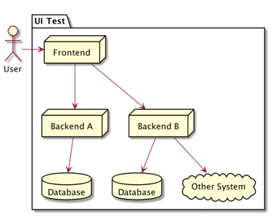
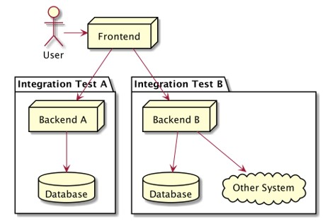

# PHP Unit Test

## Sebelum Belajar

- PHP Dasar
- PHP Object Oriented Programming
- PHP 8
- PHP MySQL Database
- PHP Web
- PHP Composer

## Agenda

- Pengenalan Software Testing
- Pengenalan PHPUnit
- Membuat Unit Test
- Assersion
- Test Annotation
- Mock
- Dan lain-lain

## #1 Pengenalan Software Testing

- Software testing adalah salah satu disiplin ilmu dalam software engineering
- Tujuan utama dari software testing adalah memastikan kualitas kode dan aplikasi kita baik
- Ilmu untuk software testing sendiri sangatlah luas, pada materi ini kita hanya akan fokus ke unit testing

### Test Pyramid


### Contoh High Level Architecture Aplikasi


### UI Test / End to End Test



### Service Test / Integration Test



### Contoh Internal Architecture Aplikasi


### Unit Test


### Unit Test

- Unit test akan fokus menguji bagian kode program terkecil, biasanya menguji sebuah method
- Unit test biasanya dibuat kecil dan cepat, oleh karena itu biasanya kadang kode unit test lebih banyak dari kode program aslinya, karena semua skenario pengujian akan dicoba di unit test
- Unit test bisa digunakan sebagai cara untuk meningkatkan kualitas kode program kita

## #2 Pengenalan PHP Unit Test

### Pengenalan PHPUnit

- PHP tidak memiliki fitur untuk unit testing secara default, seperti bahasa pemrograman Go-Lang
- Untuk mengimplementasikan unit testing, kita butuh library atau framework di PHP
- PHPUnit adalah salah satu framework untuk unit testing yang paling populer saat ini
- Bayak framework-framework populer seperti Laravel, menggunakan PHPUnit untuk unit testing nya
- <https://phpunit.de/>

### Composer

- PHPUnit merupakan framework yang sudah terintegrasi dengan baik dengan composer
- Oleh karena itu, untuk menambahkan PHPUnit, kita wajib menggunakan project PHP yang menggunakan Composer
- <https://packagist.org/packages/phpunit/phpunit>

### Menginstall PHPUnit

- Untuk menginstall PHPUnit, kita bisa menambah dependency PHPUnit dibagian dev (karena PHPUnit hanya untuk development)
- Setelah itu kita update dependencynya menggunakan Composer
- Secara default, nanti akan terdapat folder bin di dalam vendor yang berisi binary file PHPUnit yang bisa digunakan untuk menjalankan unit test

### Kode: composer.json

```json
{
	"require": {},
	"require-dev": {
		"phpunit/phpunit": "9.5.5"
	}
}
```

### PHPUnit File


## #3 Membuat Unit Test

### Setup Autoload

- Sebelum kita mulai belajar membuat unit test menggunakan PHPUnit
- Biasakan membedakan lokasi tempat source code PHP kita dan juga source code Unit Test
- Biasanya rata-rata programmer PHP akan membuat folder tests untuk menyimpan semua unit test nya
- Agar tidak perlu melakukan use namespace lagi, kita bisa menggunakan namespace yang sama untuk folder source code dan folder unit test

### Kode: Setup Autoload

```json
{
	"autoload": {
		"psr-4": {
			"ProgammerZamanNow\\Test\\": "src"
		}
	},
	"autoload-dev": {
		"psr-4": {
			"ProgammerZamanNow\\Test\\": "tests"
		}
	}
}
```

### Membuat Unit Test

- Untuk membuat unit test, kita bisa membuat class turunan dari `PHPUnit\Framework\TestCase`
- Biasanya pembuatan unit test mengikuti class yang akan kita test
- Misal jika kita punya class Person, maka untuk unit test nya, kita akan membuat class `PersonTest`
- Dan untuk skenario unit test nya, kita akan simpan dalam public function dengan awalan test*, misal `testCreate()`, `testXxx()`, `testZzz()`. Atau jika tidak menggunakan aturan awalan `test*`, kita juga bisa menambahkan `@test` pada function yang akan kita gunakan sebagai unit test

### Kode: Class Counter

```php
namespace ProgammerZamanNow\Test;

class Counter
{
	private int $counter = 0;

	public function increment(): void
	{
		$this->counter++;
	}

	public function getCounter(): int
	{
		return $this->counter;
	}
}
```

### Kode: Test Counter

```php
namespace ProgammerZamanNow\Test;

use PHPUnit\Frmework\TestCase;

class CounterTest extends TestCase
{
	public function testCounter()
	{
		$couter = new Counter();
		$couter->increment();
		echo $counter->getCounter() . PHP_EOL;
	}
}
```

### Menjalankan Unit Test

- Setelah kita membuat unit test, kita bisa menjalankan unit test tersebut menggunakan binary file PHPUnit bernama `phpunit`
- Caranya gunakan perintah :
- `vendor/bin/phpunit tests/CounterTest.php`

### Kode: Menjalankan Unit Test

```sh
vendor/bin/phpunit tests/CounterTest.php
```


### Menjalankan Unit Test Per Method

- Kadang, ada kebutuhan kita hanya perlu menjalankan unit test hanya method tertentu
- Untuk melakukan itu, kita bisa menggunakan perintah :
- `vendor/bin/phpunit --filter ‘ClassTest::testMethod’ tests/ClassTest.php`

### Kode: Menjalankan Unit Test Per Method

```sh
vendor/bin/phpunit --filter 'CounterTest::testCounter tests/CounterTest.php'
```


## #4 Assertions

- Pada kode unit test sebelumnya, terdapat peringatan yang menyebutkan bahwa unit test kita tidak memiliki assertions
- Apa itu Assertions?
- Assertions adalah mengecek apakah apakah sebuah kondisi sudah terpenuhi, jika kondisi tidak terpenuhi, maka unit test nya kita anggap gagal

### Class Assert

- Untuk melakukan assertions, kita tidak perlu melakukannya secara manual menggunakan if else, kita bisa memanfaatkan class yang sudah disediakan oleh PHPUnit bernama `PHPUnit\Framework\Assert`
- Class Assert berisi static function yang banyak sekali, dan bisa kita gunakan sesuai kebutuhan
- Saat kondisi pada assertions tidak terpenuhi, secara otomatis akan terjadi error, dan unit test akan dianggap gagal
- <https://phpunit.readthedocs.io/en/9.5/assertions.html>

### Kode: Menggunakan Assert

```php
use PHPUnit\Frmework\Assert;
use PHPUnit\Frmework\TestCase;

class CounterTest extends TestCase
{
	public function testCounter()
	{
		$couter = new Counter();

		$couter->increment();
		Assert::assertEquals(1, $couter->getCounter());
	}
}
```

### Assert di TestCase

- Saat kita membuat class unit test, maka kita wajib membuat class turunan dari class `TestCase`
- Sedangkan class `TestCase` itu sendiri, merupakan turunan dari class Assert
- Jadi secara tidak langsung, kita juga bisa menggunakan function-function assertions langsung dari unit test menggunakan `$this` atau `self`

### Kode: Assert di TestCase

```php
$couter->increment();
Assert::assertEquals(1, $couter->getCounter());

$couter->increment();
$this->assertEquals(2, $couter->getCounter());

$couter->increment();
self::assertEquals(3, $couter->getCounter());
```

## #5 Annotation

- Secara default, saat kita membuat function unit test, maka harus diawali dengan nama function test
- PHPUnit juga mendukung fitur annotation, yaitu medadata atau informasi yang bisa dimasukkan ke dalam source code, dimana di PHP annotation ditempatkan pada Doc Block (block komentar)
- Ada banyak sekali annotation yang terdapat di PHPUnit, kita akan bahas satu persatu sambil berjalannya materi
- <https://phpunit.readthedocs.io/en/9.5/annotations.html>

### @test

- `@test` merupakan annotation yang digunakan untuk menandakan bahwa function ini adalah sebuah unit test
- Dengan menambahkan `@test`, kita tidak perlu lagi membuat nama function selalu diawali dengan kata `test`

### Kode: @test

```php
/**
 * @test
 */
public function increment()
{
	$couter = new Counter();
	$couter->increment();
	$this->assertEquals(1, $couter->getCounter());
}
```

## #6 Test Dependency

- Pada saat membuat unit test, kadang kita ingin melanjutkan unit test sebelumnya atau bahkan tergantung dengan unit test sebelumnya
- Di PHPUnit, kita bisa membuat unit test yang tergantung dari hasil unit test lainnya
- Untuk melakukan itu, kita bisa menggunakan annotation `@depends` namaUnitTest

### Kode: Test Dependency

```php
public function testFirst(): Counter
{
	$couter = new Counter();
	$couter->increment();
	$this->assertEquals(1, $couter->getCounter());
	return $counter;
}

/**
 * @depends testFirst
 */
public function testSecond(Counter $couter)
{
	$couter->increment();
	$this->assertEquals(2, $couter->getCounter());
}
```

### Perhatian

- Unit test yang baik harus independen
- Tidak tergantung dengan unit test lainnya
- Jika kita membuat unit test yang tergantung dengan unit test lain, maka jika unit test sebelumnya error, maka unit test kita juga akan error

## #7 Data Provider

- Dalam membuat unit test, sering terdapat kasus dimana kita ingin mengkombinasikan beberapa input data
- Sebenarnya hal ini bisa dilakukan secara manual satu persatu
- Hanya saja akan terlalu banyak hal yang harus kita tulis
- PHPUnit mendukung fitur data provider, dimana kita bisa membuat unit test dengan parameter, dan datanya di provide dari function lain
- Untuk melakukan ini, kita bisa menggunakan annotation `@dataProvider` providerFunction

### Kode: Math Class

```php
class Math
{
	public static function sum(array $values): int
	{
		$total = 0;
		foreach ($values as $value) {
			$total += $value;
		}
		return $total;
	}
}
```

### Kode: Unit Test Math Manual

```php
class MathTest extends TestCase
{
	public function testManual()
	{
		self::assertEquals(10, Math::sum([5, 5]));
		self::assertEquals(20, Math::sum([4, 4, 4, 4, 4]));
		self::assertEquals(9, Math::sum([3, 3, 3]));
		self::assertEquals(0, Math::sum([]));
		self::assertEquals(2, Math::sum([2]));
	}
}
```

### Kode: Unit Test dengan Data Provider

```php
/**
 * @dataProvider mathSumData
 */
public function testDataProvider(array $values, int $expected)
{
	self::assertEquals($expected, Math::sum($values));
}
```

### Kode: Data Provider

```php
public function mathSumData(): array
{
	return [
		[[5, 5], 10],
		[[4, 4, 4, 4, 4], 20],
		[[3, 3, 3], 9],
		[[], 0],
		[[2], 2],
	];
}
```

### @testWith

- Saat menggunakan @dataProvider, kita harus membuat function yang mengembalikan data
- Ada cara lebih mudah tanpa harus membuat function terlebih dahulu, yaitu menggunakan annotation `@testWith`
- Dengan menggunakan `@testWith` kita bisa mengirim data ke unit test tanpa harus membuat function, kita cukup masukkan dalam doc saja

### Kode: @testWith

```php
/**
 * @testWith [[5, 5], 10]
 *					 [[4, 4, 4, 4, 4], 20]
 *					 [[3, 3, 3], 9]
 *					 [[], 0]
 *					 [[2], 2]
 *
 */
public function testWith(array $values, int $expected)
{
	self::assertEquals($expected, Math::sum($values));
}
```

## #8 Test Exception

- Saat membuat unit test, pastikan kita tidak hanya membuat unit test dengan skenario benar
- Kita juga wajib membuat unit test dengan skenario salah atau gagal
- Salah satunya kadang saat terjadi skenario salah atau gagal, kita sering menggunakan `Exception`
- PHPUnit memiliki fitur assertion untuk memastikan bahwa sebuah `Exception `harus terjadi
- Jika terjadi, maka unit test dianggap gagal
- Kita bisa menggunakan function `Assert::expectException(ClassException::class)` jika ingin memastikan bahwa sebuah unit test harus terjadi exception yang kita perkirakan

### Kode: Class Person

```php
class Person
{
	public function __construct(private string $name){}

	public function sayHello(?string $name): string
	{
		if ($name == null) throw new \Exception("Name is null");
		return "Hi $name, my name is $this->name";
	}
}
```

### Kode: Test Exception

```php
class PersonTest extends TestCase
{
	public function testSuccess()
	{
		$person = new Person("Eko");
		self::assertEquals("Hi Budi, my name is Eko", $person->sayHello("Budi"));
	}

	public function testException()
	{
		$person = new Person("Eko");
		$this->expectException(\Exception::class);
		$person->sayHello(null);
	}
}
```

## #9 Test Output

- Apa yang terjadi jika kita ingin menguji sebuah fitur, namun fitur tersebut tidak mengembalikan data apapun?
- Misal hanya melakukan echo saja
- PHPUnit memiliki fitur untuk mendeteksi output, dengan demikian kita bisa memastikan bahwa output yang dihasilkan sesuai dengan yang kita inginkan
- Untuk melakukan itu, kita bisa menggunakan `Assert::expectOutputString('string');`

### Kode: Say GoodBye

```php
class Person
{
	public function __construct(private string $name){}

	public function sayGoodBye(?string $name): void
	{
		echo "Good bye $name" . PHP_EOL;
	}
}
```

### Kode: Test Output

```php
public function testOutput()
{
	$person = new Person("Eko");
	$this->expectOutputString("Good bye Budi" . PHP_EOL);
	$person->sayGoodBye("Budi");
}
```

## #10 Fixture

- Salah satu yang memakan waktu saat membuat unit test adalah, membuat kode awal yang berulang-ulang sebelum unit test
- Atau membuat kode akhir yang berulang-ulang setelah unit test
- Hal ini dinamakan `fixture`
- Pada unit test sebelumnya yang sudah kita buat, kita sering sekali membuat object `$counter`, atau `$person`
- Dengan menggunakan fitur Fixture milik PHPUnit, hal ini bisa dipermudah

### setUp() Function

- Class TestCase memiliki sebuah function bernama `setUp()`
- function `setUp()` merupakan function yang akan selalu dipanggil sebelum function unit test dieksekusi
- function `setUp()` cocok sekali untuk membuat kode yang kita inginkan sebelum unit test dijalankan

### Kode: Function setUp()

```php
class PersonTest extends TestCase
{
	private Person $person;

	protected function setUp(): void
	{
		$this->person = new Person("Eko");
	}

	public function testSuccess()
	{
		self::assertEquals("Hi Budi, my name is Eko", $this->person->sayHello("Budi"));
	}
}
```

### Annotation @before

- Jika kita ingin membuat function dengan nama berbeda, kita bisa menggunakan annotation `@before`
- Bahkan jika menggunakan annotation `@before`, kita bisa membuat function setup lebih dari satu

### Kode: @before

```php
private Person $person;

/**
 * @before
 */
public function createPerson(): void
{
	$this->person = new Person("Eko");
}

public function testSuccess()
{
	self::assertEquals("Hi Budi, my name is Eko", $this->person->sayHello("Budi"));
}
```

### Perhatikan

- Function fixture akan dieksekusi tiap kali method unit test di eksekusi
- Artinya jika terdapat 10 function unit test, maka fixture akan 10 kali juga dieksekusi

### Kode: Fixture

```php
private Counter $counter;

protected function setUp(): void
{
	$this->counter = new Counter();
	echo "setup counter" . PHP_EOL;
}

public function testCounter()
{
	$this->counter->increment();
	Assert::assertEquals(1, $this->counter->getCounter());
}
```

### tearDown() Function

- Class TestCase memiliki sebuah function bernama `tearDown()`
- function `tearDown()` merupakan function yang akan selalu dipanggil setelah function unit test dieksekusi
- function `tearDown()` cocok sekali untuk membuat kode yang kita inginkan setelah unit test dijalankan
- Selain menggunakan `tearDown()`, kita juga bisa menggunakan annotation `@after`

### Kode: tearDown() Function

```php
protected function tearDown(): void
{
	echo "tear down" . PHP_EOL;
}

/**
 * @after
 */
protected function after(): void
{
	echo "after" . PHP_EOL;
}
```

## #11 Sharing Fixture

### Independent Unit Test

- Secara default, class unit test itu sebenarnya akan selalu dibuat sebelum function unit test dijalankan, jadi tidak menggunakan object unit test yang sama
- Begini cara berjalan unit test :
  - membuat object unit test
  - menjalankan fixture set up
  - menjalankan function unit test
  - menjalankan fixture tear down
  - ulangi dari awal untuk function unit test selanjutnya

### Sharing Fixture

- Karena object dari class unit test selalu dibuat ulang, maka kadang agak menyulitkan jika kita ingin membuat data yang bisa di sharing antar unit test, misal koneksi database
- Untuk hal seperti ini, kita bisa membuat data nya berupa variable `static`, sehingga variable `static` tersebut tidak perlu tergantung dengan object unit test lagi

### Kode: Sharing Dengan Static

```php
class CounterStaticTest extends TestCase
{
	static private Counter $counter;
}
```

### Fixture Class

- Sekarang pertanyaannya, bagaimana cara menginisialisasi data static tersebut? Karena kita tidak bisa menggunakan `setUp()` method, karena bukan static function
- Untungnya PHPUnit mendukung sharing fixture seperti ini, nama function nya adalah :
- static function `setUpBeforeClass()` untuk setup diawal ketika class unit test dieksekusi, atau menggunakan `@beforeClass`
- static function `tearDownAfterClass()` untuk dipanggil diakhir ketika class unit test selesai, atau menggunakan `@afterClass`
- Sharing fixture hanya dieksekusi sekali diawal dan diakhir, walaupun di class unit test terdapat banyak function unit test

### Kode: Sharing Fixture

```php
static private Counter $counter;

public static function setUpBeforeClass(): void
{
	self::$counter = new Counter();
}

public function testFirst()
{
	self::$counter->increment();
	self::assertEquals(1, self::$counter->getCounter());
}
```

## #12 Incomplete Test

- Saat membuat unit test, kadang kita membuat test dengan dimulai dengan function kosong, lalu mulai diisi dengan kode unit test
- Kadang ada kalanya unit test belum selesai
- Secara default, jika tidak terdapat masalah pada unit test nya, maka PHPUnit akan menganggap unit test tersebut sebagai unit test yang sukses
- Dan kadang jika lupa, bisa jadi kita tidak pernah tahu kalo ternyata ada unit test yang belum selesai, karena terlihat sukses
- Untuk kasus seperti ini, ada baiknya kita memberi tahu ke PHPUnit bahwa unit test tersebut belum selesai dengan menggunakan method `Assert::markTestIncomplete()`

### Kode: Test Success Walau Belum Selesai

```php
public function testIncrement()
{
	self::assertEquals(0, $this->counter->getCounter());
	// TODO call increment
}
```

### Kode: Menandai Incomplete Test

```php
public function testIncrement()
{
	self::assertEquals(0, $this->counter->getCounter());
	self::assertTestIncomplete("TODO do increment");
}
```

### Kode: Hasil Unit Test


### Peringatan

- Menggunakan function `markTestIncomplete()` akan menghasilkan error `IncompleteTestError`
- Oleh karena itu, kode dibawahnya tidak akan dieksekusi

## #13 Skip Test

- Kadang ada masalah ketika membuat unit test, sehingga kita ingin men-disabled unit test yang sudah ada
- Saat ingin men-disabled unit test, kadang kita melakukan hal seperti, mengubah nama function sehingga tidak diawali dengan test atau menghapus `@test` jika menggunakan annotation
- Hanya saja masalahnya jika itu kita lakukan, secara otomatis unit test akan hilang dari laporan PHPUnit, dan jika kita lupa, bisa saja unit test tersebut akan ter-disabled selamanya
- Cara yang baik jika ada unit test yang memang ingin kita disabled adalah dengan menggunakan `Assert::markTestSkipped()`, dimana nanti akan terdapat laporan dari PHPUnit bahwa unit test tersebut kita skip

### Kode: Tanpa Skip Unit Test

```php
public function increment()
{
	self::assertEquals(0, $this->counter->getCounter());
	$this->counter->increment();
	self::assertEquals(1, $this->counter->getCounter());
}
```

### Kode: Skip Test

```php
public function testIncrement()
{
	self::markTestSkipped("Skip unit test");

	self::assertEquals(0, $this->counter->getCounter());
	$this->counter->increment();
	self::assertEquals(1, $this->counter->getCounter());
}
```

### Peringatan

- Menggunakan function `markTestSkipped()` akan menghasilkan error `SkippedTestError`
- Oleh karena itu, kode dibawahnya tidak akan dieksekusi

### Skip Berdasarkan Kondisi

- PHPUnit mendukung melakukan skip unit test berdasarkan kondisi tertentu
- Ada banyak kondisi yang bisa di cek, seperti versi php, sistem operasi, dan lain-lain
- Untuk melakukan skip berdasarkan kondisi, kita bisa menggunakan annotation `@requires` diikuti dengan tipe kondisi
- Beberapa kondisi mendukung operasi perbandingan

### Parameter @requires

| Type        | Possible Values                                                                    |
| ----------- | ---------------------------------------------------------------------------------- |
| `PHP`       | Any PHP version identifier along with an optional operator                         |
| `PHPUnit`   | Any PHPUnit version identifier along with an optional operator                     |
| `OS`        | A regexp matching PHP_OS                                                           |
| `OSFAMILY`  | Any OS family                                                                      |
| `function`  | Any valid parameter to function exists                                             |
| `extension` | Any extension name along with an optional version identifier dan optional operator |

### Kode: Only On Windows

```php
/**
 * @requires OSFAMILY Windows
 */
public function testOnlyWindows()
{
	self::assertTrue(true, "Only in windows");
}
```

### Kode: Only for PHP >= 8

```php
/**
 * @requires PHP >= 8
 * @requires OSFAMILY Darwin
 */
public function testPHP8()
{
	self::assertTrue(true, "Only for php 8");
}
```

## #14 Stub

### Permasalahan Unit Test

- Kadang membuat unit test untuk sebuah class bukanlah hal yang mudah, apalagi jika ternyata class tersebut tergantung dengan object lain
- Apalagi jika ternyata object yang dibutuhkan ternyata tergantung dengan object lain lagi
- Hal seperti ini akan sangat menyulitkan saat membuat unit test
- Sebagai contoh kita akan coba membuat studi kasus sederhana membuat class yang kompleks

### Kode: Product

```php
class Product
{
	private string $id, $name, $description;
	private int $price, $quantity;
}
```

### Kode: Product Repository

```php
interface ProductRepository
{
	function save(Product $product): Product;

	function delete(Product $product): void;

	function findById(string $id): ?Product;

	function findAll(): array;
}
```

### Kode: Product Service

```php
class ProductService
{
	public function __construct(private ProductRepository $repository) {}

	public function register(Product $product): Product
	{
		if ($this->repository->findById($product->getId()) != null) {
			throw new \Exception("Product is already exists");
		}
		return $this->repository->save($product);
	}
}
```

### Stub

- Saat akan membuat test untuk sebuah class, dan ternyata class tersebut butuh dependency object lain, maka kita bisa membuat object pengganti yang bisa kita konfigurasi agar sesuai dengan keinginan kita
- Teknik ini dinamakan stubbing, dan object pengganti yang kita buat disebut stub
- PHPUnit mendukung pembuatan object stub secara mudah hanya dengan menggunakan function `createStub(className)` yang terdapat di class TestCase
- method `createStub()` secara otomatis akan membuat object class atau interface yang kita inginkan dengan default implementation

### Kode: Membuat Stub

```php
private ProductRepository $repository;
private ProductService $service;

protected function setUp(): void
{
	$this->repository = $this->createStub(ProductRepository::class);
	$this->service = new ProductService($this->repository);
}
```

### Konfigurasi Stub

- Secara default, semua function di stub akan mengembalikan null jika nullable return type, atau default value jika tipe data primitive, atau stub lain jika tipe data class
- Biasanya kita akan melakukan konfigurasi stub terlebih dahulu sebelum kita menggunakan stub
- Dengan begitu, kita bisa memprediksi tingkah laku stub tersebut sesuai dengan konfigurasi yang kita buat
- Melakukan konfigurasi stub sederhananya hanya memberi tahu stub, jika sebuah function di eksekusi, kita ingin mengembalikan data apa

### Invocation Stubber

- Stub memiliki function yang bernama `method(name)`, dimana dia akan mengembalikan InvocationStubber
- Dengan InvocationStubber, kita bisa mengatur hasil kembalian dari function yang dipanggil di stub
- <https://github.com/sebastianbergmann/phpunit/blob/master/src/Framework/MockObject/Builder/InvocationStubber.php>

```php
interface InvocationStubber
{
	public function will(Stub $stub): Identity;

	public function willReturn($value, ...$nextValues): self;

	public function willReturnReference(mixed &$references): self;

	/**
	 * @param array<int, array<int, mixed>> $valueMap
	 */
	public function willReturnMap(array $valueMap): self;

	public function willReturnArgument(int $argumentIndex): self;

	public function willReturnCallback(callable $callback): self;

	public function willReturnSelf(): self;

	public function willReturnOnConsecutiveCalls(mixed ...$values): self;

	public function willThrowException(Throwable $exception): self;
}
```

### Kode: Konfigurasi Stub

```php
public function testStub()
{
	$product = new Product();
	$product->setId("1");

	$this->repository->method('findById')
		->willReturn($product);

	$result = $this->repository->findById("1");

	self::assertSome($product, $result);
}
```

### Kode: Konfigurasi Stub dengan Map

```php
public function testStubMap()
{
	$product1 = new Product();
	$product1->setId("1");

	$product2 = new Product();
	$product2->setId("1");

	$map = [
		["1", $product1],
		["2", $product2],
	];

	$this->repository->method("findById")
		->willReturnMap($map);

	self::assertSome($product1, $this->repository->findById("1"));
	self::assertSome($product2, $this->repository->findById("2"));
}
```

### Kode: Konfigurasi Stub dengan Callback

```php
public function testStubCallback()
{
	$this->repository->method('findById')
		->willReturnCallback(function (string $id) {
			$product = new Product();
			$product->setId($id);
			return $product;
		});

	self::assertSome('1', $this->repository->findById("1")->getId());
	self::assertSome('2', $this->repository->findById("2")->getId());
}
```

### Integrasi Dengan Stub

- Sekarang kita sudah tahu cara menggunakan stub
- Jika kita akan membuat uni test untuk sebuah class, dan ternyata class tersebut membutuhkan object lain, maka disarankan untuk menggunakan stub
- Hal ini agar tingkah laku stub bisa kita konfigurasi, sehingga perubahan yang terjadi di class asli stub nya tidak akan mempengaruhi unit test kita

### Kode: Product Service Test Suksess

```php
public function testRegister()
{
	$this->repository->method("findById")
		->willReturn(null);
	$this->repository->method('save')
		->willReturnArgument(0);

	$product = new Product();
	$product->setId("1");
	$product->setName("Contoh");

	$result = $this->service->register($product);

	self::assertEquals($product->getId(), $result->getId());
	self::assertEquals($product->getName(), $result->getName());
}
```

### Kode: Product Service Test Gagal

```php
public function testRegisterFailed()
{
	$this->expectException(\Exception::class);

	$productInDB = new Product();
	$productInDB->setId(1);
	$this->repository->method("findById")
		->willReturn($productInDB);

	$product = new Product();
	$product->setId("1");
	$product->setName("Contoh");

	$this->service->register($product);
}
```

## #15 Mock OBject

### Masalah Dengan Stub

- Stub sangat cocok sekali ketika kita butuh membuat object dependency untuk class yang sedang kita test
- Namun ada satu masalah yang terdapat di stub, yaitu kita tidak bisa mengetahui berapa kali interaksi terjadi terhadap object stub tersebut
- Pada kasus sebelumnya, misal kita coba implementasikan service untuk delete product

### Kode: Service Delete Product

```php
public function delete(string $id)
{
	$product = $this->repository->findById($id);
	if ($product == null) {
		throw new \Exception("Product is not found");
	}

	$this->repository->delete($product);
}
```

### Kode: Unit Test Delete dengan Stub

```php
public function testDelete()
{
	$product = new Product();
	$product->setId("1");

	$this->repository->method('findById')
		->willReturn($product);

	$this->service->delete("1");
	self::assertTrue(True, "Success delete");
}

public function testDeleteFailed()
{
	$this->expectException(\Exception::class);
	$this->repository->method('findById')
		->willReturn(null);

	$this->service->delete("1");
}
```

### Kesalahan Pada Unit Test

- Sekilas, unit test yang kita buat seperti tidak ada masalah
- Tapi coba jika kita ubah implementasi class Service nya
- Misal, kita call delete sebanyak lebih dari satu kali
- Atau bahkan kita hapus kode delete menggunakan repository
- Hasilnya, semua unit test akan tetap sukses, dan artinya terdapat kesalahan dalam unit test kita

### Perubahan Service Delete

```php
public function delete(string $id)
{
	$product = $this->repository->findById($id);
	if ($product == null) {
		throw new \Exception("Product is not found");
	}

	// $this->repository->delete($prodict);
}
```

### Mock Object

- PHPUnit memiliki fitur bernama Mock Object
- Mock object sama seperti stub, hanya saja pada mock object, kita bisa melakukan verifikasi berapa banyak sebuah method dipanggil
- Cara membuat mock object adalah dengan menggunakan function `createMock(class)` yang terdapat pada class `TestCase`

### Kode: Membuat Mock Object

```php
private ProductRepository $repository;
private ProductService $service;

protected function setUp(): void
{
	$this->repository = $this->createMock(ProductRepository::class);
	$this->service = new ProductService($this->repository);
}
```

### Konfigurasi Mock Object

- Konfigurasi mock object mirip dengan stub, kita bisa menggunakan function `method(name)`
- Namun sebelum kita menggunakan function `method(name)`, kita bisa menambahkan `expects(invocationRule)` sebagai ekspektasi berapa kali function dipanggil

### Invocation Rule

| TestCase Invocation Rule Function | Keterangan                         |
| --------------------------------- | ---------------------------------- |
| `any()`                           | Berapa kali pun dipanggil          |
| `never()`                         | Tidak pernah dipanggil             |
| `atLeast(number)`                 | Minimal dipanggil                  |
| `atLeastOnce()`                   | Minimal satu kali dipanggil        |
| `once()`                          | Satu kali dipanggil                |
| `exactly(number)`                 | Harus dipanggil sejumlah number    |
| `atMost(number)`                  | Maksimal dipanggil sejumlah number |

### Kode: Konfigurasi Mock Object

```php
public function testMock()
{
	$product = new Product();
	$product->setId("1");

	$this->repository->epxects($this->once())
		->method("findById")
			->willReturn($product);

	$result = $this->repository->findById("1");
	self::assertSome($product, $result);
}
```

### integrasi Dengan Mock Object

- Sekarang kita sudah tahu cara menggunakan mock object
- Sekarang jika kita membutuhkan interaksi terhadap data stub, dan juga ingin memastikan berapa kali function dipanggil, maka kita bisa menggunakan mock object

### Kode: Integrasi Dengan Mock Object

```php
public function testDelete()
{
	$this->repository->epxects($this->once())
		->method('delete');

	$product = new Product();
	$product->setId("1");

	$this->repository->epxects($this->once())
		->method("findById")
		->willReturn($product);

	$this->service->delete("1");
	self::assertTrue(True, "Success delete");
}

public function testDeleteFailed()
{
	$this->repository->epxects($this->never())
		->method('delete');

	$this->repository->epxects($this->once())
		->method("findById")
		->willReturn(null);

	$this->expectException(\Exception::class);
	$this->service->delete("1");
}
```

### Memastikan Parameternya Benar

- Setelah menggunakan mock object, kita bisa memastikan berapa jumlah function dipanggil
- Namun jika parameter yang dikirim salah, maka secara otomatis unit test tetap akan sukses, padahal harusnya unit test tersebut gagal
- Pada kasus ini, mock object mendukung verifikasi parameter juga, untuk memastikan bahwa parameter yang diterima function benar
- Kita bisa menggunakan method `with(...constraint)` pada mock object
- Semua class constraint terdapat disini : <https://github.com/sebastianbergmann/phpunit/tree/master/src/Framework/Constraint>
- Namun kita tidak perlu membuatnya manual, kita bisa menggunakan static function di Assert class

### Kode: Memastikan Parameter Benar

```php
public function testDelete()
{
	$product = new Product();
	$product->setId("1");

	$this->repository->epxects($this->once())
		->method('delete')
		->with(self::equalTo($product));


	$this->repository->epxects($this->once())
		->method("findById")
		->with(self::equalTo($product->getId()))
		->willReturn($product);

	$this->service->delete("1");
	self::assertTrue(True, "Success delete");
}

public function testDeleteFailed()
{
	$this->repository->epxects($this->never())
		->method('delete');

	$this->repository->epxects($this->once())
		->method("findById")
		->with(self::equalTo("1"))
		->willReturn(null);

	$this->expectException(\Exception::class);
	$this->service->delete("1");
}
```

### Mock Trait dan Abstract Class

- Function `createMock(class)` hanya bisa digunakan untuk class dan interface, jika kita butuh membuat mock object, namun dari data Trait atau Abstract Class, maka kita perlu membuatnya menggunakan function yang berbeda
- Function `getMockForTrait(trait)` untuk membuat mock object dari trait
- Function `getMockForAbstractClass(abstractClass)` untuk membuat mock object dari abstract class

## #16 Configuration

- Sebelumnya kita menjalankan PHPUnit tanpa konfigurasi apapun
- PHPUnit mendukung file konfigurasi, dimana kita bisa menambahkan konfigurasi untuk PHPUnit
- File konfigurasi PHPUnit bentuknya adalah file XML, biasanya nama file nya adalah `phpunit.xml`
- Kita bisa menambahkan informasi apapun pada konfigurasi PHPUnit
- Detail apa saja yang bisa kita ubah pada konfigurasi nya bisa kita lihat di halaman documentation nya
- <https://phpunit.readthedocs.io/en/9.5/configuration.html>

### Kode: Contoh Configuration

```xml
<phpunit colors="true" stopOnError="true">
	<testsuites>
			<testsuite name="belajar">
				<directory>tests</directory>
			</testsuite>
	</testsuites>
</phpunit>
```

### Menjalankan PHPUnit dan Configuration

- Setelah file configuration nya selesai, kita bisa menjalankan PHPUnit dengan perintah
- `phpunit --configuration phpunit.xml`

### Kode: Integrasi Dengan Composer Script

```php
{
	"scripts": {
		"test": "phpunit --configuration phpunit.xml"
	}
}
```

## #17 Test Suite

- Saat kita menggunakan PHPUnit Configuration, kita bisa membuat beberapa test suite
- Anggap saja test suite seperti grup atau fitur dalam unit test, misal kita ingin membedakan antara grup tiap fitur pada unit test, lalu kita ingin menjalankan test sesuai dengan fitur nya
- Pada kasus seperti itu, kita bisa membuat test suite yang berbeda untuk tiap fitur, sehingga saat menjalankan unit test, kita bisa memilih test suite mana yang ingin kita jalankan

### Kode: Configuration dengan Test Suite

```xml
<testsuites>
	<testsuite name="product">
		<file>tests/ProductServiceMockTest.php</file>
		<file>tests/ProductServiceTest.php</file>
	</testsuite>
	<testsuite name="counter">
		<file>tests/CounterTest.php</file>
		<file>tests/Counter2Test.php</file>
		<file>tests/CounterStaticTest.php</file>
	</testsuite>
	<testsuite name="all">
		<directory>tests</directory>
	</testsuite>
</testsuites>
```

### Menjalankan Test Suite Tertentu

- Secara default, saat kita menjalankan unit test, PHPUnit akan melakukan test semua test suite
- Namun jika kita ingin memilih test suite tertentu, kita bisa melakukannya dengan perintah :

### Kode: Menjalankan Test Suite Tertentu

```php
{
	"scripts": {
		"test": "phpunit --configuration phpunit.xml",
		"test.product": "phpunit --configuration phpunit.xml --testsuite product",
		"test.counter": "phpunit --configuration phpunit.xml --testsuite counter"
	}
}
```

## #18 Fitur Lainnya

- Secara garis besar, kita sudah mempelajari semua fitur utama yang terdapat di PHPUnit
- Sekarang sangat disarankan ketika membuat aplikasi PHP, kita mengimplementasikan unit test
- Berikut adalah beberapa fitur yang bisa di eksplore jika ingin memperdalam library PHPUnit :
- Mempelajari annotation di PHPUnit : <https://phpunit.readthedocs.io/en/9.5/annotations.html>
- Mempelajari perintah command line PHPUnit : <https://phpunit.readthedocs.io/en/9.5/textui.html>
- Mempelajari xml configuration di PHPUnit : <https://phpunit.readthedocs.io/en/9.5/configuration.html>
- Mempelajari code coverage : <https://phpunit.readthedocs.io/en/9.5/code-coverage-analysis.html>

## #19 Materi Selanjutnya

- Perbanyak Studi Kasus
- Belajar PHP Library
- Belajar PHP Framework
