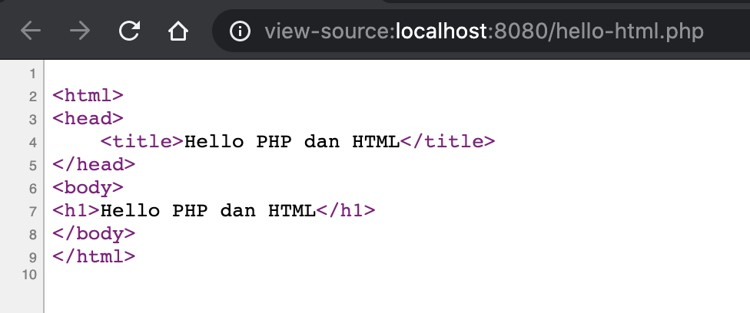

# PHP Web

## Sebelum Belajar

- PHP Dasar
- PHP Object Oriented Programming
- PHP 8 Fitur Baru
- PHP Database MySQL
- HTML
- CSS
- JavaScript

## Agenda

- Pengenalan Web
- Client dan Server
- Membuat Web dengan PHP
- Query Parameter
- Form Post
- Session
- Cookies
- Upload File
- Dan lain-lain

## #1 Pengenalan Web

### Kenapa Web?

- Saat ini web digunakan oleh jutaan, bahkan mungkin milyaran orang setiap hari
- Dengan web, kita bisa melakukan belajar online, mendengarkan musik online, nonton video online, belanja online, sampai memesan makanan secara online
- Namun perlu diperhatikan, Web bukanlah Internet

### Internet

- Internet adalah mekanisme komunikasi antar komputer
- Awal internet ada, untuk komunikasi antar komputer, kita membutuhkan jaringan kabel telpon
- Namun sekarang, semenjak berjamurnya jaringan wifi dan sejenisnya, komunikasi antar komputer menjadi lebih cepat dan mudah


### Web

- Web merupakan kumpulan informasi yang tersedia dalam sebuah komputer yang terkoneksi secara terus menerus melalui internet
- Web bisa berisi informasi dalam bentuk apapun, seperti teks, gambar, audio, video dan lain-lain
- Web berjalan di aplikasi yang bernama Web Server, yaitu aplikasi yang digunakan untuk menyimpan dan menyampaikan isi informasi Web

### Diagram Web


### Web Host

- Pemilik Web, biasanya tidak menjalankan aplikasi Web Server di komputer pribadi nya
- Biasanya mereka akan menyewa komputer di tempat penyedia data center (kumpulan komputer) yang terjamin keandalan dan kecepatan koneksi internetnya
- Pihak penyedia komputer untuk Web Server biasa disebut Web Host

### Domain

- Saat komputer Web terhubung ke internet, biasanya dia memiliki alamat
- Alamat ini bernama ip address, formatnya misal nya `172.217.194.94`
- Karena alamat ip address sangat menyulitkan untuk diingat
- Untung saja ada yang namanya nama domain
- Nama domain adalah alamat yang bisa digunakan sebagai alias ke ip address
- Misal seperti `google.co.id`, `blibli.com`, dan lain-lain
- Dengan nama domain, sebagai manusia kita akan mudah mengingat dibandingkan ip address
- Namun, saat kita menggunakan nama domain, sebenarnya komputer tetap akan mengakses web menggunakan alamat ip address

### Web Browser

- Jika Web Server adalah aplikasi yang digunakan untuk menyimpan informasi Web
- Web Browser adalah aplikasi yang digunakan untuk mengakses Web melalui internet
- Kita bisa saja mengakses Web secara langsung tanpa bantuan Web Browser, namun Web Server hanya akan memberikan informasi bahasa mesin seperti HTML, JavaScript, CSS, Gambar, Video dan lain-lain
- Dengan menggunakan Web Browser, semua bahasa mesin tersebut bisa ditampilkan secara visual sehingga kita bisa menyerap informasinya dengan lebih mudah

## #2 Client dan Server

- Web adalah aplikasi berbasis Client dan Server, sekarang pertanyaannya, apa itu Client dan Server?
- Sederhananya client server merupakan konsep arsitektur aplikasi yang menghubungkan dua pihak, sistem client dan sistem server
- Sistem client dan sistem server yang saling berkomunikasi melalui jaringan komputer, internet, atau juga bisa di komputer yang sama

### Diagram Client dan Server


### Tugas Client dan Server

- Aplikasi Client bertugas mengirim request ke Server, dan menerima response dari Server
- Sedangkan, aplikasi Server bertugas menerima request dari Client, memproses data, dan mengembalikan hasil proses data ke Client

### Keuntungan Client dan Server

- Perubahan aplikasi bisa dilakukan dengan mudah di server, tanpa harus membuat perubahan di client, apalagi jika client nya di lokasi yang sulit dijangkau
- Bisa digunakan oleh banyak client pada saat yang bersamaan, walaupun server tidak banyak
- Bisa diakses dari mana saja, asal terhubung satu jaringan dengan server

### Contoh Client dan Server

- Web adalah salah satu contoh arsitektur client server
- Aplikasi yang bertugas sebagai Client adalah Web Browser (Chrome, Firefox, Opera, Edge dan lain-lain)
- Aplikasi yang bertugas sebagai Server adalah Web Server, dimana di dalam web server terdapat kode program Web kita

## #3 PHP Web

- PHP sendiri sejak awal memang diperuntukkan membuat aplikasi Web
- Di materi course-course sebelumnya kita sudah belajar bahasa pemrograman PHP, namun masih menggunakan PHP CLI (command line interface) atau berbasis terminal
- Pada course ini kita akan fokus membuat Web menggunakan PHP

### Diagram Cara kerja PHP Web


### Cara Kerja PHP Web

- Web Browser akan melakukan HTTP Request ke Web Server
- Web Server menerima HTTP Request, lalu mengeksekusi file PHP yang sesuai dengan request tersebut
- File PHP akan di eksekusi, lalu akan menjalankan kode program PHP, hasilnya akan di render menjadi content yang sesuai dengan yang dilakukan di kode program
- Hasil content yang dibuat PHP (misal HTML, CSS, JavaScript, dan lain-lain) akan dikembalikan ke Web Server
- Web Server akan mengembalikan content tersebut sebagai HTTP Response ke Web Browser
- Web Browser menerima content dari Web Server, lalu me-render content tersebut sesuai dengan tipe content nya

## #4 PHP Development Server

- Seperti yang sudah kita bahas sebelumnya, agar web bisa diakses, kita perlu menyimpan web tersebut di dalam aplikasi Web Server
- Saat kita menginstall XAMPP, di dalam nya terdapat aplikasi Apache HTTPD, itu adalah salah satu aplikasi Web Server
- Namun pada course ini, saya tidak akan menggunakan Apache HTTPD, saya akan menggunakan Web Server sederhana yang sudah disediakan langsung oleh PHP, namanya PHP Development Server

### PERINGATAN!

- PHP Development Server adalah aplikasi Web Server untuk membantu mempermudah menjalankan Web Server untuk PHP Web
- Fitur ini hanya untuk proses development, bukan untuk dijalankan di Web Host
- PHP Development Server hanya memiliki 1 thread, artinya hanya bisa menjalankan 1 proses dalam satu waktu

### Menjalankan PHP Development Server

- `php -S host:port`
- Di komputer pribadi, kita bisa gunakan host dengan nama localhost
- Untuk nomor port, kita bisa gunakan bebas, asal port nya tidak digunakan oleh aplikasi lain
- Misal : `php -S localhost:8080`
- Artinya PHP Development Server akan bisa diakses di <http://localhost:8080>
- Ingat, kita wajib menjalankan perintah ini di folder tempat kita menyimpan kode program PHP kita

### Hot Reload

- PHP adalah bahasa pemrograman yang tidak butuh di compile terlebih dahulu
- Selain itu PHP juga mendukung fitur hot reload, artinya setiap perubahan yang kita lakukan di kode program PHP, kita tidak butuh melakukan restart aplikasi Web Server nya
- Kita cukup melakukan request ulang dari Web Browser, secara otomatis Web Server akan menjalankan kode program PHP terbaru kita

## #5 PHP Web Hello World

- Sebelumnya di course PHP Dasar, kita sudah coba membuat program Hello World dengan PHP, namun masih berbasi terminal
- Sekarang kita akan coba membuat program Hello World di PHP, namun menggunakan PHP Web

### Kode: PHP Web Hello World

```php
<?php

echo "Hello World";
```

### Menjalankan PHP Web Hello World

- Setelah kita menjalankan PHP Development Server
- Untuk mengakses file PHP Hello World yang sudah kita buat, kita bisa menggunakan Web Browser dengan menggunakan URL : <http://localhost:8080/nama-file.php>
- Kita bisa sesuaikan `nama-file.php` dengan nama file yang kita buat

### Tampilan PHP Web Hello World


### HTTP Request dan Response


### Best Practice URL di PHP

- Gunakan lowercase : misal `/product.php`, `/login.php`
- Jangan gunakan spasi : misal `/hello-world.php`, `/forgot-password.php`

## #6 PHP Info

- PHP memiliki fitur bernama PHP Info
- Fitur ini bisa digunakan untuk mengecek versi PHP dan fitur apa saja yang tersedia di aplikasi PHP yang kita install
- PHP Info bisa dilihat menggunakan terminal dengan perintah `php --info`
- Atau dengan menggunakan PHP Web dengan mengetikkan function `phpinfo()`

### Kode: PHP Info

```php
<?php
phpinfo();
```

### Tampilan PHP Info


## #7 Integrasi dengan HTML

- PHP adalah bahasa pemrograman yang secara default terintegrasi dengan baik dengan bahasa markup HTML
- Dengan integrasi PHP dan HTML, kita bisa membuat web HTML yang dinamis, dalam artian tidak statis dan bisa berubah-ubah sesuai dengan logika kode program kita
- Secara default ketika kita menggunakan kode `<?` dan diakhir `?>`, artinya di dalamnya kita bisa memasukkan kode PHP, namun diluar kode tersebut, kita bisa memasukkan kode HTML seperti biasa

### Kode: Integrasi dengan HTML

```php
<?php
$title = "Hello PHP dan HTML";
$body = "Hello PHP dan HTML";

<html>
	<head>
		<title><?php echo $title ?></title>
	</head>
	<body>
		<h1><?php echo $body ?></h1>
	</body>
</html>
```

### Tampilan Web


### Source: Code HTML

```html
<html>
	<head>
		<title>Hello PHP dan HTML</title>
	</head>
	<body>
		<h1>Hello PHP dan HTML</h1>
	</body>
</html>
```



### Kode <?=

- Kadang saat integrasi PHP dan HTML, kita sering sekali melakukan kode sederhana seperti ini :
  - `<?php echo $title ?>`
  - `<?php echo $body ?>`
- Hal itu bisa dipersingkat menggunakan tanda `<?=`, misal :
  - `<?= $title ?>`
  - `<?= $body ?>`

### Kode: Tanda <?=

```php
<?php
$title = "Hello PHP dan HTML";
$body = "Hello PHP dan HTML";

<html>
	<head>
		<title><?= $title ?></title>
	</head>
	<body>
		<h1><?= $body ?></h1>
	</body>
</html>
```

### Tidak Hanya HTML

- Walaupun secara default, PHP terintegrasi dengan HTML, namun bukan berarti hanya bisa membuat content HTML yang dinamis
- PHP bisa mengembalikan konten apapun, seperti CSS, JavaScript, Image, Video dan lain-lain

## #8 Global Variable SERVER

### `$_SERVER`

- Di PHP, terdapat global variable bernama `$_SERVER`
- `$_SERVER` merupakan array yang berisikan informasi seperti HTTP Header, path, lokasi script php, dan lain-lain
- `$_SERVER` dibuat ketika ada request masuk, sehingga bisa jadi tiap request akan berbeda isinya
- Beberapa key yang ada di `$_SERVER` mengikuti spesifikasi RFC 3875 - The Common Gateway Interface (CGI) Version 1.1 : <https://tools.ietf.org/html/rfc3875>

### Kode: menampilkan isi `$_SERVER`

```php
<h1>$_SERVER</h1>
<table>
	<?php foreach ($_SERVER as $Key => $value) { ?>
		<tr>
			<td><?= $key ?></td>
			<td><?= $value ?></td>
		</tr>
	<?php } ?>
</table>
```

## #9 Query Parameter

- Saat mengakses Web, kita akan menggunakan URL, dan di dalam URL, terdapat bagian yang bernama query parameter
- Query parameter adalah informasi tambahan yang bisa kita kirimkan dari client ke server secara dinamis
- Untuk menambahkan query parameter, cukup gunakan `?` diikuti dengan `key=value` pada URL
- Di PHP, semua query parameter akan secara otomatis disimpan dalam global variable bernama `$_GET`

### `$_GET`

- `$_GET` adalah global variable berupa array yang berisikan key sesuai dengan nama query parameter, dan value sesuai dengan value query parameter
- Jika kita mengirim query parameter `name=Eko`, artinya akan ada key name di dalam `$_GET` yang bernilai Eko
- Perlu diperhatikan, query parameter adalah data yang dikirim oleh client, jadi pastikan sebelum menggunakannya kita harus cek apakah datanya ada atau tidak, karena bisa jadi datanya tidak dikirim oleh client

### Kode: Query Parameter

```php
<?php
$say = "Hello " . $_GET['name'];
?>

<html>
	<body>
		<h1><?= $say ?></h1>
	</body>
</html>
```

### Tampilan Query Parameter


### Multiple Query Parameter

- Query parameter di URL bisa memiliki banyak parameter
- Jika kita ingin mengirim banyak query parameter, kita cukup gunakan tanda `&` diikuti dengan query parameter selanjutnya

### Kode: Multiple Query Parameter

```php
<?php
$say = "Hello " . $_GET['first_name'] . " " . $_GET['last_name'];
?>
<html>
	<body>
		<h1><?= $say ?></h1>
	</body>
</html>
```

### Tampilan Multiple Query Parameter


### Query Parameter Array

- Secara default, query parameter berisikan data `key=value`, artinya 1 key akan berisi 1 value
- di PHP ada kemampuan untuk mengirim query parameter dengan data lebih dari satu
- Data tersebut akan otomatis dikonversi menjadi Array oleh PHP
- Caranya adalah kita wajib menambahkan tanda `[]` diakhir nama query parameter nya
- Dan kita bisa menambah query parameter dengan nama yang sama berkali-kali, misal
- `name[]=Eko&name[]=Budi&name[]=Joko`, maka secara otomatis parameter name akan berisi `[Eko, Budi dan Joko]`

### Kode: Array Query Parameter

```php
<?php
$numbers = $_GET['numbers'];
$total = 0;

foreach ($numbers as $number) {
	$tital += $number;
}
?>
<html>
	<body>
		<h1><?= "Total = $total" ?></h1>
	</body>
</html>
```

### Tampilan Array Query Parameter


## #10 XSS (Cross-site scripting)

- XSS merupakan celah keamanan yang biasanya dieksploitasi oleh penyerang dengan cara mengirim script pada parameter
- Jika sampai pembuat kode salah melakukan render halaman web, maka script tersebut akan di render di halaman web, dan bisa menyebabkan penyerang mengirimkan kode JavaScript
- Hal ini sangat berbahaya, karena penyerang bisa mencuri session pengguna yang sedang login di web kita

### Contoh XSS

- `name=Eko<h1><script>alert("Ups di Heck")</script><h1>`


### Cara Mencegah XSS

- Cara mencegah XSS adalah, kita perlu berhati-hati ketika ingin menampilkan text yang inputnya berasal dari user
- Jika kita tidak berharang sebuah text berisi tag HTML, kita menggunakan function `htmlspecialchars(value)`
- Function `htmlspecialchars(value)` secara otomatis akan akan melakukan encode spesial character di html agar di render menjadi text biasa
- <https://www.php.net/manual/en/function.htmlspecialchars.php>

### Kode: Menangani XSS

```php
<?php
$say = "Hello ". htmlspecialchars($_GET['name']);
?>
<html>
	<body>
		<h1><?= $say ?></h1>
	</body>
</html>
```

### Tampilan Menangani XSS


## #11 Form Post

- Saat kita belajar HTML, kita tahu bahasa di HTML terdapat form
- Form biasanya digunakan untuk mengirim data dari Client ke Server
- Secara default, method di form adalah GET, sehingga saat kita submit, data akan dikirim dalam bentuk Query Parameter yang bisa ditangkap menggunakan `$_GET` di PHP
- Namun jika kita gunakan Form dengan method POST, maka secara otomatis request dari - Client ke Server akan beruba HTTP POST, hal ini menyebabkan data form yang dikirim akan dikirim melalui Body, bukan Query Parameter, dan untuk menerima datanya di PHP, kita perlu menggunnakan `$_POST`

## `$_POST`

- `$_POST` adalah global variable yang berisikan data array yang dikirim dari Client ke Server dalam bentuk form post
- Cara penggunaan `$_POST` sama seperti `$_GET`

### Kode: Form Post

```php
<form action="post.php" method="post">
	<label>First Name:
		<input type="text" name="first_name" />
	</label>
	<br/>
	<label>Last Name:
		<input type="text" name="last_name" />
	</label>
	<br/>
	<input type="submit" value="Register" />
</form>
```

### Kode: Menerima Form Post

```php
<table>
	<tbody>
		<tr>
			<td>First Name:</td>
			<td><?= $_POST['first_name'] ?></td>
		</tr>
		<tr>
			<td>Last Name:</td>
			<td><?= $_POST['last_name'] ?></td>
		</tr>
	</tbody>
</table>
```

## #12 Header

- Dalam HTTP request dan response, terdapat data yang bernama Header
- Header biasanya digunakan sebagai tempat menyimpan informasi tambahan diluar URL, METHOD dan BODY
- Di PHP, kita bisa menangkap data header yang dikirim oleh Client atau membuat header di response dari Server

### Menerima Header Request

- Semua header yang dikirim oleh Client, secara otomatis akan dimasukkan ke global variable `$_SERVER`
- Namun key untuk header akan secara otomatis di konversi menjadi `UPPERCASE`, dan jika terdapat `spasi` atau `-` , akan otomatis diganti menjadi `_`
- Selain itu untuk membedakan request header dan lainnya, khusus request header, akan ditambah prefix `HTTP_`
- Misal header `Content-Type` akan menjadi `HTTP_CONTENT_TYPE`
- Header `Accept-Language` akan menjadi `HTTP_ACCEPT_LANGUAGE`

### Kode: Menangkap Header

```php
<?php

$client = $_SERVER['HTTP_CLIENT_NAME'];

echo "Hello $client";
```

### Mengirim Header Menggunakan Postman


### Menambah Header Response

- Kadang kita ingin menambah informasi tambahan di HTTP response
- Seperti versi aplikasi kita atau lainnya
- Kita juga bisa menambahkan header dengan menggunakan function header(key, value) di PHP
- Perlu diingat, di spesifikasi HTTP, header berada pada posisi atas sebelum content dibuat, oleh karena itu, pastikan menambah header sebelum kita membuat content

### Kode: Menambah Header Response

```php
<?php

header('Application: Belajar PHP Web');
header('Auhthor: Eko Kurniawan');

$client = $_SERVER['HTTP_CLIENT_NAME'];
echo "Hello $client";
```

### Tampilan Header Response dengan Postman


## #13 Redirect

- Dalam pembuatan halaman web, melakukan redirect dari satu halaman ke halaman lain adalah hal biasa
- Misal setelah sukses login, kita akan redirect halaman web nya ke halaman member atau admin
- Atau bahkan melakukan redirect ke domain yang berbeda, misal ketika login dengan Google, setelah selesai, akan melakukan redirect ke halaman web kita lagi

### HTTP Redirect

- Redirect sendiri sudah merupakan sesuatu yang standard di HTTP
- Untuk melakukan redirect, kita hanya butuh menggunakan response header Location yang berisi url redirect nya, bisa dalam domain yang sama, atau ke domain berbeda, misal :
- Location : `/admin.php` => artinya redirect ke halaman admin di domain yang sama
- Location : <https://www.google.com> => artinya redirect ke halaman google

### Kode: Redirect

```php
<?php
header("Location: /phpinfo.php");
ecit(); // pastikan tidak ada content
```

## #14 Response Code

- Dalam spesifikasi HTTP, response dari server biasanya memiliki code, atau dikenal HTTP Response Code
- Secara default, di PHP, response code adalah 200 OK
- Ada banyak sekali HTTP Response Code : <https://developer.mozilla.org/id/docs/Web/HTTP/Status>
- Dalam pembuatan website mungkin kita jarang sekali melakukan perubahan response code, namun jika nanti kita ingin membuat API menggunakan PHP, response code sangat penting digunakan

### Kode: Response Code

```php
<?php
if (isset($_GET['name']) || $_GET['name'] == '') {
	http_response_code(400);
	edcho "Name is Required";
	exit();
}

$say = "Hello " . htmlspecialchars($_GET['name']);
<html>
	<body>
		<h1><?= $say ?></h1>
	</body>
</html>
```

### Hasil Response Code


## #15 Session

- Session adalah mekanisme yang biasa digunakan untuk mengingat interaksi sebelumnya dari Client
- Di spesifikasi HTTP, tidak dikenal yang namanya session, karena HTTP di desain stateless (tidak menyimpan state, data atau informasi apapun)
- Session adalah teknik dimana kita bisa menyimpan informasi client di server, sehingga ketika ada request dari client yang sama, kita bisa tahu dari server
- Contohnya session biasanya digunakan ketika proses login, setelah login sukses, kita akan membuat session, dan request selanjutnya dari client akan membawa informasi session tersebut

### Memastikan Fitur Session di PHP

- Untuk menggunakan fitur session di PHP, kita harus pastikan bahwa fitur tersebut aktif, kita bisa melihatnya di `phpinfo`
- <https://www.php.net/manual/en/book.session.php>


## `$_SESSION`

- `$_SESSION` adalah global variable array yang berisi data di session
- Setelah session kita start, kita bisa menggunakan `$_SESSION` untuk menyimpan data di session, atau mengambil data di session
- Jika session belum di start, perubahan yang kita lakukan di `$_SESSION` atau pengambilan data di `$_SESSION`, tidak akan berpengaruh apa-apa

### Kode: Manjalankan Session (1)

```php
<?php
session_start();

if ($_SESSION['login'] == true) {
	header('Location: /session/login.php');
	exit();
}

$error = "";
if ($_SERVER['REQUEST_METHOD'] == "POST") {
	if ($_POST['username'] == 'eko' && $_POST['password'] == 'eko') {
		$_SESSION['login'] = true;
		$_SESSION['username_login'] = 'eko';
		header('Location: /session/login.php');
		exit();
	} else {
		$error = "Login Gagal";
	}
}
```

### Kode: Manjalankan Session (2)

```php
<html>
	<body>
		<h1>Login</h1>
		<?php
		if ($error != "") {
			echo "<p>$error</p>";
		}
		?>
		<form action="login.php" method="post">
			<label>Username:
				<input type="text" name="username" />
			</label>
			<br/>
			<label>Password:
				<input type="password" name="password" />
			</label>
			<br/>
			<input type="submit" value="Login" />
		</form>
	</body>
</html>
```

### Kode: Mengambil Session

```php
<?php
session_start();

if ($_SESSION['login'] != true) {
	header('Location: /session/login.php');
	exit()
}
$say = "Hello " . $_SESSION['username_login'];
?>
<html>
	<body>
		<h1><?= $say ?></h1>
		<a href="/logout.php">Logout</a>
	</body>
</html>
```

### Kode: Menghapus Session

```php
session_start();
session_destroy();

header("Location: /session/login.php");
exit();
```

### Masalah dengan PHP Session

- PHP menyimpan session di File
- Hal ini tidak direkomendasikan untuk menyimpan data yang terlalu besar di session, karena setiap kita melakukan `session_start`, maka secara otomatis session akan di load dari file, dan setelah request selesai, session akan di save di file
- Selain itu penggunaan File menyebabkan masalah scalability, karena jika kita menjalankan 2 Web PHP secara bersamaan di server yang berbeda, bisa jadi session nya menghilang ketika request dari client masuk ke server yang berbeda
- Oleh karena itu, penggunaan fitur session di PHP sebenarnya jarang sekali digunakan di web yang sudah besar, biasanya akan menggunakan alternatif lain untuk management session, seperti Secure Cookie atau JWT (Json Web Token)

### Session Stateful di PHP


## #16 Cookie

- Cookie adalah data dalam bentuk key-value yang dikirim oleh Server pada HTTP Response untuk disimpan di Client (Web Browser)
- Ketika Web Browser menerima cookie, secara otomatis, request selanjutnya cookie tersebut akan dikirim di setiap HTTP Request yang dilakukan ke Server
- <https://developer.mozilla.org/en-US/docs/Web/HTTP/Cookies>

### Cookie di PHP

- Untuk membuat cookie di PHP, kita bisa menggunakan function `setcookie(...)`
- <https://www.php.net/manual/en/function.setcookie.php>
- Cookie merupakan bagian dari HTTP Header, jadi pastikan cookie dibuat sebelum content di render di PHP
- Untuk membaca cookie yang dikirim oleh client, kita bisa menggunakan global variable `$_COOKIE`
- <https://www.php.net/manual/en/reserved.variables.cookies.php>

### Kode: Membuat Cookie

```php
<?php
setcookie('X-BELAJAR-COOKIE', "Eko Kurniawan Khannedy");

header('Location: /cookie/show-cookie.php');
```

### Kode: Mengambil Cookie

```php
<?php

$belajarCookie = $_COOKIE['X-BELAJAR-COOKIE'];

echo $belajarCookie;
```

### Hati-Hati Menggunakan Cookie

- Jangan terlalu banyak data di cookie, karena semua data di cookie akan selalu dikirim di tiap HTTP Request, semakin banyak, semakin lambat karena data yang harus dikirim banyak
- Cookie bisa diubah oleh user, jadi jangan mudah percaya dengan isi cookie, misal menyimpan informasi hak akses di cookie

## #17 Session dan Cookie

- Sebelumnya kita sudah belajar session di PHP, sebenarnya session id di PHP disimpan dalam cookie
- Ketika kita membuat session, PHP akan membuat cookie session id, cookie session id tersebut digunakan sebagai id untuk file session di server PHP
- Ketika web browser mengirim cookie berisi session id tersebut, PHP akan mengecek apakah nama file dengan session id tersebut ada atau tidak, jika ada, otomatis session nya valid dan akan di ambil semua data session di dalam file tersebut

### Diagram Session di PHP


### Session Cookie PHP


## #18 Upload File

- Selain mengirim data berupa Query Param dan Form Post, kadang kita juga butuh melakukan upload file dari client ke server
- Dan PHP Web juga menerima upload file

### PHP Upload File

- Di PHP, untuk file yang di upload dari server, kita bisa menangkapnya dari global variable `$_FILES`
- Setiap ada file yang di upload, secara otomatis `$_FILES` akan berisi informasi seputar file yang di upload
- <https://www.php.net/manual/en/features.file-upload.post-method.php>
- Saat di upload ke server, file akan secara otomatis disimpan di temporary folder di server, dari situ kita bisa pindahkan ke lokasi yang kita inginkan

### `$_FILES`


### PHP Info - Upload Configuration


### Kode: Form Upload

```php
<html>
	<body>
		<form action="upload.php" method="post" enctype="multipart/form-data">
			<label>File :
				<input type="file" name="upload_file" />
			</label>
			<input type="submit" value="Upload" />
		</form>
	</body>
</html>
```

### Kode: Menerima File Upload

```php
$file_name = $_FILES['upload_file']['name'];
$file_type = $_FILES['upload_file']['type'];
$file_size = $_FILES['upload_file']['size'];
$file_tmp_name = $_FILES['upload_file']['tmp_name'];
$file_error = $_FILES['upload_file']['error'];
```

### Memindahkan File Upload

- Secara default, file upload akan disimpan di temporary folder
- Kadang kita ingin memindahkan file tersebut ke lokasi dimana kita bisa mengakses file tersebut
- Untuk melakukan hal tersebut, PHP memiliki banyak function untuk memanipulasi file dan folder
- <https://www.php.net/manual/en/ref.filesystem.php>

### Kode: Memindahkan File Upload

```php
$file_name = $_FILES['upload_file']['name'];
$file_type = $_FILES['upload_file']['type'];
$file_size = $_FILES['upload_file']['size'];
$file_tmp_name = $_FILES['upload_file']['tmp_name'];
$file_error = $_FILES['upload_file']['error'];

move_uploaded_file($file_tmp_name, __DIR__ . '/file/' . $file_name);
```

## #19 Download File

- Saat membuat web, kadang-kadang kita butuh mengembalikan content berupa file yang butuh di download oleh client
- Sebenarnya, kita bisa langsung mengakses file tersebut melalui URL, namun kita kita mau, kita juga bisa menggunakan PHP untuk membuat content dalam bentuk file dan memaksa client untuk mendownload nya

### Download File di PHP

- Memaksa client untuk melakukan download file, sebenarnya sudah ada di standard HTTP Header, ini menggunakan `Content-Disposition` : <https://developer.mozilla.org/en-US/docs/Web/HTTP/Headers/Content-Disposition>
- Jadi di PHP kita cukup dengan menambahkan header tersebut, maka kita bisa secara otomatis memaksa browser untuk download file yang kita buat menggunakan PHP
- Untuk membaca file dan me-load nya di PHP, kita bisa menggunakan function `readfile(filename)` : <https://www.php.net/manual/en/function.readfile.php>

### Kode: Download File di PHP

```php
if (isset($_GET['key']) && $_GET['key'] == 'rahasia') {
	header('Content-Disposition: attachment; filename="prfile.jpg"');
	header('Content-Type: image/jpg');
	readfile(__DIR__ . '/upload/file/profile.jpg');
	exit();
} else {
	echo "Invalid Link";
	exit();
}
```

## #20 Materi Selanjutnya

- PHP Composer
- PHP Unit Test
