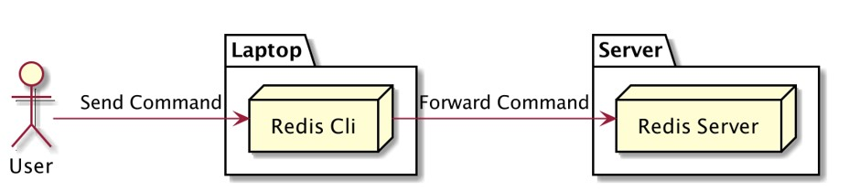

# Redis Dasar

## Sebelum Belajar

- Mengerti Database Relational (misal MySQL atau PostgreSQL)
- Mengerti cara menggunakan terminal / command prompt
- Mengerti Docker sangat direkomendasikan

## #1 Pengenalan Redis

### Sejarah Redis

- Redis singkatan dari Remote Dictionary Server adalah sistem basis data key-value berbasis memory
- Pertama kali rilis tahin 2009 sebagai project open source
- <https://redis.io/>

### Apa itu Key-Value Database?

- Redis adalah sistem basis data berbasis key-value
- Paradigma key-value paradigma dimana data disimpan dalam bentuk pair `(key-value)`
- Key mirip dengan primary key dari data, sedangkan value adalah isi dari datanya

### Key-Value Database


### Apa Itu In-Memory Database?

- Redis menyimpan datanya di memory, namun kita bisa memintanya untuk menyimpand datanya secara regular permanen di disk.
- Data di disk hanya dijadikan backup ketika redis berjalan ulang, selama redis berjalan, redis hanya akan melakukan menipulasi data di memory.

### In-Memory Database


### db-engines.com/en/ranking/key-value+store


## #2 Kapan Butuh Redis?

- Saat kita membuat aplikasi, tidak langsung wajib menggunakan Redis
- Redis menggunakan memory sebagai media penyimpanan utama, otomatis harga memory lebih mahal dibandingkan disk
- Untuk menggunakan Redis, kita perlu lihat kasusnya secara detail

### Ketika Database Utama Lambat


### Ketika Aplikasi Lain Lambat


### Ketika Ada Proses Berat di Aplikasi


### Membuat Delayed Job


### Dan masih banyak lainnya

- Rata-rata redis digunakan untuk mempercepat aplikasi yang labat
- Dan juga redis biasa digunakan untuk caching, menyimpand ata secara sementara

## #3 Menginstall Redis

- Redis bisa di install di hampir semua sistem operasi
- Namun cara untuk menginstall tiap sistem operasi berbeda-beda, kita bisa lihat petunjuk untuk menginstallnya di halaman web Redis: <https://redis.io/docs/getting-started/installation/>
- Windows: <https://redis.io/docs/getting-started/installation/install-redis-on-windows/>
- Lunux: <https://redis.io/docs/getting-started/installation/install-redis-on-linux/>
- Mac: <https://redis.io/docs/getting-started/installation/install-redis-on-mac-os/>

### Redis Server vs Redis Cli

- Saat kita menginstall Redis, ada 2 aplikasi yang terinstall, Redis Server dan Redis Cli
- Redis Server adalah aplikasi server untuk Redis itu sendiri
- Redis Cli adalah aplikasi command line untuk client, dimana digunakan untuk berkomunikasi dengan Redis Server

### Redis Server dan Redis Cli



### Konek ke Redis Server va Redis Cli

```bash
redis-cli -h <host> -p <port>
```

### Menjalankan Redis Server

```bash
$ redis-server
```

### Menjalankan Redis Cli

```bash
$ redis-cli -h localhost -p 6379
```


## #4 Configuration

- Saat menjalankan redis, redis tidak butuh file konfigurasi
- Namun jika kita menggunakan file konfigurasi, redis akan berjalan menggunakan konfigurasi default
- Ada baiknya kita membuat file konfigurasi agar pengaturannya bisa diibah
- <https://github.com/redis/redis/blob/7.0/redis.conf>

### Menjalankan Redis dengan Docker

- Docker Compose : <https://github.com/ProgrammerZamanNow/belajar-redis/blob/master/redis-with-config/docker-compose.yaml>

### Menggunakan File Configuration

```bash
$ redis-server config/redis.conf
```


## #5 Database

- Redis memiliki konsep database seperti pada relational database mysql dan postgres
- Di redis kita bisa membuat database dan menggunakan database nya
- Namun sedikit berbeda, jika relational database kita bisa membuat database dengan menggunakan nama database, di redis kita hanya bisa menggunakan angka sebagai database
- Secara default database di redis adalah 0 (nol)
- Kita bisa menggunakan database sejumlah maksimal sesuai dengan konfigurasi yang kita gunakan di file konfigurasi

### Database Configuration


### Operasi Database

| Operasi         | Keterangan                |
| --------------- | ------------------------- |
| select database | Selecting database number |

```sh
localhost:6379> select 0
OK
localhost:6379> select 1
OK
localhost:6379[1]> select 2
OK
localhost:6379[2]> select 3
OK
localhost:6379[3]>
```

## #6 Strings

### Struktur Data Redis

- Redis sebenarnya mendukung struktur data yang banyak, seperti String, List, Set, dan lain-lain
- Namun yang paling sering digunakan adalah struktur data String
- Struktur data lainnya akan kita bahas di kelas terpisah, yaitu kelas Redis Data Structure

### Operasi Data String

| Operasi           | Keterangan                         |
| ----------------- | ---------------------------------- |
| set key value     | mengubah string value dari key     |
| get key           | mendapatkan value menggunakan key  |
| exists key        | mengecek apakah key memiliki value |
| del key [key ...] | menghapus menggunakan key          |
| append key value  | manambah data value ke key         |
| keys pattern      | mencari key menggunakan patterns   |

```sh
localhost:6379> set test "ini isi test"
OK
localhost:6379> get test
OK
localhost:6379> exists test
(integer) 1
localhost:6379> append test "add more data"
(integer) 25
localhost:6379> get test
"ini isi testadd more data"
localhost:6379> keys *
1) "test"
localhost:6379> keys test*
1) "test"
localhost:6379> del test
(integer) 1
localhost:6379> get test
(nil)
localhost:6379>
```

### Operasi Range Data String

| Operasi                   | Keterangan                                 |
| ------------------------- | ------------------------------------------ |
| setrange key offset value | mengubah value dari offset yang ditentukan |
| getrange key start end    | mengambil value dari range yang ditentukan |

```sh
localhost:6379> set eko "Eko Kurniawan"
OK
localhost:6379> get eko
"Eko Kurniawan"
localhost:6379> setrange eko 4 "Kurniawan Khannedy"
(integer) 22
localhost:6379> get eko
"Eko Kurniawan Khannedy"
localhost:6379> getrange eko 4 12
"Kurniawan"
localhost:6379>
```

### Operasi Muitiple Data String

| Operasi                       | Keterangan                           |
| ----------------------------- | ------------------------------------ |
| mget key [key ...]            | Get the values of all the given keys |
| mset key value [key value ... | Set multiple keys to multiple values |

```sh
localhost:6379> mset budi "100" joko "200" rully "300"
OK
localhost:6379> mget budi joko rully
1) "100"
2) "200"
3) "300"
```

## #7 Expiration

- Secara default saat kita menyimpan data ke redis, redis akan menyimpannya secara permanen sampai kita menghapusnya
- Kadang kita mendapatkan kasus ingin menghapus data di redis secara otomatis dalam waktu tertentu
- Misal kita menyimpan data cache di redis selama 10 menit, setelah 10 menit kita akan query ulang ke database untuk mendapatkan data terbaru
- Hal ini bia dilakukan di redis, redis memiliki fitur expiration secara otomatis pada data yang kita simpan di redis

### Operasi Expiration Data String

| Operasi                 | Keterangan                            |
| ----------------------- | ------------------------------------- |
| expire key seconds      | Set a key's time to live in seconds   |
| setex key seconds value | Set the value and expiration of a key |
| ttl key                 | Get the time to live for a key        |

```sh
localhost:6379> expire eko 5
(integer) 1
localhost:6379> ttl eko
(integer) -2
localhost:6379> get eko
(nil)
localhost:6379> setex eko 10 "Eko Kurniawan Khannedy"
OK
localhost:6379> ttl eko
(integer) 7
localhost:6379> get eko
"Eko Kurniawan Khannedy"
localhost:6379> get eko
(nil)
localhost:6379>
```

## #8 Increment & Decrement

- Operasi increment & Decrement sekilas sangat mudah dilakukan, hanya tinggal mengupdate data yang di redis dengan data baru (data lama ditambah 1)
- Namun jika operasi dilakukan secara paralel dan dalam waktu yang sangat cepat, hal ini bisa memungkinkan race condition
- Untungnya redis memiliki operasi untuk melakukan increment dan decrement

### Manual Increment Decrement di Pemrograman

```js
let value = await redis.get('key')
value Number(value) + 1;
await redis.set('key', value);
```

### Operasi Increment & Decrement

| Operasi              | Keterangan                                               |
| -------------------- | -------------------------------------------------------- |
| incr key             | Increment the integer value of a key by one              |
| decr key             | Decrement the integer value of a key by one              |
| incrby key increment | Increment the integer value of a key by the given amount |
| decrby key decrement | Decrement the integer value of a key by the given number |

### Increment dan Decrement

```sh
localhost:6379> incr counter
(integer) 1
localhost:6379> incr counter
(integer) 2
localhost:6379> incr counter
(integer) 3
localhost:6379> get counter
"3"
localhost:6379> decr counter
(integer) 2
localhost:6379> decr counter
(integer) 1
localhost:6379> get counter
"1"
localhost:6379>
```

```sh
localhost:6379> incrby counter 5
(integer) 6
localhost:6379> incrby counter 5
(integer) 11
localhost:6379> incrby counter 5
(integer) 16
localhost:6379> decrby counter 3
(integer) 13
localhost:6379> decrby counter 3
(integer) 10
localhost:6379> decrby counter 3
(integer) 7
localhost:6379> decrby counter 3
(integer) 4
localhost:6379>
```

## #9 Flush

- Kadang kita butuh mengosongkan seluruh data di redis, misal ketika kesalahan kode sehingga menyebabkan data di redis salah
- Menghapus data di redis satu-satu menggunakan operasi delete bukanlah hal yang bijak
- Redis memiliki fitur untuk menghapus seluruh data di database redis, yaitu operasi flush

### Operasi Flush

| Operasi  | Keterangan                                |
| -------- | ----------------------------------------- |
| flushdb  | Remove all keys from the current database |
| flushall | Remove all keys from all database         |

### Flush

```sh
localhost:6379> mget budi joko rully
1) "100"
2) "200"
3) "3000"
localhost:6379> flushdb
OK
localhost:6379> mget budi joko rully
1) (nil)
2) (nil)
3) (nil)
localhost:6379>
```

```sh
localhost:6379> set eko "Eko"
OK
localhost:6379> select 1
OK
localhost:6379[1]> set eko "Eko"
OK
localhost:6379[1]> flushall
OK
localhost:6379[1]> get eko
(nil)
localhost:6379[1]> select 0
OK
localhost:6379> get eko
(nil)
localhost:6379>
```

### #10 Pipeline

- Perintah yang dikirim dari clinet ke server redis menggunakan Request/Response protocol
- Artinya tiap request yang dikirim ke server, maka redis akan membalasnya secara langsung
- Kadang ada kebutuhan kita mengirim data ke redis dalam jumlah besar, misal ketika ada kasus memindahkan daat dari database mysql ke redis
- Jika kita mengirim satu per satu datanya, maka akan butuh waktu lama untuk selesai
- Redis mendukung operasi baik via pipeline, dimana kita bisa mengirim beberapa perintah sekaligus dalam satu request
- Namun parlu diketahui, server redis tidak akan membalas tiap perintah yang dikirim via pipeline

### Operasi Pipeline Menggunakan Redis Cli

`redis-cli -h host -p port -n database --pipe < input-file`

> input-file.txt

```sh
set eko "Eko Kurniawan"
set budi "Budi Nugraha"
set joko "Joko Morra"
set rully "Rully Hidayat"
```

```sh
redis-cli -h localhost -p 6379 -n 0 --pipe > input-file.txt
```

## #11 Transaction

- Seperti pada database relational, redis juga mendukung transaction
- Process transaction adalah proses dimana kita mengirimkan beberapa perintah, dan perintah tersebut akan dianggap sukses jika semua perintah sukses, jika gagal maka semua perintah harus dibatalkan

### Operasi Transaction

| Operasi | Keterangan                              |
| ------- | --------------------------------------- |
| multi   | Mark the start of a transaction block   |
| exec    | Execute all commands issued after MULTI |
| discard | Discard all commands issued after MULTI |

```sh
localhost:6379> multi
OK
localhost:6379(TX)> set apple "Apple"
QUEUED
localhost:6379(TX)> set samsung "Samsung"
QUEUED
localhost:6379(TX)> set xiaomi "Xiaomi"
QUEUED
localhost:6379(TX)> exec
1) OK
2) OK
3) OK
localhost:6379> mget apple samsung xiaomi
1) "Apple"
2) "Samsung"
3) "Xiaomi"
localhost:6379>
```

```sh
localhost:6379> multi
OK
localhost:6379(TX)> set satu "Satu"
QUEUED
localhost:6379(TX)> set dua "Dua"
QUEUED
localhost:6379(TX)> set tiga "tiga"
QUEUED
localhost:6379(TX)> discard
1) OK
localhost:6379> mget satu dua tiga
1) (nil)
2) (nil)
3) (nil)
localhost:6379>
```

## #12 Monitor

- Kadang ada kasus kita ingin mendebug aplikasi saat berkomunikasi dengan redis
- Redis memiliki fitur monitor, yaitu fitur untuk memonitor semua request yang masuk ke redis server
- Dengan fitur ini kita bisa mudah mendebug jika ternyata ada perintah yang salah yang dikirim oleh aplikasi kita ke redis server

### Operasi Monitor

| Operasi | Keterangan                                                  |
| ------- | ----------------------------------------------------------- |
| monitor | Listen for all requests reveiced by the server in real time |

### Monitor

```sh
localhost:6379> get eko
"Eko Kurniawan"
localhost:6379> get budi
"Budi Nugraha"
localhost:6379> get joko
"Joko Morro"
localhost:6379>
```

```sh
localhost:6379> monitor
OK
1694652484.179546 [0 127.0.0.1:25791] "get" "eko"
1694652493.052654 [0 127.0.0.1:25791] "get" "budi"
1694652498.449780 [0 127.0.0.1:25791] "get" "joko"
```

## #13 Server Information

- Kadang kita butuh mendapatkan informasi dan statistik redis server
- Seperti jumlah memory yang sudah terpakai, konfigurasi dan lain-lain
- Redis memiliki fitur ini, sehingga kita sangat mudah untuk mendapatkan informasi server dan memonitor nya

### Operasi Server Information

| Operasi          | Keterangan                                                 |
| ---------------- | ---------------------------------------------------------- |
| info             | Get information and statistics about the server            |
| config get <key> | Get the value of a configuration parameter from redis.conf |

### Server Information

```sh
localhost:6379> info

```

```sh
localhost:6379> config get databases
1) "databases"
2) "16"
localhost:6379> config get bind
1) "bind"
1) "127.0.0.1 -::1"
localhost:6379> config get save
1) "save"
2) "460 1 360 180 60 10000"
localhost:6379>
```

## #15 Client Connection

- Redis menyimpan semua informasi client di server
- Hal ini memudahkan kita untuk melihat daftar client, dan juga mengecek jika ada anomali, seperti terlalu banyak koneksi ke redis

### Operasi Server Information

| Operasi             | Keterangan                                       |
| ------------------- | ------------------------------------------------ |
| client list         | Get the list of client connections               |
| client id           | Returns the client ID for the current connection |
| client kill ip:port | Kill the connection of a client                  |

### Client Connection

```sh
localhost:6379> client list
id=5 addr=127.0.0.1:25791 fd=13 name= age=679 idle=0 flags=N db=0 sub=0 psub=0 multi=-1 qbuf=26 qbuf-free=32742 obl=0 oll=0 omem=0 events=r cmd=client
id=7 addr=127.0.0.1:25801 fd=14 name= age=231 idle=224 flags=N db=0 sub=0 psub=0 multi=-1 qbuf=0 qbuf-free=0 obl=0 oll=0 omem=0 events=r cmd=info
localhost:6379> client id
(integer) 7
localhost:6379> client kill 127.0.0.1:64216
OK
```

## #16 Protected Mode

- Secara default, ketika kita menyalakan redis server, redis server akan mendengarkan request dari semua network interface. Ini sanget berbahaya, karena bisa jadi redis terekpos secara public
- Namun, redis punya second layer untuk pengecekan koneksi, yaitu mode protected, secara default mode protectednya aktif, artinya walaupun redis bisa diakses di manapun, tetapi redis hanya mau menerima request dari 127.0.0.1 (localhost)

### Network Configuration

```conf
...

bind 192.168.68.155

...

protected-mode yes
```

### Protected Mode

```sh
redis-cli -h 192.168.68.155 -p 6379 -n 0
```

## #17 Security

### Authentication

- Authentication adalah proses verifikasi identitas untuk memastikan bahwa yang mengakses adalah identitas yang besar
- Redis memiliki fitur authentication, dan kita bisa menambahkannya di file konfigurasi di server redis
- Namun perlu diingat, proses authentication di redis itu sangat cepat, jadi pastikan gunakan password sepanjang mungkin agar tidak mudah untuk di brute force

### Authorization

- Authorization adalah proses memberikan hak akses terhadap identitas yang telah berhasil melewati proses authentication
- Redis mendukung hal ini, jika kita bisa membatasi hak akses apa saja yang bisa dilakukan oleh identitas yang kita bua
- <https://redis.io/topics/acl>
- <https://redis.io/commands/acl-cat>

### Security

> redis.conf

```conf
user default on +@connection
user eko on +@all ~* >rahasia
```

### Authentication

| Operasi                    | Keterangan                                               |
| -------------------------- | -------------------------------------------------------- |
| auth <username> <password> | Melakukan authentikasi menggunakan username dan password |

```sh
redis-cli -h 192.168.68.153 -p 6379 -n 0
192.168.68.153:6379> mget eko budi joko
(error) NOAUTH Authentication required.
192.168.68.153:6379> auth eko rahasia
OK
192.168.68.153:6379> mget eko budi joko
1) "Eko Kurniawan"
2) "Budi Nugraha"
3) "Joko Morro"
192.168.68.153:6379>
```

## #18 Persistence

- Media penyimpanan utama redis adalah di memory
- Namun kita bisa menyimpan data di memory redis tersebut di disk jika kita mau
- Namun perlu diingat proses penyimpanan data ke disk tidak realtime, dia dilakukan secara scheduler dengan konfigurasi tertentu
- Jadi jangan jadikan redis sebagai media penyimpanan persistence, gunakan redis sebagai database untuk membantu database persistence lainnya

### Persistence Config

> redis.conf

```conf
...

save 3600 1 300 100 60 10000
```

### Operasi Persistence

| Operasi | Keterangan                              |
| ------- | --------------------------------------- |
| save    | Synchronously save the dataset to disk  |
| bgsave  | Asynchronously save the dataset to disk |


## #19 Eviction

### Ketika Memory Redis Penuh

- Ketika memory redis penuh, maka redis secara default akan mereject semua request penyimpanan data
- Hal ini mungkin menjadi masalah ketika kita hanya menggunakan redis sebagai cache untuk media penyimpanan sementara
- Kadang akan sangat berguna jika memory penuh, redis bisa secara otomatis menghapus data yang sudah jarang digunakan

### Eviction

- Redis mendukung fitur eviction (menghapus data lama, dan menerima data baru)
- Namun untuk menghaktifkan fitur ini, kita perlu memberi tahu redis, maximum memory yang boleh digunakan, dan bagaimana strategi untuk melakukan eviction nya
- <https://redis.io/docs/reference/eviction/>

### Eviction Config

> redis.conf

```conf
...

maxmemory 18mb

...

maxmemory-policy noeviction
```

## Materi Selanjutnya

- Redis Data Structure
- Redis Pubsub
- Redis Replication
- Redis Cluster

