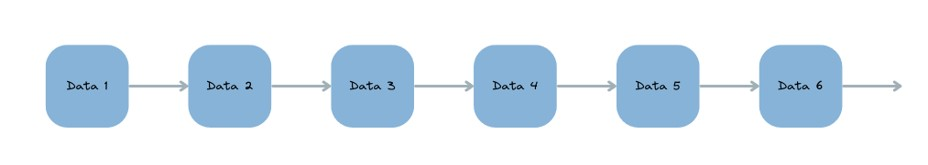
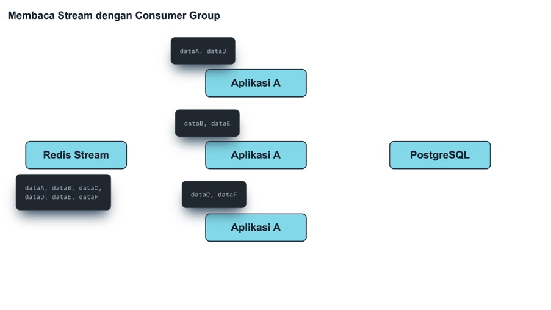

# Redis Data Structure

## Sebelum Belajar

- Redis Dasar

## #1 Pengenalan Redis Data Structure

- Pada kelas Redis Dasar, kita sudah belajar tentang struktur data String
- Sebenarnya, masih banyak struktur data yang bisa kita gunakan di Redis, dan di kelas ini kita akan bahas tuntas struktur data apa saja yang bisa kita gunakan
- Tiap jenis Struktur Data memiliki kegunaan masing-masing, sehingg kita bisa gunakan pada kasus-kasus yang berbeda untuk tiap struktur data

### Struktur Data di Redis

| Struktur Data | Keterangan                                                   |
| ------------- | ------------------------------------------------------------ |
| Lists         | Struktur data Linked List yang berisi data string            |
| Sets          | Koleksi data string yang tidak berurut                       |
| Hashes        | Struktur data key-value                                      |
| Sorted Sets   | Struktur data seperti Sets, namun berurut                    |
| Stream        | Struktur data seperti log yang selalu bertamnbah dibelakang  |
| Geospital     | Struktur data koordinat                                      |
| HyperLogLog   | Struktur data untuk melakukan estimasi kardinalitas dari Set |

## #2 Lists

- Lists adalah struktur data berupa Linked List yang berisi data string
- Lists mirip seperti Array, dimana tiap data yang terdapat di Lists memiliki nomor index
- Lists biasa digunakan untuk membuat Queue (antrian) atau Stack (tumpukan)

### Diagram: Linked List



### Lists Commands

- Terdapat banyak sekali perintah-perintah yang bisa kita gunakan untuk struktur data List
- Kita bisa lihat semua perintahnya di halaman dokumentasi
- <https://redis.io/commands/?group=list>

### Lists sebagai Queue

```sh
127.0.0.1:6379> lpush queue "Eko"
(integer) 1
127.0.0.1:6379> lpush queue "Budi"
(integer) 2
127.0.0.1:6379> lpush queue "Joko"
(integer) 3
127.0.0.1:6379> lrange queue 0 2
1) "Joko"
2) "Budi"
3) "Eko"
127.0.0.1:6379>
```

```sh
127.0.0.1:6379> rpop queue 1
1) "Eko"
127.0.0.1:6379> rpop queue 1
1) "Budi"
127.0.0.1:6379> rpop queue 1
1) "Joko"
127.0.0.1:6379> rpop queue 1
(nil)
127.0.0.1:6379>
```

### Lists sebagai Stack

```sh
127.0.0.1:6379> lpush stack "Eko"
(integer) 1
127.0.0.1:6379> lpush stack "Budi"
(integer) 2
127.0.0.1:6379> lpush stack "Joko"
(integer) 3
127.0.0.1:6379> lrange stack 0 2
1) "Joko"
2) "Budi"
3) "Eko"
127.0.0.1:6379>
```

```sh
127.0.0.1:6379> lpop queue 1
1) "Joko"
127.0.0.1:6379> lpop queue 1
1) "Budi"
127.0.0.1:6379> lpop queue 1
1) "Eko"
127.0.0.1:6379> lpop queue 1
(nil)
127.0.0.1:6379>
```

## #3 Sets

- Sets adalah struktur data mirip seperti Lists, namun yang membedakan adalah, pada Sets, isi data harus unik
- Jika kita memasukan data yang sebelumnya sudah ada, maka otomatis data tersebut tidak akan diterima
- Data di Sets itu, tidak berurutan sesaui waktu kita memasukkan data ke Sets, jadi kita tidak bisa menjamin urutan data di dalam Sets, hal ini dikarenakan data Sets

### Sets Commands

- Terdapat banyak sekali perintah-perintah yang bisa kita gunakan untuk struktur data Sets
- Kita bisa lihat semua perintahnya di halaman dokumentasi:
- <https://redis.io/commands/?group=set>

### Menambah data ke Sets

```sh
127.0.0.1:6379> sadd tace "Eko" "Budi" "Joko"
(integer) 3
127.0.0.1:6379> sadd race "Budo" "Joko" "Eko"
(integer) 0
127.0.0.1:6379> scard race
(integer) 3
127.0.0.1:6379> smembers race
1) "Eko"
2) "Budi"
3) "Joko"
127.0.0.1:6379>
```

### Menghapus data dari Sets

```sh
127.0.0.1:6379> srem race "Eko" "Kurniawan" "Khannedy"
(integer) 1
127.0.0.1:6379> smembers race
1) "Budi"
2) "Joko"
127.0.0.1:6379>
```

### Membandingkan Set

- Karena Sets adalah struktur data yang berisi nilai-nilai yang unik, terdapat operasi yang bisa kita gunakan untuk membandingkan antar Sets
- SDIFF digunakan untuk melihat perbedaan (different) dari Sets pertama dengan Sets lainnya
- SINTER digunakan untuk melihat kesamaan (intersect) dari beberapa Sets
- SUNION digunakan untuk melihat gabungan untuk (union) dari beberapa Sets

### Membandingkan Sets

```sh
127.0.0.1:6379> sadd race2 "Budi" "Nugraha" "Joko" "Morro"
(integer) 4
127.0.0.1:6379> sadd race3 "Joko" "Morro" "Rully" "Hidayat"
(integer) 4
127.0.0.1:6379>
```

```sh
127.0.0.1:6379> sdiff race race3
1) "Budi"
127.0.0.1:6379> sdiff race race2
(empty array)
127.0.0.1:6379>
```

```sh
127.0.0.1:6379> sinter race race2
1) "Budi"
2) "Joko"
127.0.0.1:6379> sinter race race2 race3
1) "Joko"
127.0.0.1:6379>
```

```sh
127.0.0.1:6379> sunion race race2 race3
1) "Budi"
2) "Joko"
3) "Nugraha"
4) "Morro"
5) "Rully"
6) "Hidayat"
127.0.0.1:6379>
```

## #4 Hashes

- Hashes adalah struktur data berbentuk pair (key-value)
- dengan menggunakan struktur data Hashes ini, kita bisa gunakan kay untuk value yang kita ingin gunakan
- Berbeda dengan Lists yang menggunakan index, pada Hashes, kita bisa menggunakan key apapun yang kita mau

### Hashes Commands

- Terdapat banyak sekali perinah-perintah yang bisa kita gunakan untuk struktur data Hashed
- Kita bisa lihat semua perintahnya di halaman dokumentasi
- <https://redis.io/commands/?group=hash>

### Membuat Hash

```sh
127.0.0.1:6379> hset "student:1" name "Eko Kurniawan" value 100 address "Jakarta"
(integer) 3
127.0.0.1:6379> hset "student:2" name "Budi Nugraha" value 90 address "Bandung"
(integer) 3
127.0.0.1:6379> hset "student:3" name "Joko Morro" value 80 address "Cirebon"
(integer) 3
127.0.0.1:6379> hget "student:1" name
"Eko Kurniawan"
127.0.0.1:6379> hget "student:2" name
"Budi Nugraha"
127.0.0.1:6379> hgetall "student:3"
1) "name"
2) "Joko Morro"
3) "value"
4) "80"
5) "address"
6) "Cirebon"
127.0.0.1:6379>
```

### Increment & Decrement

- Redis memiliki perintah yang bisa digunakan untuk melakukan increment dan decrement pada value yang terdapat pada Hashes
- Kita bisa menggunakan perintah HINCRBY

### Increment & Decrement Hash

```sh
127.0.0.1:6379> hincrby "student:1" value -10
(integer) 90
127.0.0.1:6379> hincrby "student:2" value -5
(integer) 85
127.0.0.1:6379> hincrby "student:3" value 5
(integer) 85
127.0.0.1:6379> ghetall "student:1"
1) "name"
2) "Eko Kurniawan"
3) "value"
4) "90"
5) "address"
6) "Jakarta"
127.0.0.1:6379>
```

## #5 Sorted Sets

- Sorted Sets adalah struktur data mirip Sets, namun datanya diurutkan sesuai dengan nilai score yang kita tentukan
- Jika terdapat score dengan nilai yang sama, secara otomatis akan diurutkan secara lexicographically
- Dalam Sorted Sets, data dikatakan unik jika Value dan Score nya sama, artinya kita masih bisa menambahkan Value sama, jika Score nya berbeda
- Score bernilai number, dan diurutkan secara ascending (dari terkecil ke terbesar)

### Sorted Sets Commands

- Terdapat banyak sekali perintah-perintah yang bisa kita gunakan untuk struktur data Hashes
- Kita bisa lihat semua perintahnya di halaman dokumentasi:
- <https://redis.io/commands/?group=sorted-set>

### Menambahkan Data ke Sorted Set

```sh
127.0.0.1:6379> zadd ranking 100 "Eko"
(integer) 1
127.0.0.1:6379> zadd ranking 90 "Budi"
(integer) 1
127.0.0.1:6379> zadd ranking 95 "Joko"
(integer) 1
127.0.0.1:6379> zcard ranking
(integer) 3
127.0.0.1:6379> zrange ranking 0 3
1) "Bufi"
2) "Joko"
3) "Eko"
127.0.0.1:6379> zrange ranking 95 100 byscore
1) "Joko"
2) "Eko"
127.0.0.1:6379>
```

### Mengambil Data dari Sorted Set

```sh
127.0.0.1:6379> zrem ranking "Eko"
(integer) 1
127.0.0.1:6379> zremrangebyscore ranking 0 75
(integer) 0
127.0.0.1:6379> zrange ranking 0 -1 withscores
1) "Budi"
2) "90"
3) "Joko"
4) "95"
127.0.0.1:6379>
```

## #6 Streams

- Streams adalah struktur data seperti log, dimana data akan bertambah terus di belakang (append-only)
- Streams cocok untuk menyimpan data kejadian yang biasanya berurut
- Setiap data yang kita masukkan ke dalam Streams, Redis akan membuat id unik jika tidak kita tentukan id nya
- Data yang kita masukkan ke dalam Streams adalah data berupa key-value, seperti Hash

### Streams Command

- Terdapat banyak sekali perintah-perintah yang bisa kita gunakan untuk struktur data Streams
- Kita bisa lihat semua perintahnya di halaman dokumentasi
- <https://redis.io/commands/?group=stream>

### Menambah Data dari Streams

```sh
127.0.0.1:6379> xadd application.log > level "info" message "contoh info message"
"1695553710429-0"
127.0.0.1:6379> xadd application.log > level "error" message "contoh error message"
"1695553710422-0"
127.0.0.1:6379> xadd application.log > level "warning" message "contoh warning message"
"1695553710409-0"
127.0.0.1:6379> xread streams application.log 0
1) 1) "1695553710429-0"
	 2) 1) "level"
	 		2) "info"
			3) "message"
			4) "contoh info message"
2) 1) "1695553710422-0"
	 2) 1) "level"
	 		2) "error"
			3) "message"
			4) "contoh error message"
3) 1) "1695553710409-0"
	 2) 1) "level"
	 		2) "warning"
			3) "message"
			4) "contoh warning message"
127.0.0.1:6379>
```

### Masalah dengan Streams

- Saat kita membuat aplikasi, biasanys kita akan menjalankan di beberapa server, untuk menjaka high availability
- Apa yang terjadi jika misal kita membaca data dari Redis Stream ketika aplkasi kita berjalan di beberapa Server?
- yang terjadi adalah, data yang sama akan dibaca oleh aplikasi di tiap Server, artinya bisa terjadi duplikasi ketika kita membaca Stream di aplikasi yang berjalan di beberapa Server

### Membaca Stream di Beberapa Server


### Masalah Dengan Multiple Application

> stream

```sh
127.0.0.1:6379> xadd problem > just test
"1695553710461-0"
127.0.0.1:6379>
```

> app1

```sh
127.0.0.1:6379> xread block 0 streams problem 0
1) 1) "problem"
	 2) 1) 1) "1695553710461-0"
	  		 2) 1) "just"
						2) "test"
(22.50s)
127.0.0.1:6379>
```

> app2

```sh
127.0.0.1:6379> xread block 0 streams problem 0
1) 1) "problem"
	 2) 1) 1) "1695553710461-0"
	  		 2) 1) "just"
						2) "test"
(19.21s)
127.0.0.1:6379>
```

### Consumer Group

- Dalam Stream, yang membaca data kita sebut Consumer, artinya jika terdapat beberapa aplikasi, membaca data ke Stream, artinya adalah Multiple Consumer
- Pada kasus Multiple Consumer ini, kita bisa tangani dengan fitur bernama Consumer Group
- Consumer Group akan memastikan bahsa dalam satu Group, data hanya akan dikirim ke salah satu Consumer saja, sehingga tidak terjadi data di baca lebih dari satu kali oleh Consumer yang berbeda

### Membaca Stream dengan Consumer Group



### Menggunakan Consumer Group

- Untuk Menggunakan fitur Consumer Group, kita harus membuat Group terlebih dahulu menggunakan perintah XGROUP CREATE
- Selanjutnya artinya saat kita ingin membaca data dari Stream, kita harus menyebutkan Group dan juga nama consumer nya, dengan perintah XREADGROUP

### Membuat Consumer Group

```sh
127.0.0.1:6379> xgroup create registration member $ mkstream
OK
127.0.0.1:6379> xgroup createconsumer registration member member-cunsumer-1
(integer) 1
127.0.0.1:6379> xgroup createconsumer registration member member-cunsumer-2
(integer) 1
127.0.0.1:6379> xadd registration * userId 1
"1695572115542-0"
127.0.0.1:6379> xadd registration * userId 2
"1695572120491-0"
127.0.0.1:6379> xadd registration * userId 3
"1695572116113-0"
127.0.0.1:6379> xadd registration * userId 4
"16955721232571-0"
127.0.0.1:6379>
```

### Menggunakan Consumer Group

```sh
127.0.0.1:6379> xreadgroup group member member-cunsumer-1 count 1 block 0 streams registration >
1) 1) "registration"
	2) 1) 1) "1695572115542-0"
				2) 1) "userId"
					 2) "1"
127.0.0.1:6379> xreadgroup group member member-cunsumer-1 count 1 block 0 streams registration >
1) 1) "registration"
	2) 1) 1) "1695572120491-0"
				2) 1) "userId"
					 2) "2"
127.0.0.1:6379> xreadgroup group member member-cunsumer-2 count 1 block 0 streams registration >
1) 1) "registration"
	2) 1) 1) "1695572116113-0"
				2) 1) "userId"
					 2) "3"
127.0.0.1:6379> xreadgroup group member member-cunsumer-2 count 1 block 0 streams registration >
1) 1) "registration"
	2) 1) 1) "16955721232571-0"
				2) 1) "userId"
					 2) "3"
```

## #7 Geospatial

- Struktur data geospatial digunakan untuk menyimpan data koordinat
- Struktur data ini sangat bagus untuk mencari koordinat terdekat, jarak, radius dan lain-lain

### Geospatial Command

- Terdapat banyak sekali perintah-perintah yang bisa kita gunakan untuk struktur data Geospatial
- Kita bisa lihat semua perintahnya di halaman dokumentasi :
- <https://redis.io/commands/?group=geo>

### Menambah Data Geospatial

```sh
127.0.0.1:6379> geoadd seller.location 108.158860 -6.807992 seller1
(integer) 1
127.0.0.1:6379> geoadd seller.location 108.164003 -6.806307 seller2
(integer) 1
127.0.0.1:6379> geopos seller.location seller1
1) 1) "104.15783718731"
	 2) "-6.878184718481"
127.0.0.1:6379> geopos seller.location seller2
1) 1) "104.16941948194"
	 2) "-6.863716317313"
```

### Mencari Data Geospatial

```sh
127.0.0.1:6379> geodist seller.location seller1 seller2 km
"0.5982"
127.0.0.1:6379> geodist seller.location seller1 seller2 m
"598.2125"
127.0.0.1:6379> geosearch seller.location fromlonlat 108.160707 -7.804819 BYRADIUS 1 km
1) "seller2"
2) "seller1"
```

## #8 HyperLogLog

- HyperLogLog adalah struktur data probabilistik untuk melakukan estimasi kardinalitas (jumlah data unik) dari Set
- Struktur data probabilistik biasanya digunakan untuk membuat memory penyimpanan lebih efisien
- Untuk menghitung jumlah data unik menggunakan Set, biasanya kita akan menggunakan struktur data Set, namun semakin banyak datanya, semakin besar ukuran Set nya
- Dengan menggunakan HyperLogLog, kita bisa mengestimasi jumlah data unik Set, hanya dengan menggunakan maksimal `12KB` memory, dan standar error `0,81%`

### HyperLogLog Command

- Terdapat banyak sekali perintah-perintah yang bisa kita gunakan untuk struktur data HyperLogLog
- Kita bisa lihat semua perintahnya di halaman dokumentasi :
- <https://redis.io/commands/?group=hyperloglog>

### Menggunakan HyperLogLog

```sh
127.0.0.1:6379> pfadd visitor eko budi joko rully
(integer) 1
127.0.0.1:6379> pfadd visitor eko santi sinta budi
(integer) 1
127.0.0.1:6379> pfcount visitor
(integer) 6
127.0.0.1:6379> del visitor
(integer) 1
127.0.0.1:6379>
```

## #9 Struktur Data Lainnya

- Selain struktur data yang sudah kita bahas, masih ada struktur data yang mungkin jarang kita gunakan, namun didukung oleh Redis
- Bitmaps : <https://redis.io/docs/data-types/bitmaps/>
- Bitfields : <https://redis.io/docs/data-types/bitfields/>
- Ini adalah struktur data untuk menyimpan data dalam tipe bit

### Struktur Data Redis Stack / Enterprise

- Di kelas ini, kita hanya membahas struktur data di Redis versi Open Source. Jika kita menggunakan Redis versi yang bukan Open Source atau versi Enterprise, terdapat struktur data lain yang didukung, seperti :
- JSON : <https://redis.io/docs/data-types/json/>
- TimeSeries : <https://redis.io/docs/data-types/timeseries/>
- Probabilistic : <https://redis.io/docs/data-types/probabilistic/>

## #10 Materi Selanjutnya

- Redis Pubsub
- Redis Replication
- Redis Cluster
