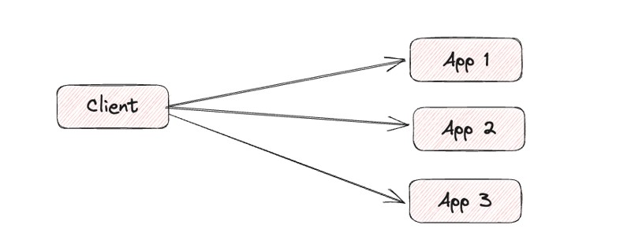
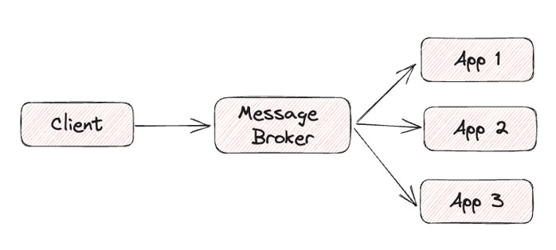
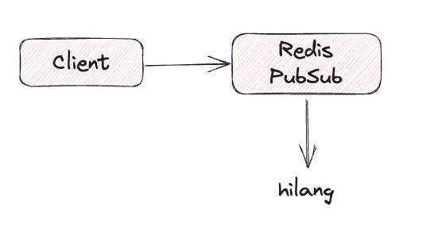
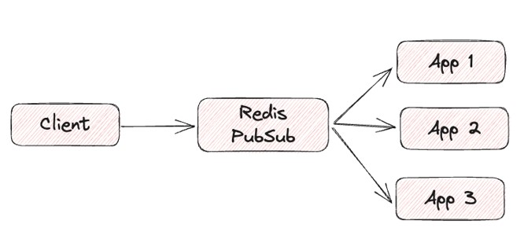
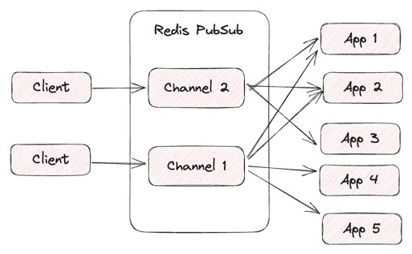

# Redis PubSub

## Sebelum Belajar

- Redis Dasar
- Redis Data Structure

## #1 Pengenalan PuSub

### Integrasi Antar Aplikasi

- Saat kita membuat aplikasi, salah satu yang biasa kita lakukan adalah integrasi antar aplikasi
- Saat kita membutuhkan data dari aplikasi lain, maka kita akan melakukan integrasi antar aplikasi
- Ada banyak cara untuk melakukan integrasi antar aplikasi, dari mulai sharing file, sharing database, menggunakan API sampai menggunakan messaging
- Redis PubSub, adalah salah satu cara melakukan integrasi antar aplikasi menggunakan messaging

### Permasalahan di API

- Saat kita melakukan integrasi antar aplikasi menggunakan API, kadang ada kasus kita harus mengirim data ke lebih dari satu aplikasi
- Saat menggunakan API, kita harus mengirim ke lebih dari satu aplikasi tersebut secara manual satu persatu, semakin banyak aplikasi, semakin lama prosesnya
- Oleh karena itu, dalam kasus seperti ini, menggunakan messaging lebih cocok dibandingkan menggunakan API

### Diagram: Integrasi Menggunakan API



### Diagram: Integrasi Menggunakan Messaging



## #2 Redis PubSUb

- Redis PubSub adalah salah satu fitur di Redis yang bisa digunakan untuk implementasi integrasi menggunakan messaging menggunakan teknik Publish Subscribe
- Cara kerja Redis PubSub sedikit berbeda dengan aplikasi PubSub pada umumnya, dimana Redis hanya akan mengirim data di PubSub ketika terdapat Consumer/Subscriber
- Jika tidak ada Consumer/Publisher, maka Redis tidak akan mengirimkan data apapun, dan secara otomatis datanya akan hilang
- Oleh karena itu, jangan gunakan Redis PubSub sebagai media penyimpanan atau untuk antrian

### Diagram: Redis PubSub (1)



### Diagram: Redis PubSub (2)



### Database Scoping

- Fitur Redis PubSub tidak seperti Struktur Data, dimana dalam Struktur Data, scope/lokasi data terdapat dalam database
- Sedangkan dalam Redis PubSub, ini tidak terikat dengan database, oleh karena itu jika kita mengirim data dari database 0, lalu menerima data di database 7, hal ini bisa dilakukan

## #3 Channel

- Channel adalah key yang digunakan untuk mengirim dan menerima data di PubSub
- `Publisher` (pengirim data) akan mengirim data ke channel
- `Subscriber` (penerima data) akan menerima data dari channel
- Kita bisa membuat banyak nama channel di Redis PubSub

### Diagram: Channel



## #4 Subscriber

- Seperti di awal dijelaskan, jika kita mengirim data ke Channel, tapi belum ada Subscriber nya, secara otomatis datanya akan hilang, oleh karena itu ada baiknya di awal kita menjalankan Subscriber nya terlebih dahulu
- Untuk membuat Subscriber, kita bisa menggunakan perintah `SUBSCRIBE`
- Untuk menghentikan Subscriber, kita bisa menggunakan perintah `UNSUBSCRIBE`
- <https://redis.io/commands/?group=pubsub>

### Redus PubSub - Subscriber

```sh
127.0.0.1:6379> subscribe chat notification
1) "subscribe"
2) "chat"
3) (intege4) 1
1) "subscribe"
2) "notification"
3) (integer) 2

127.0.0.1:6379> subscribe chat
1) "subscribe"
2) "chat"
3) (integer) 1
```

## #5 Publisher

- Setelah menjalankan Subscriber, kita bisa membuat Publisher untuk mengirim data ke channel
- Untuk mendapatkan daftar channel yang ada, kita bisa menggunakan perintah `PUBSUB` `CHANNELS`
- Untuk mengirim data ke channel, kita bisa menggunakan perintah `PUBLISH`
- <https://redis.io/commands/?group=pubsub>

### Redis PubSub - Publisher

```sh
127.0.0.1:6379> publish chat "Hello world"
(integer) 2
127.0.0.1:6379> publish notification "new order"
(integer) 1
127.0.0.1:6379> publish chat "welcome"
(integer) 2
127.0.0.1:6379>
```

## #6 Limitation

### Delivery Semantics

- Redis PubSub mengirim data menggunakan at-most-once semantic, artinya paling banyak satu kali
- Jika misal Subscriber tidak mampu menangani data dengan baik, misal terjadi error. Maka Redis PubSub tidak akan bisa mengirimkan ulang data nya, datanya sudah hilang selamanya
- Oleh karena itu, jika aplikasi yang kita buat tidak ingin sampai kehilangan data, atau ingin bisa melakukan pembacaan data ulang, maka disarankan menggunakan Redis `Streams`

### Broadcast

- Redis PubSub menggunakan sistem broadcast dalam mengirim data ke Subscriber, artinya tidak peduli berapa banyak Subscriber, maka semua Subscriber akan menerima data yang sama
- Jika ternyata Subscriber adalah aplikasi yang sama, sehingga kita tidak ingin menerima data yang sama, maka hal ini tidak bisa dilakukan di Redis PubSub
- Untuk menangani hal ini, disarankan menggunakan Consumer Group di Redis `Streams`

## #7 Materi Selanjutnya

- Redis Replication
- Redis Cluster
