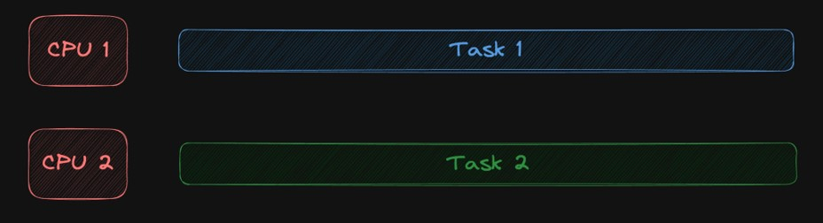

# Rust Concurrency

## Sebelum Belajar

- Rust Dasar
- Rust Crate
- Rust Unit Test

## #1 Pengenalan Concurrency dan Parallel

- Saat ini kita hidup di era multicore, dimana jarang sekali kita menggunakan prosesor yang single core
- Semakin canggih perangkat keras, maka software pun akan mengikuti, dimana sekarang kita bisa dengan mudah membuat proses parallel di aplikasi.
- Parallel programming sederhananya adalah memecahkan suatu masalah dengan cara membaginya menjadi yang lebih kecil, dan dijalankan secara bersamaan pada waktu yang bersamaan pula

### Contoh Parallel

- Menjalankan beberapa aplikasi sekaligus di sistem operasi kita (office, editor, browser, dan lain-lain)
- Beberapa koki menyiapkan makanan di restoran, dimana tiap koki membuat makanan masing-masing
- Antrian di Bank, dimana tiap teller melayani nasabah nya masing-masing

### Process vs Thread

| Process                                       | Thread                                                     |
| --------------------------------------------- | ---------------------------------------------------------- |
| Process adalah sebuah eksekusi program        | Thread adalah segmen dari program                          |
| Process mengkonsumsi memory besar             | Thread menggunakan memory kecil                            |
| Process saling terisolasi dengan process lain | Thread bisa saling berhubungan jika dalam proses yang sama |
| Process lama untuk dijalankan dan dihentikan  | Thread cepat untuk dijalankan dan dihentikan               |

### Parallel vs Concurrency

- Berbeda dengan paralel (menjalankan beberapa pekerjaan secara bersamaan), concurrency adalah menjalankan beberapa pekerjaan secara bergantian
- Dalam parallel kita biasanya membutuhkan banyak Thread, sedangkan dalam concurrency, kita hanya membutuhkan sedikit Thread

### Diagram Sequential


### Diagram Parallel



### Diagram Concurrent


### Diagram Parallel & Concurrent


### Contoh Concurrent

- Saat kita makan di cafe, kita bisa makan, lalu ngobrol, lalu minum, makan lagi, ngobrol lagi, minum lagi, dan seterusnya. Tetapi kita tidak bisa pada saat yang bersamaan minum, makan dan ngobrol, hanya bisa melakukan satu hal pada satu waktu, namun bisa berganti kapanpun kita mau.

### CPU-bound

- Banyak algoritma dibuat yang hanya membutuhkan CPU untuk menjalankannya. Algoritma jenis ini biasanya sangat tergantung dengan kecepatan CPU.
- Contoh yang paling populer adalah Machine Learning, oleh karena itu sekarang banyak sekali teknologi Machine Learning yang banyak menggunakan GPU karena memiliki core yang lebih banyak dibanding CPU biasanya.
- Jenis algoritma seperti ini tidak ada benefitnya menggunakan Concurrency Programming, namun bisa dibantu dengan implementasi Parallel Programming.

### I/O-bound

- I/O-bound adalah kebalikan dari sebelumnya, dimana biasanya algoritma atau aplikasinya sangat tergantung dengan kecepatan input output devices yang digunakan.
- Contohnya aplikasi seperti membaca data dari file, database, dan lain-lain.
- Kebanyakan saat ini, biasanya kita akan membuat aplikasi jenis seperti ini.
- Aplikasi jenis I/O-bound, walaupun bisa terbantu dengan implementasi Parallel Programming, tapi benefitnya akan lebih baik jika menggunakan Concurrency Programming.
- Bayangkan kita membaca data dari database, dan Thread harus menunggu 1 detik untuk mendapat balasan dari database, padahal waktu 1 detik itu jika menggunakan Concurrency Programming, bisa digunakan untuk melakukan hal lain lagi

## #2 Membuat Project

- Buatlah project dengan nama belajar-rust-concurrency menggunakan perintah :
- `cargo new belajar-rust-concurrency`

## #3 Thread

### Thread

- Saat kita menjalankan aplikasi, aplikasi akan dijalankan dalam process, process akan diatur oleh sistem operasi
- Dalam process, kita bisa membuat `thread` untuk menjalankan kode secara `parallel` dan `asynchronous`
- Di Rust, kita bisa menggunakan module `std::thread` untuk membuat `thread`
- <https://doc.rust-lang.org/std/thread/>

### Membuat Thread

- Untuk membuat thread baru yang berjalan secara parallel dan async, kita bisa menggunakan `std::thread::spawn(closure)`

### Kode: Membuat Thread

```rs
#[cfg(test)]
mod tests {
	use std::thread;
	use std::time::Duration;

	#[test]
	fn test_create_thread() {
		thread::spawn(|| {
			for in 1..=5 {
				println!("counter {}", i);
				thread::sleep(Duration::from_secs(1));
			}
		});

		println!("application finished");
		thread::sleep(Duration::from_secs(7));
	}
}
```

### Menjalankan Unit Test

- Secara default, semua output dari unit test akan ditangkap oleh Rust Test Runner
- Saat kita gunakan parameter `--show-output`, maka output akan ditampilkan setelah test selesai
- Kadang, kita ingin menampilkan output secara realtime di terminal, kita bisa disable fitur capture untuk menangkap output dengan parameter `--nocapture` :
- `cargo test module::test_function -- --nocapture`

### Kode: Menjalankan Unit Tsst

```sh
cargo test tests::test_create_thread -- --nocapture
```


## #4 Join Thread

- Saat kita menjalankan thread menggunakan spawn function, maka dia akan mengembalikan data `JoinHandle<T>`
- `JoinHandler` bisa digunakan untuk melakukan join thread dengan memanggil method `join()`
- Method `join()` akan mengembalikan `Result<T>`, sesuai dengan return dari thread nya

### Kode: Join Thread

```rs
#[cfg(test)]
mod tests {
	use std::thread;
	use std::time::Duration;

	#[test]
	fn test_create_thread() {
		let handle: thread::JoinHandle<i32> = thread::spawn(|| {
    	let mut counter = 0;
	    for i in 1..=5 {
        println!("counter {}", i);
        thread::sleep(Duration::from_secs(1));
        counter = counter + 1;
      }
      return counter;
    });

  	let result = handle.join();
    match result {
      Ok(counter) => println!("total counter: {}", counter),
      Err(error) => println!("error: {:?}", error),
    }

    println!("application finished");
 		thread::sleep(Duration::from_secs(7));
	}
}
```

### Keuntingan Menggunakan Thread

- Misal kita butuh melakukan dua kalkulasi berat, jika kita lakukan tanpa menggunakan thread, artinya kode akan dieksekusi secara synchronous dan sequential
- Jika tiap kalkulasi membutuhkan waktu misal 5 detik, maka kita butuh 10 detik untuk menyelesaikan tiap kalkulasi
- Namun jika kita jalankan menggunakan thread, artinya kalkulasi akan dijalankan secara asynchronous dan parallel, sehingga bisa jadi total waktu untuk menyelesaikan seluruh kalkulasi, hanya butuh waktu 5 detik

### Diagram: Synchronous dan Sequential vs Async dan Parallel


### Kode: Synchronous dan Sequential

```rs
fn calculate() -> i23 {
	let mut couter = 0;
	for i in 1..=5 {
		println!("counter: {}", i);
		thread::sleep(Duration::from_secs(1));
		counter = counter + 1;
	}
	return counter;
}

#[test]
fn test_sequential() {
	let result1 = calculate();
	let result2 = calculate();
	println!("total counter 1: {}", result1);
	println!("total counter 2: {}", result2);
  println!("application finish");
}
```

### Kode: Asynchronous dan Parallel

```rs
#[test]
fn test_parallel() {
	let handle1: thread::JoinHandle<i32> = thread::spawn(|| calculate());
	let handle2: thread::JoinHandle<i32> = thread::spawn(|| calculate());

	let result1 = handle1.join();
	let result2 = handle2.join();
	match result1 {
		Ok(counter) => println!("total couter 1: {}", counter);
		Ok(error) => println!("error: {:?}", error);
	}
	match result2 {
		Ok(counter) => println!("total couter 2: {}", counter);
		Ok(error) => println!("error: {:?}", error);
	}
  println!("application finish");
}
```

## #5 Move Keyword

### Closure

- Saat kita menjalankan thread, kita menggunakan `spawn()` function, dimana parameternya adalah `function`
- Biasanya, kita akan menggunakan function dalam bentuk `closure`
- Saat kita menggunakan variable dari luar closure, hal ini diperbolehkan, seperti yang sudah kita bahas di materi Rust Dasar
- Namun, jika closure tersebut dikirim sebagai parameter di function lain, contoh di `spawn()`, maka Rust melarang itu, karena variable yang digunakan oleh closure tersebut harus dipindahkan ownership nya ke closure

### Kode: Closure

```rs
#[test]
fn test_closure() {
	let name = String::from("Eko");
	let closure = || {
		thread::sleep(Duration::from_secs(2));
		println!("Hello, {}", name);
	};

	closure();
}
```

### Kode: Closure Thread

```rs
#[test]
fn test_closure() {
	let name = String::from("Eko");
	let closure = || {
		thread::sleep(Duration::from_secs(2));
		println!("Hello, {}", name);
	};

	let handler = thread::spawn(closure);
	handler.join().unwrap();
}
```

### Kenapa Error?

- Rust akan menjadikan hal ini error, yaitu error : <https://doc.rust-lang.org/error_codes/E0373.html>
- Sederhananya adalah, jika kita melakukan hal itu, ditakutkan variable yang digunakan dalam Closure alur hidupnya tidak sepanjang thread yang berjalan
- Karena bisa jadi variable nya sudah dihapus dari memory, sedangkan thread nya masih berjalan, dengan demikian secara otomatis thread akan menggunakan variable yang datanya sudah tidak ada di memory alias Dangling Pointer
- Solusinya adalah, kita tidak boleh menggunakan variable diluar scope closure, atau memaksa variable tersebut berpindah scope ke closure, menggunakan kata kunci `move`

### Kode: Move Variable Scope

```rs
#[test]
fn test_closure() {
	let name = String::from("Eko");
	let closure = move || {
		thread::sleep(Duration::from_secs(2));
		println!("Hello, {}", name);
	};

	let handler = thread::spawn(closure);
	handle.join().unwrap();

	// error karena scope variable name sudah berpindah
	println!("Hello {}", name);
}
```

## #6 Current Thread

- Semua program di Rust akan berjalan di thread, termasuk walaupun kita tidak menggunakan thread sama sekali, secara default akan berjalan di `main thread`
- Termasuk saat menjalankan unit test, Rust juga akan membuat thread secara otomatis
- Untuk mendapatkan thread saat ini yang sedang digunakan untuk menjalankan kode program, kita bisa menggunakan `thread::current()`
- Object thread direpresentasikan dalam struct Thread
- <https://doc.rust-lang.org/std/thread/struct.Thread.html>

### Kode: Current Thread

```rs
fn calculate() -> i32 {
	let mut counter = 0;
	let current = thread::current();
	for i in 1..=5 {
		match current.name() {
			Some(name) => println!("{} : counter: {}", name, i),
			None => println!("{:?} : counter: {}", current.id(), i),
		}
		thread::sleep(Duration::from_secs(1));
		counter = counter + 1;
	}
	return counter;
}
```

## #7 Thread Factory

- Saat kita membuat thread, sebenarnya kita menggunakan Thread Factory, yaitu object untuk membuat thread
- Secara default, Rust sudah membuatkan default Thread Factory, dan ketika menggunakan `thread::spawn()`, maka kita akan menggunakan default Thread Factory yang disediakan oleh Rust
- Namun, kita juga bisa membuat Thread Factory secara manual
- Hal ini mungkin dibutuhkan ketika kita ingin mengatur konfigurasi Thread Factory, atau nanti menggunakan library/framework yang membutuhkan Thread Factory
- <https://doc.rust-lang.org/std/thread/struct.Builder.html>

### Kode: Thread Factory

```rs
#[test]
fn test_thread_factory() {
	let factory = thread::Builder::new().name("My Thread".to_string());

	let handler = factory
		.spawn(calculate)
		.expect("Failed to create a new thread");

	let total = handler.join().unwrap();
	println!("total counter: {}", total);
}
```

## #8 Channel

### Thread Communication

- Saat kita membuat beberapa thread, mungkin yang menjadi pertanyaan adalah, bagaimana cara berkomunikasi antar thread? Misal kita mau mengirim data dari satu thread ke thread lain?
- Rust mirip seperti bahasa pemrograman Golang, yaitu menggunakan konsep Channel untuk berkomunikasi antar thread

### Channel

- Channel merupakan struktur data mirip seperti antrian (Queue), dimana thread bisa mengirim data ke channel dan bisa menerima data dari channel
- Jadi antar thread tidak ada komunikasi secara langsung, melainkan melalui channel
- Di dalam Channel, terdapat dua pihak, Sender (pengirim data) dan Receiver (penerima data)
- Thread dalam satu waktu bisa saja berperan sebagai Sender sekaligus Receiver
- Channel di Rust direpresentasikan dalam module mpsc (Multi Producer, Single Consumer)
- <https://doc.rust-lang.org/std/sync/mpsc/index.html>

### Diagram Channel


### Kode: Membuat Channel

```rs
#[test]
fn test_channel() {
	let (sender, receiver) = std::sync::mpsc::channel::<String>();

	let handler1 = thread::spawn(move || {
		thread::sleep(Duration::from_secs(2));
		let _ = sender.send("Hello from thread".to_string());
	});

	let handler2 = thread::spawn(move || {
		let message = receiver.recv().unwrap()
		println!("{}",	message);
	});

	let _ = handle1.join();
	let _ = handle2.join();
}
```

### Mengirim Banyak Data

- Karena channel itu bentuknya seperti struktur data queue, artinya kita bisa memasukkan banyak data kedalam channel
- Saat sender mengirim data ke channel, dia akan langsung sukses walaupun data tersebut tidak ada yang mengambil
- Sedangkan receiver ketika mengambil data dari channel, ketika tidak ada nya, maka receiver akan menunggu sampai datanya ada

### Kode: Mengirim Banyak Data ke Channel

```rs
let handler1 = thread::spawn(move || {
	for _ in 0..5 {
		thread::sleep(Duration::from_secs(2));
		sender.send("Hello from thread".to_string());
	}
	sender.send("Exit".to_string());
});

let handler2 = thread::spawn(move || loop {
	let message = receiver.recv().unwrap();
	if message == "Exit" {
		break;
	}
	println!("{}", message);
});
```

### Channel Life Cycle

- Saat membuat channel, secara otomatis akan dibuatkan Sender dan Receiver
- Saat life cycle Sender berakhir, dan Sender dihapus dari memori, secara otomatis kita tidak akan bisa menerima data apapun dari Receiver
- Oleh karena itu, sebenarnya kita tidak perlu membuat kode break menggunakan perulangan seperti pada kode sebelumya
- Receiver merupakan implementasi dari Iterator, sehingga kita bisa lakukan iterasi menggunakan for loop
- Begitu juga sebaliknya, ketika life cycle Receiver sudah berakhir, saat kita mengirim ke Sender, maka akan terjadi error

### Kode: Channel Life Cycle

```rs
let handler1 = thread::spawn(move || {
	for i in 0..5 {
		thread::sleep(Duration::from_secs(2));
		sender.send("Hello from thread".to_string());
	}
});

let handler2 = thread::spawn(move || {
	for value in receiver.iter() {
		println!("{}", value);
	}
});
```

### Multi Sender

- Di awal kita tahu bahwa module untuk channel bernama Multi Producer Single Consumer, artinya kita tahu bahwa harusnya kita bisa membuat Multi Producer / Sender
- Namun bagaimana caranya? Karena ownership dari Sender kita pindahkan ke Closure di Thread nya?
- Caranya adalah kita bisa melakukan Clone data Sender, secara otomatis Sender hasil Clone akan mengirim ke Receiver yang sama

### Kode: Multi Sender

```rs
let (sender, receiver) = std::sync::mpsc::channel::<String>();
let sender2 = sender.clone()

let handler3 = thread::spawn(move || {
	for i in 0..5 {
		thread::sleep(Duration::from_secs(2));
		sender.send("Hello from sender2".to_string());
	}
});

let handler1 = thread::spawn(move || {
	for i in 0..5 {
		thread::sleep(Duration::from_secs(2));
		sender.send("Hello from thread".to_string());
	}
});
```

## #9 Race Condition

- Salah satu masalah ketika kita membuat aplikasi berbasis multi thread adalah, masalah Race Condition
- Race Condition adalah kejadian dimana dua atau lebih thread mengubah ke mutable data yang sama
- Ketika cara mengubahnya salah, maka bisa terjadi yang masalah Race Condition, sehingga hasil data tidak sesuai dengan yang kita inginkan
- Misal, kita akan membuat beberapa thread untuk mengubah data counter

### Kode: Race Condition Counter

```rs
static mut COUNTER: i32 = 0;

#[test]
fn race_condition() {
	let mut handlers = vec![];
	for _ in 0..10 {
		let handler = thread::spawn(|| unsafe {
			for j in 0..1000000 {
				COUNTER += 1;
			}
		});
		handlers.push(handler);
	}

	for handler in handlers {
		handler.join().unwrap();
	}

	println!("counter: {}", unsafe { COUNTER });
}
```

### Bagaimana Cara Mengatasi Race Condition

- Ada beberapa cara untuk mengatasi Race Condition
- Menggunakan Atomic
- Atau menggunakan Lock
- Kita akan bahas di materi-materi sendiri

## #10 Atomic

- Atomic merupakan tipe data yang digunakan untuk sharing untuk beberapa thread
- Atomic sendiri merupakan tipe data yang membungkus tipe data aslinya
- Kita bisa pilih jenis tipe data Atomic, sesuai dengan tipe data aslinya yang akan kita gunakan
- Tipe data Atomic digaransi aman terhadap Race Condition
- <https://doc.rust-lang.org/std/sync/atomic/index.html>

### Kode: Atomic

```rs
#[test]
fn test_atomic() {
	use std::sync::atomic::{AtomicI32, Ordering};

	static counter: AtomicI32 = AtomicI32::new(0);
	let mut handlers = vec![];

	for _ in 0..10 {
		let handler = thread::spawn(move || {
			for j in 0..1000000 {
				counter.fetch_add(1, Ordering::Relaxed);
			}
		});
		handlers.push(handler);
	}

	for handler in handlers {
		handler.join().unwrap();
	}

	println!("counter: {}", counter.load(Ordering::Relaxed));
}
```

## #11 Atomic Reference

- Salah satu problem ketika sharing data menggunakan multi thread di Rust adalah, ownership dari data harus dipindah ke thread, sedangkan dalam satu waktu, hanya boleh satu thread yang own data tersebut
- Oleh karena itu pada kode Atomic sebelumnya, kita gunakan static agar scope nya global, namun kadang tidak semua kasus kita bisa menggunakan static
- Rust menyediakan `Arc (Atomic Reference Counted)`, yaitu tipe data yang bisa digunakan untuk membuat reference ke data lain, tipe ini mirip seperti tipe Rc, namun karena semua operasi Arc itu atomic, oleh karena itu operasinya lebih mahal tapi keuntungannya adalah `thread safe`
- <https://doc.rust-lang.org/std/sync/struct.Arc.html>

### Kode: Atomic Reference

```rs
#[test]
fn test_atomic_reference() {
	let counter: Arc<AtomicI32> = Arc::new(AtomicI32::new(0));
	let mut handlers = vec![];

	for _ in 0..10 {
		let counter_clone = Arc::clone(&counter);
		let handler = thread::spawn(move || {
			for j in 0..1000000 {
				counter_clone.fetch_add(1, Ordering::Relaxed);
			}
		});
		handlers.push(handler);
	}

	for handler in handlers {
		handler.join().unwrap();
	}

	println!("counter: {}", counter.load(Ordering::Relaxed));
}
```

## #12 Mutex

- Mutex adalah Mutual Exclusion, yaitu tipe data yang digunakan untuk melindungi data yang di-sharing ke lebih dari satu thread
- Mutex akan memblok thread dan menunggu sampai lock (kunci) tersedia
- Kita bisa menggunakan method `lock()` pada Mutex untuk menunggu sampai mendapatkan data, dan setelah data keluar dari scope, maka lock (kunci) akan dikembalikan ke Mutex sehingga thread lain bisa mengambil lock (kunci) nya
- <https://doc.rust-lang.org/std/sync/struct.Mutex.html>

### Kode: Mutex

```rs
#[test]
fn test_mutex() {
	let counter: Arc<Mutex<i32>> = Arc::new(Mutex::new(0));
	let mut handlers = vec![];

	for _ in 0..10 {
		let counter_clone = Arc::clone(&counter);
		let handler = thread::spawn(move || {
			for j in 0..1000000 {
				let mut data: MutexGuard<i32> = counter_clone.lock().unwrap();
				*data += 1;
			}
			// data akan di unlock secara otomatis setelah keluar dari scope
		});
		handlers.push(handler);
	}

	for handler in handlers {
		handler.join().unwrap();
	}

	println!("counter: {}", *counter.lock().unwrap());
}
```

## #13 Thread Local

- Rust memiliki fitur untuk menyimpan data di Thread bernama Thread Local
- Konsep Thread Local di Rust mirip seperti di Java, dimana alur hidup data akan mengikuti Thread, jika Thread selesai, maka data di Thread Local akan di drop
- Hal ini cocok ketika kita ingin membuat data yang memang ingin digunakan dalam scope thread selama thread tersebut aktif, dan tidak bertukar dengan thread lain

### Membuat Data di Thread Local

- Untuk membuat data di Thread Local, kita harus buat menggunakan macro `thread_local!`
- Kita bisa tentukan menggunakan `Cell` atau `RefCell`, tergantung apakah tipe datanya mutable atau tidak

### Kode: Thread Local

```rs
thread_local! {
	pub static NAME: RefCell<String> = RefCell::new("Default".to_string());
}

#[test]
fn test_thread_local() {
	let handler = thread::spawn(|| {
		NAME.with_borrow_mut(|name| {
			*name = "Budi".to_string();
		});

		NAME.with_borrow(|name| {
			println!("name: {}", name);
		});
	});
	handler.join();

	NAME.with_borrow(|name| {
		println!("name: {}", name);
	});
}
```

## #14 Thread Panic

- Apa akibatnya ketika terjadi panic di dalam thread?
- Maka thread tersebut akan berhenti, tapi tidak akan menghentikan thread lainnya
- Jadi tidak perlu khawatir ketika menjalankan thread baru, dan terjadi panic pada thread - tersebut, maka thread utama (main) tidak akan berhenti, karena berbeda thread
- Kecuali jika terjadi panic di thread utama (main), otomatis thread utama akan berhenti

### Kode: Thread Panic

```rs
#[test]
fn test_thread_panic() {
	let handle = thread::spawn(|| {
		panic!("oops! something went wrong!");
	});

	match handle.join() {
		Ok(_) => println!("thread finish"),
		Err(_) => println!("thread panic"),
	}

	println!("application finish");;
}
```

## #15 Barrier

- Barrier merupakan tipe data yang bisa digunakan agar beberapa thread menunggu sebelum melakukan pekerjaannya secara bersamaan
- Contoh misal, kita akan membuat kode program yang menunggu jika 10 thread sudah ada, baru semuanya boleh berjalan, jika belum 10 thread, maka program tidak boleh berjalan terlebih dahulu
- https://doc.rust-lang.org/std/sync/struct.Barrier.html

### Kode: Barrier

```rs
#[test]
fn test_barrier() {
	let barrier: Arc<Barrier> = Arc::new(Barrier::new(10));
	let mut handlers = vec![];

	for i in 0..10 {
		let barrier_clone: Arc<Barrier> = Arc::clone(&barrier);
		let handler = thread::spawn(move || {
			println!("Join Gammer-{}", i);
			barrier_clone.wait();
			println!("Gammer-{} Start!", i);
		});
		handlers.push(handler);
	}

	for handler in handlers {
		handler.join().unwrap();
	}
}
```

## #16 Once

- Kadang ada kasus kita membuat variable yang perlu diinisialisasi datanya diawal cukup sekali saja
- Namun ingin memastikan bahwa hanya ada satu thread yang bisa memanggil proses inisialisasi datanya
- Kita bisa menggunakan `Once` untuk membantu hal ini
- Once bisa menjaga bahwa hanya ada satu thread saja yang bisa memanggil proses inisialisasi, dan hanya sekali saja dipanggil
- <https://doc.rust-lang.org/std/sync/struct.Once.html>

### Kode: Once

```rs
static mut TOTAL_COUNTER: i32 = 0;
static TOTAL_INIT: Once = Once::new();

fn get_total() -> i32 {
	 unsafe {
	 	TOTAL_INIT.call_once(|| {
	 		TOTAL_COUNTER += 1;
	 	});
	 	return TOTAL_COUNTER;
	 }
}

#[test]
fn test_once() {
	let mut handlers = vec![];
	for _ in 0..10 {
		let handler = thread::spawn(|| {
			let total = get_total();
			println!("total: {}", total);
		});
		handlers.push(handler);
	}

	for handler in handlers {
		handler.join().unwrap();
	}
}
```

## #17 Future

- Future adalah representasi dari komputasi asynchronous
- Future merupakan value yang memungkinkan komputasinya belum selesai. Dengan menggunakan Future, memungkinkan thread untuk melanjutkan pekerjaan lainnya, selama menunggu nilainya ada pada Future
- Future mirip dengan Promise di JavaScript, atau mirip dengan Future di Java
- <https://doc.rust-lang.org/std/future/trait.Future.html>

### Poll

- Future memiliki satu method bernama `poll()`, yang digunakan untuk mengambil data di Future
- Hasil dari `poll()` method adalah data enum `Poll`
- Pada enum Poll, terdapat dua opsi, Ready jika data sudah ada, Pending jika data belum tersedia
- <https://doc.rust-lang.org/std/task/enum.Poll.html>

### Menggunakan Future

- Future merupakan Trait, untuk membuat Future, kita perlu menggunakan method dengan kata kunci async
- Method dengan kata kunci `async`, secara otomatis datanya akan mengembalikan tipe data Future
- Kata kunci async akan kita bahas dimateri selanjutnya

## #18 Async Await

### Async

- Seperti yang dijelaskan di awal, untuk membuat Future, kita tidak buat secara manual, kita akan menggunakan kata kunci async
- Function yang menggunakan kata kunci `async`, maka return value nya adalah Future

### Kode: Async Function

```rs
async fn get_async_data() -> String {
	thread::sleep(Duration::from_secs(2));
	return "Hello from async".to_string();
}
```

### Memanggil Kode Async

- Kode async tidak bisa dipanggil pada kode non async, oleh karena itu untuk memanggil kode async, kita harus menggunakan kode async
- Sayangnya, secara default Rust hanya menyediakan kontrak untuk membuat kode async, ketika ingin menjalankan kode async, kita perlu menggunakan Runtime / Executor, dan secara default Rust tidak menyediakan
- Oleh karena itu, kita perlu menggunakan library Runtime / Executor untuk menjalankan kode async

### Library Runtime untuk Async

- Ada banyak library Runtime untuk Async, seperti :
- `Tokio` : <https://docs.rs/tokio/latest/tokio/>
- `Async Std` : <https://docs.rs/async-std/latest/async_std/>
- `Smol` : <https://docs.rs/smol/latest/smol/>
- Di video ini, kita akan menggunakan Tokio, salah satu library Runtime untuk Async yang lumayan populer di Rust

### Menginstall Tokio

- Silahkan tambahkan Library Tokio menggunakan perintah :
- `cargo add tokio --features full`

### Async Test

- Untuk melakukan pengetesan kode Async, kita bisa menggunakan Tokio
- Hal ini karena secara default Rust tidak mendukung unit test kode async
- Kita bisa menggunakan attribute `tokio::test`

### Kode: Tokio Tset

```rs
async fn get_async_data() -> String {
	thread::sleep(Duration::from_secs(2));
	println!("Hello from async");
	return "Hello from async".to_string();
}

#[tokio::test]
async fn test_async() {
	get_async_data(); // impl Future<Output = String>
}
```

### Await

- Secara default, Future merupakan tipe data Lazy, artinya tidak akan dieksekusi jika tidak dijalankan
- Agar Future dieksekusi, kita bisa menggunakan `await`
- Await hanya bisa digunakan dalam kode async, karena yang dilakukan await sebenarnya adalah melakukan `poll()` terhadap Future, berbeda dengan `join()` pada Thread

### Kode: Await

```rs
async fn get_async_data() -> String {
	thread::sleep(Duration::from_secs(2));
	println!("Hello from async");
	return "Hello from async".to_string();
}

#[tokio::test]
async fn test_async() {
	let function = get_async_data();
	println!("Finish Call Async");
	let data = function.await;
	println!("{}", data);
}
```

## #19 Task

### Masalah dengan Thread

- Salah satu permasalahan dengan Thread adalah, Thread masih dianggap mahal jika kita menggunakan terlalu banyak
- Thread akan dijalankan dalam OS (Operating System) Thread, yang artinya ukuran per Thread bisa mencapai 2-4MB
- Dengan begitu, akan sangat terbatas dengan jumlah memory yang kita gunakan
- Di bahasa pemrograman seperti Golang atau Kotlin, terdapat fitur Lightweight Thread, seperti Goroutines atau Coroutines
- Di Rust, fitur ini juga tersedia, dan bernama Task
- <https://doc.rust-lang.org/std/task/index.html>

### Tokio Task

- Rust menyediakan kontrak untuk Task, namun implementasinya tetap kita perlu menggunakan Runtime Async yang kita gunakan
- Kita bisa menggunakan Tokio Task untuk membuat Task, dan cara penggunaannya mirip seperti Thread
- <https://docs.rs/tokio/latest/tokio/task/index.html>
- Yang perlu diperhatikan adalah, saat menggunakan Task, jangan menggunakan fitur Thread seperti Sleep, karena itu bisa menghentikan Thread yang digunakan oleh Task

### Concurrent

- Task adalah implementasi dari Concurrent, dimana jika kita menggunakan Thread, Thread tidak bisa berpindah-pindah pekerjaan, harus menyelesaikan pekerjaan sampai selesai
- Sedangkan Task, sebenarnya secara internal, Task tetap akan dijalankan dalam Thread, namun Thread yang menjalankan Task, bisa berpindah-pindah Task sesuai kebutuhan, misal ketika kita menghentikan Task dengan `sleep()`, Thread akan menjalankan Task yang lainnyas

### Kode: Task

```rs
async fn get_database_data(wait: u64) -> String {
	println!("{:?} : get database data", thread::current().id());
	tokio::time::sleep(Duration::from_secs(wait)).await;
	println!("{:?} : hello from database", thread::current().id());
	return "Hello from database".to_string();
}

#[tokio::test]
async fn test_cuncurrent() {
	let mut handlers = vec![];
	for i in 0..5 {
		let handler = tokio::spawn(get_database_data(i));
		handlers.push(handler);
	}

	for handler in handlers {
		let data = handler.await.unwrap();
		println!("{]", data);
	}
}
```

## #20 Task Runtime

- Secara default Tokio sudah menyediakan Runtime yang bisa langsung kita gunakan
- Namun, pada keadaan tertentu, mungkin kita ingin membuat Runtime sendiri agar lebih flexible, seperti mengatur jumlah thread nya misalnya
- Hal ini bisa kita lakukan, hanya saja, Tokio Runtime secara default ketika di-drop (keluar dari scope), dia tidak boleh di-drop di kode async
- Oleh karena itu, kita harus buat Tokio Runtime di scope kode non async

### Kode: Run Concurrent dengan Runtime

```rs
async fn run_concurrent(runtime: Arc<Runtime>) {
	let mut handlers = vec![];
	for i in 0..5 {
		let handler = runtime.spawn(get_database_data(i));
		handlers.push(handler);
	}

	for handler in handlers {
		let data = handler.await.unwrap();
		println!("{}", data);
	}
}
```

### Kode: Test Runtime

```rs
#[test]
fn test_runtime() {
	let runtime = Arc::new(
		tokio::runtime::Builder::new_multi_thread()
			.worker_threads(10)
			.enable_time()
			.build()
			.unwrap(),
	);

	// menjalankan async function di dalam runtme
	runtime.block_on(run_concurrent(Arc::clone(&runtime)));
}
```

### Materi Tokio

- Tokio sebenarnya memiliki banyak sekali fitur, namun kita tidak akan membahas di kelas ini
- Kita akan bahas khusus nanti di kelas tersendiri tentang Rust Tokio

## #20 Materi Selanjutnya

- Rust Database
- Rust Tokio
- Rust Actix Web
- Dan lain-lain
