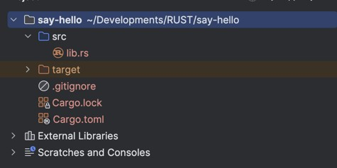
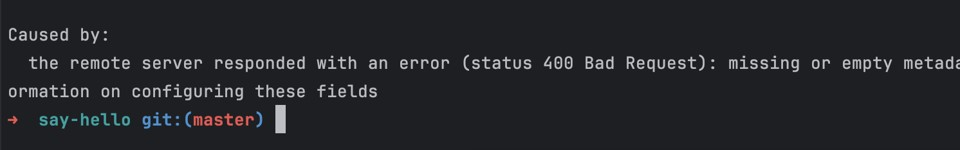
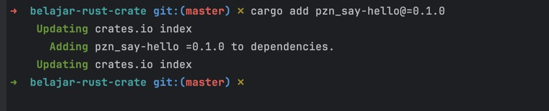
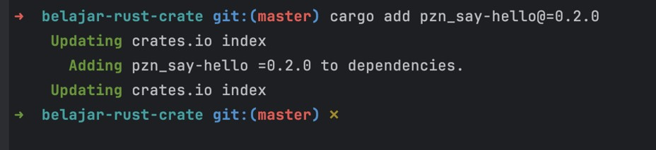
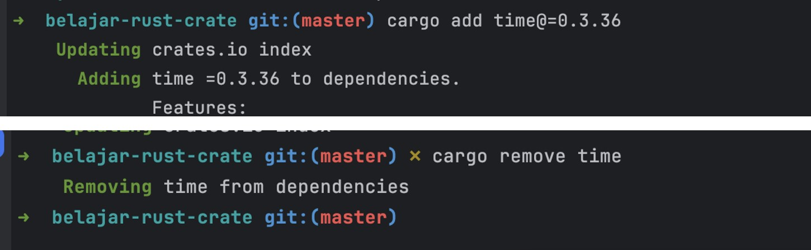
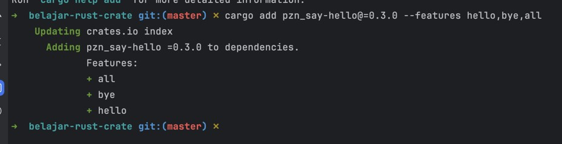
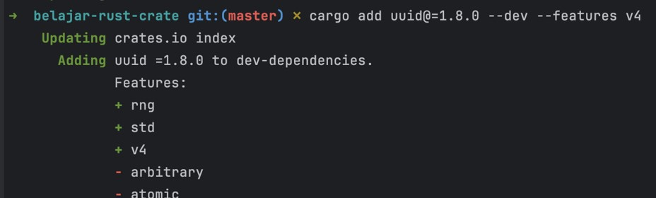
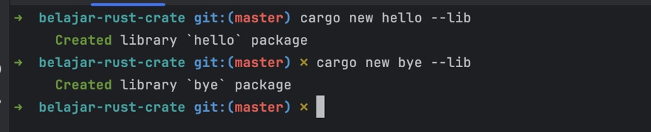

# Rust Crate

## Sebelum Belajar

- Rust Dasar

## #1 Pengenalan Cargo

### Sebelum Dependency Management

- Saat kita membuat aplikasi, biasanya kita sering sekali membutuhkan library atau framework
- Sebelum menggunakan dependency management, jika kita membutuhkan library atau framework, maka kita perlu download library atau framework tersebut secara manual. Setelah itu kita masukkan ke dalam kode program kita
- Jika library nya sederhana, mungkin masih mudah untuk mengelolanya, tapi bagaimana jika ternyata library tersebut membutuhkan library lain, dan tidak hanya satu, tapi ada banyak?
- Alhasil kita harus download semua library yang dibutuhkan oleh library yang kita gunakan.
- Belum lagi, kita harus tahu versi berapa library lain yang digunakan oleh library yang kita gunakan

### Dependency Management

- Masalah yang sudah kita bahas sebelumnya, bisa kita hindari jika kita menggunakan Dependency Management Tool
- Dependency Management Tool bertugas untuk mendownload semua library yang kita butuhkan beserta library yang dibutuhkan oleh library yang kita gunakan
- Semua dilakukan secara otomatis
- Dan juga Dependency Management Tool bisa download library sesuai dengan versi yang dibutuhkan secara otomatis

### Pengenalan Cargo

- Cargo adalah Package Manager untuk Rust
- Cargo dapat men-download package dependency secara otomatis, melakukan kompilasi package dan membuat distribution file
- Cargo juga bisa digunakan untuk meng-upload package yang kita buat ke <https://crates.io/>

### Menginstall Cargo

- Saat menginstall Rust, Cargo sudah terinstall secara otomatis
- Sehingga kita tidak perlu lagi menginstall Cargo secara manual

## #2 Membuat Project

- Saat kita membuat Project baru menggunakan Cargo, kita bisa memilih jenis Project yang akan kita buat, yaitu
- Application, merupakan jenis project untuk aplikasi, misal aplikasi berbasis terminal, aplikasi web, dan lain-lain
- Library, merupakan jenis project untuk library (kode yang digunakan oleh library lain atau aplikasi)

### Membuat Project

- Untuk membuat project dengan Cargo, kita bisa menggunakan perintah :
- `cargo new nama-folder`
- Secara default, jenis project yang akan dibuat adalah Application
- Jika kita ingin membuat jenis project berupa Library, kita bisa tambahkan option `--lib` :
- `cargo new nama-folder --lib`

## #3 Membuat Library

- Buatlah library dengan nama say-hello menggunakan perintah :
- `cargo new say-hello --lib`

### Struktur Folder



- `src` berisi kode program yang kita buat
- `target` berisi file hasil kompilasi kode program
- `Cargo.toml` berisi konfigurasi project yang kita buat
- `Cargo.lock` berisi informasi dependency yang kita gunakan (tidak untuk disentuh, karena dibuat secara otomatis)

### Kode: Say Hello

```rs
// lib.rs
pub fn say_hello(name: &str) -> String {
	format!("Hello, {}!", name);
}

pub fn say_goodbye(name: &str) -> String {
	format!("Goodbye, {}!", name);
}
```

## #4 Publish Library

### Crates.io

- Setelah kita membuat Library, sekarang kita bisa mem-publish Library yang sudah kita buat ke `crates.io`
- `Crates.io` merupakan Package Repository untuk menyimpan package-package Rust
- Silahkan daftar terlebih dahulu di web <https://crates.io/>

### Login via Cargo

- Setelah daftar di `Crates.io`, silahkan buat Token untuk digunakan agar bisa Login dari aplikasi Cargo
- <https://crates.io/settings/tokens>
- Selanjutnya login di Cargo menggunakan perintah :
- `cargo login`

### Publish Library

- Untuk melakukan publish Library yang sudah kita buat, kita bisa menggunakan perintah :
- `cargo publish`
- Atau untuk mereview terlebih dahulu sebelum publish Library, kita bisa gunakan perintah :
- `cargo publish --dry-run`

### Error



- Jika terjadi error ketika melakukan publish Library, berarti ada informasi yang kurang lengkap yang harus kita lengkapi

### Kode: Cargo Toml

```toml
[package]
name = "say-hello"
version = "0.1.0"
edition = "2021"
license = "Apache-2.0"
description = "A simple say-hello library"
authors = ["Eko Kurniawan Khannedy"]

[dependencies]
```

### Conflict

- Nama Project di `Crates.io` harus unik, tidak boleh ada yang sama
- Seandainya nama Project sudah ada yang mengambil, kita bisa ganti nama project di `Cargo.toml`
- Pastikan nama project belum ada yang menggunakan

### Kode: Cargo Toml

```toml
[package]
name = "pzn_say-hello"
version = "0.1.0"
edition = "2021"
license = "Apache-2.0"
description = "A simple say-hello library"
authors = ["Eko Kurniawan Khannedy"]

[dependencies]
```

## #5 Membuat Application

- Buatlah sebuah aplikasi menggunakan Cargo dengan perintah :
- `cargo new belajar-rust-crate`

## #6 Menambah Library

- Untuk menggunakan Library yang terdapat di `Crates.io`, kita bisa gunakan perintah :
- `cargo add nama-library@=versi`
- Secara otomatis Library akan di-download, dan Project kita bisa menggunakan Library yang sudah kita tambahkan

### Kode: Menambah Library

```sh
cargo add pzn_say-hello@=0.1.0
```



### Informasi Dependency

- Setelah kita menambahkan package ke project yang kita buat, informasi dependency yang digunakan akan secara otomatis terdapat di file `Cargo.toml` dan juga `Cargo.lock`

## #7 Menggunakan Library

- Nama Library yang menjadi dependency, secara default akan menjadi nama module
- Sehingga ketika kita ingin menggunakan kode yang terdapat di dalam Library yang kita buat, kita harus menggunakan nama Library sebagai nama module nya

### Kode: Menggunakan Library

```rs
// main.rs
use pzn_say_hello::{say_goodbye, say_hello};

fn main() {
	let response = say_hello("Eko");
	println!("{}", response);

	let response = say_goodbye("Eko");
	println!("{}", response);
}
```

## #8 Upgrade Package

- Untuk melakukan upgrade versi package, kita cukup update versi dari project yang kita buat di `Cargo.toml`
- Selanjutnya kita bisa tambahkan ke project lain menggunakan versi yang baru

### Kode: Library

```rs
// lib.rs
pub fn say_hello(name: &str) -> String {
	format!("Hello, {}!", name);
}

pub fn say_hello_to_everyone() -> String {
	"Hello, everyone!".to_string();
}

pub fn say_goodbye(name: &str) -> String {
	format!("Goodbye, {}!", name);
}

pub fn say_goodbye_to_everyone() -> String {
	"Goodbye, everyone!".to_string();
}
```

### Kode: Cargo Toml

```toml
[package]
name = "pzn_say-hello"
version = "0.2.0"
edition = "2021"
license = "Apache-2.0"
description = "A simple say-hello library"
authors = ["Eko Kurniawan Khannedy"]

[dependencies]
```

### Publish Library

- Setelah melakukan update library dengan versi yang lebih baru, silahkan publish versi terbaru tersebut ke Crates.io menggunakan perintah yang sama :
- `cargo publish`

### Update Dependency

- Untuk melakukan update dependency pada project yang menggunakan Library yang kita buat, kita bisa ubah versi pada `Cargo.toml`, atau gunakan perintah untuk menambah dependency dengan versi yang baru, yang secara otomatis akan mengupdate versi sebelumnya :
- `cargo add nama-library@=versibaru`

### Kode: Update Dependency

```sh
cargo add pzn_say-hello@=0.2.0
```



### Kode: Application

```rs
// main.rs
use pzn_say_hello::*;

fn main() {
	let response = say_hello("Eko");
	println!("{}", response);

	let response = say_hello_to_everyone();
	println!("{}", response);

	let response = say_goodbye("Eko");
	println!("{}", response);

	let response = say_goodbye_to_everyone();
	println!("{}", response);
}
```

## #9 Menghapus Dependency

- Untuk menghapus dependency yang sudah kita tambahkan, kita bisa lakukan secara manual dengan mengubah file `Cargo.toml`
- Atau kita bisa gunakan perintah :
- `cargo remove nama-dependency`

### Kode: Menghapus Dependency

```sh
cargo add time@=0.3.36
```

```sh
cargo remove time
```



## #10 Future

- Saat membuat library, kadang kita membuat banyak sekali fitur didalam library tersebut
- Dan kadang, saat menggunakan library, tidak semua fitur ingin kita gunakan
- Kita bisa menandai fitur yang terdapat dalam library yang kita buat menggunakan tanda `[features]` pada `Cargo.toml`
- Selanjutnya kita bisa sebutkan nama-nama feature nya
- Kita bisa gunakan default untuk menandai feature yang secara default akan digunakan ketika library tersebut digunakan

### Kode: Feature Say Hello Library

```toml
[features]
hello = []
bye = []
all = ["hello", "bye"]
```

### Menandai Feature

- Untuk menandai feature pada kode yang kita buat, kita bisa gunakan attribute `cfg`, lalu sebutkan nama feature nya
- Kita bisa tambahkan attribute `cfg` di `function`, `struct`, `module`, dan lain-lain

### Kode: Menandai Feature

```rs
// lib.rs
#[cfg(feature = "hello")]
pub fn say_hello(name: &str) -> String {
	format!("Hello, {}!", name);
}

#[cfg(feature = "hello")]
pub fn say_hello_to_everyone() -> String {
	"Hello, everyone!".to_string();
}

#[cfg(feature = "bye")]
pub fn say_goodbye(name: &str) -> String {
	format!("Goodbye, {}!", name);
}

#[cfg(feature = "bye")]
pub fn say_goodbye_to_everyone() -> String {
	"Goodbye, everyone!".to_string();
}
```

### Tugas

- Upgrade versi library say hello
- Publish ke `Crate.io`

### Menggunakan Features

- Setelah kita menambahkan library yang menggunakan features, maka kita harus sebutkan features mana yang akan kita gunakan
- Kita bisa gunakan perintah :
- `cargo add nama-dependency@=versi --features nama,feature`

### Kode: Menggunakan Features

```sh
cargo add pzn_say-hello@=0.3.0 --features hello,bye,all
```



## #11 Development Dependency

- Kadang, ada package yang hanya kita gunakan untuk proses development misal di Unit Test saja
- Yang artinya package tersebut tidak kita gunakan ketika menjalankan Aplikasi
- Untuk kasus seperti ini, kita bisa tambahkan opsi parameter `--dev` ketika menambah dependency, dengan perintah :
- `cargo add nama-dependency@=versi --dev`

### Kode: Development Dependency

```sh
cargo add uuid@=1.0.0 --dev --features v3
```



### Kode: Unit Test

```rs
#[test]
fn test_uuid() {
	let id = uuid::Uuid::new_v4().to_string();
	println!("{}", id);
}
```

## #12 Workspace

- Saat kita membuat project Cargo, kita bisa membuat beberapa package di dalam satu project yang sama, atau kita sebut dengan Workspace
- Kita bisa buat dalam bentuk folder, lalu buat package-package tersebut di dalam folder yang kita buat
- Selanjutnya, agara package-package tersebut bisa digunakan, kita perlu daftarkan dalam workspace di `Cargo.toml`

### Membuat Sub Package

- Untuk membuat Sub Package di dalam project yang sudah kita buat, caranya mudah, kita bisa langsung buat project baru menggunakan perintah `cargo new` di dalam folder project yang sudah kita buat
- Secara otomatis, Cargo akan mendaftarkan sub package tersebut di dalam workspace

### Kode: Membuat Sub Package

```sh
cargo new hello  --lib
```

```sh
cargo new bye  --lib
```



### Kode: Cargo Toml

```toml
workspace = { members = [ "bye", "hello" ]}
[package]
name = "belajar-rust-crate"
version = "0.1.0"
edition = "2021"
```

### Kode: Sub Package

```rs
// bye/lib.rs
pub fn say_bye() {
	println!("Bye, everyone!");
}
```

```rs
// hello/lib.rs
pub fn say_hello() {
	println!("Hello, everyone!");
}
```

### Menggunakan Sub Package

- Saat kita membuat Sub Package, kita juga bisa menggunakan Sub Package dengan cara menambahkan di `dependencies` atau `dev dependencies`
- Caranya kita tidak perlu menyebutkan versi dari package nya, melainkan path (lokasi folder) dari package nya

### Kode: Cargo Toml

```toml
[dependencies]
pzn_say-hello = { version = "=0.3.0", features = ["hello", "bye", "all"]}
bye = { path = "bye" }
hello = { path = "hello" }
```

### Kode: Menggunakan Sub Package

```rs
// main.rs
use pzn_say_hello::*;

fn main() {
	hello::say_hello();
	bye::say_bye();
}
```

## #13 Materi Selanjutnya

- Rust Unit Test
- Rust Concurrency
