# Rust Dasar

## Sebelum Belajar

- Mengerti cara menggunakan komputer
- Mengerti cara menginstall aplikasi
- Mengerti cara menggunakan terminal/command prompt
- Pernah belajar satu bahasa pemrograman

## #1 Pengenalan Rust

### Sejarah Rust

- Rust pertama kali dibuat sebagai proyek pribadi tahun 2006 oleh karyawan Mozilla Research bernama Graydon Hoare
- Mozilla mulai mendukung proyek ini tahun 2009 sebagai percobaan untuk Browser Engine yang disebut Servo, dan secara official diumumkan oleh Mozilla tahun 2010
- Rust dirilis secara public oleh Mozilla tahun 2015
- Sekarang Rust banyak digunakan di perusahaan seperti Amazon, Discord, Dropbox, Google, Meta dan Microsoft
- Tahun 2022, Rust menjadi salah satu bahasa yang didukung untuk pengembangan Linux Kernel selain bahasa C dan Assembly
- <https://www.rust-lang.org/>

### Kenapa Belajar Rust

- Keamanan Memori, salah satu fitur utama Rust ada sistem pemrosesan memori yang aman. Permasalahan ini biasanya ditemukan oleh programmer C/C++
- Kinerja Tinggi, Rust dirancang memiliki kinerja yang sangat baik, bahkan di beberapa hal bisa mendekati performa C/C++
- Concurrency yang aman, Rust memiliki fitur bawaan concurrency yang aman. Ini sangat bermanfaat ketika kita butuh membuat aplikasi yang concurrent
- Pemeliharaan kode yang baik, Rust dari awal mendukung praktek pengkodean yang bersih dan aman, oleh karena itu programmer akan dipaksa untuk membuat kode yang selalu baik

### Ekosistem Rust

- Rust adalah bahasa pemrograman yang bisa dibilang baru, karena rilis tahun 2015, namun saat ini popularitas Rust sedang naik daun, terbukti dari banyaknya orang belajar Rust dan pembuatan perangkat lunak menggunakan Rust
- Dari statistik yang dikeluarkan oleh Github, Rust menjadi bahasa pemrograman yang kontribusi pertumbuhannya paling cepat
- <https://github.blog/2023-11-08-the-state-of-open-source-and-ai/>

### Pertumbuhan Kontribusi Bahasa Pemrogramman

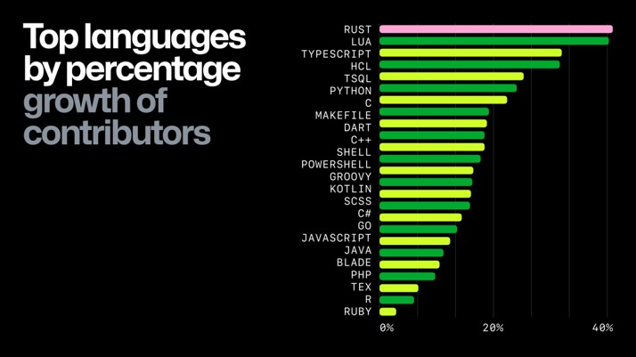

### Proses Perngembangan Aplikasi Rust

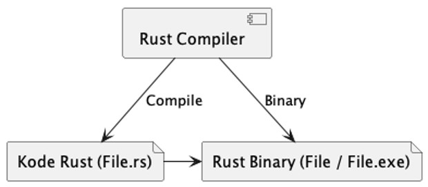

## #2 Menginstall Rust

- Untuk menginstall Rust, salah satu rekomendasinya adalah menggunakan tool bernama Rustup
- <https://www.rust-lang.org/tools/install>

### Mengecek Vers Rust

```sh
rustup check

rustc --version
```

## #3 Text Editor

- Untuk belajar Rust, kita perlu Text Editor untuk mempermudah saat kita membuat kode Rust
- Ada beberapa rekomendasi Text Editor yang bisa kita gunakan

### Visual Studio Code

- <https://code.visualstudio.com/>
- <https://code.visualstudio.com/docs/languages/rust>

### JetBrains RustRover

- <https://www.jetbrains.com/rust/>

### Eclipse Corrosion

- <https://projects.eclipse.org/projects/tools.corrosion>

## #4 Membuat Project

- Untuk membuat project, kita bisa gunakan perintah :
- `cargo new nama-project`
- Nanti akan dibuatkan sebuah folder sesuai dengan nama projectnya

### Struktur Folder

- Struktur folder Project Rust sangat sederhana
- Folder src merupakan tempat berisi semua kode program Rust
- File Cargo adalah file konfigurasi untuk Cargo

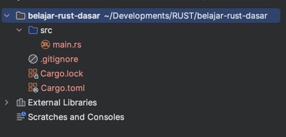

## #5 Hello World

### File Extension

- Setiap bahasa pemrograman, biasanya akan menggunakan file extension yang sudah ditentukan, contohnya di Java menggunakan `.java`, di PHP menggunakan `.php`
- Rust menggunakan file extension `.rs`
- Sehingga nanti di tiap kode program Rust yang akan kita buat, kita akan membuat file dengan extension `.rs`

### Hello World

- Saat pertama kali membuat Project Rust, secara default akan dibuatkan sebuah aplikasi Hello World
- Aplikasi Hello World adalah aplikasi yang menghasilkan tulisan Hello World
- Kita bisa lihat contoh kodenya di file `main.rs`

### Main Function

- Rust sama seperti bahasa pemrograman C/C++, Java, Golang
- Gerbang utama untuk menjalankan kode Rust adalah Main Function
- Di Rust, pembuatan Function sama seperti di C/C++, Java atau Golang, yang membedakan adalah kata kuncinya, menggunakan `fn`

### Kode: Main Function

```rs
fn main() {

}
```

### Print Function

- Untuk menampilkan tulisan, Rust menyediakan dua function
- `print!(text)` untuk menulis
- `println!(text)` untuk menulis dan diakhiri dengan ENTER
- Untuk informasi text / string, cara pembuatan di Rust sama seperti di Java / Golang, diawali tanda `"` (petik dua) dan diakhiri `"` (petik dua)

### Kode: Hello World

```rs
fn main() {
	println!("Hello, world!");
}
```

## #6 Cargo

### Package Manager

- Saat kita membuat aplikasi skala besar, hal yang wajib digunakan untuk mengelola proyek aplikasi kita adalah Package Manager
- Dengan Package Manager, kita bisa melakukan proses kompilasi, dependency management, testing, dan lain-lain secara mudah
- Tanpa Package Manager, kita harus melakukan semuanya secara manual, dan itu sangat tidak produktif

### Cargo Package Manager

- Cargo adalah Package Manager untuk Rust
- Berbeda dengan bahasa pemrograman lain seperti Java, PHP, C/C++ yang tidak memiliki Package Manager bawaan
- Rust menyediakan Package Manager sehingga kita mudah ketika membuat Project Rust

### Menggunakan Cargo

- Untuk menggunakan Cargo, kita cukup gunakan perintah cargo di terminal atau di project Rust yang sudah kita buat
- Kita akan bahas penggunaan Cargo secara bertahap sesuai keperluan materinya

### Menjalankan Project

- Untuk menjalankan Project dengan Cargo, kita bisa gunakan perintah :
- `cargo run`

### Membuat Distribution File

- Setelah selesai membuat Project, hal yang perlu kita lakukan adalah membuat Distribution File
- Distribution File adalah file hasil akhir dari Project, yang nanti akan dijalankan sebagai aplikasi
- Untuk membuat distribution file dengan Cargo, kita bisa gunakan perintah :
- `cargo build --release`

## #7 Unit Test

### Masalah dengan Main Function

- Dalam Rust, satu Project hanya bisa menggunakan satu main function
- Oleh karena itu, agak sulit jika tiap kita praktek belajar, kita harus membuat project baru terus menerus
- Oleh karena itu, alternative lainnya adalah menggunakan unit test

### Unit Test

- Unit Test adalah kode yang memang dikhususkan untuk melakukan percobaan
- Cara membuat unit test di Rust sangat mudah, kita bisa membuat function dengan nama apapun, lalu ditambahkan Attribute / Annotation test pada function tersebut

### Kode: Hello World Test

```rs
fn main() {
	println!("Hello, world!");
}

#[test]
fn hello_test() {
	println!("Hello, world!");
}
```

### Menjalankan Unit Test

- Untuk menjalankan Unit Test function yang sudah kita buat, kita bisa menggunakan perintah :
- `cargo test nama_test_function -- --exact`

## #8 Variable

- Variable adalah tempat untuk menyimpan data
- Cara membuat variable di Rust bisa menggunakan kata kunci `let `
- Setelah variabel diisi data, maka tidak tidak bisa variable tersebut diubah lagi datanya

### Kode: Variable

```rs
#[test]
fn test_variable() {
	let name = "Eko Kurniawan Khannedy";
	println!("Hello {}", name);
}
```

### Mutable

- Seperti dijelaskan sebelumnya, Variable yang sudah diisi datanya tidak bisa diubah lagi, atau disebut `Immutable`
- Namun Rust juga memperbolehkan jika kita ingin membuat Variable yang bisa diubah lagi, atau disebut `Mutable`
- Caranya kita bisa gunakan kata kunci `let mut` ketika membuat variable

### Kode: Mutable

```rs
#[test]
fn test_mutable() {
	let mut name = "Eko Kurniawan Kh";
	println!("Hello {}", name);

	name = "Budi Nugraha";
	println!("Hello {}", name);
}
```

### Static Typing

- Rust adalah bahasa yang Static Typing, artinya setiap kita membuat variable dengan jenis data tertentu, maka dia tidak akan bisa berubah menjadi tipe data lainnya
- Sebelumnya kita membuat variable dengan tipe `text/string`, kita tidak bisa mengubah variable tersebut dengan data `angka/number` contohnya

### Kode: Static Typing

```rs
#[test]
fn static_typing() {
	let mut name = "Eko Kurniawan Khannedy";
	println!("Hello {}", name);

	name = 10; // error
	println!("Hello {}", name);
}
```

### Shadowing

- Di Rust, kita bisa membuat variable dengan nama yang sama
- Namun, saat kita membuat variable dengan nama yang sama, maka variable sebelumnya akan tertutup atau disebut shadowing
- Praktek ini mungkin kurang baik jika dilakukan terlalu sering, karena bisa membingungkan yang membaca kode kita
- Namun ini diperbolehkan di Rust

### Kode: Shadowing

```rs
#[test]
fn shadowing() {
	let name = "Eko Kurniawan Khannedy";
	println!("Hello {}", name);

	let name = 10;
	println!("Hello {}", name);
}
```

## #9 Comment

- Komentar adalah kode yang akan dihapus ketika di kompilasi
- Komentar biasanya digunakan untuk menambahkan informasi ke kode program kita untuk dibaca oleh kita atau programmer lain
- Untuk menambahkan komentar di kode program, kita bisa gunakan `//` untuk satu baris
- Atau `/*` untuk lebih dari satu baris dan ditutup dengan `*/`

### Kode: Comment

```rs
/*
	Ini ada komentar lebih dari satu baris
	Ini ada komentar lebih dari satu baris
	Ini ada komentar lebih dari satu baris
*/
#[test]
fn comment() {
	println!("Hello"); // ini adalah komentar
}
```

## #10 Data Type

- Setiap nilai di Rust memiliki tipe data. Secara garis besar Rust membagi tipe data menjadi dua `subsets`; `scalar` dan `compound`
- Scalar type merepresentasikan single value (nilai tunggal), yaitu `integer`, `float`, `boolean` dan `char`
- Compound type merepresentasikan beberapa value (bisa lebih dari satu) dalam satu type, yaitu `tuple` dan `array`

### Scalar Type

- `Integer type`, yaitu tipe data number dalam bilangan bulat
- `Float type`, yaitu tipe data number dalam desimal
- `Boolean type`, yaitu tipe data yang hanya bernilai `true` (benar) atau `false` (salah)
- `Char type`, yaitu tipe data karakter

### Compound Type

- `Tuple type`, yaitu kumpulan beberapa data yang bisa berbeda tipe data
- `Array type`, yaitu kumpulan beberapa data yang harus tipe data yang sama

### Explicit Type

- Saat kita membuat Variable, secara default kita tidak perlu menyebutkan tipe data secara explicit, karen Rust bisa otomatis mendeteksi tipe data apa yang kita gunakan
- Namun, jika kita mau, kita juga bisa menyebutkan tipe data sebuah Variable secara explicit dengan menggunakan tanda `:` (titik dua)

### Kode: Explicit Type

```rs
#[test]
fn explicit() {
	let age: i32 = 20;
	println!("{}", age);
}
```

## #11 Number

### Integer Type

| Panjang   | Signed | Unsigned |
| --------- | ------ | -------- |
| `8-bit`   | `i8`   | `u8`     |
| `16-bit`  | `i16`  | `u16`    |
| `32-bit`  | `i32`  | `u32`    |
| `64-bit`  | `i64`  | `u64`    |
| `128-bit` | `i128` | `u128`   |

### Float Type

| Panjang  | Float |
| -------- | ----- |
| `32-bit` | `f32` |
| `64-bit` | `f64` |

### Usize

- Usize adalah tipe data number integer yang panjangnya mengikuti platform (sistem operasi), misal `32bit` atau `64bit`

| Usize              | Keterangan        |
| ------------------ | ----------------- |
| `isize`            | `32-bit / 64-bit` |
| `usize (unsigned)` | `32-bit / 64-bit` |

### Default Number

- Saat membuat variable secara implicit (tidak menyebutkan tipe data), maka Rust akan menggunakan default type
- Jika bilangan bulat, maka akan menggunakan `i32`
- Jika bilangan dengan pecahan desimal, maka akan menggunakan `f64`

### Kode: Number

```rs
#[test]
fn number() {
	let a: i32 = 10;
	println!("{}", a);

	let b: f64 = 10.5;
	println!("{}", b);
}
```

### Konversi Tipe Data Number

- Rust bisa melakukan konversi tipe data dari tipe data Number yang ukurannya kecil ke ukurannya lebih besar begitu juga sebaliknya
- Namun perlu diperhatikan, jika kita lakukan konversi tipe data Number dari ukuran besar ke kecil, maka bisa terjadi yang namanya Integer Overflow, yaitu kondisi dimana nilai number tidak bisa ditampung oleh tipe data tujuan konversi. Misal kita punya number `1000000` dalam bentuk `i32`, lalu kita konversi ke bentuk `i8`, maka akan terjadi Integer Overflow, karena `i8` tidak bisa menampung nilai tersebut
- Untuk melakukan konversi, kita bisa gunakan kata kunci `as`

### Kode: Konversi Tipe Data Number

```rs
#[test]
fn number_conversion() {
	let a: i8 = 10;
	println!("{}", a);

	let b: i16 = a as i16;
	println!("{}", b);

	let c: i32 = a as i32;
	println!("{}", c);
}
```

## #12 Numeric Operations

- Rust mendukung semua operasi numerik
- Operator yang digunakan hampir sama dengan kebanyakan bahasa pemrograman lainnya

### Operator

| Operator | Keterangan           |
| -------- | -------------------- |
| `+`      | `tambah`             |
| `-`      | `kurang`             |
| `.`      | `bagi`               |
| `*`      | `kali`               |
| `%`      | `sisa bagi / modulo` |

### Kode: Numeric Operators

```rs
#[test]
fn numeric_operator() {
	let a = 10;
	let b = 10;
	let c = a * b;
	println!("{}", c);
}
```

### Augmented Assignments

| Numeric Operator | Augmented Assignments |
| ---------------- | --------------------- |
| `a = a + 10`     | `a += 10`             |
| `a = a - 10`     | `a -= 10`             |
| `a = a * 10`     | `a *= 10`             |
| `a = a / 10`     | `a /= 10`             |
| `a = a % 10`     | `a %= 10`             |

### Kode: Augmented Assignments

```rs
#[test]
fn augmented_assignment() {
	let mut a = 10;
	println!("{}", a);

	a += 10;
	println!("{}", a);

	a -= 10;
	println!("{}", a);
}
```

## #13 Boolean

- Boolean adalah tipe data yang sederhana, hanya bernilai `true` (benar) atau `false` (salah)
- Namun walaupun tipe data ini adalah tipe data sederhana, namun tipe data ini banyak digunakan di mana-mana, terutama percabangan dan perulangan

### Kode: Boolean

```rs
#[test]
fn boolean() {
	let a = true;
	let b: bool = false;
	println!("{} {}", a, b);
}
```

## #14 Comparison Operators

- Comparison Operator (operator perbandingan) adalah operator yang menghasilkan nilai boolean (benar / salah)

| Comparison Operator | Keterangan              |
| ------------------- | ----------------------- |
| `>`                 | Lebih Dari              |
| `<`                 | Kurang Dari             |
| `>=`                | Lebih Dari Sama Dengan  |
| `<=`                | Kurang Dari Sama Dengan |
| `==`                | Sama Dengan             |

### Kode: Comparison Operators

```rs
#[test]
fn comparison() {
	let result: bool = 10 > 20;
	println!("{}", result);
}
```

## #15 Boolean Operators

### Operasi Boolean

| Operasi | Keterangan |
| ------- | ---------- |
| `&&`    | Dan        |
| `\|\|`  | Atau       |
| `!`     | Kebalikan  |

### Operasi `&&`

| Nilai 1 | Operator | Nilai 2 | Hasil   |
| ------- | -------- | ------- | ------- |
| `true`  | `&&`     | `true`  | `true`  |
| `true`  | `&&`     | `false` | `false` |
| `false` | `&&`     | `true`  | `false` |
| `false` | `&&`     | `false` | `false` |

### Operasi `\|\|`

| Nilai 1 | Operator | Nilai 2 | Hasil   |
| ------- | -------- | ------- | ------- |
| `true`  | `\|\|`   | `true`  | `true`  |
| `true`  | `\|\|`   | `false` | `true`  |
| `false` | `\|\|`   | `true`  | `true`  |
| `false` | `\|\|`   | `false` | `false` |

### Operasi `!`

| Operator | Nilai 2 | Hasil   |
| -------- | ------- | ------- |
| `!`      | `true`  | `false` |
| `!`      | `false` | `true`  |

### Kode: Boolean Operator

```rs
#[test]
fn boolean_operator() {
	let absen = 70;
	let nilai_akhir = 800;

	let lulus = absen >= 75;
	let lulus_nilai_akhir = nilai_akhir >= 75;

	let lulus_final = lulus && lulus_nilai_akhir;
	println!("{}", lulus_final);
}
```

## #16 Char

- Char adalah tipe data karakter
- Tipe data Char di Rust dibuat menggunakan petik satu

### Kode: Char

```rs
#[test]
fn char_type() {
	let char1: char = 'a';
	let char2: char = 'b';
	println!("{} {}", char1, char2);
}
```

## #17 Tuple

- Tuple adalah tipe data kumpulan lebih dari satu tipe data
- Jumlah data di Tuple sudah final, artinya tidak bisa berkurang atau bertambah
- Jika kita membuat Tuple dengan total ada `3` data, maka tidak akan bisa diubah lagi jumlah data dan juga tipe data nya
- Untuk membuat Tuple, kita bisa gunakan `()` tanda kurung

### Kode: Tuple

```rs
#[test]
fn tuple() {
	let data: (i32, f64, bool) = (10, 10.5, true);
	println!("{:?}", data);
}
```

### Mengakses Tuple

- Untuk mengakses tiap data di Tuple, kita bisa gunakan `.` (titik), lalu diikuti dengan nomor index (lokasi) data nya
- Index di Tuple dimulai dari nomor `0`

### Kode: Mengakses Tuple

```rs
#[test]
fn tuple() {
	let data: (i32, f64, bool) = (10, 10.5, true);
	println!("{:?}", data);

	let a = data.0;
	let b = data.1;
	let c = data.2;
	println!("{} {} {}", a, b, c);
}
```

### Destructuring Tuple

- Kadang ketika kita ingin mengakses seluruh data Tuple dan menyimpannya di Variable, akan sangat menyulitkan jika kita akses satu-satu menggunakan nomor index nya
- Tuple mendukung destructuring, yaitu membongkar isi Tuple, dan menyimpannya dalam variable
- Jika ada data di Tuple yang tidak kita butuhkan, kita bisa gunakan tanda `_` (garis bawah) ketika melakukan destructuring Tuple

### Kode: Destructuring Tuple

```rs
#[test]
fn tuple() {
	let data: (i32, f64, bool) = (10, 10.5, true)
	println!("{:?}", data);

	let (a, b, c) = data;
	println!("{} {} {}", a, b, c);
}
```

### Mutable Tuple

- Saat kita buat immutable Variable, secara otomatis Tuple yang sudah dibuat tidak bisa diubah lagi isi datanya
- Namun, jika kita membuat Variable dalam bentuk Mutable, maka data Tuple bisa kita ubah
- Untuk mengubah data Tuple, kita cukup gunakan nomor index dan `=` (sama dengan)
- Mirip seperti mengubah data variable biasanya

### Kode: Mutable Tuple

```rs
#[test]
fn tuple() {
	let mut data: (i32, f64, bool) = (10, 10.5, true);
	println!("{:?}", data);

	let (a, b, c) = data;
	println!("{} {} {}", a, b, c);

	data.0 = 20;
	data.1 = 20.5;
	data.2 = false;
	println!("{:?}", data);
}
```

### Unit

- Unit adalah tuple tanpa nilai apapun, ditulisnya `()`
- Hal ini mungkin kelihatan tidak ada gunanya
- Biasanya Unit ini digunakan untuk function-function yang tidak membutuhkan hasil data apapun

### Kode: Unit

```rs
fn unit() {
	println!("Hello");
}

#[test]
fn test_unit() {
	let result = unit();
	println!("{:?}", result);

	let test = ();
	println!("{:?}", test);
}
```

## #18 Array

- Array adalah tipe data yang berisi kumpulan data, sama seperti Tuple
- Yang membedakan Array dengan Tuple adalah, pada Array, kita hanya bisa menggunakan satu tipe data
- Untuk membuat Array, kita bisa gunakan `[]` tanda kurung kotak

### Kode: Membuat Array

```rs
#[test]
fn array() {
	let array: [i32; 5] = [1, 2, 3, 4, 5];
	println!("{:?}", array);
}
```

### Mengakses Array

- Untuk mengakses Array, sama seperti Tuple, kita perlu tentukan nomor Index yang akan diakses dimulai dari `0` (nol)
- Namun cara mengaksesnya berbeda, tidak menggunakan `.` (titik), melainkan menggunakan `[index]`

### Kode: Mengakses Array

```rs
#[test]
fn array() {
	let array: [i32; 5] = [1, 2, 3, 4, 5];
	println!("{:?}", array);

	let a = array[0]
	let b = array[1]
	println!("{} {}", a, b);
}
```

### Mutable Array

- Sama seperti Tuple, jika kita membuat variable Array yang immutable, secara otomatis data Array tidak bisa diubah
- Jika data array ingin bisa diubah, kita harus buat variable dalam bentuk mutable
- Kita bisa mengubah data Array dengan menggunakan `[index] = diisi` dengan nilai baru

### Kode: Mutable Array

```rs
#[test]
fn array() {
	let mut array: [i32; 5] = [1, 2, 3, 4, 5];
	println!("{:?}", array);

	let a = array[0];
	let b = array[1];
	println!("{} {}", a, b);

	array[0] = 10;
	array[1] = 20;
	println!("{:?}", array);
}
```

### Panjang Array

- Hal yang membedakan dengan Tuple, kita bisa mendapatkan jumlah data di Array dengan menggunakan function `len()` milik Array

### Kode: Panjang Array

```rs
let a = array[0];
let b = array[1];
println!("{} {}", a, b);

array[0] = 10;
array[1] = 20;
println!("{:?}", array);

let length: usize = array.len();
println!("{}", length);
```

### Two Dimensional Array

- Saat membuat Array, kita bisa menggunakan tipe apapun di dalam Array, bahkan jika didalamnya adalah tipe Array lagi

### Kode: Two Dimensional Array

```rs
#[test]
fn two_dimensional_array() {
	let metrix = [[i32; 2]; 2] = [
		[1, 2],
		[3, 4],
	];

	println!("{:?}", matrix);
	println!("{}", matrix[0][0]);
	println!("{}", matrix[0][1]);
	println!("{}", matrix[1][0]);
	println!("{}", matrix[1][1]);
}
```

## #19 Constant

- Constant adalah variable immutable menggunakan kata kunci `const`
- Yang membedakan `const` dan `let` adalah, const tidak memiliki mutable, selain itu nilai const harus dideklarasikan ketika kode program dibuat (bukan dijalankan), oleh karena itu nilai const tidak bisa hasil dari kalkulasi nilai lain yang belum jelas hasilnya
- Untuk membuat const, wajib disebutkan tipe datanya secara eksplisit
- Nama const di Rust harus huruf besar, dan biasanya pemisah kata menggunakan `_` (garis bawah)

### Kode: Constant

```rs
const MAXIMUM: i32 = 100;

#[test]
fn constant() {
	const MINIMUM: i32 = 0;
	println!("{} {}", MINIMUM, MAXIMUM);
}
```

## #20 Variable Scope

- Dalam dunia programming, variable scope mendefinisikan area dimana variable bisa digunakan
- Variable bisa digunakan di dalam scope tempat definisi variable, dan juga di inner scope
- Namun variable tidak bisa digunakan di outer scope

### Kode: Variable Scope

```rs
#[test]
fn variable_scope() {
	let eko = 1; // variable_scope

	{ // inner scope
		println!("inner eko: {}", eko);
		let kurniawan = 2;
		println!("inner kurniawan: {}", kurniawan);
	}

	println!("inner kurniawan: {}", kurniawan); // error
}
```

## #21 Memory Management

### Garbage Collection

- Garbage Collection adalah fitur yang banyak digunakan bahasa pemrograman untuk melakukan manajemen memory, seperti Java dan Golang
- Secara berkala Garbage Collection akan memantau data yang sudah tidak digunakan lagi di memory, dan menghapusnya secara otomatis
- Atau di bahasa pemrograman tanpa Garbage Collection, yang biasanya harus melakukan manajemen memory secara manual, seperti C/C++
- Tanpa Garbage Collection, kita harus mengalokasikan data secara manual di memory, begitu juga ketika sudah tidak butuh, kita harus menghapus data dari memory dari memory
- Rust memiliki pendekatan yang berbeda, Rust tidak menggunakan Garbage Collection, Rust juga tidak menggunakan Manual Memory Management

### Stack dan Heap

- Rust membagi data di memory dalam dua bagian, Stack dan Heap
- Stack adalah bagian dimana data disimpan dalam struktur data tumpukan, last in first out. Semua data di Stack harus yang fixed size (artinya ukuran data sudah pasti)
- Heap berbeda, heap seperti tempat untuk menyimpan data, dimana untuk menyimpan data di Heap kita akan melakukan request ke Heap, lalu di dalam Heap terdapat Memory Allocator yang bertugas untuk menemukan area kosong untuk menyimpan dan mengalokasikan data ke area tersebut. Setelah itu kita akan diberi pointer (penunjuk) ke lokasi dimana data itu berada di Heap.
- Pointer dari Heap berukuran fix sized, oleh karena itu pointer akan disimpan di Stack

### Kode: Stack dan Heap

```rs
#[test]
fn stack_heap() {
	function_a();
	function_b();
}

fn function_b() {
	let a = 10;
	let b = String::from("Eko");

	println!("{} {}", a, b);
}

fn function_a() {
	let a = 10;
	let b = String::from("Kurniawan");

	println!("{} {}", a, b);
}
```

### Diagram: Stack dan Heap

```rs
#[test]
fn stack_heap() {
	function_a();
	function_b();
}

fn function_b() {
	let a = 10;
	let b = String::from("Eko")

	println!("{} {}", a, b);
}

fn function_a() {
	let a = 10;
	let b = String::from("Kurniawan")

	println!("{} {}", a, b);
}
```

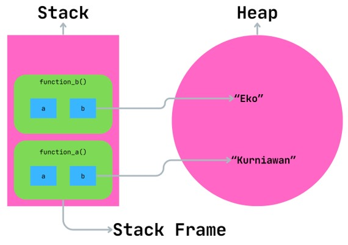

### Drop Function

- Saat variable keluar dari scope nya, yang artinya tidak bisa diakses lagi, secara otomatis Rust akan memanggil drop function
- Drop function adalah function untuk menghapus data, sehingga akan dibersihkan dari Heap
- Dan jika Rust `function()` sudah selesai dieksekusi, maka `function()` tersebut akan dihapus pula dari Stack Frame
- Oleh karena itu, Rust tidak membutuhkan Garbage Collection ataupun Manual Memory Management

## #22 String

### `&str` dan String

- Rust memiliki tipe data text yang fixed size, yaitu `&str` (string slice), dan yang bisa mengembang ukurannya, yaitu String
- `&str` karena ukurannya fixed size, jadi Rust akan menyimpannya di Stack, sedangkan String karena bisa mengembang, maka disimpan di Heap

### Immutable str

- Karena ukuran `&str` adalah fixed size, maka operasi `&str` adalah tipe data yang immutable, artinya isi data `&str` tidak bisa diubah
- Ketika kita buat variable mutable, dan mengubah data `&str`, sebenarnya yang dilakukan adalah mengganti isi variable, bukan mengubah isi dari `&str`
- `&str` memiliki banyak sekali method yang bisa digunakan untuk memanipulasi `&str` nya, namun akan menghasilkan nilai `&str` baru
- Namun perlu diperhatikan, beberapa method dari `&str` akan mengembalikan bentuk data String, bukan `&str`
- <https://doc.rust-lang.org/std/primitive.str.html>

### Kode: `&str`

```rs
#[test]
fn string() {
	let name: &str = "  Eko Kurniawan Khannedy  ";
	let trim: &str = name.trim();

	println!("{}", trim);
}
```

### String

- String di Rust merupakan tipe data text UTF-8, dan bisa berkembang ukurannya
- Ketika kita buat dalam bentuk immutable variable, maka String tidak bisa berkembang, namun tetap disimpan di Heap
- Ketika kita buat dalam bentuk mutable variable, maka String bisa berkembang di Heap
- String juga memiliki method / function untuk memanipulasi data, namun perlu diperhatikan ada method yang digunakan untuk mengubah datanya sendiri, ada juga method yang digunakan untuk mengubah dalam bentuk data baru, tanpa memodifikasi data asli nya
- <https://doc.rust-lang.org/std/string/struct.String.html>

### Kode: String

```rs
#[test]
fn string_type() {
	let mut name: String = String::from("Eko Kurniawan");
	name.push_str(" Khannedy");
	println!("{}", name);

	let budi = name.replace("Eko", "Budi");
	println!("{}", budi)
}
```

### Diagram: Stack dan Heap untuk String

```rs
#[test]
fn function_string() {
	let name1 = "Eko"
	println!("{}", name1);

	let name2 = String::from("Budi");
	println!("{}", name2)
}
```

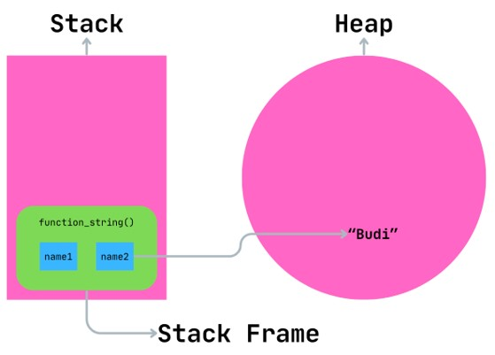

## #23 Ownership

- Rust menggunakan Ownership untuk melakukan data management di Memory
- Ownership adalah salah satu fitur unik di Rust yang mungkin jarang ada di bahasa pemrograman lain
- Ownership wajib dimengerti, karena akan berdampak ke hampir semua fitur di Rust
- Ownership adalah fitur yang digunakan oleh Rust untuk menjadikan Rust menjadi bahasa pemrograman yang aman dalam mengelola data di memory, tanpa harus adanya fitur Garbage Collection atau Manual Memory Management
- Karena Ownership adalah konsep yang baru untuk kebanyakan programmer, maka kadang kita butuh waktu untuk memahaminya

### Ownership Rules

- Setiap value di Rust harus punya owner (variable pemilik value)
- Dalam satu waktu, hanya boleh ada satu owner
- Ketika owner keluar scope, value akan dihapus

### Kode: Ownership Rules

```rs
#[test]
fn ownership_rules() {
	// a tidak bisa diakses disini, belum deklarasikan
	let a = 10; // a bisa diakses mulai disini

	{ // b tidak bisa diakses disini. belum deklarasikan
		let b = 20; // b bisa diakses mulai disini
		println!("{}", b);
	} // scope b selesai, b dihapus, b tidak bisa diakes lagi

	println!("{}", a);
} // scope a selesai, a dihapus, a tidak bisa diakses lagi
```

### Data Copy

- Sesuai aturan di Ownership Rules, setiap value harus dimiliki oleh satu owner pada satu waktu
- Ketika kita berinteraksi dengan data, maka data akan dimiliki hanya oleh satu owner
- Semua data yang bersifat fixed size (yang disimpan di Stack), ketika kita tambahkan ke variable berbeda (owner baru), maka hasilnya adalah data akan di copy, sehingga variable baru (owner baru) akan memiliki data hasil copy dari variable lama (owner lama)
- Oleh karena itu, tiap data akan selalu dimiliki oleh satu owner pada satu waktu

### Kode: Data Copy

```rs
#[test]
fn data_copy() {
	let a = 10;
	let b = a;  // copy data dari a ke b

	println!("{} {}", a, b);
}
```

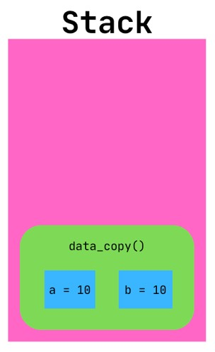

### Ownership Movement

- Namun Data Copy tidak terjadi untuk tipe data yang disimpan di Heap
- Seperti aturan di Ownership, dalam satu waktu value hanya dimiliki satu owner
- Maka ketika kita coba buat variable baru (owner baru) dari variable lama (owner lama), maka yang terjadi bukanlah copy, melainkan transfer ownership dari owner lama ke owner baru
- Setelah proses transfer selesai, secara otomatis owner lama akan dianggap tidak valid lagi digunakan

### Kode: Ownership Movement

```rs
#[test]
fn ownership_movement() {
	let name1 = String::from("Eko");

	// ownership dari name1 dipindahkan ke name2
	let name2 = name1;
	// name1 tidak bisa diakses disini

	println!("{}", name2);
}
```

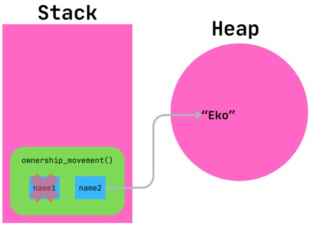

### Clone

- Sekarang kita tahu bahwa data di Stack akan di Copy sedangkan data di Heap akan dipindahkan ownership nya
- Lantas bagaimana jika kita juga ingin melakukan Copy untuk data di Heap?
- Maka kita harus melakukan Clone
- Clone adalah membuat data tiruan yang sama dari data aslinya
- String memiliki method `clone()` untuk melakukan ini
- Saat kita memanggil method `clone()` maka method tersebut akan meng-copy data String menjadi data String baru
- Semua tipe data yang disimpan di Heap di Rust memiliki method `clone()`

### Kode: Clone

```rs
#[test]
fn clone() {
	let name1 = String::from("Eko");
	let name2 = name1.clone();

	println!("{} {}", name1, name2);
}
```

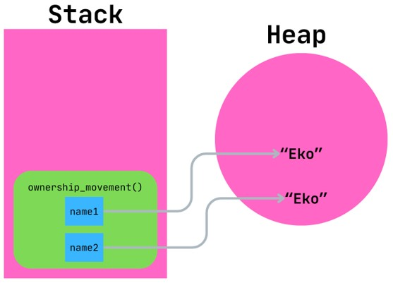

## #24 If Expression

- Sama seperti bahasa pemrograman yang lain, Rust juga mendukung If Expression
- If expression digunakan untuk membuat percabangan kode sesuai dengan kondisi. Jika kondisi terpenuhi, maka blok kode If akan dieksekusi, jika kondisi tidak terpenuhi, blok kode If tidak akan dieksekusi

### Kode: If Expression

```rs
#[test]
fn if_expression() {
	let value = 9;

	if value >= 8 {
		println!("Good");
	}
}
```

### Else Expression

- Ketika kondisi If tidak terpenuhi, kadang kita ingin melakukan sesuatu
- Kita bisa lakukan itu dengan Else Expression
- Blok di else akan dieksekusi jika kondisi If tidak terpenuhi

### Kode: Else Expression

```rs
#[test]
fn if_expression() {
	let value = 9;

	if value >= 8 {
		println!("Good");
	} else {
		println!("Not Good");
	}
}
```

### Else If Expression

- Saat membuat If expression, kadang kita ingin membuat beberapa kondisi
- Untuk membuat beberapa kondisi, kita bisa gabungkan dengan Else If expression

### Kode: Else If Expression

```rs
#[test]
fn if_expression() {
	let value = 9;

	if value >= 8 {
		println!("Good");
	} else if value >= 6 {
		println!("Not Bad");
	} else if value >= 3 {
		println!("Bad");
	} else {
		println!("Very Bad");
	}
}
```

### Let Statement

- If di Rust adalah sebuah expression, artinya bisa menghasilkan value dan bisa digunakan dengan Let statement untuk mengisi data di variable
- Ini sangat berguna sehingga kita tidak perlu memasukkan nilai ke variable terpisah dengan deklarasi variable nya

### Kode: Let Statement

```rs
let value = 9;
let result = &str;

if value >= 8 {
	result = "Good";
} else if value >= 6 {
	result = "Not bad";
} else if value >= 3 {
	result = "Bad";
} else {
	result = "Very bad";
}

println!("{}", result);
```

### Kode: If di Let Statement

```rs
#[test]
fn if_expression() {
	let value = 9;
	let result = if value >= 8 {
		"Good"
	} else if value >= 6 {
		"Not bad"
	} else if value >= 3 {
		"Bad"
	} else {
		"Very bad"
	}

	println!("{}", result);
}
```

## #25 Loop

- Setiap bahasa pemrograman biasanya memiliki fitur untuk melakukan perulangan
- Rust mendukung beberapa cara untuk melakukan perulangan, pertama kita akan bahas tentang Loop
- Loop merupakan perintah di Rust digunakan untuk melakukan perulangan terus-menerus, sampai kita memerintahkannya untuk berhenti
- Jika kita tidak memerintahkan untuk berhenti, maka Loop tidak akan pernah berhenti melakukan perulangan

### Break dan Continue

- Untuk menghentikan perulangan, kita bisa menggunakan perintah `break`
- Selain break, ada juga perintah `continue`, yang artinya menghentikan perulangan saat ini, dan langsung dilanjutkan ke perulangan berikutnya

### Kode: Loop

```rs
#[test]
fn loop_expression() {
	let mut counter = 0;
	loop {
		counter += 1;
		if counter > 10 {
			break;
		} else if counter % 2 == 0 {
			continue;
		}

		println!("Counter: {}", counter);
	}
}
```

### Return Value di Loop

- Sama seperti If Expression, di Loop juga kita bisa mengembalikan nilai, sehingga bisa disimpan dalam variable dengan Let Expression
- Caranya kita bisa gunakan break lalu diikuti dengan nilai yang akan dikembalikan di Loop

### Kode: Loop Return Value

```rs
#[test]
fn loop_return_value() {
	let mut counter = 0;
	let result = loop {
		counter += 1;
		if counter > 10 {
			break counter * 2;
		}
	};

	println!("Result: {}", result);
}
```

### Loop Label

- Kadang kita sering membuat Loop didalam Loop, dan ketika ingin menghentikan Loop paling atas dari Loop yang ada di dalam, maka hal itu tidak bisa dilakukan
- Loop memiliki fitur Label, dimana kita bisa memberi nama pada Loop
- Keuntungannya memberi Label pada loop adalah, kita bisa menghentikan Loop yang ingin kita hentikan dengan cara menyebutkan nama Label nya

### Kode: Loop Label

```rs
let mut number = 1;
'outer: loop {
	let mut i = 1;
	loop {
		number > 10 {
			break 'outer;
		}

		println!("{} x {} = {}", number, i, number + i);
		i += 1;
		if i > 10 {
			break;
		}
	}
	number += 1;
}
```

## #26 While Loop

- While Loop adalah jenis perulangan dimana memiliki kondisi
- Jika kondisi masih terpenuhi, maka perulangan akan dilanjutkan
- Namun jika perulangan tidak terpenuhi, maka perulangan akan dihentikan
- While Loop mirip seperti Loop, bisa dihentikan menggunakan `break` dan `continue`

### Kode: While Loop

```rs
#[test]
fn while_loop() {
	let mut counter = 0;
	while counter <= 10 {
		if counter % 2 == 0 {
			println!("Counter: {}", counter);
		}
		counter += 1;
	}
}
```

## #27 For Loop

### Iterasi Array

- Salah satu yang biasa kita lakukan ketika menggunakan Array adalah, melakukan pengambilan semua data di Array dari data pertama sampai data terakhir
- Biasanya, kita akan menggunakan While Loop, lalu membuat variable untuk mengakses index nya

### Kode: Iterasi Array

```rs
#[test]
fn array_iteration() {
	let array: [&str; 5] = ["A", "B", "C", "D", "E"];
	let mut index = 0;

	while index < array.len() {
		println!("Value: {}", array[index]);
		index += 1;
	}
}
```

### For Loop

- Rust menyediakan cara yang lebih mudah untuk melakukan pengambilan data dari Array menggunakan For Loop

### Kode: For Loop

```rs
#[test]
fn array_iteration() {
	let arary: [&str; 5] = ["A", "B", "C", "D", "E"];

	for value in array {
		println!("Value: {}", value);
	}
}
```

### Range

- Rust memiliki tipe data bernama Range
- Range adalah jarak antara start dan end
- Range merupakan tipe data Collection seperti Array, sehingga bisa dilakukan pengulangan menggunakan For Loop
- Data range akan dimulai dari start dan diakhiri sebelum end (exclusive)
- <https://doc.rust-lang.org/std/ops/struct.Range.html>

### Kode: Range

```rs
#[test]
fn range() {
	let array: [&str; 5] = ["A", "B", "C", "D", "E"];

	let range = 0..5;
	println!("Start: {}", range.start);
	println!("End: {}", range.end);

	for i in range {
		println!("Value: {}", array[i]);
	}
}
```

### Range Inclusive

- Selain Range yang exclusive, Rust juga memiliki tipe data Range Inclusive
- Implementasinya berbeda dengan Range sebelumnya
- <https://doc.rust-lang.org/std/ops/struct.RangeInclusive.html>

### Kode: Range Inclusive

```rs
#[test]
fn range_inclusive() {
	let array: [&str; 5] = ["A", "B", "C", "D", "E"];

	let range = 0..=4;
	println!("Start: {}", range.start());
	println!("End: {}", range.end());

	for i in range {
		println!("Value: {}", array[i]);
	}
}
```

## #28 Function

- Function adalah kumpulan kode yang memiliki nama, dan kegunaannya adalah agar bisa dipanggil
- Sebelumnya kita sudah tahu tentang main function, yaitu function yang dipanggil oleh ketika aplikasi berjalan
- Untuk membuat function, kita menggunakan kata kunci `fn` dan diikuti dengan nama function nya
- Tradisi nama function / variable di Rust menggunakan format `snake_case`, yaitu huruf kecil semua dan pemisah kata menggunakan `_` (garis bawah)
- Untuk memanggil function, kita bisa langsung sebutkan nama function-nya diikuti dengan kurung buka dan kurung tutup

### Kode: Function

```rs
fn say_hello() {
	println!("Hello");
}

#[test]
fn test_say_hello() {
	say_hello();
}
```

### Parameters

- Saat kita membuat function, kita bisa menambah parameter, yaitu variable yang menjadi bagian dari definisi function nya
- Ketika function memiliki parameter, maka kita wajib memberi value untuk parameter tersebut ketika memanggil function nya
- Beberapa orang memanggil parameter dengan argument, jadi jangan terlalu bingung
- Parameter di function bisa satu atau lebih, dan tiap parameter bisa menggunakan tipe data apapun yang kita inginkan

### Kode: Parameters

```rs
fn say_goodbye(firs_name: &str, last_name: &str) {
	println!("Goodbye {} {}", first_name, last_name);
}

#[test]
fn test_parameter() {
	say_goodbye("Eko", "Khannedy");
	say_goodbye("Budi", "Santoso");
	say_goodbye("Joko", "Susilo");
}
```

### Return Value

- Saat membuat function, kadang kita ingin mengembalikan hasil eksekusi yang dilakukan di dalam function, atau kita sebut Return Value
- Jika sebuah function ingin mengembalikan value, kita bisa sebutkan ketika deklarasi function menggunakan tanda `->` lalu diikuti dengan tipe data kembalian value nya
- -Baris eksekusi terakhir di function akan dianggap sebagai kembalian value-nya
- -Atau jika kita ingin mengembalikan value sebelum baris eksekusi terakhir, kita bisa gunakan kata kunci return, dan diikuti dengan value yang akan dikembalikan

### Kode: Return Value

```rs
fn factorial_loop(n: i32) -> i32 {
	if n < 1 {
		return 0;
	}

	let mut result = 1;
	for i in 1..=n {
		result *= i;
	}

	result
}

#[test]
fn test_factorial_loop() {
	let result = factorial_loop(5);
	println!("Result: {}", result);

	let result = factorial_loop(-10);
	println!("Result: {}", result);
}
```

### Recursive Function

- Recursion merupakan salah satu metode pemecahan masalah dimana sebuah solusi pada masalah tersebut bergantung pada solusi dari masalah yang lebih kecil yang merupakan bagian dari masalah tersebut.
- Rust mengimplementasikan recursion dengan memperbolehkan sebuah fungsi untuk memanggil dirinya sendiri (fungsi itu sendiri).
- Fungsi yang memanggil fungsi itu sendiri biasanya disebut dengan Recursive Function
- Misal kita akan buat dua contoh kasus, pertama kita akan melakukan println tulisan sebanyak parameter menggunakan recursive function. Kedua kita akan ubah factorial sebelumnya menjadi recursive function

### Kode: Recursive Function

```rs
fn print_text(value: String, times: u32) {
	if times == 0 {
		return;
	} else {
		println!("{}", value);
	}

	print_text(value, times - 1);
}

#[test]
fn test_print_text() {
	print_text(String::from("Eko"), 5);
}

fn factorial_recursive(n: u32) -> u32 {
	if n == 1 {
		return 1;
	}

	n * factorial_recursive(n - 1);
}

#[test]
fn test_factorial_recursive() {
	let result = factorial_recursive(5);
	println!("Result: {}", result);
}
```

## #29 Ownership di Function

- Setelah kita sekarang tahu tentang Function, kita akan bahas lagi tentang Ownership di Function Parameter
- Tipe data yang disimpan di Heap, ketika kita kirim sebagai parameter di function, secara otomatis Ownership nya akan berpindah ke parameter Function yang dipanggil
- Karena Ownershipnya berpindah ke parameter function, secara otomatis setelah function selesai dieksekusi, maka owner dan value akan dihapus dan tidak bisa digunakan lagi
- Namun jenis data yang berada di Stack, ketika kira kirim sebagai parameter di function, maka value akan di copy

### Kode: Function Ownership

```rs
fn print_number(number: i32) {
	println!("number: {}", number);
}

fn hi(name: String) {
	println!("Hi, {}", name);
}

#[test]
fn test_hi() {
	let number = 10;
	print_number(number);
	println!("{}", number);

	let name = String::from("Eko");
	hi(name);
	println!("{}", name);
}
```

### Diagram: Ownership di Function

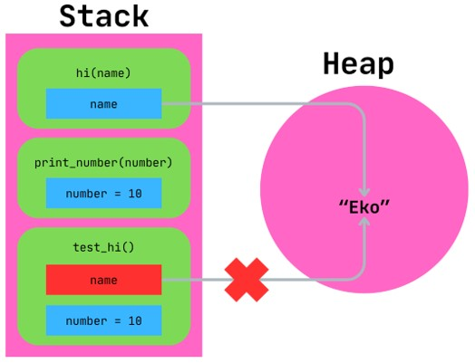

### Return Value Ownership

- Seperti yang sudah kita tahu, bahwa function bisa mengembalikan value
- Value Heap yang kita kembalikan di function, secara otomatis ownership nya akan dimiliki oleh yang memanggil function tersebut
- Sedangkan jika Value Stack, maka return value function akan di copy oleh yang memanggil function nya

### Kode: Return Value Ownership

```rs
fn full_name(first_name: String, last_name: String) -> String {
	format!("{} {}", first_name, last_name);
}

#[test]
fn test_full_name() {
	let first_name = String::from("Eko");
	let last_name = String::from("Khannedy");

	let name = full_name(first_name, last_name);
	println!("{}", name);
	println!("{}", first_name);
	println!("{}", last_name);
}
```

### Mengembalikan Ownership

- Karena kita tahu bahwa return value bisa mengembalikan ownership, jadi pada kasus jika memang kita tidak ingin mengambil ownership dari parameter, kita bisa kembalikan parameter dalam bentuk return value tuple misalnya

### Kode: Mengembalikan Ownership

```rs
fn full_name(first_name: String, last_name: String) -> (String, String, String) {
	let full_name = format!("{} {}", first_name, last_name);

	(first_name, last_name, full_name)
}

#[test]
fn test_full_name() {
	let first_name = String:from("Eko");
	let last_name = String:from("Kurniawan");

	let (first_name, last_name, name) = full_name(first_name, last_name);
	println!("{}", name);
	println!("{}", first_name);
	println!("{}", last_name);
}
```

### Masalah Dengan Return Value Ownership

- Jika kita tidak ingin mengambil Ownership dari parameter, maka jika tiap membuat function kita harus membuat return value tuple, maka lama-lama akan sangat menyulitkan
- Bahkan jika dibaca, function yang kita buat akan sulit dimengerti maksudnya
- Untungnya Rust menyediakan fitur untuk menggunakan value, tanpa harus melakukan transfer ownership, namanya adalah Reference
- Kita akan bahas Reference di materi selanjutnya

## #30 References dan Borrowing

- Reference adalah pointer (penunjuk) yang bisa kita ikuti ke lokasi data aslinya di Heap. Datanya sendiri dimiliki oleh variable lain, bukan si reference
- Reference akan dijamin menunjuk value yang valid selama alur hidup reference tersebut, jika alur hidup selesai, maka reference akan dihapus, namun tidak dengan data yang ditunjuknya, karena data yang ditunjuk mengikuti alur hidup variable owner nya
- Untuk membuat reference di Rust, kita bisa gunakan tanda `&` (and) sebelum tipe datanya, dan dalam satu waktu kita bisa membuat banyak reference
- Sebelumnya kita tahu bahwa tipe data text str selalu kita buat dalam bentuk `&str`, hal ini karena defaultnya adalah reference ke `str`

### Kode: Reference

```rs
fn full_name(first_name: &String, last_name: &String) -> String {
	format!("{} {}", first_name, last_name);
}

#[test]
fn test_full_name() {
	let first_name = String::from("Eko");
	let last_name = String::from("Kurniawan");

	let name = full_name(&firs_name, &last_name);
	print!("{}", name);
	print!("{}", first_name);
	print!("{}", last_name);
}
```

### Diagram References

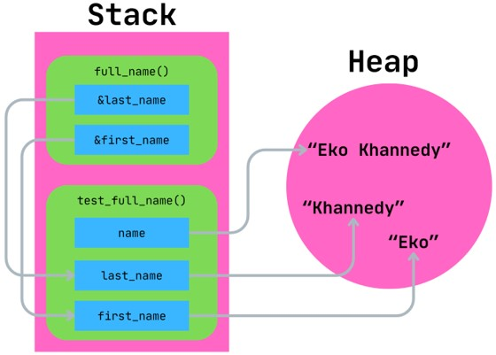

### Borrowing

- Ketika kita membuat reference, aksi itu kita sebut borrowing (meminjam).
- Kalo diibaratkan di kehidupan, kita bisa meminjam barang, tapi jika sudah selesai menggunakan barang nya, kita harus mengembalikan ke owner (pemilik) barang nya
- Saat kita mencoba memodifikasi value dari reference, maka secara default, hal itu tidak bisa dilakukan, jadi secara default reference adalah immutable, walaupun variable owner nya sendiri adalah mutable

### Kode: Mengubah Value Borrowing (Error)

```rs
fn change_value(value: &String) {
	value.push_str("Test");
}

#[test]
fn test_change_value() {
	let mut value = String::from("Eko");
	change_value(&value);
	println!("{}", value);
}
```

### Mutable Reference

- Pada kasus jika memang kita diperbolehkan memodifikasi value dari reference, maka kita bisa gunakan mutable reference
- Mutable reference adalah reference dengan tanda &mut, dimana artinya kita bisa memodifikasi value dari reference tersebut
- Namun ada ketentuan jika bisa menggunakan mutable reference, variable owner juga harus mutable, jika variable owner adalah immutable, maka mutable reference tidak bisa dilakukan
- Selain itu, untuk menjamin keamanan, dalam satu waktu, hanya diperbolehkan membuat satu mutable reference, dan tidak ada reference lainnya

### Kode: Mutable Reference

```rs
fn change_value(value: &mut String) {
	value.push_str("Test");
}

#[test]
fn test_chagne_value() {
	let mut value = String::from("Eko");
	change.value(&mut value);
	println!("{}", value);
}
```

### Dangling Pointer

- Dangling pointer adalah kondisi dimana ada reference (pointer) yang menunjuk ke value yang tidak ada di memory
- <https://en.wikipedia.org/wiki/Dangling_pointer>
- Di Rust, hal ini tidak diperbolehkan, contoh ketika kita mengembalikan reference dalam function, maka secara otomatis value akan dihapus karena sudah keluar dari scope function
- Pada kasus seperti ini, Rust akan menganggap hal ini error, karena berpotensi terjadi dangling pointer
- Biasanya programmer Golang sering sekali membuat function yang mengembalikan pointer

### Kode: Dangling Pointer

```rs
fn get_full_name(first_name: &String, last_name: &String) -> &String {
	let name = format!("{} {}", first_name, last_name);
	return &name;
}

#[test]
fn test_get_full_name() {
	let first_name = String::from("Eko");
	let last_name = String::from("Khannedy");

	let name = get_full_name(&firs_name, &last_name);
	println!("{}", name);
}
```

### Solusi Dangling Pointer

- Jika menang data yang dikembalikan dibuat di dalam function, maka kita harus kembalikan dalam bentuk value langsung, bukan reference
- Atau kita bisa mengeluarkan variable owner dari value diluar function, agar masuk variable scope, sehingga Rust tidak menghapus variable dan value tersebut setelah function selesai di eksekusi

### Kode: Solusi Dangling Pointer

```rs
fn get_full_name(first_name: &String, last_name: &String) -> String {
	let name = format!("{} {}", first_name, last_name);
	return name;
}

#[test]
fn test_get_full_name() {
	let first_name = String::from("Eko");
	let last_name = String::from("Khannedy");

	let name = get_full_name(&firs_name, &last_name);
	println!("{}", name);
}
```

## #31 Slice

- Slice adalah reference ke sebagian elemen dari data collection (misal array)
- Karena slice adalah reference, jadi dia tidak punya ownership
- Contoh misal kita punya array dengan total data 10, kita mau ambil 5 data terdepan, maka kita bisa membuat Slice sebagai reference data dari data ke-1 sampai ke-5

### Range

- Saat kita ingin mengambil sebagian data Collection, kita butuh menentukan range untuk Slice yang akan kita ambil
- Rust sendiri memiliki banyak jenis range, sebelumnya kita sudah bahas tentang Range (exclusive) dan Range Inclusive, selain itu masih ada yang lain
- <https://doc.rust-lang.org/std/ops/index.html#structs>

### Kode: Slice

```rs
#[test]
fn slice_reference() {
	let array: [i32; 10] = [1, 2, 3, 4, 5, 6, 7, 8, 9, 10];
	let slice1: &[i32] = &array[..];
	println!("{:?}", slice1);

	let slice2: &[i32] = &array[0..5];
	println!("{:?}", slice2);

	let slice3: &[i32] = &array[5..];
	println!("{:?}", slice3);

}
```

## #32 String Slice

- Sebelumnya, saat kita menggunakan tipe data text, kita selalu buat dalam bentuk `&str` (String Slice), hal ini sebenarnya berarti `&str` itu adalah reference ke sebagian atau seluruh data `str`
- Saat kita menggunakan tipe data String, kita juga mengambil sebagian karakter di String, hasil dari sebagian data itu adalah `&str` (String Slice)
- Karena `&str` itu adalah Slice, yang artinya adalah reference, maka sebenarnya tidak memiliki ownership, dan oleh karena itu ketika kita assign ke variable lain atau ke function, yang di copy sebenarnya adalah reference nya, datanya tetap menggunakan data yang sama

### Kode: String Slice

```rs
#[test]
fn string_slice() {
	let name: String = String::from("Eko Kurniawan Khannedy");
	let first_name: &str = &name[0..3];
	println!("{}", first_name);

	let last_name: &str = &name[14..];
	println!("{}", last_name);
}
```

### Diagram String Slice

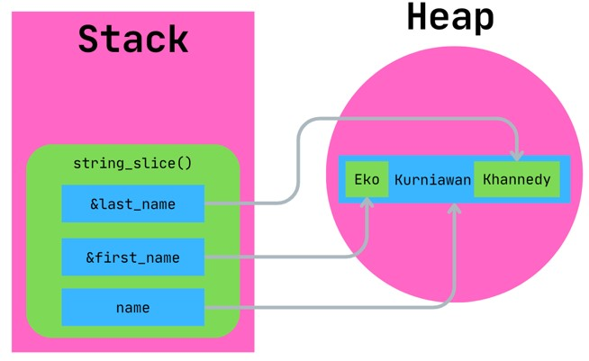

## #33 Struct

- Struct adalah tipe data mirip Tuple yang bisa digunakan untuk menampung beberapa data dengan tipe yang berbeda
- Yang membedakan dengan Tuple, pada Struct, kita bisa memberi nama untuk tiap data-nya, atau dibilang field, sehingga lebih jelas dibanding Tuple yang hanya menggunakan number
- Dengan menambahkan nama pada data di Struct, secara otomatis kita tidak perlu harus menentukan urutan posisi data yang selalu sama, bisa berubah-ubah seiring pembuatan kode
- Untuk membuat Struct, kita bisa gunakan kata kunci `struct`

### Kode: Membuat Struct

```rs
struct Person {
	first_name: String,
	middle_name: String,
	last_name: String,
	age: u8,
}
```

### Membuat Instance dari Struct

- Jadi Struct itu sebelum digunakan kita harus buat dahulu definisi dari Struct nya
- Setelah kita membuat definisi Struct-nya, selanjutnya kita bisa membuat instance / value dari Struct yang sudah kita buat
- Saat membuat instance dari Struct, kita wajib menentukan semua value untuk field dari Struct-nya

### Kode: Membuat Instance

```rs
#[test]
fn struct_person() {
	let person: Person = Person {
		first_name: String::from("Eko"),
		middle_name: String::from("Kurniawan"),
		last_name: String::from("Khannedy"),
		age: 20,
	};

	println!("{}", person.first_name);
	println!("{}", person.middle_name);
	println!("{}", person.last_name);
	println!("{}", person.age);
}
```

### Menggunakan Struct di Function

- Struct sama seperti tipe data lainnya, kita bisa gunakan dimanapun
- Kita bisa gunakan Struct sebagai parameter di function, atau return value di function

### Kode: Struct di Function

```rs
fn print_person(person: &Person) {
	println!("First Name: {}", person.first_name);
	println!("Middle Name: {}", person.last_name);
	println!("Last Name: {}", person.last_name);
	println!("Age: {}", person.age);
}
```

### Init Shorthand

- Kadang ada kasus kita ingin membuat value untuk field di Struct dari variable yang sudah ada
- Jika misalnya nama variable sama dengan nama field, kita tidak perlu sebutkan nama field secara eksplisit
- Fitur ini bernama Init Shorthand

### Kode: Init Shorthand

```rs
fn struct_person() {
	let first_name = String::from("Eko");
	let last_name = String::from("Khannedy");

	let person: Person = Person {
		first_name,
		middle_name: String::from("Kurniawan"),
		last_name,
		age: 20,
	};

	print_person(&person);
}
```

### Struct Update Syntax

- Sama seperti tipe data lainnya, saat kita buat instance Struct sebagai immutable, maka semua field di instance tersebut tidak bisa diubah
- Jika kita ingin mengubahnya, kita harus buat instance Struct dalam bentuk mutable variable
- Struct memiliki fitur bernama Struct Update Syntax, ini digunakan untuk membuat instance baru dari instance yang sudah ada
- Bahkan, kita bisa membuat instance baru sekaligus mengubah beberapa field yang kita mau

### Kode: Struct Update Syntax

```rs
let person: Person = Person {
	first_name,
	middle_name: String::from("Kurniawan"),
	last_name,
	age: 20,
};

print_person(&person);

let person2: Person = Person { ..person };

print_person(&person2);
```

### Masalah dengan Struct Update Syntax

- Namun saat menggunakan struct update syntax, hati-hati dengan field yang memiliki value di Heap, karena ownershipnya secara otomatis akan dipindahkan ke field di instance baru
- Oleh karena itu, secara otomatis instance lama tidak bisa digunakan karena value di field nya sudah dipindahkan ownershipnya ke instance baru
- Atau kita bisa melakukan clone data field nya, jika memang tidak mau memindahkan ownershipnya

### Kode: Partial Struct Update Syntax

```rs
let person2: Person = Person {
	first_name: person.first_name.clone(),
	middle_name: person.middle_name.clone(),
	last_namee: person.last_name.clone(),
	..person,
};

print_person(&person);
print_person(&person2);
```

### Tuple Struct

- Seperti di awal dijelaskan, bahwa Struct mirip seperti Tuple
- Seandainya kita ingin membuat Struct seperti Tuple, kita juga bisa buat Struct tanpa menyebutkan nama field nya
- Namun ketika kita buat Struct jenis ini, maka cara mengakses field nya sama seperti ketika kita membuat Tuple
- Ini cocok ketika kita kita mau membuat Tuple dengan data banyak, agar lebih sederhana, dibuat dalam bentuk Struct

### Kode: Tuple Struct

```rs
struct GeoPoint(f64, f64);

#[test]
fn tuple_struct() {
	let geo_point = GeoPoint(-6.200000, 106.000000);
	println!("Long: {}", geo_point.0);
	println!("lat: {}", geo_point.1);
}
```

### Struct tanpa Field

- Field di Struct tidak wajib, artinya jika kita buat Struct tanpa field sama sekali, hal itu diperbolehkan
- Struct tanpa Field itu sama saja dengan tipe data Unit `()`
- Apa gunanya Struct tanpa Field? Sekarang mungkin tidak terlalu terlihat gunanya, tapi nanti setelah belajar Trait, kita mungkin akan sering membuat Struct tanpa field. Ini akan kita bahas di materi Trait

### Kode: Struct Tanpa Field

```rs
struct Nothing;

#[test]
fn test_nothing() {
	let _nothing1: Nothing = Nothing;
	let _nothing2: Nothing = Nothing {};
}
```

### Reference Field di Struct

- Sebelumnya kita menggunakan tipe data String yang disimpan di Heap, bagaimana jika kita menggunakan tipe data `&str` (String Slice) yang merupakan tipe data reference?
- Struct Field bisa bertipe data reference, namun untuk melakukan itu kita harus menggunakan Lifetime, dan untuk ini kita akan bahas di materi Lifetime

## #34 Method

- Method sebenarnya sama seperti function, membuatnya menggunakan `fn`, punya nama, bisa punya parameter dan bisa punya return value
- Yang membedakan dengan function adalah, method itu tidak berdiri sendiri, melainkan menempel di Struct, `Enum` atau `Trait`. Enum dan Trait akan dibahas di materi terpisah
- Pada method, parameter pertama selalu menggunakan `self`
- `self` adalah representasi dari instance dari Struct dimana method tersebut dipanggil

### Membuat Method

- Untuk membuat method, kita harus tentukan ingin meletakkan di Struct mana, caranya menggunakan kata kunci `impl`, lalu diikuti dengan nama Struct nya
- Lalu didalamnya, kita bisa lakukan seperti kita membuat function
- Untuk mengakses semua field yang ada di instance Struct, kita bisa gunakan parameter `self` pertama di Method
- Biasanya parameter `self` dibuat dalam bentuk reference, agar ownership nya tidak diambil oleh Method yang dipanggil tersebut

### Kode: Membuat Method

```rs
impl Person {
	fn say_hello(&self, name: &str) {
		println!("Hello, {} my name is {}", name, self.first_name);
	}
}
```

### Memanggil Method

- Untuk memanggil Method yang sudah dibuat, kita bisa gunakan tanda titik diikuti dengan nama method nya pada instance Struct yang sudah kita buat

### Kode: Memanggil Method

```rs
#[test]
fn test_method() {
	let person = Person {
		first_name: String::from("Eko"),
		middle_name: String::from("Kurniawan"),
		last_name: String::from("Khannedy"),
		age: 20,
	};

	person.say_hello("Budi");
}
```

### Associated Functions

- Setiap function yang dibuat dalam impl kita sebut dengan Associated Functions, karena terkait dengan tipe data yang kita tentukan di `impl`
- Associated Functions yang memiliki parameter self artinya adalah Method, dan dipanggil setelah kita membuat instance nya
- Namun, kita juga bisa membuat function tanpa parameter `self`, yang artinya function tersebut tidak terhubung dengan instance-nya
- Untuk memanggil Associated Functions yang bukan Method, kita bisa langsung gunakan `NamaType.nama_function()`
- Biasanya Associated Functions bukan Method, digunakan untuk membuat instance dari Type nya

### Kode: Associated Functions

```rs
impl GeoPoint {
	fn new(ling: f64, let: f64) -> GeoPoint {
		GeoPoint(long, lat);
	}
}

#[test]
fn tset_method_new() {
	let geo_point: GeoPoint = GeoPoint::new(-6.20000, 106.20000);
	println!("long: {}", geo_point.0);
	println!("lat: {}", geo_point.1);
}
```

## #35 Enum

- Enum atau Enumerations, merupakan tipe data yang dibuat untuk mengumpulkan beberapa kemungkinan value
- Contoh misal, kita akan membuat tipe data Level, dimana ada beberapa kemungkinan value, misal Regular, Premium dan Platinum. Maka kita bisa gunakan tipe data Enum untuk menampung jenis data ini
- Untuk membuat Enum, kita bisa gunakan kata kunci `enum` lalu diikuti dengan nama Enum
- Di dalam Enum-nya, kita tentukan kemungkinan value yang diperbolehkan

### Kode: Enum

```rs
enum Lebel {
	Regular,
	Premium,
	Platinum,
}

#[test]
fn test_enum() {
	let _level: Level = Level::Premium;
}
```

### Enum Data

- Enum juga bisa digunakan untuk menyimpan data layaknya Tuple
- Tiap opsi/item di Enum kita bisa tentukan bisa menyimpan data apa

### Kode: Enum Data

```rs
enum Payment {
	// card number
	CreditCard(String),
	// bank name, account number
	BankTransfer(String, String),
	// ewallet name, ewallet number
	EWallet(String, String),
}

#[test]
fn test_payment() {
	let _payment: Payment = Payment::BankTransfer(String::from("BCA"), String::from("2222222"));
}
```

### Enum Method

- Enum juga mirip seperti Struct, kita bisa tambahkan Method
- Cara menambahkan Method di Enum caranya sama seperti menambahkan Method di Struct

### Kode: Enum Method

```rs
impl Payment {
	fn pay(&self, amount: u32) {
		println!("Paying amount {}", amount);
	}
}

#[test]
fn test_payment() {
	let payment: Payment = Payment::BankTransfer(String::from("BCA"), String::from("22222222"));
	payment.pay(1000);
}
```

### Mengakses Data Enum

- Secara default, kita tidak bisa mengakses data Enum
- Bahkan kita juga tidak bisa lakukan pengecekan menggunakan If Else dengan Enum
- Untuk melakukan itu semua, kita harus belajar Pattern Matching
- Kita akan bahas di materi terpisah tentang Pattern Matching

## #36 Pattern Matching

- Selain menggunakan If, untuk percabangan di Rust mendukung fitur bernama Pattern Matching menggunakan match
- Pattern Matching di Rust sebenarnya sangat kompleks, bisa digunakan untuk melakukan pengecekan value, variable, dan banyak hal
- Kita akan bahas secara bertahap

### Pattern Matching untuk Enum

- Seperti yang dijelaskan sebelumnya, kita tidak bisa melakukan pengambilan data dari Enum dan juga pengecekan menggunakan If dengan Enum
- Hal ini karena untuk melakukan itu, kita harus menggunakan match
- Saat melakukan Pattern Matching dengan match, kita wajib menentukan semua kondisi dari tiap opsi yang ada di Enum, termasuk datanya
- Jika kita tidak mencakup semua opsi dari Enum Data, maka match akan error

### Kode: Pattern Matching Enum

```rs
fn test_enum() {
	let level: Level = Level::Premium;

	match level {
		Lavel::Regular => {
			println!("Regular");
		}
		Level::Premium => {
			println!("Premium");
		}
		Level::Platinum => {
			println!("Platinum");
		}
	}
}
```

### Destructuring Enum Data Patterns

- Sebelumnya kita pernah membuat Enum dengan data
- Patterns Matching juga bisa digunakan untuk mengambil data yang terdapat di Enum, atau kita sebut dengan destructuring

### Kode: Destructuring Enum Data Patterns

```rs
impl Payment {
	fn say(&self, amount: u32) {
		match self  {
			Payment::CreditCard(number) => {
				println!("Paying with credit card {} amount {}", number, amount);
			}
			Payment::BankTransfer(bank, number) => {
				println!("Paying with bank transfer {} {} amount {}", bank, number, amount);
			}
			Payment::EWallet(wallet, number) => {
				println!("Paying with ewallet {} {} amount {}", wallet, number, amount);
			}
		}
	}
}
```

### Pattern Matching untuk Value

- Pattern Matching juga bisa digunakan untuk mengecek value misal number atau String
- Namun untuk kasus itu, pasti dimungkinkan ada kombinasi yang tidak bisa dicakupi, anggap saja bagian Else nya
- Untuk bagian Else nya, gunakan nama variable, yang secara otomatis akan diisi dengan value yang kita match

### Kode: Pattern Matching untuk Value

```rs
fn test_match_value() {
	let name: 7str = "Joko";

	match name {
		"Eko" => {
			println!("Hello Eko");
		}
		"Budi" => {
			println!("Hello Budi");
		}
		other => {
			println!("Hello {}", other);
		}
	}
}
```

### Multiple Patterns

- Pattern Matching bisa menggunakan beberapa kondisi menggunakan `|` (pipe)
- Misal jika kita buat kode :
- `"Eko" | "Budi" | "Joko" `
- Artinya value boleh Eko, Budi atau Joko

### Kode: Multiple Patterns

```rs
#[test]
fn test_match_value() {
	let name: &str = "Joko";

	match name {
		"Eko" | "Budi" => {
			println!("Hello Bos");
		}
		other => {
			println!("Hello {}", other);
		}
	}
}
```

### Range Patterns

- Multiple Patterns sangat cocok untuk match value lebih dari satu, tapi bagaimana jika kita butuh multiple value dalam bentuk range, misal dari `0` sampai `10`
- Maka akan sangat menyulitkan jika harus dibuat dalam bentuk Multiple Patterns
- Untungnya, Pattern Matching juga mendukung Range Patterns
- Jadi kita cukup gunakan tipe data Range (seperti yang pernah dibahas di materi Slice)
- Namun saat ini, Range yang bisa digunakan adalah tipe data Inclusive Range

### Kode: Range Patterns

```rs
#[test]
fn test_range_patterns() {
	let value = 100;
	match value {
		75..=100 => {
			println!("Great");
		}
		50..=74 => {
			println!("Good");
		}
		25..=49 => {
			println!("Not Bad");
		}
		0..=24 => {
			println!("bad");
		}
		other => {
			println!("Invalid value {}", other);
		}
	}
}
```

### Destructuring Struct Patterns

- Selain Enum, Pattern Matching juga bisa digunakan untuk melakukan destructuring terhadap Struct Field
- Namun untuk nama harus sama dengan nama field nya
- Kecuali untuk tipe Tuple Struct, kita bisa gunakan nama variable lain
- Jika kita tidak butuh field nya untuk digunakan, kita bisa gunakan `..` (titik sebanyak dua kali)

### Kode: Destructuring Struct Patterns

```rs
#[test]
fn test_struct_patterns() {
	let point = GeoPoint(0.0, 11.0);
	match point {
		GeoPoint(long, 0.0) => {
			println!("long: {}", long);
		}
		GeoPoint(0.0, lat) => {
			println!("lat: {}", lat);
		}
		GeoPoint(long, lat) => {
			println!("long: {} lat {}", long, lat);
		}
	}

	let person = Person {
		first_name: String::from("Eko"),
		middle_name: String::from("Kurniawan"),
		last_name: String::from("Khannedy"),
		age: 20,
	};

	match person {
		Person { first_name, last_name, .. } => {
			println!("First Name: {} Last Name: {}", first_name, last_name);
		}
	}
}
```

### Ignoring

- Sebelumnya di Struct jika kita tidak butuh field nya, kita bisa gunakan `..` (titik sebanyak dua kali)
- Namun pada kasus Tuple Struct, Enum, kita tidak bisa melakukan hal itu, karena posisi field sudah diatur sesuai dengan posisinya
- Jika kita tidak butuh field tersebut, kita bisa ganti menjadi `_` (garis bawah)
- Atau jika tidak butuh data apapun, kita juga bisa gunakan `_` (garis bawah) seluruhnya

### Kode: Ignoring

```rs
#[test]
fn test_ignoring() {
	let point = GeoPoint(0.0, 11.0);
	match point {
		GeoPoint(long, _) => {
			println!("long: {}", long);
		}
	}
}

#[test]
fn test_range_patterns() {
	let value = 100;
	match value {
		75..=100 => {
			println!("Great");
		}
		50..=74 => {
			println!("Good");
		}
		25..=49 => {
			println!("Not Bad");
		}
		0..=24 => {
			println!("bad");
		}
		_ => {
			println!("Invalid value");
		}
	}
}
```

### Match Expression

- Sama seperti If, Loop dan While, Match juga dianggap sebagai expression, artinya bisa menghasilkan value

### Kode: Match Expression

```rs
#[test]
fn test_match_expression() {
	let value: i32 = 2;
	let result: &str = match value {
		0 => "nol",
		1 => "satu",
		2 => "dua",
		_ => "Invalid"
	};
	println!("{}", result);
}
```

## #37 Type Alias

- Kadang kita butuh membuat tipe data alias (nama lain) dari tipe data yang sudah ada
- Ini biasanya dilakukan agar lebih mendeskripsikan data yang digunakan
- Misal, kita tau bahwa umur biasanya nilainya adalah integer, kisa bisa buat type alias Age misal untuk umur
- Atau kita bisa buat type alias untuk

### Kode: Membuat Type Alias

```rs
type Age = u8;
type IdentityNumber = String;

struct Customer {
	id: IdentityNumber,
	name: String,
	age: Age,
}
```

### Kode: Menggunakan Type Alias

```rs
#[test]
fn test_type_alias() {
	let customer = Customer {
		id: String::from("123456789"),
		name: String::from("Eko"),
		age: 20,
	};

	println!("ID: {} Name: {} Age: {}", customer.id, customer.name, customer.age);
}
```

## #38 Module

- Saat membuat aplikasi yang semakin kompleks, maka kode program kita akan semakin banyak
- Agar kode yang kita buat semakin rapih, kita bisa organisir kode kita dalam bentuk Module
- Sehingga kode-kode yang dalam fitur yang sama, bisa kita simpan dalam Module yang sama agar lebih rapi

### Membuat Module

- Untuk membuat module, kita bisa gunakan kata kunci `mod` lalu diikuti dengan nama Module nya
- Di dalam Module tersebut, kita bisa simpan semua kode program yang ingin kita tempatkan

### Kode: Module

```rs
mod model {
	struct User {
		pub first_name: String,
		pub middle_name: String,
		pub last_name: String,
		pub email: String,
		pub age: u8,
	}

	impl User {
		fn sayHello(&self, name: &str) {
			println!("Hello, {} my name is {}", name, self.first_name);
		}
	}
}
```

### Visibility

- Secara default, kode di dalam Module seperti Type, Function dan Method, itu hanya bisa diakses di Module yang sama, atau bisa dibilang private
- Jika kita ingin mengakses isi dari Module tersebut di luar Module-nya, kita harus ubah akses dari private menjadi public. Kita bisa menggunakan kata kunci `pub` diawal Type, Function atau Method

### Kode: Public Visibility

```rs
mod model {
	pub struct User {
		pub first_name: String,
		pub middle_name: String,
		pub last_name: String,
		pub email: String,
		pub age: u8,
	}

	impl User {
		pub fn sayHello(&self, name: &str) {
			println!("Hello, {} my name is {}", name, self.first_name);
		}
	}
}
```

### Mengakses Module

- Untuk mengakses Type atau Function di Module, kita bisa gunakan nama Module, lalu diikuti dengan `::` (titik dua sebanyak dua kali), lalu diikuti dengan nama Type atau Function nya

### Kode: Mengakses Module

```rs
#[test]
fn test_module() {
	let user = model::User {
		first_name: String::from("Eko"),
		last_name: String::from("Khannedy"),
		username: String::from("eko.kurniawan"),
		email: String::from("eko@example.com"),
		age: 20,
	};
	user.sayHello("Budi");
}
```

### Use Keyword

- Kadang agak terlalu sulit jika kita harus terus menerus menulis nama module ketika ingin menggunakan Type atau Function di sebuah module
- Kita bisa menggunakan `use` untuk mengambil member dari sebuah module masuk ke scope module yang melakukan `use`, sehingga kita tidak perlu lagi menyebutkan nama module ketingga menggunakan member tersebut
- Jika kita melakukan `use` beberapa member di module yang berbeda, tapi ternyata nama member nya sama, maka kita bisa gunakan kata kunci `as` untuk membuat alias agar nama member tidak bentrok

### Kode: Member Sama di Beberapa Module

```rs
mod first {
	pub fn say_hello() {
		println!("Hello from first module");
	}
}

mod second {
	pub fn say_hello() {
		println!("Hello from second module");
	}
}
```

### Kode: Menggunakan Use

```rs
use first::say_hello
use second::say_hello as say_hello_second;

#[test]
fn test_use() {
	say_hello(); // first module
	say_hello_second(); // second module
}
```

### Module di File Terpisah

- Walaupun kita sudah organisir kode program kita dalam Module, namun jika disimpan di dalam satu file, lama-lama kode program akan terlalu panjang dan sulit untuk di maintain
- Kita bisa memisahkan Module ke file terpisah, secara otomatis nama file akan menjadi nama Module, jadi kita tidak wajib menambahkan kode mod lagi
- Kecuali jika kita ingin menambahkan Sub Module, kita bisa tambahkan mod lagi di dalam file Module yang sudah dipisah
- Secara default, file Module yang sudah dipisah tidak akan di-include dalam program, jika kita ingin menggunakan Module file tersebut, kita harus include menggunakan mod namafile (tanpa extension `.rs`)

### Kode: Module First dan Module Second

```rs
// first.rs
pub fn say_hello() {
	println!("Hello from first module");
}

// second.rs
pub fn say_hello() {
	println!("Hello from second module");
}
```

### Kode: Menggunakan Module File

```rs
mod first;
mod second;

use first::say_hello;
use second::say_hello as say_hello_second;

#[test]
fn test_use() {
	say_hello(); // first module
	say_hello_second(); // second module
}
```

### Penggunaan Use Lainnya

- Kadang ketika kode program kita sudah banyak, dan kita melakukan `use` banyak member di satu Module, maka kode `use` kita akan sangat banyak.
- Ada beberapa cara lain untuk melakukan `use`, jika kita ingin mengambil semua member di module, kita bisa gunakan tanda `*` (bintang):
- `use module::*;`
- Atau jika ingin mengambil beberapa saja, bisa sebutkan dalam tanda `{}` (kurung kurawal) :
- `use module::{A, B, C}`

## #39 Crate

- Crate adalah kode yang dijalankan oleh Rust Compiler untuk membuat aplikasi atau library
- Contoh di project yang sebelumnya kita buat, bentuknya adalah aplikasi, maka Crate nya adalah `src/main.rs`
- Kita tidak bisa ubah itu, karena itu sudah jadi ketentuan jika ingin membuat aplikasi, maka kita perlu membuat main file yang berisi main function
- Di dalam Craft, kita harus definisikan file-file yang ingin kita gunakan sebagai Module.
- Dan ketika melakukan use di file yang bukan `main.rs`, kita harus gunakan `crate::` diawal, untuk mengacu ke `main.rs`

### Kode: Third Module

```rs
pub fn say_hello() {
	println!("Hello from third.rs");
}
```

### Menggunakan Module Third

- Misal kita akan menggunakan module third di module first
- Walaupun yang menggunakannya adalah module first, namun include module file tersebut harus dilakukan dari `main.rs`
- Dan jika bukan dari `main.rs`, jika kita ingin melakukan `use`, maka diawal use kita harus gunakan `crate::` diikuti nama module nya

### Kode: Main

```rs
mod first;
mod second;
mod third;

use first::say_hello;
use second::say_hello as say_hello_second;

#[test]
fn test_use() {
	say_hello(); // first module
	say_hello_second(); // second module
}
```

### Kode: First Module

```rs
// first.rs
use crate::third::say_hello as say_hello_third;

pub fn say_hello() {
	println!("Hello from first module");

	say_hello_third();
}
```

### Super Keyword

- Saat kita membuat Nested Module, kadang kita ingin mengakses Module yang ada diatasnya
- Untuk kasus seperti ini, kita bisa sebutkan nama module nya dari awal menggunakan crate, atau kita bisa sebut module parent nya dengan kata kunci `super`

### Kode: Super Keyword

```rs
pub fn say_hello() {
	println!("Hello from first module");

	say_hello_third();
}

mod second {
	mod third {
		pub fn say_hello() {
			super::super::say_hello();
		}
	}
}
```

## #40 Trait

- Trait adalah definisi fungsionalitas untuk tipe data lain
- Biasanya Trait digunakan untuk dasar dari implementasi beberapa tipe data
- Di bahasa pemrograman lain seperti Java atau Golang, Trait mirip seperti Interface
- Trait berisi definisi method tanpa implementasi konkrit
- Untuk membuat Trait, kita bisa menggunakan kata kunci `trait`, diikuti dengan nama Trait nya

### Kode: Trait

```rs
trait CanSayHello {
	fn say_hello(&self) -> String;
	fn say_hello_to(&self, name: &str) -> String;
}
```

### Implementasi Trait

- Trait bisa digunakan sebagai tipe data, namun tetap perlu ada implementasi konkrit nya, misal menggunakan Struct atau Enum
- Untuk implementasi Trait, kita bisa gunakan :
- `impl NamaTrait for NamaType { // isi method }`

### Kode: Implementasi Trait

```rs
impl CanSayHello for Person {
	fn say_hello(&self) -> String {
		format!("Hello, my name is {}", self.first_name);
	}

	fn say_hello_to(&self, name: &str) -> String {
		format!("Hello, {} my name is {}", name, self.first_name);
	}
}
```

### Menggunakan Trait

- Trait tidak bisa dibuat instance-nya
- Untuk membuat instance dengan tipe data Trait, maka kita harus gunakan implementasinya

### Kode: Menggunakan Trait

```rs
#[test]
fn test_trait() {
	let person: Person = Person {
		first_name: String::from("Eko"),
		middle_name: String::from("Kurniawan"),
		last_name: String::from("Khannedy"),
		age: 20,
	};

	println!("{}", person.say_hello_to("Budi"));
}
```

### Default Implementation

- Sebelumnya kita hanya membuat method di Trait tanpa implementasi konkrit nya
- Trait sebenarnya bisa juga digunakan untuk membuat Method dengan implementasi konkrit, atau kita sebut dengan Default Implementation
- Secara otomatis Type yang nanti melakukan implementasi, akan mendapatkan default implementation dari method tersebut

### Kode: Default Implementation

```rs
trait CanSayHello {
	fn hello(&self) -> String {
		return String::from("Hello");
	}

	fn say_hello(&self) -> String;
	fn say_hello_to(&self, name: &str) -> String;
}
```

### Trait Sebagai Parameter

- Salah satu keuntungan menggunakan Trait adalah ketika kita gunakan Trait sebagai parameter
- Saat kita gunakan Trait sebagai parameter, maka kita bisa gunakan value apapun yang merupakan implementasi dari Trait tersebut sebagai value untuk parameter nya
- Untuk menggunakan Trait sebagai parameter, kita bisa gunakan kata kunci `impl NamaTrait` pada parameter nya
- Jika kita ingin tipe data reference, kita bisa gunakan `&impl NamaTrait`

### Kode: Trait sebagai Parameter

```rs
fn say_hello_trait(person: &impl CanSayHello) {
	println!("{}", person.say_hello());
}

#[test]
fn test_trait() {
	let person: Person = Person {
		first_name: String::from("Eko"),
		middle_name: String::from("Kurniawan"),
		last_name: String::from("Khannedy"),
		age: 20,
	};

	say_hello_trait(&person);

	println!("{}", person.say_hello_to("Budi"));
}
```

### Multiple Trait

- Type itu bisa mengimplementasikan lebih dari satu Trait
- Oleh karena itu, saat kita membuat parameter juga, kita bisa buat satu parameter untuk beberapa tipe Trait
- Kita bisa gunakan tanda `+ `(plus) jika ingin membuat parameter dengan tipe Multiple Trait, misal (`impl Trait1 + Trait2 + Trait3`)

### Kode: Trait CanSayGoodBye

```rs
trait CanSayGoodBye {
	fn good_bye(&self) -> String;
	fn good_bye_to(&self, name: &str) -> String;
}

impl CanSayGoodBye for Person {
	fn good_bye(&self) -> String {
		format!("Good bye, my name is {}", self.first_name);
	}

	fn good_bye_to(&self, name: &str) -> String {
		format!("Good bye, {} my name is {}", name, self.first_name);
	}
}
```

### Kode: Multiple Trait

```rs
fn hello_and_goodbye(value: &(impl CanSayHello + CanSayGoodBye)) {
	println!("{}", value.say_hello());
	println!("{}", value.good_bye());
}
```

### Return Trait

- Selain untuk Parameter, Trait juga bisa digunakan sebagai Return Value di function
- Namun seperti yang dijelaskan di awal, karen Trait tidak bisa dibuat instance-nya secara langsung, maka value yang kita kembalikan juga harus dalam bentuk implementasi Type nya
- Untuk membuat Trait sebagai return value, kita perlu sebutkan seperti Parameter, yaitu `impl NamaTrait` nya

### Kode: Simple Person

```rs
struct SimplePerson {
	name: String,
}

impl CanSayGoodBye for SimplePerson {
	fn good_bye(&self) -> String {
		format!("Good bye, my name is {}", self.name);
	}

	fn good_bye_to(&self, name: &str) -> String {
		format!("Good bye, {} my name is {}", name, self.name);
	}
}
```

### Kode: Return Trait

```rs
fn create_person(name: String) -> impl CanSayGoodBye {
	SimplePerson { name }
}

#[test]
fn test_impl_trait() {
	let person = create_person(String::from("Eko"));
	println!("{}", person.good_bye());
}
```

### Conflict Method Name

- Salah satu problem ketika menggunakan beberapa Trait adalah, kadang nama method di Trait bentrok atau konflik dengan method di Trait lainnya
- Atau bahkah bisa bentrok dengan method di Type nya sendiri
- Contoh sebelumnya, kita membuat method `say_hello()` di Trait `CanSayHello`, dan `Person` juga sudah memiliki method `say_hello()`
- Saat kita buat implementasi dari Trait, Rust tidak akan menjadikan itu sebagai error, namun masalahnya terjadi ketika kita memanggil method nya
- Rust akan menjadikan itu error karena method nya ambigu, Rust akan komplen karena ada beberapa method dengan nama yang sama
- Cara agar kita bisa menentukan method yang ingin kita panggil, kita bisa sebutkan `Type::nama_method(instance)`

### Kode: Conflict Method Name

```rs
fn test_trait() {
	let person: Person = Person {
		first_name: String::from("Eko"),
		middle_name: String::from("Kurniawan"),
		last_name: String::from("Khannedy"),
		age: 20,
	};

	Person::say_hello(&person, "Budi");
	CanSayHello::say_hello(&person);
}
```

### Super Trait

- Trait bisa digabungkan dengan konsep mirip pewarisan, dimana satu Trait bisa memiliki memiliki beberapa Trait dibawahnya
- Trait yang ada diatasnya bisa kita sebut Super Trait
- Misal kita punya Trait A, lalu kita buat Trait B dan Trait C, Trait A kita jadikan sebagai Super Trait dari Trait B dan Trait C
- Artinya sekarang jika kita implementasi Trait B atau Trait C, secara otomatis kita harus implementasi juga Trait A
- Trait boleh memiliki lebih dari satu Super Trait, caranya kita bisa gunakan tanda `+` (plus)

### Kode: Super Trait

```rs
trait CanSay: CanSayHello + CanSayGoodBye {
	// sekarang jika kita implement CanSAy
	// kita harus mengimplementasi CanSayHello dan CanSayGoodBye
	fn say(&self) {
		println!("{}", self.say_hello());
		println!("{}", self.good_bye());
	}
}
```

## #41 Generic

- Generic merupakan fitur dimana kita bisa membuat `function`, `struct`, `enum`, `method`, dan `trait` yang tipe datanya bisa diubah ketika digunakan.
- Fitur ini sangat berguna ketika memang kita ingin membuat sebuah kode yang generic / general untuk berbagai tipe data, sehingga kita tidak perlu tentukan dari awal tipe data yang ingin kita gunakan
- Kita akan coba fitur generic ini di berbagai lokasi yang bisa dilakukan di Rust

### Generic di Struct

- Ketika membuat generic di Struct, kita bisa tambahkan tipe data generic setelah nama Struct menggunakan tanda `<>` (diamond), dimana di dalam tanda diamond tersebut, kita sebutkan nama-nama tipe data generic nya
- Tipe data generic bisa lebih dari satu, tinggal gunakan `,` (koma) sebagai pemisah tipe data generic nya
- Biasanya nama tipe data generic hanya menggunakan satu huruf kapital

### Kode: Generic di Struct

```rs
struct Point<T> {
	x: T,
	y: T,
}

#[test]
fn test_generic_struct() {
	let integer: Point<i32> Point::<i32> { x: 5, y: 10 };
	let float: Point<f64> Point::<f64> { x: 1.0, y: 4.0 };

	println!("integer x: {}, y: {}", integer.x, integer.y);
	println!("float x: {}, y: {}", float.x, float.y);
}
```

### Generic di Enum

- Sama seperti Struct, di Enum juga bisa menggunakan generic type setelah nama Enum nya

### Kode: Generic di Enum

```rs
enum Value<T> {
	NONE,
	VALUE(T),
}

#[test]
fn test_generic_enum() {
	let value: Value<i32> = Value::<i32>::VALUE(10);
	match value {
		Value::NONE => {
			println!("none");
		}
		Value::VALUE(value) => {
			println!("value: {}", value);
		}
	}
}
```

### Generic Type Bound

- Saat kita membuat generic type, kita bisa memberi batasan type yang diperbolehkan
- Caranya kita bisa gunakan `:` (titik dua) diikuti dengan Trait
- Artinya, generic type yang diperbolehkan hanyalah implementasi dari Trait tersebut
- Jika ingin menggunakan multiple Trait, seperti biasa kita bisa gunakan `+` (plus)

### Kode: Generic Type Bound

```rs
struct Hi<T: CanSayGoodBye> {
	value: T,
}

#[test]
fn test_generic_struct_with_trait() {
	let hi = Hi::<SimplePerson> {
		value: SimplePerson {
			name: String::from("Eko"),
		},
	};
	println!("{}", hi.value.good_bye_to("Budi"));
}
```

### Generic di Function

- Ketika membuat generic di function, kita bisa tambahkan tipe data generic setelah nama function

### Kode: Generic Function

```rs
fn min<T: PartialOrd>(value1: T, value2: T) -> T {
	if value < value2 {
		value1
	} else {
		value2
	}
}
```

### Generic di Method

- Ketika membuat generic di method, kita bisa tambahkan tipe data generic setelah kata kunci `impl`, yang secara otomatis bisa digunakan di semua method
- Atau jika hanya khusus untuk method tertentu, kita bisa tambahkan generic type seperti pada function

### Kode: Generic di Method

```rs
impl<T> Point<T> {
	fn get_x(&self) -> &T {
		&self.x
	}
	fn get_y(&self) -> &T {
		&self.y
	}
}

#[test]
fn test_generic_method() {
	let point: Point<i32> = Point { x: 5, y: 10};
	println!("x: {}", point.get_x());
	println!("y: {}", point.get_y());
}
```

### Generic di Trait

- Saat kita membuat Trait, kita juga bisa menambahkan generic type
- Saat kita membuat generic type di Trait, secara otomatis kita akan memaksa implementasi Trait tersebut harus menggunakan generic type di implementasi

### Kode: Generic di Trait

```rs
trait GetValue<T> {
	fn get_value(&self) -> &T;
}

impl<T> GetValue<T> for Point<T> {
	fn get_value(&self) -> &T {
		&self.x
	}
}
```

### Where Clause

- Sebelumnya saat menggunakan type bound, kita akan menggunakan `:` (titik dua) diikuti dengan Trait
- Ada cara yang lain untuk menambahkan type bound, caranya menggunakan kata kunci `where`
- Ini akan lebih mudah dibaca ketika type bound sangat banyak

### Kode: Where Clause

```rs
trait GetValue<T> where T: PartialOrd {
	fn get_value(&self) -> &T;
}

impl<T> GetValue<T> for Point<T> where T: PartialOrd {
	fn get_value(&self) -> &T {
		&self.x
	}
}
```

### Default Generic Type

- Saat kita menggunakan generic type, kita bisa menambahkan default type menggunakan tanda `= `(sama dengan)
- Artinya jika kita tidak menentukan tipe generic nya, secara otomatis akan menggunakan tipe data tersebut

### Kode: Default Generic Type

```rs
struct Point<T = i32> {
	x: T,
	y: T,
}

#[test]
fn test_generic_default_value() {
	let point = Point { x: 30, y: 20 };
	println!("x: {} y: {}", point.x, point.y);

	let point = Point<f32> { x: 30.5, y: 20.5 };
	println!("x: {} y: {}", point.x, point.y);

	let point = Point<f64> { x: 30.5, y: 20.5 };
	println!("x: {} y: {}", point.x, point.y);
}
```

## #42 Overloadable Operators

- Sebelumnya kita pernah belajar operator matematika untuk tipe data number
- Apakah tipe data selain number mendukung operator matematika seperti `+`, `-`, dan yang lainnya?
- Secara default tidak, namun Rust memiliki fitur dimana kita bisa mengimplementasikan operator dalam bentuk method, sehingga bisa menggunakan operator matematika
- Semua operator direpresentasikan dalam Trait yang bisa kita implementasikan
- Semua Trait-nya berada di Module/Crate `core::ops`
- <https://doc.rust-lang.org/core/ops/index.html>

### Kode: Apple Struct

```rs
struct Apple {
	quantity: i32,
}

impl Add for Apple {
	type Output = Apple;

	fn add(self, rhs: Self) -> Self::Output {
		Apple {
			quantity: self.quantity + rhs.quantity,
		}
	}
}
```

### Kode: Menggunakan Apple Struct

```rs
#[test]
fn overloadable_operators()) {
	let apple1 = Apple { quantity: 10 };
	let apple2 = Apple { quantity: 20 };
	let apple3 = apple1 + apple2;
	println!("Apple quantity: {}", apple3.quantity);
}
```

## #43 Optional Values

### Null atau Undefined

- Jika sebelumnya kita pernah belajar bahasa pemrograman seperti Java, JavaScript atau PHP, mungkin kita mengenal dengan istilah Null atau Undefined
- Yaitu nilai kosong (tidak ada) pada variable
- Rust tidak mengenal hal itu, saat membuat variable maka kita wajib mengisi value pada variable tersebut, hal ini agar ketika kita mengakses variable tersebut, akan aman karena sudah dipastikan bahwa variable tersebut berisi data
- Lantas bagaimana jika kita ingin membuat variable yang memang datanya tidak wajib kita isi? Maka kita bisa menggunakan Option Enum

### Optional Values

- Rust menyediakan Option Enum, yang merupakan representasi dari optional value (value yang tidak wajib diisi)
- Sederhananya, Option Enum menyediakan dua opsi, None untuk opsi nilai kosong, dan `Some(T)` untuk opsi value tidak kosong
- Kelebihannya menggunakan Enum adalah, kita bisa menggunakan Pattern Matching ketika melakukan pengecekan nilai pada Enum Option tersebut
- Enum Option terdapat di Module/Crate `core::option`
- <https://doc.rust-lang.org/core/option/index.html>

### Kode: Option

```rs
fn double(x: Option<i32>) -> Option<i32> {
	match x {
		None => None,
		Some(i) => Some(i + 2),
	}
}

#[test]
fn test_optional_value() {
	let result = double(Some(3));
	println!("{:?}", result);

	let result = double(None);
	println!("{:?}", result);
}
```

## #44 Comparing dan Ordering

- Selain operator matematika, di Rust juga bisa digunakan untuk pembuatan operator perbandingan menggunakan Module/Crate `core:cmp`
- <https://doc.rust-lang.org/core/cmp/index.html>
- Penggunaannya sama, kita tinggal implementasi Trait yang sesuai dengan operatir yang ingin kita buat

### Kode: Apple Implementation

```rs
impl PertialEq for Apple {
	fn eq(&self, other: &Self) -> bool {
		self.quantity == other.quantity
	}
}

impl PartialOrd for Apple {
	fn partial_cmp(&self, other: &Self) -> Option<Ordering> {
		self.quantity.partial_cmp(&other.quantity)
	}
}
```

### Kode: Apple Implementation (Manual)

```rs
impl PartialOrd for Apple {
	fn partial_cmp(&sself, other: &Self) -> Option<Ordering> {
		if self.quantity < other.quantity {
			Some(Ordering::Less);
		} else if self.quantity > other.quantity {
			Some(Ordering::Greater)
		} else {
			Some(Ordering::Equal)
		}
	}
}
```

### Kode: Menggunakan Apple Struct

```rs
#[test]
fn test_compare() {
	let apple1 = Apple { quantity: 10 };
	let apple2 = Apple { quantity: 20 };
	println!("Apple1 == Apple2: {}", apple1 == apple2);
	println!("Apple1 > Apple2: {}", apple1 > apple2);
	println!("Apple1 < Apple2: {}", apple1 < apple2);
}
```

## #45 String Manipulation

- Sebelumnya kita sudah belajar tipe data `String` ataupun `str`
- Rust memiliki banyak sekali method di `String` atau `str` yang bisa digunakan untuk memanipulasi data String
- Kita bisa membaca method yang dimiliki String di :
- <https://doc.rust-lang.org/std/primitive.str.html>

### Kode: String Manipulation

```rs
#[test]
fn test_string_manipulation() {
	let a = String::from("Eko Kurniawan Khannedy");
	// let a = "EKo Kurniawan Khannedy";

	println!("{}", a.to_uppercase());
	println!("{}", a.to_lowercase());
	println!("{}", a.len());
	println!("{}", a.replace("Eko", "Budi"));
	println!("{}", a.contains("Khannedy"));
	println!("{}", a.starts_with("Eko"));
	println!("{}", a.ends_with("Khannedy"));
	println!("{}", a.trim());
	println!("{:?}", a.get(0..3));
}
```

## #46 Formating

- Sebelumnya kita sering menggunakan `println!`
- `println!` adalah macro, bukan function
- Saat menggunakan macro `println!`, kita sering menambahkan parameter tambahan untuk menampilkan data
- Secara default, data tidak bisa ditampilkan dalam macro `println!`, yang bisa ditampilkan hanyalah data yang sudah implementasi Module `core:fmt`
- <https://doc.rust-lang.org/core/fmt/index.html>

### Display vs Debug

- Saat kita menggunakan formatting, kita sering menggunakan `{}` (Display), atau `{:?}` (Debug). Pertanyaannya, lebih baik pilih yang mana?
- Sebenarnya kalo diperhatikan, kebanyakan tipe data yang primitive menggunakan Display, sedangkan tipe data kompleks seperti Array, Slice, itu banyak menggunakan Debug
- Tapi sebenarnya kita juga bisa implementasi Display dan Debug secara bersamaan jika memang mau

### Kode: Struct Category

```rs
struct Category {
	id: String,
	name: String,
}

impl Debug for Category {
	fn fmt(&self, f: &mut Formatter<'_>) -> std::fmt::Result {
		f.debug_struct("Category")
			.field("id", &self.id)
			.field("name", &self.name)
			.finish()
	}
}
```

### Kode: Menggunakan Category Struct

```rs
#[test]
fn test_formatting() {
	let category = Category {
		id: String::from("1"),
		name: String::from("Category 1"),
	};

	println!("Category: {:?}", category);
}
```

## #47 Closure

- Closure adalah function tanpa nama yang biasanya disimpan di variable atau digunakan di parameter
- Kita bisa membuat Closure dan memanggil Closure ketika membutuhkannya
- Untuk membuat Closure, kita bisa menggunakan tipe data
- `fn(paramType) -> returnType`
- Dan untuk memanggil closure, kita bisa panggil menggunakan nama variable atau parameter nya secara langsung

### Kode: Closure

```rs
#[test]
fn test_closure() {
	let sum: fn(i32, i32) -> i32 = |value1: i32, value2: i32| -> i32 {
		value1 + value2
	};

	let result = sum(1, 2);
	println!("Result: {}", result);
}
```

### Kode: Closure sebagai Parameter

```rs
fn print_with_filter(value: String, filter: fn(String) -> String) {
	let result = filter(value);
	println!("Result: {}", result);
}

#[test]
fn test_closure_as_parameter() {
	let name = String::from("Eko Kurniawan Khannedy");
	print_with_filter(name, |name: String| -> String { value.to_uppercase() });
}
```

### Closure dari Function

- Saat kita membuat Closure sebagai parameter, kadang kita ingin menggunakan function yang sudah ada
- Hal ini bisa kita lakukan, cukup dengan menyebutkan nama function nya saja sebagai value Closure nya

### Kode: Closure dari Function

```rs
fn to_uppercase(value: String) -> String {
	value.to_uppercase();
}

#[test]
fn test_closure_as_parameter() {
	let name = String::from("Eko Kurniawan Khannedy");
	print_with_filter(name, to_uppercase);
}
```

### Closure Scope

- Saat kita membuat Closure, perlu diperhatikan bahwa kita bisa menangkap data di scope yang sama
- Fitur ini kadang membingungkan, oleh karena itu harap digunakan secara bijak, karena bisa membingungkan jika terlalu banyak digunakan

### Kode: Closure Scope

```rs
fn test_closure_scope() {
	let mut counter = 0;

	let mut increment = || {
		counter += 1;
		println!("Increment");
	};

	increment();
	increment();
	increment();

	println!("Counter: {}", counter);
}
```

### Kode: Alternative Counter dengan Struct

```rs
struct Counter {
	counter: i32,
}

impl Counter {
	fn increment(&mut self) {
		self.counter += 1;
		println!("Increment");
	}
}

#[test]
fn test_closure_scope_with_struct() {
	let mut counter = Counter { counter: 8 };
	counter.increment();
	counter.increment();
	counter.increment();

	println!("Counter: {}", counter.counter);
}
```

## #48 Collection

- Sebelumnya kita sudah membahas tipe data Array, namun Array itu tidak bisa berkembang ukurannya
- Untungnya Rust menyediakan tipe data Collection, jumlah data di Collection bisa berkembang, selain itu Collection disimpan di Heap, bukan di Stack seperti Array
- Sebelumnya tipe data String juga termasuk Collection, yaitu collection of characters
- Tapi di materi ini kita akan bahas tipe Collection selain String

### Tipe Data Collection

- Secara garis besar, tipe data Sequence di Rust dibagi menjadi 3
- `Sequences`, yaitu tipe data Collection
- `Maps`, yaitu tipe data Collection
- `Sets`, yaitu tipe data Collection
- Karena semua materi ini lumayan panjang, jadi kita akan bahas tiap tipe data Collection di materi masing-masing

## #49 Sequences

- Sequence adalah tipe data Collection mirip seperti array, dia memiliki index
- Rust menyediakan beberapa tipe data Sequence, dan bisa digunakan sesuai kebutuhan kita,
- `Vec` (Vector)
- `VecDeque`
- `LinkedList`

### Vector

- Vector merupakan sequence yang urutannya sesuai dengan yang kita inginkan
- Menambah data ke Vector dilakukan dibagian belakang
- Cocok untuk implementasi Stack (Tumpukan), Last In First Out
- <https://doc.rust-lang.org/std/vec/struct.Vec.html>

### Kode: Vector

```rs
fn test_vector() {
	let mut names: Vec<String> = Vec::<String>::new();
	names.push(String::from("Eko"));
	names.push(String::from("Kurniawan"));
	names.push(String::from("Khannedy"));

	for name in names {
		println!("{}", name);
	}
}
```

### VecDeque

- VecDeque sebenarnya mirip seperti Vector
- Yang membedakan adalah dia memiliki kemampuan menambah data di depan (head) dan dibelakang (end)
- Sehingga VecDeque juga cocok digunakan untuk implementasi Queue (Antrian), First In First Out
- <https://doc.rust-lang.org/std/collections/struct.VecDeque.html>

### Kode: VecDeque

```rs
#[test]
fn test_vec_deque() {
	let mut names: VecDeque<String> = VecDeque::new();
	names.push_back(String::from("Eko"));
	names.push_back(String::from("Kurniawan"));
	names.push_back(String::from("Khannedy"));

	for name in names {
		println!("{}", name);
	}
}
```

### LinkedList

- LinkedList merupakan implementasi Sequence menggunakan struktur data `Linked List`
- Struktur data `LinkedList` sangat efisian untuk penambahkan dan pengurangan data, oleh karena itu sangat cocok ketika kita butuh Sequence yang tidak terprediksi ukurannya
- Namun perlu diperhatikan, performa `Linked List` tidak sebaik `Vector` ketika mengakses data menggunakan index, oleh karena itu Linked List tidak memiliki fitur untuk mengakses data menggunakan index
- <https://doc.rust-lang.org/std/collections/struct.LinkedList.html>

### Kode: Linked List

```rs
#[test]
fn tet_linked_list() {
	let mut names: LinkedList<String> = LinkedList::new();
	names.push_back(String::from("Eko"));
	names.push_back(String::from("Kurniawan"));
	names.push_back(String::from("Khannedy"));

	for name in names {
		println!("{}", name);
	}
}
```

## #50 Maps

- Map merupakan jenis Collection yang berisi key-value
- Berbeda dengan Sequence yang index nya menggunakan number, pada Map, kita bebas menentukan tipe key
- Key itu unik, artinya jika kita memasukkan data ke Map dengan key value yang sama, secara otomatis itu artinya operasi replace (mengganti)

### HashMap dan BTreeMap

- Rust memiliki dua implementasi Map, yaitu `HashMap` dan `BTreeMap`
- Perbedaan yang mencolok adalah pada `BTreeMap`, key akan diurutkan
- Dan karena pada `HashMap` tidak akan diurutkan, oleh karena itu operasi untuk mengambil data di `HashMap` lebih cepat dibanding `BTreeMap`, namun urutan key tidak bisa dijamin urutannya sama sekali
- <https://doc.rust-lang.org/std/collections/hash_map/struct.HashMap.html>
- <https://doc.rust-lang.org/std/collections/struct.BTreeMap.html>

### Kode: HashMap

```rs
#[test]
fn test_hash_map() {
	let mut map: HashMap<String, String> = HashMap::new();
	map.insert(String::from("name"), String::from("Eko"));
	map.insert(String::from("age"), String::from("26"));

	let name = map.get("name");
	let age = map.get("age");

	println!("Name: {}", name.unwrap());
	println!("Age: {}", age.unwrap());
}
```

### Kode: BTreeMap

```rs
#[test]
fn test_btree_map() {
	let mut map: BTreeMap<String, String> = BTreeMap::new();
	map.insert(String::from("name"), String::from("Eko"));
	map.insert(String::from("age"), String::from("26"));
	map.insert(String::from("country"), String::from("Indonesia"));

	for entry in map {
		println!("{} : {}", entry.0, entry.1);
	}
}
```

## #51 Sets

- Set merupakan tipe data Collection dimana data di dalam Set tidak boleh duplikat (tidak boleh sama)
- Jika kita memasukkan data ke dalam Set dengan data yang sudah ada di dalam Set, secara otomatis data tidak akan diterima
- Set tidak seperti Sequence, data di Set tidak bisa diakses menggunakan index

### HashSet dan BTreeSet

- Sama seperti Map, Set memiliki dua implementasi di Rust, yaitu `HashSet` dan `BTreeSet`
- `HashSet` tidak menjamin urutan data, karena tujuan `HashSet` adalah memastikan tidak ada data duplikat secara cepat
- `BTreeSet` selain memastikan tidak ada data duplikat, juga mengurutkan data di dalam Set nya, oleh karena itu performanya lebih lambat dari `HashSet` karena perlu mengurutkan data setiap kita menambah data ke `BTreeSet`
- <https://doc.rust-lang.org/std/collections/hash_set/struct.HashSet.html>
- <https://doc.rust-lang.org/std/collections/struct.BTreeSet.html>

### Kode: HashSet

```rs
fn test_hash_set() {
	let mut set: HashSet<String> = HashSet::new();
	set.insert(String::from("Eko"));
	set.insert(String::from("Eko"));
	set.insert(String::from("Kurniawan"));
	set.insert(String::from("Kurniawan"));
	set.insert(String::from("Khannedy"));
	set.insert(String::from("Khannedy"));

	for name in set {
		println!("{}", name);
	}
}
```

### Kode: BTreeSet

```rs
fn test_btree_set() {
	let mut set: BTreeSet<String> = BTreeSet::new();
	set.insert(String::from("Eko"));
	set.insert(String::from("Eko"));
	set.insert(String::from("Kurniawan"));
	set.insert(String::from("Kurniawan"));
	set.insert(String::from("Khannedy"));
	set.insert(String::from("Khannedy"));

	for name in set {
		println!("{}", name);
	}
}
```

## #52 Iterators

### Iterator

- Rust memiliki module Iterator, yang digunakan sebagai mekanisme untuk melakukan operasi terhadap urutan dari data
- Semua tipe data yang multiple seperti Array, Slice dan Collection memiliki fitur Iterator
- Dengan menggunakan Iterator, secara otomatis kita bisa melakukan iterasi data menggunakan For Loop terhadap value tersebut
- <https://doc.rust-lang.org/std/iter/index.html>

### Kode: Iterator

```rs
fn test_iterator() {
	let array: [i32; 5] = [1, 2, 3, 4, 5];
	let mut iterator = array.iter();

	while let Some(value) = iterator.next() {
		println!("{}", value);
	}

	for value in iterator {
		println!("{}", value);
	}
}
```

### Iterator Method

- Iterator memiliki banyak sekali method yang bisa kita gunakan untuk memanipulasi data
- Kebanyakan method di Iterator itu menggunakan Closure sebagai parameternya
- Ada banyak sekali method yang disediakan, dan disarankan untuk membaca dokumentasinya secara langsung
- <https://doc.rust-lang.org/std/iter/trait.Iterator.html>

### Kode: Iterator Method

```rs
#[test]
fn test_iterator_method() {
	let vector: Vec<i32> = vec![1, 2, 3, 4, 5, 6, 7, 8, 9, 10];
	println!("Vecror: {:?}", vector);
	let sum: i32 = vector.iter().sum();
	println!("Sum: {}", sum);
	let count: usize = vector.iter().count();
	println!("Count: {}", count);
	let doubled: Vec<i32> = vector.iter().map(|x| x * 2).collect();
	println!("Doubled: {:?}", doubled);
	let odd: Vec<&i32> = vector.iter().filter(|x| *x % 2).collect();
	println!("Odd: {}", odd);
}
```

## #53 Error Handling

- Error merupakan hal yang sudah biasa dalam pembuatan aplikasi
- Hampir semua bahasa pemrograman memiliki fitur untuk Error Handling, termasuk Rust
- Rust membagi error menjadi dua jenis recoverable (dapat dipulihkan) dan unrecoverable (tidak dapat dipulihkan)
- Rust tidak punya tipe data Exception, seperti di Java, PHP, JavaScript
- Rust menggunakan pendekatan lain untuk Error Handling

### Uncoverable Error

- Jika terdapat jenis error yang menurut kita tidak bisa dipulihkan, maka kita bisa gunakan jenis Unrecoverable Error
- Rust menggunakan macro `panic!` untuk melakukan ini
- Misal saat aplikasi yang kita buat berjalan, ternyata tidak ada konfigurasi untuk terkoneksi ke database. Tidak ada gunanya mengecek ulang pada kasus ini misalnya, lebih baik matikan aplikasi dan sebutkan error bahwa konfigurasi tidak ada. Pada kasus ini, kita bisa gunakan Unrecoverable Error
- Beberapa hal di Rust juga menggunakan Unrecoverable Error, contoh ketika mengakses index di array / vector diluar jangkauan index nya

### Kode: Uncoverable Error

```rs
fn connect_database(host: Option<String>) {
	match host {
		Some(host) => {
			println!("Connection to database at {}", host);
		}
		None => {
			panic!("No database host provided");
		}
	}
}

#[test]
fn test_uncoverable_errors() {
		connect_database(None);
}
```

### Recoverable Error

- Seperti yang dijelaskan di awal, Rust tidak memiliki tipe data Exception. Lantas bagaimana untuk jenis Recoverable Error? Sama seperti Enum Option, Rust menyediakan Enum Result untuk ini
- Jadi ketika misal kita membuat function yang bisa mengembalikan sukses atau gagal, kita bisa buat function dengan return value Enum Result
- Enum Result hanya memiliki dua nilai, `Ok(T)` dan `Err(E)`
- <https://doc.rust-lang.org/std/result/index.html>
- <https://doc.rust-lang.org/std/result/enum.Result.html>

### Kode: Recoverable Error

```rs
fn connect_cache(host: Option<String>) -> Result<String, String> {
	match host {
		Some(host) => Ok(host),
		None => Err("No cache host provided".to_string()),
	}
}

#[test]
fn test_recoverable_error() {
	let cache = connect_cache(None);
	match cache {
		Ok(host) => {
			println!("Connect to cache at {}", host);
		}
		Err(err) => {
			println!("Error connecting to cache: {}", err);
		}
	}
}
```

### `?` Operator

- Saat menggunakan Recoverable Error, kadang kita sering memanggil beberapa jenis function yang menghasilkan `Result`, lalu ingin mengecek, jika Err maka kita ingin langsung mengembalikan error itu secara langsung
- Jika melakukan manual menggunakan Pattern Matching, kadang menyulitkan
- Kita bisa menggunakan `?` Operator, yang secara otomatis bisa mengembalikan `Result` jika memang `Err`

### Kode: Tanpea `?` Operator

```rs
fn connect_application(host: Option<String>) -> Result<String, String> {
	let cache_result = connect_cache(host.clone());
	match cache_result {
		Ok(_) => {}
		Err(err) => {
			return Err(err);
		}
	}
	let email_result = connect_email(host.clone());
	match email_result {
		Ok(_) => {}
		Err(err) => {
			return Err(err);
		}
	}
	Ok("Connected to application".to_string());
}
```

### Kode: `?` Operator

```rs
fn connect_application(host: Option<String>) -> Result<String, String> {
	connect_cache(host.clone());
	connect_email(host.clone());
	Ok("Connected to application".to_string());
}

#[test]
fn test_connect_app() {
	let result = connect_application(Some("localhost".to_string()));
	match result {
		Ok(msg) => {
			println!("{}", msg);
		}
		Err(err) => {
			println!("Error connecting to application: {}", err);
		}
	}
}
```

## #54 Lifetime

- Di materi ownership dan reference, kita sudah tau bahwa tiap data / reference memiliki lifetime (alur hidup) yang sudah ditentukan
- Secara default, Lifetime di Rust sudah ditentukan mengikuti scope variable, sehingga aman dan Rust juga melakukan borrow check pada saat melakukan kompilasi untuk memastikan tidak ada masalah yang bernama Dangling Reference (reference ke value yang sudah tidak ada di memory)

### Kode: Dangling Reference

```rs
#[test]
fn test_dangling_reference() {
	let r: &i32;
	{
		let x: i32 = 5;
		r = &x; // error karena x sudah dihapus ketika keluar dari scope
	}
	println!("r: {}", r);
}
```

### Lifetime di Function

- Salah satu yang membingungkan lainnya adalah ketika kita menggunakan reference sebagai parameter, sekaligus sebagai return value
- Misal kita akan membuat function dengan dua parameter reference, lalu kita bandingkan dan mengembalikan salah satu parameter reference sebagai return value
- Pada kasus ini, Rust akan bingung karena harus melakukan borrow parameter pertama atau parameter kedua, karena kondisinya bisa berbeda

### Kode: Lifetime di Function

```rs
fn longest(value1: &str, value2: &str) -> &str {
	if value1.len() > value2.len() {
		value1
	} else {
		value2
	}
}
```

### Lifetime Annotation Syntax

- Pada kasus Lifetime di Parameter sebelumnya, Rust menyediakan fitur bernama Lifetime Annotation, dimana kita bisa menyebutkan yang mana yang kemungkinan akan di borrow
- Cara menambah Lifetime Annotation sama seperti Generic, hanya saja Type nya diawali dengan `'` (petik satu)
- Selanjutnya pada variable yang kita ingin tandai Lifetime Annotation Type, kita bisa tambahkan juga sebelum Type aslinya

### Kode: Lifetime Annotation

```rs
fn longest<'a>(value1: &'a str, value2: &'a str) -> &'a str {
	if value1.len() > value2.len() {
		value1
	} else {
		value2
	}
}

#[test]
fn test_lifetime_annotation() {
	let value1 = "Eko";
	let value2 = "Kurniawan";
	let result = longest(value1, value2);
	println!("Result: {}", result);
}
```

### Lifetime Annotation Tidak Mengubah Waktu Hidup

- Lifetime Annotation tidak akan mengubah waktu alur hidup, hanya penanda untuk membantu Rust Borrow Checker
- Oleh karena itu pada kasus jika ternyata alur hidup variable sudah selesai, maka bisa aja terjadi error seperti diawal, yaitu Dangling Reference

### Kode: Dangling Reference di Lifetime Annotation

```rs
#[test]
fn test_lifetime_annotation_dangling_reference() {
	let string1 = String::from("Eko");
	let result;
	{
		let string2 = String::from("Kurniawan");
		result = longest(string1.as_str(), string2.as_str());
	}
	println!("The longest string is {}", result);
}
```

### Lifetime Annotation di Struct

- Lifetime Annotation mirip seperti Generic, kita bisa gunakan juga di Struct
- Dengan menggunakan Lifetime Annotation di Struct, kita bisa menandai field dengan tipe Reference
- Dengan begitu, kita bisa menggunakan Lifetime Annotation ketika nanti menggunakan Struct tersebut

### Kode: Student Struct

```rs
struct Student<'a>  {
	name: &'a str,
}

fn longest_studentname<'a>(student1: &Student<'a>, student2: &Student<'a>) -> &'a str {
	if student1.name.len() > student2.name.len() {
		student1.name
	} else {
		student2.name
	}
}
```

### Lifetime Annotation di Method

- Lifetime Annotation selain di Struct dan Function, juga bisa digunakan di Method
- Caranya pun sama seperti membuat Generic Type biasanya

### Kode: Lifetime Annotation di Method

```rs
struct Student<'a> {
	name: &'a str,
}

impl<'a> Student<'a> {
	fn longest_name(&self, student: &Student<'a>) -> &'a str {
		if self.name.len() > student.name.len() {
			self.name
		} else {
			student.name
		}
	}
}
```

### Lifetime Annotation dan Generic Type

- Saat menggunakan Lifetime Annotation, kita bisa gabungkan bersama Generic Type
- Jadi tidak perlu khawatir, karena kita bisa menggunakan secara berbarengan

### Kode: Teacher Struct

```rs
struct Teacher<'a ID>
	where
	ID: Ord,
{
	id: ID,
	name: &'a str,
}

#[test]
fn test_lifetime_annotation_generic_struct() {
	let teacher: Teacher<i32> = Teacher { id: 1, name: "Eko" };
	println!("teacher: {} - {}", teacher.id, teacher.name);
}
```

## #55 Attributes

- Attribute merupakan cara menambah metadata (informasi tambahan) ke kode yang kita buat
- Syntax Attribute di Rust mirip dengan di bahasa pemrograman C# menggunakan tanda `#[NamaAttribute]`
- Di bahasa pemrograman lain, ada juga yang menyebutnya sebagai Decorator atau Annotation
- Attribute di Rust sudah disediakan value-value yang bisa digunakan, kita bisa lihat opsi yang disediakan di :
- <https://doc.rust-lang.org/reference/attributes.html>

### Derive Attribute

- Salah satu Attribute yang sering digunakan adalah Derive Attribute
- Derive Attribute adalah Attribute yang digunakan untuk membuat implementasi Trait secara otomatis
- Tidak semua Trait bisa otomatis dibuat implementasinya, hanya yang sudah ditentukan
- <https://doc.rust-lang.org/rust-by-example/trait/derive.html>

### Kode: Derive Attribute

```rs
#[derive(Debug, PartialEq, PartialOrd)]
struct Company {
	name: String,
	location: String,
	website: String,
}

#[test]
fn test_attributes_debug() {
	let company = Company {
		name: "Rust".to_string(),
		location: "USA".to_string(),
		website: "https://www.rust-lang.org".to_string(),
	};

	println!("{:?}", company);
}
```

### Melihat Hasil Derive

- Tidak ada hal magic di Rust, sebenarnya ketika kita gunakan Derive Attribute, ketika proses kompilasi Rust akan membuat kode yang dibutuhkan sebelum dikompilasi
- Untuk melihat hasil kode yang dibuat, kita bisa gunakan `cargo-expand`
- <https://github.com/dtolnay/cargo-expand>
- Silahkan install terlebih dahulu menggunakan perintah :
- `cargo install cargo-expand`
- Lalu untuk melihat hasil kode yang dibuat, kita bisa gunakan perintah `cargo expand nama_module`, atau untuk testing function
- `cargo expand --tests nama_module`

## #56 Smart Pointer

- Pointer adalah konsep yang umum dimana sebuah variable berisi alamat lokasi data di memory
- Di Rust, reference merupakan pointer
- Smart Pointer adalah tipe data pointer namun memiliki metadata (informasi tambahan) dan kemampuan lain selain sebagai penunjuk ke lokasi data
- Di Rust yang menggunakan konsep ownership (pemilik) dan borrowing (meminjam), pada kebanyakan kasus, reference hanya meminjam data, sedangkan smart pointer merupakan pemilik dari data yang ditunjuk

### `Box<T>` untuk merujuk data di Heap

- Menggunakan `Box<T>`, mengizinkan kita membuat data di Heap sedangkan pointer-nya disimpan di Stack
- <https://doc.rust-lang.org/std/boxed/struct.Box.html>

### Kode: Box

```rs
#[test]
fn test_box() {
	let value: Box<i32> = Box::new(10);
	println!("value: {}", value);
}
```

### Recursive Data Type

- Single data dari Box mungkin terlihat tidak begitu menarik, namun Box akan sangat berguna ketika kita menemui tipe data yang recursive
- Misal kita punya tipe data Category, dimana di dalamnya bisa terdapat Category lagi. Kita sering melihat jenis data seperti ini, contohnya di Toko Online

### Kode: Recursive Data Type

```rs
#[derive(Debug)]
enum Category {
	Of(String, Box<Category>),
	End
}

#[test]
fn test_box_enum() {
	let company = Company::Of(
		"laptop".to_string(),
		Box::new(Category::Of("Dell".to_string(), Box::new(Category::End))),
	)};
	println!("{:?}", category);
}
```

## #57 Derference

- Saat kita menggunakan Reference, kadang kita ingin melakukan manipulasi data langsung ke Value nya
- Kita bisa melakukan Dereference untuk mengakses langsung Value nya, ukan lagi Reference nya
- Untuk melakukan Dereference, kita bisa menggunakan operator `*` (bintang)

### Kode: Dereference

```rs
#[test]
fn test_dereference() {
	let value1 = Box::new(10);
	let value2 = Box::new(20);

	let result: i32 = *value1 * *value2;
	println!("result: {}", result);
}
```

### Deref Trait

- Saat kita menggunakan Reference atau `Box<T>`, kita bisa menggunakan `*` Operator untuk melakukan Dereference
- Bagaimana jika kita menggunakan tipe lain? Misal Struct yang kita buat sendiri? Secara default kita tidak bisa menggunakan Deference
- Namun, jika kita ingin membuat Struct yang kita buat memiliki kemampuan Dereference, kita bisa menggunakan Deref Trait
- <https://doc.rust-lang.org/std/ops/trait.Deref.html>
- Khusus untuk Mutable Value, kita juga bisa menggunakan DerefMut
- <https://doc.rust-lang.org/std/ops/trait.DerefMut.html>

### Kode: Deref Trait

```rs
struct MyValue<T> {
	value: T,
}

impl<T> Deref for MyValue<T> {
	type Target = T;

	fn deref(&self) -< &Self::Target {
		&self.value
	}
}

#[test]
fn test_deref() {
	let value = MyValue { value: 30 };
	let realValue: i32 = *value;
	println!("value: {}", realValue);
}
```

### Deref untuk Parameter

- Deref juga bisa digunakan untuk Parameter yang secara otomatis melakukan Reference ke Value yang ditunjuk pada implementasi yang kita buat
- Misal sebelumnya kita membuat `MyValue<String>`, lalu misal kita ingin mengirim ke function dengan parameter &String
- Kita bisa langsung menggunakan `&my_value`

### Kode: Deref untuk Parameter

```rs
fn say_hello(name: &String) {
	println!("Hello, {}", name);
}

#[test]
fn test_deref_coercion() {
	let name = MyValue {
		value: "Eko".to_string(),
	};
	say_hello(&name);
}
```

## #58 Cleanup

### Drop Trait

- Saat kita membuat value, ketika value tersebut keluar dari scope, secara otomatis value akan di drop (hapus) oleh Rust
- Drop Trait merupakan Trait yang bisa kita implementasikan, untuk membuat kode yang akan dieksekusi sebelum value di drop
- Misal menutup koneksi, resource dan lain-lain

### Kode: Drop Trait

```rs
struct Book {
	title: String,
}

impl Drop for Book {
	fn drop(&mut self) {
		println!("Droping Book: {}", self.titile);
	}
}

#[test]
fn test_drop_book() {
	let name = Book {
		title: "Rust Programming".to_string(),
	};
	println!("Book: {}", book.title);
}
```

## #59 Multiple Ownership

- Pada umumnya, value biasanya hanya dimiliki oleh satu variable
- Namun, mungkin akan ada kasus dimana satu value dimiliki oleh beberapa variable, contoh misal pada struktur data Graph, dimana satu titik bisa berasal dari beberapa titik
- Seperti yang kita tahu, bahwa defaultnya di Rust satu value hanya bisa dimiliki oleh satu variable
- Jika kita ingin membuat satu value bisa dimiliki oleh beberapa variable, kita harus menggunakan `type Rc<T>` (Reference Counted)

### `Rc<T>`

- `Rc<T>` atau Reference Counted adalah tipe data Smart Pointer yang bisa digunakan untuk lebih dari satu variable owner
- Penggunaan `Rc<T>` mirip seperti `Box<T>`
- <https://doc.rust-lang.org/alloc/rc/index.html>
- <https://doc.rust-lang.org/alloc/rc/struct.Rc.html>

### Kode: Multiple Ownership dengan `Box<T>`

```rs
#[test]
fn test_multiple_ownership_box() {
	let apple = Category::Of("Apple".to_string(), Box::new(Category::End));
	let laptop = Category::Of("Laptop".to_string(), Box::new(apple));
	let phone = Category::Of("Smartphone".to_string(), Box::new(apple));

	println!("{:?}", laptop);
	println!("{:?}", phone);
}
```

### Kode: Multiple Ownership dengan `Rc<T>`

```rs
#[test]
fn test_multiple_ownership_re() {
	let apple = Rc::new(Brand::Of("Apple".to_string(), Rc::new(Brand::End)));
	println!("Apple reference count: {}", Re::string_count(&apple));
	let laptop = Brand::Of("Laptop".to_string(), Rc::clone(&apple));
	println!("Apple reference count: {}", Re::string_count(&apple));
	{
		let phone = Brand::Of("Smartphone".to_string(), Rc::clone(&apple));
		println!("Apple reference count: {}", Re::string_count(&apple));
		println!("{:?}", phone);
	}
	println!("Apple reference count: {}", Re::string_count(&apple));
	println!("{:?}", laptop);
}
```

## #60 Interior Mutability

- Interior Mutability adalah design pattern dalam Rust yang yang memperbolehkan kita mengubah data walaupun ada reference yang immutable terhadap data tersebut
- Sebelumnya kita tahu untuk membuat mutable reference, kita bisa gunakan `&mut`, namun selain itu kita juga bisa menggunakan cara lain.
- Untuk melakukan hal ini, kita bisa menggunakan `type RefCell<T>`

### `RefCell<T>`

- Tidak seperti `Rc<T>`, `RefCell<T>` merepresentasikan single ownership pada data yang ditunjuk. Lantas apa bedanya dengan `Box<T>` ?
- Pada materi borrowing kita tahu bahwa pada satu waktu, tidak diperbolehkan membuat mutable reference lebih dari satu, sehingga Rust tidak akan bisa melakukan kompilasi kode program
- Dengan `RefCell<T>`, pengecekan jadi terjadi pada proses runtime (ketika program berjalan), bukan lagi ketika proses kompilasi
- <https://doc.rust-lang.org/core/cell/struct.RefCell.html>

### Aturan `RefCall<T>`

- Banyak immutable borrow diperbolehkan
- Satu mutable borrow diperbolehkan
- Banyak mutable borrow tidak diperbolehkan
- Sekaligus mutable dan immutable borrow tidak diperbolehkan

### Kode: `RefCell<T>`

```rs
#[derive(Debug)]
struct Seller {
	name: RefCell<String>,
	active: RefCell<bool>,
}

#[test]
fn test_ref_cell() {
	let seller = Seller {
		name: RefCell::new("Eko".to_string()),
		active: RefCell::new(true)
	};

	let mut result = seller.name.borrow_mut();
	*result = "Budi".to_string();

	println!("{:?}", result);
}
```

## #61 Static

- Static adalah variable seperti Constant, dimana alur hidup nya mengikuti alur hidup program Rust
- Cara pembuatan Static variable mirip seperti Constant, hanya menggunakan kata kunci `static`

### Kode: Static

```rs
static APPLICATION: &str = "My Application";

#[test]
fn test_statics() {
	println!("Application: {}", APPLICATION);
}
```

### Mutable Static

- Value di constant tidak bisa diubah lagi, sedangkan pada static, kita bisa buat mutable static, yang value nya bisa diubah lagi
- Namun karena static itu bisa diakses oleh siapapun, jadi ada kemungkinan tidak aman, misal terjadi race condition
- Oleh karena itu untuk mengubah mutable static, kita wajib menggunakan unsafe block, atau unsafe function

### Kode: Mutable Static

```rs
static mut COUNTER: u32 = 0;

unsafe fn increment() {
	COUNTER += 1;
}

#[test]
fn test_statics_mut() {
	unsafe {
		increment();
		COUNTER += 1;
		println!("Counter: {}", COUNTER);
	}
}
```

## #62 Macro

- Sebelumnya, kita sudah sering menggunakan `println!`, itu bukanlah function, melainkan macro
- Macro adalah fitur di Rust yang merupakan kode untuk membuat kode lainnya, di bahasa pemrograman lain, sering disebut dengan Metaprogramming
- Kelebihan macro adalah, kisa bisa membuat kode yang kita mau sebelum Compiler melakukan kompilasi
- Kekurangan macro adalah, implementasi macro lebih kompleks dibanding implementasi function biasa

### Declarative Macro

- Salah satu cara yang umum dilakukan untuk membuat macro adalah Declarative Macro menggunakan `macro_rules!`
- Saat membuat macro menggunakan `macro_rules!`, kita akan tentukan rule yang berisi `(pattern) => {expansion}`
- Pattern merupakan kondisi yang diinginkan, dan expansion merupakan kode yang akan dibuat oleh macro

### Kode: Declarative Macro

```rs
macro_rules! hi {
	() => {
		println!("Hi");
	};
}

#[test]
fn test_macro() {
	hi!();
}
```

### Patterns

- Patterns yang terdapat di macro_rules sangat beragam, kita bisa cek di halaman dokumentasinya :
- <https://doc.rust-lang.org/reference/macros-by-example.html#metavariables>

### Kode: Patterns

```rs
macro_rules! hi {
	($name: expr) => {
		println!("Hi, {}:", $name);
	};
}

#[test]
fn test_macro() {
	hi!();
	hi!("Eko");
	hi! {
		"Eko")
	};
}
```

### Repetition

- Kadang, saat membuat macro, kita butuh parameter lebih dari satu, atau di macro disebut repetition
- Ketika menggunakan macro, kita bisa gunakan `$()` diikuti dengan koma, lalu repetion operator
- `*`, artinya boleh berapapun
- `+`, artinya boleh berapapun, tapi minimal satu
- `?`, boleh satu atau kosong, sehingga tidak perlu pemisah koma

### Kode: Repetition

```rs
macro_rules! iterate {
	($array: expr) => {
		for i in $array {
			println!("{}", i);
		}
	};
	($($item: expr), *) => {
		$(
			println!("{}", $item);
		)*
	}
}

#[test]
fn test_iterate() {
	iterate!([1, 2, 3, 4, 5]);
	iterate!([10, 9, 8, 7, 6]);
}
```

## #63 Materi Selanjutnya

- Rust Unit Test
- Rust Crate
- Rust Concurrency
