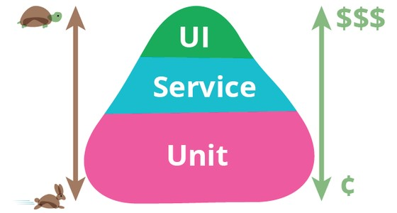
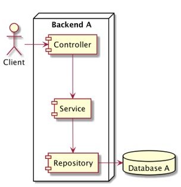

# Rust Unit Test

## Sebelum Belajar

- Rust Dasar
- Rust Crate

## #1 Pengenalan Software Testing

- Software testing adalah salah satu disiplin ilmu dalam software engineering
- Tujuan utama dari software testing adalah memastikan kualitas kode dan aplikasi kita baik
- Ilmu untuk software testing sendiri sangatlah luas, pada materi ini kita hanya akan fokus ke unit testing

## Test Pyramid



### Contoh High Level Architecture Aplikasi


### Unit Test / End to End Test


### Service Test / Integration Test


### Contoh Internal Architecture Aplikasi



### Unit Test


### Unit Test

- Unit test akan fokus menguji bagian kode program terkecil, biasanya menguji sebuah method
- Unit test biasanya dibuat kecil dan cepat, oleh karena itu biasanya kadang kode unit test lebih banyak dari kode program aslinya, karena semua skenario pengujian akan dicoba di unit test
- Unit test bisa digunakan sebagai cara untuk meningkatkan kualitas kode program kita

## #2 Membuat Project

- Buatlah project baru belajar-rust-unit-test menggunakan perintah :
- `cargo new belajar-rust-unit-test`

## #3 Unit Test

### Membuat Unit Test

- Untuk membuat unit test itu sangat mudah, kita hanya perlu menggunakan attribute `test` pada method
- Untuk menjalankan unit test, kita bisa gunakan perintah :
- `cargo test `
  Atau jika butuh menjalankan salah satu unit test function, kita bisa gunakan perintah :
- `cargo test nama_function`
- Jika ingin menampilkan output, kita bisa tambahkan parameter `--show-output`

### Kode: Membuat Unit Test

```rs
#[test]
fn test_simple() {
	println!("Hello Test");
}
```

### Kode: Menjalankan Unit Test

```sh
cargo test test_simple -- --show-output
```


## #4 Assertion

- Saat membuat unit test, hal yang biasa dilakukan adalah memastikan kode yang ditest itu benar
- Cara memastikan bahwa kode yang ditest itu benar, biasanya kita akan menggunakan assertions
- Rust menyediakan beberapa macro untuk melakukan assertion

### Assertion Macro

- `assert!(boolean, message)` untuk memastikan bahwa nilai boolean adalah true, jika false maka akan terjadi error dengan message
- `assert_eq!(left, right, message)` untuk memastikan bahwa nilai left sama dengan right, jika berbeda, maka akan terjadi error dengan message
- `assert_ne!(left, right, message)` untuk memastikan bahwa nilai left tidak sama dengan right, jika sama, maka akan terjadi error dengan message

### Kode: Assertions

```rs
fn add(a: i32, b: i32) -> i32 {
	a + b
}

#[test]
fn test_add() {
	let result = add(1, 2);
	assert_eq!(result, 3, " 1 + 2 should be 3");;
}
```

## #5 Panic

- Saat melakukan unit test, kadang kita ingin melakukan pengetesan terhadap kode program yang bisa menyebabkan panic
- Jika kita ingin membuat unit test yang mengharuskan kode yang di test terjadi `panic`, kita bisa gunakan attribute `should_panic`

### Kode: Panic Unit Test

```rs
fn start_application(host: &str, port: u16) {
	if host == "localhost" {
		panic!("You can't use localhost as host!");
	} else {
		println!("Starting application on {}:{}", host, port);
	}
}

#[test]
#[should_panic]
fn test_start_application() {
	start_application("localhost", 8000);
}
```

## #6 Ignore

- Saat membuat unit test, kadang kita sering mencoba semua kemungkinan, dan kadang mungkin terjadi kesalahan dalam unit test yang kita buat
- Hal ini kadang menyebabkan kita tidak ingin menjalankan unit test tersebut sementara
- Ada beberapa cara jika kita ingin menjalankan unit test nya, menghapus unit test-nya, atau menambahkan komentar
- Namun hal itu tidak direkomendasikan, cara yang lebih baik adalah menggunakan attribute `ignore`
- Unit test yang memiliki attribute `ignore`, maka secara otomatis tidak akan dijalankan

### Kode: Test Ignore

```rs
#[test]
#[ignore]
fn test_ignored() {
	println!("This test is ignored");
}
```

### Menjalankan Test Ignore

- Jika kita menjalankan unit test dengan menggunakan perintah :
- `cargo test`
- Secara otomatis semua unit test yang menggunakan attribute ignore tidak akan dieksekusi
- Namun jika kita tetap ingin menjalankan semua unit test yang di-ignore, maka kita harus tambahkan parameter `--ignored`

### Kode: Menjalankan Test Ignore

```sh
cargo test -- --ignored
```


## #7 Test Result

- Sebelumnya, kita pernah belajar tentang enum Result sebagai wrapper untuk kode/function yang bisa mengembalikan `error`
- Saat membuat unit test, kita juga bisa membuat test function yang mengembalikan `Result<(), E>`
- Jika hasilnya adalah adalah `Ok()` maka unit test akan sukses, jika hasilnya adalah `Err(E)`, maka hasilnya akan `error`

### Kode: Test Result

```rs
#[test]
fn test_add_again() -> Result<(), String> {
	let result = add(1, 2);
	if result == 3 {
		Ok(())
	} else {
		Err("1 + 2 should be 3".to_string());
	}
}
```

## #8 Integration Test

- Sebelumnya, kita selalu membuat unit test sesuai dengan lokasi kode program Rust, yaitu di folder src, hal itu dinamakan unit test
- Salah satu keuntungan unit test adalah, biasanya kecil dan bisa digunakan untuk mengetes kode private
- Integration test adalah testing secara external, terpisah dari kode program kita, dan hanya digunakan untuk testing kode public
- Tujuan integration test adalah melakukan pengujian seluruh integrasi dari aplikasi yang kita buat

### Test Folder

- Saat membuat integration test, di Rust biasanya akan disimpan dalam folder tests, terpisah dari folder src
- Karena foldernya terpisah, otomatis module nya terpisah.
- Hal ini menyebabkan integration test hanya bisa menggunakan kode public pada kode program yang kita buat

### Integration Test di App Project

- Integration test hanya bisa digunakan untuk jenis project Library, jika kita membuat jenis project Application (yang berisi `src/main.rs`), maka kita tidak bisa membuat integration test
- Cara lain jika kita ingin membuat integration test di jenis project Application, kita bisa buat dalam bentuk workspace
- Misal kita sekarang akan buat sub package dengan nama hello :
- `cargo new hello --lib`

### Kode: Say Hello

```rs
// lib.rs
pub fn say_hello(name: &str) -> String {
	format!("Hello, {}!", name);
}
```

### Kode: Integration Test

```rs
// say_hello.rs
#[test]
fn test_say_hello() {
	let result = hello::say_hello("Eko");
	assert_eq!(result, "Hello, Eko!");
}
```

### Menjalankan Integration Test

- Menjalankan integration test, sama saja seperti menjalankan unit test, kita bisa gunakan perintah cargo test
- Namun, jika kita buat dalam sub package, untuk menjalankan test pada package yang ingin kita pilih, kita bisa gunakan perintah :
- `cargo test -p nama-package`

### Kode: Menjalankan Integration Test

```sh
cargo test -p hello
```


## #9 Test Module

- Salah satu praktek Unit Test yang biasa dilakukan di Rust adalah membuat test module
- Setiap module, saat kita akan membuat unit test, alangkah baiknya kita buat dalam test module
- Biasanya kita akan membuat sub module dengan nama tests, lalu menambahkan attribute `cfg(test)` untuk menandai bahwa module tersebut adalah test module

### Keuntungan Test Module

- Keuntungan menggunakan test module adalah, ketika kita melakukan kompilasi untuk mode production, maka test module tidak akan di compile, sehingga proses kompilasi akan lebih cepat
- Selain itu ketika kita membuat unit test yang membutuhkan development dependency, maka dependency tersebut tidak akan di-include di dalam hasil kompilasinya, sehingga ukuran hasil kompilasi akan tetap kecil

### Kode: Test Module

```rs
// lib.rs
pub fn say_hello(name: &str) -> String {
	format!("Hello, {}!", name);
}

#[cfg(test)]
mod tests {
	use super::*;

	#[test]
	fn test_say_hello() {
		let result = hello::say_hello("Eko");
		assert_eq!(result, "Hello, Eko!".to_string());
	}
}
```

## #10 Materi Selanjutnya

- Rust Concurrency
