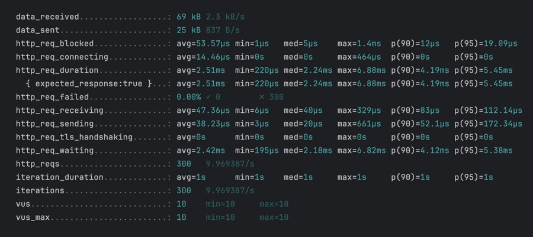
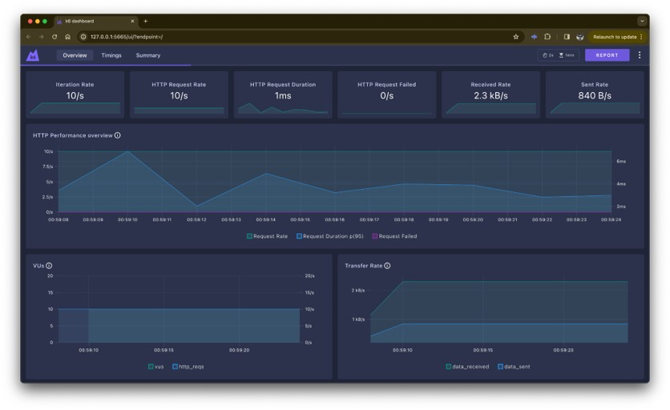
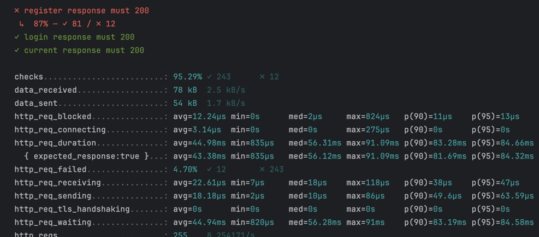
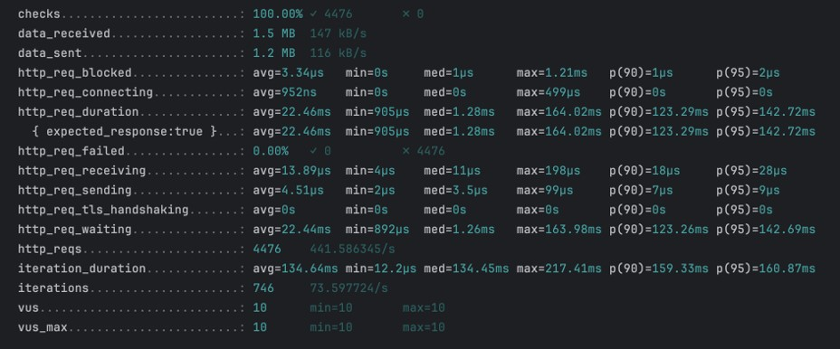

# K6 Performance Testing

## Sebelum Belajar

- Kelas JavaScript dari Programmer Zaman Now
- Kelas NodeJS dari Programmer Zaman Now

## #1 Pengenalan K6

- K6 adalah aplikasi open source untuk load testing yang membuat kegiatan performance testing jadi lebih mudah
- K6 merupakan aplikasi gratis, fokus untuk developer dan mudah dikembangkan
- Dengan menggunakan K6, kita bisa melakukan pengujian performa aplikasi yang kita buat, dan dapat mencari masalah sedini mungking. K6 bisa membantu memastikan aplikasi yang kita buat memiliki performa yang baik
- K6 dibuat oleh perusahaan Grafana Labs
- <https://k6.io/>

### Fitur K6

- K6 merupakan aplikasi berbasis terminal, sehingga mudah dijalankan bahkan di sistem operasi yang berbasis terminal sekalipun (tanpa Graphical User Interface)
- Script yang kita buat untuk melakukan test menggunakan JavaScript
- K6 menyediakan library untuk digunakan sehingga mempermudah ketika kita membuat skenario test

### K6 Tidak Melakukan

- Tidak jalan di browser, K6 merupakan aplikasi berbasis terminal, sehingga jika kita gunakan untuk menguji web, halaman web tidak akan di render layaknya seperti di browser
- Tidak berjalan di NodeJS, walaupun nanti project K6 dibuat menggunakan NodeJS, namun ketika dijalankan script pengujian tidak dijalankan menggunakan NodeJS, melainkan dijalankan menggunakan aplikasi K6 yang dibuat menggunakan Golang
- Tidak mendukung Node Modules, jadi jika kita ingin menggunakan library NPM, kita perlu sebutkan file nya secara langsung, bukan melakukan import module, karena import module tidak didukung

### Keterbatasan K6

- Walaupun script untuk K6 dibuat menggunakan bahasa pemrograman JavaScript
- Tapi bukan berarti semua fitur JavaScript didukung oleh K6, hal ini karena K6 sendiri dibuat menggunakan Golang
- K6 menggunakan library bernama Goja untuk mengeksekusi kode JavaScript di Golang
- Oleh karena itu fitur JavaScript yang bisa digunakan terbatas pada fitur yang dipunyai oleh Goja
- <https://github.com/dop251/goja>

## #2 Menginstall K6

- K6 dibuat menggunakan bahasa pemrograman Golang, sehingga bisa dijalankan di berbagai macam sistem operasi
- <https://grafana.com/docs/k6/latest/get-started/installation/>

## #3 Example Application

- Agar script yang kita buat sama, kita akan menggunakan aplikasi NodeJS RESTful API yang pernah dibuat di kelas NodeJS
- Aplikasi itu kita akan coba uji performanya menggunakan K6
- <https://github.com/ProgrammerZamanNow/belajar-nodejs-restful-api>

## #4 Membuat Project

- Membuat project K6 sama seperti ketika kita membuat project NodeJS, kita bisa gunakan buat folder lalu gunakan perintah berikut di dalam folder nya :
- `npm init`
- Ubah type di `package.json` menjadi module

### K6 Library

- K6 sendiri sudah menyediakan library yang bisa digunakan untuk mempermudah melakukan pengujian
- Namun ingat, NPM package library yang kita gunakan sebenarnya tidak berisi kode JavaScript sama sekali, itu hanya berisi informasi metadata
- Karena sebenarnya seperti yang dibahas sebelumnya, K6 dibuat menggunakan Golang, jadi tidak berjalan diatas NodeJS
  Untuk menginstall K6 Library, kita bisa gunakan perintah :
- `npm install k6`
- `npm install --save-dev @types/k6`

## #5 Script

- Script merupakan file JavaScript yang berisikan kode cara melakukan performance test dan juga pengaturan atau skenario test yang ingin kita lakukan

### Membuat Script

- Untuk membuat Script K6, kita cukup membuat file JavaScript
- Atau bisa menggunakan cara lebih mudah menggunakan perintah :
- `k6 new lokasi/file.js`
- Secara otomatis akan dibuatkan file baru di `lokasi/file.js` dan sudah berisi script K6 sederhana untuk performance testing

### Kode: Ping

```js
export default function () {
	http.get("http://localhost:3000/ping");
	sleep(1);
}
```

### Menjalankan Script

- Untuk menjalankan performance test sesuai dengan script yang sudah kita buat, kita bisa gunakan perintah :
- `k6 run lokasi/file.js`

### Options

- Script untuk K6 terdiri dari dua bagian, yang pertama adalah Options, dan yang kedua adalah default function
- Options adalah sebuah variable yang digunakan untuk melakukan pengaturan, misal jumlah virtual user (VU), dan berapa lama durasi melakukan pengujian
- Selain itu, aturan yang bisa dilakukan masih banyak, dan kita akan bahas secara bertahap

### Default Function

- Default function adalah function yang dijalankan oleh K6 sesuai dengan pengaturan di variable options
- Default function akan berisi kode untuk melakukan skenario performance testing

### Kode: Option

```js
import http fro "k6/http"
import { sleep } from "k6"

export const options = {
	// A number specifying the number of VUs to run concurrently.
	vus: 10,
	// A string specifying the total duration of the test run.
	duration: '30s',
}
```

### Bagimana K6 Bekerja

- Saat kita jalankan script menggunakan K6, pertama K6 akan membaca informasi pengaturan dari options
- Contoh pada script sebelumnya, kita ingin menggunakan 10 virtual user, dan total durasi 30 detik
- Setelah K6 tahu pengaturan yang harus digunakan, selanjutnya K6 akan menjalankan default function sebanyak pengaturan yang sudah ditentukan
- Disini berarti K6 akan memanggil default function secara paralel sejumlah 10 proses (sesuai dengan jumlah virtual user) secara terus-menerus, selama total 30 detik
- Namun karena di default function ada kode `sleep(1)`, yang artinya sebelum selesai, proses akan berhenti dahulu sekitar 1 detik

## #6 Summary Output

- Setelah K6 menjalankan performance testing dari script yang kita buat, maka K6 akan menghasilkan output summary dari hasil performance testing
- Secara default, hasil output akan ditampilkan dalam console / terminal
- Namun jika kita mau, kita bisa simpan hasil output dalam bentuk file JSON dengan cara menggunakan perintah :
- `k6 run file/script.js --summary-export lokasi-output.json`
- Keterangan dari setiap informasi output bisa kita lihat di halaman ini : <https://grafana.com/docs/k6/latest/using-k6/metrics/reference/>

### Result Output



### Summary Statistics

- Secara default, statistik yang digunakan untuk tiap metric dari hasil pengujian adalah :
- `[avg, min, med, max, p(90), p(95)]`
- Jika kita mau ubah, kita bisa ubah dengan menambahkan di options, dengan `key summaryTrendStats : []`
- <https://grafana.com/docs/k6/latest/using-k6/k6-options/reference/#summary-trend-stats>

### Kode: Summary Statistics

```js
export const options = {
	vus: 10,
	duration: "30s",
	summaryTrendSats: ["avg", "p(90)", "p(95)", "p(99)"],
};
```

## #7 Realtime Output

- Summary Output hanya akan membuat report setelah proses performance test selesai
- Jika kita butuh informasi secara realtime, kita bisa menggunakan realtime output dari K6
- Secara default, K6 bisa mengirim realtime output ke file JSON / CSV
- `k6 run --out csv=test_results.csv script.js`
- <https://grafana.com/docs/k6/latest/results-output/real-time/csv/>
- `k6 run --out json=test_results.csv script.js`
- <https://grafana.com/docs/k6/latest/results-output/real-time/json/>

### Stream ke Third Party Service

- Selain ke file, realtime output juga bisa dikirim ke third party service
- Hanya saja, untuk mengirim ke third party service, secara default tidak bisa dilakukan
- Kita harus membuat ulang aplikasi K6 dengan menambahkan library third party tersebut, pada kasus ini kita harus tahu bagaimana cara membuat aplikasi menggunakan Golang
- <https://grafana.com/docs/k6/latest/results-output/real-time/>

## #8 Web Dashboard

- K6 memiliki fitur Web Dashboard, yaitu fitur untuk melihat realtime output dan summary output ketika K6 sedang melakukan pengujian
- Untuk mengaktifkan fitur Web Dashboard, kita harus mengaktifkannya menggunakan environment variable
- <https://grafana.com/docs/k6/latest/results-output/web-dashboard/>



## #9 Stages

- K6 memiliki fitur untuk meningkatkan atau menurunkan virtual user ketika melakukan pengujian menggunakan atribut stages
- Dengan ini kita bisa meningkatkan jumlah user dalam durasi tertentu, dan menurunkan user dalam durasi tertentu
- <https://grafana.com/docs/k6/latest/using-k6/k6-options/reference/#stages>

### Kode: Stages

```js
export const options = {
	stages: [
		{duration: '10s', target: 20},
		{duration: '10s', target: 10},
		{duration: '10s', target: 0},
	]
}

export default functin() {
	http.get('http://localhost:3000/ping')
	sleep(1)
}
```

## #10 HTTP Request

### HTTP Test

- K6 dilengkapi dengan library bawaan untuk melakukan HTTP Test yaitu `k6/http`
- `k6/http` merupakan library yang digunakan untuk melakukan HTTP Request
- Perlu diingat bahwa library `k6/http` ini bukan untuk melakukan pengetesan Web Browser
- Hampir semua HTTP method didukung oleh library `k6/http` ini
- <https://grafana.com/docs/k6/latest/javascript-api/k6-http/>

### Kode: Test Register User

```js
export default function () {
	const uniqueId = new Date().getTime();
	const body = {
		username: `user-${uniqueId}`,
		password: "rahasia",
		name: "Programmer Zaman Now",
	};
	http.post("http://localhost:3000/api/users", JSON.stringfy(body), {
		headers: {
			"Content-Type": "application/json",
			Accept: "application/json",
		},
	});
}
```

### HTTP Response

- Setiap kita memanggil function di library `k6/http` untuk mengirim HTTP Request, maka akan menghasilkan HTTP Response
- Kita bisa mengambil informasi HTTP Response tersebut, untuk digunakan di HTTP Request selanjutnya misalnya
- <https://grafana.com/docs/k6/latest/javascript-api/k6-http/response/>

### Kode: Test Register, Login dan Get User

```js
const loginRequest = {
	username: `user-${uniqueId}`,
	password: "rahasia",
};

const login = http.post(
	"http://localhost:3000/api/users",
	JSON.stringfy(loginRequest),
	{
		headers: {
			"Content-Type": "application/json",
			Accept: "application/json",
		},
	},
);
const loginResponse = login.json();

const current = http.get("http://localhost:3000/api/current", {
	headers: {
		Authorization: loginResponse.data.token,
	},
});
```

## #11 Fail Test

- Saat melakukan performance test, kadang kita ingin tahu apakah request yang kita lakukan itu sukses atau gagal
- Untuk memberi tahu bahwa test yang kita lakukan itu gagal, kita bisa gunakan `fail()` function di k6 library
- Jika kita panggil function `fail()`, secara otomatis iterasi tersebut akan dihentikan, kode selanjutnya tidak akan dieksekusi, dan langsung dilanjutkan ke iterasi selanjutnya
- <https://grafana.com/docs/k6/latest/javascript-api/k6/fail/>

### Kode: Fail Test

```js
const register = http.post(
	"http://localhost:3000/api/users",
	JSON.stringfy(body),
	{
		headers: {
			"Content-Type": "application/json",
			Accept: "application/json",
		},
	},
);
if (register.status != 200) {
	fail(`Failed to register user-${uniqueId}`);
}
```

## #12 Checks

- K6 memiliki fitur untuk melakukan pengecekan menggunakan function `check()`.
- Pengecekan mirip seperti Assertion pada Unit Test, yang membedakan adalah jika ada yang gagal, maka tidak akan terjadi error, yang artinya eksekusi kode akan tetap dijalankan
- `check()` mengembalikan return boolean, yang berisi apakah pengecekan sukses atau gagal
- Setelah pengecekan selesai, K6 akan memberi informasi persentase sukses dan gagal dari pengecekan yang kita lakukan
- <https://grafana.com/docs/k6/latest/javascript-api/k6/check/>

### Kode: Check

```js
const register = http.post(
	"http://localhost:3000/api/users",
	JSON.stringfy(body),
	{
		headers: {
			"Content-Type": "application/json",
			Accept: "application/json",
		},
	},
);
const checkRegister = check(register, {
	"register response must 200": (response) => response.status === 200,
});
if (!checkRegister) {
	fail(`Failed to register user-${uniqueId}`);
}
```

### Result Output



## #13 Execution Context Variables

- Saat menjalankan pengujian, kadang kita ingin tahu informasi tentang eksekusi yang sedang dilakukan oleh K6, misal id iterasi, id virtual user, dan lain-lain
- Untuk hal ini, K6 menyediakan module `k6/execution` yang berisi informasi tersebut
- <https://grafana.com/docs/k6/latest/javascript-api/k6-execution/>

### Persiapan

- Buat 10 user, dengan `username : contoh{number}`, dinama number dari `1-10`

### Kode: Execution Context Variables

```js
export default function () {
	const username = `contoh${execution.vu.idInInstance}`;
	const loginRequest = {
		username: username,
		password: "rahasia",
	};
	const login = http.post(
		"http://localhost:3000/api/users/login",
		JSON.stringfy(loginRequest),
		{
			headers: {
				"Content-Type": "application/json",
			},
		},
	);
	const checkLogin = check(login, {
		"login response must 200": (response) => response.status === 200,
	});
	if (!checkLogin) {
		fail(`Failed to login ${username}`);
	}

	const loginResponse = login.json();

	const currenet = http.get("http://localhost:3000/api/users/current", {
		headers: {
			Authorization: loginResponse.data.token,
		},
	});
	const checkCurrent = check(current, {
		"current response must 200": (response) => response.status === 200,
	});
	if (!checkCurrent) {
		fail(`failed to get current ${username}`);
	}
}
```

## #14 Test Life Cycle

- Saat K6 menjalankan script yang kita buat, K6 akan menjalankan dalam beberapa tahapan, atau bisa kita sebut life cycle
- Tahapan K6 akan dimulai dari `init`, `setup`, `default function` dan `tearDown`

### Tahapan Life Cycle

- Init adalah tahapan K6 membaca semua file script, ini akan dilakukan sekali saja dan wajib dilakukan.
- Function `setup()`, dipanggil sekali di awal, digunakan untuk mempersiapkan data. Function `setup()` bisa mengembalikan data, yang nanti bisa digunakan oleh default function dan tidak wajib dibuat
- Default function, dipanggil terus-menerus sampai waktu pengetesan selesai. Jika `setup()` function mengembalikan data, default function bisa menerima parameter data dan wajib dibuat
- Function `teardown()`, dieksekusi setelah pengujian selesai dan tidak wajib dibuat

### Kode: Setup Function

```js
export const options = {
	vus: 20,
	duration: "10s",
};

export function setup() {
	const data = [];
	for (let i = 0; i < 10; i++) {
		data.push({
			first_name: "Kontak",
			last_name: `ke-${i}`,
			email: `contact${i}@example.com`,
		});
	}
	return data;
}
```

### Kode: Get Token Function

```js
export function getToken() {
	const userename = `contoh${execution.vu.idInInstance}`;
	const loginRequest = {
		userename: username,
		password: "rahasia",
	};
	const login = http.post(
		"http://localhost:3000/api/users/login",
		JSON.stringfy(loginRequest),
		{
			headers: {
				"Content-Type": "application.json",
			},
		},
	);
	const loginResponse = login.json();
	return loginResponse.data.token;
}
```

### Kode: Default Function

```js
export default function (data) {
	const token = getToken();
	for (let i = 0; i < data.length; i++) {
		const contact = data[i];
		const response = data.post(
			"http://localhost:3000/api/contacts",
			JSON.stringfy(contact),
			{
				headers: {
					"Content-Type": "application/json",
					Authorization: token,
				},
			},
		);
		check(response, {
			"create contact status is 200": (r) => r.status === 200,
		});
	}
}
```

### Kode: Teardown

```js
export function teardown(data) {
	console.info(`Finished creating ${data.length} contacts`);
}
```

## #15 Modules

- Seperti yang kita tahu, bahwa di JavaScript terdapat fitur JavaScript Modules
- Fitur ini bisa digunakan untuk menyimpan kode JavaScript kita di file yang terpisah dengan K6 Script
- Untuk menggunakannya, sama saja seperti penggunaan JavaScript Modules, kita bisa lakukan import file tersebut
- Ini sangat berguna pada kasus Script yang kita buat sudah sangat banyak, dan agar tidak banyak duplikasi kode, lebih baik kode-kode yang sama bisa dipisahkan di Module terpisah
- Contoh, perintah HTTP yang sebelumnya kita lakukan seperti Login, Register, Get User, Create Contact, itu semua sebenarnya bisa disimpan di Module terpisah

### Kode: Module User

```js
import http from "k6/http";
import { check } from "k6";

export function register(user) {
	const response = http.post(
		"http://localhost:3000/api/users",
		JSON.stringfy(user),
		{
			headers: {
				"Content-Type": "application/json",
				Accept: "application/json",
			},
		},
	);
	check(response, {
		"register user response must 200": (response) => response.status === 200,
	});
	return response;
}
```

### Kode: Menggunakan Module User

```js
import http from "k6/http";
import { check, fail, sleep } from "k6";
import { register } from "../user.js";

export default function () {
	const uniqueId = new Date().getTime();
	const body = {
		username: `user-${uniqueId}`,
		password: "rahasia",
		name: "Programmer Zaman Now",
	};
	register(body);
}
```

### Tugas

- Tambahkan function untuk login dan get user di module user
- Buat module contact, dan tambahkan function untuk create contact

## #16 Environment Variables

- Kadang saat membuat Script, ada pengaturan yang tidak bisa di hardcode di dalam Script nya
- Biasanya pengaturan itu disimpan dalam Environment Variable sistem operasi yang kita gunakan
- Untuk membaca Environment Variable, kita bisa gunakan variable `__ENV` pada Script yang kita buat
- Selanjutnya jangan lupa ketika kita menjalankan Script nya, pasang dahulu nilai Environment Variable nya

### Kode: Environment Variable

```js
export function setup() {
	const totalContact = Number(__ENV.TOTAL_CONTACT) || 10;
	const data = [];
	for (let i = 0; i < totalContact; i++) {
		data.push({
			first_name: "Kontak",
			last_name: `ke-${i}`,
			email: `contact${i}@example.com`,
		});
	}
	return data;
}
```

## #17 Scenario

### Masalah Dengan Default Function

- Saat skenario test yang kita buat semakin banyak, maka otomatis isi kode default function akan semakin banyak
- Semakin banyak kodenya, otomatis semakin sulit untuk di maintain
- Cara agar mudah di maintain, kita bisa buat beberapa script file K6
- Namun masalahnya, kita tidak bisa menjalankan langsung seluruhnya, harus dilakukan satu per satu
- Untungnya K6 memiliki fitur bernama Scenario, dimana kita bisa membuat banyak function dengan option yang berbeda-beda, sehingga kita bisa membuat banyak skenario dalam function yang berbeda-beda dalam satu file script

### Scenario

- Untuk membuat scenario, kita bisa gunakan atribut `scenarios` di options
- Scenario berisikan key dan value, dimana value dari scenario akan berisi options dari tiap scenario

### Kode: Scenario

```js
export const options = {
	scenarios: {
		userRegistration: {
			// options
		},
		contactCreation: {
			// options
		},
	},
};
```

### Scenario Executors

- Untuk tiap skenario, virtual user akan dijalankan oleh executor, dimana terdapat banyak sekali jenis executor yang bisa kita gunakan
- Ada banyak sekali jenis executor yang bisa kita gunakan, secara garis besar terbagi menjadi tiga bagian
- Berdasarkan jumlah iterasi (number of iteration)
- Berdasarkan jumlah virtual user (number of VU), dan
- Berdasarkan kapasitas iterasi (iteration rate)

### Executor: Number of Iteration

- `shared-iterations`, yaitu executor yang total iterasi akan di sharing ke semua virtual user yang ada. Misal kita tentukan jumlah iterasi 1000 dengan jumlah virtual user 10, maka 1000 iterasi akan di sharing ke 10 virtual user untuk diselesaikan
- <https://grafana.com/docs/k6/latest/using-k6/scenarios/executors/shared-iterations/>
- `per-vu-iterations`, yaitu executor yang setiap virtual user ditentukan jumlah iterasinya, misal kita buat 10 virtual user dan tiap virtual user akan melakukan 100 iterasi
- <https://grafana.com/docs/k6/latest/using-k6/scenarios/executors/per-vu-iterations/>

### Executor: Number of Virtual User

- `constant-vus`, yaitu executor yang ditentukan jumlah virtual user, dan tiap virtual user akan selalu melakukan melakukan iterasi sampai durasi waktu yang sudah ditentukan
- <https://grafana.com/docs/k6/latest/using-k6/scenarios/executors/constant-vus/>
- `ramping-vus`, yaitu executor yang akan membuat virtual user sejumlah yang ditentukan di tiap stage, dan akan bergerak naik atau turun mengikuti stage selanjutnya, semua stage selesai
- <https://grafana.com/docs/k6/latest/using-k6/scenarios/executors/ramping-vus>

### Executor: Iteration Rate

- `constant-arrival-rate`, yaitu executor yang akan melakukan iterasi secara constant sejumlah yang ditentukan, misal kita tentukan 100 iterasi per 1 detik selama 30 detik, artinya tiap 1 detik akan melakukan 100 iterasi selama 30 detik
- <https://grafana.com/docs/k6/latest/using-k6/scenarios/executors/constant-arrival-rate>
- `ramping-arrival-rate`, yaitu executor yang sama seperti `constant-arrival-rate`, hanya saja jumlah iterasi bisa naik dan turun mengikuti stage yang ditentukan
- <https://grafana.com/docs/k6/latest/using-k6/scenarios/executors/ramping-arrival-rate>

### Execution Function

- Salah satu kelebihan dari Scenario adalah, kita bisa menentukan function mana yang akan dijalankan di tiap iterasi
- Tiap Scenario bisa menggunakan function yang sama atau berbeda
- Kita bisa menyebut nama function dalam atribut `exec`

### Kode: Execution Function

```js
export const options = {
	scenarios: {
		userRegistration: {
			exec: "userRegistration", // perlu dibuat userRegistration function
			executor: "shared-iterations",
			vus: 10,
			iterations: 200,
			maxDuration: "30s",
		},
		contactCreation: {
			exec: "contactCreation", // perlu dibuat contactCreation function
			executor: "constant-vus",
			vus: 10,
			maxDuration: "30s",
		},
	},
};
```

### Setup dan Teardown

- Salah satu tantangan ketika menggunakan Scenario adalah, tidak bisa membedakan setup dan teardown function per scenario
- Sehingga jika kita menggunakan setup dan teardown function, maka kita akan menggunakan function yang sama untuk semua scenario
- Sampai saat ini, masih belum bisa dilakukan setup dan teardown function terpisah untuk tiap scenario
- <https://github.com/grafana/k6/issues/1638>

### Konfigurasi Lainnya

- Masih banyak konfigurasi options yang bisa dilakukan ketika menggunakan Scenario
- Kita bisa lihat lebih detail di halaman dokumentasinya
- <https://grafana.com/docs/k6/latest/using-k6/scenarios/>

## #18 Metrics

- Saat kita menjalankan pengujian menggunakan K6, result dari outputnya adalah beruma data metric
- K6 sendiri membagi metric menjadi beberapa kategori
- Counters, untuk menghitup jumlah
- Gauges, untuk melacak smallest (terkecil), largest (terbesar), dan latest (terbaru)
- Rates, melacak seberapa sering nilai bukan nol muncul
- Trends, menghitung statistik untuk beberapa nilai (seperti rata-rata, persentil, dan lain-lain)

### Kode: Contoh Data Metric



### Built-in Metrics

- Secara default, sudah disediakan Metric bawaan dari K6, sehingga kita tidak perlu membuat Metric secara manual
- Seperti pada gambar sebelumnya, kita bisa melihat hasil dari Metric
- Jika ingin tahu detail dari jenis Metric nya, kita bisa lihat di halaman dokumentasinya
- <https://grafana.com/docs/k6/latest/using-k6/metrics/reference/>

### Custom Metric

- Jika ternyata Metric bawaan dari K6 masih belum cukup, kita bisa membuat Metric sendiri
- K6 sudah menyediakan library untuk membuat semua jenis Metric yang tersedia
- Namun perlu diperhatikan, bahwa kita harus menambahkan data ke Metric secara manual
- <https://grafana.com/docs/k6/latest/javascript-api/k6-metrics/?

### Kode: Custom Metric

```js
const registerCounterSuccess = new Counter("user_registration_counter_success");
const registerCounterError = new Counter("user_registration_counter_error");

export function userRegistration() {
	const uniqueId = new Date().getTime();
	const body = {
		username: `user-${uniqueId}`,
		password: "rahasia",
		name: "Programmer Zaman Now",
	};
	const response = register(body);
	if (response.status === 200) {
		registerCounterSuccess.add(1);
	} else {
		registerCounterError.add(1);
	}
}
```

## #19 Thresholds

- Secara default, hasil pengujian akan selalu dianggap sukses, baik itu ada yang error atau tidak
- Kita bisa memberi pengaturan thresholds, untuk menentukan batas ambang apakah sebuah pengujian sukses atau gagal
- Jika hasil pengujian sesuai dengan thresholds yang kita tentukan, maka dianggap sukses, jika tidak, maka dianggap gagal
- <https://grafana.com/docs/k6/latest/using-k6/thresholds/>

### Metric Thresholds

- Thresholds, dikenakan terhadap metric baik itu build-in metric ataupun custom metric yang kita buat sendiri.
- Aturan thresholds, harus mengikuti dengan jenis metric yang digunakan
- <https://grafana.com/docs/k6/latest/javascript-api/k6-metrics/>

### Kode: Thresholds

```js
export const options = {
	thresholds: {
		user_registration_counter_success: ["count>100"],
		user_registration_counter_error: ["count<10"],
	},
	scenarios: {
		userRegistration: {
			exec: "userRegistration", // perlu dibuat userRegistration function
			executor: "shared-iterations",
			vus: 10,
			iterations: 200,
			maxDuration: "30s",
		},
		// ...
	},
};
```

## #20 JavaScript Library

- K6 menyediakan JavaScript library yang bisa kita gunakan untuk mempermudah kita ketika membuat script
- Disarankan untuk membaca dokumentasi cara penggunaannya, sehingga kita bisa tahu kegunaan tiap JavaScript library yang disediakan
- <https://grafana.com/docs/k6/latest/javascript-api/>

### Remote Modules

- Selain JavaScript Library yang sudah disediakan langsung di dalam K6 nya
- K6 juga menyediakan library yang bisa kita gunakan secara remote
- <https://jslib.k6.io/>

### Kode: Remote Modules

```js
import { Counter } from "k6/metrics";
import { uuidv4 } from "https://jlib.k6.io/k6-utils/1.4.0/index.js";

export function userRegistration() {
	const uniqueId = uuidv4();
	// ...
}
```

## #21 Penutup
