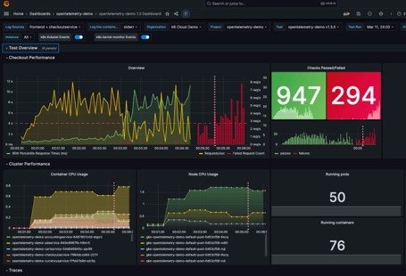
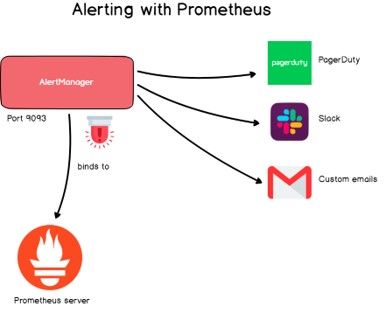
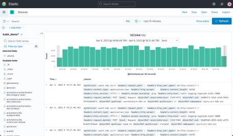

# Manajemen Insiden

## Apa Itu Manajemen Insiden

- Manajemen insiden adalah proses yang digunakan tim IT untuk merespons gangguan layanan yang tidak direncanakan.
- Mencoba mengembalikan operasi reguler layanan IT dengan cepat dan meminimalkan dampak bisnis dari insiden.
- Dalam prosesnya, tim mendeteksi dan menyelidiki insiden, menyelesaikan masalah, dan mendokumentasikan langkah-langkah yang mereka ambil untuk memulihkan layanan.

## Agenda

- Sebelum Terjadi Insiden
- Ketika Terjadi Insiden
- Setelah Insiden Selesai
- Mencegah Terjadi Insiden

## #1 Sebelum Terjadi Insiden

- Sebisa mungkin, kita harus tahu jika terjadi insiden, oleh karena itu banyak yang harus kita lakukan, seperti
- Memonitor seluruh aplikasi menggunakan Monitoring Tool
- Gunakan Alert ketika terdapat anomali pada aplikasi
- Logging dan Tracing, untuk mengetahui apa yang sedang dilakukan oleh aplikasi

### Monitoring

- Kita harus tahu apa yang sedang terjadi pada aplikasi dan seluruh pendukung aplikasi, seperti infrastructure, network, third party, dan lain-lain
- Jika sampai kita tidak tahu, maka kita akan buta ketika terjadi masalah pada aplikasi yang kita buat

> Grafana

### Alert

- Data monitoring sangat berguna untuk membuat peringatan ketika terjadi anomali pada aplikasi yang kita buat
- Untuk mengetahui anomali apa yang harus kita perhatikan, kita harus tahu juga dengan perilaku aplikasi yang kita buat

> Prometheus

### Logging dan Tracing

- Logging dan Tracing, atau pencatatan dan pelacakan kejadian yang dilakukan oleh aplikasi sangat penting untuk dilakukan
- Hal ini untuk mempermudah melakukan proses pencarian akar masalah ketika terjadi insiden

### Kenapa Penting?

- Laporan insiden bisa didapat dari dua sumber, pengguna atau system
- Jangan sampai laporan insiden dilaporkan oleh pengguna, artinya kita tidak menyadari masalah yang sedang terjadi

## #2 Ketika Terjadi Insiden

- Ketika terjadi insiden, ada beberapa tahapan yang perlu kita lakukan
- Menentukan prioritas dari insiden yang sedang terjadi
- Mencari akar masalah yang menyebabkan insiden
- Mencari jalan keluar tercepat agar insiden bisa diperbaiki secepatnya

### Prioritas Insiden

- Ketika terjadi Insiden, pastikan kita tahu prioritas insiden nya, misal low, medium atau high priority
- Cara paling gampang untuk menentukan, contohnya
- **High priority**, insiden menyebabkan pengguna tidak bisa melakukan transaksi utama di aplikasi, sehingga berdampak besar ke bisnis, misal penurunan pendapatan perusahaan
- **Medium priority**, insiden yang mengganggu interaksi pengguna dengan aplikasi, namun tidak berdampak ke transaksi utama, sehingga tidak menurunkan pendapatan perusahaan
- **Low priority**, insiden yang tidak berdampak langsung ke pengguna aplikasi

### Root Cause

- Cari akar masalah yang menyebabkan insiden
- Jangan gunakan asumsi, gunakan data Monitoring, Logging dan Tracing untuk mencari akar masalah yang menyebabkan insiden terjadi
- **Mencari akar masalah bukan proses menyalahkan aplikasi lain, tim lain, atau orang lain**
- Mencari akar masalah adalah proses menyiapkan data untuk dijadikan acuan menentukan solusi yang harus dilakukan agar masalah yang sama tidak terjadi dikemudian hari

### Solusi Tercepat

- Saat insiden terjadi, dan akar masalah sudah diketahui, hal yang harus dilakukan adalah mencari solusi tercepat untuk menyelesaikan insiden
- Perlu diingat, solusi tercepat mungkin bukan solusi paling baik, namun tujuannya adalah menyelesaikan masalah secepatnya terlebih dahulu
- **Solusi tercepat harus dilakukan setelah akar masalah diketahui, bukan selalu menggunakan solusi tercepat tanpa tahu akar masalahnya**

## #3 Setelah Insiden Selesai

- Hal yang harus dilakukan setelah insiden berhasil diselesaikan, adalah membuat laporan RCA (root cause analysis)
- Laporan RCA digunakan untuk melakukan evaluasi terhadap insiden yang sudah terjadi, dan bagaimana solusi jangka pendek yang telah dilakukan, dan bagaimana solusi jangka panjang yang akan dilakukan

## RCA (root cause analysis)

- Bagaimana membuat laporan RCA?
- Tidak ada aturan baku dalam membuat laporan RCA, yang paling penting dalam laporan - RCA adalah kita harus tahu betul akar masalahnya, dan bagaimana solusi yang harus dilakukan
- Contoh yang biasa digunakan dalam membuat laporan RCA adalah menggunakan pendekatan `"5 why"`
- <https://wavelength.asana.com/workstyle-ask-5-whys-to-get-to-the-root-of-any-problem/>

### Contoh: Pelanggan Tidak bisa Login

- **Mengapa?** Pelanggan tidak bisa login (lampirkan gambar error ketika login)
- **Mengapa?** Aplikasi mengembalikan response 500 internal server error. (lampirkan error rate yang terjadi)
- **Mengapa?** Response dari database ke aplikasi lambat, sehingga timeout (lampirkan response rate dari database)
- **Mengapa?** Aplikasi reporting sedang melakukan query berat ke database (lampirkan bukti kejadian)
- **Mengapa?** User internal sedang membuat laporan untuk akhir bulan
- **Bagaimana (jangka pendek)?** Menaikkan hardware untuk database agar bisa menangani proses yang berat
- **Bagaimana (jangka panjang)?** Memisahkan database untuk operasional dan reporting

## #4 Mencegah Terjadi Logging

- Insiden biasanya terjadi ketika ada beberapa hal yang terlewat atau tidak terduga terjadi
- Ada beberapa cara yang bisa kita lakukan untuk mencegah terjadi insiden dan menyelesaikan insiden dengan cepat
- Lakukan automation test secara regular
- Lakukan performance test secara regular
- Selalu gunakan feature flag untuk penambahan fitur
- Lakukan skenario rekayasa kekacauan

### Automation Test

- Automation test penting dilakukan secara regular untuk memastikan sistem yang sedang berjalan tidak ada masalah
- Contoh, tiap jam jalankan automation test untuk melakukan transaksi pembelian di aplikasi. Jika sukses berarti tidak ada masalah di aplikasi, jika gagal kita bisa mengirim peringatan bahwa ada masalah yang terjadi di aplikasi

### Performance Test

- Ada beberapa jenis aplikasi yang kadang bermasalah ketika pengunjung terlalu banyak
- Lakukan performance test secara regular , untuk memprediksi berapa banyak kapasitas pengunjung yang bisa ditangani oleh aplikasi yang kita buat
- Jika kita sudah tahu kapasitas aplikasi kita, kita bisa menambahkan rate limiter atau mempersiapkan horizontal scalability untuk aplikasi yang kita buat

### Feature Flag

- Feature flag adalah kemampuan mengaktifkan dan menonaktifkan fitur
- Feature flag sangat wajib digunakan ketika menambah fitur, terutama fitur yang bisa mengganggu fitur yang lainnya
- Feature flag adalah salah satu solusi cepat ketika terjadi masalah dengan fitur yang sedang berjalan, kita bisa dengan mudah mematikan fitur tersebut sehingga pelanggan tidak akan melihat fitur tersebut

### Rekayasa Kekacauan

- Chaos Engineering (rekayasa kekacauan) adalah salah satu hal yang bisa dilakukan untuk menguji apakah aplikasi kita bisa berjalan dalam skenario hal tidak terduga (misal network down, database down, database slow, dan lain-lain)
- Hal ini bisa diujicobakan di aplikasi yang kita buat, agar aplikasi yang kita buat lebih resilient terhadap masalah tak terduga yang terjadi
- Contoh sederhana, kita bisa implementasi retry ketika gagal mengirim data ke database. Atau implementasi circuit breaker ketika gagal integrasi dengan third party.
