# Software Architecture Patterns

## Untuk Siapa Materi Ini?

- Programmer yang ingin menjadi Principal Engineer, Software Architect atau Technical Architect

## Agenda

- Pengenalan Software Architecture Patterns
- Layered Architecture
- Model-View-Controller Architecture
- Hexagonal Architecture
- Microkernel Architecture
- Client-Server Architecture
- Microservices Architecture
- Dan lain-lain

## #1 Pengenalan Software Architecture Patterns

### Pendahuluan

- Sudah jadi hal yang biasa, biasanya programmer akan membuat perangkat lunak tanpa persiapan yang matang
- Hal ini kadang membuat perangkat lunak menjadi sulit di-maintain dan dikembangkan ketika sudah terlanjur dibuat
- Oleh karena itu, sebelum melakukan pembuatan perangkat lunak yang besar, salah satu hal yang wajib dilakukan adalah memilih arsitektur yang akan digunakan
- Dalam pemilihan arsitektur perangkat lunak, kita harus mengerti kelebihan dan kekurangannya, agar membantu dalam pembuatan perangkat lunak yang akan dilakukan

### Software Architecture Patterns

- Architecture Patterns merupakan kumpulan gaya arsitektur dalam pembuatan perangkat lunak.
- Ada banyak sekali Architecture Patterns, dan setiap pattern memiliki kelebihan dan kekurangan masing-masing
- Programmer perlu tahu tentang materi ini agar bisa menentukan pattern apa yang akan digunakan ketika membuat perangkat lunak

### Tujuan Architecture Patterns

- Tiap Architecture Pattern memiliki karakteristik seperti mudah dikembangkan, scalable dan mudah di-maintain
- Harapannya, dengan menggunakan Architecture Pattern yang tepat saat pembuatan perangkat lunak, hasil perangkat lunak yang kita buat akan mudah dikembangkan kedepannya

## #2 Architecture Classification

- Software Architecture Patterns secara garis besar dibagi menjadi dua klasifikasi, Monolithic dan Distributed
- Monolithic adalah single deployment unit atau berjalan dalam satu aplikasi
- Distributed adalah multiple deployment units, biasanya terdiri dari beberapa aplikasi

### Monolithic Architecture

- Monolithic Architecture secara umum sangat sederhana dibandingkan Distributed Architecture
- Desain aplikasi Monolithic lebih sederhana dan mudah diimplementasikan
- Aplikasi yang menggunakan Monolithic Architecture akan sangat cepat dibuat dan didistribusikan

### Diagram: Monolithic Application

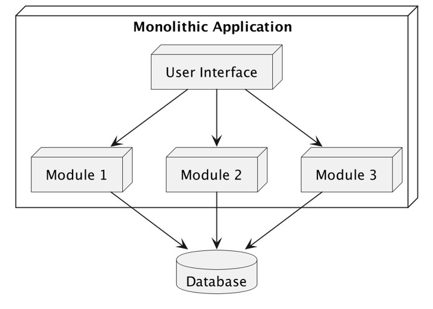

### Distributed Architecture

- Distributed Architecture biasanya terdiri dari beberapa aplikasi yang bekerja bersamaan, berbeda dengan aplikasi Monolithic yang hanya satu aplikasi
- Biasanya dalam Distributed Architecture, setiap unit aplikasi disebut Service
- Pengembangan Distributed Architecture memang lebih kompleks dibandingkan dengan Monolithic Architecture, namun menawarkan keuntungan seperti toleransi kesalahan (fault tolerance), misal ketika ada satu Service gagal, Service lain masih bisa berjalan dengan normal

### User Interface

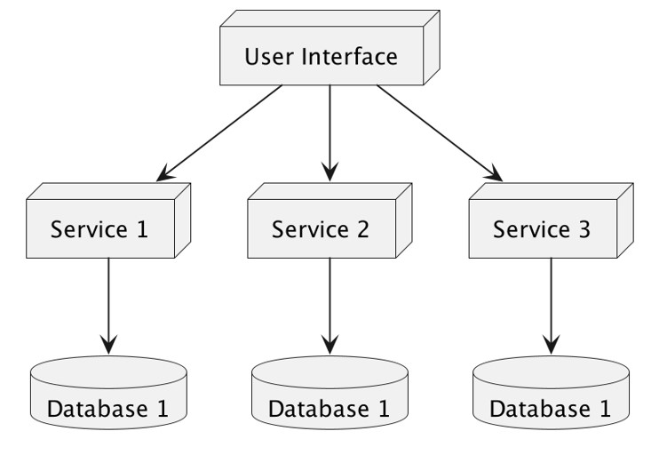

### Pilih yang Mana?

- Pada saat pembuatan aplikasi, kadang kita bingung menentukan harus menggunakan arsitektur Monolithic atau Distributed
- Jika aplikasi yang akan kita buat sederhana atau masih belum jelas secara business requirement, sangat disarankan menggunakan Monolithic, karena mudah untuk dibuat
- Namun jika aplikasi yang akan kita buat sudah sangat jelas, dan juga memang membutuhkan scalability yang baik, termasuk fault tolerance yang baik, maka kita bisa gunakan arsitektur Distributed

## #3 Architecture Partitioning

- Selain dilihat secara klasifikasi monolithic atau distributed, software architecture juga bisa dilihat secara struktur partisinya
- Software architecture baik itu monolithic atau distributed, secara partisi bisa dibagi berdasarkan teknis atau domain
- Partisi secara struktur bisa digunakan di monolithic atau distributed

### Technical Partitioning

- Arsitektur Technical Partitioning membagi komponen-komponen dalam system atau aplikasi secara teknis
- Contoh arsitektur klasik yang sering digunakan adalah Layered `(N-Tier)` Architecture
- Dalam Technical Partitioning, komponen dalam system dikelompokan secara teknis, misal :
- `Presentation Layer` merupakan komponen yang menangani user interface
- `Business Layer`, merupakan komponen yang menangani logika dan aturan bisnis
- `Persistence Layer`, merupakan komponen yang menangani interaksi dengan sistem basis data
- `Database Layer`, merupakan komponen untuk menyimpan data

### Diagram: Technical Partitioning

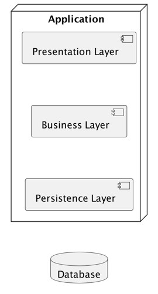

### Domain Partitioning

- Berbeda dengan Technical Partitioning, dalam Domain Partitioning, pembagian struktur komponen dalam system dikelompokan berdasarkan Domain / Fitur / Departemen secara bisnis nya
- Artinya semua Technical Partitioning seperti Presentation, Business Logic, Persistence, digabung dalam per domain system
- Partisi system berdasarkan Domain, populer sejak dikenalkan dalam buku berjudul `"Domain Driven Design"` karya Eric Evans.

### Diagram: Domain Partitioning

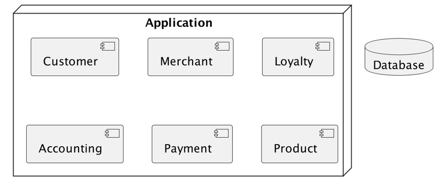

### Pilih yang Mana?

- Technical ataupun Domain Partitioning memiliki kelebihan dan kekurangan, namun secara pribadi saya rekomendasikan gunakan :
- Technical Partitioning ketika aplikasi yang akan dibuat sederhana dan tidak kompleks. Selain itu ketika jumlah anggota tim pengembang tidak terlalu banyak.
- Domain Partitioning ketika aplikasi yang akan dibuat kompleks dan fitur aplikasi sangat banyak. Dan sangat cocok ketika anggota tim pengembang banyak pembagian tim berdasarkan jenis domain nya.

## #4 Layered Architecture

- Layered Architecture dikenal juga dengan N-Tier Architecture
- Arsitektur ini adalah salah satu standard arsitektur untuk kebanyakan aplikasi, dimana aplikasi dibagi secara teknis
- Karena arsitektur ini sangat banyak diketaui oleh pengembang perangkat lunak, hal ini menjadikan arsitektur ini menjadi salah satu pilihan yang banyak digunakan

### Komponen Layered Architecture

- Layered Architecture dibagi secara teknis, oleh karena itu komponen-komponen dalam Layered Architecture sama dengan Technical Partition
- Rata-rata banyak yang membagi menjadi 4 layer, Presentation Layer, Business Layer, Persistence Layer dan Database Layer. Namun tidak menutup kemungkina bisa lebih banyak layer ketika aplikasi sangat kompleks

### Diagram: Komponen Layered Architecture

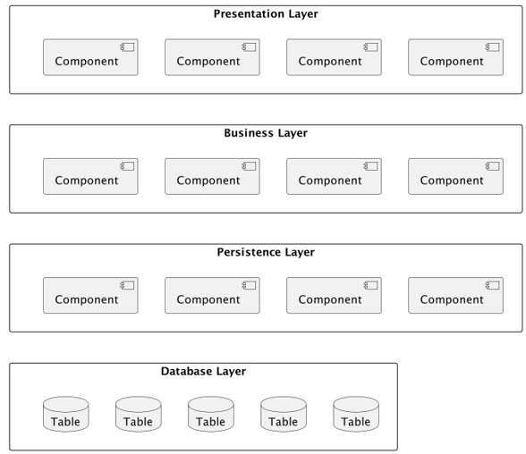

### Tugas Tiap Layer

- Setiap layer di Layered Architecture memiliki tugas masing-masing
- Presentation Layer bertanggung jawab menangani semua user interface
- Business Layer bertanggung jawab mengeksekusi permintaan logika atau aturan bisnis yang sesuai permintaan
- Persistence Layer bertanggung jawab untuk berinteraksi dengan database untuk melakukan pengolaha data di database
- Database Layer bertanggung jawab untuk menyimpan semua data aplikasi

### Layers of Isolation

- Dalam Layered Architecture, tiap Layer akan terisolasi, dan arah komunikasi hanya dilakukan dengan layer dibawah atau diatasnya
- Artinya, misal ketika Presentation Layer ingin mengambil data Product, Presentation Layer akan mengirim request ke Business Layer, lalu akan mengambil data ke Persistence Layer dan baru masuk ke Database Layer
- Tidak direkomendasikan untuk langsung mengakses dari Presentation Layer langsung ke Database Layer misalnya

### Diagram: Layers of Isolation

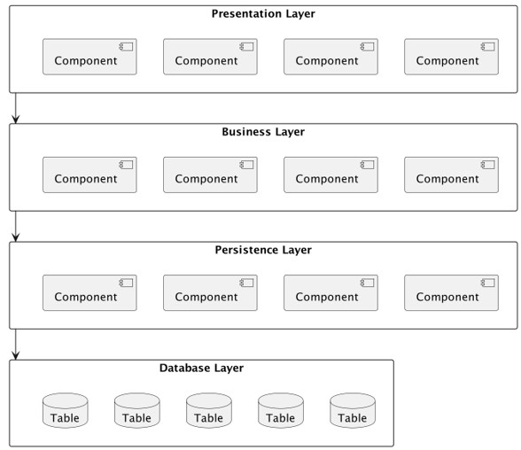

### Contoh

- Setelah tahu cara kerja Layered Architecture, maka kita bisa dengan mudah menggambarkan alur yang harus dibuat ketika membuat aplikasi
- Misal kita ingin menampilkan halaman Product, namu di dalam halaman Product kita juga ingin menampilkan data Seller nya
- Maka kita bisa buat alur aplikasi seperti pada diagram selanjutnya

### Diagram: Contoh

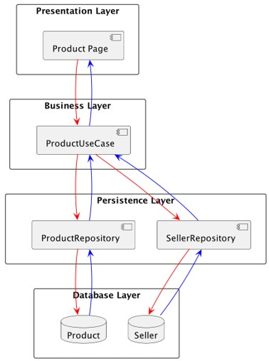

### Pertimbangan

- Layered Architecture adalah salah satu arsitektur yang banyak dimengerti dan digunakan
- Gunakan Layered Architecture jika kita masih bingung ingin menggunakan arsitektur apa, karena ini adalah arsitektur yang bagus untuk memulai aplikasi
- Namun jangan gunakan Layered Architecture ketika pembagian tim di perusahaan sudah berdasarkan domain, lebih cocok menggunakan Distributed Architecture yang akan kita bahas di materi-materi selanjutnya

## #5 Model-View-Controller Architecture

- Model View Controller (MVC) Architecture merupakan salah satu arsitektur yang sangat populer ketika membuat Web
- MVC mirip dengan Layered Architecture, hanya saja layer nya berbeda
- dalam MVC pusat interaksi antar layer biasanya dilakukan oleh Controller

### Diagram: Model-View-Controller

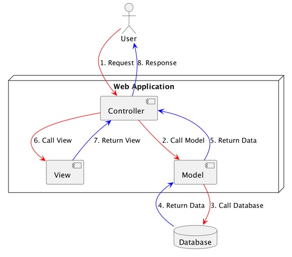

### Tugas Tiap Layer

- Dalam MVC, setiap layer memiliki tugas masing-masing
- Controller adalah layer yang bertanggung jawab untuk menerima request dan mengekseksi logika dan aturan bisnis yang terjadi di aplikasi
- Model merupakan layer yang bertanggung jawab sebagai representasi data di database dan juga berinteraksi ke database
- View merupakan layer yang berisi template untuk tampilan halaman web
- Database merupakan layer untuk menyimpan data aplikasi

### Contoh

- Misal kita memiliki web, dimana terdapat satu halaman web yang perlu untuk menampilkan data wishlist. Pada halaman itu, selain data wishlist, kita juga harus menampilkan detail product yang terdapat di wishlist tersebut

### Diagram: Contoh

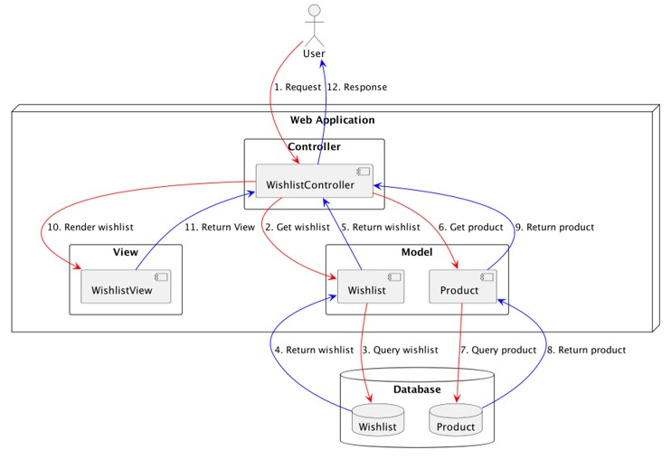

### Pertimbangan

- MVC adalah pilihan utama ketika kita ingin membuat aplikasi Web.
- Banyak sekali web framework yang sudah secara otomatis menggunakan arsitektur ini, seperti Laravel, NestJS, Rails, Django, dan lain-lain
- Namun ketika kita membuat RESTful API misalnya, kita tidak wajib mengikuti aturan MVC, karena biasanya kita tidak memerlukan layer View. Pada kasus seperti ini, kita bisa saja menggabungkan arsitektur MVC ini dengan Layered Architecture

## #6 Hexagonal Architecture

- Salah satu masalah ketika menggunakan Layered Architecture adalah, perubahan jenis teknologi yang digunakan, akan menyulitkan pengembangan
- Contoh ketika kita harus mengganti teknologi database yang digunakan, secara otomatis akan terjadi perombakan besar-besaran pada kode program Persistence Layer dan Database Layer, yang mungkin bisa menyebabkan perombakan juga pada Business Layer
- Hexagonal Architecture merupakan arsitektur yang dikembangkan dari Layered Architecture, namun lebih baik ketika menangani perubahan teknologi yang terjadi
- Hexagonal Architecture juga dikenal dengan Port & Adapter Architecture

### Diagram: Hexagonal Architecture

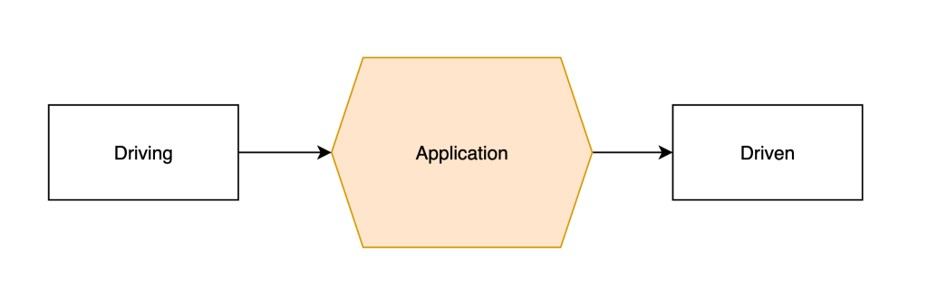

### Port dan Adapter

- Hexagonal Architecture sebenarnya dikenalkan dengan nama Port & Adapter Architecture, namun saat ini lebih populer dengan nama Hexagonal Architecture
- Port merupakan technology-agnostic yang merupakan sebuah OOP (Object Oriented Programming) Interface, yang digunakan oleh kode aplikasi untuk berkomunikasi dengan pihak lain
- Adapter merupakan bagian yang berinteraksi langsung melalui Port, dan menggunakan teknologi yang sudah ditentukan

### Kode: Diagram Port dan Adapter

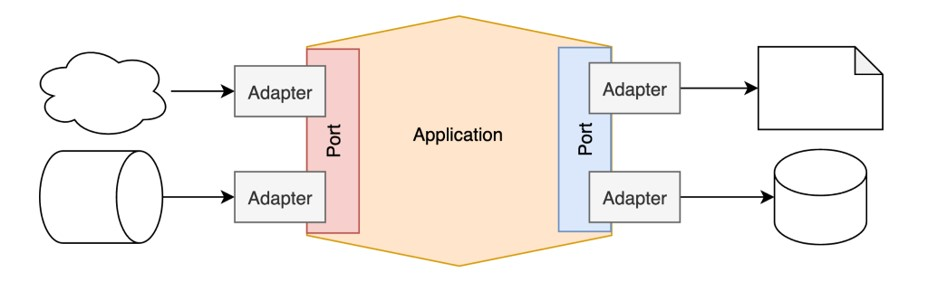

### Application Layer

- Dalam Hexagonal Architecture, Application Layer akan berisi logika dan aturan bisnis, dimana kode yang dibuat akan berinteraksi hanya dengan Port, tanpa tahu Adapter yang digunakan
- Hal ini agar tercapainya technology agnostic, sehingga ketika Adapter diubah, Application Layer tidak perlu berubah
- Selain itu, di dalam Application Layer, terdapat Domain Layer, yang berisikan representasi data domain aplikasi
- Bagian Driving, biasanya disebut User Interface / Transport Layer / Gateway, yaitu sumber request masuk ke aplikasi
- Bagian Driven, biasanya disebut Infrastructure / Data Source / External Interfaces, yaitu target data keluar dari aplikasi

### Kode: Diagram Application Layer

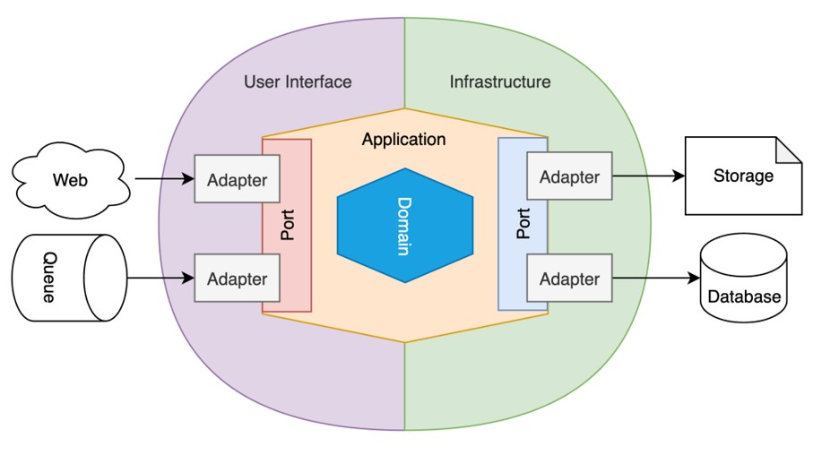

### Clean Architecture

- Saat ini, terkenal juga arsitektur dengan nama Clean Architecture
- Jangan bingung jika harus memilih Hexagonal Architecture atau Clean Architecture
- Sebenarnya Clean Architecture tidak berbeda jauh dengan Hexagonal Architecture, bahkan penulis buku Clean Architecture pun memang sudah menjelaskan bahwa salah satu referensi Clean Architecture adalah dari Hexagonal Architecture
- <https://blog.cleancoder.com/uncle-bob/2012/08/13/the-clean-architecture.html>

### Contoh

- Misal kita memiliki aplikasi Web toko online, dimana kita akan membuat halaman pembayaran
- Dimana saat melakukan pembayaran, data pembayaran selain disimpan di database, akan dikirim ke Payment Gateway

### Diagram: Contoh

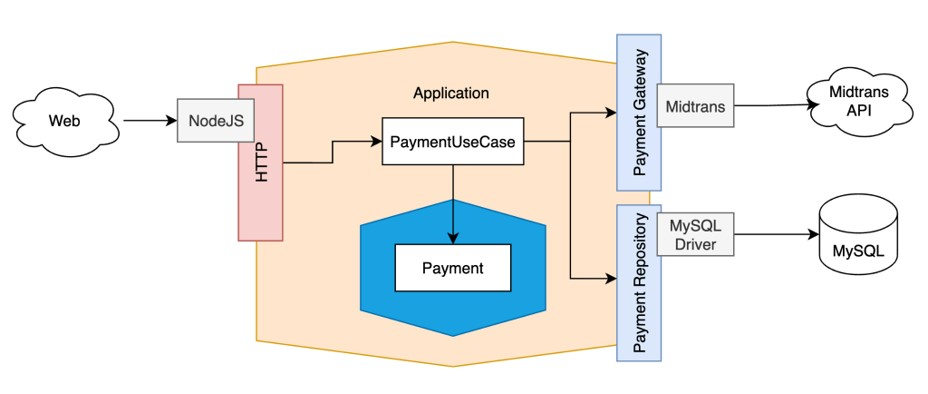

### Pertimbangan

- Hexagonal Architecture merupakan salah satu arsitektur yang bagus digunakan ketika kita akan membuat aplikasi yang kompleks dan agar aplikasinya technology agnostic sehingga mudah diganti-ganti
- Namun pengembangan Hexagonal Architecture tidaklah semudah Layered Architecture, sehingga jika pengembang belum familiar dengan Hexagonal Architecture, maka bisa terkendala ketika proses pengembangan

## #7 Mikrokernel Architecture

- Microkernel Architecture sangat flexible dan extensible, sehingga pengembang bisa dengan mudah menambah fitur pada aplikasi dalam bentuk extension atau plug-in, tanpa takut menggangu fungsionalitas dari aplikasinya itu sendiri
- Oleh karena itu, Microkernel Architecture juga sering disebut sebagai Plug-in Architecture
- Microkernel Architecture sangat banyak digunakan pada aplikasi berbasis desktop biasanya, contoh seperti Visual Studio, Eclipse, dan lain-lain, dimana ada banyak sekali extension atau plug-in yang tersedia untuk aplikasi tersebut

### Diagram: Mikrokernel Architecture

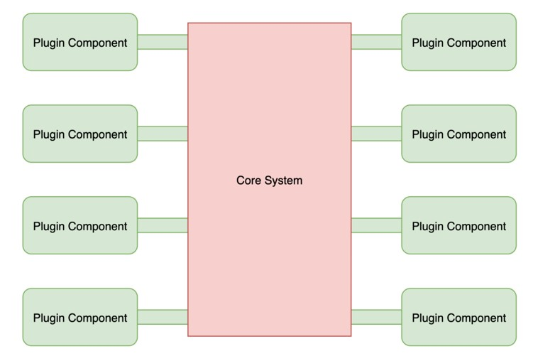

### Topology

- Dalam Microkernel Architecture, hanya terdapat dua layer, Core System dan juga Plugin Modules
- Logic aplikasi di Microkernel Architecture biasanya di tempatkan di Plugin, maka dari itu arsitektur ini terlihat seperti Hexagonal Architecture, tetapi sebenarnya bukan
- Dalam Hexagonal Architecture, logic aplikasi ditempatkan di aplikasi, sedangkan di Microkernel Architecture, detail logic aplikasi berada di tiap Plugin masing-masing

### Pertimbangan

- Microkernel Architecture sangat populer digunakan ketika membuat aplikasi Desktop berbasis plugin, seperti Visual Studio, Eclipse, IntelliJ IDEA, bahkan seperti Browser
- Gunakan Microkernel Architecture jika memang kita ingin membuat aplikasi yang berbasis Plugin
- Salah satu keunggulan Microkernel Architecture adalah, orang lain bisa berkontribusi membuat Plugin untuk aplikasi kita

## #8 Client-Server Architecture

- Client-Server Architecture adalah salah satu Distributed System Architecture yang banyak dikenal dan digunakan
- Arsitektur ini sangat sederhana, dimana terdapat aplikasi Client dan Server yang saling berinteraksi
- Biasanya komunikasi antara Client dan Server menggunakan jaringan TCP/IP, walaupun tidak tertutup kemungkinan menggunakan jaringan lain seperti UDP

### Diagram: Client-Server Architecture

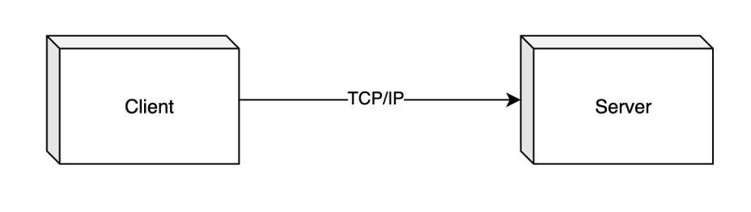

### Topology

- Client adalah aplikasi yang digunakan oleh pengguna dan berinteraksi langsung dengan pengguna. Biasanya aplikasi Client adalah aplikasi yang berbasis user interface, baik itu berupa Web, Desktop atau bisa saja berbasis Terminal. Client akan mengirim semua request yang diminta oleh pengguna ke aplikasi Server
- Server adalah inti dari aplikasi, dimana semua logika dan aturan bisnis dilakukan di Server. Server akan menjalankan perintah yang diminta oleh Client, dan mengembalikan data yang diminta ke Client
- Keuntungan menggunakan Client-Server Architecture adalah, kita bisa menjalankan banyak aplikasi jenis Client hanya dengan menggunakan satu aplikasi Server

### Diagram: Topology

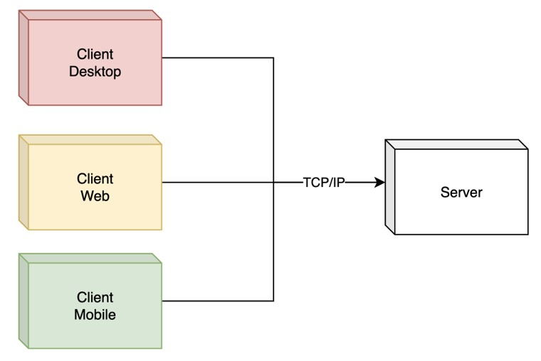

### Contoh

- Client-Server Architecture adalah arsitektur yang saat ini sangat banyak digunakan, bahkan mungkin secara tidak sadar, kita sudah menggunakan arsitektur ini
- Ketika kita membuat aplikasi Mobile lalu terkoneksi ke RESTful API, sebenarnya itu adalah Client-Server Architecture

### Pertimbangan

- Saat kita ingin membuat aplikasi, yang ingin memisahkan aplikasi Client, atau bahkah membuat banyak jenis aplikasi Client, maka arsitektur Client-Server sangat cocok digunakan
- Namun jika kita ingin membuat aplikasi yang standalone, tidak butuh menyimpan data di Server, maka kita tidak butuh membuat aplikasi Client-Server, contoh seperti aplikasi editor untuk Photo, Video dan sejenis nya

## #9 Master-Slave Architecture

- Master-Slave Architecture merupakan arsitektur dimana aplikasi bisa mendistribusikan semua pekerjaannya ke aplikasi lain
- Aplikasi yang memerintah semua aplikasi dinamakan Master, dan aplikasi yang menerima perintah dinamakan Slave
- Sama seperti Client-Server Architecture, biasanya komunikasi Master dan Slave menggunakan jaringan TCP/IP

### Diagram: Master-Slave Architecture

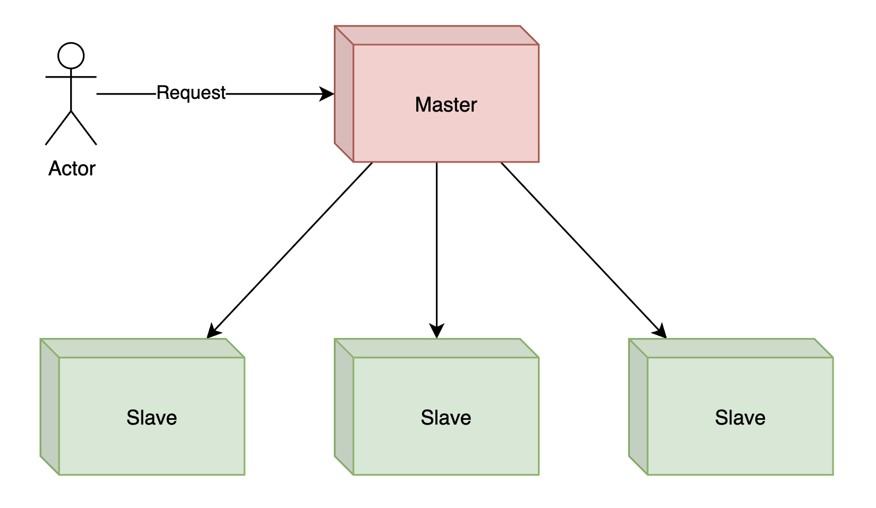

### Topology

- Biasanya, semua request ke aplikasi akan lewat aplikasi Master
- Semua pekerjaan yang diterima oleh Master, biasanya akan didistribusikan ke aplikasi Slave
- Dengan begitu, pekerjaan bisa lebih cepat karena bisa dikerjakan oleh banyak aplikasi Slave
- Pada diagram, kita hanya membuat 3 aplikasi Slave, namun kenyataanya, tidak ada batasan jumlah aplikasi Slave

### Fault Tolerance

- Salah satu keunggukan Master-Slave Architecture adalah, Fault Torelance, dimana ketika misal terjadi kesalahan yang menyebabkan salah satu aplikasi Slave mati, maka pekerjaan masih bisa dikerjaan oleh aplikasi Slave lain
- Begitu juga ketika terjadi masalah yang menyebabkan aplikasi Master mati, maka secara otomatis salah satu Slave akan dipromosikan menjadi Master baru

### Diagram: Fault Tolerance

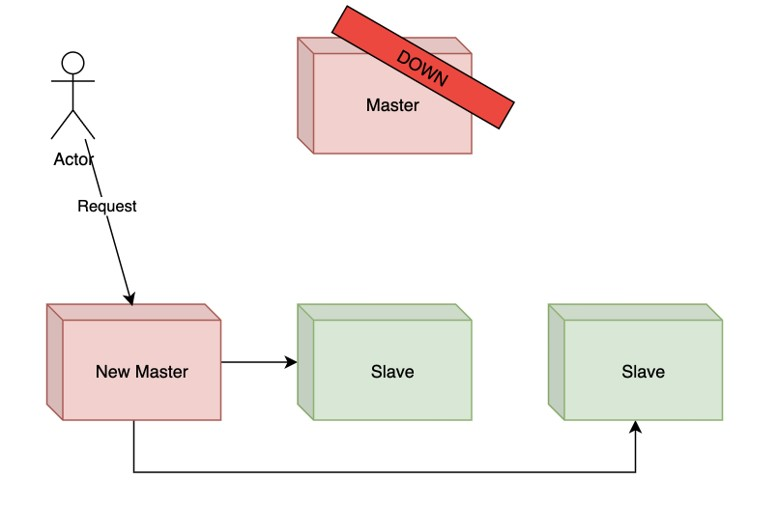

### Master-Master Architecture

- Salah satu kekurangan Master-Slave Architecture adalah, semua request harus melewati aplikasi Master, sehingga ketika terjadi kelambatan di aplikasi Master, secara otomatis semua pengguna akan merasakan dampaknya, padahal mungkin aplikasi Slave tidak lambat
- Pada kasus seperti itu, terdapat juga Master-Master Architecture, dimana ini adalah improvement dari Master-Slave Architecture
- Yang membedakan Master-Master Architecture adalah, semua aplikasi bisa berjalan sebagai Master, sehingga bisa menerima request dari pengguna secara mandiri
- Dan karena semua aplikasi adalah Master, tiap aplikasi bisa saja mengirim request ke aplikasi lain, ketika misal aplikasi sudah terlalu banyak menangani request dari pengguna

### Diagram: Master-Master Architecture

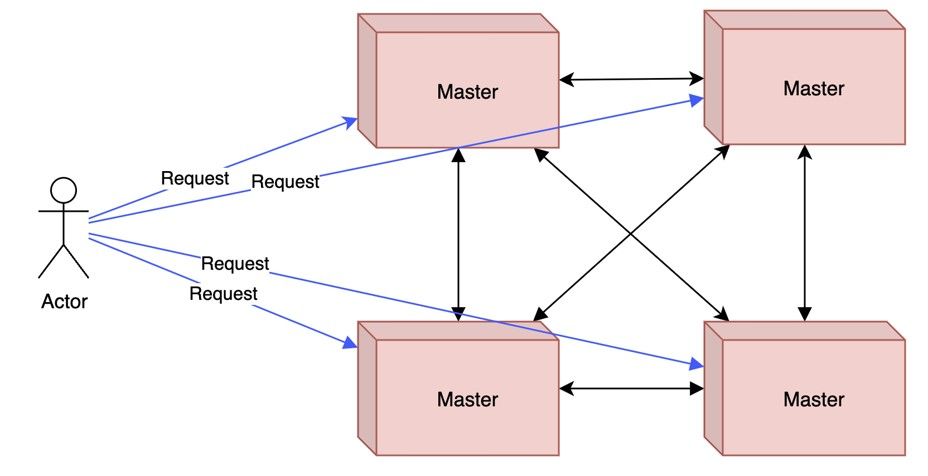

### Replication

- Yang perlu diingat dalam Master-Slave / Master-Master Architecture, biasanya data di aplikasi selalu di replikasi/duplikasi ke semua Slave / Master
- Hal ini agar data selalu sama, sehingga pekerjaan yang dikerjakan oleh semua aplikasi Slave/Master akan selalu konsisten

### Contoh

- Master-Slave / Master-Master Architecture jangan digunakan ketika membuat aplikasi sistem informasi, arsitektur ini rata-rata sering digunakan ketika kita membuat aplikasi statefull (menyimpan data) seperti sistem basis data
- Hampir kebanyakan aplikasi sistem basis data seperti MySQL, PostgreSQL, MongoDB mengimplementasikan arsitektur Master-Slave Architecture
- Atau seperti aplikasi sistem basis data Elasticsearch dan Cassandra, yang menggunakan Master-Master Architecture

### Pertimbangan

- Gunakan arsitektur Master-Slave / Master-Master ketika kita ingin membuat aplikasi yang statefull (menyimpan data)
- Jika kita membuat aplikasi yang stateless (tidak menyimpan data), maka disarankan tidak menggunakan arsitektur ini

## #10 Peer-to-Peer Architecture

- Peer-to-Peer Architecture merupakan arsitektur yang hampir mirip dengan Client-Server Architecture
- Hanya saja, dalam Peer-to-Peer, semua aplikasi bisa menjadi Client dan juga Server secara berbarengan
- Biasanya logika aplikasi akan terpusat di aplikasi Server, pada Peer-to-Peer, logika aplikasi tidak terpusat di satu aplikasi, semua aplikasi bisa menjadi Server sekaligus Client

### Diagram: Peer-to-Peer Architecture

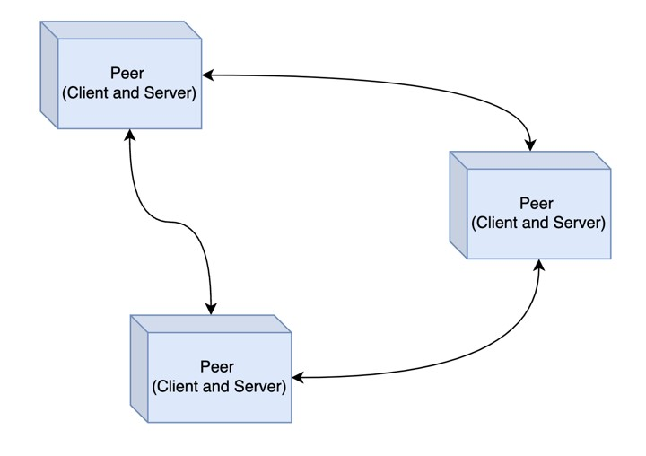

### Topology

- Dalam Peer-to-Peer Architecture seakan terlihat sederhana, namun sebenarnya arsitektur ini sangat kompleks
- Setiap Peer bisa menjadi Client yang melakukan request ke Peer lain, atau bahkan menjadi Server pada saat yang bersamaan dengan mengirim response ke Peer lain
- Oleh karena itu pembuatan aplikasi Peer-to-Peer Architecture sangat kompleks karena setiap Peer harus tahu ketika terdapat Peer baru, karena pada kenyataanya Peer baru bisa datang dan hilang kapan saja

### vs Master-Master Architecture

- Apa bedanya Peer-to-Peer Architecture dan Master-Master Architecture?
- Pada Peer-to-Peer, tiap Peer bisa menjadi Client ataupun Server
- Sedangkan pada Master-Master, tiap Master adalah Server, biasanya Client adalah aplikasi yang terpisah dan terkoneksi ke Master-Master dengan arsitektur Client-Server

### Contoh

- Peer-to-Peer banyak sekali digunakan untuk aplikasi berbagi file seperti Torrent misalnya, dimana setiap orang bisa berbagi file, sekaligus meminta file ke Peer lain di dalam jaringan Torrent nya
- Selain itu, Peer-to-Peer juga sering digunakan dalam Cryptocurrency dimana semua data terdistribusi di semua aplikasi Peer untuk menjaga data tetap aman karea untuk mengubah data, kita harus mengubah seluruh data di semua Peer, dan itu sangat sulit untuk dilakukan

### Pertimbangan

- Peer-to-Peer Architecture mungkin terlihat sangat menarik, namun ini adalah jenis arsitektur yang jarang sekali digunakan, kecuali pada jenis aplikasi yang membutuhkan logika yang tidak terpusat
- Peer-to-Peer Architecture juga merupakan arsitektur yang sangan scalable, karena sulit untuk terjadi kegagalan sistem karena semua logic terdistribusi di semua Peer
- Kekurangannya adalah, karena kita tidak bisa menjadi kualitas resource di tiap Peer, jadi besar kemungkinan kualitas dan kecepatan aplikasi tidak bisa dijaga dengan baik, terutama jika Peer berjalan di hardware dengan resource yang kurang

## #11 Microservices Architecture

- Microservices Architecture adalah jenis arsitektur yang saat sedang banyak sekali digunakan oleh banyak orang. Namun arsitektur ini bukanlah jenis arsitektur yang sederhana, ini adalah jenis arsitektur yang kompleks.
- Pada Microservices Architectures, system akan dibuat dalam jumlah aplikasi-aplikasi kecil atau disebut Service, dan digunakan untuk menyelesaikan tugas spesifik tertentu saja.
- Selain itu pada arsitektur ini, tiap Service akan di deploy dan dijalankan secara mandiri
- Pada arsitektur ini, tidak aneh jika sebuah system memiliki ratusan bahkan ribuan Service mandiri, hal ini karena tiap Service memang memiliki tugas masing-masing

### Diagram: Microservices Architecture

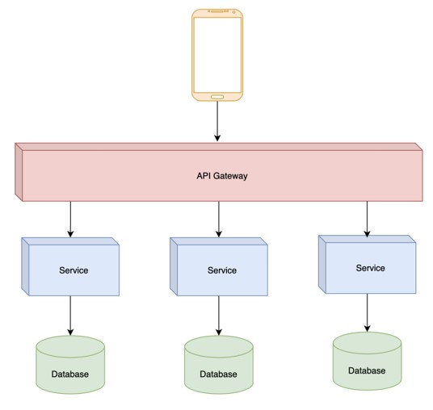

### Topology

- Biasanya dalam Microservices Architecture, setiap Service akan berjalan secara independent dan memiliki database masing-masing, tidak melakukan sharing database dengan Service lain
- Biasanya juga tiap Service tidak akan di expose secara terbuka ke pengguna, melainkan pengguna akan melewati API Gateway, yaitu aplikasi yang bertugas sebagai gerbang untuk menerima request dan meneruskan ke Service yang dituju
- Karena tiap Service memiliki tugas masing-masing, maka tidak jarang database yang digunakanpun bisa berbeda-beda, hal ini karena biasanya Service akan menggunakan database yang sesuai dengan tugas yang harus dikerjakan

### Bounded Context

- Seperti yang dijelaskan sebelumnya, bahwa tiap Service akan memiliki dan melakukan manajemen database nya sendiri
- Artinya database dan table tersebut hanya boleh diakses oleh Service tersebut
- Contoh misal ketika kita memiliki Service yang digunakan untuk melakukan management data Seller, maka Seller Service yang hanya boleh melakukan management data Seller tersebut
- Konsep ini, disebut dengan Bounded Context, yang dikenalkan oleh Eric Evans pada buku Domain-Driven Design

### Diagram: Bounded Context

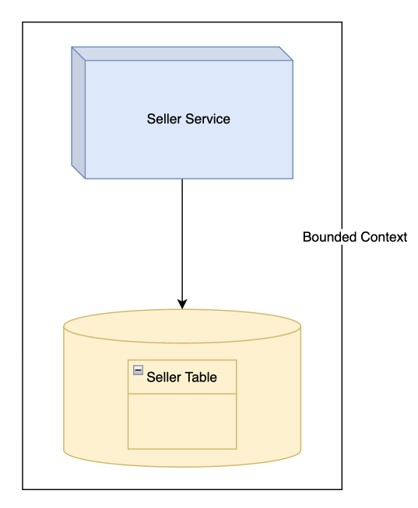

### Komunikasi Antar Service

- Dengan adanya Bounded Context, artinya tidak ada yang boleh mengakses database Seller secara langsung dari Service lain kecuali Seller Service
- Jika ada Service lain yang membutuhkan data Seller, maka Service lain tersebut harus meminta data Seller ke Seller Service, dengan cara komunikasi yang sudah ditentukan, misal RESTful API (Client-Server Architecture)

### Contoh

- Pada halaman web toko online, kita ingin menampilkan data detail Product
- Namun pada halaman data detail Product, selain informasi Product, kita juga ingin menampilkan data Seller yang menjual Product tersebut
- Pada kasus ini, kita bisa mengambil data Product ke Product Service, lalu Product Service meminta data Seller ke Seller Service

### Diagram: Contoh

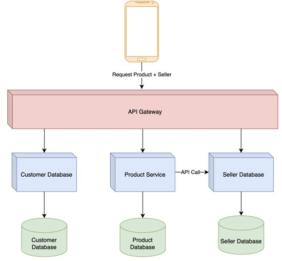

### Pendukung

- Untuk menggunakan Microservices Architecture biasanya tidak hanya melibatkan tim programmer
- Banyak sekali yang harus diubah seperti infrastructure dan tim product/bisnis
- Hal ini karena biasanya dalam Microservice Architecture, pembagian Service akan dilakukan berdasarkan domain bisnis, jadi tidak sederhana membuat aplikasi kecil
- Pada beberapa kasus, kesalahan pembuatan jenis Service bisa mempersulit tim pengembang, oleh karena itu diperlukan orang Domain Expert atau yang sudah ahli di bidangnya secara bisnis

### Pertimbangan

- Microservice Architecture biasanya digunakan di perusahaan yang sudah besar dengan tim pengembang yang banyak, hal ini dikarenakan arsitektur ini menuntut banyak sekali pekerjaan selain pekerjaan membuat aplikasi, seperti infrastruktur, automation, deployment dan lain-lain
- Jangan gunakan arsitektur ini jika tim masih kecil, kita bisa mulai dengan Monolith Architecture dan Layered Architecture, jika sudah waktunya membutuhkan scaling tim secara cepat, kita baru bisa mempertimbangkan penggunaan Microservices Architecture

## #12 Event-Driven Architecture

### Masalah Microservices Architecture

- Dengan meningkatnya penggunaan Microservices Architecture, akhirnya terdapat salah satu masalah yang sering dialami pengguna arsitektur tersebut, yaitu ketergantungan antar Service
- Contoh pada kasus sebelumnya misalnya, ketika Seller Service bermasalah, misal mati, maka kita tidak bisa melihat data Product, hal ini karena Product Service butuh memanggil Seller Service ketika ingin menampilkan data Product

### Diagram: Masalah Microservices Architecture

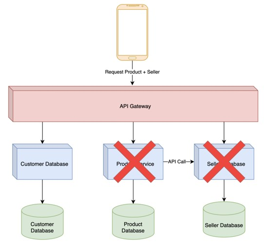

### Event-Driven Architecture

- Event-Driven Architecture merupakan arsitektur yang menggunakan Async Proses untuk saling berkomunikasi antar Service
- Biasanya, pada arsitektur ini, Service akan mengirim setiap perubahan data yang terjadi pada Service tersebut ke aplikasi bernama Message Broker dalam bentuk data Event
- Pengirim data Event kita sebut dengan nama Producer/Publisher
- Service yang membutuhkan data Event nya akan mengambil data tersebut pada Message Broker
- Penerima data Event kita sebut dengan nama Consumer/Listener

### Diagram: Event-Driven Architecture

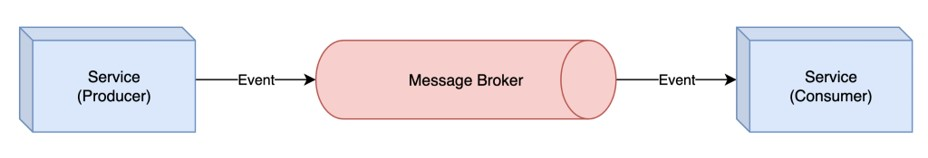

### Duplicate Data

- Seperti yang sudah kita tahu, dalam Microservices Architecture terdapat aturan Bounded Context, dimana data hanya bisa diakses oleh Service itu sendiri
- Pada kasus Event-Driven Architecture, karena kita tidak akan memanggil secara Sync ke Service Lain (seperti menggunakan API Call), maka biasanya Service akan meng-consume event data dan men-duplicate data yang dibutuhkan di database Service itu
- Pada kasus sebelumnya, contohnya Product Service akan meng-consume data Seller Event, lalu menyimpan data Seller ke database Product sebagai data duplicate

### Diagram: Duplicate

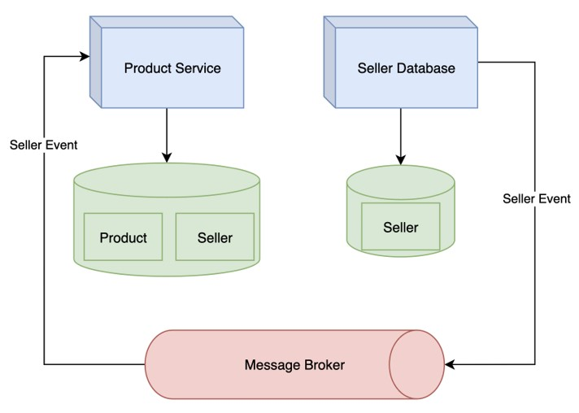

### Pertimbangan

- Event-Driven Architecture saat ini banyak yang menggunakan, karena permasalahan yang terjadi di Microservices Architecture, namun perlu diperhatikan, ada juga akibat yang terjadi ketika kita menggunakan Async Process
- Pada kasus sebelumnya, kita harus memastikan data Seller Event diterima dengan baik oleh Product Service, jika gagal secara otomatis data Seller tidak akan ada di database Product
- Async Process juga akan menyebabkan proses menjadi delay, oleh karena itu kadang pengguna tidak menerima hasil secara realtime, karena Async Process belum selesai
- Ketika terjadi masalah pada Async Process, melakukan pencarian masalah lebih sulit dibanding Sync Process pada arsitektur Microservices

## #13 Pipelne Architecture

- Pipeline Architecture adalah arsitektur yang erat kaitannya dengan Data Stream (aliran data)
- Pada beberapa kasus, kadang kita menemui sumber data yang masuk tanpa henti, misal data log aktivitas pengguna misalnya
- Pada kasus seperti ini, menyimpan data di database akan sangat menyulitkan untuk memprosesnya, karena data masuk biasanya dalam jumlah banyak dan terus menerus
- Pipeline Architecture adalah arsitektur dimana kita memanfaatkan Message Queue seperti Message Broker sebagai tempat aliran data, dan kita bisa fokus membuat Filter untuk memproses data tersebut

### Diagram Pipeline Architecture

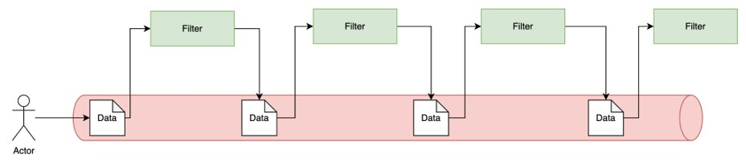

### Topology

- Dalam Pipeline Architecture, fokus utama adalah proses Filter terhadap message
- Tidak ada aturan proses Filter apakah harus didalam aplikasi yang sama atau berbeda, jadi tidak ada benar atau salah
- Filter biasanya adalah proses yang dilakukan dari mulai menerima input data, memproses data, dan berakhir dengan menghasilkan output data

### Cloud Function

- Pipeline Architecture ini sekarang sangat populer di Cloud Provider seperti Google Cloud atau Amazon Web Service
- Cloud Provider tersebut sekarang memiliki fitur untuk Cloud Function, dimana bisa digunakan sebagai Filter dalam Pipeline Architecture
- Salah satu keuntungan menggunakan Cloud Function, kita hanya perlu bayar ketika Filter melakukan pemrosesan data
- <https://cloud.google.com/functions/docs/calling/pubsub>
- <https://docs.aws.amazon.com/lambda/latest/dg/with-sqs.html>

### Diagram: Cloud Function

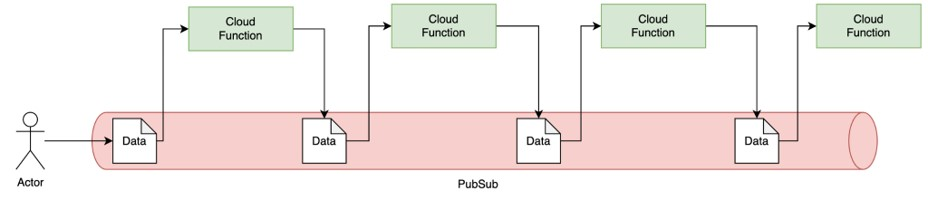

### Data Pipeline

- Pipeline Architecture juga sering digunakan dalam melakukan pengolahan data, atau sering dikenal dengan nama Data Pipeline
- Dalam Data Pipeline, biasanya terdapat Source (sumber data), Destination (tujuan akhir data), dan juga Processing (pengolahan data)

### Diagram: Data Pipeline

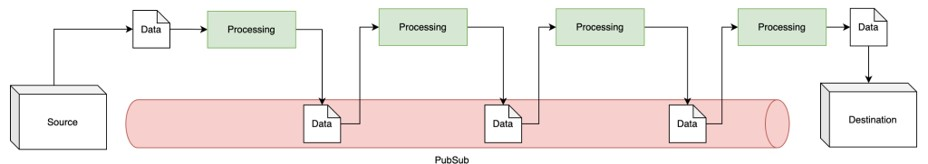

### Contoh

- Kita ingin membuat laporan jumlah pengunjung harian website kita, dimana pada laporan tersebut, kita bisa melihat jumlah pengunjung berdasarkan negara pengunjung
- Pada kasus ini, kita bisa menggunakan Pipeline Architecture
- Dimulai dari setiap data kunjungan ke website kita, kita akan kirim sebagai event ke Message Broker, lalu kita akan buat filter, dari filter untuk mendeteksi ipaddress, filter untuk mendapatkan negara berdasarkan ip, dan filter untuk melakukan grouping berdasarkan negara

### Diagram: Contoh

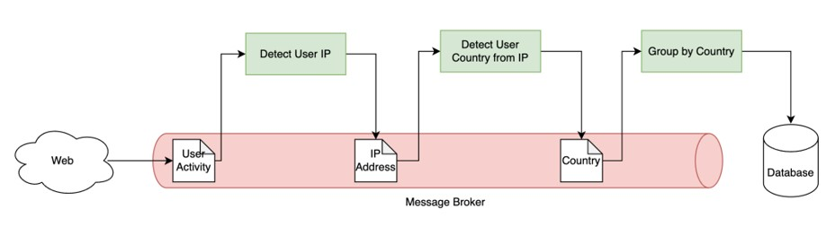

### Pertimbangan

- Pipeline Architecture merupakan arsitektur yang sangat cocok ketika kita ingin melakukan pemrosesan yang sangat panjang dan bertahap
- Pipeline Architecture bisa sangat lama melakukan pemrosesan, tergantung seberapa panjang Filter yang ada, oleh karena itu tidak cocok untuk melakukan pekerjaan yang butuh waktu realtime

## #14 Space-Based Architecture

### Triangle-Shaped

- Pada kasus tertentu, ada jenis aplikasi yang biasanya memiliki traffic pengunjung yang tidak terduga, misal seperti website flashsale, penjualan tiket atau bidding
- Arsitektur-arsitektur yang sebelumnya kita bahas, sebenarnya bisa kita gunakan untuk membuat jenis aplikasi tersebut, namun pada kasus tertentu, kadang akhirnya kita mendapatkan permasalahan triangle-shaped

### Diagram: Triangle-Shaped

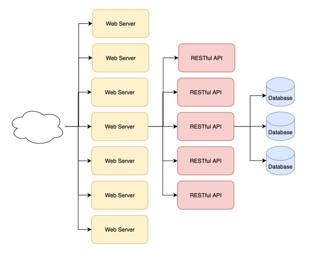

### Triangle-Shaped Topology

- Triangle-Shaped Topology adalah kondisi dimana kita melakukan scalability dengan cara menambah jumlah aplikasi ketika terjadi kelambatan di system kita
- Pada kasus ketika kita membuat web, untuk menambah jumlah web server biasanya sangat mudah, karena hanya menyediakan website user interface, selanjutnya biasanya kelambatan akan berpindah ke server Backend misal di RESTful API
- Selanjutnya biasanya kita akan menambah jumlah server RESTful API, namun tidak akan sebanyak Web Server, karena biasanya aplikasinya lebih berat dan membutuhkan resource lebih besar, selanjutnya kelambatan akan berpindah ke Database
- Pada kasus seperti ini, menambah server di database bukanlah hal yang mudah, tidak seflexible Web Server dan RESTful API, karena database adalah aplikasi statefull (menyimpan data)

### Space-Based Architecture

- Space-Based Architecture merupakan arsitektur yang di desain khusus untuk kasus seperti ini, dimana kita butuh scalability dan performa yang baik untuk aplikasi
- Space-Based Architecture menyelesaikan masalah ini, dengan cara menghapus database dari proses transaksi aplikasi, dan diganti dengan shared-memory (Data Grid)
- High Scalability dicapai dengan cara semua aplikasi terkoneksi ke shared-memory (Data Grid) secara synchronous, dan secara asynchronous data di shared-memory akan di sync ke database

### Diagram: Space-Based Architecture

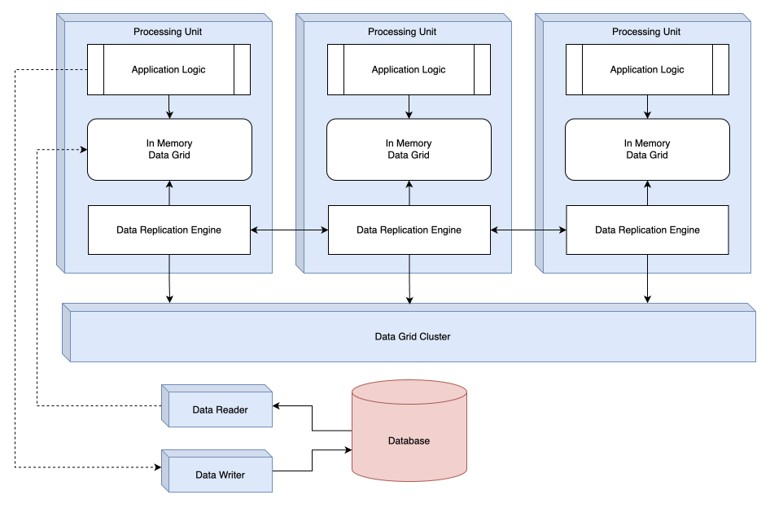

### Topology

- Dalam Spaced-Based Architecture, aplikasi yang kita buat disebut dengan Processing Unit
- Dalam Processing Unit, terdapat logic aplikasi kita dan juga berisi In Memory Data Grid yang digunakan sebagai pengganti Database
- Biasanya terdapat Data Replication Engine yang digunakan untuk melakukan sinkronisasi seluruh data di In Memory Data Grid untuk semua Processing Unit dengan dibantu oleh Data Grid Cluster
- Jika kita mau, kita bisa secara async menyimpan perubahan yang terjadi di In Memory Data Grid ke Database

### Contoh Data Grid

- Biasanya Data Grid tidak perlu dibuat secara manual oleh pengembang aplikasi, sama seperti Database, kita bisa menggunakan aplikasi Data Grid yang sudah tersedia, contohnya
- Hazelcast <https://hazelcast.com/>
- Apache Ignite <https://ignite.apache.org/>
- Oracle Coherence <https://www.oracle.com/java/coherence/>
- Dan lain-lain

### Pertimbangan

- Spaced-Based Architecture merupakan solusi yang sangat kompleks untuk mencapai scalability yang sangat baik
- Namun walaupun solusi ini sangat baik, tapi kadang solusi ini bukan yang terbaik, kita harus melihat banyak pertimbangan ketika menggunakan arsitektur ini
- Contoh jika data kita terlalu besar, maka akan sulit menggunakan arsitektur ini, karena seluruh data harus dipindahkan ke memory, yang pasti butuh biaya yang sangat besar
- Karena kompleksitas dan mahalnya solusi ini, kita juga harus mempertimbangkan biaya yang harus dikeluarkan untuk menggunakan arsitektur ini

## #15 Penutup

### Software Architecture Patterns Lainnya

- Kelas ini tidak membahas semua Software Architecture Patterns yang ada, hanya membahas yang sering digunakan
- Teknologi khususnya pada Software Design selalu berkembang dari waktu ke waktu, awal tahun 2000 belum banyak yang menggunakan Microservices, namun sekarang hampir semua perusahaan besar menggunakannya
- Masih banyak juga patterns yang belum dibahas, dan bisa dipelajari secara mandiri, seperti :
- Onion Architecture, Screaming Architecture, Event-Bus Architecture, dan masih banyak yang lainnya

### Penutup

- Software Architecture Patterns bukanlah solusi yang saklek dimana kita harus memilih salah satunya
- Kita bisa melakukan kombinasi beberapa Patterns yang memang sesuai dengan kebutuhan kita
- Misal kita bisa kombinasikan Microservices dan Event-Driven, atau Monolith dengan Layered, Microservices dengan Layered, dan lain-lain
