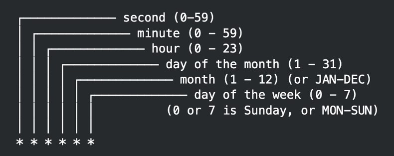

# Spring Async

## Sebelum Belajar

- Kelas Java dari Programmer Zaman Now
- Spring Dasar
- Spring AOP

## #1 Pengenalan Spring Async

- Di Java, kita biasanya menggunakan Thread atau Executor Service ketika membutuhkan proses yang harus berjalan secara asynchronous
- Spring memiliki fitur bernama Spring Async, yang bisa kita gunakan untuk mempermudah kita menggunakan Thread di Java
- Kita hanya perlu menggunakan annotation untuk membuat kode program asynchronous yang berjalan di Thread, atau schedule yang harus berjalan pada waktu tertentu

## #2 Membuat Project

- <https://start.spring.io/>

## #3 Enable Async

- Saat kita menggunakan Spring Boot, untuk menggunakan fitur Spring Async, kita bisa menggunakan annotation `@EnableAsync` pada Spring Boot Application kita
- Secara otomatis, Spring Boot akan mengaktifkan fitur Spring Async
- <https://docs.spring.io/spring-framework/docs/current/javadoc-api/org/springframework/scheduling/annotation/EnableAsync.html>

### Kode: Enable Async

```java
@EnableAsync
@SpringBootApplication
public class BelajarSpringAsyncApplication {

	public static void main(String[] args) {
		SpringApplication.run(BelajarSpringAsyncApplication.class, args);
	}
}
```

## #4 Async

- Biasanya, ketika kita ingin menjalankan sebuah kode program secara asynchronous, kita perlu menjalankan menggunakan `Thread` atau `Executor Service`
- Di Spring, kita bisa tambahkan sebuah method dengan annotation `@Async`, untuk menandai bahwa method tersebut harus dijalankan secara asynchronous
- Secara default, Spring akan menggunakan `Thread Pool` untuk menjalankan method `@Async` tersebut
- <https://docs.spring.io/spring-framework/docs/current/javadoc-api/org/springframework/scheduling/annotation/Async.html>

### Kode: Hello Async

```java
@Slf4j
@Component
public class HelloAsync {

	@Async
	@SneakyThrows
	public void hello() {
		Thread.sleep(Duration.ofSeconds(2));
		log.info("run hello after 2 seconds");
	}
}
```

### Kode: Hello Async Test

```java
@Slf4j
@SpringBootTest
class HelloAsyncTest {

	@Autowired
	private HelloAsync helloAsync;

	@Test
	void helloAsync() throws InterruptedException {
		for (int i = 0 ; i < 10; i++) {
			helloAsync.hello();
		}
		log.info("after call hello async");
		Thread.sleep(Duration.ofSeconds(3));
	}
}
```

## #5 Default Thread Pool

- Secara default, Spring Boot akan membuatkan Thread Pool yang digunakan secara otomatis untuk menjalankan `@Async` method
- Kita bisa mengubah konfigurasi Thread Pool melalui properties file dengan prefix `spring.task.execution`
- <https://docs.spring.io/spring-boot/docs/current/reference/html/application-properties.html#application-properties.core.spring.task.execution.pool.allow-core-thread-timeout>

### Kode: Thread Pool Properties

```
spring.task.execution.pool.core-size=2
spring.task.execution.pool.max-size=2
spring.task.execution.pool.queue-capacity=100
```

## #6 Custom Executor

- Walaupun secara default, Spring Boot akan membuatkan `Thread Pool Executor`, namun jika kita ingin membuat custom Executor, kita hanya cukup membuat bean dengan type `Executor`, dan nama bean `taskExecutor`
- Secara otomatis, jika terdapat bean dengan type Executor, maka secara otomatis Spring Boot tidak akan membuatkan Thread Pool Executor lagi

### Kode: Custom Executor

```java
@Configuration
public class AsyncConfiguration {

	@Bean
	public Executor taskExecutor() {
		return Executors.newVirtualThreadPerTaskExecutor();
	}
}
```

### Kode: Async Hello

```java
@Slf4j
@Component
public class HelloAsync {

	@Async
	@SneakyThrows
	public void hello() {
		Thread.sleep(Duration.ofSeconds(2));
		log.info("run hello after 2 seconds : {}", Thread.currentThread());
	}
}
```

## #7 Future

- Sebelumnya di kelas Java Thread, kita sudah belajar tentang `Future` dan `Callable`, dimana proses async yang mengembalikan value
- Untuk kasus seperti ini, kita juga bisa mengubah return value dari method nya menjadi Future

### Kode: Hello Future

```java
@Slf4j
@Component
public class HelloAsync {

	@Async
	@SneakyThrows
	public Future<String> void hello(final String name) {
		CompletableFuture<String> future = new CompletableFuture<>();
		Thread.sleep(Duration.ofSeconds(2));
		log.info("hello " + name + " from Thread " + Thread.currentThread());
		return future;
	}
}
```

### Kode: Test Hello Future

```java
@Test
void helloName() throws ExecutionException, InterruptedException {
	Future<String> future = helloAsync.hello("Eko");
	String response = future.get();
	log.info(response);
}
```

## #8 Dynamic Executor

- Saat kita menggunakan Executor Service, kadang kita ingin menggunakan beberapa jenis Executor Service untuk tugas yang berbeda-beda
- Bagaimana dengan Spring Async?
- Untungnya Spring Async mendukung pemilihan Executor ketika menggunakan `@Async`
- Kita bisa sebutkan nama bean Executor nya, secara otomatis akan dijalankan di Executor bean yang kita pilih

### Kode: Menambah Executor

```java
@Configuration
public class AsyncConfiguration {

	@Bean
	public Executor taskExecutor() {
		return Executors.newVirtualThreadPerTaskExecutor();
	}

	@Bean
	public Executor singleTaskExecutor() {
		return Executors.newSingleThreadExecutor();
	}
}
```

### Kode: Dynamic Executor

```java
@Async("singleTaskExecutor")
@SneakyThrows
public Future<String> void hello(final String name) {
	CompletableFuture<String> future = new CompletableFuture<>();
	Thread.sleep(Duration.ofSeconds(2));
	log.info("hello " + name + " from Thread " + Thread.currentThread());
	return future;
}

@Async("taskExecutor")
@SneakyThrows
public void hello() {
	Thread.sleep(Duration.ofSeconds(2));
	log.info("run hello after 2 seconds : {}", Thread.currentThread());
}
```

## #9 Scheduling

- Selain Async, di Java Thread, kita pernah belajar tentang Timer, dimana kita bisa membuat proses yang bisa berjalan sendiri pada schedule waktu tertentu
- Spring juga mendukung hal ini, caranya kita bisa mengaktifkan fitur ini dengan menambahkan annotation `@EnableScheduling`
- <https://docs.spring.io/spring-framework/docs/current/javadoc-api/org/springframework/scheduling/annotation/EnableScheduling.html>

### Kode: Enable Scheduling

```java
@EnableAsync
@EnableScheduling
@SpringBootApplication
public class BelajarSpringAsyncApplication {

	public static void main(String[] args) {
		SpringApplication.run(BelajarSpringAsyncApplication.class, args);
	}
}
```

## #10 Scheduled

- Sama seperti Async, untuk membuat Schedule, kita bisa menggunakan annotation `@Scheduled` pada method yang ingin dijalankan
- Secara otomatis, method tersebut akan berjalan sesuai waktu yang kita tentukan
- <https://docs.spring.io/spring-framework/docs/current/javadoc-api/org/springframework/scheduling/annotation/Scheduled.html>

### Kode: Scheduled

```java
@Slf4j
@Component
public class Job {

	private AtomicLong atomicLong = new AtomicLong(0);

	@Scheduled(timeUnit = TimeUnit.SECONDS, initialDelay = 2, fixedDelay = 2)
	public void runJob() {
		Long value = atomicLong.incrementAndGet();
		log.info("{} Run job {}", value, Thread.currentThread().getName());
	}

	public Long getValue() {
		return atomicLong.get();
	}
}
```

### Kode: Scheduled Test

```java
@SpringBootTest
class JobTest {

	@Autowired
	private JOb job;

	@Test
	void job() throws InterruptedException {
		Thread.sleep(Duration.ofSeconds(5));
		assertEquals(2L, job.getValue());
	}
}
```

## #11 Default Thread Pool Scheduler

- Secara default, Scheduler juga memiliki Thread Pool, dan itu berbeda dengan Async
- Kita bisa mengubah konfigurasi Thread Pool dengan prefix `spring.task.scheduling`
- <https://docs.spring.io/spring-boot/docs/current/reference/html/application-properties.html#application-properties.core.spring.task.scheduling.pool.size>

### Kode: Default Thread Pool Scheduler

```
spring.task.execution.pool.core-size=2
spring.task.execution.pool.max-size=2
spring.task.execution.pool.queue-capacity=100

spring.task.scheduling.pool.size=10
spring.task.scheduling.thread-name-prefix=my-schedule-
```

## #12 Custom Scheduled Executor

- Sama seperti Async, kita juga bisa membuat Scheduled Executor sendiri, caranya cukup membuat bean dengan type `ScheduledExecutorService`, dan dengan nama bean `taskScheduler`
- <https://docs.oracle.com/en/java/javase/21/docs/api/java.base/java/util/concurrent/ScheduledExecutorService.html>

### Kode: Custom Scheduled Executor

```java
@Configuration
public class AsyncConfiguration {

	@Bean
	public ScheduledExecutorService taskScheduler() {
		return Executors.newScheduledThreadPool(10);
	}

	@Bean Executor taskExecutor() { return Executors.newVirtualThreadPerTaskExecutor(); }
}
```

## #13 Cron Job

- Salah satu fitur menarik di Scheduled adalah, kita bisa menggunakan Cron Expression untuk membuat jadwal schedule nya
- Kita bisa gunakan attribute cron di `@Scheduled`
- <https://docs.spring.io/spring-framework/docs/current/javadoc-api/org/springframework/scheduling/annotation/Scheduled.html>

### Aturan Cron Expression



### Kode: Cron JOb

```java
@Slf4j
@Component
public class Job {

	private AtomicLong atomicLong = new AtomicLong(0);

	@Scheduled(cron = "* * * * * *")
	public void cron() {
		log.info("run cron job every second");
	}
}
```

## #14 Penutup
