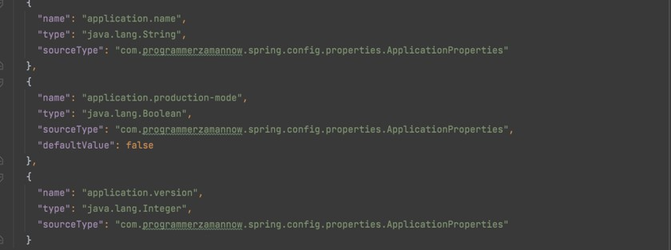
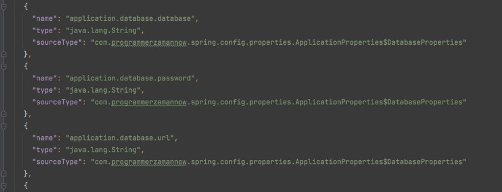
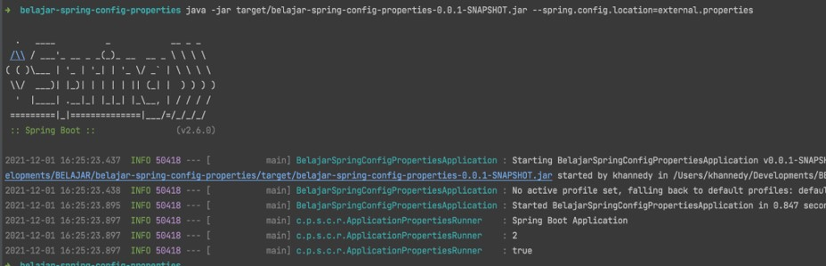
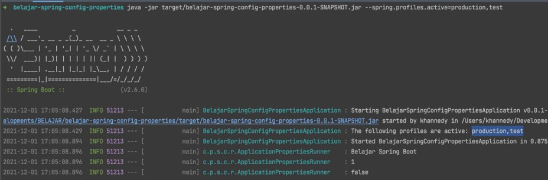
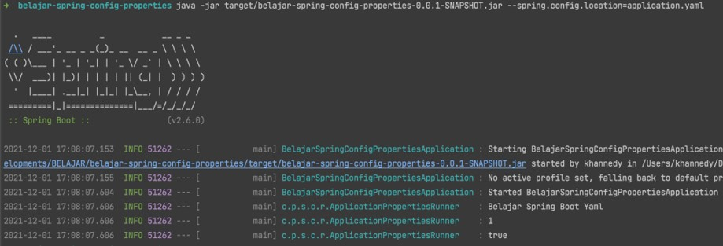

# Spring Config Properties

## Sebelum Belajar

- Spring Dasar

## Agenda

- Pengenalan Config Properties
- Resource
- Resource Loader
- Message Source
- Application Properties
- Configuration Properties
- Property Source
- Profile
- Dan lain-lain

## #1 Pengenalan Config Properties

- Saat kita membuat aplikasi, sudah dipastikan bahwa kita pasti akan menambahkan konfigurasi pada aplikasi
- Misal saja konfigurasi database misalnya
- Spring sendiri memiliki fitur yang sangat baik dalam mendukung pengaturan konfigurasi aplikasi
- Pada kelas ini, kita akan bahas bagaimana cara melakukan konfigurasi pada aplikasi Spring yang kita buat

## #2 Membuat Project

- <https://start.spring.io/>

## #3 Resource

- Sebelum kita belajar tentang Config Properties di Spring, kita perlu belajar dulu tentang Resource di Spring
- Di Java terdapat fitur bernama Java IO (Input Output) sebagai management resource
- Spring membungkus resource dalam sebuah interface bernama Resource
- <https://docs.spring.io/spring-framework/docs/current/javadoc-api/org/springframework/core/io/Resource.html>
- Walaupun Resource adalah sebuah interface, untuk membuatnya kita tidak perlu mengimplementasikan secara manual, sudah banyak implementasi class Resource di Spring

### Resource Implementation


### Kode: Resource

```java
var resource new ClassPathResource("/application.properties");

Assertions.assertNotNull(resource);

System.out.println(resource.getPath());
System.out.println(resource.getFilename());
System.out.println(resource.getFile().getAbsolutePath());
```

## #4 Resource Loader

- Spring memiliki fitur yang bisa kita gunakan untuk mengambil data resource secara otomatis, tanpa kita harus membuat object resource nya, namanya `ResourceLoader`
- <https://docs.spring.io/spring-framework/docs/current/javadoc-api/org/springframework/core/io/ResourceLoader.html>
- ResourceLoader memiliki method bernama `getResource(String)` yang bisa kita gunakan untuk mengambil sebuah resource
- ResourceLoader akan mendeteksi jenis Resource yang butuh diambil dari data String nya

### Resource Protocol

| Prefix      | Sample                                               | Description                                     |
| ----------- | ---------------------------------------------------- | ----------------------------------------------- |
| `classpath` | `classpath:/com/pzn/application.properties`          | Mengambil resource dari classpath (isi project) |
| `file`      | `file://Users/khannedy/file.properties`              | Mengambil resource dari file system             |
| `https`     | `https://www.programmerzamannow.com/file.properties` | Mengambil resource dari http                    |

### Resource Loader Aware

- `ResourceLoader` adalah sebuah interface, sehingga untuk menggunakannya, kita perlu implementasi class nya
- `ApplicationContext` adalah turunan dari ResourceLoader, sehingga kita juga bisa menggunakan ApplicationContext untuk mendapatkan Resource
- Atau kita juga bisa menggunakan `ResourceLoaderAware` untuk mendapatkan ResourceLoader secara otomatis
- <https://docs.spring.io/spring-framework/docs/current/javadoc-api/org/springframework/context/ResourceLoaderAware.html>

### Kode: Resouece Loader Aware

```java
@SpringBootApplication
public static class TestApplication {

	@Component
	public static class SampleResource implements ResourceLoaderAware {

		@Setter
		private ResourceLoader resourceLoader;

		public String getProperties() throws IOException {
			Resource resource = resourceLoader.getResource("classpath:/resource.txt");
			try (var inputStream = resource.getInputStream()) {
				return new String(inputStream.readAllBytes());
			}
		}
	}
}
```

### Kode: Test Resource Loader

```java
@SpringBootTest(classe = resourceLoaderTest.Test.class)
public class ResourceLoaderTest {

	@Autowired
	private TestApplication.SampleResource sampleResource;

	@Test
	void testResource() throws IOException {
		Assertions.assertEquals("EKO", sampleResource.getProperties().trim());
	}
}
```

## #5 Message Source

### Properties

- Pada Kelas Java, kita sudah belajar tentang Properties dan juga cara melakukan Internationalization menggunakan Properties
- Di Spring, kita juga melakukan hal yang sama, dengan cara yang lebih baik, tidak perlu melakukannya secara manual

### Message Source

- Spring memiliki fitur yang bernama Message Source, yaitu fitur untuk mengambil message dari resource
- <https://docs.spring.io/spring-framework/docs/current/javadoc-api/org/springframework/context/MessageSource.html>
- `MessageSource` mengkombinasikan `Properties` dan `MessageFormat`, sehingga kita tidak perlu melakukannya secara manual seperti yang pernah kita praktekan di kelas Java `Internationalization`

### Message Source Implementation

- MessageSource adalah sebuah interface, untuk menggunakannya, kita butuh implementasi class nya
- Kita tidak butuh membuatnya secara manual, kita bisa menggunakan class implementasi yang sudah disediakan oleh Spring, yaitu `ResourceBundleMessageSource`
- <https://docs.spring.io/spring-framework/docs/current/javadoc-api/org/springframework/context/support/ResourceBundleMessageSource.html>

### Kode: Properties

```
hello=Hello {0}
```

### Kode: Message Source

```java
@Configuration
public static class TestConfiguration {

	@Bean
	public MessageSource messageSource() {
		ResourceBundleMessageSource messageSource = new ResourceBundleMessageSource();
		messageSource.setBasenames("my");
		return messageSource;
	}
}
```

### Kode: Test Message source

```java
@Test
void testMessageSource() {
	ApplicationContext context = new AnnotationConfigApplicationContext(TestConfiguration.class);
	messageSource messageSource = context.getBean(MessageSource.class);

	String hello = messageSource.getMessage("hello", new Object[]{"Eko"}, Locale.getDefault());
	Assertions.assertEquals("Hello Eko", hello);
}
```

## #6 Spring Boot Message Source

- Jika kita menggunakan Spring Boot, secara otomatis Spring Boot telah membuat Message Source secara otomatis, kita tidak perlu membuat bean untuk Message Source secara manual
- Selain itu secara default, Spring Boot akan membuat Message Source dengan mengambil data resource bundle di `messages.properties`

### Message Source Aware

- Jika kita ingin menggunakan MessageSource, kita juga bisa menggunakan `MessageSourceAware`
- <https://docs.spring.io/spring-framework/docs/current/javadoc-api/org/springframework/context/MessageSourceAware.html>
- Atau sebenarnya, `ApplicationContext` adalah turunan dari `MessageSource`

### Kode: Properties

```
hello=Hello {0}
```

### Kode: Message Source Aware

```java
@SpringBootApplication
public static class TestApplication {

	@Component
	public static class SampleResource implements MessageSourceAware {

		@Setter
		private MessageSource messageSource;

		public String helloEko() {
			return messageSource.getMessage("hello", new Object[]{"Eko"}, Locale.getDefault());
		}
	}
}
```

### Kode: Test Message Source

```java
@SpringBootTest(classes = MessageSourceTest.TestApplication.class)
public class MessageSourceTest {

	@Autowired
	private TestApplication.sampleSource sampleSource;

	@Test
	void testMessageSource() {
		Assertions.assertEquals("Hello Eko", sampleSource.helloEko());
	}
}
```

## #7 Application Properties

- Saat kita membuat project Spring menggunakan `start.spring.io`, secara otomatis terdapat sebuah file `application.properties`
- File ini adalah pusat dari file properties untuk konfigurasi aplikasi Spring yang kita buat
- Secara otomatis, Spring Boot akan membaca konfigurasi yang kita masukkan ke dalam file `application.properties`
- Ini bukanlah file untuk Internationalization, melainkan file ini digunakan untuk konfigurasi aplikasi, jika kita butuh pesan untuk Internationalization, gunakan file `messages.properties` seperti yang sudah kita bahas sebelumnya

### Mengakses Application Properties

- Ada banyak cara untuk mengakses konfigurasi yang terdapat di `application.properties`, nanti akan dibahas di chapter masing-masing

### Kode: Application Properties

```
application.name=Belajar Spring Boot
```

### Kode: Mengakses Application Properties

```java
@SpringBootTest(classes = ApplicationPropertiesTest.TestApplication.class)
public class ApplicationPropertiesTest {

	@Autowired
	private Environment environment;

	@Test
	void TestApplicationProperties() {
		String message = environment.getProperty("application.name");
		Assertions.assertEquals("Belajar Spring Boot", message);
	}
}
```

## #8 Environment

- Environment tidak hanya bisa digunakan untuk mengakses Application Properties
- Environment juga bisa digunakan untuk mengakses data environment variable pada sistem operasi
- <https://docs.spring.io/spring-framework/docs/current/javadoc-api/org/springframework/core/env/Environment.html >
- Kita bisa menggunakan `EnvironmentAware` jika ingin mendapatkan object Environment

### Kode: Environment

```java
@SpringBootTest(classes = ApplicationPropertiesTest.TestApplication.class)
public class ApplicationPropertiesTest {

	@Autowired
	private Environment environment;

	@Test
	void testEnvironment() {
		String java_home = environment.getProperty("JAVA_HOME");
		System.out.println(java_home);
	}
}
```

## #9 Value

- Value merupakan Annotation yang bisa kita gunakan untuk melakukan inject data dari properties ke field yang kita tandai
- <https://docs.spring.io/spring-framework/docs/current/javadoc-api/org/springframework/beans/factory/annotation/Value.html>

### Value Application Properties

- Annotation Value bisa kita gunakan untuk mengambil data dari application properties
- Kita bisa menggunakan kode `${nama.properties.nya}`
- Secara otomatis akan diambil valuenya, dan secara otomatis akan melakukan konversi juga

### Kode: Application Properties

```
// application.properties
application.name=Belajar Spring Boot
application.version=1
application.production-mode=false
```

### Kode: Value Injection

```java
@SpringBootApplication
public static class TestApplication {

	@Component
	@Setter
	public static class ApplicationProperties {

		@Value("${application.name}")
		private String name;

		@Value("${application.version}")
		private Integer version;

		@Value("${application.production-mode}")
		private boolean productionMode;
	}
}
```

### Kode: Unit Test Value Properties

```java
@SpringBootTest(classes = ValuePropertiesTest.TestApplication.class)
public class ValuePropertiesTest {

	@Autowired
	private TestApplication.ApplicationProperties properties;

	@Test
	void testApplicationProperties() {
		Assertions.assertEquals("Belajar Spring Boot", properties.getName());
		Assertions.assertEquals(1, properties.getVersion());
		Assertions.assertFalse(properties.getProductionMode());
	}
}
```

### Value System Variable

- Selain application properties, Annotation Value juga bisa digunakan untuk mengambil data dari system properties atau environment variable
- Caranya sama seperti mengambil application properties
- Secara otomatis akan diambil valuenya, dan secara otomatis akan melakukan konversi juga

### Kode: Value System Variable

```java
@SpringBootApplication
public static class TestApplication {

	@Component
	@Setter
	public static class SystemProperties {

		@Value("${JAVA_HOME}")
		private String javaHome;
	}
}
```

### Kode: Unit Test Value System Variable

```java
@SpringBootTest
public class TestSystemVariable {

	@Autowired
	private TestApplication.SystemProperties systemProperties;

	@Test
	void testSystemProperties() {
		Assertions.assertEquals(
			"/Users/khannedy/Tools/jdk-17.0.1.jdk/Constants/Home",
			systemProperties.getJavaHome()
		);
	}
}
```

## #10 Property Source

- Secara default, application properties hanya akan mengambil dari file di `application.properties` yang terdapat di classpath project
- Namun, Spring memiliki fitur yang bisa kita gunakan jika kita ingin menambahkan application properties dari file lain, namanya adalah `PropertySource`
- <https://docs.spring.io/spring-framework/docs/current/javadoc-api/org/springframework/context/annotation/PropertySource.html>
- Kita bisa sebutkan Resource mana yang kita tambahkan ke application properties
- Jika kita ingin menambah lebih dari satu property source, kita bisa gunakan annotation `PropertySources`

### Kode: Sample Properties

```
// sample.properties
sample.name=Sample Project
sample.version=1
```

### Kode: Property Source

```java
@SpringBootApplication
@PropertySources({
	@PropertySource("classpath:/sample.properties")
})
public static class TestApplication {

	@Component
	@Getter
	public static class SampleProperties {

		@Value("${sample.name}")
		private String name;

		@Value("${sample.version}")
		private Integer version;
	}
}
```

### Kode: Test Property Source

```java
@SpringBootTest(classes = PropertySourceTest.TestApplication.class)
public class PropertySourceTest {

	@Autowired
	private TestApplication.SampleProperties sampleProperties;

	@Test
	void testPropertySource() {
		Assertions.assertEquals("Sample Project", sampleProperties.getName());
		Assertions.assertEquals(1, sampleProperties.getVersion());
	}
}
```

## #11 Test Property Source

- Saat membuat unit test, kadang-kadang kita ingin menggunakan properties file yang berbeda untuk mencoba skenario yang berbeda
- Hal ini agak sulit jika dilakukan dengan menggunakan Annotation `PropertySource`
- Untungnya di Spring sudah disediakan Annotation `TestPropertySource` untuk kebutuhan ini, jadi kita bisa menggunakan properties file yang kita mau di unit test
- <https://docs.spring.io/spring-framework/docs/current/javadoc-api/org/springframework/test/context/TestPropertySource.html>
- Jika membutuhkan properties file lebih dari satu, kita bisa gunakan annotation `TestPropertySources`

### Kode: Test Properties

```
// test.properties
sample.name=Test Project
sample.version=1
```

### Kode: Test Application

```java
@SpringBootApplication
public static class TestApplication {

	@Component
	@Getter
	public static class SampleProperties {

		@Value("${sample.name}")
		private String name;

		@Value("${sample.version}")
		private Integer version;
	}
}
```

### Kode: Test Property Source

```java
@TestPropertySources({
	@TestPropertySource("classpath:/test.properties")
})
@SpringBootTest(classes = PropertySourceTest.TestApplication.class)
public class PropertySourceTest {

	@Autowired
	private TestApplication.SampleProperties sampleProperties;

	@Test
	void testPropertySource() {
		Assertions.assertEquals("Test Project", sampleProperties.getName());
		Assertions.assertEquals(1, sampleProperties.getVersion());
	}
}
```

## #12 Profile

- Profile merupakan fitur di Spring yang bisa kita gunakan untuk menentukan component jalan di profile mana
- Profile cocok sekali ketika kita butuh component berbeda pada kondisi tertentu, misal kita buat component untuk koneksi ke Memory Database, tapi jika di Local misal, kita ingin component nya diganti dengan koneksi di memory aplikasi saja
- Untuk menandai sebuah component dengan informasi Profile, kita bisa menggunakan Annotation Profile
- <https://docs.spring.io/spring-framework/docs/current/javadoc-api/org/springframework/context/annotation/Profile.html>

### Profile Properties

- Untuk menentukan profile apa yang berjalan, kita bisa menentukannya di application properties dengan menggunakan key `spring.profiles.active`
- Dimana kita bisa menentukan active profile lebih dari satu jika kita mau

### Kode: Application Properties

```
// application.properties
application.name=Belajar Spring Boot
application.version=1
application.production-mode=false

spring.profiles.active=local
```

### Kode: Test Component

```java
@Component
@Profile({"local"})
public static class SayHelloLocal implements SayHello {

	@Override
	public String say(String name) {
		return "Hello " + name + " from Local";
	}
}

@Component
@Profile({"production"})
public static class SayHelloProduction implements SayHello {

	@Override
	public String say(String name) {
		return "Hello " + name + " from Production";
	}
}
```

### Kode: Unit Test Profile

```java
@SpringBootTest(classes = ProfileTest.TestApplication.class)
public class ProfileTest {

	@Autowired
	private TestApplication.SayHello sayHello;

	@Test
	void testProfile() {
		Assertions.assertEquals("Hello Eko from Local", sayHello.say("Eko"));
	}
}
```

### Active Profile

- Kadang jika harus mengubah profile di application properties akan menyulitkan ketika kita membuat unit test untuk beberapa profile
- Untuk mengubah profile di unit test, kita bisa menggunakan annotation `ActiveProfiles`
- <https://docs.spring.io/spring-framework/docs/current/javadoc-api/org/springframework/test/context/ActiveProfiles.html>

### Kode: Active Profiles

```java
@SpringBootTest(classes = ProfileTest.TestApplication.class)
@ActiveProfiles({"production"})
public class ProfileTest {

	@Autowired
	private TestApplication.SayHello sayHello;

	@Test
	void testProfile() {
		Assertions.assertEquals("Hello Eko from Production", sayHello.say("Eko"));
	}
}
```

### Profile Environment

- Kadang kita ingin mendapatkan profile pada saat aplikasi berjalan
- Jika ada kasus seperti ini, kita bisa menggunakan Environment
- Terdapat method `getActiveProfiles()` untuk mendapatkan profile yang sedang aktif
- <https://docs.spring.io/spring-framework/docs/current/javadoc-api/org/springframework/core/env/Environment.html#getActiveProfiles-->

### Kode: Profile di Environment

```java
@SpringBootApplication
public static class TestApplication {

	@Component
	public static class SampleProfile implements EnvironmentAware {

		@Setter
		private Environment environment;

		public String[] getActiveProfiles() {
			return environment.getActiveProfiles();
		}
	}
}
```

### Kode: Unit Test Profile di Environment

```java
@SpringBootTest(classes = ProfileEnvironmentTest.TestApplication.class)
@ActiveProfiles({"production", "local"})
public class ProfileEnvironmentTest {

	@Autowired
	private TestApplication.SampleProfile sampleProfile;

	@Test
	void testProfileEnvironment() {
		Assertions.assertArrayEquals(new String[]{"production", "local"}, sampleProperties.getActiveProfiles());
	}
}
```

## #13 Profile Properties File

- Saat kita menggunakan fitur profile, kita juga bisa membuat file properties sesuai dengan profile yang aktif
- Penamaan properties file adalah `application-{profile}.properties`
- Misal jika active profile adalah dev, maka `application-dev.properties` akan di load
- Jika active profile lebih dari satu, maka semua files properties tiap profile akan di load
- Jangan lupa `application.properties` akan tetap di load disemua profile

### Properties Files


### Kode: Test Application

```java
@SpringBootApplication
public static class TestApplication {

	@Component
	@Getter
	public static class ProfileProperties {

		@Value("${profile.default}")
		private String defaultFile;

		@Value("${profile.production}")
		private String productionFile;

		@Value("${profile.test}")
		private String testFile;
	}
}
```

### Kode: Unit Test Properties Files

```java
@SpringBootTest(classes = ProfileFileTest.TestApplication.class)
@ActiveProfiles({
	"production", "test"
})
public class ProfileFileTest {

	@Autowired
	private TestSystemVariable.ProfileProperties profileProperties;

	@Test
	void testProfileFiles() {
		Assertions.assertEquals("Default", profileProperties.getDefaultFile());
		Assertions.assertEquals("Production", profileProperties.getProductionFile());
		Assertions.assertEquals("Test", profileProperties.getTestFile());
	}
}
```

## #14 Configuration Properties

- Spring Boot memiliki sebuah fitur canggih bernama Configuration Properties
- Fitur ini bisa digunakan melakukan binding secara otomatis key yang ada di application properties ke Java Bean property secara otomatis
- Namun untuk menggunakan fitur ini, kita perlu menambahkan dependency yang dibutuhkan, yaitu `spring-boot-configuration-processor`

```xml
<dependency>
	<groupId>org.springframework.boot</groupId>
	<artifactId>spring-boot-configuration-processor</artifactId>
	<optional>true</optional>
<dependency>
```

### Configuration Properties Annotation

- Untuk menandai Java Bean agar secara otomatis di binding ke Application Properties, kita perlu menandai class nya dengan annotation `ConfigurationProperties`
- <https://docs.spring.io/spring-boot/docs/current/api/org/springframework/boot/context/properties/ConfigurationProperties.html>
- Selanjutnya kita perlu menentukan prefix untuk key di application properties nya

### Kode: Java Bean Properties

```java
@Getter
@Setter
@ConfigurationProperties("application")
public class ApplicationProperties {

	private String name;

	private Integer version;

	private boolean productionMode;
}
```

### Spring Configuration Metadata

- Sebenarnya, untuk membuat Spring melakukan automatic binding ke Configuration Properties, kita harus membuat sebuah file metadata
- Namun hal tersebut tidak perlu kita lakukan manual, secara otomatis ketika menambahkan dependency configuration properties, dependency tersebut akan melakukan auto generate file metadata dari class yang kita tandai menggunakan annotation `ConfigurationProperties`
- Cara untuk membuat file metadata secara auto generate cukup kita lakukan kompilasi saja project kita, misal jika menggunakan maven, tinggal gunakan perintah : `mvn compile`

### Hasil Metadata


### Detail Metadata



### Enable Configuration Properties

- Secara default, Configuration Properties tidak akan berjalan jika kita tidak beritahukan ke Spring Boot Application
- Kita perlu memberitahu bahwa kita membuat class Configuration Properties dengan menggunakan Annotation `EnableConfigurationProperties`
- <https://docs.spring.io/spring-boot/docs/current/api/org/springframework/boot/context/properties/EnableConfigurationProperties.html>

### Kode: Spring Boot Application

```java
@SpringBootApplication
@EnableConfigurationProperties({
	ApplicationProperties.class
})
public static class TestApplication {

}
```

### Kode: Unit Test Configuration Properties

```java
@SpringBootTest(classes = ConfigurationPropertiesTest.TestApplication.class)
public class ConfigurationPropertiesTest {

	@Autowired
	private ApplicationProperties applicationProperties;

	@Test
	void testConfigurationProperties() {
		Assertions.assertEquals("Belajar Spring Boot", applicationProperties.getName());
		Assertions.assertEquals(1, applicationProperties.getVersion());
		Assertions.assertFalse(applicationProperties.getProductionMode());
	}
}
```

## #15 Complex Configuration Properties

- Configuration Properties juga mendukung Java Bean yang kompleks, misal yang berisikan Java Bean object lain
- Hal ini membuat pembuatan Configuration Properties menjadi lebih mudah, karena tidak perlu kita lakukan secara manual

### Kode: Embedded Class

```java
@Seter
@ConfigurationProperties("application")
public class ApplicationProperties {

	private String name;

	private Integer version;

	private boolean productionMode;

	private DatabaseProperties database;

	@Getter
	@Setter
	public static class DatabaseProperties {

		private String username;
	}
}
```

### Kode: Metadata



### Kode: Unit Test Complex Configuration Properties

```java
@Test
void testDatabaseProperties() {
	Assertions.assertEquals("eko", applicationProperties.getDatabase().getUsername());
	Assertions.assertEquals("rahasia", applicationProperties.getDatabase().getPassword());
	Assertions.assertEquals("jdbc:host:port", applicationProperties.getDatabase().getUrl());
	Assertions.assertEquals("belajar", applicationProperties.getDatabase().getDatabase());
}
```

## #16 Collection Configuration Properties

- Configuration Properties juga mendukung binding properties untuk jenis collection seperti List atau Map
- Hal ini kadang bermanfaat ketika memang data yang kita butuhkan sangat kompleks, bisa Collection yang berisi data sederhana, atau bahkan collection yang berisi Java Bean lagi

### Kode: Collection Configuration Properties

```java
@Getter
@Setter
public static class DatabaseProperties {

	private String username;

	private String password;

	private String url;

	private String database;

	private List<String> whitlistTables;

	private Map<String, Integer> maxTablesSize;
}
```

### Kode: Sample Properties

```
application.database.username=eko
application.database.password=rahasia
application.database.url=jdbc:host:port
application.database.database=belajar
application.database.whitelist-tables=products,customers,catagories
application.database.max-tables-size.products=100
application.database.max-tables-size.customers=100
application.database.max-tables-size.categories=100
```

### Kode: Sample Properties Dengan Index

```
application.database.username=eko
application.database.password=rahasia
application.database.url=jdbc:host:port
application.database.database=belajar
application.database.whitelist-tables[0]=products
application.database.whitelist-tables[1]=customers
application.database.whitelist-tables[2]=catagories
application.database.max-tables-size.products=100
application.database.max-tables-size.customers=100
application.database.max-tables-size.categories=100
```

### Kode: Unit Test Collection Configuration Properties

```java
@Test
void testCollectionProperties() {
	Assertions.assertEquals(Arrays.ofList("products", "customers", "categories"), applicationProperties.getDatabase().getWhitelistTables());
	Assertions.assertEquals(100, applicationProperties.getDatabase().getMaxTablesSize().get("products"));
	Assertions.assertEquals(100, applicationProperties.getDatabase().getMaxTablesSize().get("customers"));
	Assertions.assertEquals(100, applicationProperties.getDatabase().getMaxTablesSize().get("categories"));
}
```

### Embedded Collection

- Configuration Properties juga mendukung jika kita membuat Java Bean di dalam collection

### Kode: Embedded Collection

```java

@Getter
@Setter
public static class DatabaseProperties {

	// ...

	private Map<String, Integer> maxTablesSize;

	private List<Role> defaultRole;

	private Map<String, Role> roles;

	@Getter
	@Setter
	public static class Role {

		private String id;

		private String name;
	}
}
```

### Kode: Application Properties

```java
application.default-roles[0].id=default
application.default-roles[0].name=Default role
application.default-roles[1].id=guest
application.default-roles[1].name=Guest role

application.roles.admin.id=admin
application.roles.admin.name=Admin Role
application.roles.finance.id=finance
application.roles.finance.name=Finance Role
```

### Kode: Unit Test Embedded Collection Properties

```java
@Test
void testEmbeddedCollection() {
	Assertions.assertEquals("default", applicationProperties.getDefaultRoles().get(0).getId());
	Assertions.assertEquals("Default Role", applicationProperties.getDefaultRoles().get(0).getName());
	Assertions.assertEquals("guest", applicationProperties.getDefaultRoles().get(1).getId());
	Assertions.assertEquals("Guest Role", applicationProperties.getDefaultRoles().get(1).getName());

	Assertions.assertEquals("admin", applicationProperties.getRoles().get("admin").getId());
	Assertions.assertEquals("Admin Role", applicationProperties.getRoles().get("admin").getName());
	Assertions.assertEquals("finance", applicationProperties.getRoles().get("finance").getId());
	Assertions.assertEquals("Finance Role", applicationProperties.getRoles().get("finance").getName());
}
```

## #17 Conversion

- Saat kita menggunakan config properties di Spring, ada pertanyaan, bagaimana Spring melakukan konversi data yang ada di properties file ke tipe data di Java?
- Jawabannya adalah karena Spring memiliki mekanisme konversi tipe data.
- Secara default, hampir semua tipe data umum di Java didukung, namun bagaimana jika tipe data yang kita buat sendiri?
- Jika ada kasus seperti itu, kita bisa membuat class Conversion sendiri

### Converter Interface

- Semua konversi tipe data di Spring sudah dibuat standarisasinya, yaitu menggunakan interface `Converter`
- <https://docs.spring.io/spring-framework/docs/current/javadoc-api/org/springframework/core/convert/converter/Converter.html>

### Default Converter

- Secara default, Spring juga sudah menyediakan Converter untuk tipe data bawaan Java, seperti Number, Boolean, Date, Calendar, Duration, dan lain-lain
- Kita bisa lihat secara semua class turunan dari Converter

### Default Converter di Spring


### Kode: Duration Converter

```java
@Getter
@Setter
@ConfigurationProperties("application")
public class ApplicationProperties {

	private Duration defaultTimeout;
}
```

### Kode: Application Properties

```
application.name=Belajar Spring Boot
application.version=1
application.production-mode=false
application.default-timeout=10s
```

### Kode: Unit Test Duration

```java
@Test
void testDurationProperties() {
	Assertions.assertEquals(Duration.ofSeconds(10), applicationProperties.getDefaultTimeout());
}
```

### Custom Converter

- Jika ada kasus yang akhirnya mengharuskan kita membuat converter sendiri, kita bisa dengan mudah membuat class turunan interface Converter
- Misal kita coba buat Converter untuk tipe data String ke Date

### Kode: String to Data Converter

```java
@Component
public class StringToDateConverter implements Converter<String, Date> {

	private final SimpleDateFormat DATE_FORMAT = new SimpleDateFormat("yyyy-MM-dd");

	@Override
	@SneakyThrows
	public Date convert(String source) {
		return DATE_FORMAT.parse(source);
	}
}
```

### Kode: Application Properties

```java
@Getter
@Setter
@ConfigurationProperties("application")
public class ApplicationProperties {

	private date expireDate;

	private Duration defaultTimeout;
}
```

### Kode: Unit Test Custom Converter

```java
@Test
void testDurationProperties() {
	Assertions.assertEquals(Duration.ofSeconds(10), applicationProperties.getDefaultTimeout());
}
```

### Kenapa Error?

- Secara default, jika kita ingin menggunakan custom Converter, kita harus registrasikan ke `ConversionService`
- ConversionService akan kita bahas di materi selanjutnya

## #18 Conversion Service

- Conversion Service merupakan inti dari logic untuk melakukan konversi tipe data di Spring
- <https://docs.spring.io/spring-framework/docs/current/javadoc-api/org/springframework/core/convert/ConversionService.html>
- Saat kita membuat custom converter, maka kita harus registrasikan ke conversion service
- Kita tidak perlu membuat Conversion Service secara manual, karena implementasi class nya sudah disediakan oleh Spring, yaitu `ApplicationConversionService`
- Jika membuat aplikasi berbasis Web, kita tidak perlu melakukannya secara manual, karena sudah otomatis ada di Spring Boot Web, namun karena sekarang kita belum belajar Spring Boot Web, jadi kita perlu membuat Conversion Service secara manual

### Kode: Membuat Conversion Service

```java
@SpringBootApplication
@EnableConfigurationProperties({
	ApplicationProperties.class
})
@Import(StringToDateConverter.class)
public static class TestApplication {

	@Bean
	public ConversionService conversionService(StringToDateConverter stringToDateConverter) {
		ApplicationConversionService conversionService = new ApplicationConversionService();
		conversionService.addConverter(stringToDateConverter);
		return conversionService;
	}
}
```

### Menggunakan Conversion Service

- Conversion Service selain bisa digunakan untuk melakukan konversi tipe data secara otomatis ketika kita menggunakan config properties, tapi juga bisa digunakan secara programmatically untuk melakukan konversi tipe data
- Caranya cukup kita ambil object `ConversionService`

### Kode: Menggunakan Conversion Service

```java
@Autowired
priavte ConversionService conversionService;

@Test
void testConversionService() {
	Assertions.assertTrue(conversionService.canConvert(String.class, Duration.class));
	Assertions.assertEquals(Duration.ofSeconds(10), conversionService.convert(
		"10s", Duration.class));
}
```

## #19 Externalized Properties File

- Saat aplikasi Spring Boot kita sudah selesai, semua config properties akan dibungkus di dalam jar file
- Pertanyaannya bagaimana jika kita ingin mengubah isi informasi nya?
- Misal konfigurasi database tidak mungkin kita simpan di dalam kode program
- Ada beberapa cara untuk menggunakan configuration dari luar aplikasi, ketika aplikasi kita sudah menjadi jar file

### External Properties File

- Pertama kita bisa membuat `application.properties` file dari luar, lalu ketika menjalankan aplikasi Jar Spring Boot kita, kita bisa menyebutkan lokasi `application.properties` nya
- Caranya kita bisa gunakan perintah :
- `java -jar lokasi/file.jar --spring.config.location=lokasi/file/application.properties`

### Kode: Contoh Program Sederhana

```java
@Slf4j
@Component
@AllArgsConstructor
public class ApplicationPropertiesRunner implements ApplicationRunner {

	private ApplicationProperties applicationProperties;

	@Override
	public void run(ApplicationArguments args) throws Exception {
		log.info(applicationProperties.getName());
		log.info(String.valueOf(applicationProperties.getVersion()));
		log.info(String.valueOf(applicationProperties.getProductionMode()));
	}
}
```

### Kode: Contoh External Application Properties

```java
// external.properties
application.name=Spring Boot Application
application.version=2
application.production-mode=true
```

### Kode: Menjalankan Aplikasi

```sh
java -jar target/belajar-spring-config-properties-0.0.1-SNAPSHOT.jar --spring-config.location=external.properties
```



## #20 Environment Variable

- Saat kita menggunakan external properties file, properties file yang ada di dalam Jar tidak akan digunakan
- Hal ini menyebabkan kita harus menulis ulang semua properties key yang ada di properties file, dan kadang jika isinya terlalu banyak, ini sangat menyulitkan
- Spring Boot juga mendukung mengambil properties dari environment variable
- Hal ini membuat kita lebih mudah, karena tidak harus semua properties dibuat ulang di file external properties, cukup yang dibutuhkan aja
- Selain itu, kita juga bisa membuat default value ketika environment variable nya tidak ada

### Kode: Properties File

```
// application.properties
application.name=${APPLICATION_NAME:Belajar Spring Boot}
application.version=${APPLICATION_VERSION:1}
application.production-mode=${APPLICATION_PRODUCTION_MODE:false}
application.default-timeout=10s
application.expire-date=2025-10-10
```

### Kode: Menjalankan Dengan Environment Variable

```sh
export APPLICATION_NAME="Spring Boot Application"
export APPLICATION_PRODUCTION_MODE="true"
java -jar target/belajar-spring-config-properties-0.0.1-SNAPSHOT.jar
```


## #21 Mengubah Profile

- Selain mengubah active profile menggunakan application properties, kita juga bisa menggunakan command line argument untuk mengubah active profile
- Kita bisa gunakan argument :
- `--spring.profiles.active=first,second`

### Kode: Mengubah Active Profile

```sh
java -jar target/belajar-spring-config-properties-0.0.1-SNAPSHOT.jar --spring.profiles.active=production,test
```



## #22 Yaml

- Selain menggunakan file properties, Spring Boot juga mendukung penggunaan file Yaml
- Caranya sangat mudah, kita bisa mengganti semua file properties yang kita gunakan menjadi file Yaml
- File Yaml sangat mempermudah ketika kita membuat configuration yang sangat kompleks

### Kode: Contoh File Yaml

```yaml
# application.yaml
application:
	name: Belajar Spring Boot Yaml
	version: 1
	production-mode: true
```

### Kode: Menjalankan Dengan Yaml

```sh
java -jar target/belajar-spring-config-properties-0.0.1-SNAPSHOT.jar --spring.config.location=application.yaml
```



## #23 Materi Selanjutnya

- Spring Logging
- Spring Validation
- Spring Aspect Oriented Programming
- Spring Async
- Spring Data JPA
- Spring Web MVC
- Dan lain-lain
